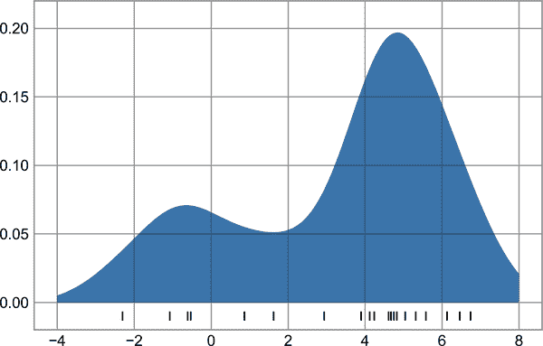

# 第三十三章：自定义刻度

Matplotlib 的默认刻度定位器和格式化程序通常在许多常见情况下是足够的，但并不是每种图表类型都是最佳选择。本章将给出几个示例，调整特定图表类型的刻度位置和格式化。

然而，在我们进入示例之前，让我们再多谈一些 Matplotlib 图表的对象层次结构。Matplotlib 的目标是让每个出现在图表上的东西都有一个 Python 对象来表示：例如，回想一下`Figure`是包围所有图表元素的边界框。每个 Matplotlib 对象也可以作为子对象的容器：例如，每个`Figure`可以包含一个或多个`Axes`对象，每个`Axes`对象又包含表示图表内容的其他对象。

刻度标记也不例外。每个轴都有属性`xaxis`和`yaxis`，这些属性又包含组成轴的线条、刻度和标签的所有属性。

# 主要和次要刻度

在每个轴上，有一个*主要*刻度和一个*次要*刻度的概念。顾名思义，主要刻度通常较大或更显著，而次要刻度通常较小。默认情况下，Matplotlib 很少使用次要刻度，但你可以在对数图中看到它们的一种情况（见图 33-1）。

```py
In [1]: import matplotlib.pyplot as plt
        plt.style.use('classic')
        import numpy as np

        %matplotlib inline
```

```py
In [2]: ax = plt.axes(xscale='log', yscale='log')
        ax.set(xlim=(1, 1E3), ylim=(1, 1E3))
        ax.grid(True);
```


###### 图 33-1\. 对数刻度和标签的示例

在这张图表中，每个主要刻度显示一个大的刻度标记、标签和网格线，而每个次要刻度显示一个更小的刻度标记，没有标签或网格线。

这些刻度属性——即位置和标签——可以通过设置每个轴的`formatter`和`locator`对象来自定义。让我们来看看刚刚显示的图表的 x 轴：

```py
In [3]: print(ax.xaxis.get_major_locator())
        print(ax.xaxis.get_minor_locator())
Out[3]: <matplotlib.ticker.LogLocator object at 0x1129b9370>
        <matplotlib.ticker.LogLocator object at 0x1129aaf70>
```

```py
In [4]: print(ax.xaxis.get_major_formatter())
        print(ax.xaxis.get_minor_formatter())
Out[4]: <matplotlib.ticker.LogFormatterSciNotation object at 0x1129aaa00>
        <matplotlib.ticker.LogFormatterSciNotation object at 0x1129aac10>
```

我们看到主要和次要刻度标签的位置都由`LogLocator`指定（这对于对数图是有意义的）。然而，次要刻度的标签由`NullFormatter`格式化：这表示不会显示任何标签。

现在我们来看几个例子，设置这些定位器和格式化程序用于不同的图表。

# 隐藏刻度或标签

或许最常见的刻度/标签格式化操作是隐藏刻度或标签。可以使用`plt.NullLocator`和`plt.NullFormatter`来完成，如此处所示（见图 33-2）。

```py
In [5]: ax = plt.axes()
        rng = np.random.default_rng(1701)
        ax.plot(rng.random(50))
        ax.grid()

        ax.yaxis.set_major_locator(plt.NullLocator())
        ax.xaxis.set_major_formatter(plt.NullFormatter())
```


###### 图 33-2\. 隐藏刻度标签（x 轴）和隐藏刻度（y 轴）的图表

我们已删除了 x 轴的标签（但保留了刻度/网格线），并从 y 轴删除了刻度（因此也删除了标签和网格线）。在许多情况下没有刻度可能很有用，例如当您想展示一组图像网格时。例如，考虑包含不同人脸图像的 图 33-3，这是监督机器学习问题中经常使用的示例（例如，参见 第 43 章）：

```py
In [6]: fig, ax = plt.subplots(5, 5, figsize=(5, 5))
        fig.subplots_adjust(hspace=0, wspace=0)

        # Get some face data from Scikit-Learn
        from sklearn.datasets import fetch_olivetti_faces
        faces = fetch_olivetti_faces().images

        for i in range(5):
            for j in range(5):
                ax[i, j].xaxis.set_major_locator(plt.NullLocator())
                ax[i, j].yaxis.set_major_locator(plt.NullLocator())
                ax[i, j].imshow(faces[10 * i + j], cmap='binary_r')
```


###### 图 33-3\. 在图像绘制中隐藏刻度

每个图像显示在自己的轴上，并且我们将刻度定位器设置为 null，因为刻度值（在这种情况下是像素数）不传达有关此特定可视化的相关信息。

# 减少或增加刻度的数量

默认设置的一个常见问题是较小的子图可能会有拥挤的标签。我们可以在这里显示的图网格中看到这一点（见图 33-4）。

```py
In [7]: fig, ax = plt.subplots(4, 4, sharex=True, sharey=True)
```


###### 图 33-4\. 具有拥挤刻度的默认图

特别是对于 x 轴的刻度，数字几乎重叠在一起，使它们很难辨认。调整的一种方法是使用 `plt.MaxNLocator`，它允许我们指定将显示的最大刻度数。在给定这个最大数目后，Matplotlib 将使用内部逻辑选择特定的刻度位置（见图 33-5）。

```py
In [8]: # For every axis, set the x and y major locator
        for axi in ax.flat:
            axi.xaxis.set_major_locator(plt.MaxNLocator(3))
            axi.yaxis.set_major_locator(plt.MaxNLocator(3))
        fig
```


###### 图 33-5\. 自定义刻度数目

这样做会使事情更加清晰。如果您希望更加精确地控制定期间隔刻度的位置，还可以使用 `plt.MultipleLocator`，我们将在以下部分讨论。

# 特别的刻度格式

Matplotlib 的默认刻度格式可能不尽如人意：它作为一个广泛的默认选项效果不错，但有时你可能想做些不同的事情。考虑这个正弦和余弦曲线的图（见图 33-6）。

```py
In [9]: # Plot a sine and cosine curve
        fig, ax = plt.subplots()
        x = np.linspace(0, 3 * np.pi, 1000)
        ax.plot(x, np.sin(x), lw=3, label='Sine')
        ax.plot(x, np.cos(x), lw=3, label='Cosine')

        # Set up grid, legend, and limits
        ax.grid(True)
        ax.legend(frameon=False)
        ax.axis('equal')
        ax.set_xlim(0, 3 * np.pi);
```



###### 图 33-6\. 具有整数刻度的默认图

###### 注意

全彩色图像在 [GitHub 的补充材料](https://oreil.ly/PDSH_GitHub) 上可用。

这里可能有一些我们想做的改变。首先，对于这些数据来说，在 π 的倍数间隔刻度和网格线更自然。我们可以通过设置 `MultipleLocator` 来实现这一点，它将刻度定位在我们提供的数字的倍数上。为了保险起见，我们将添加 π/2 和 π/4 的主要和次要刻度（见图 33-7）。

```py
In [10]: ax.xaxis.set_major_locator(plt.MultipleLocator(np.pi / 2))
         ax.xaxis.set_minor_locator(plt.MultipleLocator(np.pi / 4))
         fig
```


###### 图 33-7\. π/2 和 π/4 的倍数处的刻度

但现在这些刻度标签看起来有点傻：我们可以看到它们是<math alttext="pi"><mi>π</mi></math>的倍数，但小数表示并不能立即传达这一点。为了解决这个问题，我们可以改变刻度的格式化方式。我们想要做的没有内置的格式化程序，所以我们将使用`plt.FuncFormatter`，它接受一个用户定义的函数，可以对刻度输出进行细粒度的控制（见图 33-8）。

```py
In [11]: def format_func(value, tick_number):
             # find number of multiples of pi/2
             N = int(np.round(2 * value / np.pi))
             if N == 0:
                 return "0"
             elif N == 1:
                 return r"$\pi/2$"
             elif N == 2:
                 return r"$\pi$"
             elif N % 2 > 0:
                 return rf"${N}\pi/2$"
             else:
                 return rf"${N // 2}\pi$"

         ax.xaxis.set_major_formatter(plt.FuncFormatter(format_func))
         fig
```

这好多了！请注意，我们已经利用了 Matplotlib 的 LaTeX 支持，通过在字符串中加入美元符号来指定。这对于显示数学符号和公式非常方便：在这种情况下，`"$\pi$"`被渲染为希腊字母<math alttext="pi"><mi>π</mi></math> 。


###### 图 33-8\. 自定义标签的刻度

# 概述格式化程序和定位器

我们已经看到了一些可用的格式化程序和定位器；我将通过列出所有内置定位器选项（表 33-1）和格式化程序选项（表 33-2）来结束本章。有关更多信息，请参阅 docstrings 或 Matplotlib 文档。以下每个都在`plt`命名空间中可用。

表 33-1\. Matplotlib 定位器选项

| 定位器类 | 描述 |
| --- | --- |
| `NullLocator` | 没有刻度 |
| `FixedLocator` | 刻度位置固定 |
| `IndexLocator` | 用于索引图的定位器（例如，当`x = range(len(y)))`时 |
| `LinearLocator` | 从最小到最大均匀间隔的刻度 |
| `LogLocator` | 对数间隔的刻度，从最小到最大 |
| `MultipleLocator` | 刻度和范围是基数的倍数 |
| `MaxNLocator` | 在良好位置找到最大数量的刻度 |
| `AutoLocator` | （默认）带有简单默认值的`MaxNLocator` |
| `AutoMinorLocator` | 次要刻度的定位器 |

表 33-2\. Matplotlib 格式化程序选项

| 格式化程序类 | 描述 |
| --- | --- |
| `NullFormatter` | 刻度上没有标签 |
| `IndexFormatter` | 从标签列表中设置字符串 |
| `FixedFormatter` | 手动设置标签的字符串 |
| `FuncFormatter` | 用户定义的函数设置标签 |
| `FormatStrFormatter` | 使用每个值的格式字符串 |
| `ScalarFormatter` | 标量值的默认格式化程序 |
| `LogFormatter` | 对数轴的默认格式化程序 |

我们将在本书的其余部分看到更多这些示例。
