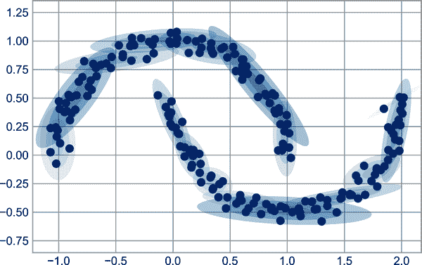

# 第三十四章：自定义 Matplotlib：配置和样式表

虽然前面章节涵盖的许多主题都涉及逐个调整绘图元素的样式，但 Matplotlib 也提供了机制来一次性调整图表的整体样式。在本章中，我们将介绍一些 Matplotlib 的运行时配置（*rc*）选项，并查看包含一些漂亮的默认配置集的 *stylesheets* 功能。

# 手动绘图定制

在本书的这一部分中，你已经看到如何调整单个绘图设置，使其看起来比默认设置更好看一些。也可以为每个单独的图进行这些自定义。例如，这里是一个相当沉闷的默认直方图，如图 34-1 所示。

```py
In [1]: import matplotlib.pyplot as plt
        plt.style.use('classic')
        import numpy as np

        %matplotlib inline
```

```py
In [2]: x = np.random.randn(1000)
        plt.hist(x);
```


###### 图 34-1\. Matplotlib 默认样式下的直方图

我们可以手动调整它，使其成为一个视觉上更加愉悦的图，如你可以在图 34-2 中看到的那样。

```py
In [3]: # use a gray background
        fig = plt.figure(facecolor='white')
        ax = plt.axes(facecolor='#E6E6E6')
        ax.set_axisbelow(True)

        # draw solid white gridlines
        plt.grid(color='w', linestyle='solid')

        # hide axis spines
        for spine in ax.spines.values():
            spine.set_visible(False)

        # hide top and right ticks
        ax.xaxis.tick_bottom()
        ax.yaxis.tick_left()

        # lighten ticks and labels
        ax.tick_params(colors='gray', direction='out')
        for tick in ax.get_xticklabels():
            tick.set_color('gray')
        for tick in ax.get_yticklabels():
            tick.set_color('gray')

        # control face and edge color of histogram
        ax.hist(x, edgecolor='#E6E6E6', color='#EE6666');
```


###### 图 34-2\. 带有手动自定义的直方图

这看起来更好，你可能会认出其灵感来自 R 语言的 `ggplot` 可视化包。但这需要大量的工作！我们绝对不希望每次创建图表时都进行这些调整。幸运的是，有一种方法可以一次性调整这些默认设置，适用于所有图表。

# 更改默认设置：rcParams

每次 Matplotlib 加载时，它定义一个运行时配置，包含您创建的每个绘图元素的默认样式。可以随时使用 `plt.rc` 方便函数调整此配置。让我们看看如何修改 rc 参数，以便我们的默认图表看起来与之前类似。

我们可以使用 `plt.rc` 函数来更改其中一些设置：

```py
In [4]: from matplotlib import cycler
        colors = cycler('color',
                        ['#EE6666', '#3388BB', '#9988DD',
                         '#EECC55', '#88BB44', '#FFBBBB'])
        plt.rc('figure', facecolor='white')
        plt.rc('axes', facecolor='#E6E6E6', edgecolor='none',
               axisbelow=True, grid=True, prop_cycle=colors)
        plt.rc('grid', color='w', linestyle='solid')
        plt.rc('xtick', direction='out', color='gray')
        plt.rc('ytick', direction='out', color='gray')
        plt.rc('patch', edgecolor='#E6E6E6')
        plt.rc('lines', linewidth=2)
```

有了这些设置定义，现在我们可以创建一个图表，并看到我们的设置如何生效（参见图 34-3）。

```py
In [5]: plt.hist(x);
```


###### 图 34-3\. 使用 rc 设置的自定义直方图

让我们看看使用这些 rc 参数的简单线图的外观（参见图 34-4）。

```py
In [6]: for i in range(4):
            plt.plot(np.random.rand(10))
```


###### 图 34-4\. 具有自定义样式的线图

对于在屏幕上查看而不是打印的图表，我发现这比默认样式更具美感。如果你对我的审美感觉不同，好消息是你可以调整 rc 参数以适应自己的喜好！可选地，这些设置可以保存在 *.matplotlibrc* 文件中，你可以在 [Matplotlib 文档](https://oreil.ly/UwM2u) 中了解更多。

# 样式表

调整整体图表样式的较新机制是通过 Matplotlib 的 `style` 模块，其中包括一些默认样式表，以及创建和打包自己的样式的功能。这些样式表的格式类似于之前提到的 *.matplotlibrc* 文件，但必须以 *.mplstyle* 扩展名命名。

即使您不打算创建自己的样式，您可能会在内置样式表中找到所需的内容。`plt.style.available` 包含可用样式的列表——为简洁起见，这里我只列出前五个：

```py
In [7]: plt.style.available[:5]
Out[7]: ['Solarize_Light2', '_classic_test_patch', 'bmh', 'classic',
        >'dark_background']
```

切换样式表的标准方法是调用 `style.use`：

```py
plt.style.use('*`stylename`*')

```

但请记住，这将改变 Python 会话的剩余部分的样式！或者，您可以使用样式上下文管理器，临时设置样式：

```py
with plt.style.context('*`stylename`*'):
    make_a_plot()

```

为了演示这些样式，让我们创建一个函数，用于制作两种基本类型的图表：

```py
In [8]: def hist_and_lines():
            np.random.seed(0)
            fig, ax = plt.subplots(1, 2, figsize=(11, 4))
            ax[0].hist(np.random.randn(1000))
            for i in range(3):
                ax[1].plot(np.random.rand(10))
            ax[1].legend(['a', 'b', 'c'], loc='lower left')
```

我们将使用这些样式来探索使用各种内置样式的图表外观。

###### 注意

全彩色图像可在 [GitHub 上的补充材料](https://oreil.ly/PDSH_GitHub) 中找到。

## 默认风格

Matplotlib 的 `default` 风格在 2.0 版本中有更新；我们先来看看这个（见 Figure 34-5）。

```py
In [9]: with plt.style.context('default'):
            hist_and_lines()
```


###### Figure 34-5\. Matplotlib 的 `default` 风格

## **FiveThiryEight 风格**

`fivethirtyeight` 风格模仿了流行的 [FiveThirtyEight 网站](https://fivethirtyeight.com) 上的图形。正如您在 Figure 34-6 中看到的那样，它以鲜明的颜色、粗线条和透明的坐标轴为特征：

```py
In [10]: with plt.style.context('fivethirtyeight'):
             hist_and_lines()
```


###### Figure 34-6\. `fivethirtyeight` 风格

## ggplot 风格

R 语言中的 `ggplot` 包是数据科学家中流行的可视化工具。Matplotlib 的 `ggplot` 风格模仿了该包的默认样式（见 Figure 34-7）。

```py
In [11]: with plt.style.context('ggplot'):
             hist_and_lines()
```


###### Figure 34-7\. `ggplot` 风格

## 贝叶斯方法为黑客风格

有一本名为 [*Probabilistic Programming and Bayesian Methods for Hackers*](https://oreil.ly/9JIb7) 的简短在线书籍，由 Cameron Davidson-Pilon 撰写，其中使用 Matplotlib 创建的图表，并使用一组漂亮的 rc 参数创建了一致且视觉上吸引人的风格。这种风格在 `bmh` 样式表中得以再现（见 Figure 34-8）。

```py
In [12]: with plt.style.context('bmh'):
             hist_and_lines()
```


###### Figure 34-8\. `bmh` 风格

## **Dark Background 风格**

对于在演示中使用的图像，与其使用浅色背景，不如使用深色背景更为有用。`dark_background` 风格提供了这种选择（见 Figure 34-9）。

```py
In [13]: with plt.style.context('dark_background'):
             hist_and_lines()
```


###### Figure 34-9\. `dark_background` 风格

## 灰度风格

你可能会发现自己正在为不接受彩色图的印刷出版物准备图表。对此，`grayscale` 风格（见图 34-10）可能会很有用。

```py
In [14]: with plt.style.context('grayscale'):
             hist_and_lines()
```



###### 图 34-10\. `grayscale` 风格

## Seaborn 风格

Matplotlib 也有几种受 Seaborn 库启发的样式表（详见第三十六章）。我发现这些设置非常不错，通常将它们作为自己数据探索的默认设置（见图 34-11）。

```py
In [15]: with plt.style.context('seaborn-whitegrid'):
             hist_and_lines()
```


###### 图 34-11\. `seaborn` 绘图风格

请花些时间探索内置选项，并找到一个适合你的风格！在本书中，当创建图表时，我通常会使用其中一种或多种风格约定。
