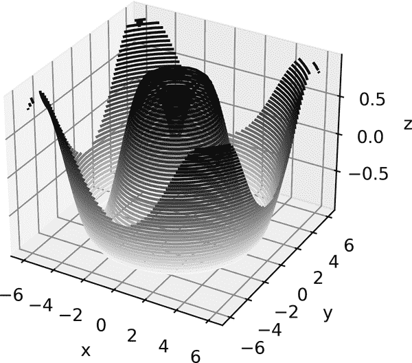
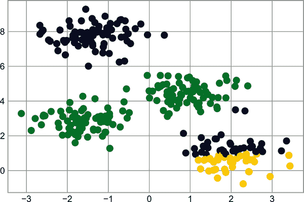
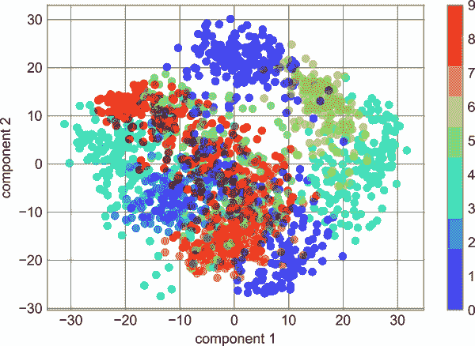

# 第三十五章：Matplotlib 中的三维绘图

Matplotlib 最初仅设计用于二维绘图。在 1.0 版本发布时，一些三维绘图工具建立在 Matplotlib 的二维显示之上，结果是一组便利的（虽然有些受限）用于三维数据可视化的工具。通过导入`mplot3d`工具包，可以启用三维绘图，这个工具包已经包含在主 Matplotlib 安装中：

```py
In [1]: from mpl_toolkits import mplot3d
```

导入此子模块后，可以通过向任何常规坐标轴创建函数传递关键字`projection='3d'`来创建三维坐标轴，如下所示（见 Figure 35-1）。

```py
In [2]: %matplotlib inline
        import numpy as np
        import matplotlib.pyplot as plt
```

```py
In [3]: fig = plt.figure()
        ax = plt.axes(projection='3d')
```

有了这个三维坐标轴，我们现在可以绘制各种三维图类型。三维绘图是从交互式视图中查看图形而不是静态图像中受益良多的功能之一；请记住，在运行此代码时，要使用交互式图形，可以使用`%matplotlib notebook`而不是`%matplotlib inline`。


###### Figure 35-1\. 一个空的三维坐标轴

# 三维点和线

最基本的三维图是由一组(x, y, z)三元组创建的线条或散点图集合。类比之前讨论的常见二维图，可以使用`ax.plot3D`和`ax.scatter3D`函数创建这些图。这些函数的调用签名几乎与它们的二维对应物完全相同，因此您可以参考第二十六章和第二十七章以获取有关控制输出的更多信息。在这里，我们将绘制一个三角螺旋线，以及一些随机绘制在该线附近的点（见 Figure 35-2）。

```py
In [4]: ax = plt.axes(projection='3d')

        # Data for a three-dimensional line
        zline = np.linspace(0, 15, 1000)
        xline = np.sin(zline)
        yline = np.cos(zline)
        ax.plot3D(xline, yline, zline, 'gray')

        # Data for three-dimensional scattered points
        zdata = 15 * np.random.random(100)
        xdata = np.sin(zdata) + 0.1 * np.random.randn(100)
        ydata = np.cos(zdata) + 0.1 * np.random.randn(100)
        ax.scatter3D(xdata, ydata, zdata, c=zdata, cmap='Greens');
```


###### Figure 35-2\. 三维中的点和线

请注意，散点的透明度已经调整，以便在页面上给人一种深度感。虽然在静态图像中有时难以看到三维效果，但交互式视图可以让您对点的布局有更好的直觉。

# 三维等高线图

类似于我们在 Chapter 28 中探讨的等高线图，`mplot3d`包含使用相同输入创建三维浮雕图的工具。与`ax.contour`类似，`ax.contour3D`要求所有输入数据都以二维规则网格的形式提供，*z*数据在每个点进行评估。在这里，我们将展示一个三维正弦函数的等高线图（见 Figure 35-3）。

```py
In [5]: def f(x, y):
            return np.sin(np.sqrt(x ** 2 + y ** 2))

        x = np.linspace(-6, 6, 30)
        y = np.linspace(-6, 6, 30)

        X, Y = np.meshgrid(x, y)
        Z = f(X, Y)
```

```py
In [6]: fig = plt.figure()
        ax = plt.axes(projection='3d')
        ax.contour3D(X, Y, Z, 40, cmap='binary')
        ax.set_xlabel('x')
        ax.set_ylabel('y')
        ax.set_zlabel('z');
```



###### Figure 35-3\. 一个三维等高线图

有时默认的视角不是最佳的，这时我们可以使用`view_init`方法来设置仰角和方位角。在下面的例子中，可视化效果见图 35-4，我们将使用仰角 60 度（即相对于 x-y 平面上方 60 度）和方位角 35 度（即相对于 z 轴逆时针旋转 35 度）：

```py
In [7]: ax.view_init(60, 35)
        fig
```

同样地，请注意，当使用 Matplotlib 的交互式后端时，可以通过点击和拖动来实现这种类型的旋转。


###### 图 35-4\. 调整三维绘图的视角角度

# 线框和表面绘图

另外两种适用于网格数据的三维绘图类型是线框图和表面绘图。它们接受值网格并将其投影到指定的三维表面上，可以使得最终的三维形态非常易于可视化。这里有一个使用线框的例子（见图 35-5）。

```py
In [8]: fig = plt.figure()
        ax = plt.axes(projection='3d')
        ax.plot_wireframe(X, Y, Z)
        ax.set_title('wireframe');
```


###### 图 35-5\. 一个线框图

表面绘图类似于线框图，但线框的每个面都是填充多边形。为填充的多边形添加颜色映射可以帮助感知所可视化表面的拓扑结构，正如您在图 35-6 中看到的那样。

```py
In [9]: ax = plt.axes(projection='3d')
        ax.plot_surface(X, Y, Z, rstride=1, cstride=1,
                        cmap='viridis', edgecolor='none')
        ax.set_title('surface');
```



###### 图 35-6\. 一个三维表面绘图

尽管表面绘图的值网格需要是二维的，但不一定是矩形的。这里有一个创建部分极坐标网格的例子，当与`surface3D`绘图结合使用时，可以为我们提供所可视化函数的一个切片（见图 35-7）。

```py
In [10]: r = np.linspace(0, 6, 20)
         theta = np.linspace(-0.9 * np.pi, 0.8 * np.pi, 40)
         r, theta = np.meshgrid(r, theta)

         X = r * np.sin(theta)
         Y = r * np.cos(theta)
         Z = f(X, Y)

         ax = plt.axes(projection='3d')
         ax.plot_surface(X, Y, Z, rstride=1, cstride=1,
                         cmap='viridis', edgecolor='none');
```


###### 图 35-7\. 一个极坐标表面绘图

# 表面三角剖分

对于某些应用程序，前述例程需要均匀采样的网格太过限制。在这些情况下，基于三角剖分的绘图就很有用了。如果我们不是从笛卡尔或极坐标网格中均匀绘制，而是有一组随机绘制呢？

```py
In [11]: theta = 2 * np.pi * np.random.random(1000)
         r = 6 * np.random.random(1000)
         x = np.ravel(r * np.sin(theta))
         y = np.ravel(r * np.cos(theta))
         z = f(x, y)
```

我们可以创建一个散点图来了解我们正在抽样的表面，如图 35-8 所示。

```py
In [12]: ax = plt.axes(projection='3d')
         ax.scatter(x, y, z, c=z, cmap='viridis', linewidth=0.5);
```



###### 图 35-8\. 一个三维采样表面

这个点云留下了许多问题。在这种情况下帮助我们的函数是`ax.plot_trisurf`，它通过首先在相邻点之间找到一组三角形来创建表面（请记住这里的`x`、`y`和`z`是一维数组）；结果如图 35-9 所示（见图 35-9）：

```py
In [13]: ax = plt.axes(projection='3d')
         ax.plot_trisurf(x, y, z,
                         cmap='viridis', edgecolor='none');
```

结果当然不像使用网格绘制时那么干净，但这种三角剖分的灵活性允许一些非常有趣的三维绘图。例如，实际上可以使用这种方法绘制一个三维莫比乌斯带，我们接下来会看到。


###### 第 35-9 图。一个三角形表面绘图

# 示例：可视化莫比乌斯带

一个莫比乌斯带类似于一条纸条在环上粘贴成一个半扭曲的带子，结果是一个只有一个面的对象！在这里，我们将使用 Matplotlib 的三维工具可视化这样的对象。创建莫比乌斯带的关键是考虑它的参数化：它是一个二维带子，所以我们需要两个内在维度。让我们称之为 <math alttext="theta"><mi>θ</mi></math>，它在环周围从 0 到 <math alttext="2 pi"><mrow><mn>2</mn> <mi>π</mi></mrow></math>，以及 <math alttext="w"><mi>w</mi></math>，它在带子宽度上从 -1 到 1：

```py
In [14]: theta = np.linspace(0, 2 * np.pi, 30)
         w = np.linspace(-0.25, 0.25, 8)
         w, theta = np.meshgrid(w, theta)
```

现在从这个参数化中，我们必须确定嵌入带的 (*x*, *y*, *z*) 位置。

思考一下，我们可能会意识到有两个旋转正在发生：一个是环绕其中心的位置旋转（我们称之为 <math alttext="theta"><mi>θ</mi></math>），而另一个是带子围绕其轴线的扭曲（我们将其称为 <math alttext="phi"><mi>φ</mi></math>）。对于一个莫比乌斯带，我们必须使带子在完整环的过程中进行半扭曲，即 <math alttext="normal upper Delta phi equals normal upper Delta theta slash 2"><mrow><mi>Δ</mi> <mi>φ</mi> <mo>=</mo> <mi>Δ</mi> <mi>θ</mi> <mo>/</mo> <mn>2</mn></mrow></math>：

```py
In [15]: phi = 0.5 * theta
```

现在我们利用我们对三角函数的记忆来推导三维嵌入。我们定义 <math alttext="r"><mi>r</mi></math>，每个点到中心的距离，并使用它来找到嵌入的 <math alttext="left-parenthesis x comma y comma z right-parenthesis"><mrow><mo>(</mo> <mi>x</mi> <mo>,</mo> <mi>y</mi> <mo>,</mo> <mi>z</mi> <mo>)</mo></mrow></math> 坐标：

```py
In [16]: # radius in x-y plane
         r = 1 + w * np.cos(phi)

         x = np.ravel(r * np.cos(theta))
         y = np.ravel(r * np.sin(theta))
         z = np.ravel(w * np.sin(phi))
```

最后，为了绘制这个对象，我们必须确保三角剖分是正确的。最好的方法是在基本参数化内定义三角剖分，然后让 Matplotlib 将这个三角剖分投影到莫比乌斯带的三维空间中。可以通过以下方式实现这一点（见 第 35-10 图）。

```py
In [17]: # triangulate in the underlying parametrization
         from matplotlib.tri import Triangulation
         tri = Triangulation(np.ravel(w), np.ravel(theta))

         ax = plt.axes(projection='3d')
         ax.plot_trisurf(x, y, z, triangles=tri.triangles,
                         cmap='Greys', linewidths=0.2);

         ax.set_xlim(-1, 1); ax.set_ylim(-1, 1); ax.set_zlim(-1, 1)
         ax.axis('off');
```


###### 第 35-10 图。可视化莫比乌斯带

结合所有这些技术，可以在 Matplotlib 中创建和显示各种三维对象和图案。
