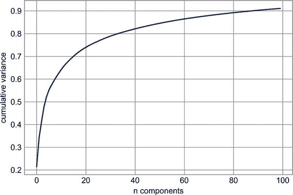
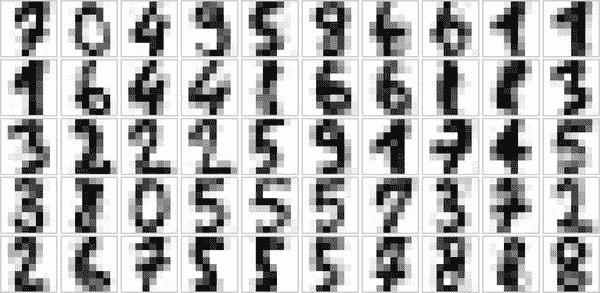

# 第三十六章：可视化与 Seaborn

Matplotlib 已经是 Python 科学可视化的核心工具数十年了，但即使是忠实的用户也会承认它经常留下很多不足之处。关于 Matplotlib 经常提到的几个抱怨有：

+   一个常见的早期抱怨，现在已经过时：在 2.0 版本之前，Matplotlib 的颜色和样式默认值有时很差，并显得过时。

+   Matplotlib 的 API 相对较低级。虽然可以进行复杂的统计可视化，但通常需要大量的样板代码。

+   Matplotlib 比 Pandas 早十多年，因此不设计用于与 Pandas 的`DataFrame`对象一起使用。为了可视化`DataFrame`中的数据，必须提取每个`Series`并经常将它们连接成正确的格式。更好的是有一个可以智能使用`DataFrame`标签进行绘图的绘图库。

解决这些问题的一个答案是[Seaborn](http://seaborn.pydata.org)。Seaborn 在 Matplotlib 之上提供了一个 API，提供了合理的绘图样式和颜色默认设置，定义了常见统计绘图类型的简单高级函数，并与 Pandas 提供的功能集成。

公平地说，Matplotlib 团队已经适应了不断变化的环境：它添加了在第三十四章讨论的`plt.style`工具，并且 Matplotlib 开始更无缝地处理 Pandas 数据。但基于刚讨论的所有原因，Seaborn 仍然是一个有用的附加组件。

按照惯例，Seaborn 通常被导入为`sns`：

```py
In [1]: %matplotlib inline
        import matplotlib.pyplot as plt
        import seaborn as sns
        import numpy as np
        import pandas as pd

        sns.set()  # seaborn's method to set its chart style
```

###### 注意

全彩色图像可以在[GitHub 上的补充材料](https://oreil.ly/PDSH_GitHub)中找到。

# 探索 Seaborn 绘图

Seaborn 的主要思想是提供高级命令来创建各种对统计数据探索有用的绘图类型，甚至一些统计模型拟合。

让我们看看 Seaborn 中提供的几个数据集和绘图类型。请注意，所有以下内容*都可以*使用原始的 Matplotlib 命令完成（实际上，Seaborn 在幕后确实这样做），但 Seaborn 的 API 更加方便。

## 直方图，KDE 和密度

在统计数据可视化中，您通常只想绘制变量的直方图和联合分布。我们已经看到在 Matplotlib 中这相对比较简单（见图 36-1）。

```py
In [2]: data = np.random.multivariate_normal([0, 0], [[5, 2], [2, 2]], size=2000)
        data = pd.DataFrame(data, columns=['x', 'y'])

        for col in 'xy':
            plt.hist(data[col], density=True, alpha=0.5)
```


###### 图 36-1 直方图可视化分布

不仅仅是提供直方图作为可视化输出，我们还可以使用核密度估计获得分布的平滑估计（在第二十八章介绍），Seaborn 通过`sns.kdeplot`来实现（参见图 36-2）。

```py
In [3]: sns.kdeplot(data=data, shade=True);
```


###### 图 36-2 核密度估计可视化分布

如果我们将`x`和`y`列传递给`kdeplot`，我们将得到一个二维可视化的联合密度（见图 36-3）。

```py
In [4]: sns.kdeplot(data=data, x='x', y='y');
```


###### 图 36-3\. 一个二维核密度图

我们可以使用`sns.jointplot`一起查看联合分布和边缘分布，稍后在本章中我们将进一步探讨。

## 对角线图

当你将联合图推广到更大维度的数据集时，最终会得到*对角线图*。当您希望将所有值的所有对组合在一起时，这对于探索多维数据之间的相关性非常有用。

我们将使用众所周知的鸢尾花数据集演示这一点，该数据集列出了三种鸢尾花物种的花瓣和萼片的测量值：

```py
In [5]: iris = sns.load_dataset("iris")
        iris.head()
Out[5]:    sepal_length  sepal_width  petal_length  petal_width species
        0           5.1          3.5           1.4          0.2  setosa
        1           4.9          3.0           1.4          0.2  setosa
        2           4.7          3.2           1.3          0.2  setosa
        3           4.6          3.1           1.5          0.2  setosa
        4           5.0          3.6           1.4          0.2  setosa
```

将样本之间的多维关系可视化就像调用`sns.pairplot`一样简单（见图 36-4）。

```py
In [6]: sns.pairplot(iris, hue='species', height=2.5);
```


###### 图 36-4\. 显示四个变量之间关系的对角线图

## 分面直方图

有时查看数据的最佳方式是通过子集的直方图，如图 36-5 所示。Seaborn 的`FacetGrid`使得这变得简单。我们将查看一些数据，显示餐厅员工根据各种指标数据获得的小费金额：¹

```py
In [7]: tips = sns.load_dataset('tips')
        tips.head()
Out[7]:    total_bill   tip     sex smoker  day    time  size
        0       16.99  1.01  Female     No  Sun  Dinner     2
        1       10.34  1.66    Male     No  Sun  Dinner     3
        2       21.01  3.50    Male     No  Sun  Dinner     3
        3       23.68  3.31    Male     No  Sun  Dinner     2
        4       24.59  3.61  Female     No  Sun  Dinner     4
```

```py
In [8]: tips['tip_pct'] = 100 * tips['tip'] / tips['total_bill']

        grid = sns.FacetGrid(tips, row="sex", col="time", margin_titles=True)
        grid.map(plt.hist, "tip_pct", bins=np.linspace(0, 40, 15));
```


###### 图 36-5\. 一个分面直方图的示例

分面图为我们提供了一些关于数据集的快速见解：例如，我们看到它包含的关于晚餐时间男服务员的数据远远多于其他类别，并且典型的小费金额似乎在约 10%到 20%之间，两端都有一些异常值。

# 分类图

分类图也可以用于这种类型的可视化。这允许您查看由任何其他参数定义的箱中参数的分布，如图 36-6 所示。

```py
In [9]: with sns.axes_style(style='ticks'):
            g = sns.catplot(x="day", y="total_bill", hue="sex",
                            data=tips, kind="box")
            g.set_axis_labels("Day", "Total Bill");
```


###### 图 36-6\. 一个因子图的示例，比较给定各种离散因子的分布

## 联合分布

类似于我们之前看到的对角线图，我们可以使用`sns.jointplot`显示不同数据集之间的联合分布，以及相关的边缘分布（见图 36-7）。

```py
In [10]: with sns.axes_style('white'):
             sns.jointplot(x="total_bill", y="tip", data=tips, kind='hex')
```


###### 图 36-7\. 一个联合分布图

联合图甚至可以进行一些自动的核密度估计和回归，如图 36-8 所示。

```py
In [11]: sns.jointplot(x="total_bill", y="tip", data=tips, kind='reg');
```


###### 图 36-8\. 带有回归拟合的联合分布图

## 条形图

可以使用`sns.factorplot`来绘制时间序列。在下面的示例中，我们将使用我们在第二十章中首次看到的 Planets 数据集；参见图 36-9 的结果。

```py
In [12]: planets = sns.load_dataset('planets')
         planets.head()
Out[12]:             method  number  orbital_period   mass  distance  year
         0  Radial Velocity       1         269.300   7.10     77.40  2006
         1  Radial Velocity       1         874.774   2.21     56.95  2008
         2  Radial Velocity       1         763.000   2.60     19.84  2011
         3  Radial Velocity       1         326.030  19.40    110.62  2007
         4  Radial Velocity       1         516.220  10.50    119.47  2009
```

```py
In [13]: with sns.axes_style('white'):
             g = sns.catplot(x="year", data=planets, aspect=2,
                             kind="count", color='steelblue')
             g.set_xticklabels(step=5)
```


###### 图 36-9。柱状图作为因子图的特例

通过查看每个行星的发现*方法*，我们可以更多地了解这些行星（参见图 36-10）。

```py
In [14]: with sns.axes_style('white'):
             g = sns.catplot(x="year", data=planets, aspect=4.0, kind='count',
                             hue='method', order=range(2001, 2015))
             g.set_ylabels('Number of Planets Discovered')
```


###### 图 36-10。按年份和类型发现的行星数量

有关使用 Seaborn 绘图的更多信息，请参见[Seaborn 文档](https://oreil.ly/fCHxn)，特别是[示例画廊](https://oreil.ly/08xGE)。

# 示例：探索马拉松完成时间

在这里，我们将使用 Seaborn 来帮助可视化和理解马拉松的完成结果。² 我从网络上的来源爬取了数据，进行了汇总并删除了任何识别信息，并将其放在了 GitHub 上，可以下载。³

我们将从下载数据并加载到 Pandas 开始：

```py
In [15]: # url = ('https://raw.githubusercontent.com/jakevdp/'
         #        'marathon-data/master/marathon-data.csv')
         # !cd data && curl -O {url}
```

```py
In [16]: data = pd.read_csv('data/marathon-data.csv')
         data.head()
Out[16]:    age gender     split     final
         0   33      M  01:05:38  02:08:51
         1   32      M  01:06:26  02:09:28
         2   31      M  01:06:49  02:10:42
         3   38      M  01:06:16  02:13:45
         4   31      M  01:06:32  02:13:59
```

请注意，Pandas 将时间列加载为 Python 字符串（类型为`object`）；我们可以通过查看`DataFrame`的`dtypes`属性来看到这一点：

```py
In [17]: data.dtypes
Out[17]: age        int64
         gender    object
         split     object
         final     object
         dtype: object
```

让我们通过为时间提供一个转换器来修复这个问题。

```py
In [18]: import datetime

         def convert_time(s):
             h, m, s = map(int, s.split(':'))
             return datetime.timedelta(hours=h, minutes=m, seconds=s)

         data = pd.read_csv('data/marathon-data.csv',
                            converters={'split':convert_time, 'final':convert_time})
         data.head()
Out[18]:    age gender           split           final
         0   33      M 0 days 01:05:38 0 days 02:08:51
         1   32      M 0 days 01:06:26 0 days 02:09:28
         2   31      M 0 days 01:06:49 0 days 02:10:42
         3   38      M 0 days 01:06:16 0 days 02:13:45
         4   31      M 0 days 01:06:32 0 days 02:13:59
```

```py
In [19]: data.dtypes
Out[19]: age                 int64
         gender             object
         split     timedelta64[ns]
         final     timedelta64[ns]
         dtype: object
```

这将使时间数据更容易处理。为了我们的 Seaborn 绘图实用工具的目的，让我们接下来添加列，以秒为单位给出时间：

```py
In [20]: data['split_sec'] = data['split'].view(int) / 1E9
         data['final_sec'] = data['final'].view(int) / 1E9
         data.head()
Out[20]:    age gender           split           final  split_sec  final_sec
         0   33      M 0 days 01:05:38 0 days 02:08:51     3938.0     7731.0
         1   32      M 0 days 01:06:26 0 days 02:09:28     3986.0     7768.0
         2   31      M 0 days 01:06:49 0 days 02:10:42     4009.0     7842.0
         3   38      M 0 days 01:06:16 0 days 02:13:45     3976.0     8025.0
         4   31      M 0 days 01:06:32 0 days 02:13:59     3992.0     8039.0
```

为了了解数据的外观，我们可以在数据上绘制一个`jointplot`；图 36-11 显示了结果。

```py
In [21]: with sns.axes_style('white'):
             g = sns.jointplot(x='split_sec', y='final_sec', data=data, kind='hex')
             g.ax_joint.plot(np.linspace(4000, 16000),
                             np.linspace(8000, 32000), ':k')
```

虚线显示了如果某人以完全稳定的速度跑完马拉松，其时间会在哪里。分布高于此线表明（正如您所料），大多数人在马拉松比赛过程中放慢了速度。如果您曾经参加过竞争性比赛，您会知道那些在比赛的第二半段跑得更快的人被称为“负分裂”比赛。


###### 图 36-11。半马拉松第一半分裂与全马拉松完成时间之间的关系

让我们在数据中创建另一列，即分裂比例，用于衡量每位选手进行负分裂或正分裂比赛的程度。

```py
In [22]: data['split_frac'] = 1 - 2 * data['split_sec'] / data['final_sec']
         data.head()
Out[22]:    age gender           split           final  split_sec  final_sec  \
         0   33      M 0 days 01:05:38 0 days 02:08:51     3938.0     7731.0
         1   32      M 0 days 01:06:26 0 days 02:09:28     3986.0     7768.0
         2   31      M 0 days 01:06:49 0 days 02:10:42     4009.0     7842.0
         3   38      M 0 days 01:06:16 0 days 02:13:45     3976.0     8025.0
         4   31      M 0 days 01:06:32 0 days 02:13:59     3992.0     8039.0

            split_frac
         0   -0.018756
         1   -0.026262
         2   -0.022443
         3    0.009097
         4    0.006842
```

在这个分裂差小于零的地方，这个人通过这个比例进行了负分裂比赛。让我们做一个这个分裂比例的分布图（参见图 36-12）。

```py
In [23]: sns.displot(data['split_frac'], kde=False)
         plt.axvline(0, color="k", linestyle="--");
```



###### 图 36-12。分裂比例的分布；0.0 表示在相同时间内完成了第一半和第二半马拉松的跑步者

```py
In [24]: sum(data.split_frac < 0)
Out[24]: 251
```

在将近 40,000 名参与者中，只有 250 人实现了负分裂的马拉松。

让我们看看这种分裂比例与其他变量是否有任何相关性。我们将使用`PairGrid`来完成这个任务，它会绘制所有这些相关性的图表（见图 36-13）。

```py
In [25]: g = sns.PairGrid(data, vars=['age', 'split_sec', 'final_sec', 'split_frac'],
                          hue='gender', palette='RdBu_r')
         g.map(plt.scatter, alpha=0.8)
         g.add_legend();
```


###### 图 36-13\. 马拉松数据集内部量之间的关系

分裂比例看起来与年龄没有特别相关性，但与最终时间相关：跑得更快的人往往在马拉松中有更接近均匀分裂的趋势。让我们来看一下按性别分隔的分裂比例直方图，显示在图 36-14 中。

```py
In [26]: sns.kdeplot(data.split_frac[data.gender=='M'], label='men', shade=True)
         sns.kdeplot(data.split_frac[data.gender=='W'], label='women', shade=True)
         plt.xlabel('split_frac');
```


###### 图 36-14\. 按性别分布的分裂比例

这里有趣的是，有很多男性比女性更接近均匀分裂！在男性和女性中间几乎呈双峰分布。让我们看看是否可以通过年龄的函数来解析正在发生的事情。

比较分布的一个好方法是使用*小提琴图*，显示在图 36-15 中。

```py
In [27]: sns.violinplot(x="gender", y="split_frac", data=data,
                        palette=["lightblue", "lightpink"]);
```



###### 图 36-15\. 显示按性别分裂比例的小提琴图

让我们深入一点，将这些小提琴图作为年龄的函数进行比较（见图 36-16）。我们将从创建一个新的列开始，该列指定每个人所在的年龄范围，按十年计算：

```py
In [28]: data['age_dec'] = data.age.map(lambda age: 10 * (age // 10))
         data.head()
Out[28]:    age gender           split           final  split_sec  final_sec  \
         0   33      M 0 days 01:05:38 0 days 02:08:51     3938.0     7731.0
         1   32      M 0 days 01:06:26 0 days 02:09:28     3986.0     7768.0
         2   31      M 0 days 01:06:49 0 days 02:10:42     4009.0     7842.0
         3   38      M 0 days 01:06:16 0 days 02:13:45     3976.0     8025.0
         4   31      M 0 days 01:06:32 0 days 02:13:59     3992.0     8039.0

            split_frac  age_dec
         0   -0.018756       30
         1   -0.026262       30
         2   -0.022443       30
         3    0.009097       30
         4    0.006842       30
```

```py
In [29]: men = (data.gender == 'M')
         women = (data.gender == 'W')

         with sns.axes_style(style=None):
             sns.violinplot(x="age_dec", y="split_frac", hue="gender", data=data,
                            split=True, inner="quartile",
                            palette=["lightblue", "lightpink"]);
```


###### 图 36-16\. 显示按性别和年龄分裂比例的小提琴图

我们可以看到男性和女性之间分布的不同之处：20 到 50 岁男性的分裂分布向较低分裂过度密集，而与同龄的女性（或者任何年龄段的女性）相比如此。

同样令人惊讶的是，80 岁的女性似乎在分裂时间方面表现出色，尽管这可能是一个小数量效应，因为该范围内的参与者寥寥无几：

```py
In [30]: (data.age > 80).sum()
Out[30]: 7
```

回到有负分裂的男性：这些跑步者是谁？这种分裂比例是否与快速完成相关联？我们可以轻松地绘制这个图表。我们将使用`regplot`，它会自动适应数据的线性回归模型（见图 36-17）。

```py
In [31]: g = sns.lmplot(x='final_sec', y='split_frac', col='gender', data=data,
                        markers=".", scatter_kws=dict(color='c'))
         g.map(plt.axhline, y=0.0, color="k", ls=":");
```


###### 图 36-17\. 按性别比较分裂比例与完成时间

显然，无论是男性还是女性，分裂较快的人往往是在大约 15,000 秒内或约 4 小时内完成的更快的跑步者。比这慢的人很少有快速的第二分裂。

# 进一步的资源

一本书的一部分永远无法涵盖 Matplotlib 中所有可用的特性和绘图类型。与其他包一样，IPython 的 Tab 键补全和帮助功能（参见 第一章）在探索 Matplotlib 的 API 时非常有帮助。此外，Matplotlib 的 [在线文档](http://matplotlib.org) 是一个有用的参考。特别是查看 [Matplotlib 图库](https://oreil.ly/WNiHP)，展示了数百种不同的绘图样式缩略图，每个缩略图都链接到一个页面，展示了生成它的 Python 代码片段。这使你能够视觉检查和学习各种不同的绘图风格和可视化技术。

对于 Matplotlib 的书籍级处理，我推荐 *Interactive Applications Using Matplotlib*（Packt），作者是 Matplotlib 核心开发者 Ben Root。

# 其他 Python 可视化库

尽管 Matplotlib 是最显著的 Python 可视化库，但还有其他更现代的工具也值得探索。我将在这里简要提及其中一些：

+   [Bokeh](http://bokeh.pydata.org) 是一个 JavaScript 可视化库，具有 Python 前端，创建高度交互式的可视化，能够处理非常大和/或流式数据集。

+   [Plotly](http://plot.ly) 是 Plotly 公司的代表性开源产品，与 Bokeh 类似。它正在积极开发中，并提供各种交互式图表类型。

+   [HoloViews](https://holoviews.org) 是一个更为声明性的统一 API，用于在多种后端生成图表，包括 Bokeh 和 Matplotlib。

+   [Vega](https://vega.github.io) 和 [Vega-Lite](https://vega.github.io/vega-lite) 是声明性的图形表示，是多年数据可视化和交互研究的成果。参考渲染实现为 JavaScript，而 [Altair package](https://altair-viz.github.io) 提供了生成这些图表的 Python API。

Python 世界中的可视化景观在不断发展，我预计这份列表在本书出版时可能已经过时。此外，由于 Python 在许多领域中被广泛使用，你会发现许多为更具体用例构建的其他可视化工具。要跟踪所有这些工具可能有些困难，但了解这些广泛的可视化工具的好资源是 [PyViz](https://pyviz.org)，一个开放的、社区驱动的网站，包含许多不同可视化工具的教程和示例。

¹ 本节使用的餐厅员工数据将员工分为两性：女性和男性。生物性别并非二元的，但以下讨论和可视化受到此数据的限制。

² 本节中使用的马拉松数据将跑步者分为两个性别：男性和女性。虽然性别是一个光谱，但以下讨论和可视化使用这个二元性别，因为它们依赖于数据。

³ 如果您有兴趣使用 Python 进行网络抓取，我推荐由 O'Reilly 的 Ryan Mitchell 撰写的 [*Web Scraping with Python*](https://oreil.ly/e3Xdg)。
