# 第三十七章：什么是机器学习？

在我们深入了解几种机器学习方法的细节之前，让我们先来看看机器学习的定义及其非定义部分。机器学习通常被归类为人工智能的一个子领域，但我发现这种分类可能会产生误导。机器学习的研究确实起源于这一背景的研究，但在数据科学应用机器学习方法时，将机器学习视为一种*构建数据模型*的手段更为有帮助。

在这种情况下，“学习”进入战场时，我们为这些模型提供*可调参数*，这些参数可以根据观察到的数据进行调整；通过这种方式，程序可以被认为是从数据中“学习”。一旦这些模型适应于先前看到的数据，它们就可以用于预测和理解新观察到的数据的各个方面。关于这种基于数学模型的“学习”与人脑展现的“学习”在多大程度上相似，我将留给读者更多哲学的探讨。

理解机器学习中的问题设置对有效使用这些工具至关重要，因此我们将从这里讨论的一些方法类型的广泛分类开始。

###### 注

本章中所有图表均基于实际机器学习计算生成；其背后的代码可以在[在线附录](https://oreil.ly/o1Zya)中找到。

# 机器学习的分类

机器学习可以分为两种主要类型：监督学习和无监督学习。

*监督学习*涉及对数据的测量特征与与数据相关的一些标签之间关系的建模；确定了此模型后，它可以用于对新的未知数据应用标签。有时这进一步细分为分类任务和回归任务：在*分类*中，标签是离散类别，而在*回归*中，标签是连续数量。您将在以下部分看到这两种类型的监督学习的例子。

*无监督学习*涉及对数据集的特征进行建模，而不参考任何标签。这些模型包括诸如*聚类*和*降维*等任务。聚类算法识别数据的不同组，而降维算法寻找数据更简洁的表示。您也将在以下部分看到这两种类型的无监督学习的例子。

此外，还有所谓的*半监督学习*方法，介于监督学习和无监督学习之间。半监督学习方法在只有不完整标签可用时通常很有用。

# 机器学习应用的定性例子

为了使这些想法更具体，让我们来看一些非常简单的机器学习任务示例。这些示例旨在给出本书这部分将要讨论的机器学习任务类型的直观非量化概述。在后面的章节中，我们将更深入地讨论特定的模型以及它们的使用方式。如果想预览这些更技术性的方面，可以在在线[附录](https://oreil.ly/o1Zya)中找到生成这些图表的 Python 源代码。

## 分类：预测离散标签

首先，我们来看一个简单的分类任务，我们会获得一组带标签的点，并希望利用这些点来对一些未标记的点进行分类。

想象一下我们拥有的数据显示在图 37-1 中。这些数据是二维的：也就是说，每个点有两个*特征*，由点在平面上的(x,y)位置表示。此外，每个点有两个*类别标签*之一，这里由点的颜色表示。通过这些特征和标签，我们希望创建一个模型，让我们能够决定一个新点应该被标记为“蓝色”还是“红色”。

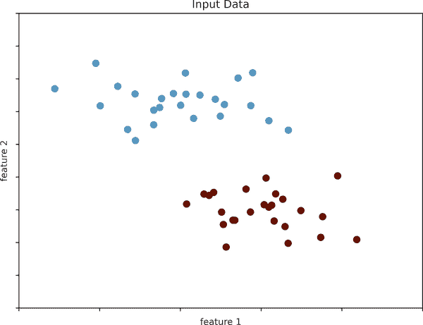

###### 图 37-1\. 用于分类的简单数据集

对于这样的分类任务，有许多可能的模型，但我们将从一个非常简单的模型开始。我们假设这两组数据可以通过在它们之间绘制一条直线来分开，这样，线的两边的点都属于同一组。这里的*模型*是声明“一条直线分隔类别”的定量版本，而*模型参数*则是描述该线在我们的数据中位置和方向的特定数值。这些模型参数的最佳值是从数据中学习得来的（这就是机器学习中的“学习”），通常称为*训练模型*。

图 37-2 展示了这个数据的训练模型的视觉表示。

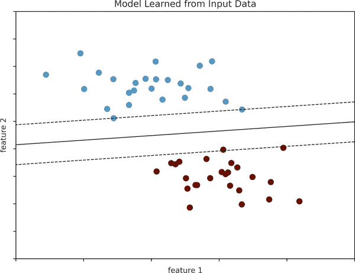

###### 图 37-2\. 一个简单的分类模型

现在这个模型已经被训练好了，它可以推广到新的未标记数据上。换句话说，我们可以拿到新的数据集，通过这条线进行划分，并根据这个模型为新点分配标签（参见图 37-3）。这个阶段通常被称为*预测*。

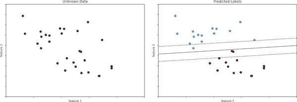

###### 图 37-3\. 将分类模型应用于新数据

这是机器学习分类任务的基本概念，其中“分类”表示数据具有离散的类标签。乍一看，这可能显得微不足道：很容易看到我们的数据并绘制这样的分界线来完成分类。然而，机器学习方法的好处在于它能够推广到更大的数据集和更多的维度。例如，这类似于电子邮件自动垃圾邮件检测的任务。在这种情况下，我们可能会使用以下特征和标签：

+   *特征 1*, *特征 2* 等 <math alttext="right-arrow"><mo>→</mo></math> 重要单词或短语的标准化计数（如“伟哥”，“延长保修”等）

+   *标签* <math alttext="right-arrow"><mo>→</mo></math> “垃圾邮件”或“非垃圾邮件”

对于训练集，这些标签可能是通过对一小部分代表性电子邮件的个别检查来确定的；对于其余的电子邮件，标签将使用模型确定。对于足够训练良好且特征构造良好的分类算法（通常有数千或数百万个单词或短语），这种方法非常有效。我们将在第四十一章中看到一个基于文本的分类的示例。

我们将详细讨论的一些重要分类算法包括高斯朴素贝叶斯（见第四十一章）、支持向量机（见第四十三章）和随机森林分类（见第四十四章）。

## 回归：预测连续标签

与分类算法的离散标签相比，我们接下来将看一个简单的回归任务，其中标签是连续的量。

考虑图 37-4 中显示的数据，其中包含一组具有连续标签的点。

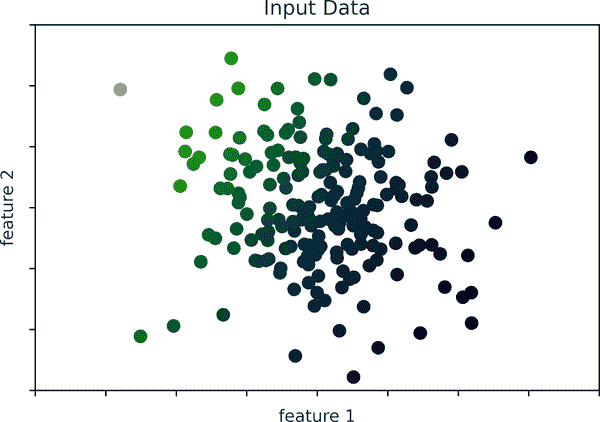

###### 图 37-4\. 用于回归的简单数据集

就像分类示例一样，我们有二维数据：也就是说，每个数据点有两个描述特征。每个点的颜色代表该点的连续标签。

我们可以使用多种可能的回归模型来处理这类数据，但在这里我们将使用简单的线性回归模型来预测这些点。这个简单的模型假设，如果我们将标签视为第三个空间维度，我们可以将一个平面拟合到数据中。这是对将两个坐标数据拟合一条直线这一已知问题的更高级的泛化。

我们可以将这种设置视觉化，如图 37-5 所示。

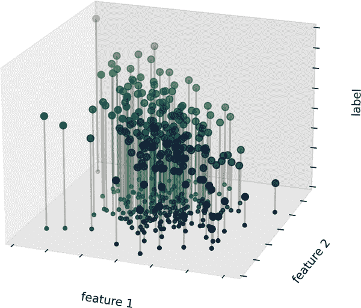

###### 图 37-5\. 回归数据的三维视图

注意，这里的 *特征 1–特征 2* 平面与 Figure 37-4 中的二维图是相同的；然而，在这种情况下，我们通过颜色和三维轴位置表示了标签。从这个视角看，通过这三维数据拟合平面来预测任何输入参数的预期标签似乎是合理的。回到二维投影，当我们拟合这样一个平面时，我们得到了 Figure 37-6 中显示的结果。

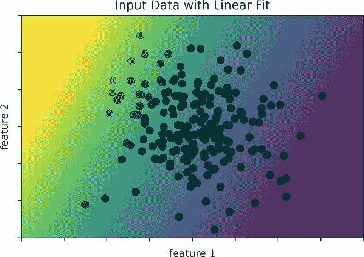

###### Figure 37-6\. 回归模型的表示

这个拟合平面为我们提供了预测新点标签所需的信息。从视觉上看，我们找到了在 Figure 37-7 中展示的结果。

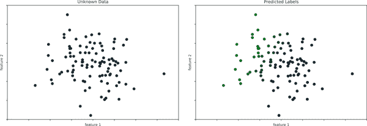

###### Figure 37-7\. 应用回归模型到新数据上

与分类示例一样，这个任务在低维度下可能看起来微不足道。但这些方法的力量在于它们可以在具有许多特征的数据中直接应用和评估。例如，这类似于通过望远镜观测到的星系的距离任务——在这种情况下，我们可能使用以下特征和标签：

+   *特征 1*、*特征 2* 等 <math alttext="right-arrow"><mo>→</mo></math> 每个星系在几个波长或颜色之一上的亮度

+   *标签* <math alttext="right-arrow"><mo>→</mo></math> 星系的距离或红移

对于其中一小部分星系的距离可能通过独立的（通常更昂贵或复杂）观测来确定。然后可以使用适当的回归模型估计其余星系的距离，而无需在整个集合上使用更昂贵的观测。在天文学界，这被称为“光度红移”问题。

我们将讨论的一些重要回归算法包括线性回归（参见 Chapter 42）、支持向量机（参见 Chapter 43）和随机森林回归（参见 Chapter 44）。

## 聚类：推断未标记数据的标签

我们刚刚看到的分类和回归示例都是监督学习算法的例子，我们试图建立一个可以预测新数据标签的模型。无监督学习涉及描述数据而不涉及任何已知标签的模型。

无监督学习的一个常见情况是“聚类”，其中数据自动分配给一些离散的组。例如，我们可能有一些类似于 Figure 37-8 中所示的二维数据。

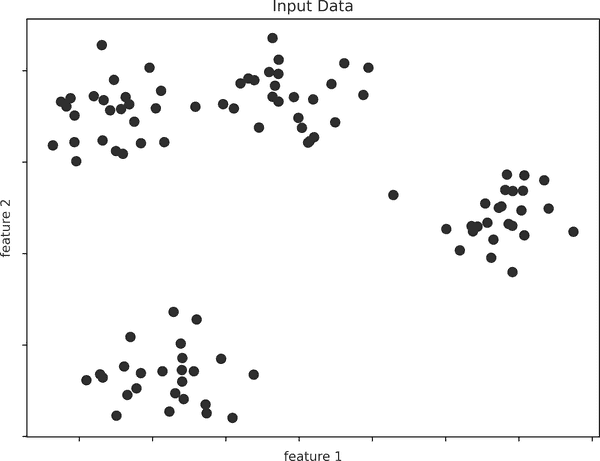

###### Figure 37-8\. 聚类示例数据

通过目测，很明显每个点都属于一个明显的组。基于数据的内在结构，聚类模型将确定哪些点是相关的。使用非常快速和直观的*k*-means 算法（参见第四十七章），我们找到如图 37-9 所示的聚类。

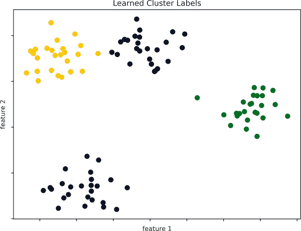

###### 图 37-9\. 使用 k-means 聚类模型标记的数据

*k*-means 算法适配了一个模型，包括*k*个聚类中心；最优的中心被认为是最小化每个点到其分配中心距离的那些中心。再次强调，在二维数据中这可能看起来像是一个微不足道的练习，但随着数据变得更大更复杂，这样的聚类算法可以继续从数据集中提取有用信息。

我们将在第四十七章更深入地讨论*k*-means 算法。其他重要的聚类算法包括高斯混合模型（参见第四十八章）和谱聚类（参见[Scikit-Learn 的聚类文档](https://oreil.ly/9FHKO)）。

## 降维：推断未标记数据的结构

降维是无监督算法的另一个示例，其中标签或其他信息是从数据集本身的结构中推断出来的。降维比我们之前看过的例子更加抽象，但通常它试图提取数据的一些低维表示，以某种方式保留完整数据集的相关特性。不同的降维例程以不同的方式衡量这些相关特性，正如我们将在第四十六章中看到的那样。

例如，考虑显示在图 37-10 中的数据。

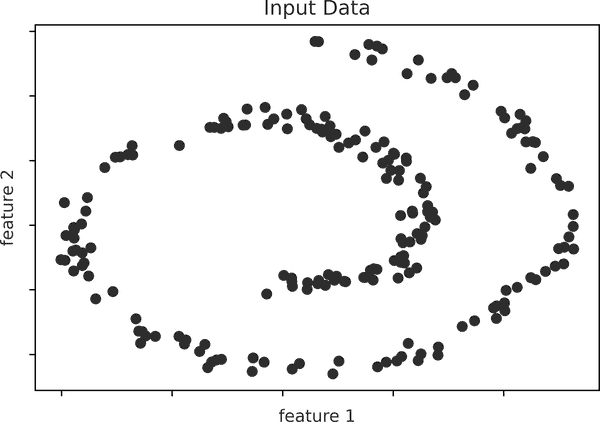

###### 图 37-10\. 降维的示例数据

从视觉上看，很明显这些数据中存在一些结构：它们来自一个一维线，在二维空间内以螺旋的方式排列。从某种意义上说，你可以说这些数据“本质上”只有一维，尽管这些一维数据嵌入在二维空间中。在这种情况下，一个合适的降维模型应该对这种非线性嵌入结构敏感，并能够检测到这种较低维度的表示。

图 37-11 展示了 Isomap 算法的结果可视化，这是一种能够实现这一目标的流形学习算法。

请注意，颜色（代表提取的一维潜变量）沿螺旋线均匀变化，这表明算法确实检测到了我们肉眼看到的结构。与前面的例子一样，降维算法在高维情况下的作用变得更加明显。例如，我们可能希望可视化一个具有 100 或 1000 个特征的数据集中的重要关系。可视化 1000 维数据是一项挑战，我们可以通过使用降维技术将数据降低到 2 或 3 维来使其更易管理。

我们将讨论一些重要的降维算法，包括主成分分析（参见第四十五章）和各种流形学习算法，包括 Isomap 和局部线性嵌入（参见第四十六章）。

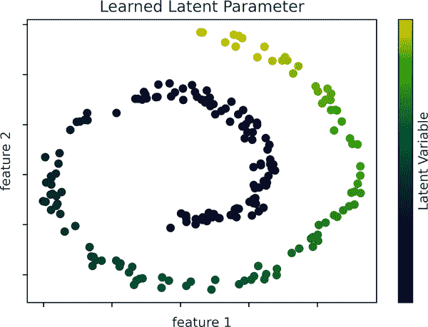

###### 图 37-11\. 通过降维学习得到的带标签数据

# 总结

在这里，我们看到了一些基本的机器学习方法的简单示例。不用说，有许多重要的实际细节我们没有详细讨论，但本章旨在让您了解机器学习方法可以解决哪些类型的问题的基本概念。

简而言之，我们看到了以下内容：

+   *监督学习*：基于标记的训练数据可以预测标签的模型。

    +   *分类*：预测两个或更多离散类别标签的模型

    +   *回归*：预测连续标签的模型

+   *无监督学习*：识别无标签数据中结构的模型

    +   *聚类*：检测并识别数据中不同组的模型

    +   *降维*：检测并识别高维数据中的低维结构的模型

在接下来的章节中，我们将深入探讨这些类别，并看到这些概念在哪些场景中更加有用。
