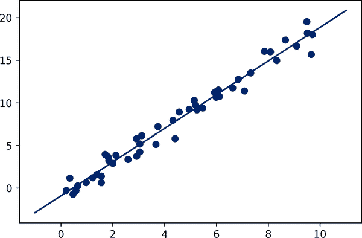

# 第三十八章：介绍 Scikit-Learn

几个 Python 库提供了一系列机器学习算法的可靠实现。其中最著名的之一是[Scikit-Learn](http://scikit-learn.org)，它提供了大量常见算法的高效版本。Scikit-Learn 具有清晰、统一和简化的 API，以及非常有用和完整的文档。统一性的好处在于，一旦你理解了 Scikit-Learn 一种类型模型的基本用法和语法，切换到新模型或算法就变得简单。

本章概述了 Scikit-Learn API。对这些 API 元素的扎实理解将为理解以下章节中关于机器学习算法和方法的深入实践讨论奠定基础。

我们将从 Scikit-Learn 中的数据表示开始讲起，然后深入到估计器 API，最后通过一个更有趣的示例，使用这些工具探索一组手写数字的图像。

# Scikit-Learn 中的数据表示

机器学习是关于从数据中创建模型的；因此，我们将从讨论如何表示数据开始。在 Scikit-Learn 中理解数据的最佳方式是以*表格*的形式思考。

基本表格是一个二维的数据网格，其中行代表数据集中的单个元素，列代表与这些元素的每一个相关的数量。例如，考虑 1936 年由罗纳德·费舍尔著名分析的[鸢尾花数据集](https://oreil.ly/TeWYs)。我们可以使用[Seaborn 库](http://seaborn.pydata.org)以 Pandas `DataFrame` 的形式下载这个数据集，并查看前几个条目：

```py
In [1]: import seaborn as sns
        iris = sns.load_dataset('iris')
        iris.head()
Out[1]:    sepal_length  sepal_width  petal_length  petal_width species
        0           5.1          3.5           1.4          0.2  setosa
        1           4.9          3.0           1.4          0.2  setosa
        2           4.7          3.2           1.3          0.2  setosa
        3           4.6          3.1           1.5          0.2  setosa
        4           5.0          3.6           1.4          0.2  setosa
```

这里的每一行数据都指的是单个观察到的花朵，行数是数据集中花朵的总数。通常，我们将矩阵的行称为*样本*，行数称为`n_samples`。

同样，数据的每一列都指代描述每个样本的特定定量信息。通常，我们将矩阵的列称为*特征*，列数称为`n_features`。

## 特征矩阵

表格布局清晰地表明信息可以被视为二维数字数组或矩阵，我们将其称为*特征矩阵*。按照惯例，这个矩阵通常存储在名为`X`的变量中。特征矩阵被假定为二维的，形状为`[n_samples, n_features]`，最常见的情况是包含在 NumPy 数组或 Pandas `DataFrame` 中，尽管一些 Scikit-Learn 模型也接受 SciPy 稀疏矩阵。

样本（即行）始终指代数据集描述的单个对象。例如，样本可以表示一朵花、一个人、一个文档、一个图像、一个声音文件、一个视频、一个天文物体，或者任何你可以用一组定量测量来描述的东西。

特征（即列）始终指的是以定量方式描述每个样本的不同观察结果。特征通常是实值，但在某些情况下可能是布尔值或离散值。

## 目标数组

除了特征矩阵 `X` 外，我们通常还使用一个*标签*或*目标*数组，按照惯例，我们通常称之为 `y`。目标数组通常是一维的，长度为 `n_samples`，通常包含在一个 NumPy 数组或 Pandas `Series` 中。目标数组可以具有连续的数值，也可以是离散的类别/标签。虽然一些 Scikit-Learn 估计器确实处理多个目标值的情况，形式为二维 `[n_samples, n_targets]` 目标数组，但我们主要处理的是一维目标数组的常见情况。

一个常见的困惑点是目标数组与其他特征列的区别。目标数组的显著特征是它通常是我们希望从特征中*预测出来*的数量：在统计术语中，它是因变量。例如，考虑到前述数据，我们可能希望构建一个能够基于其他测量预测花卉种类的模型；在这种情况下，`species` 列将被视为目标数组。

有了这个目标数组，我们可以使用 Seaborn（在 第三十六章 中讨论）方便地可视化数据（参见 图 38-1）。

```py
In [2]: %matplotlib inline
        import seaborn as sns
        sns.pairplot(iris, hue='species', height=1.5);
```


###### 图 38-1\. 鸢尾花数据集的可视化¹

为了在 Scikit-Learn 中使用，我们将从 `DataFrame` 中提取特征矩阵和目标数组，我们可以使用一些在 第三部分 中讨论过的 Pandas `DataFrame` 操作来完成：

```py
In [3]: X_iris = iris.drop('species', axis=1)
        X_iris.shape
Out[3]: (150, 4)
```

```py
In [4]: y_iris = iris['species']
        y_iris.shape
Out[4]: (150,)
```

总结一下，特征和目标值的预期布局如 图 38-2 所示。


###### 图 38-2\. Scikit-Learn 的数据布局²

有了这些数据正确格式化，我们可以继续考虑 Scikit-Learn 的估计器 API。

# 估计器 API

Scikit-Learn API 的设计遵循以下指导原则，如 [Scikit-Learn API 论文](http://arxiv.org/abs/1309.0238) 所述：

*一致性*

所有对象共享从有限一组方法中提取的共同接口，并提供一致的文档。

*检查*

所有指定的参数值都作为公共属性公开。

*有限的对象层次*

Python 类表示算法，数据集使用标准格式（NumPy 数组、Pandas `DataFrame` 对象、SciPy 稀疏矩阵），参数名称使用标准的 Python 字符串。

*组成*

许多机器学习任务可以表示为更基础算法的序列，并且 Scikit-Learn 在可能的情况下会利用这一点。

*合理的默认值*

当模型需要用户指定的参数时，库会定义一个合适的默认值。

在实践中，一旦理解了基本原则，这些原则使得 Scikit-Learn 非常易于使用。Scikit-Learn 中的每个机器学习算法都是通过估计器 API 实现的，该 API 为广泛的机器学习应用提供了一致的接口。

## API 的基础知识

在使用 Scikit-Learn 估计器 API 的步骤中，最常见的步骤如下：

1.  通过从 Scikit-Learn 导入适当的估计器类来选择一个模型类。

1.  通过用所需值实例化这个类来选择模型超参数。

1.  按照本章前面概述的方式，将数据安排为特征矩阵和目标向量。

1.  通过调用模型实例的`fit`方法将模型拟合到您的数据中。

1.  将模型应用于新数据：

    +   对于监督学习，通常我们使用`predict`方法为未知数据预测标签。

    +   对于无监督学习，我们经常使用`transform`或`predict`方法来转换或推断数据的属性。

现在我们将逐步展示几个简单的示例，应用监督和无监督学习方法。

## 监督学习示例：简单线性回归

作为这一过程的示例，让我们考虑一个简单的线性回归——即，将一条直线拟合到数据`（x，y）`的常见情况。我们将使用以下简单的数据作为我们回归示例的数据（见图 38-3）。

```py
In [5]: import matplotlib.pyplot as plt
        import numpy as np

        rng = np.random.RandomState(42)
        x = 10 * rng.rand(50)
        y = 2 * x - 1 + rng.randn(50)
        plt.scatter(x, y);
```


###### 图 38-3\. 线性回归数据

有了这些数据，我们可以使用前面提到的配方。我们将在接下来的几节中详细介绍这个过程。

### 1\. 选择一个模型类

在 Scikit-Learn 中，每个模型类都由一个 Python 类表示。因此，例如，如果我们想计算一个简单的`LinearRegression`模型，我们可以导入线性回归类：

```py
In [6]: from sklearn.linear_model import LinearRegression
```

注意，还有其他更一般的线性回归模型存在；您可以在[`sklearn.linear_model`模块文档](https://oreil.ly/YVOFd)中了解更多信息。

### 2\. 选择模型超参数

一个重要的点是，*一个模型类并不等同于一个模型的实例*。

一旦我们决定了我们的模型类，还有一些选项是开放给我们的。根据我们正在使用的模型类，我们可能需要回答以下一个或多个类似的问题：

+   我们想要拟合偏移量（即*y*-截距）吗？

+   我们希望模型被归一化吗？

+   我们想要预处理我们的特征以增加模型的灵活性吗？

+   我们希望在我们的模型中使用多少程度的正则化？

+   我们想使用多少个模型组件？

这些是在选择*模型类别确定后*必须做出的重要选择的示例。这些选择通常被表示为*超参数*，或者必须在将模型拟合到数据之前设置的参数。在 Scikit-Learn 中，通过在模型实例化时传递值来选择超参数。我们将探讨如何可以量化地选择超参数在第三十九章中。

对于我们的线性回归示例，我们可以实例化`LinearRegression`类，并指定我们希望使用`fit_intercept`超参数来拟合截距：

```py
In [7]: model = LinearRegression(fit_intercept=True)
        model
Out[7]: LinearRegression()
```

请记住，当实例化模型时，唯一的操作是存储这些超参数值。特别是，我们还没有将模型应用于任何数据：Scikit-Learn API 非常清楚地区分了*模型选择*和*将模型应用于数据*的行为。

### 3\. 将数据排列成特征矩阵和目标向量

之前我们研究了 Scikit-Learn 的数据表示，这需要一个二维特征矩阵和一个一维目标数组。这里我们的目标变量`y`已经是正确的形式（长度为`n_samples`的数组），但我们需要对数据`x`进行整理，使其成为大小为`[n_samples, n_features]`的矩阵。

在这种情况下，这相当于简单地重新整理一维数组：

```py
In [8]: X = x[:, np.newaxis]
        X.shape
Out[8]: (50, 1)
```

### 4\. 将模型拟合到数据

现在是将我们的模型应用于数据的时候了。这可以通过模型的`fit`方法来完成：

```py
In [9]: model.fit(X, y)
Out[9]: LinearRegression()
```

此`fit`命令会导致进行许多依赖于模型的内部计算，并将这些计算的结果存储在用户可以探索的模型特定属性中。在 Scikit-Learn 中，按照惯例，在`fit`过程中学习的所有模型参数都有尾随的下划线；例如，在这个线性模型中，我们有以下内容：

```py
In [10]: model.coef_
Out[10]: array([1.9776566])
```

```py
In [11]: model.intercept_
Out[11]: -0.9033107255311146
```

这两个参数表示对数据进行简单线性拟合的斜率和截距。将结果与数据定义进行比较，我们看到它们接近用于生成数据的值：斜率为 2，截距为-1。

经常出现的一个问题是关于内部模型参数的不确定性。一般来说，Scikit-Learn 不提供从内部模型参数本身得出结论的工具：解释模型参数更多是一个*统计建模*问题，而不是一个*机器学习*问题。机器学习更关注模型的*预测*。如果您想深入了解模型内的拟合参数含义，其他工具可用，包括[`statsmodels` Python 包](https://oreil.ly/adDFZ)。

### 5\. 预测未知数据的标签

一旦模型训练完成，监督机器学习的主要任务就是基于其对未曾参与训练集的新数据的预测结果进行评估。在 Scikit-Learn 中，可以使用`predict`方法来实现。为了本示例的目的，我们的“新数据”将是一组*x*值，并且我们会问模型预测什么*y*值：

```py
In [12]: xfit = np.linspace(-1, 11)
```

与之前一样，我们需要将这些*x*值强制转换为`[n_samples, n_features]`特征矩阵，之后我们可以将其馈送给模型：

```py
In [13]: Xfit = xfit[:, np.newaxis]
         yfit = model.predict(Xfit)
```

最后，让我们通过首先绘制原始数据，然后是模型拟合结果来可视化结果（参见图 38-4）。

```py
In [14]: plt.scatter(x, y)
         plt.plot(xfit, yfit);
```



###### 图 38-4. 简单的线性回归拟合数据

通常通过将模型的结果与某些已知基准进行比较来评估模型的效果，我们将在下一个示例中看到。

## 监督学习示例：鸢尾花分类

让我们再看一个这个过程的例子，使用我们之前讨论过的鸢尾花数据集。我们的问题是这样的：在一个部分鸢尾花数据上训练的模型，我们能多好地预测剩余标签？

对于这个任务，我们将使用一个称为*高斯朴素贝叶斯*的简单生成模型，它假设每个类别都来自于一个轴对齐的高斯分布（更多细节请参见第四十一章）。由于它非常快速且没有需要选择的超参数，高斯朴素贝叶斯通常是用作基线分类的好模型，然后可以探索是否通过更复杂的模型找到改进。

我们希望评估模型在未见过的数据上的表现，因此我们将数据分为*训练集*和*测试集*。这可以手动完成，但使用`train_test_split`实用函数更为方便：

```py
In [15]: from sklearn.model_selection import train_test_split
         Xtrain, Xtest, ytrain, ytest = train_test_split(X_iris, y_iris,
                                                         random_state=1)
```

数据整理完毕后，我们可以按照我们的步骤预测标签：

```py
In [16]: from sklearn.naive_bayes import GaussianNB # 1\. choose model class
         model = GaussianNB()                       # 2\. instantiate model
         model.fit(Xtrain, ytrain)                  # 3\. fit model to data
         y_model = model.predict(Xtest)             # 4\. predict on new data
```

最后，我们可以使用`accuracy_score`实用函数查看预测标签与其真实值匹配的比例：

```py
In [17]: from sklearn.metrics import accuracy_score
         accuracy_score(ytest, y_model)
Out[17]: 0.9736842105263158
```

准确率高达 97%，我们看到即使是这种非常天真的分类算法对这个特定数据集也是有效的！

## 无监督学习示例：鸢尾花维度

作为无监督学习问题的例子，让我们看看如何降低鸢尾花数据的维度，以便更容易地可视化它。回想一下，鸢尾花数据是四维的：每个样本记录了四个特征。

降维的任务集中在确定是否存在一个合适的低维表示，以保留数据的基本特征。通常，降维被用作辅助可视化数据的工具：毕竟，在二维中绘制数据比在四维或更多维度中更容易！

在这里，我们将使用 *主成分分析*（PCA；见 第四十五章），这是一种快速的线性降维技术。我们将要求模型返回两个组件——也就是数据的二维表示。

按照前面概述的步骤序列，我们有：

```py
In [18]: from sklearn.decomposition import PCA  # 1\. choose model class
         model = PCA(n_components=2)            # 2\. instantiate model
         model.fit(X_iris)                      # 3\. fit model to data
         X_2D = model.transform(X_iris)         # 4\. transform the data
```

现在让我们绘制结果。一个快速的方法是将结果插入到原始的鸢尾`DataFrame`中，并使用 Seaborn 的 `lmplot` 来显示结果（见 图 38-5）。

```py
In [19]: iris['PCA1'] = X_2D[:, 0]
         iris['PCA2'] = X_2D[:, 1]
         sns.lmplot(x="PCA1", y="PCA2", hue='species', data=iris, fit_reg=False);
```

我们看到，在二维表示中，物种相当分离，即使 PCA 算法没有物种标签的知识！这向我们暗示，一个相对简单的分类对数据集可能是有效的，就像我们之前看到的那样。


###### 图 38-5\. 将 Iris 数据投影到二维空间³

## 无监督学习示例：鸢尾花聚类

接下来让我们看一下将聚类应用到鸢尾数据上。聚类算法试图找到不同的数据组，而不考虑任何标签。在这里，我们将使用一个强大的聚类方法，称为 *高斯混合模型*（GMM），在 第四十八章 中有更详细的讨论。GMM 试图将数据建模为高斯斑点的集合。

我们可以按如下方式拟合高斯混合模型：

```py
In [20]: from sklearn.mixture import GaussianMixture      # 1\. choose model class
         model = GaussianMixture(n_components=3,
                                 covariance_type='full')  # 2\. instantiate model
         model.fit(X_iris)                                # 3\. fit model to data
         y_gmm = model.predict(X_iris)                    # 4\. determine labels
```

与之前一样，我们将把集群标签添加到鸢尾`DataFrame`中，并使用 Seaborn 绘制结果（见 图 38-6）。

```py
In [21]: iris['cluster'] = y_gmm
         sns.lmplot(x="PCA1", y="PCA2", data=iris, hue='species',
                    col='cluster', fit_reg=False);
```


###### 图 38-6\. Iris 数据中的 k-means 聚类⁴

通过按簇号拆分数据，我们可以看到 GMM 算法已经完美地恢复了底层标签：*setosa* 物种在簇 0 中完美分离，而 *versicolor* 和 *virginica* 之间仍然存在少量混合。这意味着即使没有专家告诉我们单个花的物种标签，这些花的测量也是足够明显的，以至于我们可以使用简单的聚类算法*自动*识别出这些不同物种群！这种算法可能进一步给领域专家提供关于他们正在观察的样本之间关系的线索。

# 应用：探索手写数字

为了在一个更有趣的问题上演示这些原则，让我们考虑光学字符识别问题的一部分：手写数字的识别。在实际情况中，这个问题涉及到在图像中定位和识别字符。在这里，我们将采取捷径，使用 Scikit-Learn 的预格式化数字集，这些数字集内置于库中。

## 加载和可视化数字数据

我们可以使用 Scikit-Learn 的数据访问接口来查看这些数据：

```py
In [22]: from sklearn.datasets import load_digits
         digits = load_digits()
         digits.images.shape
Out[22]: (1797, 8, 8)
```

图像数据是一个三维数组：每个样本由一个 8 × 8 的像素网格组成，共 1,797 个样本。让我们可视化其中的前一百个（参见图 38-7）。

```py
In [23]: import matplotlib.pyplot as plt

         fig, axes = plt.subplots(10, 10, figsize=(8, 8),
                                  subplot_kw={'xticks':[], 'yticks':[]},
                                  gridspec_kw=dict(hspace=0.1, wspace=0.1))

         for i, ax in enumerate(axes.flat):
             ax.imshow(digits.images[i], cmap='binary', interpolation='nearest')
             ax.text(0.05, 0.05, str(digits.target[i]),
                     transform=ax.transAxes, color='green')
```


###### 图 38-7\. 手写数字数据；每个样本由一个 8 × 8 的像素网格表示

为了在 Scikit-Learn 中处理这些数据，我们需要一个二维的 `[n_samples, n_features]` 表示。我们可以通过将图像中的每个像素视为一个特征来实现这一点：即通过展开像素数组，使得我们有一个长度为 64 的数组，其中包含代表每个数字的像素值。此外，我们还需要目标数组，它给出了每个数字的预先确定标签。这两个量已经内置在 digits 数据集的 `data` 和 `target` 属性中了：

```py
In [24]: X = digits.data
         X.shape
Out[24]: (1797, 64)
```

```py
In [25]: y = digits.target
         y.shape
Out[25]: (1797,)
```

我们在这里看到有 1,797 个样本和 64 个特征。

## 无监督学习示例：降维

我们想在 64 维参数空间内可视化我们的点，但在这么高维空间中有效地可视化点是困难的。因此，我们将通过无监督方法减少维度。在这里，我们将使用一个称为 Isomap 的流形学习算法（参见第四十六章），将数据转换为二维：

```py
In [26]: from sklearn.manifold import Isomap
         iso = Isomap(n_components=2)
         iso.fit(digits.data)
         data_projected = iso.transform(digits.data)
         print(data_projected.shape)
Out[26]: (1797, 2)
```

我们看到投影后的数据现在是二维的。让我们绘制这些数据，看看我们是否可以从它的结构中学到一些东西（参见图 38-8）。

```py
In [27]: plt.scatter(data_projected[:, 0], data_projected[:, 1], c=digits.target,
                     edgecolor='none', alpha=0.5,
                     cmap=plt.cm.get_cmap('viridis', 10))
         plt.colorbar(label='digit label', ticks=range(10))
         plt.clim(-0.5, 9.5);
```

这个图表让我们对在较大的 64 维空间中各种数字的分离程度有了一些直观的认识。例如，零和一在参数空间中几乎没有重叠。直觉上这是有道理的：零在图像中间是空的，而一通常在图像中间有墨水。另一方面，一和四之间似乎有一个更或多或少连续的谱系：我们可以通过意识到有些人在一上画有“帽子”，这使它们看起来与四相似。

总体而言，尽管在边缘处有些混合，不同的组在参数空间中似乎被相当好地定位：这表明即使是非常简单的监督分类算法也应该在完整的高维数据集上表现适当。让我们试一试。


###### 图 38-8\. 数字数据的 Isomap 嵌入

## 数字分类

让我们对手写数字数据应用一个分类算法。与之前处理鸢尾花数据集时一样，我们将数据分为训练集和测试集，并拟合一个高斯朴素贝叶斯模型：

```py
In [28]: Xtrain, Xtest, ytrain, ytest = train_test_split(X, y, random_state=0)
```

```py
In [29]: from sklearn.naive_bayes import GaussianNB
         model = GaussianNB()
         model.fit(Xtrain, ytrain)
         y_model = model.predict(Xtest)
```

现在我们有了模型的预测结果，我们可以通过比较测试集的真实值和预测值来评估其准确性：

```py
In [30]: from sklearn.metrics import accuracy_score
         accuracy_score(ytest, y_model)
Out[30]: 0.8333333333333334
```

即使是这个非常简单的模型，我们在数字分类上也达到了约 83%的准确率！但是，这个单一数字并不能告诉我们哪里出了错。一个很好的方法是使用*混淆矩阵*，我们可以用 Scikit-Learn 计算它，并用 Seaborn 绘制（参见图 38-9）。

```py
In [31]: from sklearn.metrics import confusion_matrix

         mat = confusion_matrix(ytest, y_model)

         sns.heatmap(mat, square=True, annot=True, cbar=False, cmap='Blues')
         plt.xlabel('predicted value')
         plt.ylabel('true value');
```

这显示了误标记点的位置倾向：例如，这里的许多数字“2”被误分类为“1”或“8”。


###### 图 38-9\. 混淆矩阵显示分类器误分类的频率

另一种直观了解模型特性的方法是重新绘制输入数据及其预测标签。我们将使用绿色表示正确标签，红色表示错误标签；详见图 38-10。

```py
In [32]: fig, axes = plt.subplots(10, 10, figsize=(8, 8),
                                  subplot_kw={'xticks':[], 'yticks':[]},
                                  gridspec_kw=dict(hspace=0.1, wspace=0.1))

         test_images = Xtest.reshape(-1, 8, 8)

         for i, ax in enumerate(axes.flat):
             ax.imshow(test_images[i], cmap='binary', interpolation='nearest')
             ax.text(0.05, 0.05, str(y_model[i]),
                     transform=ax.transAxes,
                     color='green' if (ytest[i] == y_model[i]) else 'red')
```

检查数据子集可以帮助我们了解算法在哪些地方可能表现不佳。为了超越我们的 83%分类成功率，我们可以转向更复杂的算法，如支持向量机（参见第 43 章）、随机森林（参见第 44 章）或其他分类方法。


###### 图 38-10\. 数据显示正确（绿色）和错误（红色）标签；查看这个图的彩色版本，请参阅[书的在线版本](https://oreil.ly/PDSH_GitHub)

# 总结

在本章中，我们介绍了 Scikit-Learn 数据表示和估计器 API 的基本特性。无论使用何种类型的估计器，都保持着相同的导入/实例化/拟合/预测模式。掌握了这些信息，您可以探索 Scikit-Learn 文档，并在您的数据上尝试各种模型。

在下一章中，我们将探讨机器学习中可能最重要的主题：如何选择和验证您的模型。

¹ 这个图的全尺寸、全彩色版本可以在[GitHub](https://oreil.ly/PDSH_GitHub)上找到。

² 可在[在线附录](https://oreil.ly/J8V6U)中找到生成此图的代码。

³ 这个图的全彩色版本可以在[GitHub](https://oreil.ly/PDSH_GitHub)上找到。

⁴ 这个图的全尺寸、全彩色版本可以在[GitHub](https://oreil.ly/PDSH_GitHub)上找到。
