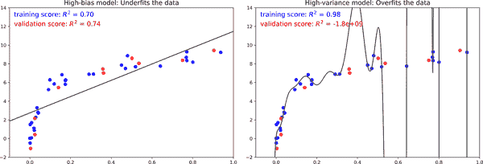
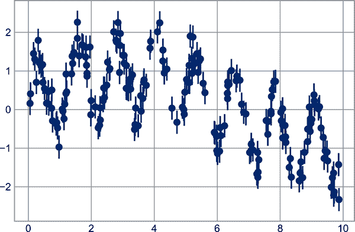
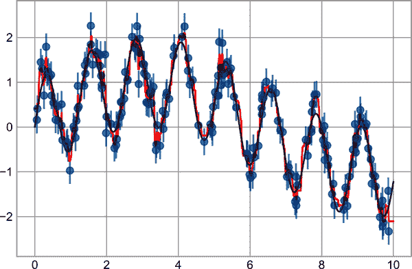
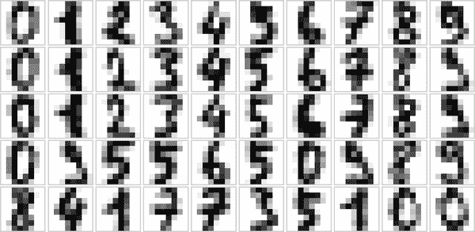
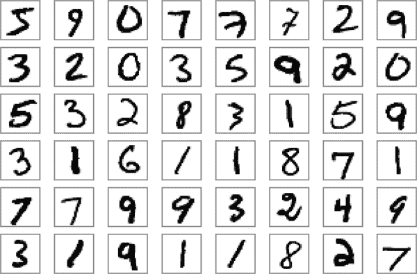

# 第三十九章：超参数和模型验证

在上一章中，我们看到了应用监督机器学习模型的基本方法：

1.  选择一个模型类别。

1.  选择模型超参数。

1.  将模型拟合到训练数据中。

1.  使用模型来预测新数据的标签。

这两个部分——模型的选择和超参数的选择——可能是有效使用这些工具和技术的最重要部分。为了做出明智的选择，我们需要一种验证模型和超参数是否与数据相匹配的方法。虽然这听起来很简单，但要有效地做到这一点，你必须避免一些陷阱。

# 思考模型验证

原则上，模型验证非常简单：在选择了模型和其超参数之后，我们可以通过将其应用于一些训练数据并将预测结果与已知值进行比较来估计其有效性。

本节将首先展示一个关于模型验证的天真方法以及为什么它失败了，然后探讨使用保留集和交叉验证进行更健壮的模型评估。

## 错误的模型验证方法

让我们从在上一章中看到的鸢尾花数据集中采用天真的验证方法开始。我们将从加载数据开始：

```py
In [1]: from sklearn.datasets import load_iris
        iris = load_iris()
        X = iris.data
        y = iris.target
```

接下来，我们选择一个模型和超参数。在这里，我们将使用一个*n*最近邻分类器，其中`n_neighbors=1`。这是一个非常简单和直观的模型，它表示“未知点的标签与其最近训练点的标签相同”：

```py
In [2]: from sklearn.neighbors import KNeighborsClassifier
        model = KNeighborsClassifier(n_neighbors=1)
```

然后，我们训练模型，并使用它来预测我们已经知道标签的数据的标签：

```py
In [3]: model.fit(X, y)
        y_model = model.predict(X)
```

最后，我们计算正确标记点的比例：

```py
In [4]: from sklearn.metrics import accuracy_score
        accuracy_score(y, y_model)
Out[4]: 1.0
```

我们看到了一个准确度得分为 1.0，这表明我们的模型 100%正确标记了所有点！但这真的是测量预期准确度吗？我们真的找到了一个我们预计每次都会 100%正确的模型吗？

正如你可能已经了解的那样，答案是否定的。事实上，这种方法包含一个根本性的缺陷：*它在相同的数据上训练和评估模型*。此外，这个最近邻模型是一个*基于实例*的估计器，它简单地存储训练数据，并通过将新数据与这些存储的点进行比较来预测标签：除了人为的情况外，它每次都会得到 100%的准确度！

## 正确的模型验证方法：保留集

那么可以做什么呢？通过使用所谓的*保留集*可以更好地了解模型的性能：也就是说，我们从模型的训练中保留一些数据子集，然后使用这个保留集来检查模型的性能。这种分割可以使用 Scikit-Learn 中的`train_test_split`工具来完成：

```py
In [5]: from sklearn.model_selection import train_test_split
        # split the data with 50% in each set
        X1, X2, y1, y2 = train_test_split(X, y, random_state=0,
                                          train_size=0.5)

        # fit the model on one set of data
        model.fit(X1, y1)

        # evaluate the model on the second set of data
        y2_model = model.predict(X2)
        accuracy_score(y2, y2_model)
Out[5]: 0.9066666666666666
```

我们在这里看到了一个更合理的结果：一对一最近邻分类器在这个保留集上的准确率约为 90%。保留集类似于未知数据，因为模型以前没有“看到”它。

## 通过交叉验证进行模型验证

使用留出法进行模型验证的一个缺点是我们已经失去了一部分数据用于模型训练。在前述情况下，一半的数据集并没有对模型的训练做出贡献！这并不是最优的，特别是如果初始训练数据集很小的情况下。

解决这个问题的一种方法是使用*交叉验证*；也就是说，进行一系列拟合，其中每个数据子集既用作训练集又用作验证集。从视觉上看，可能会像是 Figure 39-1 这样。


###### 图 39-1\. 二折交叉验证的可视化¹

在这里，我们进行了两个验证试验，交替使用数据的每一半作为留出集。使用之前的分割数据，我们可以这样实现：

```py
In [6]: y2_model = model.fit(X1, y1).predict(X2)
        y1_model = model.fit(X2, y2).predict(X1)
        accuracy_score(y1, y1_model), accuracy_score(y2, y2_model)
Out[6]: (0.96, 0.9066666666666666)
```

出现的是两个准确度分数，我们可以结合（比如取平均值）来获得更好的全局模型性能衡量标准。这种特定形式的交叉验证是*二折交叉验证*——即，我们将数据分为两组，轮流将每一组作为验证集。

我们可以扩展这个想法，使用更多的试验和数据折叠——例如，Figure 39-2 展示了五折交叉验证的可视化描述。


###### 图 39-2\. 五折交叉验证的可视化²

在这里，我们将数据分为五组，依次使用每一组来评估模型在其余四分之四的数据上的拟合情况。这样手工操作将会相当乏味，但我们可以使用 Scikit-Learn 的 `cross_val_score` 方便地完成：

```py
In [7]: from sklearn.model_selection import cross_val_score
        cross_val_score(model, X, y, cv=5)
Out[7]: array([0.96666667, 0.96666667, 0.93333333, 0.93333333, 1.        ])
```

在不同的数据子集上重复验证可以更好地了解算法的性能。

Scikit-Learn 实现了许多在特定情况下有用的交叉验证方案；这些通过 `model_selection` 模块中的迭代器实现。例如，我们可能希望使用极端情况，即我们的折数等于数据点的数量：也就是说，在每次试验中我们训练所有点但排除一个。这种交叉验证被称为*留一法*交叉验证，可以如下使用：

```py
In [8]: from sklearn.model_selection import LeaveOneOut
        scores = cross_val_score(model, X, y, cv=LeaveOneOut())
        scores
Out[8]: array([1., 1., 1., 1., 1., 1., 1., 1., 1., 1., 1., 1., 1., 1., 1., 1., 1.,
               1., 1., 1., 1., 1., 1., 1., 1., 1., 1., 1., 1., 1., 1., 1., 1., 1.,
               1., 1., 1., 1., 1., 1., 1., 1., 1., 1., 1., 1., 1., 1., 1., 1., 1.,
               1., 1., 1., 1., 1., 1., 1., 1., 1., 1., 1., 1., 1., 1., 1., 1., 1.,
               1., 1., 0., 1., 0., 1., 1., 1., 1., 1., 1., 1., 1., 1., 1., 0., 1.,
               1., 1., 1., 1., 1., 1., 1., 1., 1., 1., 1., 1., 1., 1., 1., 1., 1.,
               1., 1., 1., 1., 0., 1., 1., 1., 1., 1., 1., 1., 1., 1., 1., 1., 1.,
               0., 1., 1., 1., 1., 1., 1., 1., 1., 1., 1., 1., 1., 1., 0., 1., 1.,
               1., 1., 1., 1., 1., 1., 1., 1., 1., 1., 1., 1., 1., 1.])
```

因为我们有 150 个样本，留一法交叉验证会产生 150 次试验的分数，每个分数表示预测成功（1.0）或失败（0.0）。对这些分数求平均值可以估计误差率：

```py
In [9]: scores.mean()
Out[9]: 0.96
```

其他交叉验证方案可以类似地使用。要了解 Scikit-Learn 中提供的内容，请使用 IPython 探索 `sklearn.model_selection` 子模块，或查看 Scikit-Learn 的[交叉验证文档](https://oreil.ly/rITkn)。

# 选择最佳模型

现在我们已经探讨了验证和交叉验证的基础知识，我们将更深入地讨论模型选择和超参数选择的问题。这些问题是机器学习实践中最重要的方面之一，但我发现这些信息在初学者机器学习教程中经常被忽略。

核心问题是以下问题：*如果我们的估计器表现不佳，我们该如何前进？* 有几种可能的答案：

+   使用一个更复杂/更灵活的模型。

+   使用一个不那么复杂/不那么灵活的模型。

+   收集更多训练样本。

+   收集更多数据以增加每个样本的特征。

对这个问题的答案通常是反直觉的。特别是，有时使用更复杂的模型会导致更差的结果，并且增加更多的训练样本可能不会改善您的结果！能够确定哪些步骤将改进您的模型是成功的机器学习从业者和不成功的区别。

## 偏差-方差折衷

从根本上讲，找到“最佳模型”就是在*偏差*和*方差*之间的折衷中找到一个甜蜜点。考虑图 39-3，它展示了对同一数据集的两个回归拟合。


###### 图 39-3\. 高偏差和高方差的回归模型³

很明显，这两个模型都不特别适合数据，但它们以不同的方式失败。

左边的模型试图通过数据找到一条直线拟合。因为在这种情况下，一条直线不能准确地分割数据，所以直线模型永远无法很好地描述这个数据集。这样的模型被称为*欠拟合*数据：即它没有足够的灵活性来适当地考虑数据中的所有特征。另一种说法是，该模型具有高偏差。

右边的模型试图通过数据拟合高阶多项式。在这里，模型拟合具有足够的灵活性来几乎完美地描述数据中的细微特征，但即使它非常精确地描述了训练数据，其精确形式似乎更反映了数据的特定噪声属性，而不是生成数据的任何过程的固有属性。这样的模型被称为*过拟合*数据：即它具有如此高的灵活性，以至于模型最终解释了随机误差以及底层数据分布。另一种说法是，该模型具有高方差。

从另一个角度来看，考虑一下如果我们使用这两个模型来预测一些新数据的*y*值会发生什么。在图 39-4 中的图表中，红色/浅色点表示从训练集中省略的数据。



###### 图 39-4\. 高偏差和高方差模型中的训练和验证分数⁴

这里的分数是<math alttext="上限 R 平方"><msup><mi>R</mi> <mn>2</mn></msup></math>分数，或者[确定系数](https://oreil.ly/2AtV8)，它衡量模型相对于目标值简单平均的表现。 <math alttext="上限 R 平方 等于 1"><mrow><msup><mi>R</mi> <mn>2</mn></msup> <mo>=</mo> <mn>1</mn></mrow></math> 表示完美匹配， <math alttext="上限 R 平方 等于 0"><mrow><msup><mi>R</mi> <mn>2</mn></msup> <mo>=</mo> <mn>0</mn></mrow></math> 表示模型不比简单取数据均值更好，负值则表示更差的模型。从这两个模型相关的分数中，我们可以得出一个更普遍的观察：

+   对于高偏差模型，模型在验证集上的表现与在训练集上的表现类似。

+   对于高方差模型，模型在验证集上的表现远远不及在训练集上的表现。

如果我们可以调整模型复杂度，我们会期望训练分数和验证分数表现如图 39-5 所示，通常称为*验证曲线*，我们可以看到以下特点：

+   训练分数始终高于验证分数。一般情况下都是如此：模型对已见数据的拟合程度比对未见数据的拟合程度更好。

+   对于非常低的模型复杂度（即高偏差模型），训练数据欠拟合，这意味着该模型对于训练数据和任何之前未见数据的预测都很差。

+   对于非常高的模型复杂度（即高方差模型），训练数据过拟合，这意味着模型对训练数据的预测非常好，但是对于任何之前未见数据都失败了。

+   对于某些中间值，验证曲线达到最大值。这种复杂度水平表明在偏差和方差之间有一个适当的权衡。

调整模型复杂度的方法因模型而异；在后面的章节中深入讨论各个模型时，我们将看到每个模型如何允许此类调整。


###### 图 39-5\. 模型复杂度、训练分数和验证分数之间关系的示意图⁵

## [Scikit-Learn 中的验证曲线](https://oreil.ly/2AtV8)

让我们看一个使用交叉验证计算模型验证曲线的示例。这里我们将使用*多项式回归*模型，一个广义线性模型，其中多项式的次数是一个可调参数。例如，对于模型参数 <math alttext="a"><mi>a</mi></math> 和 <math alttext="b"><mi>b</mi></math>：

<math alttext="y equals a x plus b" display="block"><mrow><mi>y</mi> <mo>=</mo> <mi>a</mi> <mi>x</mi> <mo>+</mo> <mi>b</mi></mrow></math>

三阶多项式对数据拟合出一个立方曲线；对于模型参数<math alttext="a comma b comma c comma d"><mrow><mi>a</mi> <mo>,</mo> <mi>b</mi> <mo>,</mo> <mi>c</mi> <mo>,</mo> <mi>d</mi></mrow></math>：

<math alttext="y equals a x cubed plus b x squared plus c x plus d" display="block"><mrow><mi>y</mi> <mo>=</mo> <mi>a</mi> <msup><mi>x</mi> <mn>3</mn></msup> <mo>+</mo> <mi>b</mi> <msup><mi>x</mi> <mn>2</mn></msup> <mo>+</mo> <mi>c</mi> <mi>x</mi> <mo>+</mo> <mi>d</mi></mrow></math>

我们可以将这一概念推广到任意数量的多项式特征。在 Scikit-Learn 中，我们可以使用线性回归分类器结合多项式预处理器实现这一点。我们将使用*管道*将这些操作串联在一起（我们将在第 40 章中更全面地讨论多项式特征和管道）：

```py
In [10]: from sklearn.preprocessing import PolynomialFeatures
         from sklearn.linear_model import LinearRegression
         from sklearn.pipeline import make_pipeline

         def PolynomialRegression(degree=2, **kwargs):
             return make_pipeline(PolynomialFeatures(degree),
                                  LinearRegression(**kwargs))
```

现在让我们创建一些数据来拟合我们的模型：

```py
In [11]: import numpy as np

         def make_data(N, err=1.0, rseed=1):
             # randomly sample the data
             rng = np.random.RandomState(rseed)
             X = rng.rand(N, 1) ** 2
             y = 10 - 1. / (X.ravel() + 0.1)
             if err > 0:
                 y += err * rng.randn(N)
             return X, y

         X, y = make_data(40)
```

现在我们可以可视化我们的数据，以及几个不同阶数的多项式拟合（见图 39-6）。

```py
In [12]: %matplotlib inline
         import matplotlib.pyplot as plt
         plt.style.use('seaborn-whitegrid')

         X_test = np.linspace(-0.1, 1.1, 500)[:, None]

         plt.scatter(X.ravel(), y, color='black')
         axis = plt.axis()
         for degree in [1, 3, 5]:
             y_test = PolynomialRegression(degree).fit(X, y).predict(X_test)
             plt.plot(X_test.ravel(), y_test, label='degree={0}'.format(degree))
         plt.xlim(-0.1, 1.0)
         plt.ylim(-2, 12)
         plt.legend(loc='best');
```

在这种情况下控制模型复杂度的旋钮是多项式的阶数，它可以是任何非负整数。一个有用的问题是：哪个多项式阶数提供了偏差（欠拟合）和方差（过拟合）之间的合适权衡点？



###### 图 39-6\. 适合数据集的三个不同多项式模型⁶

我们可以通过可视化特定数据和模型的验证曲线来取得进展；这可以通过 Scikit-Learn 提供的`validation_curve`便捷程序直接完成。给定一个模型、数据、参数名称和探索范围，该函数将自动计算跨范围的训练分数和验证分数（见图 39-7）。

```py
In [13]: from sklearn.model_selection import validation_curve
         degree = np.arange(0, 21)
         train_score, val_score = validation_curve(
             PolynomialRegression(), X, y,
             param_name='polynomialfeatures__degree',
             param_range=degree, cv=7)

         plt.plot(degree, np.median(train_score, 1),
                  color='blue', label='training score')
         plt.plot(degree, np.median(val_score, 1),
                  color='red', label='validation score')
         plt.legend(loc='best')
         plt.ylim(0, 1)
         plt.xlabel('degree')
         plt.ylabel('score');
```



###### 图 39-7\. Figure 39-9 中数据的验证曲线

这清楚地展示了我们预期的定性行为：训练分数始终高于验证分数，训练分数随着模型复杂度的增加而单调改善，并且验证分数在模型过拟合后达到最大值然后下降。

从验证曲线中，我们可以确定在三阶多项式下找到了偏差和方差之间的最佳权衡点。我们可以按以下方式计算并展示这个拟合结果在原始数据上的表现（见图 39-8）。

```py
In [14]: plt.scatter(X.ravel(), y)
         lim = plt.axis()
         y_test = PolynomialRegression(3).fit(X, y).predict(X_test)
         plt.plot(X_test.ravel(), y_test);
         plt.axis(lim);
```


###### 图 39-8\. Figure 39-6 中数据的交叉验证最优模型

注意，找到这个最优模型实际上并不需要我们计算训练分数，但是检查训练分数和验证分数之间的关系可以为我们提供模型性能的有用见解。

# 学习曲线

模型复杂度的一个重要方面是，最优模型通常取决于训练数据的大小。例如，让我们生成一个数据集，其点数是之前的五倍（见图 39-9）。

```py
In [15]: X2, y2 = make_data(200)
         plt.scatter(X2.ravel(), y2);
```


###### 图 39-9\. 展示学习曲线的数据

现在让我们复制前述代码，为这个更大的数据集绘制验证曲线；为了参考，我们也会在前面的结果上进行叠加（见图 39-10）。

```py
In [16]: degree = np.arange(21)
         train_score2, val_score2 = validation_curve(
             PolynomialRegression(), X2, y2,
             param_name='polynomialfeatures__degree',
             param_range=degree, cv=7)

         plt.plot(degree, np.median(train_score2, 1),
                  color='blue', label='training score')
         plt.plot(degree, np.median(val_score2, 1),
                  color='red', label='validation score')
         plt.plot(degree, np.median(train_score, 1),
                  color='blue', alpha=0.3, linestyle='dashed')
         plt.plot(degree, np.median(val_score, 1),
                  color='red', alpha=0.3, linestyle='dashed')
         plt.legend(loc='lower center')
         plt.ylim(0, 1)
         plt.xlabel('degree')
         plt.ylabel('score');
```

实线显示新结果，而较淡的虚线显示较小数据集的结果。从验证曲线可以明显看出，较大的数据集可以支持更复杂的模型：这里的高峰可能在 6 阶左右，但即使是 20 阶模型也不会严重过拟合数据——验证和训练分数仍然非常接近。



###### 图 39-10\. 多项式模型拟合数据的学习曲线

因此，验证曲线的行为不仅仅取决于模型复杂度，还取决于训练点的数量。我们可以通过使用日益增大的数据子集来研究模型随训练点数量变化的行为，从而获得更深入的见解。有时，关于训练/验证分数与训练集大小的图称为*学习曲线*。

我们期望从学习曲线得到的一般行为是：

+   给定复杂度的模型会*过拟合*小数据集：这意味着训练分数会相对较高，而验证分数则相对较低。

+   给定复杂度的模型会*欠拟合*大数据集：这意味着训练分数会减少，但验证分数会增加。

+   除了偶然情况外，模型永远不会给验证集比训练集更好的分数：这意味着曲线应该会越来越接近，但永远不会交叉。

考虑到这些特征，我们期望学习曲线在质量上看起来像图 39-11 所示。


###### 图 39-11\. 示意图展示学习曲线的典型解释

学习曲线的显著特征是随着训练样本数量的增长而趋于特定分数。特别是，一旦您有足够的点使得特定模型收敛，*增加更多的训练数据将不会帮助您*！在这种情况下，提高模型性能的唯一方法是使用另一个（通常更复杂的）模型。

Scikit-Learn 提供了一个方便的实用工具来计算模型的学习曲线；在这里，我们将使用二阶多项式模型和九阶多项式模型来计算我们原始数据集的学习曲线（参见图 39-12）。

```py
In [17]: from sklearn.model_selection import learning_curve

         fig, ax = plt.subplots(1, 2, figsize=(16, 6))
         fig.subplots_adjust(left=0.0625, right=0.95, wspace=0.1)

         for i, degree in enumerate([2, 9]):
             N, train_lc, val_lc = learning_curve(
                 PolynomialRegression(degree), X, y, cv=7,
                 train_sizes=np.linspace(0.3, 1, 25))

             ax[i].plot(N, np.mean(train_lc, 1),
                        color='blue', label='training score')
             ax[i].plot(N, np.mean(val_lc, 1),
                        color='red', label='validation score')
             ax[i].hlines(np.mean([train_lc[-1], val_lc[-1]]), N[0],
                          N[-1], color='gray', linestyle='dashed')

             ax[i].set_ylim(0, 1)
             ax[i].set_xlim(N[0], N[-1])
             ax[i].set_xlabel('training size')
             ax[i].set_ylabel('score')
             ax[i].set_title('degree = {0}'.format(degree), size=14)
             ax[i].legend(loc='best')
```


###### 图 39-12\. 低复杂度模型的学习曲线（左）和高复杂度模型的学习曲线（右）⁹

这是一种有价值的诊断工具，因为它直观地显示了模型如何对增加的训练数据做出反应。特别是当学习曲线已经收敛（即训练和验证曲线已经非常接近）时，*增加更多的训练数据将不会显著改善拟合效果*！这种情况在左侧面板中可见，对于二次模型的学习曲线。

增加收敛分数的唯一方法是使用不同（通常更复杂）的模型。我们在右侧面板中看到这一点：通过转向更复杂的模型，我们增加了收敛分数（由虚线指示），但以更高的模型方差为代价（由训练和验证分数的差异表示）。如果我们再添加更多数据点，更复杂模型的学习曲线最终会收敛。

为您选择的特定模型和数据集绘制学习曲线，可以帮助您做出关于如何继续改进分析的决定。

实线显示了新的结果，而较淡的虚线显示了之前较小数据集上的结果。从验证曲线可以清楚地看出，较大的数据集可以支持更复杂的模型：这里的峰值可能在 6 次多项式，但即使是 20 次多项式模型也没有严重过拟合数据——验证和训练分数仍然非常接近。

# 实践中的验证：网格搜索

前述讨论旨在让您直观地了解偏差和方差之间的权衡，以及其对模型复杂度和训练集大小的依赖。在实践中，模型通常有多个可以调整的参数，这意味着验证曲线和学习曲线的绘制从线条变为多维表面。在这些情况下，这样的可视化是困难的，我们更愿意找到能最大化验证分数的特定模型。

Scikit-Learn 提供了一些工具，使这种搜索更加方便：在这里，我们将考虑使用网格搜索来找到最优的多项式模型。我们将探索一个二维模型特性的网格，即多项式阶数和是否拟合截距的标志。可以使用 Scikit-Learn 的`GridSearchCV`元估计器来设置这一点：

```py
In [18]: from sklearn.model_selection import GridSearchCV

         param_grid = {'polynomialfeatures__degree': np.arange(21),
                       'linearregression__fit_intercept': [True, False]}

         grid = GridSearchCV(PolynomialRegression(), param_grid, cv=7)
```

请注意，像普通估算器一样，此方法尚未应用于任何数据。调用`fit`方法将在每个网格点上拟合模型，并跟踪沿途的分数：

```py
In [19]: grid.fit(X, y);
```

现在模型已经拟合，我们可以按如下方式获取最佳参数：

```py
In [20]: grid.best_params_
Out[20]: {'linearregression__fit_intercept': False, 'polynomialfeatures__degree': 4}
```

最后，如果需要，我们可以使用最佳模型并展示我们的数据拟合结果，使用之前的代码（见 Figure 39-13）。

```py
In [21]: model = grid.best_estimator_

         plt.scatter(X.ravel(), y)
         lim = plt.axis()
         y_test = model.fit(X, y).predict(X_test)
         plt.plot(X_test.ravel(), y_test);
         plt.axis(lim);
```



###### 图 39-13\. 通过自动网格搜索确定的最佳拟合模型

`GridSearchCV`中的其他选项包括指定自定义评分函数、并行化计算、执行随机搜索等。有关更多信息，请参阅第四十九章和第五十章的示例，或参考 Scikit-Learn 的[网格搜索文档](https://oreil.ly/xft8j)。

# 总结

在本章中，我们开始探讨模型验证和超参数优化的概念，重点是偏差-方差折衷的直观方面，以及在拟合模型到数据时如何发挥作用。特别是，我们发现在调整参数时使用验证集或交叉验证方法对于避免对更复杂/灵活的模型进行过拟合至关重要。

在后续章节中，我们将讨论特别有用的模型的详细信息，这些模型的调整以及这些自由参数如何影响模型复杂性。在阅读并了解这些机器学习方法时，请记住本章的教训！

¹ 生成此图的代码可以在[在线附录](https://oreil.ly/jv0wb)中找到。

² 生成此图的代码可以在[在线附录](https://oreil.ly/2BP2o)中找到。

³ 生成此图的代码可以在[在线附录](https://oreil.ly/j9G96)中找到。

⁴ 生成此图的代码可以在[在线附录](https://oreil.ly/YfwRC)中找到。

⁵ 生成此图的代码可以在[在线附录](https://oreil.ly/4AK15)中找到。

⁶ 此图的全彩色版本可在[GitHub](https://oreil.ly/PDSH_GitHub)上找到。

⁷ 此图的全彩色版本可在[GitHub](https://oreil.ly/PDSH_GitHub)上找到。

⁸ 生成此图的代码可以在[在线附录](https://oreil.ly/omZ1c)中找到。

⁹ 此图的全尺寸版本可在[GitHub](https://oreil.ly/PDSH_GitHub)上找到。
