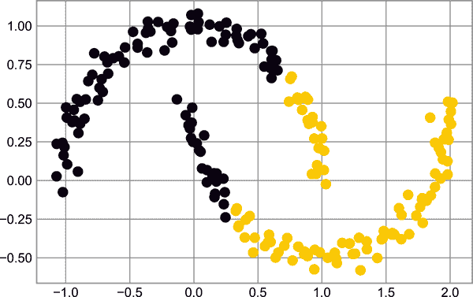

# 第四十章：特征工程

前几章概述了机器学习的基本思想，但到目前为止的所有示例都假定您有数字数据以整洁的`[n_samples, n_features]`格式。在现实世界中，数据很少以这种形式出现。考虑到这一点，实际应用机器学习的一个更重要的步骤之一是*特征工程*：即，利用您对问题的任何信息，并将其转换为您可以用来构建特征矩阵的数字。

在本章中，我们将涵盖几个常见的特征工程任务示例：我们将查看用于表示分类数据、文本和图像的特征。此外，我们还将讨论增加模型复杂性和填补缺失数据的派生特征。这个过程通常被称为向量化，因为它涉及将任意数据转换为行为良好的向量。

# 分类特征

一种常见的非数值数据类型是*分类*数据。例如，想象一下您正在探索一些关于房价的数据，除了像“价格”和“房间”这样的数值特征之外，还有“街区”信息。例如，您的数据可能如下所示：

```py
In [1]: data = [
            {'price': 850000, 'rooms': 4, 'neighborhood': 'Queen Anne'},
            {'price': 700000, 'rooms': 3, 'neighborhood': 'Fremont'},
            {'price': 650000, 'rooms': 3, 'neighborhood': 'Wallingford'},
            {'price': 600000, 'rooms': 2, 'neighborhood': 'Fremont'}
        ]
```

您可能会被诱惑使用直接的数值映射来对这些数据进行编码：

```py
In [2]: {'Queen Anne': 1, 'Fremont': 2, 'Wallingford': 3};
```

但事实证明，在 Scikit-Learn 中，这一般不是一个有用的方法。该软件包的模型假设数值特征反映了代数量，因此这样的映射会暗示，例如，*Queen Anne < Fremont < Wallingford*，甚至是*Wallingford–Queen Anne = Fremont*，这（除了小众的人口统计笑话）并没有多少意义。

在这种情况下，一个经过验证的技术是使用*独热编码*，它有效地创建额外的列，指示类别的存在或不存在，分别为 1 或 0。当您的数据采取字典列表的形式时，Scikit-Learn 的 `DictVectorizer` 将为您执行此操作：

```py
In [3]: from sklearn.feature_extraction import DictVectorizer
        vec = DictVectorizer(sparse=False, dtype=int)
        vec.fit_transform(data)
Out[3]: array([[     0,      1,      0, 850000,      4],
               [     1,      0,      0, 700000,      3],
               [     0,      0,      1, 650000,      3],
               [     1,      0,      0, 600000,      2]])
```

请注意，`neighborhood` 列已扩展为三个单独的列，表示三个街区标签，每一行都在与其街区相关联的列中具有 1。有了这些分类特征编码，您可以像正常情况下一样拟合一个 Scikit-Learn 模型。

要查看每一列的含义，您可以检查特征名称：

```py
In [4]: vec.get_feature_names_out()
Out[4]: array(['neighborhood=Fremont', 'neighborhood=Queen Anne',
               'neighborhood=Wallingford', 'price', 'rooms'], dtype=object)
```

这种方法有一个明显的缺点：如果您的类别有许多可能的值，这可能会*大大*增加数据集的大小。然而，因为编码数据主要包含零，所以稀疏输出可以是一个非常有效的解决方案：

```py
In [5]: vec = DictVectorizer(sparse=True, dtype=int)
        vec.fit_transform(data)
Out[5]: <4x5 sparse matrix of type '<class 'numpy.int64'>'
                with 12 stored elements in Compressed Sparse Row format>
```

几乎所有的 Scikit-Learn 评估器都接受这种稀疏输入来拟合和评估模型。Scikit-Learn 包括的另外两个支持这种编码类型的工具是 `sklearn.preprocessing.OneHotEncoder` 和 `sklearn​.fea⁠ture_​extraction.FeatureHasher`。

# 文本特征

特征工程中另一个常见需求是将文本转换为一组代表性的数值。例如，大多数自动挖掘社交媒体数据都依赖于某种形式的文本编码为数字。编码这种类型数据的最简单方法之一是*词频*：你拿到每段文本，计算其中每个词的出现次数，并将结果放入表格中。

例如，考虑以下三个短语的集合：

```py
In [6]: sample = ['problem of evil',
                  'evil queen',
                  'horizon problem']
```

对于基于词频的数据向量化，我们可以构建代表词语“问题”、“of”、“evil”等的单独列。虽然在这个简单的例子中手动操作是可能的，但可以通过使用 Scikit-Learn 的`CountVectorizer`来避免这种单调的工作：

```py
In [7]: from sklearn.feature_extraction.text import CountVectorizer

        vec = CountVectorizer()
        X = vec.fit_transform(sample)
        X
Out[7]: <3x5 sparse matrix of type '<class 'numpy.int64'>'
                with 7 stored elements in Compressed Sparse Row format>
```

结果是一个记录每个词出现次数的稀疏矩阵；如果我们将其转换为带有标记列的`DataFrame`，检查起来就更容易了。

```py
In [8]: import pandas as pd
        pd.DataFrame(X.toarray(), columns=vec.get_feature_names_out())
Out[8]:    evil  horizon  of  problem  queen
        0     1        0   1        1      0
        1     1        0   0        0      1
        2     0        1   0        1      0
```

然而，使用简单的原始词频存在一些问题：它可能会导致对出现非常频繁的词给予过多权重，这在某些分类算法中可能不是最优的。修正这一问题的一种方法称为*词频-逆文档频率*（*TF-IDF*），它通过衡量词语在文档中出现的频率来加权词频。计算这些特征的语法与前面的例子类似：

实线显示了新结果，而较淡的虚线显示了之前较小数据集的结果。从验证曲线可以明显看出，较大的数据集可以支持更复杂的模型：这里的峰值可能在 6 次方附近，但即使是 20 次方的模型也没有严重过拟合数据——验证分数和训练分数保持非常接近。

```py
In [9]: from sklearn.feature_extraction.text import TfidfVectorizer
        vec = TfidfVectorizer()
        X = vec.fit_transform(sample)
        pd.DataFrame(X.toarray(), columns=vec.get_feature_names_out())
Out[9]:        evil   horizon        of   problem     queen
        0  0.517856  0.000000  0.680919  0.517856  0.000000
        1  0.605349  0.000000  0.000000  0.000000  0.795961
        2  0.000000  0.795961  0.000000  0.605349  0.000000
```

关于在分类问题中使用 TF-IDF 的示例，请参阅第四十一章。

# 图像特征

另一个常见需求是为机器学习分析适当编码图像。最简单的方法是我们在第三十八章中用于数字数据的方法：仅使用像素值本身。但根据应用程序的不同，这种方法可能不是最优的。

关于图像的特征提取技术的全面总结远超出本章的范围，但你可以在[Scikit-Image 项目](http://scikit-image.org)中找到许多标准方法的出色实现。关于如何同时使用 Scikit-Learn 和 Scikit-Image 的示例，请参阅第五十章。

# 派生特征

另一种有用的特征类型是从某些输入特征数学推导出来的特征。我们在第三十九章中看到了一个例子，当我们从输入数据构建*多项式特征*时。我们看到，我们可以将线性回归转换为多项式回归，而不是改变模型，而是通过转换输入！

例如，这些数据显然不能用一条直线很好地描述（见图 40-1）：

```py
In [10]: %matplotlib inline
         import numpy as np
         import matplotlib.pyplot as plt

         x = np.array([1, 2, 3, 4, 5])
         y = np.array([4, 2, 1, 3, 7])
         plt.scatter(x, y);
```


###### 图 40-1\. 不能很好地用直线描述的数据

我们仍然可以使用`LinearRegression`对数据进行线性拟合，并获得最优结果，如图 40-2 所示：

```py
In [11]: from sklearn.linear_model import LinearRegression
         X = x[:, np.newaxis]
         model = LinearRegression().fit(X, y)
         yfit = model.predict(X)
         plt.scatter(x, y)
         plt.plot(x, yfit);
```



###### 图 40-2\. 一条较差的直线拟合

但显然我们需要一个更复杂的模型来描述<math alttext="x"><mi>x</mi></math>和<math alttext="y"><mi>y</mi></math>之间的关系。

对此的一种方法是转换数据，添加额外的特征列以增强模型的灵活性。例如，我们可以这样向数据中添加多项式特征：

```py
In [12]: from sklearn.preprocessing import PolynomialFeatures
         poly = PolynomialFeatures(degree=3, include_bias=False)
         X2 = poly.fit_transform(X)
         print(X2)
Out[12]: [[  1.   1.   1.]
          [  2.   4.   8.]
          [  3.   9.  27.]
          [  4.  16.  64.]
          [  5.  25. 125.]]
```

派生的特征矩阵有一列表示<math alttext="x"><mi>x</mi></math>，第二列表示<math alttext="x squared"><msup><mi>x</mi> <mn>2</mn></msup></math>，第三列表示<math alttext="x cubed"><msup><mi>x</mi> <mn>3</mn></msup></math>。在这扩展输入上计算线性回归可以更接近我们的数据，如你在图 40-3 中所见：

```py
In [13]: model = LinearRegression().fit(X2, y)
         yfit = model.predict(X2)
         plt.scatter(x, y)
         plt.plot(x, yfit);
```


###### 图 40-3\. 对数据导出的多项式特征进行线性拟合

改进模型的一个思路不是改变模型本身，而是转换输入数据，这对许多更强大的机器学习方法至关重要。我们将在第四十二章进一步探讨这个想法，这是基函数回归的一个例子。更一般地说，这是强大技术集合——*核方法*的动机之一，我们将在第四十三章中探讨。

# 缺失数据的插补

特征工程中另一个常见需求是处理缺失数据。我们在第十六章中讨论了在`DataFrame`对象中处理缺失数据的方法，并看到`NaN`通常用于标记缺失值。例如，我们可能有一个数据集看起来像这样：

```py
In [14]: from numpy import nan
         X = np.array([[ nan, 0,   3  ],
                       [ 3,   7,   9  ],
                       [ 3,   5,   2  ],
                       [ 4,   nan, 6  ],
                       [ 8,   8,   1  ]])
         y = np.array([14, 16, -1,  8, -5])
```

当将典型的机器学习模型应用于这类数据时，我们需要首先用适当的填充值替换缺失值。这被称为*缺失值的插补*，策略从简单（例如，用列的平均值替换缺失值）到复杂（例如，使用矩阵完成或强健模型处理此类数据）。

高级方法往往非常依赖于特定应用场景，我们在这里不会深入讨论。对于使用均值、中位数或最频繁值的基本插补方法，Scikit-Learn 提供了`SimpleImputer`类：

```py
In [15]: from sklearn.impute import SimpleImputer
         imp = SimpleImputer(strategy='mean')
         X2 = imp.fit_transform(X)
         X2
Out[15]: array([[4.5, 0. , 3. ],
                [3. , 7. , 9. ],
                [3. , 5. , 2. ],
                [4. , 5. , 6. ],
                [8. , 8. , 1. ]])
```

我们看到在结果数据中，两个缺失值已经被替换为该列其余值的平均值。这些填充的数据可以直接输入到例如`LinearRegression`估算器中：

```py
In [16]: model = LinearRegression().fit(X2, y)
         model.predict(X2)
Out[16]: array([13.14869292, 14.3784627 , -1.15539732, 10.96606197, -5.33782027])
```

# 特征管道

使用任何上述示例，如果希望手动执行转换，尤其是希望串联多个步骤时，可能很快变得乏味。例如，我们可能希望一个处理管道看起来像这样：

1.  使用均值填补缺失值。

1.  将特征转换为二次项。

1.  拟合线性回归模型。

为了简化这种类型的处理管道，Scikit-Learn 提供了一个`Pipeline`对象，可以如下使用：

```py
In [17]: from sklearn.pipeline import make_pipeline

         model = make_pipeline(SimpleImputer(strategy='mean'),
                               PolynomialFeatures(degree=2),
                               LinearRegression())
```

这个管道看起来和操作起来像一个标准的 Scikit-Learn 对象，将所有指定的步骤应用于任何输入数据：

```py
In [18]: model.fit(X, y)  # X with missing values, from above
         print(y)
         print(model.predict(X))
Out[18]: [14 16 -1  8 -5]
         [14. 16. -1.  8. -5.]
```

模型的所有步骤都是自动应用的。请注意，为了简单起见，在这个演示中，我们已经将模型应用于它训练过的数据；这就是为什么它能够完美地预测结果（详见第三十九章进一步讨论）。

有关 Scikit-Learn 管道实际操作的一些示例，请参阅有关朴素贝叶斯分类的以下章节，以及第四十二章和第四十三章。
