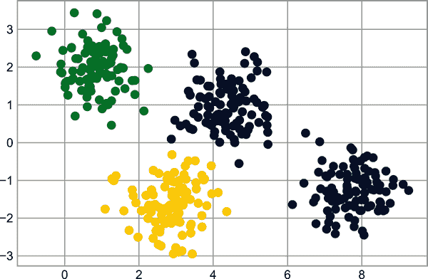

# 第四十一章：深入：朴素贝叶斯分类

前四章概述了机器学习的概念。在第五部分的其余部分，我们将首先更详细地查看四种监督学习算法，然后是四种无监督学习算法。我们从第一个监督方法朴素贝叶斯分类开始。

朴素贝叶斯模型是一组极快速且简单的分类算法，通常适用于非常高维度的数据集。因为它们速度快、可调参数少，所以它们通常用作分类问题的快速基准线。本章将提供朴素贝叶斯分类器工作原理的直观解释，并在一些数据集上展示它们的几个例子。

# 贝叶斯分类

朴素贝叶斯分类器是建立在贝叶斯分类方法之上的。这些方法依赖于贝叶斯定理，该定理描述了统计量的条件概率关系。在贝叶斯分类中，我们感兴趣的是找到给定一些观察特征的标签<math alttext="upper L"><mi>L</mi></math>的概率，可以写作<math alttext="upper P left-parenthesis upper L vertical-bar normal f normal e normal a normal t normal u normal r normal e normal s right-parenthesis"><mrow><mi>P</mi> <mo>(</mo> <mi>L</mi> <mo>|</mo> <mi>features</mi> <mo>)</mo></mrow></math>。贝叶斯定理告诉我们如何用我们可以更直接计算的量来表达这一点：

<math alttext="upper P left-parenthesis upper L vertical-bar normal f normal e normal a normal t normal u normal r normal e normal s right-parenthesis equals StartFraction upper P left-parenthesis normal f normal e normal a normal t normal u normal r normal e normal s vertical-bar upper L right-parenthesis upper P left-parenthesis upper L right-parenthesis Over upper P left-parenthesis normal f normal e normal a normal t normal u normal r normal e normal s right-parenthesis EndFraction" display="block"><mrow><mi>P</mi> <mrow><mo>(</mo> <mi>L</mi> <mo>|</mo> <mi>features</mi> <mo>)</mo></mrow> <mo>=</mo> <mfrac><mrow><mi>P</mi><mo>(</mo> <mi>features</mi> <mo>|</mo><mi>L</mi><mo>)</mo><mi>P</mi><mo>(</mo><mi>L</mi><mo>)</mo></mrow> <mrow><mi>P</mi><mo>(</mo> <mi>features</mi> <mo>)</mo></mrow></mfrac></mrow></math>

如果我们试图在两个标签之间做出决策——让我们称它们为<math alttext="upper L 1"><msub><mi>L</mi> <mn>1</mn></msub></math>和<math alttext="upper L 2"><msub><mi>L</mi> <mn>2</mn></msub></math>——那么做出这个决定的一种方法是计算每个标签的后验概率的比率：

<math alttext="StartFraction upper P left-parenthesis upper L 1 vertical-bar normal f normal e normal a normal t normal u normal r normal e normal s right-parenthesis Over upper P left-parenthesis upper L 2 vertical-bar normal f normal e normal a normal t normal u normal r normal e normal s right-parenthesis EndFraction equals StartFraction upper P left-parenthesis normal f normal e normal a normal t normal u normal r normal e normal s vertical-bar upper L 1 right-parenthesis Over upper P left-parenthesis normal f normal e normal a normal t normal u normal r normal e normal s vertical-bar upper L 2 right-parenthesis EndFraction StartFraction upper P left-parenthesis upper L 1 right-parenthesis Over upper P left-parenthesis upper L 2 right-parenthesis EndFraction" display="block"><mrow><mfrac><mrow><mi>P</mi><mo>(</mo><msub><mi>L</mi> <mn>1</mn></msub> <mo>|</mo> <mi>features</mi> <mo>)</mo></mrow> <mrow><mi>P</mi><mo>(</mo><msub><mi>L</mi> <mn>2</mn></msub> <mo>|</mo> <mi>features</mi> <mo>)</mo></mrow></mfrac> <mo>=</mo> <mfrac><mrow><mi>P</mi><mo>(</mo> <mi>features</mi> <mo>|</mo><msub><mi>L</mi> <mn>1</mn></msub> <mo>)</mo></mrow> <mrow><mi>P</mi><mo>(</mo> <mi>features</mi> <mo>|</mo><msub><mi>L</mi> <mn>2</mn></msub> <mo>)</mo></mrow></mfrac> <mfrac><mrow><mi>P</mi><mo>(</mo><msub><mi>L</mi> <mn>1</mn></msub> <mo>)</mo></mrow> <mrow><mi>P</mi><mo>(</mo><msub><mi>L</mi> <mn>2</mn></msub> <mo>)</mo></mrow></mfrac></mrow></math>

现在我们所需的只是一些模型，通过这些模型我们可以计算每个标签<math alttext="upper P left-parenthesis normal f normal e normal a normal t normal u normal r normal e normal s vertical-bar upper L Subscript i Baseline right-parenthesis"><mrow><mi>P</mi> <mo>(</mo> <mi>features</mi> <mo>|</mo> <msub><mi>L</mi> <mi>i</mi></msub> <mo>)</mo></mrow></math>。这样的模型被称为*生成模型*，因为它指定了生成数据的假设随机过程。为每个标签指定这种生成模型是这样一个贝叶斯分类器训练的主要部分。对于这样一个训练步骤的一般版本来说，这是一个非常困难的任务，但是我们可以通过对这个模型形式做一些简化的假设来简化它。

这就是“朴素贝叶斯”中的“朴素”所在：如果我们对每个标签的生成模型作出非常朴素的假设，我们可以找到每个类别的生成模型的粗略近似，然后继续贝叶斯分类。不同类型的朴素贝叶斯分类器基于关于数据的不同朴素假设，我们将在接下来的几节中讨论其中一些。

我们从标准导入开始：

```py
In [1]: %matplotlib inline
        import numpy as np
        import matplotlib.pyplot as plt
        import seaborn as sns
        plt.style.use('seaborn-whitegrid')
```

# 高斯朴素贝叶斯

或许最容易理解的朴素贝叶斯分类器是高斯朴素贝叶斯。使用这个分类器，假设*每个标签的数据都来自简单的高斯分布*。想象一下我们有以下数据，显示在图 41-1 中：

```py
In [2]: from sklearn.datasets import make_blobs
        X, y = make_blobs(100, 2, centers=2, random_state=2, cluster_std=1.5)
        plt.scatter(X[:, 0], X[:, 1], c=y, s=50, cmap='RdBu');
```


###### 图 41-1\. 高斯朴素贝叶斯分类数据¹

最简单的高斯模型假设数据由没有各维度间协方差的高斯分布描述。这个模型可以通过计算每个标签内点的均值和标准差来拟合，这是我们定义这种分布所需的所有内容。这种朴素高斯假设的结果显示在图 41-2 中。


###### 图 41-2\. 高斯朴素贝叶斯模型可视化²

这里的椭圆代表每个标签的高斯生成模型，中心区域的概率更高。有了每个类别的生成模型，我们可以简单地计算任何数据点的似然<math alttext="upper P left-parenthesis normal f normal e normal a normal t normal u normal r normal e normal s vertical-bar upper L 1 right-parenthesis"><mrow><mi>P</mi> <mo>(</mo> <mi>features</mi> <mo>|</mo> <msub><mi>L</mi> <mn>1</mn></msub> <mo>)</mo></mrow></math>，因此我们可以快速计算后验比率，并确定给定点最有可能的标签。

这个过程在 Scikit-Learn 的`sklearn.naive_bayes.GaussianNB`估计器中实现：

```py
In [3]: from sklearn.naive_bayes import GaussianNB
        model = GaussianNB()
        model.fit(X, y);
```

让我们生成一些新数据并预测标签：

```py
In [4]: rng = np.random.RandomState(0)
        Xnew = [-6, -14] + [14, 18] * rng.rand(2000, 2)
        ynew = model.predict(Xnew)
```

现在我们可以绘制这些新数据，以了解决策边界的位置（见图 41-3）。

```py
In [5]: plt.scatter(X[:, 0], X[:, 1], c=y, s=50, cmap='RdBu')
        lim = plt.axis()
        plt.scatter(Xnew[:, 0], Xnew[:, 1], c=ynew, s=20, cmap='RdBu', alpha=0.1)
        plt.axis(lim);
```



###### 图 41-3\. 高斯朴素贝叶斯分类可视化

我们可以看到分类中有一个略微弯曲的边界——一般来说，高斯朴素贝叶斯模型产生的边界将是二次的。

这种贝叶斯形式主义的一个优点是它自然地允许概率分类，我们可以使用`predict_proba`方法来计算：

```py
In [6]: yprob = model.predict_proba(Xnew)
        yprob[-8:].round(2)
Out[6]: array([[0.89, 0.11],
               [1.  , 0.  ],
               [1.  , 0.  ],
               [1.  , 0.  ],
               [1.  , 0.  ],
               [1.  , 0.  ],
               [0.  , 1.  ],
               [0.15, 0.85]])
```

这些列分别给出了第一个和第二个标签的后验概率。如果您正在寻找分类中的不确定性估计，像这样的贝叶斯方法可能是一个很好的起点。

当然，最终的分类结果将仅仅与导致它的模型假设一样好，这就是为什么高斯朴素贝叶斯通常不会产生非常好的结果的原因。尽管如此，在许多情况下——特别是特征数量变得很大时——这种假设并不足以阻止高斯朴素贝叶斯成为一种可靠的方法。

# 多项式朴素贝叶斯

刚刚描述的高斯假设远非是可以用于指定每个标签生成分布的唯一简单假设。另一个有用的例子是多项式朴素贝叶斯，其中假设特征是从简单的多项分布生成的。多项分布描述了在多个类别中观察计数的概率，因此多项式朴素贝叶斯最适合表示计数或计数率的特征。

这个想法与之前完全相同，只是不再用最佳拟合的高斯来建模数据分布，而是用最佳拟合的多项分布来建模。

## 示例：文本分类

多项式朴素贝叶斯经常用于文本分类的一个场合，其中特征与要分类的文档中的单词计数或频率相关。我们在第四十章中讨论了从文本中提取这些特征；在这里，我们将使用通过 Scikit-Learn 提供的 20 个新闻组语料库中的稀疏单词计数特征来展示如何将这些简短文档分类到不同的类别中。

让我们下载数据并查看目标名称：

```py
In [7]: from sklearn.datasets import fetch_20newsgroups

        data = fetch_20newsgroups()
        data.target_names
Out[7]: ['alt.atheism',
         'comp.graphics',
         'comp.os.ms-windows.misc',
         'comp.sys.ibm.pc.hardware',
         'comp.sys.mac.hardware',
         'comp.windows.x',
         'misc.forsale',
         'rec.autos',
         'rec.motorcycles',
         'rec.sport.baseball',
         'rec.sport.hockey',
         'sci.crypt',
         'sci.electronics',
         'sci.med',
         'sci.space',
         'soc.religion.christian',
         'talk.politics.guns',
         'talk.politics.mideast',
         'talk.politics.misc',
         'talk.religion.misc']
```

为了简单起见，在这里我们将只选择其中几个类别并下载训练和测试集：

```py
In [8]: categories = ['talk.religion.misc', 'soc.religion.christian',
                      'sci.space', 'comp.graphics']
        train = fetch_20newsgroups(subset='train', categories=categories)
        test = fetch_20newsgroups(subset='test', categories=categories)
```

这里是数据的一个代表性条目：

```py
In [9]: print(train.data[5][48:])
Out[9]: Subject: Federal Hearing
        Originator: dmcgee@uluhe
        Organization: School of Ocean and Earth Science and Technology
        Distribution: usa
        Lines: 10

        Fact or rumor....?  Madalyn Murray O'Hare an atheist who eliminated the
        use of the bible reading and prayer in public schools 15 years ago is now
        going to appear before the FCC with a petition to stop the reading of the
        Gospel on the airways of America.  And she is also campaigning to remove
        Christmas programs, songs, etc from the public schools.  If it is true
        then mail to Federal Communications Commission 1919 H Street Washington DC
        20054 expressing your opposition to her request.  Reference Petition number

        2493.
```

为了将这些数据用于机器学习，我们需要将每个字符串的内容转换为一个数字向量。为此，我们将使用 TF-IDF 向量化器（在第四十章介绍），并创建一个管道，将其附加到多项式朴素贝叶斯分类器：

```py
In [10]: from sklearn.feature_extraction.text import TfidfVectorizer
         from sklearn.naive_bayes import MultinomialNB
         from sklearn.pipeline import make_pipeline

         model = make_pipeline(TfidfVectorizer(), MultinomialNB())
```

有了这个管道，我们可以将模型应用于训练数据，并预测测试数据的标签：

```py
In [11]: model.fit(train.data, train.target)
         labels = model.predict(test.data)
```

现在我们已经预测了测试数据的标签，我们可以评估它们以了解估计器的性能。例如，让我们看一下测试数据的真实标签和预测标签之间的混淆矩阵（参见图 41-4）。

```py
In [12]: from sklearn.metrics import confusion_matrix
         mat = confusion_matrix(test.target, labels)
         sns.heatmap(mat.T, square=True, annot=True, fmt='d', cbar=False,
                     xticklabels=train.target_names, yticklabels=train.target_names,
                     cmap='Blues')
         plt.xlabel('true label')
         plt.ylabel('predicted label');
```

显然，即使这个非常简单的分类器可以成功地将关于空间讨论与计算机讨论分开，但它会在宗教讨论和基督教讨论之间感到困惑。这或许是可以预料的！

这里很酷的一点是，我们现在有工具来确定*任何*字符串的类别，只需使用此管道的`predict`方法。下面是一个实用函数，用于返回单个字符串的预测结果：

```py
In [13]: def predict_category(s, train=train, model=model):
             pred = model.predict([s])
             return train.target_names[pred[0]]
```

让我们试试它：

```py
In [14]: predict_category('sending a payload to the ISS')
Out[14]: 'sci.space'
```

```py
In [15]: predict_category('discussing the existence of God')
Out[15]: 'soc.religion.christian'
```

```py
In [16]: predict_category('determining the screen resolution')
Out[16]: 'comp.graphics'
```


###### 图 41-4\. 多项式朴素贝叶斯文本分类器的混淆矩阵

请记住，这只是一个对字符串中每个单词（加权）频率的简单概率模型；尽管如此，结果令人印象深刻。即使是非常朴素的算法，在小心使用并在大量高维数据上训练时，也可以出奇地有效。

# 何时使用朴素贝叶斯

由于朴素贝叶斯分类器对数据做出如此严格的假设，它们通常不如更复杂的模型表现好。尽管如此，它们有几个优点：

+   它们在训练和预测时都非常快速。

+   它们提供直观的概率预测。

+   它们通常易于解释。

+   它们具有少量（如果有的话）可调参数。

这些优势意味着朴素贝叶斯分类器通常是作为初始基线分类的不错选择。如果它表现得合适，那么恭喜你：你已经拥有了一个非常快速、易于解释的分类器来解决你的问题。如果它表现不佳，那么你可以开始探索更复杂的模型，同时具备一些关于它们应该如何表现的基础知识。

朴素贝叶斯分类器在以下情况下表现特别好：

+   当朴素假设实际上与数据匹配时（在实践中非常罕见）

+   对于非常分离的类别，当模型复杂度不那么重要时

+   对于非常高维数据，当模型复杂度不那么重要时

最后两点看似不同，但实际上是相关的：随着数据集维度的增长，任何两个点在一起的可能性大大降低（毕竟，它们必须在*每个维度*上都很接近才能在总体上接近）。这意味着在高维空间中，簇通常比低维空间中更为分离，平均而言。基于这个原因，像这里讨论的简单分类器往往在维度增加时表现得同样或更好：一旦你有足够的数据，即使是简单模型也可以非常强大。

¹ 此图的全彩版本可在[GitHub](https://oreil.ly/PDSH_GitHub)上找到。

² 生成此图的代码可在[在线附录](https://oreil.ly/o0ENq)中找到。
