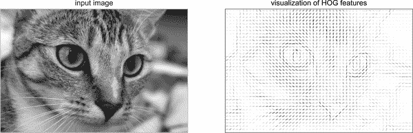
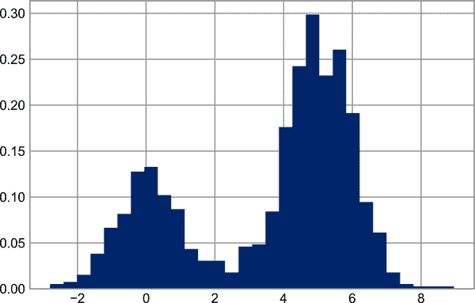
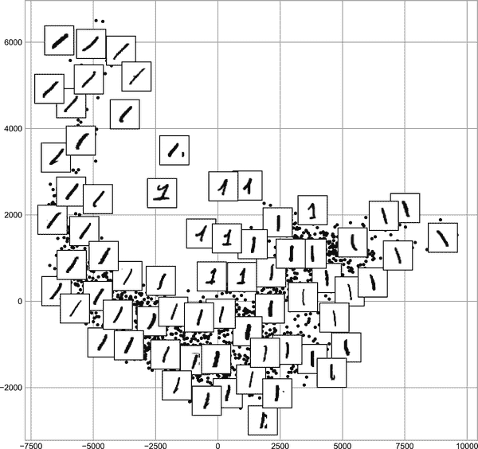

# 第四十二章：深入解析：线性回归

就像朴素贝叶斯（讨论见第四十一章）对于分类任务是一个很好的起点一样，线性回归模型对于回归任务也是一个很好的起点。这样的模型很受欢迎，因为它们可以快速拟合并且易于解释。你已经熟悉了最简单形式的线性回归模型（即将直线拟合到二维数据），但是这样的模型可以扩展到对更复杂的数据行为进行建模。

在本章中，我们将首先快速了解这个众所周知问题背后的数学知识，然后再看看线性模型如何被泛化以解决数据中更复杂的模式。

我们从标准导入开始：

```py
In [1]: %matplotlib inline
        import matplotlib.pyplot as plt
        plt.style.use('seaborn-whitegrid')
        import numpy as np
```

# 简单线性回归

我们将从最熟悉的线性回归开始，即对数据进行直线拟合。直线拟合是一个形式为的模型：

<math alttext="y equals a x plus b" display="block"><mrow><mi>y</mi> <mo>=</mo> <mi>a</mi> <mi>x</mi> <mo>+</mo> <mi>b</mi></mrow></math>

其中<math alttext="a"><mi>a</mi></math>通常被称为*斜率*，而<math alttext="b"><mi>b</mi></math>通常被称为*截距*。

考虑以下数据，这些数据分布在一条斜率为 2，截距为-5 的直线周围（见图 42-1）。

```py
In [2]: rng = np.random.RandomState(1)
        x = 10 * rng.rand(50)
        y = 2 * x - 5 + rng.randn(50)
        plt.scatter(x, y);
```



###### 图 42-1\. 线性回归的数据

我们可以使用 Scikit-Learn 的`LinearRegression`估计器来拟合这些数据并构建最佳拟合线，如图 42-2 所示。

```py
In [3]: from sklearn.linear_model import LinearRegression
        model = LinearRegression(fit_intercept=True)

        model.fit(x[:, np.newaxis], y)

        xfit = np.linspace(0, 10, 1000)
        yfit = model.predict(xfit[:, np.newaxis])

        plt.scatter(x, y)
        plt.plot(xfit, yfit);
```



###### 图 42-2\. 一个简单的线性回归模型

数据的斜率和截距包含在模型的拟合参数中，在 Scikit-Learn 中始终以下划线结尾标记。这里的相关参数是`coef_`和`intercept_`：

```py
In [4]: print("Model slope:    ", model.coef_[0])
        print("Model intercept:", model.intercept_)
Out[4]: Model slope:     2.0272088103606953
        Model intercept: -4.998577085553204
```

我们看到结果与用于生成数据的值非常接近，这是我们所希望的。

然而，`LinearRegression`估计器要比这更强大——除了简单的直线拟合外，它还可以处理形式为的多维线性模型：

<math alttext="y equals a 0 plus a 1 x 1 plus a 2 x 2 plus ellipsis" display="block"><mrow><mi>y</mi> <mo>=</mo> <msub><mi>a</mi> <mn>0</mn></msub> <mo>+</mo> <msub><mi>a</mi> <mn>1</mn></msub> <msub><mi>x</mi> <mn>1</mn></msub> <mo>+</mo> <msub><mi>a</mi> <mn>2</mn></msub> <msub><mi>x</mi> <mn>2</mn></msub> <mo>+</mo> <mo>⋯</mo></mrow></math>

其中有多个<math alttext="x"><mi>x</mi></math>值。从几何上讲，这类似于在三维空间中对点拟合平面，或者在更高维度中对点拟合超平面。

这种回归的多维性使其更难以可视化，但我们可以通过构建一些示例数据，使用 NumPy 的矩阵乘法运算符来看到其中一个拟合的过程：

```py
In [5]: rng = np.random.RandomState(1)
        X = 10 * rng.rand(100, 3)
        y = 0.5 + np.dot(X, [1.5, -2., 1.])

        model.fit(X, y)
        print(model.intercept_)
        print(model.coef_)
Out[5]: 0.50000000000001
        [ 1.5 -2.   1. ]
```

这里的<math alttext="y"><mi>y</mi></math>数据是从三个随机<math alttext="x"><mi>x</mi></math>值的线性组合构成的，线性回归恢复了用于构建数据的系数。

通过这种方式，我们可以使用单个 `LinearRegression` 评估器来拟合线条、平面或超平面到我们的数据。看起来这种方法仍然限制在变量之间严格的线性关系，但事实证明我们也可以放宽这一点。

# 基函数回归

你可以用的一个技巧是将线性回归适应变量之间的非线性关系，方法是根据 *基函数* 转换数据。我们之前已经见过这样的一个版本，在第三十九章和第四十章中使用的 `PolynomialRegression` 流水线中。这个想法是将我们的多维线性模型：

<math alttext="y equals a 0 plus a 1 x 1 plus a 2 x 2 plus a 3 x 3 plus ellipsis" display="block"><mrow><mi>y</mi> <mo>=</mo> <msub><mi>a</mi> <mn>0</mn></msub> <mo>+</mo> <msub><mi>a</mi> <mn>1</mn></msub> <msub><mi>x</mi> <mn>1</mn></msub> <mo>+</mo> <msub><mi>a</mi> <mn>2</mn></msub> <msub><mi>x</mi> <mn>2</mn></msub> <mo>+</mo> <msub><mi>a</mi> <mn>3</mn></msub> <msub><mi>x</mi> <mn>3</mn></msub> <mo>+</mo> <mo>⋯</mo></mrow></math>

并从我们的单维输入 <math alttext="x"><mi>x</mi></math> 中构建 <math alttext="x 1 comma x 2 comma x 3 comma"><mrow><msub><mi>x</mi> <mn>1</mn></msub> <mo>,</mo> <msub><mi>x</mi> <mn>2</mn></msub> <mo>,</mo> <msub><mi>x</mi> <mn>3</mn></msub> <mo>,</mo></mrow></math> 等等。也就是说，我们让 <math alttext="x Subscript n Baseline equals f Subscript n Baseline left-parenthesis x right-parenthesis"><mrow><msub><mi>x</mi> <mi>n</mi></msub> <mo>=</mo> <msub><mi>f</mi> <mi>n</mi></msub> <mrow><mo>(</mo> <mi>x</mi> <mo>)</mo></mrow></mrow></math> ，其中 <math alttext="f Subscript n Baseline left-parenthesis right-parenthesis"><mrow><msub><mi>f</mi> <mi>n</mi></msub> <mrow><mo>(</mo> <mo>)</mo></mrow></mrow></math> 是将我们的数据转换的某个函数。

例如，如果 <math alttext="f Subscript n Baseline left-parenthesis x right-parenthesis equals x Superscript n"><mrow><msub><mi>f</mi> <mi>n</mi></msub> <mrow><mo>(</mo> <mi>x</mi> <mo>)</mo></mrow> <mo>=</mo> <msup><mi>x</mi> <mi>n</mi></msup></mrow></math> ，我们的模型就会变成多项式回归：

<math alttext="y equals a 0 plus a 1 x plus a 2 x squared plus a 3 x cubed plus ellipsis" display="block"><mrow><mi>y</mi> <mo>=</mo> <msub><mi>a</mi> <mn>0</mn></msub> <mo>+</mo> <msub><mi>a</mi> <mn>1</mn></msub> <mi>x</mi> <mo>+</mo> <msub><mi>a</mi> <mn>2</mn></msub> <msup><mi>x</mi> <mn>2</mn></msup> <mo>+</mo> <msub><mi>a</mi> <mn>3</mn></msub> <msup><mi>x</mi> <mn>3</mn></msup> <mo>+</mo> <mo>⋯</mo></mrow></math>

注意，这仍然是 *线性模型* —— 线性指的是系数 <math alttext="a Subscript n"><msub><mi>a</mi> <mi>n</mi></msub></math> 从不相乘或相除。我们所做的实质上是将我们的一维 <math alttext="x"><mi>x</mi></math> 值投影到更高的维度，这样线性拟合可以拟合 <math alttext="x"><mi>x</mi></math> 和 <math alttext="y"><mi>y</mi></math> 之间更复杂的关系。

## 多项式基函数

这种多项式投影非常有用，以至于它被内置到 Scikit-Learn 中，使用 `PolynomialFeatures` 变换器：

```py
In [6]: from sklearn.preprocessing import PolynomialFeatures
        x = np.array([2, 3, 4])
        poly = PolynomialFeatures(3, include_bias=False)
        poly.fit_transform(x[:, None])
Out[6]: array([[ 2.,  4.,  8.],
               [ 3.,  9., 27.],
               [ 4., 16., 64.]])
```

我们在这里看到，变换器已经将我们的一维数组转换为一个三维数组，其中每列包含了指数化的值。这种新的、更高维的数据表示可以被插入到线性回归中。

正如我们在第四十章中看到的，实现这一点的最干净的方法是使用一个流水线。让我们用这种方式制作一个 7 次多项式模型：

```py
In [7]: from sklearn.pipeline import make_pipeline
        poly_model = make_pipeline(PolynomialFeatures(7),
                                   LinearRegression())
```

通过这种转换，我们可以使用线性模型更好地拟合<math alttext="x"><mi>x</mi></math>和<math alttext="y"><mi>y</mi></math>之间更复杂的关系。例如，这里是带噪声的正弦波（参见图 42-3）。

```py
In [8]: rng = np.random.RandomState(1)
        x = 10 * rng.rand(50)
        y = np.sin(x) + 0.1 * rng.randn(50)

        poly_model.fit(x[:, np.newaxis], y)
        yfit = poly_model.predict(xfit[:, np.newaxis])

        plt.scatter(x, y)
        plt.plot(xfit, yfit);
```


###### 图 42-3\. 对非线性训练数据进行线性多项式拟合

我们的线性模型，通过使用七阶多项式基函数，可以很好地拟合这些非线性数据！

## 高斯基函数

当然，也可以使用其他基函数。例如，一个有用的模式是拟合一个不是多项式基函数的模型，而是高斯基函数的总和。结果可能看起来像是图 42-4。


###### 图 42-4\. 高斯基函数拟合非线性数据¹

图中阴影区域是经过缩放的基函数，将它们相加后可以重现数据中的平滑曲线。这些高斯基函数没有内置到 Scikit-Learn 中，但我们可以编写一个自定义转换器来创建它们，如此处所示，并在图 42-5 中进行了说明（Scikit-Learn 的转换器是以 Python 类的形式实现的；查看 Scikit-Learn 的源代码是了解它们如何创建的好方法）：

```py
In [9]: from sklearn.base import BaseEstimator, TransformerMixin

        class GaussianFeatures(BaseEstimator, TransformerMixin):
            """Uniformly spaced Gaussian features for one-dimensional input"""

            def __init__(self, N, width_factor=2.0):
                self.N = N
                self.width_factor = width_factor

            @staticmethod
            def _gauss_basis(x, y, width, axis=None):
                arg = (x - y) / width
                return np.exp(-0.5 * np.sum(arg ** 2, axis))

            def fit(self, X, y=None):
                # create N centers spread along the data range
                self.centers_ = np.linspace(X.min(), X.max(), self.N)
                self.width_ = self.width_factor*(self.centers_[1]-self.centers_[0])
                return self

            def transform(self, X):
                return self._gauss_basis(X[:, :, np.newaxis], self.centers_,
                                         self.width_, axis=1)

        gauss_model = make_pipeline(GaussianFeatures(20),
                                    LinearRegression())
        gauss_model.fit(x[:, np.newaxis], y)
        yfit = gauss_model.predict(xfit[:, np.newaxis])

        plt.scatter(x, y)
        plt.plot(xfit, yfit)
        plt.xlim(0, 10);
```


###### 图 42-5\. 使用自定义转换器计算的高斯基函数拟合

我包含了这个例子，只是为了明确指出多项式基函数并非魔法：如果你对数据生成过程有某种直觉，认为某种基函数可能更合适，你可以使用它。

# 正则化

将基函数引入线性回归中使模型更加灵活，但也很快会导致过拟合（参见第三十九章中的讨论）。例如，如果使用大量高斯基函数，图 42-6 展示了会发生什么： 

```py
In [10]: model = make_pipeline(GaussianFeatures(30),
                               LinearRegression())
         model.fit(x[:, np.newaxis], y)

         plt.scatter(x, y)
         plt.plot(xfit, model.predict(xfit[:, np.newaxis]))

         plt.xlim(0, 10)
         plt.ylim(-1.5, 1.5);
```


###### 图 42-6\. 过度复杂的基函数模型会过拟合数据

将数据投影到 30 维基函数后，模型的灵活性大大增加，并在数据约束位置之间出现极值。如果我们绘制高斯基函数系数相对于它们位置的图表，我们可以看到这一现象，如图 42-7 所示。

```py
In [11]: def basis_plot(model, title=None):
             fig, ax = plt.subplots(2, sharex=True)
             model.fit(x[:, np.newaxis], y)
             ax[0].scatter(x, y)
             ax[0].plot(xfit, model.predict(xfit[:, np.newaxis]))
             ax[0].set(xlabel='x', ylabel='y', ylim=(-1.5, 1.5))

             if title:
                 ax[0].set_title(title)

             ax[1].plot(model.steps[0][1].centers_,
                        model.steps[1][1].coef_)
             ax[1].set(xlabel='basis location',
                       ylabel='coefficient',
                       xlim=(0, 10))

         model = make_pipeline(GaussianFeatures(30), LinearRegression())
         basis_plot(model)
```


###### 图 42-7\. 过度复杂模型中高斯基函数的系数

此图的下部面板显示了每个位置的基函数的幅度。当基函数重叠时，这是典型的过拟合行为：相邻基函数的系数会急剧增加并相互抵消。我们知道这种行为是有问题的，如果我们可以通过惩罚模型参数的大值来明确限制这样的峰值，那就太好了。这样的惩罚被称为*正则化*，有几种形式。

## 岭回归（L\[2\]正则化）

或许最常见的正则化形式被称为*岭回归*或<math alttext="upper L 2"><msub><mi>L</mi> <mn>2</mn></msub></math> *正则化*（有时也称为*Tikhonov 正则化*）。这通过对模型系数<math alttext="theta Subscript n"><msub><mi>θ</mi> <mi>n</mi></msub></math>的平方和（2-范数）进行惩罚来实现。在这种情况下，模型拟合的惩罚将是：

<math alttext="upper P equals alpha sigma-summation Underscript n equals 1 Overscript upper N Endscripts theta Subscript n Superscript 2" display="block"><mrow><mi>P</mi> <mo>=</mo> <mi>α</mi> <munderover><mo>∑</mo> <mrow><mi>n</mi><mo>=</mo><mn>1</mn></mrow> <mi>N</mi></munderover> <msubsup><mi>θ</mi> <mi>n</mi> <mn>2</mn></msubsup></mrow></math>

其中<math alttext="alpha"><mi>α</mi></math>是一个自由参数，用于控制惩罚的强度。这种类型的惩罚模型已经内置到 Scikit-Learn 中的`Ridge`估计器中（参见 Figure 42-8）。

```py
In [12]: from sklearn.linear_model import Ridge
         model = make_pipeline(GaussianFeatures(30), Ridge(alpha=0.1))
         basis_plot(model, title='Ridge Regression')
```


###### 图 42-8\. 岭（L\[2\]）正则化应用于过度复杂的模型（与 Figure 42-7 进行比较）

参数<math alttext="alpha"><mi>α</mi></math>本质上是一个控制生成模型复杂性的旋钮。在极限<math alttext="alpha right-arrow 0"><mrow><mi>α</mi> <mo>→</mo> <mn>0</mn></mrow></math>中，我们恢复了标准线性回归结果；在极限<math alttext="alpha right-arrow normal infinity"><mrow><mi>α</mi> <mo>→</mo> <mi>∞</mi></mrow></math>中，所有模型响应都将被抑制。岭回归的一个优点是它特别高效地计算—几乎没有比原始线性回归模型更多的计算成本。

## 套索回归（L\[1\]正则化）

另一种常见的正则化方法被称为*套索回归*或*L\[1\]正则化*，它涉及对回归系数的绝对值（1-范数）的惩罚：

<math alttext="upper P equals alpha sigma-summation Underscript n equals 1 Overscript upper N Endscripts StartAbsoluteValue theta Subscript n Baseline EndAbsoluteValue" display="block"><mrow><mi>P</mi> <mo>=</mo> <mi>α</mi> <munderover><mo>∑</mo> <mrow><mi>n</mi><mo>=</mo><mn>1</mn></mrow> <mi>N</mi></munderover> <mrow><mo>|</mo> <msub><mi>θ</mi> <mi>n</mi></msub> <mo>|</mo></mrow></mrow></math>

尽管这在概念上与岭回归非常相似，但结果可能出奇地不同。例如，由于其构造，套索回归倾向于偏爱可能的*稀疏模型*：也就是说，它更倾向于将许多模型系数设为零。

如果我们使用<math alttext="upper L 1"><msub><mi>L</mi> <mn>1</mn></msub></math> -归一化系数复制前面的示例，我们可以看到这种行为（参见 Figure 42-9）。

```py
In [13]: from sklearn.linear_model import Lasso
         model = make_pipeline(GaussianFeatures(30),
                               Lasso(alpha=0.001, max_iter=2000))
         basis_plot(model, title='Lasso Regression')
```


###### 图 42-9\. 套索（L\[1\]）正则化应用于过度复杂的模型（与 Figure 42-8 进行比较）

使用套索回归惩罚，大多数系数确实为零，功能行为由可用基函数的一小部分建模。与岭回归一样，<math alttext="alpha"><mi>α</mi></math>参数调节惩罚的强度，应通过例如交叉验证确定（请参阅第三十九章讨论此问题）。

# 示例：预测自行车流量

举个例子，让我们看看是否能够预测西雅图弗里蒙特桥上的自行车出行次数，基于天气、季节和其他因素。我们在第二十三章已经看过这些数据，但在这里我们将自行车数据与另一个数据集结合，并尝试确定天气和季节因素——温度、降水和日照小时——对该走廊自行车流量的影响程度。幸运的是，美国国家海洋和大气管理局（NOAA）提供其日常[气象站数据](https://oreil.ly/sE5zO)——我使用的是站点 ID USW00024233——我们可以轻松使用 Pandas 将这两个数据源连接起来。我们将执行简单的线性回归，将天气和其他信息与自行车计数关联起来，以估算这些参数中的任何变化如何影响给定日的骑行者数量。

特别是，这是 Scikit-Learn 工具如何在统计建模框架中使用的示例，其中假定模型的参数具有可解释的含义。正如前面讨论的那样，这不是机器学习中的标准方法，但对于某些模型是可能的。

让我们从加载两个数据集开始，以日期为索引：

```py
In [14]: # url = 'https://raw.githubusercontent.com/jakevdp/bicycle-data/main'
         # !curl -O {url}/FremontBridge.csv
         # !curl -O {url}/SeattleWeather.csv
```

```py
In [15]: import pandas as pd
         counts = pd.read_csv('FremontBridge.csv',
                              index_col='Date', parse_dates=True)
         weather = pd.read_csv('SeattleWeather.csv',
                               index_col='DATE', parse_dates=True)
```

为简单起见，让我们查看 2020 年之前的数据，以避免新冠肺炎大流行的影响，这显著影响了西雅图的通勤模式：

```py
In [16]: counts = counts[counts.index < "2020-01-01"]
         weather = weather[weather.index < "2020-01-01"]
```

接下来我们将计算每日自行车总流量，并将其放入独立的`DataFrame`中：

```py
In [17]: daily = counts.resample('d').sum()
         daily['Total'] = daily.sum(axis=1)
         daily = daily[['Total']] # remove other columns
```

我们之前看到使用模式通常从一天到另一天有所不同。让我们在数据中考虑这一点，通过添加指示星期几的二进制列：

```py
In [18]: days = ['Mon', 'Tue', 'Wed', 'Thu', 'Fri', 'Sat', 'Sun']
         for i in range(7):
             daily[days[i]] = (daily.index.dayofweek == i).astype(float)
```

同样，我们可能期待骑行者在假日有不同的行为表现；让我们也加上一个指示器：

```py
In [19]: from pandas.tseries.holiday import USFederalHolidayCalendar
         cal = USFederalHolidayCalendar()
         holidays = cal.holidays('2012', '2020')
         daily = daily.join(pd.Series(1, index=holidays, name='holiday'))
         daily['holiday'].fillna(0, inplace=True)
```

我们还可能怀疑白天的小时数会影响骑行的人数。让我们使用标准的天文计算来添加这些信息（参见图 42-10）。

```py
In [20]: def hours_of_daylight(date, axis=23.44, latitude=47.61):
             """Compute the hours of daylight for the given date"""
             days = (date - pd.datetime(2000, 12, 21)).days
             m = (1. - np.tan(np.radians(latitude))
                  * np.tan(np.radians(axis) * np.cos(days * 2 * np.pi / 365.25)))
             return 24. * np.degrees(np.arccos(1 - np.clip(m, 0, 2))) / 180.

         daily['daylight_hrs'] = list(map(hours_of_daylight, daily.index))
         daily[['daylight_hrs']].plot()
         plt.ylim(8, 17)
Out[20]: (8.0, 17.0)
```


###### 图 42-10\. 西雅图的日照小时可视化

我们还可以将平均温度和总降水量添加到数据中。除了降水英寸外，让我们添加一个指示某一天是否干燥（降水量为零）的标志：

```py
In [21]: weather['Temp (F)'] = 0.5 * (weather['TMIN'] + weather['TMAX'])
         weather['Rainfall (in)'] = weather['PRCP']
         weather['dry day'] = (weather['PRCP'] == 0).astype(int)

         daily = daily.join(weather[['Rainfall (in)', 'Temp (F)', 'dry day']])
```

最后，让我们添加一个从第 1 天开始递增的计数器，并测量经过了多少年。这将让我们测量每日过境量的观察到的年增长或年减少：

```py
In [22]: daily['annual'] = (daily.index - daily.index[0]).days / 365.
```

现在我们的数据已经整理好了，我们可以看一下：

```py
In [23]: daily.head()
Out[23]:               Total  Mon  Tue  Wed  Thu  Fri  Sat  Sun  holiday \
         Date
         2012-10-03  14084.0  0.0  0.0  1.0  0.0  0.0  0.0  0.0      0.0
         2012-10-04  13900.0  0.0  0.0  0.0  1.0  0.0  0.0  0.0      0.0
         2012-10-05  12592.0  0.0  0.0  0.0  0.0  1.0  0.0  0.0      0.0
         2012-10-06   8024.0  0.0  0.0  0.0  0.0  0.0  1.0  0.0      0.0
         2012-10-07   8568.0  0.0  0.0  0.0  0.0  0.0  0.0  1.0      0.0

                     daylight_hrs Rainfall (in)  Temp (F)  dry day    annual
         Date
         2012-10-03     11.277359           0.0      56.0        1  0.000000
         2012-10-04     11.219142           0.0      56.5        1  0.002740
         2012-10-05     11.161038           0.0      59.5        1  0.005479
         2012-10-06     11.103056           0.0      60.5        1  0.008219
         2012-10-07     11.045208           0.0      60.5        1  0.010959
```

有了这些东西，我们可以选择要使用的列，并对我们的数据拟合一个线性回归模型。我们将设置`fit_intercept=False`，因为每日标志基本上充当它们自己的特定于每天的截距：

```py
In [24]: # Drop any rows with null values
         daily.dropna(axis=0, how='any', inplace=True)

         column_names = ['Mon', 'Tue', 'Wed', 'Thu', 'Fri', 'Sat', 'Sun',
                         'holiday', 'daylight_hrs', 'Rainfall (in)',
                         'dry day', 'Temp (F)', 'annual']
         X = daily[column_names]
         y = daily['Total']

         model = LinearRegression(fit_intercept=False)
         model.fit(X, y)
         daily['predicted'] = model.predict(X)
```

最后，我们可以通过视觉比较总的和预测的自行车流量（见图 42-11）。

```py
In [25]: daily[['Total', 'predicted']].plot(alpha=0.5);
```



###### 图 42-11\. 我们模型对自行车流量的预测

从数据和模型预测不完全一致的事实来看，很明显我们已经错过了一些关键特征。我们的特征要么不完整（即，人们决定是否骑自行车去工作基于不止这些特征），要么有一些非线性关系我们没有考虑到（例如，也许在高温和低温下人们骑行较少）。然而，我们的粗略近似足以给我们一些见解，我们可以查看线性模型的系数以估算每个特征对每日自行车数量的贡献程度：

```py
In [26]: params = pd.Series(model.coef_, index=X.columns)
         params
Out[26]: Mon              -3309.953439
         Tue              -2860.625060
         Wed              -2962.889892
         Thu              -3480.656444
         Fri              -4836.064503
         Sat             -10436.802843
         Sun             -10795.195718
         holiday          -5006.995232
         daylight_hrs       409.146368
         Rainfall (in)    -2789.860745
         dry day           2111.069565
         Temp (F)           179.026296
         annual             324.437749
         dtype: float64
```

这些数字如果没有一些不确定性的度量，就很难解释。我们可以通过对数据进行自举重采样来快速计算这些不确定性：

```py
In [27]: from sklearn.utils import resample
         np.random.seed(1)
         err = np.std([model.fit(*resample(X, y)).coef_
                       for i in range(1000)], 0)
```

有了这些误差估计，让我们再次查看结果：

```py
In [28]: print(pd.DataFrame({'effect': params.round(0),
                             'uncertainty': err.round(0)}))
Out[28]:                 effect  uncertainty
         Mon            -3310.0        265.0
         Tue            -2861.0        274.0
         Wed            -2963.0        268.0
         Thu            -3481.0        268.0
         Fri            -4836.0        261.0
         Sat           -10437.0        259.0
         Sun           -10795.0        267.0
         holiday        -5007.0        401.0
         daylight_hrs     409.0         26.0
         Rainfall (in)  -2790.0        186.0
         dry day         2111.0        101.0
         Temp (F)         179.0          7.0
         annual           324.0         22.0
```

这里的`effect`列，粗略地说，显示了骑手数量如何受到所讨论特征变化的影响。例如，一周中的某一天就有明显的区别：周末的骑手要比工作日少几千人。我们还看到，每增加一个小时的阳光，会有 409 ± 26 人选择骑行；华氏度每增加一度，就会有 179 ± 7 人选择骑自行车；晴天意味着平均增加 2,111 ± 101 名骑手，而每英寸的降雨则导致 2,790 ± 186 名骑手选择另一种交通方式。一旦考虑了所有这些影响，我们就会看到每年新的日常骑手数量有一个适度的增加，为 324 ± 22 人。

我们的简单模型几乎肯定会缺少一些相关信息。例如，正如前面提到的，非线性效应（如降水和寒冷温度的影响）以及每个变量内的非线性趋势（例如对极冷和极热温度不愿意骑车的影响）无法在简单的线性模型中考虑。此外，我们还丢弃了一些更精细的信息（例如雨天早晨和雨天下午之间的差异），并且忽略了天之间的相关性（例如一个雨天星期二对星期三的可能影响，或者在连续多日雨天后出现意外晴天的影响）。这些都是潜在的有趣效应，如果你愿意，现在你已经有了开始探索它们的工具！

¹ 生成这个图表的代码可以在[在线附录](https://oreil.ly/o1Zya)中找到。
