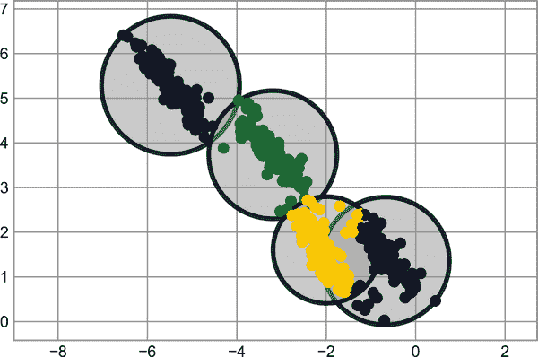
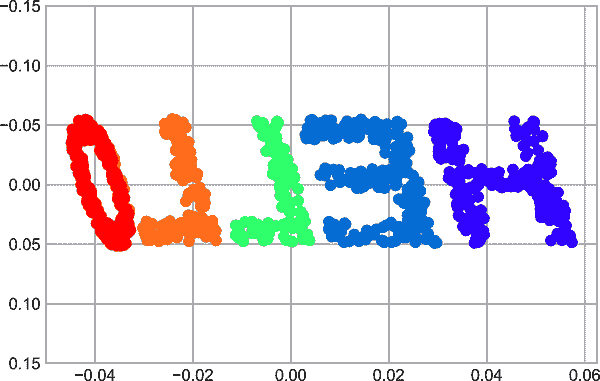
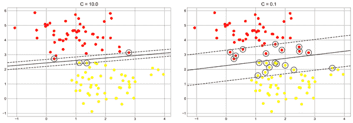
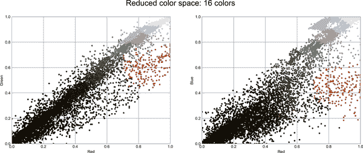

# 第四十三章：深入探讨支持向量机

支持向量机（SVMs）是一种特别强大和灵活的监督算法类，适用于分类和回归。在本章中，我们将探讨 SVM 背后的直觉及其在分类问题中的应用。

我们从标准导入开始：

```py
In [1]: %matplotlib inline
        import numpy as np
        import matplotlib.pyplot as plt
        plt.style.use('seaborn-whitegrid')
        from scipy import stats
```

###### 注

全尺寸、全彩色图像可在[GitHub 的补充材料](https://oreil.ly/PDSH_GitHub)中找到。

# 激励支持向量机

作为我们讨论贝叶斯分类的一部分（参见第四十一章），我们了解到了描述每个潜在类分布的简单模型，并尝试使用它来概率地确定新点的标签。那是一个生成分类的例子；在这里，我们将考虑判别分类。也就是说，我们不再模拟每个类，而是简单地找到一个（在二维中为线或曲线，在多维中为流形），将类彼此分开。

作为一个例子，考虑一个分类任务的简单情况，其中两类点是完全分开的（见图 43-1）。

```py
In [2]: from sklearn.datasets import make_blobs
        X, y = make_blobs(n_samples=50, centers=2,
                          random_state=0, cluster_std=0.60)
        plt.scatter(X[:, 0], X[:, 1], c=y, s=50, cmap='autumn');
```


###### 图 43-1\. 分类简单数据

线性判别分类器将尝试画一条直线分隔两组数据，并因此创建一个分类模型。对于像这样的二维数据，我们可以手动完成这项任务。但我们立即看到了一个问题：存在不止一条可能完全区分这两类的分界线！

我们可以如下绘制其中一些；图 43-2 展示了结果：

```py
In [3]: xfit = np.linspace(-1, 3.5)
        plt.scatter(X[:, 0], X[:, 1], c=y, s=50, cmap='autumn')
        plt.plot([0.6], [2.1], 'x', color='red', markeredgewidth=2, markersize=10)

        for m, b in [(1, 0.65), (0.5, 1.6), (-0.2, 2.9)]:
            plt.plot(xfit, m * xfit + b, '-k')

        plt.xlim(-1, 3.5);
```


###### 图 43-2\. 我们数据的三个完美线性判别分类器

这是三个*非常*不同的分隔符，尽管如此，它们完全可以区分这些样本。根据你选择的分界线，新的数据点（例如，在这个图中用“X”标记的点）将被分配不同的标签！显然，我们简单的“在类之间画一条线”的直觉不够好，我们需要更深入地思考。

# 支持向量机：最大化边缘

支持向量机提供了一种改进方法。其直觉是：与其简单地在类之间画一条零宽度线，我们可以在每条线周围绘制一定宽度的*边缘*，直到最近的点。这是一个展示的例子（见图 43-3）。

```py
In [4]: xfit = np.linspace(-1, 3.5)
        plt.scatter(X[:, 0], X[:, 1], c=y, s=50, cmap='autumn')

        for m, b, d in [(1, 0.65, 0.33), (0.5, 1.6, 0.55), (-0.2, 2.9, 0.2)]:
            yfit = m * xfit + b
            plt.plot(xfit, yfit, '-k')
            plt.fill_between(xfit, yfit - d, yfit + d, edgecolor='none',
                             color='lightgray', alpha=0.5)

        plt.xlim(-1, 3.5);
```

最大化这个边缘的线就是我们将选择作为最优模型的线。



###### 图 43-3\. 判别分类器内“边缘”的可视化

## 适配支持向量机

现在让我们看看对这些数据进行实际拟合的结果：我们将使用 Scikit-Learn 的支持向量分类器（`SVC`）来训练一个 SVM 模型。暂时地，我们将使用线性核并将参数`C`设置为一个非常大的数（稍后我们将深入讨论它们的含义）：

```py
In [5]: from sklearn.svm import SVC # "Support vector classifier"
        model = SVC(kernel='linear', C=1E10)
        model.fit(X, y)
Out[5]: SVC(C=10000000000.0, kernel='linear')
```

为了更好地可视化这里发生的情况，让我们创建一个快速便利函数，它将为我们绘制 SVM 决策边界（图 43-4）。

```py
In [6]: def plot_svc_decision_function(model, ax=None, plot_support=True):
            """Plot the decision function for a 2D SVC"""
            if ax is None:
                ax = plt.gca()
            xlim = ax.get_xlim()
            ylim = ax.get_ylim()

            # create grid to evaluate model
            x = np.linspace(xlim[0], xlim[1], 30)
            y = np.linspace(ylim[0], ylim[1], 30)
            Y, X = np.meshgrid(y, x)
            xy = np.vstack([X.ravel(), Y.ravel()]).T
            P = model.decision_function(xy).reshape(X.shape)

            # plot decision boundary and margins
            ax.contour(X, Y, P, colors='k',
                       levels=[-1, 0, 1], alpha=0.5,
                       linestyles=['--', '-', '--'])

            # plot support vectors
            if plot_support:
                ax.scatter(model.support_vectors_[:, 0],
                           model.support_vectors_[:, 1],
                           s=300, linewidth=1, edgecolors='black',
                           facecolors='none');
            ax.set_xlim(xlim)
            ax.set_ylim(ylim)
```

```py
In [7]: plt.scatter(X[:, 0], X[:, 1], c=y, s=50, cmap='autumn')
        plot_svc_decision_function(model);
```


###### 图 43-4\. 一个拟合到数据的支持向量机分类器，显示了边界（虚线）和支持向量（圆点）

这是最大化两组点之间间隔的分隔线。请注意，一些训练点恰好接触边界：它们在图 43-5 中被圈出来。这些点是此拟合的关键元素；它们被称为*支持向量*，并赋予了算法其名称。在 Scikit-Learn 中，这些点的标识存储在分类器的`support_vectors_`属性中：

```py
In [8]: model.support_vectors_
Out[8]: array([[0.44359863, 3.11530945],
               [2.33812285, 3.43116792],
               [2.06156753, 1.96918596]])
```

此分类器成功的关键在于对拟合来说，只有支持向量的位置是重要的；远离边界但在正确一侧的点不会修改拟合。从技术上讲，这是因为这些点不会对用于拟合模型的损失函数产生贡献，因此它们的位置和数量并不重要，只要它们不跨越边界。

例如，如果我们绘制从这个数据集的前 60 个点和前 120 个点学习到的模型（图 43-5），我们可以看到这一点。

```py
In [9]: def plot_svm(N=10, ax=None):
            X, y = make_blobs(n_samples=200, centers=2,
                              random_state=0, cluster_std=0.60)
            X = X[:N]
            y = y[:N]
            model = SVC(kernel='linear', C=1E10)
            model.fit(X, y)

            ax = ax or plt.gca()
            ax.scatter(X[:, 0], X[:, 1], c=y, s=50, cmap='autumn')
            ax.set_xlim(-1, 4)
            ax.set_ylim(-1, 6)
            plot_svc_decision_function(model, ax)

        fig, ax = plt.subplots(1, 2, figsize=(16, 6))
        fig.subplots_adjust(left=0.0625, right=0.95, wspace=0.1)
        for axi, N in zip(ax, [60, 120]):
            plot_svm(N, axi)
            axi.set_title('N = {0}'.format(N))
```


###### 图 43-5\. 新训练点对 SVM 模型的影响

在左侧面板中，我们看到了 60 个训练点的模型和支持向量。在右侧面板中，我们增加了训练点的数量，但模型没有改变：左侧面板中的三个支持向量与右侧面板中的支持向量相同。这种对远点行为的确切不敏感性是 SVM 模型的一种优势之一。

如果您正在实时运行此笔记本，您可以使用 IPython 的交互式小部件来交互地查看 SVM 模型的此功能：

```py
In [10]: from ipywidgets import interact, fixed
         interact(plot_svm, N=(10, 200), ax=fixed(None));
Out[10]: interactive(children=(IntSlider(value=10, description='N', max=200, min=10),
          > Output()), _dom_classes=('widget-...
```

## 超越线性边界：核支持向量机

当 SVM 与*核*结合时，它可以变得非常强大。我们之前在第四十二章中已经看到了核的一个版本，即基函数回归。在那里，我们将数据投影到由多项式和高斯基函数定义的更高维空间中，从而能够使用线性分类器拟合非线性关系。

在 SVM 模型中，我们可以使用相同思想的一个版本。为了证明核函数的必要性，让我们看一些不是线性可分的数据（参见图 43-6）。

```py
In [11]: from sklearn.datasets import make_circles
         X, y = make_circles(100, factor=.1, noise=.1)

         clf = SVC(kernel='linear').fit(X, y)

         plt.scatter(X[:, 0], X[:, 1], c=y, s=50, cmap='autumn')
         plot_svc_decision_function(clf, plot_support=False);
```


###### 图 43-6\. 线性分类器对非线性边界的性能较差。

很明显，没有任何线性判别能*永远*分离这些数据。但我们可以从第四十二章的基函数回归中吸取教训，并思考如何将数据投影到更高的维度，以便线性分隔器*足够*。例如，我们可以使用的一个简单投影是在中间聚集上计算一个*径向基函数*（RBF）：

```py
In [12]: r = np.exp(-(X ** 2).sum(1))
```

我们可以使用三维图来可视化这个额外的数据维度，如图 43-7 所示。

```py
In [13]: from mpl_toolkits import mplot3d

         ax = plt.subplot(projection='3d')
         ax.scatter3D(X[:, 0], X[:, 1], r, c=y, s=50, cmap='autumn')
         ax.view_init(elev=20, azim=30)
         ax.set_xlabel('x')
         ax.set_ylabel('y')
         ax.set_zlabel('r');
```


###### 图 43-7\. 为数据添加的第三个维度允许线性分离

我们可以看到，通过这个额外的维度，数据变得简单线性可分，通过在 *r*=0.7 处绘制一个分离平面。

在这种情况下，我们不得不选择并仔细调整我们的投影：如果我们没有将我们的径向基函数放在正确的位置，我们就不会看到如此清晰、线性可分的结果。一般来说，需要做出这样的选择是一个问题：我们希望以某种方式自动找到最佳的基函数来使用。

实现这一目标的一种策略是计算数据集中**每个**点处的基函数，并让 SVM 算法筛选结果。这种类型的基函数转换被称为*核变换*，因为它是基于每对点之间的相似关系（或核）。

这种策略的一个潜在问题是——将 <math alttext="upper N"><mi>N</mi></math> 点投影到 <math alttext="upper N"><mi>N</mi></math> 维空间中可能会变得非常计算密集，当 <math alttext="upper N"><mi>N</mi></math> 变大时。然而，由于一个称为 [*核技巧*](https://oreil.ly/h7PBj) 的巧妙小程序，对核变换数据的拟合可以隐式完成——也就是说，根本不需要构建核投影的完整 <math alttext="upper N"><mi>N</mi></math> -维表示。这个核技巧内置在 SVM 中，是该方法如此强大的原因之一。

在 Scikit-Learn 中，我们可以通过将我们的线性核改为 RBF 核，使用 `kernel` 模型超参数来应用核化的 SVM：

```py
In [14]: clf = SVC(kernel='rbf', C=1E6)
         clf.fit(X, y)
Out[14]: SVC(C=1000000.0)
```

让我们使用之前定义的函数来可视化拟合并标识支持向量（参见图 43-8）。

```py
In [15]: plt.scatter(X[:, 0], X[:, 1], c=y, s=50, cmap='autumn')
         plot_svc_decision_function(clf)
         plt.scatter(clf.support_vectors_[:, 0], clf.support_vectors_[:, 1],
                     s=300, lw=1, facecolors='none');
```


###### 图 43-8\. 核 SVM 对数据的拟合

使用这种核化支持向量机，我们学习到了一个适合的非线性决策边界。这种核变换策略在机器学习中经常被使用，将快速的线性方法转换为快速的非线性方法，特别适用于可以使用核技巧的模型。

## 调整 SVM：软化间隔

到目前为止，我们的讨论集中在非常干净的数据集上，其中存在完美的决策边界。但是如果您的数据有一定的重叠呢？例如，您可能有这样的数据（见图 43-9）。

```py
In [16]: X, y = make_blobs(n_samples=100, centers=2,
                           random_state=0, cluster_std=1.2)
         plt.scatter(X[:, 0], X[:, 1], c=y, s=50, cmap='autumn');
```



###### 图 43-9\. 具有一定重叠级别的数据

为了处理这种情况，SVM 实现中有一个“软化”间隔的修正因子：即，如果允许更好的拟合，某些点可以进入间隔。间隔的硬度由调整参数控制，通常称为`C`。对于很大的`C`，间隔是硬的，点不能位于其中。对于较小的`C`，间隔较软，并且可以包含一些点。

图 43-10 中显示的图表展示了通过软化间隔来改变`C`如何影响最终拟合的视觉效果：

```py
In [17]: X, y = make_blobs(n_samples=100, centers=2,
                           random_state=0, cluster_std=0.8)

         fig, ax = plt.subplots(1, 2, figsize=(16, 6))
         fig.subplots_adjust(left=0.0625, right=0.95, wspace=0.1)

         for axi, C in zip(ax, [10.0, 0.1]):
             model = SVC(kernel='linear', C=C).fit(X, y)
             axi.scatter(X[:, 0], X[:, 1], c=y, s=50, cmap='autumn')
             plot_svc_decision_function(model, axi)
             axi.scatter(model.support_vectors_[:, 0],
                         model.support_vectors_[:, 1],
                         s=300, lw=1, facecolors='none');
             axi.set_title('C = {0:.1f}'.format(C), size=14)
```



###### 图 43-10\. `C` 参数对支持向量拟合的影响

`C` 的最佳值将取决于您的数据集，您应该使用交叉验证或类似的程序来调整此参数（参考第三十九章）。

# 示例：人脸识别

作为支持向量机在实际中的应用示例，让我们来看一下人脸识别问题。我们将使用“野外标记人脸”数据集，该数据集包含数千张各种公众人物的合并照片。Scikit-Learn 内置了该数据集的获取器：

```py
In [18]: from sklearn.datasets import fetch_lfw_people
         faces = fetch_lfw_people(min_faces_per_person=60)
         print(faces.target_names)
         print(faces.images.shape)
Out[18]: ['Ariel Sharon' 'Colin Powell' 'Donald Rumsfeld' 'George W Bush'
          'Gerhard Schroeder' 'Hugo Chavez' 'Junichiro Koizumi' 'Tony Blair']
         (1348, 62, 47)
```

让我们绘制几张这些人脸，看看我们正在处理的内容（见图 43-11）。

```py
In [19]: fig, ax = plt.subplots(3, 5, figsize=(8, 6))
         for i, axi in enumerate(ax.flat):
             axi.imshow(faces.images[i], cmap='bone')
             axi.set(xticks=[], yticks=[],
                     xlabel=faces.target_names[faces.target[i]])
```


###### 图 43-11\. 来自野外标记人脸数据集的示例

每个图像包含 62 × 47，约 3,000 个像素。我们可以简单地使用每个像素值作为特征，但通常使用某种预处理器来提取更有意义的特征更为有效；在这里，我们将使用主成分分析（见第四十五章）提取 150 个基本组分，以供支持向量机分类器使用。我们可以通过将预处理器和分类器打包到单个管道中来实现这一点：

```py
In [20]: from sklearn.svm import SVC
         from sklearn.decomposition import PCA
         from sklearn.pipeline import make_pipeline

         pca = PCA(n_components=150, whiten=True,
                   svd_solver='randomized', random_state=42)
         svc = SVC(kernel='rbf', class_weight='balanced')
         model = make_pipeline(pca, svc)
```

为了测试我们分类器的输出，我们将数据分割为训练集和测试集：

```py
In [21]: from sklearn.model_selection import train_test_split
         Xtrain, Xtest, ytrain, ytest = train_test_split(faces.data, faces.target,
                                                         random_state=42)
```

最后，我们可以使用网格搜索交叉验证来探索参数的组合。在这里，我们将调整`C`（控制边界硬度）和`gamma`（控制径向基函数核的大小），并确定最佳模型：

```py
In [22]: from sklearn.model_selection import GridSearchCV
         param_grid = {'svc__C': [1, 5, 10, 50],
                       'svc__gamma': [0.0001, 0.0005, 0.001, 0.005]}
         grid = GridSearchCV(model, param_grid)

         %time grid.fit(Xtrain, ytrain)
         print(grid.best_params_)
Out[22]: CPU times: user 1min 19s, sys: 8.56 s, total: 1min 27s
         Wall time: 36.2 s
         {'svc__C': 10, 'svc__gamma': 0.001}
```

最优值集中在我们网格的中间；如果它们在边缘，我们将扩展网格以确保找到真正的最优值。

现在有了这个经过交叉验证的模型，我们可以预测测试数据的标签，这些数据模型尚未见过：

```py
In [23]: model = grid.best_estimator_
         yfit = model.predict(Xtest)
```

让我们看一些测试图像及其预测值（见图 43-12）。

```py
In [24]: fig, ax = plt.subplots(4, 6)
         for i, axi in enumerate(ax.flat):
             axi.imshow(Xtest[i].reshape(62, 47), cmap='bone')
             axi.set(xticks=[], yticks=[])
             axi.set_ylabel(faces.target_names[yfit[i]].split()[-1],
                            color='black' if yfit[i] == ytest[i] else 'red')
         fig.suptitle('Predicted Names; Incorrect Labels in Red', size=14);
```


###### 图 43-12\. 我们模型预测的标签

在这个小样本中，我们的最优估计器只误标了一个面孔（底部行的布什面孔被误标为布莱尔）。我们可以通过分类报告更好地了解我们估计器的性能，报告会逐标签列出恢复统计信息：

```py
In [25]: from sklearn.metrics import classification_report
         print(classification_report(ytest, yfit,
                                     target_names=faces.target_names))
Out[25]:                    precision    recall  f1-score   support

              Ariel Sharon       0.65      0.73      0.69        15
              Colin Powell       0.80      0.87      0.83        68
           Donald Rumsfeld       0.74      0.84      0.79        31
             George W Bush       0.92      0.83      0.88       126
         Gerhard Schroeder       0.86      0.83      0.84        23
               Hugo Chavez       0.93      0.70      0.80        20
         Junichiro Koizumi       0.92      1.00      0.96        12
                Tony Blair       0.85      0.95      0.90        42

                  accuracy                           0.85       337
                 macro avg       0.83      0.84      0.84       337
              weighted avg       0.86      0.85      0.85       337
```

我们还可以显示这些类别之间的混淆矩阵（见图 43-13）。

```py
In [26]: from sklearn.metrics import confusion_matrix
         import seaborn as sns
         mat = confusion_matrix(ytest, yfit)
         sns.heatmap(mat.T, square=True, annot=True, fmt='d',
                     cbar=False, cmap='Blues',
                     xticklabels=faces.target_names,
                     yticklabels=faces.target_names)
         plt.xlabel('true label')
         plt.ylabel('predicted label');
```



###### 图 43-13\. 面部数据的混淆矩阵

这帮助我们了解哪些标签可能会被估计器混淆。

对于一个现实世界的人脸识别任务，在这种任务中照片并未预先裁剪成漂亮的网格，面部分类方案唯一的区别在于特征选择：您需要使用更复杂的算法来找到面部，并提取与像素化无关的特征。对于这种应用，一个好的选择是利用[OpenCV](http://opencv.org)，它包括对一般图像和特别是人脸的先前实现的最新特征提取工具。

# 摘要

这是支持向量机背后原理的简明直观介绍。这些模型由于以下几个原因而是一种强大的分类方法：

+   它们依赖于相对较少的支持向量，因此紧凑且占用极少的内存空间。

+   一旦模型训练完成，预测阶段非常快速。

+   因为它们只受到靠近边界的点的影响，所以它们在处理高维数据时表现良好——即使是比样本更多维度的数据，这对其他算法来说是个挑战。

+   它们与核方法的集成使它们非常灵活，能够适应许多类型的数据。

然而，支持向量机（SVMs）也有几个缺点：

+   样本数量<math alttext="upper N"><mi>N</mi></math>的缩放为最坏情况下是<math alttext="script upper O left-bracket upper N cubed right-bracket"><mrow><mi>𝒪</mi> <mo>[</mo> <msup><mi>N</mi> <mn>3</mn></msup> <mo>]</mo></mrow></math>，或者对于高效实现是<math alttext="script upper O left-bracket upper N squared right-bracket"><mrow><mi>𝒪</mi> <mo>[</mo> <msup><mi>N</mi> <mn>2</mn></msup> <mo>]</mo></mrow></math>。对于大量的训练样本，这种计算成本可能是限制性的。

+   结果强烈依赖于合适的软化参数`C`的选择。必须通过交叉验证仔细选择，随着数据集增大，这可能是昂贵的。

+   结果没有直接的概率解释。可以通过内部交叉验证来估计（参见`SVC`的`probability`参数），但这额外的估计是昂贵的。

考虑到这些特性，我通常只有在其他更简单、更快速、不需要过多调整的方法被证明不足以满足我的需求时，才会转向支持向量机（SVM）。尽管如此，如果你有足够的 CPU 周期来进行数据训练和交叉验证 SVM，这种方法可以带来出色的结果。
