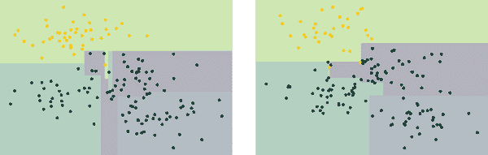
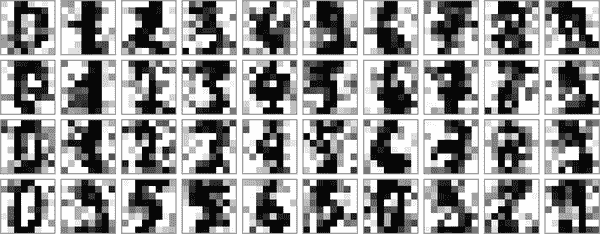

# 第四十四章：深入探讨：决策树和随机森林

之前，我们深入研究了一个简单的生成分类器（朴素贝叶斯；见 第四十一章）和一个强大的判别分类器（支持向量机；见 第四十三章）。在这里，我们将看看另一种强大的算法：一个称为 *随机森林* 的非参数算法。随机森林是一种 *集成* 方法的示例，意味着它依赖于聚合一组更简单的估算器的结果。这样的集成方法的一个令人惊讶的结果是，总和可以大于各部分之和：也就是说，多个估算器之间的多数投票的预测准确度最终可能会比任何进行投票的单个估算器的准确度更高！我们将在以下部分看到这方面的例子。

我们从标准导入开始：

```py
In [1]: %matplotlib inline
        import numpy as np
        import matplotlib.pyplot as plt
        plt.style.use('seaborn-whitegrid')
```

# 推动随机森林的动机：决策树

随机森林是建立在决策树上的集成学习器的一个例子。因此，我们将首先讨论决策树本身。

决策树是极其直观的分类或标记对象的方式：你只需提出一系列旨在对分类进行精准定位的问题。例如，如果你想构建一个用于对徒步时遇到的动物进行分类的决策树，你可以构建如 图 44-1 所示的决策树。


###### 图 44-1\. 二叉决策树的示例¹

二元分割使其极其高效：在构造良好的树时，每个问题将使选项数量减少约一半，非常快速地将选项缩小，即使在大量类别中也是如此。当然，关键在于决定每一步要问什么问题。在决策树的机器学习实现中，问题通常采用数据中的轴对齐分割形式：即，树中的每个节点都使用一个特征内的截止值将数据分为两组。现在让我们看一个示例。

## 创建决策树

考虑以下二维数据，它具有四个类标签之一（参见 图 44-2）。

```py
In [2]: from sklearn.datasets import make_blobs

        X, y = make_blobs(n_samples=300, centers=4,
                          random_state=0, cluster_std=1.0)
        plt.scatter(X[:, 0], X[:, 1], c=y, s=50, cmap='rainbow');
```


###### 图 44-2\. 决策树分类器的数据

基于这些数据构建的简单决策树将根据某些定量标准迭代地沿着一个或另一个轴将数据分割，并在每个级别根据其中的点的多数投票确定新区域的标签。图 44-3 展示了此数据的决策树分类器的前四个级别的可视化。


###### 图 44-3\. 决策树如何分割数据的可视化²

注意，第一个分割后，上层每个点保持不变，因此无需进一步细分此分支。除了包含同一颜色的节点外，在每个级别*每个*区域再次沿着两个特征之一进行分割。

在 Scikit-Learn 中，可以使用`DecisionTreeClassifier`估计器来拟合决策树到我们的数据：

```py
In [3]: from sklearn.tree import DecisionTreeClassifier
        tree = DecisionTreeClassifier().fit(X, y)
```

让我们编写一个实用函数来帮助我们可视化分类器的输出：

```py
In [4]: def visualize_classifier(model, X, y, ax=None, cmap='rainbow'):
            ax = ax or plt.gca()

            # Plot the training points
            ax.scatter(X[:, 0], X[:, 1], c=y, s=30, cmap=cmap,
                       clim=(y.min(), y.max()), zorder=3)
            ax.axis('tight')
            ax.axis('off')
            xlim = ax.get_xlim()
            ylim = ax.get_ylim()

            # fit the estimator
            model.fit(X, y)
            xx, yy = np.meshgrid(np.linspace(*xlim, num=200),
                                 np.linspace(*ylim, num=200))
            Z = model.predict(np.c_[xx.ravel(), yy.ravel()]).reshape(xx.shape)

            # Create a color plot with the results
            n_classes = len(np.unique(y))
            contours = ax.contourf(xx, yy, Z, alpha=0.3,
                                   levels=np.arange(n_classes + 1) - 0.5,
                                   cmap=cmap, zorder=1)

            ax.set(xlim=xlim, ylim=ylim)
```

现在我们可以看一下决策树分类的样子（参见图 44-4）。

```py
In [5]: visualize_classifier(DecisionTreeClassifier(), X, y)
```


###### 图 44-4\. 决策树分类的可视化

如果您正在实时运行此笔记本，您可以使用在线[附录](https://oreil.ly/etDrN)中包含的辅助脚本来打开决策树构建过程的交互式可视化：

```py
In [6]: # helpers_05_08 is found in the online appendix
        import helpers_05_08
        helpers_05_08.plot_tree_interactive(X, y);
Out[6]: interactive(children=(Dropdown(description='depth', index=1, options=(1, 5),
         > value=5), Output()), _dom_classes...
```

注意，随着深度的增加，我们往往会得到非常奇怪形状的分类区域；例如，在深度为五时，在黄色和蓝色区域之间有一个高而瘦的紫色区域。显然，这不是真实的内在数据分布的结果，而更多地是数据的特定采样或噪声特性的结果。也就是说，即使在仅深度为五的情况下，这棵决策树明显地过拟合了我们的数据。

## 决策树和过拟合

这种过拟合事实上是决策树的一个普遍特性：很容易使树的深度过深，从而适应特定数据的细节，而不是它们抽取自的分布的总体特性。另一种看待这种过拟合的方法是查看在不同数据子集上训练的模型——例如，在图 44-5 中，我们训练了两棵不同的树，每棵树都使用了原始数据的一半。



###### 图 44-5\. 两棵随机决策树的示例³

显然，在某些地方，两棵树产生一致的结果（例如，在四个角落），而在其他地方，两棵树给出非常不同的分类结果（例如，在任意两个簇之间的区域）。关键观察是，这种不一致往往发生在分类不确定的地方，因此通过使用*这两棵*树的信息，我们可能会得到更好的结果！

如果您正在实时运行此笔记本，以下函数将允许您交互地显示在数据的随机子集上训练的树的拟合情况：

```py
In [7]: # helpers_05_08 is found in the online appendix
        import helpers_05_08
        helpers_05_08.randomized_tree_interactive(X, y)
Out[7]: interactive(children=(Dropdown(description='random_state', options=(0, 100),
         > value=0), Output()), _dom_classes...
```

正如利用两棵树的信息可以改进我们的结果一样，我们可能期望利用许多树的信息进一步改进我们的结果。

# 集成估计器：随机森林

这种多个过拟合估计器组合以减少过拟合效应的概念，是支持一种称为*bagging*的集成方法的基础。Bagging 利用一个并行估计器的集合（可能是一个抓袋），每个估计器都会对数据过拟合，并对结果进行平均以找到更好的分类。随机化决策树的集成称为*随机森林*。

这种袋装分类可以通过 Scikit-Learn 的`BaggingClassifier`元估计器手动完成，如下所示（见图 44-6）。

```py
In [8]: from sklearn.tree import DecisionTreeClassifier
        from sklearn.ensemble import BaggingClassifier

        tree = DecisionTreeClassifier()
        bag = BaggingClassifier(tree, n_estimators=100, max_samples=0.8,
                                random_state=1)

        bag.fit(X, y)
        visualize_classifier(bag, X, y)
```

在本例中，我们通过对训练点的随机 80%子集拟合每个估计器来随机化数据。在实践中，通过在如何选择分割时注入一些随机性来更有效地随机化决策树：这样每次都会使所有数据对拟合有贡献，但拟合结果仍具有所需的随机性。例如，在确定要分割哪个特征时，随机树可能从顶部几个特征中选择。您可以在[Scikit-Learn 文档](https://oreil.ly/4jrv4)和其中的参考文献中阅读有关这些随机化策略的更多技术细节。


###### 图 44-6\. 随机决策树集成的决策边界

在 Scikit-Learn 中，这样一个优化的随机决策树集成是通过`RandomForestClassifier`估计器实现的，它自动处理所有随机化。你只需选择一些估计器，它将非常快速地（如果需要的话是并行的）拟合树的集成（见图 44-7）。

```py
In [9]: from sklearn.ensemble import RandomForestClassifier

        model = RandomForestClassifier(n_estimators=100, random_state=0)
        visualize_classifier(model, X, y);
```


###### 图 44-7\. 随机森林的决策边界，这是一组优化的决策树集成

我们看到通过对一百个随机扰动模型进行平均，最终得到一个与我们关于参数空间如何分割的直觉更接近的整体模型。

# 随机森林回归

在前一节中，我们考虑了随机森林在分类的上下文中。随机森林也可以在回归的情况下工作（即使用连续变量而不是分类变量）。用于此目的的估计器是`RandomForestRegressor`，其语法与我们之前看到的非常相似。

考虑以下数据，这些数据来自快速和慢速振荡的组合（见图 44-8）。

```py
In [10]: rng = np.random.RandomState(42)
         x = 10 * rng.rand(200)

         def model(x, sigma=0.3):
             fast_oscillation = np.sin(5 * x)
             slow_oscillation = np.sin(0.5 * x)
             noise = sigma * rng.randn(len(x))

             return slow_oscillation + fast_oscillation + noise

         y = model(x)
         plt.errorbar(x, y, 0.3, fmt='o');
```


###### 图 44-8\. 随机森林回归的数据

使用随机森林回归器，我们可以找到最佳拟合曲线（见图 44-9）。

```py
In [11]: from sklearn.ensemble import RandomForestRegressor
         forest = RandomForestRegressor(200)
         forest.fit(x[:, None], y)

         xfit = np.linspace(0, 10, 1000)
         yfit = forest.predict(xfit[:, None])
         ytrue = model(xfit, sigma=0)

         plt.errorbar(x, y, 0.3, fmt='o', alpha=0.5)
         plt.plot(xfit, yfit, '-r');
         plt.plot(xfit, ytrue, '-k', alpha=0.5);
```


###### 图 44-9\. 随机森林模型拟合数据

这里显示了真实模型的平滑灰色曲线，而随机森林模型则通过锯齿状红色曲线展示。非参数随机森林模型足够灵活，能够拟合多期数据，而无需指定多期模型！

# 示例：用于分类数字的随机森林

在第三十八章中，我们通过一个使用 Scikit-Learn 提供的数字数据集的示例来工作。让我们再次使用它来看看随机森林分类器在这种情况下的应用：

```py
In [12]: from sklearn.datasets import load_digits
         digits = load_digits()
         digits.keys()
Out[12]: dict_keys(['data', 'target', 'frame', 'feature_names', 'target_names',
          > 'images', 'DESCR'])
```

为了提醒我们正在查看的内容，我们将可视化前几个数据点（参见图 44-10）。

```py
In [13]: # set up the figure
         fig = plt.figure(figsize=(6, 6))  # figure size in inches
         fig.subplots_adjust(left=0, right=1, bottom=0, top=1,
                             hspace=0.05, wspace=0.05)

         # plot the digits: each image is 8x8 pixels
         for i in range(64):
             ax = fig.add_subplot(8, 8, i + 1, xticks=[], yticks=[])
             ax.imshow(digits.images[i], cmap=plt.cm.binary, interpolation='nearest')

             # label the image with the target value
             ax.text(0, 7, str(digits.target[i]))
```



###### 图 44-10\. 数字数据的表示

我们可以使用随机森林对数字进行分类，如下所示：

```py
In [14]: from sklearn.model_selection import train_test_split

         Xtrain, Xtest, ytrain, ytest = train_test_split(digits.data, digits.target,
                                                         random_state=0)
         model = RandomForestClassifier(n_estimators=1000)
         model.fit(Xtrain, ytrain)
         ypred = model.predict(Xtest)
```

让我们看看这个分类器的分类报告：

```py
In [15]: from sklearn import metrics
         print(metrics.classification_report(ypred, ytest))
Out[15]:               precision    recall  f1-score   support

                    0       1.00      0.97      0.99        38
                    1       0.98      0.98      0.98        43
                    2       0.95      1.00      0.98        42
                    3       0.98      0.96      0.97        46
                    4       0.97      1.00      0.99        37
                    5       0.98      0.96      0.97        49
                    6       1.00      1.00      1.00        52
                    7       1.00      0.96      0.98        50
                    8       0.94      0.98      0.96        46
                    9       0.98      0.98      0.98        47

             accuracy                           0.98       450
            macro avg       0.98      0.98      0.98       450
         weighted avg       0.98      0.98      0.98       450
```

并且为了更直观，绘制混淆矩阵（参见图 44-11）。

```py
In [16]: from sklearn.metrics import confusion_matrix
         import seaborn as sns
         mat = confusion_matrix(ytest, ypred)
         sns.heatmap(mat.T, square=True, annot=True, fmt='d',
                     cbar=False, cmap='Blues')
         plt.xlabel('true label')
         plt.ylabel('predicted label');
```

我们发现，一个简单的未调整的随机森林能够对数字数据进行相当准确的分类。


###### 图 44-11\. 使用随机森林进行数字分类的混淆矩阵

# 概要

本章简要介绍了集成估计器的概念，特别是随机森林，它是随机化决策树的集成。随机森林是一种功能强大的方法，具有多个优点：

+   由于底层决策树的简单性，训练和预测都非常快。此外，由于每棵树都是独立实体，因此这两个任务可以直接并行化。

+   多棵树允许进行概率分类：估算器的多数投票给出了概率的估计（在 Scikit-Learn 中通过`predict_proba`方法访问）。

+   非参数模型非常灵活，因此在其他估算器欠拟合的任务上表现良好。

随机森林的一个主要缺点是结果不易解释：也就是说，如果你想对分类模型的*含义*得出结论，随机森林可能不是最佳选择。

¹ 生成此图的代码可在[在线附录](https://oreil.ly/xP9ZI)中找到。

² 生成此图的代码可在[在线附录](https://oreil.ly/H4WFg)中找到。

³ 生成此图的代码可在[在线附录](https://oreil.ly/PessV)中找到。
