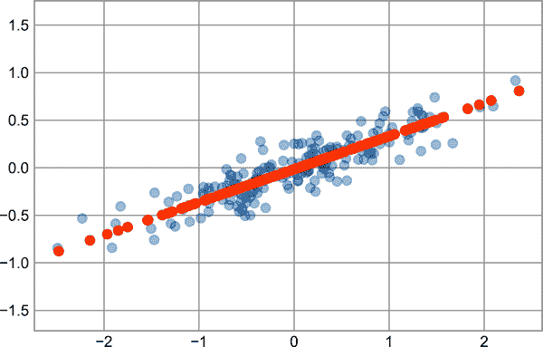

# 第四十五章：深入解析：主成分分析

到目前为止，我们一直在深入研究监督学习估计器：那些根据标记的训练数据预测标签的估计器。在这里，我们开始研究几个无监督估计器，这些估计器可以突出数据的一些有趣方面，而不需要参考任何已知的标签。

在本章中，我们将探讨或许是最广泛使用的无监督算法之一，即主成分分析（PCA）。PCA 本质上是一种降维算法，但它也可以作为可视化工具、噪声过滤器、特征提取和工程等工具使用。在简短讨论了 PCA 算法的概念后，我们将探索其进一步应用的几个例子。

我们从标准导入开始：

```py
In [1]: %matplotlib inline
        import numpy as np
        import matplotlib.pyplot as plt
        plt.style.use('seaborn-whitegrid')
```

# 引入主成分分析

主成分分析是一种快速灵活的无监督数据降维方法，我们在第 38 章中简要介绍过。通过查看一个二维数据集，最容易理解其行为。考虑这 200 个点（见图 45-1）。

```py
In [2]: rng = np.random.RandomState(1)
        X = np.dot(rng.rand(2, 2), rng.randn(2, 200)).T
        plt.scatter(X[:, 0], X[:, 1])
        plt.axis('equal');
```


###### 图 45-1\. 主成分分析演示数据

从眼睛的角度来看，很明显*x*和*y*变量之间存在近乎线性的关系。这让人想起我们在第 42 章中探索的线性回归数据，但这里的问题设置略有不同：与尝试从*x*值预测*y*值不同，无监督学习问题试图学习*x*和*y*值之间的*关系*。

在主成分分析中，通过找到数据中的一组*主轴*来量化这种关系，并使用这些轴来描述数据集。使用 Scikit-Learn 的`PCA`估计器，我们可以按如下方式计算：

```py
In [3]: from sklearn.decomposition import PCA
        pca = PCA(n_components=2)
        pca.fit(X)
Out[3]: PCA(n_components=2)
```

拟合从数据中学习到一些量，最重要的是分量和解释方差：

```py
In [4]: print(pca.components_)
Out[4]: [[-0.94446029 -0.32862557]
         [-0.32862557  0.94446029]]
```

```py
In [5]: print(pca.explained_variance_)
Out[5]: [0.7625315 0.0184779]
```

要理解这些数字的含义，让我们将它们视为向量在输入数据上的可视化，使用分量定义向量的方向和解释方差定义向量的平方长度（见图 45-2）。

```py
In [6]: def draw_vector(v0, v1, ax=None):
            ax = ax or plt.gca()
            arrowprops=dict(arrowstyle='->', linewidth=2,
                            shrinkA=0, shrinkB=0)
            ax.annotate('', v1, v0, arrowprops=arrowprops)

        # plot data
        plt.scatter(X[:, 0], X[:, 1], alpha=0.2)
        for length, vector in zip(pca.explained_variance_, pca.components_):
            v = vector * 3 * np.sqrt(length)
            draw_vector(pca.mean_, pca.mean_ + v)
        plt.axis('equal');
```


###### 图 45-2\. 数据中主轴的可视化

这些向量代表了数据的主轴，每个向量的长度表示描述数据分布中该轴的“重要性”的指标——更精确地说，它是数据在投影到该轴上时的方差的度量。将每个数据点投影到主轴上得到了数据的主成分。

如果我们将这些主成分与原始数据一起绘制，我们会看到在图 45-3 中显示的图形。


###### 图 45-3\. 数据中转换后的主轴¹

将数据轴转换为主轴的这种变换是*仿射变换*，这意味着它由平移、旋转和均匀缩放组成。

虽然这种寻找主成分的算法可能看起来只是一种数学上的好奇，但它事实证明在机器学习和数据探索领域有着非常广泛的应用。

## PCA 作为降维

使用 PCA 进行降维涉及将一个或多个最小主成分置零，结果是数据的低维投影，保留了最大的数据方差。

这里是使用 PCA 作为降维转换的示例：

```py
In [7]: pca = PCA(n_components=1)
        pca.fit(X)
        X_pca = pca.transform(X)
        print("original shape:   ", X.shape)
        print("transformed shape:", X_pca.shape)
Out[7]: original shape:    (200, 2)
        transformed shape: (200, 1)
```

转换后的数据已经降维到了单一维度。为了理解这种降维的效果，我们可以对这个降维后的数据执行逆变换，并将其与原始数据一起绘制（参见图 45-4）。

```py
In [8]: X_new = pca.inverse_transform(X_pca)
        plt.scatter(X[:, 0], X[:, 1], alpha=0.2)
        plt.scatter(X_new[:, 0], X_new[:, 1], alpha=0.8)
        plt.axis('equal');
```



###### 图 45-4\. PCA 作为降维的可视化

浅色点是原始数据，而深色点是投影版本。这清楚地展示了 PCA 降维的含义：移除沿着最不重要的主轴或轴的信息，只留下数据方差最大的分量。被削减的方差比例（与在前述图中形成的线周围的点的散布成比例）大致是这种降维中丢失的“信息”量的度量。

这个降维后的数据集在某些意义上是“足够好”的，能够编码点之间最重要的关系：尽管将数据特征的数量减少了 50%，但数据点之间的整体关系大部分得到了保留。

## PCA 用于可视化：手写数字

在只有两个维度时，降维的实用性可能并不完全明显，但当我们查看高维数据时，它变得更加清晰。为了看到这一点，让我们快速看一下我们在第四十四章中处理的数字数据集应用 PCA 的情况。

我们将从加载数据开始：

```py
In [9]: from sklearn.datasets import load_digits
        digits = load_digits()
        digits.data.shape
Out[9]: (1797, 64)
```

请回忆，数字数据集由 8×8 像素的图像组成，这意味着它们是 64 维的。为了对这些点之间的关系有一些直观的理解，我们可以使用 PCA 将它们投影到一个更易处理的维度，比如说两个维度：

```py
In [10]: pca = PCA(2)  # project from 64 to 2 dimensions
         projected = pca.fit_transform(digits.data)
         print(digits.data.shape)
         print(projected.shape)
Out[10]: (1797, 64)
         (1797, 2)
```

现在我们可以绘制每个点的前两个主成分，以了解数据，如在图 45-5 中所见。

```py
In [11]: plt.scatter(projected[:, 0], projected[:, 1],
                     c=digits.target, edgecolor='none', alpha=0.5,
                     cmap=plt.cm.get_cmap('rainbow', 10))
         plt.xlabel('component 1')
         plt.ylabel('component 2')
         plt.colorbar();
```


###### 图 45-5\. 应用于手写数字数据的 PCA

回想一下这些组件的含义：完整的数据是一个 64 维点云，而这些点是每个数据点沿着最大方差方向的投影。基本上，我们在 64 维空间中找到了允许我们在两个维度上看到数据布局的最佳拉伸和旋转，而且这是无监督的方式完成的，即没有参考标签。

## 组件的含义是什么？

在这里，我们可以再进一步，开始问减少的维度意味着什么。这种意义可以用基向量的组合来理解。例如，训练集中的每个图像由一组 64 个像素值定义，我们将其称为向量<math alttext="x"><mi>x</mi></math>：

<math alttext="x equals left-bracket x 1 comma x 2 comma x 3 ellipsis x 64 right-bracket" display="block"><mrow><mi>x</mi> <mo>=</mo> <mo>[</mo> <msub><mi>x</mi> <mn>1</mn></msub> <mo>,</mo> <msub><mi>x</mi> <mn>2</mn></msub> <mo>,</mo> <msub><mi>x</mi> <mn>3</mn></msub> <mo>⋯</mo> <msub><mi>x</mi> <mn>64</mn></msub> <mo>]</mo></mrow></math>

我们可以用像素基础来考虑这一点。也就是说，为了构建图像，我们将向量的每个元素乘以它描述的像素，然后将结果相加以构建图像：

<math alttext="normal i normal m normal a normal g normal e left-parenthesis x right-parenthesis equals x 1 dot left-parenthesis normal p normal i normal x normal e normal l 1 right-parenthesis plus x 2 dot left-parenthesis normal p normal i normal x normal e normal l 2 right-parenthesis plus x 3 dot left-parenthesis normal p normal i normal x normal e normal l 3 right-parenthesis ellipsis x 64 dot left-parenthesis normal p normal i normal x normal e normal l 64 right-parenthesis" display="block"><mrow><mi>image</mi> <mrow><mo>(</mo> <mi>x</mi> <mo>)</mo></mrow> <mo>=</mo> <msub><mi>x</mi> <mn>1</mn></msub> <mo>·</mo> <mrow><mo>(</mo> <mi>pixel</mi> <mn>1</mn> <mo>)</mo></mrow> <mo>+</mo> <msub><mi>x</mi> <mn>2</mn></msub> <mo>·</mo> <mrow><mo>(</mo> <mi>pixel</mi> <mn>2</mn> <mo>)</mo></mrow> <mo>+</mo> <msub><mi>x</mi> <mn>3</mn></msub> <mo>·</mo> <mrow><mo>(</mo> <mi>pixel</mi> <mn>3</mn> <mo>)</mo></mrow> <mo>⋯</mo> <msub><mi>x</mi> <mn>64</mn></msub> <mo>·</mo> <mrow><mo>(</mo> <mi>pixel</mi> <mn>64</mn> <mo>)</mo></mrow></mrow></math>

我们可以想象一种降低数据维度的方法是将除了少数基向量之外的所有值归零。例如，如果我们仅使用前八个像素，我们得到数据的八维投影（见图 45-6）。然而，这并不太反映整个图像：我们几乎丢弃了 90%的像素！


###### 图 45-6\. 通过丢弃像素实现的天真降维²

上排面板显示单独的像素，下排显示这些像素对图像构建的累积贡献。仅使用八个像素基础组件，我们只能构建 64 像素图像的一小部分。如果我们继续这个序列并使用所有 64 个像素，我们将恢复原始图像。

但像素级表示并不是唯一的基础选择。我们还可以使用其他基函数，每个基函数都包含来自每个像素的一些预定义贡献，并编写如下内容：

<math alttext="i m a g e left-parenthesis x right-parenthesis equals normal m normal e normal a normal n plus x 1 dot left-parenthesis normal b normal a normal s normal i normal s 1 right-parenthesis plus x 2 dot left-parenthesis normal b normal a normal s normal i normal s 2 right-parenthesis plus x 3 dot left-parenthesis normal b normal a normal s normal i normal s 3 right-parenthesis ellipsis" display="block"><mrow><mi>i</mi> <mi>m</mi> <mi>a</mi> <mi>g</mi> <mi>e</mi> <mrow><mo>(</mo> <mi>x</mi> <mo>)</mo></mrow> <mo>=</mo> <mi>mean</mi> <mo>+</mo> <msub><mi>x</mi> <mn>1</mn></msub> <mo>·</mo> <mrow><mo>(</mo> <mi>basis</mi> <mn>1</mn> <mo>)</mo></mrow> <mo>+</mo> <msub><mi>x</mi> <mn>2</mn></msub> <mo>·</mo> <mrow><mo>(</mo> <mi>basis</mi> <mn>2</mn> <mo>)</mo></mrow> <mo>+</mo> <msub><mi>x</mi> <mn>3</mn></msub> <mo>·</mo> <mrow><mo>(</mo> <mi>basis</mi> <mn>3</mn> <mo>)</mo></mrow> <mo>⋯</mo></mrow></math>

PCA 可以被看作是选择最优基函数的过程，使得仅添加前几个基函数就足以适当地重构数据集中的大部分元素。主成分作为我们数据的低维表示，实际上只是乘以这一系列中每个元素的系数。图 45-7 展示了使用平均值加上前八个 PCA 基函数重建相同数字的类似描述。


###### 图 45-7\. 通过丢弃最不重要的主成分实现的更复杂的降维（与图 45-6 比较)³

与像素基础不同，PCA 基础允许我们仅通过平均值加上八个组件来恢复输入图像的显著特征！每个像素在每个组件中的量是我们二维示例中向量方向的必然结果。这就是 PCA 提供数据低维表示的方式：它发现一组比输入数据的原生像素基础更有效的基础函数。

## 选择组件的数量

在实际应用中使用 PCA 的一个重要部分是估计需要多少个组件来描述数据。这可以通过查看组件数量作为累积*解释方差比*的函数来确定（参见图 45-8）。

```py
In [12]: pca = PCA().fit(digits.data)
         plt.plot(np.cumsum(pca.explained_variance_ratio_))
         plt.xlabel('number of components')
         plt.ylabel('cumulative explained variance');
```

此曲线量化了在前<math alttext="upper N"><mi>N</mi></math>个组件中包含的总 64 维方差的比例。例如，我们看到对于数字数据，前 10 个组件包含大约 75%的方差，而您需要约 50 个组件来描述接近 100%的方差。


###### 图 45-8\. 累积解释方差，用于衡量 PCA 保留数据内容的效果

这告诉我们，我们的二维投影丢失了大量信息（由解释方差度量），我们需要大约 20 个组件来保留 90%的方差。查看高维数据集的此图可以帮助您了解其特征中存在的冗余水平。

# PCA 作为噪声过滤器

PCA 还可以用作噪声数据的过滤方法。其思想是：任何方差远大于噪声影响的成分应该相对不受噪声影响。因此，如果您仅使用主成分的最大子集重建数据，则应优先保留信号并丢弃噪声。

让我们看看数字数据的情况。首先，我们将绘制几个无噪声输入样本（图 45-9）。

```py
In [13]: def plot_digits(data):
             fig, axes = plt.subplots(4, 10, figsize=(10, 4),
                                      subplot_kw={'xticks':[], 'yticks':[]},
                                      gridspec_kw=dict(hspace=0.1, wspace=0.1))
             for i, ax in enumerate(axes.flat):
                 ax.imshow(data[i].reshape(8, 8),
                           cmap='binary', interpolation='nearest',
                           clim=(0, 16))
         plot_digits(digits.data)
```


###### 图 45-9\. 无噪声的数字

现在让我们添加一些随机噪声以创建一个带噪声的数据集，并重新绘制它（图 45-10）。

```py
In [14]: rng = np.random.default_rng(42)
         rng.normal(10, 2)
Out[14]: 10.609434159508863
```

```py
In [15]: rng = np.random.default_rng(42)
         noisy = rng.normal(digits.data, 4)
         plot_digits(noisy)
```


###### 图 45-10\. 添加了高斯随机噪声的数字

可视化使得随机噪声的存在变得明显。让我们在嘈杂数据上训练一个 PCA 模型，并要求投影保留 50%的方差：

```py
In [16]: pca = PCA(0.50).fit(noisy)
         pca.n_components_
Out[16]: 12
```

这里 50%的方差相当于 12 个主成分，而原始的 64 个特征。现在我们计算这些成分，然后使用变换的逆来重构经过滤波的数字；图 45-11 展示了结果。

```py
In [17]: components = pca.transform(noisy)
         filtered = pca.inverse_transform(components)
         plot_digits(filtered)
```


###### 图 45-11\. 使用 PCA 进行“去噪”处理的数字

这种信号保留/噪声过滤特性使得 PCA 成为非常有用的特征选择例程——例如，不是在非常高维度的数据上训练分类器，而是在较低维度的主成分表示上训练分类器，这将自动过滤输入中的随机噪声。

# 示例：特征脸

我们之前探讨了使用 PCA 技术作为支持向量机的特征选择器进行人脸识别的示例（见第四十三章）。现在让我们回顾一下，并深入探讨这背后的更多内容。回想一下，我们使用的是由 Scikit-Learn 提供的 Labeled Faces in the Wild（LFW）数据集：

```py
In [18]: from sklearn.datasets import fetch_lfw_people
         faces = fetch_lfw_people(min_faces_per_person=60)
         print(faces.target_names)
         print(faces.images.shape)
Out[18]: ['Ariel Sharon' 'Colin Powell' 'Donald Rumsfeld' 'George W Bush'
          'Gerhard Schroeder' 'Hugo Chavez' 'Junichiro Koizumi' 'Tony Blair']
         (1348, 62, 47)
```

让我们看看涵盖此数据集的主轴。由于这是一个大数据集，我们将在`PCA`估计器中使用`"random"`特征求解器：它使用随机方法来更快地近似前<math alttext="upper N"><mi>N</mi></math>个主成分，而不是标准方法，以牺牲一些准确性。这种权衡在高维数据（这里接近 3,000 维）中非常有用。我们将看一看前 150 个成分：

```py
In [19]: pca = PCA(150, svd_solver='randomized', random_state=42)
         pca.fit(faces.data)
Out[19]: PCA(n_components=150, random_state=42, svd_solver='randomized')
```

在这种情况下，可以通过可视化与前几个主成分相关联的图像来进行探索（这些成分在技术上称为*特征向量*，因此这些类型的图像通常被称为*特征脸*；正如您在图 45-12 中所见，它们听起来就像它们看起来那样可怕）：

```py
In [20]: fig, axes = plt.subplots(3, 8, figsize=(9, 4),
                                  subplot_kw={'xticks':[], 'yticks':[]},
                                  gridspec_kw=dict(hspace=0.1, wspace=0.1))
         for i, ax in enumerate(axes.flat):
             ax.imshow(pca.components_[i].reshape(62, 47), cmap='bone')
```


###### 图 45-12\. 从 LFW 数据集学习的特征脸的可视化

结果非常有趣，并且为我们提供了关于图像变化的见解：例如，前几个特征脸（左上角）似乎与脸部的光照角度有关，而后来的主成分似乎在挑选出特定的特征，如眼睛、鼻子和嘴唇。让我们看一看这些成分的累计方差，以查看投影保留了多少数据信息（见图 45-13）。

```py
In [21]: plt.plot(np.cumsum(pca.explained_variance_ratio_))
         plt.xlabel('number of components')
         plt.ylabel('cumulative explained variance');
```


###### 图 45-13\. LFW 数据的累计解释方差

我们选择的 150 个组件占了超过 90%的方差。这使我们相信，使用这 150 个组件，我们将恢复数据的大部分基本特征。为了更具体化，我们可以将输入图像与从这些 150 个组件重建的图像进行比较（参见图 45-14）。

```py
In [22]: # Compute the components and projected faces
         pca = pca.fit(faces.data)
         components = pca.transform(faces.data)
         projected = pca.inverse_transform(components)
```

```py
In [23]: # Plot the results
         fig, ax = plt.subplots(2, 10, figsize=(10, 2.5),
                                subplot_kw={'xticks':[], 'yticks':[]},
                                gridspec_kw=dict(hspace=0.1, wspace=0.1))
         for i in range(10):
             ax[0, i].imshow(faces.data[i].reshape(62, 47), cmap='binary_r')
             ax[1, i].imshow(projected[i].reshape(62, 47), cmap='binary_r')

         ax[0, 0].set_ylabel('full-dim\ninput')
         ax[1, 0].set_ylabel('150-dim\nreconstruction');
```


###### 图 45-14\. LFW 数据的 150 维 PCA 重建

这里的顶部行显示了输入图像，而底部行显示了仅从约 3000 个初始特征中的 150 个进行图像重建。这种可视化清楚地说明了 PCA 特征选择在第四十三章中为何如此成功：虽然它将数据的维度减少了近 20 倍，但投影图像包含足够的信息，使我们可以通过肉眼识别每个图像中的个体。这意味着我们的分类算法只需要在 150 维数据上进行训练，而不是 3000 维数据，根据我们选择的特定算法，这可能会导致更高效的分类。

# 摘要

在本章中，我们探讨了主成分分析在降维、高维数据可视化、噪声过滤和高维数据特征选择中的应用。由于其多功能性和可解释性，PCA 已被证明在各种背景和学科中都非常有效。对于任何高维数据集，我倾向于从 PCA 开始，以便可视化数据点之间的关系（就像我们在数字数据中所做的那样），理解数据中的主要方差（就像我们在特征脸中所做的那样），并理解内在的维度（通过绘制解释方差比）。当然，PCA 并非对每个高维数据集都有用，但它提供了一条直观和高效的路径，以洞察高维数据。

PCA 的主要弱点是它往往受到数据中异常值的影响。因此，已经开发了几种鲁棒性较强的 PCA 变体，其中许多变体通过迭代地丢弃初始组件描述不佳的数据点来作用。Scikit-Learn 在`sklearn​.decom⁠position`子模块中包括了许多有趣的 PCA 变体；一个例子是`SparsePCA`，它引入了一个正则化项（参见第四十二章），用于强制组件的稀疏性。

在接下来的章节中，我们将研究其他建立在 PCA 思想基础上的无监督学习方法。

¹ 可在[在线附录](https://oreil.ly/VmpjC)中找到生成此图的代码。

² 可在[在线附录](https://oreil.ly/ixfc1)中找到生成此图的代码。

³ 生成此图的代码可以在[在线附录](https://oreil.ly/WSe0T)中找到。
