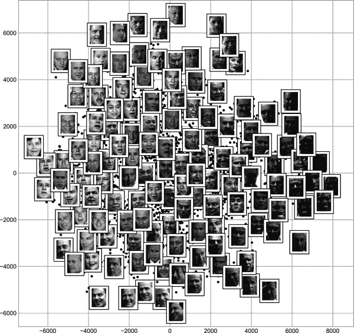

# 第四十六章：深入探讨：流形学习

在上一章中，我们看到 PCA 可以用于降维，减少数据集的特征数，同时保持点之间的基本关系。虽然 PCA 灵活、快速且易于解释，但当数据中存在非线性关系时，它的表现并不理想，我们很快将看到一些例子。

为了解决这一不足，我们可以转向*流形学习算法*——一类无监督估计器，旨在将数据集描述为嵌入在高维空间中的低维流形。当你想到流形时，我建议想象一张纸：这是一个二维物体，存在于我们熟悉的三维世界中。

在流形学的术语中，你可以将这张纸片看作是嵌入在三维空间中的二维流形。在三维空间中旋转、重新定向或拉伸这张纸片并不会改变其平面几何特性：这些操作类似于线性嵌入。如果你将纸张弯曲、卷曲或揉皱，它仍然是一个二维流形，但是嵌入到三维空间的方式不再是线性的。流形学算法旨在学习纸张的基本二维特性，即使它被扭曲以填充三维空间。

在这里，我们将研究多种流形方法，深入探讨其中的一些技术：多维尺度法（MDS）、局部线性嵌入（LLE）和等距映射（Isomap）。

我们从标准导入开始：

```py
In [1]: %matplotlib inline
        import matplotlib.pyplot as plt
        plt.style.use('seaborn-whitegrid')
        import numpy as np
```

# 流形学习：“HELLO”

为了更清晰地阐明这些概念，让我们首先生成一些二维数据，以便用来定义一个流形。这里是一个能创建“HELLO”形状数据的函数：

```py
In [2]: def make_hello(N=1000, rseed=42):
            # Make a plot with "HELLO" text; save as PNG
            fig, ax = plt.subplots(figsize=(4, 1))
            fig.subplots_adjust(left=0, right=1, bottom=0, top=1)
            ax.axis('off')
            ax.text(0.5, 0.4, 'HELLO', va='center', ha='center',
                    weight='bold', size=85)
            fig.savefig('hello.png')
            plt.close(fig)

            # Open this PNG and draw random points from it
            from matplotlib.image import imread
            data = imread('hello.png')[::-1, :, 0].T
            rng = np.random.RandomState(rseed)
            X = rng.rand(4 * N, 2)
            i, j = (X * data.shape).astype(int).T
            mask = (data[i, j] < 1)
            X = X[mask]
            X[:, 0] *= (data.shape[0] / data.shape[1])
            X = X[:N]
            return X[np.argsort(X[:, 0])]
```

让我们调用这个函数，并可视化生成的数据（参见图 46-1）。

```py
In [3]: X = make_hello(1000)
        colorize = dict(c=X[:, 0], cmap=plt.cm.get_cmap('rainbow', 5))
        plt.scatter(X[:, 0], X[:, 1], **colorize)
        plt.axis('equal');
```

输出是二维的，由“HELLO”形状的点组成。这种数据形式将帮助我们直观地了解这些算法的作用。


###### 图 46-1\. 用于流形学习的数据

# 多维尺度法

查看这样的数据，我们可以看到数据集中特定的*x*和*y*值并不是数据最基本的描述：我们可以缩放、收缩或旋转数据，而“HELLO”仍然是显而易见的。例如，如果我们使用旋转矩阵旋转数据，*x*和*y*值会改变，但数据基本上仍然是相同的（参见图 46-2）。

```py
In [4]: def rotate(X, angle):
            theta = np.deg2rad(angle)
            R = [[np.cos(theta), np.sin(theta)],
                 [-np.sin(theta), np.cos(theta)]]
            return np.dot(X, R)

        X2 = rotate(X, 20) + 5
        plt.scatter(X2[:, 0], X2[:, 1], **colorize)
        plt.axis('equal');
```


###### 图 46-2\. 旋转的数据集

这证实了*x*和*y*值不一定是数据关系中的基本要素。在这种情况下，基本的是数据集中每个点之间的距离。表示这一点的常见方法是使用距离矩阵：对于<math alttext="upper N"><mi>N</mi></math>个点，我们构造一个<math alttext="upper N times upper N"><mrow><mi>N</mi> <mo>×</mo> <mi>N</mi></mrow></math>数组，使得条目<math alttext="left-parenthesis i comma j right-parenthesis"><mrow><mo>(</mo> <mi>i</mi> <mo>,</mo> <mi>j</mi> <mo>)</mo></mrow></math>包含点<math alttext="i"><mi>i</mi></math>和点<math alttext="j"><mi>j</mi></math>之间的距离。让我们使用 Scikit-Learn 的高效`pairwise_distances`函数来为我们的原始数据做到这一点：

```py
In [5]: from sklearn.metrics import pairwise_distances
        D = pairwise_distances(X)
        D.shape
Out[5]: (1000, 1000)
```

正如承诺的那样，对于我们的*N*=1,000 个点，我们获得了一个 1,000 × 1,000 的矩阵，可以像这样进行可视化（参见图 46-3）。

```py
In [6]: plt.imshow(D, zorder=2, cmap='viridis', interpolation='nearest')
        plt.colorbar();
```


###### 图 46-3\. 点之间的成对距离可视化

如果我们类似地为我们旋转和平移的数据构建一个距离矩阵，我们会看到它是相同的：

```py
In [7]: D2 = pairwise_distances(X2)
        np.allclose(D, D2)
Out[7]: True
```

这个距离矩阵给出了一个与旋转和平移无关的数据表示，但在图 46-3 中的矩阵可视化并不完全直观。在那里显示的表示中，我们失去了数据中有趣结构的任何可见迹象：“HELLO”。

此外，从(*x*, *y*)坐标计算距离矩阵很简单，但将距离转换回*x*和*y*坐标却相当困难。这正是多维缩放算法的目标：给定点之间的距离矩阵，它恢复数据的<math alttext="upper D"><mi>D</mi></math>维坐标表示。让我们看看它如何处理我们的距离矩阵，使用`precomputed`表示我们正在传递一个距离矩阵（见图 46-4）。

```py
In [8]: from sklearn.manifold import MDS
        model = MDS(n_components=2, dissimilarity='precomputed', random_state=1701)
        out = model.fit_transform(D)
        plt.scatter(out[:, 0], out[:, 1], **colorize)
        plt.axis('equal');
```


###### 图 46-4\. 从成对距离计算得到的 MDS 嵌入

MDS 算法使用描述数据点之间关系的<math alttext="upper N times upper N"><mrow><mi>N</mi> <mo>×</mo> <mi>N</mi></mrow></math>距离矩阵之一，仅恢复了我们数据的可能的二维坐标表示。

## MDS 作为流形学习

当我们考虑到距离矩阵可以从*任何*维度的数据中计算时，这种用处变得更加明显。例如，我们不仅可以简单地将数据在二维平面上旋转，还可以使用以下函数将其投影到三维（本质上是早期使用的旋转矩阵的三维推广）。

```py
In [9]: def random_projection(X, dimension=3, rseed=42):
            assert dimension >= X.shape[1]
            rng = np.random.RandomState(rseed)
            C = rng.randn(dimension, dimension)
            e, V = np.linalg.eigh(np.dot(C, C.T))
            return np.dot(X, V[:X.shape[1]])

        X3 = random_projection(X, 3)
        X3.shape
Out[9]: (1000, 3)
```

让我们可视化这些点，看看我们在处理什么（见图 46-5）。

```py
In [10]: from mpl_toolkits import mplot3d
         ax = plt.axes(projection='3d')
         ax.scatter3D(X3[:, 0], X3[:, 1], X3[:, 2],
                      **colorize);
```


###### 图 46-5\. 数据线性嵌入到三维空间中

现在，我们可以要求`MDS`估计器输入这三维数据，计算距离矩阵，然后确定这个距离矩阵的最优二维嵌入。结果恢复了原始数据的表示，如图 46-6 所示。

```py
In [11]: model = MDS(n_components=2, random_state=1701)
         out3 = model.fit_transform(X3)
         plt.scatter(out3[:, 0], out3[:, 1], **colorize)
         plt.axis('equal');
```

这基本上是流形学习估计器的目标：在给定高维嵌入数据的情况下，寻找保持数据内部某些关系的低维表示。在 MDS 的情况下，保持的量是每对点之间的距离。


###### 图 46-6\. 三维数据的 MDS 嵌入恢复了输入，经过了旋转和反射。

## 非线性嵌入：MDS 失败的地方

到目前为止，我们讨论的是*线性*嵌入，这本质上是将数据旋转、平移和缩放到更高维空间中。当嵌入是非线性的时候，即超出这简单操作集合时，MDS 失效了。考虑下面的嵌入，它将输入扭曲成了三维空间中的“S”形状：

```py
In [12]: def make_hello_s_curve(X):
             t = (X[:, 0] - 2) * 0.75 * np.pi
             x = np.sin(t)
             y = X[:, 1]
             z = np.sign(t) * (np.cos(t) - 1)
             return np.vstack((x, y, z)).T

         XS = make_hello_s_curve(X)
```

这同样是三维数据，但正如我们在图 46-7 中所见，嵌入更加复杂。

```py
In [13]: from mpl_toolkits import mplot3d
         ax = plt.axes(projection='3d')
         ax.scatter3D(XS[:, 0], XS[:, 1], XS[:, 2],
                      **colorize);
```


###### 图 46-7\. 数据非线性嵌入到三维空间中

数据点之间的基本关系仍然存在，但这次数据以非线性的方式进行了转换：它被包裹成了一个“S”形状。

如果我们尝试在这些数据上使用简单的 MDS 算法，它无法“展开”这个非线性嵌入，我们会丢失嵌入流形中基本的关系（见图 46-8）。

```py
In [14]: from sklearn.manifold import MDS
         model = MDS(n_components=2, random_state=2)
         outS = model.fit_transform(XS)
         plt.scatter(outS[:, 0], outS[:, 1], **colorize)
         plt.axis('equal');
```


###### 图 46-8\. 应用于非线性数据的 MDS 算法；它未能恢复底层结构

最佳的二维*线性*嵌入并没有展开 S 形曲线，而是丢弃了原始的 y 轴。

# 非线性流形：局部线性嵌入

在这里我们该怎么继续？退一步来看，我们可以看到问题的根源在于，MDS 试图在构建嵌入时保持远距离点之间的距离。但如果我们改变算法，使其仅保持附近点之间的距离会怎样？结果的嵌入会更接近我们想要的。

从视觉上看，我们可以将其想象成如图 46-9 所示。

这里每条淡淡的线表示一个应该在嵌入中保留的距离。左侧是 MDS 使用的模型的表示：它试图保持数据集中每对点之间的距离。右侧是一种名为*局部线性嵌入*的流形学习算法使用的模型的表示：它不是保留*所有*距离，而是试图仅保留*相邻点*之间的距离（在这种情况下，每个点的最近 100 个邻居）。

考虑左侧面板，我们可以看到为什么 MDS 失败了：没有办法展开这些数据同时充分保持两点之间绘制的每条线的长度。另一方面，对于右侧面板，情况看起来更加乐观。我们可以想象以一种方式展开数据，以保持线的长度大致相同。这正是 LLE 通过全局优化反映这种逻辑的成本函数所做的。


###### 图 46-9\. MDS 和 LLE 之间点之间联系的表示¹

LLE 有许多变体；在这里，我们将使用*改进的 LLE*算法来恢复嵌入的二维流形。总的来说，改进的 LLE 比算法的其他变体更能够恢复具有很少扭曲的明确定义流形（参见图 46-10）。

```py
In [15]: from sklearn.manifold import LocallyLinearEmbedding
         model = LocallyLinearEmbedding(
             n_neighbors=100, n_components=2,
             method='modified', eigen_solver='dense')
         out = model.fit_transform(XS)

         fig, ax = plt.subplots()
         ax.scatter(out[:, 0], out[:, 1], **colorize)
         ax.set_ylim(0.15, -0.15);
```

与我们原始流形相比，结果仍然有些扭曲，但捕捉到了数据中的基本关系！


###### 图 46-10\. 局部线性嵌入可以从非线性嵌入的输入中恢复底层数据

# 对流形方法的一些思考

尽管这些示例可能很引人注目，但在实践中，流形学习技术往往很难处理，因此很少被用于除了高维数据的简单定性可视化之外的任何其他用途。

以下是流形学习的一些特定挑战，这些挑战都与 PCA 相比非常不利：

+   流形学习中，没有处理缺失数据的良好框架。相比之下，在 PCA 中有直接的迭代方法来处理缺失数据。

+   在流形学习中，数据中的噪声存在可以“短路”流形并显著改变嵌入的情况。相比之下，PCA 自然地从最重要的组件中过滤噪声。

+   流形嵌入结果通常高度依赖于选择的邻居数，并且通常没有一种可靠的定量方法来选择最佳邻居数。相比之下，PCA 不涉及这样的选择。

+   在流形学习中，确定全局最佳输出维度的难度很大。相比之下，PCA 可以根据解释的方差来确定输出维度的数量。

+   在流形学习中，嵌入维度的含义并不总是清晰的。在 PCA 中，主成分有一个非常明确的含义。

+   在流形学习中，流形方法的计算开销按<math alttext="upper O left-bracket upper N squared right-bracket"><mrow><mi>O</mi> <mo>[</mo> <msup><mi>N</mi> <mn>2</mn></msup> <mo>]</mo></mrow></math> 或 <math alttext="upper O left-bracket upper N cubed right-bracket"><mrow><mi>O</mi> <mo>[</mo> <msup><mi>N</mi> <mn>3</mn></msup> <mo>]</mo></mrow></math> 的方式扩展。对于 PCA，存在一些随机化方法通常要快得多（尽管请参考[*megaman* package](https://oreil.ly/VLBly)以获取更多可扩展的流形学习实现）。

总结一下，流形学习方法相对于 PCA 唯一明显的优势是它们能够保留数据中的非线性关系；因此，我倾向于仅在首先使用 PCA 探索数据后才使用流形方法探索数据。

Scikit-Learn 实现了除了 LLE 和 Isomap 之外的几种常见流形学习变体（我们在前几章中使用过 Isomap，将在下一节中查看）：Scikit-Learn 文档对它们进行了[很好的讨论和比较](https://oreil.ly/tFzS5)。根据我的经验，我会提出以下建议：

+   对于像我们之前看到的 S 曲线这样的玩具问题，LLE 及其变体（特别是修改的 LLE）表现非常好。这在`sklearn.manifold.LocallyLinearEmbedding`中实现。

+   对于来自现实世界来源的高维数据，LLE 通常会产生较差的结果，而 Isomap 似乎通常会导致更有意义的嵌入。这在`sklearn.manifold.Isomap`中实现。

+   对于高度聚类的数据，*t-分布随机近邻嵌入*（t-SNE）似乎效果非常好，尽管与其他方法相比速度较慢。这在`sklearn.manifold.TSNE`中实现。

如果你对这些方法的运行感兴趣，我建议你在这一节的数据上分别运行每种方法。

# 例如：Faces 上的 Isomap

流形学习经常用于理解高维数据点之间的关系。高维数据的一个常见案例是图像：例如，每个包含 1,000 个像素的图像集可以被视为一个 1,000 维空间中的点集，其中每个像素的亮度定义了该维度上的坐标。

为了说明，让我们在一些来自 Labeled Faces in the Wild 数据集的数据上应用 Isomap，我们之前在第四十三章和第四十五章中看到过。运行此命令将下载数据集并将其缓存到您的主目录供以后使用：

```py
In [16]: from sklearn.datasets import fetch_lfw_people
         faces = fetch_lfw_people(min_faces_per_person=30)
         faces.data.shape
Out[16]: (2370, 2914)
```

我们有 2,370 张图像，每张图像有 2,914 个像素。换句话说，这些图像可以被视为 2,914 维空间中的数据点！

让我们展示几张这些图像，以便提醒我们正在处理的内容（参见图 46-11）。

```py
In [17]: fig, ax = plt.subplots(4, 8, subplot_kw=dict(xticks=[], yticks=[]))
         for i, axi in enumerate(ax.flat):
             axi.imshow(faces.images[i], cmap='gray')
```


###### 图 46-11\. 输入人脸示例

当我们在第四十五章遇到这些数据时，我们的目标基本上是压缩：使用组件从较低维度表示重建输入。

PCA 足够灵活，我们也可以在此上下文中使用它，我们想要绘制 2914 维数据的低维嵌入，以学习图像之间的基本关系。让我们再次查看解释的方差比率，这将为我们提供所需的线性特征数量的概念（参见图 46-12）。

```py
In [18]: from sklearn.decomposition import PCA
         model = PCA(100, svd_solver='randomized').fit(faces.data)
         plt.plot(np.cumsum(model.explained_variance_ratio_))
         plt.xlabel('n components')
         plt.ylabel('cumulative variance');
```


###### 图 46-12\. 来自 PCA 投影的累积方差

对于这些数据，我们看到需要近 100 个组件才能保留 90%的方差。这告诉我们，数据在本质上是非常高维的——不能仅用少量组件线性描述。

当情况如此时，非线性流形嵌入如 LLE 和 Isomap 可能会有所帮助。我们可以使用与之前相同的模式在这些人脸上计算 Isomap 嵌入：

```py
In [19]: from sklearn.manifold import Isomap
         model = Isomap(n_components=2)
         proj = model.fit_transform(faces.data)
         proj.shape
Out[19]: (2370, 2)
```

输出是所有输入图像的二维投影。为了更好地了解投影告诉我们的内容，让我们定义一个函数，该函数将在投影位置输出图像缩略图：

```py
In [20]: from matplotlib import offsetbox

         def plot_components(data, model, images=None, ax=None,
                             thumb_frac=0.05, cmap='gray'):
             ax = ax or plt.gca()

             proj = model.fit_transform(data)
             ax.plot(proj[:, 0], proj[:, 1], '.k')

             if images is not None:
                 min_dist_2 = (thumb_frac * max(proj.max(0) - proj.min(0))) ** 2
                 shown_images = np.array([2 * proj.max(0)])
                 for i in range(data.shape[0]):
                     dist = np.sum((proj[i] - shown_images) ** 2, 1)
                     if np.min(dist) < min_dist_2:
                         # don't show points that are too close
                         continue
                     shown_images = np.vstack([shown_images, proj[i]])
                     imagebox = offsetbox.AnnotationBbox(
                         offsetbox.OffsetImage(images[i], cmap=cmap),
                                               proj[i])
                     ax.add_artist(imagebox)
```

现在调用此函数，我们将在图 46-13 中看到结果。

```py
In [21]: fig, ax = plt.subplots(figsize=(10, 10))
         plot_components(faces.data,
                         model=Isomap(n_components=2),
                         images=faces.images[:, ::2, ::2])
```



###### 图 46-13\. LFW 数据的 Isomap 嵌入

结果很有趣。前两个 Isomap 维度似乎描述了全局图像特征：图像的整体亮度从左到右，以及脸部的一般方向从底部到顶部。这为我们提供了一些数据中一些基本特征的良好视觉指示。

从这里，我们可以继续对这些数据进行分类（也许使用流形特征作为分类算法的输入），就像我们在第四十三章中所做的那样。

# 示例：可视化数字中的结构

作为使用流形学习进行可视化的另一个示例，让我们看一下 MNIST 手写数字数据集。这类似于我们在第四十四章中看到的数字数据集，但每个图像的像素更多。可以使用 Scikit-Learn 工具从[*http://openml.org*](http://openml.org)下载它： 

```py
In [22]: from sklearn.datasets import fetch_openml
         mnist = fetch_openml('mnist_784')
         mnist.data.shape
Out[22]: (70000, 784)
```

数据集由 70,000 个图像组成，每个图像有 784 个像素（即，图像为 28 × 28）。和以前一样，我们可以查看前几个图像（参见图 46-14）。

```py
In [23]: mnist_data = np.asarray(mnist.data)
         mnist_target = np.asarray(mnist.target, dtype=int)

         fig, ax = plt.subplots(6, 8, subplot_kw=dict(xticks=[], yticks=[]))
         for i, axi in enumerate(ax.flat):
             axi.imshow(mnist_data[1250 * i].reshape(28, 28), cmap='gray_r')
```


###### 图 46-14\. MNIST 数字示例

这让我们了解到数据集中手写风格的多样性。

让我们在数据集中进行流形学习投影。为了加快速度，我们只使用了 1/30 的数据，大约是 ~2,000 个点（由于流形学习的比例尺度相对较差，我发现几千个样本是一个相对快速探索的良好起点，然后再转向完整的计算）。图 46-15 展示了结果。

```py
In [24]: # Use only 1/30 of the data: full dataset takes a long time!
         data = mnist_data[::30]
         target = mnist_target[::30]

         model = Isomap(n_components=2)
         proj = model.fit_transform(data)

         plt.scatter(proj[:, 0], proj[:, 1], c=target,
                                 cmap=plt.cm.get_cmap('jet', 10))
         plt.colorbar(ticks=range(10))
         plt.clim(-0.5, 9.5);
```


###### 图 46-15\. MNIST 数字数据的 Isomap 嵌入

结果散点图展示了数据点之间的一些关系，但有点拥挤。我们可以通过逐个查看单个数字来获得更多见解（参见图 46-16）。

```py
In [25]: # Choose 1/4 of the "1" digits to project
         data = mnist_data[mnist_target == 1][::4]

         fig, ax = plt.subplots(figsize=(10, 10))
         model = Isomap(n_neighbors=5, n_components=2, eigen_solver='dense')
         plot_components(data, model, images=data.reshape((-1, 28, 28)),
                         ax=ax, thumb_frac=0.05, cmap='gray_r')
```


###### 图 46-16\. 仅包含 MNIST 数据集中数字 1 的 Isomap 嵌入

结果让你了解到数据集中数字 1 可以呈现的各种形式。数据沿着投影空间中的一条宽曲线分布，这条曲线似乎跟数字的方向有关。通过观察图上方的部分，你会发现一些带帽子和/或底座的数字 1，尽管它们在数据集中非常稀疏。投影让我们能够识别出存在数据问题的离群值：例如，一些邻近数字的部分可能已经混入提取的图像中。

现在，这本身对于分类数字可能并不有用，但它确实帮助我们了解数据，并可能给我们关于如何继续进行的想法——比如我们可能希望在构建分类管道之前对数据进行预处理。

¹ 在[在线附录](https://oreil.ly/gu4iE)中可以找到产生此图的代码。
