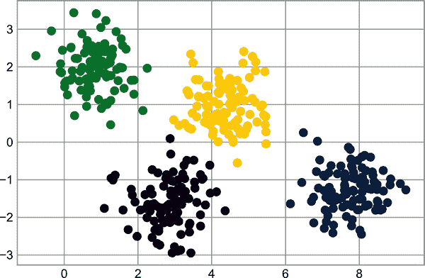
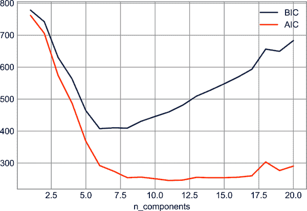
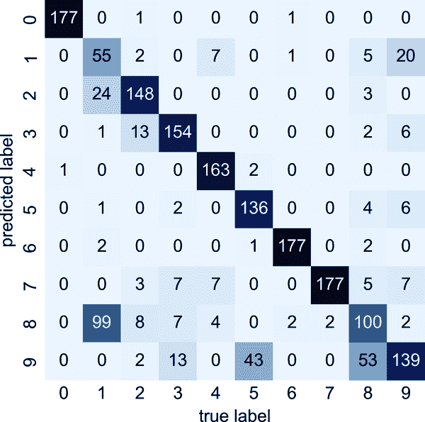

# 第四十七章：深入理解 k-Means 聚类

在之前的章节中，我们探索了用于降维的无监督机器学习模型。现在我们将转向另一类无监督机器学习模型：聚类算法。聚类算法试图从数据的属性中学习出最优的分割或离散标记的群组点。

Scikit-Learn 和其他地方提供了许多聚类算法，但可能最容易理解的算法是称为 *k-means 聚类* 的算法，它在 `sklearn.cluster.KMeans` 中实现。

我们从标准导入开始：

```py
In [1]: %matplotlib inline
        import matplotlib.pyplot as plt
        plt.style.use('seaborn-whitegrid')
        import numpy as np
```

# 介绍 k-Means

*k*-means 算法在未标记的多维数据集中搜索预定数量的簇。它使用简单的概念来定义最优的聚类：

+   *簇中心* 是属于该簇的所有点的算术平均值。

+   每个点更接近它自己的簇中心，而不是其他簇中心。

这两个假设是 *k*-means 模型的基础。我们很快将深入了解算法如何达到这个解决方案，但现在让我们看一看一个简单数据集，并查看 *k*-means 的结果。

首先，让我们生成一个包含四个不同斑点的二维数据集。为了突出这是一个无监督算法，我们将在可视化中省略标签（见图 47-1）。

```py
In [2]: from sklearn.datasets import make_blobs
        X, y_true = make_blobs(n_samples=300, centers=4,
                               cluster_std=0.60, random_state=0)
        plt.scatter(X[:, 0], X[:, 1], s=50);
```



###### 图 47-1：用于演示聚类的数据

肉眼看来，相对容易选出这四个簇。*k*-means 算法自动执行此操作，并在 Scikit-Learn 中使用典型的估计器 API：

```py
In [3]: from sklearn.cluster import KMeans
        kmeans = KMeans(n_clusters=4)
        kmeans.fit(X)
        y_kmeans = kmeans.predict(X)
```

让我们通过按照这些标签对数据进行着色来可视化结果（图 47-2）。我们还将绘制由 *k*-means 估计器确定的簇中心：

```py
In [4]: plt.scatter(X[:, 0], X[:, 1], c=y_kmeans, s=50, cmap='viridis')

        centers = kmeans.cluster_centers_
        plt.scatter(centers[:, 0], centers[:, 1], c='black', s=200);
```

令人高兴的是，*k*-means 算法（至少在这个简单案例中）将点分配到簇中的方式与我们通过肉眼观察的方式非常相似。但你可能会想知道这个算法是如何如此快速地找到这些簇的：毕竟，簇分配的可能组合数随数据点数量呈指数增长——全面搜索将非常、非常昂贵。对我们来说幸运的是，这样的全面搜索并不是必需的：相反，*k*-means 的典型方法涉及一种直观的迭代方法，称为期望最大化。


###### 图 47-2：带有颜色指示簇的 k-means 簇中心

# 期望最大化

期望最大化（E–M）是数据科学中多种情境中的一个强大算法。*k*-means 是该算法的一个特别简单且易于理解的应用；我们将在这里简要介绍它。简而言之，在这里期望最大化方法包括以下步骤：

1.  猜测一些聚类中心。

1.  直到收敛重复：

    1.  *E 步*：将点分配给最近的聚类中心。

    1.  *M 步*：将聚类中心设置为其分配点的平均值。

这里的 *E 步* 或 *期望步骤* 之所以这样命名，是因为它涉及更新我们对每个点属于哪个聚类的期望。*M 步* 或 *最大化步骤* 之所以这样命名，是因为它涉及最大化某些定义聚类中心位置的适应函数——在本例中，通过简单地取每个聚类中数据的平均值来实现该最大化。

关于这一算法的文献非常丰富，但可以总结如下：在典型情况下，每次 E 步和 M 步的重复都会导致对聚类特征的更好估计。

我们可以将算法可视化如图 Figure 47-3 所示。对于此处显示的特定初始化，聚类在仅三次迭代中收敛。（有关此图的交互版本，请参阅在线 [附录](https://oreil.ly/wFnok) 中的代码。）


###### 图 47-3\. k-means 的 E-M 算法可视化¹

*k*-means 算法简单到我们可以用几行代码来编写它。以下是一个非常基本的实现（参见图 Figure 47-4）。

```py
In [5]: from sklearn.metrics import pairwise_distances_argmin

        def find_clusters(X, n_clusters, rseed=2):
            # 1\. Randomly choose clusters
            rng = np.random.RandomState(rseed)
            i = rng.permutation(X.shape[0])[:n_clusters]
            centers = X[i]

            while True:
                # 2a. Assign labels based on closest center
                labels = pairwise_distances_argmin(X, centers)

                # 2b. Find new centers from means of points
                new_centers = np.array([X[labels == i].mean(0)
                                        for i in range(n_clusters)])

                # 2c. Check for convergence
                if np.all(centers == new_centers):
                    break
                centers = new_centers

            return centers, labels

        centers, labels = find_clusters(X, 4)
        plt.scatter(X[:, 0], X[:, 1], c=labels,
                    s=50, cmap='viridis');
```


###### 图 47-4\. 使用 k-means 标记的数据

大多数经过良好测试的实现在底层会做更多事情，但上述函数传达了期望-最大化方法的主旨。在使用期望-最大化算法时，有几个需要注意的事项：

可能无法达到全局最优结果

首先，尽管 E-M 过程保证在每个步骤中改善结果，但不能保证它会导致 *全局* 最佳解。例如，如果在我们的简单过程中使用不同的随机种子，特定的起始猜测会导致糟糕的结果（参见图 Figure 47-5）。

```py
In [6]: centers, labels = find_clusters(X, 4, rseed=0)
        plt.scatter(X[:, 0], X[:, 1], c=labels,
                    s=50, cmap='viridis');
```


###### 图 47-5\. k-means 算法收敛不良的示例

在这里，E-M 方法已经收敛，但未收敛到全局最优配置。因此，通常会对算法使用多个起始猜测进行多次运行，默认情况下 Scikit-Learn 就是如此（该数字由 `n_init` 参数设置，默认为 10）。

必须事先选择聚类数

*k*-means 的另一个常见挑战是您必须告诉它您期望的聚类数：它无法从数据中学习到聚类数。例如，如果我们要求算法识别六个聚类，它将愉快地继续并找到最佳的六个聚类，如图 Figure 40-1 所示：

```py
In [7]: labels = KMeans(6, random_state=0).fit_predict(X)
        plt.scatter(X[:, 0], X[:, 1], c=labels,
                    s=50, cmap='viridis');
```


###### 图 47-6\. 簇数量选择不当的示例

结果是否有意义是一个很难明确回答的问题；一个相当直观的方法是使用[轮廓分析](https://oreil.ly/xybmq)，但我们这里不再进一步讨论。

或者，您可以使用更复杂的聚类算法，该算法对于每个簇的适应度有更好的定量衡量（例如，高斯混合模型；参见第四十八章），或者可以选择合适的簇数量（例如，DBSCAN、均值漂移或亲和力传播，这些都在`sklearn.cluster`子模块中提供）。

k-means 仅限于线性簇边界

*k*-means 的基本模型假设（点会更靠近自己的簇中心而不是其他簇）意味着如果簇具有复杂的几何结构，则该算法通常会失效。

特别地，*k*-means 簇之间的边界始终是线性的，这意味着对于更复杂的边界，它将失败。 考虑以下数据，以及典型*k*-means 方法找到的簇标签（见图 47-7）。

```py
In [8]: from sklearn.datasets import make_moons
        X, y = make_moons(200, noise=.05, random_state=0)
```

```py
In [9]: labels = KMeans(2, random_state=0).fit_predict(X)
        plt.scatter(X[:, 0], X[:, 1], c=labels,
                    s=50, cmap='viridis');
```


###### 图 47-7\. k-means 在非线性边界下的失败

这种情况让人想起了第四十三章中的讨论，在那里我们使用核变换将数据投影到更高的维度，从而可能实现线性分离。 我们可以想象使用相同的技巧来允许*k*-means 发现非线性边界。

这种基于核的*k*-means 的一个版本在 Scikit-Learn 中通过`SpectralClustering`估计器实现。 它使用最近邻图来计算数据的更高维表示，然后使用*k*-means 算法分配标签（参见图 47-8）。

```py
In [10]: from sklearn.cluster import SpectralClustering
         model = SpectralClustering(n_clusters=2,
                                    affinity='nearest_neighbors',
                                    assign_labels='kmeans')
         labels = model.fit_predict(X)
         plt.scatter(X[:, 0], X[:, 1], c=labels,
                     s=50, cmap='viridis');
```


###### 图 47-8\. SpectralClustering 学习的非线性边界

我们看到，通过这种核变换方法，基于核的*k*-means 能够找到更复杂的簇之间的非线性边界。

对于大量样本，k-means 可能会运行缓慢。

因为*k*-means 的每次迭代都必须访问数据集中的每个点，所以随着样本数量的增长，该算法可能相对缓慢。 您可能会想知道是否可以放宽每次迭代使用所有数据的要求；例如，您可能只使用数据的子集来更新每个步骤的簇中心。 这就是批量式*k*-means 算法背后的思想，其中一种形式在`sklearn.cluster.MiniBatchKMeans`中实现。 其接口与标准的`KMeans`相同；我们将在继续讨论时看到其使用示例。

# 例子

虽然我们要注意算法的这些限制，但我们可以在各种情况下利用*k*-均值来获益。现在我们来看几个例子。

## 示例 1：数字上的*k*-均值

首先，让我们看看在我们在第四十四章 和第四十五章 中看到的相同简单数字数据上应用*k*-均值。在这里，我们将尝试使用*k*-均值来尝试识别类似的数字，*而不使用原始标签信息*；这可能类似于从一个没有任何先验标签信息的新数据集中提取含义的第一步。

我们将从加载数据集开始，然后找到聚类。回想一下，数字数据集包含 1,797 个样本，每个样本有 64 个特征，其中每个特征是 8 × 8 图像中一个像素的亮度。

```py
In [11]: from sklearn.datasets import load_digits
         digits = load_digits()
         digits.data.shape
Out[11]: (1797, 64)
```

我们可以像之前一样执行聚类：

```py
In [12]: kmeans = KMeans(n_clusters=10, random_state=0)
         clusters = kmeans.fit_predict(digits.data)
         kmeans.cluster_centers_.shape
Out[12]: (10, 64)
```

结果是 64 维空间中的 10 个聚类。请注意，聚类中心本身是 64 维点，可以解释为聚类内“典型”的数字。让我们看看这些聚类中心是什么样子的（见 图 47-9）。

```py
In [13]: fig, ax = plt.subplots(2, 5, figsize=(8, 3))
         centers = kmeans.cluster_centers_.reshape(10, 8, 8)
         for axi, center in zip(ax.flat, centers):
             axi.set(xticks=[], yticks=[])
             axi.imshow(center, interpolation='nearest', cmap=plt.cm.binary)
```



###### 图 47-9\. *k*-均值学习到的聚类中心

我们看到，即使没有标签的情况下，`KMeans` 也能够找到其聚类中心可识别的数字，也许除了“1”和“8”之外。

因为*k*-均值对聚类的身份一无所知，0–9 标签可能会被排列。我们可以通过将每个学习到的聚类标签与聚类中找到的真实标签匹配来解决这个问题：

```py
In [14]: from scipy.stats import mode

         labels = np.zeros_like(clusters)
         for i in range(10):
             mask = (clusters == i)
             labels[mask] = mode(digits.target[mask])[0]
```

现在我们可以检查我们的无监督聚类在找到数据中相似数字方面的准确性：

```py
In [15]: from sklearn.metrics import accuracy_score
         accuracy_score(digits.target, labels)
Out[15]: 0.7935447968836951
```

仅仅使用简单的*k*-均值算法，我们就为 80%的输入数字找到了正确的分组！让我们来查看这个混淆矩阵，它在 图 47-10 中可视化。

```py
In [16]: from sklearn.metrics import confusion_matrix
         import seaborn as sns
         mat = confusion_matrix(digits.target, labels)
         sns.heatmap(mat.T, square=True, annot=True, fmt='d',
                     cbar=False, cmap='Blues',
                     xticklabels=digits.target_names,
                     yticklabels=digits.target_names)
         plt.xlabel('true label')
         plt.ylabel('predicted label');
```



###### 图 47-10\. *k*-均值分类器的混淆矩阵

正如我们之前可视化的聚类中心所示，混淆的主要点在于数字“8”和“1”。但这仍然表明，使用*k*-均值，我们基本上可以建立一个数字分类器，*无需参考任何已知标签*！

仅仅是为了好玩，让我们尝试推动这个进展更远。我们可以在执行*k*-均值之前使用 t-分布随机邻居嵌入算法（在第四十六章中提到）对数据进行预处理。t-SNE 是一种非线性嵌入算法，特别擅长保留簇内的点。我们来看看它的表现：

```py
In [17]: from sklearn.manifold import TSNE

         # Project the data: this step will take several seconds
         tsne = TSNE(n_components=2, init='random',
                     learning_rate='auto',random_state=0)
         digits_proj = tsne.fit_transform(digits.data)

         # Compute the clusters
         kmeans = KMeans(n_clusters=10, random_state=0)
         clusters = kmeans.fit_predict(digits_proj)

         # Permute the labels
         labels = np.zeros_like(clusters)
         for i in range(10):
             mask = (clusters == i)
             labels[mask] = mode(digits.target[mask])[0]

         # Compute the accuracy
         accuracy_score(digits.target, labels)
Out[17]: 0.9415692821368948
```

这是一种*不使用标签*的 94% 分类准确率。这展示了无监督学习在谨慎使用时的强大能力：它可以从数据集中提取信息，这可能难以手工或肉眼提取。

## 示例 2：颜色压缩的*k*-均值

聚类的一个有趣应用是图像内的颜色压缩（此示例改编自 Scikit-Learn 的[“使用 K-Means 进行颜色量化”](https://oreil.ly/TwsxU)）。例如，想象一下你有一幅包含数百万种颜色的图像。在大多数图像中，许多颜色将未被使用，并且图像中的许多像素将具有相似或甚至相同的颜色。

例如，考虑图像显示在图 47-11 中，这是来自 Scikit-Learn `datasets`模块的（为了使其工作，您必须安装`PIL` Python 包）：

```py
In [18]: # Note: this requires the PIL package to be installed
         from sklearn.datasets import load_sample_image
         china = load_sample_image("china.jpg")
         ax = plt.axes(xticks=[], yticks=[])
         ax.imshow(china);
```


###### 图 47-11\. 输入图像

图像本身存储在一个大小为`(height, width, RGB)`的三维数组中，包含从 0 到 255 的整数表示的红/蓝/绿分量：

```py
In [19]: china.shape
Out[19]: (427, 640, 3)
```

我们可以将这组像素视为三维色彩空间中的一组点云。我们将重新调整数据为`[n_samples, n_features]`的形状，并重新缩放颜色，使其介于 0 到 1 之间：

```py
In [20]: data = china / 255.0  # use 0...1 scale
         data = data.reshape(-1, 3)
         data.shape
Out[20]: (273280, 3)
```

我们可以使用 10000 个像素的子集在此色彩空间中可视化这些像素（见图 47-12）。

```py
In [21]: def plot_pixels(data, title, colors=None, N=10000):
             if colors is None:
                 colors = data

             # choose a random subset
             rng = np.random.default_rng(0)
             i = rng.permutation(data.shape[0])[:N]
             colors = colors[i]
             R, G, B = data[i].T

             fig, ax = plt.subplots(1, 2, figsize=(16, 6))
             ax[0].scatter(R, G, color=colors, marker='.')
             ax[0].set(xlabel='Red', ylabel='Green', xlim=(0, 1), ylim=(0, 1))

             ax[1].scatter(R, B, color=colors, marker='.')
             ax[1].set(xlabel='Red', ylabel='Blue', xlim=(0, 1), ylim=(0, 1))

             fig.suptitle(title, size=20);
```

```py
In [22]: plot_pixels(data, title='Input color space: 16 million possible colors')
```


###### 图 47-12\. 在 RGB 色彩空间中的像素分布³

现在让我们将这 1600 万种颜色减少到只有 16 种颜色，使用像素空间的* k *-means 聚类。由于我们正在处理一个非常大的数据集，我们将使用小批量* k *-means，它在数据子集上计算结果（显示在图 47-13 中）比标准* k *-means 算法更快：

```py
In [23]: from sklearn.cluster import MiniBatchKMeans
         kmeans = MiniBatchKMeans(16)
         kmeans.fit(data)
         new_colors = kmeans.cluster_centers_[kmeans.predict(data)]

         plot_pixels(data, colors=new_colors,
                     title="Reduced color space: 16 colors")
```


###### 图 47-13\. RGB 色彩空间中的 16 个聚类⁴

结果是原始像素的重新着色，其中每个像素分配到最接近的聚类中心的颜色。将这些新颜色在图像空间而不是像素空间中绘制，显示了这种效果（见图 47-14）。

```py
In [24]: china_recolored = new_colors.reshape(china.shape)

         fig, ax = plt.subplots(1, 2, figsize=(16, 6),
                                subplot_kw=dict(xticks=[], yticks=[]))
         fig.subplots_adjust(wspace=0.05)
         ax[0].imshow(china)
         ax[0].set_title('Original Image', size=16)
         ax[1].imshow(china_recolored)
         ax[1].set_title('16-color Image', size=16);
```


###### 图 47-14\. 全彩图像（左）和 16 色图像（右）的比较

右侧面板中确实丢失了一些细节，但整体图像仍然很容易识别。在存储原始数据所需的字节方面，右侧的图像实现了约 100 万的压缩比！现在，这种方法不会与像 JPEG 这样的专用图像压缩方案匹敌，但这个例子展示了通过* k *-means 等无监督方法进行创新思维的威力。

¹ 生成此图的代码可以在[在线附录](https://oreil.ly/yo6GV)中找到。

² 欲查看彩色版本以及后续图像，请参阅[本书的在线版本](https://oreil.ly/PDSH_GitHub)。

³ 这幅图的全尺寸版本可以在[GitHub](https://oreil.ly/PDSH_GitHub)上找到。

⁴ 这幅图的全尺寸版本可以在[GitHub](https://oreil.ly/PDSH_GitHub)上找到。
