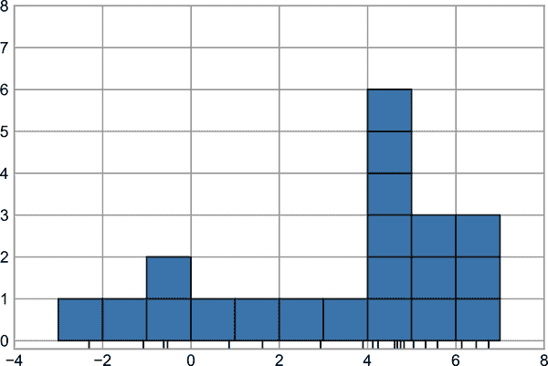
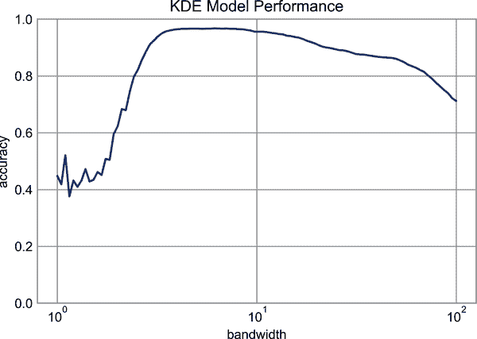

# 第四十九章：深入探讨：核密度估计

在第四十八章中，我们讨论了高斯混合模型，这是一种聚类估计器和密度估计器之间的混合类型。回想一下，密度估计器是一种算法，它接受一个<math alttext="upper D"><mi>D</mi></math>维数据集，并生成数据抽取自其中的<math alttext="upper D"><mi>D</mi></math>维概率分布的估计。GMM 算法通过将密度表示为高斯分布的加权和来实现这一点。*核密度估计*（KDE）在某种意义上是将高斯混合思想推向其逻辑极限的算法：它使用每个点一个高斯分量的混合，从而得到一个基本上是非参数的密度估计器。在本章中，我们将探讨 KDE 的动机和用途。

我们从标准导入开始：

```py
In [1]: %matplotlib inline
        import matplotlib.pyplot as plt
        plt.style.use('seaborn-whitegrid')
        import numpy as np
```

# 激发核密度估计：直方图

如前所述，密度估计器是一种算法，旨在模拟生成数据集的概率分布。对于一维数据，你可能已经熟悉一个简单的密度估计器：直方图。直方图将数据分成离散的箱子，计算落入每个箱子的点的数量，然后直观地可视化结果。

例如，让我们创建一些从两个正态分布中绘制的数据：

```py
In [2]: def make_data(N, f=0.3, rseed=1):
            rand = np.random.RandomState(rseed)
            x = rand.randn(N)
            x[int(f * N):] += 5
            return x

        x = make_data(1000)
```

我们之前看到，可以通过指定直方图的`density`参数来创建标准的基于计数的直方图。通过这种方式得到的是归一化的直方图，其中箱子的高度不反映计数，而是反映概率密度（参见图 49-1）。

```py
In [3]: hist = plt.hist(x, bins=30, density=True)
```


###### 图 49-1\. 从正态分布组合中绘制的数据

对于等距分箱，这种归一化仅仅改变了 y 轴的比例，使得相对高度基本上与计数直方图中的相同。选择这种归一化是为了使直方图下面积等于 1，我们可以通过直方图函数的输出来确认：

```py
In [4]: density, bins, patches = hist
        widths = bins[1:] - bins[:-1]
        (density * widths).sum()
Out[4]: 1.0
```

使用直方图作为密度估计器的一个问题是，箱子的大小和位置的选择可能导致具有不同特征的表现。例如，如果我们查看只有 20 个点的此数据的一个版本，如何绘制箱子的选择可以导致对数据的完全不同解释！考虑到这个例子，在图 49-2 中可视化。

```py
In [5]: x = make_data(20)
        bins = np.linspace(-5, 10, 10)
```

```py
In [6]: fig, ax = plt.subplots(1, 2, figsize=(12, 4),
                               sharex=True, sharey=True,
                               subplot_kw={'xlim':(-4, 9),
                                           'ylim':(-0.02, 0.3)})
        fig.subplots_adjust(wspace=0.05)
        for i, offset in enumerate([0.0, 0.6]):
            ax[i].hist(x, bins=bins + offset, density=True)
            ax[i].plot(x, np.full_like(x, -0.01), '|k',
                       markeredgewidth=1)
```


###### 图 49-2\. 直方图的问题：箱子的位置会影响解释

左侧，直方图清楚地显示这是一个双峰分布。右侧，我们看到一个长尾单峰分布。如果不看前面的代码，你可能不会猜到这两个直方图是由同一组数据构建的。有了这个认识，我们如何相信直方图所传达的直觉呢？我们如何改进这一点呢？

总结一下，我们可以把直方图看作是一堆块，我们在数据集中的每个点上都堆叠一个块。让我们直接查看这一点（见图 49-3）。

```py
In [7]: fig, ax = plt.subplots()
        bins = np.arange(-3, 8)
        ax.plot(x, np.full_like(x, -0.1), '|k',
                markeredgewidth=1)
        for count, edge in zip(*np.histogram(x, bins)):
            for i in range(count):
                ax.add_patch(plt.Rectangle(
                    (edge, i), 1, 1, ec='black', alpha=0.5))
        ax.set_xlim(-4, 8)
        ax.set_ylim(-0.2, 8)
Out[7]: (-0.2, 8.0)
```



###### 图 49-3\. 堆叠的块直方图

我们两次分箱的问题源于这样一个事实：块堆叠的高度经常反映不出附近点的实际密度，而是由于分箱与数据点对齐的巧合。这种点与它们块之间的不对齐可能是导致这里糟糕直方图结果的一个潜在原因。但是，如果我们不是将块与*分箱*对齐，而是将块与*它们所代表的点*对齐会怎样呢？如果我们这样做，块就不会对齐，但我们可以在每个 x 轴位置上添加它们的贡献来找到结果。让我们试试这个方法（见图 49-4）。

```py
In [8]: x_d = np.linspace(-4, 8, 2000)
        density = sum((abs(xi - x_d) < 0.5) for xi in x)

        plt.fill_between(x_d, density, alpha=0.5)
        plt.plot(x, np.full_like(x, -0.1), '|k', markeredgewidth=1)

        plt.axis([-4, 8, -0.2, 8]);
```


###### 图 49-4\. 一个“直方图”，其中每个块都以各个个体点为中心；这是一个核密度估计的示例

结果看起来有些杂乱，但它比标准直方图更能鲜明地反映实际数据特征。尽管如此，其粗糙的边缘既不美观，也不能反映数据的任何真实特性。为了平滑它们，我们可以决定在每个位置用一个平滑函数来取代这些块，比如一个高斯函数。让我们在每个点上使用一个标准正态曲线代替一个块（见图 49-5）。

```py
In [9]: from scipy.stats import norm
        x_d = np.linspace(-4, 8, 1000)
        density = sum(norm(xi).pdf(x_d) for xi in x)

        plt.fill_between(x_d, density, alpha=0.5)
        plt.plot(x, np.full_like(x, -0.1), '|k', markeredgewidth=1)

        plt.axis([-4, 8, -0.2, 5]);
```


###### 图 49-5\. 一个使用高斯核的核密度估计

这个平滑处理后的图，每个输入点处贡献一个高斯分布，更准确地反映了数据分布的形状，并且具有更低的方差（即对不同采样差异的响应更小）。

在过去的两个图中，我们所得到的就是一维核密度估计：我们在每个点的位置放置一个“核”—在前者中是一个方形或者顶帽形的核，在后者中是一个高斯核，并用它们的总和作为密度的估计。有了这个直觉，我们现在将更详细地探讨核密度估计。

# 实践中的核密度估计

核密度估计的自由参数包括 *核函数*，它指定放置在每个点处的分布的形状，以及 *核带宽*，它控制每个点处核的大小。实际上，可以使用许多核函数进行核密度估计：特别是，Scikit-Learn 的 KDE 实现支持六种核函数，你可以在[“密度估计”部分](https://oreil.ly/2Ae4a)的文档中了解更多信息。

虽然 Python 中有几个实现 KDE 的版本（特别是在 SciPy 和 `statsmodels` 包中），但我更倾向于使用 Scikit-Learn 的版本，因为它高效且灵活。它是在 `sklearn.neighbors.KernelDensity` 估计器中实现的，可以使用六种核函数和几十种距离度量来处理多维 KDE。由于 KDE 可能计算量较大，Scikit-Learn 的估计器在底层使用基于树的算法，并可以通过 `atol`（绝对容差）和 `rtol`（相对容差）参数在计算时间和准确性之间进行权衡。核带宽可以使用 Scikit-Learn 的标准交叉验证工具来确定，这很快我们会看到。

让我们首先展示一个简单的示例，使用 Scikit-Learn 的 `KernelDensity` 估计器复制先前的图（参见 Figure 49-6）。

```py
In [10]: from sklearn.neighbors import KernelDensity

         # instantiate and fit the KDE model
         kde = KernelDensity(bandwidth=1.0, kernel='gaussian')
         kde.fit(x[:, None])

         # score_samples returns the log of the probability density
         logprob = kde.score_samples(x_d[:, None])

         plt.fill_between(x_d, np.exp(logprob), alpha=0.5)
         plt.plot(x, np.full_like(x, -0.01), '|k', markeredgewidth=1)
         plt.ylim(-0.02, 0.22);
```


###### 图 49-6\. 使用 Scikit-Learn 计算的核密度估计

此处的结果已归一化，使得曲线下面积等于 1。

# 通过交叉验证选择带宽

KDE 过程产生的最终估计对带宽的选择非常敏感，带宽是控制密度估计中偏差-方差权衡的旋钮。带宽太窄会导致高方差估计（即过拟合），其中单个点的存在或缺失会产生较大差异。带宽太宽会导致高偏差估计（即欠拟合），数据结构被广核模糊化。

在统计学中，有很长的历史可以快速估计基于数据的最佳带宽，基于对数据的严格假设：例如，如果你查看 SciPy 和 `statsmodels` 包中的 KDE 实现，你会看到基于这些规则的实现。

在机器学习环境中，我们看到这种超参数调整通常通过经验交叉验证方法完成。考虑到这一点，Scikit-Learn 的 `KernelDensity` 估计器设计成可以直接在包的标准网格搜索工具中使用。在这里，我们将使用 `GridSearchCV` 来优化前述数据集的带宽。由于我们正在查看一个如此小的数据集，我们将使用留一法交叉验证，以最小化每个交叉验证试验的训练集大小减少：

```py
In [11]: from sklearn.model_selection import GridSearchCV
         from sklearn.model_selection import LeaveOneOut

         bandwidths = 10 ** np.linspace(-1, 1, 100)
         grid = GridSearchCV(KernelDensity(kernel='gaussian'),
                             {'bandwidth': bandwidths},
                             cv=LeaveOneOut())
         grid.fit(x[:, None]);
```

现在我们可以找到使得分数最大化的带宽选择（在这种情况下，默认为对数似然）：

```py
In [12]: grid.best_params_
Out[12]: {'bandwidth': 1.1233240329780276}
```

最优带宽与我们在之前示例图中使用的非常接近，那里的带宽是 1.0（即`scipy.stats.norm`的默认宽度）。

# 示例：不那么朴素的贝叶斯

此示例探讨了带 KDE 的贝叶斯生成分类，并演示了如何使用 Scikit-Learn 架构创建自定义估计器。

在第四十一章中，我们探讨了朴素贝叶斯分类，其中我们为每个类别创建了一个简单的生成模型，并使用这些模型构建了一个快速分类器。对于高斯朴素贝叶斯，生成模型是一个简单的轴对齐高斯分布。使用 KDE 等密度估计算法，我们可以去除“朴素”元素，并使用更复杂的生成模型为每个类别执行相同的分类。它仍然是贝叶斯分类，但不再是朴素的。

生成分类的一般方法如下：

1.  根据标签将训练数据进行拆分。

1.  对每个集合，拟合一个 KDE 以获得数据的生成模型。这允许你对于任意观测值<math alttext="x"><mi>x</mi></math>和标签<math alttext="y"><mi>y</mi></math>，计算出一个似然概率<math alttext="upper P left-parenthesis x vertical-bar y right-parenthesis"><mrow><mi>P</mi> <mo>(</mo> <mi>x</mi> <mo>|</mo> <mi>y</mi> <mo>)</mo></mrow></math>。

1.  根据训练集中每个类别的示例数量，计算*类先验*<math alttext="upper P left-parenthesis y right-parenthesis"><mrow><mi>P</mi> <mo>(</mo> <mi>y</mi> <mo>)</mo></mrow></math>。

1.  对于未知点<math alttext="x"><mi>x</mi></math>，每个类别的后验概率为<math alttext="upper P left-parenthesis y vertical-bar x right-parenthesis proportional-to upper P left-parenthesis x vertical-bar y right-parenthesis upper P left-parenthesis y right-parenthesis"><mrow><mi>P</mi> <mo>(</mo> <mi>y</mi> <mo>|</mo> <mi>x</mi> <mo>)</mo> <mo>∝</mo> <mi>P</mi> <mo>(</mo> <mi>x</mi> <mo>|</mo> <mi>y</mi> <mo>)</mo> <mi>P</mi> <mo>(</mo> <mi>y</mi> <mo>)</mo></mrow></math>。最大化这个后验概率的类别是分配给该点的标签。

算法很简单直观易懂；更难的部分是将其嵌入 Scikit-Learn 框架中，以便利用网格搜索和交叉验证架构。

这是在 Scikit-Learn 框架中实现算法的代码；我们将在代码块后面逐步分析它：

```py
In [13]: from sklearn.base import BaseEstimator, ClassifierMixin

         class KDEClassifier(BaseEstimator, ClassifierMixin):
             """Bayesian generative classification based on KDE

 Parameters
 ----------
 bandwidth : float
 the kernel bandwidth within each class
 kernel : str
 the kernel name, passed to KernelDensity
 """
             def __init__(self, bandwidth=1.0, kernel='gaussian'):
                 self.bandwidth = bandwidth
                 self.kernel = kernel

             def fit(self, X, y):
                 self.classes_ = np.sort(np.unique(y))
                 training_sets = [X[y == yi] for yi in self.classes_]
                 self.models_ = [KernelDensity(bandwidth=self.bandwidth,
                                               kernel=self.kernel).fit(Xi)
                                 for Xi in training_sets]
                 self.logpriors_ = [np.log(Xi.shape[0] / X.shape[0])
                                    for Xi in training_sets]
                 return self

             def predict_proba(self, X):
                 logprobs = np.array([model.score_samples(X)
                                      for model in self.models_]).T
                 result = np.exp(logprobs + self.logpriors_)
                 return result / result.sum(axis=1, keepdims=True)

             def predict(self, X):
                 return self.classes_[np.argmax(self.predict_proba(X), 1)]
```

## 自定义估计器的解剖学。

让我们逐步分析这段代码，并讨论其关键特性：

```py
from sklearn.base import BaseEstimator, ClassifierMixin

class KDEClassifier(BaseEstimator, ClassifierMixin):
    """Bayesian generative classification based on KDE

 Parameters
 ----------
 bandwidth : float
 the kernel bandwidth within each class
 kernel : str
 the kernel name, passed to KernelDensity
 """
```

Scikit-Learn 中的每个评估器都是一个类，最方便的是这个类也应该从 `BaseEstimator` 类以及适当的 mixin 继承，提供标准功能。例如，在这里，`BaseEstimator` 包含了克隆/复制评估器以供交叉验证过程使用的必要逻辑，而 `ClassifierMixin` 定义了这些例程使用的默认 `score` 方法。我们还提供了一个文档字符串，这将被 IPython 的帮助功能捕获（参见 第一章）。

接下来是类的初始化方法：

```py
    def __init__(self, bandwidth=1.0, kernel='gaussian'):
        self.bandwidth = bandwidth
        self.kernel = kernel
```

当使用 `KDEClassifier` 实例化对象时，执行的实际代码是这样的。在 Scikit-Learn 中，*初始化不包含任何操作*，只是将传递的值按名称分配给 `self`。这是由于 `BaseEstimator` 中包含的逻辑，用于克隆和修改评估器，以供交叉验证、网格搜索和其他功能使用。同样，所有传递给 `__init__` 的参数都应该是明确的：即应避免使用 `*args` 或 `**kwargs`，因为它们在交叉验证过程中无法正确处理。

下面是 `fit` 方法，我们在这里处理训练数据：

```py
    def fit(self, X, y):
        self.classes_ = np.sort(np.unique(y))
        training_sets = [X[y == yi] for yi in self.classes_]
        self.models_ = [KernelDensity(bandwidth=self.bandwidth,
                                      kernel=self.kernel).fit(Xi)
                        for Xi in training_sets]
        self.logpriors_ = [np.log(Xi.shape[0] / X.shape[0])
                           for Xi in training_sets]
        return self
```

在这里，我们找到训练数据中的唯一类别，为每个类别训练一个 `KernelDensity` 模型，并基于输入样本的数量计算类别先验概率。最后，`fit` 应该始终返回 `self`，以便我们可以链接命令。例如：

```py
label = model.fit(X, y).predict(X)
```

注意，每次 `fit` 持久结果都带有下划线结尾（例如 `self.logpriors_`）。这是 Scikit-Learn 中的一种约定，因此您可以快速扫描评估器的成员（使用 IPython 的 tab 自动完成），并查看哪些成员是适合训练数据的。

最后，我们有预测新数据标签的逻辑：

```py
    def predict_proba(self, X):
        logprobs = np.vstack([model.score_samples(X)
                              for model in self.models_]).T
        result = np.exp(logprobs + self.logpriors_)
        return result / result.sum(axis=1, keepdims=True)

    def predict(self, X):
        return self.classes_[np.argmax(self.predict_proba(X), 1)]
```

因为这是一个概率分类器，我们首先实现 `predict_proba`，它返回一个形状为 `[n_samples, n_classes]` 的类别概率数组。数组中的条目 `[i, j]` 是计算得到的样本 `i` 是类别 `j` 的后验概率，通过将似然性乘以类先验并进行归一化计算得到。

`predict` 方法使用这些概率，简单地返回具有最大概率的类别。

## 使用我们的自定义评估器

让我们尝试将这个自定义评估器应用于我们之前见过的问题：手写数字的分类。在这里，我们将加载数字并使用 `GridSearchCV` 元评估器计算一系列候选带宽的交叉验证分数（参考 第三十九章）：

```py
In [14]: from sklearn.datasets import load_digits
         from sklearn.model_selection import GridSearchCV

         digits = load_digits()

         grid = GridSearchCV(KDEClassifier(),
                             {'bandwidth': np.logspace(0, 2, 100)})
         grid.fit(digits.data, digits.target);
```

接下来，我们可以绘制交叉验证分数作为带宽的函数（参见 图 49-7）。

```py
In [15]: fig, ax = plt.subplots()
         ax.semilogx(np.array(grid.cv_results_['param_bandwidth']),
                     grid.cv_results_['mean_test_score'])
         ax.set(title='KDE Model Performance', ylim=(0, 1),
                xlabel='bandwidth', ylabel='accuracy')
         print(f'best param: {grid.best_params_}')
         print(f'accuracy = {grid.best_score_}')
Out[15]: best param: {'bandwidth': 6.135907273413174}
         accuracy = 0.9677298050139276
```



###### 图 49-7\. 基于 KDE 的贝叶斯分类器的验证曲线

这表明我们的 KDE 分类器达到了超过 96%的交叉验证准确率，而朴素贝叶斯分类器的准确率约为 80%。

```py
In [16]: from sklearn.naive_bayes import GaussianNB
         from sklearn.model_selection import cross_val_score
         cross_val_score(GaussianNB(), digits.data, digits.target).mean()
Out[16]: 0.8069281956050759
```

这样一个生成分类器的一个好处是结果的可解释性：对于每个未知样本，我们不仅获得一个概率分类，而且获得了与其比较的点分布的*完整模型*！如果需要，这为特定分类的原因提供了一个直观的窗口，而像 SVM 和随机森林这样的算法往往会掩盖这些原因。

如果您希望进一步进行，这里有一些可以改进我们的 KDE 分类器模型的想法：

+   您可以允许每个类别中的带宽独立变化。

+   不应该基于它们的预测分数来优化这些带宽，而是应该基于每个类别中生成模型下训练数据的可能性（即使用`KernelDensity`本身的分数而不是全局预测准确度）。

最后，如果你想要一些练习来构建自己的估计器，可以尝试使用高斯混合模型而不是 KDE 来构建类似的贝叶斯分类器。
