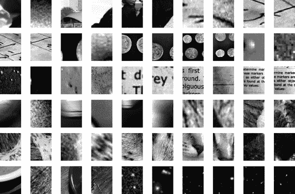

# 第五十章：应用：一个人脸检测流水线

本书的这一部分探讨了许多机器学习的中心概念和算法。但是从这些概念到真实世界的应用可能是一个挑战。真实世界的数据集通常是嘈杂和异构的；它们可能具有缺失的特征，并且数据可能以难以映射到干净的`[n_samples, n_features]`矩阵的形式存在。在应用这里讨论的任何方法之前，您必须首先从您的数据中提取这些特征：没有适用于所有领域的公式，因此这是您作为数据科学家必须运用自己的直觉和专业知识的地方。

机器学习的一个有趣而引人注目的应用是图像，我们已经看到了一些例子，其中像素级特征用于分类。再次强调，现实世界的数据很少是如此统一的，简单的像素将不合适：这导致了大量关于*图像数据特征提取*方法的文献（参见第四十章）。

在本章中，我们将介绍一种特征提取技术：[方向梯度直方图（HOG）](https://oreil.ly/eiJ4X)，它将图像像素转换为对广泛信息的敏感向量表示，而不受照明等混淆因素的影响。我们将使用这些特征来开发一个简单的人脸检测流水线，利用本书这部分中已经介绍过的机器学习算法和概念。

我们从标准导入开始：

```py
In [1]: %matplotlib inline
        import matplotlib.pyplot as plt
        plt.style.use('seaborn-whitegrid')
        import numpy as np
```

# HOG 特征

HOG 是一个简单直接的特征提取过程，最初用于图像中行人的识别。它包括以下步骤：

1.  可选择地对图像进行预归一化。这导致特征对照明变化的依赖性较小。

1.  将图像与两个对水平和垂直亮度梯度敏感的滤波器卷积。这些捕捉边缘、轮廓和纹理信息。

1.  将图像细分为预定大小的单元格，并计算每个单元格内梯度方向的直方图。

1.  通过与相邻单元格块比较来归一化每个单元格中的直方图。这进一步抑制了整个图像中照明效果的影响。

1.  从每个单元格中的信息构建一个一维特征向量。

Scikit-Image 项目中内置了一个快速的 HOG 特征提取器，我们可以相对快速地尝试并可视化每个单元格内的定向梯度（见图 50-1）。

```py
In [2]: from skimage import data, color, feature
        import skimage.data

        image = color.rgb2gray(data.chelsea())
        hog_vec, hog_vis = feature.hog(image, visualize=True)

        fig, ax = plt.subplots(1, 2, figsize=(12, 6),
                               subplot_kw=dict(xticks=[], yticks=[]))
        ax[0].imshow(image, cmap='gray')
        ax[0].set_title('input image')

        ax[1].imshow(hog_vis)
        ax[1].set_title('visualization of HOG features');
```


###### 图 50-1。从图像计算的 HOG 特征的可视化

# HOG 在行动：一个简单的人脸检测器

利用这些 HOG 特征，我们可以使用任何 Scikit-Learn 评估器构建一个简单的面部检测算法；在这里，我们将使用线性支持向量机（如果需要恢复记忆，请参阅 第四十三章）。具体步骤如下：

1.  获得一组人脸缩略图，作为“正”训练样本。

1.  获得一组非面部图像缩略图，作为“负”训练样本。

1.  从这些训练样本中提取 HOG 特征。

1.  在这些样本上训练线性 SVM 分类器。

1.  为“未知”图像，通过图像上的滑动窗口，使用模型评估该窗口是否包含面部。

1.  如果检测重叠，将它们合并成一个单一窗口。

让我们按照这些步骤进行并尝试一下。

## 1\. 获得一组正训练样本

我们将从中找出一些显示各种面部的正训练样本。我们有一个易于使用的数据集——Wild 中的带标签面部数据集，可以通过 Scikit-Learn 下载：

```py
In [3]: from sklearn.datasets import fetch_lfw_people
        faces = fetch_lfw_people()
        positive_patches = faces.images
        positive_patches.shape
Out[3]: (13233, 62, 47)
```

这为我们提供了一些用于训练的 13,000 张面部图像样本。

## 2\. 获得一组负训练样本

接下来，我们需要一组大小相似的缩略图，其中*没有*面部。获得这些的一种方法是从任何输入图像语料库中提取它们的缩略图，以多种比例。在这里，我们将使用一些随着 Scikit-Image 提供的图像以及 Scikit-Learn 的 `PatchExtractor`：

```py
In [4]: data.camera().shape
Out[4]: (512, 512)
```

```py
In [5]: from skimage import data, transform

        imgs_to_use = ['camera', 'text', 'coins', 'moon',
                       'page', 'clock', 'immunohistochemistry',
                       'chelsea', 'coffee', 'hubble_deep_field']
        raw_images = (getattr(data, name)() for name in imgs_to_use)
        images = [color.rgb2gray(image) if image.ndim == 3 else image
                  for image in raw_images]
```

```py
In [6]: from sklearn.feature_extraction.image import PatchExtractor

        def extract_patches(img, N, scale=1.0, patch_size=positive_patches[0].shape):
            extracted_patch_size = tuple((scale * np.array(patch_size)).astype(int))
            extractor = PatchExtractor(patch_size=extracted_patch_size,
                                       max_patches=N, random_state=0)
            patches = extractor.transform(img[np.newaxis])
            if scale != 1:
                patches = np.array([transform.resize(patch, patch_size)
                                    for patch in patches])
            return patches

        negative_patches = np.vstack([extract_patches(im, 1000, scale)
                                      for im in images for scale in [0.5, 1.0, 2.0]])
        negative_patches.shape
Out[6]: (30000, 62, 47)
```

现在我们有 30,000 个合适的图像补丁，不包含面部。让我们可视化其中的一些，以了解它们的外观（见 图 50-2）。

```py
In [7]: fig, ax = plt.subplots(6, 10)
        for i, axi in enumerate(ax.flat):
            axi.imshow(negative_patches[500 * i], cmap='gray')
            axi.axis('off')
```

我们希望这些样本足以覆盖算法可能见到的“非面部”空间。



###### 图 50-2\. 不包含面部的负图像补丁

## 3\. 合并集合并提取 HOG 特征

现在我们有了这些正样本和负样本，我们可以将它们合并并计算 HOG 特征。这一步骤需要一些时间，因为它涉及到每个图像的非平凡计算：

```py
In [8]: from itertools import chain
        X_train = np.array([feature.hog(im)
                            for im in chain(positive_patches,
                                            negative_patches)])
        y_train = np.zeros(X_train.shape[0])
        y_train[:positive_patches.shape[0]] = 1
```

```py
In [9]: X_train.shape
Out[9]: (43233, 1215)
```

我们剩下 43,000 个训练样本，具有 1,215 个维度，现在我们已经将数据处理成了可以输入到 Scikit-Learn 的形式！

## 4\. 训练支持向量机

接下来，我们将利用这里探索的工具创建缩略图补丁的分类器。对于这种高维二元分类任务，线性支持向量机是一个很好的选择。我们将使用 Scikit-Learn 的 `LinearSVC`，因为与 `SVC` 相比，它通常对大量样本具有更好的扩展性。

不过首先，让我们使用简单的高斯朴素贝叶斯估算器得到一个快速的基准：

```py
In [10]: from sklearn.naive_bayes import GaussianNB
         from sklearn.model_selection import cross_val_score

         cross_val_score(GaussianNB(), X_train, y_train)
Out[10]: array([0.94795883, 0.97143518, 0.97224471, 0.97501735, 0.97374508])
```

我们看到在我们的训练数据上，即使是简单的朴素贝叶斯算法也可以达到 95% 以上的准确率。让我们尝试支持向量机，并对几种 `C` 参数进行网格搜索：

```py
In [11]: from sklearn.svm import LinearSVC
         from sklearn.model_selection import GridSearchCV
         grid = GridSearchCV(LinearSVC(), {'C': [1.0, 2.0, 4.0, 8.0]})
         grid.fit(X_train, y_train)
         grid.best_score_
Out[11]: 0.9885272620319941
```

```py
In [12]: grid.best_params_
Out[12]: {'C': 1.0}
```

这将使我们的准确率提高到接近 99%。让我们选择最佳的估计器，并在完整数据集上重新训练它：

```py
In [13]: model = grid.best_estimator_
         model.fit(X_train, y_train)
Out[13]: LinearSVC()
```

## 5\. 在新图像中查找面部

现在我们已经建立了这个模型，让我们拿一幅新的图像来看看模型的表现。我们将简单地使用宇航员图像中的一部分，如 图 50-3 所示，运行一个滑动窗口，并评估每个补丁：

```py
In [14]: test_image = skimage.data.astronaut()
         test_image = skimage.color.rgb2gray(test_image)
         test_image = skimage.transform.rescale(test_image, 0.5)
         test_image = test_image[:160, 40:180]

         plt.imshow(test_image, cmap='gray')
         plt.axis('off');
```


###### 图 50-3\. 一幅我们将尝试定位面部的图像。

接下来，让我们创建一个窗口，迭代这幅图像的补丁，并为每个补丁计算 HOG 特征：

```py
In [15]: def sliding_window(img, patch_size=positive_patches[0].shape,
                            istep=2, jstep=2, scale=1.0):
             Ni, Nj = (int(scale * s) for s in patch_size)
             for i in range(0, img.shape[0] - Ni, istep):
                 for j in range(0, img.shape[1] - Ni, jstep):
                     patch = img[i:i + Ni, j:j + Nj]
                     if scale != 1:
                         patch = transform.resize(patch, patch_size)
                     yield (i, j), patch

         indices, patches = zip(*sliding_window(test_image))
         patches_hog = np.array([feature.hog(patch) for patch in patches])
         patches_hog.shape
Out[15]: (1911, 1215)
```

最后，我们可以取这些具有 HOG 特征的补丁，并使用我们的模型评估每个补丁是否包含面部：

```py
In [16]: labels = model.predict(patches_hog)
         labels.sum()
Out[16]: 48.0
```

我们看到在将近 2,000 个补丁中，我们发现了 48 个检测结果。让我们利用这些补丁的信息来显示它们在我们的测试图像中的位置，将它们绘制成矩形（参见 图 50-4）。

```py
In [17]: fig, ax = plt.subplots()
         ax.imshow(test_image, cmap='gray')
         ax.axis('off')

         Ni, Nj = positive_patches[0].shape
         indices = np.array(indices)

         for i, j in indices[labels == 1]:
             ax.add_patch(plt.Rectangle((j, i), Nj, Ni, edgecolor='red',
                                        alpha=0.3, lw=2, facecolor='none'))
```


###### 图 50-4\. 被确定包含面部的窗口。

所有检测到的补丁都重叠并找到了图像中的面部！对于几行 Python 代码来说效果不错。

# 注意事项和改进

如果你深入研究前面的代码和示例，你会发现在我们宣称拥有一个可以投入生产的人脸检测器之前，我们还有一些工作要做。我们做的工作存在几个问题，也可以做出几个改进。特别是：

我们的训练集，特别是负面特征，不太完整。

中心问题在于训练集中有许多像面部的纹理，而我们当前的模型非常容易产生假阳性。如果你尝试在*完整*的宇航员图像上运行算法，就会发现这一点：当前的模型在图像的其他区域导致了许多误检测。

我们可以通过向负训练集添加更多类型的图像来解决这个问题，这可能会带来一些改善。另一种选择是使用更有针对性的方法，如*硬负样本挖掘*，我们采用一组分类器尚未见过的新图像，找到所有表示假阳性的补丁，并明确将它们作为负实例添加到训练集中，然后重新训练分类器。

我们当前的流水线仅在一个尺度上进行搜索。

按照当前的写法，我们的算法会漏掉不是大约 62 × 47 像素的面部。可以通过使用各种大小的滑动窗口，并在将每个补丁输入模型之前使用`skimage.transform.resize`来直接解决这个问题。事实上，这里使用的`sliding_window`工具已经考虑到了这一点。

我们应该结合重叠的检测补丁。

对于一个可投入生产的流水线，我们更希望不要有 30 个相同人脸的检测结果，而是将重叠的检测组减少到一个单独的检测结果。这可以通过无监督的聚类方法（均值漂移聚类是一个很好的选择），或者通过类似于*非最大抑制*这样的程序化方法来实现，这是机器视觉中常见的一种算法。

流水线应该被简化

一旦解决了上述问题，创建一个更简化的流水线来输入训练图像并预测滑动窗口输出也将是一个不错的选择。这就是 Python 作为数据科学工具的优势所在：通过一点工作，我们可以将我们的原型代码打包成一个设计良好的面向对象的 API，让用户能够轻松地使用它。我将把这留给读者作为一个“练习题”。

更近期的进展：深度学习

最后，我应该补充说，在机器学习环境中，HOG 和其他程序化特征提取方法并不总是被使用。相反，许多现代目标检测流水线使用深度神经网络的变体（通常称为*深度学习*）：一个思考神经网络的方式是将其视为从数据中确定最佳特征提取策略的估计器，而不是依赖用户的直觉。

虽然近年来该领域取得了巨大的成果，但深度学习在概念上与前几章中探讨的机器学习模型并没有太大的不同。主要进步在于利用现代计算硬件（通常是大型强大机器集群）在更大的训练数据集上训练更加灵活的模型。但尽管规模不同，最终目标仍然是非常相似的：从数据中构建模型。

如果你对更深入的了解感兴趣，以下部分的参考文献清单应该是一个很好的起点！

# 更多机器学习资源

本书的这一部分快速介绍了 Python 中的机器学习，主要使用了 Scikit-Learn 库中的工具。尽管这些章节很长，但仍然太短，无法涵盖许多有趣和重要的算法、方法和讨论。在这里，我想为那些有兴趣的人提供一些关于在 Python 中学习更多关于机器学习的资源：

[Scikit-Learn 网站](http://scikit-learn.org)

Scikit-Learn 网站拥有令人印象深刻的文档和示例，涵盖了这里讨论的一些模型，以及更多内容。如果你想要简要了解最重要和经常使用的机器学习算法，这是一个很好的开始。

*SciPy、PyCon 和 PyData 教程视频*

[Scikit-Learn](https://oreil.ly/kaQQs)和其他机器学习主题是许多以 Python 为重点的会议系列（特别是 PyCon、SciPy 和 PyData 会议）教程轨道中的常青之选。这些会议大多免费在线发布其主题演讲、讨论和教程的视频，你可以通过合适的网络搜索轻松找到（例如，“PyCon 2022 视频”）。

《[Python 机器学习导论](https://oreil.ly/kaQQs)》，作者 Andreas C. Müller 和 Sarah Guido（O’Reilly）

本书涵盖了这些章节讨论的许多机器学习基础知识，但特别是在涵盖 Scikit-Learn 更高级特性方面更具相关性，包括额外的估算器、模型验证方法和管道化。

《[使用 PyTorch 和 Scikit-Learn 的机器学习](https://oreil.ly/p268i)》，作者 Sebastian Raschka（Packt）

Sebastian Raschka 的最新书籍从这些章节覆盖的基础主题开始，但深入探讨，并展示了这些概念如何应用于更复杂和计算密集的深度学习和强化学习模型，使用知名的[PyTorch 库](https://pytorch.org)。
