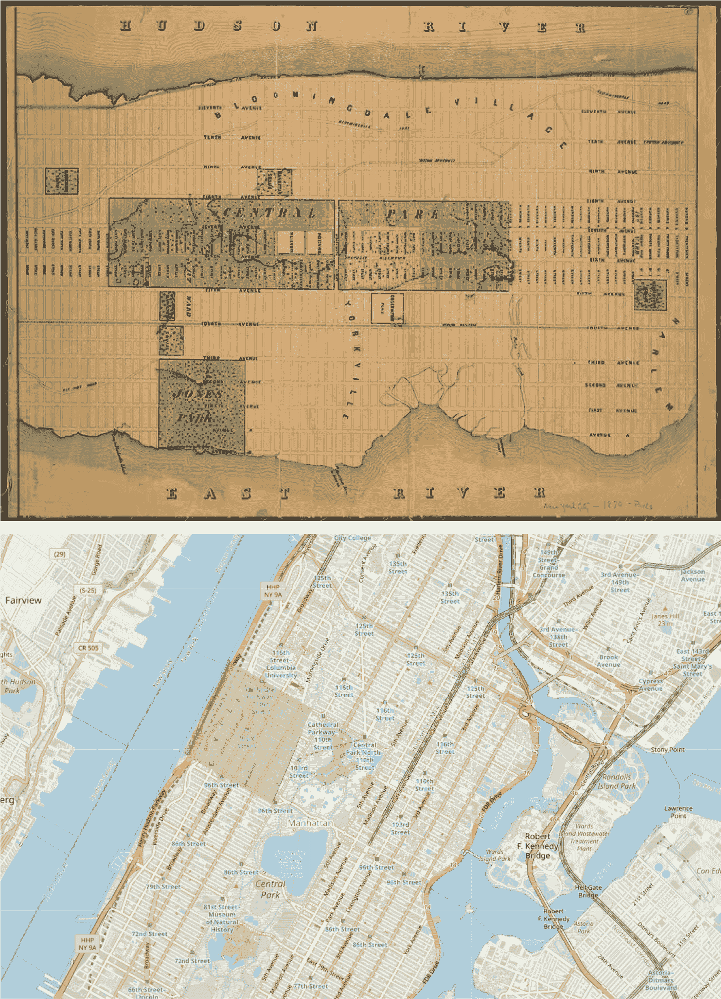
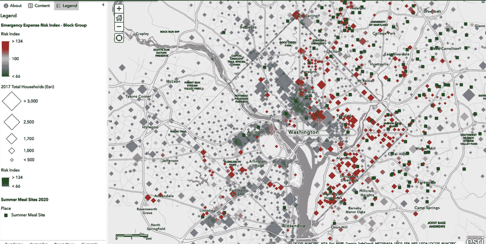
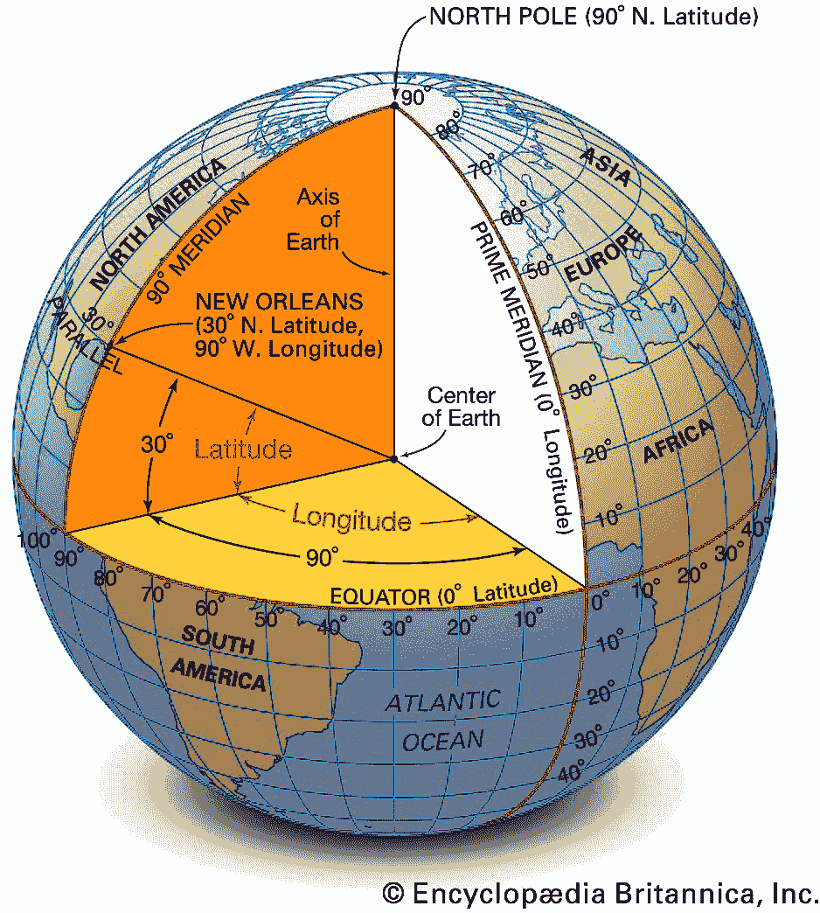
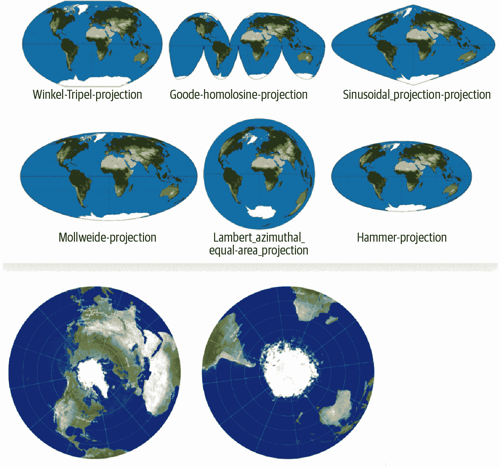
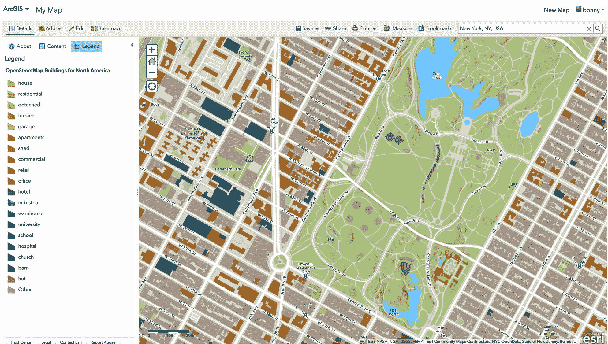
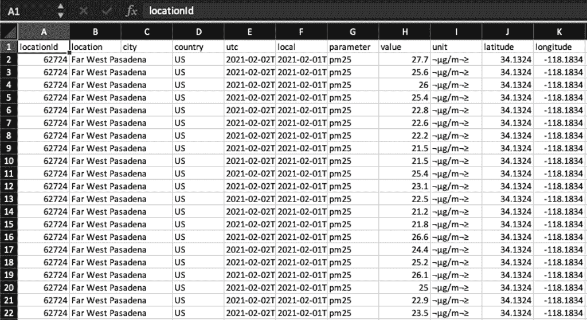
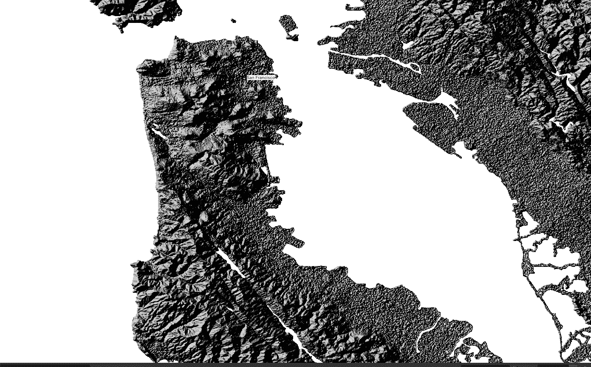
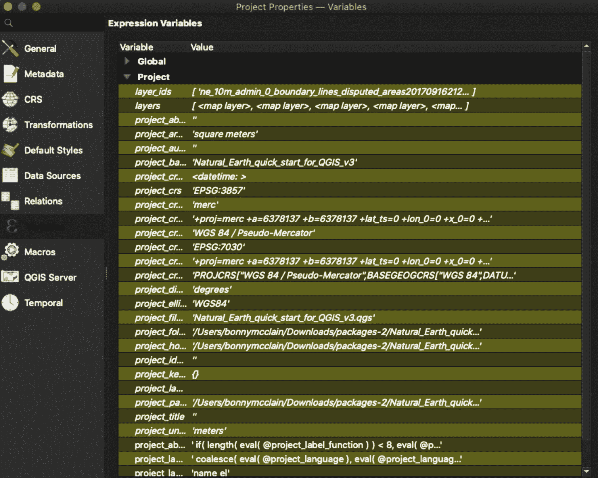

# 第一章：地理空间分析导论

你是地理学家、地质学家还是计算机科学家吗？如果是，那太棒了！我不是这些中的任何一个：我是一个空间数据分析师，对探索数据和将位置信息整合到数据分析中感兴趣。

地理空间数据无处不在。在数据分析中理解“位置”引入了一个新维度：理解各种特征对特定观察或结果的影响。例如，我花费大量时间研究公共卫生和医疗保健领域的大型开源数据集。一旦你熟悉了地理编码和空间文件，你不仅可以跨多个领域策划见解，还可以识别和针对存在深刻社会和经济差距的地区。

在我作为数据分析师的早期阶段，我开始意识到自己需要考虑更大更复杂的问题，并且需要更多的资源。为了能够处理美国人口普查数据，我报名参加了一门应用分析课程。我之前使用过 R 语言，但这门课程是用 Python 教授的。我虽然顺利完成了，但在接下来的几个月里，我发现了很多我希望早些学到的东西，比如 Python 基础。这本书的目的是分享我希望自己早些被教到的内容。

我希望在这里分享的不是完整的 Python 编程范式，也不是 Python 101 课程。相反，它旨在通过展示如何编写可操作的代码来补充你的 Python 学习，让你通过实践学习。本书包含简单的例子，深入探讨关键概念。前几章的图形将使你熟悉地图的外观以及不同工具如何展示关系。后面的章节将探讨代码和各种平台，让你能够利用 Python 来回答地理空间问题。如果你希望在开源和专有系统中灵活操作数据，Python 可能是拼图中缺失的一块。它相对容易学习，并且有多种库可以进行数据透视、重塑表格、合并数据和生成图表。

将 Python 集成到空间分析中是本书的重点。像[开放街道地图（OSM）](http://openstreetmap.org)这样的开源平台允许我们放大并添加属性。OSMnx 是一个 Python 包，它允许您从 OSM 下载空间数据，并在 Jupyter Notebook 中建模、投影、可视化和分析真实世界的街道网络和景观，独立于任何特定的应用程序或工具。^1 您可以使用一行 Python 代码下载和建模可步行、可驾驶或可骑行的城市网络，然后轻松分析和可视化它们。您还可以下载并处理其他类型的基础设施、设施和兴趣点、建筑物轮廓、海拔数据、街道方向和方位、速度和行程时间。本书的第五章将提供一个更深入了解 OSM 的机会。

运用空间数据分析原则，您可以考虑在本地、区域和全球层面面临的挑战。这些可能涉及环境、医疗、生物学、地理学、经济学、历史学、工程学、地方政府、城市规划和供应链管理等多个领域。即使是看似局部或区域性的问题也会跨越物理和政治界限、生态区域、市政单位以及流域，并具有空间组成部分。由于地图是我们首次感知数据可视化的方式之一，因此在审视数据后对位置感到好奇是很自然的事情。本章将向您介绍空间数据分析的一些广泛目标，并探讨地理空间信息如何影响我们的思维。

# 数据民主化

开放源数据工具和大规模在线开放课程（MOOC）的可及性使一批新的公民科学家得以自主。如今，公众可以访问位置数据和地理空间数据集，许多人都变得“数据好奇”，不论他们的专业头衔或学习领域如何。也许您是一名鸟类观察者，对某种鸟类（比如蓝鹭）感兴趣。您可能希望访问空间数据以了解其栖息地。您可能会提出研究问题，比如：蓝鹭在哪里筑巢？它们迁徙到哪里？它们的哪些栖息地支持最多的物种，以及这种情况如何随时间变化？您可能会创建自己的观测地图或其他感兴趣的变量。

除了个人或专业爱好外，地理空间分析师还研究社区的社会经济状况及其随时间地理变化。环境种族主义的研究旨在分析建成基础设施如何阻碍或影响边缘化社区的健康结果。稍后，我们将探讨这个想法，当我们提出一个探索性数据问题时。

[Map Warper](https://mapwarper.net) 项目是一个开源的历史地图和当前位置的收集项目。挑战在于旧地图由于过时的测量技术而包含许多错误。Map Warper 项目是一个地图校正项目：旨在通过搜索现代匹配的地面控制点并相应地扭曲图像来纠正这些错误，以使其与今天的精确地图相匹配。这些控制点是已知坐标，在感兴趣的区域内分布，用作精确已知位置。您可以使用校正后的地图来探索不同城市随时间的发展，或者更准确地重新想象历史位置。例如，基础设施和工业发展的投资如何随时间影响社区？Figure 1-1 显示了一张校正后的地图。您可以浏览已经校正的地图，或者通过自行校准地图来帮助纽约公共图书馆。欢迎每个人参与！

在多个行业的专业人士中，有许多机会可以在其分析中包含位置智能。位置智能是通过探索地理空间关系而得出的可操作信息——也就是制定数据问题和评估假设。由于开源工具欢迎新的最终用户，我们需要一个适合具有多样化兴趣、资源和学习背景的人的词汇表。我希望您能够探索本书讨论的所有工具。

虽然有功能强大的基于订阅的应用程序和工具可用，但它们大多作为企业解决方案定价，不适合个人用户，这限制了未与大型机构有关联的任何人的访问。以地理信息系统为例：有许多选择，各有利弊。其中两个最突出的选择是航空侦察覆盖地理信息系统，现在称为 ArcGIS，在第六章中讨论，以及量子地理信息系统，或者 QGIS，在第三章中讨论。在我的专业工作中，我两者都使用，但在教学时，我更喜欢让 QGIS 主角，因为它真正是开源的：您不需要支付不同许可级别的费用来访问其工具。

###### 图 1-1\. 1870 年曼哈顿地图（顶部）和当代曼哈顿校正地图（底部）

###### 警告

我亲身经历过基于订阅的工具有多么昂贵。ArcGIS 使用信用系统，当我开始使用它时，并没有意识到上传带有位置数据的 CSV 文件会自动启动付费服务。不要犯这种错误！另一方面，QGIS 提供两个选择——都是免费的。

# 提问数据问题

国家人口普查局是数据的丰富来源，尤其是关于人口统计学的数据。我使用美国人口普查数据在 ArcGIS 中生成了所示的美国地图，显示在图 1-2 中：具体来说，使用了来自美国社区调查（ACS）的县级种族变量。^(2) 公开可用的资源如美国人口普查局提供了一个*应用程序接口（API）*：这是一个数据传输接口，让任何人只需几行 Python 代码就可以检索人口统计数据。你可以获取你想要的具体数据，而不是下载整个庞大的数据集。

###### 图 1-2\. 在美国大陆上展示县级种族变量的 ArcGIS 地图

地图上的多边形用不同颜色着色，对应于人口普查中使用的种族类别，并显示每个群体在当地人口中占多数的地区。乍一看，你可以看到分类变量的集群，但你可能还想知道其他什么？这就是地理空间数据如此宝贵的地方。你能用你手头的数据回答你的问题吗？如果面对缺失数据或无法访问的资源，你可能需要重新制定你的问题。如果你同时检查其他属性，你对这些集群可能会得出什么结论？

在第七章中，你将有机会添加非空间数据作为额外的图层，当我们使用人口普查数据 API 探索美国人口普查数据。现在，我给你一个提示：细节决定成败——或者我应该说，图层决定成败。图层是你可以根据特定查询选择的地理数据集合。例如，在图 1-2 中的图层中，多边形根据特定种族在人口中占多数的地区而着色。

这是介绍一个表达式的好地方：默认设置不应是终点。默认设置是你开始分析的地方。在你的数据中总结了哪些信息可能通过更详细的粒度探索而得出最佳结果？对 GIS 的深入理解将使你能够远离默认设置，并创造独特而深刻的见解。

你将探索如何通过专门针对空间和非空间属性定制你的变量选择，来增强你所提出的问题和你收集到的见解。

空间数据分析的第一个规则是*任何分析都需要明确定义的问题*。你想知道什么？你是否有一个想要测试的假设？一旦你明确了研究问题，你就可以寻找可以帮助回答问题的数据。

在制定数据问题时，我喜欢参考托布勒地理学的第一法则：“万物互相关联，但相近的物体比遥远的物体更相关。”^(3) 直接应用于地理空间概念时，当你思考“相近”的对象时，这个概念涵盖了时间和空间，而不仅仅是邻近性。例如，海滨住宅可能直接受到海平面上升和风暴加剧的直接影响，但随之而来的洪水可能会破坏一个更大的区域。在考虑空间配置和“近距离”描述时，你必须学会思考空间连接性。

明确地说，并不意味着挑选数据以匹配你想要的答案。你需要查看所有相关数据来形成假设或产生见解。在思考如何理解美国的种族和种族主义时，你可能希望揭示政策漏洞，解决未满足的健康需求，或促进同理心。从你的目标反向思考，你可以使用地理空间数据来研究种族如何与住房、就业、交通和教育等领域相交。当你熟悉人口普查数据时，你开始理解种族所要承担的重任。这是我在关于贫困、种族不平等、健康结构性决定因素和各种新兴问题的讲座中引入 ArcGIS 和 QGIS 等地理空间应用的研究类型。

如果你依赖没有空间数据的电子表格或表格，可能会错过关键的见解。非空间数据描述了价值如何分布，你可以依赖描述性统计。但如果你对空间关系可能对这些值产生的影响感到好奇呢？静态指标，如道路的位置或特定事件，以及动态度量，如传染病的传播，在与位置智能集成后变得更加强大。*空间分析*研究了地理边界内确定的要素之间的关系。

# 空间数据科学的概念框架

地理空间问题复杂且随时空变化。不用看其他地方，看看当前的头条新闻就能找到例子：种族不平等，气候变化，健康结构性决定因素，刑事司法，水污染，不可持续的农业实践，海洋酸化，贫困，物种濒危和灭绝，以及经济困境。一个人的位置如何影响他们的健康、幸福或经济机会？通过 GIS，你可以回答这些问题，通过发现和展示现象的空间模式，比如疾病扩散速率，患者到最近医院的距离，以及道路、水路、树木覆盖和城市可步行性的位置。

空间思维包括考虑接近度、重叠包含、邻近性、测量地理空间的方式，以及地理要素和现象如何相互关联等。它是空间素养的一部分，这种素养从内容知识开始，涵盖了对地球系统的理解，以及它们如何与人类影响的领域相互作用，以及地理空间如何被表现。空间素养使你能够使用地图和其他空间工具进行推理，并就空间概念做出关键决策。^(4) 例如，几何可视化是一种空间素养技能，包括计算要素之间的距离、计算缓冲区（例如一个要素距离另一个要素有多远）以及识别区域或周长。

[阿斯彭全球变化研究所](https://www.agci.org)确定了地球的六个系统：大气层、冰层、水圈、生物圈、地圈和人圈（或地球上的人类存在）。地理空间数据使我们能够理解所有这些系统的相互关联性，并且我们可以使用大数据——大量数据——来回答精心制定的数据问题。

您不必成为专家也能保持重要的空间素养技能以回答更大的问题。如果您在地理空间数据和技术的基础上了解事物如何运作，您已经在向构建更复杂的想法迈进。您将学会提出数据问题，并确定开发您的新应用或解决方案的可行步骤。对于用 Python 编写的工具，源代码是可用的，我鼓励您从中学习、修改、扩展和分享这些及其他分析工具。

让我们来看一个例子。您在图 1-3 中看到的地图是作为经济不稳定性探索而创建的。

###### 图 1-3\. 风险指数夏季餐饮（ArcGIS），目标是扩展美国农业部夏季膳食计划

红色方块表示华盛顿特区的人口，这些家庭平均无法负担几百美元以支付意外支出。这些红色方块显示了最容易无法支付家庭开支的家庭，并且更大的方块反映了更多的家庭数量。绿色方块是 2020 年夏季膳食服务计划（SFSP）为低收入儿童提供免费餐的地点。您对 SFSP 如何分配这些位置有何想法吗？

在地图上一起查看这些地理空间数据的层次，图 1-3 中，你可以看到非空间数据的相关性。如果没有理解像受影响家庭的大小和位置以及这些特征如何影响风险指数等人口特征的理解，你在解释表格数据时将受到限制。

地理信息系统分析数据并在各种行业中显示实时地理信息。虽然空间分析与非空间分析之间存在相似之处，但空间统计学是专门用于地理数据的。两者都与地理特征相关，但空间统计学专门关注*地理编码*的地理空间数据。也就是说，它们直接将空间（包括接近性、区域、连接性和其他空间关系）融入其数学计算中。例如，想想机场产生的各种数据类型。有关区域、使用（军事或民用/公共）、准点到达和出发列表等变量的非空间统计数据。还有一些空间组成部分，例如跑道高程和地理坐标。

复杂问题是具有空间性质的。这些问题发生在哪里，我们如何规划未来的更好结果？

## 地图投影

我们在查看地图时的舒适水平掩盖了其复杂性。大多数地图包含多个信息层。我们可以制作交互地图，将多个数据集层叠并尝试如何传达发现。但我们也需要谨慎。地图可能很熟悉，但熟悉并不等同于准确性或能力。投影就是一个很好的例子。

地球并非完全球形。当你考虑到行星的化学特性以及在太空中旋转时由于离心力作用而倾向于推出中间部分时，这就说得通了，导致其呈现一个扁球体形状。从技术上讲，地球的形状是一个*椭球体*：它在极地周围的周长比赤道周围的周长要短，几乎像是从上到下被挤压了一样。当我们尝试将行星表面映射到平面上创建二维地图时，我们使用了一个地理坐标系统（图 1-4）来投影这个不完美的球体、这个坐标系统到一个平面表面上。简化的投影考虑了复杂因素，如地球重力场如何随地形变化而变化。我们称之为*大地水准面*。重要的是要意识到整个世界是无法完全放在一张纸或者计算机屏幕上的——至少不是以一种可见、易于解释的方式。

###### 图 1-4\. 地理坐标系统

这些不同的投影包括*圆锥投影*、*方位角投影*和*柱面投影*。如果你使用过 OpenStreetMap 或 Google 地图，你一定熟悉 Web Mercator 坐标系。每种投影都有其优缺点，包括面积、距离、方向和大小上的扭曲。你会很高兴地知道，我们不需要单独解决这些妥协问题——软件可以处理大部分复杂的数学计算。

了解这些地图的变化（图 1-5）将帮助你为你的目的选择最佳投影。你总是需要做出妥协和权衡，选择优化的方面，并接受其他方面的一些扭曲。流行的墨卡托投影（图 1-6）对导航很有用，但会使接近极地的区域发生面积扭曲——这就是为什么格陵兰岛看起来巨大的原因。你可以看到在图 1-5 中显示的等面积投影的可视化有多么不同，但在所有投影中，格陵兰岛的比例都是适当的。在图 1-6 的墨卡托投影中，虽然南美洲实际上比格陵兰岛大八倍，但它们看起来大小相似。

###### 图 1-5\. 一些等面积投影

在我从事人口健康工作时，面积是最关键的方面。在投影中，必须尽可能准确地维护它。当我在地图上绘制百分比或原始数字时，我希望尽可能公正；如果一个小地方看起来比其他地方大得多，那里存在一种固有的偏见，会影响我对地图的解读。我将尽力研究投影的优缺点，并说：“我会选择一个保持面积的投影。” 保持面积的地图称为*等面积投影*。

###### 图 1-6\. 墨卡托投影

如果我确保选择的坐标系能够捕捉到我可视化中最相关的测量数据，那么我已经完成了大部分工作。当然，我希望我的数值能尽可能地与现实世界中的实际数值匹配。

## 矢量数据：地点作为对象

在我们深入讨论如何在 Python 中探索矢量数据之前，我需要介绍一些概念，这些概念将在我们继续阅读本书时非常有用。我们将使用*矢量数据*，它使用点、线和多边形来传达数据。我们将使用 Python 脚本和 QGIS 集成来加载数据集到地图中，并检查矢量数据的结构。我还将向你展示如何使用不同的工具来定制地图，使用颜色和符号来提高清晰度和准确性。

图 1-7 是 ArcGIS 渲染的纽约市中央公园及周边建筑的图示。你可以看到每个要素的几何形状以点、线或多边形表示。要素的几何形状决定了其渲染方式：作为点、线或多边形。有关要素的额外信息可能会显示结构类型、建造年份、建筑尺寸及其他在*属性表*中可访问的属性。

###### 图 1-7\. ArcGIS 渲染的矢量数据显示纽约市的建筑类型，附带属性表

地理信息系统可以处理多种类型的数据。你可能会看到一个指定为 shapefile（扩展名为 *.shp*）或 geodatabase（*.gdb*）的矢量数据文件。激光雷达（Light Detection and Ranging，LiDAR）测量通常以矢量数据形式收集，但通常会以栅格化的栅格数据格式创建和存储。

将地理信息系统文件格式与诸如 Microsoft Word（*.docx*）之类的文字处理程序所用的格式进行比较，可以看出文本文件（*.txt*）的复杂度和精密程度显然较低。尽管两种文件中的内容（页面上的文字）可能相同，但文本文件的复杂性肯定较低。如果要分享一篇写作作品，为什么会选择文本文件呢？如果希望所有人都能读取文档，无论使用何种软件，或者希望文档具备易于可移植性或更小的存储格式，又该如何选择呢？

地理信息系统文件格式也是如此：尽管内容相同，但功能各异。Shapefile 文件没有拓扑或空间层，而 geodatabase 则可以选择包含这些层。地理信息系统文件格式在简易性、冗余性、错误检测和存储大小方面也有所不同。人口普查地理数据使用 TIGER/Line 抽取数据或 shapefile。它们被分组为一组，其中包括数字文件（带有 *.shp* 扩展名的矢量坐标）、索引（*.shx*）和 dBase 属性数据（*.dbf*）。

最熟悉的坐标投影系统是经度和纬度。这些坐标准确描述了地球表面上特定地点的位置。无论你身处世界的哪个角落，只要你知道自己的经度（X）和纬度（Y），你就知道自己的位置。这种精确的位置被称为*点要素*。*点属性*也有 X 和 Y 值，但属性可以是定量或定性描述。点属性描述了要素。可选地，Z 值可用于表示三维空间中的值，其中 Z 指的是海拔高度。当位置数据出现在电子表格中时，你可以使用纬度和经度列来找到一个点。图 1-8 中显示的空气质量电子表格包括地理数据（纬度和经度）和非地理数据（值列中的空气质量测量），允许 GIS 应用程序添加与特定地理位置相关的信息。

###### 图 1-8\. 包括空间和非空间数据的空气质量测量数据集

## 光栅数据：理解空间关系

矢量数据侧重于特定位置可见的内容。地图上的特定边界或区域存在或不存在数据或对象。你不会期望一个建筑物，甚至是代表城市的多边形对象，在特定边界内的每个位置都存在。

另一方面，*光栅数据*是连续的数据，缺乏具体的边界，但存在于整个地图视图中，例如图像、地表温度和数字高程。*光栅*是作为像素化图像矩阵显示的数据，例如在图 1-9 中显示的那样，而不是矢量数据的点、线和多边形。每个像素对应于特定的地理位置。如果现在这些概念看起来有些抽象，不要担心：一旦我们开始处理它们，这两种类型的数据将更容易理解。或许稍微直观一些，考虑地表高程、降水量或地表温度。你可以记录这些测量值在研究区域内的每个位置，而不管你的研究视角如何。

###### 图 1-9\. 旧金山作为光栅图像显示（QGIS）

到目前为止，我只是在描述点、多边形或线在我们研究区域内的分布。光栅数据表示为数值数组，分为网格单元。术语*单元*和*像素*描述空间分辨率，并经常互换使用。单元或像素的维度表示正在覆盖的区域。*空间数据模型*获取这些真实世界客观和/或现场视图的抽象表示，并探索数学关系以模拟或预测关系。

照片和光栅图像的主要区别在于光栅图像包含扩展波长的数据。这种增强数据不仅包括红、绿和蓝波长，还允许机器学习模型区分各种对象。这是因为不同的物体以不同的方式反射红外光，从而在多光谱图像中提供额外信息。全球许多空间机构免费提供其地球观测卫星的数据集，这些数据对科学家、研究人员、政府和企业非常宝贵。

如图 1-9 中所示的*阴影*光栅图，利用光和阴影创建视图中区域的三维效果。

在审查 GIS 系统级方法时，有必要同时考虑多个概念。在较大系统中运作的较小组件动态交互，以揭示系统中的模式。例如，几何可视化包括计算特征之间的距离，计算缓冲区（例如一个特征离另一个有多远），以及识别区域或周长。如果您将这些主题视为整体的一部分，我们的讨论将更加简化。了解这些入门概念将简化您在后续章节中的学习。开始时具备基础的空间素养非常重要。

# 评估和选择数据集

有许多数据集可用于学习新技能的教程，参与新应用的学习，甚至启动您自己的独立地理空间项目。本书中的数据集经过审核，在各种应用程序和工作流程中可行。

在选择数据集之前，您需要评估您的选择。关于数据集的信息称为*元数据*。通常还有一个描述字段标题等属性的附加数据文件，这称为*数据字典*。您可以探索一个示例：[Landsat 数据字典](https://oreil.ly/BgBaG)，由美国地质调查局（USGS）发布。

您可以通过查看元数据了解很多信息。您可以将元数据想象成罐头汤上的标签：您阅读它是因为您想知道其中的成分以及这种汤是否适合您。图 1-10 显示了一个元数据示例。您希望检查的最重要信息应包括显示的地理区域、列出的属性、数据集使用的地图投影、其比例尺以及是否有使用费用。

我建议首先尝试按照本书中列出的建议数据资源进行操作。一旦您感到自信，可以探索与您兴趣相关的数据集，看看您能发现什么。

###### 图 1-10\. 元数据示例

# 摘要

地理空间分析领域广阔，而 Python 则是一个涉及大量文献的广泛主题。很难想象任何一本书能够全面且权威地介绍这两个主题中的任何一个，更不用说两者了。因此，本书不会尝试这样做；相反，本书的目标是解释重要的基础元素，并向您介绍开源工具和数据集，以便您能够回答地理空间问题。

本章概述了重要的地理空间概念，如坐标系统、投影以及两种主要类型的地理空间数据：矢量和栅格。您还开始学习如何进行空间思维，并通过介绍数据集及其如何选择工作数据来结束。如果这一切看起来有些多，不要惊慌！我现在只是想通过分享使用 Python 处理开源地理空间数据的可能性来激发您的好奇心。

^(1) Boeing, G. 2017\. “OSMnx: New Methods for Acquiring, Constructing, Analyzing, and Visualizing Complex Street Networks.” *Computers, Environment and Urban Systems* 65: 126–139\. [*https://doi.org/10.1016/j.compenvurbsys.2017.05.004*](https://doi.org/10.1016/j.compenvurbsys.2017.05.004).

^(2) 每年的美国社区调查（ACS）自 2005 年起取代了十年一次的长表人口普查。它提出各种各样的问题，以识别人口变化和收集关于当地社区的信息。来自世界各地的地理普查数据也可以从[集成公共使用微数据系列（IPUMS）](https://www.ipums.org)下载。IPUMS 的整合和文档使得研究变化、进行比较研究、跨数据类型合并信息以及分析家庭和社区背景中的个体变得更加容易。其数据和服务均免费提供。

^(3) Tobler, W. 1970\. “A Computer Movie Simulating Urban Growth in the Detroit Region.” *Economic Geography* 46 (Supplement): 234–240\. [*https://doi.org/10.2307/143141*](https://doi.org/10.2307/143141).

^(4) 要了解更多关于空间素养的信息，请参阅国家研究委员会。2006\. *学会空间思维*。华盛顿：国家学院出版社。[*https://oreil.ly/i3olt*](https://oreil.ly/i3olt)

^(5) Gott, J. Richard, III, Goldberg, David M., and Vanderbei, Robert J. 2021\. “Flat Maps that Improve on the Winkel Tripel.” arXiv preprint arXiv:2102.08176.
