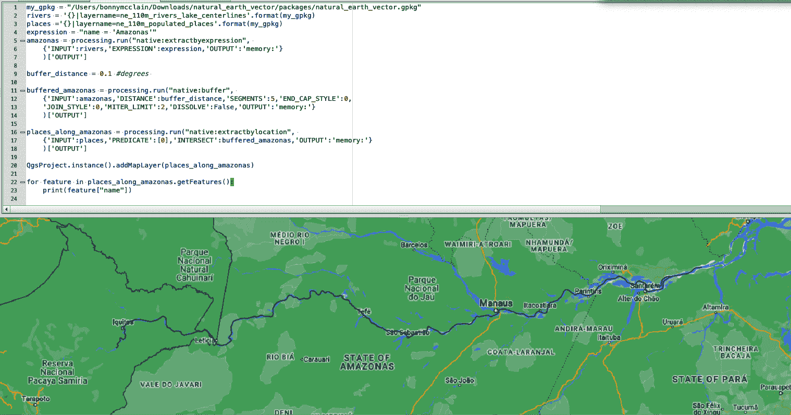

# 第三章：QGIS：探索 PyQGIS 和本地算法进行空间分析

在本章中，我们将继续专注于 QGIS，随着您通过 Python 和 QGIS 提升技能。这些是基础概念，学习它们对未来的地理空间分析技能至关重要，包括空间算法、数据工程、预测建模和机器学习。

QGIS 的 Python 集成称为*PyQGIS*，这是一个使用定义的协议和定制来自动化工作流程的 Python API。在运行大型脚本或构建应用程序时，自动化非常重要。通过 API 与集成，您可以访问各种数据集进行探索和分析。您可以创建、修改和查询表示现实世界中特征的数字对象。

PyQGIS 是基于底层 C++库的一个包装器。所有由 C++版本的`QgisInterface`实现的方法和类变量都通过 Python 包装器提供。PyQGIS 的*类*专注于 QGIS 内的功能。您无需单独安装 Python，因为它与 QGIS 一起直接安装到您的系统中。

Python 是一种面向对象的编程语言。您可以将对象视为数据块（*属性*）和行为（*方法*）。在 Python 中，对象还包括函数。属性可以是数据或函数。方法也是属性，这意味着您可以像任何其他属性一样将它们存储在变量中。Python 类描述如何改变对象状态和对象属性的指令。

我将在本章稍后简要探讨 Python 脚本模板时再次讨论这些概念，但在我们使用由`QgisInterface`类定义的方法或函数时，我还将突出它们。我们将首先使用 PyQGIS 导航一个示例项目。您将上传数据层并学习如何使用 Python 控制台与它们交互。

# 探索 QGIS 工作空间：旧金山的树木覆盖和不平等

你在第二章中学习了城市热岛现象，我们在这里将进一步展开讨论。众所周知，树木覆盖较少的社区往往更炎热，这常常导致健康风险增加。我们将在本章的第一个示例中探索这个想法，看看在美国的一个城市，旧金山，有哪些社区可能树木覆盖较少。

图 3-1 中的地图有四个数据层叠加在上面：一个描绘社区边界的层，一个提供旧金山树木覆盖数据的层，一个提供收入水平和种族数据的层，以及一个提供位置背景的 OpenStreetMap。紫色线条表示以摘要要素类表示的社区边界。

我们还需要最后一件事情，那就是*代理*或代替，用于低收入社区。是否有已经在使用的措施，可以告诉我们需要知道的信息？事实上，有：[Equity Strategy Neighborhoods](https://oreil.ly/HeLPB)。旧金山市交通局（SFMTA）在应用旨在解决交通性能不平等的政策时使用此措施。这些社区根据其低收入家庭的比例、公共住房以及居民对私人车辆的访问、种族/族裔和残疾进行了识别。这可以作为我们需要的低收入社区的代理。

有了这些图层，我们可以考虑树木覆盖充足的区域位于何处，并将它们与不同收入水平和种族组成的社区进行比较。


###### 图 3-1\. 旧金山的城市热岛，由 ArcGIS Online 生成

你将会查看来自[DataSF](https://oreil.ly/pLNTb)的样本数据（如图 3-2 所示）。从以下三个数据资源链接下载 shapefile 文件：[Equity Strategy Neighborhoods](https://oreil.ly/HPve3)，[SF Urban Tree Canopy](https://oreil.ly/RIKUa)，以及[SF_neighborhoods](https://oreil.ly/qNEsQ)。一旦设置好工作空间，你将返回这些文件。


###### 图 3-2\. 在 QGIS 地图画布中可见的样本数据

## Python 插件

打开 Python 控制台，就像你在第二章中所做的那样，可以通过在窗口顶部的工具栏中选择图标或从菜单栏中打开 Plugins >> Python Console 来执行。你可以点击控制台，插件将添加到你的工作空间中，就像图 3-3 中那样。


###### 图 3-3\. 安装 Python 插件

`QgisInterface`类提供了与 QGIS 环境交互的方法。当 QGIS 运行时，设置一个名为`iface`的变量，以提供一个`QgisInterface`类的对象，用于与运行中的 QGIS 环境交互。该接口允许访问地图画布、菜单、工具栏和 QGIS 应用程序的其他部分。Python 控制台和插件都可以使用`iface`访问 QGIS 界面的各个部分。

在 QGIS 桌面应用程序中，`iface.activeLayer()`可以访问图例中当前选择的图层。`iface`类最常见的用法是获取显示地图的画布的引用。

在 图 3-4 左下角的提示是您将输入短代码片段的位置。您的查询结果将显示在上部控制台中。右侧的代码编辑器可以容纳更长的代码行，并允许您在运行代码之前对其进行一些处理。


###### 图 3-4\. Python 控制台（左）和 Python 代码编辑器（右）

在 图 3-4 中从左到右阅读工具栏图标，您将看到 Clear Console（清除控制台内容），Run Command，Show Editor，Options 和 Help。

在工具栏中选择选项，可以设置字体并执行其他自定义操作。代码编辑器还列出了函数图标，您可以在直接在编辑器窗口中创建脚本时使用它们。完整列表在 表 3-1 中给出。

表 3-1\. QGIS 中的功能图标

|  | 清除控制台 |
| --- | --- |
|  | 运行命令/运行脚本 |
|  | 显示编辑器/在外部编辑器中打开 |
|  | 选项 |
|  | Python 控制台帮助 |
|  | 打开脚本 |
|  | 保存 |
|  | 另存为 |
|  | 剪切 |
|  | 复制 |
|  | 粘贴 |
|  | 查找文本 |
|  | 注释 |
|  | 取消注释 |
|  | 对象检查器 |

在 >>> 提示符下在控制台中键入：

```py
print("Save the Planet!")
```

按 Enter 键，您将得到输出：拯救地球！

我还想指出，当您在 GQIS 控制台中键入此代码时，“拯救地球！” 字符串以红色显示，而其余部分以黑色显示。这称为 *语法高亮*，是一个有用的工具，使您更容易发现代码中是否有任何输入错误。括号也将被突出显示，因为意外地留下所需的开放或闭合括号是常见错误。

## 访问数据

在我们探索多层示例之前，让我们使用 Python 加载一个矢量图层。这是来自 图 3-1 的邻域图层。您需要知道从哪里下载了您的文件的 URL。如果您进入浏览器面板并找到已下载的文件，可以从图层属性中检索到 URL，如 图 3-5 所示。


###### 图 3-5\. 从浏览器加载数据

您需要告诉 `iface` 添加矢量图层。在接下来的代码片段中，`ogr` 是您在 第 2 章 中看到的提供者键名称。在本章中，您将使用几个不同的提供者键。将 `*Path to your shape file.shp*` 替换为从图层属性中检索到的 URL。您还将创建一个变量 `SF` 用于旧金山，并将位置信息存储在其中，这样您以后可以不必重新输入字符串来引用它：

```py
for layer in QgsProject.instance().mapLayers().values():
    print(layer.name())
SF = iface.addVectorLayer('Path to your shape file.shp','SF_neighborhoods','ogr')
QgsProject.instance().addMapLayer(SF)
if SF.isValid():
    QgsProject.instance().addMapLayer(SF)
```

此处的代码正在获取我们称为 SF_neighborhoods 的图层中邻里的多边形形状。如果矢量有效，此代码将将图层添加到画布上。`.isValid``():` 是一个程序检查，用于验证输入是否正确。

您现在从 Python 控制台将一个图层加载到了画布上。矢量图层的颜色是随机的，但您可以修改属性：

```py
renderer = SF.renderer()
symbol = renderer.symbol()
symbol.setColor(QColor('pink'))
```

接下来，您将要包括邻里的名称。选择图层属性并格式化标签以更新地图上的名称。在 图 3-6 中，您可以看到如何调整字体、样式（**粗体**）、大小、颜色和不透明度。


###### 图 3-6\. 图层属性：向地图添加标签

当您选择应用并点击确定后，标签将被添加到画布上（图 3-7）。

加载其余的图层。最快的方法是使用 `addVectorLayer()` 方法如下：

```py
vlayer = iface.addVectorLayer("Path to SF Urban Tree Canopy.shp", "SF_TREES",
"ogr")
**if not** vlayer:
  print("Layer failed to load!")

vlayer = iface.addVectorLayer("Path to Equity Strategy Neighborhoods.shp", 
"ESN layer", "ogr")
**if not** vlayer:
  print("Layer failed to load!")
```


###### 图 3-7\. QGIS 中的旧金山邻里图层，带有标签

早些时候，您使用了方法 `QgsProject.instance().addMapLayer(SF)` 来设置活动图层。在这里，您正在添加矢量图层，`iface.addVectorLayer`。

## 使用图层面板

在我们查看最终地图之前，我想回溯一下，向您展示我们是如何到达这里的。在您的画布上，您有三个矢量图层。

点击菜单栏中的“视图”，滚动到面板（图 3-8）以查看面板选项的嵌套菜单。您可以将这些选项停靠到画布上，以便在构建可视化（地图）并与功能和底层数据交互时访问它们。


###### 图 3-8\. QGIS 中可用的面板类型

要停靠面板，您可以将它们拖放在彼此上方以节省空间，并根据需要选择面板在它们之间移动。如果您决定更喜欢取消停靠，点击 X 旁边的堆叠图像，然后逐个取消停靠。我建议停靠图层 >> 图层样式 >> 浏览器 >> 处理工具箱。当您开始工作时，您可以简单地返回到画布，或者点击菜单中的“视图”，滚动到面板，然后选中或取消选中选项来删除或添加面板。

面板是一种小部件。你可以使用它们提供输入和可见性，数字化坐标，执行统计分析和添加数据源等等。有关所有不同选项的详细信息，请参阅[QGIS 用户指南](https://oreil.ly/QWQF1)。我将向你展示我在创建几乎所有地图项目中使用的面板。  

在图 3-9 中，你可以看到左上窗口中的图层已经移动到了一个允许每个图层都可见的层次结构中。例如，社区的标签位于最高层级，因此它们不会被其他要素或多边形掩盖。  

  

###### 图 3-9\. 编辑地图画布上的图层  

在图层面板中，你还可以调整不透明度和颜色。你要确保“Equity Strategy Neighborhoods”数据可见，但不要遮盖 SF Urban Tree Canopy 下面的数据。选择面板并在画布上排列它们。  

###### 小贴士  

现在你已经开始在控制台中编写 Python 代码了，[QGIS PyQGIS 速查表](https://oreil.ly/yXc82)列出了一些代码片段供你参考。请随意尝试它们，并决定哪些可以提高工作效率。  

## 解答研究问题  

现在让我们来解答我们最初的研究问题。通过查看地图，你能感受到树木覆盖数据与低收入社区的联系吗？  

乍一看，我们识别出的许多低收入地区的树木覆盖似乎稀疏。进一步计算树木覆盖密度将是量化我们在地图中观察到的内容的下一步。选择其中一个社区会显示底层数据（图 3-10）。我们不会在这里得出任何正式结论，但我鼓励你深入挖掘。

  

###### 图 3-10\. 选择社区并探索功能  

这个练习帮助你熟悉了 QGIS 工作空间和 Python 插件。你学会了如何处理图层和添加标签。你还学到了如何查找现有数据集，这些数据集可以作为你想要测量的东西的代理，你也能感受到在地图上对齐两个数据集如何帮助解决研究问题。  

# Web Feature Service: 马萨诸塞州的环境威胁识别  

在下一个例子中，你将探索另一个开放数据集。马萨诸塞州政府的[马萨诸塞州地理信息局](https://oreil.ly/SNfaJ)提供了一个名为[MassMapper](https://oreil.ly/JickV)的 GIS 工具。该工具中提供的许多数据层之一称为[关键环境关注区（ACECs）](https://oreil.ly/9Z3zd)。该图层由马萨诸塞州保护与娱乐部门（DCR）开发和维护。根据该网站，这些数据提供了有关麻省被选为“其自然和文化资源的质量、独特性和重要性”的地点信息。利用 ACECs 数据，我们可以构建地图，查看这些区域可能受到当地特征（如附近道路密度、湿地或机场的接近度）的影响。

## 访问数据

有许多连接到 QGIS 数据的方法，所以这里我们将探索一个新的方法。

Web Feature Service（WFS）规范是一种允许访问地理要素的提供者关键字，其中包括几何和属性可用于您的查询和分析。通过选择“图层” >> “数据源管理器”或单击工具栏中的图标来连接数据。选择 WFS/OGC API - Features。您还可以在浏览器面板中垂直滚动。单击 WFS/OGC API，然后 图 3-11 中的弹出窗口将变为可见。


###### 图 3-11\. 创建一个新的 WFS 连接

通过将 URL *http://giswebservices.massgis.state.ma.us/geoserver/wfs* 输入到对话框字段中（图 3-12），连接到服务。您将提示创建连接的名称：使用 MASS_Sample 并单击“确定”。默认设置很好。


###### 图 3-12\. WFS 连接详细信息

新的连接出现在服务器连接中。点击连接，你将看到可用图层的列表，如图 3-13 所示。

滚动到底部找到并选择以下图层，然后单击添加：

+   GISDATA.AIRPORTS_PT（机场位置）

+   GISDATA.BM2_CH_BIOMAP2_WETLANDS（湿地位置）

+   GISDATA.ACECS_POLY（关键环境关注区域）

+   GISDATA.CENSUS2010TIGERROADS_ARC（道路位置）


###### 图 3-13\. 数据源管理器 WFS 连接

## 发现属性

在控制台中输入以下代码并点击运行（绿色箭头）：

```py
active_layer = iface.activeLayer()
iface.showAttributeTable(active_layer)
iface.showLayerProperties(active_layer)
```

这将创建对活动图层的引用，在本例中为 GISDATA.AIRPORTS_PT。一旦创建了此引用，您可以访问图层的属性。

现在您可以探索一些选项或直接在控制台中访问它们。首先，选择“打开属性表”以查看与图层相关的属性。您可以对任何要探索的图层执行相同操作。

在您输入代码时，可能会注意到出现的建议，如图 3-14 所示。


###### 图 3-14\. QGIS Python 控制台中的自动建议

让我们看看打开属性表时出现的片段：

```py
showAttributeTable(QgsVectorLayer, QString filterExpression='') -> QDialog
```

黄色框包含您可以提供给`showAttributeTable`方法的参数及其输出内容。在这里，您正在调用`QgsVectorLayer`对象和表示过滤表达式的字符串，可以用它来通过识别特定字段来过滤数据，如图 3-15 所示。`filterExpression`不是必需的，这由空字符串表示：`=''`。如果留空，则提供默认值，在本例中为空字符串。输出的`QDialog`构造实际的属性表。这只是一个简短的示例；要了解此特定类的全部功能，请参阅[`QgisInterface`文档](https://oreil.ly/70feB)。


###### 图 3-15\. 图层和属性表

## 使用迭代器进行工作

接下来，让我们找到机场。直接在控制台中编写以下代码可以识别出所在地的城镇图层和特征计数：

```py
layer = iface.activeLayer()
print(type(layer))

<class 'qgis._core.QgsVectorLayer'>

print(layer.sourceName())
massgis:GISDATA.AIRPORTS_PT
layer.featureCount()
42
```

这里是输出的一部分：

```py
BEDFORD
BEVERLY
BOSTON
HANSON
HOPEDALE
...
```

迭代器是一种 Python 对象类型，包含可迭代的项。迭代器可以逐个元素地查看较大的数据集。与列表等其他对象类似，但有一个关键区别：创建迭代器时，不会将所有项存储在内存中。迭代器每次加载一个项，然后在需要时获取下一个项。这使得迭代器非常高效。它们可以在不读取整个数据集的情况下读取大量数据。QGIS 为许多不同的对象类型实现了迭代器。

在以下代码中，调用`layer.getFeatures()`的结果是一个迭代器；`next()`函数是手动迭代器；列表、元组和字符串是可迭代的：

```py
layer = iface.activeLayer()
features = layer.getFeatures()
f = next(features)
print(f.attributes())
f = next(features)
print(f.attributes())
```

这将输出：

```py
['BED', 'BEDFORD', 'HANSCOM FIELD', 'MassPort', 'PUBLIC OWNED AP', 'TRAN', 
2, '42 28 12', '71 17 22', 133, 7001.0, 5106, 150, 150, 'ASPHALT-GROOVED', 
'ASPHALT', 'HIRLS', 'MIRLS', 'FAA', 'N', ' ', 'RELIEVER W/ COMMERCIAL SERVICE', 
'Y']
['BVY', 'BEVERLY', 'BEVERLY MUNICIPAL AIRPORT', 'MAC', 'PUBLIC OWNED AP', 'GU-2', 
2, '42 35 03', '70 55 03', 108, 5001.0, 4637, 150, 100, 'ASPHALT', 'ASPHALT', 
'MIRLS', 'MIRLS', 'CONTRACT', 'Y', ' ', 'RELIEVER GA', 'N']
```

如果您想要地图中所有图层的列表，请使用以下代码：

```py
for layer in QgsProject.instance().mapLayers().values():
    print(layer.name())
```

输出如下：

```py
OpenStreetMap
massgis:GISDATA.ACECS_POLY
massgis:GISDATA.AIRPORTS_PT
massgis:GISDATA.BM2_CH_BIOMAP2_WETLANDS
massgis:GISDATA.CENSUS2010TIGERROADS_ARC
```

选择“图层属性”还将打开表格，如图 3-16 所示。早些时候运行的代码`layer.featureCount()`显示了总共 42 个特征，本例中为机场（活动图层）加上图层属性面板中列出的 23 个字段（列）。


###### 图 3-16\. 所选图层 GISDATA.AIRPORTS_PT 的属性和属性

向 Python 控制台添加样本代码将生成地图图层的信息。当逐行运行代码时，您可以使用控制台并在>>>提示符下输入代码。当运行多行脚本时，您将需要使用编辑器：右侧的面板在图 3-17 中。代码运行时会显示行号。您将在本章的最后一个示例中看到这一点。


###### 图 3-17\. 在控制台中运行 Python 代码以添加数据到画布

## 图层样式

现在可以修改图层使特征可见和清晰，以便您的受众能够理解。生成的颜色通常是随机的，所以我喜欢使用图层样式进行定制。

现在您可以查看地图（图 3-18）并探索机场位置、道路以及湿地与 ACECs 区域的关系。您认为这些特征可能影响这些环境敏感区域的健康状况？在回答这个研究问题时，您可能还想寻找哪些其他特征？


###### 图 3-18\. 马萨诸塞州 ACECs 区域地图

这个练习让您进一步练习了 QGIS 图层，并介绍了图层样式。您还学习了如何使用迭代器和发现属性。

# 在 Python 控制台中使用处理算法

到目前为止，您已经了解了 Python 控制台和 QGIS 在地理空间分析中的能力。您正在熟悉一个信息系统，它将地理数据与强大的软件结合起来，用于管理、分析和可视化这些数据。到现在为止，您可能已经发现了处理工具箱中的更多插件和强大工具。您已经很好地开始使用 Python 与 QGIS 这样的系统进行交互。

从这里开始，您可以继续利用帮助函数、QGIS 文档和其他资源来建立您的专业知识。您将在以下练习中进行实践。对于这个练习，我们的研究问题将是：*亚马逊河沿岸有哪些城市？*也许您希望专注于洪水或农业径流如何影响当地社区。这个练习是尝试过滤和分析大型开源数据集的机会。探索属性表并定制查询！

Python 脚本的最大优势之一是您的任务可以灵活且易于复制。在本章的最后一部分，您将学习如何使用*处理算法*：这些算法允许您保存脚本并将它们链接在一起。调整现有脚本是学习 Python 操作的最佳方式之一。您将使用从 Anita Graser¹调整的脚本来构建 Python 控制台中的工作流程。这个工作流程将使用三个处理算法：

+   native:extractbyexpression

+   native:buffer

+   native:extractbylocation

就像我们在第二章中所做的那样，我们将使用来自 Natural Earth Data 的数据。在图 3-19 中的画布显示了巴西的两种数据：人口聚集地和河流与湖泊。如果尚未下载，请下载[GeoPackage](https://oreil.ly/IMccr)。从数据源管理器选择 GeoPackage 以上传文件。


###### 图 3-19. 在地图画布中探索感兴趣的区域

## 使用算法

在我们开始之前，您需要了解这些算法的来源以及如何处理不同的参数。在您的 Python 控制台中写入以下代码来开始：

```py
from qgis import processing
```

在处理函数时，重要的是按名称调用算法，以确保它们可靠执行。[`QgsProcessingRegistry`](https://oreil.ly/yXOkX)将正确列出算法。注册表是您可以访问算法、参数和不同输出的地方。您可以通过编写以下代码访问注册表：

```py
for alg in QgsApplication.processingRegistry().algorithms():
        print(alg.id(), "->", alg.displayName())
```

以`native`开头的算法是处理算法，仍然可以移植到 C++，并具有速度优势。

在输出的长列表中（下面摘录了一部分），您可以滚动查看其他内容，但也可以使用一小段代码直接访问它们：

```py
native:atlaslayouttomultiplepdf -> Export atlas layout as PDF (multiple files)
native:atlaslayouttopdf -> Export atlas layout as PDF (single file)
native:batchnominatimgeocoder -> Batch Nominatim geocoder
native:bookmarkstolayer -> Convert spatial bookmarks to layer
native:boundary -> Boundary
native:boundingboxes -> Bounding boxes
native:buffer -> Buffer
…
```

当我运行此代码时，我计算了超过两千个算法。每个算法都需要特定的参数来成功执行其代码。使用`processing.algorithmHelp("algorithmID")`和算法名称输出语法的特性将有助于您熟悉编写代码。

首先，让我们来看看我们将使用的脚本。但不要运行它！在您运行之前，我将逐个解释每个部分：

```py
buffered_amazonas = processing.run("native:buffer", 
    {'INPUT':amazonas,'DISTANCE':buffer_distance,'SEGMENTS':5,'END_CAP_STYLE':0,
    'JOIN_STYLE':0,'MITER_LIMIT':2,'DISSOLVE':**False**,'OUTPUT':'memory:'}
    )['OUTPUT']my_gpkg = "/Users/bonnymcclain/Downloads/natural_earth_vector/
	packages/natural_earth_vector.gpkg" rivers = '{}|layername=ne_110m_rivers_lake_centerlines'.format(my_gpkg)
places ='{}|layername=ne_110m_populated_places'.format(my_gpkg)
expression = "name = 'Amazonas'" amazonas = processing.run("native:extractbyexpression", 
    {'INPUT':rivers,'EXPRESSION':expression,'OUTPUT':'memory:'}
    )['OUTPUT'] 
buffer_distance = 0.1 #degrees  
places_along_amazonas = processing.run("native:extractbylocation", 
    {'INPUT':places,'PREDICATE':[0],'INTERSECT':buffered_amazonas,'OUTPUT':
	'memory:'}
    )['OUTPUT'] 
QgsProject.instance().addMapLayer(places_along_amazonas) 
**for** feature **in** places_along_amazonas.getFeatures():
    print(feature["name"])
```

注意，它按顺序运行您的三个算法。首先，您将按表达式提取。结果是一个存储在`amazonas`变量中并作为输入传递到下一个算法的图层。缓冲算法创建与缓冲河流中心线相交的缓冲区。例如，从河流的距离应该在城市附近的一定距离内。缓冲区设置了此距离。接下来，`extractbylocation`提取沿河的城市列表。

## 根据表达式提取

下面是`algorithmHelp()`函数如何描述 native:extractbyexpression：

> 此算法创建一个仅包含来自输入图层的匹配要素的新向量图层。将要素添加到结果图层的标准基于 QGIS 表达式。

暂停片刻，运行`processing.algorithmHelp("native:extractbyexpression")`并现在阅读。它将提供重要细节并描述您可以预期的输出。如果不列出参数，将应用默认值并将输出发送到内存。

这是使用此算法的脚本片段，所以你可以更详细地查看它：

```py
 amazonas = processing.run("native:extractbyexpression", 
    {'INPUT':rivers,'EXPRESSION':expression,'OUTPUT':'memory:'}
    )['OUTPUT']
buffer_distance = 0.1 #degrees
```

## 缓冲区

接下来运行：

```py
processing.algorithmHelp("native:buffer")
```

让我们看看 [帮助文档](https://oreil.ly/pNmzd) 告诉我们有关 native:buffer 的信息：

> 该算法为输入图层中的所有要素计算缓冲区，使用固定或动态距离。
> 
> 段参数控制创建圆角偏移时使用的线段数目。
> 
> 端点样式参数控制缓冲区中如何处理线段的结束。
> 
> 连接样式参数指定在线段角点偏移时应使用圆角、斜接或斜角连接。
> 
> 斜接限制参数仅适用于斜接连接样式，并控制创建斜接连接时偏移曲线使用的最大距离。

阅读完整输出以获取理解算法及所需输入和输出的信息。特别是，你需要理解这些参数，以便包含在你的查询中。你将看到`INPUT`、`DISTANCE`、`SEGMENTS`、`END_CAP_STYLE`、`JOIN_STYLE`、`MITER_LIMIT`、`DISSOLVE`和`OUTPUT`的信息。

这是包含此算法的脚本段落：

```py
buffered_amazonas = processing.run("native:buffer", 
    {'INPUT':amazonas,'DISTANCE':buffer_distance,'SEGMENTS':5,'END_CAP_STYLE':0,
    'JOIN_STYLE':0,'MITER_LIMIT':2,'DISSOLVE':**False**,'OUTPUT':
   'memory:'}
    )['OUTPUT']
```

这段代码在做什么？从这里的语法中你能得出什么结论？从`algorithmHelp`函数的输出中，你可以看到位置向量现在是 native.buffer 的输入。缓冲区只关心缓冲范围内的数据。例如，河流和城市应该在 10 公里范围内。

## 根据位置提取

我们的第三个算法是 native:extractbylocation。接下来，我们将 *交叉* Amazonas 缓冲数据——也就是说，比较我们现在拥有的两组数据——将河流数据与地点数据结合起来。这将包括我们感兴趣的河流沿岸的城市。

首先运行：

```py
processing.algorithmHelp("native:extractbylocation")
```

帮助文档再次包含关于参数的重要信息。

这里是我们脚本中使用 extract by location 的部分：

```py
places_along_amazonas = processing.run("native:extractbylocation", 
    {'INPUT':places,'PREDICATE':[0],'INTERSECT':buffered_amazonas,'OUTPUT':
    'memory:'}
    )['OUTPUT']
```

QGIS GUI 在 Processing Toolbox 功能中包含类似的工具（图 3-20），但你需要分别运行这些过程，并找到输出中合适的输入和输出参数（这与 图 3-21 中的类似）。

```py
processing.algorithmHelp("native:extractbylocation")
```


###### 图 3-20\. QGIS GUI 中的算法


###### 图 3-21\. QGIS GUI 输出中埋藏的输入和输出参数

现在你已经检查过了，请继续在控制台中运行脚本。输出结果如图 3-22，展示了巴西亚马逊河沿岸的城市地图。这个练习展示了如何创建算法以在大型数据集上运行，从而加强高效和可重复的工作流程。现在你可以根据自己的想法查询数据。使用每个数据集提供的属性表来注意变量或列标题的列出情况。保存你的 Python 脚本将允许你创建模板，随着你的好奇心增长而进行练习和更新！



###### 图 3-22\. 亚马逊河沿线的城市地图

# 摘要

本章向你展示了如何下载 QGIS，自定义你的工作空间，并从不同的提供商键中上传数据，既可以在 Python 控制台内部，也可以直接从浏览器中进行。你还学会了如何自定义你的地图以提高其可读性，并开始熟悉画布和图层样式。你被介绍了处理工具。这些工具很复杂，但将代码分成小节并学习语法通常是获得更高级技能的绝佳实践。你学会了如何将三个算法链接在一起并将结果存储在一个变量中，以供后续使用。

在接下来的章节中，你将继续通过与 Google Earth Engine 和 ArcGIS 等附加工具互动来构建你的 Python 技能。

¹ 这个工作流程改编自 Anita Graser 未标日期的博文[“PyQGIS 101: Chaining Processing Tools”](https://oreil.ly/RdQxx)，一个处理工具的使用教程。
