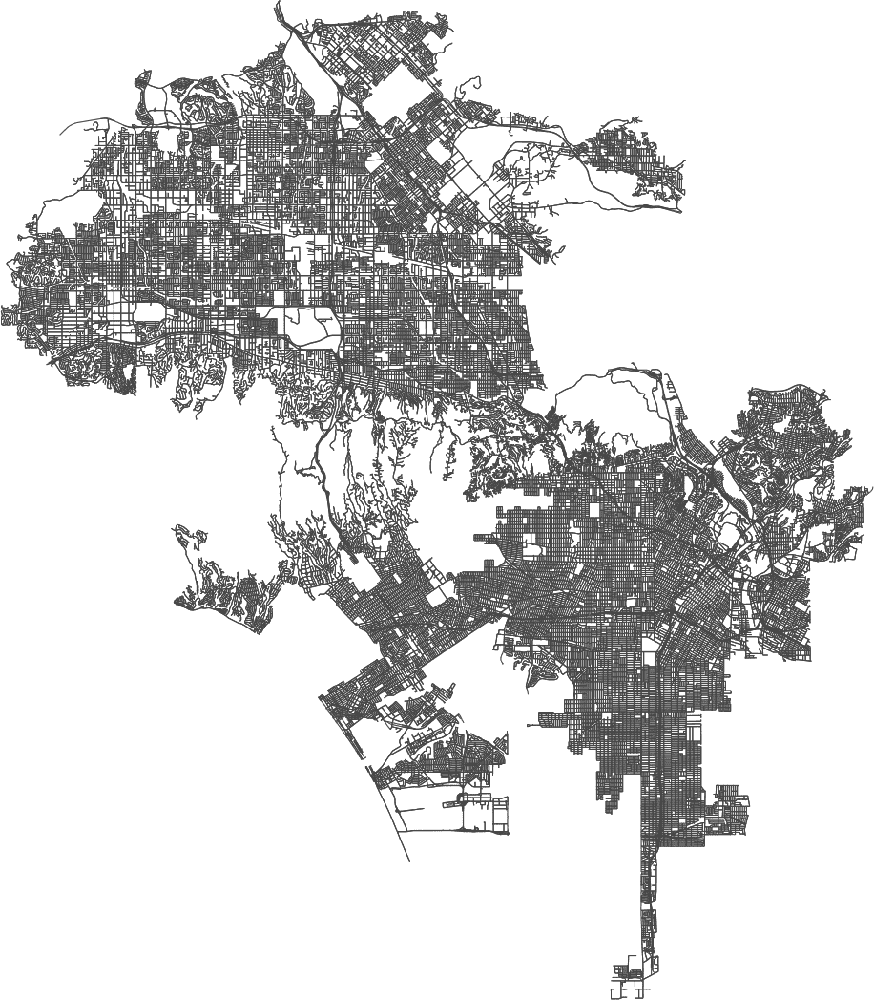

# 第五章。使用 OSMnx 访问地理空间数据

[开放街图（OSM）](https://oreil.ly/UWkLH)是一个由志愿者建立的可编辑的全球地理数据库，其宏伟目标是为我们所有人创建地理数据并免费分发。如果您使用 GPS 进行导航或任何启用位置的设备，您已经在智能手机上与 OSM 互动过了。Python 提供了一个名为[OSMnx](https://oreil.ly/CR2vV)的包，允许城市规划者和其他各种用户创建街道网络，并与和分析通常“隐藏”的地理信息互动。您可以找到适合步行、驾驶或骑行的城市网络，用于个人使用或研究，比如研究城市环境的特征。强大的分析揭示了基础设施框架，例如在分析道路网络和道路相互关联的性质时揭示了低效率。

就我个人而言，我认为街道网络是艺术作品。但它们真正的用途可能被低估了，即为您的建筑基础设施添加几何形状。您可以添加建筑物（例如医院、学校和杂货店）、公园和其他数据框架，分类为边缘、建筑物和区域。术语*建筑物*定义宽泛，有一个关于[建筑标签](https://oreil.ly/ZuB1n)的维基。查找地名的好资源是[OSM Nominatim](https://oreil.ly/tmo4M)。您还可以添加兴趣点、海拔高度等等。

乍一看，OSMnx 可能看起来有些技术性和复杂。但随着您在本章中使用 OSM 建立街道网络，您将学会应用和互动这个功能强大、可定制的包。

# 开放街图的概念模型

[OSM 数据库](https://oreil.ly/pPT7s)包含超过 80,000 个标签键和 600 种关系类型，因此您可以为地图定义适当的粒度。在本章中，您将学习如何访问这些功能，自定义它们，将它们添加到您的地图中，并进行分析。例如，您可以识别一个位置并探索农业、商业或住宅用地的分布。（您可以通过查询数据库获取的不同土地使用价值的快照显示在本节后面的图 5-2 中。）了解一个区域的土地利用分布可能很重要，如果您对该地区发生的洪水量或如何计算暴雨径流感兴趣的话。截至撰写本文时，数据库中最流行的标签包括关于建筑物、高速公路、地表和水路的数据。

OSM 的结构有一些规则，但它们相对来说很简单。例如，节点可以是任意（*可散列*）的 Python 对象，节点和边缘都可以是可选的键/值属性。要查看这些可选值的全部内容，请前往 OSM 的[地图功能](https://oreil.ly/XDg2a)或[标签信息](https://oreil.ly/oOkoG)（或者在文本中跟随）。

你可以将可变对象（如列表）放在元组中。元组仍然是不可变的，但是您可以更改其中的列表，因此它不可哈希。

## 标签

OSM 应用一个由键-值对组成的*标签*。您将在我们将编写的代码单元中看到这些定义。它们的格式是`key=value`，例如，如果您的位置键设置为`highway`，值设置为`residential`，则可以知道这是一条人们居住的道路。

这里有几个标签的示例：

```py
surface=asphalt
highway=residential
building=commercial 
```

根据你的需求，这种粒度可能在数据探索中很有用。例如，我曾使用这些标签来探索城市环境中的不透水表面。不透水表面往往会吸热，而且这些地方往往有较高的洪水发生率——这在比较不同社区特征时是重要信息。举个例子，你可能只是想要一个某社区内所有建筑物的地图。然后默认值`buildings="all"`将被上传。我们将探讨包含标签在本章代码示例和示例笔记本中的实用性。

OSMnx 提取 OSM 数据并创建一个可用于处理复杂网络的可路由的[Python NetworkX](https://networkx.github.io)对象。这是将来自 OSM 的边缘和节点转换为具有路由特性的链接和交叉点所需的。这些可路由的地图是具有诸如行驶时间、速度限制和位置之间的最短距离等功能的网络，允许进行路径规划。


###### 图 5-1\. 曼哈顿切尔西社区的可行走街道网络地图

OSMnx 自动化了多个地图功能，包括下载像州、城市、社区、建筑物轮廓、定制街道网络和拓扑结构等几何图形。此外，OSMnx 还具有基于图论基础的分析功能。简单来说，*图论* 表示空间网络中元素及其位置之间的连接，包括节点和边缘。NetworkX 集成允许您自定义节点和边缘以容纳各种数据、图算法和用于分析的网络结构。除了地理坐标外，每个位置还存储大量信息。我们将很快开始探索这些数据类型。首先，这里是引擎盖下的简要介绍。

## 多重图

图 5-1 显示节点之间的边缘。这是本章稍后将要构建的一个预览。节点是通过街道段连接的角落，例如本例中按长度加权。你也可以按行驶时间加权。这是计算两地之间最短路径的一种方式。

您将在下一节中请求的数据将以 NetworkX 多重有向图的格式呈现。*多重有向图*是对具有多条边的对象或元素的抽象表示。它们是有向的，反映了例如特定城市街道上的交通是单向的还是双向的。有向图的边从节点指向节点，但不一定是双向的。一旦您有了多个平行的边，您就有了一个多重有向图。

OSM 是一个*维基*，是一个开源的可编辑地理数据库。其概念模型包括*节点*定义空间中的点，*道路*定义线性特征和边界，以及*关系*解释节点和道路如何共同工作。将*节点*看作是由纬度和经度定义的坐标，*道路*代表节点列表（称为*折线*）或多边形的边界。

您可能最初将这些空间网络视为简单的平面，但实际上有很多非平面结构，比如桥梁、隧道以及各种等级分隔的结构，如高速公路、上下匝道和过街天桥。您可以使用拓扑测量和*度量结构*或以空间单位（如米）描述的长度和面积来评估这些结构。维基描述了土地利用标签与可以分配给关键的值之间的关系，如图 5-2 所示。

地理数据问题通常基于特定位置进行定义，并且通常具有现实世界的影响。它们经常涉及土地利用、道路表面、建筑物的数量和类型，或者社区设施的位置，比如博物馆、酒吧或互联网接入点。例如，您的数据问题可能是这样的：

+   华盛顿特区第七选区有多少个超市？

+   特定社区有多少个绿地或公园？

+   芝加哥伊利诺伊州有多少步行街？


###### 图 5-2。OSM 数据库中可用于描述土地利用的一些标签

首先，让我们安装 OSM。

# 安装 OSMnx

在您的终端中为 OSMnx 安装一个独特的环境。正如我之前所指出的，我创建不同的环境是为了简单地解决依赖关系和更新问题。另一个从艰难经验中学到的教训是：如果您需要更新软件包，请将其删除并重新安装到您的环境中。我经常在特定项目之后删除环境，因为如果您随意创建并让它们长时间停留在那里，它们可能会占用您硬盘上的大量空间。如果您以具体的方式命名它们，这将更加容易。这似乎是确保您所有依赖项也已更新的唯一方法。如果您在代码中收到一个函数已被弃用的消息，请返回至[用户参考文件](https://oreil.ly/MZLFQ)以获取澄清。

在你的终端中输入：

```py
conda create -name OSM
conda activate OSM
conda install -c conda-forge osmnx
conda install -c conda-forge matplotlib
conda install -c conda-forge descartes 
conda install -c conda-forge shapely 
conda install -c conda-forge jupyter
conda install -c conda-forge jupyter_contrib_nbextensions
```

你将使用 OSMnx 检索 OSM 数据和 matplotlib 库与数据进行交互和可视化。

如果你想查看与 OSMnx 一起安装的软件包，进入`conda activate env`后，在终端中输入`**conda list**`。如果忘记了环境的名称，可以写`**conda env list**`并查看所有环境。在这里，我创建了一个名为`OSM`的唯一环境：

```py
(ox) MacBook-Pro-8:~ bonnymcclain$ conda list
# packages in environment at /Users/bonnymcclain/opt/miniconda3/envs/OSM:
```

当你准备启动一个笔记本时，在你的终端中键入`**jupyter notebook**`，一个笔记本将会打开。

# 选择一个位置

为了传递`place_name`，OSMnx 使用 OSM Nominatim API。[Nominatim 文档](https://oreil.ly/AZvAG)包含一个 API 参考指南，用于搜索地理编码（参见图 5-3）。如果输入不正确的信息（例如，如果你按名称寻找但拼写错误），你可能会收到错误。打开[Nominatim](https://oreil.ly/AP9Sd)，你将进入一个用于搜索所请求位置的调试界面。我从那里开始确保我查询正确。


###### 图 5-3\. 使用 Nominatim 查询`place_name`的 API 请求

虽然可以将地名作为字符串添加，但最好先检查 Nominatim，并查看位置如何列出，以避免冲突或不正确的数据。例如，我想查找加利福尼亚州的 Brentwood，但出现了错误，所以我通过 Nominatim 运行了它。结果发现 Brentwood 作为一个社区的边界与 Brentwood 的行政边界不同，还有 Brentwood Heights。我需要稍微调整如何称呼这个社区。

当我们开始处理这些关系时，这将更加清晰。查阅[OSMnx 文档](https://oreil.ly/ZY8Nr)获取更多信息，但你也可以直接在你的代码单元格中查询。

假设你想要洛杉矶的详细街道地图。在以下代码中，你将从导入所需的包开始：osmnx 和 matplotlib。包括`place_name`并将其设置为所需位置（在代码中用引号括起来）。如果你看的不仅仅是城市和州，你包含的细节越多越好。运行以下代码（可能需要一些时间）：

```py
import osmnx as ox
import networkx as nx
import matplotlib.pyplot as plt #installs with osmnx

# download/model a street network for some city then visualize it
G = ox.graph_from_place("Los Angeles,California,United States", 
network_type="drive")
fig, ax = ox.plot_graph(G,figsize=(20,20),bgcolor='#FFFFFF',
    node_color='black', node_size=0)
```

函数以`ox.module_name.function_name()`的格式编写。之前的代码片段引用了`osmnx.graph`模块和`graph_from_place`函数。大多数函数只需调用`ox.function_name()`即可。这将获取`洛杉矶,加利福尼亚州,美国`内的地理编码信息，以及边界内的可驾驶街道网络数据（参见图 5-4）。

如果你喜欢，可以选择一个较小的位置。较大的城市需要大量资源，可能需要几分钟来加载。本章后面我们将探索加利福尼亚州卡尔弗城。

将你的光标放在你的代码中指向的☞图标指向的括号内。这里是为了清晰起见而隔离的片段：

```py
G = ox.graph_from_place(☞"Los Angeles,California")
```

当你的光标位于括号内时，选择键盘上的 Tab + Shift。



###### 图 5-4\. 由 OSMnx 生成的洛杉矶市街道网络

让我们看看可能的参数！

例如，图 5-5 显示了签名的特征。这是参数列表，它们需要与函数签名中列出的参数匹配。尝试不同的选项，看看地图如何变化。


###### 图 5-5\. 在函数内发现可用参数

函数选项的`network_type`如图 5-5 所示：

`drive`

可行驶的公共街道（不包括服务道）

`drive_service`

可行驶的公共街道，包括服务道

`walk`

所有可供行人使用的街道和路径（忽略单向性，始终使用相邻节点之间的相互连接有向边）

`bike`

所有可供自行车使用的街道和路径

`all`

所有（非私有）OSM 街道和路径

`all_private`

所有 OSM 街道和路径，包括私人通道

# 理解参数和参数

你听过这句话吗，“没有人会来救你”？我确信这是由数据科学家首次说出的。当你的代码无法执行（相信我，这不是“如果”，而是“何时”），你需要阅读用户文档。这可能是关于软件包本身的文档，或者可能是一个 GitHub 存储库。功能和参数已经过时并且用新版本进行更新。知道如何找到它们是一个重要的技能。

如果你在参数下滚动，你会注意到这些变量在代码片段中的定制。我不能在这里包含每个函数和相关的参数，但我们来看一些例子。选择右上角的倒置尖角以显示框的内容（如图 5-5 所示）。向下滚动，你会看到一个名为“文档字符串”的部分。

*文档字符串*提供了有关类、函数或方法的快速信息。我在这里寻找如何构建我的查询的提示。当你需要关于函数的额外信息时，在括号内返回你的光标并选择 Tab + Shift。这里有一个可用文档的示例：

```py
Docstring:
Create graph from OSM within the boundaries of some geocodable place(s).

The query must be geocodable and OSM must have polygon boundaries for the geocode 
result. If OSM does not have a polygon for this place, you can instead get its 
street network using the graph_from_address function, which geocodes the place 
name to a point and gets the network within some distance of that point.

If OSM does have polygon boundaries for this place but you’re not finding it, 
try to vary the query string, pass in a structured query dict, or vary the 
which_result argument to use a different geocode result. If you know the OSM ID 
of the place, you can retrieve its boundary polygon using the geocode_to_gdf 
function, then pass it to the graph_from_polygon function.
```

当您在界面中继续向下滚动时，您将看到一个“参数”部分。该部分提供关于数据类型的信息以及如何完成查询的说明。根据您的查询，不是所有参数都是必需的。如果您省略了一些参数，则会显示默认值。

再看一下用于生成 图 5-4 中洛杉矶地图的代码片段。此地图需要为`network_type`参数输入信息：在本例中，`network_type="drive"`。该函数接受一个字符串（因此要用引号括起来），选项在括号内列出并且必须在括号内。这些选项如文档中所列：

```py
Parameters
----------
query : string or dict or list
    the query or queries to geocode to get place boundary polygon(s)
network_type : string {"all_private", "all", "bike", "drive", "drive_service", 
"walk"}
    what type of street network to get if custom_filter is None
simplify : bool
    if True, simplify graph topology with the `simplify_graph` function
retain_all : bool
    if True, return the entire graph even if it is not connected.
    otherwise, retain only the largest weakly connected component.
truncate_by_edge : bool
    if True, retain nodes outside boundary polygon if at least one of
    node's neighbors is within the polygon
which_result : int
    which geocoding result to use. if None, auto-select the first
    (Multi)Polygon or raise an error if OSM doesn't return one.
buffer_dist : float
    distance to buffer around the place geometry, in meters
clean_periphery : bool
    if True, buffer 500m to get a graph larger than requested, then
    simplify, then truncate it to requested spatial boundaries
custom_filter : string
    a custom ways filter to be used instead of the network_type 
    presets  e.g., '["power"~"line"]' or 
    '["highway"~"motorway|trunk"]'. Also pass in a network_type that 
    is in settings.bidirectional_network_types if you want graph 
    to be fully bi-directional.
```

# 计算旅行时间

一种受欢迎的数据问题类型涉及到旅行时间：*从点 A 到点 B 需要多长时间？*

要回答这类问题，您可以绘制*网络*（其中边交叉）并计算*自由流行驶时间*，使用在特定公路类型上允许的最大速度。换句话说，当考虑到道路上的最大速度时，计算驾驶距离所需的时间定义为*自由流行*。`osmnx.speed` 模块通过提供每小时公里数作为 `speed_kph` 边属性来计算速度和旅行时间。复杂的网络由节点和边之间的连接形成。使用 NetworkX Python 包分析这些结构允许您将节点视为元素，并将节点之间的连接视为边以研究它们的关系。

让我们尝试运行一个计算旅行时间的函数：

```py
ox.speed.add_edge_speeds(G, hwy_speeds=None, fallback=None, precision=1)
ox.speed.add_edge_travel_times(G, precision=1)
```

请注意，在此处您有四个输入。让我们对此进行分解，并查看 OSM 文档如何定义它们：

`G`

输入图

`hwy_speeds`

公路类型中所有边的平均速度值（如果为空）

`f``allback`

如果道路类型没有预设值，则备用速度

`p``recision`

舍入到所需的小数精度

只传递`G`，即 NetworkX MultiGraph，到函数中。如果同时指定了起点(`orig`)和终点(`dest`)，您将得到从源到目标的最短路径的单个节点列表。这些路线是不同的，用于展示如何绘制`travel_times`和`edge_speeds`以找到目的地之间的最短路径。

您正在将权重设置为等于`w`，而不是默认的空值。看起来是这样的：

```py
G = ox.add_edge_speeds(G)
G = ox.add_edge_travel_times(G)

w = 'travel_time'
orig, dest = list(G)[10], list(G)[-10]
route1 = nx.shortest_path(G, orig, dest, weight=w)
orig, dest = list(G)[0], list(G)[-1]
route2 = nx.shortest_path(G, orig, dest, weight=w)
orig, dest = list(G)[-100], list(G)[100]
route3 = nx.shortest_path(G, orig, dest, weight=w)

routes = [route1, route2, route3]
rc = ['r', 'y', 'c']
fig, ax = ox.plot_graph_routes(G, routes, route_colors=rc, route_linewidth=6, 
figsize=(30, 30),node_size=0,bgcolor='#FFFFFF')
```

图 5-6 也使用了 OSMnx 的颜色选项。*颜色选项* 可以描述作为路径中每个边的属性值。*属性值* 可以表示属性，例如有关如何构造图的数据、在绘制图时顶点的颜色或仅是加权图中边的权重。在 图 5-6 中，路线用不同的颜色表示。


###### 图 5-6\. 计算洛杉矶点之间的最短距离，通过计算加权旅行时间

完整的街道网络确实会消耗资源，因此让我们选择一个特定的社区来获取一个更可管理的可视化查询。在随后的代码片段中，我指定了加州卡尔弗城（Culver City），包括城市边界内的所有私人道路（请参见 图 5-7）：

```py
place_name = 'Culver City, California, United States'
G = ox.graph_from_place(place_name, clean_periphery=False,
network_type="all_private")
fig, ax = ox.plot_graph(G,figsize=(7,7),bgcolor='#FFFFFF',
     node_color="b",node_size=3)
```


###### 图 5-7\. 加州卡尔弗城的街道网络地图（邻里级别）

如果您对节点或边缘的着色感兴趣，可以在 OSM wiki 页面或用户参考文档中探索 [`key:colour`](https://oreil.ly/zjof8) 选项。图 5-8 显示了最常见的颜色代码，但并非穷尽所有。颜色变化在某种程度上是不言自明的，但您可以在 [OSM wiki](https://oreil.ly/zjof8) 上查看确切的颜色。我发现这个图表对获取我经常使用的颜色代码非常有用。


###### 图 5-8\. OSM 中的关键颜色选项（非穷尽，但是一个方便的参考）

您已经在 OSMnx 中构建了几个街道网络和地图。现在让我们看看您可以提取哪些额外信息。

# OSMnx 中的基本统计量

可视化街道网络是有意义的，但 OSMnx 框架还允许您生成描述性的几何和拓扑测量。地形测量可以提供像每条街道平均节点数这样的见解。

## 迂回度

为了介绍迂回度的概念，让我们计算曼哈顿的平均迂回度，并将其与斯塔滕岛进行比较。*迂回度* 是网络距离与直线距离的比率。迂回度是城市网络中的重要指标；它显示了交通效率，并可能显示出不同地理区域和人口之间的不平等。不同社区、不同地铁路线以及旅行的长度和时间的迂回度平均值不同。研究人员在研究中使用迂回度作为发现纽约市地铁闸机进入次数与 COVID-19 病例和死亡之间关联的一部分，该研究跨越了 2020 年 3 月至 5 月。

您从点 A 到点 B 的迂回程度与其他旅程相比，依赖于多种因素，例如土地利用系统、交通选项设计、枢纽和成本。诸如迂回度这样的网络距离是基于城市的实际网格和布局计算的，而不是“鸟儿飞行”——也就是说，两点之间的简单直线。您可以始终假设到达位置的实际距离要远得多。

如果您在不同的章节之间移动，我将重复导入的详细信息。代码中有一个新行：

```py
 %matplotlib inline
```

百分号表示这是 Python 的“魔法函数”。参数是接下来的行：

```py
ox.__version__
```

这些*魔法函数*（或者双下划线的方法）提供了额外的功能。在这个例子中，matplotlib 将在 Jupyter Notebook 中的代码正下方显示绘图命令。

圆括号不是必需的。这将把绘图输出放在 Jupyter Notebook 的编码单元格下面：

```py
import osmnx as ox
import networkx as nx
import matplotlib.pyplot as plt #installs with osmnx
import pandas as pd
%matplotlib inline
ox.__version__
```

这里是曼哈顿旅行的一个值，它有一个健全的交通框架：

```py
# get the network for Manhattan, calculate its basic stats and show the average 
circuity stats = ox.basic_stats(ox.graph_from_place("Manhattan,New York,United States"))
stats["circuity_avg"]
```

输出为 1.0366712806100773。

您现在可以将这个值与其他行政区进行比较。较低的回路度值表示更高的效率。纽约市的其他四个行政区提出了不同的交通挑战。例如，在 Staten Island 内部旅行，比在曼哈顿内部旅行要间接多 4%，正如以下代码的输出所示：

```py
# get the network for Staten Island, calculate its basic stats and show the 
average circuity stats = ox.basic_stats(ox.graph_from_place("Staten Island,New York,United States"))
stats["circuity_avg"]
```

输出为 1.0732034499369911。

## 网络分析：巴黎，法国的回路度

让我们来玩一点，探索巴黎，具体来说是它的城市基础设施的一部分——道路。首先，让我们计算回路度：

```py
stats = ox.basic_stats(ox.graph_from_place("Paris, France"))
stats["circuity_avg"]
```

输出结果为：1.0377408863844562。

查看一个地方的网络统计数据就像更新地方名称（根据 OSM 的 Nominatim 标准）并运行单元格一样简单。然后将加载街道网络以及以平方米为单位的区域。让我们获取巴黎的街道网络和区域：

```py
# get street network, and area in square meters
place = "Paris, France"
gdf = ox.geocode_to_gdf(place)
area = ox.project_gdf(gdf).unary_union.area
G = ox.graph_from_place(place, network_type="drive")
```

现在让我们计算并合并统计数据：

```py
# calculate basic stats, merge them, and display
stats = ox.basic_stats(G, area=area)
pd.Series(stats)
```

街道和网络的计数存储为统计字典中的嵌套字典。以下代码展开了这些嵌套字典，然后将它们转换为一个 pandas 数据框架：

```py
# unpack dicts into individual keys:values
stats = ox.basic_stats(G, area=area)
for k, count in stats["streets_per_node_counts"].items():
    stats["{}way_int_count".format(k)] = count
for k, proportion in stats["streets_per_node_proportions"].items():
    stats["{}way_int_prop".format(k)] = proportion
# delete the no longer needed dict elements
del stats["streets_per_node_counts"]
del stats["streets_per_node_proportions"]

# load as a pandas dataframe
pd.DataFrame(pd.Series(stats, name="value")).round(3)
```

这个例子可能比大多数情况都更详细，但我希望你能看到用来计算诸如最短距离之类的测量数据。^(1)

一目了然，您可以确定从每个节点出来的街道数。如果您对密度感兴趣，您可以计算交叉口的数量或线性街道距离的米数。具体而言，*线性街道距离*表示网络的无向表示中总街道长度的总和，意味着未捕获方向性（单向和双向街道）。这些信息对于驾驶指南很重要，但对于步行指南则不那么重要。

## 中介中心度

让我们问一个数据问题：*巴黎街道的平均长度是多少？*平均街道长度是块大小的一个很好的线性代理。这些测量数据提供了关于步行便利性和房屋价格的城市规划信息；例如，较小的块大小转化为更高的步行便利性和更高的房价。图 5-9 展示了我们统计数据的总体输出。

*介数中心性* 衡量了一个位置或节点在更大网络或邻域中的中心性。您可以看到在巴黎，介数中心性最高的区域有所有最短路径的 11% 通过其边界。这告诉我们什么？较短的道路段通常围绕中央商务区或历史区聚集，或者作为导航城市的导管。


###### 图 5-9\. 巴黎市的网络统计数据

节点有多重要？想象一下信息必须通过一个人才能传递给组织的其余部分的命令链。如果只有 11% 的信息必须通过它传递，那么通常它对网络流动并不重要。您可以在 图 5-10 的左侧图像 (A) 中看到最大节点作为一个小红点。在下面的代码单元格中，计算节点之间的最短路径。参数权重考虑了边属性长度。该函数将返回介数中心性：

```py
# calculate betweenness with a digraph of G (ie, no parallel edges)
bc = nx.betweenness_centrality(ox.get_digraph(G), weight="length")
max_node, max_bc = max(bc.items(), key=lambda x: x[1])
max_node, max_bc
```

输出为 `(332476877, 0.1128095261389006)`。


###### 图 5-10\. (A) 巴黎介数图中介数最大节点的有向图; (B) 可视化图中的每个节点

节点颜色 (`nc`) 将检索出具有最高中心性的节点，并在图对象中观察结果，如 图 5-10 所示。节点大小 (`ns`) 也已计算。您可以根据您想要的可视化调整这些值：

```py
nc = ["r" if node == max_node else "grey" for node in G.nodes]
ns = [100 if node == max_node else 15 for node in G.nodes]
fig, ax = ox.plot_graph(G, node_size=ns, node_color=nc, node_zorder=5)
plt.show()
```

接下来，尝试为每个节点添加颜色，以可视化相对于 图 5-10 (B) 中所有节点的所有最短路径的 11%：

```py
# add the betweenness centrality values as new node attributes, then plot
nx.set_node_attributes(G, bc, "bc")
nc = ox.plot.get_node_colors_by_attr(G, "bc", cmap="plasma")
fig, ax = ox.plot_graph(
    G,
    node_color=nc,
    node_size=30,
    node_zorder=2,
    edge_linewidth=0.2,
    edge_color="w",
)
```

在视觉上观察街道网络时，识别重要节点和中心度量可能是一项挑战。绘制节点属性为您提供了一个易于识别的区域进行深入审查。附近还有哪些其他特征？这如何影响我们在这个节点上观察到的值？

## 网络类型

我们在法国再逗留一会儿怎么样？在 Jupyter 笔记本中，我经常重复导入函数以简化操作，避免在运行或重新运行部分时上下滚动。我在这里也会做同样的事情：

```py
import osmnx as ox
import networkx as nx
import geopandas as gpd
import matplotlib.pyplot as plt
plt.style.use('default')
import pandas as pd
```

有几种网络类型可以探索。最常见的是 `walk`、`bike` 和 `drive`，或者您甚至可以探索 `all`。在像巴黎这样的城市中，一些选项可能非常拥挤。让我们试试 `drive`，并探索它的测量结果。在您的笔记本中生成该图：

```py
place_name = "Paris, France"
graph = ox.graph_from_place(place_name, network_type='drive')
fig, ax = ox.plot_graph(graph)
```

您想要边缘（街道），因此您需要创建一个变量：

```py
edges = ox.graph_to_gdfs(graph, nodes=False, edges=True)
```

列类型是什么？投影是什么？以下代码单元格提供了此信息：

```py
edges.columns
```

输出为：

```py
Index(['osmid', 'name', 'highway', 'maxspeed', 'oneway', 'reversed', 'length',
       'lanes', 'geometry', 'junction', 'width', 'bridge', 'tunnel', 'access',
       'ref'],
      dtype='object')
```

您还需要了解 CRS 以识别地理空间中的位置：

```py
edges.crs
```

并且输出如下：

```py
<Geographic 2D CRS: EPSG:4326>
Name: WGS 84
Axis Info [ellipsoidal]:
- Lat[north]: Geodetic latitude (degree)
- Lon[east]: Geodetic longitude (degree)
Area of Use:
- name: World.
- bounds: (-180.0, -90.0, 180.0, 90.0)
Datum: World Geodetic System 1984 ensemble
- Ellipsoid: WGS 84
- Prime Meridian: Greenwich
```

我是一个视觉人士，所以我喜欢看到带有数据样本的列标题。接下来设置好这个：

```py
edges.head()
```

现在，您可以运行以下代码，以了解各种道路类型及其分类的摘要：

```py
print(edges['highway'].value_counts())
```

这是输出：

```py
residential                                  8901
primary                                      2984
tertiary                                     2548
secondary                                    2542
unclassified                                  648
living_street                                 458
trunk_link                                    194
trunk                                         146
primary_link                                  118
[residential, living_street]                   41
secondary_link                                 37
[unclassified, residential]                    30
tertiary_link                                  20
motorway_link                                  16
…
```

OSM 包含关于道路的信息，您可以为各种用途访问这些信息。任何位置或城市的基础设施都可以提供关于如何轻松进出该位置的交通信息，这可能会影响社区、社区以及更大的人口网络的社交性质。

# 自定义您的社区地图

让我们看看如何创建、自定义、自动下载和比较街道网络地图。对于此练习，我们将回到库尔弗城并生成一个社区地图。

## 地点的几何图形

以下代码生成了加利福尼亚库尔弗城的地图，见图 5-11；包括标签 `building` 将在地图上添加建筑物轮廓：

```py
place = "Culver City, California"
tags = {"building": True}
gdf = ox.geometries_from_place(place, tags={'building':True})
gdf.shape
```

我默认使用 `#FFFFFF`（白色）作为背景色，以便更容易打印地图：

```py
fig, ax = ox.plot_geometries(gdf, figsize=(10, 10),bgcolor='#FFFFFF')
```

请继续看看你能创造出什么。图 5-11 展示了具有建筑物轮廓的城市几何图形。


###### 图 5-11\. 使用地点调用加利福尼亚库尔弗城的 OSMnx 中特定几何图形

## 来自地址的几何图形

也许您有一个地理坐标，您可以通过将这些坐标传递给 `geometries_from_address` 函数来探索该位置（见图 5-12）。所有几何图形都将转换为您选择的 CRS。例如，荷兰的投影坐标系统是 EPSG:28992。

这是生成图 5-12 中地图的代码：

```py
gdf=ox.geometries.geometries_from_address((52.3716,4.9005),dist=15000, 
tags={'natural':'water','highway':''})
gdf.to_crs(epsg=28992, inplace=True)
gdf.plot(figsize=(16,16))
gdf.plot(figsize=(16,16))
```


###### 图 5-12\. 通过地理坐标和 EPSG 投影查看荷兰阿姆斯特丹

您也可以更改参数来探索其他地理区域。确保更改投影以获得最高级别的准确性。（友情提醒：地球不是一个完美的球体，因此您需要选择最适合地理区域的投影以最小化失真。）以下代码包含额外的标签：

```py
gdf=ox.geometries.geometries_from_address(('Manhattan, NY'),dist=15000, 
    tags={'natural':'water','building':'commercial','landuse':'commercial',
    'landuse':'residential','highway':'unclassified','highway':'primary'})
gdf.to_crs(epsg=2263,inplace=**True**)
gdf.plot(figsize=(20,29))
```

图 5-13 展示了此代码的输出。多亏了这些标签，该地图显示了水域、商业建筑、商业和住宅用地以及高速公路。这些标签是探索性的。看看使用不同组合会发生什么。


###### 图 5-13\. 使用标签为地图添加特征

在下一个示例中，你将使用 `custom_filter` 查询要包含在图中的特定路径，例如 `motorway`。使用 `custom_filter` 指定你想要的内容将大大减少组装图所需的资源。

术语 `motorway_link` 和 `trunk_link` 在 OSM 中具有特定含义（如 [OpenStreetMap Wiki](https://oreil.ly/DHjM8) 所解释）。它们描述了高速公路如何连接：例如匝道（查看 图 5-14）。

输入以下代码：

```py
cf = '["highway"~"motorway|motorway_link|trunk|trunk_link"]'
G = ox.graph_from_place("Madrid", network_type="drive", custom_filter=cf)
fig, ax = ox.plot_graph(G, node_size=3,node_color='black',edge_linewidth=3,
bgcolor='#FFFFFF')
```

`custom_filter` (`cf`) 需要像 `"highway"~"motorway"` 这样的 `network_type` 预设。我们想要同时是高速公路和主干道的高速公路，以及 Python 中的二进制 OR (|) 运算符。该参数同时涵盖了高速公路和主干道（进出高速公路的匝道）的值。

输出 (图 5-14) 显示了一张地图，仅显示了马德里，西班牙的高速公路。


###### 图 5-14\. 使用自定义过滤器 (`cf`) 查询马德里高速公路的高速公路

为了全面了解高速公路地图，你可以轻松地使用以下代码调出马德里更详细的地图，其中包括建筑轮廓 (图 5-15)：

```py
place = "Madrid, Spain"
tags = {"building": True}
gdf = ox.geometries_from_place(place, tags)
fig, ax = ox.plot_footprints(gdf, figsize=(20, 20),alpha=1,color='black',
bgcolor='#FFFFFF',save=True,filepath='settings.imgs_folder/image.png',show=True,
dpi=600)
```

注意，`save` 设置为 `True`。保存文件很重要。我正在使用默认的 `filepath`，但你可以指定一个精确的文件夹或位置，比如你的下载文件夹。


###### 图 5-15\. 马德里，西班牙的建筑轮廓

图 5-16 是下载整个网络 (`network_type="drive"`) 的示例，在没有过滤器或自定义的情况下。这些渲染可以是非常艺术的，并经常被整合到制图和地图制作或商业产品中。运行此代码以生成地图：

```py
import osmnx as ox
import networkx as nx
import matplotlib.pyplot as plt
%matplotlib inline 
place_name = 'Madrid,Spain'
G = ox.graph_from_place(place_name,network_type="drive")
fig, ax = ox.plot_graph(G,figsize=(20,20),bgcolor='#FFFFFF',
    node_color='black', node_size=0)
```


###### 图 5-16\. `networkx` 函数将所有网络带入图中。

本章的最后一个图是使用 `network_type="all"` 的不同值创建的。图 5-17 显示了如果通过交换字符串 (`all_private`、`all`、`bike`、`drive`、`drive_service`、`walk`) 更改地理编码查询的输出会发生什么。

```py
G = ox.graph_from_place(
    "Madrid, Spain",network_type="all",
    retain_all=False,
    truncate_by_edge=True,
    simplify=True,

)

fig, ax = ox.plot_graph(G, figsize=(20, 20),node_size=0, edge_color="#111111", 
edge_linewidth=0.7,bgcolor='#FFFFFF')
```


###### 图 5-17\. 在 OSMnx 中以 `network_type="all"` 观察到的马德里，西班牙。

你可以通过选择其他 `network_type` 选项进行实验，并观察输出如何变化。

# 在 QGIS 中使用 QuickOSM

您在第三章中熟悉了 QGIS，我想简要指出，您也可以使用 QGIS 与 OSM 数据进行交互。在 QGIS 中，QuickOSM 与 GUI 类似工作。打开 QGIS，选择工具栏中的矢量，您将看到“快速查询”选项用于 QuickOSM（图 5-18）。QuickOSM 允许您在控制台中运行这些快速查询，并直接在画布上显示结果。

获取 QGIS 格式中的 GIS 数据访问权限，允许您选择多种设施并包含在单个地图图层中。当您的数据问题在范围上增长时，这是探索`key:value`关系的机会，可以超出笔记本之外。


###### 图 5-18\. 在 QGIS 中集成 OSM `key:value`对

# 摘要

在本章中，您探索了 OpenStreetMap，并学习了如何生成全球街道网络，以及使用函数计算旅行时间、回路性和其他重要指标。

OSM 包含丰富的开源地理空间数据，您可以访问、建模、投影、可视化，并用于探索现实世界的街道网络、兴趣点、建筑位置、高程等。希望您继续使用它进行探索。现在我想向您展示如何将这种新技能与另一种工具，即 ArcGIS Python API 集成。

^(1) 如果您希望了解这些计算背后的详细信息和案例研究，请参阅 Boeing，G. 2017\. “OSMnx: New Methods for Acquiring, Constructing, Analyzing, and Visualizing Complex Street Networks.” *Computers, Environment and Urban Systems,* 65: 126–139\. [*https://doi.org/10.1016/j.compenvurbsys.2017.05.004*](https://doi.org/10.1016/j.compenvurbsys.2017.05.004)。用户参考还提供了包含属性的字典摘要。
