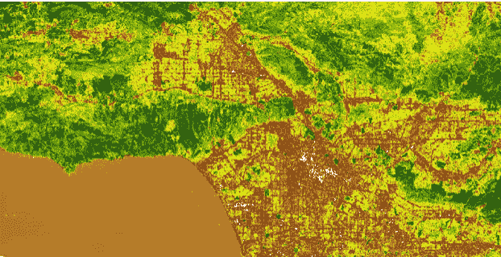

# 第六章. ArcGIS Python API

由 Esri 开发的客户端软件和 GIS 组成的套件被称为 ArcGIS。它不仅是一个 API，还是一个 Python 包，允许用户查询存储在 ArcGIS Online 或 ArcGIS Enterprise 中的信息。它不是开源的，但 Esri 在行业中的领导地位已经产生了大量免费内容和教程，供你访问和探索。我将分享一些学习资源、可访问的工具和信息，你可以通过 ArcGIS Python API 访问它们。你需要使用 Jupyter Notebook 和 ArcGIS Online 来跟进。

# 设置

ArcGIS Pro 是一个桌面应用程序，还有一个基于浏览器的平台叫做 ArcGIS Online；在本章中，你将使用 ArcGIS Online 和 ArcGIS Python API 进行工作。

## ArcGIS Python API 中可用的模块

为了扩展标准 Python 库，ArcGIS Python API 允许通过点符号访问其他模块。你可以在 [文档](https://oreil.ly/FaGv3) 中探索它们，随着我们在编码中使用它们，我会提供更多信息。

`Arcgis.gis`

将你连接到 ArcGIS Online

`Arcgis.features`

提供用于处理地理元素组的功能

`Arcgis.geometry`

允许输入和输出不同的几何体（例如点或多边形）

`Arcgis.geocoding`

为地图可视化分配位置坐标

`Arcgis.geoenrichment`

为区域添加属性

在教授地理空间技能时，我使用开源或低成本选项，以便让尽可能多的人获得这些知识。由于大多数 Esri 用户都是专业或企业订阅者，很少有人了解个人使用的成本负担。无论你选择什么，请在使用之前仔细阅读文档，以避免不必要的费用。

ArcGIS API 是作为 arcgis 包分发的。在下面的示例中，你将通过 Conda 安装它，这是建议的协议，就像你在本书的几个章节中已经做过的那样。

## 安装 ArcGIS Pro

虽然 ArcGIS Pro 只适用于 Windows，但 API 允许非 Windows 用户访问 ArcGIS 功能，而无需打开 Windows 环境。我假设如果你已经有完整的 ArcGIS Pro 许可证，你可以按照文档安装 [Python Package Manager or Python Command Prompt](https://oreil.ly/sXsRt)。要在桌面环境中使用 Pro 许可证并与 API 一起工作，你需要在运行命令的同一台计算机上安装 ArcGIS。

###### 提示

如果你和我一样拥有 ArcGIS Pro 账户，但更喜欢在 MacOS 上工作，你可以离线使用 ArcGIS Pro。为此，请登录你的 ArcGIS Pro 账户，在“设置 >> 许可证”下，选中允许你离线工作的复选框。

即使没有许可证，也有访问公开资源的选项，因此让我们探索一下。

## 设置你的环境

接下来，打开您的终端。我建议为下载 ArcGIS 创建一个环境。（您可能记得，环境允许您安装兼容版本的软件包。）在这里，我称我的环境为 `esriENV`。

###### 提示

虽然可以在环境中更新单个软件包，但如果在环境中工作时生成持久错误，我会将整个环境删除并从头开始创建。这是一个新的 Python 地理空间软件包，其中包含您可能希望考虑添加到任何创建的空间中的常用软件包：

```py
mamba install -c conda-forge geospatial
```

您可能对这里列出的 Mamba 安装感兴趣。自本书编写以来，[mambaforge](https://oreil.ly/1zzLj) 已成为 Conda-forge 社区项目。在操作上，Mamba 承诺速度和与 Conda 软件包的兼容性。在您的实验中，您将找到自己喜欢的工作流程。我已将 Mamba 安装到我的基础环境中，并在自己的项目中使用它，但本文是在长期可靠性的基础上编写的 Conda 环境。

让我们回顾一下如何创建您的环境并安装本笔记本所需的软件包。在终端中输入以下代码，但是在 `*myenv*` 的地方插入 *您* 的环境名称：

```py
conda create --name myenv
```

要创建一个环境并包含一个特定版本的 Python 来解决软件包依赖关系，请输入以下代码：

```py
#conda create --name myenv python=x.x
conda create --name esriENV python=3.9
```

现在，您必须激活您的新环境。目前我们只有一个频道或地方可以托管安装的软件包，即 conda-forge，因此我们希望所有需要安装软件包的依赖都来自 conda-forge 频道，除非它们只存在于默认频道上。

或者，您可能希望在列表中的任何频道上拥有最新版本的软件包。如果是这种情况，请使用`conda config --set channel_priority strict`：

```py
conda activate esriENV
#conda config --set channel_priority strict
```

## 安装软件包

您已准备好安装您的软件包：

```py
conda install -c esri arcgis
```

接下来，您将需要安装 Jupyter Notebook；IPython 内核，以在 Conda 环境中执行 Jupyter 的 Python 后端；以及 Jupyter Notebook 扩展，以简化工具（如自动完成）的编码任务：

```py
conda install -c conda-forge notebook
conda install -c conda-forge nb_conda_kernels
conda install -c conda-forge jupyter_contrib_nbextensions
 conda install -c conda-forge bokeh
```

在您的终端中，使用您给它起的名称激活 ArcGIS 环境：

```py
Conda activate esriENV
```

下载完成后，您可以再次从终端打开 Jupyter Notebook，以便逐步记录您的工作并评估输出结果：

```py
jupyter notebook
```

笔记本将与 API 一起安装，并在新窗口中打开。

# 连接到 ArcGIS Python API

安装完成后，现在是时候登录了。首先，我将向您展示如何匿名登录；随后的部分将解释如何使用开发者或个人账户登录。

## 作为匿名用户连接到 ArcGIS Online

有许多方法可以免费或几乎不收费地访问 ArcGIS 的部分内容；即使没有 ArcGIS 账户，您也可以使用资源、创建地图并共享它们，但功能有限。您可以通过运行代码或查阅[文档](https://oreil.ly/kqmmF)在 Jupyter Notebook 中探索这些选项。公共账户的另一个好处是它允许匿名访问。

您将首先在您的 Jupyter Notebook 中导入 Python API。在这个示例中，您将使用一个公共账户，因此只显示免费资源。没问题——这里有很多东西可以让您探索。要从`gis`模块导入 GIS，运行：

```py
from arcgis.gis import GIS

gis = GIS()
```

## 使用凭据连接到 ArcGIS 用户账户

如果您有用户账户，可以通过两种方式之一登录：使用内置登录或使用 API 密钥。登录的优势在于您可以将创建的任何地图保存到您的账户中。

无论哪种方式，您首先需要使用终端导入 GIS：

```py
from arcgis.gis import GIS
```

要使用内置登录，运行：

```py
   gis = GIS(username="someuser", password="secret1234")
```

要使用 API 密钥登录，请使用以下代码（我已经缩短了令牌）：

```py
gis = GIS(api_key="Request YOUR KEY AND INSERT IT HERE",
              referer="https")
```

当您连接凭据并运行单元格时，输出将是您组织的 ArcGIS Online 用户名。我的账户用户名是“datalchemy”；如果您创建一个账户，您需要用您自己的账户凭据替换这些内容：

```py
gis = GIS(username="datalchemy", password="xxx")
gis
```

如果您拥有账户和登录 URL（列在您组织的设置中），可以通过密码保护方式登录，再次用您自己的凭据替换：

```py
import arcgis
import getpass
username = input ("Username:")
password = getpass.getpass ("Password:")

gis = arcgis.gis.GIS("https://datalchemy.maps.arcgis.com", username, password)
```

运行单元格后，将弹出一个框，提示您输入用户名和密码。

现在，您可以开始探索一些图像层次。

# 探索图像层：城市热岛地图

在我们开始之前，先说一下命名约定。图 6-1 是一幅芝加哥地图，我称之为*map1*。

这个指定是任意的：您可以根据自己的喜好为地图命名，但重要的是在涉及多个地图的代码编写时避免混淆。通常会指定一个带有整数后缀的地图变量，或者简单地使用`m`。选择一种方法并保持一致。它应与`map()`函数有所区别。您可以通过在 Jupyter Notebook 中运行以下代码生成*map1*：

```py
map1 =gis.map("Chicago,Illinois")
map1
```

这将使您的地图居中显示在伊利诺伊州的芝加哥。您可以通过缩放到特定位置或绘制多边形来设置地图覆盖的区域，称为其*范围*。


###### 图 6-1\. 芝加哥地图

###### 注意

要访问 ArcGIS Online 的帮助功能，请输入：

```py
gis?
```

如果您键入一个点并按 Tab 键，将显示一个下拉菜单，其中包含您可以点击以获取更多信息的附加属性：

```py
gis = GIS.
```

现在您可以尝试将一些属性层叠到您的地图上。*图像层*显示来自图像服务的数据。这些资源允许您应用规则来显示图像。您可以通过将项目类型标识为`Imagery Layer`来搜索它们。

您可以使用`gis.content.search()`中的搜索词来描述您想在地图中包含的要素。创建一个分配给`gis.content.search()`的变量可以帮助您查找可用的要素图层或其他`item_type`数据。使用以下代码片段，您可以探索可用的 Landsat 9 卫星视图，以用作影像层。不同的影像层具有不同的属性。在这里，我已将搜索限制为图 6-2 中显示的两个选项，这些选项是带有指定术语的公开可用要素图层：

```py
from IPython.display import display

items = gis.content.search("Landsat 9 Views", item_type="Imagery Layer", 
max_items=2)
for item in items:
    display(item)
```


###### 图 6-2\. 使用`gis.content.search()`搜索 Landsat 9 视图

代码块中的`item_type`包括 Web 场景、要素图层、地理空间数据、底图和具有地形的交互式 3D 环境。您可以在[文档](https://oreil.ly/MRi96)中了解更多关于项目和项目类型的信息。

*Web 场景*允许您可视化和分析包含所有配置设置的地理空间内容，例如底图、样式和范围。要探索这些内容，您可以用`web scene`替换`item_type`。

我们将使用 Web 场景来探索芝加哥的热岛。根据[美国环保局](https://oreil.ly/3RWFQ)（EPA），*热岛*是：

> 城市化区域的温度比外围区域高。建筑物、道路和其他基础设施等结构比森林和水体等自然景观更多地吸收并重新发射太阳的热量。在这些结构高度集中且绿化有限的城市区域中，相对于外围区域，成为更高温度的“岛屿”。

城市热岛严重性测量城市基础设施如何吸收并重新发射这些热量。

要定位图像服务器的 URL 并开始在地图上探索热岛，请单击搜索结果中的标题（“城市热岛”），或通过在下一个单元格中调用`img_svc_url`来列出：

```py
img_svc_url = 'https://server6.tplgis.org/arcgis6/rest/services/
heat_severity_2019/ImageServer'
```

这输出：

```py
[<Item title:"Urban Heat Island Severity for U.S. cities - 2019" type:
Imagery Layer owner:TPL_GIS_Support>,
 <Item title:"Multispectral Landsat" type:Imagery Layer owner:esri>]
```

您也可以使用此代码尝试栅格函数。更多关于这些内容的信息在下一节中，但现在，请尝试这个：

```py
from arcgis.raster import ImageryLayer
landsat_urbanheat = ImageryLayer(img_svc_url)
landsat_urbanheat.properties.name
```

这输出：

```py
‘Heat_severity_2019’
```

您已经访问了城市热岛严重性影像层。现在将其添加到您的芝加哥地图中：

```py
map = gis.map('Chicago', zoomlevel=13)
map

map.add_layer(landsat_urbanheat)
```

`landsat_urbanheat`图层现在已添加到您的地图中，这应与图 6-3 类似。


###### 图 6-3\. 添加到地图范围的地图图层

现在，您将从多光谱 Landsat 图层的 URL 中添加影像层，并将其分配给变量`landsat_ms`：

```py
img_svc_url ='*https://landsat2.arcgis.com/arcgis/rest/services/Landsat/MS/
	ImageServe*'
from arcgis.raster import ImageryLayer
landsat_ms = ImageryLayer(img_svc_url)
landsat_ms.properties.name
```

最后一行代码仅确认了图层的名称。

这将生成以下输出：

```py
'Landsat/MS'
```

图像层的描述也可通过一行代码获取：

```py
landsat_ms.properties['description']
```

输出是详细的：

```py
Multispectral Landsat image service covering the landmass of the World. This 
service includes scenes from Landsat 8 and Global Land Survey (GLS) data from 
epochs 1990, 2000, 2005 and 2010 at 30 meter resolution as well as GLS 1975 
at 60 meter resolution. GLS datasets are created by the United States 
Geological Survey (USGS) and the National Aeronautics and Space Administration 
(NASA) using Landsat images. This service can be used for mapping and change 
detection of urban growth, change of natural resources and comparing Landsat 
8 imagery with GLS data.  Using on-the-fly processing, the raw DN values are 
transformed to scaled (0 - 10000) apparent reflectance values and then 
different service based renderings for band combinations and indices are applied. 
The band names are in line with Landsat 8 bands; GLS data band names are mapped 
along the same lines.
```

要探索更多的栅格函数对象，请访问[常见数据类型文档](https://oreil.ly/MMRDP)。在学习栅格函数和图像图层的过程中，我还建议您随时查阅[ArcGIS Python API 参考指南](https://oreil.ly/DDDfa)。

# 栅格函数

栅格函数处理来自图像的像素以进行一项或多项光栅处理，无需下载或创建中间文件进行分析。访问栅格函数受到限制，需要额外的凭据，但您仍然有机会探索 Landsat 多光谱图像。

这次，我们将探索洛杉矶地图，逐一了解其中的一些亮点：

```py
from arcgis.gis import GIS
from arcgis.geocoding import geocode
from arcgis.raster.functions import *
from arcgis import geometry
import ipywidgets as widgets

import pandas as pd
```

您将在 `gis.content.search()` 中再次运行搜索。这次，您要查找组织外的图像（如果您已创建组织），并设置 `outside_org=True`。这是在访问公开可用数据集时的设置：

```py
landsat_item = gis.content.search("Landsat Multispectral tags:'Landsat on AWS',
'landsat 9', 'Multispectral', 'Multitemporal', 'imagery', 'temporal', 'MS'", 
'Imagery Layer', outside_org=**True**)[0]
landsat = landsat_item.layers[0]
df = **None**
```

您的搜索结果应包括多光谱 Landsat，如图 6-4 所示。要查看 `landsat_item`，请在单元格中调用它：

```py
landsat_item
```


###### 图 6-4\. 显示 Esri 的多光谱 Landsat 成像图层的搜索结果

欲了解更多信息，请单击链接或运行以下代码：

```py
from IPython.display import HTML
HTML(landsat_item.description)
```

本图展示了*多光谱光带*，这些光带由比人眼更敏感的仪器检测到。正如您在第一章 中学到的，多光谱光带通过电磁波谱中特定波长范围内的图像数据来突出显示不同的地表覆盖特征。您可以检查每个波段的名称、最小和最大波长以及其他属性：

```py
pd.DataFrame(landsat.key_properties()['BandProperties'])
```

这些波段指示了与陆地覆盖、植被及其他类型地表有关的详细信息。表 6-1 是输出的摘录，以表格形式呈现以便阅读。

表 6-1\. 多光谱和热红外传感器波段

| 波段 | 波长（微米） | 分辨率（米） |
| --- | --- | --- |
| 第一波段—近岸气溶胶 | 0.43–0.45 | 30 |
| 第二波段—蓝色 | 0.45–0.51 | 30 |
| 第三波段—绿色 | 0.53–0.59 | 30 |
| 第四波段—红色 | 0.64–0.67 | 30 |
| 第五波段—近红外（NIR） | 0.85–0.88 | 30 |
| 第六波段—短波红外（SWIR）1 | 1.57–1.65 | 30 |
| 第七波段—短波红外（SWIR）2 | 2.11–2.29 | 30 |
| 第八波段—全色 | 0.50–0.68 | 15 |
| 第九波段—卷云 | 1.36–1.38 | 30 |
| 第十波段—热红外（TIRS）1 | 10.6–11.19 | 100 |
| 第十一波段—热红外（TIRS）2 | 11.50–12.51 | 100 |

使用您的 Jupyter Notebook 创建地图：

```py
landsat = landsat_item.layers[0]
landsat

m = gis.map('los angeles')
m
```

现在添加要素图层：

```py
m.add_layer(landsat)
```

您现在可以查看您的地图（图 6-5）。您还可以开始使用栅格函数。


###### 图 6-5\. 使用多光谱 Landsat 数据创建的洛杉矶地图

在这里，您将使用一个栅格函数来突出显示地图中的彩色可视化效果。例如，`color infrared`显示鲜艳的红色条带来指示健康的植被，而`natural color`显示我们通常看到的地形：绿色的植被，蓝色的水域，棕色的土壤。

许多选项可通过*动态范围调整（DRA）*来进行调整，以增强细节并在匹配您的计算机或其他设备的范围时提高可见性。您可以使用以下代码生成可用栅格函数的列表，如随后显示的输出所示：

```py
for rasterfunc in landsat.properties.rasterFunctionInfos:
    print(rasterfunc.name)
```

这将输出一个列表：

```py
Agriculture with DRA
Bathymetric with DRA
Color Infrared with DRA
Geology with DRA
Natural Color with DRA
Short-wave Infrared with DRA
Agriculture
Bathymetric
Color Infrared
Geology
Natural Color
Short-wave Infrared
NDVI Colorized
Normalized Difference Moisture Index Colorized
NDVI Raw
NBR Raw
None
```

熟悉其中几个函数应该为您在独立探索中深入了解其他选项铺平了道路。

让我们尝试查看`color_infrared`。您将使用`apply`函数：

```py
From arcgis.raster.functions import apply
Color_infrared = apply (landsat, 'Color Infrared with DRA')
```

要可视化地图，请调用`map`函数：

```py
m = gis.map('los angeles')
m.add_layer(color_infrared)
m
```

健康的植被现在以鲜艳的红色显示（图 6-6）。


###### 图 6-6\. 用`color_infrared`查看的洛杉矶

用于查看植被的最佳栅格函数通常是归一化差异植被指数（NDVI）。图 6-7 展示了`NDVI_colorized`函数，显示绿色的植被：

```py
ndvi_colorized = apply(landsat, 'NDVI Colorized')
ndvi_colorized
```



###### 图 6-7\. 用于 NDVI 的洛杉矶

您已经学会了如何搜索图像和要素图层，以及如何对特定位置应用栅格函数来突出显示特定功能。接下来，我们将探讨属性，并查看`arcgis.geometry`模块。

# 探索图像属性

在这一部分中，您将使用 ArcGIS 栅格模块[`get_samples`](https://oreil.ly/ffCTy)来探索您的洛杉矶地图的几何形状。该模块允许您查看所选几何形状的样本点位置、空间分辨率和像素值。它是[ArcGIS REST API](https://oreil.ly/SWZTB)的一个示例，该 API 提供有关 Web 应用程序架构的信息。与主要关注访问点的一般 ArcGIS API 文档不同，[ArcGIS REST API 文档](https://oreil.ly/QdcRC)提供了地理空间功能的全部范围。它还描述了`get_samples`操作可以调用的参数：

```py
get_samples(geometry, geometry_type=None, sample_distance=None, sample_count=None, 
mosaic_rule=None, pixel_size=None, return_first_value_only=None, 
interpolation=None, out_fields=None, slice_id=None)
```

在这里，您指定地图的几何形状和样本计数，并根据您定义的范围返回有关其图像属性的信息―在本例中是洛杉矶的范围：

```py
import arcgis
g = arcgis.geometry.Geometry(area['extent'])
```

为什么要使用几何形状？当您创建 3D 模型时，像高度和太阳方位角这样的数据点对于计算阴影坡度非常有用。在使用`hillshade`函数时，基本上是将 2D 表面渲染为逼真的 3D 地形。

接下来，指定几何形状和样本计数：

```py
samples = landsat.get_samples(g, sample_count=50,
                                 out_fields='AcquisitionDate,OBJECTID,GroupName,
                                 Category,SunAzimuth,SunElevation,CloudCover')
```

您可以指定要查看的样本列表中的项目，或查看所有项目：

```py
samples[10]
```

输出包括位置、对象 ID、云层覆盖计算和像素值等信息：

```py
{'location': {'x': -13150297.20625444,
  'y': 4059732.8562727477,
  'spatialReference': {'wkid': 102100, 'latestWkid': 3857}},
 'locationId': 10,
 'value': '1158 991 843 769 2850 1675 1030 44 21824 22410 22691',
 'rasterId': 3508198,
 'resolution': 30,
 'attributes': {'AcquisitionDate': 1647023302000,
  'OBJECTID': 3508198,
  'GroupName': 'LC09_L1TP_041036_20220311_20220311_02_T1_MTL',
  'Category': 1,
  'SunAzimuth': 144.81874084,
  'SunElevation': 45.83943939,
  'CloudCover': 0.0024},
 'values': [1158.0,
  991.0,
  843.0,
  769.0,
  2850.0,
  1675.0,
  1030.0,
  44.0,
  21824.0,
  22410.0,
  22691.0]}
```

在 Python 中，我们使用`datetime`对象进行*时间序列数据*或在不同时间点收集的数据。再次，在 Python 中，您正在对`datetime`类进行采样，并可以通过运行以下代码渲染获取日期。（我将在本章后面提供更多详细信息，但这是我们在示例数据上使用该功能的方式。）

由于 Python 基于零索引访问数据，使用`[0]`请求列表中的第一个索引或示例中的第一个值：

```py
import datetime
value = samples[0]['attributes']['AcquisitionDate']
datetime.datetime.fromtimestamp(value /1000).strftime("Acquisition Date: %d %b, 
	%Y")
```

这将输出：

```py
'Acquisition Date: 11 Mar, 2022'
```

通过在 Los Angeles 的特定位置采样值，您可以估算地图上特定点的光谱配置。

```py
m = gis.map('los angeles')
m

m.add_layer(landsat)
```

如果选择特定像素，光谱配置将绘制在该位置反射的所有波段，如图 6-8 所示。

下一个代码允许您在 Jupyter Notebook 中的画布上选择一个点以识别光谱配置。请注意，如果您从 ArcGIS Python API 指南运行此示例并请求 Landsat 9，则会生成错误，因为添加了额外的波段。


###### 图 6-8\. 点击生成光谱配置在图 6-9

`get_samples()`方法将收集样本数据中包含的像素值。像素值是*数字。*为了正确计算它们，您需要先将其转换为浮点数，然后转换为整数。数字记录像素的电磁强度。

您已将[Bokeh 包](https://oreil.ly/QLQGJ)安装到 Conda 环境中以允许交互式绘图和制图。Landset 规格基于 Landsat 8 数据，并仅包括了八个波段。这导致了 Bokeh 的错误。为解决此问题，请使用包含新波段的运行：

```py
from bokeh.models import Range1d
from bokeh.plotting import figure, show, output_notebook
from IPython.display import clear_output
output_notebook()

def get_samples(mw, g):
    clear_output()
    m.draw(g)
    samples = landsat.get_samples(g, pixel_size=30)
    values = samples[0]['value']
    vals = [float(int(s)/100000) for s in values.split(' ')]

    x = ['1','2', '3', '4', '5', '6', '7', '8','9','10','11']
    y = vals
    p = figure(title="Spectral Profile", x_axis_label='Spectral Bands', 
	y_axis_label='Data Values', width=600, height=300)
    p.line(x, y, legend_label="Selected Point", line_color="red", line_width=2)
    p.circle(x, y, line_color="red", fill_color="white", size=8)
    p.y_range=Range1d(0, 1.0)

    show(p)

print('Click anywhere on the map to plot the spectral profile for that location.')
m.on_click(get_samples)
```

您应该收到 Bokeh 2.4.2（或您的版本号）已成功加载的消息。现在返回地图并选择您的点。点击生成图 6-8 中显示的地图（您的地图将根据您选择的点有不同的值）。

您生成的地图（图 6-8）现在是交互式的。在新地图上任意点击以绘制该位置的光谱配置。现在您可以选择不同的点并查看生成的值。图 6-9 展示了在我选择的位置上用于探测卷云的第 9 波段的光谱配置。


###### 图 6-9\. 使用 Bokeh 可视化的光谱配置

根据点击 Landsat 9 图像图层时选择的独特位置，您的光谱配置文件将不同。请参阅表 6-1 以识别包含的波段。这些代表了 ArcGIS Python API 中`get_samples`方法的几个应用。

## 改进图像

光栅函数允许您执行诸如提取特定波段以检查土地利用、植被或火灾；连续数据（如温度）；扫描图像；以及卫星图像等操作。*拉伸函数*允许您调整地图上的亮度和对比度。以下代码从可见光谱中选择 3、2 和 1 波段（红、绿和蓝），并导入`stretch` `raster.function`：

```py
from arcgis.raster.functions import stretch, extract_band
naturalcolor = stretch(extract_band(landsat, [3,2,1]), 
                    stretch_type='percentclip', min_percent=0.1, max_percent=0.1, 
					gamma=[1, 1, 1], dra=True)

naturalcolor
```

此代码设置的百分比剪切最小值(`percentclip`)将排除拉伸应用于栅格的最低 10%值。如果大多数像素在特定范围内，这是非常有用的。设置`stretch_type`会修剪掉异常值，重新分布值的直方图，从而生成图 6-10 中的图像。 


###### 图 6-10\. 自然色波段展示了肉眼在没有增强的情况下所看到的图像

图 6-10 中的图像是肉眼在没有任何增强的情况下所看到的。根据您要查找的特征，可能有其他波段可以探索。我们将在接下来的部分查看其他波段。

## 比较同一位置的多个时间点

ArcGIS API 允许您使用称为*时间滑块*的地图小部件比较同一位置在不同时间点的图像，该小部件使您可以使用可配置的属性（如开始和结束时间及其间隔）对地图进行动画化。对于此示例，我选择了一个城市和一个卫星底图。

地图缩放小部件接受 0 到 23 之间的值。级别 9 提供了全球概览；级别 10 介于大型都市区域和城市之间；级别 20 是个体建筑物的级别。我从未缩放到 23，但这样做会呈现出最详细的视图。然而，根据可视化参数的规模，缩放的限制程度有所不同（转换率可在[文档](https://oreil.ly/mbtnA)中查看）。您可以更改缩放级别并处理数据，但分辨率将保持不变。例如，所有 Landsat 图像的分辨率为 15 米。这意味着卫星图像捕捉到的地面细节为 15 米或更大。（作为比较，洛杉矶的好莱坞标志和标准半挂拖车均长约 15 米。）

尝试将缩放级别调整到 10：

```py
map = gis.map("los angeles")
map.basemap = "satellite"
map.zoom = 10
map
```

`item title`的名称将作为输出打印以供参考：

```py
landsat_item = gis.content.search("Landsat Multispectral tags:'Landsat on AWS',
'landsat 9', 'Multispectral', 'Multitemporal', 'imagery', 'temporal', 'MS'", 
'Imagery Layer', outside_org=**True**)[0]
print(landsat_item)
<Item title:"Multispectral Landsat" type:Imagery Layer owner:esri>
```

您已搜索到一个 Landsat 项，并且通过其标题在输出中确认了该项。不同的子层将提供不同的详细信息。

将图层添加到地图中：

```py
map.add_layer(landsat_item)
```

请求确认`map.time_slider`是否可用：

```py
map.time_slider
```

它应该返回输出`True`。

您可以将日期调整为特定间隔。以下代码测量所选开始和结束时间之间的 10 天间隔：

```py
from datetime import datetime
map.time_slider = True
map.set_time_extent(start_time=datetime(2021, 12, 12), end_time=datetime(2022, 4, 
12), interval=10, unit='days')
```

此代码将在 Figure 6-11 中输出地图，其中包括时间滑块小部件。


###### 图 6-11\. 时间滑块小部件

在代码单元中选择`map.draw(polygon)`选项，然后使用鼠标绘制一个多边形。如果您有感兴趣的特定位置，请输入其坐标：

```py
from arcgis.geometry import Point

pt = Point({"x" : 34.092809, "y" : -118.328661, 
            "spatialReference" : {"wkid" : 3309}})
```

*空间参考*或*WKID（Well-Known ID）*定义了您选择的位置的公差和分辨率（参见[空间参考列表](https://oreil.ly/AecRp)）。

`map.draw`选项包括选择点（`pt`）、`polyline`或`polygon`：

```py
map.draw(pt)
map.draw('polyline')
map.draw('polygon')
```

当您选择多边形并运行代码单元时，只需返回到地图，您就可以跟踪一个多边形。时间滑块小部件允许在感兴趣的区域跨时间序列进行比较。在处理图层时，通常需要筛选出出现在画布上的内容。

## 过滤图层

您可能希望过滤您的图层：例如，也许您只想看到具有少于 10%云覆盖率的[特定集合](https://oreil.ly/iMcfn)中的 Landsat 图层。为此，熟悉 Landsat 的[数据字典](https://oreil.ly/9fR5U)有助于获取关于数据库或系统中数据元素、属性和名称的完整信息。

在以下代码片段中，`WRS_Row`提供了有关拍摄图像的卫星轨道路径的信息：

```py
selected = landsat.filter_by(where="(Category = 1) AND (CloudCover <=0.10) AND 
	(WRS_Row = 36)", 
                   geometry=arcgis.geometry.filters.intersects(area['extent']))
```

值`36`表示北半球。（您可以在 Landsat 数据字典、集合背景或其他 Landsat 信息中找到这些详细信息。）

您可以访问的信息显示在您之前生成的 HTML 项目描述中。现在您可以在数据帧（`df`）中查看刚刚创建的表格：

```py
fs = selected.query(out_fields="AcquisitionDate, GroupName, Best, CloudCover, 
	WRS_Row, Month, Name", 
              return_geometry=True,
              return_distinct_values=False,
              order_by_fields="AcquisitionDate")
```

因为您正在比较日期，您将希望看到最旧的获取日期以及最近的获取日期。要清楚地查看输出，请在代码单元中运行它。重要的是看列标题以及在哪里找到标识信息（见 Figure 6-12）。您可以通过调用`df.head()`来查看前五行：

```py
df = fs.sdf
df.head()
```


###### 图 6-12\. 采集日期输出

现在运行`df.tail()`并选择最近的获取日期。您可以在 Jupyter Notebook 中运行代码：

```py
df = fs.sdf
df.tail()
```

以下命令给出了数据的形状：

```py
df.shape
```

输出告诉我们，数据有 9 列和 193 行：`(193,9)`。

如果您只想要获取日期，可以运行此数据，或从数据帧中的任何其他列中获取：

```py
df['Time'] = pd.to_datetime(df['AcquisitionDate'], unit='ms')
df['Time'].head(10)
```

这个输出：

```py
0   1977-05-30
1   1979-06-08
2   1989-06-28
3   1990-05-07
4   2000-04-24
5   2000-05-01
6   2005-05-15
7   2005-05-24
8   2009-04-16
9   2009-05-11
Name: Time, dtype: datetime64[ns]
```

波段具有特定波长，用于统计计算。在图像图层中要避免像素重叠，因为这可能会扭曲计算结果。您可以使用默认方法，其中像素值是从最后一个数据集计算的（见 图 6-13）：

```py
m3 = gis.map('los angeles', 7)
display(m3)
m3.add_layer(selected.last())
```


###### 图 6-13\. 使用 `last()` 方法重叠像素

或者，您可以请求 `first()` 方法，并从第一个光栅数据集计算像素值（输出显示在 图 6-14 中）：

```py
m3 = gis.map('los angeles', 7)
display(m3)
m3.add_layer(selected.first())
```


###### 图 6-14\. 使用 `first()` 方法重叠像素

通过 `OBJECTID` 查询数据，辅以 `df(head)` 和 `df(tail)` 数据，您可以比较不同时期捕获的图像：

```py
old = landsat.filter_by('OBJECTID=3106827')

new = landsat.filter_by('OBJECTID=3558253')

from arcgis.raster.functions import *
```

[`stretch` 函数](https://oreil.ly/AsmeR) 通过扩展像素值来提高可见性。有不同类型的拉伸，但在这里，您只需通过计算标准偏差 (`stddev`) 删除任何极端值： 

```py
diff = stretch(composite_band([ndvi(old, '5 4'),
                               ndvi(new, '5 4'),
                               ndvi(old, '5 4')]), 
                               stretch_type='stddev',  num_stddev=2.5, min=0, 
                               max=255, dra=True, astype='u8')
diff
```

这将输出 图 6-15。绿色条带表示植被密度增加，洋红色显示所选 `OBJECTID` 时间范围内的减少。


###### 图 6-15\. ArcGIS 函数显示随时间图像差异

或许有您想要捕获的特定阈值。尝试仅测量阈值变化高于 10%的区域。使用以下代码：

```py
threshold_val = 0.1
masked = colormap(remap(ndvi_diff, 
                        input_ranges=[threshold_val, 1], 
                        output_values=[1], 
                        no_data_ranges=[-1, threshold_val], astype='u8'), 
                  colormap=[[1, 124, 252, 0]], astype='u8')

Image(masked.export_image(bbox=area['extent'], size=[1200,450], f='image'))
```

输出（图 6-16）将这些区域呈现为绿色。


###### 图 6-16\. 植被指数（NDVI）变化的掩码阈值

让我们再次渲染地图：

```py
m = gis.map('los angeles')
m
```

最终图像显示在 图 6-17 中。您现在可以通过向地图添加图层来查看掩码阈值：

```py
m.add_layer(diff)
m.add_layer(masked)
```


###### 图 6-17\. 在请求的阈值处显示的组合图像，展示了掩码阈值

# 摘要

现在，您已经根据 ArcGIS API for Python 定制并探索了一些公开可用资源，应该对栅格函数和图像图层有所了解。继续学习时，请尝试独立使用这些函数和图层，看看您可以访问哪些其他查询。
