# 第七章. GeoPandas 和空间统计

地图很美丽。它们讲述的故事可能如此迷人，以至于很容易无意中忽略其中的地理空间统计数据。但地理空间地图不仅仅是静态图像。其中嵌入了信息，例如与 GIS 图层中特定要素相关联的属性或在光栅图像中观察到的像素密度。

Python 有多种用于处理地理空间数据的包。如果您熟悉 Python，您可能已经了解 [pandas](https://oreil.ly/j6YBd)，这是一个专为 Python 构建的数据分析工具。Pandas 允许我们将各种数据类型读入数据框中：一组包含行（表示记录）和列（表示属性）的表格。[GeoPandas](https://oreil.ly/pb8lC) 是 pandas 的扩展，允许您使用其称为 *GeoDataFrame* 的方式操作几何和地理空间数据框架：每行是空间要素，如点、线或多边形。

本章将向您展示如何使用 GeoPandas 和 GeoDataFrame 分析数据并创建地图，以及一些其他重要的包，如 [matplotlib](https://matplotlib.org) 用于可视化数据和人口普查数据 API。您还将学习如何访问地理空间文件，并通过创建和比较人口地图深入了解人口统计数据。

# 安装 GeoPandas

要安装 GeoPandas，您将在终端中使用 `conda` 和 `conda-forge`。与前几章一样，我还将向您展示如何为本章中所有需要处理的数据创建环境。

安装 GeoPandas 可能有点棘手。可以把它想象成一个情绪化的青少年。它通常想要先行（导入）并喜欢最新的趋势（注意依赖项的版本）。它还喜欢一个响亮的昵称：通常情况下，GeoPandas 被称为 `gpd`，但有时代码会写出 `geopandas`。请注意并调整您的变量。

要设置您的环境，请从这里开始：

```py
conda create --name geop_env python = 3.X 
```

您可以在此处添加您的 Python 版本。

```py
MacBook-Pro-8:~ USERNAME$ conda activate geop_env
```

现在您可以开始将文件安装到 `geop_env` 中：

```py
conda install -c conda-forge geopandas
```

现在您可以将任何想要访问的包添加到 `geop_env` 中。如果您希望获取一组用于地理空间分析的包，我建议下载地理空间包，但现在如果您愿意，也可以逐个添加包：

```py
conda install -c conda-forge geospatial
```

GeoPandas 简化了在 Python 中处理地理空间数据的工作。让我们探索扩展操作，使您能够在几何数据上执行空间操作。

# 处理 GeoJSON 文件

GeoPandas 让您能够处理 GeoJSON 文件。您可能已经听说过 JSON，这是一种常见的数据交换格式。GeoJSON 是一种基于 JSON 的数据交换格式，专门设计用于表示地理数据结构及其非空间属性。使用 GeoJSON 文件工作使得识别地图中的坐标和位置变得相当简单。

图 7-1 显示了来自[*geojson.io*](https://oreil.ly/JmXP4)的地图。Geojson.io 是一个开源工具，简化了创建、查看和分享地图。你可以在互联网上执行各种功能，而无需将任何数据下载到你的计算机。

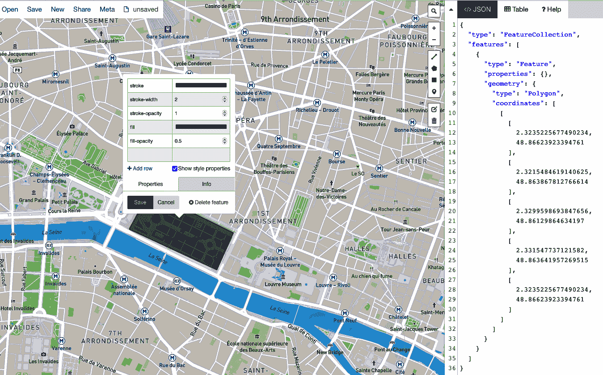

###### 图 7-1\. 缩放到巴黎第一区并选择边界以创建 GeoJSON 文件

点击[*geojson.io*](https://geojson.io)链接并放大到一个国家。我选择了法国，因为，嗯，它是法国。查找特定位置的坐标的简单方法是选择你感兴趣的区域并拖动多边形周围的区域。选择多边形的工具可见于地图仪表板的右边缘。尝试在地图上找到法国巴黎。找到杜乐丽花园并在其周围绘制一个多边形。保存多边形后，你可以通过点击边界查看格式化选项和样式属性。

顶部菜单中的 Meta 标签（显示在图 7-1 中）允许你生成一个*边界框（bbox）*，其中包含你想要映射的坐标和点集。它定义了感兴趣对象的空间位置和其坐标。你还可以加载以 well-known text（WKT）标记语言表示的字符串，用于矢量几何对象。

左下角的按钮，在图 7-2 中可见，允许你在 Mapbox（矢量瓦片）、卫星（光栅数据）和 OSM（OpenStreetMap，在第五章中介绍过）之间切换。

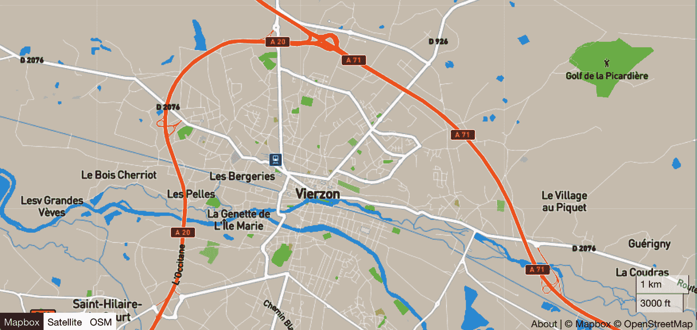

###### 图 7-2\. 地图查看器选项

如果你想要保存这个文件，你可以以几种不同的格式保存，包括*.csv*、*.txt*和 shapefile。然后你可以将其导入到 QGIS、ArcGIS 或你选择的平台进行进一步的探索和分析。电子表格数据存储为*.csv*或*.txt*，通常包含位置信息，如经度和纬度的坐标数据、地址或邮政编码。Shapefile 是 Esri 的矢量文件，捕捉位置、形状和有关位置的相关文件。

# 创建一个 GeoDataFrame

GeoDataFrame 类似于带有额外几何数据列的 pandas 数据帧。许多类型的矢量数据描述了具有固定位置的离散数据，而连续数据通常由栅格数据表示（尽管两者都可以是任意类型）。

GeoPandas 提供了一些数据集示例供探索。你将访问缩写为`nybb`的 NYC Boroughs 示例：

```py
geopandas.datasets.available = ['naturalearth_cities', 'naturalearth_lowres',
'nybb']
```

这些文件代表城市的位置、不同国家的轮廓以及纽约市行政区的边界。要访问它们，你需要将数据集名称作为参数包含进去：

```py
geopandas.datasets.get_path("nybb")
```

您可以从终端打开 Jupyter Notebook：

```py
(geop_env) MacBook-Pro-8:~ USERNAME$ jupyter notebook
```

现在，笔记本已打开，您可以创建一个数据帧。首先，将您需要的软件包导入到您的环境中：

```py
%matplotlib inline

import requests
import pandas as pd
import geopandas as gpd

from scipy.spatial.distance import cdist
```

接下来，您需要检索数据集并调用活动几何列（在本例中为“geometry”）来创建一个名为`world.geometry.name`的数据帧。当您调用`head()`时，将返回数据集中的前五行和列：

```py
boros_world = gpd.read_file(gpd.datasets.get_path('nybb'))
print(f"{type(boros_world)}, {boros_world.geometry.name}")
print(boros_world.head())
print(boros_world.geometry.geom_type.value_counts())
```

您应该得到以下输出：

```py
<class 'geopandas.geodataframe.GeoDataFrame'>, geometry
 BoroCode  BoroName  Shape_Leng Shape_Area \
0   5   Staten Island 330470.010332 1.623820e+09 
1   4   Queens 896344.047763 3.045213e+09 
2   3   Brooklyn 741080.523166 1.937479e+09 
3   1   Manhattan 359299.096471 6.364715e+08 
4   2   Bronx 464392.991824 1.186925e+09 

           geometry 
0 MULTIPOLYGON (((970217.022 145643.332, 970227.... 
1 MULTIPOLYGON (((1029606.077 156073.814, 102957... 
2 MULTIPOLYGON (((1021176.479 151374.797, 102100... 
3 MULTIPOLYGON (((981219.056 188655.316, 980940.... 
4 MULTIPOLYGON (((1012821.806 229228.265, 101278... 
MultiPolygon 5
dtype: int64
```

注意第一列中的索引分配。通过引用其索引位置，您将能够隔离单个区域。`BoroCode`和`BoroName`是您可以指定的附加标识符，但是您可能会注意到在随后的代码片段中通过索引调用的简易性。

您现在正在使用一个 GeoDataFrame。您可以在 Jupyter Notebook 中运行以下代码生成图 7-3 的绘图：

```py
boros = gpd.read_file(gpd.datasets.get_path('nybb'))
ax = boros.plot(figsize=(10, 10), alpha=0.5, edgecolor='k')
```

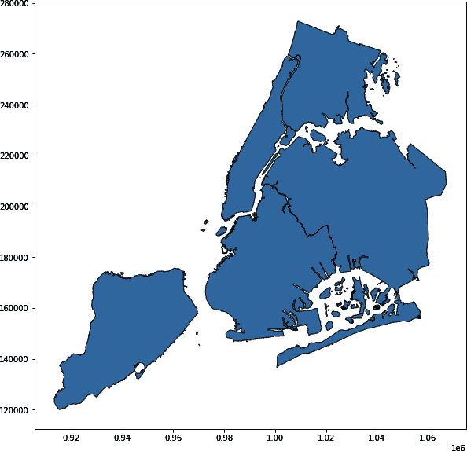

###### 图 7-3。纽约市行政区域的位置

使用`figsize`参数可以更改图像的大小。在示例中，alpha 值小于 1 可调整透明度。边缘颜色也可以自定义。你可以在[matplotlib 文档](https://oreil.ly/jy6fs)中找到详细信息。

在大多数情况下，我更喜欢没有可见轴的地图。要删除框架，只需添加：

```py
ax.set_axis_off()
```

您将通过交互地图进一步探索数据，因此不需要区域坐标。这将生成图 7-4 中的图像。

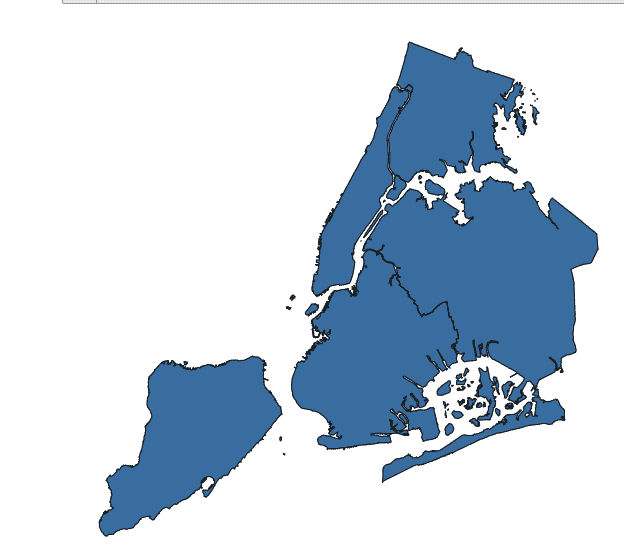

###### 图 7-4。没有轴框架的纽约市行政区域的位置

通过调用行号可以请求单个区域。斯泰顿岛在您几页前生成的 GeoDataFrame 中的第 0 行。您可以使用可调用函数[`DataFrame.loc`](https://oreil.ly/vSEXO)根据其索引号访问位置。我认为`loc`是“列标签”的缩写，因为它需要输入标签，如“索引”或“几何”。缩写`iloc`用于整数位置索引/列的整数。替换您创建的数据帧名称：

```py
boros.loc[0,'geometry']
```

这将输出显示在图 7-5 中的斯泰顿岛的图像。

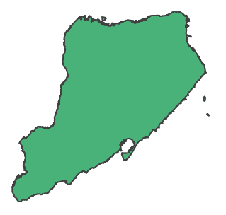

###### 图 7-5。使用`.loc`函数调用单个区域

您可以在图 7-5 中看到斯泰顿岛区域的边界，但是现在您知道如何访问 GeoDataFrame 后，获取更多信息会更有帮助。您还可以找到区域的面积：

```py
gdf = gdf.set_index("BoroName")
gdf["area"] = gdf.area
gdf["area"]
```

这将输出：

```py
BoroName
Staten Island   1.623822e+09
Queens          3.045214e+09
Brooklyn        1.937478e+09
Manhattan       6.364712e+08
Bronx           1.186926e+09
Name: area, dtype: float64
```

要查看一个行政区域的边界，请运行：

```py
gdf['boundary'] = gdf.boundary
gdf['boundary']
```

这将输出：

```py
BoroName
Staten Island   MULTILINESTRING ((970217.022 145643.332, 97022...
Queens          MULTILINESTRING ((1029606.077 156073.814, 1029...
Brooklyn        MULTILINESTRING ((1021176.479 151374.797, 1021...
Manhattan       MULTILINESTRING ((981219.056 188655.316, 98094...
Bronx           MULTILINESTRING ((1012821.806 229228.265, 1012...
Name: boundary, dtype: geometry
```

在交互式地图 (Figure 7-6) 中，您可以通过悬停在市区上来检索信息。参考距离是 0，因为史泰登岛的索引号是 0\. 点击任何其他市区将告诉您与史泰登岛的距离。`gdf.explore` 函数生成一个交互式地图：

```py
gdf.explore("area", legend=True)
```

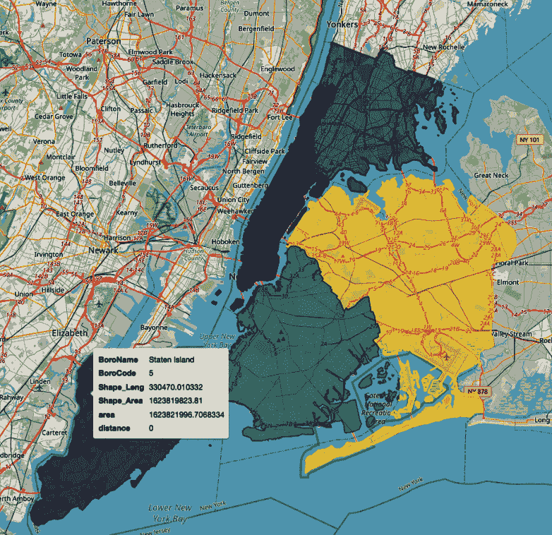

###### 图 7-6\. 纽约市行政区交互地图

将像几何形状这样的地理空间能力添加到 pandas 数据框中仅仅是个开始。人口普查数据是开放数据的宝库，了解如何使用 GeoPandas 将帮助您扩展访问和查询这一重要数据集的能力。让我们再看看更多人口普查数据。

# 使用美国人口普查数据：洛杉矶人口密度地图

在这个练习中，您将计算加利福尼亚州洛杉矶县各个小区的人口密度。

###### 警告

当使用 Python 人口普查包时要小心。如果开发者失去了维护它们的兴趣或者被其他任务压倒，您的地图和图形将不再工作。在写这一章节时，我就是这样学到的。好消息是，它提醒我始终可靠的备用基础知识。

如果您需要一个专业服务或研究的人口普查数据问题的高质量地图，您可以在像 QGIS 这样的开源平台上或使用像 ArcGIS 这样的专有软件构建一个。这个例子将带您了解基础知识。一旦您理解了人口普查 API 的结构并能够在一个不花哨的 Python 包之外编写代码，您就可以轻松访问这个最强大的公开可用数据集之一。

第一步是在 [*census.gov*](https://oreil.ly/k6wuo) 上找到数据。根据您的兴趣领域，2020 年人口普查的数据已经可以用于分析。我依赖于 [Census Reporter](https://oreil.ly/TnwCF) 来识别和下载数据集。大多数仓库都有 ACS 数据（通常称为“长表人口普查”），每年从全国一部分收集，并以年度或五年时段的形式捆绑。API 默认获取最近五年的 ACS 时段。这是一个易于导航的第一站，全面了解捕获数据类型的方法。

Census Reporter 为许多大都市区提供即用的社区数据，这些示例中您将看到这些数据。

###### 小贴士

对于更高级的用户，[IPUMS](https://www.ipums.org)（前身为集成公共使用微数据系列，现以其首字母缩写命名）提供了来自人口普查和调查数据的全球协调数据集，并附有支持文件。您可以使用它将 ACS 和人口普查数据与其他来源的合并数据集集成。

## 通过人口普查 API 和 FTP 访问小区和人口数据

通过 FTP 站点或直接访问人口普查 API 是能够在人口普查 GUI 外工作的基础。这将帮助您解决更大的问题，并且数据已准备好在笔记本或 QGIS 中进行分析。

FTP 站点提供了快速简便访问大文件的途径，这些文件可能难以导航。如果您在 MacOS 环境下工作，可能需要调整一些设置，但我更喜欢通过 FTP 访问人口普查数据的可靠性和无杂乱。

选择“系统偏好设置 >> 共享”并选中“远程登录”。选择允许访问的用户。

接下来，导航到您的 Finder 窗口并选择 Go。在下拉菜单中，您将看到一个连接到服务器的选项（图 7-7）。

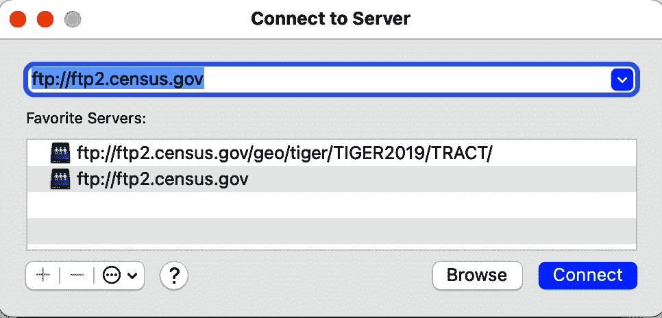

###### 图 7-7\. 连接到美国人口普查局 FTP 站点

FTP 站点 可通过链接访问。您将能够浏览可用的文件。您还可以通过[服务器站点](https://oreil.ly/OlwXw)获得访问权限。[总结文件](https://oreil.ly/bsd2s)是大多数感兴趣的文件所在之处。

您将要探索美国人口普查的十年人口数据。这里包含的地理数据来自 2019 年 ACS 一年调查。人口普查表来自 2010 年人口普查。^(1) [Google Colab](https://oreil.ly/ytceM) 在这项练习中表现良好，因为文件结构是直接可用的，并且会话结束后，文件会被移除。

您需要下载以下在 Colab 中尚未包含的包：

```py
!pip install geopandas #install separately to avoid errors

import requests # accessing from the CensusAPI **import** sys # checking python version **import** pandas **as** pd # working with dataframes **import** geopandas **as** gpd # creating maps **import** folium **as** fm # creating HTML map complete with OSM basemap
```

当处理人口普查数据时，我学到了一条重要的经验教训：始终了解您的包版本，以防存在依赖关系（或冲突！）。这是一个有用的实践方法，可以添加到您的笔记本中。使用以下代码显示版本：

```py
# Display package versions
print("Python Version", sys.version)
print("requests version:", requests.__version__)
print("pandas version:", pd.__version__)
print("geopandas version:", gpd.__version__)
print("folium version:", fm.__version__)
```

现在您可以从 FTP 服务器请求人口普查区信息。您正在寻找人口普查区的形状文件。这些是 *.zip* 文件；请注意，您需要的文件可能捆绑在一个较大的文件中。下载加利福尼亚州的[拓扑集成地理编码和参照（TIGER）文件](https://oreil.ly/THPPT)：FIPS 06\.（联邦信息处理标准出版物，或 FIPS 文件指定州和县的等效物）。TIGER 形状文件包含地理信息但不包括人口统计信息，因此我们将很快添加该信息。链接标识了美国人口普查局 FTP 站点，并指定了加利福尼亚州 2019 年按区划级别的地理文件：

```py
'ftp://ftp2.census.gov/geo/tiger/TIGER2019/TRACT/tl_2019_06_tract.zip'
```

一旦您在 FTP 中确定文件，要检索它，您需要 `!wget` 调用。wget 实用程序从 Web 服务器检索 FTP 文件：

```py
!wget ftp://ftp2.census.gov/geo/tiger/TIGER2019/TRACT/tl_2019_06_tract.zip
```

对于 `!wget` 调用，*.zip* 文件路径上的引号是不需要的，并且文件将解压缩到您的 Colab 笔记本中。您可以在笔记本中直接观察解压缩进度，直到完成到 100%。您的输出应如下所示：

```py
--2022-08-22 15:52:00--  ftp://ftp2.census.gov/geo/tiger/TIGER2019/TRACT/
tl_2019_06_tract.zip
           => 'tl_2019_06_tract.zip'
Resolving ftp2.census.gov (ftp2.census.gov)... 148.129.75.35, 2610:20:2010:a09:
1000:0:9481:4b23
Connecting to ftp2.census.gov (ftp2.census.gov)|148.129.75.35|:21... connected.
Logging in as anonymous ... Logged in!
==> SYST ... done.    ==> PWD ... done.
==> TYPE I ... done.  ==> CWD (1) /geo/tiger/TIGER2019/TRACT ... done.
==> SIZE tl_2019_06_tract.zip ... 29388806
==> PASV ... done.    ==> RETR tl_2019_06_tract.zip ... done.
Length: 29388806 (28M) (unauthoritative)

tl_2019_06_tract.zi 100%[===================>]  28.03M   262KB/s    in 69s     

2022-08-22 15:53:10 (416 KB/s) - 'tl_2019_06_tract.zip' saved [29388806]
```

图 7-8 显示文件在解压缩到文件夹层次结构后的情况。导航到县级数据，使用与查找加利福尼亚州小区相同的步骤。

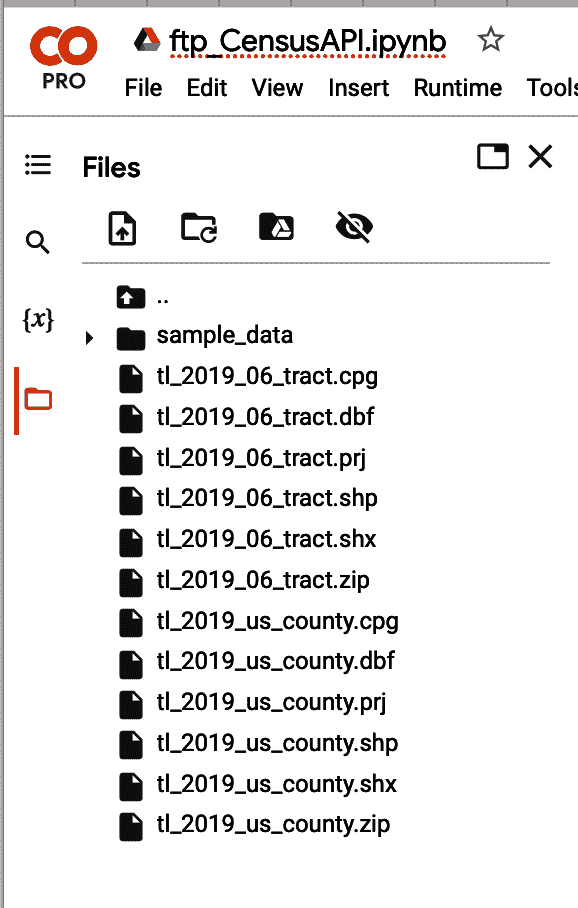

###### 图 7-8。Google Colab 文件结构

现在文件解压缩后，我们可以从 Web 服务器检索 FTP 文件：

```py
'ftp://ftp2.census.gov/geo/tiger/TIGER2019/COUNTY/tl_2019_us_county.zip'
!wget ftp://ftp2.census.gov/geo/tiger/TIGER2019/COUNTY/tl_2019_us_county.zip
```

现在您可以使用 GeoPandas 绘制加利福尼亚小区（`ca_tracts`），从您的 Colab 窗口读取文件。每个文件名旁边有三个点。右键单击点并选择复制路径以复制文件链接：

```py
ca_tracts = gpd.read_file('/content/tl_2019_06_tract.shp')
ca_tracts.plot()
```

输出显示在图 7-9 中。

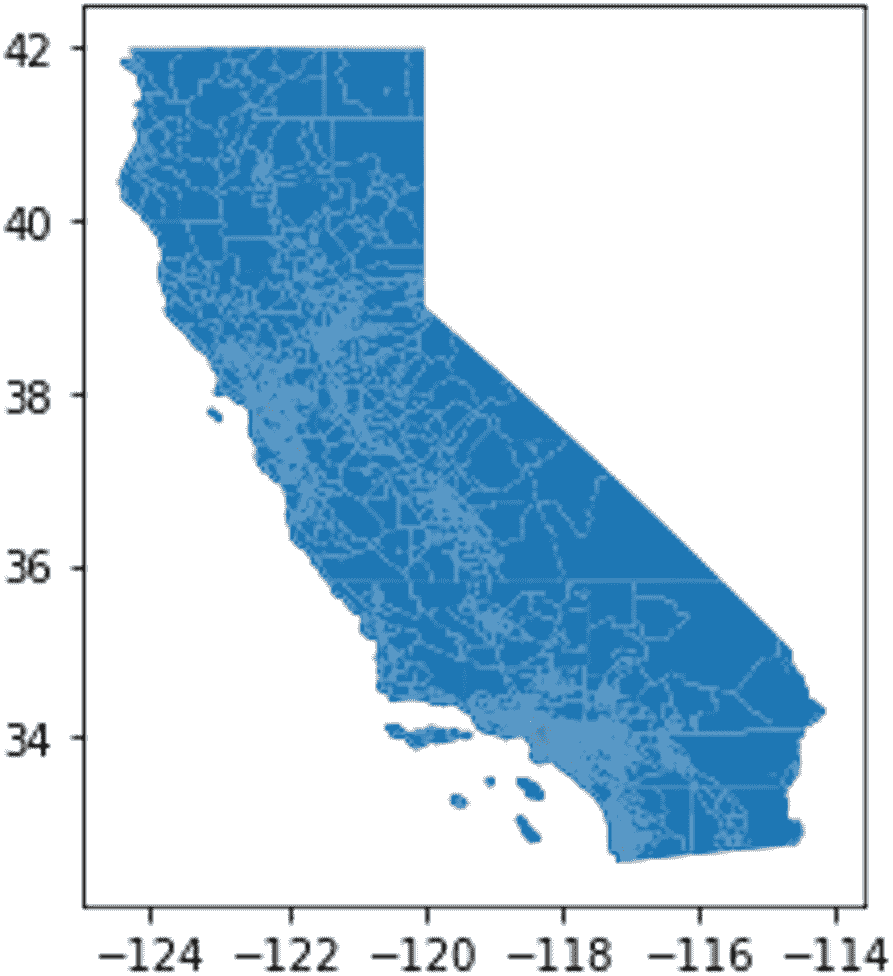

###### 图 7-9。加利福尼亚人口普查小区

让我们花点时间弄清楚表 ID 的含义，以帮助您找到正确的数据。

## 在浏览器中访问人口普查 API 的数据

接下来，您需要打开[美国人口普查局网站](https://oreil.ly/A3Bwq)。在搜索窗口中输入`**DP03**`，这是人口普查数据的表 ID（图 7-10）。该 ID 可能看起来很随机，但实际上它提供了重要信息。从结果中可以立即看出，DP 指示一个数据概况表。表 ID 描述此表包含“广泛的社会、经济、住房和人口统计信息”。ID 中的后续数字 03 还涉及选定的经济特征。

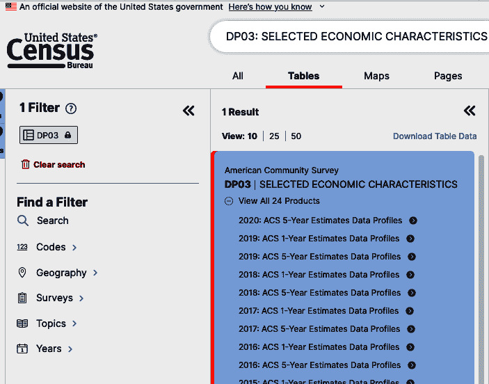

###### 图 7-10。人口普查 API：数据

选择 Enter 以查看可用表格列表。图 7-11 显示来自此搜索可用的不同年份和类型的 ACS 调查。这些被称为*数据概况*，稍后我们将再次提及它们。

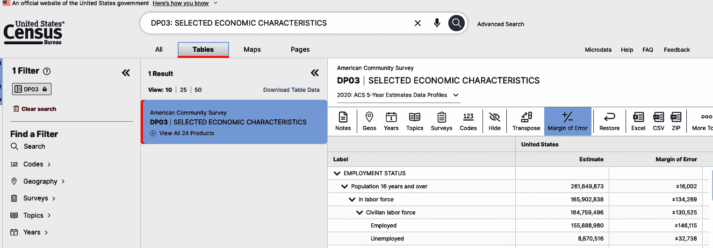

###### 图 7-11。来自美国人口普查局的数据概况表

[census.gov 上的可用 API 页面](https://oreil.ly/tJM7C)（图 7-12）是一个重要资源，包含广泛主题的公开可用数据集。从这里选择美国社区调查（ACS）。

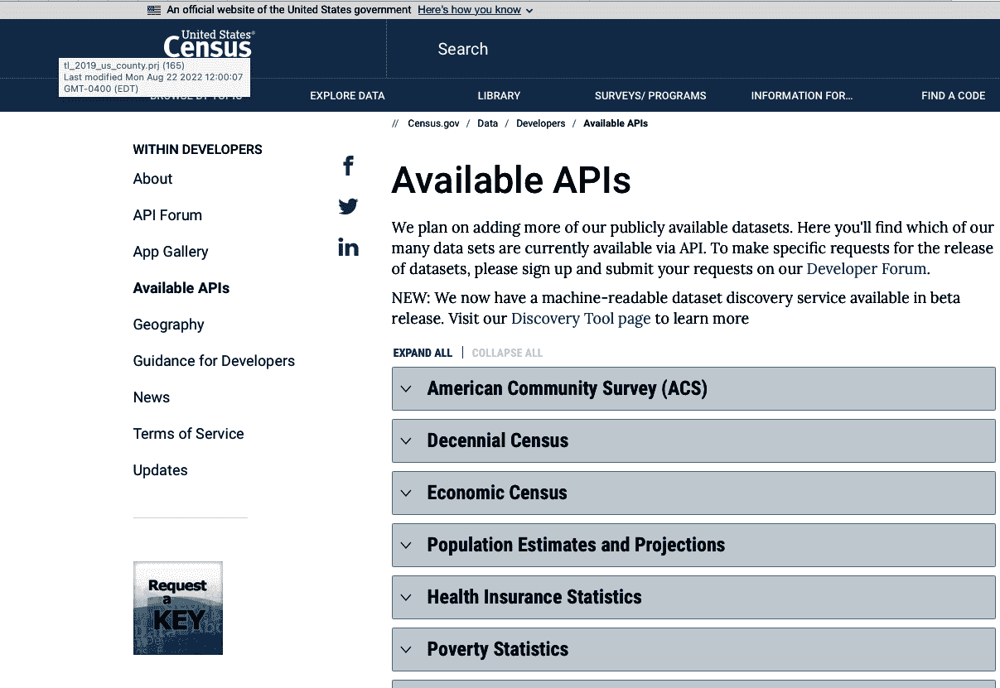

###### 图 7-12。可用 API 及其他美国人口普查局数据集

在美国社区调查（ACS）下，选择 1 年估计，并滚动到 2019 年。滚动表格列表直至看到数据概况。复制第一个链接并粘贴到浏览器中。您将编辑此链接并生成一个*.csv*文件。

###### 提示

当你在“可用 API”页面时，你可以请求一个用于运行美国人口普查局服务请求的密钥。对于这个练习，你不需要一个，但我建议请求一个并将其保存在一个可靠的位置。浏览列出的其他数据集，并熟悉公开可用数据的范围。另一个有用的美国人口普查局资源是开发者论坛，这是一个接受数据集和咨询请求的活跃社区。

## 使用数据概况

在数据概况部分，你有将要编辑的示例调用以及关于数据概况表的其他详细信息：

+   **示例调用：**

    *api.census.gov/data/2019/acs/acs1/profile?get=group(DP02)&for=us:1&key=YOUR_KEY_GOES_HERE*

+   2019 年 ACS 数据概况变量 [ [html](https://oreil.ly/G0PZ0) | [xml](https://oreil.ly/Iw9CJ) | [json](https://oreil.ly/ruuB4) ]

+   [ACS 技术文档](https://oreil.ly/ynqzy)

+   [示例和支持的地理位置](https://oreil.ly/z8LI5)

点击链接以收集更多信息。你的第一个编辑将包括替换你感兴趣的表格 `DP03`，并从 URL 中删除占位符 `&key=YOUR_KEY_GOES_HERE`：

*api.census.gov/data/2019/acs/acs1/profile?get=group(DP03)&for=us:1*

然后将 URL 粘贴到浏览器中并按 Enter 键。现在你将想要定制 URL 的地理部分，包括所有都市区域。从前一页选择示例和支持的地理位置，并滚动到地理层次结构图 7-13 中所示的都市区域。

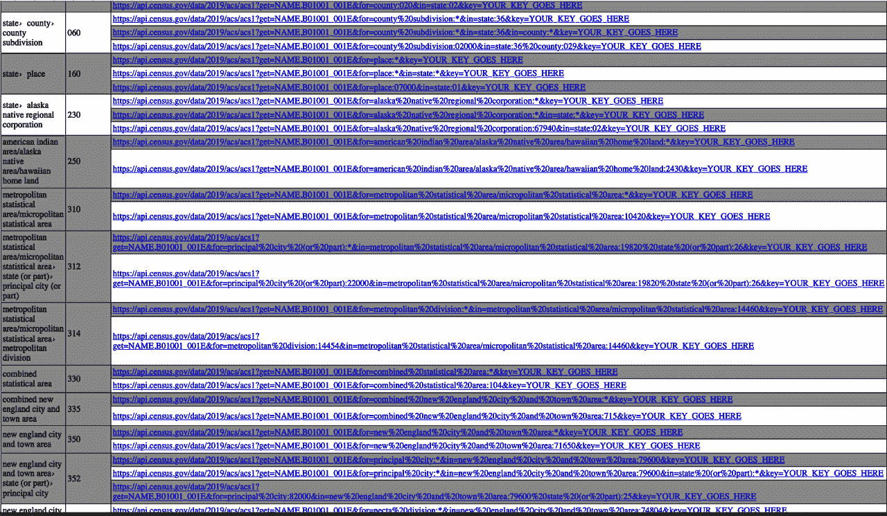

###### 图 7-13\. 地理层次结构

注意到 *（通配符选项），复制 URL，确保再次删除 `YOUR_KEY_GOES_HERE` 部分。另一种选项将为你提供一个单一都市区域的数据：俄亥俄州阿克伦都会区。

一旦你熟悉了 URL 和数据表，只需进行一些快速编辑即可获得所需的人口或经济数据的可用文件。按如下修改 URL：

*https://api.census.gov/data/2019/acs/acs1/profile?get=NAME,DP03_0001E&for=metropolitan%20statistical%20area/micropolitan%20statistical%20area:**

现在将其粘贴到浏览器中并按 Enter 键。该文件以 JSON 格式保存在我的 Mac 上。与其将其保存为 *.csv* 文件，这会迫使你在 Microsoft Excel 中进行编辑，不如运行以下代码行将其从 *.json* 转换为 *.csv*：

```py
df = pd.read_json(‘link to json file’)

df.to_csv()
df
```

这将输出一个格式化的 *.csv* 文件。

## 创建地图

要完成我们创建人口密度项目，你将返回到 2010 年人口普查的 URL。

让我们从查看 2010 年人口普查的参考 URL 开始：

*https://api.census.gov/data/2010/dec/sf1?get=LSAD_NAME,P001001&for=tract:*&in=state:06*

现在您已经熟悉了人口普查 API 的调用，您可以在 Python 中分解链接，计算密度并自定义表格。在加利福尼亚州人口普查区段的 URL 调用中包括表`P001001`；`sf1`指的是十年一次的人口普查：

```py
# The built out request for the URL  https://api.census.gov/data/2010/dec/
sf1?get=LSAD_NAME,P001001&for=tract:*&in=state:06 HOST = "https://api.census.gov/data" year = "2010" dataset = "dec/sf1" base_url = "/".join([HOST, year, dataset])
predicates = {}
get_vars = ["LSAD_NAME", "P001001"]
predicates["get"] = ",".join(get_vars)
predicates["for"] = "tract:*" predicates["in"] = "state:06" r = requests.get(base_url, params=predicates)
```

现在您已经发出了请求，让我们查看数据的列名称：

```py
print(r.json()[0])
['LSAD_NAME', 'P001001', 'state', 'county', 'tract']
```

记住`index`函数。您只需读取数据的第一行（`r`）来查看标题。您还可以创建新的名称：

```py
# Create user friendly column names tract_name = ["tract_name", "tract_pop", "state_fips", "county_fips", 
"tract_fips"]
# Reading the json into pandas df tractdf = pd.DataFrame(columns=tract_name, data=r.json()[1:])
# Changing data types to integer tractdf["tract_pop"] = tractdf["tract_pop"].astype(int)

tractdf.head()
```

在笔记本中跟随操作。以下代码将选择所有洛杉矶县的属性，删除任何空值，并创建一个新的`geoid`列。运行代码，并验证确实已添加了`geoid`列。

首先，我们需要从洛杉矶县中选择属性：

```py
onecounty_tractdf = tractdf.loc[tractdf['county_fips'] == 
'037'].copy()Onecounty_tractdf
```

然后，我们创建包含新`geoid`列的新数据框架：

```py
onecounty_tractdf['tract_fips'] = onecounty_tractdf['tract_fips'].str.ljust(6,'0')
onecounty_tractdf['geoid'] = onecounty_tractdf['state_fips'] + 
onecounty_tractdf['county_fips'] + onecounty_tractdf['tract_fips']
onecounty_tractdf
```

数据框中有 2,346 条记录。您还可以通过一行代码快速计算记录数量：

```py
onecounty_tractdf.count()
```

要将区段级别和县级文件连接起来，您需要选择一个连接属性。要回顾可用的选择，请使用以下代码检查列标题：

```py
ca_tracts.info
```

该连接将合并来自两个数据集的列标题`GEOID`和`geoid`：

```py
attr_joined = pd.merge(ca_tracts, onecounty_tractdf, left_on='GEOID', 
right_on='geoid')
# Check that all 2345 Census Tracts joined
attr_joined.count()
```

双重检查坐标参考系统，确保地理文件和人口普查数据匹配。ALAND 是面积，以平方米计。现在您可以将分组块添加到您的地图上：

```py
map = fm.Map(location=[center_y, center_x], zoom_start=10)

# Add Study Area Block Groups to Map
fm.Choropleth(
   geo_data = ca_prj,
   data=ca_prj,
   columns=['tract_pop','ALAND'],
   key_on= 'feature.properties.tract_pop',
   fill_color='YlGnBu',
   name = 'Population Density',
   legend_name='Population Density'
).add_to(map)
map
```

人口密度衡量在给定区域内居住的人数，通常以平方公里计算。您可以在代码单元格中直接将研究区域转换为平方公里：

```py
# Create a new column for Census Tract area in square Kilometers ca_prj['AreaLandKM2'] = (ca_prj['ALAND'] * .000001)

ca_prj[['geoid','TRACTCE','ALAND','AWATER','AreaLandKM2']].head()

ca_prj['ppl_perKM2']=(ca_prj['tract_pop']/ca_prj['AreaLandKM2'])
ca_prj[['geoid','TRACTCE','tract_pop','AreaLandKM2','ppl_perKM2']].head(16)
```

接下来，选择您希望地图中心的位置：

```py
center_x = (ca_prj.bounds.minx.mean() + ca_prj.bounds.maxx.mean())/2
center_y = (ca_prj.bounds.miny.mean() + ca_prj.bounds.maxy.mean())/2
print(f'The center of the data file is located at {center_x} {center_y}')
```

现在您可以通过运行以下代码查看地图和图例（自动生成），显示洛杉矶县内的人口密度：

```py
map = fm.Map(location=[center_y, center_x], zoom_start=10)

# Add Study Area Block Groups to Map
fm.Choropleth(
   geo_data = ca_prj,
   data=ca_prj,
   columns=['TRACTCE','ppl_perKM2'],
   key_on= 'feature.properties.TRACTCE',
   fill_color='YlGnBu',
   name = 'Population Density',
   legend_name='Population Density'
).add_to(map)
map
```

输出结果，您完成的地图显示在图 7-14 中。

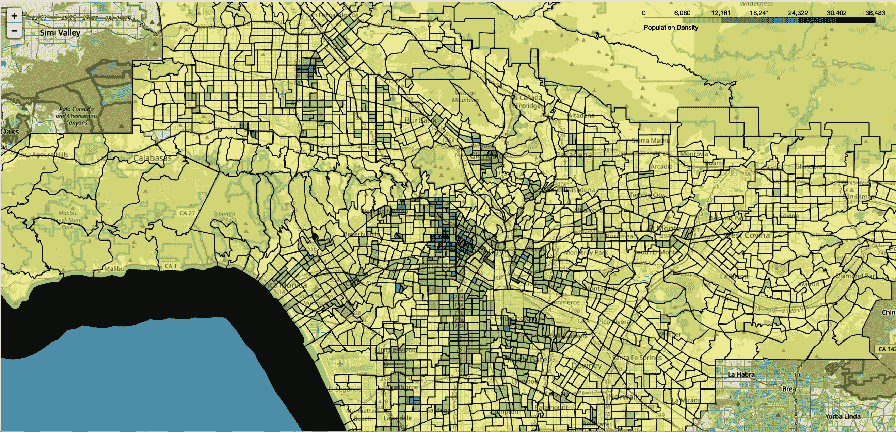

###### 图 7-14\. 洛杉矶县人口普查区段密度

从人口普查 API FTP 站点导入 TIGER 文件可以保证单一的位置精度源。在这里，您查看了人口普查区段级别，但通过简单编辑 URL 调用，您可以更改到县级、国会选区或市政区等级。虽然这些文件类型不包括人口统计或经济信息，但您学会了如何发现数据资源并在笔记本中查看它们。将 JSON 文件保存为*.csv*格式还意味着您可以将其上传到如 QGIS 等 GUI 进行进一步探索。

# 总结

GeoPandas 是一个功能强大的开源 Python 项目，允许用户将地理数据与 pandas 对象集成，并进行空间操作。它在地理空间计算中默默地发挥作用。在本章中，您已经学习了文件的读取和写入、数据的选择、地图和图表的制作、交互式地图制作以及几个有用的包，以便将其包含在您未来的地理空间分析中。

^(1) 截至本文撰写时，2020 年人口普查的最终数据尚未公布。一旦数据公布，您只需在代码单元格中更新链接，即可获得最新信息。
