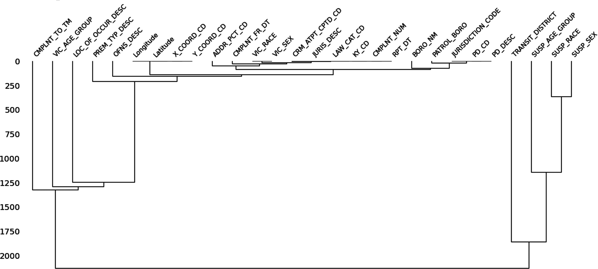

# 第八章：数据清洗

处理数据时的一个通用问题是了解数据的完整性。数据工程依赖于清理、处理和可视化数据的能力。现在你已经熟悉了将数据与基于笔记本的代码编辑器集成的基本功能，无论是在本地使用 Jupyter Notebook 还是在云端使用 Google Colab，现在是学习如何清理你的数据的时候了。数据经常是不完整的（缺失），格式不一致，或者其他方面不准确——通常称为*杂乱的数据。数据清洗*是解决这些问题并准备数据进行分析的过程。

在这一章中，我们将探索一些公开可用的数据集，使用一些可以加载到 Colab 笔记本中的包来找到并清理杂乱的数据。你将使用来自纽约市开放数据门户[NYC Open Data](https://oreil.ly/W8sNI)，更新于 2021 年 7 月 7 日的 NYPD_Complaint_Data_Historic 数据集。我筛选了 2020 年的数据，以便更容易查看和操作。你可以根据你的数据问题筛选数据并[导出为 CSV 文件](https://oreil.ly/7J4Kj)。本章将向你展示如何管理、删除、更新和 consoldate 数据，并用一些有用的 Python 包来处理数据。数据分析的准确性取决于数据集或数据库的质量，这一章将提供工具来评估和解决常见的不一致性问题。

# 检查缺失数据

如果你曾经参加过数据竞赛，比如在[Kaggle](https://www.kaggle.com)上提供的那些竞赛，你可能会注意到数据集被设计成帮助你集中注意力解决特定任务，比如构建可视化。通常情况下，数据已经被清理过了。现实生活要复杂一些，缺失数据是一个持续存在的问题。让我们看看你如何让你的数据世界变得更加整洁。

使用电子表格和表格数据格式，评估数据的形状是一项直截了当的任务。稍微滚动一下就可以轻松地发现缺少数据的行和/或列。当你审查数据集以查找缺失数据的模式时，实际上是在评估它们的*空值*，或者说空数据（缺失值）的存在。地理空间分析，像一般的分析一样，通常涉及多个表格，因此学会如何识别这些表格数据之间的数据模式非常重要。

## 上传至 Colab

我在这个例子中使用了[Google Colab](https://oreil.ly/J8wam)，但你可以使用任何你喜欢的环境。将[NYPD Complaint Data Historic](https://oreil.ly/kv3Pe) CSV 文件上传到你的笔记本上，并点击文件名旁边的点。这将为你提供包含在笔记本中的路径（参见图 8-1）。


###### 图 8-1 上传文件至 Colab

[Missingno](https://oreil.ly/ps5JI)是一个 Python 库，用于检测数据集中的缺失值，并可视化它们在数据框架中的分布，这样可以更容易地发现模式。^(1) Missingno 在底层运行时依赖 NumPy、pandas、SciPy、matplotlib 和 seaborn，这使得底层代码片段更加熟悉。安装 missingno：

```py
pip install missingno
```

根据数据集大小的不同，您可以调整样本大小。这里我设置了样本为 `1000`。导入 Python 库 pandas 将帮助您进行一些数据清洗和准备工作：

```py
import pandas as pd
NYPD = pd.read_csv("/content/NYPD_Complaint_Data_Historic.csv")
import missingno as msno
%matplotlib inline
msno.matrix(NYPD.sample(1000))
```

一旦您上传数据集，您将需要查看数据字典，了解列标题表示的内容。

我们数据框架中列出的列显示在表 8-1 中。CMPLNT_NUM 似乎是每行的关键标识符。这一点很重要，因为每行都是数据集中一个事件的记录。

表 8-1\. 纽约市警察局投诉数据集数据字典

| Field name | 描述 |
| --- | --- |
| CMPLNT_NUM | 每个投诉的随机生成的持久标识符 |
| CMPLNT_FR_DT | 报告事件发生的确切日期（或者如果存在 CMPLNT_TO_DT，则为事件开始日期） |
| CMPLNT_FR_TM | 报告事件发生的确切时间（或者如果存在 CMPLNT_TO_TM，则为事件开始时间） |
| CMPLNT_TO_DT | 如果确切时间不明确，则报告事件结束日期 |
| CMPLNT_TO_TM | 如果确切时间不明确，则报告事件结束时间 |
| ADDR_PCT_CD | 发生事件的警区 |
| RPT_DT | 向警察报告事件的日期 |
| KY_CD | 三位数的犯罪分类代码 |
| OFNS_DESC | 与关键代码对应的犯罪描述 |
| PD_CD | 三位数的内部分类代码（比关键代码更详细） |
| PD_DESC | 与 PD 代码对应的内部分类描述（比犯罪描述更详细） |
| CRM_ATPT_CPTD_CD | 犯罪行为是否成功完成、尝试但失败、或过早中断的指示符 |
| LAW_CAT_CD | 犯罪级别：重罪、轻罪或违规行为 |
| BORO_NM | 事件发生的市区名称 |
| LOC_OF_OCCUR_DESC | 发生地点具体描述：内部、相对于、前部或后部 |
| PREM_TYP_DESC | 场所的具体描述：杂货店、住宅、街道等 |
| JURIS_DESC | 管辖区代码的描述 |
| JURISDICTION_CODE | 事件责任管辖区：可以是内部机构，如警察（0）、运输（1）和住房（2），也可以是外部（3），如矫正局、港务局等。 |
| PARKS_NM | 如果适用，纽约市公园、游乐场或绿地发生事件的名称（不包括州立公园） |
| HADEVELOPT | 如果适用，纽约市住房管理局发生事件的住房开发项目名称 |
| HOUSING_PSA | 发展级别代码 |
| X_COORD_CD | 纽约州平面坐标系统的*x*坐标，长岛区，NAD 83，单位为英尺（FIPS 3104） |
| Y_COORD_CD | 纽约州平面坐标系统的*y*坐标，长岛区，NAD 83，单位为英尺（FIPS 3104） |
| SUSP_AGE_GROUP | 嫌疑人年龄组 |
| SUSP_RACE | 嫌疑人种族描述 |
| SUSP_SEX | 嫌疑人性别描述 |
| TRANSIT_DISTRICT | 事件发生的运输区 |
| Latitude | 全球坐标系统的中部纬度坐标，WGS 1984，十进制度数（EPSG 4326） |
| Longitude | 全球坐标系统的中部经度坐标，WGS 1984，十进制度数（EPSG 4326） |
| Lat_Lon | 地理空间位置点（纬度和经度的组合） |
| PATROL_BORO | 事件发生的巡逻区名称 |
| STATION_NAME | 运输站名称 |
| VIC_AGE_GROUP | 受害人年龄组 |
| VIC_RACE | 受害人种族描述 |
| VIC_SEX | 受害人性别描述 |

数据集中的变量需要确切地按照数据框中呈现的方式命名。如果它们全部大写或用下划线分隔，您需要确保复制它们（或者可以类似地重命名它们，就像您在第七章中重命名人口普查数据列一样）。

接下来，还有其他需要在数据集中考虑的问题。

## 空值和非空值

您首先需要检查数据集中的缺失值。通过使用像`NYPD.info()`和`NYPD.describe()`这样的 pandas 功能快速查看数据（参见图表 8-2 和 8-4）。

使用`.info()`可以显示列名、非空值数和数据类型（`Dtype`）：

```py
NYPD.info()
```

在这个数据集中，范围索引有 1115 条记录；因此，任何具有少于 1115 个值的列都存在缺失数据。列的非空计数可以帮助您查看缺失的数据，并决定哪些列未捕捉到足够的数据以提供洞察。

该数据集的[文档](https://oreil.ly/nhqvO)指出，空值可能归因于部门表格的变更和数据收集的不一致性。此外，如果 2020 年（我选择用来过滤数据的年份）的信息不可用或在收集时不明确，则将其分类为未知/不可用/未报告。重要的是要阅读支持文档，以了解数据的限制，这可能会限制您能够有用地提出的问题。

## 数据类型

数据清洗中的首要任务之一应该是检查数据集中每一列的数据类型。最常见的数据类型包括[布尔值、整数、浮点数、对象和日期时间](https://oreil.ly/WLzh0)，您应该对这些类型非常熟悉。

这些数据类型中最棘手的是对象。Python 对象可以包含各种数据类型。它们通常是字符串，但您应该知道它们还可以包括整数、浮点数、列表和字典。在 pandas 库中，不同的数据类型被检测并分类为 NaN（默认标记为“不是数字”）或 NaT 表示缺少日期时间数据。`NYPD.info`的输出包括数据类型（`Dtype`），或者您可以使用`dtypes` DataFrame 属性，通过在其后添加点号来使用`NYPD.dtypes`。

## 元数据

您还可以返回有关数据形状的信息。这与数据类型信息一起被称为*元数据*，或者称为数据的数据。要查看 NYPD 数据的形状，请运行：

```py
NYPD.shape
(7375993, 35)
```

简化起见，在此示例中，我在源数据中筛选了仅包含 2020 年数据，以便我们处理较少的记录：1,115 条记录（图 8-2）。


###### 图 8-2\. `NYPD.info()`的数据框摘要

每次投诉发生的确切时间，或者 CMPLNT_FR_TM，在图 8-2 中列出为对象或字符串。当 datetime 或其他数据类型被分配为字符串或对象时，Pandas 通常会猜测列中的数据类型。这通常会由于`low_memory=True`等默认设置而变得复杂。大文件会被“分块”，并且该文件通常会生成包含多个数据类型的列。我建议您不要简单地将参数切换为`False`。手动更改`dtype`更为高效，如下面的代码单元格所示：

```py
NYPD = pd.read_csv('/content/drive/MyDrive/NYPD_Complaint_Data_Historic.csv',
                   parse_dates=['CMPLNT_FR_TM'])
NYPD.dtypes.head()

CMPLNT_NUM               int64
CMPLNT_FR_DT            object
CMPLNT_FR_TM    datetime64[ns]

NYPD = NYPD.drop(columns =['CMPLNT_TO_DT','CMPLNT_FR_TM','PARKS_NM','HADEVELOPT', 'HOUSING_PSA'])
```

`NYPD.head()`将更新您保留的列，并确认您的“删除”列不再显示在数据帧中。

如果不与您感兴趣的探索相关，您可以删除具有不完整数据的列。但我强烈建议您不要*删除*数据。通常，数据缺失的原因和选择包含的数据一样引人注目或重要。

让我们通过识别几个样本列来尝试这个功能从数据帧中删除。

## 摘要统计

您可以使用`.describe()`查看*摘要统计*，或者汇总您的样本数据的统计信息。

查看行计数是识别数据帧中不同特征缺失数据的另一个机会。在`df.describe()`的输出中，排除了 NaN 值，因此您可以看到数据的实际分布以及每列中值的计数。

# 中心趋势测量

正态分布是指平均值、众数和中位数都是相同的值。*概率*分布或*中心趋势测量*描述了分布中的中心值，当分布不正常时，如图 8-3 所示。


###### Figure 8-3\. 中心趋势测量的回顾

还有一些指标可以表明数据分布的偏斜程度和异常值的存在。 图 8-4 是[2021 年能源和水数据披露法律 84 号（2020 年日历年数据）](https://oreil.ly/vOcv7)的一个快照，这是一份详细考察纽约市私人建筑物能源和水使用情况的大型数据集。表中的中位数或第二四分位数（Q2），即表中的 50%指标，表示*中位数值*，即一半数值在其上方，一半数值在其下方。


###### Figure 8-4\. `df.describe()` 函数提供了数值数据列的描述性统计信息。

快速查看数据形状的一种方法是观察 Q2 或中位数的位置。如果查看 图 8-4 中的第二列，您可以确定中位数的值更接近 25%还是 75%。如果更接近 25%或 Q1，则数据右偏，意味着有 25%的值低于 Q1 值。将 Q1 视为最小值和中位数之间的值。Q3 的值位于中位数和最大值之间，指示 75%的报告值将低于 Q3。这将导致数据具有左偏。

您可以通过 `df.describe()` 函数快速查看数据集中的数值值。将以下代码段输入到您的笔记本中以查看：

```py
df.describe()
```

绘制直方图有助于更好地可视化数据的形状。如 图 8-5 所示，存在右偏尾或正偏态。这表明均值大于中位数，中位数大于众数。


###### Figure 8-5\. 数据分布的可视化

让我们回到 NYPD 数据。我们可以可视化数据并查看其分布：

```py
size, scale = 1000, 10
Complaints = pd.Series(np.random.gamma(scale, size=size) ** 1.5)

Complaints.plot.hist(grid=True, bins=20, rwidth=0.9,
                 color='#607c8e')
plt.title('Distribution of Complaint Types')
plt.xlabel('CMPLNT_NUM')
plt.ylabel('OFNS_DESC')
plt.grid(axis='y', alpha=0.75)size, scale = 1000, 10
Complaints = pd.Series(np.random.gamma(scale, size=size) ** 1.5)

Complaints.plot.hist(grid=True, bins=20, rwidth=0.9,
                 color='#607c8e')
plt.title('Distribution of Complaint Types')
plt.xlabel('PATROL_BORO')
plt.ylabel('OFNS_DESC')
plt.grid(axis='y', alpha=0.75)
```

可视化还显示了投诉类型数据的右偏分布（见 图 8-5）。

图 8-6 简单统计了数据集中每一列缺失的数值。在分析数据之前了解记录缺失的时机提供了透明度，并且在分享数据可视化时，传达这些信息至关重要。


###### Figure 8-6\. `NYPD.isna().sum()` 列出了数据集中每一列的缺失值统计。

`NYPD.isna()` 返回带有布尔值指示缺失值的数据框，如 图 8-7 所示。在计算中，布尔值只有两个可能的值：`True` 和 `False`，通常表示为 `1` 和 `0`。在这种情况下，`True` 表示缺失数据。一目了然，您可以看到数据缺失的位置。


###### 图 8-7\. 数据框 `NYPD.isna()`

这些只是探索数据框并了解数据完整性或空值范围的几个选项。

现在您已经找到了缺失数据，接下来该怎么办？

## 替换缺失值

检查数据框的另一个原因是查看缺失值并确定它们的特征。一旦您知道表中如何记录缺失值，您就可以使用 `na_values` 参数将它们替换为您选择的变量，例如 `NaN`、`unknown` 或其他感兴趣的值：

```py
df_test = pd.read_csv("/content/NYPD_Complaint_Data_Historic.csv", 
na_values = 'NaN')
print(df)
```

探索数据集通常会发现数据表中缺失值报告的不一致性。代码片段将查询替代变量，如 `?` 和 `999`。

# 使用 Missingno 可视化数据

在本节中，我们将再次使用 Missingno。Missingno 可以将表格数据矩阵转换为布尔掩码，因为 *掩码* 基于底层操作数据的某些标准返回数据。数据根据指定标准返回 True/False 布尔值。在计算中，布尔值只有两个可能的值。Missingno 将包含数据的单元格标记为 `True`，空单元格标记为 `False`。它可以将这些数据可视化为 *空值矩阵*（图 8-8），这种图表使用空白空间来直观表示缺失数据并显示模式。数据存在的地方将被阴影化。


###### 图 8-8\. 纽约警察局投诉数据集的空值矩阵

在 图 8-8 中，每列代表数据中的一个特征，每行代表一个观察结果。矩阵右侧的小火花线显示了每个记录中缺失数据的量。

您在这里看到了任何缺失数据模式吗？我注意到第四和第五栏，即投诉结束日期和时间，具有相同的模式：当这两个值中的一个缺失时，另一个也缺失。您可以使用 `msno.bar` 将相同信息显示为列，而不是简化的矩阵。

```py
msno.bar(NYPD.sample(1000))
```

柱的高度等于空值或缺失数据的级别（图 8-9）。较高的柱表示值完整（没有缺失数据）或几乎完整。


###### 图 8-9\. 通过列显示的空值

评估 `msno.heatmap(NYPD)` 可以检查 *空值相关性*，即变量的存在或缺失以及这如何强烈地影响另一个变量的存在。相关性的度量范围为 –1 到 1，如图 8-10 所示。*零相关* 意味着一个变量的存在似乎与另一个变量的存在无关；相关分数为 1 表示一个变量在另一个存在时也存在。负值表示 *负相关*：一个变量的存在意味着另一个变量不会存在。


###### 图 8-10\. 空值数据热图（NYPD）

始终存在或从不存在的值不会在热图中可视化。例如，有两列——RPT_DT（报告给警察的日期）和 JURIS_DESC（辖区描述）——报告没有缺失数据，它们不会在热图中可视化。其他似乎不测量任何内容的值可能是由错误数据生成的。对数据的更详细检查可能会发现一些有趣的东西。请注意小于 1 的值：例如，图 8-10 中的 –0.3 值值得更仔细地观察。例如，小于 –1 的值表示相关性几乎是 100% 的负相关。

*树状图*，或称树状图，是一种分支图，用于直观地表示不同组之间的关系。分支称为 *类群*，末端称为 *叶子*。类群的排列告诉我们哪些叶子最相似，基于它们的接近程度。分支点的高度指示它们之间的相似性或差异性：高度越大，差异性越大。树状图中分组的越接近 0，表示一列中的空值出现与其他列的空值出现或缺失有更密切的关系。

[*scipy.cluster.hierarchy.dendrogram*](https://oreil.ly/3Pxln) 通过绘制连接类群的 U 形链接来组成聚类。如果列数少于 50，则树状图的方向默认为自上而下；如果列数超过 50，则默认为左右方向。

在图 8-11 中，表示嫌疑人种族和性别的列（SUSP_RACE 和 SUSP_SEX）比表示嫌疑人年龄组和转运区（SUSP_AGE_GROUP 和 TRANSIT_DISTRICT）的列更相似。



###### 图 8-11\. NYPD 数据集中的树状图关系

要查看层次聚类，请将以下代码片段写入代码单元格中：

```py
msno.dendrogram(NYPD)
```

在关注数据集内数据分布时，树形图是非常有用的。层次聚类定量估计每个数据点与数据集中的每个其他点的关系。聚类距离在垂直轴上，不同的数据点水平显示。数据样本的最高粒度在数据样本水平上，树形图是一种快速可视化的方法。

# 映射模式

QGIS 是查看数据和查找数据模式的另一种方式。图 8-12 中的数据被筛选，仅显示入室盗窃案，以帮助根据位置指导额外洞察。让我们看看如何生成这样的地图。


###### 图 8-12\. 在地图上可视化 NYPD 筛选后的犯罪数据

## 纬度和经度

数据集有纬度和经度列。你可以将它们转换为指出特征的点，然后使用 GeoPandas 创建地图。让我们使用相同的文件导入数据并添加一个 shapefile。首先，导入 pandas：

```py
import pandas as pd
```

接下来，`read_csv` 将数据文件读入你的笔记本：

```py
df = pd.read_csv('/content/drive/MyDrive/NYPD_Complaint_Data_Historic.csv')
```

如果你使用的是 Google Colab，可以直接上传文件。你可以将 `df` 变量修改为任何你喜欢的内容。`df.head()` 函数将返回每列的前几行：

```py
df.head()
```

作为最佳实践，请确保精确捕获数据中出现的拼写和大写，编写代码时始终将经度列在纬度列之前。

## Shapefiles

你将使用 Python 库 [Shapely](https://oreil.ly/KE75Y) 进行*计算几何*，或处理诸如点、曲线和曲面等几何对象。上传 shapefile 时，请确保将与 shapefile 相关的所有文件（它们将具有 *.dbf*、*.shx* 和 *.prj* 扩展名）上传到同一目录中。图 8-13 中的 shapefile 来自[NYC 开放数据区界](https://oreil.ly/LYjNT)。


###### 图 8-13\. NYC 开放数据区界

首先，导入你的库和包：

```py
!pip install geopandas
import geopandas as gpd
from shapely.geometry import Point, Polygon
import matplotlib.pyplot as plt
street_map = gpd.read_file('/content/tl_2021_36_place.shp')
```

###### 提示

Python 库在代码中通常被缩写。你已经看到 pandas 被缩写为 `pd`，而 GeoPandas 被缩写为 `gpd`。请注意，`plt` 用于 matplotlib —— 不要误以为它是函数或参数的一部分。

现在 Python 只需要知道如何在定义的空间中应用坐标 —— 所以你需要定义它：

```py
# designate coordinate system
crs = {'init': 'epsg:4326'}
# zip x and y coordinates into single feature
geometry = [Point(xy) for xy in zip(df['Longitude'], df['Latitude'])]
# create GeoPandas dataframe
geo_df = gpd.GeoDataFrame(df,
crs = crs,
geometry = geometry)
```

GeoPandas 是*笛卡尔坐标参考系统*，这意味着每个点由一对数字坐标定义，比如我们示例中的纬度和经度。它将地理数据分配给 pandas 对象。GeoPandas 数据框从定义我们的 CRS 和组合我们的经度和纬度列而创建。Shapely 中的 `Point` 函数使用经度和纬度列创建一个名为几何的新列，如图 8-14 所示。


###### 图 8-14\. 添加新列，几何图形

在前述代码单元格中，我们定义了`geo_df`，现在我们可以查看新创建的几何列：

```py
geo_df.head()
```

这里我扩大了`figsize`以便更好地查看，但在较小的尺寸下加载速度会更快。默认单位是英寸，但也可以进行[厘米和像素的转换](https://oreil.ly/1PeVm)。`street_map`被分配给轴，因为这是我们分配形状文件的位置：

```py
# create figure and define axes, assign to subplot (matplotlib) fig, ax = plt.subplots(figsize=(30,30))
# add .shp mapfile to axes street_map.plot(ax=ax, alpha=0.4,color='grey')
# add geodataframe to axes
# assign 'OFNS_DESC' variable to represent coordinates on graph
# add legend
# make data points transparent using alpha
# assign size of points using markersize geo_df.plot(column='OFNS_DESC',ax=ax,alpha=0.5, legend=**True**,markersize=10)
# add title to graph plt.title('Reported Offenses', fontsize=15,fontweight='bold')
# set Latitude and Longitude boundaries for map display plt.xlim(-74.02,-73.925)
plt.ylim( 40.7,40.8)
# show map plt.show()
```

图 8-15 是从 GeoPandas 数据框创建的地图。您可以过滤和编辑报告的事件，以创建更具针对性的地图。（参考[Jupyter Notebook](https://oreil.ly/9ADWy)获取更多选项。）`plt.xlim` 和 `plt.ylim` 命令可让您选择特定的边界来进一步编辑您的投影。

如果您想从数据集中选择一种犯罪类型，请使用`df.loc`函数来定位所有实例。以下是一个显示入室盗窃的示例：

```py
fig, ax = plt.subplots(figsize=(15,15))
street_map.plot(ax=ax, alpha=0.4,color='grey',legend=True,markersize=20)
geo_df.loc[df['OFNS_DESC'] == 'BURGLARY']
geo_df.plot(ax=ax, alpha=0.5,)
plt.xlim(-74.02,-73.925)
plt.ylim( 40.7,40.8)
plt.show()
```

或者您可能希望列出几种不同的违法行为：

```py
df.loc[df['OFNS_DESC'].isin([value1, value2, value3, ...])]
```

或者一组不同的参数：

```py
df.loc[(df['OFNS_DESC'] == value) & (df['TRANSIT_DISTRICT'] == value)]
```


###### 图 8-15\. GeoPandas 在纽约市各区地图上可视化的数据框

尝试提出不同的问题！

# 摘要

您已学习了一系列在清理数据时非常有用的方法。这一点尤为重要，特别是在处理开放源码数据时。例如，社区级别的数据通常是手动输入的，拼写错误、缺少日期和几何变量的缺失可能会限制这些宝贵资源的实用性。

^(1) Bilogur, Aleksey. 2018\. “Missingno: A Missing Data Visualization Suite.” *Journal of Open Source Software* 3 (22): 547\. [*https://doi.org/10.21105/joss.00547*](https://doi.org/10.21105/joss.00547)
