# 第九章：探索地理空间数据抽象库（GDAL）

讨论开源平台和库，如果没有介绍[Geospatial Data Abstraction Library (GDAL)](https://gdal.org)，将是不完整的。这是一个有效处理栅格和矢量地理空间数据的资源。处理栅格和矢量数据需要一系列工具，而 GDAL 在本书中使用的许多程序的内部工作中起着关键作用，包括 ArcGIS、QGIS 和 Google Earth。当依赖图形用户界面的程序化便利时，很容易忘记将多种数据类型和格式结合起来，以便以统一的数据模型高效地工作。这就是为什么 GDAL 是一个重要工具。它简化了在各种格式和空间参考系统中处理地理空间数据的工作。

在本章中，我们将处理栅格数据，并看看如何使用 Spyder IDE 处理 GDAL，包括如何使用`warp`函数更改地图投影，处理栅格波段，转换文件并创建二进制掩模。我们还将快速介绍另外三个有用的数据集资源：EarthExplorer、Copernicus 开放访问中心和 Google Earth Engine（GEE）。

首先，我会向你展示如何使用命令行界面，也称为*终端*，快速读取、转换和重新投影你的地理空间数据。为什么要使用命令行？如果你正在处理多个需要相同功能的文件，你不必手动逐个操作，试图在 QGIS 或 ArcGIS 中回忆必要的步骤和过程。使用命令行，你可以将一行简单的代码保存为脚本，用来处理各种文件和数据集。正如本章稍后将看到的那样，这些脚本也可以在 QGIS 中运行。在命令行工作时，我建议在 QGIS 中查看结果，或者在你对终端工作感到舒适后，可以参考 Spyder IDE 部分。

其次，我会向你展示如何在 IDE 中使用 GDAL，这是一种集成了编程和应用开发的工具。许多初学者 Python 课程都是在 IDE 中教授的，所以如果你有一些 Python 编程背景，可能对至少一个 IDE 比较熟悉。Python 有很多 IDE，但在本章中，我们将使用一个叫做 Spyder 的 IDE。像 Spyder 这样的 IDE 通过实时代码内省（允许你直接查看函数和类是如何执行以及它们包含的信息）、与 matplotlib 一起显示的内联图形以及我最喜欢的*变量资源管理器*（提供了编辑和可视化代码中对象的内置支持）等功能，简化了与代码的工作和编写。不管你使用哪个操作系统，IDE 看起来都是一样的，这在你的最终用户访问不同的工作流程和资源时非常方便。

# 配置 GDAL

从历史上看，这个库被称为*GDAL/OGR*，其中 GDAL 是栅格库的一部分，而 OpenGIS 简单要素参考实现（OGR）是库的矢量部分。现在，这些组合库通常被称为*GDAL*。我知道有许多数据科学家几乎完全在命令行上工作，所以我想快速演示一下如何实现这一点。对我来说，在命令行工作使我更容易熟悉调用 GDAL 函数的语法。它的类和函数与你从 Python 中了解到的有些不同，尽管在使用 Python API 时，语法会很熟悉。GDAL 保持对 Python 的绑定，但这与你迄今为止使用 Python 库的方式有所不同。即使使用 Python 绑定，你也需要知道如何调用 GDAL 函数并理解它们的功能。¹ 在使用 IDE 工作的部分中，我们将回到 Python。

## 安装 Spyder

Spyder IDE 完全由 Python 编写。它以被数据科学家、数据分析师和数据工程师使用而闻名。其功能包括自动补全和实时分析。让我们首先安装它。

我建议为 Spyder 安装创建一个新环境。也可以将 GDAL 安装到现有环境中；你可以输入`**conda env list**`查看已有的环境。你还需要添加 NumPy 和 matplotlib。

在相同的环境和目录中安装 Spyder 和 GDAL，用你自己的文件路径替换我的：

```py
spyder-env/Users/bonnymcclain/opt/miniconda3/envs/spyder-env

conda install -c conda-forge spyder
```

安装完 Spyder 后，可以通过在终端中输入`**spyder**`来启动它。

## 安装 GDAL

你还将在命令行安装 GDAL。打开终端并在提示符下运行以下命令：

```py
Conda install -c conda-forge gdal
```

要检查安装是否成功，请运行：

```py
gdalinfo —-version
```

可能需要设置安装文件夹的路径以从终端访问它。接下来将介绍如何完成这些步骤。我还建议查阅[GDAL 文档](https://oreil.ly/ye9fu)。

# 在命令行中使用 GDAL

如今，普通计算机用户主要在 GUI 中工作：这是一个图形层，使得可视化文件和执行任务变得更加容易。但命令行也有其优点，包括更快的处理速度。不需要加载大量文件，如果想在不同数据集上重复分析，可以保存小型 shell 脚本执行重复操作。

激活你首选的环境，conda activate `minimal_ds`，或者你刚创建的用于处理 GDAL 的 Spyder 环境。我想要在我的 TIFF 文件夹中操作文件，所以我已经输入`cd`来将其设置为当前目录。现在你可以看到 TIFF 文件被添加为我的工作目录：

```py
(minimal_ds) MacBook-Pro-8:~ bonnymcclain$ cd TIFFs
(minimal_ds) MacBook-Pro-8:TIFFs bonnymcclain$ ls
```

要在不同目录之间移动，请使用`ls/`深入了解您的目录结构。例如，如果您想要处理 Downloads 文件夹（假设它不是您当前的目录），请使用以下代码来浏览 Downloads 目录中的文件夹：

```py
ls/Downloads/another folder

(minimal_ds) MacBook-Pro-8:~ bonnymcclain$ cd TIFFs
(minimal_ds) MacBook-Pro-8:TIFFs bonnymcclain$ ls
```

花点时间在不同目录之间移动，因为理解结构是在终端中使用 GDAL 包进行工作时最重要的一课。再次强调，访问 Spyder IDE 中的包、库和文件时，您需要理解结构。

如果您在正确的目录中，冒号后面和您的用户名之前将会看到目录名。这将输出该目录中的文件列表。

```py
TIFFs bonnymcclain$ ls
```

我已经包括了一个关于使用[GEE](https://oreil.ly/6dRtp)创建您自己文件资源的部分，以便您可以跟进。[Copernicus 公开访问中心](https://oreil.ly/Z8FSL)和[EarthExplorer](https://oreil.ly/WvlrA)也是获取栅格数据的来源，但由于较大文件的大小通常渲染速度较慢。

现在您的安装已经完成，您可以学习一些命令来帮助您入门。这里是[GDAL 文档](https://oreil.ly/ye9fu)，可以帮助您解决下载和安装中的任何问题。

# 使用 GDAL 编辑您的数据

`gdalinfo`命令行参数展示了关于您的栅格数据集的可用信息。您可以使用`gdalinfo`命令并提供活动目录中文件的名称来查看这些参数。在终端中输入以下代码：

```py
gdalinfo [--help-general] [-json] [-mm] [-stats | -approx_stats] [-hist] [-nogcp] 
[-nomd]
         [-norat] [-noct] [-nofl] [-checksum] [-proj4]
         [-listmdd] [-mdd domain|`all`]* [-wkt_format WKT1|WKT2|...]
         [-sd subdataset] [-oo NAME=VALUE]* [-if format]* datasetname
```

在这个示例中，我从 GEE 数据片段中选择了一个保存的文件。您可以在[文档](https://oreil.ly/lu9Z0)中了解更多关于命令行参数的信息。

输入以下代码，用您目录中*.tif*文件的名称替换（注意不需要括号）：

```py
(minimal_ds) MacBook-Pro-8:TIFFs bonnymcclain$ gdalinfo Sentinel2_RGB20200501.tif
```

这里是输出的一部分片段：

```py
(minimal_ds) MacBook-Pro-8:TIFFs bonnymcclain$ gdalinfo Sentinel2_RGB20200501.tif
Driver: GTiff/GeoTIFF  This is the format of the saved file
Files: Sentinel2_RGB20200501.tif
Size is 5579, 4151
Coordinate System is:
PROJCRS["WGS 84 / UTM zone 29N",
    BASEGEOGCRS["WGS 84",
        …
Pixel Size = (10.000000000000000,-10.000000000000000)
Metadata:
  AREA_OR_POINT=Area
Image Structure Metadata:
  COMPRESSION=LZW
  INTERLEAVE=PIXEL
Corner Coordinates:
Upper Left  (566320.000, 4133200.000) (8d15' 4.53"W, 37d20'35.24"N)
Lower Left  (566320.000, 4091690.000) (8d15'17.78"W, 36d58' 8.31"N)
Upper Right (622110.000, 4133200.000) (7d37'17.50"W, 37d20'14.86"N)
Lower Right (622110.000, 4091690.000) (7d37'41.89"W, 36d57'48.20"N)
Center      (594215.000, 4112445.000) (7d56'20.39"W, 37d 9'13.16"N)
```

您可以从第二行看出保存文件的格式是 GTiff/GeoTIFF。

###### 小贴士

要查看其他格式的列表，请在命令行中输入`gdal_translate --formats`。您还可以查看文件大小、坐标系、像素大小和坐标。

这里是显示关于颜色波段信息的输出部分：

```py
Band 1 Block=256x256 Type=Float32, ColorInterp=Gray
  Description = B2
Band 2 Block=256x256 Type=Float32, ColorInterp=Undefined
  Description = B3
Band 3 Block=256x256 Type=Float32, ColorInterp=Undefined
  Description = B4
```

注意 Sentinel 卫星数据波段的颜色解释。它们被设置为`Gray`用于 B2 波段，对于剩余的两个波段则是`ColorInterp=Undefined`。由于未下载元数据，您需要帮助 GDAL 解释这些波段。

由于这是[Sentinel 2 数据](https://oreil.ly/mO6iH)，您知道波段是蓝色（B2）、绿色（B3）和红色（B4）。您将直接在原地编辑数据集，使用命令`gdal_edit.py`，接着是选项（如`colorinterp`），最后是值（这里是波段的颜色值）。最后一步是提供输入文件，*Sentinel2_RGB20200501.tif*：

```py
gdal_edit.py -colorinterp_1 blue -colorinterp_2 green -colorinterp_3 red 
Sentinel2_RGB20200501.tif
```

如果您的功能需要输出文件，则还需要添加*output.tif*。这里只需要输入文件。

当您重新运行 `gdalinfo Sentinel2_RGB20200501.tif` 时，您会看到颜色波段已更新，现在显示为蓝色、绿色和红色。

## 变形功能

您还可以通过学习使用 `gdal_warp` 函数来更改栅格投影。（一旦熟悉 `warp` 函数，您可以用它来学习其他常见函数；要探索它们，建议从 [Python API](https://oreil.ly/AKsHX) 的 GDAL 文档开始。）

在以下代码中，参数 `-t_srs` 指定您要定位的坐标系统。例如，每个地理坐标系统都分配了唯一的 EPSG 代码。`*xxxxx*` 的位置，请输入您希望更改为的 EPSG 代码。输入是栅格文件，输出是重命名的修改文件，如 *output_rd.tif* 所示：

```py
gdalwarp -t_srs EPSG: xxxxx  Sentinel2_RGB20200501.tif output_rd.tif
gdalinfo Sentinel2_RGB20200501.tif
```

您的输出将展示新的投影。

## 捕获输入栅格波段

接下来，您将使用 GDAL 命令行捕获投影波段的图像统计信息：

```py
(minimal_ds) MacBook-Pro-8:TIFFs bonnymcclain$ gdalinfo -stats srtm_41_19_4326.tif
```

输出摘录：

```py
    STATISTICS_MAXIMUM=640
    STATISTICS_MEAN=256.70790240722
    STATISTICS_MINIMUM=27
    STATISTICS_STDDEV=119.8746675927
    STATISTICS_VALID_PERCENT=100
```

为什么要捕获输入栅格波段进行统计分析？主要用于分类：在查看不同位置时识别群集。例如，波段特征有助于确定您是否观察到植被、水体或者住宅区。

我在本章前面提到，GDAL 在 QGIS 中以及多种其他程序中运行。 图 9-1 展示了代码在 QGIS 平台上的运行，上传您的 *.tif* 文件，并选择栅格信息。

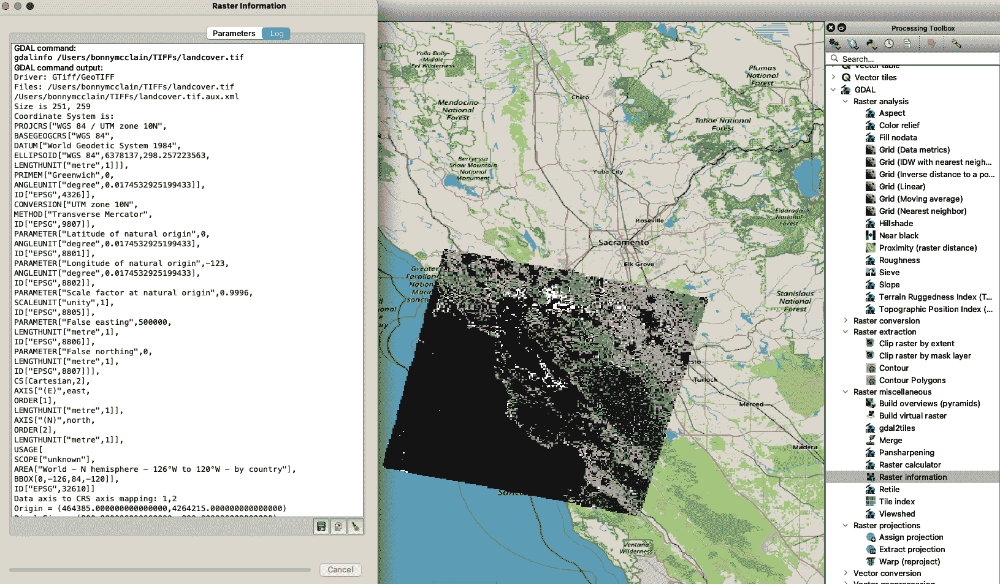

###### 图 9-1\. 在 QGIS 中显示 `gdalinfo`

现在您已经体验了在命令行中使用 GDAL，我鼓励您进一步探索更多可用的任务。这些技能对处理和编辑地理空间数据和应用程序的核心算法非常有用。在处理各种矢量和栅格数据格式时，跨平台和多样化格式转换的能力尤为重要。

接下来，我们将与 Python 集成的 GDAL 进行操作。

# 使用 Python 处理 GDAL 库

当您启动 Spyder（再次在终端中键入 `**spyder**`）时，Spyder 控制台将在新的浏览器窗口中打开，如 图 9-2 所示，但是会是空白的。

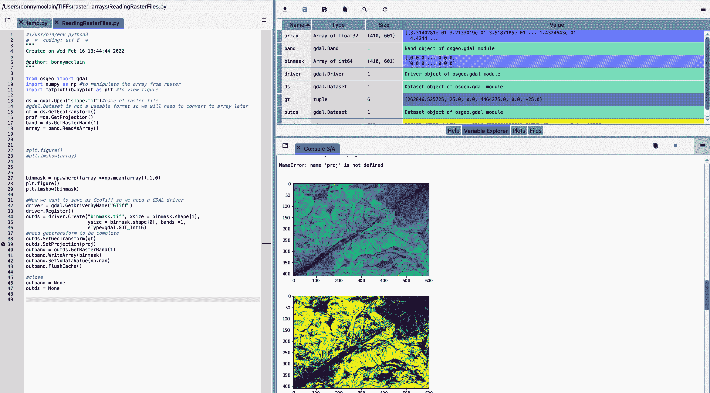

###### 图 9-2\. Spyder 控制台

## 在 Spyder 中的初始定位

图 9-2 的左侧是 Spyder 的脚本编辑器，您可以在其中创建和打开文件。（您可以自由排列面板和控制台。）右侧的两个控制台是您可以探索生成的变量和定位文件的地方。显示图像的面板是绘图窗格。您可以在底部控制台中编写简单的代码。如需帮助，请选择上窗口的帮助选项卡。

您可以在 Python 控制台或编辑器中运行代码。您还可以使用 Python 控制台控制 Spyder 的调试器。您生成的图像和图表将显示在绘图面板中或嵌入到控制台中。

变量资源管理器显示在图 9-2 右上窗格中，是我在集成开发环境中喜欢工作的一个原因。这些对象是在运行代码时生成的。点击一个变量以深入探索其详细信息。

每个控制台窗口还有一个“汉堡包”图标，或☰，展开成一个菜单（图 9-3），您可以在其中找到有关窗格的其他信息。

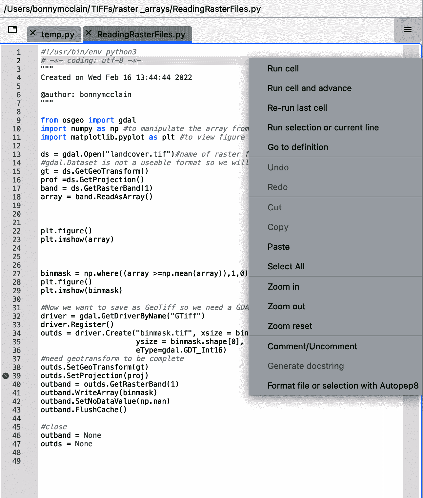

###### 图 9-3\. 在控制台目录中工作

这些选项是可定制的。我建议访问[Spyder 网站](https://oreil.ly/SGOgy)获取界面详细信息以及探索所有可用窗格。如果您想在安装之前尝试 Spyder，还有一个[Binder 选项](https://mybinder.org)，可以在浏览器中运行。

虽然这并非必须，但我喜欢在 Spyder 中启动一个新项目，就像在图 9-4 中演示的那样。这简化了返回到之前文件的过程，而不管当前工作目录如何。项目窗格也将变得可见。这让我想起 QGIS 的便利，因为文件很容易到手。

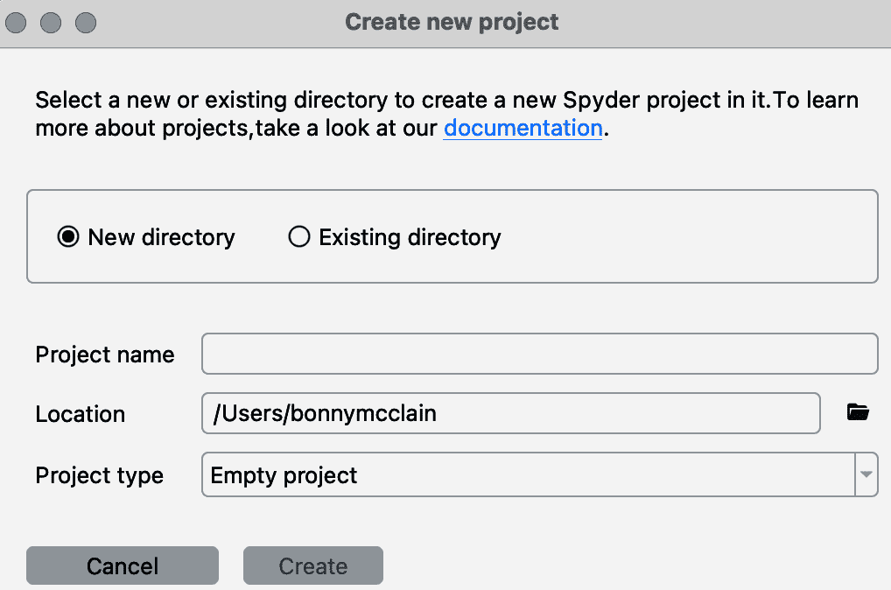

###### 图 9-4\. 在 Spyder 中创建新项目

项目窗格还可以与 Git 集成，用于版本控制。查阅[Spyder 文件文档](https://oreil.ly/8M3ZI)以了解如何在您的存储库中设置此功能。

## 在 Spyder 中探索您的数据

您距离在集成开发环境中探索您的栅格数据只有几行代码。第一步是导入必要的包：GDAL、NumPY 和 matplotlib：

```py
from osgeo import gdal
import numpy as np #to manipulate the array from raster
import matplotlib.pyplot as plt #to view figure
```

NumPY 将操作从栅格文件创建的数组，而 matplotlib 将允许您查看文件。您可以探索的栅格程序包含在[GDAL 文档](https://oreil.ly/rxgLu)中。

*实用脚本*属于*实用类*，这是一个跨应用程序可用的相关方法集合。Python 实用脚本位于`osgeo_utils.samples`子模块中，如下面的代码所示：

```py
ds = gdal.Open("slope.tif")
gt = ds.GetGeoTransform()
proj =ds.GetProjection()
band = ds.GetRasterBand(1)
array = band.ReadAsArray()
```

如果您不确定如何找到*.tif*文件，请跳转到“探索开源栅格文件”，我将介绍如何查找栅格文件以进行探索。这些是简单的数字高程模型（DEMs），其中每个点或像素都具有高程值。通常，它们表示为 DEM *.tif*文件。如果您在阅读本书时一直在探索，那么您的下载文件夹可能已经拥有不少文件了。

你将写入编辑器的代码脚本在文本中有解释；更多信息可从[GDAL Python API](https://oreil.ly/lHQri)获取。

你可以随意给你的变量取任何名字，但为了简单起见，我使用 `ds` 来表示数据集。导入你的 *.tif* 文件并创建变量 `ds` 后，你会看到变量出现在变量资源管理器中。`ds` 文件的格式是 `gdal.Dataset`。

## GDAL 中的文件转换

你需要将你的 *.tif* 文件从图 9-6 中所见的表格格式转换为地理坐标，因此接下来你将定义 `gt`，地理转换。

图中图 9-5 中的六个系数，从上到下依次对应：

0

左上角像素的*x*坐标（262846.525725）

1

像素分辨率，从西到东（25.0）

2

行旋转（通常为 0）

3

左上角的像素的*y*坐标（4464275.0）

4

列旋转（再次，通常为 0）

5

北西像素分辨率和高度（通常为负值表示北向图像），-25.0

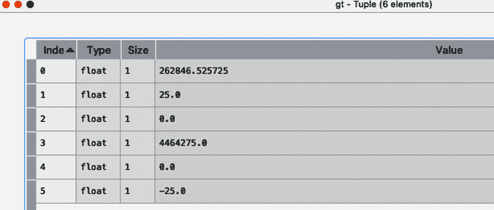

###### 图 9-5\. 地理转换为地理参考坐标

投影信息在变量资源管理器中可见（图 9-2），但在图 9-6 中显示更大。在通用横轴墨卡托投影（UTM）中，投影是 UTM 30 北区；EPSG 代码是 EPSG:32630。

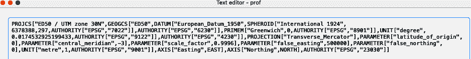

###### 图 9-6\. GDAL 读取的波段的投影

`GetRasterBand` 将波段提取到数据集中。要确定你有多少个波段，写入控制台：

```py
ds.RasterCount
```

这会输出：`1`。

输入波段数到函数中：

```py
band = ds.GetRasterBand(1)

array = band.ReadAsArray()
```

探索数组变量，你会看到 Python 已经将 GDAL 文件读入 NumPY 数组。数组共享我们 DEM 中的高程，如图 9-7 所示。

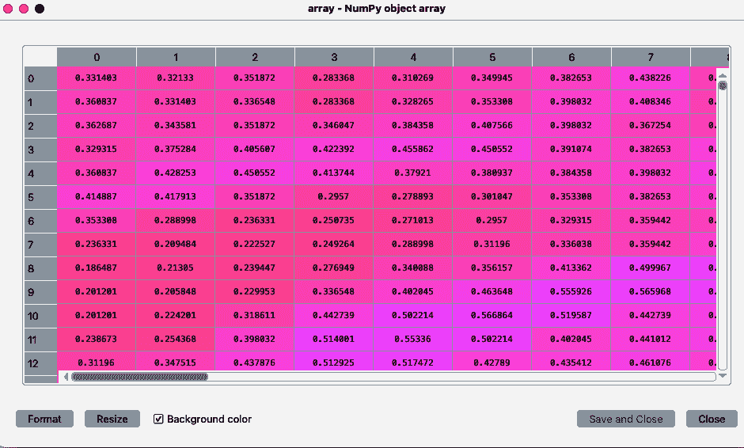

###### 图 9-7\. DEM .tif 文件的 NumPY 对象数组

## 在 GDAL 中使用二进制掩码

*掩模* 对于裁剪边界或值到特定范围非常有用。 *二进制掩模*（通常称为*binmask)* 是一个过滤掉高于或低于某个数字的高度值的工具（例如，如果你只想查看低于海平面的位置）。如果你想保存一切大于或等于平均值的内容，你将把它赋值为 1；否则，它将是 0\. 输出显示在图 9-8 中。暗值处于较低高度。

代码中的 `binmask` 变量指的是基于条件（如 `mean`）返回数组中元素的 NumPy (`np`) 函数：

```py
binmask = np.where((array >=np.mean(array)),1,0)
plt.figure()
plt.imshow(binmask)
```

要将这些数据保存为 GeoTIFF 文件，您将需要一个 GDAL 驱动程序来支持您选择的栅格文件格式。您可以查看不同驱动程序的长列表，包括 GeoTIFF，在[GDAL 文档](https://oreil.ly/MCFi9)中找到。

```py
binmask.shape
```

这输出为（410，601）。

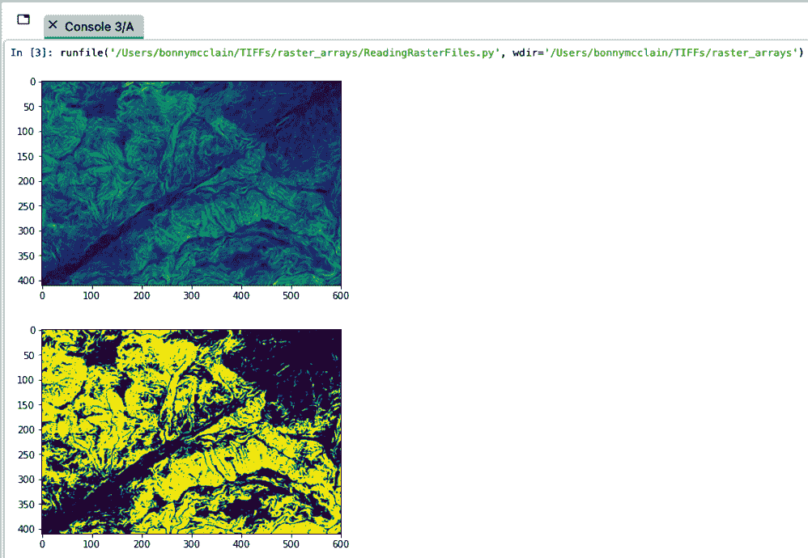

###### 图 9-8\. 二进制掩模输出

回顾如何在 Python 中使用`index`函数。binmask 的形状为 410 行 601 列。在下面的代码片段中，`xsize`指的是列数。您通过索引调用列，在本例中为`[1]`，以获取计数（在本例中为 601）。您可以用`ysize`和索引`[0]`来获取行数（在本例中为 410）：

```py
#Now we want to save as GeoTiff so we need a GDAL driver
driver = gdal.GetDriverByName("GTiff")
driver.Register()
outds = driver.Create("binmask.tif", xsize = binmask.shape[1],
                      ysize = binmask.shape[0], bands =1,
                      eType=gdal.GDT_Int16)
```

`gdalconst`定义了图像中的数据类型。由于您正在使用`0`和`1`定义 binmask 的形状，您需要将值设置为整数，这将使用`gdal.GDT_Int16`完成。现在，您只需要打印数据类型属性。

最后一步是另一个地理转换。由于您没有更改任何内容，设置可以保持不变。一旦关闭文件，它们将可供您使用。如果您忘记了，您将无法使用它们。您也不需要读取数组，因为您还没有将其存储在任何地方。`WriteArray(binmask)`将提供输出：

```py
#need geotransform to be complete
outds.SetGeoTransform(gt)
outds.SetProjection(proj)
outband = outds.GetRasterBand(1)
outband.WriteArray(binmask)
outband.SetNoDataValue(np.nan)
outband.FlushCache()

#close
outband = None
outds = None
```

总结一下，您已经从 DEM 识别并生成了一幅图像，并将输出转换为 GeoTIFF 文件。栅格图像与关于图像在地球表面像素级位置的任何信息或元数据一起保存。

## 完整脚本

这是完整的代码；当您想查看图像时，请取消注释打印选项：

```py
from osgeo import gdal
import numpy as np
import matplotlib.pyplot as plt

ds = gdal.Open("slope.tif")
gt = ds.GetGeoTransform()
proj=ds.GetProjection()
band = ds.GetRasterBand(1)
array = band.ReadAsArray()

#plt.figure()
#plt.imshow(array)

binmask = np.where((array >=np.mean(array)),1,0)
plt.figure()
plt.imshow(binmask)

driver = gdal.GetDriverByName("GTiff")
driver.Register()
outds = driver.Create("binmask.tif", xsize = binmask.shape[1],
                      ysize = binmask.shape[0], bands =1,
                      eType=gdal.GDT_Int16)

outds.SetGeoTransform(gt)
outds.SetProjection(proj)
outband = outds.GetRasterBand(1)
outband.WriteArray(binmask)
outband.SetNoDataValue(np.nan)
outband.FlushCache()

#DON’T FORGET TO CLOSE FILE

outband = None
outds = None

```

# 探索开源栅格文件

开源地理空间社区拥有大量的[公开数据集](https://oreil.ly/GIbyH)，供您继续学习并支持当前和未来的项目。这本书旨在成为一个不断发展的资源，邀请您进行额外的学习和技能发展。因此，在接下来的几节中，我将提供一些基础知识，让您开始探索这些资源，而不是进行完整的练习。目标是让您能够开始自主探索。

## USGS EarthExplorer

美国地质调查局（USGS）托管了最大的免费卫星和航空图像数据库之一，名为 EarthExplorer。

您需要注册一个免费帐户在[EarthExplorer](https://oreil.ly/WvlrA)。如果您有一个包含 shapefile（*.shp*）的压缩 ZIP 文件，您可以使用左上角的 KML/Shapefile 上传按钮上传它。免费的开源数据资源通常提供下载压缩的 shapefile 的选项。必须上传 shapefile 的所有附带文件。

要使用 EarthExplorer，你可以上传一个你想处理的 shapefile。图 9-9 展示了我上传的名为“Bodega 海洋实验室和保护区”的文件。当我在我想查看的区域绘制一个多边形（显示为红色）时，我可以下载 GeoTiff 文件。你可以更改坐标来重新定义多边形的形状。

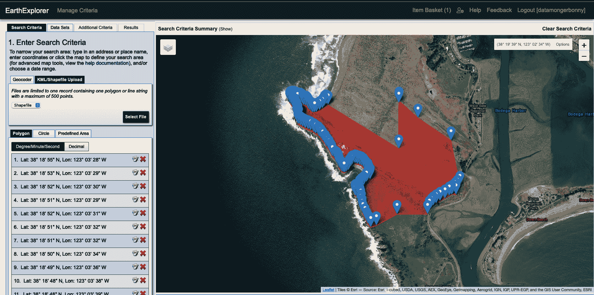

###### 图 9-9\. 上传 shapefile 到 EarthExplorer

除了上传一个 shapefile 外，还有几种创建图像的方式：

+   缩放到你希望探索的区域并绘制多边形或圆圈

+   搜索地址（图 9-10）

+   双击地图并选择使用地图按钮

+   选择一个日期范围

你还可以在菜单中输入日期范围或云覆盖范围，如图 9-10 所示。在这个练习中，使用你选择的方法跟随我来到 Bodega 海洋实验室和保护区。将位置输入到搜索条件中。

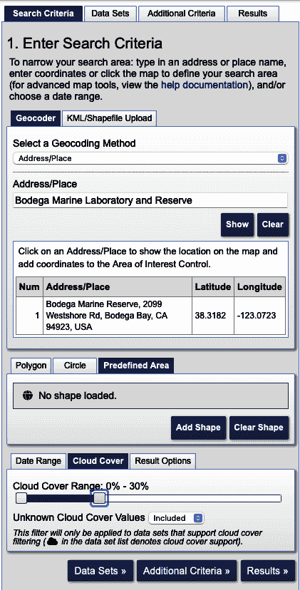

###### 图 9-10\. 搜索感兴趣区域的卫星图像

一旦你到达 Bodega 海洋实验室和保护区，选择数字高程数据，然后选择 SRTM Void Filled，如图 9-11 所示。*SRTM* 是空中雷达地形测量任务的缩写。Void Filled SRTMs 经过额外处理以填补缺失数据。

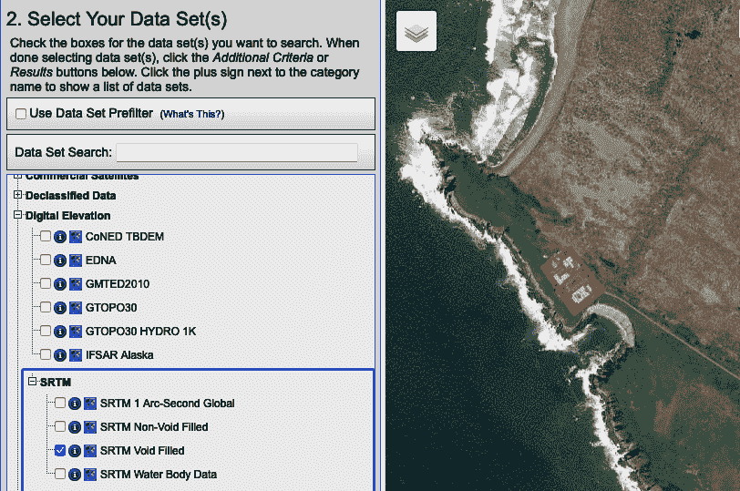

###### 图 9-11\. 地球测量数字高程 SRTM 数据

如果有符合你条件的图像，它们将作为搜索结果加载（图 9-12）。一旦调整了参数，你将看到数据集的缩略图。找到最适合你需求的数据集并下载 GeoTIFF。将其保存到工作目录中的文件夹或使用绝对路径（完整路径）将其上传到 Spyder 控制台中。²

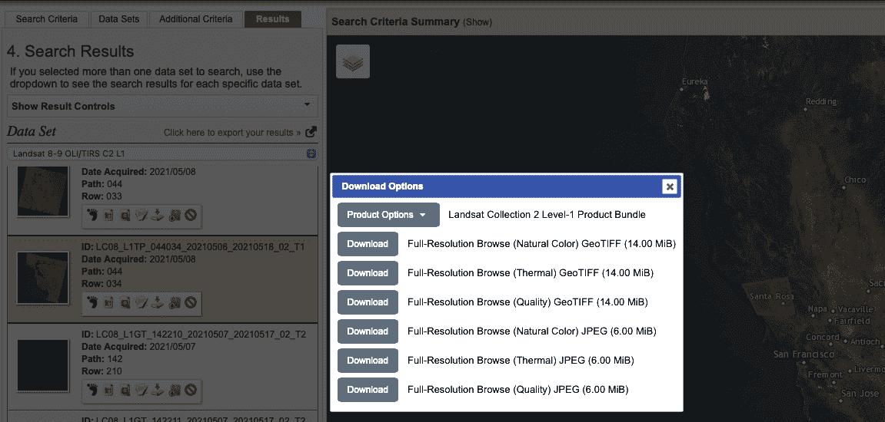

###### 图 9-12\. EarthExplorer 中的搜索结果

## 哥白尼开放获取中心

我要向你展示的下一个数据资源是[哥白尼开放获取中心](https://oreil.ly/WR178)。你可以通过仪表板中的设置来访问它，类似于你访问 EarthExplorer 的方式。虽然哥白尼的界面可能不如 EarthExplorer 直观，但它提供了一些很棒的数据。尝试搜索 Sentinel 卫星数据（图 9-13）。

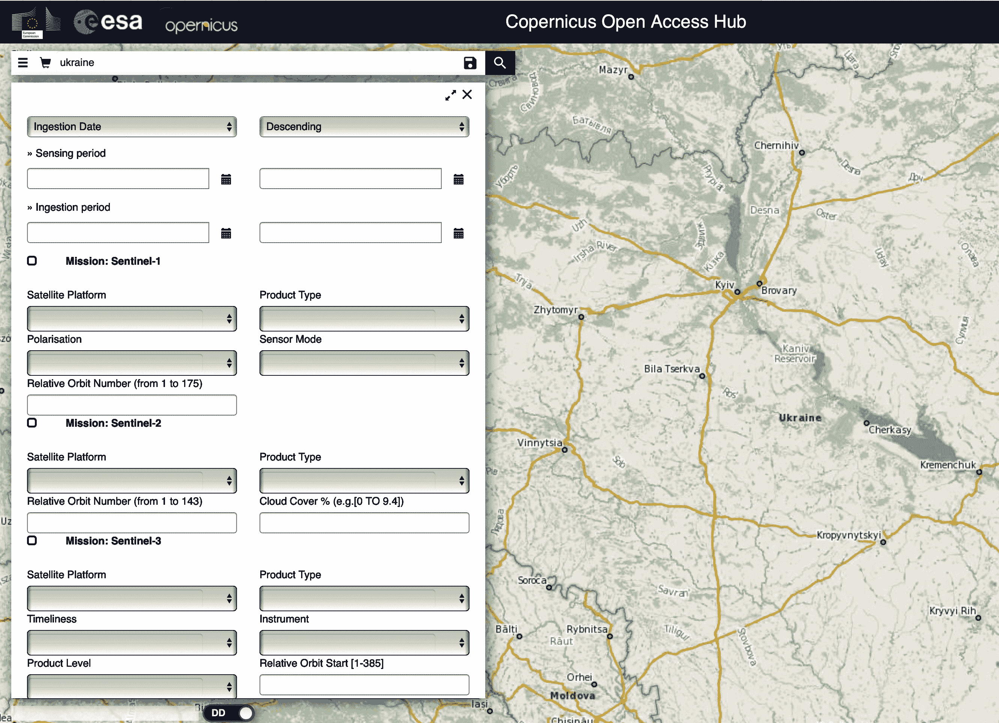

###### 图 9-13\. 哥白尼开放获取中心 Sentinel 数据

## 谷歌地球引擎

你在第八章中学习了 GEE，所以这里我只简要提一下如何与 GDAL 结合使用它。GEE 数据以全球范围在云端提供，因此无需下载。你甚至可以使用诸如裁剪卫星数据之类的函数。

运行搜索 GEE DEM 文件。找到 Earth Engine 代码片段 *ee.Image(“USGS/sDEP/10m”)*，如 图 9-14 所示。您可以复制 JavaScript 代码并粘贴到 GEE 控制台中。

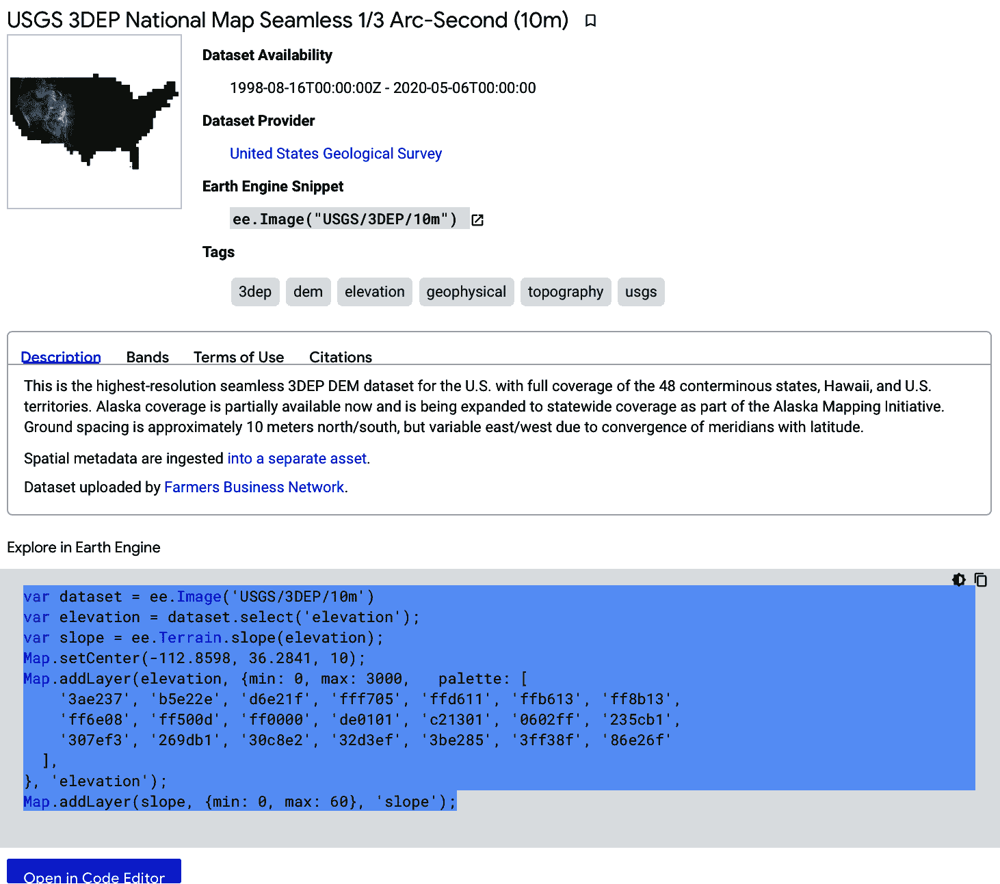

###### 图 9-14\. GEE DEM 文件目录

在 GEE 控制台中，选择运行。这将生成图中显示的地图（见 图 9-15）。您可以选择一个多边形并创建几何导入。图层面板允许您更改图层的不透明度或切换图层的显示和隐藏。只需将文件保存为 GeoTIFF，您就有了另一个 DEM 文件选项。

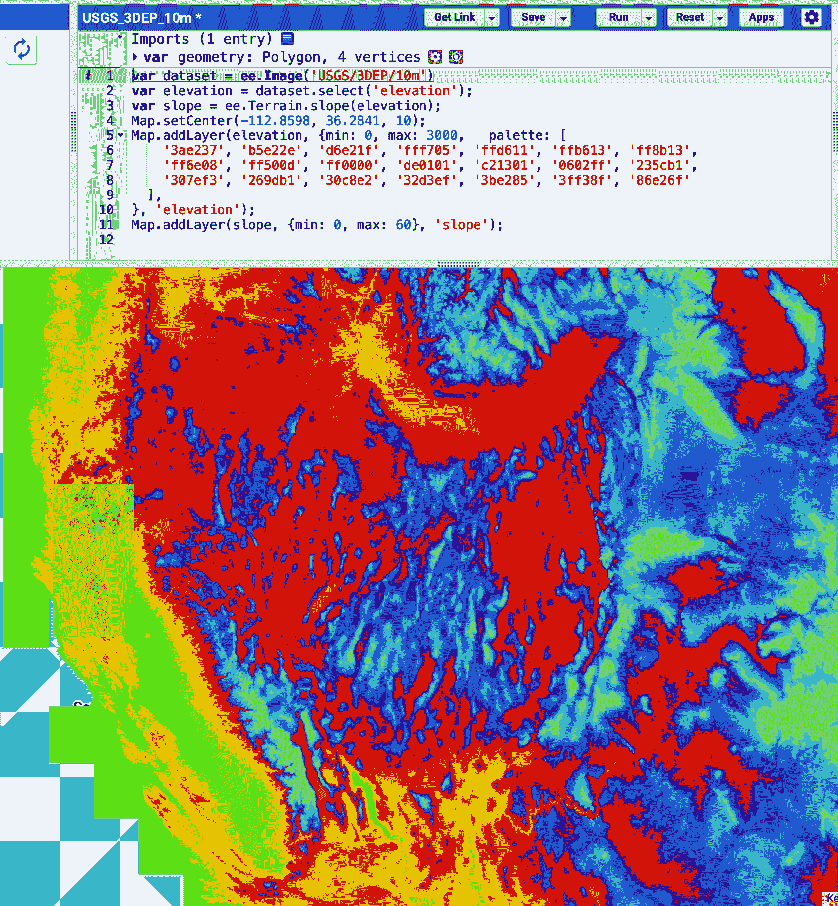

###### 图 9-15\. Google Earth Engine DEM .tif 文件

GDAL 可能很复杂，但学习如何使用这个资源库来扩展您的地理空间技能是值得的。

# 总结

您已经了解了如何在终端和集成开发环境中工作，这两者都根据个人喜好具有各自的用途和通常的可访问性。这些技能突显了这两个选项的效用，以及跨平台应用程序中企业（Esri）和开源社区依赖的强大界面。

在处理地理空间数据和广泛的可用工具时，特别是在开源社区中，重要的是阅读用户文档，以提升您的技能和与数据交互的能力。不要犹豫，如果有问题或见解，请向社区寻求帮助。

¹ 您可能还记得 *绑定* 是连接两种编程语言的库，使得一个语言编写的库可以在另一种语言中使用。

² *相对文件路径* 是相对于您当前工作目录的路径；*绝对文件路径* 是从根目录提供的路径。
