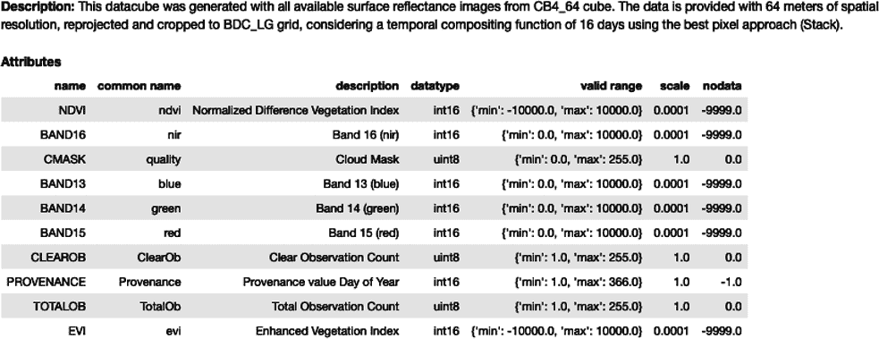

# 第十章：使用 Python 测量气候数据

开发技术技能和学习 Python 和地理空间分析的途径很重要，但除非提供上下文或创建共享叙述，否则这只是架上的数据。

在本章中，您将探索三种探索时间序列数据的方法，通过访问来自[Landsat](https://oreil.ly/9bHFj)、[中巴地球资源卫星（CBERS）](https://oreil.ly/PM7Lt)和[哨兵](https://oreil.ly/1Kym6)的卫星图像层。您将利用您的地理空间分析技能来研究关于气候变化和森林砍伐的问题。

空间建模是预测、预测和监测全球温度增加和森林砍伐实时状态的关键工具，从而帮助我们预测这些现象可能带来的后果，并可能干预或为其做好准备。

展示了三个示例，以突出一些强大的 Python 包：Xarray、Web 时间序列服务（WTSS）和森林危险（FAR）。虽然这些工具可能看起来是新的，但在早期章节中已经介绍了它们的许多依赖项。最后一个示例深入探讨了用于预测建模的包的统计能力，这将在分析森林砍伐时使用。您可以在[附带的笔记本](https://oreil.ly/9ADWy)中运行代码，因为本书的范围无法完全解释其中的所有内容。

# 示例 1：使用降水数据检查气候预测

空间分析通常依赖于多维数据分析。将网格化数据集想象为一个立方体。在 Python（以及计算机编程一般情况下），数组存储数据列表。列表中的对象可以单独或集体引用。这在调用 Python 数组时很重要，因为可以通过索引号访问每个项目。

NumPy 的多维和 N 维数组，或称为*tensor*，显示在 NumPy 的 ndarrays 中。将张量视为数据或信息的容器。在 Python 中，[NumPy](http://www.numpy.org)提供了用于处理原始 ndarrays 的基本数据结构和 API。

您将使用真实世界的数据集，这些数据集编码了有关数组值如何映射到位置的信息。您处理的数据带有时间戳、坐标、海拔、土地覆盖和降水等编码信息。

## 目标

美国政府的[国家海洋和大气管理局（NOAA）](https://oreil.ly/NKI29)的使命是“预测气候、天气、海洋和海岸的变化”，并通知和应对极端天气事件带来的紧急社会和环境影响。在这个练习中，您将使用公开可用的数据集来分析每日降水量。比较 2015 年和 2021 年美国大陆的数据，您将观察数据中的模式，以确定是否存在明显的可观察差异。

首先，我将向您介绍 Xarray，这是一个与 NumPy、SciPy 和 matplotlib 互操作的开源项目，扩展了 NumPy ndarrays 和 pandas 数据帧之外的功能。

与前几章一样，在您完成对一个包及其支持文档的介绍后，我强烈建议您尝试不同数据集和 Python 包和库的应用。

## 下载您的数据

首先，导航到 [网格化气候数据集：降水](https://oreil.ly/NhTn2) 并选择 Climate Prediction Center (CPC) 的 [全球降水数据集](https://oreil.ly/M8ynH)。返回给定经度/纬度的天气数据，与请求的经度/纬度对齐的网格单元。

下载感兴趣的年份，2015 年和 2021 年，并将文件上传到您的 Google 云硬盘或直接上传到您的计算机。图 10-1 显示了文件夹和文件层次结构。


###### 图 10-1\. Google Colab 中的文件

## 在 Xarray 中工作

Xarray 是一个 Python 库，托管了许多您现在应该熟悉的依赖项，如 NumPy 和 pandas，以及一些您需要处理 CPC 全球降水数据集的可选依赖项。最初由 Climate Corporation 开发，[Xarray](https://oreil.ly/NjJmL) 已成为用于分析气候变化数据文件以进行绘图和分析的有用开源资源。它对于探索天气、水文和气候极端及其影响非常有用。

美国国家海洋和大气管理局物理科学实验室依赖于 Xarray 的 Network Common Data Form（netCDF）格式，这是一个基于 NumPy 数组的数组导向数据接口，包含维度、变量和属性。这些维度通常是时间和纬度或经度，因此该格式直接适用于空间观测和分析。

您将下载每日降水数据并对其应用函数，包括 `groupby`（用于分组）、`concat`（用于合并文件，也称为*串联*）和 `sel & isel`（用于选择特定日期或特定位置的数据）。此外，您还将学习如何处理闰年。您将将所需输出保存为 netCDF 文件。

*网格化数据*将点数据（如来自个别气象站的数据）与其他数据源结合起来，保持空间和时间上的一致性方法，以考虑因位置或海拔引起的温度变化和降水等因素。天气数据来自包含超过 2,500 个月度网格化数据点的数据分布，代表了整个地球。

Xarray 的数据结构是 *N 维* 的，这意味着它们具有可变数量的维度。这使得 Xarray 适合处理多维科学数据。由于它使用维度名称而不是轴标签（`dim='time'` 而不是轴=0），这些数组比 NumPy ndarrays 更易管理。使用 Xarray，您无需跟踪维度的顺序或插入大小为 1 的占位维度来对齐数组。

您将使用几个可用函数来分析地理空间数据。运行 `open_mfdataset` 可以一次打开多个文件。您将使用这个功能来比较不同的时间点。您将在 [Google Colab](https://oreil.ly/J8wam) 中运行这些示例。我总是连接到我的谷歌云端硬盘，因为我将大部分数据集存储在云上，而不是本地计算机上。将您的驱动器连接到 Colab 并选择您托管数据集的目录非常简单：

```py
from google.colab import drive
drive.mount('/content/drive')
```

###### 提示

不是每个人都有谷歌云端硬盘。您也可以通过将数据简单上传到谷歌 Colab 来访问数据。我实际上升级到了谷歌 Colab Pro 以提高运行时性能。通常连接到您的谷歌云端硬盘是最佳选择，但效果可能因人而异。

您将需要通过选择和批准来建立连接。挂载驱动器会花费一些时间，但之后文件将显示在您的可用文件中。

谷歌 Colab 预装了 Xarray 的版本，但我建议使用 `pip install` 确保所有依赖项都包含在内：

```py
!pip install xarray[complete]
```

我习惯于单独运行安装，但捆绑导入功能；这样可以隔离并解决任何错误。

让我们来看看您将要导入的较不熟悉的模块。`glob` 模块（全局模块的简称）返回您指定的文件或文件夹。这也适用于目录/文件内的路径和子目录/子文件。您应该认识 matplotlib 作为我们的绘图库，基于 NumPy 构建，以及 `urllib.request` 作为用于检索 URL 的模块。您可以下载数据以上传到 Colab，或者如果您的数据以 URL 形式可用，则将其导入到您的代码中：

```py
import glob
import matplotlib.pyplot as plt
**import** urllib.request
import xarray as xr
```

## 结合您的 2015 和 2021 年数据集

Xarray 数据集是带有标签数组的容器。它类似于数据框架，但是它是多维的，并与 netCDF 数据集表示相对应，如 图 10-2 所示。


###### 图 10-2\. NetCDF 数据数组

输入代码以创建您的两个变量，`ds2015` 用于 2015 年和 `ds2021` 用于 2021 年：

```py
ds2015 = xr.open_dataset('/content/precip.V1.0.2015.nc')

ds2021 = xr.open_dataset('/content/precip.V1.0.2021.nc')
```

图 10-3 显示了 Xarray 数据集的关键属性，包括维度、坐标、数据变量和属性。


###### 图 10-3\. Xarray 数据集的属性

单击数据库图标（看起来像堆叠的光盘）以查看更多详细信息。您将看到单元格展开，如 图 10-4 所示。扩展的元数据显示了数组和其他信息。

接下来，您将会沿 `time` 维度进行 [连接](https://oreil.ly/E60L2) （合并）Xarray 对象。

```py
ds2015_2021 = xr.concat([ds2015,ds2021], dim='time')
ds2015_2021
```


###### 图 10-4\. 扩展数据集详细信息

输出（图 10-5）将确认数据集已被合并。时间坐标现在列出了您选择的两个年份。


###### 图 10-5\. 时间坐标串联

函数 `dataarray.groupby` 返回一个用于分组操作的对象。您将按月份 (`time.month` 在代码中) 进行分组操作。有一个跨越几年的每日数据集的 `dataarray` 对象。该对象有一个变量和三个维度：纬度、经度和时间（每日）。您可以为 2015 年和 2021 年生成一个图形（图 10-6）。


###### 图 10-6\. 2015 年美国大陆月降水量（左）和 2021 年（右）

## 生成图像

要生成 2015 年图像的绘图，请在第一个项（`0`）处指定下限，使用默认的上限和步长。月降水量是一个要切片的对象，如 `mon.precip` 所示。我们正在跨三个维度进行操作：

```py
ds2015_mon = ds2015.groupby('time.month').sum()
ds2015_mon.precip[0,:,:].plot(cmap='jet', vmax=300)
```

您可以使用相同的方法生成 2021 年的地图。两者的输出在 图 10-6 中，可以看到不同的降水模式。

让我们扩展到单个月份以比较不同年份。Python 有一个日历模块，用于显示整个年份进行比较。使用 matplotlib 和 `calendar` 模块迭代每个月份的代码如下：

```py
import calendar
```

现在，您将沿 `time` 维度应用总和。您正在创建的 landmask 将“掩盖”某些观测而不是返回 NaN 值：

```py
landmask = ds2015.precip.sum(dim='time')>0
```

Matplotlib 允许您格式化和绘制一系列地图。这些参数有默认值，但当您想要自定义它们时，可以为图像提供宽度和高度（`figsize`），以及背景颜色（`facecolor`）。参数 `subplots_adjust` 允许您调整子图或坐标轴的位置。首先我们来处理 2015 年：

```py
fig = plt.figure(figsize=[12,8], facecolor='w')
plt.subplots_adjust(bottom=0.15, top=0.96, left=0.04, right=0.99,
                   wspace=0.2, hspace=0.27)
nrows = 3
ncols = 4
for i in range(1, 13):
#the python data index starts at 0, but the subplot starts at 1\.  
plt.subplot(nrows, ncols, i)
   dataplot = ds2015_mon.precip[i-1, :].where(landmask)
   p = plt.pcolormesh(ds2015_mon.lon, ds2015_mon.lat, dataplot,
                  vmax = 400, vmin = 0, cmap = 'nipy_spectral_r',
                  )
   plt.xlim([233,295])
   plt.ylim([25,50])
   plt.title(calendar.month_name[dataplot.month.values], fontsize = 13,
             fontweight = 'bold', color = 'b')
   plt.xticks(fontsize = 11)
   plt.yticks(fontsize = 11)
   if i % ncols == 1: # Add ylabel for the very left subplots
       plt.ylabel('Latitude', fontsize = 11, fontweight = 'bold')
   if i > ncols*(nrows-1): # Add xlabel for the bottom row subplots
       plt.xlabel('Longitude', fontsize = 11, fontweight = 'bold')

# Add a colorbar at the bottom:
cax = fig.add_axes([0.25, 0.06, 0.5, 0.018])
cb = plt.colorbar(cax=cax, orientation='horizontal', extend = 'max',)
cb.ax.tick_params(labelsize=11)
cb.set_label(label='Precipitation (mm)', color = 'k', size=14)

# Now we can save a high resolution (300dpi) version of the figure:
plt.savefig('Fig_prec_cpc_mon_2015.png', format = 'png', dpi = 300)
```

尝试不同的值以查看图像如何变化。通过调整宽度空间 (`wspace`) 或高度空间 (`hspace`) 来微调子图的边缘。

您可以在 [matplotlib 使用指南](https://oreil.ly/7Nrc9) 中探索不同的绘图类型。输出显示在 图 10-7 中。


###### 图 10-7\. 2015 年美国大陆每月的年降水量，使用 Xarray

接下来，更新代码单元以运行 2021 年的数据（图 10-8），并直观地比较两年间降水量的差异。


###### 图 10-8\. 2021 年的年降水量

## 更多探索

如果你想看到图像下的数据，还有其他查询可以尝试。例如，`ds2021.precip.dims` 将列出数据的维度，`ds2021.precip.attrs` 将列出属性，而 `ds2021.precip.data` 将显示每日降水量。

如果按季节分组降水数据可能会更有意义，所以让我们试一试：

```py
ds2021.groupby("time.season")
DatasetGroupBy, grouped over 'season'
4 groups with labels 'DJF', 'JJA', 'MAM', 'SON'.
```

季节以包含的月份命名：`DJF` 表示冬季，`JJA` 表示夏季，`MAM` 表示春季，`SON` 表示秋季。让我们按直觉的方式对它们进行排序：

```py
seasonal_mean = seasonal_mean.reindex(season=["DJF", "MAM", "JJA", "SON"])
seasonal_mean
```

季节现在按照它们在一年中的顺序显示。可视化降水水平使您能够观察降水如何因季节和位置的不同而变化（图 10-9）。


###### 图 10-9\. 按季节排列的平均降水量

降水水平的观察显示数据中的模式。你可能已经注意到温度数据集也以网格格式提供。现在您已经了解了 Xarray 及其如何处理多维数组，尝试探索最高温度、最低温度和平均温度，以扩展您的见解。通过绘制这些数据，您可以学到什么？

# 示例 2：使用 WTSS 系列探索亚马逊雨林的砍伐和碳排放

亚马逊雨林正在缩小。森林中的道路建设，人类与动物的接触，以及游客与居住在雨林中的土著人之间的接触都导致持续的森林砍伐和森林退化。*退化* 指的是森林密度下降，虽然未达到砍伐的程度，但通常在 10%到 30%之间，并且土地正在转为替代用途，如木材采伐或农业。当森林覆盖受到干扰时，*生物多样性*——亚马逊独有的生物和生态系统混合——受到威胁。砍伐也对碳排放产生影响。

Web 时间序列服务（WTSS）是一个处理遥感图像采集的时间序列数据的网络服务。^(1) 你将再次使用一个具有空间（纬度和经度）和时间参考的三维数组。WTSS 是一个 Python 客户端库，因此你可以获取特定位置随时间记录的实际数值列表。

## 设置

在本练习中，你将探索巴西国家空间研究院（INPE）的研究项目数据，[巴西数据立方体（BDC）](https://oreil.ly/wZ1DD)。这个数据立方体是从 CBERS-4 和 Advanced Wide Field Imager（AWFI）的表面反射数据中得出的时间合成图像，AWFI 是一种捕捉高分辨率陆地和植被图像的仪器。

### 获取数据

首先在网站上注册。你需要创建一个个人资料，然后在菜单中生成并保存访问令牌，如图 10-10 所示。


###### 图 10-10\. BDC 访问令牌

BDC 项目收集了土地覆盖的持续数据（例如图 10-11 中的示例）。^(2) 为了识别感兴趣的区域，选择 CBERS-4-AWFI 立方体堆栈中的 CBB4_64_16D_STK-1 集合。信息图标（“i”）将提供背景信息。


###### 图 10-11\. 巴西数据立方体

通过计算你在第六章学到的 NDVI 来调查亚马逊植被密度是否随时间变化。回想一下，NDVI 计算近红外（被植被反射）和红光（被植被吸收）之间的差异。这些波段突出了有植被的区域，使你能观察到植被生长的密度。你将选择亚马逊雨林内一个植被密集区域的位置。输入坐标：纬度 = –16.350000，经度 = –56.666668。

###### 小贴士

在完成本练习后，你可以自行探索 BDC。尝试输入你自己选择的纬度和经度坐标。作为另一种选择，你还可以使用边界框（bbox）信息来定位感兴趣的区域。

### 创建你的环境

打开一个 Jupyter Notebook 并使用`pip install`安装库。（我知道，我知道 —— 通常我推荐使用 Conda 安装，但 WTSS 只稳定支持 pip。我们经常需要做出调整！）

```py
!pip install wtss
from wtss import WTSS
```

要访问 WTSS，请使用以下代码中的链接和创建账户时生成的 BDC 访问令牌：

```py
service = WTSS('https://brazildatacube.dpi.inpe.br/', 
    access_token='Your access token')
```

接下来运行：

```py
service.coverages
```

这将输出链接中可用的服务列表：

```py
['LANDSAT-MOZ_30_1M_STK-1',
 'MOD13Q1-6',
 'LC8_30_6M_MEDSTK-1',
 'MYD13Q1-6',
 'S2-SEN2COR_10_16D_STK-1',
 'CB4_64_16D_STK-1',
 'LC8_30_16D_STK-1',
 'CB4MUX_20_1M_STK-1']
```

## 创建你的地图

选择 CBERS 覆盖在代码单元格中：

```py
cbers4_coverage = service['CB4_64_16D_STK-1']
cbers4_coverage
```

输出(图 10-12)提供了 CB4_64 立方体的属性。



###### 图 10-12\. CB4_64 带有描述的数据立方体

注意，当你分配变量时，要使用表中的名称*完全*如其所示。我们对近红外和红波段感兴趣，所以让我们为它们分配变量：

```py
red_band = 'BAND15'
nir_band = 'BAND16'
```

使用`ts`方法检索所列位置和日期的时间序列数据：

```py
time_series = cbers4_coverage.ts(attributes=(red_band, nir_band),
                                 latitude=-16.350000,
                                 longitude= -56.666668 ,
                                 start_date="2016-01-01",
                                 end_date="2022-03-21")
```

使用`plot`方法绘制时间序列的静态可视化图：

```py
time_series.plot()
```

输出显示在图 10-13 中。


###### 图 10-13\. CB4_64_16D_STK-1 数据立方体时间序列的静态可视化

## 分析

如您在图 10-13 中所见，亚马逊雨林此区域的 NDVI 在 2016 年至 2022 年间呈上升趋势。这可能表明大气二氧化碳（CO[2]）水平增加，尽管降水和温度更重要，用于解释年际 NDVI 变异性。确实，生态系统模型表明，由于二氧化碳施肥效应，表现为近几十年来植物生长的季节振幅增加，大气 CO[2]浓度增加的观察主要归因于 CO[2]施肥效应，而气候和土地利用变化则起次要作用。基于这些数据，我们无法做出任何明确的声明，但捕获地表反射率并观测 NDVI 有助于提出假设。^(3)

## 优化

让我们看看改进地图的几种方法。

### 使您的地图交互式

接下来，请尝试使用 pandas 数据框创建交互式展示您的发现：

```py
cbers_df = pd.DataFrame({ 'BAND15': time_series.BAND15, 
'BAND16': time_series.BAND16 }, 
                        index = pd.to_datetime(time_series.timeline))
cbers_df
```

您可以在笔记本中悬停以观看信息显示（图 10-14）。选择不同的波段和不同年份以获取更多信息。


###### 图 10-14\. CBERS-4 交互图形

`px.line()`调用 plotly 函数。`dataframe`参数允许您绘制数据。`x`参数指定*x*轴的变量，`y`参数做同样的事情。标题也有详细描述：

```py
fig = px.line(cbers_df, x=cbers_df.index, y=['BAND15', 'BAND16'], 
title='CBERS-4/AWFI (BAND 15 and 16)', labels={
    'index': 'Date',
    'value': 'Spectral Reflectance (scaled)'
})

fig.update_xaxes(rangeslider_visible=True)
fig.show()
```

### 使用遮罩减少云层覆盖

时间序列观测的卫星图像通常显示出由云层引起的噪音或扭曲，这会改变被分析地区的光谱行为。云层及其阴影可能降低反射率。

*插值*是替换被云层扭曲的像素值或点的一种方式。插值过程在已知数据点的离散值范围内构建新的数据点。数据立方体包含*掩码*，逐像素捕捉云层的影响。

###### 小贴士

Jupyter Notebook 包含使用 BDC 进行遮罩和插值的额外练习。

遥感技术依赖于云层遮罩来处理数据图像，并提高其质量。通过分析遮罩中的云百分比，云层掩码可以让用户识别有云和无云的像素。

此部分中的代码将首先检测云层，然后获取一个遮罩以“隐藏”任何低质量数据，以防止它影响结果。

运行代码时，它将输出元数据，其中包含三个值中的一个：

+   值为`0`表示像素不包含数据。

+   值为`127`表示像素清晰，没有云层。

+   值为`255`表示像素被云层遮挡。

让我们看一个稍微不同的位置：

```py
cb4_timeseries_cmask = cbers4_coverage.ts(

    attributes = ('CMASK'),

    latitude = -12.0,
    longitude = -53.989,

    start_date = "2017-01-01",
    end_date = "2021-12-31"
)

cb4_timeseries_cmask
```

这将给出输出：

```py
CMASK: [127.0, 127.0, 127.0, 127.0, 127.0, 127.0, 127.0, 127.0, 127.0, 127.0, 
127.0, 127.0, 127.0, 127.0, 127.0, 127.0, 127.0, 127.0, 127.0, 127.0, 127.0, 
127.0, 127.0, 255.0, 127.0, 127.0, 127.0, 255.0, 127.0, 127.0, 127.0, 127.0, 
127.0, 127.0, 127.0, 127.0, 127.0, 127.0, 127.0, 127.0, 127.0, 127.0, 127.0, 
127.0, 127.0, 127.0, 127.0, 127.0, 127.0, 127.0, 127.0, 127.0, 127.0, 127.0, 
127.0, 127.0, 127.0, 127.0, 127.0, 127.0, 127.0, 127.0, 127.0, 127.0, 127.0, 
127.0, 127.0, 127.0, 127.0, 127.0, 127.0, 127.0, 255.0, 127.0, 127.0, 127.0, 
127.0, 127.0, 127.0, 127.0, 127.0, 127.0, 127.0, 127.0, 127.0, 127.0, 127.0, 
127.0, 127.0, 127.0, 127.0, 127.0, 127.0, 127.0, 127.0, 127.0, 255.0]
```

你可以看到大多数像素是清晰的，但少数云观测记录值为`255.0`。`set` 函数也显示了这些值：

```py
set(cb4_timeseries_cmask.values('CMASK'))
```

输出是 `{127.0, 255.0}`。

以下代码将显示所选时间范围内的云观测：

```py
cb4_timeseries = cbers4_coverage.ts(

    attributes = ('NDVI', 'CMASK'),

    latitude = -12.0,
    longitude = -53.989,

    start_date = "2017-01-01",
    end_date = "2019-12-31"

)
```

时间线数据存储为日期列表，但你需要将其转换为 `datetime` 对象。为此，请运行以下代码：

```py
ndvi_timeline = pd.to_datetime(cb4_timeseries.timeline)
ndvi_timeline
```

现在，你将把转换后的数据存储在变量 `ndvi_data` 和 `cmask_data` 中：

```py
import numpy as np

ndvi_data = np.array(cb4_timeseries.NDVI)
ndvi_data

cmask_data = np.array(cb4_timeseries.CMASK)
cmask_data
```

下一步是去除云层。 NumPy 数组（`np`）将所有`127`值（无云）转换为`1`，`255`（多云）的值现在显示为 NaN（非数值）：

```py
cmask_data = np.where(cmask_data == 255, np.nan, 1)
cmask_data
```

现在将 NaN 值乘以 NDVI 数组以插值时间序列数据：

```py
ndvi_data * cmask_data
```

这为 NaN 值创建了一个新的数据框：

```py
ndvi_masked_data = pd.DataFrame({ 'data': ndvi_data * cmask_data }, 
index = pd.to_datetime(ndvi_timeline))
ndvi_masked_data[ndvi_masked_data['data'].isna()]
```

确实，当你运行代码时，它们会出现在输出中（Table 10-1）。

表 10-1\. 插值云掩模数据中的 NaN 值

| 2018-01-01 | NaN |
| --- | --- |
| 2018-03-06 | NaN |
| 2020-02-18 | NaN |
| 2021-03-06 | NaN |

现在我们可以提取所有 NaN 数据并查看插值数据：

```py
ndvi_masked_data_interpolated = ndvi_masked_data.interpolate()
ndvi_masked_data_interpolated[ndvi_masked_data_interpolated['data'].isna()]
```

让我们可视化插值数据！运行这段代码：

```py
plt.figure(dpi = 120)

plt.plot(ndvi_data, color='gray', linestyle='dashed', label = 'Original')
plt.plot(ndvi_masked_data_interpolated['data'].values, color='blue', 
label = 'Interpolated')

plt.title('Comparison of Time Series with and without interpolation')
plt.legend()
plt.grid(True)
plt.show()
```

你的输出应该类似于 Figure 10-15。去除云观测可以清晰地显示像素和表面反射率的无遮挡值，更准确地描绘植被密度。


###### 图 10-15\. 插值后时间序列数据的比较

这个练习向你展示了如何使用 WTSS 访问和分析远程感知数据，使用 Python 和 API，并向你介绍了 BDC 资源。你也看到，数据分析不仅仅是支持你的论点；事实上，使用这些工具探索数据可以成为 *生成* 假设过程的重要组成部分，并可能引导你的调查走向新的和意想不到的地方。

# 示例 3：使用 Forest at Risk 对瓜德罗普岛进行砍伐建模和预测

除了建模森林破坏的空间概率的益处外，本节还是建模大型地理参考栅格文件的一个很好的例子。我们将使用一个分析森林破坏的 Python 包：[Forest at Risk (FAR)](https://oreil.ly/2MLdk)。这个包中的函数处理大规模地理尺度上模拟的数据块，并以高分辨率展示。

研究区域是瓜德罗普岛，这是法国的一个群岛和海外省份，位于东加勒比海。根据全球森林观察，仅在 2021 年，瓜德罗普的湿润原始森林就失去了超过 240 英亩。树木覆盖损失导致约 1.07 公吨（2358.95 磅）CO[2]的排放。

使用 FAR 的目标是对瓜德罗普的森林破坏进行空间建模，基于一组变量预测森林破坏的风险，并预测未来的森林密度。您将使用的空间变量包括地形（海拔、坡度和坡向）、可访问性（距离道路、城镇和森林边缘的距离）、以及距离先前的砍伐区域或受保护区的距离。

具有`.predict()`方法的任何统计模型类都可以与函数`forestatrisk.predict_raster()`一起用于预测森林破坏的空间风险。使用 NumPy 和 GDAL 在数组上执行计算可以提高效率，而无需高计算能力。您将使用这些数据定义地理区域，并测量森林砍伐、森林退化和森林再生。让我们看看是否可以依赖于地理空间工具来可视化表面反射变化和底层树木覆盖的变化。

我们将使用欧洲委员会联合研究中心的国际森林资源和碳排放（IFORCE）数据，该中心负责提供独立的科学技术支持。该数据测量了热带湿润森林（TMF）中的 Landsat 时间序列森林覆盖变化。它收集了 30 年来从赤道向远离赤道的季节性雨林的数据，从 1990 年到 2020 年。

## 设置

尽管在此示例中我使用 Google Colab 工作，但在可复制性方面存在挑战，我发现创建 Conda 环境是一个更稳定的选择。图 10-16 中的仪表板显示的输出文件不会自动显示在您的笔记本中。您可以从 Colab 的文件层次结构或您的 Jupyter Notebook 文件结构中选择它们。


###### 图 10-16\. 在 Google Colab Pro 中打开 FAR 数据集

根据您的个人设置，Google Colab 通常运行良好。我默认使用 Colab 进行指导，因为它在突出显示您的 Google Drive 内的文件夹结构（或者如果您选择上传文件，则在导入路径中）方面非常简单。有时您可能无法使其正常工作。在这些情况下，我发现在终端中创建环境是解决方案。

### 创建您的环境

我正在使用 Python 3.10，在本文写作时它是当前版本，但在运行以下代码时，您将输入您自己的版本。一切应该工作正常，但请注意，当您构建环境并调整版本时，细节可能需要稍微调整。（在 Python 旅程中，您已经足够熟悉其中一些选项，但如果需要提醒，请返回前言部分。）

现在您可以使用 Conda 创建您的环境：

```py
conda create --name conda-far -c conda-forge python=3.7 gdal numpy matplotlib 
pandas patsy pip statsmodels earthengine-api --yes
conda activate conda-far
pip install pywdpa sklearn # Packages not available with conda
pip install forestatrisk # For PyPI version
conda install -c conda-forge python-dotenv rclone
```

###### 提示

如果您收到一个错误消息，指出未识别到 forestatrisk，则可以在终端内的 FAR 环境中创建一个内核：

```py
conda install ipykernel
```

```py
python -m ipykernel install --user --name myenv 
--display-name "FAR"
```

输入 `**jupyter notebook**` 并选择 FAR 内核。现在应该可以运行您的程序包了。

### 下载和导入包

导入必要的文件和包是第一步。 `os` 模块允许您与操作系统上的文件夹交互。shutil 和 copy2 包保留您导入的文件的元数据，包括权限。（在 MacOS 上工作时存在一些限制，请参阅[Python 文档](https://oreil.ly/cJTAA)。）urllib 包收集了几个用于打开和读取 URL 的模块。您还将使用 ZIP 文件，并且 `ZipFile` 模块提供了必要的工具。

继续导入您的包：

```py
# Imports
import os
from shutil import copy2
import urllib.request
from zipfile import ZipFile

import forestatrisk as far

import numpy as np
import matplotlib.pyplot as plt
import pandas as pd
from patsy import dmatrices
import pickle
from sklearn.linear_model import LogisticRegression
from sklearn.ensemble import RandomForestClassifier
from sklearn.metrics import log_loss
```

### 下载和导入数据

接下来，您将创建一个输出目录，在笔记本环境中特别方便。运行脚本时，生成的输出文件将位于指定位置，包括您生成的图像：

```py
# Make output directory
far.make_dir("output")
```

ZIP 文件 *data_GLP.zip* 位于以下代码块中的链接处，`z.extractall` 将文件解压缩到您的 Colab 或 Jupyter Notebook 目录中，如图 10-13 所示：

```py
# Source of the data
url = "https://github.com/ghislainv/forestatrisk/raw/master/docsrc/notebooks/
data_GLP.zip"

if os.path.exists("data_GLP.zip") is False:
    urllib.request.urlretrieve(url, "data_GLP.zip")

with ZipFile**(**"data_GLP.zip", "r") as z**:**
    z.extractall("data")
```

*.zip* 文件包含跨时间跨度的环境变量和地图的选择：这是您在 FAR 教程的简要演练中所需的所有数据，您将在其中对特定地理位置的森林砍伐的空间概率进行建模。

当您[下载数据](https://oreil.ly/lkzTB)时，请花些时间探索关于 [IFORCE](https://oreil.ly/wtHAi) 站点的符号学、值和标签的详细信息。

## 绘制数据

运行以下代码以绘制数据：

```py
# Plot forest
fig_fcc23 = far.plot.fcc(
    input_fcc_raster="data/fcc23.tif",
    maxpixels=1e8,
    output_file="output/fcc23.png",
    borders="data/ctry_PROJ.shp",
    linewidth=0.3, dpi=500)
```

运行代码单元格时，此代码将生成一个地图作为输出，但不会自动填充到笔记本中。要在 Google Colab 中找到输出文件，请使用仪表板导航到您的输出文件夹的文件层次结构。在 Jupyter Notebook 中，查看位于左上角标签页中的文件列表（图 10-17）。您下载的数据文件也将可见。


###### 图 10-17\. 在 Jupyter Notebook 文件结构中定位您的输出

当您绘制数据（图 10-18）时，森林显示为绿色，而砍伐区域显示为红色。您能看到砍伐更可能发生的周边吗？


###### 图 10-18\. 在瓜德罗普岛上以 GeoTiff 栅格文件形式绘制的 FAR 数据，展示了森林覆盖变化

## 数据采样

接下来，是时候对您的数据进行采样了。您将使用`far.sample`函数。帮助文档可以通过运行`help(far.sample)`来访问，告诉我们这个函数“在砍伐和保留森林区域中随机绘制空间点…提取每个空间点的环境变量值”。换句话说，它在被标识为已砍伐或仍然是森林的区域中随机抽样 10,000 个像素中心（点）。

让我们花点时间来看看这个函数接受的参数。首先，`seed`告诉函数从前一步的随机抽样数据中复制数据。接下来，每个样本的空间单元由`csize`参数分组。每个空间单元都被归属到一个参数，因此它们需要足够大的尺寸以减轻内存和大数据集的负担。这些分组的观测结果是森林砍伐中空间自相关的估算。

记住托布勒的第一定律，介绍见第一章：“一切事物都与其他事物相关，但接近的事物比远处的事物更相关。”*空间自相关*是衡量相邻观测内的空间变异的指标，在这里，可能会出现附近事物并不相似的情况！相邻观测可以具有相似的值（正空间自相关）或具有对比的值（负自相关）。在空间统计中，测量之间的像素值的存在或缺失具有重要意义。有许多可能的原因，但其中一种可能是，来自更大数据集的小样本简单地不代表更大的样本。

在以下代码单元中，您还将看到参数`var_dir`。这指向存放所有 GeoTIFF 文件的目录，并且指向*fcc23.tif*作为森林覆盖变化栅格文件。再次注意输出文件，并留意其出现在您的目录中：

```py
# Sample points
dataset = far.sample(nsamp=10000, adapt=True, seed=1234, csize=10,
                     var_dir="data",
                     input_forest_raster="fcc23.tif",
                     output_file="output/sample.txt",
                     blk_rows=0)
```

我在这里展示输出，以演示计算的进行方式：

```py
Sample 2x 10000 pixels (deforested vs. forest)
Divide region in 168 blocks
Compute number of deforested and forest pixels per block
100%
Draw blocks at random
Draw pixels at random in blocks
100%
Compute center of pixel coordinates
Compute number of 10 x 10 km spatial cells
... 99 cells (9 x 11)
Identify cell number from XY coordinates
Make virtual raster with variables as raster bands
Extract raster values for selected pixels
100%
Export results to file output/sample.txt
```

以下代码从数据集中删除“不可用”（NA）值，然后计算每个空间单元的邻居数量。它输出一个 pandas 数据框：

```py
# Remove NA from dataset 
dataset = dataset.dropna**(**axis=0**)**
# Set number of trials to one for far.model_binomial_iCAR()
dataset**[**"trial"**]** = 1
# Print the first five rows
print**(**dataset.head**(**5**))**
```

如果您不删除 NA 值，您将无法在接下来的步骤中对数据建模——请记住，逻辑回归模型正在报告测量之间的像素值的存在或不存在。

这里显示的输出是前五行的样本。变量代表用于建模森林砍伐影响的空间解释变量，包括高程和坡度表示的地形；可达性，作为距离最近的道路、城镇、河流和森林边缘的距离；过去砍伐历史，计算为距离过去砍伐的距离；以及作为保护区（`pa`）的土地保护状态：

```py
altitude  dist_defor  dist_edge  dist_river  dist_road  dist_town  fcc23  \
0      30.0       642.0       30.0      8448.0     1485.0     6364.0    0.0   
1      37.0       765.0       30.0      8583.0     1697.0     6576.0    0.0   
2      78.0       216.0       30.0      7722.0      949.0     5743.0    0.0   
3      80.0       277.0       30.0      8168.0     1172.0     6047.0    0.0   
4      46.0        30.0       30.0      6179.0      541.0     6690.0    0.0   

    pa  slope          X          Y               cell  trial  
0  0.0    8.0 -6842295.0  1851975.0   4.0      1  
1  0.0    7.0 -6842235.0  1852095.0   4.0      1  
2  0.0    5.0 -6842535.0  1851195.0   4.0      1  
3  0.0    2.0 -6842445.0  1851615.0   4.0      1  
4  0.0    1.0 -6840465.0  1849755.0   4.0      1 
```

森林覆盖变化地图的样本大小计算——当森林存在时，像素值设置为`1`，当没有森林时设置为`0`：

```py
# Sample size
ndefor = sum(dataset.fcc23 == 0)
nfor = sum(dataset.fcc23 == 1)
with open("output/sample_size.csv", "w") as f:
    f.write("var, n\n")
    f.write("ndefor, " + str(ndefor) + "\n")
    f.write("nfor, " + str(nfor) + "\n")
print("ndefor = {}, nfor = {}".format(ndefor, nfor))
```

## 相关性图

下一步是相关所有这些数据。这意味着实际上比较森林区域的位置与其他变量，如道路、河流、城镇和其他已砍伐的区域，以绘制问题点可能遭受砍伐的可能性有多大。

运行代码以进行相关性分析，并绘制结果：

```py
# Correlation formula formula_corr = "fcc23 ~ dist_road + dist_town + dist_river + \
dist_defor + dist_edge + altitude + slope - 1"  
# Output file of = "output/correlation.pdf"
# Data y, data = dmatrices(formula_corr, data=dataset,
                    return_type="dataframe")
# Plots figs = far.plot.correlation(
    y=y, data=data,
    plots_per_page=3,
    figsize=(7, 8),
    dpi=80,
    output_file=of)
```

这将输出在图 10-19 中显示的*相关性图*。

通过首先查看数据分布可以读取砍伐的概率。注意概率曲线的形状。查看一个像素离砍伐状态有多远。在图 10-16 中，您可以看到样本中的大多数像素与已砍伐区域相对接近—正如您所知，随着距离的增加，砍伐的概率会下降。

查看图 10-19 中的参数估计，您可以看到砍伐的概率随着海拔、坡度、距离以前砍伐的距离和森林边缘而减少。道路、城镇和河流的距离都“穿过零”，意味着这些值与零没有显著差异。置信区间范围包括零。


###### 图 10-19：选定变量的相关性图

## 使用 iCAR 模型建模砍伐概率

你不需要理解底层统计学就能呈现输出。统计模型`model_binomial_iCAR`通过检查每个像素并评估一组环境变量（如海拔、距离森林边缘的距离、距离道路的距离和距离最近的城镇）来估计森林砍伐的概率。这些变量告诉我们森林对人类的可访问性。简单来说，我们需要这些数据是因为固定的环境变量并不能完全解释砍伐过程，至少在像国家或地理区域这样的大尺度上是如此。

在任意给定点，砍伐的概率取决于其相邻单元的砍伐概率。最近邻方法寻找接近给定点的训练样本，以指示相邻实体的数量。简而言之，这是观察数据模式并使用它们来预测新观察结果。

本示例中使用的许多方法背后的统计学，如马尔可夫链蒙特卡罗（MCMC）方法，涉及超出本书重点的高级概念，但如果您有兴趣了解更多，请参阅附录。

对于一些了解统计学的人来说，简而言之，内在条件自回归（iCAR）模型允许估计砍伐概率的变化，而不考虑不可测性的性质。例如，不可能测量每棵树及其对树冠的影响。我们使用二元结果的 Logistic 回归模型：如果森林像素被砍伐（像素较少），则为 1，否则为 0。

如果您对模型准备或变量选择模型感兴趣，请在笔记本中运行代码。深入的统计学内容超出本书的范围，但理解过程非常有趣。^(4)

让我们看看模型总结：

```py
Binomial logistic regression with iCAR process
  Model: I(1 - fcc23) + trial ~ 1 + scale(altitude) + scale(slope) 
  + scale(dist_defor) + scale(dist_edge) + scale(dist_road) + scale(dist_town) 
  + scale(dist_river) + cell
  Posteriors:
                        Mean        Std     CI_low    CI_high
        Intercept      -3.84      0.224      -4.23      -3.27
  scale(altitude)       -0.5      0.105     -0.679     -0.293
     scale(slope)    -0.0159     0.0545     -0.117     0.0906
scale(dist_defor)      -2.06      0.274      -2.51      -1.51
 scale(dist_edge)      -6.89       0.44      -7.78       -6.2
 scale(dist_road)    -0.0408     0.0573     -0.159     0.0702
 scale(dist_town)    -0.0916     0.0444     -0.175     0.0032
scale(dist_river)    -0.0122     0.0347    -0.0838     0.0607
             Vrho       3.12      0.852       1.83       5.07
         Deviance   1.52e+04         48   1.52e+04   1.54e+04
```

您观察到的是，当系数为负时，该变量对您测量的影响是负面的。例如，当距离道路的距离较小时，砍伐的可能性较高。

## MCMC 距离矩阵

首先，我们对数据进行抽样，然后准备、运行和测试模型。模型总结在图 10-20 中显示。许多方法背后的统计学涵盖了本书关注之外的高级概念，但在“21 世纪热带砍伐和碳排放的空间情景”一文中由 Ghislain Vieilledent 等人进行了强调。简言之，MCMC 方法用于贝叶斯推断，基于生成随机采样序列的技术来近似概率分布。

简而言之，MCMC 工具验证算法生成的样本是否足以作为整体分布的近似。你的样本大小足够大吗？简化关于跟踪和后验的讨论，MCMC 从后验分布中抽取样本，这些样本总结了不确定性，你可以根据新信息进行更新。简言之，一旦你看到数据，你可能会更新你的知识。

主要目的是确保样本的有效大小不会太小，并且样本与目标人群相似。比较跟踪与样本直方图形状与图 10-20 中的正态分布。你注意到任何潜在的偏斜吗？


###### 图 10-20\. MCMC 跟踪

## 使用`predict_raster_binomial_iCAR`模型建模森林砍伐概率。

使用`predict_raster_binomial_iCAR`，您可以通过在大地理区块上逐块计算来预测来自`model_binomial_iCAR`模型的砍伐空间概率。选择仅 10 行应有助于限制内存使用。

在笔记本中运行代码，让我们在这里看生成的图形。

图 10-21 中显示的输出将砍伐区域显示为白色，森林区域显示为黑色。


###### 图 10-21\. 概率 TIFF

该模型预测，2010 年至 2020 年间的年度砍伐面积为 498.375 公顷。作为比较，这相当于超过 11,000 个 NBA 篮球场或 930 个足球场（包括端区）。本笔记本包含了分析未来森林覆盖变化预测的代码。图 10-22 显示了 2000 年至 2020 年间历史森林覆盖变化。

数据建模和生成概率以及预测是开源社区在监测我们的雨林受到威胁及其对生态系统和气候的有害影响时强大的工具。运行代码，尝试将数据模型推进到 2050 年和 2100 年：

```py
# Projected forest cover change (2020-2050)
fcc_2050 = far.plot.fcc("output/fcc_2050.tif",
                        maxpixels=1e8,
                        borders="data/ctry_PROJ.shp",
                        linewidth=0.2,
                        output_file="output/fcc_2050.png",
                        figsize=(5, 4), dpi=800)
```


###### 图 10-22\. 2000、2010 和 2020 年的森林覆盖变化

结果显示在图 10-23 中：

```py
// Palette for fcc_2050 and fcc_2100
var pal_fcc_proj = [
rgb(227, 26, 28), // 0\. Deforestation, red
rgb(34, 139, 34), // 1\. Remaining forest, green
];
```


###### 图 10-23\. 未来的森林覆盖，2050 年

持续的森林砍伐影响可以通过跟踪碳排放来监测。

## 碳排放

当前和未来砍伐的碳排放可以从地上生物量（*AGB.tif*）文件和函数`.emissions()`中计算出来：

```py
# Create dataframe
dpast = ["2020"]
dpast.extend(dates_fut)
C_df = pd.DataFrame({"date": dpast, "C": np.repeat(-99, ndates_fut + 1)},
                    columns=["date","C"])
# Loop on date
for i in range(ndates_fut):
    carbon = far.emissions(input_stocks="data/emissions/AGB.tif",
                           input_forest="output/fcc_" + dates_fut[i] + ".tif")
    C_df.loc[C_df["date"]==dates_fut[i], ["C"]] = carbon
# Past emissions
carbon = far.emissions(input_stocks="data/emissions/AGB.tif",
                       input_forest="data/fcc23.tif")
C_df.loc[C_df["date"]==dpast[0], ["C"]] = carbon
# Save dataframe
C_df.to_csv("output/C_emissions.csv", header=True, index=False)
```

若要查看砍伐率估算的数据框：

```py
print(C_df)
```

预计砍伐率的持续变化速率，年碳排放将继续增加，如代码单元格输出所示：

```py
    date  C
0   2020   85954
1   2030   99463
2   2035  152047
3   2040  202883
4   2050  290920
5   2055  335097
6   2060  382887
7   2070  481913
8   2080  587963
9   2085  645071
10  2090  705914
11  2100  844066
```

模型预测，在该地区若没有强有力的保护或保育措施，碳排放将继续迅速增加。

## 分析

本节向您展示了一种使用 Python 和地理空间分析技能在国家级别建模和预测热带森林砍伐的方法。该方法使我们能够估计几种不同环境因素对砍伐概率的单独影响。

研究结果易于解释：随着森林土地的更易接近，砍伐变得更有可能。在受保护区内，砍伐的可能性较低。我们还表明，在砍伐过程中存在很大的空间变异性，我们需要考虑这一点，以便能够在国家尺度上以现实方式预测砍伐。

# 总结

本章向您展示了可以使用的可用包，以探索和分析使用位置智能和地理空间工具的气候变化及其潜在风险。

在本书中，您已经介绍了地理空间分析和重要的 Python 库、包和工具。在开始阶段，介绍了像 pandas 和 GeoPandas 这样的入门包，使您能够处理数据框架和地理数据框架。随着更复杂包的出现，像 NumPy、matplotlib 和 Plotly 等工具成为了重要的依赖项。

-   我希望这段长途旅程对你的时间是值得的，也希望你会继续探索这些功能、工具、软件包等等。数据科学的工作是迭代的。你通过实践获得信心——我敢说，也是通过应对途中的波折。

-   对你的旅程表示祝贺。

^(1) 欲了解更多信息，我推荐这篇论文，介绍了 WTSS 如何从巴西雨林的遥感数据中创建时间序列：Vinhas, L., Queiroz, G. R., Ferreira, K. R., 和 Camara, G. 2017\. “Web Services for Big Earth Observation Data.” *Revista Brasileira de Cartografia* 69: 5\. [英文翻译](https://oreil.ly/rbckx).

^(2) Earth Observation Data Cubes for Brazil: Requirements, Methodology and Products, Earth Observation and Geoinformatics Division, National Institute for Space Research (INPE), Avenida dos Astronautas, 1758, Jardim da Granja, Sao Jose dos Campos, SP 12227-010, Brazil.

^(3) Ito, Akihiko. 2019\. “Disequilibrium of Terrestrial Ecosystem CO[2] Budget Caused by Disturbance-Induced Emissions and Non-CO[2] Carbon Export Flows: A Global Model Assessment.” *Earth System Dynamics* 10: 685–709\. [*https://doi.org/10.5194/esd-10-685-2019*](https://doi.org/10.5194/esd-10-685-2019).

^(4) 有关此处所使用的统计方法的深入探讨，请参阅：Vieilledent, Ghislain, Vancutsem, Christelle, Bourgoin, Clément, Ploton, Pierre, Verley, Philippe 和 Achard, Frédéric. 2022\. “Spatial Scenario of Tropical Deforestation and Carbon Emissions for the 21st Century.” BioRxiv 预印本。[*https://www.biorxiv.org/content/biorxiv/early/2022/07/23/2022.03.22.485306.full.pdf*](https://www.biorxiv.org/content/biorxiv/early/2022/07/23/2022.03.22.485306.full.pdf)
