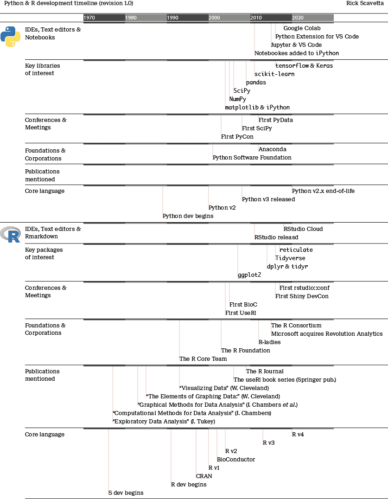

# 第一章：初生牛犊不怕虎

里克·J·斯卡维塔

博扬·安吉洛夫

我们希望以一句伟大的开场白开始，比如“这是最好的时代，也是最坏的时代……”，但老实说，这只是最好的时代 —— 数据科学正在蓬勃发展！随着它继续成熟，它已经开始分裂成各自的专业领域，就像许多学科随着时间的推移一样。这种成熟是科学计算早期就开始的漫长旅程的结果。我们相信，了解一些 Python 和 R 的起源故事将帮助您更好地理解它们在当今环境中的区别，从而更好地利用它们。

我们不会假装成为科学历史学家，那些追溯伟大发现和人物背后情况的学术人员。我们能做的是为您提供 Python 和 R 的起源及其如何引导我们走向当前局面的精彩摘要。

# R 语言的起源

每当我想到 R，我就会想起 FUBU，这是一家成立在 90 年代的街头服装公司。这个名字是一个缩写词，我立即爱上了它：“For Us, By Us”。FUBU 意味着社区，意味着理解你的人民的需求和欲望，并确保你为他们提供了良好的服务。*R 就是 FUBU*。^(1) 在本章结束时，我确信你会有同样的感觉。一旦我们承认 R 就是 FUBU，它开始变得更有意义了。

我们可以追溯 R 语言的起源到如今传奇般的新泽西贝尔实验室。1976 年，统计编程语言 S 的开发由约翰·钱伯斯领导。一年后，钱伯斯出版了《数据分析的计算方法》，他的同事约翰·图基（也在贝尔实验室）出版了《探索性数据分析》。1983 年，钱伯斯出版了《数据分析的图形方法》。这些书籍为开发计算系统提供了框架，不仅允许统计学家探索、理解和分析数据，还能够传达他们的结果。我们在谈论一个由 FUBU 明星阵容组成的全明星阵容！钱伯斯的合著者包括图基的表亲保罗·A·图基和威廉·克利夫兰。克利夫兰的感知经验实验总结在两本富有洞见的书籍中，至今对数据可视化领域有所启发。在科学计算和统计学的诸多贡献中，图基开发了新颖的可视化方法，如常常被误解的箱线图和克利夫兰为非参数平滑开发了 LOESS 方法。

我们从 S 开始，因为它奠定了最终成为 R 的基础。前一段的信息告诉我们很多关于 S 和 R 的基础知识。首先，统计学家是非常直白的人（*S*，你懂的吧？）。这是一个非常有用的特征。其次，统计学家需要一种专门用于数据分析的 FUBU 编程语言。他们对制作通用编程语言或操作系统不感兴趣。第三，这些早期关于计算统计学和可视化的书籍简直就是教学美的杰作和精确表达的例子^(2)。尽管技术明显过时，但它们的质量仍然出色。我认为这些书籍为统计学家，尤其是 R 社区，以开放、清晰和包容的方式进行技术交流种下了种子。我相信，这是 R 社区的一大特点，具有深厚的根基。第四，早期对*图形方法*的强调告诉我们，S 已经关注灵活和高效的*数据可视化*，这对于理解数据和传达结果都是必要的。因此，S 是关于尽可能轻松地完成最重要的事情，并以真正的 FUBU 方式进行。

最初的 S 发行版在 Unix 上运行，并且是免费提供的。最终，S 成为了 S-PLUS 的实现，并获得了许可。这促使奥克兰大学的 Ross Ihaka 和 Robert Gentleman 于 1991 年发布了另一个开源免费的 S 实现。他们将这个实现命名为 R，以他们的名字首字母命名，这是对 S 名称的戏仿，并且符合使用单个字母命名编程语言的传统。R 的第一个官方稳定 beta 版本`v1.0.0`于 2000 年 2 月 29 日发布。在此期间，发生了两个重要的发展。首先，建立了 CRAN（[综合 R 档案网络](https://cran.r-project.org/)），用于在镜像服务器上托管和归档 R 软件包。其次，还成立了 R 核心团队。这个由志愿者组成的团队（目前包括[20 名成员](https://www.r-project.org/contributors.html)）实现了基本的 R 功能，包括文档、构建、测试和发布，以及支持这一切的基础设施。值得注意的是，一些最初的成员仍然参与其中，包括 John Chambers、Ross Ihaka 和 Robert Gentleman。

自 2000 年 R `v1.0.0`以来发生了很多事情，但迄今为止的故事应该已经让你对 R 作为 FUBU 统计计算工具的独特背景有了初步了解。在我们继续 R 的故事之前，让我们先来看看 Python。

# Python 的起源

1991 年，随着 Ross Ihaka 和 Robert Gentleman 开始着手开发将成为 R 的项目，荷兰程序员 Guido van Rossum 发布了 Python。Python 的核心愿景实际上是一个人旨在解决当时常见计算问题的愿景。事实上，van Rossum 多年来被亲切地称为终身仁慈独裁者（BDFL），他在 2018 年退出 Python 领导委员会时放弃了这一头衔。

我们看到 S 是从统计学家进行数据分析的需求中产生的，R 是从开源实现的需求中产生的，那么 Python 解决了什么问题？嗯，并不是数据分析 —— 这一点要晚得多。当 Python 出现时，C 和 C++，两种低级编程语言，非常流行。Python 慢慢成为一种解释型、高级别的替代方案，特别是在 2000 年发布 Python `v2`（与 R `v1.0.0` 同年发布）之后。Python 的明确目标是成为一种易于使用和学习的广泛采用的编程语言，具有简单的语法。在这个角色中，它取得了非常好的成功！

你会注意到，与 R 相比，Python 无处不在并且非常多才多艺。你会在网站开发、游戏、系统管理、桌面应用程序、数据科学等领域看到它的身影。当然，R 能做的远不止数据分析，但请记住，R 是 FUBU。如果 R 是 FUBU，Python 则是瑞士军刀。它无处不在，每个人都有一把，但即使它有很多工具，大多数人也只是定期使用单一工具。虽然使用 Python 的数据科学家工作在一个广阔而多样的景观中，他们倾向于找到自己的利基，并专注于他们工作所需的软件包和工作流程，而不是利用这个通用语言的所有方面。

Python 在数据科学领域的广泛流行并非完全因为其数据科学能力。我认为 Python 部分是通过作为通用编程语言的现有用途进入数据科学的。毕竟，探入门槛是成功的一半。分析师和数据科学家在与系统管理和网站开发相关的同事共享和实施脚本时会更容易，因为他们已经知道如何使用 Python 脚本。这在 Python 的广泛采纳中起到了重要作用。Python 很适合利用高性能计算，并有效地实现深度学习算法。R 曾经是，并且可能仍然是，一门较为小众和有些陌生的语言，广泛的计算世界并不真正了解它。

尽管 Python `v2` 于 2000 年发布，但直到 2005 年，处理数组数据的广泛采用的包才开始萌芽，即`NumPy`的发布。此时，`SciPy`，自 2001 年以来提供数据科学基础算法（如优化、积分、微分方程等），开始依赖于`NumPy`的数据结构。`SciPy`还提供了特殊的数据结构，如*k*维树。

一旦核心数据结构和算法的标准包问题解决了，Python 开始在科学计算中广泛应用。低级别的`NumPy`和`SciPy`包为高级包如`pandas`（2009 年）打下了基础，提供了数据操作和数据结构（如`DataFrames`）的工具。有时称为 pyData 栈，从此 Python 开始飞速发展。

# 语言战争开始

早期的 2000 年为后来被称为“语言之战”的舞台铺平了道路。随着 pyData 栈的形成，Python 和 R 的里程碑开始加热竞争。特别突出的四个事件。

首先，2002 年，[`BioConductor`](https://www.bioconductor.org/)成立为一个新的 R 包仓库和框架，用于处理不断增长的各种生物数据。在此之前，生物信息学家依赖于诸如 MatLab 和 Perl（以及经典的命令行工具和一些手动 Web 接口工具）。MatLab 在特定学科如神经科学中仍然受到青睐。然而，Perl 已经大多被`BioConductor`取代。`BioConductor`对生物信息学的影响难以估量。它不仅提供了处理远程基因序列数据库、表达数据、微阵列等的包仓库，还提供了新的数据结构来处理遗传序列。`BioConductor`持续扩展并深深植根于生物信息学社区。

其次，2006 年发布了`IPython`包。这是一种在交互式笔记本环境中工作的突破性方式。从 2012 年开始的各种资助后，`IPython` 最终在 2014 年成熟为[*Jupyter 项目*](https://jupyter.org/)，现在包括 JupyterLab IDE。用户经常忘记 Jupyter 是“Julia、Python 和 R”的缩写，因为它非常以 Python 为中心。笔记本已经成为 Python 中进行数据科学的主要方式，在 2018 年，Google 发布了[Google Colab](https://colab.research.google.com/)，一个免费的在线笔记本工具。我们将在第三章中详细探讨这个工具。

第三，2007 年，Hadley Wickham 发表了他的博士论文，其中包括两个会从根本上改变 R 景观的 R 包。第一个叫做`reshape`，为后来形成的[*Tidyverse*](https://www.tidyverse.org/)奠定了基础（稍后会详细讨论）。虽然`reshape`早已退役，但它是我们理解数据结构如何影响我们如何思考和处理数据的第一个窥视。第二个`ggplot2`则是 Leland Wilkinson 的里程碑之作《图形语法》，提供了直观、高级别的绘图，极大简化了 R 中现有的工具（关于这点详见第五章）。

最后，Python v3 在 2008 年发布。多年来，关于使用 Python 的哪个版本，`v2` 还是 `v3` 的问题一直存在。这是因为 Python `v3` 是不兼容的。幸运的是，自从 2020 年 Python `v2` 被弃用后，这个问题已经为你解决了。令人惊讶的是，尽管如此，2020 年后你仍然可以购买到预装有 Python 2 的新款 MacBook Pro，因为一些遗留脚本仍然依赖于它。所以 Python 2 仍然存在。

# 数据科学主导地位之争

到此时，Python 和 R 都已经有了广泛应用于各种数据科学应用的强大工具。随着所谓的“语言战争”持续进行，其他关键发展使每种语言找到了自己的领域。

Python 和 R 都包含在特定的*构建*中。对于 Python，这是 Anaconda 发行版，目前仍然广泛使用（详见第三章）。对于 R，则是 Revolution Analytics 公司推出的*Revolution R Open*。尽管他们的 R 构建从未被社区广泛接受，但该公司被微软收购，显示了对 R 语言的强大企业支持。

2011 年，Python 社区预见到机器学习的繁荣，推出了`scikit-learn`包。2016 年，随着`tensorflow`和`keras`用于深度学习的发布，同时得到了健康的企业支持。这也突显了 Python 作为一个高级解释器坐在高性能平台上的优势。例如，你会发现 AWS lambda 用于大规模高并发编程，`Numba` 用于高性能计算，以及前面提到的[TensorFlow](https://www.tensorflow.org/)用于高度优化的 C++。除了数据科学之外，Python 在部署模型方面的声誉超越了 R，这一点也不足为奇。

2011 年还见证了[RStudio](https://rstudio.com/) IDE 的发布，由同名公司推出，未来几年内，R 社区开始集中在这个工具上。在很多方面，使用 R 就意味着使用 RStudio。RStudio 在推广 R 作为适用于各种数据中心用途的编程语言方面的影响也很重要。

当所有这些都在发生的同时，R 社区的一个不断增长的部分开始转向一套包，其中许多包由 Hadley Wickham 编写或领导，这些包开始重新构思和简化典型的数据工作流程。这些包的大部分工作是标准化 R 函数语法以及输入和输出数据存储结构。最终，这套包开始被非正式地称为“Hadleyverse”。在斯坦福大学 UseR! 2016 年会议的主题演讲中，Wickham 放弃了这一说法，点燃了数字火焰以消除他的名字，并创造了“Tidyverse”这一术语。自加入 RStudio 以来，该公司一直在积极开发和推广 Tidyverse 生态系统，这显然已成为 R 中占主导地位的方言。我们将在第二章中更深入地探讨这一点。

我们可以想象 R 至少包含 2 种“范式”或“方言”。它们可以混合使用，但每种都有自己独特的风格。基础 R^(3)是大多数 R 所采用的，并且可能仍然是如此。`Tidyverse`重新构想了基础 R，在一个广泛的包和函数组成的宇宙中发挥作用，这些包和函数能很好地协同工作，通常依赖于*管道*并且偏爱数据框。我认为`BioConductor`提供了另一种方言，专注于特定学科，即生物信息学。你毫无疑问会发现一些大型包可能包含足够多的特殊性，以至于你可能认为它们是自成一体的方言，但我们不要深究这个问题。R 现在正处于阈值，一些用户只了解（或被教导）`Tidyverse`的做事方式。基础 R 和 Tidyverse R 之间的区别似乎微不足道，但我见过许多新的 R 学习者努力理解为什么 Tidyverse 存在。部分原因是多年来基础 R 代码仍在积极使用且不可忽视。尽管 Tidyverse 的支持者认为这些包让初学者的生活更加轻松，但竞争的方言可能造成不必要的困惑。

我们也可以想象 Python 包含不同的方言。Python 的“原生”安装是最基本的安装，与导入 pyData 堆栈的环境运行方式不同。大多数数据科学家在 pyData 堆栈中操作，因此方言之间的混淆较少。

# 关于合作和社区建设的融合

有一段时间，语言之争中主导的态度似乎是“我们对他们”。看着别人电脑屏幕的不屑表情。Python 或 R 似乎最终会在数据科学领域中消失。你好，单一文化！一些数据科学家仍然支持这一点，但我们猜想你不是他们中的一员。也有一段时间，Python 和 R 试图彼此模仿，只是将工作流迁移，使语言不再重要。幸运的是，这些努力并未成功。Python 和 R 都有独特的优势；试图互相模仿似乎忽略了这一点。

今天，许多 Python 和 R 社区的数据科学家认识到这两种语言都非常优秀、有用且互补。回到前言中的一个关键点，数据科学社区已经达成了合作和社区建设的共识，这对每个人都有益处。

我们准备迎接一个新的双语数据科学家社区。挑战在于，许多使用一种语言的用户不太清楚它们如何互补，以及何时使用哪种语言。多年来已经出现了一些解决方案，但我们将在第四部分详细探讨这一点。

# 总结思考

到目前为止，你应该对我们在 2021 年的位置及其背后的原因有了一个很好的了解。在下一部分中，我们将向每组用户介绍一种新的语言。

最后一点说明：Python 用户称自己为 Pythonistas，这是一个非常酷的名字！R 没有真正的对应，他们也没有得到一个非常酷的动物，但这就是单字母语言的生活。R 用户通常被称为……等等……用 R 用户！（叹号可选）事实上，官方的年度会议称为 useR！（叹号是必须的），出版商 Springer 也有一系列名为同名的持续更新的很出色的书籍。我们将使用这些名称。

图 1-1 概述了本章我们重点介绍的一些重要事件，以及其他一些值得关注的里程碑。

###### 图 1-1\. Python 和 R 数据科学里程碑的时间线。

^(1) 好吧，更像是*统计学家们的统计学家*，但是“FSBS”听起来没有那么响亮。

^(2) 或许除了*用于数据分析的计算方法*，我承认我没有阅读过。

^(3) Python 用户可能不熟悉术语“基础”。这指的是语言的内置功能，没有任何额外的包安装。Python 本身在数据分析方面已经非常强大。数据科学家在 Python 中默认会导入 PyData 栈。
