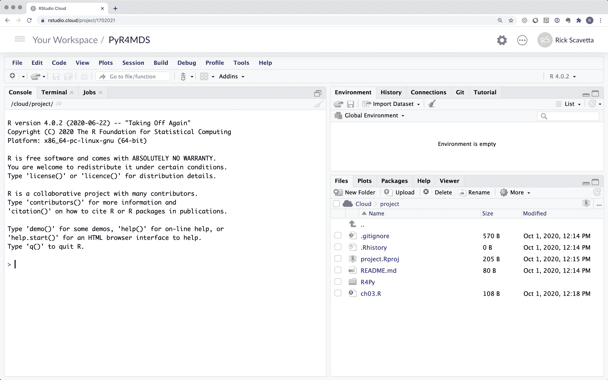
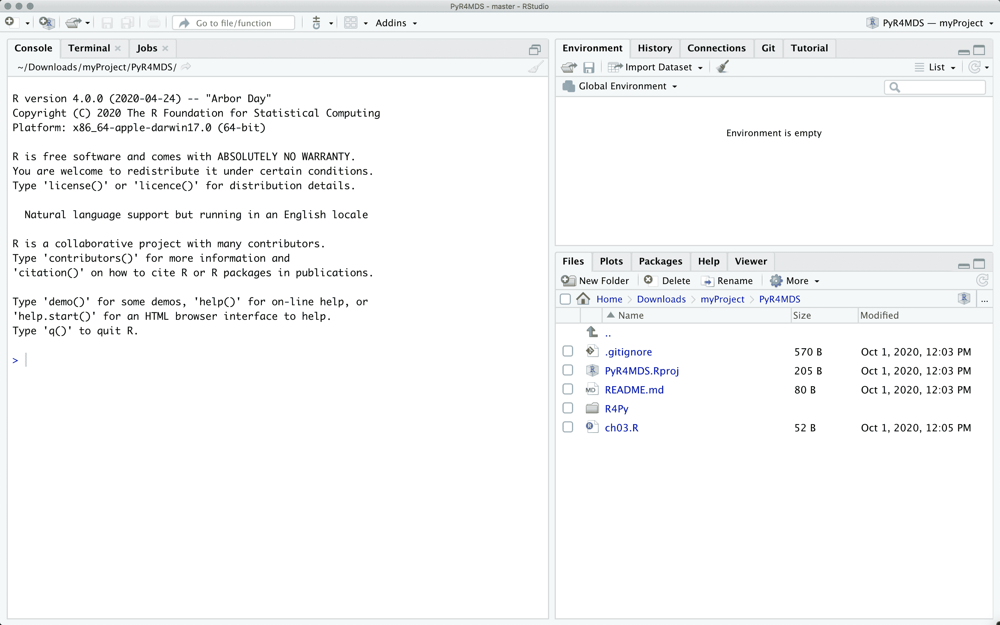
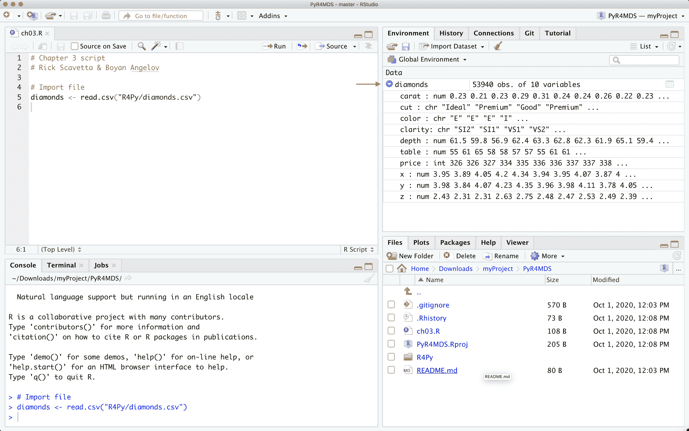
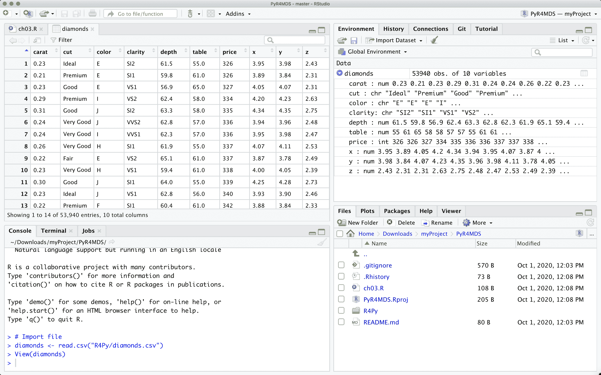

# 第二章：R for Pythonistas

Rick J. Scavetta

欢迎，勇敢的 Python 程序员，来到 useR 的世界^(1)！在本章中，我们的目标是介绍 R 的核心特性，并试图解决你在学习过程中可能遇到的一些困惑。因此，提到我们*不*打算做什么是有用的。

首先，我们不是为天真的数据科学家编写的。如果你想从零开始学习 R，有很多优秀的资源可供选择；太多了，无法一一列举。我们鼓励你去探索它们，并选择适合你需求和学习风格的资源。在这里，我们将提出可能会让完全的新手感到困惑的话题和问题。我们会绕道解释一些话题，希望能够帮助友好的 Python 程序员更轻松地适应 R。

其次，这不是一本双语词典，你可以在附录 A 中找到它，但是没有上下文，它并不是真正有用的。在这里，我们希望带领你踏上一段探索和理解的旅程。我们希望你能够对 R 有一种*感觉*，以便开始*思考* R，变得双语。因此，为了叙述的完整性，我们可能会在写给完全新手的时候介绍一些项目远比其他时候晚得多的东西。尽管如此，我们希望当你需要在新语言中执行熟悉的任务时，能够回到这一章。

第三，这不是一本全面的指南。一旦你掌握了 R，你就会发现探索更深层次的语言以满足你特定需求的乐趣无穷。正如我们在本书的第一部分中提到的那样，R 社区是多样化的，友好的，欢迎你的——而且乐于助人！我们相信这是少数不那么*技术兄弟*的文化之一。要了解社区的情况，你可以在 [Twitter](https://twitter.com/search?q=%23RStats) 上关注 `#rstats`。

# 运行 R

要在本章中完成练习，你可以在 RStudio Cloud 中访问 R，也可以在本地安装 R 和 RStudio。RStudio Cloud 是一个提供访问 R 实例（通过 RStudio IDE）的平台，它允许你上传自己的数据并分享项目。我们将在接下来的段落中介绍这两种方法。

要使用 RStudio Cloud，请在[*http://rstudio.cloud/*](http://rstudio.cloud/) 上创建一个账户，然后转到我们的[公开项目](https://rstudio.cloud/project/2534578)。确保在你的工作空间中保存项目的副本，这样你就有了自己的副本，你会在页眉中看到链接。

你的 RStudio 会话应该看起来像图 2-1 中的样子。打开`ch02-r4py/r4py.R`，就这样！你已经准备好跟着所有的例子了。要执行命令，请按下`ctrl` + `enter`（或 `cmd` + `enter`）。



###### 图 2-1\. 我们在 RStudio Cloud 中的项目。

要在本地运行 R，您会发现它可以在 Anaconda 发行版中使用，如果您使用的是该发行版，否则您可以直接安装它。首先从[*https://www.r-project.org/*](https://www.r-project.org/)为您的操作系统下载并安装 R。R `v4.0` 于 2020 年 6 月发布，与 Python v3.x 相比，它具有向后兼容性，但也有一些显著的例外。我们假设您至少正在运行 R `4.0.0`：“再次起飞”。每个发布版都得到一个受花生漫画（经典的漫画和电影系列，由查理·布朗，史努比等主演）启发的名称。我认为这是一个不错的个人化的触摸。接下来，从[*https://rstudio.com/*](https://rstudio.com/)安装 RStudio Desktop IDE。

最后，设置一个要处理的项目。这与虚拟环境有些不同，我们稍后会讨论。有两种典型的方式可以使用预先存在的文件创建项目。

首先，如果您使用 `git`，您会很高兴地知道 RStudio 也是一个基本的 `git` 图形用户界面客户端。在 RStudio 中，选择 `File > New project > Version Control > Git` 并输入存储库 URL `[*https://github.com/moderndatadesign/PyR4MDS*](https://github.com/moderndatadesign/PyR4MDS)`。项目目录名称将自动使用存储库名称。选择您希望存储存储库的位置，然后单击“创建项目”。

其次，如果您不使用 `git`，您可以直接下载并解压来自[*https://github.com/moderndatadesign/PyR4MDS*](https://github.com/moderndatadesign/PyR4MDS)的存储库。在 RStudio 中，选择 `File > Existing Directory` 并导航到下载的目录。在该目录中将创建一个新的 R 项目文件 `*.Rproj`。

您的 RStudio 会话应该看起来像图 图 2-2。打开 `ch02-r4py/r4py.R`，就这样！您已准备好跟随所有示例进行操作。要执行命令，请按 `ctrl` + `enter`（或 `cmd` + `enter`）。



###### 图 2-2\. 我们在 RStudio 中的项目。

# 项目和包

我们可以通过使用内置数据集开始探索 R，并直接深入 Tidyverse（在第一章介绍），但我想稍作停顿，深呼吸，并从头开始我们的故事。让我们先读取一个简单的 csv 文件。为此，我们将使用 `ggplot2` 包中实际上已经可用的数据集。对于我们的目的，我们对实际分析不太关心，而是关心它在 R 中的执行方式。我已在书籍的[存储库](https://github.com/moderndatadesign/PyR4MDS)中提供了数据集作为文件。

如果您正确设置了项目（参见上文），您只需要执行以下命令即可。如果此命令不起作用，请不要担心，我们很快会回到这个问题。

```py
diamonds <- read.csv("ch02-r4py/data/diamonds.csv")
```

就像在 Python 中一样，单引号 (`''`) 和双引号 (`""`) 是可以互换的，尽管双引号更受欢迎。

现在，文件已导入并作为对象出现在你的全局环境中，你的自定义对象也在其中。你会注意到的第一件事是 RStudio 的环境面板将显示该对象并提供一些摘要信息。这种可爱而简单的设计类似于 VScode 的 Jupyter 笔记本扩展（参见 Chapter 3），它也允许你查看你的环境。虽然这在 RStudio 中是一个标准功能，但在 Python 编写脚本时查看对象列表，或者许多其他语言中，这并不常见。点击对象名称旁边的小蓝箭头将显示文本描述（参见图 Figure 2-3）。



###### 图 2-3\. 数据框的下拉菜单。

点击名称将在类似 Excel 的查看器中打开它（参见图 Figure 2-4）。



###### 图 2-4\. 表格视图中的数据框。

###### 注意

RStudio 的查看器比 Excel 更好，因为它只在内存中加载你屏幕上看到的内容。你可以搜索特定文本并筛选数据，因此这是一个方便的工具，用来窥探你的数据。

尽管这些功能很好，一些用户认为它们有点过于 GUI^(2) 且有点过于不够 IDE^(3)。Python 爱好者大多数会同意，有些人因此批评 RStudio 的用户体验。我部分同意，因为我看到它可能会鼓励一些不良实践。例如，要导入数据集，你也可以点击“导入数据集…”按钮。如果你在解析文件结构时遇到困难，这可能很方便，但会导致未记录的、不可重现的操作，这非常令人沮丧，因为脚本/项目将不是自包含的。执行导入文件的命令将在控制台中执行，并在历史面板中可见，但除非你明确复制它，否则它不会出现在脚本中。这会导致环境中存在脚本未定义的对象。然而，请记住，RStudio 不等同于 R。你可以在其他文本编辑器中使用 R（例如 [ESS](https://ess.r-project.org/)（“emacs speaks statistics”）扩展的 emacs）。

如果你无法使用上述命令导入数据，要么（i）该文件不存在于该目录中，要么（ii）你正在错误的 *工作目录* 中工作，后者更有可能。你可能会被诱导写出像这样糟糕的东西：

```py
diamonds <- read.csv("ch02-r4py/data/diamonds.csv")
```

在使用 Python 的虚拟环境时，避免使用硬编码路径会更加熟悉。像我们之前所做的那样使用相对路径，确保我们的文件目录包含所有必要的数据文件。工作目录和项目都不是虚拟环境，但它们仍然非常方便，所以让我们来了解一下吧！

工作目录是 R 查找文件的第一个地方。当您使用 R 项目时，工作目录就是您拥有 `*.Rproj` 文件的位置。因此，`ch02-r4py` 是我们工作目录中的一个子目录。工作目录的名称或位置无关紧要。只要在 RStudio 中打开项目（`*.Rproj` 文件），整个项目可以移动到计算机上的任何位置，它依然能够*正常工作*。

###### 警告

如果您没有使用 R 项目，那么您的工作目录可能是您的主目录，在 RStudio 中显示为 `project: (None)`。这很糟糕，因为您将不得不指定文件的完整路径，而不仅仅是项目中的子目录。您会发现命令 `getwd()` *获取*和 `setwd()` *设置*工作目录在许多过时的教程中。请不要使用这些命令！它们会导致硬编码完整文件路径的相同问题。

让我们回到我们的命令 `diamonds <- read.csv("ch02-r4py/data/diamonds.csv")`。您已经注意到一些会让经验丰富的 Python 爱好者感到困惑或激怒的事情。有三件事情特别显眼。

首先，请注意，在 R 中通常使用 `<-` 作为赋值操作符是普遍且甚至更受欢迎的。您可以像在 Python 中那样使用 `=`，事实上您会看到一些有经验的用户这样做，但 `<-` 更加明确，因为 `=` 也用于在函数调用中为参数分配值，而 Python 爱好者都喜欢明确！

###### 注

`<-` 赋值操作符实际上是一个传统操作符，起源于标准化前的 QWERTY 键盘，其中 `<-` 并不意味着*将光标向左移动一个空格*，而是字面上使 `<-` 出现。

其次，请注意函数名称是 `read.csv()`，不，这不是打字错误。`csv()` 不是对象 `read` 的*方法*，也不是 `read` *模块* 的*函数*。如果这是一个 Python 命令，这两种解释都是完全可以接受的。在 R 中，除了一些明显的例外，`.` 并不具有特殊意义。如果您习惯于更面向对象的语言，其中 `.` 是一个特殊字符，这有点令人恼火。

最后，请注意，我们没有初始化任何包来完成此任务。`read.*()` 函数变体是基本 R 的一部分。有趣的是，如果这些函数不能满足您的需求，还有更新更便捷的读取文件的方法。例如 `read_csv()` 函数在 `readr` 包中。我们知道您很兴奋看到那个 `_`！

一般来说，当您看到带有 `.` 的简单函数时，这些都是旧的基础 R 函数，创建时没有人担心名称中包含 `.` 会引起混淆。来自较新 Tidyverse 包的函数，例如 `readr`，倾向于使用 `_`（见第一章）。它们基本上做同样的事情，但稍作调整，使它们更加用户友好。

让我们看看如何使用`readr`实现这一点。就像在 Python 中一样，你需要*安装*这个包。这通常是在 R 控制台中直接完成的，R 中没有`pip`的等价物。

使用以下命令：

```py
install.packages("tidyverse")
```

###### 注意

在 RStudio 中，你可以通过在右下角面板中的“Packages”面板上点击“Install”按钮来安装包。输入`tidyverse`，确保选中“install all dependencies”框，并点击 OK。如果你选择这种方式，请不要点击已安装包名称旁边的复选框。这将初始化包，但不会将其记录在你的脚本中。

默认情况下，这将从 CRAN 安装包及其依赖项，CRAN 是官方 R 包的存储库。官方包经过质量控制，并托管在全球镜像服务器上。第一次这样做时，系统将要求你选择一个镜像站点进行安装。大部分情况下，选择哪一个并不重要。在核心 Tidyverse 包和它们的所有依赖项安装过程中，你会看到很多红色文本。这主要是一种方便的方式，一次性安装许多有用的包。

安装包最常见的问题是在包目录中没有写权限。这会提示你创建一个个人图书馆。你可以随时通过以下方式检查你的包安装在哪里

```py
.libPaths()
[1] "/Library/Frameworks/R.framework/Versions/4.0/Resources/library"
```

如果你有一个个人图书馆，它将显示在第二个位置。

###### 注意

与 Pythonistas 相比，他们倾向于使用虚拟环境，而 R 用户通常只安装一次包，使其在整个系统范围内可用。在尝试为 R 实现项目特定库的解决方案多次失败后，当前的首选是`renv` [包](https://rstudio.github.io/renv/articles/renv.html)，即*R 环境*。

与 Python 类似，在安装包后，需要在每个新的 R 会话中初始化它。当我们说*初始化*或*加载*一个包时，我们实际上是指“使用`library()`函数*加载*一个已安装的包，然后*附加*它到命名空间，即全局环境”。所有你的包组成你的*库*，因此使用`library()`。可以使用`library(tidyverse)`加载 Tidyverse 的核心套件包。这是常见的做法，大部分时间没有问题，但你可能希望养成只加载实际需要的包而不是不必要地填充环境的习惯。让我们从包含`read_csv()`函数的`readr`开始。

```py
# R
library(readr)
```

这相当于：

```py
# Python equivalent
import readr
```

尽管 R 使用面向对象编程（OOP），但大部分时间是在后台操作，因此你永远不会看到像这样的包的奇怪别名：

```py
import readr as rr
```

这在 R 中只是一个外来概念。在*附加*包之后，该包中的所有函数和数据集都可在全局环境中使用。

###### 警告

这让我想起另一个可能会漂浮的遗留函数。你必须绝对避免使用 `attach()`（以及大部分情况下的配对函数 `detach()`）。这个函数允许你将一个对象 *attach* 到你的全局环境中，就像我们附加一个包一样。因此，你可以直接调用对象中的元素，而不必显式指定对象名称，就像我们在不必每次显式调用包名称的情况下调用包中的函数一样。这种方法不再流行的原因是你可能会有许多想要访问的数据对象，因此可能会出现名称冲突问题（即对象 *masking*）。另外，这种方法也不够明确。

在继续之前，我想解决另一个加载包的问题。你经常会看到：

```py
require(readr)
```

`require()` 函数将加载一个已安装的包，并基于成功与否返回 `TRUE/FALSE`。这对于测试包是否存在很有用，因此应该仅在必要时使用。大多数情况下，你应该使用 `library()`。

好了，让我们再次读取我们的数据集，这次使用 `read_csv()` 进行一些简单的比较。

```py
> diamonds_2 <- read_csv("R4Py/diamonds.csv")
Parsed with column specification:
cols(
  carat = col_double(),
  cut = col_character(),
  color = col_character(),
  clarity = col_character(),
  depth = col_double(),
  table = col_double(),
  price = col_double(),
  x = col_double(),
  y = col_double(),
  z = col_double()
)
```

你会注意到，我们得到了一个更详细的描述发生了什么。

正如我们之前提到的，Tidyverse 的设计选择往往比其更新的老流程更加用户友好。此输出告诉我们表格数据的列名及其类型（参见 Table 2-2）。

R 语言当前的趋势是使用蛇形命名法，单词间用下划线（“_”）分隔，并且只使用小写字母。尽管在 R 中一直以来都存在风格指南的不严格遵循，但是 [Advanced R 书籍](http://adv-r.had.co.nz/Style.html) 提供了很好的建议。Google 也试图推广一个 [R 风格指南](https://google.github.io/styleguide/Rguide.html)，但似乎社区对此并不十分严格。这与 Python 的 PEP 8 风格指南形成对比，后者由 Python 创始人 Guido van Rossum 在 Python 早期发布时编写。

# Tibbles 的胜利

到目前为止，我们已经两次导入了我们的数据，使用了两种不同的命令。这样做是为了让你看到 R 在幕后的工作方式以及 Tidyverse 与基础包的一些典型行为。我们已经提到，你可以点击环境查看器中的对象来查看它，但通常也会将其打印到控制台。你可能会试图执行：

```py
> print(diamonds)
```

但 `print()` 函数在特定情况下是不必要的，比如在 `for` 循环内。与 Jupyter 笔记本类似，你可以直接执行对象名称，例如：

```py
> diamonds
```

这将把对象打印到控制台。我们不会在这里复制它，但如果你执行上面的命令，你会注意到这不是一个好的输出！确实，人们会想知道为什么默认输出在交互模式下允许如此多的内容打印到控制台。现在尝试使用`read_csv()`读取的数据帧：

```py
> diamonds_2
# A tibble: 53,940 x 10
   carat cut       color clarity depth table price     x     y     z
   <dbl> <chr>     <chr> <chr>   <dbl> <dbl> <dbl> <dbl> <dbl> <dbl>
 1 0.23  Ideal     E     SI2      61.5    55   326  3.95  3.98  2.43
 2 0.21  Premium   E     SI1      59.8    61   326  3.89  3.84  2.31
 3 0.23  Good      E     VS1      56.9    65   327  4.05  4.07  2.31
 4 0.290 Premium   I     VS2      62.4    58   334  4.2   4.23  2.63
 5 0.31  Good      J     SI2      63.3    58   335  4.34  4.35  2.75
 6 0.24  Very Good J     VVS2     62.8    57   336  3.94  3.96  2.48
 7 0.24  Very Good I     VVS1     62.3    57   336  3.95  3.98  2.47
 8 0.26  Very Good H     SI1      61.9    55   337  4.07  4.11  2.53
 9 0.22  Fair      E     VS2      65.1    61   337  3.87  3.78  2.49
10 0.23  Very Good H     VS1      59.4    61   338  4     4.05  2.39
# … with 53,930 more rows
```

哇！这比默认的基本 R 版本要好得多。我们有一个整齐的小表，第一行是列名，下面是`<>`中的数据类型的 3 个字母代码。我们只看到前 10 行，然后有一个告诉我们有多少行未显示的注释。如果我们的屏幕有太多列，我们将在底部看到它们列出来。试试吧，将你的控制台输出设置得非常窄，然后再次执行命令：

```py
# A tibble: 53,940 x 10
   carat cut     color clarity
   <dbl> <chr>   <chr> <chr>
 1 0.23  Ideal   E     SI2
 2 0.21  Premium E     SI1
 3 0.23  Good    E     VS1
 4 0.290 Premium I     VS2
 5 0.31  Good    J     SI2
 6 0.24  Very G… J     VVS2
 7 0.24  Very G… I     VVS1
 8 0.26  Very G… H     SI1
 9 0.22  Fair    E     VS2
10 0.23  Very G… H     VS1
# … with 53,930 more rows,
#   and 6 more variables:
#   depth <dbl>, table <dbl>,
#   price <dbl>, x <dbl>,
#   y <dbl>, z <dbl>
```

基本的 R 已经对探索性数据分析（EDA）非常好了，但这是下一个级别的便利。那么发生了什么？实际理解这一点非常重要，但首先我们想要强调另外两个有趣的点。

首先，请注意，我们不需要加载整个`readr`包来访问`read_csv()`函数。我们可以省略`library(readr)`，直接使用：

```py
> diamonds_2 <- readr::read_csv("R4Py/diamonds.csv")
```

双冒号操作符`::`用于访问包中的函数。类似于：

```py
from pandas import read_csv
```

当用户知道他们只需要一个非常特定的函数来自一个包时，或者两个包中的函数可能会冲突时，他们会使用`::`。这样可以避免将整个包附加到其命名空间中。

其次，这是我们第一次在 R 中看到实际数据，并且我们立即可以看到编号从 1 开始！（为什么不呢？）。

###### 注意

顺便说一下，打印对象到屏幕上时经常会看到整个表达式周围有圆括号。这只是执行表达式并将对象打印到屏幕上的意思。

```py
(aa <- 8)
```

它大多数时候只是混乱了命令。除非有必要，否则就直接调用对象。

```py
aa <- 8
aa
```

此外，只需注释掉（在 RStudio 中使用 ctrl+shift+c）打印行，而不是回去删除所有这些额外的括号，会更容易一些。

好的，让我们来看看这里发生了什么。为什么在打印到控制台时`diamonds`和`diamonds_2`看起来如此不同。回答这个问题将帮助我们理解一下 R 如何处理对象。为了回答这个问题，让我们看看这些对象的类：

```py
class(diamonds)
[1] "data.frame"
```

```py
class(diamonds_2)
[1] "spec_tbl_df" "tbl_df"      "tbl"         "data.frame"
```

你会从`pandas.DataFrame`中熟悉`data.frame`（好吧，我们能承认`pandas`的`DataFrame`只是 R 中`data.frame`的一个 Python 实现吗？）。但使用 Tidyverse 的`read_csv()`函数生成了一个具有三个额外类的对象。在这里要提到的两个是子类`tbl_df`和类`tbl`，这两者共同定义了一个*tibble*（因此`tbl`），它具有`data.frame`结构的特性`tbl_df`。

Tibbles 是 Tidyverse 的核心特性，在基本的 R 对象上有很多优势。例如，打印到控制台。回想一下，调用对象名称只是调用 `print()` 的快捷方式。`print()` 反过来又有一个处理数据框的方法，现在我们已经加载了 `readr` 包，它现在有一个处理 `tbl_df` 类对象的方法。

因此，在后台，我们看到 OOP 原则隐式地处理对象类并调用适用于给定类的方法。方便！令人困惑吗？隐式！我能理解为什么 Python 程序员会感到恼火，但一旦你克服了这个问题，你会发现你可以轻松地继续工作，而不会遇到太多麻烦。

# 有关类型和探索的一些说明

让我们更深入地研究一下我们的数据，看看 R 是如何存储和处理数据的。数据框是一个二维异构数据结构。听起来很简单，但让我们进一步解释一下。

表 2-1\. 示例数据框

| 名称 | 维度数 | 数据类型 |
| --- | --- | --- |
| 向量 | 1 | 同质 |
| 列表 | 1 | 异构 |
| 数据框 | 2 | 异构 |
| 矩阵 | 2 | 同质 |
| 数组 | n | 同质 |

向量是最基本的数据存储形式。它们是一维的和同质的。也就是说，一个接一个地存储每个元素，每个元素都是相同类型的。这就像是一个一维的 `numpy` 数组，由标量组成。我们不在 R 中引用标量，那只是一个长度为 1 的向量。R 中有许多 *类型*，以及 4 个常用的“用户定义的原子向量类型”。术语“原子”已经告诉我们，这已经是我们在 Table 2-2 中找到的最基本的东西了。

表 2-2\. 数据类型

| 类型 | 数据框简写 | Tibble 简写 | 描述 |
| --- | --- | --- | --- |
| 逻辑 | logi | <lgl> | 二进制 TRUE/FALSE, T/F, 1/0 |
| 整数 | int | <int> | 整数从 [-Inf,Inf] |
| 双精度 | num | <dbl> | 实数从 [-Inf,Inf] |
| 字符串 | chr | <chr> | 所有字母数字字符，包括空格。 |

另外两种较不常见的用户定义的原子向量类型是 `raw` 和 `complex`。

向量是基本的构建块。关于向量有几件事情需要注意，所以让我们先搞清楚这些再回到数据科学的工作马车，那就是心爱的数据框。

根据信息内容的递增顺序排列了 Table 2-2 中列出的四种用户定义的原子向量类型。当你创建一个向量时，R 会尝试找到能够包含该向量中所有信息的最低信息内容类型。例如，逻辑：

```py
> a <- c(TRUE, FALSE)
> typeof(a)
[1] "logical"
```

`logical` 是 R 中的 `bool` 等价物，但很少被称为布尔或二进制。另外，请注意 `T` 和 `F` 本身不是 R 中的保留术语，因此不建议用于逻辑向量，尽管它们是有效的。请使用 `TRUE` 和 `FALSE`。让我们来看一下数字：

```py
> b <- c(1, 2)
> typeof(b)
[1] "double"
```

```py
> c <- c(3.14, 6.8)
> typeof(c)
[1] "double"
```

R 将根据需要自动在双精度和整数之间进行转换。主要使用双精度进行数学运算，这在数据框中用 `numeric` 的简写显示出来。除非您明确需要将数字限制为真正的整数，否则 numeric/double 就足够了。如果确实需要将值限制为整数，可以使用 `as.*()` 函数强制转换为特定类型，或者使用 `L` 后缀指定数字必须是整数。

```py
> b <- as.integer(c(1, 2))
> typeof(b)
[1] "integer"
```

```py
> b <- c(1L, 2L)
> typeof(b)
[1] "integer"
```

字符串是 R 中的字符串版本。你可能知道 Python 中的 `str`，这在 R 中是一个常见的函数 `str()`，它显示对象的*结构*。字符在 R 中也经常被称为字符串，包括在参数和包名称中，这是一个不幸的不一致性。

```py
> d <- c("a", "b")
> typeof(d)
[1] "character"
```

将它们放在使用 `data.frame()` 创建的基本数据框中，或者使用使用 `tibble()` 创建的更近期开发的 tibble 中，得到：

```py
my_tibble <- tibble(a = c(T, F),
                    b = c(1L, 2L),
                    c = c(3.14, 6.8),
                    d = c("a", "b"))
my_tibble
```

```py
# A tibble: 2 x 4
  a         b     c d
  <lgl> <int> <dbl> <chr>
1 TRUE      1  3.14 a
2 FALSE     2  6.8  b
```

注意，由于它是一个 tibble，我们从 `print()` 中得到了漂亮的输出。当我们查看*结构*时，我们会看到一些令人困惑的特性：

```py
> str(my_tibble)
tibble [2 × 4] (S3: tbl_df/tbl/data.frame)
 $ a: logi [1:2] TRUE FALSE
 $ b: int [1:2] 1 2
 $ c: num [1:2] 3.14 6.8
 $ d: chr [1:2] "a" "b"
```

`str()` 是一个经典的基础包函数，提供一些基本的输出，类似于在环境面板中点击对象名称旁边的显示箭头时看到的内容。第一行给出了对象的类别（我们上面已经看到了）。S3 指的是此对象使用的特定面向对象编程系统，本例中是最基本和最宽松的面向对象编程系统。

或者，我们也可以使用 Tidyverse 中 `dplyr` 包的 `glimpse()` 函数。

```py
> library(dplyr)
> glimpse(my_tibble)
Rows: 2
Columns: 4
$ a <lgl> TRUE, FALSE
$ b <int> 1, 2
$ c <dbl> 3.14, 6.80
$ d <chr> "a", "b"
```

注意，表 2-2 还指出了缩写 `num`，在 `glimpse()` 的输出中并没有出现。这指的是“numeric”类别，它可以是双精度浮点数或整数类型。

上述示例告诉我们，`data.frame` 是一个异构的、二维的、每个长度相同的同质一维向量集合。我们将解释为什么 R 在下面打印所有这些美元符号（不，这与你的工资无关！）

# 命名（内部）事物

我们已经提到，蛇形命名法是目前 R 中命名对象的当前趋势。但是，命名数据框中的列名则完全不同，因为我们只是从源文件的第一行继承了名称。基础 R 中的数据框，例如使用 `read.*()` 函数系列获取的或者使用 `data.frame()` 函数手动创建的，不允许使用任何“非法”字符。非法字符包括所有空格和所有在 R 中保留的字符，例如：

+   算术运算符（`+`, `-`, `/`, `*`, 等），

+   逻辑运算符（`&`, `|`, 等），

+   关系运算符（`==`, `!=`, `>`, `<`, 等）

+   括号 (`[`, `(`, `{`, `<` 及其关闭符)

此外，尽管它们可以包含数字，但不能以数字开头。让我们看看会发生什么：

```py
# Base package version
data.frame("Weight (g)" = 15,
           "Group" = "trt1",
           "5-day check" = TRUE)
  Weight..g. Group X5.day.check
1         15  trt1         TRUE
```

所有非法字符都被替换为`。`！我知道，没错吧？R 真的很喜欢嘲笑你这些 OOP 狂热者！此外，以数字开头的任何变量现在都以`X`开头。

那么如何导入没有标题的文件？

```py
> diamonds_base_nohead <- read.csv("ch02-r4py/data/diamonds_noheader.csv", header = F)
> names(diamonds_base_nohead)
 [1] "V1"  "V2"  "V3"  "V4"  "V5"  "V6"  "V7"  "V8"  "V9"  "V10"
```

在 base R 中，如果没有任何标题，给定的名称是`V`，表示“变量”，后面是该列的数字。

通过`readr::read_*()`函数中的一个或使用`tibble()`创建的相同文件将保留非法字符！这似乎微不足道，但实际上这是对 Tidyverse 的严肃批评，如果你开始干预别人的脚本，这是需要密切关注的问题。让我们看看：

```py
> tibble("Weight (g)" = 15,
+            "Group" = "trt1",
+            "5-day check" = TRUE)
# A tibble: 1 x 3
  `Weight (g)` Group `5-day check`
         <dbl> <chr> <lgl>
1           15 trt1  TRUE
```

注意到用于列`Weight (g)`和`5-day check`的反引号了吗？现在您需要使用它来转义非法字符。也许这会使命令更具信息性，因为您有完整的名称，但无论如何，您可能仍希望保持简短和具有信息性的列名。关于单位（例如重量的克）的信息是不必要的附加信息，应包含在数据集的图例中。

不仅如此，无头数据集的名称也不同：

```py
> diamonds_tidy_nohead <- read_csv("ch02-r4py/data/diamonds_noheader.csv", col_names = F)
> names(diamonds_tidy_nohead)
 [1] "X1"  "X2"  "X3"  "X4"  "X5"  "X6"  "X7"  "X8"  "X9"  "X10"
```

不再使用`V`，而是使用`X`！这将我们带回到 Tidyverse 作为 R 中的一个独特方言。如果您继承了一个完全基于 base R 的脚本，如果您随意开始添加 Tidyverse 函数，那么您会遇到麻烦。这就像在柏林面包店要求柏林人^(5)一样！

# 列表

列表是另一种常见的数据结构，但它们与 Python 列表并不完全相同，因此命名可能会令人困惑。事实上，在我们非常短暂的 R 之旅中，我们已经遇到了列表。这是因为``data.frame`是`list`类型的特定类。是的，你没听错。

```py
> typeof(my_tibble)
[1] "list"
```

表 2-1 告诉我们，列表是一种一维的、异质的对象。这意味着这个一维对象中的每个元素可以是不同类型的，实际上列表不仅可以包含向量，还可以包含其他列表、数据框、矩阵等等。如果每个元素是相同长度的向量，我们最终得到的是类`data.frame`的表格数据。非常方便，对吧？通常，您会遇到列表作为统计测试的输出，让我们来看看。

`PlantGrowth`数据框是 R 中的内置对象。它包含两个变量（即列表中的元素，也称为表格数据中的列）：`weight`和`group`。

```py
> glimpse(PlantGrowth)
Rows: 30
Columns: 2
$ weight <dbl> 4.17, 5.58, 5.18, 6.11, 4.50, 4.6…
$ group  <fct> ctrl, ctrl, ctrl, ctrl, ctrl, ctr…
```

数据集描述了 30 个观察值（即单个植物，也称为表格数据中的行）在`groups`描述的三种条件下生长的干燥植物`weight`（以克计，感谢数据图例）。方便的`glimpse()`函数并不显示这三组，但经典的`str()`函数却能显示：

```py
> str(PlantGrowth)
'data.frame':	30 obs. of  2 variables:
 $ weight: num  4.17 5.58 5.18 6.11 4.5 4.61 5.17 4.53 5.33 5.14 ...
 $ group : Factor w/ 3 levels "ctrl","trt1",..: 1 1 1 1 1 1 1 1 1 1 ...
```

如果您对`<fct>`和`Factor w/ 3 levels`感到紧张，那么请耐心等待，我们将在讨论列表之后讨论这个问题。

好的，让我们进行一些测试。我们可能想要为`weight`由`group`描述定义一个线性模型：

```py
pg_lm <- lm(weight ~ group, data = PlantGrowth)
```

`lm()`是在 R 中定义线性模型的基础性和灵活性函数。我们的模型以*公式符号*书写，其中`weight ~ group`是`y ~ x`。你会认出`~`作为统计学中“由...描述”的标准符号。输出是一个类`lm`的`list`类型：

```py
> typeof(pg_lm)
[1] "list"
> class(pg_lm)
[1] "lm"
```

在这里，有两件事情我们想要提醒你并进行拓展。

首先，记住我们提到过数据框是相同长度的向量集合？现在我们看到，这只是意味着它是一个特殊类型的列表，其中每个*元素*都是相同长度的向量。我们可以使用`$`符号访问列表中的命名元素：

```py
> names(PlantGrowth)
[1] "weight" "group"
> PlantGrowth$weight
 [1] 4.17 5.58 5.18 6.11 4.50 4.61 5.17 4.53 5.33 5.14 4.81 4.17 4.41 3.59
[15] 5.87 3.83 6.03 4.89 4.32 4.69 6.31 5.12 5.54 5.50 5.37 5.29 4.92 6.15
[29] 5.80 5.26
```

注意它的打印方式，沿着一行，并且每行的开头都以`[]`开头，其中包含一个索引位置。（我们已经提到过 R 从 1 开始索引了，对吗？）在 RStudio 中，键入`$`后，你将得到一个列名的自动完成列表。

我们也可以使用相同的符号访问列表中的命名元素：

```py
> names(pg_lm)
 [1] "coefficients"  "residuals"     "effects"       "rank"
 [5] "fitted.values" "assign"        "qr"            "df.residual"
 [9] "contrasts"     "xlevels"       "call"          "terms"
[13] "model"
```

你可以看到列表是存储统计测试结果的一种很好的方式，因为我们有很多不同类型的输出。例如`系数`：

```py
> pg_lm$coefficients
(Intercept)   grouptrt1   grouptrt2
      5.032      -0.371       0.494
```

是一个*命名*的 3 元素长的数值向量。（虽然它的元素被命名了，但是对于原子向量，`$`运算符无效，但是我们当然还有其他的技巧——见下面的用`[]`进行索引）。我们没有深入讨论细节，但你可能意识到，鉴于我们的数据，我们期望在我们的模型中有三个系数（估计）。

考虑`残差`：

```py
> pg_lm$residuals
     1      2      3      4      5      6      7      8      9     10
-0.862  0.548  0.148  1.078 -0.532 -0.422  0.138 -0.502  0.298  0.108
    11     12     13     14     15     16     17     18     19     20
 0.149 -0.491 -0.251 -1.071  1.209 -0.831  1.369  0.229 -0.341  0.029
    21     22     23     24     25     26     27     28     29     30
 0.784 -0.406  0.014 -0.026 -0.156 -0.236 -0.606  0.624  0.274 -0.266
```

它们存储在一个命名的 30 元素长的数值向量中（记住我们有 30 个观测）。所以列表对于存储异构数据非常方便，在 R 中你会经常见到它们，尽管 Tidyverse 致力于数据框架及其变体。

其次，记住我们提到`.`在大多数情况下并没有特殊含义。嗯，这是一个例外，`.`确实有含义的一个例外。可能最常见的用法是在定义模型时指定*所有*。在这里，除了`weight`列外，`PlantGrowth`只有一个其他列，我们可以写成：

```py
lm(weight ~ ., data = PlantGrowth)
```

###### 注意

关于变量类型的说明。通过使用`y ~ x`的公式，我们在说 x 是“独立”的或者“预测”变量，而 y 则是依赖于 x，或者是对预测的“响应”。

这并不是真正必要的，因为我们这里只有一个自变量，但在某些情况下很方便。`ToothGrowth`数据集有一个类似的实验设置，但我们在两种条件下测量牙齿生长的长度，一种是特定的补充剂(`supp`)和其剂量(`dose`)。

```py
lm(len ~ ., data = ToothGrowth)
# is the same as
lm(len ~ supp + dose, data = ToothGrowth)
```

但像以往一样，明确地表达有其优点，比如定义更精确的模型：

```py
lm(len ~ supp * dose, data = ToothGrowth)
```

你能发现两个输出之间的区别吗？指定相互作用是用`*`进行的^(6)

# 关于因子的事实

好吧，我们在继续之前需要澄清的最后一件事是`因素`的现象。因素类似于 Python 中的 pandas `category` 类型。它们是 R 中一个精彩且有用的类。在大多数情况下，它们存在，你不需要担心它们，但要注意，因为它们的使用和误用会使你的生活成为梦想或悲惨。让我们来看看。

名称“因素”在统计学术语中非常常见，我们可以将它们称为分类变量，就像 Python 一样，但你也会看到它们被称为定性和离散变量，无论是在教科书中还是在特定的 R 包中，比如`RColorBrewer`和`ggplot2`。虽然这些术语都指的是相同*类型*的变量，但当我们在 R 中说因素时，我们指的是*整数类型的类*。这就像`data`.frame 是*列表类型的类*一样。观察：

```py
> typeof(PlantGrowth$group)
[1] "integer"
> class(PlantGrowth$group)
[1] "factor"
```

你可以轻易地识别因素，因为在`str()`的输出（见上文）和普通的向量格式化中，级别会被说明：

```py
> PlantGrowth$group
 [1] ctrl ctrl ctrl ctrl ctrl ctrl ctrl ctrl ctrl ctrl
 [11] trt1 trt1 trt1 trt1 trt1 trt1 trt1 trt1 trt1 trt1
 [21] trt2 trt2 trt2 trt2 trt2 trt2 trt2 trt2 trt2 trt2
Levels: ctrl trt1 trt2
```

级别是统计学家们称为“组”的名称。另一个特征是，虽然我们有字符，但它们没有用引号括起来！这非常奇怪，因为我们实际上可以将它们视为字符，即使它们是整数类型的（参见表 2-2）。您可能会对使用`dput()`查看对象的内部结构感兴趣。在这里，我们可以看到我们有一个整数向量`c(1L, ...)`和两个*属性*，标签和类。

```py
> dput(PlantGrowth$group)
structure(c(1L, 1L, 1L, 1L, 1L, 1L, 1L, 1L, 1L, 1L,
            2L, 2L, 2L, 2L, 2L, 2L, 2L, 2L, 2L, 2L,
            3L, 3L, 3L, 3L, 3L, 3L, 3L, 3L, 3L, 3L),
          .Label = c("ctrl", "trt1", "trt2"),
          class = "factor")
```

标签定义了因素中每个*级别*的名称，并映射到整数，`1`是`ctrl`，依此类推。所以当我们打印到屏幕上时，我们只看到名称，而不是整数。这通常被接受为是从内存昂贵的时代遗留下来的用例，当时多次保存整数而不是潜在的长字符向量是有意义的。

到目前为止，我们看到的唯一一种因素实际上是描述名义变量的（没有顺序的分类变量），但我们也有一个很好的解决方案来处理序数变量。看看来自钻石数据集的这个变量：

```py
> diamonds$color
[1] E E E I J J I H E H ..
Levels: D < E < F < G < H < I < J
```

级别有一定的顺序，即 D 在 E 之前，依此类推。

# 如何找… 东西

好吧，到目前为止，我们已经看到了 R 如何存储数据以及您需要牢记的各种微妙之处，特别是可能会让 Python 开发者出错的事情。让我们继续逻辑表达式和索引，也就是说：如何找… 东西？

逻辑表达式是关系运算符的组合，它们*询问*是/否的*比较*问题，以及逻辑运算符，它们*组合*这些是/否的问题。

让我们从一个向量开始：

```py
> diamonds$price > 18000
   [1] FALSE FALSE FALSE FALSE FALSE FALSE
   ...
```

这只是问我们的钻石中哪些比$18,000 更贵。这里有三个关键要记住的事情。

首先，较短对象的长度，这里是未分配的数值向量`18000`（1 个元素长），将“循环使用”整个较长向量的长度，这里是通过`$`符号访问的`diamonds`数据框中的`price`列（53,940 个元素）。在 Python 中，您可能将其称为广播，当使用`numpy`数组时，并将向量化作为一个单独的函数。在 R 中，我们简单地将这两者都称为向量化，或向量循环。

第二，这意味着输出向量的长度与最长向量的长度相同，这里是`53,940`个元素。

第三，每当你看到关系运算符或逻辑运算符时，你知道输出向量将*始终*是逻辑向量。记住逻辑值是`TRUE/FALSE`，不是像斯波克先生那样的逻辑。

如果你想结合问题，你需要结合两个完整的问题，比如真的昂贵和小的钻石（高雅！）：

```py
> diamonds$price > 18000 & diamonds$carat < 1.5
   [1] FALSE FALSE FALSE FALSE FALSE FALSE
   ...
```

请注意，上述所有三个关键点仍然成立。当我介绍原子向量类型时，我没有提到逻辑也可以被定义为`1`和`0`。这意味着我们可以对逻辑向量进行数学运算，这非常方便。我们有多少昂贵的小钻石？

```py
> sum(diamonds$price > 18000 & diamonds$carat < 1.5)
[1] 9
```

（老实说还不够）。它们代表我的数据集的比例是多少？只需除以总观察数即可。

```py
> sum(diamonds$price > 18000 & diamonds$carat < 1.5)/nrow(diamonds)
[1] 0.0001668521
```

所以这是询问和结合问题。让我们来看一下使用`[]`进行索引。你已经很熟悉`[]`，但我们觉得在 R 中它们更直接。以下是总结：

表 2-3\. 索引

| 用途 | 数据对象 | 结果 |
| --- | --- | --- |
| xx[i] | 向量 | 只包含`i`个元素的向量 |
| xx | 列表、数据框、tibble | 从列表中提取的第`i`个元素 |
| xx[i] | 列表、数据框、tibble | 维持原始结构的第`i`个元素 |
| xx[i,j] | 数据框、tibble 或矩阵 | 数据框、tibble 或矩阵的`i`行和`j`列 |
| xx[i,j,k] | 数组 | 数组的`i`行、`j`列和`k`维度 |

`i`、`j`和`k`是可以在`[]`内部使用的三种不同类型的向量之一：

1.  整数向量

1.  一个逻辑向量，或者

1.  如果元素有名称，则包含名称的字符向量。

这对你来说应该已经很熟悉了，就像在 Python 中一样。对于整数和逻辑向量，它们可以是未分配的向量，或者是解析为整数或逻辑向量的对象或函数。数字不需要是整数类型，尽管整数更清晰。使用数字/双倍会*向下*舍入到最接近的整数，但除非有目的，否则尽量避免在索引时使用实数。

让我们从整数开始。我们在这里又稍作一小跳，讨论一下无处不在的`:`运算符，它不会像你的 Pythonista 大脑告诉你的那样运行。我们将从内置字符向量`letters`开始，它与在数据框中拥有列一样，例如`PlantGrowth$weight`。

```py
> letters[1] # The 1st element (indexing begins at 1)
[1] "a"
```

所以这非常直接了。如何倒数计数呢？

```py
> letters[-4] # Everything except the 4th element,
> # (*not* the fourth element, counting backwards!)
 [1] "a" "b" "c" "e" "f" "g" "h" ...
```

不，这不会发生，`-`意味着排除一个元素，*而不是*倒数计数，但这是一个不错的尝试。我们也可以排除一系列的值：

```py
> letters[-(1:20)] # Exclude elements 1 through 20
[1] "u" "v" "w" "x" "y" "z"
```

当然可以索引一系列的值：

```py
> letters[23:26] # The 23rd to the 26th element
[1] "w" "x" "y" "z"
```

并且记住，我们可以将这个方法与任何可以给我们整数向量的东西结合起来。`length()`会告诉我们向量中有多少元素，而`lhs:rhs`是函数`seq(from = lhs, to = rhs, by = 1)`的简写，它会创建一系列的值，增量步长为`by`，在这种情况下默认为 1。

```py
>    # The 23rd to the last element
[1] "w" "x" "y" "z"
```

这意味着在使用`:`时，你总是需要一个`lhs`和一个`rhs`。很遗憾，但这并不起作用：

```py
> letters[23:] # error
```

在 R 中，错误地使用`[]`会产生一个传奇而神秘的错误消息：

```py
> df[1]
Error in df[1] : object of type 'closure' is not subsettable
> t[6]
Error in t[6] : object of type 'closure' is not subsettable
```

你能告诉我们哪里出错了吗？`df`和`t`不是定义的数据存储对象，我们可以对其进行索引！它们是函数，因此必须跟随`()`，其中我们提供参数。`[]`总是用于*子集*，而这些函数`df()`和`t()`是闭包类型的函数，*不能*进行子集操作。所以实际上这是一个非常明确的错误消息，并且提醒我们不要使用含糊不清的简短名称来调用对象，或者混淆函数和数据存储对象。

这一切都很好，但你可能知道索引的真正威力来自于使用逻辑向量来索引特定的`TRUE`元素，就像在 Python 中使用类型`bool`一样。获取用于索引的逻辑向量的最常见方法是使用逻辑表达式（见上文）。这正是`numpy`中*掩码*的用法。

那么这些花式钻石的颜色是什么？

```py
> diamonds$color[diamonds$price > 18000 & diamonds$carat < 1.5]
[1] D D D D F D F F E
Levels: D < E < F < G < H < I < J
```

在这里，我们使用价格和克拉来找到我们感兴趣的钻石的颜色。毫不奇怪，它们是最好的颜色分类。你可能会觉得反复写`diamonds$`很烦人，但我们会认为这样做更明确，这就是我们在 Python 中引用`pandas`的`Series`时发生的事情。由于我们正在索引一个向量，我们得到的输出也是一个向量。让我们转向数据框架。我们可以把上面的索引命令写成：

```py
> diamonds[diamonds$price > 18000 & diamonds$carat < 1.5, "color"]
# A tibble: 9 x 1
  color
  <ord>
1 D
2 D
3 D
4 D
5 F
6 D
7 F
8 F
9 E
```

正如你所期望的，在`` [i,j]` ` `中，`i`总是指*行*（观察值），而`j`总是指*列*（变量）。请注意，我们还混合了两种不同类型的输入，但它们在表达式的不同部分工作是因为它们。我们使用一个逻辑向量，其长度与数据框架的观测数相同（感谢向量回收），以获取所有`TRUE`行，然后我们使用一个字符向量来提取一个命名元素，回想一下数据框架中的每一列都是一个命名元素。这在 R 中是一个非常典型的表达方式。输出是一个数据框架，具体来说是一个 tibble，因为我们在钻石数据框架上使用了索引，而不是在特定的一维向量上。不要被这个主题困扰，但值得注意的是，如果我们没有一个 tibble，对单列进行索引（在`j`中）会返回一个向量：

```py
> class(diamonds)
[1] "data.frame"
> diamonds[diamonds$price > 18000 & diamonds$carat < 1.5, "color"]
[1] D D D D F D F F E
Levels: D < E < F < G < H < I < J
```

这确实令人困惑，并突显了我们始终要意识到数据对象的类别的必要性。Tidyverse 试图通过保持数据框架来解决其中一些问题，即使在基础 R 更倾向于回退到向量的情况下也是如此。下面显示的 Tidyverse 索引函数使事情变得更简单（基础包的简写`subset()`在大致上也是这样，但在 Tidyverse 上下文中使用`filter()`更有效）。

```py
> diamonds %>%
+   filter(price > 18000, carat < 1.5) %>%
+   select(color)
# A tibble: 9 x 1
  color
  <ord>
1 D
2 D
3 D
4 D
5 F
6 D
7 F
8 F
9 E
```

我们在书的第一部分介绍了 Tidyverse 的原理，现在我们看到它的实际应用。上面的`%>%`允许我们*展开*对象和函数。例如，我们可以这样写：

```py
> select(filter(diamonds, price > 18000, carat < 1.5), color)
```

这是一个长而嵌套的函数格式，很难理解。我们可以把`%>%`读作“然后”，因此可以将上面的整个命令读作“取出 diamonds 数据集，然后根据这些条件进行过滤，然后仅选择这些列”。这在帮助我们理解和阅读代码方面有很大帮助，这也是为什么`dplyr`被描述为*数据分析的语法*。对象，如 tibbles，是名词，`%>%`是我们的标点符号，函数是动词。

表 2-4\. 函数描述

| 函数 | 作用对象 | 描述 |
| --- | --- | --- |
| `select()` | 列 | 使用名称或辅助函数提取仅这些列 |
| `filter()` | 行 | 使用逻辑向量保留仅为 TRUE 的行 |
| `arrange()` | 行 | 根据特定列中的值重新排序行 |
| --- | --- | --- |
| `summarise()` | 列 | 对列应用聚合函数 |
| `mutate()` | 列 | 对列应用转换函数 |

`dplyr`中五个最重要的动词在表 2-4 中列出。我们已经看到`filter()`和`select()`在实际操作中的应用，接下来让我们看看如何使用`summarise()`和`mutate()`应用函数。`summarise()`用于应用*聚合*函数，返回单个值，如平均值`mean()`或标准偏差`sd()`。通常会看到`summarise()`与`group_by()`函数结合使用。在我们的语法元素类比中，`group_by()`是一个副词，它修改动词的操作方式。在下面的例子中，我们使用`group_by()`向我们的数据框添加一个`Group`属性，因此在`summarise`中应用的函数是特定于组的。就像`pandas`的`DataFrame`中的`.groupby()`方法一样！

```py
> PlantGrowth %>%
+   group_by(group) %>%
+   summarise(avg = mean(weight),
+             stdev = sd(weight))
`summarise()` ungrouping output (override with `.groups` argument)
# A tibble: 3 x 3
  group   avg stdev
  <fct> <dbl> <dbl>
1 ctrl   5.03 0.583
2 trt1   4.66 0.794
3 trt2   5.53 0.443
```

`mutate()` 用于应用*转换*函数，该函数返回与输入相同数量的输出。在这些情况下，结合使用 Tidyverse 语法和原生的`[]`索引特定值并不罕见。例如，该数据集包含了世界不同地区在四个不同时间点的灌溉面积（千公顷）。

```py
> irrigation <- read_csv("R4Py/irrigation.csv")
Parsed with column specification:
cols(
  region = col_character(),
  year = col_double(),
  area = col_double()
)
> irrigation
# A tibble: 16 x 3
   region      year  area
   <chr>      <dbl> <dbl>
 1 Africa      1980   9.3
 2 Africa      1990  11
 3 Africa      2000  13.2
 4 Africa      2007  13.6
 5 Europe      1980  18.8
 6 Europe      1990  25.3
 7 Europe      2000  26.7
 8 Europe      2007  26.3
...
```

我们可能希望针对每个地区相对于 1980 年的面积折变进行测量。

```py
irrigation %>%
  group_by(region) %>%
  mutate(area_std_1980 = area/area[year == 1980])
# A tibble: 16 x 4
# Groups:   region [4]
   region      year  area area_std_1980
   <chr>      <dbl> <dbl>         <dbl>
 1 Africa      1980   9.3          1
 2 Africa      1990  11            1.18
 3 Africa      2000  13.2          1.42
 4 Africa      2007  13.6          1.46
 5 Europe      1980  18.8          1
 6 Europe      1990  25.3          1.35
 7 Europe      2000  26.7          1.42
 8 Europe      2007  26.3          1.40
 ...
```

就像`mutate()`一样，我们可以添加更多的转换，比如每个时间点的百分比变化：

```py
> irrigation <- irrigation %>%
+   group_by(region) %>%
+   mutate(area_std_1980 = area/area[year == 1980],
+          area_per_change = c(0, diff(area)/area[-length(area)] * 100))
> irrigation
# A tibble: 16 x 5
# Groups:   region [4]
   region      year  area area_std_1980 area_per_change
   <chr>      <dbl> <dbl>         <dbl>           <dbl>
 1 Africa      1980   9.3          1               0
 2 Africa      1990  11            1.18           18.3
 3 Africa      2000  13.2          1.42           20.0
 4 Africa      2007  13.6          1.46            3.03
 5 Europe      1980  18.8          1               0
 6 Europe      1990  25.3          1.35           34.6
 7 Europe      2000  26.7          1.42            5.53
 8 Europe      2007  26.3          1.40           -1.50
 ...
```

# 重复

注意，在上述示例中我们没有需要循环的地方。你可能本能地想应用`for 循环`来计算每个区域的聚合或转换函数，但这并不必要。在 R 中避免 for 循环有点像过去的一种消遣，并且在基础包中使用`apply`家族的函数时可以发现这一点。

由于向量化对于 R 非常重要，因此有一个非正式的竞赛，看看你能写多少少的 for 循环。我们想象一些用户可能有一个墙上的标志：“距上次 for 循环的天数：”就像工厂对事故的记录一样。

这意味着有一些非常古老的方法来重复任务，以及一些更新的方法使这一过程更加方便。

表 2-5。基础包`apply`家族

| 功能 | 用途 |
| --- | --- |
| `apply()` | 将函数应用于矩阵或数据框的每一行或列 |
| `lapply()` | 将函数应用于列表中的每个元素 |
| `sapply()` | 简化`lapply()`的输出 |
| `mapply()` | `sapply()`的多变量版本 |
| `tapply()` | 对由索引定义的值应用函数 |
| `emapply()` | 在环境中应用函数 |

老派方法依赖于`apply`家族的函数，列在表 2-5 中。除了`apply()`，其他的发音都是第一个字母然后再加上 apply，因此是“t apply”而不是“tapply”。有一点趋势是摒弃这些重复性的工作马，但你仍然会经常看到它们，因此熟悉它们是值得的。这样做还将帮助您理解为什么 Tidyverse 会出现。例如，让我们回到我们对上面的`PlantGrowth`数据框应用的聚合函数。在 apply 函数族中，我们可以使用：

```py
> tapply(PlantGrowth$weight, PlantGrowth$group, mean)
 ctrl  trt1  trt2
5.032 4.661 5.526
> tapply(PlantGrowth$weight, PlantGrowth$group, sd)
     ctrl      trt1      trt2
0.5830914 0.7936757 0.4425733
```

你可以想象这样读取，“从`PlantGrowth`数据集中取出重量列，根据组列中的标签分割值，然后对每组值应用均值函数，然后返回一个命名向量”。

如果你想在那里添加更多的功能，你可以看到这是多么繁琐吗？命名向量可能很方便，但它们并不是你想要存储重要数据的典型方式。

试图简化这一过程的一种尝试在`plyr`中实现，这是`dplyr`的前身。`plyr`的发音类似于多功能手持工具“*plyer*”。我们使用它如下：

```py
library(plyr)

ddply(PlantGrowth, "group", summarize,
      avg = mean(weight))
```

尽管这些方法今天仍然有时会被使用，但它们大多已被数据框架为中心的包所取代，因此在`dplyr`中有个 d（读作 d-plyer）：

```py
library(dplyr)
PlantGrowth %>%
  group_by(group) %>%
  summarize(avg = mean(weight))
```

但是要明确，我们也可以使用其他非常古老的函数返回一个数据框：

```py
> aggregate(weight ~ group, PlantGrowth, mean)
  group weight
1  ctrl  5.032
2  trt1  4.661
3  trt2  5.526
```

哇，这是一个很棒的函数，不是吗？这个东西真的很古老！你仍然会看到它的身影，为什么不呢，一旦你掌握了它，它就是优雅而有效的，即使它仍然只应用一个函数。然而，倾向于使用更统一的 Tidyverse 框架来进行阅读和学习，这意味着古老的方法正在逐渐淡出。

这些函数自 R 早期就存在，直观地反映了统计学家们 **一直在做的事情**。它们将数据*分割*成由某些属性定义的块（行、列、分类变量、对象），然后*应用*某种操作（绘图、假设检验、建模等），最后以某种方式*组合*输出（数据框、列表等）。这个过程有时被称为“分割-应用-组合”。意识到这个过程的重复性开始让社区清楚如何开始思考数据，以及如何组织数据。从而诞生了“整洁”数据的概念^(7)。

作为迭代的最后一个例子，你可能熟悉 Python 中的 `map()` 函数。在 Tidyverse 的 `purrr` 包中可以找到类似的函数。这对于在列表或向量中重复迭代非常方便，但超出了本书的范围。

# 最后思考

在 Python 中，你经常听到 *Pythonic* 这个词。这意味着适当的 Python 语法和执行特定操作的首选方法。这在 R 中并不存在；有很多方法可以达到同样的效果，人们会使用各种方案！此外，他们经常混合使用不同的方言。尽管有些方言比其他方言更容易阅读，但这种混合可能会增加语言的学习难度。

加之不断调整的扩展 Tidyverse。函数被标记为实验性的、休眠的、成熟的、稳定的、有问题的、被取代的和归档的。再加上项目特定包管理或虚拟环境使用的相对宽松标准，你可以想象出一定程度的不满和挫折感。

R 正式在 2020 年庆祝其成立 20 周年，其根源比这要古老得多。然而，有时候感觉 R 正处于青少年的快速成长期。它正试图弄清楚自己是如何突然变得更加庞大的，同时也可能显得既笨拙又酷。融合不同的 R 方言将帮助你更深入地发现其全部潜力。

^(1) *useR!* 是每年一度的 R 会议，也是由 Springer 出版的一系列书籍。

^(2) “图形用户界面”

^(3) “集成开发环境”

^(4) 面向对象编程

^(5) 柏林人（名词）：在柏林，是该市的居民。在其他地方：一种美味的果冻填充、糖粉涂抹的甜甜圈。

^(6) 但我们将详细阐述模型定义的内容留给有兴趣的读者去探索。

^(7) 如果你想进一步了解这个主题，可以查阅 Hadley Wickham 的论文 [这里](https://vita.had.co.nz/papers/tidy-data.pdf)
