# 第三章：面向使用者的 Python

瑞克·J·斯卡维塔

欢迎，勇敢的使用者，来到 Pythonista 的美妙世界！对于许多使用者来说，这个新世界可能看起来更加多样化 —— 因此也更加不一致和令人困惑 —— 比他们在 R 中习惯的要多。但不要因为多样性而担忧 —— 应该庆祝它！在本章中，我将帮助您导航通过丰富多样的 Python 丛林，突出您的 Python 同事可能采取的各种路径（工作流），您以后也可以选择探索。同时，请知道，您最终会找到最适合您和您的工作环境的路径，这会随时间而变化，可能并不是这里所概述的那一条。就像任何好的远足一样，把这条路线当作指南，而不是规则书。

我将讨论这一部分介绍中提到的“四要素”的基本内容：*函数*、*对象*、*逻辑表达式* 和 *索引*。但我首先要回答三个问题。

问题 1：要使用哪个版本和构建（分发）？与 R 不同，Python 有几个不同的版本和构建可供选择。

问题 2：要使用哪些工具？广泛的集成开发环境（IDE）、文本编辑器和笔记本，加上许多实现虚拟环境的方法，增加了更多选择。

问题 3：Python *语言* 与 R *语言* 相比如何？理解面向对象编程为主导的世界，以及大量的类、方法、函数和关键字，是另一个入门的障碍。

我将依次回答这些问题。我的目标是让您足够熟悉阅读和编写 Python，以便您可以在 第三部分 和 第四部分 继续您的双语旅程。我并不打算为数据科学提供一个全面深入的 Python 入门。为此，请访问 O'Reilly 的 *Python 数据分析* 和 *Python 数据科学手册*；这一章将帮助您更好地理解那些书籍。

如果你急于开始使用 Python，可以跳过到关于笔记本的部分，“笔记本”，并访问[Google Colab 笔记本](https://colab.research.google.com/drive/1qwgMIKc84JCYAj0zJZQSOgVZbk6nI9XX?usp=sharing)来学习 Python 的课程，或者在我们的书库的 [GitHub](https://github.com/moderndatadesign/PyR4MDS) 上访问本章的脚本。

# 版本和构建

尽管 R 有几种不同的分发版本，但大多数用户仍然使用从 [r-project.org](https://www.r-project.org/)^(1) 获取的基本版本。对于 Python，至少有四种常见的 Python *构建*（即分发版本）供选择。在每种情况下，您还需要考虑 Python *版本*。

首先，你可能已经注意到系统已经安装了 Python 的一个版本。在我使用的 macOS Big Sur (`v11.1`) 上，可以通过以下终端命令查看 Python 的版本：

```py
---
$ python --version
Python 2.7.16
---
```

有趣的是，masOS 也内置了 `python3`：

```py
---
$ python3 --version
Python 3.8.6
---
```

这些是 macOS 内部使用的 Python 安装；不需要触碰它们。

其次，我们有 *原始的* Python —— 纯净的、直接来自源代码的 Python 版本。在撰写本文时，这是版本 3.9。2.x 版本已不再受支持，您应该使用 3.x 版本进行未来的数据科学项目。在您确定您将使用的所有软件包与最新版本兼容之前，最好坚持使用最后一个小更新，本例中为 3.8 版本。事实上，您的系统上可能有多个小版本。

要安装您想要的特定版本，请访问 Python [网站](https://www.python.org/) 并按照 [下载页面](https://www.python.org/downloads/) 上的说明操作。

安装方式因系统而异。因此，[官方 Python 使用和安装指南](https://docs.python.org/3.8/using/index.html) 是权威资源。如果遇到安装问题，一个好的起点是对错误消息的通用部分进行文字搜索（用双引号括起来）。

表 3-1 提供了其他信息源，但您最好直接访问源头^(2)。

表 3-1\. 安装 Python

| 平台 | 站点 | 替代方案 |
| --- | --- | --- |
| Linux | `python.org` | Python 3 已经安装好了。 |
| macOS | `python.org` | 在终端中使用 `brew install python3`。 |
| Windows | `python.org` | 从 Windows Store 安装 Python。 |

其次，有两种常见的 `Conda` 构建：`Anaconda`（又称 `Conda`）和 `miniconda`。`Conda` 提供了多种编程语言（包括 Python 和 R）的软件包、依赖项和环境管理，尽管它很少用于 R。这些开源构建包括 Python、一套对数据科学有用的软件包以及一系列集成开发环境（包括 RStudio）。Anaconda 包括免费的个人版本和各种商业版本。顾名思义，[miniconda](https://docs.conda.io/en/latest/miniconda.html) 是一个最小的安装程序。我们将在本书的最后部分再次看到 `miniconda` 的出现。

Anaconda [网站](https://www.anaconda.com/products/individual#Downloads) 上有详细的安装说明。您会注意到，Anaconda 可能不会打包最新版本的 Python。例如，在撰写本文时，Anaconda 打包的是 Python 3.8，而不是 3.9。因此，这为我们上面提到的偏爱原始 Python 3.8 提供了一些理由。Anaconda 是一个流行的构建，但对于我们的目的，我们将坚持使用原始的 Python，以避免那些在这一点上只会分散我们注意力的额外功能。因此，我不会进一步考虑这个选项，但如果您选择这条路，我会在需要时提到一些重要的区别。

第四，您可能决定不使用本地 Python 安装，而是使用由[Google Colab](https://colab.research.google.com/)提供的流行的在线 Python 版本的 Notebooks 接口^(3). 还有其他在线 Notebook 工具，但详细介绍超出了本书的范围。Notebooks 类似于 RMarkdown 文档，但基于 JSON。我们将在后面更详细地讨论它们。

我敢打赌你已经能够猜到，这种早期阶段的多样性可能会在安装特定问题出现时导致混乱。未来，我们将假设您已经准备好本地或云端安装的 Python。

# 标准工具

与 R 类似，访问 Python 的方式有很多种。常见的方法包括：在命令行上、IDE、基于云的 IDE、文本编辑器和 Notebooks。为简单起见，我不打算专注于在命令行上执行 Python。如果您熟悉在命令行上执行脚本，这是熟悉的领域。如果不熟悉，待会儿您会遇到的。

IDE 包括 JupyterLab、Spyder、PyCharm 和我们心爱的 RStudio。云原生 IDE 包括 AWS Cloud9。这些都是主题的变体，在我的经验中通常不受 Python 爱好者青睐，尽管有使用云端工具的趋势。听起来很奇怪，IDE 并不那么受欢迎，如果有一个很好的 IDE 为什么不使用呢？我认为答案有两个方面。首先，没有一个 IDE 像 RStudio 在用户中那样成为*事实上*的首选。其次，由于 Python 的使用案例如此广泛，通常甚至在命令行本身执行，对于许多 Python 爱好者来说，使用 IDE 编码并不那么吸引，特别是如果他们来自编码背景并且在没有 IDE 的情况下感觉很舒适。对我来说，这在某种程度上反映了 Python 比 R 更难但更好的叙述。这两种说法都是错误的！抱歉 :/ 尽管如此，您可能会因为看起来舒适的 IDE 而开始使用 Python。在这里，我们认为文本编辑器从长远来看会更好地为您服务。在书的最后部分，当我们将 Python 和 R 合并到一个脚本中时，我们将回到 RStudio。目前，试着抵制默认使用 IDE 的冲动，但请关注可能引导未来趋势的云平台的发展。

## 文本编辑器

文本编辑器是编写纯 Python 脚本最常见且看似首选的工具。有许多出色的文本编辑器可供选择，每年都在人气上升和下降。[Sublime](https://www.sublimetext.com/)、[Atom](https://atom.io/)、[Visual Studio Code](https://code.visualstudio.com/)（VS Code）甚至是古老的编辑器 [vim](https://www.vim.org/) 和 [emacs](https://www.gnu.org/software/emacs/)，以及许多其他编辑器，都在广泛使用中。尽管如此，VS Code，这款由微软开发和强力支持的开源编辑器，在过去几年中已成为首选。扩展市场意味着编辑器为包括 Python 和 R 在内的多种语言提供了强大且简便的支持^(4)。因此，我们将专注于 VS Code。你的第一个练习是获取并安装 [VS Code](https://code.visualstudio.com/)。

当你第一次打开 VS Code 时，将会看到欢迎屏幕，如图 3-1)所示。

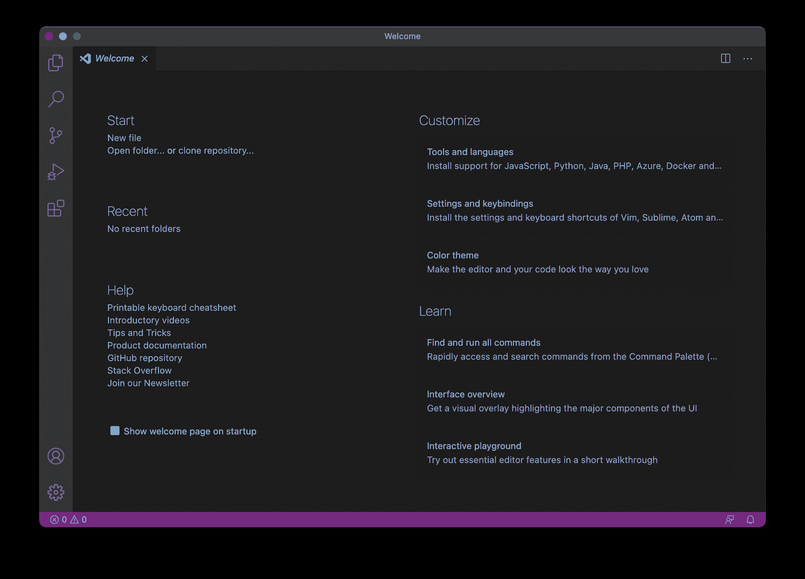

###### 图 3-1\. VS Code 欢迎屏幕。

当你点击左上角的空白文档图标时，将要求你打开一个文件夹或克隆一个 git 仓库（例如来自 GitHub）。我们将选择一个名为 `Intro_python` 的空文件夹，这个文件夹我们已经创建好了。打开这个文件夹就像在 RStudio 中打开一个项目一样。在这里，我们可以点击新文档图标，并将被要求为新文档命名。就像在图 3-2 中一样，文件名为 `helloworld.py`。

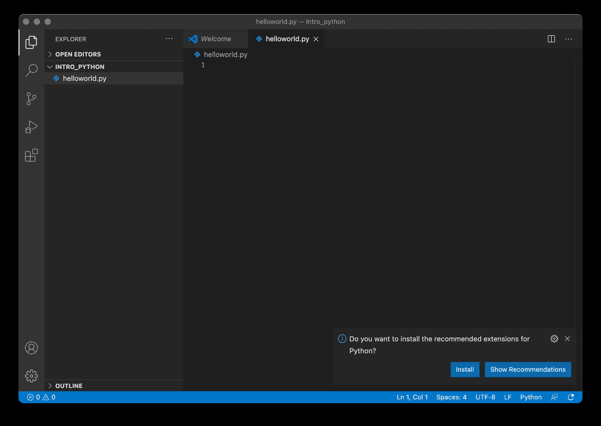

###### 图 3-2\. 我们的第一个 Python 脚本。

由于文件扩展名，VS Code 自动检测到你希望在此文档中使用 Python 解释器。与许多其他文本编辑器一样，如果它知道要使用的解释器，VS Code 可以直接执行文档中的代码。请注意图 3-2（右下角），VS Code 将自动要求你安装适用于 Python 的适当扩展，因为我们尚未安装它们（并且页脚从紫色变为蓝色，表示正在使用 Python 解释器）。鼓励你访问市场并考虑自行选择其他扩展，但大多数情况下“少即是多”。在图 3-3 中，显示了扩展主页在安装包时的状态。请注意，这个扩展是由微软直接开发和维护的，就像 VS Code 本身一样，所以我们是在可靠的手中^(5)。

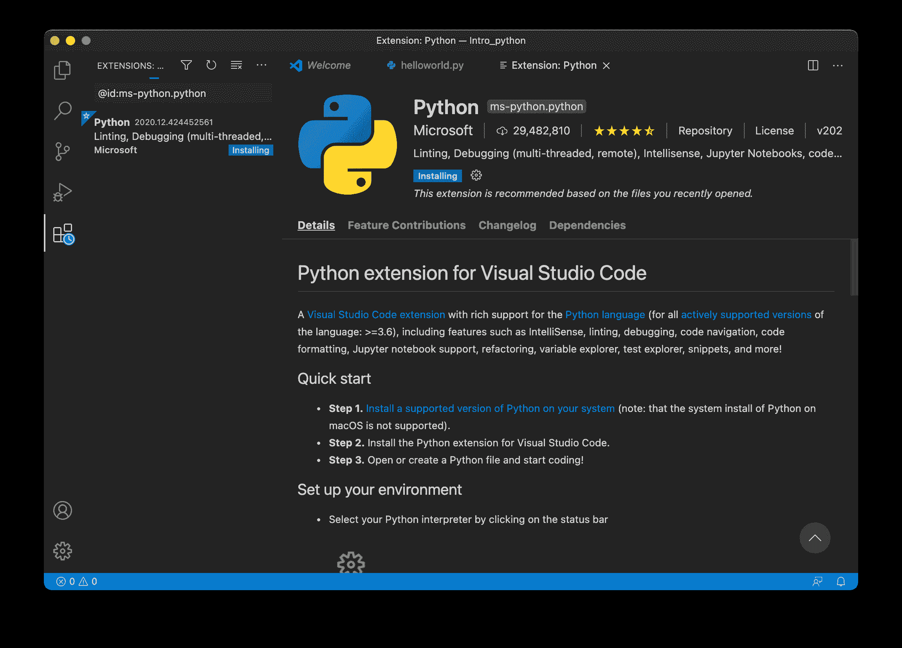

###### 图 3-3\. 安装 VS Code Python 扩展。

安装扩展后，将会看到扩展的欢迎页面，显示在图 3-4 中。蓝色页脚现在显示了你正在使用的实际 Python 版本。请记住，你的系统上可能安装了许多不同的版本，在这里我使用的是 `v3.8.6`。

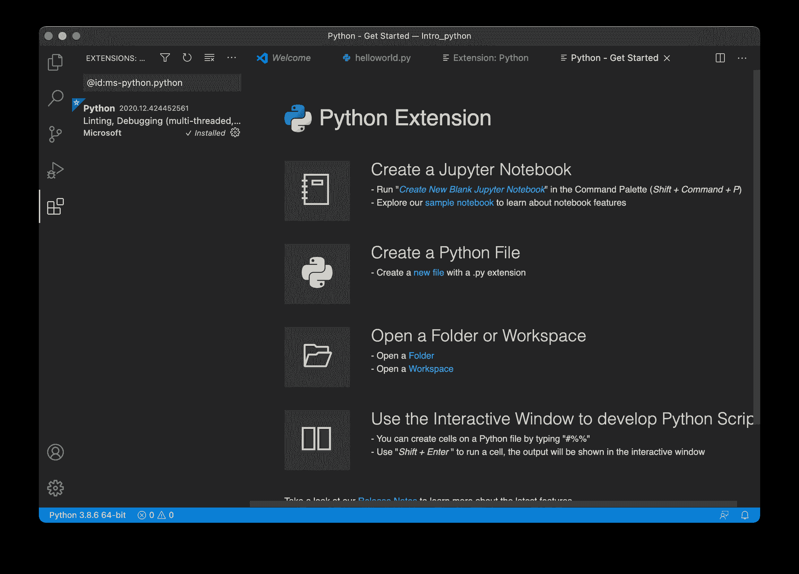

###### 图 3-4\. VS Code Python 扩展的欢迎屏幕。

扩展程序欢迎页面的第一项是“创建一个 Jupyter Notebook”。我们很快就会讨论到这一点；现在值得注意的是，我们可以在 VS Code 中同时使用脚本和 Notebooks。还要注意该项目的第一个要点告诉我们，要打开 Notebook，我们应该在命令面板中*运行*一个命令，您可以通过 Mac 上的键盘快捷键`shift + cmd + P`（或 PC 上的`shift + ctrl + P`）来访问该面板^(6)。返回到`helloworld.py`文件并使用此键盘快捷键来打开命令面板。这是您执行各种命令以使您的 Python 生活更轻松的地方。命令面板是 RStudio 中相对较新的功能，但长期以来一直是导航文本编辑器的标准方式。从市场安装的每个扩展程序都将添加更多您可以在此处访问的命令。我们的第一个命令将是`Create New Integrated Terminal (in Active Workspace)`。您只需开始输入命令，然后让自动完成完成其工作即可。确保选择`(in Active Workspace)`选项。请记住，这就像是一个 RStudio 项目，所以我们希望保持在我们的 Active Workspace 中。

这会在屏幕底部打开一个新的终端窗格（图 3-5）。好吧，我们承认，这开始看起来越来越像一个集成开发环境（IDE），但我们不要太兴奋！

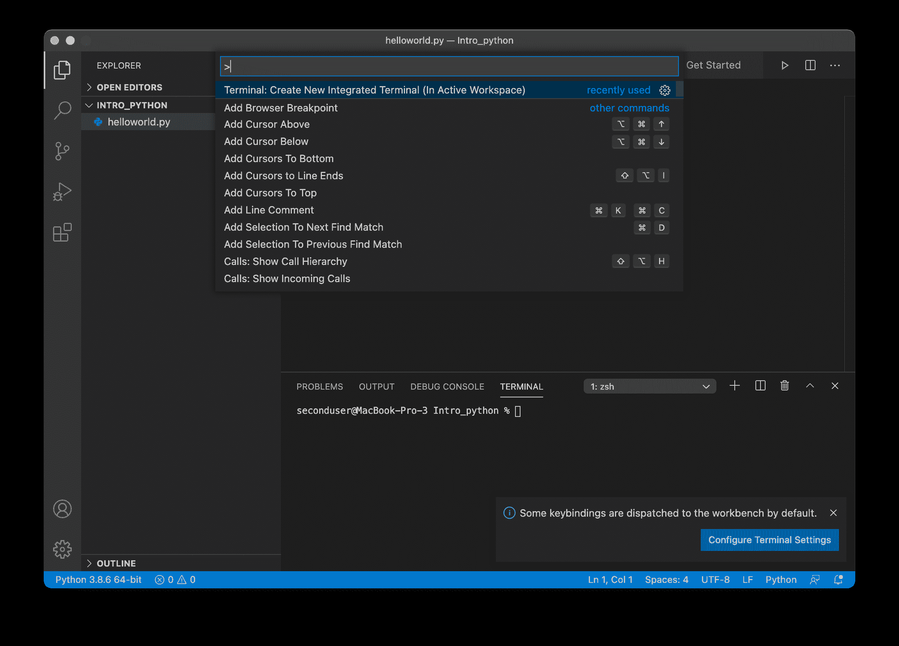

###### 图 3-5\. 带有命令面板和集成终端窗格的 VS Code。

到目前为止，我们已经选定了一个文本编辑器，并且有了我们的第一个（空的）Python 脚本。看起来我们已经准备好了 — 但还不完全！每当你想创建一个新的 Python 项目时，必须解决两个关键因素：

+   虚拟（开发）环境，以及

+   安装包

# 虚拟环境

大多数用户习惯于使用 RStudio 项目，这些项目将工作目录绑定到项目目录。这些项目非常方便，因为我们无需硬编码路径，并且被鼓励将所有数据和脚本保存在一个目录中。当您在 VS Code 工作空间中打开整个文件夹时，您已经拥有了这一点。

R 项目和 VS Code 工作空间的一个主要缺点是它们无法提供便携、可重现的开发环境！许多用户只有每个包的单个全局安装（参见`.libPaths()`），很少指定特定的 R 版本。

现在，亲爱的用户，让我们彼此诚实吧：如果你还没有遇到过包版本冲突的问题，那么在某个时候你会遇到的。你已经全局更新了一个包，现在一个旧脚本无法工作，因为它调用了一个不推荐使用的函数，或者使用了函数的默认参数，而这些参数已经改变，或者由于包版本冲突的任何其他原因。这在 R 中是一个令人惊讶地常见的问题，在长时间或协作工作中，这实际上是一种真正令人沮丧的做法。多年来，有许多尝试在 R 中实现某种受控开发环境。最近的尝试，也希望这将最终解决问题的方法，是 `renv`。如果你没有关注这方面的发展，请访问 RStudio 的 [包网站](https://rstudio.github.io/renv/articles/renv.html)。

Python 爱好者长期以来一直使用虚拟环境来保持其项目的未来兼容性，这是 Python 起源于编程优先方法的标志。在这里，虚拟环境只是项目文件夹中一个隐藏的子目录，例如 `.venv`。`.` 是使它隐藏的关键。你的计算机上有很多隐藏的文件和目录，大部分时间它们是隐藏的，因为你没有在那里乱动的理由。在 `.venv` 内部，你会找到用于 *这个* 特定项目的包以及关于 *这个* 项目使用的 Python 版本的信息。由于每个项目现在都包含一个虚拟环境，其中包含所有的包和适当的包版本（！），只要虚拟环境存在，你就保证项目将持续无限期地工作。我们可以像 Figure 3-6 中可视化不同机器之间的潜在依赖问题，这突显了拥有关于包版本的单一“真相源”的好处。

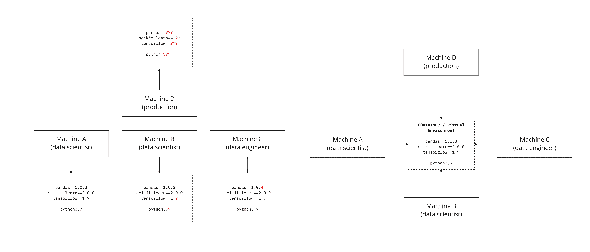

###### Figure 3-6\. Python 环境中的冲突来源。

就像 Python 中的一切一样，创建虚拟环境有很多方法。我们可以使用 `venv` 或 `virtualenv` 包。如果你在使用 Anaconda，你将使用 `conda` 的替代方法，这里我们不涉及。`venv` 和 `virtualenv` 之间有一些细微的差异，但在这个故事的这一点上它们是无关紧要的；让我们只使用 `venv`。在你的新终端窗口中执行 Table 3-2 中的一个命令，就像我在 Figure 3-7 中所做的那样。

Table 3-2\. 使用 venv 创建（和激活）虚拟环境。

| 平台 | 创建 | 激活（最好使用 VS Code 的自动激活） |
| --- | --- | --- |
| macOS X & Linux | `python3 -m venv .venv` | `source .venv/bin/activate` |
| Windows | `py -3 -m venv .venv` | `.venv\scripts\activate` |

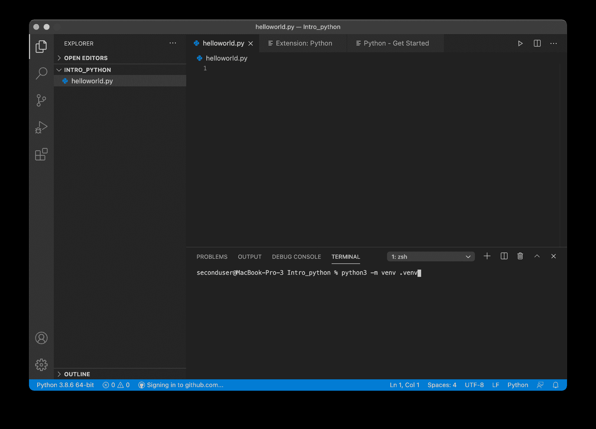

###### Figure 3-7\. 在我们的活动工作区创建一个新的虚拟环境。

在*创建*虚拟环境之后，您必须*激活*它。关于此的终端命令在表 3-2 中给出，但让 VS Code 做它最擅长的事情更方便。它将自动检测到您的新虚拟环境，并询问您是否要激活它（见图 3-8）。走吧！注意左下角的 Python 解释器也会明确提到`(.venv): venv`（见图 3-9）。

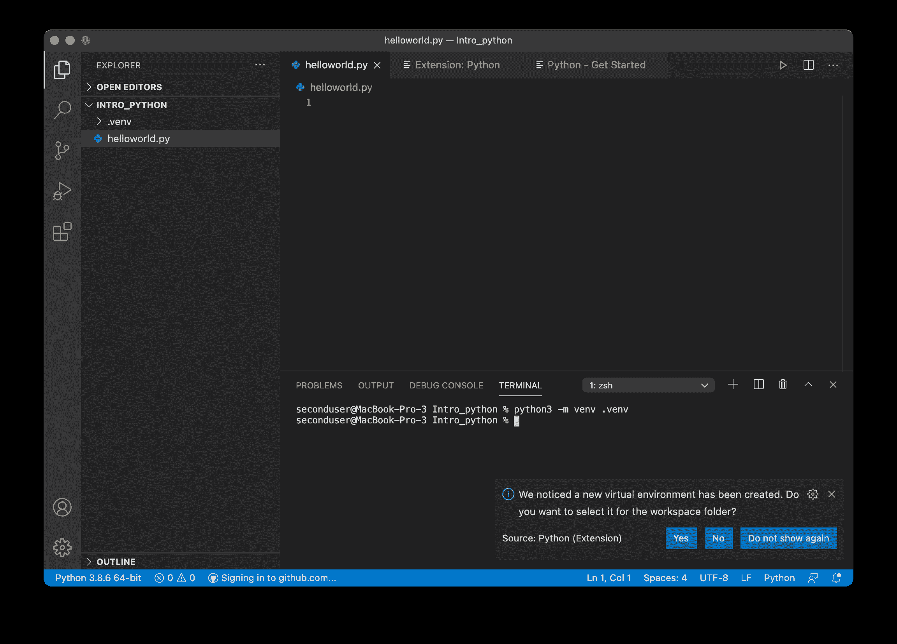

###### 图 3-8\. 在 VS Code 中激活虚拟环境。

如果要求安装 Linter pylint，请继续确认。这是 VS Code 将能够在您的脚本中发现错误的方式。

我们马上就会开始安装包，现在让我们试着执行我们的第一个“Hello, world!”命令。返回到你的空`helloworld.py`文件并输入：

```py
#%%
print('Hello, world!')
```

实际上，打印是不必要的，但它使我们尝试做的事情变得明确。这看起来很像一个简单的 R 函数，对吧？`#%%`也不是必需的，但它是 VS Code 中 Python 扩展的一个可爱功能，强烈推荐使用！键入`#%%`允许我们将长脚本分成可执行的块。这类似于 R Markdown 块，但更简单，并且用于普通的 Python 脚本。要执行命令，请按`shift + enter`或单击`run cell`文本，如图 3-9 所示。

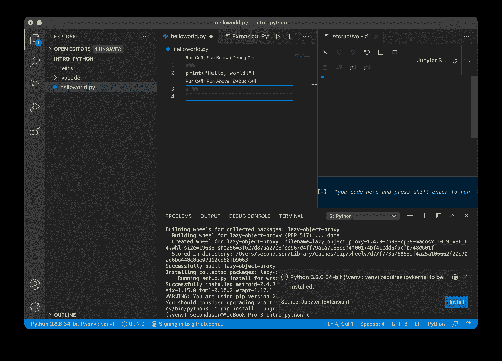

###### 图 3-9\. 在 Python 中执行您的第一个代码。

您将立即被要求安装 ipyKernel，见图图 3-9（右下角）。确认后，您将获得新窗口中的输出，可见于图 3-10。

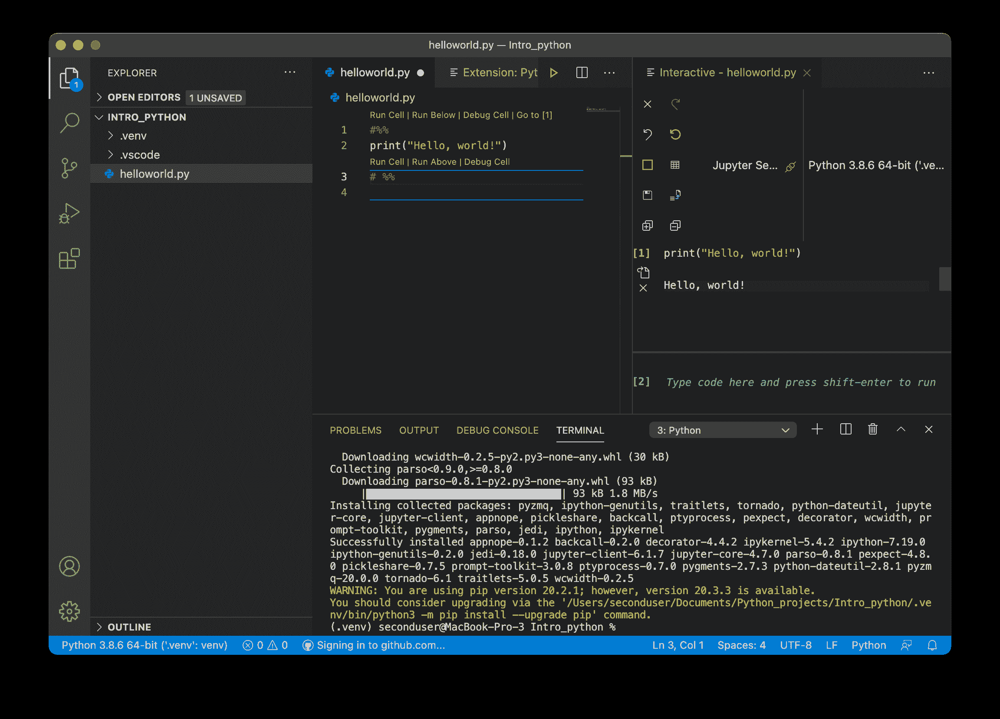

###### 图 3-10\. 在交互式 Python 查看器中查看命令输出。

好的，*现在*我们开始做生意了。看起来工作量很大，但是做几次后，你会形成一种常规并掌握要领！

# 安装软件包

到目前为止，在这个故事中，我们安装了某个版本的 Python，并在 VS Code 中访问了一个工作区，就像在 R 项目中一样。我们还创建了一个虚拟环境，现在准备用我们喜爱的数据科学包来填充它。如果你选择了`conda`这条路线，你会使用不同的命令，但也将预装最常见的数据科学包。这听起来非常不错，但你可能会发现，当你需要与其他 Python 开发人员合作时，比如数据工程师或系统管理员，他们可能不会使用 Anaconda。我们觉得，了解 Python 的核心，而不是 Anaconda 提供的所有花里胡哨的东西，也有其优点。因此，我们选择了纯粹的路线。

在我们开始讨论包之前，让我们复习一些必要的术语。在 R 中，库是一组单独的包。对于 Python 也是如此，但是 *库* 和 *包* 的使用并不那么严格。例如，`pandas` 这个包提供了 `DataFrame` 类的对象，它在 `pandas` 网站上被称为库和包。这种术语混用在 Python 程序员中很常见，所以如果你是一个严谨的命名者，不要被困扰。不过，模块是值得注意的。包是模块的集合。这是有用的知识，因为我们可以加载整个包或其中的一个特定模块。因此，一般而言：库 > 包 > 模块。

在 R 中，你可以使用 `install.packages()` 函数从 CRAN 安装包。在 Python 中，有两个等效的 CRAN，即 PyPI（Python 包安装器）用于使用原始 Python，以及 `conda`，用于使用 Anaconda 或 miniconda（稍后我们还将看到如何直接在在线笔记本中在 Google Colab 中安装包）。要使用原始 Python 从 PyPI 安装包，你需要在终端中执行命令。回想一下，我们之前还有一个活动的 VS Code 终端窗口。在终端中执行命令 `pip install matplotlib` 以在你的虚拟环境中安装 `matplotlib` 包，如图 3-11 所示。`pip` 是 Python 的包安装器，也有各种版本。

!   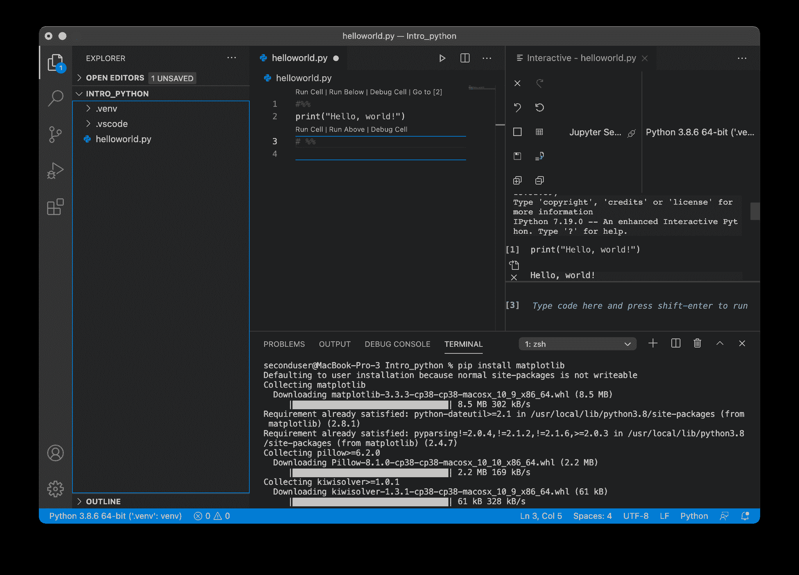

###### 图 3-11\. 使用命令行将包安装到虚拟环境中。

你几乎在每个虚拟环境中都会安装的包包括 `numpy`、`pandas`、`matplotlib`、`seaborn` 和 `scipy`。你不需要一直安装它们，因为它们的包依赖项会自动处理。如果它们已经安装，pip 会告诉你，并且不会安装任何其他内容。你在这里遇到的最常见的错误消息是你的包版本与你的 Python 版本不兼容。对于这个问题，你可以为你的项目使用不同的 Python 内核^(7)，或者指定你想要安装的确切包版本。就像在 R 中一样，你只需要安装包一次，但是每次你激活你的环境时都需要 *导入* 它（即 *初始化* 它）（见上文）。包安装与在脚本中导入分开似乎很方便。你可能在 R 脚本中看到许多单独的 `install.packages()` 函数，这有点烦人。

我想提及另外两个重要点。首先，在终端中使用以下命令检查环境中安装的所有包及其版本：

```py
---
$ pip freeze
---
```

其次，通过执行以下命令将此输出导出到名为 `requirements.txt` 的文件中：

```py
---
$ pip freeze > requirements.txt
---
```

其他用户现在可以使用 `requirements.txt` 文件通过以下命令安装所有必要的包：

```py
---
$ pip install -r requirements.txt
---
```

## 笔记本

如果到目前为止您已经按照教程操作，那么您已经准备好进入第三个问题并开始探索 Python 语言。尽管如此，复习笔记本仍然是值得的，所以请继续阅读。如果您在本地设置 Python 时遇到困难，不要担心！Jupyter Notebooks 是一个让您可以松一口气，将安装问题搁置一旁并重新开始的地方。

Jupyter Notebooks 建立在 IPython 的基础上，IPython 起源于 2001 年。Jupyter 代表 JUlia、PYThon 和 R，现在支持数十种编程语言，并且可以在 JupyterLab IDE 或 Jupyter 中直接使用笔记本。笔记本允许您使用 Markdown 编写文本，添加代码块并查看内联输出。这听起来很像 R Markdown！嗯，是和不是。在底层，R Markdown 是一个平面文本文件，可以呈现为 HTML、doc 或 pdf。笔记本专门基于 JSON 的 HTML，可以原生地处理交互式组件。对于使用 R 的人来说，默认情况下，这有点像带有`shiny`运行时的交互式 R Markdown。这意味着您不会将笔记本作为平面文本文件来构成，这在考虑编辑潜力时是一个重要的区别。

在 Python 编码中，通常会使用纯粹的笔记本。例如，如果你涉足处理大数据用于机器学习的云平台，比如 AWS Sagemaker、Google AI 平台或 Azure ML Studio，你将从笔记本开始。正如我们已经看到的，它们受到 VS Code 的支持。其他在线版本包括 Kaggle 竞赛和发布的 Jupyter Notebooks。另一种在线笔记本的变体可以在 Google Colab 服务中找到。这使您能够使用 Python 后端生成和分发在线笔记本，这也是我们用来探索笔记本的工具。

要熟悉使用笔记本，请使用 Jupyter 的这个在线教程[这里](https://jupyter.org/try)。只需点击[Notebook Basics panel](https://notebooks.gesis.org/binder/jupyter/user/ipython-ipython-in-depth-c0k4jcir/notebooks/binder/Index.ipynb)，特别注意键盘快捷键。

如果您想跟进，您可以在这一章节找到 Google Colab 笔记本[这里](https://colab.research.google.com/drive/1qwgMIKc84JCYAj0zJZQSOgVZbk6nI9XX?usp=sharing)。

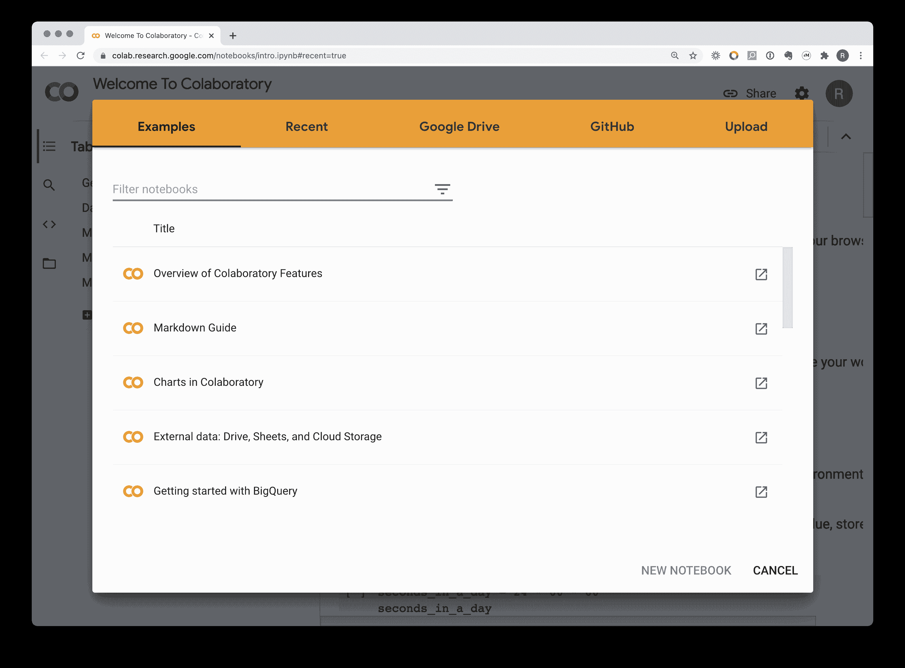

###### 图 3-12。使用 Google Colab 开始使用 Python 笔记本的示例。

# Python 语言与 R 语言有什么区别呢？

到目前为止，您应该已经选择了两条路中的一条。如果您已经在本地安装了 Python，您应该已经：

1.  一个项目目录，您将在其中存储数据和脚本文件。

1.  在该目录中设置一个虚拟环境。

1.  在该虚拟环境中安装数据科学的典型软件包。

如果您决定使用 Google Colab，您应该已经访问了本章的笔记本（见上文）。

现在是时候通过导入我们将使用的包来开始我们的项目了。在这里，我们会再次看到有多种方法可以做到这一点，但大多数方法都是标准的。让我们来看看。在书的[存储库](https://github.com/moderndatadesign/PyR4MDS)中，您会找到一个练习脚本，其中包含以下命令，或者您可以在 Google Colab Notebook 中跟随。

随着我们逐步介绍这些命令，我们将引入更多新术语——关键字、方法和属性——并讨论它们在 Python 上下文中的含义。

首先，我们可以导入整个包：

```py
import math # Functions beyond the basic maths
```

这允许我们使用 `math` 包中的函数。`math` 包已经安装好了，所以我们不需要使用 `pip`，但我们确实需要导入它。

这是我们第一次接触 Python 语言的一个常见而重要的方面：*关键字*，它们类似于 R 语言中的保留字，但数量更多。现在 Python 中有 35 个关键字，可以分成不同的组（见附录 A）。在这里，`import` 是一个*导入关键字*。作为习惯于函数式编程的 useR，在 R 中你会使用 `library(math)`。因此，在这种情况下，你可以把关键字看作是函数的快捷方式，实际上在很多情况下确实是这样。这就像 R 中的运算符（比如 `<-`、`+`、`==`、`&` 等），它们在底层也是函数的快捷方式。它们不是用经典的函数格式写的，但它们本质上确实是函数。

简而言之，关键字是具有非常具体含义的保留字。在这种情况下，`import` 代表着一个函数，用于*导入* `math` 包中的所有函数。很多关键字都是这样的，但不是全部。我们稍后会看到一些例子。

但首先，既然我们已经从 math 包中得到了函数，让我们试试这个：

```py
math.log(8, 2)
```

在这里，我们看到 `.` 具有特定的含义：在 `math` 包内部，访问 `log()` 函数。两个参数分别是数字和基数。所以你可以看到为什么 R Tidyverse 倾向于使用 `_` 而不是 `.` 符号，以及为什么许多 R 函数中无意义的 `.` 符号会让许多从面向对象编程语言转来的用户感到沮丧。

其次，我们可以导入整个包并给它一个特定的、通常是标准化的*别名*。

```py
import pandas as pd      # For DataFrame and handling
import numpy as np       # Array and numerical processing
import seaborn as sns    # High level Plotting
```

这里是我们的第二个关键字，`as`。请注意，它实际上并没有像一个函数一样起作用，除非我们记得 `<-` 也是一个函数。如果我们发挥一下想象力，我们可以把它想象成在 R 中的以下用法：

```py
dp <- library(dplyr)       # nonsense, but just as an idea
```

useR 不会这样做，但这是与之最接近的类似命令^(8)。`as` 关键字总是与 `import` 一起使用，为访问包或模块的函数提供了一个便捷的*别名*^(9)。因此，它是调用我们想要的确切函数的明确方式。执行此函数以导入数据集以供将来使用：

```py
plant_growth = pd.read_csv('ch03-py4r/data/plant_growth.csv')
```

注意再次出现的 `.`？上面的命令相当于在 R 中执行以下命令：

```py
plant_growth <- readr::read_csv("ch03-py4r/data/plant_growth.csv")
```

第三，我们可以从一个包中导入一个特定的*模块*：

```py
from scipy import stats # e.g. for t-test function
```

这里是我们的第三个关键字`from`。它允许我们进入`scipy`包并*仅*导入`stats`模块。

第四，我们可以从包中导入特定模块，并为其指定一个通常标准化的别名。

```py
import matplotlib.pyplot as plt # Low level plotting
import statsmodels.api as sm    # Modeling, e.g. ANOVA
```

最后，我们还可以仅从包中导入特定函数：

```py
from statsmodels.formula.api import ols # For ordinary least squares regression
```

## 导入数据集

上面，我们看到如何使用`pandas`包的函数导入数据集：

```py
plant_growth = pd.read_csv('ch03-py4r/data/plant_growth.csv')
```

## 检查数据

在我们开始处理数据之前，查看数据总是一个良好的做法。在 R 中，我们会使用`summary()`和`str()`，或者如果我们初始化了`dplyr`，则会使用`glimpse()`。让我们看看这在 Python 中是如何工作的。

```py
plant_growth.info()

<class 'pandas.core.frame.DataFrame'>
RangeIndex: 30 entries, 0 to 29
Data columns (total 2 columns):
 #   Column  Non-Null Count  Dtype
---  ------  --------------  -----
 0   weight  30 non-null     float64
 1   group   30 non-null     object
dtypes: float64(1), object(1)
memory usage: 608.0+ bytes
```

```py
plant_growth.describe()

        weight
count	30.000000
 mean	5.073000
  std	0.701192
  min	3.590000
  25%	4.550000
  50%	5.155000
  75%	5.530000
  max	6.310000
```

```py
plant_growth.head()

  weight	group
0	4.17	ctrl
1	5.58	ctrl
2	5.18	ctrl
3	6.11	ctrl
4	4.50	ctrl
```

什么？？这是我们第一次遇到这个术语，而且又出现了那个无处不在的点符号！`info()`、`describe()`和`head()`函数是`plant_growth`对象的*方法*。方法是由对象调用的函数。与其他函数一样，我们也可以提供特定的参数，尽管在这些情况下，我们将坚持使用默认值。

特别注意`info()`方法的输出。在这里，我们首次看到 Python 中索引从 0 开始，这与许多编程语言相同 —— 那又为什么不呢？这是 Python 编程的一个重要方面。当我们进行索引时，稍后我们将看到这会产生什么后果。

`.info()`的输出还告诉我们，我们有一个`pandas DataFrame`。我们很快会探索不同的对象类。

如何查看`plant_growth`对象的形状（即维度）和列名？

```py
plant_growth.shape

(30, 2)
```

```py
plant_growth.columns

Index(['weight', 'group'], dtype='object')
```

在这种情况下，我们正在调用对象的*属性*，它们不接收任何括号。因此，我们可以看到，任何给定对象都可以调用其类允许的可允许的方法和属性。您将从 R 中知道这一点，当对象的类允许它在具体函数中使用时。在底层，相同的魔术正在发生。R 首先是函数，其次是 OOP。它在那里，只是我们在函数式编程中不需要*太多*担心它。为了让您了解在 R 中这是如何工作的，请考虑内置数据集`sunspots`。它是一个`ts`类对象（即时间序列）。

```py
# in R
class(sunspots)
[1] "ts"
plot(sunspots)
```

您可以使用以下代码查找绘图函数的方法：

```py
# in R
methods(plot)
```

在这里，您将看到`plot.ts()`方法，当您为`plot()`函数提供一个`ts`类对象时，实际上调用的就是它。

最后，您可能会错过实际*查看*数据集的能力，就像我们可以使用 RStudio 的查看选项一样。别担心！您可以点击交互式 Python 内核中的表格图标，并查看环境中的所有内容。如果您单击`DataFrame`，它将为您打开一个视图以便您查看它。

# 数据结构与描述性统计

好了，现在我们已经掌握了方法和属性，让我们看看如何生成一些描述性统计数据。`pandas DataFrame`非常类似于 R 中的`data.frame`或`tbl`。它是一个二维表格，其中每一列都是一个`Series`，就像在 R 数据框中列是相同长度的向量一样。就像`DataFrame`本身一样，`Series`也有方法和属性。记住`group`列是分类的。到现在为止，这个命令应该对你有意义：

```py
plant_growth['group'].value_counts()

trt2    10
trt1    10
ctrl    10
Name: group, dtype: int64
```

`[[]]`对你来说可能很熟悉，它们按列名索引。然后，这个单列调用一个方法`.value_counts()`，在本例中计算每个值的观察次数。

这样如何：

```py
np.mean(plant_growth['weight'])
```

`np`表示我们将使用我们之前导入的`numpy`包中的一个函数。在该函数内部，我们提供数值，即`plant_growth` DataFrame 的`weight` Series。

关于一些汇总统计数据，你能猜到这个方法会做什么吗？

```py
# summary statistics
plant_growth.groupby(['group']).describe()
```

就像`dplyr`的`group_by()`函数一样，`groupby()`方法将允许按照分类变量对每个子集应用下游方法，在本例中是`group` Series。`describe()`方法将为每个子集提供一系列汇总统计信息。

这个版本更加具体：

```py
plant_growth.groupby(['group']).agg({'weight':['mean','std']})
```

你可能猜到`.agg()`方法代表*聚合*。聚合函数返回一个单一值（通常）在 R 中，我们会使用`summarise()`函数来指定它。

对于`.agg()`方法的输入，`{'weight':['mean','std']}`，这是一个字典（类`dict`）。你可以将其看作是一个键值对，在这里使用`{}`定义：

```py
{'weight':['mean','std']}
```

我们也可以使用`dict()`函数来达到同样的目的：

```py
dict([('weight', ['mean','std'])])
```

字典是数据存储对象本身，是标准的纯粹 Python 的一部分，并且正如我们在这里看到的，被用作输入方法和函数中的参数。这与 R 中列表的使用方式相似，在特定情况下用于数据存储和作为参数列表。然而，字典更适合被视为*关联数组*，因为索引仅由键而不是数字完成。我可以说字典更像是 R 中的环境，因为它包含了许多对象但没有索引，但这可能有点牵强。

让我们深入挖掘一下。以下命令产生相同的输出，但格式不同！

```py
# Produces Pandas Series
plant_growth.groupby('group')['weight'].mean()
```

```py
# Produces Pandas DataFrame
plant_growth.groupby('group')[['weight']].mean()
```

注意`[[]]`与`[]`的区别吗？它提醒了你在处理不是 tibbles 的数据框时可能遇到的差异。

## 数据结构：回到基础

在 Python 中，我们已经看到了三种常见的数据存储对象，`pandas DataFrame`、`pandas Series`和`dict`。只有`dict`是来自原始 Python 的，因此在我们进一步探讨之前，我想看看其他一些基本结构：`lists`、`tuples`和`NumPy arrays`。我选择在比预期晚得多的时间介绍它们，因为我希望从直觉和频繁使用的数据框架开始。所以在结束之前，让我们确保掌握了基础知识：

首先，就像在 R 中一样，你会看到 Python 中的四种关键数据类型：

表 3-3\. Python 中的数据类型。

| 类型 | 名称 | 示例 |
| --- | --- | --- |
| `bool` | 二进制 | `True`和`False` |
| `int` | 整数 | 7,9,2,-4 |
| `float` | 实数 | 3.14, 2.78, 6.45 |
| `str` | 字符串 | 所有字母数字字符和特殊字符 |

接下来，你将遇到列表，这是一维对象。与 R 中的向量不同，每个元素可以是不同的对象，例如另一个一维列表。这里是两个简单的列表：

```py
cities = ['Munich', 'Paris', 'Amsterdam']
dist = [584, 1054, 653]
```

注意，`[]`定义了一个列表。实际上，我们在前面定义`dict`时已经看到了这一点：

```py
{'weight':['mean','std']}
```

因此，`[]`和`{}`单独在 Python 中是有效的并且具有不同的行为，与 R 中不同。但请记住，我们之前使用`[]`来索引数据框，这与 R 非常相似。

```py
plant_growth['weight']
```

最后，我们有元组，它们类似于列表，但是不可变，即不能更改，它们由`()`定义，如下所示：

```py
('Munich', 'Paris', 'Amsterdam')
```

元组的常见用法是函数返回多个值时使用。例如，`divmod()`函数返回两个数的整数除法和模数的结果：

```py
>>>   divmod(10, 3)
(3, 1)
```

结果是一个元组，但我们可以*解包*这个元组，并将每个输出分配给单独的对象：

```py
int, mod = divmod(10, 3)
```

当定义自定义函数时，这非常方便。在 R 中的等价操作是将输出保存到列表中。

精明的用户可能熟悉由`zeallot`包引入并由`keras`流行化的多重赋值操作符`%<-%`。

我想提到的最后一个数据结构是 NumPy 数组。这与一维列表非常相似，但允许进行向量化等操作。例如：

```py
# A list of distances
>>> dist
[584, 1054, 653]
# Some transformation function
>>> dist * 2
[584, 1054, 653, 584, 1054, 653]
```

这与使用 R 的用法非常不同。如果我们正在处理 NumPy 数组，我们将回到熟悉的领域：

```py
# Make a numpy array
>>> dist_array = np.array(dist)
>>> dist_array * 2
array([1168, 2108, 1306])
```

## 索引和逻辑表达式

现在我们有了各种对象，让我们看看如何对它们进行索引。我们已经看到可以使用`[]`甚至`[[]]`，就像在 R 中看到的那样，但是有几个有趣的区别。请记住，Python 中的索引始终从 0 开始！另外，请注意，在 R 中最常见的操作符之一，即`:`，在 Python 中以稍微不同的形式再次出现，这里是`[start:end]`。

```py
>>> dist_array
array([ 584, 1054,  653])
>>>  dist_array[:2]
array([ 584, 1054])
>>>  dist_array()
array([1054,  653])
```

`:`运算符不需要左右两侧。如果一侧为空，则索引从开始或继续到末尾。起始处是*包含*的，如果指定了结束，那么结束是*不包含*的。因此`:2`获取索引 0 和 1，`1:`获取从索引 1 到最后一个未指定的元素，因此是包含的。

对于二维数据框架，我们遇到了 pandas 的`.iloc`，“索引位置”和`.loc`“位置”方法。

```py
# Rows: 0th and 2nd
>>> plant_growth.iloc[[0,2]]
  weight	group
0	4.17	ctrl
2	5.18	ctrl

# Rows: 0th to 5th, exclusive
# Cols: 1st
>>> plant_growth.iloc[:5, 0]
0    4.17
1    5.58
2    5.18
3    6.11
4    4.50
```

对于`.loc()`，我们可以引入逻辑表达式，即关系运算符和逻辑运算符的组合，以提出和组合`True`/`False`问题。

```py
>>> plant_growth.loc[(plant_growth.weight <=  4)]
   weight	group
13	3.59	trt1
15	3.83	trt1
```

对于有关索引和逻辑表达式的更多详细信息，请参阅附录中的笔记。

## 绘图

好的，让我们来看看描述由组别权重的一些数据可视化。在这里，我们有一个箱线图：

```py
sns.boxplot(x='group', y='weight', data=plant_growth)
plt.show()
```

只是这些点：

```py
sns.catplot(x="group", y="weight", data=plant_growth)
plt.show()
```

只是均值和它们的标准偏差：

```py
sns.catplot(x="group", y="weight", data=plant_growth, kind="point")
plt.show()
```

请注意，我正在使用`seaborn`包（别名为`sns`）进行数据可视化，然后使用`matplotlib`的`show()`函数将可视化结果打印到屏幕上。

# 推断统计

在这个数据集中，我们有一个特定的设置，即我们有三个组，并且我们对两个特定的两组比较感兴趣。我们可以通过建立线性模型来实现这一点。

```py
# fit a linear model
# specify model
model = ols("weight ~ group", plant_growth)

# fit model
results = model.fit()
```

我们可以直接获取模型的系数：

```py
# extract coefficients
results.params.Intercept
results.params["group[T.trt1]"]
results.params["group[T.trt2]"]
```

最后，让我们来看看我们模型的摘要：

```py
# Explore model results
results.summary()
```

好的，让我们通过使用这种类型数据的典型统计测试来结束：单因素方差分析。请注意，我们正在使用我们上面拟合的模型`results`。

```py
# ANOVA
# compute anova
aov_table = sm.stats.anova_lm(results, typ=2)

# explore anova results
aov_table
print(aov_table)
```

如果我们想要进行所有成对比较，我们可以转向图基的 Tukey 显著性差异（HSD）事后检验：

```py
from statsmodels.stats.multicomp import pairwise_tukeyhsd
print(pairwise_tukeyhsd(plant_growth['weight'], plant_growth['group']))
```

在这个例子中，我们从`statsmodel`库开始，使用其中的`stats`包和`multicomp`模块，并从中提取特定的`pairwise_tukeyhsd()`函数以导入。在第二行，我们使用连续变量作为第一个参数和分组变量作为第二个参数执行该函数。

# 最后的想法

在 R 中，自 2016 年以来，已经形成了关于常见实践和工作流程的共识。在 Python 中，有更多的多样性可以在一开始就上手。这种多样性可能看起来令人生畏，但它只是 Python 起源故事和现实世界用例的反映。

如果您是习惯于函数式编程世界的用户，那么掌握面向对象的方法也可能会显得非常困难，但一旦您跨越了这个障碍，您就可以开始利用 Python 真正闪耀的地方，即第三部分的话题。

^(1) 实际上，其他构建很少在合适的公司提到

^(2) 如果您想通过这种方式进入 macOS，请安装[homebrew](https://brew.sh/)。

^(3) 您需要一个 Google 账户来访问这个免费资源。

^(4) 尽管 R 得到支持，但使用者很少在 VS Code 中工作。

^(5) 好吧，至少我们是*某人的*手下！

^(6) 敏锐的用户可能已经注意到，在 2020 年底，RStudio v1.4 增加了使用相同键盘快捷键调用的命令面板。

^(7) Python 执行后端。

^(8) 但是请记住，当我们开始同时使用 Python 和 R 时，因为我们会看到非常相似的东西。

^(9) 回顾一下`log()`，你更有可能使用`np.log()`而不是`math.log()`，因为它接受更广泛的输入类型。
