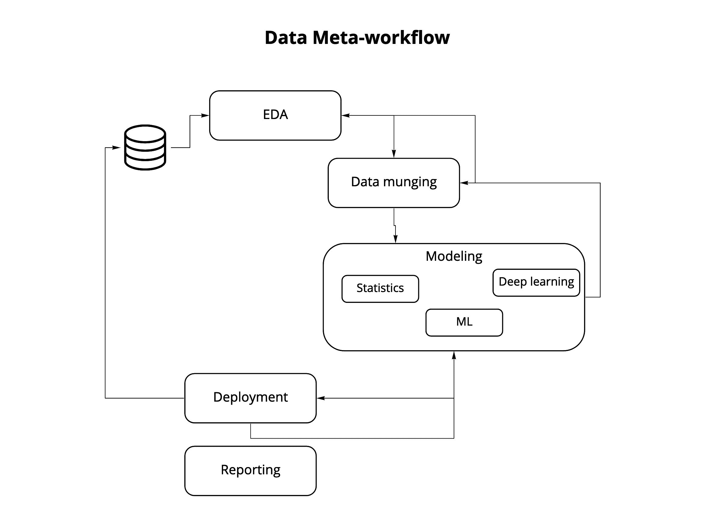
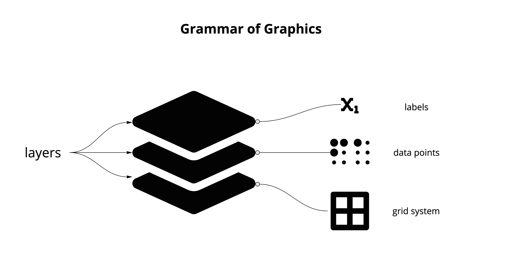
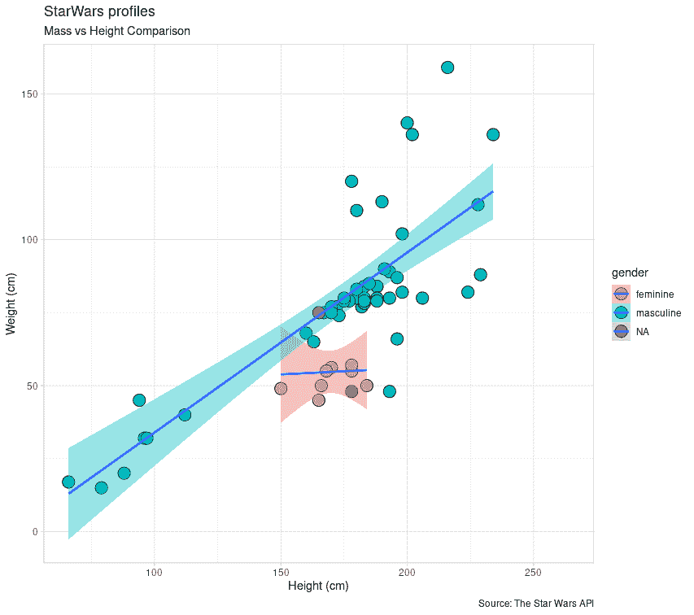
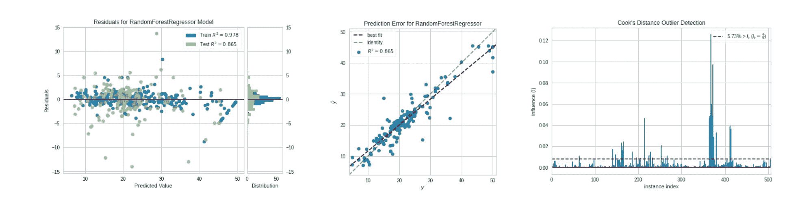
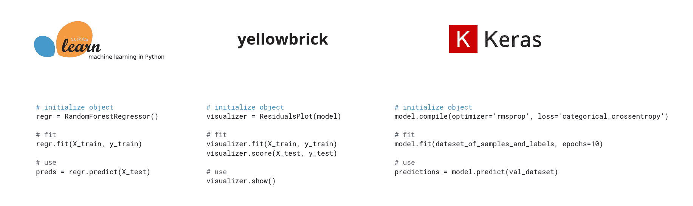
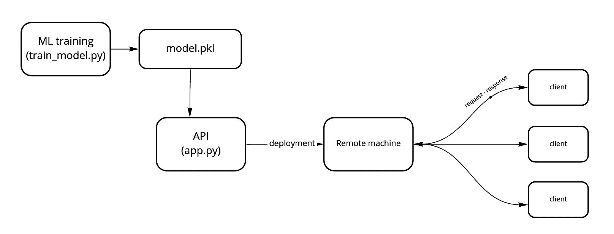
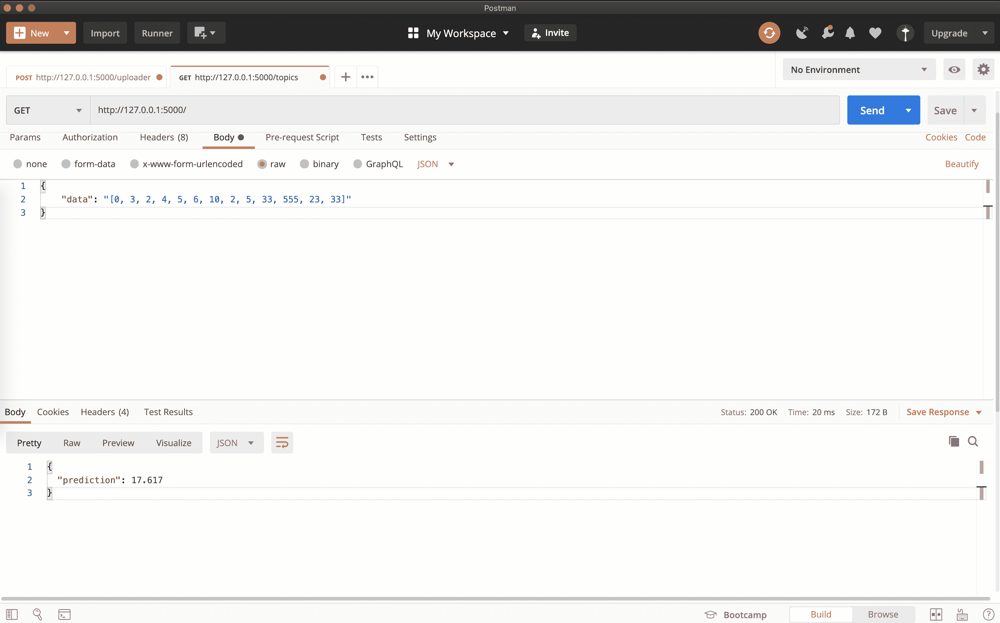
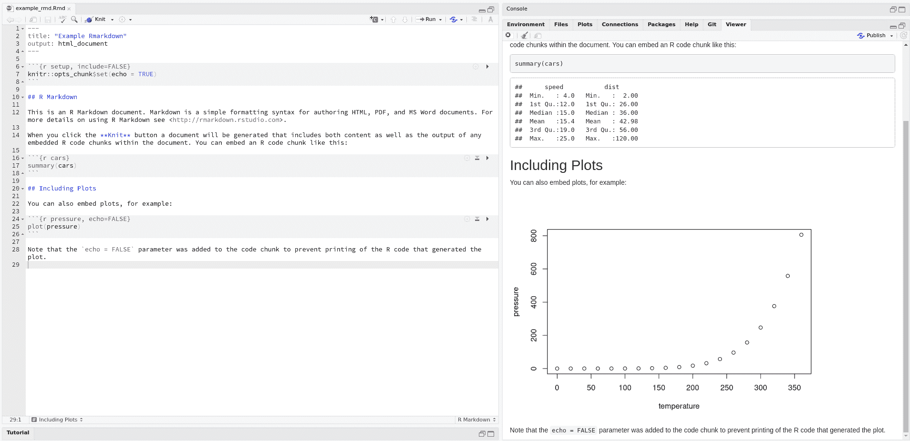
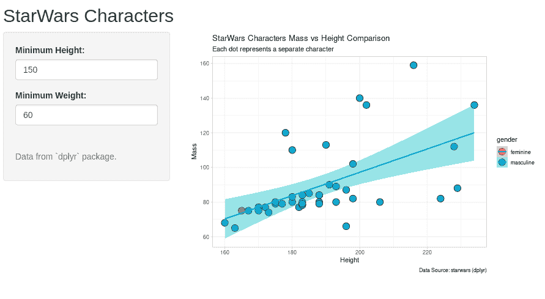

# 第五章：工作流上下文

Boyan Angelov

数据科学家常见的挫败感来源于与邻域领域同事讨论工作。让我们以一个例子来说明，一个主要从事机器学习（ML）模型开发的人，与商业智能（BI）团队的同事交流。这种讨论往往会让双方感到不适，因为他们认为彼此对对方工作领域（及相关工作流程）了解不足，尽管拥有相同的职位头衔。ML 的人可能会想知道 D3.js 是什么，图形语法是什么，等等？另一方面，BI 数据科学家可能会因不知如何构建可部署的 API 而感到不安。这种情况可能会引发“冒名顶替综合征”，即对自己能力的怀疑。这种情况是数据科学应用潜力巨大的副产品。一个人很少能对多个子领域有同样程度的熟悉。在这个快速发展的领域中，通常需要灵活性。

此复杂性为本章工作流重点奠定了基础。我们将讨论主要的数据科学工作流以及语言的不同生态系统如何支持它们。就像第四章一样，在本章末尾，您将拥有做出关于工作流的明智决策所需的一切。

# 定义工作流程

让我们退一步，定义一个工作流程：

> **工作流是从特定职能角度执行所有任务所需的所有工具和框架的完整集合。**

以 ML 工程师为例，您的日常任务可能包括获取数据的工具、处理数据、在其上训练模型以及部署框架。这些集合共同代表了 ML 工程师的工作流程。关于此和其他职位的数据工作流程概述及其支持工具，见表 5-1。

第 5-1 表。常见数据科学工作流程及其支持工具。

| 方法 | Python 软件包 | R 软件包 |
| --- | --- | --- |
| 数据整理^(a) | `pandas` | `dplyr` |
| EDA | `matplotlib`, `seaborn`, `pandas` | `ggplot2`, `base-r`, `leaflet` |
| 机器学习 | `scikit-learn` | `mlr`, `tidymodels`, `caret` |
| 深度学习 | `keras`, `tensorflow`, `pytorch` | `keras`, `tensorflow`, `torch` |
| 数据工程^(b) | `flask`, `bentoML`, `fastapi` | `plumber` |
| 报告 | `jupyter`, `streamlit` | `rmarkdown`, `shiny` |
| ^(a) 数据整理（或称为数据处理）是数据科学中如此基础的主题，以至于已在第二章中讨论过。^(b) 数据工程不仅仅是模型部署，但我们决定聚焦于这一子集，以展示 Python 的能力。 |

我们省略了一些领域，希望列出的是最常见和关键的。所选的工作流程彼此相关，如在图 5-1 中所示。这个图表在很大程度上借鉴了[CRISP-DM](https://en.wikipedia.org/wiki/Cross-industry_standard_process_for_data_mining)框架，展示了典型数据科学项目中的所有重要步骤。图表中的每个步骤都有一个单独的工作流与之关联，通常分配给个人或团队。



###### 图 5-1\. 数据科学与工程中的元工作流。

现在我们已经定义了一个工作流程，那么一个“好”的工作流程的定义属性是什么？我们可以编制一个包含三个主要因素的检查列表：

1.  它已经被充分确立。它被社区广泛采纳（也跨越不同的应用领域，如计算机视觉或自然语言处理）。

1.  它由一个维护良好的开源生态系统和社区支持。依赖于封闭源和商业应用程序（如 Matlab）的工作流程不被认为是可接受的。

1.  它适用于重叠的工作职能。最佳工作流程类似于乐高积木 - 它们的模块化设计和可扩展性可以支持各种技术堆栈。

通过全局视图和定义，让我们更深入地了解不同的工作流程及其在 R 和 Python 中的支持！

# 探索性数据分析

查看数字是*困难的*。查看包含数以百万计数据的数据行更具挑战性。任何处理数据的人每天都面临这一挑战。这种需求促使数据可视化（DV）工具的显著发展。该领域的一个最新趋势是自助分析工具的爆炸性增长，例如[Tableau](https://www.tableau.com/)、[Alteryx](https://www.alteryx.com/)和[Microsoft PowerBI](https://powerbi.microsoft.com/en-us/)。这些工具非常有用，但开源世界中也有许多可用的替代品，通常能够竞争甚至超过其商业对手的能力（除了在某些情况下的易用性）。这些工具共同代表了 EDA 工作流。

# 何时使用 GUI 进行 EDA

许多数据科学家对使用图形用户界面（GUI）进行日常工作持反感态度。他们更喜欢命令行工具的灵活性和效用。然而，在某些情况下，使用 GUI 更为合理（出于生产力考虑），例如在 EDA 中。生成多个图表可能非常耗时，尤其是在数据科学项目的初期阶段。通常需要创建数十甚至数百个图表。想象一下为每个图表编写代码（即使通过重构代码为函数来改进代码的组织方式）。对于一些较大的数据集，使用一些 GUI 工具，如 AWS Quicksight 或 Google Data Studio，通常更为便捷。通过使用 GUI，数据科学家可以快速生成大量图表，然后只需为通过筛选的图表编写代码。还有一些不错的开源 GUI 工具，例如 [Orange](https://orange.biolab.si/)。

EDA 是对任何数据源进行分析的基础步骤。通常在数据加载后直接进行，在业务理解方面有显著需求的阶段。这解释了为什么它是一个必要的步骤。你可能熟悉 *垃圾进，垃圾出* 的范式 - 任何数据项目的质量取决于输入数据的质量和背后的领域知识。EDA 促进了下游工作流程（如 ML）的成功，确保数据和其背后的假设都是正确且具有足够的质量。

在 EDA 中，R 拥有比 Python 更好的工具。正如我们在 第一章 和 第二章 中讨论的，R 是一门由统计学家为统计学家开发的语言（还记得第二章中的 FUBU 吗？），在统计学中，数据可视化（绘图）几十年来一直非常重要。Python 在近年来取得了一些进展，但仍被认为是滞后的（只需看看例子 `matplotlib` 绘图就能意识到这一事实¹）。足够赞扬 R 了，让我们看看为什么它在 EDA 中如此出色！

## 静态可视化

您应该已经熟悉了基本 R 在 DV 方面的能力，特别是关于时间序列绘图的部分 第四章。在这里，我们将进一步讨论并介绍最著名的 R 包之一 - `ggplot2`。它是 Python 爱好者希望转向 R 的主要原因之一²。`ggplot2` 在 EDA 工作中如此成功的原因在于它基于一个经过深思熟虑的方法论 - 图形语法（GoG）。这是由 L. Wilkinson 开发的，而包由 Hadley Wickham 开发³。

什么*是* GoG？它的[原始论文](https://vita.had.co.nz/papers/layered-grammar.html)标题为“图形的分层语法”，而“分层”一词是关键。您在图上看到的每一样东西都对一个更大的堆栈或系统有所贡献。例如，坐标轴和网格形成一个单独的层，与线条、条形和点相比。后者构成“数据”层。所有图层的完整堆栈形成结果 - 一个完整的`ggplot`。这种模块化的设计模式可以提供极大的灵活性，并提供了一种新的数据可视化思维方式。GoG 背后的逻辑在图 5-2 中说明。



###### 图 5-2\. 图形语法的分层结构。

为了说明常规 EDA 工作流程的不同程序，我们将使用`dplyr`包中的`starwars`数据集⁴。这个数据集包含了关于星球大战电影中人物的信息，比如他们的性别、身高和物种。让我们来看一下！

```py
library(ggplot2)
library(dplyr)

data("starwars") 
```


这将使数据集在您的 RStudio 环境中可见，但这并不是严格必要的。

作为第一步，让我们做一个基本的绘图：

```py
ggplot(starwars, aes(hair_color)) +
  geom_bar()
```

这个图绘制了头发颜色变量的计数。在这里，我们看到了一个熟悉的运算符，`+`，被不同寻常地使用。在`ggplot2`中，我们使用`+`来在图中*添加*图层。让我们在此基础上构建一个更复杂的案例。注意，我们在这里省略了代码中的一个过滤步骤（有一个离群值 - 贾巴·赫特）：⁵。

```py
ggplot(starwars, aes(x = height, y = mass, fill = gender)) + 
  geom_point(shape = 21, size = 5) + 
  theme_light() + 
  geom_smooth(method = "lm") + 
  labs(x = "Height (cm)", y = "Weight (cm)",
       title = "StarWars profiles ",
       subtitle = "Mass vs Height Comparison",
       caption = "Source: The Star Wars API") 
```


指定要使用的数据和特征。


选择一个点图（最适合连续数据）。


使用内置的`theme` - 一组特定的图层样式。


拟合一个线性模型并将结果显示为绘图的一层。


添加标题和轴标签。

此绘图操作的结果显示在图 5-3 中。仅用几行代码，我们就创建了一个漂亮的图，甚至可以进一步扩展。



###### 图 5-3\. 一个高级的 ggplot2 图。

现在我们已经介绍了静态可视化，让我们看看如何通过添加交互性使它们更有趣！

## 交互式可视化

交互性可以极大地帮助探索性绘图。两个出色的 R 包脱颖而出：[`leaflet`](https://rstudio.github.io/leaflet/) 和 [`plotly`](https://plotly.com/)。

# 小心 JavaScript

Python 和 R 中的交互性通常基于底层的 JavaScript 代码库。像`leaflet`和`plotly`这样的包已经为我们处理了这些，但我们也可以学习纯 JavaScript。对于初学者来说，像[D3.js](https://d3js.org/)这样的交互图形的低级包可能会感到无法掌握。因此，我们鼓励学习高级框架，比如[Dimple.js](http://dimplejs.org/)。

不同的数据集需要不同的可视化方法。我们覆盖了标准的表格式数据集（`starwars`）案例，但还有其他不同的情况吗？我们将尝试使用具有空间维度的数据来展示 R 在生成交互式图表方面的优秀能力。为此，我们选择了[共享汽车位置数据集](https://www.kaggle.com/gidutz/autotel-shared-car-locations)。它提供了以色列特拉维夫市共享汽车位置的信息。我们可以在地图上显示这些位置吗？

```py
library(leaflet)
leaflet(data = shared_cars_data[1:20, ]) %>%
        addTiles() %>%
        addMarkers(lng = longitude, lat = latitude)
```

在这种情况下，我们仅使用前 20 行数据（以减少可视化的混乱程度）。`addTiles`函数提供地图背景，并显示街道和城市名称⁶。下一步是通过使用`addMarkers`添加指定汽车位置的标记。这个相对简单的操作的结果如图 5-4 所示。


###### 图 5-4\. 使用 leaflet 的交互地图绘图

与最好的数据科学工具一样，像`leaflet`这样的包在幕后隐藏了大量复杂性。它们完成了高级可视化所需的大部分重活，并且使数据科学家可以专注于他们擅长的事情 - 关注数据。`leaflet`中还有许多更高级的功能可供使用，我们鼓励有兴趣的用户去探索。

# 使 ggplot2 变得交互式

正如我们书的副标题所示，我们总是试图兼顾两个世界中的最佳。因此，一个简单的方法是使用`plotly`包中的`ggplotly`命令，并将其传递给`ggplot2`绘图。这将使绘图变得交互！

希望本节已经清楚地说明了为什么 EDA 工作流程使得使用 R 和像`ggplot2`、`leaflet`这样的工具成为最佳选择。我们只是浅尝辄止了可能性，如果决定深入探索数据可视化方面，会有大量优秀的资源可供利用。

# 机器学习

如今，数据科学几乎与机器学习（ML）同义使用。尽管数据科学项目需要许多不同的工作流程（图 5-1），但 ML 往往吸引了渴望成为数据科学家的人们的注意力。这在一定程度上是由于近年来数据量大幅增长、计算资源更好（如更好的 CPU 和 GPU）以及现代业务中预测和自动化的需求。在该领域的早期阶段，它以另一种名称——统计学习——而闻名。正如之前提到的，统计学一直是 R 的主要领域。因此，早期进行 ML 有很好的工具可用。然而，这在近年来已经改变，Python 的工具大多数已经取代了它的统计竞争对手。

可以追溯到 Python 的 ML 生态系统成功的一个特定包——[`scikit-learn`](https://scikit-learn.org/stable/)。自其早期版本以来，核心开发团队一直致力于设计一个易于访问和使用的 API。他们支持这一点的方式是提供了一些在开源世界中最完整和易于访问的文档。这不仅仅是一个参考文档，还包括关于各种特定现代 ML 应用的优秀教程，例如[处理文本数据](https://scikit-learn.org/stable/tutorial/text_analytics/working_with_text_data.html)。`scikit-learn`提供了几乎所有常见的 ML 算法的开箱即用⁷。

让我们来看看一些证据，证明`scikit-learn`在 ML 中的出色之处。首先，我们可以展示模型的导入：

```py
from sklearn.ensemble import RandomForestClassifier
from sklearn.tree import DecisionTreeClassifier
from sklearn.linear_model import LinearRegression
```

在这里，我们已经可以看到这些模型设计是多么的一致 - 就像一个组织良好的图书馆里的书籍一样；一切都在正确的位置。`scikit-learn`中的 ML 算法根据它们的相似性进行分组。在这个例子中，基于树的方法如决策树属于`tree`模块。相反，线性算法可以在`linear_model`模块中找到（例如，如果你想执行 Lasso 模型，你可以在`linear_model.Lasso`中可预见地找到它）。这种分层设计使得更容易专注于编写代码，而不是搜索文档，因为任何良好的自动完成引擎都会为您找到相关的模型。

###### 注意

我们在第三章讨论了模块，但这是一个需要重复的概念，因为它可能对一些 R 用户来说很令人困惑。Python 中的模块仅仅是组织良好的脚本集合（例如，“data_processing”），允许它们被导入到您的应用程序中，提高可读性并使代码库更加组织化。

接下来，我们需要为建模准备数据。任何机器学习项目的重要组成部分是将数据分割为训练集和测试集。虽然像`mlr`这样的新的 R 软件包在这方面也有所改进，但`scikit-learn`提供了更好（在一致性和语法上）的函数：

```py
from sklearn.model_selection import train_test_split
X_train, X_test, y_train, y_test = train_test_split(X, y,
                                                    test_size=0.33,
                                                    random_state=42)
```

假设我们在之前的步骤中保持了一致，并遵循了传统的机器学习约定。在这种情况下，我们有`X`对象来存储我们的特征和``y' - 标签（在监督学习问题中的标签）。在这种情况下，数据将会被随机分割。在 R 的`mlr`中，官方的做法是：

```py
train_set = sample(task$nrow, 0.8 * task$nrow)
test_set = setdiff(seq_len(task$nrow), train_set)
```

这可能更难理解，如果需要关于如何执行更高级分割（例如分层）的文档，则几乎没有可用的内容，可能需要另一个软件包，这会增加数据科学家的学习曲线和认知负荷。另一方面，`scikit-learn`在`StratifiedShuffleSplit`中提供了一个方便的函数。当我们开始执行实际建模时，其功能只会进一步增强：

```py
model = RandomForestClassifier()
model.fit(X_train, y_train)
predictions = model.predict(X_test)
```

这三行代码是初始化模型并使用默认参数进行拟合（训练），然后在测试集上进行预测的全部内容。这种模式在项目中保持一致（除了模型初始化，其中选择了自己喜欢的算法及其参数 - 当然会有所不同）。其他开发者和用途的几个不同软件包之间的视觉比较显示在图 5-6 中。最后，让我们计算一些性能指标；其中许多指标都很方便地提供：

```py
from sklearn import metrics

acc = metrics.accuracy_score(predictions, y_test)
conf_matrix = metrics.confusion_matrix(predictions, y_test)
classif_report = metrics.classification_report(predictions, y_test)
```

`metrics`模块包含了检查我们模型性能所需的一切，具有简单和可预测的应用程序接口（API）。我们之前看到的`fit`和`predict`模式在开源世界中产生了如此大的影响，以至于被其他软件包广泛采纳，例如`yellowbrick`（用于模型性能可视化的软件包）：

```py
from yellowbrick.regressor import ResidualsPlot

visualizer = ResidualsPlot(regr)

visualizer.fit(X_train, y_train)
visualizer.score(X_test, y_test)
visualizer.show()
```

`yellowbrick`中还有许多其他可视化，所有这些可视化都是通过类似的过程获得的。其中一些显示在图 5-5 中。



###### 图 5-5\. 不同的`yellowbrick`回归图。

一致性和易用性是用户希望使用 Python 进行 ML 的重要原因之一。它使用户能够专注于手头的任务，而不是编写代码和翻阅乏味的文档页面。近年来，R 软件包有所改变，旨在减少这些缺陷。这些软件包包括`mlr`和`tidymodels`，但它们的使用并不广泛，但也许这种模式将来会改变。这里还有一个要考虑的额外因素，类似于我们在第四章中看到的生态系统互操作性。`scikit-learn`与 Python 的其他工具非常配合，这些工具对于开发和部署 ML 模型至关重要。这些工具包括数据库连接、高性能计算包、测试框架和部署框架。在`scikit-learn`中编写 ML 代码将使数据科学家成为数据团队中更有生产力的一部分（想象一下，当您向数据工程同事交付一个`mlr`模型用于部署时，他们的表情会是什么样子）。



###### 图 5-6\. Python ML 生态系统中的 API 一致性概述。

总结这一节，我们可以总结关于 ML 工作流程和为何 Python 工具更好支持它的主要观点：

1.  焦点已转向实时预测和自动化。

1.  Python ML 工作流提供了一个更一致且易于使用的 API。

1.  Python 更像是一种粘合语言 ⁸，非常适合组合不同的软件组件（即前端/后端和数据库）。

在下一节中，我们将深入探讨此列表的第三部分，并展示推荐的数据工程工作流程。

# 数据工程

尽管近年来 ML 工具取得了进展，但企业中此类项目的完成率仍然较低。其中一个常被归因的原因是缺乏数据工程（DE）支持。为了应用 ML 和高级分析，企业需要数据工程师提供的基础设施，包括数据库、数据处理管道、测试和部署工具。当然，这形成了一个单独的职位 - 数据工程师。但数据科学家仍需要与这些技术进行交互（有时甚至是实施），以确保数据科学项目成功完成。

虽然 DE 是一个庞大的领域，但我们将在本节中关注其子集。我们选择了模型部署，因为这是数据科学家可能需要参与的最常见 DE 工作流程。那么什么是 ML 部署？大多数情况下，这意味着创建一个应用程序接口（API）并使其可供其他应用程序使用，无论是内部还是外部（向客户，“暴露”API，以被“消耗”）。通常，ML 模型通过 REST 接口进行部署⁹。

与本章其他主题相比，机器学习模型部署需要与许多不直接与数据科学相关的技术进行接口。这些技术包括 Web 框架、CSS、HTML、JavaScript、云服务器、负载均衡器等。因此，Python 工具在这里占据主导地位¹⁰ - 正如我们之前所讨论的，它是一种出色的胶水语言。

###### 注意

模型部署的工作流程需要在数据科学家进行日常工作的本地机器之外的其他机器上执行代码。这正是“在我的机器上运行正常”问题的核心。处理不同环境一致性管理的方法有多种，从简单到复杂不等。一个简单的方法是使用`requirements.txt`文件，其中指定了所有的依赖关系。在大规模、关键的部署中经常使用的更复杂的选项是使用像[Docker](https://www.docker.com/)这样的容器解决方案。在 Python 中，与 R 相比，这种依赖管理要容易得多。

创建 API 的最流行工具之一是 Python 的[Flask](https://flask.palletsprojects.com/en/1.1.x/) - 一个[微框架](https://en.wikipedia.org/wiki/Microframework#:~:text=A%20microframework%20is%20a%20term,Accounts%2C%20authentication%2C%20authorization%2C%20roles)。它提供了一个简约的接口，可以轻松地通过其他工具进行扩展，例如提供用户认证或更好的设计。为了开始，我们将通过一个小例子进行演示。我们需要一个典型的 Python 安装，以及其他一些额外的配置，如虚拟环境¹¹和一个 GUI 来查询 API。让我们开始吧！

# 专注于机器学习 API 的框架

最近，出现了一些与 Flask 竞争的框架。它们有着相同的目标，但更加专注于机器学习。两个流行的例子包括[BentoML](https://www.bentoml.ai/)和[FastAPI](https://fastapi.tiangolo.com/)。这些框架为你提供了一些额外的选项，使得机器学习部署更加容易。请记住，Flask 最初是为了 Web 开发 API 而构建的，而机器学习项目的需求可能有所不同。

我们将构建一个 API 来预测房价¹²。始终明智的做法是从最终目标出发，思考我们希望这样的预测模型如何被外部应用程序或最终用户使用。在这种情况下，我们可以想象我们的 API 被集成到一个在线房屋租赁门户中。

为了简洁起见，我们将省略模型训练部分。想象一下，您已经按照传统的`scikit-learn`模型开发过程进行了操作。预测模型的结果存储在一个`.pkl`（`Pickle`对象，标准的 Python 对象存储方式）文件中。这个过程称为序列化，我们需要这样做以便稍后在 API 中使用模型：

```py
import pickle

# model preparation and training part
# ...

# model serialization
outfile = open("models/regr.pkl", "wb")
pickle.dump(regr, outfile)
outfile.close()

print("Model trained & stored!")
```

我们可以将这段代码保存在一个名为 `train_model.py` 的脚本中。通过运行它：`python train_model.py`，将会生成并保存序列化模型。图 5-7 提供了不同组件的概述。



###### 图 5-7\. ML API 的示例架构。

```py
Let's use Flask next:
```

```py
import pickle
import numpy as np
from ast import literal_eval 
from flask import Flask, request, jsonify

app = Flask(__name__) 

infile = open("models/regr.pkl", "rb") 
regr = pickle.load(infile)
infile.close()

@app.route('/') 
def predict(methods=["GET"]):
    payload = request.json["data"]
    input_data = np.array(literal_eval(payload)).reshape(1, -1)
    prediction = regr.predict(input_data) 

    return jsonify({
        "prediction": round(float(prediction), 3) 
    })

if __name__ == '__main__':
    app.run(debug=True)
```


我们使用这个函数来指定载荷字符串对象实际上是一个字典。


在这里，我们创建了一个持有应用程序的对象。


在那几行代码中，我们加载了序列化模型。


这个 Python 装饰器创建了一个“端点”（见下面的信息框）。


在这一步中，序列化模型用于推断。


推断结果以 JSON 格式返回。

这段代码被添加到一个名为 `app.py` 的文件中。一旦你执行此脚本，命令行将输出一个本地 URL。然后我们可以使用诸如 Postman 等工具来查询它¹³。看一看图 5-8，看看这样的查询是如何工作的。哇 - 我们构建了一个 ML API！

###### 注意

在我们的示例中，API 只提供了一个功能 - 在数据集上预测房价的能力。在现实世界中，同一个应用程序可能需要执行不同的任务。这通过创建不同的端点来组织。例如，可能会有一个端点用于触发数据准备脚本，另一个用于推断。



###### 图 5-8\. 使用 Postman 查询 ML API。

# 云部署

在编写和测试 ML API 代码完成后，下一阶段将是部署它。当然，你可以使用你的计算机作为服务器并将其暴露在互联网上，但你可以想象这并不是很好扩展的（你必须让你的机器运行，并且它可能会耗尽资源）。近年来在 DE 工具方面看到的一项重大变化是云计算的出现。云平台如亚马逊网络服务 (AWS) 或谷歌云服务提供商 (GCP) 为你提供了出色的机会和部署应用程序。你的 Flask API 可以通过云服务，比如 [弹性 Beanstalk](https://aws.amazon.com/elasticbeanstalk/) 或 [谷歌应用引擎](https://cloud.google.com/appengine) 进行部署。

由于 Python 包的“胶水”特性，它们主导了 DE 工作流程。如果数据科学家可以自己用 Python 编写这样的应用程序，那么完整数据项目的成功就得到了保证。

# 报告

每个数据科学家都知道（也许痛苦地知道）沟通对他们的日常工作有多么重要。这也是一个常常被低估的技能，所以这句口号值得重复。那么，还有什么比数据科学项目的一个重要成果 - 报告你的结果更重要呢？

有不同的报告方法可供选择。对于数据科学家而言，最典型的用例是创建一个文档或幻灯片，其中包含他们对数据集进行的分析结果。这通常是一系列可视化图表，附带相关文本和一致的故事线（即通过项目生命周期的不同阶段 - 数据导入、清洗和可视化）。还有其他情况，报告必须经常参考并实时更新 - 称为仪表板。最后，某些报告允许最终用户以更交互的方式探索它们。我们将在下面的小节中详细介绍这三种报告类型。

## 静态报告

Markdown（MD）语言的普及帮助数据科学家专注于编写代码和相关思想，而不是工具本身。这种语言的一种变体 - R Markdown（RMD）在 R 社区广泛使用。这允许实现“文学编程”的概念，其中代码与分析混合。RStudio IDE 提供了进一步的功能，如[R 笔记本](https://rmarkdown.rstudio.com/lesson-10.html)。编写 RMD 报告是如此简单：

```py
# Analysing Star Wars

First we start by importing the data.

```{r}

library(dplyr)

data(starwars)

```py

Then we can have a look at the result.
```

这个`.rmd`文件可以被`knit`（编译）成`.pdf`或`.html`（适合交互式绘图），生成漂亮的报告。还有其他模板可以从 RMD 文件创建幻灯片、仪表板和网站。看看图 5-9 来了解其运作方式。



###### 图 5-9\. 在 RStudio 内编辑 RMarkdown

就像开源世界中的所有事物一样，全球的数据科学家们为 RMD 的进一步发展做出了贡献。有许多 RMD 模板可供使用，使用户能够创建从定制样式报告到动态生成的博客网站的各种内容。

###### 注意

在 Python 世界中广泛采用的 RMD 替代品是[Jupyter](https://jupyter.org/) Notebook（以及其更新版本 - [Jupyter Lab](https://jupyterlab.readthedocs.io/en/stable/)）。Jupyter 中的“r”代表 R 语言，虽然可以使用它，但我们认为 RStudio 中的 RMD 笔记本提供了更好的界面，至少适用于 R 工作。

## 交互式报告

如果我们希望让报告的接收者也能做些工作怎么办？如果允许一些互动，我们的最终用户将能够自行回答问题，而无需依赖我们返回修改代码并重新生成图形。有几种工具可用¹⁴，但大多数与 R 的`shiny`包¹⁵相比显得逊色。

使用这个包需要一种稍微不同的方式编写 R 代码，但一旦你习惯了，你将能够创建出色的应用程序。让我们通过一个基本但实用的例子来了解。`shiny`应用程序由两个基本元素组成：用户界面（UI）和服务器逻辑。通常这两者甚至分别放在两个文件中。为了简单起见，我们将使用单文件布局，并使用两个函数来构建应用程序。

```py
library(shiny)

ui <- fluidPage( 

    titlePanel("StarWars Characters"),

    sidebarLayout(
        sidebarPanel(
            numericInput("height", "Minimum Height:", 0, min = 1, max = 1000), 
            numericInput("weight", "Minimum Weight:", 0, min = 1, max = 1000),
            hr(),
            helpText("Data from `dplyr` package.")
        ),

        mainPanel(
           plotOutput("distPlot") 
        )
    )
)
```


此函数指定了我们希望具有“流体”布局 - 这使得应用程序“响应式”，可以在各种设备上轻松阅读，例如智能手机。


为用户添加动态输入。


添加一个专门用于输出的区域。

`ui`对象包含应用程序的所有“前端”部分。实际计算发生在以下函数中；我们将从 DV 部分添加`ggplot`：

```py
server <- function(input, output) { 

    output$distPlot <- renderPlot({ 
        starwars_filtered <- starwars %>%
            filter(height > input$height & mass > input$weight) 
        ggplot(starwars_filtered, aes(x = height, y = mass, fill = gender)) +
            geom_point(pch = 21, size = 5) +
            theme_light() +
            geom_smooth(method = "lm") +
            labs(x = "Height", y = "Mass",
            title = "StarWars Characters Mass vs Height Comparison",
            subtitle = "Each dot represents a separate character",
            caption = "Data Source: starwars (dplyr)") 
    })
}
```


服务器需要两样东西：输入和输出。


在我们的案例中只有一个输出。


我们可以在这里添加各种 R 计算，就像在常规的 R 脚本中一样。


最近的项目（在本例中是图）被返回以在前端显示。

计算发生在此函数中。最后，我们需要在这里传递这两个函数以启动应用程序。这些结果显示在图 5-10 中。

```py
shinyApp(ui = ui, server = server)
```



###### 图 5-10\. 使用 Shiny 创建的交互式报告。

我们的 Shiny 应用程序与 Markdown 文件的一个不同之处可能会让它比较难以使用，那就是你需要将应用程序托管在远程机器上。对于普通的`.rmd`文件，你需要将文件编织成 PDF 然后分享。这类应用程序的部署方式超出了本书的范围。

创建报告是数据科学工作的一个小但至关重要的组成部分。这是展示你的工作给外界的方式，无论是你的经理还是其他部门。即使你在分析上做得很出色，通常也会根据你如何有效地传达过程和结果来评判。文学编程工具如 RMD 和更高级的交互式报告在`shiny`中可以极大地帮助创建最先进的报告。在本书的最后一章，第七章，我们将提供一个很好的实例。

# 总结思考

在本章中，我们讨论了数据科学项目中最基本的工作流程，并发现了在 R 和 Python 中最好的工具。在探索性数据分析（EDA）和报告方面，R 可以称为王者。像`ggplot2`这样的包在数据科学社区中无与伦比，而`shiny`则可以以迷人的新方式呈现数据科学结果给利益相关者和同事们。在机器学习和数据工程领域，Python 的类似胶水的特性提供了出色的选择，使现代数据科学家能够专注于工作而非工具。

¹ 将`matplotlib`作为 Python 中唯一可行的替代方案显得有些不公平。`seaborn`包也能够快速创建漂亮的图表，但在`ggplot`功能方面仍有所不足。值得一提的是，`pandas`的新版本也具有绘图功能，因此我们应密切关注这一领域的发展。

² 已经有尝试在 Python 中重建这个包，比如[ggplot](https://pypi.org/project/ggplot/)，但目前在社区中并没有流行起来。

³ 他编写了许多其他包，并在某些方面几乎单枪匹马地改变了人们在现代环境中使用 R 的方式。详细信息请参阅第二章了解他的包。

⁴ 数据集的更多信息请参见[这里](https://rdrr.io/cran/dplyr/man/starwars.html)。

⁵ 你知道他的真名是贾巴·迪斯利吉克·提乌雷吗？

⁶ 探索不同地图样式的官方文档可以在[这里](https://rstudio.github.io/leaflet/)找到。

⁷ 可以在[这里](https://scikit-learn.org/stable/tutorial/machine_learning_map/index.html)找到这些的概述。

⁸ 想要对机器学习架构的复杂性有更直观的了解，请查看来自 Google 的[这篇](https://cloud.google.com/solutions/machine-learning/mlops-continuous-delivery-and-automation-pipelines-in-machine-learning)MLOps 文档。

⁹ 想要了解更多关于 REST 的信息，请参考[这个](https://en.wikipedia.org/wiki/Representational_state_transfer)资源。

¹⁰ Flask 在 R 中的替代方案是`plumber`。RStudio IDE 提供了友好的界面来使用这个工具，但在机器学习社区中仍然存在选项和采用上的差距。

¹¹ 为了简洁起见，我们不会在这里深入探讨设置虚拟环境的问题。我们建议有兴趣的读者阅读[`virtualenv`](https://virtualenv.pypa.io/en/latest/)和[`renv`](https://rstudio.github.io/renv/articles/renv.html)工具的相关内容，这些内容在第三章中有所涵盖。

¹² 数据集是“波士顿房屋”，可以在[这里](https://scikit-learn.org/stable/modules/generated/sklearn.datasets.load_boston.html)找到。

¹³ 如果你更喜欢命令行，可以看看`curl`。

¹⁴ Python 中有一个先进的新工具，称为[streamlit](https://www.streamlit.io/)，但它还没有普及和广泛采用。

¹⁵ 要想了解 Shiny 的可能性，可以看看[RStudio 网站](https://shiny.rstudio.com/gallery/)上的使用案例库。
