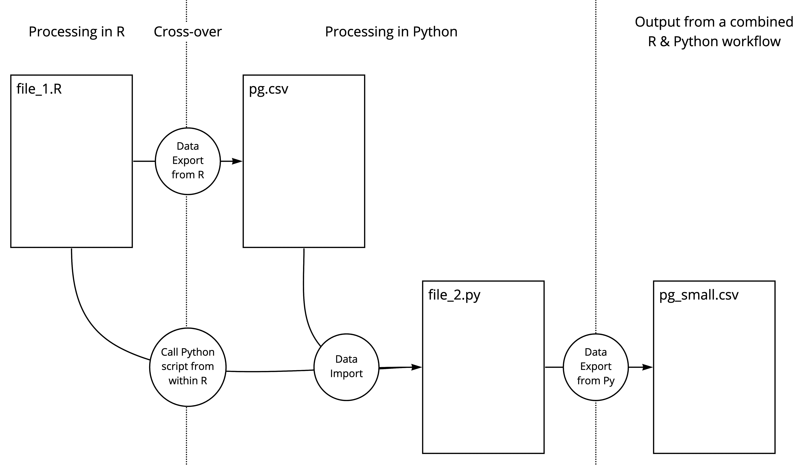
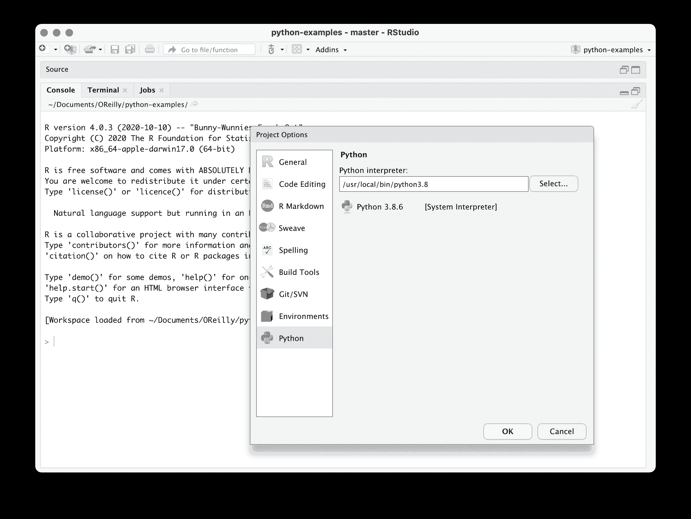

# 第六章\. 协同使用两种语言

Rick J. Scavetta

互操作性，即不同编程语言共同工作的能力，是计算机的基石。理想情况下，对象可以直接在两种语言之间共享。正如你可以想象的那样，这可能因为多种原因而成为问题，比如内存使用和不兼容的数据存储结构，只举两个例子。尽管有几次尝试使 Python 和 R 之间的互操作性实现得更加顺畅，但直到最近几年才真正出现了一个功能合理的工具包。我将在“互操作性”一节中讨论这个问题。但首先回到基础是很有用的。这不仅能帮助你理解后面顺畅互操作的背景，而且一个基础的解决方案可能已经满足你的需求。尽管如此，如果你想开始使用互操作性，可以跳过下一节。

# 伪操作性

最基本的互操作类型，我们将其称为跨语言交流，更多地是一种伪操作性。在这里，我们通过文件作为中介，在语言之间执行预定义的脚本，传递信息。想象一下下面的情况，我已经在图 6-1 中绘制了图示。



###### 图 6-1\. 促进互操作性的跨语言交流示例。

在 R 中，在对对象（如`PlantGrowth`）执行一些必要的工作后，我们执行：

```py
# (Previous interesting and complicated steps omitted)

# Write a data.frame of interest to a file ...
rio::export(PlantGrowth, "pg.csv")

# ... which is then processed by a Python script
system('~/.venv/bin/python3 myScript_2.py < "pg.csv"')
```

`system()`函数执行一个系统命令，该命令作为字符参数提供。命令由四个部分组成。

首先，`~/.venv/bin/python3`是我们虚拟环境中 Python 可执行文件的位置，假设你已经创建了一个虚拟环境。我们也可以在脚本的*shebang*第一行中包含它，如`#!/.venv/bin/env python3`。这确保脚本在创建它的环境中执行。如果这对你来说听起来很奇怪，请参阅“虚拟环境”。

第二，`myScript_2.py`是包含我们想要执行的命令的 Python 文件的名称。

第三，`<`允许我们将`stdin`从 rhs 重定向到 lhs 上的文件^(1)。

第四，`"pg.csv"`是`stdin`。你可能记得命令行函数有三个标准*通道*或*流*，`stdin`用于*标准输入*，`stdout`用于*标准输出*，`stderr`用于*标准错误*。在这里，`stdin`是硬编码的。它是一个字符串，对应于一个文件：`"pg.csv"`，这个文件在前一个命令中被导出。在大多数情况下应避免硬编码，你可以想象很多使其动态化的方法。这不是我们这里关注的重点；重点是将一些输入传递到 Python 脚本中。

因此，我们正在执行一个 Python 脚本，该脚本从 R 脚本中获取`stdin`，而`stdin`本身是 R 脚本的产物。让我们看看这个 Python 脚本的最小组件。

```py
import sys
import pandas as pd

# import the file specified by the standard input
myFile = pd.read_csv(sys.stdin)

# (Fantastically complex and very Pythonic code omitted)

# Write the first four lines to a file
myFile.head(4).to_csv("pg_small.csv")
```

首先，我们需要`sys`模块来处理`stdin`（`sys.stdin`）。我们使用 pandas 导入文件，用`to_csv()`方法在我们的 Python 脚本完成其工作后导出一些其他输出。

这种方法有很多问题，我们很快就会解决它们。但关键是它起作用了，有时候这正是你所需要的。在研究实验室工作时，我经常需要快速向同事提供结果。我是说字面上的，因为非常昂贵的细胞培养物会死亡，如果结果还没有准备好，将浪费一周的工作。专有原始数据的预处理和访问安全服务器阻止了我的同事执行自动化的 R 脚本。我的解决方案是首先使用专门用于此任务的软件处理机器生成的专有数据。然后，我能够使用 Mac OS Automator 服务在该输出上执行 Perl 脚本，这是我的`stdin`。然后，这个 Perl 脚本调用一个 R 脚本，生成一个具有所有相关信息清晰显示在标题中的绘图文件。这并不是最开放或最优雅的解决方案，但它起作用了，我只需单击鼠标大约半秒钟就能得到我的绘图，而无需额外的网站或登录。生活很美好，那问题在哪里呢？

嗯，有几个问题。让我们考虑三个。

首先，回顾过去，我可能完全可以在 R 中执行整个工作流程（不包括专有的预处理）。必须考虑简化工作流程并有充分理由使用多种语言。在本书中，决定何时以及为何结合 Python 和 R 已经讨论过。

其次，有很多移动的部分。我们有几个文件，甚至产生了额外的中间文件。这增加了出错和混乱的机会。这并不可怕，但我们最好注意保持事物有序。

第三，许多情况下，当我们可以将一个 R `data.frame`导出为 csv 文件时，这个工作流程表现良好，而`pandas`可以轻松导入。对于更复杂的数据结构，您可以将 1 个或多个 R 对象导出为`RData`或`Rds`格式文件。Python 的`pyreadr`包提供了导入这些文件并访问存储在`dict`中每个对象的函数。

虽然交互性很好，但真正的互操作性会很好地解决这个过程中的问题。有两种广泛使用的框架，选择使用哪种取决于您的起始语言。

# 互操作性

如果您主要使用 R 并希望访问 Python，则 R 包`reticulate`是正确的选择。相反，如果您主要使用 Python 并希望访问 R，则 Python 模块`rpy2`是适合您的工具。我们可以在表 6-1 和表 6-2^(2)中总结这一点。在每个表中，将每行读作以列标题开头的句子。

表 6-1。由`reticulate`提供的互操作性。

| 访问 | 使用命令 |
| --- | --- |
| Python 函数 | 在 R 中，`pd <- library(pandas)`; `pd$read_csv()` |
| Python 对象 | 在 R 中，`py$objName` |
| R 对象 | 在 Python 中，`r.objName` in Python |

表 6-2\. 当使用 Python 编写时，rpy2 提供的互操作性。

| 访问 | 使用命令 |
| --- | --- |
| R 函数 | 在 Python 中，`import rpy2.robjects.lib.ggplot2 as ggplot2` |
| R 包 | 在 Python 中，`r_cluster = importr('cluster')` |
| R 对象 | 在 Python 中，`foo_py = robjects.r['foo_r']` |

在 Table 6-1 和 Table 6-2 中的命令显示了如何直接从一种语言访问所有种类的对象到另一种语言。此外，我们还可以直接调用函数。这是一个真正的里程碑，因为它使我们免于强迫一种语言执行它不擅长的任务，并且意味着我们不需要在语言之间引入冗余，重复发明轮子。在撰写本文时，使用 `reticulate` 无法从 Python 直接访问 R 函数。您可以尝试使用 `reticulate` 完成此任务，但将对象返回给 R 并本地执行 R 命令会更容易。

## 使用 reticulate 快速上手

`reticulate` 首次出现在 CRAN 上是在 2017 年，并且随着它的成熟而日益流行。这个包由 RStudio 开发，并且很好地集成到了 RStudio IDE 中，这非常方便。然而，在撰写本文时，存在一些需要精细处理的麻烦功能（或许是 bug？），这些需要注意（请参见警告框 “State of reticulate”）。一个很好的第一步是确保您正在使用最新的 RStudio 公开版本以及`reticulate`包和任何相关的包，如`knitr`。

# `reticulate` 的状态

`reticulate` 受到良好支持并且足够稳定，可以用于生产。尽管如此，根据您的系统和软件版本，您可能会遇到问题。由于此工具结合了多种技术，因此调试可能会困难，并且文档仍然有些匮乏。随着新版本的发布，请保持及时更新。如果在您的本地机器上遇到问题，请访问我们的 [RStudio Cloud](https://rstudio.cloud/project/2534578) 项目。

在本节中，我们将从两个脚本开始，列在 Table 6-3 中。您可以在本章的书籍 [存储库](https://github.com/moderndatadesign/PyR4MDS) 中找到这些脚本。

表 6-3\. 使用 reticulate 快速上手。

| 文件 | 描述 |
| --- | --- |
| `0 - Setup.Rmd` | 设置 reticulate 和虚拟环境 |
| `1 - Activate.R` | 激活 Python 虚拟环境 |

让我们从 R 脚本 `0 - Setup.R` 开始。确保您已安装了 `reticulate` 并在您的环境中初始化它：

```py
library(reticulate)
```

首先，我们需要指定使用哪个版本的 Python。您可以让 R 使用您的系统默认设置，或者通过转到`工具 > 项目选项`并选择 Python 图标来设置您想要使用的特定版本的 Python。



###### 图 6-2。选择要使用的特定 Python 版本和构建版本。

让我们检查一下我们正在使用的版本：

```py
reticulate::py_config()
```

```py
python:         /usr/local/bin/python3.8
libpython:      /Library/Frameworks/Python.framework/Versions/3.8...
pythonhome:     /Library/Frameworks/Python.framework/Versions/3.8...
version:        3.8.6 (v3.8.6:db455296be, Sep 23 2020, 13:31:39) ...
numpy:           [NOT FOUND]
sys:            [builtin module]
```

清楚地说一下，我们不需要使用 RStudio 来设置 Python 版本。这只是一个方便的功能。我们可以执行：

```py
use_python("/usr/local/bin/python3.8", required = TRUE)
```

请注意，这个函数只是一个*建议*，如果未找到所需的构建版本，则不会产生错误，除非将`required`参数设置为`TRUE`。

在继续之前，我们将要建立一个虚拟环境。如果你在 Windows 上，你将不得不使用`conda`环境，我们将在一分钟内介绍它。对于其他人，请使用以下命令创建名为`modern_data`的虚拟环境：

```py
virtualenv_create("modern_data")
```

以前，当我们在 Python 中使用`venv`包时，虚拟环境存储在一个隐藏目录中（通常称为项目目录中的`.venv`）。那么现在 Python 虚拟环境在哪里？我们可以用以下命令来看一看：

```py
virtualenv_root()
```

```py
[1] "~/.virtualenvs"
```

它们都存储在根目录中的一个隐藏文件夹中。我们可以使用以下命令查看所有的虚拟环境：

```py
virtualenv_list()
```

# [Reticulate 速查表](https://raw.githubusercontent.com/rstudio/cheatsheets/master/reticulate.pdf)

与大多数流行的数据科学包一样，`reticulate`有一张速查表可用。你可以直接从[这里](https://raw.githubusercontent.com/rstudio/cheatsheets/master/reticulate.pdf)下载。

这与我们在 Python 中看到的虚拟环境存储在项目目录中的情况有所不同。尽管如此，这很方便，因为我们可以轻松地为许多项目重复使用一个好的环境。

请注意，要删除虚拟环境，我们需要传递路径，如下所示：`virtualenv_remove("~/modern_data")`。

下一步是安装适当的包。

```py
virtualenv_install("modern_data", "pandas")
```

或者，你可以使用`tidyverse`的`purrr::map()`函数来安装许多包：

```py
library(tidyverse)
c("scikit-learn", "pandas", "seaborn") %>%
  map(~ virtualenv_install("modern_data", .))
```

如果你在 Windows 上，请使用以下命令：

```py
# For windows users:
# Install a minimal version of conda
install_miniconda()

# List your conda virtual environments
conda_list()

# Creata a new virtual environment
conda_create("modern_data")

# Install a single...
conda_install("modern_data", "scikit-learn")

#...or multiple packages:
library(tidyverse)
c("scikit-learn", "pandas", "seaborn") %>%
  map(~ conda_install("modern_data", .))
```

最后一步是激活我们的虚拟环境。这似乎是一个快速发展的领域。根据你使用的`reticulate`和 RStudio 的版本，可能会产生不同的错误消息，或者根本没有错误消息，这使得调试变得更加困难。根据我的经验，你最安全的选择是：(i) 确保所有的 R 包和 RStudio 都是最新的，以及 (ii) 在激活虚拟环境之前重新启动 R。你可以在 RStudio 菜单中执行此操作`Session > Restart R`，键盘快捷键`shift + cmd/ctrl + F10`或执行命令`.rs.restartR()`。你也可以直接关闭并重新启动 RStudio。这样可以确保没有活跃使用的 Python 构建，并且我们可以从头开始建立一个。因此，我们有一个用于设置的 R 脚本，我们在其中创建一个虚拟环境并安装包，以及另一个用于实际分析的脚本，我们在其中加载`reticulate`并激活我们的虚拟环境。

```py
library(reticulate)
use_virtualenv("modern_data", required = TRUE)

# Alternatively, for miniconda:
# use_miniconda("modern_data")
```

最后，我们可以确认我们正在使用哪个版本：

```py
py_config()
```

你应该看到以下输出。重要的是确保你的虚拟环境路径在第一行中指定：`/.virtualenvs/modern_data/bin/python`。

```py
python:         /Users/user_name/.virtualenvs/modern_data/bin/python
libpython:      /Library/Frameworks/Python.framework/Versions/3.8...
pythonhome:     /Users/user_name/.virtualenvs/modern_data...
version:        3.8.6 (v3.8.6:db455296be, Sep 23 2020, 13:31:39)
numpy:          /Users/user_name/.virtualenvs/modern_data/lib/python3.8/site-packages/numpy
numpy_version:  1.20.1
```

如果你看到像`/usr/local/bin/python3.8`这样的东西，那么 RStudio 仍然指示使用你在本章开始时定义的 Python 版本，而不是虚拟环境。这可能对你有所帮助，但最好使用虚拟环境。

# 更深入了解

到目前为止，我们已经创建了一个虚拟环境，在其中安装了一些包，重新启动了 R，并激活了虚拟环境。这些步骤在脚本`0 - Setup.R`和`1 - Activate.R`中有所涵盖。在本节的其余部分，我将介绍如何在 R 和 Python 之间传递信息，我已在表 6-1 中进行了总结。

表 6-4。reticulate 授予的互操作性。

| 文件 | 描述 |
| --- | --- |
| `2 - Passing objects.Rmd` | 在 RMarkdown 文档中在 R 和 Python 之间传递对象 |
| `3 - Using functions.Rmd` | 在 RMarkdown 文档中调用 Python |
| `4 - Calling scripts.Rmd` | 通过源代码调用 Python 脚本 |
| `5 - Interactive mode.R` | 使用 Python REPL 控制台调用 Python |
| `6 - Interactive document.Rmd` | 在交互式文档中使用动态输入调用 Python |

###### 注意

为什么叫“reticulate”？网纹蟒是一种生活在东南亚的蟒蛇。它们是世界上最长的蛇类和最长的爬行动物。物种名称 *Malayopython reticulatus* 是拉丁文，意为“网状的”，或 reticulated，指的是其复杂的颜色图案。

我将在下面的小节中考虑表 6-1 中的情景。要跟随这些示例，请确保你已按照`0 - Setup.R`和`1 - Activate.R`中的设置和激活说明进行了设置（两者都在书籍代码[存储库](https://github.com/moderndatadesign/PyR4MDS)中）。你需要安装 modern_data 虚拟环境和上述列出的包。如果你使用的是`miniconda`，请确保使用每个文件中给出的正确命令来激活你的虚拟环境。

## 在 RMarkdown 文档中在 R 和 Python 之间传递对象

下列命令可在文件`2 - Passing objects.Rmd`中找到。要在 Python 中访问 R 对象，请使用`r`对象，要在 R 中访问 Python 对象，请使用`py`对象。考虑下列在 RMarkdown 文档中找到的代码块：

```py
```{python}

a = 3.14

a

```py
```

```py
```{r}

py$a

```py
```

使用`$`符号在 R 对象`py`中访问 Python 对象`a`。相反的方向：

```py
```{r}

b <- 42

b

```py
```

```py
```{python}

r.b

```py
```

在 Python 中，调用`r`对象并使用`.`符号按名称访问 R 对象。这些是标量，或简单向量，但当然我们可以直接在两种语言之间传递更复杂的项目。`reticulate`会为我们处理对象转换。考虑以下情况：

```py
```{r}

# 一个内置数据框

head(PlantGrowth)

```py
```

```py
```{python}

r.PlantGrowth.head()

```py
```

R 的`data.frame`可以作为 Python 的`pandas.DataFrame`访问。但是，如果你没有安装 pandas，你会看到一个`dict`对象，即 Python 字典。

一个 Python 的`NumPy` `ndarray`将被转换为一个 R 的`matrix`^(3)：

```py
```{python eval = TRUE}

from sklearn.datasets import load_iris

iris = load_iris()

iris.data[:6]

```py
```

将 Python 的 NumPy `ndarray`作为 R 的`matrix`：

```py
```{r eval = TRUE}

head(py$iris$data)

```py
```

注意在 Python 中的`.`符号，`iris.data`可以使用`$`符号在 R 中自动访问：`py$iris$data`。对于嵌套对象、方法和属性，与 Python 中一样，

## 在 RMarkdown 文档中调用 Python

文件`3 - Using functions.Rmd`中可以找到以下命令。我们将继续使用在前一节中在 Python 中访问的经典 iris 数据集。在 RMarkdown 文档内部，我们将访问一个 Python 函数，这使我们能够访问经过训练的支持向量机分类器，以预测新值的分类。这是一个非常朴素的机器学习工作流程，不打算生成有价值的模型。重点是演示如何在 R 中访问 Python 中的模型。

整个模型配置在这里定义：

```py
```{python}

# import modules

from sklearn import datasets

from sklearn.svm import SVC

# 加载数据：

iris = datasets.load_iris()

# 创建 SVC（支持向量分类）类的一个实例。

clf = SVC()

# 通过在目标数据上调用 fit 方法来训练模型，使用目标名称

clf.fit(iris.data, iris.target_names[iris.target])

# 预测新值的类别，这里是前三个

clf.predict(iris.data[:3])

```py
```

方法`clf.predict()`以`ndarray`作为输入，并返回命名分类。要在 R 中访问此函数，我们可以再次使用`py`对象，如`py$clf$predict()`。在 R 中，`iris`数据集是一个`data.frame`，其中第 5 列是分类。我们必须使用`r_to_py()`将其转换为 Python 对象，在这种情况下不包括第 5 列。

```py
```{r}

py$clf$predict(r_to_py(iris[-5]))

```py
```

## 通过调用 Python 脚本来调用 Python

文件`4 - Calling scripts.Rmd`和`4b - Calling scripts.R`中可以找到以下命令。在这种情况下，我们将执行整个 Python 脚本，并访问其中可用的所有对象和函数。为此，我们可以调用：

```py
source_python("SVC_iris.py")
```

在 RMarkdown 文档中同样适用，正如在脚本中一样。

尽管这与前一节看起来非常相似，但有一个非常重要的区别。以这种方式激活的 Python 环境直接提供函数和对象。因此，我们可以调用：

```py
clf$predict(r_to_py(iris[-5]))
```

这很方便，但也让人不安。不仅语法改变了，即不再需要`py$`，而且在 R 环境中加载的对象可能会冲突。Python 对象将掩盖 R 对象，因此在命名冲突方面一定要非常小心！您会注意到在`SVC_iris.py`中，我们已经将 Python 的`iris`数据集重命名为`iris_py`，以避免在 R 中调用`iris`时出现问题。

## 使用 REPL 调用 Python

以下命令可以在文件`5 - 交互模式.R`中找到。在这种情况下，我们将使用以下命令启动 Python REPL 控制台：

```py
repl_python()
```

###### 注意

REPL 代表读取-评估-打印循环。这是许多语言中的常见功能，用户可以以交互方式进行实验，而不是编写需要运行的脚本。

这将允许你直接在解释器中执行 Python 命令。例如，尝试执行我们在上一个示例中看到的命令：

```py
from sklearn import datasets
from sklearn.svm import SVC
iris = datasets.load_iris()
clf = SVC()
clf.fit(iris.data, iris.target_names[iris.target])
clf.predict(iris.data[:3])
```

我们可以通过执行 Python `exit`命令退出解释器。

```py
exit
```

就像我们之前看到的那样，此 Python 环境中的函数和对象可以在 R 中访问。这确实是交互式编程，因为我们直接在控制台中执行命令。尽管出于完整性考虑我们提供了这种场景，但`repl_python()`实际上并不适合日常实践。实际上，当一个 RMarkdown 代码块使用 Python 内核时，会调用它。所以尽管你可以这样做，但要小心！这在可重复性和自动化方面存在相当大的问题，但你可能会发现它对快速检查某些命令很有用。

## 在交互式文档中使用动态输入调用 Python

以下命令可以在文件`6 - 交互式文档.Rmd`中找到。

到目前为止，我们已经看到了 reticulate 的所有核心功能。在这里，我们将超越这一点，并展示一种非常简单的方法，使用 RMarkdown 文档中的`shiny`运行时引入互动性。要查看互动性，请确保安装了`shiny`包，并在打开文件时将文档渲染为 HTML。在 RStudio 中，您可以通过点击“运行文档”按钮来执行此操作。

首先，在文档的标题中，我们需要指定这个新的运行时环境：

```py
---
title: "Python & R for the Modern Data Scientist"
subtitle: "A bilingual case study"
runtime: shiny
---
```

我们已经在上面看到了以下 Python 代码，它在一个 Python 代码块中执行：

```py
```{python}

from sklearn import datasets

from sklearn.svm import SVC

iris = datasets.load_iris()

clf = SVC()

clf.fit(iris.data, iris.target_names[iris.target])

```py
```

在最后两个代码块中，我们使用`shiny`包中的函数来：(i) 为四个特征中的每一个生成滑块，以及 (ii) 将`py$clf$predict()`的输出渲染为 HTML 文本，例如：

```py
sliderInput("sl", label = "Sepal length:",
            min = 4.3, max = 7.9, value = 4.5, step = 0.1)
```

和… n

```py
prediction <- renderText({
  py$clf$predict(
    r_to_py(
      data.frame(
        sl = input$sl,
        sw = input$sw,
        pl = input$pl,
        pw = input$pw)
    )
  )
})
```

最后，我们将 R 对象`prediction`称为内联命令，`r prediction`以将结果作为句子打印到屏幕上。

# 最后的想法

在本章中，我们介绍了`reticulate`包的核心组件，从基本设置到基础知识，最后展示了一个简单而强大的实现，展示了 R、Python 和`reticulate`的优势。借助这些知识，我们将继续进行最后一章的更大案例研究。

^(1) 请回忆一下，在调用运算符时，rhs 是*右手边*，lhs 是*左手边*，在这种情况下是`<`

^(2) 在这些表格中，我们区分函数和对象。记住，函数本身也是对象，但我们目前不需要担心这些细节。

^(3) 参考附录 A 获取数据结构摘要。
