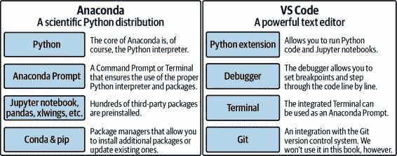
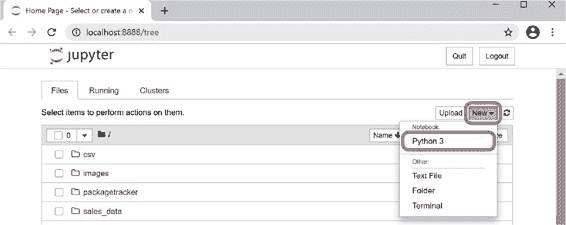
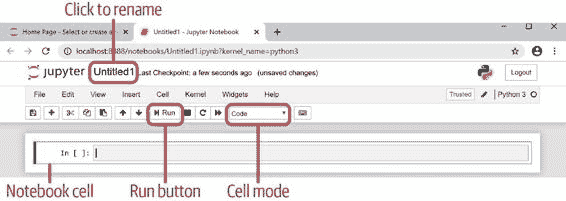
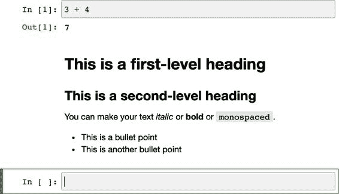
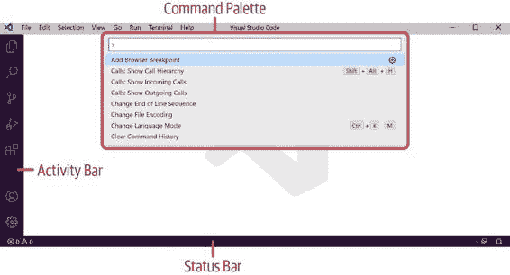
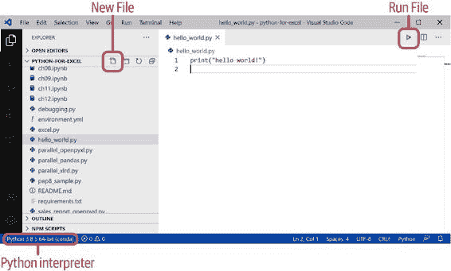

# 第四章

第二章\. 开发环境

你可能迫不及待地想要学习 Python 的基础知识，但在此之前，你需要相应地设置你的计算机。要编写 VBA 代码或 Power Queries，只需启动 Excel 并分别打开 VBA 或 Power Query 编辑器即可。而使用 Python，则需要更多的工作。

我们将从安装 Anaconda Python 发行版开始本章。除了安装 Python 外，Anaconda 还将为我们提供 Anaconda Prompt 和 Jupyter 笔记本两个基本工具，这两个工具我们将在本书中经常使用。Anaconda Prompt 是一个特殊的命令提示符（Windows）或终端（macOS）；它允许我们运行 Python 脚本和其他本书中会遇到的命令行工具。Jupyter 笔记本允许我们以交互方式处理数据、代码和图表，这使得它们成为 Excel 工作簿的一个强大替代品。在使用了一段时间的 Jupyter 笔记本后，我们将安装 Visual Studio Code（VS Code），一个功能强大的文本编辑器。VS Code 非常适合编写、运行和调试 Python 脚本，并带有集成的终端。图 2-1 总结了 Anaconda 和 VS Code 中包含的内容。

由于本书主要讲解 Excel，因此本章将重点介绍 Windows 和 macOS。然而，包括第三部分在内的一切内容也适用于 Linux。让我们开始安装 Anaconda 吧！

图 2-1\. 开发环境

Anaconda Python 发行版

Anaconda 可以说是用于数据科学最流行的 Python 发行版，预装了数百个第三方包：它包括 Jupyter 笔记本和本书中将广泛使用的大多数其他包，包括 pandas、OpenPyXL 和 xlwings。Anaconda 个人版可以免费私人使用，并保证所有包都与彼此兼容。它安装在一个单独的文件夹中，并且可以轻松地卸载。安装完毕后，我们将在 Anaconda Prompt 上学习一些基本命令，并运行一个交互式的 Python 会话。然后，我们将介绍包管理器 Conda 和 pip，最后以 Conda 环境结束本节。让我们开始下载并安装 Anaconda 吧！

安装

前往[Anaconda 主页](https://oreil.ly/QV7Na)并下载最新版本的 Anaconda 安装程序（个人版）。确保下载 Python 3.x 版本的 64 位图形化安装程序。1 下载完成后，双击安装程序开始安装过程，并确保接受所有默认设置。有关更详细的安装说明，请参阅[官方文档](https://oreil.ly/r01wn)。

> 其他 Python 发行版
> 
> 尽管本书的指导假设您已安装了 Anaconda 个人版，但所展示的代码和概念也适用于任何其他 Python 安装。在这种情况下，您需要按照配套存储库中 requirements.txt 中包含的说明安装所需的依赖项。

安装了 Anaconda 后，我们现在可以开始使用 Anaconda Prompt。让我们看看这是什么以及它是如何工作的！

Anaconda Prompt

Anaconda Prompt 实际上只是在 Windows 上的命令提示符和 macOS 上的终端，已设置为使用正确的 Python 解释器和第三方包运行。Anaconda Prompt 是运行 Python 代码的最基本工具，在本书中我们将广泛使用它来运行 Python 脚本和各种由各种包提供的命令行工具。

> 在没有 Anaconda 的情况下使用 ANACONDA PROMPT
> 
> 如果您不使用 Anaconda Python 发行版，每当我指示您使用 Anaconda Prompt 时，您将不得不使用 Windows 上的命令提示符和 macOS 上的终端。

如果您从未在 Windows 上使用过命令提示符或在 macOS 上使用过终端，不用担心：您只需要知道几个命令，这些命令将为您提供大量功能。一旦习惯了，使用 Anaconda Prompt 通常比通过图形用户界面菜单点击更快更方便。让我们开始吧：

Windows

> > 点击“开始”菜单按钮，然后开始输入 `Anaconda Prompt`。在出现的条目中，选择 Anaconda Prompt，而不是 Anaconda Powershell Prompt。可以使用箭头键选择它并按 Enter 键，或者使用鼠标点击它。如果您喜欢通过“开始”菜单打开它，可以在 Anaconda3 下找到它。将 Anaconda Prompt 固定到 Windows 任务栏是一个好主意，因为您将在本书中经常使用它。Anaconda Prompt 的输入行将以 `(base)` 开头：
> > 
> > `(base) C:\Users\felix>`

macOS

> > 在 macOS 上，您找不到名为 Anaconda Prompt 的应用程序。相反，Anaconda Prompt 指的是由 Anaconda 安装程序设置的终端，用于自动激活 Conda 环境（稍后我会详细介绍 Conda 环境）：按下 Command-Space 键或打开 Launchpad，然后键入 `Terminal` 并按 Enter 键。或者，打开 Finder 并导航到应用程序 > 实用工具，在那里您会找到可以双击的 Terminal 应用程序。一旦终端出现，它应该看起来像这样，即输入行必须以 `(base)` 开头：
> > 
> > `(base) felix@MacBook-Pro ~ %`
> > 
> > 如果你使用的是较旧版本的 macOS，它看起来会是这个样子：
> > 
> > `(base) MacBook-Pro:~ felix$`
> > 
> > 与 Windows 上的命令提示符不同，macOS 上的终端不显示当前目录的完整路径。相反，波浪符号表示主目录，通常是 /Users/<username>。要查看当前目录的完整路径，请键入 `pwd` 然后按 Enter 键。`pwd` 表示打印工作目录。
> > 
> > 如果您在安装 Anaconda 后在终端中输入行不是以 `(base)` 开头，常见原因是：如果在 Anaconda 安装过程中终端处于运行状态，您需要重新启动它。请注意，点击终端窗口左上角的红色叉号只会隐藏它而不会退出它。相反，请右键单击 dock 中的终端，选择退出，或者在终端是活动窗口时按 Command-Q 键。重新启动后，如果终端显示 `(base)` 开头的新行，表示已设置好。建议将终端固定在 dock 中，因为您将经常使用它。

在 Anaconda 提示符处，尝试执行 表 2-1 中概述的命令。我将在表后更详细地解释每个命令。

表 2-1\. Anaconda 提示的命令

|  命令  |  Windows  |  macOS  |
| --- | --- | --- |
|  列出当前目录中的文件  |   `dir` |   `ls -la` |
|  切换目录（相对路径）  |   `cd path\to\dir` |   `cd path/to/dir` |
|  切换目录（绝对路径）  |   `cd C:\path\to\dir` |   `cd /path/to/dir` |
|  切换到 D 驱动器  |   `D:` |  (不存在)  |
|  切换到上级目录  |   `cd ..` |   `cd ..` |
|  浏览以前的命令  |  ↑（上箭头）  |  ↑（上箭头）  |

列出当前目录中的文件

> > 在 Windows 上，输入 `dir` 查看目录内容，然后按 Enter 键。这将打印出您当前所在目录的内容。
> > 
> > 在 macOS 上，输入 `ls -la` 并按 Enter 键。`ls` 是列出目录内容的缩写，`-la` 将以长列表格式打印输出，并包括所有文件，包括隐藏文件。

切换目录

> > 输入 `cd Down` 并按 Tab 键。`cd` 是改变目录的缩写。如果您在主文件夹中，Anaconda 提示应该能够自动完成到 `cd Downloads`。如果您在不同的文件夹中，或者没有名为 Downloads 的文件夹，只需在按 Tab 键自动完成之前，开始键入前一个命令 (`dir` 或 `ls -la`) 中看到的一个目录名的开始部分。然后按 Enter 键以进入自动完成的目录。如果您在 Windows 上需要更改驱动器，请先输入驱动器名称，然后才能更改正确的目录：
> > 
> > `C:\Users\felix>` `D:` `D:\>` `cd data` `D:\data>`
> > 
> > 注意，如果您从当前目录开始，使用相对路径启动路径时，需要使用一个位于当前目录中的目录或文件名，例如，`cd Downloads`。如果您想要跳出当前目录，可以输入绝对路径，例如，在 Windows 上是`cd C:\Users`，在 macOS 上是`cd /Users`（请注意斜杠是在路径开头的）。

切换到上级目录

> > 要进入父目录，即在目录层次结构中向上移动一级，请输入 `cd ..`，然后按 Enter 键（确保在 `cd` 和点之间有一个空格）。如果你想结合目录名称使用这个命令，例如，如果你想向上移动一级，然后切换到桌面目录，输入 `cd ..\Desktop`。在 macOS 上，请用正斜杠替换反斜杠。

浏览之前的命令

> > 使用向上箭头键浏览之前的命令。如果你需要多次运行相同的命令，这将节省大量击键时间。如果向上滚动太远，使用向下箭头键回滚。
> > 
> 文件扩展名
> 
> 不幸的是，在 Windows 资源管理器或 macOS Finder 中，默认隐藏文件扩展名。这可能会使处理 Python 脚本和 Anaconda Prompt 变得更加困难，因为你需要引用包括其扩展名的文件。在处理 Excel 时，显示文件扩展名还有助于你了解你正在处理的是默认的 xlsx 文件，还是启用宏的 xlsm 文件，或任何其他 Excel 文件格式。以下是如何使文件扩展名可见的方法：
> 
> Windows
> 
> > 打开文件资源管理器，点击“视图”选项卡。在“显示/隐藏”组下，勾选“文件扩展名”复选框。
> > 
> macOS
> 
> > 打开 Finder，并通过按下 Command-,(Command-逗号键) 进入偏好设置。在高级选项卡上，勾选“显示所有文件扩展名”旁边的复选框。

到此为止！你现在可以启动 Anaconda Prompt 并在所需目录中运行命令。你将立即在下一节中使用这个功能，我将向你展示如何启动交互式 Python 会话。

Python REPL：交互式 Python 会话

你可以通过在 Anaconda Prompt 上运行 `python` 命令来启动交互式 Python 会话：

> `(base) C:\Users\felix>``python` `Python 3.8.5 (default, Sep 3 2020, 21:29:08) [...] :: Anaconda, Inc. on win32 Type "help", "copyright", "credits" or "license" for more information. >>>`

在 macOS 终端打印的文本略有不同，但功能基本相同。本书基于 Python 3.8 — 如果你想使用更新的 Python 版本，请确保参考[书籍主页](https://xlwings.org/book)上的说明。

> ANACONDA PROMPT NOTATION
> 
> 今后，我将以 `(base)>` 开头来标记 Anaconda Prompt 中输入的代码行。例如，要启动交互式 Python 解释器，我将这样写：
> 
> > `(base)>` `python`
> > 
> 而在 Windows 上看起来类似于这样：
> 
> > `(base) C:\Users\felix>` `python`
> > 
> 在 macOS 上类似这样（请记住，在 macOS 上，终端即为你的 Anaconda Prompt）：
> 
> > `(base) felix@MacBook-Pro ~ %` `python`

让我们玩一玩吧！请注意，在交互式会话中，`>>>` 表示 Python 正在等待你的输入；你无需输入这些字符。跟着我输入每一行以 `>>>` 开头的代码，并按 Enter 键确认：

> `>>>` `3 + 4` `7 >>>` `"python " * 3` `'python python python '`

这个交互式 Python 会话也称为 Python REPL，即读取-求值-打印循环：Python 读取你的输入，计算它，并立即打印结果，同时等待你的下一个输入。还记得我在前一章提到的 Python 之禅吗？现在你可以阅读完整版本，了解 Python 的指导原则（包括微笑）。只需在键入此行后按 Enter 运行：

> `>>>` `import this`

要退出 Python 会话，请键入 `quit()`，然后按 Enter 键。或者，在 Windows 上按 Ctrl+Z，然后按 Enter 键。在 macOS 上，只需按 Ctrl+D — 无需按 Enter。

退出 Python REPL 后，现在是玩转 Conda 和 pip 的好时机，这两个是随 Anaconda 安装提供的包管理器。

包管理器：Conda 和 pip

在上一章中，我已经介绍了 pip，Python 的包管理器：pip 负责下载、安装、更新和卸载 Python 包及其依赖关系和子依赖关系。虽然 Anaconda 可与 pip 配合使用，但它还有一种内置的替代包管理器称为 Conda。Conda 的一个优势是它不仅可以安装 Python 包，还可以安装 Python 解释器的其他版本。简而言之：包添加了额外的功能到你的 Python 安装中，这些功能不在标准库中。pandas 是这样一个包的例子，我将在第 5 章中详细介绍它。由于它已预装在 Anaconda 的 Python 安装中，你不必手动安装它。

> CONDA 与 PIP
> 
> 在 Anaconda 中，你应该尽可能通过 Conda 安装所有内容，并仅在 Conda 找不到这些包时使用 pip 安装。否则，Conda 可能会覆盖之前用 pip 安装的文件。

表格 2-2 提供了你将经常使用的命令的概述。这些命令必须在 Anaconda 提示符中键入，将允许你安装、更新和卸载第三方包。

表格 2-2\. Conda 和 pip 命令

|  操作  |  Conda  |  pip  |
| --- | --- | --- |
|  列出所有已安装的包  |   `conda list` |   `pip freeze` |
|  安装最新的包版本  |   `conda install` `package` |   `pip install` `package` |
|  安装特定版本的包  |   `conda install` `package=1.0.0` |   `pip install` `package==1.0.0` |
|  更新包  |   `conda update` `package` |   `pip install --upgrade` `package` |
|  卸载包  |   `conda remove` `package` |   `pip uninstall` `package` |

例如，要查看你的 Anaconda 发行版中已有哪些包，输入以下命令：

> `(base)>` `conda list`

每当本书需要一个不包含在 Anaconda 安装中的包时，我都会明确指出这一点，并向您展示如何安装它。但现在安装缺少的包可能是个好主意，这样以后就不必再处理它了。让我们首先安装 plotly 和 xlutils，这些包可以通过 Conda 获取：

> `(base)>` `conda install plotly xlutils`

运行此命令后，Conda 将显示它将要执行的操作，并要求您键入 `y` 并按回车键确认。完成后，您可以使用 pip 安装 pyxlsb 和 pytrends，因为这些包无法通过 Conda 获取：

> `(base)>` `pip install pyxlsb pytrends`

不像 Conda，当你按下回车键时，pip 会立即安装包而无需确认。

> 包版本
> 
> 许多 Python 包经常更新，有时会引入不向后兼容的更改。这可能会破坏本书中的一些示例。我会尽力跟上这些变化，并在[书的主页](https://xlwings.org/book)上发布修复内容，但你也可以创建一个使用我在写本书时使用的相同版本的包的 Conda 环境。我将在下一节介绍 Conda 环境，并在附录 A 中找到关于如何创建具有特定包的 Conda 环境的详细说明。

现在你知道如何使用 Anaconda Prompt 启动 Python 解释器并安装额外的包了。在下一节中，我会解释你的 Anaconda Prompt 开头的`(base)`是什么意思。

Conda 环境

你可能一直在想为什么 Anaconda Prompt 在每个输入行的开头显示 `(base)`。这是活跃 Conda 环境的名称。Conda 环境是一个单独的“Python 世界”，具有特定版本的 Python 和一组安装了特定版本的包。为什么需要这个？当你同时在不同项目上工作时，它们会有不同的需求：一个项目可能使用 Python 3.8 和 pandas 0.25.0，而另一个项目可能使用 Python 3.9 和 pandas 1.0.0。为 pandas 0.25.0 编写的代码通常需要更改才能运行 pandas 1.0.0，所以你不能只升级你的 Python 和 pandas 版本而不修改代码。为每个项目使用 Conda 环境确保每个项目都使用正确的依赖关系。虽然 Conda 环境是特定于 Anaconda 分发的，但该概念在每个 Python 安装下以虚拟环境的名称存在。Conda 环境更强大，因为它们使处理不同版本的 Python 本身更容易，而不仅仅是包。

在阅读本书时，你无需更改你的 Conda 环境，因为我们将始终使用默认的 `base` 环境。但是，当你开始构建真实项目时，最好为每个项目使用一个 Conda 或虚拟环境，以避免它们的依赖关系之间可能发生的冲突。有关处理多个 Conda 环境的所有信息都在附录 A 中解释了。在那里，你还将找到有关使用我用来撰写本书的确切软件包版本创建 Conda 环境的说明。这将使你能够在未来很多年内按原样运行本书中的示例。另一个选择是关注[书的主页](https://xlwings.org/book)，以获取可能需要针对较新版本的 Python 和软件包进行的更改。

解   解决了关于 Conda 环境的谜团后，现在是介绍下一个工具的时候了，这个工具在本书中会被广泛使用：Jupyter 笔记本！

Jupyter 笔记本

在上一节中，我向你展示了如何从 Anaconda 提示符启动一个交互式的 Python 会话。如果你想要一个简单的环境来测试一些简单的东西，这是很有用的。然而，对于大多数工作，你希望一个更易于使用的环境。例如，使用 Anaconda 提示符中运行的 Python REPL 很难返回到以前的命令并显示图表。幸运的是，Anaconda 带有比只有 Python 解释器更多的东西：它还包括 Jupyter 笔记本，这已经成为在数据科学环境中运行 Python 代码的最流行方式之一。Jupyter 笔记本允许你通过将可执行的 Python 代码与格式化文本、图片和图表结合到一个在浏览器中运行的交互式笔记本中来讲述一个故事。它们适合初学者，因此在你的 Python 旅程的最初阶段特别有用。然而，它们也非也非常受欢迎，用于教学、原型设计和研究，因为它们有助于实现可重复研究。

Jupyter 笔记本已经成为 Excel 的一个严肃竞争对手，因为它们覆盖了与工作簿大致相同的用例：你可以快速准备、分析和可视化数据。与 Excel 的区别在于，所有这些都是通过编写 Python 代码而不是在 Excel 中用鼠标点击来完成的。另一个优势是，Jupyter 笔记本不会混合数据和业务逻辑：Jupyter 笔记本保存了你的代码和图表，而你通常是从外部 CSV 文件或数据库中获取数据。在你的笔记本中显示 Python 代码使得你能够很容易地看到发生了什么，而在 Excel 中，公式被隐藏在单元格的值后面。Jupyter 笔记本在本地和远程服务器上运行都很容易。服务器通常比你的本地计算机性能更强，可以完全无人值守地运行你的代码，这在 Excel 中很难做到。

在本节中，我将向您展示如何运行和导航 Jupyter 笔记本的基础知识：我们将了解笔记本单元格的内容，并看看编辑模式和命令模式之间的区别。然后我们将理解为什么单元格的运行顺序很重要，然后在结束本节之前，我们将学习如何正确关闭笔记本。让我们从我们的第一个笔记本开始吧！

运行 Jupyter 笔记本

在 Anaconda Prompt 上，切换到您的伴侣存储库的目录，然后启动 Jupyter 笔记本服务器：

> `(base)>` `cd C:\Users\``username``\python-for-excel` `(base)>` `jupyter notebook`

这将自动打开您的浏览器，并显示带有目录中文件的 Jupyter 仪表板。在 Jupyter 仪表板的右上角，点击 New，然后从下拉列表中选择 Python 3（见图 2-2](#filepos133397)）。

图 2-2\. Jupyter 仪表板

这将在新的浏览器标签页中打开您的第一个空白 Jupyter 笔记本，如图 2-3](#filepos133850) 所示。

图 2-3\. 一个空白的 Jupyter 笔记本

点击 Jupyter 标志旁边的 Untitled1 可以重命名工作簿为更有意义的名称，例如 first_notebook。图 2-3 的下部显示了一个笔记本单元格——继续下一节以了解更多信息！

笔记本单元格

在 图 2-3 中，您将看到一个空的单元格，其中有一个闪烁的光标。如果光标不闪烁，请用鼠标点击单元格的右侧，即在 `In [ ]` 的右侧。现在重复上一节的练习：键入 `3 + 4` 并通过点击顶部菜单栏中的运行按钮或更容易的方式——按 Shift+Enter 运行单元格。这将运行单元格中的代码，将结果打印在单元格下方，并跳转到下一个单元格。在这种情况下，它会插入一个空单元格，因为我们目前只有一个单元格。稍微详细解释一下：当单元格计算时，它显示 `In [*]`，当计算完成时，星号变成一个数字，例如 `In [1]`。在单元格下方，您将看到相应的输出，标有相同的数字：`Out [1]`。每次运行一个单元格，计数器都会增加一，这有助于您查看单元格执行的顺序。在接下来的内容中，我将以这种格式展示代码示例，例如之前的 REPL 示例看起来是这样的：

> `In``[``1``]:``3``+``4`
> 
> `Out[1]: 7`

这种表示法允许您在笔记本单元格中键入 `3 + 4` 跟随而来。通过按 Shift+Enter 运行它，您将得到我展示的输出 `Out[1]`。如果您在支持颜色的电子格式中阅读本书，您会注意到输入单元格使用不同颜色格式化字符串、数字等，以便更容易阅读。这被称为语法高亮显示。

> CELL OUTPUT
> 
> 如果单元格中的最后一行返回一个值，Jupyter 笔记本会自动在`Out [ ]`下打印它。但是，当你使用`print`函数或遇到异常时，它会直接在`In`单元格下打印，而不带有`Out [ ]`标签。本书中的代码示例按此方式进行格式化。

单元格可以具有不同的类型，其中我们感兴趣的是两种：

代码

> > 这是默认类型。每当你想运行 Python 代码时，请使用它。

Markdown

> > Markdown 是一种使用标准文本字符进行格式化的语法，可用于在笔记本中包含精美格式的解释和说明。

要将单元格类型更改为 Markdown，选择单元格，然后在单元格模式下拉菜单中选择 Markdown（参见图 2-3）。我会展示一个快捷键，用于在表 2-3 中更改单元格模式。在将空单元格更改为 Markdown 单元格后，键入以下文本，其中解释了几条 Markdown 规则：

> ``# 这是一级标题  ## 这是二级标题 你可以使你的文本 *斜体* 或 **粗体** 或 `等宽字体`。  * 这是一个项目符号 * 这是另一个项目符号``

按下 Shift+Enter 后，文本将呈现为精美格式化的 HTML。此时，你的笔记本应该看起来像图 2-4 中的内容一样。Markdown 单元格还允许你包含图片、视频或公式；请参阅[Jupyter 笔记本文档](https://oreil.ly/elGTF)。

图 2-4\. 运行代码单元格和 Markdown 单元格后的笔记本

现在你已经了解了代码和 Markdown 单元格类型，是时候学习更简单的在单元格之间导航的方法了：下一节介绍了编辑和命令模式以及一些键盘快捷键。

编辑模式与命令模式

在 Jupyter 笔记本中与单元格交互时，你要么处于编辑模式，要么处于命令模式：

编辑模式

> > 点击单元格会进入编辑模式：所选单元格周围的边框变为绿色，并且单元格内的光标在闪烁。你也可以在选定单元格时按 Enter 键，而不是点击单元格。

命令模式

> > 要切换到命令模式，请按下`Escape`键；所选单元格周围的边框将变为蓝色，且不会有任何闪烁的光标。你可以在命令模式下使用的最重要的键盘快捷键如表 2-3 所示。

表 2-3\. 键盘快捷键（命令模式）

|  快捷键  |  动作  |
| --- | --- |
|  Shift+Enter  |  运行单元格（在编辑模式下也适用）  |
|  ↑（`向上箭头`） |  向上移动单元格选择器  |
|  ↓（`向下箭头`） |  向下移动单元格选择器  |
|   `b` |  在当前单元格下方插入一个新单元格  |
|   `a` |  在当前单元格上方插入一个新单元格  |
|   `dd` |  删除当前单元格（键入两次字母`d`） |
|   `m` |  将单元格类型更改为 Markdown  |
|   `y` |  将单元格类型更改为代码  |

知道这些键盘快捷键将允许你高效地使用笔记本，而无需经常在键盘和鼠标之间切换。在下一节中，我将向你展示使用 Jupyter 笔记本时需要注意的常见陷阱：按顺序运行单元格的重要性。

运行顺序很重要

虽然笔记本易于上手和用户友好，但如果不按顺序运行单元格，也容易陷入混乱的状态。假设你有以下笔记本单元格按顺序运行：

> `In``[``2``]:``a``=``1``
> 
> `In``[``3``]:``a``
> 
> `Out[3]: 1`
> 
> `In``[``4``]:``a``=``2`

单元格`Out[3]`按预期输出值`1`。然而，如果现在返回并再次运行`In[3]`，你将会陷入这种情况：

> `In``[``2``]:``a``=``1`
> 
> `In``[``5``]:``a``
> 
> `Out[5]: 2`
> 
> `In``[``4``]:``a``=``2`

`Out[5]`现在显示的值为`2`，这可能不是你在从顶部阅读笔记本时期望的结果，特别是如果`In[4]`单元格更远，需要向下滚动。为防止这种情况发生，我建议你不仅重新运行单个单元格，还应该重新运行其前面的所有单元格。Jupyter 笔记本为你提供了一个简单的方法，在菜单单元格 > 运行所有上面可以实现这一点。在这些警示之后，让我们看看如何正确关闭笔记本！

关闭 Jupyter 笔记本

每个笔记本在单独的 Jupyter 内核中运行。内核是运行你在笔记本单元格中键入的 Python 代码的“引擎”。每个内核都会使用操作系统的 CPU 和 RAM 资源。因此，当你关闭一个笔记本时，应同时关闭其内核，以便资源可以被其他任务再次使用，这将防止系统变慢。最简单的方法是通过文件 > 关闭并停止关闭笔记本。如果只是关闭浏览器选项卡，内核将不会自动关闭。另外，在 Jupyter 仪表板上，你可以通过运行标签关闭正在运行的笔记本来关闭笔记本。

要关闭整个 Jupyter 服务器，请单击 Jupyter 仪表板右上角的退出按钮。如果已经关闭了浏览器，你可以在运行笔记本服务器的 Anaconda 提示符中键入两次 Ctrl+C，或者完全关闭 Anaconda 提示符。

> 云中的 Jupyter 笔记本
> 
> Jupyter 笔记本已经变得如此流行，以至于各种云提供商都提供它们作为托管解决方案。我在这里介绍三个免费使用的服务。这些服务的优势在于它们可以即时在任何你可以访问浏览器的地方运行，而无需在本地安装任何内容。例如，你可以在阅读前三部分的同时，在平板电脑上运行示例。但是，由于第四部分需要本地安装 Excel，所以在那里无法运行。
> 
> 绑定器
> 
> > [Binder](https://mybinder.org) 是 Jupyter 笔记本背后的组织 Project Jupyter 提供的服务。Binder 旨在尝试来自公共 Git 仓库的 Jupyter 笔记本 - 你不在 Binder 本身存储任何东西，因此你不需要注册或登录即可使用它。
> > 
> Kaggle 笔记本
> 
> > [Kaggle](https://kaggle.com) 是一个数据科学平台。它主办数据科学竞赛，让你轻松获取大量数据集。自 2017 年起，Kaggle 已成为谷歌的一部分。
> > 
> Google Colab
> 
> > [Google Colab](https://oreil.ly/4PLcS)（简称 Colaboratory）是 Google 的笔记本平台。不幸的是，大多数 Jupyter 笔记本的键盘快捷键不起作用，但你可以访问你的 Google Drive 上的文件，包括 Google Sheets。
> > 
> 在云端运行伴随仓库的 Jupyter 笔记本最简单的方法是访问其[Binder URL](https://oreil.ly/MAjJK)。你将在伴随仓库的副本上工作，所以随意编辑和打破东西！

现在您已经知道如何使用 Jupyter 笔记本工作，让我们继续学习如何编写和运行标准的 Python 脚本。为此，我们将使用 Visual Studio Code，这是一个功能强大的文本编辑器，支持 Python。

Visual Studio Code

在本节中，我们将安装和配置 Visual Studio Code（VS Code），这是来自 Microsoft 的免费开源文本编辑器。在介绍其最重要的组件后，我们将以几种不同的方式编写第一个 Python 脚本并运行它。不过，首先我将解释为什么我们将使用 Jupyter 笔记本而不是运行 Python 脚本，并且为什么我选择了 VS Code。

虽然 Jupyter 笔记本非常适合互动式工作流，如研究、教学和实验，但如果你想编写不需要笔记本的可视化能力的 Python 脚本，用于生产环境，它们就不那么理想了。此外，使用 Jupyter 笔记本管理涉及多个文件和开发者的更复杂项目也很困难。在这种情况下，你应该使用适合的文本编辑器来编写和运行经典的 Python 文件。理论上，你可以使用几乎任何文本编辑器（甚至记事本也可以），但实际上，你需要一个“理解”Python 的文本编辑器。也就是说，一个至少支持以下功能的文本编辑器：

语法高亮

> > 根据单词表示的是否是函数、字符串、数字等，编辑器会用不同的颜色标记这些词，这样更容易阅读和理解代码。

自动补全

> > 自动补全或 IntelliSense，正如微软所称，会自动建议文本组件，从而让您更少输入，减少错误。

而且不久之后，你会希望直接从编辑器中访问其他需求：

运行代码

> > 在文本编辑器和外部 Anaconda Prompt（即命令提示符或终端）之间来回切换以运行代码可能会很麻烦。

调试器

> > 调试器允许你逐行步进代码，查看发生了什么。

版本控制

> > 如果你使用 Git 进行版本控制，直接在编辑器中处理与 Git 相关的事务是有意义的，这样你就不必在两个应用程序之间来回切换。

有一系列工具可以帮助你完成所有这些工作，如往常，每个开发人员都有不同的需求和偏好。有些人可能确实想要使用一个简单的文本编辑器，配合一个外部命令提示符。而其他人可能更喜欢集成开发环境（IDE）：IDE 试图将你所需的一切都放入一个工具中，这可能会使它们变得臃肿。

我选择了 VS Code 作为本书的工具，因为它在 2015 年首次发布后迅速成为开发人员中最受欢迎的代码编辑器之一：在 [StackOverflow 开发者调查 2019](https://oreil.ly/savHe) 中，它被评为最受欢迎的开发环境。是什么让 VS Code 成为如此受欢迎的工具呢？实质上，它是一个简易文本编辑器和完整 IDE 之间的完美结合：VS Code 是一个迷你 IDE，一切都已经包含在内，但不再多余：

跨平台

> > VS Code 可在 Windows、macOS 和 Linux 上运行。还有云托管版本，比如[GitHub Codespaces](https://oreil.ly/bDGWE)。

集成工具

> > VS Code 自带调试器，支持 Git 版本控制，并且有一个集成的终端，你可以将其用作 Anaconda Prompt。

扩展

> > 其他所有内容，比如 Python 支持，都是通过单击安装的扩展添加的。

轻量级

> > 根据你的操作系统，VS Code 安装程序的大小仅为 50–100 MB。
> > 
> Visual Studio Code 与 Visual Studio 的区别
> 
> 不要将 Visual Studio Code 与 Visual Studio 混淆！虽然你可以使用 Visual Studio 进行 Python 开发（它附带了 PTVS，即 Python Tools for Visual Studio），但它是一个非常庞大的安装包，传统上是用于处理 .NET 语言，比如 C#。

要想知道你是否同意我对 VS Code 的赞美，最好的方法莫过于安装它并亲自试用一番。下一节将带你开始使用！

安装和配置

从[VS Code 主页](https://oreil.ly/26Jfa)下载安装程序。有关最新的安装说明，请始终参考官方文档。

Windows

> > 双击安装程序并接受所有默认设置。然后通过 Windows 开始菜单打开 VS Code，在那里你会在 Visual Studio Code 下找到它。

macOS

> > 双击 ZIP 文件以解压应用程序。然后将 Visual Studio Code.app 拖放到应用程序文件夹中：现在你可以从启动台启动它了。如果应用程序没有启动，请转到系统偏好设置 > 安全性与隐私 > 通用，并选择「仍然打开」。

第一次打开 VS Code 时，它看起来像图 2-5。请注意，我已将默认的深色主题切换为浅色主题，以便更容易阅读截图。

图 2-5\. Visual Studio Code

活动栏

> > 在左侧，你会看到活动栏，从上到下的图标依次为：
> > 
+   > > > > 资源管理器
+   > > > > 
+   > > > > 搜索
+   > > > > 
+   > > > > 源代码控制
+   > > > > 
+   > > > > 运行
+   > > > > 
+   > > > > 扩展

状态栏

> > 在编辑器底部，你有状态栏。一旦配置完成并编辑一个 Python 文件，你将看到 Python 解释器显示在那里。

命令面板

> > 你可以通过 F1 或键盘快捷键 Ctrl+Shift+P（Windows）或 Command-Shift-P（macOS）显示命令面板。如果有不确定的事情，你首先应该去命令面板，因为它可以轻松访问几乎所有你可以在 VS Code 中做的事情。例如，如果你正在寻找键盘快捷键，输入 `keyboard shortcuts`，选择“Help: Keyboard Shortcuts Reference”并按 Enter。

VS Code 是一个开箱即用的优秀文本编辑器，但是要使其与 Python 协同工作良好，还需要进行一些配置：点击活动栏上的 Extensions 图标，搜索 Python。安装显示 Microsoft 为作者的官方 Python 扩展。安装需要一些时间，安装完成后，可能需要点击 Reload Required 按钮完成配置 — 或者你也可以完全重新启动 VS Code。根据你的平台完成配置：

Windows

> > 打开命令面板并输入 `default shell`。选择“Terminal: Select Default Shell”并按 Enter。在下拉菜单中选择 Command Prompt，并确认按 Enter。这是必需的，否则 VS Code 无法正确激活 Conda 环境。

macOS

> > 打开命令面板并输入 `shell command`。选择“Shell Command: Install ‘code’ command in PATH”并按 Enter。这是必需的，这样你就可以方便地从 Anaconda Prompt（即终端）启动 VS Code。

现在 VS Code 已经安装和配置好了，让我们使用它来编写并运行我们的第一个 Python 脚本！

运行 Python 脚本

尽管你可以通过 Windows 的“开始”菜单或 macOS 的“启动台”打开 VS Code，但是通过 Anaconda Prompt 打开 VS Code 通常更快，你可以通过 `code` 命令启动它。因此，打开一个新的 Anaconda Prompt，并使用 `cd` 命令切换到你想要工作的目录，然后指示 VS Code 打开当前目录（用点表示）：

> `(base)>` `cd C:\Users\``username``\python-for-excel` `(base)>` `code .`

通过这种方式启动 VS Code 将会导致活动栏上的资源管理器自动显示运行 `code` 命令时所在目录的内容。

或者，您也可以通过 File > Open Folder 打开目录（在 macOS 上为 File > Open），但在我们在第四部分开始使用 xlwings 时，这可能会在 macOS 上引起权限错误。当您在活动栏的资源管理器上悬停文件列表时，您会看到新文件按钮出现，如 图 2-6 所示。单击新文件并命名为 hello_world.py，然后按 Enter。一旦在编辑器中打开，请写入以下代码行：

> `print``(``"hello world!"``)`

请记住，Jupyter 笔记本方便地自动打印最后一行的返回值？当您运行传统的 Python 脚本时，您需要明确告诉 Python 要打印什么，这就是为什么在这里需要使用 `print` 函数的原因。在状态栏中，您现在应该看到您的 Python 版本，例如，“Python 3.8.5 64-bit (conda)”。如果单击它，命令面板将打开，并允许您选择不同的 Python 解释器（如果您有多个，包括 Conda 环境）。您的设置现在应该看起来像 图 2-6 中的设置。

图 2-6\. 打开 hello_world.py 的 VS Code 界面

在运行脚本之前，请确保按下 Windows 上的 Ctrl+S 或 macOS 上的 Command-S 保存它。在 Jupyter 笔记本中，我们可以简单地选择一个单元格，然后按 Shift+Enter 运行该单元格。在 VS Code 中，您可以从 Anaconda Prompt 或点击运行按钮运行代码。从 Anaconda Prompt 运行 Python 代码是您可能在服务器上运行脚本的方式，因此了解这个过程非常重要。

Anaconda Prompt

> > 打开 Anaconda Prompt，`cd` 到包含脚本的目录，然后像这样运行脚本：
> > 
> > `(base)>` `cd C:\Users\``username``\python-for-excel` `(base)>` `python hello_world.py` `hello world!`
> > 
> > 最后一行是脚本打印的输出。请注意，如果您不在与 Python 文件相同的目录中，您需要使用完整路径到您的 Python 文件：
> > 
> > `(base)>` `python C:\Users\``username``\python-for-excel\hello_world.py` `hello world!`
> > 
> Anaconda Prompt 上的长文件路径
> 
> 处理长文件路径的便捷方式是将文件拖放到 Anaconda Prompt 中。这将在光标所在处写入完整路径。

VS Code 中的 Anaconda Prompt

> > 您无需切换到 Anaconda Prompt 就能使用它：VS Code 有一个集成的终端，您可以通过键盘快捷键 Ctrl+` 或通过 View > Terminal 打开。由于它在项目文件夹中打开，您无需先更改目录：
> > 
> > `(base)>` `python hello_world.py` `hello world!`

在 VS Code 中的运行按钮

> > 在 VS Code 中，有一种简单的方法可以运行代码，而不必使用 Anaconda Prompt：当您编辑 Python 文件时，您将在右上角看到一个绿色的播放图标——这是运行文件按钮，如 图 2-6 所示。单击它将自动在底部打开终端并在那里运行代码。
> > 
> 在 VS Code 中打开文件
> 
> 当你在资源管理器（活动栏）中单击文件时，VS Code 有一个不同寻常的默认行为：文件会以预览模式打开，这意味着你接下来单击的文件将替换它在标签中的位置，除非你对文件进行了一些更改。如果你想关闭单击行为（这样单击将选择文件，双击将打开它），请转到“首选项” > “设置”（在 Windows 上按 Ctrl+, 或在 macOS 上按 Command-,）并将“工作台”下拉菜单下的“列表：打开模式”设置为“双击”。

到目前为止，你已经知道如何在 VS Code 中创建、编辑和运行 Python 脚本。但是 VS Code 还可以做更多：在 附录 B 中，我解释了如何使用调试器以及如何在 VS Code 中运行 Jupyter 笔记本。

> 替代文本编辑器和 IDE
> 
> 工具是个人的选择，仅因为本书基于 Jupyter 笔记本和 VS Code，并不意味着你不应该看看其他选项。
> 
> 一些流行的文本编辑器包括：
> 
> Sublime Text
> 
> > [Sublime](https://oreil.ly/9FVLD) 是一个快速的商业文本编辑器。
> > 
> Notepad++
> 
> > [Notepad++](https://oreil.ly/7Ksk9) 是免费的，已经存在很长时间，但只能在 Windows 上使用。
> > 
> Vim 或 Emacs
> 
> > [Vim](https://vim.org) 或者 [Emacs](https://oreil.ly/z__Kz) 对于初学者程序员来说可能不是最佳选择，因为它们的学习曲线陡峭，但它们在专业人士中非常受欢迎。这两款免费编辑器之间的竞争是如此激烈，以至于维基百科将其描述为“编辑器之战”。
> > 
> 流行的 IDE 包括：
> 
> PyCharm
> 
> > [PyCharm](https://oreil.ly/OrIj-) 社区版是免费且功能强大的，而专业版是商业版，增加了对科学工具和 Web 开发的支持。
> > 
> Spyder
> 
> > [Spyder](https://spyder-ide.org) 类似于 MATLAB 的 IDE，并带有一个变量资源管理器。由于它包含在 Anaconda 分发中，你可以在 Anaconda Prompt 上运行以下命令进行尝试：`(base)>` `spyder`。
> > 
> JupyterLab
> 
> > [JupyterLab](https://jupyter.org) 是由 Jupyter 笔记本团队开发的基于 Web 的 IDE，当然，它也可以运行 Jupyter 笔记本。除此之外，它还试图将你在数据科学任务中所需的一切整合到一个工具中。
> > 
> Wing Python IDE
> 
> > [Wing Python IDE](https://wingware.com) 是一个存在很长时间的 IDE。有免费的简化版本和一个商业版本称为 Wing Pro。
> > 
> Komodo IDE
> 
> > [Komodo IDE](https://oreil.ly/Cdtab) 是由 ActiveState 开发的商业 IDE，除了 Python 之外还支持许多其他语言。
> > 
> PyDev
> 
> > [PyDev](https://pydev.org) 是基于流行的 Eclipse IDE 的 Python IDE。

结论

在本章中，我向你展示了如何安装和使用我们将要使用的工具：Anaconda Prompt、Jupyter 笔记本和 VS Code。我们还在 Python REPL、Jupyter 笔记本和 VS Code 中运行了一小部分 Python 代码。

我建议你熟悉 Anaconda Prompt，因为一旦你习惯了它，它会给你带来很大的帮助。在云端使用 Jupyter 笔记本的能力也非常方便，因为它允许你在浏览器中运行本书前三部分的代码示例。

有了一个工作的开发环境，现在你已经准备好了解接下来的章节，这里你将学到足够的 Python 知识，以便能够跟上本书的其余内容。

> 1   32 位系统仅存在于 Windows 中，并且已经变得很少见。找出你的 Windows 版本的简单方法是在文件资源管理器中转到 C:\驱动器。如果你可以看到 Program Files 和 Program Files (x86)文件夹，那么你使用的是 64 位版本的 Windows。如果你只能看到 Program Files 文件夹，那么你使用的是 32 位系统。
