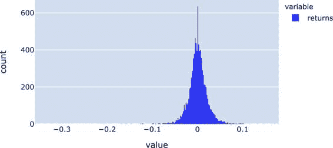

# 第九章

第六章 pandas 时间序列分析

时间序列是沿着基于时间的轴的一系列数据点，在许多不同的场景中发挥着核心作用：交易员使用历史股票价格来计算风险度量，天气预报基于传感器生成的时间序列，这些传感器测量温度、湿度和气压。数字营销部门依赖于由网页生成的时间序列，例如每小时的页面浏览量的来源和数量，并将其用于从中得出关于其营销活动的结论。

时间序列分析是数据科学家和分析师开始寻找比 Excel 更好的替代方案的主要推动力之一。以下几点总结了这一举措背后的一些原因：

大型数据集

> > 时间序列往往会快速超出 Excel 每个工作表大约一百万行的限制。例如，如果你在 tick 数据级别上处理股票的分钟价格，你通常会处理数十万条记录——每支股票每天！

日期和时间

> > 正如我们在第三章中所看到的，Excel 在处理日期和时间时存在各种限制，这是时间序列的基础。缺少对时区的支持以及仅限于毫秒的数字格式是其中一些限制。pandas 支持时区，并使用 NumPy 的`datetime64[ns]`数据类型，该类型可提供高达纳秒的分辨率。

缺失的功能

> > Excel 甚至缺乏基本工具，无法以体面的方式处理时间序列数据。例如，如果你想将每日时间序列转换为每月时间序列，尽管这是一项非常常见的任务，但却没有简单的方法来实现这一点。

DataFrames 允许你使用各种基于时间的索引：`DatetimeIndex`是最常见的一个，表示一个带有时间戳的索引。其他索引类型，比如`PeriodIndex`，基于时间间隔，比如小时或月份。然而，在本章中，我们只关注`DatetimeIndex`，我将在接下来更详细地介绍它。

DatetimeIndex

在本节中，我们将学习如何构建一个`DatetimeIndex`，如何将这样的索引筛选到特定的时间范围，并如何处理时区。

创建一个 DatetimeIndex

要构建一个`DatetimeIndex`，pandas 提供了`date_range`函数。它接受一个开始日期、一个频率，以及要么周期数，要么结束日期：

> `In``[``1``]:``# 让我们从导入本章中使用的包开始``# 并将绘图后端设置为 Plotly``import``pandas``as``pd``import``numpy``as``np``pd``.``options``.``plotting``.``backend``=``"plotly"`
> 
> `In``[``2``]:``# 这将根据开始时间戳、周期数和频率（"D" = daily）创建一个 DatetimeIndex。``daily_index``=``pd``.``date_range``(``"2020-02-28"``,``periods``=``4``,``freq``=``"D"``)``daily_index`
> 
> `Out[2]: DatetimeIndex(['2020-02-28', '2020-02-29', '2020-03-01', '2020-03-02'],          dtype='datetime64[ns]', freq='D')`
> 
> `In``[``3``]:``# 根据起始/结束时间戳创建 DatetimeIndex。频率设置为每周日一次 ("W-SUN")。``weekly_index``=``pd``.``date_range``(``"2020-01-01"``,``"2020-01-31"``,``freq``=``"W-SUN"``)``weekly_index`
> 
> `Out[3]: DatetimeIndex(['2020-01-05', '2020-01-12', '2020-01-19', '2020-01-26'],          dtype='datetime64[ns]', freq='W-SUN')`
> 
> `In``[``4``]:``# 基于 weekly_index 构建 DataFrame。这可以是只在星期日开放的博物馆的访客计数。``pd``.``DataFrame``(``data``=``[``21``,``15``,``33``,``34``],``columns``=``[``"visitors"``],``index``=``weekly_index``)`
> 
> `Out[4]:             visitors         2020-01-05        21         2020-01-12        15         2020-01-19        33         2020-01-26        34`

现在让我们回到上一章的微软股票时间序列。当您仔细查看列的数据类型时，您会注意到`Date`列的类型是`object`，这意味着 pandas 将时间戳解释为字符串：

> `In``[``5``]:``msft``=``pd``.``read_csv``(``"csv/MSFT.csv"``)`
> 
> `In``[``6``]:``msft``.``info``()`
> 
> `<class 'pandas.core.frame.DataFrame'> RangeIndex: 8622 entries, 0 to 8621 Data columns (total 7 columns): #   Column     Non-Null Count  Dtype ---  ------     --------------  ----- 0   Date       8622 non-null   object 1   Open       8622 non-null   float64 2   High       8622 non-null   float64 3   Low        8622 non-null   float64 4   Close      8622 non-null   float64 5   Adj Close  8622 non-null   float64 6   Volume     8622 non-null   int64 dtypes: float64(5), int64(1), object(1) memory usage: 471.6+ KB`

有两种方法可以修复这个问题并将其转换为`datetime`数据类型。第一种方法是在该列上运行`to_datetime`函数。如果您希望在源数据框中更改它，请确保将转换后的列重新赋值给原始 DataFrame：

> `In``[``7``]:``msft``.``loc``[:,``"Date"``]``=``pd``.``to_datetime``(``msft``[``"Date"``])`
> 
> `In``[``8``]:``msft``.``dtypes`
> 
> `Out[8]: Date         datetime64[ns]         Open                float64         High                float64         Low                 float64         Close               float64         Adj Close           float64         Volume                int64         dtype: object`

另一种可能性是告诉`read_csv`哪些列包含时间戳，使用`parse_dates`参数。`parse_dates`需要一个列名或索引的列表。此外，您几乎总是希望将时间戳转换为 DataFrame 的索引，因为这将使您能够轻松地过滤数据，稍后我们将看到。为了避免额外的`set_index`调用，请通过`index_col`参数提供您希望用作索引的列名或索引：

> `In``[``9``]:``msft``=``pd``.``read_csv``(``"csv/MSFT.csv"``,``index_col``=``"Date"``,``parse_dates``=``[``"Date"``])`
> 
> `In``[``10``]:``msft``.``info``()`
> 
> `<class 'pandas.core.frame.DataFrame'> DatetimeIndex: 8622 entries, 1986-03-13 to 2020-05-27 Data columns (total 6 columns): #   Column     Non-Null Count  Dtype ---  ------     --------------  ----- 0   Open       8622 non-null   float64 1   High       8622 non-null   float64 2   Low        8622 non-null   float64 3   Close      8622 non-null   float64 4   Adj Close  8622 non-null   float64 5   Volume     8622 non-null   int64 dtypes: float64(5), int64(1) memory usage: 471.5 KB`

正如`info`所显示的，你现在正在处理一个具有`DatetimeIndex`的 DataFrame。如果你需要更改另一个数据类型（比如你想要`Volume`是`float`而不是`int`），你有两个选项：要么将`dtype={"Volume": float}`作为参数提供给`read_csv`函数，要么像下面这样应用`astype`方法：

> `In``[``11``]:``msft``.``loc``[:,``"Volume"``]``=``msft``[``"Volume"``]``.``astype``(``"float"``)``msft``[``"Volume"``]``.``dtype`
> 
> `Out[11]: dtype('float64')`

在处理时间序列时，在开始分析之前，确保索引已经正确排序是个好主意：

> `In``[``12``]:``msft``=``msft``.``sort_index``()`

最后，如果你需要访问`DatetimeIndex`的部分，比如只需要日期部分而不需要时间，可以像这样访问`date`属性：

> `In``[``13``]:``msft``.``index``.``date`
> 
> `Out[13]: array([datetime.date(1986, 3, 13), datetime.date(1986, 3, 14),                 datetime.date(1986, 3, 17), ..., datetime.date(2020, 5, 22),                 datetime.date(2020, 5, 26), datetime.date(2020, 5, 27)],                dtype=object)`

替代`date`，你也可以使用日期的部分，比如`year`、`month`、`day`等。要访问具有数据类型`datetime`的常规列上的相同功能，你需要使用`dt`属性，例如`df["column_name"].dt.date`。

有了排序的`DatetimeIndex`，让我们看看如何筛选 DataFrame 来选择特定的时间段！

筛选`DatetimeIndex`

如果你的 DataFrame 具有`DatetimeIndex`，可以通过使用格式为`YYYY-MM-DD HH:MM:SS`的字符串在`loc`中选择特定时间段的行。pandas 会将此字符串转换为切片，以涵盖整个时间段。例如，要选择 2019 年的所有行，请提供年份作为字符串，而不是数字：

> `In``[``14``]:``msft``.``loc``[``"2019"``,``"Adj Close"``]`
> 
> `Out[14]: Date          2019-01-02     99.099190          2019-01-03     95.453529          2019-01-04     99.893005          2019-01-07    100.020401          2019-01-08    100.745613                           ...          2019-12-24    156.515396          2019-12-26    157.798309          2019-12-27    158.086731          2019-12-30    156.724243          2019-12-31    156.833633          Name: Adj Close, Length: 252, dtype: float64`

让我们更进一步，绘制 2019 年 6 月至 2020 年 5 月之间的数据（见图表 6-1）：

> `In``[``15``]:``msft``.``loc``[``"2019-06"``:``"2020-05"``,``"Adj Close"``]``.``plot``()`

Figure 6-1\. MSFT 的调整收盘价

将鼠标悬停在 Plotly 图表上以读取提示信息，并通过鼠标绘制矩形来放大。双击图表以返回默认视图。

下一节将使用调整后的收盘价来了解时区处理。

处理时区

微软在纳斯达克证券交易所上市。纳斯达克位于纽约，市场在下午 4 点关闭。要将此附加信息添加到 DataFrame 的索引中，首先通过`DateOffset`将收盘小时添加到日期中，然后通过`tz_localize`将正确的时区附加到时间戳中。由于收盘时间仅适用于收盘价，让我们创建一个新的 DataFrame：

> `In``[``16``]:``# 将时间信息添加到日期中``msft_close``=``msft``.``loc``[:,``[``"Adj Close"``]]``.``copy``()``msft_close``.``index``=``msft_close``.``index``+``pd``.``DateOffset``(``hours``=``16``)``msft_close``.``head``(``2``)`
> 
> `Out[16]:                      Adj Close          Date          1986-03-13 16:00:00   0.062205          1986-03-14 16:00:00   0.064427`
> 
> `In``[``17``]:``# 将时间戳转换为时区感知时间``msft_close``=``msft_close``.``tz_localize``(``"America/New_York"``)``msft_close``.``head``(``2``)`
> 
> `Out[17]:                            Adj Close          Date          1986-03-13 16:00:00-05:00   0.062205          1986-03-14 16:00:00-05:00   0.064427`

如果您想将时间戳转换为 UTC 时区，请使用 DataFrame 方法`tz_convert`。UTC 代表协调世界时，是格林威治标准时间（GMT）的继任者。请注意，根据纽约是否实行夏令时（DST），UTC 中的收盘时间会发生变化：

> `In``[``18``]:``msft_close``=``msft_close``.``tz_convert``(``"UTC"``)``msft_close``.``loc``[``"2020-01-02"``,``"Adj Close"``]``# 21:00 没有夏令时`
> 
> `Out[18]: Date          2020-01-02 21:00:00+00:00    159.737595          Name: Adj Close, dtype: float64`
> 
> `In``[``19``]:``msft_close``.``loc``[``"2020-05-01"``,``"Adj Close"``]``# 20:00 包含夏令时`
> 
> `Out[19]: Date          2020-05-01 20:00:00+00:00    174.085175          Name: Adj Close, dtype: float64`

准备这样的时间序列将允许您即使时间信息缺失或以本地时区陈述，也能比较来自不同时区证券交易所的收盘价。

现在您已经了解了什么是`DatetimeIndex`，让我们在下一节中尝试一些常见的时间序列操作，例如计算和比较股票表现。

常见的时间序列操作

在本节中，我将向您展示如何执行常见的时间序列分析任务，例如计算股票回报率、绘制各种股票的表现，并在热图中可视化它们的回报相关性。我们还将看到如何更改时间序列的频率以及如何计算滚动统计数据。

Shifting and Percentage Changes

在金融领域，股票的对数收益率通常被假设为正态分布。通过对数收益率，我指的是当前价格与上一个价格的比率的自然对数。为了对每日对数收益率的分布有所了解，让我们绘制一个直方图。但首先，我们需要计算对数收益率。在 Excel 中，通常使用涉及来自两行的单元格的公式，如图 6-2 所示。

图 6-2\. 在 Excel 中计算对数收益率

> Excel 和 Python 中的对数
> 
> Excel 使用`LN`表示自然对数，`LOG`表示以 10 为底的对数。然而，Python 的 math 模块和 NumPy 使用`log`表示自然对数，`log10`表示以 10 为底的对数。

使用 pandas，而不是使用一个访问两个不同行的公式，你可以使用`shift`方法将值向下移动一行。这样可以让你在单个行上操作，因此你的计算可以利用矢量化。`shift`接受一个正数或负数，将时间序列向下或向上移动相应数量的行。让我们首先看看`shift`如何工作：

> `In``[``20``]:``msft_close``.``head``()`
> 
> `Out[20]:                            调整后收盘价          日期          1986-03-13 21:00:00+00:00   0.062205          1986-03-14 21:00:00+00:00   0.064427          1986-03-17 21:00:00+00:00   0.065537          1986-03-18 21:00:00+00:00   0.063871          1986-03-19 21:00:00+00:00   0.062760`
> 
> `In``[``21``]:``msft_close``.``shift``(``1``)``.``head``()`
> 
> `Out[21]:                            调整后收盘价          日期          1986-03-13 21:00:00+00:00        NaN          1986-03-14 21:00:00+00:00   0.062205          1986-03-17 21:00:00+00:00   0.064427          1986-03-18 21:00:00+00:00   0.065537          1986-03-19 21:00:00+00:00   0.063871`

现在你可以编写一个简单的基于向量的公式，易于阅读和理解。要获取自然对数，请使用 NumPy 的`log` ufunc，它应用于每个元素。然后我们可以绘制直方图（见图 6-3）：

> `In``[``22``]:``returns``=``np``.``log``(``msft_close``/``msft_close``.``shift``(``1``))``returns``=``returns``.``rename``(``columns``=``{``"Adj Close"``:``"returns"``})``returns``.``head``()`
> 
> `Out[22]:                             returns          日期          1986-03-13 21:00:00+00:00       NaN          1986-03-14 21:00:00+00:00  0.035097          1986-03-17 21:00:00+00:00  0.017082          1986-03-18 21:00:00+00:00 -0.025749          1986-03-19 21:00:00+00:00 -0.017547`
> 
> `In``[``23``]:``# 用每日对数收益率绘制直方图``returns``.``plot``.``hist``()`

图 6-3\. 直方图绘制

要获得简单的收益率，使用 pandas 内置的`pct_change`方法。默认情况下，它计算与上一行的百分比变化，这也是简单收益率的定义：

> `In``[``24``]:``simple_rets``=``msft_close``.``pct_change``()``simple_rets``=``simple_rets``.``rename``(``columns``=``{``"Adj Close"``:``"简单回报"``})``simple_rets``.``head``()`
> 
> `Out[24]:                           简单回报          日期          1986-03-13 21:00:00+00:00          NaN          1986-03-14 21:00:00+00:00     0.035721          1986-03-17 21:00:00+00:00     0.017229          1986-03-18 21:00:00+00:00    -0.025421          1986-03-19 21:00:00+00:00    -0.017394`

到目前为止，我们只看过微软股票。在下一节中，我们将加载更多时间序列，以便查看需要多个时间序列的其他数据框方法。

重新基准化和相关性

当我们处理多个时间序列时，情况会变得稍微有趣。让我们加载亚马逊（`AMZN`）、谷歌（`GOOGL`）和苹果（`AAPL`）的一些额外调整后的收盘价格，这些数据也是从 Yahoo! Finance 下载的。

> `In``[``25``]:``parts``=``[]``# 用于收集各个数据框的列表``for``ticker``in``[``"AAPL"``,``"AMZN"``,``"GOOGL"``,``"MSFT"``]:``# `usecols`参数允许我们只读取日期和调整后的收盘价``adj_close``=``pd``.``read_csv``(``f``"csv/{ticker}.csv"``,``index_col``=``"Date"``,``parse_dates``=``[``"Date"``],``usecols``=``[``"Date"``,``"Adj Close"``])``# 将列名改为股票代号``adj_close``=``adj_close``.``rename``(``columns``=``{``"Adj Close"``:``ticker``})``# 将该股票的数据框附加到 parts 列表``parts``.``append``(``adj_close``)`
> 
> `In``[``26``]:``# 将这 4 个数据框合并为一个数据框``adj_close``=``pd``.``concat``(``parts``,``axis``=``1``)``adj_close`
> 
> `Out[26]:                   AAPL         AMZN        GOOGL        MSFT          日期          1980-12-12    0.405683          NaN          NaN         NaN          1980-12-15    0.384517          NaN          NaN         NaN          1980-12-16    0.356296          NaN          NaN         NaN          1980-12-17    0.365115          NaN          NaN         NaN          1980-12-18    0.375698          NaN          NaN         NaN          ...                ...          ...          ...         ...          2020-05-22  318.890015  2436.879883  1413.239990  183.509995          2020-05-26  316.730011  2421.860107  1421.369995  181.570007          2020-05-27  318.109985  2410.389893  1420.280029  181.809998          2020-05-28  318.250000  2401.100098  1418.239990         NaN          2020-05-29  317.940002  2442.370117  1433.520020         NaN           [9950 行 x 4 列]`

你看到`concat`的威力了吗？pandas 自动对齐了各个时间序列的日期。这就是为什么在那些不如 Apple 的股票中你会得到`NaN`值的原因。而且由于`MSFT`在最近日期有`NaN`值，你可能已经猜到我比其他股票提前两天下载了 MSFT.csv 文件。通过日期对齐时间序列是一种典型的操作，在 Excel 中非常繁琐且容易出错。删除所有包含缺失值的行将确保所有股票具有相同的数据点：

> `In``[``27``]:`adj_close`=``adj_close``.``dropna``()``adj_close``.``info``()`
> 
> `<class 'pandas.core.frame.DataFrame'> DatetimeIndex: 3970 entries, 2004-08-19 to 2020-05-27 Data columns (total 4 columns): #   Column  Non-Null Count  Dtype ---  ------  --------------  ----- 0   AAPL    3970 non-null   float64 1   AMZN    3970 non-null   float64 2   GOOGL   3970 non-null   float64 3   MSFT    3970 non-null   float64 dtypes: float64(4) memory usage: 155.1 KB`

现在我们将价格重新基准化，使所有时间序列从 100 开始。这样可以在图表中比较它们的相对表现；见图 6-4。要重新基准化时间序列，将每个值除以其起始值并乘以 100，这是新的基准。如果在 Excel 中进行此操作，通常会编写一个结合绝对和相对单元格引用的公式，然后将该公式复制到每行和每个时间序列。在 pandas 中，由于矢量化和广播技术，你只需处理一个公式：

> `In``[``28``]:`# 使用 2019 年 6 月至 2020 年 5 月的样本`adj_close_sample`=``adj_close``.``loc``[``"2019-06"``:``"2020-05"``,``:]``rebased_prices`=``adj_close_sample``/``adj_close_sample``.``iloc``[``0``,``:]``*``100``rebased_prices``.``head``(``2``)`
> 
> `Out[28]:                   AAPL        AMZN      GOOGL        MSFT          Date          2019-06-03  100.000000  100.000000  100.00000  100.000000          2019-06-04  103.658406  102.178197  101.51626  102.770372`
> 
> `In``[``29``]:`rebased_prices``.``plot``()

图 6-4. 重新基准化的时间序列

要查看不同股票的回报独立性，可以使用`corr`方法查看它们的相关性。不幸的是，pandas 没有提供内置的绘制热力图形式的相关矩阵的方法，因此我们需要直接通过其`plotly.express`接口使用 Plotly（见图 6-5）：

> `In``[``30``]:`# 每日对数收益率的相关性`returns`=``np``.``log``(``adj_close``/``adj_close``.``shift``(``1``))``returns``.``corr``()
> 
> `Out[30]:            AAPL      AMZN     GOOGL      MSFT          AAPL   1.000000  0.424910  0.503497  0.486065          AMZN   0.424910  1.000000  0.486690  0.485725          GOOGL  0.503497  0.486690  1.000000  0.525645          MSFT   0.486065  0.485725  0.525645  1.000000`
> 
> `In``[``31``]:`import`plotly.express`as`px
> 
> `In``[``32``]:``fig``=``px``.``imshow``(``returns``.``corr``(),``x``=``adj_close``.``columns``,``y``=``adj_close``.``columns``,``color_continuous_scale``=``list``(``reversed``(``px``.``colors``.``sequential``.``RdBu``)),``zmin``=-``1``,``zmax``=``1``)``fig``.``show``()`

如果你想详细了解`imshow`的工作原理，请查看[Plotly Express API 文档](https://oreil.ly/O86li)。

图 6-5\. 相关性热力图

到目前为止，我们已经学到了关于时间序列的许多知识，包括如何组合和清理它们，如何计算收益率和相关性。但是，如果你决定日收益率不适合你的分析基础，想要月度收益率呢？如何改变时间序列数据的频率将成为下一节的主题。

重新采样

时间序列的常见任务包括上采样和下采样。上采样意味着将时间序列转换为频率更高的序列，而下采样则意味着将其转换为频率较低的序列。例如，在财务报表中，通常显示月度或季度表现。要将日度时间序列转换为月度时间序列，请使用`resample`方法，该方法接受频率字符串如`M`表示月末或`BM`表示工作日结束。你可以在[pandas 文档](https://oreil.ly/zStpt)中找到所有频率字符串的列表。类似于`groupby`的工作方式，然后链接定义如何重新采样的方法。我使用`last`来始终获取该月的最后观测值：

> `In``[``33``]:``end_of_month``=``adj_close``.``resample``(``"M"``)``.``last``()``end_of_month``.``head``()`
> 
> `Out[33]:                 AAPL       AMZN      GOOGL       MSFT          Date          2004-08-31  2.132708  38.139999  51.236237  17.673630          2004-09-30  2.396127  40.860001  64.864868  17.900215          2004-10-31  3.240182  34.130001  95.415413  18.107374          2004-11-30  4.146072  39.680000  91.081078  19.344421          2004-12-31  3.982207  44.290001  96.491493  19.279480`

你可以选择除`last`外的任何在`groupby`上有效的方法，如`sum`或`mean`。还有`ohlc`，它方便地返回该期间的开盘价、最高价、最低价和收盘价。这可能用作创建股票价格常用的蜡烛图表的源。

如果你只有那些月末时间序列数据，并且需要生成周度时间序列，你需要对时间序列进行上采样。通过使用`asfreq`，你告诉 pandas 不要应用任何转换，因此你将看到大多数值显示为`NaN`。如果你想要向前填充最后已知值，使用`ffill`方法：

> `In``[``34``]:``end_of_month``.``resample``(``"D"``)``.``asfreq``()``.``head``()``# No transformation`
> 
> `Out[34]:                 AAPL       AMZN      GOOGL      MSFT          日期          2004-08-31  2.132708  38.139999  51.236237  17.67363          2004-09-01       NaN        NaN        NaN       NaN          2004-09-02       NaN        NaN        NaN       NaN          2004-09-03       NaN        NaN        NaN       NaN          2004-09-04       NaN        NaN        NaN       NaN`
> 
> `In``[``35``]:``end_of_month``.``resample``(``"W-FRI"``)``.``ffill``()``.``head``()``# 前向填充
> 
> `Out[35]:                 AAPL       AMZN      GOOGL       MSFT          日期          2004-09-03  2.132708  38.139999  51.236237  17.673630          2004-09-10  2.132708  38.139999  51.236237  17.673630          2004-09-17  2.132708  38.139999  51.236237  17.673630          2004-09-24  2.132708  38.139999  51.236237  17.673630          2004-10-01  2.396127  40.860001  64.864868  17.900215`

降采样数据是平滑时间序列的一种方式。计算滚动窗口中的统计数据是另一种方式，我们将在下面看到。

滚动窗口

当计算时间序列统计数据时，通常需要一个滚动统计量，如移动平均线。移动平均线查看时间序列的子集（比如 25 天），并在将窗口向前移动一天之前从该子集中取平均值。这将产生一个新的时间序列，更平滑且不易受到异常值的影响。如果你从事算法交易，可能会关注移动平均线与股票价格的交点，并将其（或其变体）作为交易信号。DataFrame 具有`rolling`方法，接受观察次数作为参数。然后，将其与要使用的统计方法链接起来——对于移动平均线，就是`mean`。通过查看图 6-6，你可以轻松比较原始时间序列与平滑移动平均线：

> `In``[``36``]:``# 使用 2019 年数据为 MSFT 绘制移动平均线``msft19``=``msft``.``loc``[``"2019"``,``[``"Adj Close"``]]``.``copy``()``# 将 25 天移动平均线作为新列添加到 DataFrame``msft19``.``loc``[:,``"25day average"``]``=``msft19``[``"Adj Close"``]``.``rolling``(``25``)``.``mean``()``msft19``.``plot``()`

图 6-6\. 移动平均线图

你可以使用许多其他统计方法来替代`mean`，包括`count`、`sum`、`median`、`min`、`max`、`std`（标准差）或`var`（方差）。

到目前为止，我们已经看到了 pandas 最重要的功能。同样重要的是要理解 pandas 的局限性，即使它们可能现在仍然很远。

pandas 的局限性

当你的 DataFrame 开始变得更大时，了解 DataFrame 能容纳的上限是个好主意。与 Excel 不同，Excel 的每个工作表都有大约一百万行和一万二千列的硬性限制，而 pandas 只有软性限制：所有数据必须适合计算机可用的内存。如果情况不是这样，可能有一些简单的解决方案：只加载你需要的数据集中的那些列，或者删除中间结果以释放一些内存。如果这些方法都不起作用，有一些项目可能会让 pandas 用户感到熟悉，但可以处理大数据。其中一个项目是[Dask](https://dask.org)，它在 NumPy 和 pandas 之上工作，允许你通过将数据拆分成多个 pandas DataFrame，并将工作负载分配到多个 CPU 核心或机器上来处理大型数据集。其他与某种 DataFrame 类似的大数据项目包括[Modin](https://oreil.ly/Wd8gi)，[Koalas](https://oreil.ly/V13Be)，[Vaex](https://vaex.io)，[PySpark](https://oreil.ly/E7kmX)，[cuDF](https://oreil.ly/zaeWz)，[Ibis](https://oreil.ly/Gw4wn)和[PyArrow](https://oreil.ly/DQQGD)。我们将在下一章简要介绍 Modin，但除此之外，在本书中我们不会进一步探索这个主题。

结论

时间序列分析是我认为 Excel 落后最多的领域，所以在阅读本章之后，你可能会明白为什么 pandas 在金融领域如此成功，金融行业严重依赖时间序列。我们已经看到了处理时区、重采样时间序列或生成相关矩阵是多么容易，而这些功能在 Excel 中要么不支持，要么需要繁琐的解决方案。

然而，了解如何使用 pandas 并不意味着你必须放弃 Excel，因为这两个世界可以非常好地配合：pandas DataFrame 是在两个世界之间传输数据的好方法，正如我们将在下一部分中看到的，该部分将介绍绕过 Excel 应用程序完全读写 Excel 文件的方式。这非常有帮助，因为它意味着你可以在 Python 支持的所有操作系统上使用 Python 操作 Excel 文件，包括 Linux。为了开始这段旅程，下一章将向你展示如何使用 pandas 来自动化繁琐的手动流程，比如将 Excel 文件聚合成摘要报告。
