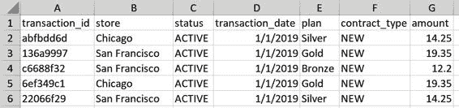
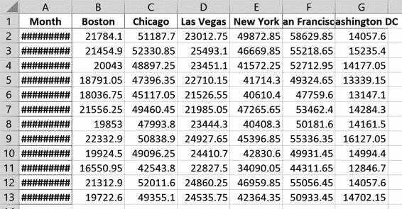
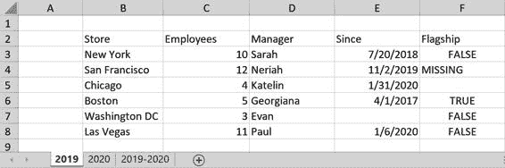
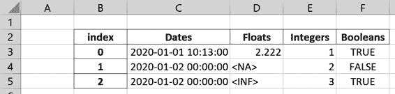

# 第十一章

第七章. 使用 pandas 进行 Excel 文件操作

在经历了六章对工具、Python 和 pandas 的激烈介绍之后，我将给你一个休息时间，并从一个实际案例研究开始本章，让你能够将你新获得的技能应用到实际中：仅需十行 pandas 代码，你就可以将数十个 Excel 文件合并成一份 Excel 报告，准备发送给你的经理们。案例研究之后，我将更深入地介绍 pandas 提供的处理 Excel 文件的工具：`read_excel` 函数和 `ExcelFile` 类用于读取，`to_excel` 方法和 `ExcelWriter` 类用于写入 Excel 文件。pandas 不依赖 Excel 应用程序来读写 Excel 文件，这意味着本章中的所有代码示例都可以在 Python 运行的任何地方运行，包括 Linux。

案例研究：Excel 报告

这个案例研究受到我在过去几年参与的几个真实报告项目的启发。尽管这些项目涉及完全不同的行业—包括电信、数字营销和金融—但它们仍然非常相似：起点通常是一个包含需要处理为 Excel 报告的 Excel 文件的目录—通常是每月、每周或每日的基础上。在伴随的存储库中，在 sales_data 目录中，你会找到用于电信供应商销售不同套餐（Bronze、Silver、Gold）的虚构销售交易的 Excel 文件，这些套餐分布在美国的几家商店中。对于每个月，都有两个文件，一个在 new 子文件夹中用于新合同，另一个在 existing 子文件夹中用于现有客户。由于这些报告来自不同的系统，它们有不同的格式：新客户以 xlsx 文件的形式交付，而现有客户则以旧的 xls 格式交付。每个文件最多有 10,000 笔交易，我们的目标是生成一个 Excel 报告，显示每个商店和月份的总销售额。要开始，请查看 new 子文件夹中的 January.xlsx 文件中的 Figure 7-1。

图 7-1. January.xlsx 的前几行

existing 子文件夹中的 Excel 文件看起来几乎相同，只是缺少 `status` 列，并存储在传统的 xls 格式中。作为第一步，让我们使用 pandas 的 `read_excel` 函数读取 1 月份的新交易：

> `In``[``1``]:``import``pandas``as``pd`
> 
> `In``[``2``]:``df``=``pd``.``read_excel``(``"sales_data/new/January.xlsx"``)``df``.``info``()``
> 
> `<class 'pandas.core.frame.DataFrame'> RangeIndex: 9493 entries, 0 to 9492 Data columns (total 7 columns): #   Column            Non-Null Count  Dtype ---  ------            --------------  ----- 0   transaction_id    9493 non-null   object 1   store             9493 non-null   object 2   status            9493 non-null   object 3   transaction_date  9493 non-null   datetime64[ns] 4   plan              9493 non-null   object 5   contract_type     9493 non-null   object 6   amount            9493 non-null   float64 dtypes: datetime64ns**  float64(1), object(5) memory usage: 519.3+ KB`
> 
> 使用 Python 3.9 的 READ_EXCEL 函数
> 
> 这与第 5 章中的警告相同：如果您使用 Python 3.9 或更高版本运行`pd.read_excel`，请确保至少使用 pandas 1.2，否则在读取 xlsx 文件时会出错。

如您所见，pandas 已正确识别了所有列的数据类型，包括`transaction_date`的日期格式。这使我们能够在不需要进一步准备数据的情况下处理数据。由于此示例故意简单，我们可以继续创建一个名为 sales_report_pandas.py 的短脚本，如示例 7-1 所示。此脚本将从两个目录中读取所有 Excel 文件，聚合数据，并将汇总表写入新的 Excel 文件中。使用 VS Code 自己编写脚本，或者从伴随的代码库中打开它。如需了解如何在 VS Code 中创建或打开文件，请再次参考第 2 章。如果您自己创建，请确保将其放在 sales_data 文件夹旁边——这样可以在无需调整任何文件路径的情况下运行脚本。

示例 7-1\. sales_report_pandas.py

`from``pathlib``import``Path``import``pandas``as``pd``# 本文件的目录``this_dir``=``Path``(``__file__``)``.``resolve``()``.``parent``# 从 sales_data 的所有子文件夹中读取所有 Excel 文件``parts``=``[]``for``path``in``(``this_dir``/``"sales_data"``)``.``rglob``(``"*.xls*"``):``print``(``f``'读取 {path.name}'``)``part``=``pd``.``read_excel``(``path``,``index_col``=``"transaction_id"``)``parts``.``append``(``part``)``# 将每个文件的 DataFrame 合并为单个 DataFrame``# pandas 会正确对齐列``df``=``pd``.``concat``(``parts``)``# 将每个商店转换为列，并按日期汇总所有交易``pivot``=``pd``.``pivot_table``(``df``,``index``=``"transaction_date"``,``columns``=``"store"``,``values``=``"amount"``,``aggfunc``=``"sum"``)``# 重新采样到月底并分配索引名称``summary``=``pivot``.``resample``(``"M"``)``.``sum``()``summary``.``index``.``name``=``"Month"``# 将汇总报告写入 Excel 文件``summary``.``to_excel``(``this_dir``/``"sales_report_pandas.xlsx"``)`

> > 在本章之前，我一直使用字符串来指定文件路径。通过使用标准库的 pathlib 模块中的 `Path` 类，你可以获得一套强大的工具：路径对象使您能够通过连接个别部分使用斜杠来轻松构建路径，正如下面四行代码中使用 `this_dir / "sales_data"` 一样。这些路径适用于各种平台，并允许您像在下一点解释的那样使用 `rglob` 等过滤器。当您运行时，`__file__` 将解析为源代码文件的路径——使用其 `parent` 将因此给出此文件所在目录的名称。我们在调用 `parent` 之前使用的 `resolve` 方法将路径转换为绝对路径。如果您在 Jupyter 笔记本中运行此代码，则必须使用 `this_dir = Path(".").resolve()` 替换此行，其中点表示当前目录。在大多数情况下，接受字符串形式路径的函数和类也接受路径对象。

> > 从特定目录递归读取所有 Excel 文件的最简单方法是使用路径对象的 `rglob` 方法。`glob` 是通配符扩展的简写，用于使用通配符进行路径名扩展。`?` 通配符代表一个字符，而 `*` 代表任意数量的字符（包括零个）。`rglob` 中的 r 表示递归通配符，即它将在所有子目录中查找匹配的文件——相应地，`glob` 将忽略子目录。使用 `*.xls*` 作为通配符表达式确保可以找到旧的和新的 Excel 文件，因为它匹配 `.xls` 和 `.xlsx`。通常建议稍微增强表达式，例如 `[!~$]*.xls*`。这会忽略临时 Excel 文件（它们的文件名以 `~$` 开头）。有关如何在 Python 中使用通配符扩展的更多背景信息，请参阅 [Python 文档](https://oreil.ly/fY0qG)。

运行脚本，例如，通过点击 VS Code 右上角的“运行文件”按钮。脚本将需要一段时间来完成，完成后，Excel 工作簿 sales_report_pandas.xlsx 将出现在与脚本相同的目录中。Sheet1 的内容应该像 图 7-2 中所示。这对于只有十行代码的结果相当令人印象深刻——即使您需要调整第一列的宽度以查看日期！

图 7-2\. sales_report_pandas.xlsx（原样，不调整任何列宽）

对于像这样简单的情况，pandas 提供了处理 Excel 文件的非常简便的解决方案。但是，我们可以做得更好——毕竟，一个标题、一些格式（包括列宽和一致的小数位数）以及一个图表都不会有什么坏处。这正是我们将在下一章中通过直接使用 pandas 底层使用的写入库来解决的问题。然而，在我们到达那里之前，让我们更详细地看看如何使用 pandas 读取和写入 Excel 文件。

使用 pandas 读写 Excel 文件

该案例研究使用 `read_excel` 和 `to_excel` 的默认参数来简化操作。在本节中，我将介绍使用 pandas 读写 Excel 文件时最常用的参数和选项。我们将从 `read_excel` 函数和 `ExcelFile` 类开始，然后再看看 `to_excel` 方法和 `ExcelWriter` 类。在此过程中，我还会介绍 Python 的 `with` 语句。

`read_excel` 函数和 ExcelFile 类

该案例研究使用的是 Excel 工作簿，数据方便地位于第一个工作表的 A1 单元格。实际情况下，您的 Excel 文件可能没有那么好组织。在这种情况下，pandas 提供了参数来优化读取过程。接下来的示例中，我们将使用 companion 存储库的 xl 文件夹中的 stores.xlsx 文件。第一个工作表显示在 Figure 7-3 中。

图 7-3\. stores.xlsx 的第一个工作表

通过使用 `sheet_name`、`skiprows` 和 `usecols` 参数，我们可以告诉 pandas 我们想要读取的单元格范围。通常情况下，通过运行 `info` 方法查看返回的 DataFrame 的数据类型是个好主意：

> `In``[``3``]:``df``=``pd``.``read_excel``(``"xl/stores.xlsx"``,``sheet_name``=``"2019"``,``skiprows``=``1``,``usecols``=``"B:F"``)``df`
> 
> `Out[3]:            Store  Employees    Manager      Since Flagship         0       New York         10      Sarah 2018-07-20    False         1  San Francisco         12     Neriah 2019-11-02  MISSING         2        Chicago          4    Katelin 2020-01-31      NaN         3         Boston          5  Georgiana 2017-04-01     True         4  Washington DC          3       Evan        NaT    False         5      Las Vegas         11       Paul 2020-01-06    False`
> 
> `In``[``4``]:``df``.``info``()
> 
> `<class 'pandas.core.frame.DataFrame'> RangeIndex: 6 entries, 0 to 5 Data columns (total 5 columns): #   Column     Non-Null Count  Dtype ---  ------     --------------  ----- 0   Store      6 non-null      object 1   Employees  6 non-null      int64 2   Manager    6 non-null      object 3   Since      5 non-null      datetime64[ns] 4   Flagship   5 non-null      object dtypes: datetime64ns**  int64(1), object(3) memory usage: 368.0+ bytes`

除了 `Flagship` 列之外，一切看起来都很好——它的数据类型应为 `bool` 而不是 `object`。为了修复这个问题，我们可以提供一个转换函数，处理该列中的问题单元格（而不是编写 `fix_missing` 函数，我们也可以使用 lambda 表达式代替）：

> `In``[``5``]:``def``fix_missing``(``x``):``return``False``if``x``in``[``""``,``"MISSING"``]``else``x`
> 
> `In``[``6``]:``df``=``pd``.``read_excel``(``"xl/stores.xlsx"``,``sheet_name``=``"2019"``,``skiprows``=``1``,``usecols``=``"B:F"``,``converters``=``{``"Flagship"``:``fix_missing``})``df`
> 
> `Out[6]:            Store  Employees    Manager      Since  Flagship         0       纽约         10      莎拉 2018-07-20     False         1  旧金山         12     尼赖亚 2019-11-02     False         2        芝加哥          4    凯特琳 2020-01-31     False         3         波士顿          5  乔治安娜 2017-04-01      True         4  华盛顿特区          3       伊万        NaT     False         5      拉斯维加斯         11       保罗 2020-01-06     False`
> 
> `In``[``7``]:``# Flagship 列现在的 Dtype 是 "bool"``df``.``info``()
> 
> `<class 'pandas.core.frame.DataFrame'> RangeIndex: 6 entries, 0 to 5 Data columns (total 5 columns): #   Column     Non-Null Count  Dtype ---  ------     --------------  ----- 0   分店      6 non-null      object 1   员工数量  6 non-null      int64 2   经理    6 non-null      object 3   自从      5 non-null      datetime64[ns] 4   是否旗舰店   6 non-null      bool dtypes: bool(1), datetime64ns**  int64(1), object(2) memory usage: 326.0+ bytes`

`read_excel` 函数还接受一个工作表名称列表。在这种情况下，它将返回一个字典，其中 DataFrame 作为值，工作表名称作为键。要读取所有工作表，您需要提供 `sheet_name=None`。还请注意，我在使用 `usecols` 时提供了表格列名的略微变体：

> `In``[``8``]:``sheets``=``pd``.``read_excel``(``"xl/stores.xlsx"``,``sheet_name``=``[``"2019"``,``"2020"``],``skiprows``=``1``,``usecols``=``[``"分店"``,``"员工数量"``])``sheets``[``"2019"``]``.``head``(``2``)`
> 
> `Out[8]:            分店  员工数量         0       纽约         10         1  旧金山         12`

如果源文件没有列标题，请将 `header=None` 设置，并通过 `names` 提供它们。请注意，`sheet_name` 还接受工作表索引：

> `In``[``9``]:``df``=``pd``.``read_excel``(``"xl/stores.xlsx"``,``sheet_name``=``0``,``skiprows``=``2``,``skipfooter``=``3``,``usecols``=``"B:C,F"``,``header``=``None``,``names``=``[``"分店"``,``"员工数量"``,``"是否旗舰店"``])``df`
> 
> `Out[9]:           分店  员工数量 是否旗舰店         0       纽约              10       False         1  旧金山              12     MISSING         2        芝加哥               4         NaN`

要处理 `NaN` 值，请使用 `na_values` 和 `keep_default_na` 的组合。下一个示例告诉 pandas 仅将包含 `MISSING` 字样的单元格解释为 `NaN`，而不是其他任何内容：

> `In``[``10``]:``df``=``pd``.``read_excel``(``"xl/stores.xlsx"``,``sheet_name``=``"2019"``,``skiprows``=``1``,``usecols``=``"B,C,F"``,``skipfooter``=``2``,``na_values``=``"MISSING"``,``keep_default_na``=``False``)``df`
> 
> `Out[10]:            分店  员工数量 是否旗舰店          0       纽约         10    False          1  旧金山         12      NaN          2        芝加哥          4          3         波士顿          5     True`

pandas 提供了另一种通过使用`ExcelFile`类读取 Excel 文件的方法。这主要在您想要从遗留 xls 格式文件中读取多个工作表时有所不同：在这种情况下，使用`ExcelFile`将更快，因为它防止 pandas 多次读取整个文件。`ExcelFile`可以作为上下文管理器使用（参见侧边栏），因此文件将再次被正确关闭。

> 上下文管理器和`with`语句
> 
> 首先，Python 中的`with`语句与 VBA 中的`With`语句没有任何关系：在 VBA 中，它用于在同一对象上运行一系列语句，而在 Python 中，它用于管理文件或数据库连接等资源。如果要加载最新的销售数据以便进行分析，可能需要打开文件或建立到数据库的连接。在完成数据读取后，尽快关闭文件或连接是最佳实践。否则，您可能会遇到无法打开另一个文件或建立另一个数据库连接的情况——文件处理程序和数据库连接是有限资源。手动打开和关闭文本文件的方法如下（`w`表示以`写`模式打开文件，如果文件已存在则替换它）：
> 
> `In``[``11``]:``f``=``open``(``"output.txt"``,``"w"``)``f``.``write``(``"Some text"``)``f``.``close``()``
> 
> 运行此代码将在与正在运行代码的笔记本相同的目录中创建一个名为 output.txt 的文件，并将“Some text”写入其中。要读取文件，您将使用`r`而不是`w`，要在文件末尾追加内容，使用`a`。由于文件也可以从程序外部进行操作，此类操作可能会失败。您可以通过使用我将在第十一章中介绍的 try/except 机制来处理此问题。然而，由于这是一个常见的操作，Python 提供了`with`语句以简化操作：
> 
> `In``[``12``]:``with``open``(``"output.txt"``,``"w"``)``as``f``:``f``.``write``(``"Some text"``)`
> 
> 当代码执行离开`with`语句的主体时，无论是否发生异常，文件都会自动关闭。这确保资源得到适当的清理。支持`with`语句的对象称为上下文管理器；这包括本章中的`ExcelFile`和`ExcelWriter`对象，以及我们将在第十一章中查看的数据库连接对象。

让我们看看`ExcelFile`类的实际应用：

> `In``[``13``]:``with``pd``.``ExcelFile``(``"xl/stores.xls"``)``as``f``:``df1``=``pd``.``read_excel``(``f``,``"2019"``,``skiprows``=``1``,``usecols``=``"B:F"``,``nrows``=``2``)``df2``=``pd``.``read_excel``(``f``,``"2020"``,``skiprows``=``1``,``usecols``=``"B:F"``,``nrows``=``2``)``df1`
> 
> `Out[13]:            Store  Employees Manager      Since Flagship          0       纽约         10   莎拉 2018-07-20    False          1  旧金山         12  尼莉亚 2019-11-02  MISSING`

`ExcelFile`还允许您访问所有工作表的名称：

> `In``[``14``]:``stores``=``pd``.``ExcelFile``(``"xl/stores.xlsx"``)``stores``.``sheet_names`
> 
> `Out[14]: ['2019', '2020', '2019-2020']`

最后，pandas 允许您从 URL 直接读取 Excel 文件，类似于我们在第五章中读取 CSV 文件的方法。让我们直接从伴随存储库中读取：

> `In``[``15``]:``url``=``(``"https://raw.githubusercontent.com/fzumstein/"``"python-for-excel/1st-edition/xl/stores.xlsx"``)``pd``.``read_excel``(``url``,``skiprows``=``1``,``usecols``=``"B:E"``,``nrows``=``2``)`
> 
> `Out[15]:            Store  Employees Manager      Since          0       纽约         10   莎拉 2018-07-20          1  旧金山         12  尼莉亚 2019-11-02`
> 
> 通过 pandas 读取 XLSB 文件
> 
> 如果你使用版本低于 1.3 的 pandas，读取 xlsb 文件需要在`read_excel`函数或`ExcelFile`类中显式指定引擎：
> 
> > `pd``.``read_excel``(``"xl/stores.xlsb"``,``engine``=``"pyxlsb"``)`
> > 
> 这需要安装`pyxlsb`包，因为它不是 Anaconda 的一部分——我们将在下一章节介绍其它引擎时详细讨论。

总结一下，表格 7-1 展示了最常用的`read_excel`参数。你可以在[官方文档](https://oreil.ly/v8Yes)中找到完整列表。

Table 7-1\. `read_excel`的选定参数

|  参数  |  描述  |
| --- | --- |
|   `sheet_name` |  你可以提供一个零基索引的表名，例如，`sheet_name=0`。如果你设置`sheet_name=None`，pandas 将读取整个工作簿，并返回形如`{"sheetname": df}`的字典。如果要读取选择的几个表，可以提供一个包含表名或索引的列表。 |
|   `skiprows` |  这允许您跳过指定数量的行。  |
|   `usecols` |  如果 Excel 文件包含列标题的名称，请以列表形式提供它们来选择列，例如，`["Store", "Employees"]`。或者，可以是列索引的列表，例如，`[1, 2]`，或者一个包含 Excel 列名（包括范围）的字符串，例如，`"B:D,G"`。还可以提供一个函数：例如，只包含以`Manager`开头的列，请使用：`usecols=lambda x: x.startswith("Manager")`。 |
|   `nrows` |  你要读取的行数。  |
|   `index_col` |  指示应该作为索引的列，可以是列名或索引，例如，`index_col=0`。如果提供多列的列表，将创建一个分层索引。 |
|   `header` |  如果设置`header=None`，则分配默认整数标题，除非通过`names`参数提供所需的名称。如果提供索引列表，将创建分层列标题。 |
|   `names` |  以列表形式提供您的列的期望名称。 |
|   `na_values` |  默认情况下，pandas 将以下单元格值解释为`NaN`（我在第五章介绍了`NaN`）：空单元格、`#NA`、`NA`、`null`、`#N/A`、`N/A`、`NaN`、`n/a`、`-NaN`、`1.#IND`、`nan`、`#N/A N/A`、`-1.#QNAN`、`-nan`、`NULL`、`-1.#IND`、`<NA>`、`1.#QNAN`。如果您想要添加一个或多个值到该列表，请通过`na_values`提供它们。 |
|   `keep_default_na` |  如果您想忽略 pandas 解释为`NaN`的默认值，请设置`keep_default_na=False`。 |
|   `convert_float` |  Excel 将所有数字内部存储为浮点数，并且默认情况下，pandas 会将没有意义小数的数字转换为整数。如果您想改变这种行为，请设置`convert_float=False`（这可能会稍快一些）。 |
|   `converters` |  允许您为每列提供一个函数以转换其值。例如，要使某一列中的文本变为大写，使用以下内容：`converters={"column_name": lambda x: x.upper()}`。 |

读取 Excel 文件与 pandas 相关的内容就这么多，接下来我们转向另一方面，学习如何在下一节中写入 Excel 文件！

to_excel 方法和 ExcelWriter 类

使用 pandas 写入 Excel 文件的最简单方法是使用 DataFrame 的`to_excel`方法。它允许您指定要将 DataFrame 写入的哪个工作表的哪个单元格。您还可以决定是否包括 DataFrame 的列标题和索引，以及如何处理 Excel 中没有等价表示的数据类型，如`np.nan`和`np.inf`。让我们从创建具有不同数据类型的 DataFrame 开始，并使用其`to_excel`方法：

> `In``[``16``]:``import``numpy``as``np``import``datetime``as``dt`
> 
> `In``[``17``]:``data``=``[[``dt``.``datetime``(``2020``,``1``,``1``,``10``,``13``),``2.222``,``1``,``True``],``[``dt``.``datetime``(``2020``,``1``,``2``),``np``.``nan``,``2``,``False``],``[``dt``.``datetime``(``2020``,``1``,``2``),``np``.``inf``,``3``,``True``]]``df``=``pd``.``DataFrame``(``data``=``data``,``columns``=``[``"Dates"``,``"Floats"``,``"Integers"``,``"Booleans"``])``df``.``index``.``name``=``"index"``df
> 
> `Out[17]:                     日期        浮点数       整数       布尔值         索引         0     2020-01-01 10:13:00   2.222         1      True          1     2020-01-02 00:00:00     NaN         2     False          2     2020-01-02 00:00:00     inf         3      True`
> 
> `In``[``18``]:``df``.``to_excel``(``"written_with_pandas.xlsx"``,``sheet_name``=``"Output"``,``startrow``=``1``,``startcol``=``1``,``index``=``True``,``header``=``True``,``na_rep``=``"<NA>"``,``inf_rep``=``"<INF>"``)`

运行 `to_excel` 命令将创建 Excel 文件，如 Figure 7-4 所示（您需要扩展列 `C` 以正确查看日期）。

图 7-4\. written_with_pandas.xlsx

如果要将多个 DataFrame 写入同一张或不同的工作表中，需要使用 `ExcelWriter` 类。以下示例将相同的 DataFrame 写入 Sheet1 的两个不同位置，并再次写入 Sheet2：

> `In``[``19``]:``使用``pd``.``ExcelWriter``(``"written_with_pandas2.xlsx"``)``作为``writer``:``df``.``to_excel``(``writer``,``sheet_name``=``"Sheet1"``,``startrow``=``1``,``startcol``=``1``)``df``.``to_excel``(``writer``,``sheet_name``=``"Sheet1"``,``startrow``=``10``,``startcol``=``1``)``df``.``to_excel``(``writer``,``sheet_name``=``"Sheet2"``)``

由于我们使用 `ExcelWriter` 类作为上下文管理器，当退出上下文管理器时（即缩进停止时），文件会自动写入磁盘。否则，您需要显式调用 `writer.save()`。要获取 `to_excel` 接受的最常用参数摘要，请参阅 Table 7-2。您可以在 [官方文档](https://oreil.ly/ESKAG) 中找到所有参数的完整列表。

表 7-2\. to_excel 的选定参数

|  参数  |  描述  |
| --- | --- |
|   `sheet_name` |  要写入的工作表名称。  |
|   `startrow` 和 `startcol` |   `startrow` 是 DataFrame 将写入的第一行，`startcol` 是第一列。这使用从零开始的索引，因此如果要将 DataFrame 写入到 B3 单元格，使用 `startrow=2` 和 `startcol=1`。 |
|   `index` 和 `header` |  如果要隐藏索引和/或标题，将它们分别设置为 `index=False` 和 `header=False`。 |
|   `na_rep` 和 `inf_rep` |  默认情况下，`np.nan` 将转换为空单元格，而 `np.inf`（NumPy 表示的无穷大）将转换为字符串 `inf`。提供值可以更改此行为。 |
|   `freeze_panes` |  通过提供一个元组来冻结前几行和列：例如 `(2, 1)` 将冻结前两行和第一列。 |

如您所见，使用 pandas 轻松读写简单的 Excel 文件效果很好。然而，有一些限制——让我们来看看是哪些限制！

使用 pandas 处理 Excel 文件的限制

使用 pandas 接口读写 Excel 文件在简单情况下效果很好，但也有一些限制：

+   > > > > 当将 DataFrame 写入文件时，无法包含标题或图表。
+   > > > > 
+   > > > > 在 Excel 中无法更改默认的标题和索引格式。
+   > > > > 
+   > > > > 在读取文件时，pandas 自动将带有诸如 `#REF!` 或 `#NUM!` 的错误单元格转换为 `NaN`，这使得在电子表格中搜索特定错误变得不可能。
+   > > > > 
+   > > > > 处理大型 Excel 文件可能需要额外的设置，通过直接使用读取器和写入器包更容易控制，我们将在下一章中讨论。

结论

pandas 的好处在于，它提供了一个一致的接口来处理所有支持的 Excel 文件格式，无论是 xls、xlsx、xlsm 还是 xlsb。这使得我们能够轻松读取一个目录中的 Excel 文件，聚合数据，并将摘要信息仅用十行代码转储到 Excel 报告中。

pandas，然而，并不是自己完成繁重的工作：在幕后，它选择一个读取器或写入器包来完成工作。在下一章中，我将向你展示 pandas 使用哪些读取器和写入器包，并且如何直接或与 pandas 结合使用它们。这将使我们能够解决我们在前一节中看到的限制。
