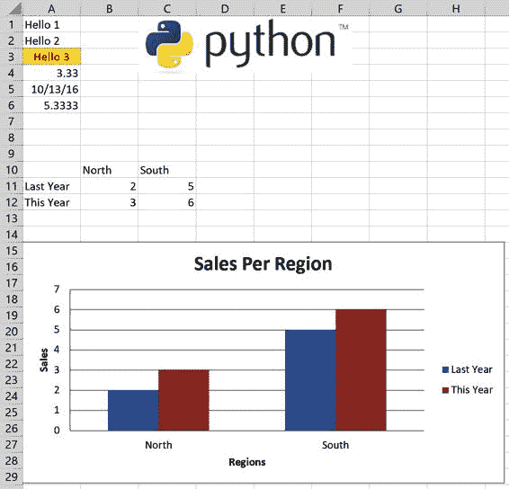

# 第八章：使用读取器和写入器包进行 Excel 文件操作

本章介绍了 OpenPyXL、XlsxWriter、pyxlsb、xlrd 和 xlwt：这些是可以读写 Excel 文件的包，并且在调用 `read_excel` 或 `to_excel` 函数时被 pandas 底层使用。直接使用读取器和写入器包可以让您创建更复杂的 Excel 报告，并且可以微调读取过程。此外，如果您曾经需要在一个只需要读写 Excel 文件而不需要其他 pandas 功能的项目中工作，安装完整的 NumPy/pandas 堆栈可能会有些过火。我们将从学习何时使用哪个包以及它们的语法工作开始本章，然后再讨论一些高级主题，包括如何处理大型 Excel 文件以及如何将 pandas 与读取器和写入器包结合起来以改进 DataFrame 的样式。最后，我们将再次回顾上一章开头的案例研究，并通过格式化表格和添加图表来增强 Excel 报告。与上一章类似，本章不需要安装 Excel，这意味着所有的代码示例都可以在 Windows、macOS 和 Linux 上运行。

读取器和写入器包

读取器和写入器的使用场景可能有些令人不知所措：本节将介绍不少于六个包，因为几乎每种 Excel 文件类型都需要不同的包。每个包使用不同的语法，通常与原始的 Excel 对象模型有很大不同，这并不让人更容易——我将在下一章中更多地讨论 Excel 对象模型。这意味着即使您是经验丰富的 VBA 开发人员，您也可能需要查找很多命令。本节从概述何时需要使用哪个包开始，然后介绍一个辅助模块，使使用这些包变得稍微容易一些。之后，它以食谱的形式呈现每个包，您可以查阅最常用命令的工作方式。

何时使用哪个包

本节介绍了以下六个用于读取、写入和编辑 Excel 文件的包：

+   > > > > [OpenPyXL](https://oreil.ly/3jHQM)
+   > > > > 
+   > > > > [XlsxWriter](https://oreil.ly/7jI3T)
+   > > > > 
+   > > > > [pyxlsb](https://oreil.ly/sEHXS)
+   > > > > 
+   > > > > [xlrd](https://oreil.ly/tSam7)
+   > > > > 
+   > > > > [xlwt](https://oreil.ly/wPSLe)
+   > > > > 
+   > > > > [xlutils](https://oreil.ly/MTFOL)

要了解哪个包可以做什么，请查看表 8-1。例如，要读取 xlsx 文件格式，您将需要使用 OpenPyXL 包：

表 8-1\. 何时使用哪个包

|  Excel 文件格式  |  读取  |  写入  |  编辑  |
| --- | --- | --- | --- |
|   `xlsx` |  OpenPyXL  |  OpenPyXL, XlsxWriter  |  OpenPyXL  |
|   `xlsm` |  OpenPyXL  |  OpenPyXL, XlsxWriter  |  OpenPyXL  |
|   `xltx`, `xltm` |  OpenPyXL  |  OpenPyXL  |  OpenPyXL  |
|   `xlsb` |  pyxlsb  |  -  |  -  |
|   `xls`, `xlt` |  xlrd  |  xlwt  |  xlutils  |

如果你想写入 xlsx 或 xlsm 文件，你需要在 OpenPyXL 和 XlsxWriter 之间做出选择。这两个包都涵盖了类似的功能，但每个包可能有一些其他包没有的独特功能。由于这两个库都在积极开发中，这种情况随着时间的推移而变化。以下是它们的区别的高级概述：

+   > > > > OpenPyXL 可以读取、写入和编辑，而 XlsxWriter 只能写入。
+   > > > > 
+   > > > > OpenPyXL 更容易生成带有 VBA 宏的 Excel 文件。
+   > > > > 
+   > > > > XlsxWriter 的文档更好。
+   > > > > 
+   > > > > XlsxWriter 的速度比 OpenPyXL 快，但根据你写入的工作簿的大小，差异可能不显著。
+   > > > > 
> XLWINGS 在哪里？
> 
> 如果你想知道表 表 8-1 中的 xlwings 在哪里，答案是无处不在或无处不在，这取决于你的用例：与本章中的任何包不同，xlwings 依赖于 Excel 应用程序，这通常是不可用的，例如，如果你需要在 Linux 上运行你的脚本。另一方面，如果你愿意在 Windows 或 macOS 上运行你的脚本，那么你就可以访问安装的 Excel，xlwings 确实可以作为本章中所有包的替代品使用。由于 Excel 依赖性是 xlwings 与所有其他 Excel 包之间的基本差异，我会在下一章中介绍 xlwings，这一章开始了本书的 第四部分。

pandas 使用它能找到的 writer 包，如果你同时安装了 OpenPyXL 和 XlsxWriter，XlsxWriter 就是默认的。如果你想选择 pandas 应该使用哪个包，请在 `read_excel` 或 `to_excel` 函数的 `engine` 参数中指定，或者在 `ExcelFile` 和 `ExcelWriter` 类中分别指定。引擎是包名的小写形式，因此要使用 OpenPyXL 而不是 XlsxWriter 写文件，运行以下命令：

> `df``.``to_excel``(``"filename.xlsx"``,``engine``=``"openpyxl"``)`

一旦你知道你需要哪个包，就会有第二个挑战在等着你：大多数这些包需要你写相当多的代码来读取或写入一系列单元格，而且每个包都使用不同的语法。为了让你的生活更轻松，我创建了一个辅助模块，我将在下面介绍。

excel.py 模块

我创建了 `excel.py` 模块，以便在使用读取器和写入器包时让你的生活更轻松，因为它解决了以下问题：

包交换

> > 不得不切换读取器或写入器包是一个相对常见的情况。例如，Excel 文件往往会随着时间的推移而增大，许多用户通过将文件格式从 xlsx 切换到 xlsb 来对抗这一点，因为这可以大幅减小文件大小。在这种情况下，你将不得不从 OpenPyXL 切换到 pyxlsb。这会迫使你重写 OpenPyXL 代码以反映 pyxlsb 的语法。

数据类型转换

> > 这与前面的观点有关：在切换包时，不仅需要调整代码的语法，还需要注意这些包针对相同单元格内容返回的不同数据类型。例如，OpenPyXL 对空单元格返回 `None`，而 xlrd 返回空字符串。

单元格循环

> > 读取器和写入器包是低级别包：这意味着它们缺乏能让你轻松处理常见任务的便利函数。例如，大多数包要求你循环遍历每个要读取或写入的单元格。

你可以在配套的仓库中找到 `excel.py` 模块，并且我们将在即将展示的章节中使用它。作为预览，这里是读取和写入值的语法：

> `import``excel``values``=``excel``.``read``(``sheet_object``,``first_cell``=``"A1"``,``last_cell``=``None``)``excel``.``write``(``sheet_object``,``values``,``first_cell``=``"A1"``)`

`read` 函数接受来自以下包之一的 `sheet` 对象：xlrd、OpenPyXL 或 pyxlsb。它还接受可选参数 `first_cell` 和 `last_cell`。它们可以以 `A1` 表示法或带有 Excel 基于一的索引的行列元组 `(1, 1)` 提供。`first_cell` 的默认值是 `A1`，而 `last_cell` 的默认值是已使用范围的右下角。因此，如果只提供 `sheet` 对象，它将读取整个工作表。`write` 函数工作方式类似：它期望来自 xlwt、OpenPyXL 或 XlsxWriter 的 `sheet` 对象以及作为嵌套列表的值，以及一个可选的 `first_cell`，它标记了嵌套列表将写入的左上角位置。`excel.py` 模块还展示了如 表 8-2 所示的数据类型转换的协调工作。

表 8-2\. 数据类型转换

|  Excel 表示  |  Python 数据类型  |
| --- | --- |
|  空单元格  |   `None` |
|  带有日期格式的单元格  |   `datetime.datetime`（除了 pyxlsb） |
|  布尔值单元格  |   `bool` |
|  带有错误的单元格  |   `str`（错误消息） |
|  字符串  |   `str` |
|  浮点数  |   `float` 或 `int` |

现在我们装备好使用 `excel.py` 模块，准备深入探讨以下几个包：OpenPyXL、XlsxWriter、pyxlsb 和 xlrd/xlwt/xlutils。这些部分都采用了食谱式的样式，让你可以快速入门每个包。建议你根据 表 8-1 选择你需要的包，然后直接跳转到相应的章节，而不是顺序阅读。

> WITH 语句
> 
> 本章中我们会在多个场合使用 `with` 语句。如果需要温习，请参阅第七章侧边栏 “上下文管理器和 with 语句”。

OpenPyXL

OpenPyXL 是本节唯一一个既能读取又能写入 Excel 文件的包。你甚至可以用它来编辑 Excel 文件——尽管只能是简单的文件。让我们先来看看如何进行读取操作！

使用 OpenPyXL 进行读取

下面的示例代码展示了在使用 OpenPyXL 读取 Excel 文件时执行常见任务的方法。要获取单元格的值，需要使用 `data_only=True` 打开工作簿。默认为 `False`，这会返回单元格的公式而不是值：

> `In``[``1``]:``import``pandas``as``pd``import``openpyxl``import``excel``import``datetime``as``dt`
> 
> `In``[``2``]:``# 打开工作簿以读取单元格值。``# 加载数据后文件会自动关闭。``book``=``openpyxl``.``load_workbook``(``"xl/stores.xlsx"``,``data_only``=``True``)`
> 
> `In``[``3``]:``# 根据名称或索引（从 0 开始）获取工作表对象``sheet``=``book``[``"2019"``]``sheet``=``book``.``worksheets``[``0``]`
> 
> `In``[``4``]:``# 获取包含所有工作表名称的列表``book``.``sheetnames`
> 
> `Out[4]: ['2019', '2020', '2019-2020']`
> 
> `In``[``5``]:``# 遍历工作表对象。``# openpyxl 使用 "title" 而不是 "name"。``for``i``in``book``.``worksheets``:``print``(``i``.``title``)`
> 
> `2019 2020 2019-2020`
> 
> `In``[``6``]:``# 获取工作表的维度，即工作表的使用范围``sheet``.``max_row``,``sheet``.``max_column`
> 
> `Out[6]: (8, 6)`
> 
> `In``[``7``]:``# 读取单个单元格的值``# 使用 "A1" 表示法和单元格索引（基于 1 的索引）``sheet``[``"B6"``]``.``value``sheet``.``cell``(``row``=``6``,``column``=``2``)``.``value`
> 
> `Out[7]: 'Boston'`
> 
> `In``[``8``]:``# 使用我们的 excel 模块读取单元格值的范围``data``=``excel``.``read``(``book``[``"2019"``],``(``2``,``2``),``(``8``,``6``))``data``[:``2``]``# 打印前两行的数据`
> 
> `Out[8]: [['Store', 'Employees', 'Manager', 'Since', 'Flagship'],          ['New York', 10, 'Sarah', datetime.datetime(2018, 7, 20, 0, 0), False]]`

使用 OpenPyXL 进行写入

OpenPyXL 在内存中构建 Excel 文件，并在调用 `save` 方法时写出文件。以下代码生成了 图 8-1 中显示的文件：

> `In``[``9``]:``import``openpyxl``from``openpyxl.drawing.image``import``Image``from``openpyxl.chart``import``BarChart``,``Reference``from``openpyxl.styles``import``Font``,``colors``from``openpyxl.styles.borders``import``Border``,``Side``from``openpyxl.styles.alignment``import``Alignment``from``openpyxl.styles.fills``import``PatternFill``import``excel`
> 
> `In``[``10``]:``# 实例化一个工作簿``book``=``openpyxl``.``Workbook``()``# 获取第一个工作表并命名``sheet``=``book``.``active``sheet``.``title``=``"Sheet1"``# 使用 A1 表示法和单元格索引（从 1 开始）写入单个单元格``sheet``[``"A1"``]``.``value``=``"Hello 1"``sheet``.``cell``(``row``=``2``,``column``=``1``,``value``=``"Hello 2"``)``# 格式化：填充颜色，对齐，边框和字体``font_format``=``Font``(``color``=``"FF0000"``,``bold``=``True``)``thin``=``Side``(``border_style``=``"thin"``,``color``=``"FF0000"``)``sheet``[``"A3"``]``.``value``=``"Hello 3"``sheet``[``"A3"``]``.``font``=``font_format``sheet``[``"A3"``]``.``border``=``Border``(``top``=``thin``,``left``=``thin``,``right``=``thin``,``bottom``=``thin``)``sheet``[``"A3"``]``.``alignment``=``Alignment``(``horizontal``=``"center"``)``sheet``[``"A3"``]``.``fill``=``PatternFill``(``fgColor``=``"FFFF00"``,``fill_type``=``"solid"``)``# 数字格式化（使用 Excel 的格式字符串）``sheet``[``"A4"``]``.``value``=``3.3333``sheet``[``"A4"``]``.``number_format``=``"0.00"``# 日期格式化（使用 Excel 的格式字符串）``sheet``[``"A5"``]``.``value``=``dt``.``date``(``2016``,``10``,``13``)``sheet``[``"A5"``]``.``number_format``=``"mm/dd/yy"``# 公式：必须使用公式的英文名称``# 并使用逗号作为分隔符``sheet``[``"A6"``]``.``value``=``"=SUM(A4, 2)"``# 图像``sheet``.``add_image``(``Image``(``"images/python.png"``),``"C1"``)``# 二维列表（我们正在使用我们的 excel 模块）``data``=``[[``None``,``"North"``,``"South"``],``[``"Last Year"``,``2``,``5``],``[``"This Year"``,``3``,``6``]]``excel``.``write``(``sheet``,``data``,``"A10"``)``# 图表``chart``=``BarChart``()``chart``.``type``=``"col"``chart``.``title``=``"按地区销售"``chart``.``x_axis``.``title``=``"地区"``chart``.``y_axis``.``title``=``"销售额"``chart_data``=``Reference``(``sheet``,``min_row``=``11``,``min_col``=``1``,``max_row``=``12``,``max_col``=``3``)``chart_categories``=``Reference``(``sheet``,``min_row``=``10``,``min_col``=``2``,``max_row``=``10``,``max_col``=``3``)``# from_rows 解释了数据，与在 Excel 中手动添加图表的方式相同``chart``.``add_data``(``chart_data``,``titles_from_data``=``True``,``from_rows``=``True``)``chart``.``set_categories``(``chart_categories``)``sheet``.``add_chart``(``chart``,``"A15"``)``# 保存工作簿将文件保存到磁盘``book``.``save``(``"openpyxl.xlsx"``)

如果你想要编写一个 Excel 模板文件，在保存之前，你需要将`template`属性设置为`True`：

> `In``[``11``]:``book``=``openpyxl``.``Workbook``()``sheet``=``book``.``active``sheet``[``"A1"``]``.``value``=``"这是一个模板"``book``.``template``=``True``book``.``save``(``"template.xltx"``)`

正如您在代码中所见，OpenPyXL 通过提供类似`FF0000`的字符串来设置颜色。该值由三个十六进制值（`FF`、`00`和`00`）组成，分别对应所需颜色的红/绿/蓝值。十六进制表示十六进制数，使用十六进制基数而不是我们标准十进制系统使用的十进制基数。

> 查找颜色的十六进制值
> 
> 要在 Excel 中找到所需颜色的十六进制值，请单击用于更改单元格填充颜色的油漆下拉菜单，然后选择更多颜色。现在选择您的颜色，并从菜单中读取其十六进制值。



图 8-1\. 由 OpenPyXL 编写的文件（openpyxl.xlsx）

使用 OpenPyXL 进行编辑

没有读取/写入包可以真正编辑 Excel 文件：实际上，OpenPyXL 读取文件时理解其中的一切，然后再次从头开始编写文件——包括您在其中进行的任何更改。这对于主要包含格式化单元格及数据和公式的简单 Excel 文件非常有用，但对于包含图表和其他更高级内容的电子表格而言，其功能有限，因为 OpenPyXL 要么会更改它们，要么完全删除它们。例如，截至 v3.0.5，OpenPyXL 会重命名图表并删除它们的标题。这里是一个简单的编辑示例：

> `In``[``12``]:``# 读取 stores.xlsx 文件，更改单元格# 并将其存储在新位置/名称下。``book``=``openpyxl``.``load_workbook``(``"xl/stores.xlsx"``)``book``[``"2019"``][``"A1"``]``.``value``=``"modified"``book``.``save``(``"stores_edited.xlsx"``)`

如果您想要编写一个 xlsm 文件，OpenPyXL 必须基于一个现有文件进行操作，您需要使用`keep_vba`参数设置为`True`加载该文件：

> `In``[``13``]:``book``=``openpyxl``.``load_workbook``(``"xl/macro.xlsm"``,``keep_vba``=``True``)``book``[``"Sheet1"``][``"A1"``]``.``value``=``"Click the button!"``book``.``save``(``"macro_openpyxl.xlsm"``)`

示例文件中的按钮调用了一个显示消息框的宏。 OpenPyXL 涵盖的功能远比我在本节中能够覆盖的要多；因此，建议查看[官方文档](https://oreil.ly/7qfYL)。在本章末尾，当我们再次接手上一章的案例研究时，我们还将看到更多功能。

XlsxWriter

正如其名称所示，XlsxWriter 只能编写 Excel 文件。以下代码生成了与我们先前用 OpenPyXL 生成的相同工作簿，如图 8-1 所示。请注意，XlsxWriter 使用从零开始的单元格索引，而 OpenPyXL 使用从一开始的单元格索引——如果您在这两种包之间切换，请务必注意这一点：

> `In``[``14``]:``import``datetime``as``dt``import``xlsxwriter``import``excel`
> 
> `In``[``15``]:``# 实例化一个工作簿``book``=``xlsxwriter``.``Workbook``(``"xlxswriter.xlsx"``)``# 添加一个工作表并命名``sheet``=``book``.``add_worksheet``(``"Sheet1"``)``# 使用 A1 表示法和单元格索引（从 0 开始）写入单个单元格``sheet``.``write``(``"A1"``,``"Hello 1"``)``sheet``.``write``(``1``,``0``,``"Hello 2"``)``# 格式化：填充颜色、对齐、边框和字体``formatting``=``book``.``add_format``({``"font_color"``:``"#FF0000"``,``"bg_color"``:``"#FFFF00"``,``"bold"``:``True``,``"align"``:``"center"``,``"border"``:``1``,``"border_color"``:``"#FF0000"``})``sheet``.``write``(``"A3"``,``"Hello 3"``,``formatting``)``# 数字格式化（使用 Excel 的格式化字符串）``number_format``=``book``.``add_format``({``"num_format"``:``"0.00"``})``sheet``.``write``(``"A4"``,``3.3333``,``number_format``)``# 日期格式化（使用 Excel 的格式化字符串）``date_format``=``book``.``add_format``({``"num_format"``:``"mm/dd/yy"``})``sheet``.``write``(``"A5"``,``dt``.``date``(``2016``,``10``,``13``),``date_format``)``# 公式：您必须使用公式的英文名称，并以逗号作为分隔符``sheet``.``write``(``"A6"``,``"=SUM(A4, 2)"``)``# 图像``sheet``.``insert_image``(``0``,``2``,``"images/python.png"``)``# 二维列表（我们使用我们的 excel 模块）``data``=``[[``None``,``"North"``,``"South"``],``[``"Last Year"``,``2``,``5``],``[``"This Year"``,``3``,``6``]]``excel``.``write``(``sheet``,``data``,``"A10"``)``# 图表：请参阅伴随存储库中的 "sales_report_xlsxwriter.py" 文件，了解如何使用索引而不是单元格地址``chart``=``book``.``add_chart``({``"type"``:``"column"``})``chart``.``set_title``({``"name"``:``"Sales per Region"``})``chart``.``add_series``({``"name"``:``"=Sheet1!A11"``,``"categories"``:``"=Sheet1!B10:C10"``,``"values"``:``"=Sheet1!B11:C11"``})``chart``.``add_series``({``"name"``:``"=Sheet1!A12"``,``"categories"``:``"=Sheet1!B10:C10"``,``"values"``:``"=Sheet1!B12:C12"``})``chart``.``set_x_axis``({``"name"``:``"Regions"``})``chart``.``set_y_axis``({``"name"``:``"Sales"``})``sheet``.``insert_chart``(``"A15"``,``chart``)``# 关闭工作簿会在磁盘上创建文件``book``.``close``()`

与 OpenPyXL 相比，XlsxWriter 在编写 xlsm 文件时需要采取更复杂的方法，因为它是一个纯写入包。首先，您需要在 Anaconda Prompt 中从现有的 Excel 文件中提取宏代码（示例使用的是 macro.xlsm 文件，在伴随存储库的 xl 文件夹中）：

Windows

> > 首先进入 xl 目录，然后找到 vba_extract.py 的路径，这是一个附带 XlsxWriter 的脚本：
> > 
> > `(base)>` `cd C:\Users\``username``\python-for-excel\xl` `(base)>` `where vba_extract.py` `C:\Users\``username``\Anaconda3\Scripts\vba_extract.py`
> > 
> > 然后在以下命令中使用此路径：
> > 
> > `(base)>` `python C:\...\Anaconda3\Scripts\vba_extract.py macro.xlsm`

macOS

> > 在 macOS 上，该命令可作为可执行脚本使用，并可以像这样运行：
> > 
> > `(base)>` `cd /Users/``username``/python-for-excel/xl` `(base)>` `vba_extract.py macro.xlsm`

这将在运行命令的目录中保存文件 vbaProject.bin。我还在伴随的存储库的 xl 文件夹中包含了提取的文件。我们将在下面的示例中使用它来编写一个带有宏按钮的工作簿：

> `In``[``16``]:``book``=``xlsxwriter``.``Workbook``(``"macro_xlxswriter.xlsm"``)``sheet``=``book``.``add_worksheet``(``"Sheet1"``)``sheet``.``write``(``"A1"``,``"点击按钮！"``)``book``.``add_vba_project``(``"xl/vbaProject.bin"``)``sheet``.``insert_button``(``"A3"``,``{``"macro"``:``"Hello"``,``"caption"``:``"Button 1"``,``"width"``:``130``,``"height"``:``35``})``book``.``close``()`  

pyxlsb

与其他读取库相比，pyxlsb 提供的功能较少，但它是读取二进制 xlsb 格式 Excel 文件的唯一选择。pyxlsb 不是 Anaconda 的一部分，因此如果尚未安装，您需要安装它。目前，它也不支持通过 Conda 安装，因此请使用 pip 安装：

> `(base)>` `pip install pyxlsb`

您可以按以下方式读取工作表和单元格值：

> `In``[``17``]:``import``pyxlsb``import``excel`
> 
> `In``[``18``]:``# 循环遍历工作表。使用 pyxlsb，工作簿和工作表对象可以用作上下文管理器。book.sheets 返回的是工作表名称列表，而不是对象！要获取工作表对象，请使用 get_sheet()。``with``pyxlsb``.``open_workbook``(``"xl/stores.xlsb"``)``as``book``:``for``sheet_name``in``book``.``sheets``:``with``book``.``get_sheet``(``sheet_name``)``as``sheet``:``dim``=``sheet``.``dimension````print``(``f``"工作表 '{sheet_name}' 有 "``f``"{dim.h} 行 {dim.w} 列"``)`
> 
> `工作表 '2019' 有 7 行 5 列 工作表 '2020' 有 7 行 5 列 工作表 '2019-2020' 有 20 行 5 列`
> 
> `In``[``19``]:``# 通过我们的 excel 模块读取一段单元格范围的值。与其使用"2019"，您也可以使用它的索引（从 1 开始）。``with``pyxlsb``.``open_workbook``(``"xl/stores.xlsb"``)``as``book``:``with``book``.``get_sheet``(``"2019"``)``as``sheet``:``data``=``excel``.``read``(``sheet``,``"B2"``)``data``[:``2``]``# 打印前两行`
> 
> `Out[19]: [['Store', 'Employees', 'Manager', 'Since', 'Flagship'],           ['纽约', 10.0, '莎拉', 43301.0, False]]`

pyxlsb 目前没有识别日期单元格的方法，因此您必须手动将日期格式的单元格值转换为`datetime`对象，如下所示：

> `In``[``20``]:``from``pyxlsb``import``convert_date``convert_date``(``data``[``1``][``3``])`
> 
> `Out[20]: datetime.datetime(2018, 7, 20, 0, 0)`

请记住，如果您使用的是低于 1.3 版本的 pandas，需要显式指定引擎来读取 xlsb 文件格式：

> `In``[``21``]:``df``=``pd``.``read_excel``(``"xl/stores.xlsb"``,``engine``=``"pyxlsb"``)`

xlrd、xlwt 和 xlutils

xlrd、xlwt 和 xlutils 的组合为旧版 xls 格式提供了与 OpenPyXL 对 xlsx 格式提供的大致相同的功能：xlrd 读取、xlwt 写入、xlutils 编辑 xls 文件。这些包已经不再积极开发，但只要仍然有 xls 文件存在，它们可能还会有用。xlutils 不是 Anaconda 的一部分，所以如果还没有安装它，请安装：

> `(base)>` `conda install xlutils`

让我们开始阅读部分！

使用 xlrd 进行读取

下面的示例代码向您展示如何使用 xlrd 从 Excel 工作簿中读取数值：

> `In``[``22``]:``import``xlrd``import``xlwt``from``xlwt.Utils``import``cell_to_rowcol2``import``xlutils``import``excel`
> 
> `In``[``23``]:``# 打开工作簿以读取单元格数值。在加载数据后文件会自动关闭。``book``=``xlrd``.``open_workbook``(``"xl/stores.xls"``)`
> 
> `In``[``24``]:``# 获取所有工作表的名称列表``book``.``sheet_names``()`
> 
> `Out[24]: ['2019', '2020', '2019-2020']`
> 
> `In``[``25``]:``# 遍历工作表对象``for``sheet``in``book``.``sheets``():``print``(``sheet``.``name``)`
> 
> `2019 2020 2019-2020`
> 
> `In``[``26``]:``# 按名称或索引（从 0 开始）获取工作表对象``sheet``=``book``.``sheet_by_index``(``0``)``sheet``=``book``.``sheet_by_name``(``"2019"``)`
> 
> `In``[``27``]:``# 维度``sheet``.``nrows``,``sheet``.``ncols`
> 
> `Out[27]: (8, 6)`
> 
> `In``[``28``]:``# 使用 "A1" 表示法或使用单元格索引（从 0 开始）读取单元格的值。``# "*" 将 cell_to_rowcol2 返回的元组展开为单独的参数。``sheet``.``cell``(``*``cell_to_rowcol2``(``"B3"``))``.``value``sheet``.``cell``(``2``,``1``)``.``value`
> 
> `Out[28]: 'New York'`
> 
> `In``[``29``]:``# 使用我们的 excel 模块读取单元格数值的范围``data``=``excel``.``read``(``sheet``,``"B2"``)``data``[:``2``]``# 打印前两行`
> 
> `Out[29]: [['Store', 'Employees', 'Manager', 'Since', 'Flagship'],          ['New York', 10.0, 'Sarah', datetime.datetime(2018, 7, 20, 0, 0),           False]]`
> 
> 使用范围
> 
> 与 OpenPyXL 和 pyxlsb 不同，xlrd 在使用 `sheet.nrows` 和 `sheet.ncols` 时返回带有值的单元格的维度，而不是工作表的使用范围。Excel 返回的使用范围通常包含底部和右侧的空白行和列。例如，当您删除行内容（通过按删除键）而不是删除行本身（通过右键单击并选择删除）时，就会发生这种情况。

使用 xlwt 进行写入

下面的代码复现了我们之前用 OpenPyXL 和 XlsxWriter 完成的工作，如 图 8-1 所示。但是，xlwt 无法生成图表，只支持 `bmp` 格式的图片：

> `In``[``30``]:``import``xlwt``from``xlwt.Utils``import``cell_to_rowcol2``import``datetime``as``dt``import``excel`
> 
> `In``[``31``]:``# 实例化工作簿``book``=``xlwt``.``Workbook``()``# 添加一个工作表并给它命名``sheet``=``book``.``add_sheet``(``"Sheet1"``)``# 使用 A1 表示法和单元格索引（从 0 开始）写入单个单元格``sheet``.``write``(``*``cell_to_rowcol2``(``"A1"``),``"Hello 1"``)``sheet``.``write``(``r``=``1``,``c``=``0``,``label``=``"Hello 2"``)``# 格式化：填充颜色、对齐、边框和字体``formatting``=``xlwt``.``easyxf``(``"font: bold on, color red;"``"align: horiz center;"``"borders: top_color red, bottom_color red,"``"right_color red, left_color red,"``"left thin, right thin,"``"top thin, bottom thin;"``"pattern: pattern solid, fore_color yellow;"``)``sheet``.``write``(``r``=``2``,``c``=``0``,``label``=``"Hello 3"``,``style``=``formatting``)``# 数字格式化（使用 Excel 的格式字符串）``number_format``=``xlwt``.``easyxf``(``num_format_str``=``"0.00"``)``sheet``.``write``(``3``,``0``,``3.3333``,``number_format``)``# 日期格式化（使用 Excel 的格式字符串）``date_format``=``xlwt``.``easyxf``(``num_format_str``=``"mm/dd/yyyy"``)``sheet``.``write``(``4``,``0``,``dt``.``datetime``(``2012``,``2``,``3``),``date_format``)``# 公式：您必须使用逗号作为分隔符的公式的英文名称``sheet``.``write``(``5``,``0``,``xlwt``.``Formula``(``"SUM(A4, 2)"``))``# 二维列表（我们使用我们的 excel 模块）``data``=``[[``None``,``"North"``,``"South"``],``[``"Last Year"``,``2``,``5``],``[``"This Year"``,``3``,``6``]]``excel``.``write``(``sheet``,``data``,``"A10"``)``# 图片（仅允许添加 bmp 格式）``sheet``.``insert_bitmap``(``"images/python.bmp"``,``0``,``2"``)``# 将文件写入磁盘``book``.``save``(``"xlwt.xls"``)`

使用 xlutils 进行编辑

xlutils 充当了 xlrd 和 xlwt 之间的桥梁。这明确说明这不是一个真正的编辑操作：通过 xlrd（通过设置 `formatting_info=True`）读取包括格式的电子表格，然后由 xlwt 再次写出，包括在其中进行的更改：

> `In``[``32``]:``import``xlutils.copy`
> 
> `In``[``33``]:``book``=``xlrd``.``open_workbook``(``"xl/stores.xls"``,``formatting_info``=``True``)``book``=``xlutils``.``copy``.``copy``(``book``)``book``.``get_sheet``(``0``)``.``write``(``0``,``0``,``"changed!"``)``book``.``save``(``"stores_edited.xls"``)`

现在，您知道如何以特定格式读取和编写 Excel 工作簿了。下一节将介绍一些高级主题，包括处理大型 Excel 文件以及将 pandas 和读取器和写入器包一起使用。

高级读取器和写入器主题

如果你的文件比我们迄今为止在示例中使用的简单 Excel 文件更大更复杂，仅依赖默认选项可能不再足够。因此，我们从讨论如何处理更大的文件开始这一部分。然后，我们将学习如何将 pandas 与 reader 和 writer 包一起使用：这将使你能够以想要的方式设计 pandas 数据帧的样式。最后，我们将运用本章学到的所有知识，使上一章案例研究中的 Excel 报告看起来更加专业。

处理大型 Excel 文件

处理大文件可能会导致两个问题：读写过程可能会很慢，或者您的计算机可能会因内存不足而崩溃。通常，内存问题更加令人担忧，因为它会导致程序崩溃。文件何时被认为是大文件始终取决于系统上的可用资源以及您对慢的定义。本节展示了各个包提供的优化技术，使你能够处理极限的 Excel 文件。我将首先讨论写入库的选项，然后是读取库的选项。在本节末尾，我将向你展示如何并行读取工作簿的工作表以减少处理时间。

使用 OpenPyXL 进行写入

当使用 OpenPyXL 写入大文件时，请确保已安装 lxml 包，因为这会加快写入过程。它已包含在 Anaconda 中，因此你无需做任何操作。然而，关键的选项是`write_only=True`标志，它确保内存消耗保持较低水平。但是，它强制你通过使用`append`方法逐行写入，并且不再允许你单元格单独写入：

> `In``[``34``]:``book``=``openpyxl``.``Workbook``(``write_only``=``True``)``# 使用 write_only=True，book.active 不起作用``sheet``=``book``.``create_sheet``()``# 这将生成一个包含 1000 x 200 个单元格的工作表``for``row``in``range``(``1000``):``sheet``.``append``(``list``(``range``(``200``)))``book``.``save``(``"openpyxl_optimized.xlsx"``)`

使用 XlsxWriter 写入

XlsxWriter 有一个类似于 OpenPyXL 的选项叫做`constant_memory`。它也强制你按顺序写入行。你可以通过提供一个像这样的`options`字典来启用该选项：

> `In``[``35``]:``book``=``xlsxwriter``.``Workbook``(``"xlsxwriter_optimized.xlsx"``,``options``=``{``"constant_memory"``:``True``})``sheet``=``book``.``add_worksheet``()``# 这将生成一个包含 1000 x 200 个单元格的工作表``for``row``in``range``(``1000``):``sheet``.``write_row``(``row``,``0``,``list``(``range``(``200``)))``book``.``close``()`

使用 xlrd 读取

当读取旧版 xls 格式的大文件时，xlrd 允许你按需加载工作表，就像这样：

> `In``[``36``]:``with``xlrd``.``open_workbook``(``"xl/stores.xls"``,``on_demand``=``True``)``as``book``:``sheet``=``book``.``sheet_by_index``(``0``)``# 只加载第一个工作表`

如果你不像我们这样使用工作簿作为上下文管理器，你将需要手动调用 `book.release_resources()` 来正确地再次关闭工作簿。要以这种模式使用 xlrd 和 pandas，像这样使用：

> `In``[``37``]:``with``xlrd``.``open_workbook``(``"xl/stores.xls"``,``on_demand``=``True``)``as``book``:``with``pd``.``ExcelFile``(``book``,``engine``=``"xlrd"``)``as``f``:``df``=``pd``.``read_excel``(``f``,``sheet_name``=``0``)`

使用 OpenPyXL 读取

使用 OpenPyXL 读取大型 Excel 文件时，为了控制内存使用，你应该以 `read_only=True` 加载工作簿。由于 OpenPyXL 不支持 `with` 语句，所以在完成后你需要确保关闭文件。如果你的文件包含对外部工作簿的链接，你可能还想使用 `keep_links=False` 来加快速度。`keep_links` 确保保留对外部工作簿的引用，这可能会在你只想读取工作簿的值时不必要地减慢过程：

> `In``[``38``]:``book``=``openpyxl``.``load_workbook``(``"xl/big.xlsx"``,``data_only``=``True``,``read_only``=``True``,``keep_links``=``False``)``# 在此执行所需的读取操作``book``.``close``()``# 使用 read_only=True 时需要关闭`

并行读取工作表

当你使用 pandas 的 `read_excel` 函数读取大型工作簿的多个工作表时，你会发现这需要很长时间（我们稍后会举一个具体的例子）。原因在于 pandas 会顺序地读取工作表，即一个接一个地。为了加快速度，你可以并行读取工作表。虽然由于文件内部结构的原因，写入工作簿的并行化没有简单的方法，但读取多个工作表并行却很简单。然而，由于并行化是一个高级话题，我没有在 Python 介绍中涉及，并且在这里也不会详细讨论。

在 Python 中，如果你想利用每台现代计算机都具备的多个 CPU 核心，你可以使用标准库中的`multiprocessing`包。这将会生成多个 Python 解释器（通常每个 CPU 核心一个），并行处理任务。与逐个处理表格不同，你可以让一个 Python 解释器处理第一个表格，同时第二个 Python 解释器处理第二个表格，以此类推。然而，每个额外的 Python 解释器启动需要一些时间，并且使用额外的内存，所以如果你有小文件，当你并行化读取过程时，它们可能比串行化处理更慢。但对于包含多个大表格的大文件，`multiprocessing`可以显著加快处理速度——前提是你的系统具备足够的内存来处理工作负载。如果像第二章展示的那样在 Binder 上运行 Jupyter 笔记本，你可能没有足够的内存，因此并行化版本的运行速度会较慢。在伴随的存储库中，你会找到`parallel_pandas.py`，它是使用 OpenPyXL 作为引擎的简单实现，用于并行读取表格。使用起来非常简单，因此你不需要了解`multiprocessing`的任何内容。

> `import``parallel_pandas``parallel_pandas``.``read_excel``(``filename``,``sheet_name``=``None``)`

默认情况下，它会读取所有表格，但你可以提供一个要处理的表格名称列表。像 pandas 一样，该函数返回一个字典，形式如`{"表格名称": df}`，即键是表格名称，值是 DataFrame。

> **%%TIME 魔术命令**
> 
> 在接下来的示例中，我将使用`%%time`单元格魔术命令。我在第五章中与 Matplotlib 一起介绍了魔术命令。`%%time`是一个非常有用的单元格魔术命令，可以用于简单的性能调优，因为它可以轻松比较包含不同代码片段的两个单元格的执行时间。墙时间是从程序（即单元格）开始到结束的经过时间。如果你在 macOS 或 Linux 上，你不仅会得到墙时间，还会得到类似以下这样的 CPU 时间额外行：
> 
> `CPU times: user 49.4 s, sys: 108 ms, total: 49.5 s`
> 
> CPU 时间测量 CPU 上花费的时间，这可能低于墙时间（如果程序必须等待 CPU 可用）或高于墙时间（如果程序在多个 CPU 核心上并行运行）。为了更准确地测量时间，请使用`%%timeit`代替`%%time`，它会多次运行单元格并取所有运行的平均值。`%%time`和`%%timeit`是单元格魔术命令，即它们需要在单元格的第一行，并测量整个单元格的执行时间。如果你想测量单独一行代码的时间，可以使用`%time`或`%timeit`。

让我们看看并行化版本在读取 companion repo 的 xl 文件夹中的 big.xlsx 文件时快多少：

> `In``[``39``]:``%%``time``data``=``pd``.``read_excel``(``"xl/big.xlsx"``,``sheet_name``=``None``,``engine``=``"openpyxl"``)`
> 
> `Wall time: 49.5 s`
> 
> `In``[``40``]:``%%``time``import``parallel_pandas``data``=``parallel_pandas``.``read_excel``(``"xl/big.xlsx"``,``sheet_name``=``None``)`
> 
> `Wall time: 12.1 s`

要获取代表 Sheet1 的 DataFrame，你可以在两种情况下写 `data["Sheet1"]`。通过比较两个样本的墙上时间，你会发现，并行化版本在我的笔记本上，对于这个特定的工作簿和 6 个 CPU 内核，比 `pd.read_excel` 快了数倍。如果你想要更快的速度，直接并行化 OpenPyXL：在 companion repository（parallel_openpyxl.py）中也有一个实现，还有一个用于以并行方式读取传统 xls 格式的 xlrd 实现（parallel_xlrd.py）。通过直接使用底层包而不是 pandas，你可以跳过转换成 DataFrame 或者只应用你需要的清理步骤，这很可能会帮助你加快速度，如果这是你最关心的问题的话。

> 使用 MODIN 并行读取表格
> 
> 如果你只读取一个巨大的表格，那么看看 [Modin](https://oreil.ly/wQszH) 值得一试，这是一个可以替代 pandas 的项目。它并行化了单表的读取过程，并提供了令人印象深刻的速度改进。由于 Modin 需要特定版本的 pandas，在安装时可能会降级 Anaconda 自带的版本。如果你想测试它，我建议你为此创建一个单独的 Conda 环境，以确保不会影响到基础环境。有关如何创建 Conda 环境的更详细说明，请参阅 附录 A：
> 
> `(base)>` `conda create --name modin python=3.8 -y` `(base)>` `conda activate modin` `(modin)>` `conda install -c conda-forge modin -y`
> 
> 在我的机器上，使用 big.xlsx 文件运行以下代码大约需要五秒钟，而 pandas 则需要大约十二秒钟：
> 
> `import``modin.pandas``data``=``modin``.``pandas``.``read_excel``(``"xl/big.xlsx"``,``sheet_name``=``0``,``engine``=``"openpyxl"``)`

现在你知道如何处理大文件了，让我们继续看看如何将 pandas 和低级包一起使用，以改进写入 DataFrame 到 Excel 文件时的默认格式！

格式化 Excel 中的 DataFrame

要按我们想要的方式格式化 Excel 中的 DataFrame，我们可以编写代码，使用 pandas 与 OpenPyXL 或 XlsxWriter 结合使用。我们首先使用这种组合为导出的 DataFrame 添加一个标题。然后在包装这一部分之前，格式化 DataFrame 的标题和索引。将 pandas 与 OpenPyXL 结合用于读取有时也可能很有用，所以让我们从这里开始：

> `In``[``41``]:``with``pd``.``ExcelFile``(``"xl/stores.xlsx"``,``engine``=``"openpyxl"``)``as``xlfile``:``# 读取 DataFrame``df``=``pd``.``read_excel``(``xlfile``,``sheet_name``=``"2020"``)``# 获取 OpenPyXL 的工作簿对象``book``=``xlfile``.``book``# 从这里开始是 OpenPyXL 代码``sheet``=``book``[``"2019"``]``value``=``sheet``[``"B3"``]``.``value``# 读取单个值`

在写入工作簿时，它的功能类似，允许我们轻松地向我们的 DataFrame 报告添加一个标题：

> `In``[``42``]:``with``pd``.``ExcelWriter``(``"pandas_and_openpyxl.xlsx"``,``engine``=``"openpyxl"``)``as``writer``:``df``=``pd``.``DataFrame``({``"col1"``:``[``1``,``2``,``3``,``4``],``"col2"``:``[``5``,``6``,``7``,``8``]})``# 写入 DataFrame``df``.``to_excel``(``writer``,``"Sheet1"``,``startrow``=``4``,``startcol``=``2``)``# 获取 OpenPyXL 的工作簿和表对象``book``=``writer``.``book``sheet``=``writer``.``sheets``[``"Sheet1"``]``# 从这里开始是 OpenPyXL 代码``sheet``[``"A1"``]``.``value``=``"这是一个标题"``# 写入单元格值`

这些示例使用了 OpenPyXL，但概念上与其他包相同。接下来我们继续了解如何格式化 DataFrame 的索引和标头。

格式化 DataFrame 的索引和标头

要完全控制索引和列标题的格式化，最简单的方法是直接编写它们。以下示例分别演示了如何使用 OpenPyXL 和 XlsxWriter 做到这一点。您可以在图 8-2 中查看输出。让我们从创建一个 DataFrame 开始：

> `In``[``43``]:``df``=``pd``.``DataFrame``({``"col1"``:``[``1``,``-``2``],``"col2"``:``[``-``3``,``4``]},``index``=``[``"row1"``,``"row2"``])``df``.``index``.``name``=``"ix"``df`
> 
> `Out[43]:       col1  col2          ix          row1     1    -3          row2    -2     4`

要使用 OpenPyXL 格式化索引和标头，请按以下步骤操作：

> `In``[``44``]:``from``openpyxl.styles``import``PatternFill`
> 
> 使用 Openpyxl 格式化索引/标题的示例 `In[45]`：

如果要使用 XlsxWriter 格式化索引和标题，请稍微调整代码：

> 使用 XlsxWriter 格式化索引/标题的示例 `In[46]`：

现在索引和标题都已格式化好了，让我们看看如何对数据部分进行样式设置！


图 8-2\. 默认格式的 DataFrame（左）和自定义格式（右）

格式化 DataFrame 数据部分

格式化 DataFrame 数据部分的可能性取决于您使用的包：如果使用 pandas 的`to_excel`方法，OpenPyXL 可以对每个单元格应用格式，而 XlsxWriter 只能按行或列的方式应用格式。例如，要设置单元格的数字格式为三位小数并居中显示内容，如图 8-3 中所示，使用 OpenPyXL 可以按以下步骤进行：

> `In``[``47``]:``from``openpyxl.styles``import``Alignment`
> 
> `In``[``48``]:``with``pd``.``ExcelWriter``(``"data_format_openpyxl.xlsx"``,``engine``=``"openpyxl"``)``as``writer``:``# 写出 DataFrame``df``.``to_excel``(``writer``)``# 获取工作簿和工作表对象``book``=``writer``.``book``sheet``=``writer``.``sheets``[``"Sheet1"``]``# 格式化单个单元格``nrows``,``ncols``=``df``.``shape``for``row``in``range``(``nrows``):``for``col``in``range``(``ncols``):``# +1 考虑到标题/索引``# +1 因为 OpenPyXL 基于 1``base````cell``=``sheet``.``cell``(``row``=``row``+``2``,``column``=``col``+``2``)``cell``.``number_format``=``"0.000"``cell``.``alignment``=``Alignment``(``horizontal``=``"center"``)`

对于 XlsxWriter，调整代码如下：

> `In``[``49``]:``with``pd``.``ExcelWriter``(``"data_format_xlsxwriter.xlsx"``,``engine``=``"xlsxwriter"``)``as``writer``:``# 写出 DataFrame``df``.``to_excel``(``writer``)``# 获取工作簿和工作表对象``book``=``writer``.``book``sheet``=``writer``.``sheets``[``"Sheet1"``]``# 格式化列（无法格式化单个单元格）``number_format``=``book``.``add_format``({``"num_format"``:``"0.000"``,``"align"``:``"center"``})``sheet``.``set_column``(``first_col``=``1``,``last_col``=``2``,``cell_format``=``number_format``)`


图 8-3\. 数据部分格式化的 DataFrame

作为替代方案，pandas 为 DataFrame 的`style`属性提供了实验性支持。实验性意味着语法随时可能更改。由于样式用于在 HTML 格式中格式化 DataFrame，因此它们使用 CSS 语法。CSS 代表层叠样式表，用于定义 HTML 元素的样式。要应用与前面示例相同的格式（三位小数和居中对齐），您需要通过`applymap`函数将函数应用于`Styler`对象的每个元素。您可以通过`df.style`属性获得`Styler`对象：

> `In``[``50``]:``df``.``style``.``applymap``(``lambda``x``:``"number-format: 0.000;"``"text-align: center"``)``\` `.``to_excel``(``"styled.xlsx"``)`

这段代码的输出结果与图 8-3 中显示的一样。有关 DataFrame 样式方法的更多详细信息，请直接参阅[样式文档](https://oreil.ly/_JzfP)。

无需依赖样式属性，pandas 提供了对日期和日期时间对象进行格式化的支持，如图 8-4 所示：

> `In``[``51``]:``df``=``pd``.``DataFrame``({``"Date"``:``[``dt``.``date``(``2020``,``1``,``1``)],``"Datetime"``:``[``dt``.``datetime``(``2020``,``1``,``1``,``10``)]})``with``pd``.``ExcelWriter``(``"date.xlsx"``,``date_format``=``"yyyy-mm-dd"``,``datetime_format``=``"yyyy-mm-dd hh:mm:ss"``)``as``writer``:``df``.``to_excel``(``writer``)`


图 8-4。带有格式化日期的数据框

> 其他读取器和写入器包
> 
> 除了本章中我们已经查看过的软件包之外，还有一些其他的软件包可能对特定的用例有所帮助：
> 
> pyexcel
> 
> > [pyexcel](http://pyexcel.org)提供了一种在不同的 Excel 包和其他文件格式（包括 CSV 文件和 OpenOffice 文件）之间统一的语法。
> > 
> PyExcelerate
> 
> > [PyExcelerate](https://oreil.ly/yJax7)的目标是以最快的速度编写 Excel 文件。
> > 
> pylightxl
> 
> > [pylightxl](https://oreil.ly/efjt4)可以读取 xlsx 和 xlsm 文件，并写入 xlsx 文件。
> > 
> styleframe
> 
> > [styleframe](https://oreil.ly/nQUg9)封装了 pandas 和 OpenPyXL，以产生带有精美格式的数据框的 Excel 文件。
> > 
> oletools
> 
> > [oletools](https://oreil.ly/SG-Jy)并不是一个传统的读取器或写入器包，但可以用于分析 Microsoft Office 文档，例如，用于恶意软件分析。它提供了一种方便的方法来从 Excel 工作簿中提取 VBA 代码。

现在你知道如何在 Excel 中格式化数据框了，是时候重新审视上一章的案例研究，看看我们是否能够运用本章的知识来改进 Excel 报告了！

案例研究（再访）：Excel 报告

翻译到了本章的最后，您已经了解足够的知识，可以回到上一章的 Excel 报告，并使其在视觉上更具吸引力。如果您愿意，可以回到附带存储库中的 sales_report_pandas.py，并尝试将其转换为 Figue 8-5 中显示的报告。

红色数字是低于 20,000 的销售数字。本章未涉及所有格式设置的每个方面（比如如何应用条件格式设置），因此您需要使用您选择的软件包的文档。为了比较您的解决方案，我在附带的存储库中包含了生成此报告的两个脚本版本。第一个版本基于 OpenPyXL（sales_report_openpyxl.py），另一个版本基于 XlsxWriter（sales_report_xlsxwriter.py）。并排查看脚本可能还能让您更明智地决定下一次要选择哪个软件包来完成您的写入任务。我们将在下一章再次回到这个案例研究：在那里，我们将依赖于 Microsoft Excel 的安装来处理报告模板。


图 8-5。由 sales_report_openpyxl.py 创建的重新审视的销售报告

结论

在本章中，我向您介绍了 pandas 在底层使用的读取器和写入器包。直接使用它们允许我们读取和写入 Excel 工作簿，而无需安装 pandas。然而，与 pandas 结合使用使我们能够通过添加标题、图表和格式来增强 Excel DataFrame 报告。虽然当前的读取器和写入器包非常强大，但我仍然希望有一天能看到一个像 "NumPy 时刻" 那样将所有开发者的努力统一到一个项目中。能够在不必首先查看表格的情况下知道使用哪个包，并且在不必为每种类型的 Excel 文件使用不同的语法的情况下使用它，这将是很棒的。从这个意义上说，从 pandas 开始，只有在需要 pandas 未涵盖的附加功能时才退而使用读取器和写入器包，这是有道理的。

然而，Excel 不仅仅是一个数据文件或报告：Excel 应用程序是最直观的用户界面之一，用户可以输入几个数字，并让它显示他们正在寻找的信息。自动化 Excel 应用程序而不是读写 Excel 文件，开启了我们将在第四部分探索的全新功能范围。下一章将通过向您展示如何从 Python 远程控制 Excel 来开始这段旅程。

第四部分：使用 xlwings 编程 Excel 应用程序
