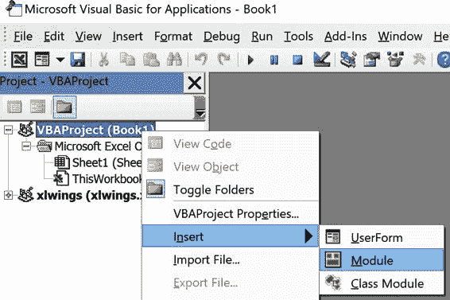

# 第十四章

第十章 Python 驱动的 Excel 工具

在上一章中，我们学习了如何编写 Python 脚本来自动化 Microsoft Excel。虽然这非常强大，但用户必须习惯使用 Anaconda Prompt 或像 VS Code 这样的编辑器来运行脚本。如果您的工具是由业务用户使用，情况可能不会如此。对于他们，您希望隐藏 Python 部分，使 Excel 工具再次感觉像一个普通的启用宏的工作簿。如何通过 xlwings 实现这一点是本章的主题。在查看 xlwings 工具部署的挑战之前，我将首先向您展示从 Excel 运行 Python 代码的最短路径——这也将使我们更详细地了解 xlwings 提供的可用设置。与上一章类似，本章要求您在 Windows 或 macOS 上安装 Microsoft Excel。

使用 Excel 作为前端与 xlwings

前端是应用程序中用户看到并与之交互的部分。其他常见的前端名称包括图形用户界面（GUI）或用户界面（UI）。当我问 xlwings 用户为什么要用 Excel 创建他们的工具，而不是构建现代 Web 应用程序时，我通常听到的答案是：“Excel 是我们的用户熟悉的界面。” 依赖电子表格单元格使用户能够快速直观地提供输入，这使他们通常比使用简陋的 Web 界面更高效。在介绍 xlwings Excel 插件和 xlwings 命令行界面（CLI）之前，我将从`quickstart`命令创建我们的第一个项目。在结束本节之前，我将向您展示两种从 Excel 调用 Python 代码的方法：通过单击插件中的“运行主”按钮和使用 VBA 中的`RunPython`函数。让我们通过安装 xlwings Excel 插件来开始吧！

Excel 插件

由于 xlwings 包含在 Anaconda 发行版中，在上一章中，我们可以直接在 Python 中运行 xlwings 命令。然而，如果您希望从 Excel 调用 Python 脚本，则需要安装 Excel 插件或在独立模式下设置工作簿。虽然我将在 “部署” 中介绍独立模式，但本节向您展示如何使用插件。要安装插件，请在 Anaconda Prompt 上运行以下命令：

> `(base)>` `xlwings addin install`

每当更新 xlwings 时，您需要保持 Python 包的版本和 Excel 插件的版本同步。因此，更新 xlwings 时，您应该始终运行两个命令——一个用于 Python 包，另一个用于 Excel 插件。根据您使用的是 Conda 还是 pip 包管理器，这是更新 xlwings 安装的方式：

Conda（与 Anaconda Python 发行版一起使用）

> > `(base)>` `conda update xlwings` `(base)>` `xlwings addin install`

pip（与任何其他 Python 发行版一起使用）

> > `(base)>` `pip install --upgrade xlwings` `(base)>` `xlwings addin install`
> > 
> 杀毒软件
> 
> 不幸的是，有时候 xlwings 插件会被杀毒软件标记为恶意插件，特别是如果你使用的是全新版本。如果这种情况发生在你的电脑上，请转到杀毒软件的设置，在那里你应该能够将 xlwings 标记为安全运行。通常，你也可以通过软件的主页报告此类误报。

当你在 Anaconda Prompt 上输入`xlwings`时，你正在使用 xlwings CLI。除了使 xlwings 插件的安装变得容易之外，它还提供了一些其他命令：我将在我们需要时介绍它们，但你随时可以在 Anaconda Prompt 上输入`xlwings`并按 Enter 键以打印可用选项。现在让我们更仔细地看看`xlwings addin install`做了什么：

安装

> > 插件的实际安装是通过将 xlwings.xlam 从 Python 包目录复制到 Excel 的 XLSTART 文件夹中完成的，这是一个特殊的文件夹：Excel 将在每次启动 Excel 时打开该文件夹中的所有文件。当你在 Anaconda Prompt 上运行`xlwings addin status`时，它会打印 XLSTART 目录在你系统上的位置以及插件是否已安装。

配置

> > 当你首次安装插件时，它也会配置使用你运行`install`命令的 Python 解释器或 Conda 环境：就像你在图 10-1 中看到的那样，`Conda Path` 和 `Conda Env` 的值会被 xlwings CLI 自动填入。1 这些值会存储在一个名为 xlwings.conf 的文件中，该文件位于你的主目录中的 .xlwings 文件夹中。在 Windows 上，这通常是 C:\Users\<用户名>\.xlwings\xlwings.conf，在 macOS 上是 /Users/<用户名>/.xlwings/xlwings.conf。在 macOS 上，以点开头的文件和文件夹默认是隐藏的。当你在 Finder 中时，按下键盘快捷键 Command-Shift-. 即可切换它们的可见性。

运行安装命令后，你需要重新启动 Excel 才能看到功能区中的 xlwings 选项卡，如图 10-1 所示。

图 10-1\. 运行安装命令后的 xlwings 功能区插件

> macOS 上的功能区插件
> 
> 在 macOS 上，由于缺少关于用户定义函数和 Conda 的部分，功能区看起来有些不同：虽然 macOS 不支持用户定义函数，但 Conda 环境不需要特殊处理，即被配置为 Python 组下的 Interpreter。

现在你已经安装了 xlwings 插件，我们需要一个工作簿和一些 Python 代码来测试它。最快的方法是使用`quickstart`命令，接下来我将向你展示。

快速开始命令

为了尽可能简化创建第一个 xlwings 工具的过程，xlwings CLI 提供了`quickstart`命令。在 Anaconda Prompt 中，使用`cd`命令切换到要创建第一个项目的目录（例如，`cd Desktop`），然后运行以下命令以创建名为`first_project`的项目：

> `(base)>` `xlwings quickstart first_project`

项目名称必须是有效的 Python 模块名称：可以包含字符、数字和下划线，但不能包含空格或破折号，并且不能以数字开头。我将在“RunPython Function”中向你展示如何将 Excel 文件的名称更改为不必遵循这些规则的内容。运行`quickstart`命令将在当前目录下创建名为`first_project`的文件夹。在 Windows 的文件资源管理器或 macOS 的 Finder 中打开该文件夹，你将看到两个文件：first_project.xlsm 和 first_project.py。在 Excel 中打开 Excel 文件，在 VS Code 中打开 Python 文件。通过使用附加组件中的“Run main”按钮，你可以最简单地从 Excel 运行 Python 代码——我们来看看它是如何工作的！

运行主程序

在更详细查看 first_project.py 之前，请继续点击 xlwings 附加组件最左侧的“Run main”按钮，确保 first_project.xlsm 是你的活动文件；它会将“Hello xlwings!”写入第一个工作表的单元格`A1`。再次点击该按钮，它将更改为“Bye xlwings!”恭喜你，你刚刚从 Excel 运行了你的第一个 Python 函数！毕竟，这与编写 VBA 宏并没有太大的区别，对吧？现在让我们在 Example 10-1 中看看 first_project.py。

示例 10-1\. first_project.py

`import``xlwings``as``xw``def``main``():``wb``=``xw``.``Book``.``caller``()``sheet``=``wb``.``sheets``[``0``]``if``sheet``[``"A1"``]``.``value``==``"Hello xlwings!"``:``sheet``[``"A1"``]``.``value``=``"Bye xlwings!"``else``:``sheet``[``"A1"``]``.``value``=``"Hello xlwings!"``@xw.func``def``hello``(``name``):``return``f``"Hello {name}!"`

`if` `__name__` `==``"__main__"``:``xw``.``Book``(``"first_project.xlsm"``)``.``set_mock_caller``()``main``()`

> > `xw.Book.caller()` 是一个 xlwings `book` 对象，它引用的是在点击“Run main”按钮时处于活动状态的 Excel 工作簿。在我们的情况下，它对应于`xw.Book("first_project.xlsm")`。使用`xw.Book.caller()`允许你重命名和移动 Excel 文件到文件系统中的其他位置而不会破坏引用。它还确保你在多个 Excel 实例中打开时操作的是正确的工作簿。

> > 在本章中，我们将忽略`hello`函数，因为这将是 Chapter 12 的主题。如果在 macOS 上运行`quickstart`命令，你将无法看到`hello`函数，因为仅在 Windows 上支持用户定义的函数。

> > 在下一章讨论调试时，我将解释最后三行内容。在本章的目的上，忽略甚至删除第一个函数以下的所有内容。

Excel 加载项中的 Run 主按钮是一个便利功能：它允许你调用 Python 模块中与 Excel 文件同名的`main`函数，而无需首先向工作簿添加按钮。即使你将工作簿保存为无宏的 xlsx 格式，它也能正常工作。但是，如果你想调用一个或多个不叫`main`且不属于与工作簿同名模块的 Python 函数，你必须使用 VBA 中的`RunPython`函数。接下来的部分详细介绍了相关内容！

RunPython 函数

如果你需要更多控制如何调用你的 Python 代码，可以使用 VBA 函数`RunPython`。因此，`RunPython`要求你的工作簿保存为启用宏的工作簿。

> 启用宏
> 
> 当你打开一个启用宏的工作簿（xlsm 扩展名）时（例如通过`quickstart`命令生成的工作簿），你需要点击“启用内容”（Windows）或“启用宏”（macOS）。在 Windows 上，当你使用伴随库中的 xlsm 文件时，你还必须点击“启用编辑”，否则 Excel 无法正确打开从互联网下载的文件。

`RunPython`接受一个包含 Python 代码的字符串：通常情况下，你会导入一个 Python 模块并运行其中的一个函数。当你通过 Alt+F11（Windows）或 Option-F11（macOS）打开 VBA 编辑器时，你会看到`quickstart`命令在名为“Module1”的 VBA 模块中添加了一个名为`SampleCall`的宏（参见 Figure 10-2）。如果你看不到`SampleCall`，请在左侧的 VBA 项目树中双击 Module1。

图 10-2\. VBA 编辑器显示 Module1

代码看起来有些复杂，但这仅是为了使其能动态工作，无论你在运行`quickstart`命令时选择了什么项目名称。由于我们的 Python 模块名为`first_project`，你可以用以下易于理解的等效代码替换它：

> `Sub``SampleCall``()``RunPython``"import first_project; first_project.main()"``End``Sub`

由于在 VBA 中写多行字符串并不好玩，我们使用了 Python 接受的分号而不是换行符。你可以有几种方式运行这段代码：例如，在 VBA 编辑器中时，将光标放在`SampleCall`宏的任一行上，然后按 F5。通常情况下，你会从 Excel 工作表而不是 VBA 编辑器运行代码。因此，关闭 VBA 编辑器并切换回工作簿。在 Windows 上，键入 Alt+F8 或 macOS 上的 Option-F8 将显示宏菜单：选择`SampleCall`并点击运行按钮。或者，为了使其更加用户友好，在你的 Excel 工作簿中添加一个按钮并将其与`SampleCall`连接起来：首先确保在功能区中显示了开发人员选项卡。如果没有显示，请转到`文件` > `选项` > `自定义功能区`并激活开发人员旁边的复选框（在 macOS 上，你可以在 Excel > `首选项` > `功能区和工具栏`下找到它）。要插入按钮，请转到开发人员选项卡，在控件组中点击`插入` > `按钮`（在表单控件下）。在 macOS 上，你将直接看到按钮，无需先进入插入选项。当你点击按钮图标时，你的光标会变成一个小十字：使用它通过按住左键并绘制一个矩形形状在你的工作表上绘制一个按钮。一旦释放鼠标按钮，你将看到分配宏菜单——选择`SampleCall`并点击确定。点击你刚刚创建的按钮（在我的情况下是“Button 1”），它将再次运行我们的`main`函数，就像在图 10-3 中一样。

图 10-3。在工作表上绘制按钮

> FORM CONTROLS VS. ACTIVEX CONTROLS
> 
> 在 Windows 上，你有两种类型的控件：表单控件和 ActiveX 控件。虽然你可以从任一组中使用按钮连接到你的`SampleCall`宏，但只有来自表单控件的按钮在 macOS 上也能正常工作。在下一章中，我们将使用矩形作为按钮，使其看起来更现代化。

现在让我们看看如何更改由`quickstart`命令分配的默认名称：返回到你的 Python 文件，并将其从`first_project.py`重命名为`hello.py`。同时，将你的`main`函数改名为`hello_world`。确保保存文件，然后再次通过 Alt+F11（Windows）或 Option-F11（macOS）打开 VBA 编辑器，并编辑`SampleCall`如下以反映这些更改：

> `Sub``SampleCall``()``RunPython``"import hello; hello.hello_world()"``End``Sub`

回到表格，点击“按钮 1”确保一切正常。最后，您可能还希望将 Python 脚本和 Excel 文件保存在两个不同的目录中。要理解这一点的含义，我首先需要简单介绍一下 Python 的模块搜索路径：如果在您的代码中导入一个模块，Python 会在各个目录中查找它。首先，Python 会检查是否有内置模块与此名称相匹配，如果找不到，则继续查找当前工作目录和所谓的`PYTHONPATH`中的目录。xlwings 会自动将工作簿的目录添加到`PYTHONPATH`，并允许您通过插件添加额外的路径。要尝试这一功能，请将现在名为 hello.py 的 Python 脚本移动到一个名为 pyscripts 的文件夹中，该文件夹位于您的主目录下：在我的情况下，这将是 Windows 上的 C:\Users\felix\pyscripts 或 macOS 上的 /Users/felix/pyscripts。现在再次点击按钮时，您将在弹出窗口中收到以下错误：

> `Traceback (most recent call last):   File "<string>", line 1, in <module> ModuleNotFoundError: No module named 'first_project'`

要解决此问题，只需在 xlwings 标签中的`PYTHONPATH`设置中添加 pyscripts 目录的路径，如图 10-4 所示。现在再次单击按钮时，它将再次正常工作。

图 10-4\. PYTHONPATH 设置

我还没有提到的是 Excel 工作簿的名称：一旦您的`RunPython`函数调用使用显式模块名称如`first_project`而不是通过`quickstart`添加的代码，您可以随意将 Excel 工作簿重命名为任何您想要的名称。

如果您开始一个新的 xlwings 项目，依赖`quickstart`命令是最简单的方式。然而，如果您有一个现有的工作簿，您可能更喜欢手动设置。让我们看看如何操作！

不使用 quickstart 命令的 RunPython

如果您想要使用`RunPython`函数处理未通过`quickstart`命令创建的现有工作簿，您需要手动处理`quickstart`命令为您处理的事情。请注意，以下步骤仅适用于`RunPython`调用，而不适用于您想要使用主按钮的 Run：

1.  > > > > 首先确保将工作簿另存为带有 xlsm 或 xlsb 扩展名的宏启用工作簿。
1.  > > > > 
1.  > > > > 添加 VBA 模块；要添加 VBA 模块，请通过 Alt+F11（Windows）或 Option-F11（macOS）打开 VBA 编辑器，并确保在左侧树视图中选择工作簿的 VBAProject，然后右键单击它，选择“插入” > “模块”，如图 10-5 所示。这将插入一个空的 VBA 模块，您可以在其中编写带有`RunPython`调用的 VBA 宏。
1.  > > > > 
    > > > > 
    > > > > 
    > > > > 图 10-5\. 添加一个 VBA 模块
    > > > > 
1.  > > > > 添加对 xlwings 的引用：`RunPython` 是 xlwings 插件的一部分。要使用它，您需要确保在您的 VBA 项目中设置了对`xlwings`的引用。同样，首先在 VBA 编辑器左侧的树视图中选择正确的工作簿，然后转到工具 > 引用，并激活 xlwings 的复选框，如图 10-6 所示。

现在您的工作簿已准备好再次使用`RunPython`调用。一旦一切在您的机器上正常运行，下一步通常是让它在您同事的机器上工作 — 让我们来看看几种使这部分更容易的选项！

图 10-6\. RunPython 需要引用 xlwings。

部署

在软件开发中，部署一词指的是分发和安装软件，以便最终用户能够使用它。在 xlwings 工具的情况下，了解所需的依赖项和可以简化部署的设置非常重要。我将从最重要的依赖项 Python 开始讲起，然后看看已经设置为独立模式的工作簿，以摆脱 xlwings Excel 插件。我将通过更详细地查看 xlwings 配置如何工作来结束本节。

Python 依赖

要能够运行 xlwings 工具，您的最终用户必须安装 Python。但仅因为他们还没有安装 Python 并不意味着没有简化安装过程的方法。以下是几种选择：

Anaconda 或 WinPython

> > 指导用户下载并安装 Anaconda 发行版。为了安全起见，您可能需要同意特定版本的 Anaconda，以确保他们使用的是与您相同的包含包的版本。如果您只使用 Anaconda 中包含的软件包，这是一个不错的选择。[WinPython](https://oreil.ly/A66KN) 是 Anaconda 的一个有趣的替代品，它在 MIT 开源许可下发布，并且也预装了 xlwings。顾名思义，它只适用于 Windows 系统。

共享驱动器

> > 如果您可以访问一个相对快速的共享驱动器，您可能能够直接在那里安装 Python，这将允许每个人在没有本地 Python 安装的情况下使用工具。

冻结的可执行文件

> > 在 Windows 上，xlwings 允许你使用冻结的可执行文件，这些文件具有 .exe 扩展名，包含 Python 和所有依赖项。生产冻结可执行文件的流行包是 [PyInstaller](https://oreil.ly/AnYlV)。冻结可执行文件的优点是它们只打包你的程序所需的内容，并可以生成单个文件，这可以使分发更加容易。有关如何使用冻结可执行文件的详细信息，请查看 [xlwings 文档](https://oreil.ly/QWz7i)。请注意，当你使用 xlwings 用于用户定义函数时，冻结可执行文件将无法使用，这是我将在 第十二章 中介绍的功能。

虽然 Python 是硬性要求，但不需要安装 xlwings 插件，接下来我会解释原因。

独立工作簿：摆脱 xlwings 插件

在本章中，我们一直依赖 xlwings 插件通过单击“运行主按钮”或使用 `RunPython` 函数来调用 Python 代码。即使 xlwings CLI 使得安装插件变得简单，对于不太熟悉使用 Anaconda Prompt 的非技术用户来说，可能仍然有些麻烦。此外，由于 xlwings 插件和 xlwings Python 包需要相同的版本，你可能会遇到收件人已经安装了与你的工具所需版本不同的 xlwings 插件的冲突。不过，有一个简单的解决方案：xlwings 不需要 Excel 插件，可以设置为独立的工作簿。在这种情况下，插件的 VBA 代码直接存储在你的工作簿中。通常，设置所有内容的最简单方式是使用 `quickstart` 命令，这次使用 `--standalone` 标志：

> `(base)>` `xlwings quickstart second_project --standalone`

当你在 Excel 中打开生成的 second_project.xlsm 工作簿并按 Alt+F11（Windows）或 Option-F11（macOS）时，你会看到需要放置插件的 `xlwings` 模块和 `Dictionary` 类模块。最重要的是，独立项目不再需要引用 xlwings。尽管使用 `--standalone` 标志时会自动配置这一点，但如果要转换现有工作簿，则重要的是你在 VBA 编辑器的工具 > 引用中取消勾选 `xlwings` 复选框。

> 构建自定义插件
> 
> 虽然本节展示了如何摆脱 xlwings 插件的依赖性，但有时你可能希望为部署构建自己的插件。如果你希望在许多不同的工作簿中使用相同的宏，这是有道理的。你可以在 [xlwings 文档](https://oreil.ly/hFvlj) 中找到构建自定义插件的说明。

已经涉及 Python 和插件，现在让我们更深入地了解 xlwings 配置是如何工作的。

配置层次结构

正如本章开头提到的，Ribbon 存储其配置在用户主目录下的 .xlwings\xlwings.conf 文件中。配置包括像我们在本章开头已经看到的 `PYTHONPATH` 这样的个别设置。你在插件中设置的设置可以在目录和工作簿级别上被覆盖 — xlwings 会按照以下位置和顺序查找设置：

工作簿配置

> > 首先，xlwings 将查找一个名为 xlwings.conf 的工作表。这是配置你的工作簿进行部署的推荐方式，因为你不需要处理额外的配置文件。当你运行 `quickstart` 命令时，它将在名为 "_xlwings.conf" 的工作表上创建一个示例配置：去掉名称前面的下划线以激活它。如果你不想使用它，可以随意删除该工作表。

目录配置

> > 接下来，xlwings 将在 Excel 工作簿所在目录中查找一个名为 xlwings.conf 的文件。

用户配置

> > 最后，xlwings 将在用户主目录的 .xlwings 文件夹中查找一个名为 xlwings.conf 的文件。通常情况下，你不直接编辑这个文件 — 而是通过插件在你修改设置时自动创建和编辑它。

如果 xlwings 在这三个位置找不到任何设置，它将回退到默认值。

当你通过 Excel 插件编辑设置时，它会自动编辑 xlwings.conf 文件。如果你想直接编辑文件，请访问 [xlwings 文档](https://oreil.ly/U9JTY) 查找确切的格式和可用设置，但接下来我会在部署的上下文中指出最有帮助的设置。

设置

最关键的设置当然是 Python 解释器 — 如果你的 Excel 工具找不到正确的 Python 解释器，什么都不会正常工作。`PYTHONPATH` 设置允许你控制放置 Python 源文件的位置，而使用 UDF 服务器设置可以在 Windows 上在调用之间保持 Python 解释器运行，这可以极大地提高性能。

Python 解释器

> > xlwings 依赖于本地安装的 Python 程序。然而，这并不一定意味着你的 xlwings 工具的接收者需要在使用工具之前进行配置。如前所述，你可以建议他们安装 Anaconda 发行版，并选择默认设置，这将会将其安装在用户的主目录下。如果在配置中使用环境变量，xlwings 将会找到正确的 Python 解释器路径。环境变量是设置在用户计算机上的变量，允许程序查询特定于该环境的信息，比如当前用户主目录的名称。例如，在 Windows 上，将 `Conda Path` 设置为 `%USERPROFILE%\anaconda3`，而在 macOS 上，将 `Interpreter_Mac` 设置为 `$HOME/opt/anaconda3/bin/python`。这些路径将动态解析为 Anaconda 的默认安装路径。

PYTHONPATH

> > 默认情况下，xlwings 在与 Excel 文件相同的目录中查找 Python 源文件。当您将工具交给不熟悉 Python 的用户时，这可能不是理想的做法，因为移动 Excel 文件时他们可能会忘记保持这两个文件在一起。相反，您可以将 Python 源文件放在一个专用文件夹中（可以是共享驱动器上的文件夹），并将此文件夹添加到`PYTHONPATH`设置中。或者，您也可以将源文件放在 Python 模块搜索路径中的路径上。实现这一目标的一种方法是将您的源代码作为 Python 包进行分发 — 安装后会将其放置在 Python 的 site-packages 目录中，Python 将在那里找到您的代码。有关如何构建 Python 包的更多信息，请参阅 [Python Packaging User Guide](https://oreil.ly/_kJoj)。

RunPython: 使用 UDF 服务器（仅限 Windows）

> > 您可能已经注意到，`RunPython` 调用可能会相当慢。这是因为 xlwings 启动一个 Python 解释器，运行 Python 代码，然后再次关闭解释器。这在开发过程中可能不算太糟糕，因为它确保每次调用 `RunPython` 命令时都会从头开始加载所有模块。不过，一旦您的代码稳定下来，您可能希望激活“RunPython: Use UDF Server”复选框（仅在 Windows 上可用）。这将使用与用户定义函数使用的相同 Python 服务器（第十二章的主题，参见 Chapter 12）并在调用之间保持 Python 会话运行，速度将会快得多。但请注意，您需要在代码更改后单击功能区中的“重新启动 UDF 服务器”按钮。
> > 
> XLWINGS PRO
> 
> 尽管本书仅使用免费和开源版本的**xlwings**，但也提供了商业版 PRO，用于支持持续的开源版本维护和开发。xlwings PRO 提供的一些额外功能包括：
> 
+   > > > > Python 代码可以嵌入到 Excel 中，从而摆脱外部源文件。
+   > > > > 
+   > > > > 报告包允许您将工作簿转换为带有占位符的模板。这使非技术用户能够编辑模板，而无需更改 Python 代码。
+   > > > > 
+   > > > > 可轻松构建安装程序，摆脱任何部署问题：最终用户可以通过单击安装 Python 及其所有依赖项，给他们带来处理普通 Excel 工作簿的感觉，而无需手动配置任何内容。
+   > > > > 
> 有关 xlwings PRO 的更多详细信息及申请试用许可证，请参阅 [xlwings 主页](https://oreil.ly/QEuoo)。

结论

本章首先向您展示了如何轻松地从 Excel 中运行 Python 代码：只需安装 Anaconda，然后运行`xlwings addin install`，接着运行`xlwings quickstart myproject`，就可以点击 xlwings 加载项中的“运行主程序”按钮或使用`RunPython` VBA 函数。第二部分介绍了一些设置，使得部署 xlwings 工具到最终用户变得更加容易。xlwings 预先安装在 Anaconda 中这一事实，在降低新用户的入门难度方面起到了很大的作用。

在本章中，我们仅使用了 Hello World 示例来学习一切是如何工作的。下一章将利用这些基础知识构建 Python 包跟踪器，一个完整的商业应用程序。

> 1   如果您使用的是 macOS 或者使用的是 Anaconda 之外的 Python 发行版，它会配置解释器而不是 Conda 设置。
