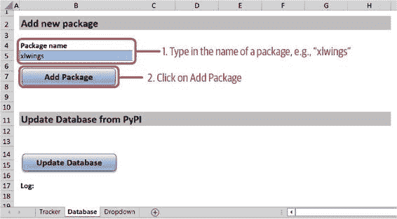
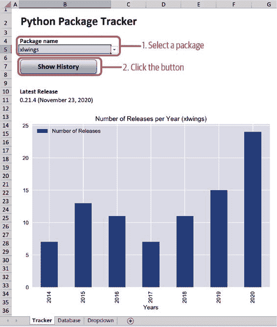
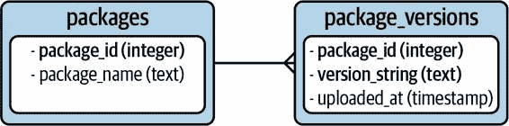
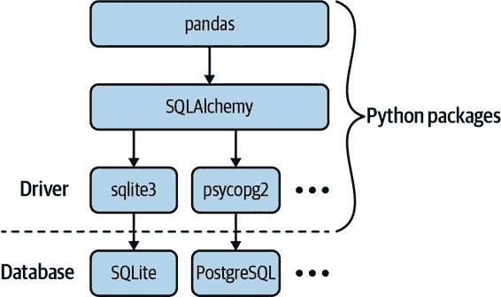
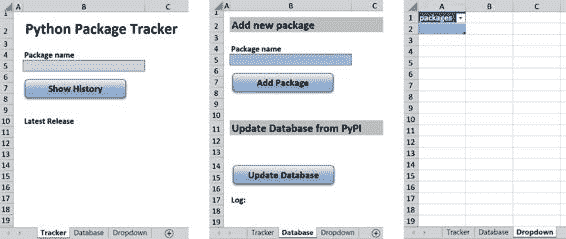
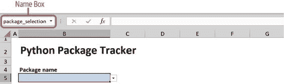
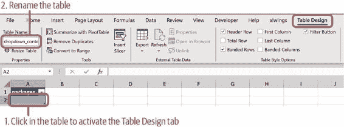
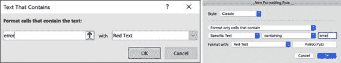
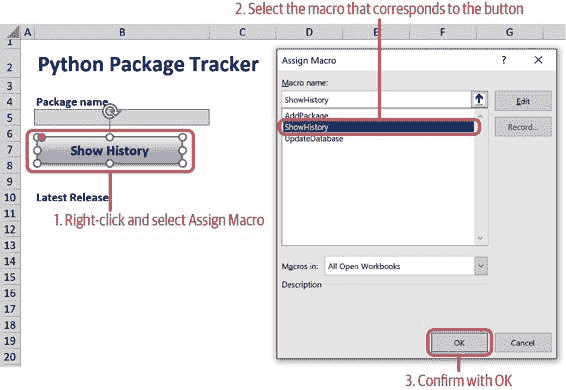

# 第十五章

第十一章\. Python 包追踪器

在本章中，我们将创建一个典型的业务应用程序，该应用程序从互联网上下载数据并将其存储在数据库中，然后在 Excel 中进行可视化。这将帮助您理解 xlwings 在这种应用程序中的作用，并演示使用 Python 连接外部系统的简易性。为了尝试构建一个接近真实应用程序但相对简单易懂的项目，我想出了 Python 包追踪器，这是一个 Excel 工具，显示给定 Python 包每年发布次数。尽管是案例研究，您实际上可能会发现该工具有助于了解特定 Python 包是否正在积极开发中。

熟悉了应用程序之后，我们将讨论几个需要理解的主题，以便能够跟进其代码：我们将看到如何从互联网上下载数据，以及如何与数据库交互，然后我们将学习 Python 中的异常处理，这是应用程序开发中的重要概念。完成这些前提后，我们将查看 Python 包追踪器的组件，了解所有内容如何相互关联。最后，我们将探讨如何调试 xlwings 代码的工作方式。与前两章一样，本章要求您在 Windows 或 macOS 上安装 Microsoft Excel。让我们开始使用 Python 包追踪器进行测试吧！

我们将要构建什么

转到配套代码库，您将找到 packagetracker 文件夹。该文件夹中有一些文件，但现在只需打开 Excel 文件 packagetracker.xlsm 并转到数据库表：我们首先需要将一些数据输入数据库，以便有东西可以操作。如图 Figure 11-1 所示，输入一个包名称，例如“xlwings”，然后点击“添加包”。您可以选择任何存在于 [Python 包索引](https://pypi.org)（PyPI）上的包名称。

> MACOS：确认对文件夹的访问权限
> 
> 当您在 macOS 上添加第一个包时，您需要确认一个弹出窗口，以便应用程序可以访问 packagetracker 文件夹。这与我们在 第九章 中遇到的弹出窗口相同。

图 11-1\. Python 包追踪器（数据库表）

如果一切按计划进行，您将在输入包名称的右侧看到消息“成功添加了 xlwings”。此外，在“更新数据库”部分下，您还将看到最后更新的时间戳，以及更新的日志部分，显示已成功下载 xlwings 并将其存储到数据库中。让我们再做一次，添加 pandas 包，这样我们就有更多的数据可以玩耍了。现在，切换到“Tracker”工作表，在单元格 B5 的下拉菜单中选择 xlwings，然后点击“显示历史记录”。您的屏幕现在应该类似于图 11-2，显示了包的最新版本以及多年来发布次数的图表。

图 11-2\. Python 包追踪器（Tracker 工作表）

您现在可以返回到“数据库”工作表，并添加其他包。每当您想要从 PyPI 更新数据库中的最新信息时，请点击“更新数据库”按钮：这将使您的数据库与来自 PyPI 的最新数据同步。

在从用户角度了解 Python 包追踪器的工作方式之后，现在让我们介绍其核心功能。

核心功能

在本节中，我将向您介绍 Python 包追踪器的核心功能：如何通过 Web API 获取数据以及如何查询数据库。我还将向您展示如何处理异常，这是在编写应用程序代码时不可避免的主题。让我们从 Web API 开始吧！

Web API

Web API 是应用程序从互联网获取数据的最流行方式之一：API 代表应用程序编程接口，并定义了如何以编程方式与应用程序进行交互。因此，Web API 是通过网络访问的 API，通常是互联网。为了了解 Web API 的工作原理，让我们退后一步，看看当您在浏览器中打开网页时（简化说），会发生什么：在地址栏中输入 URL 后，浏览器向服务器发送 GET 请求，请求您想要的网页。GET 请求是 HTTP 协议的一种方法，您的浏览器用它来与服务器通信。当服务器收到请求时，它会通过发送请求的 HTML 文档作出响应，您的浏览器则显示该文档：您的网页已加载完成。HTTP 协议还有各种其他方法；除了 GET 请求之外，最常见的方法是 POST 请求，用于将数据发送到服务器（例如，当您在网页上填写联系表单时）。

对于服务器向人类发送精美格式的 HTML 页面以进行交互是有意义的，但应用程序不关心设计，只关心数据。因此，对 web API 的 GET 请求类似于请求网页，但通常会以 JSON 格式而不是 HTML 格式返回数据。JSON 代表 JavaScript 对象表示法，是一种几乎所有编程语言都能理解的数据结构，这使其成为在不同系统之间交换数据的理想选择。尽管其符号使用 JavaScript 语法，但它与 Python 中使用（嵌套）字典和列表的方式非常接近。它们的区别如下：

+   > > > > JSON 只接受双引号作为字符串的引号符号
+   > > > > 
+   > > > > JSON 中使用`null`表示 Python 中的`None`
+   > > > > 
+   > > > > JSON 中使用小写的`true`和`false`，而 Python 中使用大写
+   > > > > 
+   > > > > JSON 只接受字符串作为键，而 Python 字典可以接受广泛的对象作为键

标准库中的`json`模块允许你将 Python 字典转换为 JSON 字符串，反之亦然：

> `In``[``1``]:``import``json`
> 
> `In``[``2``]:``# 一个 Python 字典...``user_dict``=``{``"name"``:``"Jane Doe"``,``"age"``:``23``,``"married"``:``False``,``"children"``:``None``,``"hobbies"``:``[``"hiking"``,``"reading"``]}`
> 
> `In``[``3``]:``# ...通过 json.dumps（“dump string”）转换为 JSON 字符串。 `indent`参数是可选的，可以美化打印。``user_json``=``json``.``dumps``(``user_dict``,``indent``=``4``)``print``(``user_json``)`
> 
> `{     "name": "Jane Doe",     "age": 23,     "married": false,     "children": null,     "hobbies": [         "hiking",         "reading"     ] }`
> 
> `In``[``4``]:``# 将 JSON 字符串转换回本地 Python 数据结构``json``.``loads``(``user_json``)`
> 
> `Out[4]: {'name': 'Jane Doe',          'age': 23,          'married': False,          'children': None,          'hobbies': ['hiking', 'reading']}`
> 
> REST API
> 
> 通常不是 web API，你会经常看到术语 REST 或 RESTful API。REST 代表表述性状态传递，并定义了遵循特定约束的 web API。其核心思想是通过无状态资源访问信息。无状态意味着对 REST API 的每个请求都完全独立于任何其他请求，并且始终需要提供其请求的完整信息集。请注意，术语 REST API 经常被误用来表示任何类型的 web API，即使它不遵循 REST 约束。

使用 web API 通常非常简单（我们稍后将看到如何在 Python 中使用），几乎每个服务都提供这样的接口。如果你想下载你最喜爱的 Spotify 播放列表，你可以发出以下 GET 请求（参见[Spotify Web API Reference](https://oreil.ly/zcyUh)）：

> `GET https://api.spotify.com/v1/playlists/``playlist_id`

或者，如果你想获取关于你最新 Uber 行程的信息，你可以执行以下 GET 请求（参见[Uber REST API](https://oreil.ly/FTp-Y)）：

> `GET https://api.uber.com/v1.2/history`

虽然要使用这些 API，您需要进行身份验证，通常意味着您需要一个帐户和一个令牌，可以将其与您的请求一起发送。对于 Python Package Tracker，我们需要从 PyPI 获取数据，以获取有关特定软件包发布的信息。幸运的是，PyPI 的 Web API 不需要任何身份验证，所以我们少了一件事情需要担心。当您查看 [PyPI JSON API 文档](https://oreil.ly/yTVjL) 时，您会发现只有两个端点，即追加到常见基础 URL [`pypi.org/pypi`](https://pypi.org/pypi) 的 URL 片段：

> `GET /``project_name``/json GET /``project_name``/``version``/json

第二个端点为您提供与第一个相同的信息，但仅适用于特定版本。对于 Python Package Tracker，第一个端点就足以获取有关软件包过去发布的详细信息，让我们看看这是如何工作的。在 Python 中，与 Web API 交互的简单方法是使用预安装在 Anaconda 中的 Requests 包。运行以下命令以获取有关 pandas 的 PyPI 数据：

> `In``[``5``]:``import``requests`
> 
> `In``[``6``]:``response``=``requests``.``get``(``"https://pypi.org/pypi/pandas/json"``)``response``.``status_code`
> 
> `Out[6]: 200`

每个响应都带有 HTTP 状态码：例如，`200` 表示 OK，`404` 表示未找到。您可以在 [Mozilla Web 文档](https://oreil.ly/HySVq) 中查找完整的 HTTP 响应状态代码列表。您可能熟悉状态码 `404`，因为有时您的浏览器在单击无效链接或键入不存在的地址时会显示它。类似地，如果您使用不存在于 PyPI 上的软件包名称运行 GET 请求，您也将收到 `404` 状态码。要查看响应的内容，最简单的方法是调用响应对象的 `json` 方法，它将把响应的 JSON 字符串转换为 Python 字典：

> `In``[``7``]:``response``.``json``()`

-   响应非常长，因此我只打印了一小部分以便您了解结构：

> `Out[7]: {             'info': {                 'bugtrack_url': None,                 'license': 'BSD',                 'maintainer': 'The PyData Development Team',                 'maintainer_email': 'pydata@googlegroups.com',                 'name': 'pandas'             },             'releases': {                 '0.1': [                     {                         'filename': 'pandas-0.1.tar.gz',                         'size': 238458,                         'upload_time': '2009-12-25T23:58:31'                     },                     {                         'filename': 'pandas-0.1.win32-py2.5.exe',                         'size': 313639,                         'upload_time': '2009-12-26T17:14:35'                     }                 ]             }         }`

要获取所有发布和它们的日期列表，这是 Python 包追踪器所需的内容，我们可以运行以下代码来遍历`releases`字典：

> `In``[``8``]:``releases``=``[]``for``version``,``files``in``response``.``json``()[``'releases'``]``.``items``():``releases``.``append``(``f``"{version}: {files[0]['upload_time']}"``)``releases``[:``3``]``# 显示列表的前 3 个元素`
> 
> `Out[8]: ['0.1: 2009-12-25T23:58:31',          '0.10.0: 2012-12-17T16:52:06',          '0.10.1: 2013-01-22T05:22:09']`

请注意，我们是从列表中首先出现的包中随意选择发布时间戳。一个特定的发布版本通常有多个包，以适应不同版本的 Python 和操作系统。总结这个话题时，您可能会记得第五章中提到 pandas 具有一个`read_json`方法，可以直接从 JSON 字符串返回 DataFrame。然而，在这里它对我们没有帮助，因为 PyPI 的响应不是一个可以直接转换为 DataFrame 的结构。

这是一个关于 Web API 的简短介绍，以便理解它们在 Python 包追踪器的代码库中的使用。现在让我们看看如何与数据库进行通信，这是我们应用程序中使用的另一个外部系统！

数据库

即使在没有连接到互联网时，也可以使用 PyPI 数据，您需要在下载后进行存储才能使用。虽然您可以将 JSON 响应存储为磁盘上的文本文件，但更舒适的解决方案是使用数据库：这使您可以轻松地查询数据。Python 包追踪器正在使用[SQLite](https://sqlite.org)，一个关系数据库。关系数据库系统得名于关系，它指的是数据库表本身（而不是表之间的关系，这是一个常见的误解）：它们的最高目标是数据完整性，通过将数据分割成不同的表（这个过程称为规范化）并应用约束条件来避免不一致和冗余数据。关系数据库使用 SQL（结构化查询语言）执行数据库查询，并且是最受欢迎的基于服务器的关系数据库系统之一有[SQL Server](https://oreil.ly/XZOI9)，[Oracle](https://oreil.ly/VKWE0)，[PostgreSQL](https://oreil.ly/VAEqY)和[MySQL](https://mysql.com)。作为 Excel 用户，您可能也熟悉基于文件的[Microsoft Access](https://oreil.ly/bRh6Q)数据库。

> NOSQL 数据库
> 
> 如今，关系数据库面临着来自 NoSQL 数据库的强大竞争，后者存储冗余数据以实现以下优势：
> 
> 无需表联接
> 
> > 由于关系数据库将它们的数据分布在多个表中，您通常需要通过联接这些表来合并两个或多个表中的信息，这可能会导致速度较慢。对于 NoSQL 数据库来说这不是必需的，它可以在某些类型的查询中实现更好的性能。
> > 
> 无数据库迁移
> 
> > 对于关系型数据库系统，每次对表结构进行更改（例如向表添加新列），都必须运行数据库迁移。迁移是将数据库带入所需新结构的脚本。这使得应用程序的新版本部署更加复杂，可能导致停机，这是使用 NoSQL 数据库更容易避免的。
> > 
> 更易于扩展
> 
> > NoSQL 数据库更容易在多个服务器上分发，因为没有依赖于彼此的表。这意味着使用 NoSQL 数据库的应用程序在用户基数激增时可能更好地扩展。
> > 
> NoSQL 数据库有多种类型：有些数据库是简单的键值存储，即类似于 Python 中的字典（例如，[Redis](https://redis.io)）；其他允许以文档形式存储数据，通常以 JSON 格式（例如，[MongoDB](https://mongodb.com)）。一些数据库甚至结合了关系型和 NoSQL 的特性：PostgreSQL 是 Python 社区中最流行的数据库之一，传统上是关系型数据库，但也允许您以 JSON 格式存储数据——而不会失去通过 SQL 查询的能力。

SQLite 是我们将要使用的数据库，类似于 Microsoft Access 的基于文件的数据库。不过，与仅在 Windows 上运行的 Microsoft Access 不同，SQLite 可以在 Python 支持的所有平台上运行。另一方面，SQLite 不允许您构建像 Microsoft Access 那样的用户界面，但是 Excel 在此部分非常方便。

现在让我们来看看在找出如何使用 Python 连接到数据库并进行 SQL 查询之前，Package Tracker 数据库的结构。接下来，我们将看一下数据库驱动应用程序的一个流行漏洞——SQL 注入，来结束这篇关于数据库的介绍。

Package Tracker 数据库

Python Package Tracker 的数据库非常简单，只有两张表：`packages` 表存储包名，`package_versions` 表存储版本字符串和上传日期。这两张表可以通过 `package_id` 进行连接：`package_versions` 表中不再重复存储 `package_name`，而是通过归一化存储在 `packages` 表中。这样消除了冗余数据——例如，只需在整个数据库中的一个字段中执行名称更改。如果想更深入了解带有 xlwings 和 pandas 包加载的数据库结构，请参考表 11-1 和 11-2。

表 11-1\. packages 表

|  package_id  |  package_name  |
| --- | --- |
|   `1` |   `xlwings` |
|   `2` |   `pandas` |

表 11-2\. package_versions 表（每个 package_id 的前三行）

|  package_id  |  version_string  |  uploaded_at  |
| --- | --- | --- |
|   `1` |   `0.1.0` |   `2014-03-19 18:18:49.000000` |
|   `1` |   `0.1.1` |   `2014-06-27 16:26:36.000000` |
|   `1` |   `0.2.0` |   `2014-07-29 17:14:22.000000` |
|   `...` |   `...` |   `...` |
|   `2` |   `0.1` |   `2009-12-25 23:58:31.000000` |
|   `2` |   `0.2beta` |   `2010-05-18 15:05:11.000000` |
|   `2` |   `0.2b1` |   `2010-05-18 15:09:05.000000` |
|   `...` |   `...` |   `...` |

图 11-3 是一个数据库图示，再次以示意方式显示了两个表。你可以查阅表和列名，并获取有关主键和外键的信息：

主键

> > 关系数据库要求每个表都有一个主键。主键是唯一标识行（行也称为记录）的一个或多个列。在 `packages` 表中，主键是 `package_id`；在 `package_versions` 表中，主键是所谓的复合键，即 `package_id` 和 `version_string` 的组合。

外键

> > `package_versions` 表中的 `package_id` 列是对 `packages` 表中同一列的外键，由连接表的线条来象征：外键是一个约束条件，在我们的情况下，确保 `package_versions` 表中的每个 `package_id` 都存在于 `packages` 表中——这保证了数据的完整性。连接线的右端分支象征着关系的性质：一个 `package` 可以有多个 `package_versions`，这被称为一对多关系。

图 11-3\. 数据库图示（主键用粗体表示）

要查看数据库表的内容并运行 SQL 查询，可以安装一个名为 SQLite 的 VS Code 扩展（请参阅 [SQLite 扩展文档](https://oreil.ly/nP4mC) 获取更多详细信息），或者使用专用的 SQLite 管理软件，种类繁多。不过，我们将使用 Python 来运行 SQL 查询。在做任何事情之前，让我们看看如何连接到数据库！

数据库连接

要从 Python 连接到数据库，需要一个驱动程序，即一个知道如何与你使用的数据库通信的 Python 包。每个数据库都需要不同的驱动程序，每个驱动程序使用不同的语法，但幸运的是，有一个强大的包叫做 [SQLAlchemy](https://sqlalchemy.org)，它抽象了各种数据库和驱动程序之间的大部分差异。SQLAlchemy 主要用作对象关系映射器（ORM），将你的数据库记录转换为 Python 对象，这个概念对许多开发者来说更自然，尽管并非所有人都是这么认为的。为了简化问题，我们忽略了 ORM 功能，只使用 SQLAlchemy 来更轻松地运行原始 SQL 查询。当你使用 pandas 以 DataFrames 的形式读取和写入数据库表时，SQLAlchemy 也是在幕后使用的。从 pandas 运行数据库查询涉及三个层次的包—— pandas、SQLAlchemy 和数据库驱动程序——如 图 11-4 所示。你可以从这三个层次运行数据库查询。

图 11-4\. 从 Python 访问数据库

表 11-3 展示了 SQLAlchemy 默认使用的驱动程序（某些数据库可以使用多个驱动程序）。它还为你提供了数据库连接字符串的格式——稍后我们将在实际运行 SQL 查询时使用这个连接字符串。

表 11-3\. SQLAlchemy 默认驱动程序和连接字符串

|  数据库  |  默认驱动程序  |  连接字符串  |
| --- | --- | --- |
|  SQLite  |   `sqlite3` |   `sqlite:///``文件路径` |
|  PostgreSQL  |   `psycopg2` |   `postgresql://``用户名``:``密码``@``主机``:``端口``/``数据库` |
|  MySQL  |   `mysql-python` |   `mysql://``用户名``:``密码``@``主机``:``端口``/``数据库` |
|  Oracle  |   `cx_oracle` |   `oracle://``用户名``:``密码``@``主机``:``端口``/``数据库` |
|  SQL Server  |   `pyodbc` |   `mssql+pyodbc://``用户名``:``密码``@``主机``:``端口``/``数据库` |

除了 SQLite，通常需要密码才能连接到数据库。由于连接字符串是 URL，如果密码中包含特殊字符，你将需要使用 URL 编码的版本。以下是如何打印密码的 URL 编码版本：

> `In``[``9``]:``import``urllib.parse`
> 
> `In``[``10``]:``urllib``.``parse``.``quote_plus``(``"pa$$word"``)`
> 
> `Out[10]: 'pa%24%24word'`

在介绍了 pandas、SQLAlchemy 和数据库驱动程序作为连接数据库的三个层级后，让我们看看它们在实践中如何比较，通过几个 SQL 查询来演示！

SQL 查询

即使你对 SQL 还很陌生，你也应该没有问题理解我接下来在示例和 Python Package Tracker 中使用的几个 SQL 查询。SQL 是一种声明式语言，这意味着你告诉数据库你想要什么而不是怎么做。有些查询几乎读起来像是普通的英语：

> `SELECT``*``FROM``packages`

这告诉数据库你要从 packages 表中选择所有列。在生产代码中，你不应该使用通配符 `*` 来表示所有列，而是明确指定每一列，这样可以减少查询错误的可能性：

> `SELECT``package_id``,``package_name``FROM``packages`
> 
> 数据库查询 vs. Pandas DataFrames
> 
> SQL 是一种基于集合的语言，这意味着你操作的是一组行而不是逐行循环。这与你处理 pandas DataFrames 的方式非常相似。以下是 SQL 查询：
> 
> > `SELECT``package_id``,``package_name``FROM``packages`
> > 
> 对应以下 pandas 表达式（假设 `packages` 是一个 DataFrame）：
> 
> > `packages``.``loc``[:,``[``"package_id"``,``"package_name"``]]`

下面的代码示例使用的是 packagetracker 文件夹中的 packagetracker.db 文件，您可以在伴随存储库的 packagetracker 文件夹中找到它。示例假设您已经通过 Python Package Tracker 的 Excel 前端将 xlwings 和 pandas 添加到了数据库中，就像我们在本章的开头所做的那样——否则您将只得到空结果。根据图 11-4，从底部到顶部，我们首先直接从驱动程序执行我们的 SQL 查询，然后使用 SQLAlchemy，最后使用 pandas：

> `In``[``11``]:``# 让我们从导入开始``import``sqlite3``from``sqlalchemy``import``create_engine``import``pandas``as``pd`
> 
> `In``[``12``]:``# 我们的 SQL 查询："从 packages 表中选择所有列"``sql``=``"SELECT * FROM packages"`
> 
> `In``[``13``]:``# 选项 1: 数据库驱动程序（sqlite3 是标准库的一部分）``# 使用连接作为上下文管理器自动提交事务或在错误的情况下回滚。``with``sqlite3``.``connect``(``"packagetracker/packagetracker.db"``)``as``con``:``cursor``=``con``.``cursor``()``# 我们需要一个游标来运行 SQL 查询``result``=``cursor``.``execute``(``sql``)``.``fetchall``()``# 返回所有记录``result`
> 
> `Out[13]: [(1, 'xlwings'), (2, 'pandas')]`
> 
> `In``[``14``]:``# 选项 2: SQLAlchemy``# "create_engine"期望你的数据库连接字符串。``# 在这里，我们可以将查询作为连接对象的方法执行。``engine``=``create_engine``(``"sqlite:///packagetracker/packagetracker.db"``)``with``engine``.``connect``()``as``con``:``result``=``con``.``execute``(``sql``)``.``fetchall``()``result`
> 
> `Out[14]: [(1, 'xlwings'), (2, 'pandas')]`
> 
> `In``[``15``]:``# 选项 3: pandas``# 向"read_sql"提供表名读取完整的表。``# Pandas 需要一个 SQLAlchemy 引擎，我们从前面的示例中重用。``df``=``pd``.``read_sql``(``"packages"``,``engine``,``index_col``=``"package_id"``)``df`
> 
> `Out[15]:            package_name          package_id          1               xlwings          2                pandas`
> 
> `In``[``16``]:``# "read_sql"还接受一个 SQL 查询``pd``.``read_sql``(``sql``,``engine``,``index_col``=``"package_id"``)`
> 
> `Out[16]:            package_name          package_id          1               xlwings          2                pandas`
> 
> `In``[``17``]:``# DataFrame 方法"to_sql"将 DataFrame 写入表中``# "if_exists"必须是"fail"、"append"或"replace"之一``df``.``to_sql``(``"packages2"``,``con``=``engine``,``if_exists``=``"append"``)`
> 
> `In``[``18``]:``# 前面的命令创建了一个名为"packages2"的新表，并将 DataFrame df 中的记录插入其中，我们可以通过重新读取来验证``pd``.``read_sql``(``"packages2"``,``engine``,``index_col``=``"package_id"``)`
> 
> `Out[18]:            package_name          package_id          1               xlwings          2                pandas`
> 
> `In``[``19``]:``# 让我们再次通过运行 SQLAlchemy 的“drop table”命令来摆脱这个表``with``engine``.``connect``()``as``con``:``con``.``execute``(``"DROP TABLE packages2"``)`

是否应该使用数据库驱动程序 SQLAlchemy 或 pandas 来运行您的查询，很大程度上取决于您的偏好：我个人喜欢使用 SQLAlchemy 获得的精细控制，并且享受使用相同语法在不同数据库上的便利。另一方面，pandas 的`read_sql`便于将查询结果以 DataFrame 的形式获取。

> 使用 SQLITE 的外键
> 
> 有些令人惊讶的是，默认情况下，SQLite 在运行查询时不会默认遵守外键约束。但是，如果您使用 SQLAlchemy，可以轻松强制执行外键约束；请参阅[SQLAlchemy 文档](https://oreil.ly/6YPvC)。如果您从 pandas 运行查询，这也适用。您将在伴随存储库的 packagetracker 文件夹的 database.py 模块顶部找到相应的代码。

现在您知道如何运行简单的 SQL 查询了，让我们通过查看 SQL 注入来结束本节，这可能会对您的应用程序构成安全风险。

SQL 注入

如果您没有正确保护 SQL 查询，恶意用户可以通过向数据输入字段注入 SQL 语句来运行任意的 SQL 代码：例如，在 Python 包追踪器的下拉菜单中选择包名 xlwings 时，他们可以发送一个改变您预期查询的 SQL 语句。这可能会暴露敏感信息或执行像删除表这样的破坏性操作。如何预防这种情况？让我们首先看一下下面的数据库查询，当您选择 xlwings 并点击“显示历史记录”时，包追踪器运行的查询：1

> `SELECT``v``.``uploaded_at``,``v``.``version_string``FROM``packages``p``INNER``JOIN``package_versions``v``ON``p``.``package_id``=``v``.``package_id``WHERE``p``.``package_id``=``1`

此查询将两个表连接在一起，仅返回`package_id`为`1`的行。为了帮助您基于我们在第五章中学到的内容理解此查询，如果`packages`和`package_versions`是 pandas 的 DataFrame，您可以编写：

> `df``=``packages``.``merge``(``package_versions``,``how``=``"inner"``,``on``=``"package_id"``)``df``.``loc``[``df``[``"package_id"``]``==``1``,``[``"uploaded_at"``,``"version_string"``]]`

很明显，`package_id`需要是一个变量，而不是我们现在硬编码的`1`，以便根据所选包返回正确的行。了解到 f-strings 来自第三章，您可能会想要像这样更改 SQL 查询的最后一行：

> `f``"WHERE p.package_id = {package_id}"`

尽管这在技术上可以工作，但绝不能这样做，因为它会为 SQL 注入打开大门：例如，有人可以发送 `'1 OR TRUE'` 而不是表示 `package_id` 的整数。生成的查询将返回整个表的行，而不仅仅是 `package_id` 等于 `1` 的行。因此，始终使用 SQLAlchemy 为您提供的占位符语法（它们以冒号开头）：

> `In``[``20``]:``# 让我们从导入 SQLAlchemy 的 text 函数开始``从``sqlalchemy.sql``导入``text`
> 
> `In``[``21``]:``# “:package_id” 是占位符``sql``=``"""``         选择``v.uploaded_at,``v.version_string``         从``packages``p``         内连接``package_versions``v``在``p.package_id``=``v.package_id``         其中``p.package_id``=``:package_id``         按``v.uploaded_at``排序``"""`
> 
> `In``[``22``]:``# 通过 SQLAlchemy``使用``engine``.``connect``()``连接``的``方式``获取``结果``=``con``.``execute``(``text``(``sql``),``package_id``=``1``)``.``fetchall``()``结果``[:``3``]``# 打印``前``3``条记录`
> 
> `Out[22]: [('2014-03-19 18:18:49.000000', '0.1.0'),           ('2014-06-27 16:26:36.000000', '0.1.1'),           ('2014-07-29 17:14:22.000000', '0.2.0')]`
> 
> `In``[``23``]:``# 通过 pandas``pd``.``read_sql``(``text``(``sql``),``engine``,``parse_dates``=``[``"uploaded_at"``],``params``=``{``"package_id"``:``1``},``index_col``=``[``"uploaded_at"``])``.``head``(``3``)`
> 
> `Out[23]:                     version_string          uploaded_at          2014-03-19 18:18:49          0.1.0          2014-06-27 16:26:36          0.1.1          2014-07-29 17:14:22          0.2.0`

使用 SQLAlchemy 的 `text` 函数包装 SQL 查询具有一个优点，即您可以在不同的数据库中使用相同的占位符语法。否则，您将不得不使用数据库驱动程序使用的占位符：例如，`sqlite3` 使用 `?` 而 `psycopg2` 使用 `%s`。

您可能会认为当用户直接访问 Python 并可以在数据库上运行任意代码时，SQL 注入并不是什么问题。但是，如果有一天将您的 xlwings 原型转换为 Web 应用程序，这将成为一个巨大的问题，因此最好从一开始就做好。

除了 Web API 和数据库，我们到目前为止跳过的另一个不可或缺的主题是坚实应用程序开发的异常处理。让我们看看它是如何工作的！

异常

我在第一章中提到了异常处理作为 VBA 在其 GoTo 机制方面落后的一个例子。在本节中，我将向您展示 Python 如何使用 try/except 机制来处理程序中的错误。每当某些事情超出您的控制时，错误可能会发生。例如，当您尝试发送电子邮件时，可能会出现电子邮件服务器宕机的情况，或者您的程序期望的文件可能会丢失-例如 Python Package Tracker 中可能是数据库文件。处理用户输入是另一个需要准备应对不合理输入的领域。让我们练习一下-如果以下函数被零调用，您将得到`ZeroDivisionError`：

> `In``[``24``]:`定义`print_reciprocal``(``number``):`结果``=``1``/``number``打印``(``f``"The reciprocal is: {result}"``)`
> 
> `In``[``25``]:`print_reciprocal``(``0``)``＃这将引发错误`
> 
> `--------------------------------------------------------------------------- ZeroDivisionError                         Traceback (most recent call last) <ipython-input-25-095f19ebb9e9> in <module> ----> 1`print_reciprocal``(``0``) ＃这将引发错误  <ipython-input-24-88fdfd8a4711> in `print_reciprocal``(``number``)       1`定义`print_reciprocal``(``number``): ----> 2    `结果``=``1``/``number``      3      `打印``(``f``"The reciprocal is: {result}"``)  ZeroDivisionError: division by zero`

要使您的程序能够优雅地对此类错误做出反应，请使用 try/except 语句（这相当于第一章中 VBA 示例的等价物）：

> `In``[``26``]:`定义`print_reciprocal``(``number``):`尝试``:`结果``=``1``/``number``除``Exception``as``e``:``＃"as e"使异常对象可用作变量"e"``＃"repr"表示对象的可打印表示``＃并返回一个带有错误消息的字符串``打印``(``f``"There was an error: {repr(e)}"``)``结果``=``"N/A"``else``:``打印``(``"There was no error!"``)``最后``:``打印``(``f``"The reciprocal is: {result}"``)`

每当`try`块中发生错误时，代码执行将移至`except`块，您可以在那里处理错误：这使您能够为用户提供有用的反馈或将错误写入日志文件。`else`子句仅在`try`块中未引发错误并且`finally`块始终运行时运行，无论是否引发错误。通常情况下，您只需使用`try`和`except`块。让我们看看给定不同输入时函数的输出：

> `In``[``27``]:`print_reciprocal``(``10``)`
> 
> `There was no error! The reciprocal is: 0.1`
> 
> `In``[``28``]:`print_reciprocal``(``"a"``)`
> 
> `There was an error: TypeError("unsupported operand type(s) for /: 'int' and 'str'") The reciprocal is: N/A`
> 
> `In``[``29``]:`print_reciprocal``(``0``)`
> 
> `There was an error: ZeroDivisionError('division by zero') The reciprocal is: N/A`

The way that I have used the except statement means that any exception that happens in the `try` block will cause the code execution to continue in the `except` block. Usually, that is not what you want. You want to check for an error as specific as possible and handle only those you expect. Your program may otherwise fail for something completely unexpected, which makes it hard to debug. To fix this, rewrite the function as follows, checking explicitly for the two errors that we expect (I am leaving away the `else` and `finally` statements):

> `In``[``30``]:``def``print_reciprocal``(``number``):``try``:``result``=``1``/``number``print``(``f``"The reciprocal is: {result}"``)``except``(``TypeError``,``ZeroDivisionError``):``print``(``"Please type in any number except 0."``)`

让我们再次运行代码：

> `In``[``31``]:``print_reciprocal``(``"a"``)`
> 
> 请键入除 0 以外的任何数字。

如果你想根据异常不同处理错误，应分别处理它们：

> `In``[``32``]:``def``print_reciprocal``(``number``):``try``:``result``=``1``/``number``print``(``f``"The reciprocal is: {result}"``)``except``TypeError``:``print``(``"Please type in a number."``)``except``ZeroDivisionError``:``print``(``"The reciprocal of 0 is not defined."``)`
> 
> `In``[``33``]:``print_reciprocal``(``"a"``)`
> 
> `请键入一个数字。`
> 
> `In``[``34``]:``print_reciprocal``(``0``)`
> 
> `The reciprocal of 0 is not defined.`

现在你了解了错误处理、Web API 和数据库，可以继续学习下一节内容，我们将逐个讲解 Python Package Tracker 的每个组成部分。

应用程序结构

在本节中，我们将深入了解 Python Package Tracker 的幕后工作原理。首先，我们将详细介绍应用程序的前端，即 Excel 文件，然后再看其后端，即 Python 代码。最后，我们将了解 xlwings 项目的调试方法，这对于像 Package Tracker 这样规模和复杂性的项目非常有用。

在 companion repo 的 packagetracker 目录中，你会找到四个文件。还记得我在第一章中提到的关注点分离吗？现在我们可以将这些文件映射到如表格 11-4 所示的不同层次。

表格 11-4\. 关注点分离

|  层次  |  文件  |  描述  |
| --- | --- | --- |
|  展示层  |   `packagetracker.xlsm` |  这是前端，也是最终用户与之交互的唯一文件。  |
|  业务层  |   `packagetracker.py` |  该模块通过 Web API 处理数据下载，并使用 pandas 进行数据处理。  |
|  数据层  |   `database.py` |  该模块处理所有数据库查询。  |
|  数据库  |   `packagetracker.db` |  这是一个 SQLite 数据库文件。  |

在这个上下文中，值得一提的是，即 Excel 文件的展示层并不包含单个单元格公式，这使得工具更容易审计和控制。

> 模型-视图-控制器（MVC）
> 
> 关注分离有多种形式，如 表 11-4 所示的分解只是一种可能性。您可能很快就会遇到的另一种流行设计模式称为模型-视图-控制器（MVC）。在 MVC 的世界中，应用程序的核心是模型，其中处理所有数据和通常大部分业务逻辑。视图对应于表示层，控制器只是一个薄层，位于模型和视图之间，以确保它们始终保持同步。为了简化事务，本书未使用 MVC 模式。

现在您知道每个文件负责什么，让我们继续深入了解 Excel 前端的设置方式！

前端

当您构建 Web 应用程序时，您区分前端和后端。前端是在浏览器中运行的应用程序部分，而后端是在服务器上运行的代码，您通过`RunPython`调用它。我们可以将相同的术语应用于 xlwings 工具：前端是 Excel 文件，后端是 Python 代码，您通过 Anaconda Prompt 运行以下命令（确保首先`cd`到您选择的目录）：

> `(base)>` `xlwings quickstart packagetracker`

转到 packagetracker 目录，并在 Excel 中打开 packagetracker.xlsm。首先添加三个选项卡：Tracker、Database 和 Dropdown，如 图 11-5 所示。

图 11-5\. 构建用户界面

虽然您应该能够接管来自 图 11-5 的文本和格式，但我需要给您一些关于不可见事物的详细信息：

按钮

> > 为了使工具看起来不那么像 Windows 3.1，我没有使用我们在前一章中使用的标准宏按钮。相反，我去插入 > 形状，插入了一个圆角矩形。如果您想使用标准按钮，那也可以，但在这一点上，请不要立即分配宏。

命名区域

> > 为了使工具更易于维护，我们将在 Python 代码中使用命名区域而不是单元格地址。因此，请按照 表 11-5 所示添加命名区域。

表 11-5\. 命名区域

|  表格  |  单元格  |  名称  |
| --- | --- | --- |

|

> > 跟踪器

|

> > B5

|

> > `package_selection`

|

|

> > 跟踪器

|

> > B11

|

> > `latest_release`

|

|

> > 数据库

|

> > B5

|

> > `new_package`

|

|

> > 数据库

|

> > B13

|

> > `updated_at`

|

|

> > 数据库

|

> > B18

|

> > `log`

|

> > 添加命名区域的一种方法是选择单元格，然后在名称框中编写名称，最后按 Enter 确认，如 图 11-6 所示。
> > 
> > 
> > 
> > 图 11-6\. 名称框

表格

> > 在 Dropdown 表上，在单元格 A1 中键入“packages”后，选择 A1，然后转到 插入 > 表格，并确保激活“我的表格具有标题”旁边的复选框。最后，选中表格后，转到功能区标签 表格设计（Windows）或表格（macOS），并将表格从 `Table1` 重命名为 `dropdown_content`，如图 [Figure 11-7](https://example.org/filepos1613484) 所示。
> > 
> > 
> > 
> > 图 [Figure 11-7](https://example.org/filepos1613484)。重命名 Excel 表格

数据验证

> > 我们使用数据验证在 Tracker 表的 B5 单元格中提供下拉菜单。要添加它，请选择单元格 B5，然后转到 数据 > 数据验证，允许下拉菜单，然后在源中设置以下公式：
> > 
> > `=INDIRECT("dropdown_content[packages]")`
> > 
> > 然后，点击确认。这只是表的一个参考，但由于 Excel 不能直接接受表引用，我们必须用 `INDIRECT` 公式将其包装起来，这将表解析为其地址。然而，通过使用表，当我们添加更多包时，它会适当调整下拉菜单中显示的范围。

条件格式化

> > 当您添加一个包时，可能会出现几个错误需要向用户显示：字段可能为空，包可能已经存在于数据库中，或者可能在 PyPI 上缺失。为了在红色中显示错误信息和其他消息为黑色，我们将使用基于条件格式化的简单技巧：每当消息包含`error`时，我们希望字体变为红色。在数据库表中，选择单元格 C5，这是我们将写出消息的地方。然后进入主页 > 条件格式化 > 突出显示单元格规则 > 包含文本。输入值 `error` 并在下拉菜单中选择红色文本，如图 [Figure 11-8](https://example.org/filepos1615769) 所示，然后点击确定。将同样的条件格式应用到 Tracker 表的单元格 C5 上。
> > 
> > 
> > 
> > 图 [Figure 11-8](https://example.org/filepos1615769)。Windows 上的条件格式化（左）和 macOS 上的条件格式化（右）

网格线

> > 在 Tracker 和 Database 表上，网格线已通过在页面布局 > 网格线 下取消勾选查看复选框而隐藏。

此时，用户界面已完成，应如图 [Figure 11-5](https://example.org/filepos1607351) 所示。现在我们需要在 VBA 编辑器中添加 `RunPython` 调用，并将它们与按钮连接起来。点击 Alt+F11（Windows）或 Option-F11（macOS）打开 VBA 编辑器，然后，在 packagetracker.xlsm 的 VBAProject 下，双击左侧的 Modules 下的 Module1 打开它。删除现有的 `SampleCall` 代码，并替换为以下宏：

> `Sub``AddPackage``()``RunPython``"import packagetracker; packagetracker.add_package()"``End``Sub``Sub``ShowHistory``()``RunPython``"import packagetracker; packagetracker.show_history()"``End``Sub``Sub``UpdateDatabase``()``RunPython``"import packagetracker; packagetracker.update_database()"``End``Sub`

接下来，右键单击每个按钮，选择分配宏，并选择与按钮对应的宏。图 11-9 显示了“显示历史记录”按钮，但对于“添加包”和“更新数据库”按钮，操作方式相同。

图 11-9\. 将“显示历史记录”宏分配给“显示历史记录”按钮

前端部分已完成，我们可以继续进行 Python 后端的开发。

后端

packagetracker.py 和 database.py 两个 Python 文件的代码太长，无法在此处显示，因此您需要从配套存储库中在 VS Code 中打开它们。不过，在本节中我会引用一些代码片段来解释一些关键概念。让我们看看当您在 Database 表单上单击“添加包”按钮时会发生什么。该按钮分配了以下 VBA 宏：

> `Sub``AddPackage``()``RunPython``"import packagetracker; packagetracker.add_package()"``End``Sub`

如您所见，`RunPython` 函数调用了 `packagetracker` 模块中的 `add_package` Python 函数，如 示例 11-1 中所示。

> 无生产代码
> 
> 为了便于跟踪，应用尽可能简化—它并不检查所有可能出错的事情。在生产环境中，您希望使其更加健壮：例如，如果找不到数据库文件，您将显示用户友好的错误信息。

示例 11-1\. packagetracker.py 中的 `add_package` 函数（无注释）

`def``add_package``():``db_sheet``=``xw``.``Book``.``caller``()``.``sheets``[``"Database"``]``package_name``=``db_sheet``[``"new_package"``]``.``value``feedback_cell``=``db_sheet``[``"new_package"``]``.``offset``(``column_offset``=``1``)``feedback_cell``.``clear_contents``()``if``not``package_name``:``feedback_cell``.``value``=``"错误：请提供名称！"``return``if``requests``.``get``(``f``"{BASE_URL}/{package_name}/json"``,``timeout``=``6``)``.``status_code``!=``200``:``feedback_cell``.``value``=``"错误：未找到包！"``return``error``=``database``.``store_package``(``package_name``)``db_sheet``[``"new_package"``]``.``clear_contents``()``if``error``:``feedback_cell``.``value``=``f``"错误：{error}"``else``:``feedback_cell``.``value``=``f``"成功添加 {package_name}。"``update_database``()``refresh_dropdown``()`

> > 通过条件格式化，反馈消息中的“error”将触发 Excel 中的红色字体。

> > 默认情况下，Requests 会永久等待响应，这可能导致应用在 PyPI 出现问题且响应速度慢时“挂起”。因此，对于生产代码，您应始终包含显式的 `timeout` 参数。

> > 如果操作成功，`store_package` 函数返回 `None`，否则返回包含错误消息的字符串。

> > 为了简化操作，整个数据库都会被更新。在生产环境中，你只会添加新包裹的记录。

> > 这将更新 Dropdown 表中的表格内容到`packages`表格。结合在 Excel 中设置的数据验证，这确保了所有包裹出现在 Tracker 表单的下拉列表中。如果你允许数据库从 Excel 文件外部填充，你需要为用户提供直接调用该函数的方法。一旦你有多个用户从不同的 Excel 文件访问同一个数据库，这种情况就会发生。

你应该能够通过代码注释来理解 packagetracker.py 文件中的其他功能。现在让我们转向 database.py 文件。首几行如示例 11-2 所示。

示例 11-2\. database.py（包含相关导入的摘录）

`from``pathlib``import``Path``import``sqlalchemy``import``pandas``as``pd``...``# 我们希望数据库文件与此文件同级。``# 这里，我们将路径转换为绝对路径。``this_dir``=``Path``(``__file__``)``.``resolve``()``.``parent``db_path``=``this_dir``/``"packagetracker.db"``# 数据库引擎``engine``=``sqlalchemy``.``create_engine``(``f``"sqlite:///{db_path}"``)`

> > 如果你需要对这行代码的作用进行复习，请参考第七章开头的内容，在销售报告的代码中我有解释。

虽然这个片段涉及组合数据库文件路径，但它还展示了如何解决你在处理任何文件时可能遇到的常见错误，无论是图片、CSV 文件还是像这种情况下的数据库文件。当你快速编写 Python 脚本时，你可能只使用相对路径，就像我在大多数 Jupyter 笔记本示例中所做的那样：

> `engine``=``sqlalchemy``.``create_engine``(``"sqlite:///packagetracker.db"``)`

只要文件在你的工作目录中，这就可以工作。但是，当你通过`RunPython`从 Excel 运行这段代码时，工作目录可能会不同，这会导致 Python 在错误的文件夹中查找文件，你将会得到一个`File not found`错误。你可以通过提供绝对路径或者像我们在示例 11-2 中那样创建路径来解决这个问题。这确保了即使你通过`RunPython`从 Excel 执行代码，Python 也会在与源文件相同的目录中查找文件。

如果你想从头开始创建 Python 包跟踪器，你需要手动创建数据库：例如通过在 VS Code 中点击运行文件按钮来运行 database.py 文件。这将创建数据库文件 packagetracker.db 并包含两个表格。创建数据库的代码位于 database.py 的最底部：

> `if` `__name__` `==``"__main__"``:``create_db``()`

尽管最后一行调用了`create_db`函数，但前面的`if`语句的含义在以下的提示中有解释。

> IF __NAME__ == “__MAIN__”
> 
> 您会在许多 Python 文件的底部看到这个`if`语句。它确保当您以脚本的方式运行代码时才会执行，例如，通过在 Anaconda Prompt 中运行`python database.py`或在 VS Code 中点击运行文件按钮。但是，当您通过`import database`在您的代码中导入它时，它不会被触发。这是因为 Python 在直接作为脚本运行时将文件命名为`__main__`，而在通过`import`语句调用时将其称为模块名（`database`）。由于 Python 在一个名为`__name__`的变量中跟踪文件名，所以`if`语句只在以脚本方式运行时评估为`True`；当您通过在 packagetracker.py 文件中导入它时，它不会被触发。

`database`模块的其余部分通过 SQLAlchemy 和 pandas 的`to_sql`和`read_sql`方法运行 SQL 语句，这样您可以了解这两种方法的使用感觉。

> 迁移到 POSTGRESQL
> 
> 如果您想用基于服务器的数据库 POSTGRESQL 替换 SQLite，您只需做几件事情。首先，您需要运行`conda install psycopg2`（或者如果您不使用 Anaconda 发行版，则运行`pip install psycopg2-binary`）来安装 POSTGRESQL 驱动程序。然后，在 database.py 中，根据 Table 11-3 中显示的 POSTGRESQL 版本更改`create_engine`函数中的连接字符串。最后，要创建表，您需要将`packages.package_id`的`INTEGER`数据类型更改为 POSTGRESQL 的特定表示法`SERIAL`。创建自增主键是 SQL 方言之间差异的一个示例。

当您创建像 Python 包追踪器这样复杂的工具时，您可能会遇到一些问题：例如，您可能已经在 Excel 中重命名了一个命名范围，但忘记相应地调整 Python 代码。这是了解调试工作原理的好时机！

调试

为了方便调试您的 xlwings 脚本，请直接从 VS Code 运行您的函数，而不是通过在 Excel 中点击按钮运行它们。在 packagetracker.py 文件的底部添加以下几行代码，这将帮助您调试`add_package`函数（这段代码也可以在`quickstart`项目的底部找到）：

> `if` `__name__` `==``"__main__"``:``xw``.``Book``(``"packagetracker.xlsm"``)``.``set_mock_caller``()``add_package``()`

> > 我们刚刚看到了这个 if 语句在查看 database.py 代码时的工作原理；请参见前面的提示。

> > 当您直接从 Python 作为脚本运行文件时，`set_mock_caller()` 命令仅用于调试目的：当您在 VS Code 中或从 Anaconda 提示符中运行文件时，它会将 `xw.Book.caller()` 设置为 `xw.Book("packagetracker.xlsm")`。这样做的唯一目的是能够在 Python 和 Excel 两端运行脚本，而无需在 `add_package` 函数中来回切换 `xw.Book("packagetracker.xlsm")`（从 VS Code 调用时）和 `xw.Book.caller()`（从 Excel 调用时）的书对象。

在 VS Code 中打开 packagetracker.py，在 `add_package` 函数的任何行左侧的行号单击设置断点。然后按 F5 并在对话框中选择“Python 文件”以启动调试器，并使您的代码停在断点处。确保使用 F5 键而不是使用“运行文件”按钮，因为“运行文件”按钮会忽略断点。

> 调试 VS Code 和 Anaconda
> 
> 在 Windows 上，第一次使用 VS Code 调试器运行使用 pandas 的代码时，您可能会遇到错误：“异常发生：ImportError，无法导入所需的依赖项：numpy。”这是因为调试器在 Conda 环境正确激活之前已经启动和运行了。作为解决方法，点击停止图标停止调试器，然后再次按 F5——第二次运行时将正常工作。

如果您不熟悉 VS Code 调试器的工作原理，请参阅附录 B，我在那里解释了所有相关功能和按钮。我们也将在下一章的相应部分再次讨论这个主题。如果您想调试不同的函数，请停止当前的调试会话，然后在文件底部调整函数名称。例如，要调试 `show_history` 函数，请在 packagetracker.py 的最后一行修改如下，然后再次按 F5：

> `if` `__name__` `==``"__main__"``:``xw``.``Book``(``"packagetracker.xlsm"``)``.``set_mock_caller``()``show_history``()

在 Windows 上，您还可以在 xlwings 插件中激活“显示控制台”复选框，这将在 `RunPython` 调用运行时显示命令提示符。这允许您打印附加信息以帮助调试问题。例如，您可以打印变量的值以在命令提示符上进行检查。然而，代码运行后，命令提示符将会关闭。如果您需要保持它稍长时间打开，有一个简单的技巧：在函数的最后一行添加 `input()`。这会导致 Python 等待用户输入，而不是立即关闭命令提示符。当您完成检查输出时，在命令提示符中按 Enter 关闭它——只需确保在取消选中“显示控制台”选项之前再次删除 `input()` 行！

结论

这一章节向您展示了，通过最小的努力就能构建相当复杂的应用程序是可能的。能够利用强大的 Python 包如 Requests 或 SQLAlchemy 对我而言意义重大，特别是当我将其与 VBA 相比较时，在 VBA 中与外部系统通信要困难得多。如果您有类似的用例，我强烈建议您更仔细地了解 Requests 和 SQLAlchemy——能够高效处理外部数据源将使您能够让复制/粘贴成为历史。

有些用户更喜欢通过使用单元格公式来创建他们的 Excel 工具，而不是点击按钮。下一章将向您展示 xlwings 如何使您能够在 Python 中编写用户定义函数，从而使您能够重复使用我们迄今学到的大部分 xlwings 概念。

> 1   实际上，该工具使用`package_name`而不是`package_id`来简化代码。
> 
> 2   在撰写本文时，此选项在 macOS 上尚不可用。
