# 第十二章：用户定义函数（UDFs）

过去的三章向你展示了如何使用 Python 脚本自动化 Excel，以及如何在 Excel 中点击按钮运行这样的脚本。本章介绍了另一种选项，即使用 xlwings 从 Excel 中调用 Python 代码的用户定义函数（UDFs）。UDFs 是你在 Excel 单元格中使用的 Python 函数，与像`SUM`或`AVERAGE`等内置函数的使用方式相同。与上一章类似，我们将从`quickstart`命令开始，这样可以很快尝试第一个 UDF。接下来，我们将进行一个关于从 Google Trends 获取和处理数据的案例研究，作为使用更复杂的 UDFs 的借口：我们将学习如何处理 pandas 的数据框架和绘图，以及如何调试 UDFs。最后，我们将深入探讨一些重点放在性能上的高级主题。不幸的是，xlwings 不支持在 macOS 上使用 UDFs，这使得本章是唯一需要在 Windows 上运行示例的章节。1

> 针对 macOS 和 Linux 用户的注意事项
> 
> 即使你不在 Windows 平台上，你仍然可能希望看一看 Google Trends 案例研究，因为你可以轻松地将其调整为在 macOS 上使用`RunPython`调用。你还可以使用来自第八章的写入库之一生成报告，该库甚至在 Linux 上也适用。

开始使用 UDFs

在我们可以使用`quickstart`命令运行我们的第一个 UDF 之前，本节将从编写 UDFs 的前提条件开始。为了能够跟随本章的示例，你需要安装 xlwings 插件，并在 Excel 选项中启用“允许访问 VBA 项目对象模型”：

插件

> > 我假设你已经按照第十章中所述安装了 xlwings 插件。虽然这不是硬性要求，但它使得开发变得更加容易，特别是点击“插入函数”按钮。不过，这不是部署所必需的，你可以通过在独立模式下设置工作簿来替代它——详情请参见第十章。

允许访问 VBA 项目对象模型

> > 要编写你的第一个 UDF，你需要更改 Excel 中的一个设置：转到“文件” > “选项” > “信任中心” > “信任中心设置” > “宏设置”，并勾选“允许访问 VBA 项目对象模型”的复选框，就像图 12-1 中一样。这样 xlwings 在你点击插入函数按钮时可以自动将一个 VBA 模块插入到你的工作簿中，我们很快就会看到。由于你只在导入过程中依赖此设置，所以你应该将其视为开发者设置，终端用户无需关心。


图 12-1\. 允许访问 VBA 项目对象模型

当这两个前提条件准备就绪时，你就可以运行你的第一个 UDF 了！

UDF 快速入门

和往常一样，最快上手的方法是使用 `quickstart` 命令。在 Anaconda Prompt 上运行以下命令之前，请确保通过 `cd` 命令切换到所选目录。例如，如果您在主目录中并且想切换到桌面，请先运行 `cd Desktop`：

> `(base)>` `xlwings quickstart first_udf`

在文件资源管理器中导航至 `first_udf` 文件夹，用 Excel 打开 `first_udf.xlsm`，用 VS Code 打开 `first_udf.py`。然后，在 xlwings 的功能增强插件中，点击“导入函数”按钮。默认情况下，这是一个静默操作，即仅在出现错误时才会显示内容。但是，如果在 Excel 插件中激活“显示控制台”复选框，然后再次点击“导入函数”按钮，会打开一个命令提示符并打印以下内容：

> `xlwings server running [...] Imported functions from the following modules: first_udf`

第一行打印了一些我们可以忽略的细节，重要的部分是一旦打印了这一行，Python 就已经启动了。第二行确认它已正确导入了来自 `first_udf` 模块的函数。现在在 `first_udf.xlsm` 的活动工作表的单元格 A1 中键入`=hello("xlwings")`，按 Enter 键后，您将看到公式的计算结果如 图 12-2 所示。

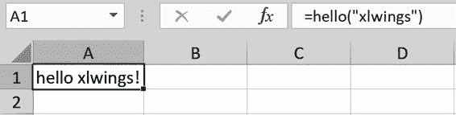

图 12-2\. `first_udf.xlsm`

让我们详细分析一下每个部分的工作原理：首先看一下 `first_udf.py` 中的 `hello` 函数（示例 12-1），这是我们迄今为止忽略的 `quickstart` 代码的一部分。

示例 12-1\. `first_udf.py`（摘录）

`import``xlwings``as``xw``@xw.func``def``hello``(``name``):``return``f``"Hello {name}!"`

每个标有 `@xw.func` 的函数都会在您点击 xlwings 增强插件中的“导入函数”时导入到 Excel 中。导入函数会使其在 Excel 中可用，以便您可以在单元格公式中使用它们。稍后我们会详细介绍技术细节。`@xw.func` 是一个装饰器，这意味着您必须直接放在函数定义的顶部。如果您想了解更多有关装饰器如何工作的信息，请查看侧边栏。

> 函数装饰器
> 
> 装饰器是放在函数定义顶部的函数名，以 `@` 符号开头。这是一种简单的方式来改变函数的行为，xlwings 使用它来识别您想在 Excel 中提供的函数。为了帮助您理解装饰器的工作原理，以下示例显示了一个名为 `verbose` 的装饰器的定义，它会在运行函数 `print_hello` 前后打印一些文本。从技术上讲，装饰器接受函数（`print_hello`）并将其作为参数 `func` 提供给 `verbose` 函数。内部函数称为 `wrapper`，可以执行需要执行的操作；在本例中，它在调用 `print_hello` 函数之前和之后打印一个值。内部函数的名称无关紧要：
> 
> `In``[``1``]:``# 这是函数装饰器的定义``def``verbose``(``func``):``def``wrapper``():``print``(``"调用函数前。"``)``func``()``print``(``"调用函数后。"``)``return``wrapper`
> 
> `In``[``2``]:``# 使用函数装饰器``@verbose``def``print_hello``():``print``(``"hello!"``)`
> 
> `In``[``3``]:``# 调用装饰函数的效果``print_hello``()`
> 
> `调用函数前。hello! 调用函数后。`
> 
> 在本章末尾，你会找到 表 12-1，其中总结了 xlwings 提供的所有装饰器。

默认情况下，如果函数参数是单元格范围，xlwings 将传递这些单元格范围的值，而不是 xlwings 的 `range` 对象。在绝大多数情况下，这非常方便，并允许你使用单元格调用 `hello` 函数。例如，你可以在单元格 A2 中写入“xlwings”，然后将 A1 中的公式更改为以下内容：

> `=``hello``(``A2``)`

结果与 图 12-2 中的相同。我将在本章的最后一节中向你展示如何更改此行为，并使参数作为 xlwings `range` 对象传递——正如我们之后将看到的，有时你会需要这样做。在 VBA 中，等效的 `hello` 函数如下所示：

> `Function``hello``(``name``As``String``)``As``String``hello``=``"Hello "``&``name``&``"!"``End``Function`

当你点击附加组件中的导入函数按钮时，xlwings 会将名为 `xlwings_udfs` 的 VBA 模块插入到你的 Excel 工作簿中。它包含每个你导入的 Python 函数的一个 VBA 函数：这些包装 VBA 函数负责在 Python 中运行相应的函数。虽然你可以通过 Alt+F11 打开 VBA 编辑器查看 `xlwings_udfs` VBA 模块，但你可以忽略它，因为代码是自动生成的，当你再次点击导入函数按钮时，任何更改都将丢失。现在让我们在 first_udf.py 中玩弄我们的 `hello` 函数，并将返回值中的 `Hello` 替换为 `Bye`：

> `@xw.func``def``hello``(``name``):``return``f``"Bye {name}!"`

要在 Excel 中重新计算函数，要么双击单元格 A1 以编辑公式（或者选择单元格并按 F2 激活编辑模式），然后按 Enter。或者，键入键盘快捷键 Ctrl+Alt+F9：这将强制重新计算所有打开工作簿中所有工作表的公式，包括 `hello` 公式。请注意，F9（重新计算所有打开工作簿中的所有工作表）或 Shift+F9（重新计算活动工作表）不会重新计算 UDF，因为 Excel 仅在依赖单元格更改时触发 UDF 的重新计算。要更改此行为，你可以通过向 `func` 装饰器添加相应的参数来使函数成为 volatile：

> `@xw.func``(``volatile``=``True``)``def``hello``(``name``):``return``f``"Bye {name}!"`

Volatile 函数在 Excel 执行重新计算时每次都会被评估 —— 无论函数的依赖是否已更改。像 `=RAND()` 或 `=NOW()` 这样的几个内置函数是不稳定的，过多使用它们会使你的工作簿变慢，因此不要过度使用。当你修改函数的名称或参数或者像我们刚刚做的那样修改 `func` 装饰器时，你需要再次点击导入函数按钮重新导入函数：这将在导入更新的函数之前重新启动 Python 解释器。现在如果你将函数从 `Bye` 改回 `Hello`，只需使用键盘快捷键 Shift+F9 或 F9 即可导致公式重新计算，因为此函数现在是不稳定的。

> 修改 Python 文件后保存
> 
> 一个常见的坑是在修改 Python 源文件后忘记保存。因此，在点击导入函数按钮或在 Excel 中重新计算 UDF 之前，务必双检 Python 文件已保存。

默认情况下，xlwings 从与 Excel 文件同名且在同一目录中的 Python 文件中导入函数。重命名和移动你的 Python 源文件需要类似于 第十章 中我们对 `RunPython` 调用所做的更改：请将文件从 first_udf.py 改名为 hello.py。为了让 xlwings 知道这个变化，将模块的名称，即 `hello`（不带 .py 扩展名！），添加到 xlwings 插件中的 UDF 模块中，如 图 12-3 所示。

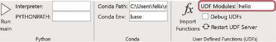

图 12-3\. UDF 模块设置

点击导入函数按钮重新导入函数。然后在 Excel 中重新计算公式以确保一切仍然正常工作。

> 从多个 Python 模块导入函数
> 
> 如果你想从多个模块导入函数，在 UDF 模块设置中它们的名称之间需要用分号分隔，例如，`hello;another_module`。

现在，请继续将 hello.py 移动到你的桌面上：这需要你在 xlwings 插件中将你的桌面路径添加到 `PYTHONPATH` 中。正如在 第十章 中所见，你可以使用环境变量来实现这一点，即你可以在插件中设置 `PYTHONPATH` 设置为 %USERPROFILE%\Desktop。如果你仍然将 pyscripts 文件夹的路径保留在那里从 第十章 中，则要么覆盖它，要么保留它在那里，并用分号分隔这些路径。完成这些更改后，再次点击导入函数按钮，然后在 Excel 中重新计算函数以验证一切仍然正常运行。

> 配置与部署
> 
> 在本章中，我总是提到在附加组件中更改设置；然而，关于配置和部署的所有内容都可以适用于本章。这意味着设置也可以在 xlwings.conf 表或与 Excel 文件相同目录中的配置文件中进行更改。而且，您可以使用独立模式中设置的工作簿，而不是使用 xlwings 附加组件。对于 UDF 来说，构建您自己的自定义附加组件也是有意义的——这使您可以在所有工作簿之间共享您的 UDF，而无需将它们导入到每个工作簿中。有关构建您自己的自定义附加组件的更多信息，请参阅[xlwings 文档](https://oreil.ly/uNo0g)。

如果更改 UDF 的 Python 代码，xlwings 会在每次保存 Python 文件时自动获取更改。如前所述，如果更改函数名称、参数或装饰器中的任何内容，则只需要重新导入您的 UDF。然而，如果您的源文件从其他模块导入代码，并且您在这些模块中进行了更改，让 Excel 获取所有更改的最简单方法是单击“重新启动 UDF 服务器”。

到目前为止，您已经知道如何在 Python 中编写简单的 UDF，并在 Excel 中使用它。接下来的案例研究将为您介绍更实际的 UDF，这些 UDF 利用了 pandas 数据框架。

案例研究：Google Trends

在这个案例研究中，我们将使用来自 Google Trends 的数据，学习如何处理 pandas 数据框架和动态数组，这是微软在 2020 年正式推出的 Excel 中最令人兴奋的新功能之一。然后，我们创建一个直接连接到 Google Trends 的 UDF，以及一个使用数据框架的`plot`方法的 UDF。为了结束本节，我们将看看 UDF 的调试工作原理。让我们从 Google Trends 的简短介绍开始吧！

Google Trends 介绍

[Google Trends](https://oreil.ly/G6TpC) 是 Google 的一项服务，允许您分析 Google 搜索查询随时间和地区的流行度。 Figure 12-4 显示了在添加了几种流行的编程语言后的 Google Trends，选择了全球作为地区和 1/1/16 - 12/26/20 作为时间范围。每个搜索词都以编程语言上下文进行了选择，这在键入搜索词后的下拉菜单中显示。这确保我们忽略了 Python 这条蛇和 Java 这个岛。 Google 在所选时间范围和位置内索引数据，100 表示最大的搜索兴趣。在我们的样本中，这意味着在给定的时间范围和位置内，最高的搜索兴趣是在 2016 年 2 月的 Java。有关 Google Trends 的更多详细信息，请参阅他们官方的[博客文章](https://oreil.ly/_aw8f)。

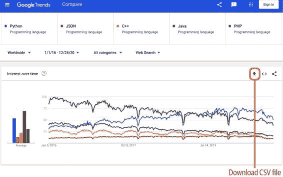

图 12-4。随时间变化的兴趣；数据源[Google Trends](https://oreil.ly/SR8zD)

> 随机样本
> 
> Google Trends 的数据基于随机样本，这意味着即使您在相同位置、时间段和搜索词上查看 Figure 12-4，您可能看到的图片也可能略有不同。

我点击 Figure 12-4 中看到的下载按钮，从中获取了一个 CSV 文件，然后将数据复制到了一个 `quickstart` 项目的 Excel 工作簿中。在接下来的部分，我将向您展示在哪里找到此工作簿——我们将使用它在 Excel 中直接分析数据！

使用 DataFrames 和动态数组

读至此书中，您不应感到惊讶，pandas DataFrames 也是 UDF 的好伴侣。要了解 DataFrames 和 UDF 如何配合，并了解动态数组，请转到 companion 代码库中 udfs 目录下的 describe 文件夹，并在 Excel 中打开 describe.xlsm 和在 VS Code 中打开 describe.py。Excel 文件包含来自 Google Trends 的数据，在 Python 文件中，您会找到一个简单的起步函数，如 Example 12-2 所示。  

Example 12-2\. describe.py

`import``xlwings``as``xw``import``pandas``as``pd``@xw.func``@xw.arg``(``"df"``,``pd``.``DataFrame``,``index``=``True``,``header``=``True``)``def``describe``(``df``):``return``df``.``describe``()`  

与 `quickstart` 项目中的 `hello` 函数相比，您会注意到第二个装饰器的存在：

> `@xw.arg``(``"df"``,``pd``.``DataFrame``,``index``=``True``,``header``=``True``)`

`arg` 是 argument 的缩写，允许您在介绍 xlwings 语法时使用相同的转换器和选项，这与 Chapter 9 中 xlwings `range` 对象的 `options` 方法提供了相同的功能。严格来说，这是 `arg` 装饰器的语法：  

> `@xw.arg``(``"argument_name"``,``convert``=``None``,``option1``=``value1``,``option2``=``value2``,``...``)`

要帮助您回到 Chapter 9，脚本形式中 `describe` 函数的等效方式如下（假设 describe.xlsm 已在 Excel 中打开，并且该函数应用于范围 A3:F263）：  

> `import``xlwings``as``xw``import``pandas``as``pd``data_range``=``xw``.``Book``(``"describe.xlsm"``)``.``sheets``[``0``][``"A3:F263"``]``df``=``data_range``.``options``(``pd``.``DataFrame``,``index``=``True``,``header``=``True``)``.``value``df``.``describe``()`

选项`index`和`header`不需要，因为它们使用了默认参数，但我包含它们是为了向你展示它们在 UDFs 中的应用方式。在 describe.xlsm 作为你的活动工作簿时，点击“导入函数”按钮，然后在一个空白单元格中，例如 H3 中，输入`=describe(A3:F263)`。当你按下 Enter 键时，根据你的 Excel 版本不同，会发生什么也会有所不同——具体取决于你的 Excel 版本是否足够新来支持动态数组。如果支持，你将看到如图 12-5 所示的情况，即 H3:M11 单元格中`describe`函数的输出周围有一条细蓝色边框。只有在数组内部，你才能看到这个蓝色边框，并且它非常微妙，如果在书的印刷版本中查看截屏可能会有困难。我们稍后会看到动态数组的行为，你也可以在侧边栏“动态数组”中了解更多。

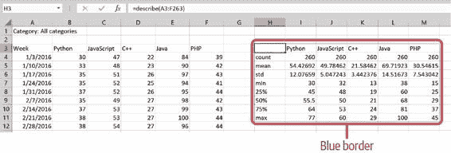

图 12-5。带动态数组的`describe`函数

然而，如果你使用的是不支持动态数组的 Excel 版本，看起来就好像什么也没有发生：默认情况下，公式只会返回 H3 单元格的左上角，即空白。要解决这个问题，使用微软现在称之为传统 CSE 数组。CSE 数组需要通过键入 Ctrl+Shift+Enter 来确认，而不是仅仅按 Enter 键——因此得名。让我们详细看看它们的工作原理：

+   > > > > 确保 H3 是一个空单元格，通过选择它并按 Delete 键。
+   > > > > 
+   > > > > 通过从单元格 H3 开始选择输出范围，然后选择所有通向 M11 的单元格。
+   > > > > 
+   > > > > 选中范围 H3:M11，输入公式`=describe(A3:F263)`，然后按 Ctrl+Shift+Enter 确认。

现在你应该看到与图 12-5 几乎相同的图片，但有以下几点不同：

+   > > > > 在范围 H3:M11 周围没有蓝色边框。
+   > > > > 
+   > > > > 该公式显示大括号以标记为 CSE 数组：`{=describe(A3:F263)}`。
+   > > > > 
+   > > > > 要删除动态数组，只需转到左上角单元格，然后按 Delete 键即可，而对于 CSE 数组，则始终需要先选择整个数组才能删除它。

现在让我们通过引入一个名为`selection`的可选参数来稍微改进我们的函数，这将允许我们指定在输出中包含哪些列。如果你有很多列，但只想在`describe`函数中包含一个子集，这将成为一个有用的功能。按以下方式更改函数：

> `@xw.func``@xw.arg``(``"df"``,``pd``.``DataFrame``)``def``describe``(``df``,``selection``=``None``):``如果``selection``不为``None``：``return``df``.``loc``[:,``selection``]``.``describe``()``否则``：``return``df``.``describe``()`


> > 我省略了`index`和`header`参数，因为它们使用默认值，但随时可以保留它们。


> > 添加参数 `selection` 并将其默认值设置为 `None` 以使其可选。


> > 如果提供了 `selection`，则根据它过滤 DataFrame 的列。

一旦您更改了函数，请确保保存，并在 xlwings 加载项中点击导入函数按钮 —— 这是必需的，因为我们添加了一个新参数。将 `Selection` 写入单元格 A2，并将 `TRUE` 写入单元格 B2:F2。最后，根据是否使用动态数组，调整单元格 H3 中的公式：

对于动态数组

> > 选择 H3，然后将公式更改为 `=describe(A3:F263, B2:F2)` 并按 Enter 键。

对于非动态数组

> > 从单元格 H3 开始，选择 H3:M11，然后按 F2 以激活单元格 H3 的编辑模式，并将公式更改为 `=describe(A3:F263, B2:F2)`。最后，按 Ctrl+Shift+Enter 完成。

要尝试增强函数，请将单元格 E2 中的 Java 的 `TRUE` 更改为 `FALSE`，并查看结果：使用动态数组时，您将看到表格神奇地减少了一列。然而，对于传统的 CSE 数组，您将得到一个充满 `#N/A` 值的丑陋列，如 图 12-6 所示。

为了解决这个问题，xlwings 可以通过使用返回装饰器来调整传统的 CSE 数组。通过修改函数如下添加它：

> `@xw.func``@xw.arg``(``"df"``,``pd``.``DataFrame``)``@xw.ret``(``expand``=``"table"``)``def``describe``(``df``,``selection``=``None``):``if``selection``is``not``None``:``return``df``.``loc``[:,``selection``]``.``describe``()``else``:``return``df``.``describe``()`


> > 通过添加返回装饰器并设置 `expand="table"` 选项，xlwings 将调整 CSE 数组的大小以匹配返回的 DataFrame 的维度。

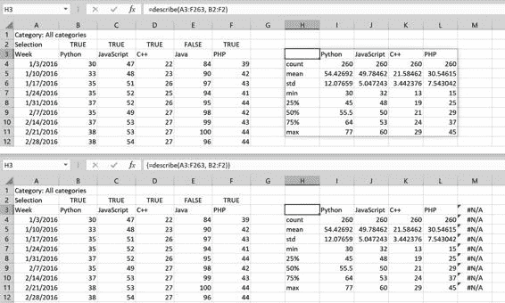

图 12-6\. 动态数组（顶部）与 CSE 数组（底部）在排除列后的比较

添加返回装饰器后，在保存 Python 源文件后，切换到 Excel，并按下 Ctrl+Alt+F9 进行重新计算：这将调整 CSE 数组的大小并移除 `#N/A` 列。由于这是一种变通方法，强烈建议您尽一切可能获取支持动态数组的 Excel 版本。

> 函数装饰器的顺序
> 
> 确保将 `xw.func` 装饰器放在 `xw.arg` 和 `xw.ret` 装饰器之上；注意 `xw.arg` 和 `xw.ret` 的顺序无关紧要。

返回装饰器在概念上与参数装饰器相同，唯一的区别在于您无需指定参数的名称。其形式上的语法如下：

> `@xw.ret``(``convert``=``None``,``option1``=``value1``,``option2``=``value2``,``...``)`

通常情况下，不需要提供显式的 `convert` 参数，因为 xlwings 会自动识别返回值的类型，这与我们在 第九章 中在写入 Excel 值时使用 `options` 方法时看到的行为相同。

例如，如果您想要抑制返回的 DataFrame 的索引，请使用此装饰器：

> `@xw.ret``(``index``=``False``)`
> 
> 动态数组
> 
> 在了解了`describe`函数中动态数组的工作原理之后，我确信您会同意它们是 Microsoft Excel 中微软最近引入的最基础和最令人兴奋的功能之一。它们在 2020 年正式向使用最新版本 Excel 的 Microsoft 365 订阅用户介绍。要查看您的版本是否足够新，请检查是否存在新的`UNIQUE`函数：在单元格中开始键入`=UNIQUE`，如果 Excel 建议函数名称，则支持动态数组。如果您使用的是永久许可证的 Excel 而不是 Microsoft 365 订阅的一部分，则很可能在 2021 年发布的版本中获得支持，并且该版本可能称为 Office 2021\. 这里有关动态数组行为的一些技术注释：
> 
+   > > > > 如果动态数组用值覆盖单元格，则会出现`#SPILL!`错误。通过删除或移动挡住动态数组的单元格来为动态数组腾出空间后，数组将被写出。请注意，带有`expand="table"`的 xlwings 返回装饰器较不智能，并且会在没有警告的情况下覆盖现有单元格值！
+   > > > > 
+   > > > > 您可以通过使用左上角单元格后跟`#`号来引用动态数组的范围。例如，如果您的动态数组位于 A1:B2 范围内，并且您希望对所有单元格求和，写入`=SUM(A1#)`。
+   > > > > 
+   > > > > 如果您希望您的数组再次像传统的 CSE 数组一样工作，请在公式前面加上`@`符号，例如，要使矩阵乘法返回传统的 CSE 数组，请使用`=@MMULT()`。

下载 CSV 文件并将值复制/粘贴到 Excel 文件中对于这个介绍性的 DataFrame 示例效果很好，但是复制/粘贴是一个容易出错的过程，你会想尽可能地摆脱它。使用 Google 趋势，您确实可以这样做，接下来的部分将向您展示如何！

从谷歌趋势获取数据

前面的例子都非常简单，基本上只是包装了一个 pandas 函数。为了获取更真实的案例，让我们创建一个 UDF，直接从 Google Trends 下载数据，这样您就不必在线手动下载 CSV 文件了。Google Trends 没有官方的 API（应用程序编程接口），但有一个名为 [pytrends](https://oreil.ly/SvnLl) 的 Python 包填补了这个空白。并非官方 API 意味着 Google 随时可能更改它，所以这一部分的示例有停止工作的风险。然而，考虑到 pytrends 在撰写本文时已经存在了五年多，也有可能会更新以反映这些变化并使其再次可用。无论如何，它都是一个很好的例子，向您展示几乎任何事情都有 Python 包——这是我在 第一章 中提到的。如果您被限制使用 Power Query，您可能需要投入更多时间才能使其正常工作——至少我找不到一个免费提供的即插即用解决方案。由于 pytrends 不是 Anaconda 的一部分，也没有官方的 Conda 包，所以让我们用 pip 安装它，如果您还没有这样做的话：

> `(base)>` `pip install pytrends`

要复制在线版谷歌趋势中显示的确切情况，如 图 12-4 所示，我们需要找到带有“编程语言”上下文的正确标识符。为此，pytrends 可以打印出谷歌趋势在下拉菜单中建议的不同搜索上下文或类型。在以下代码示例中，`mid` 代表机器 ID，这就是我们要找的 ID：

> `In``[``4``]:``从``pytrends.request``导入``TrendReq`
> 
> `In``[``5``]:``# 首先，让我们实例化一个 TrendRequest 对象``trend``=``TrendReq``()`
> 
> `In``[``6``]:``# 现在我们可以打印出谷歌趋势搜索框中键入`"Python"`后出现的建议`
> 
> `Out[6]: [{'mid': '/m/05z1_', 'title': 'Python', 'type': 'Programming language'},          {'mid': '/m/05tb5', 'title': 'Python family', 'type': 'Snake'},          {'mid': '/m/0cv6_m', 'title': 'Pythons', 'type': 'Snake'},          {'mid': '/m/06bxxb', 'title': 'CPython', 'type': 'Topic'},          {'mid': '/g/1q6j3gsvm', 'title': 'python', 'type': 'Topic'}]`

对其他编程语言重复此操作允许我们检索出所有正确的 `mid`，并且我们可以按照 Example 12-3 中显示的方式编写 UDF。您可以在同伴存储库的 google_trends 文件夹中的 udfs 文件夹中找到源代码。

Example 12-3\. 在 google_trends.py 中的 `get_interest_over_time` 函数（包含相关的导入语句片段）

`import``pandas``as``pd``from``pytrends.request``import``TrendReq``import``xlwings``as``xw``@xw.func``(``call_in_wizard``=``False``)``@xw.arg``(``"mids"``,``doc``=``"机器 ID：最多 5 个单元格的范围"``)``@xw.arg``(``"start_date"``,``doc``=``"日期格式的单元格"``)``@xw.arg``(``"end_date"``,``doc``=``"日期格式的单元格"``)``def``get_interest_over_time``(``mids``,``start_date``,``end_date``):``"""查询 Google Trends - 替换返回值中的常见编程语言的机器 ID（mid）为其人类可读等效形式，例如，代替"/m/05z1_"，返回"Python"。"""``# 检查和转换参数``assert``len``(``mids``)``<=``5``,``"mids 过多（最多：5 个）"```start_date``=``start_date``.``date``()``.``isoformat``()```end_date``=``end_date``.``date``()``.``isoformat``()``# 进行 Google Trends 请求并返回 DataFrame``trend``=``TrendReq``(``timeout``=``10``)``trend``.``build_payload``(``kw_list``=``mids``,``timeframe``=``f``"{start_date} {end_date}"``)``df``=``trend``.``interest_over_time``()``# 用人类可读词替换 Google 的"mid"``mids``=``{``"/m/05z1_"``:``"Python"``,``"/m/02p97"``:``"JavaScript"``,``"/m/0jgqg"``:``"C++"``,``"/m/07sbkfb"``:``"Java"``,``"/m/060kv"``:``"PHP"``}``df``=``df``.``rename``(``columns``=``mids``)``# 删除 isPartial 列``return``df``.``drop``(``columns``=``"isPartial"``)`


> > 默认情况下，当您在函数向导中打开 Excel 时，它会调用该函数。由于这可能会使其变慢，特别是涉及 API 请求时，我们将其关闭。


> > 可选地，为函数参数添加文档字符串，在您编辑相应参数时将显示在函数向导中，如图 12-8。


> > 函数的文档字符串显示在函数向导中，如图 12-8。


> > `assert`语句是在用户提供了太多`mids`时引发错误的简便方式。Google Trends 每次查询最多允许五个`mids`。


> > pytrends 期望的开始和结束日期是一个形如`YYYY-MM-DD YYYY-MM-DD`的字符串。因为我们提供的是日期格式的单元格作为开始和结束日期，它们将作为`datetime`对象到达。在它们上调用`date`和`isoformat`方法将正确地格式化它们。


> > 我们正在实例化一个 pytrends 的`request`对象。通过将`timeout`设置为十秒，我们减少了看到`requests.exceptions.ReadTimeout`错误的风险，这种错误偶尔会发生，如果 Google Trends 需要更长时间来响应的话。如果仍然看到此错误，只需再次运行函数或增加超时时间。


> > 我们为请求对象提供`kw_list`和`timeframe`参数。


> > 通过调用`interest_over_time`来发出实际请求，它将返回一个 pandas DataFrame。


> > 我们使用其可读的人类等价物重新命名`mids`。


> > 最后一列称为`isPartial`。`True`表示当前间隔（例如一周）仍在进行中，因此尚未完全具备所有数据。为了保持简单并与在线版本保持一致，我们在返回 DataFrame 时删除此列。

现在从伴随存储库中打开`google_trends.xlsm`，在`xlwings`加载项中单击“导入函数”，然后从单元格 A4 中调用`get_interest_over_time`函数，如图 12-7 所示。

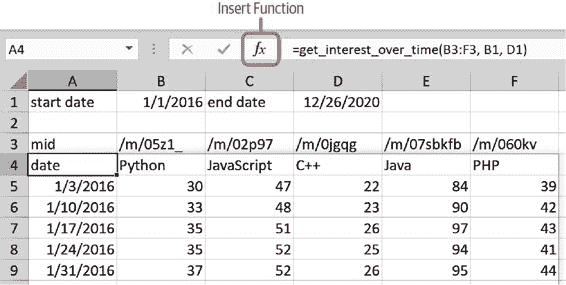

图 12-7\. `google_trends.xlsm`

若要获取有关函数参数的帮助，请在选择单元格 A4 时，单击公式栏左侧的“插入函数”按钮：这将打开函数向导，在其中您将在`xlwings`类别下找到您的 UDFs。选择`get_interest_over_time`后，您将看到函数参数的名称以及作为函数描述的文档字符串（限制为前 256 个字符）：参见图 12-8。或者，在单元格 A4 中开始输入`=get_interest_over_time(`（包括开放括号），然后再单击“插入函数”按钮，这将直接带您进入图 12-8 所示的视图。请注意，UDFs 返回未格式化的日期。要修复此问题，请右键单击日期列，选择“格式单元格”，然后在“日期”类别下选择您喜欢的格式。

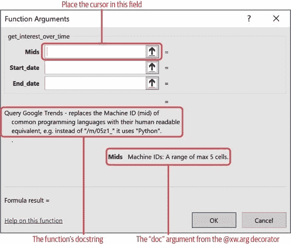

图 12-8\. 函数向导

如果您仔细观察图 12-7，您可以通过结果数组周围的蓝色边框判断我再次使用了动态数组。由于截图在底部被裁剪，数组从左侧开始，因此您仅能看到从单元格 A4 开始的顶部和右侧边界，即使它们可能在截图上也很难识别。如果您的 Excel 版本不支持动态数组，请通过在`get_interest_over_time`函数中添加以下返回装饰器来使用以下解决方法（在现有装饰器下方）：

> `@xw.ret``(``expand``=``"table"``)`

现在您已经了解如何处理更复杂的 UDFs，让我们看看如何在 UDFs 中使用图表！

使用用户定义函数绘图

正如您可能还记得来自第五章，调用 DataFrame 的`plot`方法默认返回一个 Matplotlib 图。在第九章和第十一章中，我们已经看到如何将这样的图作为图片添加到 Excel 中。当使用 UDFs 时，生成图表有一种简便的方法：看一下`google_trends.py`中的第二个函数，如示例 12-4 所示。

示例 12-4\. google_trends.py 中的`plot`函数（节选与相关导入语句）

`import``xlwings``as``xw``import``pandas``as``pd``import``matplotlib.pyplot``as``plt``@xw.func``@xw.arg``(``"df"``,``pd``.``DataFrame``)``def``plot``(``df``,``name``,``caller``):``plt``.``style``.``use``(``"seaborn"``)``if``not``df``.``empty``:``caller``.``sheet``.``pictures``.``add``(``df``.``plot``()``.``get_figure``(),``top``=``caller``.``offset``(``row_offset``=``1``)``.``top``,``left``=``caller``.``left``,``name``=``name``,``update``=``True``)``return``f``"<Plot: {name}>"`


> > `caller`参数是 xlwings 专用的参数：在从 Excel 单元格调用函数时，此参数不会暴露给用户。相反，xlwings 会在后台提供`caller`，对应于调用函数的单元格（以 xlwings `range`对象的形式）。通过使用`pictures.add`的`top`和`left`参数，可以轻松地放置图形。`name`参数将定义 Excel 中图片的名称。


> > 我们设置了`seaborn`风格，使绘图在视觉上更具吸引力。


> > 只有在 DataFrame 不为空时才调用`plot`方法。在空 DataFrame 上调用`plot`方法会引发错误。


> > `get_figure()`从 DataFrame 绘图返回 Matplotlib 图形对象，这是`pictures.add`所期望的。


> > 参数`top`和`left`仅在首次插入图时使用。提供的参数将在方便的位置放置图——即从调用此函数的单元格下一行。


> > 参数`update=True`确保重复调用函数时，将更新 Excel 中具有提供名称的现有图片，而不会更改其位置或大小。没有这个参数，xlwings 会抱怨 Excel 中已经有同名图片。


> > 虽然您不一定需要返回任何内容，但如果返回一个字符串，将大大简化您的生活：这样可以让您识别出表格中绘图函数的位置。

在 google_trends.xlsm 中，如在单元格 H3 中调用`plot`函数：

> `=``plot``(``A4``:``F263``,``"History"``)`

如果您的 Excel 版本支持动态数组，请使用`A4#`而不是`A4:F263`，使源动态化，如图 12-9 所示。

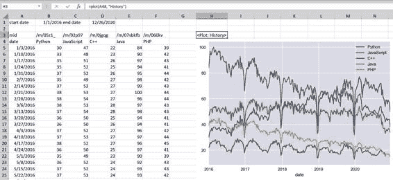

图 12-9\. `plot`函数的示例

假设你对`get_interest_over_time`函数的工作方式有些困惑。要更好地理解它的一种选择是调试代码——下一节将展示如何使用 UDFs！

调试 UDFs

调试 UDF 的简单方法是使用 `print` 函数。如果您在 xlwings 插件中启用了 Show Console 设置，则在调用 UDF 时，可以在显示的命令提示符中打印变量的值。稍微更舒适的选项是使用 VS Code 的调试器，它允许您在断点处暂停并逐行执行代码。要使用 VS Code 调试器（或任何其他 IDE 的调试器），您需要完成两件事：

1.  > > > > 在 Excel 插件中，激活复选框 Debug UDFs。这样可以防止 Excel 自动启动 Python，这意味着您需要按照下一个步骤手动进行操作。
1.  > > > > 
1.  > > > > 手动运行 Python UDF 服务器的最简单方法是在您要调试的文件的最底部添加以下几行。我已经在配套仓库的 google_trends.py 文件的底部添加了这些行：
1.  > > > > 
    > > > > `if` `__name__` `==``"__main__"``:``xw``.``serve``()`
    > > > > 
    > > > > 您可能还记得来自 第 11 章 的这个 `if` 语句，它确保代码仅在作为脚本运行文件时运行—当您将代码作为模块导入时不会运行。添加了 `serve` 命令后，通过按 F5 并选择“Python File”在 VS Code 中以调试模式运行 google_trends.py—请确保不要通过单击“Run File”按钮来运行文件，因为这将忽略断点。

通过在行号左侧单击设置断点到第 29 行。如果您不熟悉使用 VS Code 的调试器，请参阅 附录 B，我在那里详细介绍了它。现在重新计算单元格 A4，您的函数调用将在断点处停止，您可以检查变量。在调试过程中始终有帮助的是运行 `df.info()`。激活 Debug Console 标签，将 `df.info()` 写入底部提示符中，并通过按 Enter 键确认，如 Figure 12-10 所示。

> 使用 VS Code 和 ANACONDA 进行调试
> 
> 这与 第 11 章 中的相同警告相同：在 Windows 上，当您首次使用使用 pandas 的代码运行 VS Code 调试器时，您可能会遇到错误：“Exception has occurred: ImportError, Unable to import required dependencies: numpy。”这是因为调试器在 Conda 环境正确激活之前已经运行。作为解决方法，请单击停止图标停止调试器，然后再次按 F5—第二次将起作用。

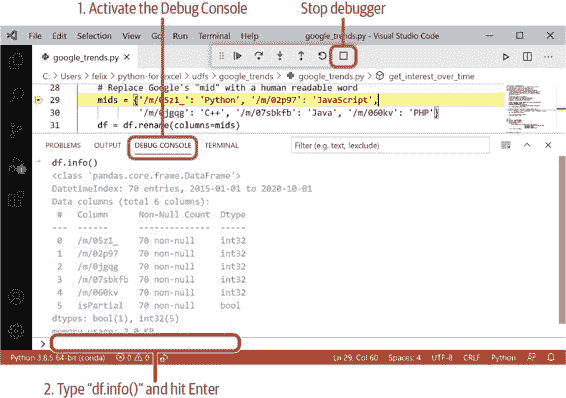

图 12-10\. 在代码暂停在断点时使用 Debug Console

如果您在断点上暂停程序超过 90 秒，Excel 将显示一个弹出窗口，提示“Microsoft Excel 正在等待另一个应用完成 OLE 操作”。这不会对您的调试体验产生影响，除非您完成调试后需要确认弹出窗口才能使其消失。要结束此调试会话，请单击 VS Code 中的停止按钮（参见图 12-10），并确保再次取消选中 xlwings 功能区插件中的 Debug UDFs 设置。如果忘记取消选中 Debug UDFs 设置，则在下次重新计算时，您的函数将返回错误。

本节通过进行 Google 趋势案例研究，向您展示了最常用的 UDF 功能。接下来的部分将涉及一些高级主题，包括 UDF 性能和`xw.sub`装饰器。

高级 UDF 主题

如果您的工作簿中使用了许多 UDF，性能可能成为一个问题。本节将从基本性能优化入手，如同我们在第九章中所见，但这次应用于 UDF。第二部分涉及缓存，这是我们可以在 UDF 中使用的额外性能优化技术。在学习的过程中，我们还将了解如何将函数参数作为 xlwings `range`对象而不是值传递。在本节的最后，我将向您介绍`xw.sub`装饰器，您可以在仅在 Windows 上工作时，作为`RunPython`调用的替代方案使用。

基本性能优化

本部分将讨论两种性能优化技术：如何最小化跨应用程序调用以及如何使用原始值转换器。

减少跨应用程序调用

正如您可能从第九章中回忆起的那样，跨应用程序调用即在 Excel 和 Python 之间进行的调用通常较慢，因此您拥有的 UDF 越少，效果越好。因此，您应尽可能使用数组工作——拥有支持动态数组的 Excel 版本肯定会使此部分更加容易。当您使用 pandas DataFrames 时，几乎不会出现问题，但在某些公式中，您可能没有自动考虑使用数组。请考虑图 12-11 的示例，该示例将总收入计算为给定基础费用加上由用户乘以价格确定的变量费用。

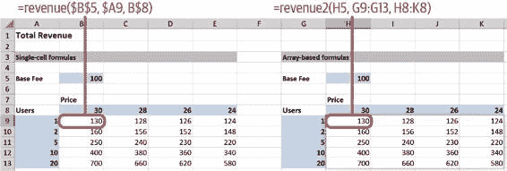

图 12-11\. 单元格公式（左）与基于数组的公式（右）

单元格公式

> > 图 12-11 中的左侧表格使用公式`=revenue($B$5, $A9, B$8)`在单元格 B9 中。然后将此公式应用于整个范围 B9:E13。这意味着您有 20 个单元格公式调用`revenue`函数。

基于数组的公式

> > 图 12-11 中的右表使用公式`=revenue2(H5, G9:G13, H8:K8)`。如果您的 Excel 版本没有动态数组，您需要向`revenue2`函数添加装饰器`xw.ret(expand="table")`或者通过选择 H9:K13，按 F2 编辑公式，并使用 Ctrl+Shift+Enter 确认将数组转换为传统的 CSE 数组。与单元格公式不同，此版本仅调用一次`revenue2`函数。

您可以在示例 12-5 中查看两个 UDF 的 Python 代码，并且您将在伴随存储库的 udfs 目录中的 revenues 文件夹中找到源文件。

示例 12-5\. revenues.py

`import``numpy``as``np``import``xlwings``as``xw``@xw.func``def``revenue``(``base_fee``,``users``,``price``):``return``base_fee``+``users``*``price``@xw.func``@xw.arg``(``"users"``,``np``.``array``,``ndim``=``2``)``@xw.arg``(``"price"``,``np``.``array``)``def``revenue2``(``base_fee``,``users``,``price``):``return``base_fee``+``users``*``price`

当您在单元格 B5 或 H5 中更改基本费用时，您将看到右侧示例比左侧示例快得多。Python 函数中的差异很小，只在参数装饰器中有所不同：基于数组的版本将`users`和`prices`作为 NumPy 数组读取进来——这里唯一的注意事项是通过在参数装饰器中设置`ndim=2`将`users`读入为二维列向量。您可能还记得，NumPy 数组类似于 DataFrames，但没有索引或标题，并且只有一种数据类型，但如果您需要更详细的复习，请再看一下第 4 章。

使用原始值

使用原始值意味着您略去了 xlwings 在 pywin32 之上执行的数据准备和清理步骤，xlwings 对 Windows 的依赖。例如，这意味着您不能再直接使用 DataFrames，因为 pywin32 不理解它们，但如果您使用列表或 NumPy 数组，则可能不是问题。要使用带有原始值的 UDFs，请在参数或返回装饰器中使用字符串`raw`作为`convert`参数。这相当于通过 xlwings `range`对象的`options`方法使用`raw`转换器，正如我们在第 9 章中所做的那样。与我们当时看到的情况一致，您将在写入操作期间获得最大的速度提升。例如，如果不使用返回装饰器调用以下函数，它在我的笔记本电脑上会慢大约三倍：

> `import``numpy``as``np``import``xlwings``as``xw``@xw.func``@xw.ret``(``"raw"``)``def``randn``(``i``=``1000``,``j``=``1000``):``"""返回一个维度为（i，j）的数组，其中包含由 NumPy 的 random.randn 提供的正态分布伪随机数"""``return``np``.``random``.``randn``(``i``,``j``)`

你将在伴随的存储库中的`udfs`目录下的`raw_values`文件夹中找到相应的示例。在使用 UDF 时，你有另一个简单的选项来提高性能：通过缓存其结果来防止重复计算缓慢函数。

缓存

当你调用一个确定性函数时，即给定相同输入时总是返回相同输出的函数，你可以将结果存储在缓存中：函数的重复调用不再需要等待缓慢的计算，而是可以从缓存中获取已经预先计算好的结果。这最好通过一个简短的例子来解释。一个非常基本的缓存机制可以用字典编程：

> `In [7]: import time`
> 
> `In [8]: cache = {} def slow_sum(a, b): key = (a, b) if key in cache: return cache[key] else: time.sleep(2) # sleep for 2 seconds result = a + b cache[key] = result return result`

当你第一次调用这个函数时，`cache`是空的。因此代码将执行模拟缓慢计算的人工两秒暂停的`else`子句。执行计算后，它将结果添加到`cache`字典中，然后返回结果。当你在同一个 Python 会话中第二次调用具有相同参数的这个函数时，它将在`cache`中找到并立即返回它，而不需要再次执行缓慢的计算。根据其参数缓存结果也称为记忆化。因此，当你第一次和第二次调用函数时，你将看到时间差异：

> `In [9]: %%time slow_sum(1, 2)`
> 
> `Wall time: 2.01 s`
> 
> `Out[9]: 3`
> 
> `In [10]: %%time slow_sum(1, 2)`
> 
> `Wall time: 0 ns`
> 
> `Out[10]: 3`

Python 中有一个内置的装饰器称为`lru_cache`，可以极大地简化你的生活，并且你可以从标准库的`functools`模块中导入它。`lru`代表最近最少使用缓存，意味着它在丢弃最旧的条目之前可以保存最大数量的结果（默认为 128）。我们可以在上一节的 Google 趋势示例中使用它。只要我们只查询历史值，我们就可以安全地缓存结果。这不仅会加快多次调用的速度，还会减少发送给 Google 的请求量，从而降低在短时间内发送过多请求而被 Google 封锁的风险。

下面是`get_interest_over_time`函数的前几行，应用缓存所需的更改：

> `from``functools``import``lru_cache``import``pandas``as``pd``from``pytrends.request``import``TrendReq``import``matplotlib.pyplot``as``plt``import``xlwings``as``xw``@lru_cache``@xw.func``(``call_in_wizard``=``False``)``@xw.arg``(``"mids"``,``xw``.``Range``,``doc``=``"Machine IDs: A range of max 5 cells"``)``@xw.arg``(``"start_date"``,``doc``=``"A date-formatted cell"``)``@xw.arg``(``"end_date"``,``doc``=``"A date-formatted cell"``)``def``get_interest_over_time``(``mids``,``start_date``,``end_date``):``"""Query Google Trends - replaces the Machine ID (mid) of     common programming languages with their human-readable     equivalent in the return value, e.g., instead of "/m/05z1_"     it returns "Python".     """``mids``=``mids``.``value`


> > 导入`lru_cache`装饰器。


> > 使用装饰器。装饰器必须位于`xw.func`装饰器的顶部。


> > 默认情况下，`mids`是一个列表。在这种情况下会出现问题，因为将列表作为参数的函数无法被缓存。根本问题在于列表是可变对象，不能作为字典中的键使用；有关可变与不可变对象的更多信息，请参见附录 C。使用`xw.Range`转换器允许我们将`mids`作为 xlwings 的`range`对象检索，而不是作为列表，从而解决了我们的问题。


> > 为了使其余代码再次正常工作，现在我们需要通过 xlwings 的`range`对象的`value`属性获取值。
> > 
> 使用不同版本的 Python 进行缓存
> 
> 如果您使用的是低于 3.8 版本的 Python，则必须像这样使用带括号的装饰器：`@lru_cache()`。如果您使用的是 Python 3.9 或更高版本，请用`@cache`替换`@lru_cache`，这等同于`@lru_cache(maxsize=None)`，即缓存永不删除旧值。您还需要从`functools`导入`cache`装饰器。

`xw.Range`转换器在其他情况下也可能很有用，例如，如果您需要访问单元格公式而不是 UDF 中的值。在前面的示例中，您可以编写`mids.formula`来访问单元格的公式。您可以在同伴存储库的 udfs 目录中的 google_trends_cache 文件夹中找到完整的示例。

现在您已经了解如何调整 UDF 的性能，让我们通过介绍`xw.sub`装饰器来结束本节。

子装饰器

在 第 10 章 中，我向您展示了如何通过激活“使用 UDF 服务器”设置来加速 `RunPython` 调用。如果您生活在仅限 Windows 的世界中，`RunPython`/`使用 UDF 服务器` 组合的替代方案是 `xw.sub` 装饰器。这将允许您将 Python 函数作为 Sub 程序导入到 Excel 中，而无需手动编写任何 `RunPython` 调用。在 Excel 中，您需要一个 Sub 程序才能将其附加到按钮上 —— 使用 `xw.func` 装饰器时获得的 Excel 函数将不起作用。要尝试这个功能，请创建一个名为 `importsub` 的新的 `quickstart` 项目。像往常一样，请确保首先 `cd` 到要创建项目的目录中：

> `(base)>` `xlwings quickstart importsub`

在文件资源管理器中，导航到创建的 importsub 文件夹，并在 Excel 中打开 importsub.xlsm，在 VS Code 中打开 importsub.py，然后按照 示例 12-6 中所示，用 `@xw.sub` 装饰 `main` 函数。

示例 12-6\. importsub.py（摘录）

`import``xlwings``as``xw``@xw.sub``def``main``():``wb``=``xw``.``Book``.``caller``()``sheet``=``wb``.``sheets``[``0``]``if``sheet``[``"A1"``]``.``value``==``"Hello xlwings!"``:``sheet``[``"A1"``]``.``value``=``"Bye xlwings!"``else``:``sheet``[``"A1"``]``.``value``=``"Hello xlwings!"`

在 xlwings 加载项中，单击导入函数，然后按 Alt+F8 查看可用的宏：除了使用 `RunPython` 的 `SampleCall` 外，现在还会看到一个名为 `main` 的宏。选择它，然后单击“运行”按钮 —— 您将在单元格 A1 中看到熟悉的问候语。现在，您可以继续将 `main` 宏分配给按钮，就像我们在 第 10 章 中所做的那样。虽然 `xw.sub` 装饰器可以在 Windows 上简化您的生活，但请记住，使用它会丧失跨平台兼容性。通过 `xw.sub`，我们已经介绍了所有 xlwings 装饰器 —— 我再次在 表 12-1 中对它们进行了总结。

表 12-1\. xlwings 装饰器

|  装饰器  |  描述  |
| --- | --- |
|   `xw.func` |  将此装饰器放在您希望作为 Excel 函数导入的所有函数的顶部。  |
|   `xw.sub` |  将此装饰器放在您希望作为 Excel Sub 程序导入的所有函数的顶部。  |
|   `xw.arg` |  应用转换器和选项到参数，例如，通过 `doc` 参数添加文档字符串，或者通过将 `pd.DataFrame` 作为第一个参数来将范围作为 DataFrame 传入（这假设您已将 pandas 导入为 pd）。 |
|   `xw.ret` |  应用转换器和选项以返回值，例如，通过提供 `index=False` 来抑制 DataFrame 的索引。 |

欲了解更多有关这些装饰器的详细信息，请参阅 [xlwings 文档](https://oreil.ly/h-sT_)。

结论

本章是关于编写 Python 函数并将其导入 Excel 作为 UDFs，使您能够通过单元格公式调用它们。通过通过 Google Trends 案例研究来影响函数参数和返回值的行为，您学会了如何使用`arg`和`ret`装饰器分别来影响函数参数和返回值的行为。最后一部分向您展示了一些性能技巧，并介绍了`xw.sub`装饰器，如果您仅在 Windows 上工作，您可以将其用作`RunPython`的替代方案。使用 Python 编写 UDFs 的好处之一是，这使您可以将长而复杂的单元格公式替换为更容易理解和维护的 Python 代码。我的首选 UDFs 工作方式肯定是使用 pandas DataFrames 与 Excel 的新动态数组，这种组合使得处理来自 Google Trends 的数据（即具有动态行数的 DataFrames）变得容易。

就是这样了——我们已经到达了书的结尾！非常感谢您对我对于现代化的 Excel 自动化和数据分析环境的诠释感兴趣！我的想法是向您介绍 Python 世界及其强大的开源包，使您能够为下一个项目编写 Python 代码，而不必处理 Excel 的自身解决方案，如 VBA 或 Power Query，从而保持一扇通向轻松摆脱 Excel 的大门。我希望我能为您提供一些实用例子，以使您的起步更加容易。阅读完本书后，您现在知道如何：

+   > > > > 将 Excel 工作簿替换为 Jupyter 笔记本和 pandas 代码
+   > > > > 
+   > > > > 使用 OpenPyXL、xlrd、pyxlsb 或 xlwings 读取 Excel 工作簿，然后通过 pandas 合并它们，批处理 Excel 工作簿
+   > > > > 
+   > > > > 使用 OpenPyXL、XlsxWriter、xlwt 或 xlwings 生成 Excel 报告
+   > > > > 
+   > > > > 使用 Excel 作为前端，并通过 xlwings 将其连接到几乎任何您想要的内容，无论是通过点击按钮还是编写 UDF

不久之后，你将会想要超越本书的范围。我邀请你不时查看[书籍主页](https://xlwings.org/book)以获取更新和额外材料。本着这种精神，这里有一些你可以自行探索的想法：

+   > > > > 使用 Windows 任务计划程序或 macOS 或 Linux 上的 cron 作业定期运行 Python 脚本。例如，您可以每个星期五基于从 REST API 或数据库获取的数据创建一个 Excel 报告。
+   > > > > 
+   > > > > 编写一个 Python 脚本，当您 Excel 文件中的值满足某个条件时发送电子邮件提醒。也许是当您从多个工作簿合并的账户余额低于某个值时，或者当它显示与您内部数据库预期值不符的值时。
+   > > > > 
+   > > > > 编写可以找出 Excel 工作簿中错误的代码：检查诸如 `#REF!` 或 `#VALUE!` 的单元格错误，或逻辑错误，例如确保公式包括了所有应包括的单元格。如果你开始用专业的版本控制系统如 Git 跟踪你的关键工作簿，甚至可以在每次提交新版本时自动运行这些测试。

如果这本书激励你自动化每日或每周下载数据并粘贴到 Excel 中的例行工作，我会感到非常高兴。自动化不仅可以节省你的时间，还能大大减少出错的几率。如果你有任何反馈，请告诉我！你可以通过 O’Reilly、在 [伴侣仓库](https://oreil.ly/vVHmR) 上开一个问题，或在 Twitter 上联系我 [@felixzumstein](https://twitter.com/felixzumstein)。

> 1   Windows 实现使用了一个 COM 服务器（我在 第九章 中简要介绍了 COM 技术）。由于 macOS 上没有 COM，UDF 需要从头重新实现，这是一项繁重的工作，目前还没有完成。

附录 A. Conda 环境

在 第二章 中，我通过解释 Anaconda Prompt 中以 `(base)` 开头表示当前活动的 Conda 环境名称为 `base` 来介绍了 Conda 环境。Anaconda 要求你始终在激活的环境中工作，但当你在 Windows 上启动 Anaconda Prompt 或 macOS 上的 Terminal 时，`base` 环境会自动激活。使用 Conda 环境可以很好地分离项目的依赖关系：如果你想尝试一个新版本的包，比如 pandas，而不改变 `base` 环境，你可以在一个单独的 Conda 环境中这样做。在附录的第一部分中，我将向你展示如何创建一个名为 `xl38` 的 Conda 环境，我们将在其中安装我写这本书时使用的所有包的版本。这将使你能够按原样运行本书中的示例，即使其中某些包已发布了具有破坏性更改的新版本。在第二部分中，我将向你展示如何禁用 `base` 环境的自动激活，如果你不喜欢默认行为的话。

创建一个新的 Conda 环境

在 Anaconda Prompt 上运行以下命令来创建一个名为 `xl38` 的新环境，使用 Python 3.8：

> `(base)>` `conda create --name xl38 python=3.8`

按下 Enter 键时，Conda 将打印将要安装到新环境中的内容，并要求你确认：

> `继续 ([y]/n)?`

按下 Enter 键确认，或输入 `n` 取消。安装完成后，像这样激活你的新环境：

> `(base)>` `conda activate xl38` `(xl38)>`

环境名称已从`base`更改为`xl38`，现在您可以使用 Conda 或 pip 将软件包安装到这个新环境中，而不会影响任何其他环境（作为提醒：仅在 Conda 中找不到软件包时使用 pip）。让我们继续安装本书中使用的所有软件包版本。首先，请确保您处于`xl38`环境中，即 Anaconda Prompt 显示`(xl38)`，然后像这样安装 Conda 软件包（以下命令应作为单个命令输入；换行仅用于显示目的）：

> `(xl38)>` `conda install lxml=4.6.1 matplotlib=3.3.2 notebook=6.1.4 openpyxl=3.0.5                       pandas=1.1.3 pillow=8.0.1 plotly=4.14.1 flake8=3.8.4                       python-dateutil=2.8.1 requests=2.24.0 sqlalchemy=1.3.20                       xlrd=1.2.0 xlsxwriter=1.3.7 xlutils=2.0.0 xlwings=0.20.8                       xlwt=1.3.0`

确认安装计划并通过 pip 安装剩余的两个依赖项来完成环境：

> `(xl38)>` `pip install pyxlsb==1.0.7 pytrends==4.7.3` `(xl38)>`
> 
> 如何使用 XL38 环境
> 
> 如果您想要在本书中使用`xl38`环境而不是`base`环境来处理示例，请确保始终通过运行以下命令激活您的`xl38`环境：
> 
> > `(base)>` `conda activate xl38`
> > 
> 换句话说，无论我在 Anaconda 提示符中显示`(base)>`，您都需要显示`(xl38)>`。

要再次取消激活环境并返回`base`环境，请输入：

> `(xl38)>` `conda deactivate` `(base)>`

如果您想完全删除环境，请运行以下命令：

> `(base)>` `conda env remove --name xl38`

您还可以利用配套存储库的 conda 文件夹中包含的环境文件 xl38.yml，而不是手动执行创建`xl38`环境的步骤。运行以下命令将处理所有事务：

> `(base)>` `cd C:\Users\``username``\python-for-excel\conda` `(base)>` `conda env create -f xl38.yml` `(base)>` `conda activate xl38` `(xl38)>`

默认情况下，每当您在 macOS 上打开终端或在 Windows 上打开 Anaconda 提示符时，Anaconda 总是激活`base`环境。如果您不喜欢这样做，您可以按照我将向您展示的步骤禁用自动激活。

禁用自动激活

如果您不希望每次启动 Anaconda 提示符时自动激活`base`环境，您可以禁用它：这将要求您在使用 Python 之前在命令提示符（Windows）或终端（macOS）上手动输入`conda activate base`。

Windows

> > 在 Windows 上，您需要在普通命令提示符中使用，而不是 Anaconda 提示符。以下步骤将在正常的命令提示符中启用`conda`命令。确保在第一行中替换 Anaconda 在您系统上安装的路径：
> > 
> > `>` `cd C:\Users\``username``\Anaconda3\condabin` `>` `conda init cmd.exe`
> > 
> > 现在您的常规命令提示符已经设置为 Conda，因此以后您可以像这样激活 `base` 环境：
> > 
> > `>` `conda activate base` `(base)>`

macOS

> > 在 macOS 上，只需在终端中运行以下命令即可禁用自动激活：
> > 
> > `(base)>` `conda config --set auto_activate_base false`
> > 
> > 如果您希望恢复，再次运行相同命令并使用 `true` 替换 `false`。更改将在重新启动终端后生效。未来，您需要在使用 `python` 命令之前激活 `base` 环境：
> > 
> > `>` `conda activate base` `(base)>`

附录 B. 高级 VS Code 功能

本附录向您展示了在 VS Code 中调试器的工作原理以及如何直接从 VS Code 中运行 Jupyter 笔记本。这些主题是彼此独立的，因此您可以按任意顺序阅读它们。

调试器

如果您曾经在 Excel 中使用 VBA 调试器，我有个好消息：使用 VS Code 进行调试非常类似。让我们从在 VS Code 中打开伴随仓库中的 debugging.py 文件开始。点击第 4 行行号左侧的边距，以便出现一个红点—这是代码执行将暂停的断点。现在按 F5 开始调试：命令面板将显示一组调试配置选项。选择“Python 文件”以调试活动文件并运行代码直到达到断点。该行将被突出显示，并且代码执行暂停，请参见 图 B-1。在调试过程中，状态栏将变为橙色。

如果“变量”部分未自动显示在左侧，请确保单击“运行”菜单以查看变量的值。或者，您还可以将鼠标悬停在源代码中的变量上，并获取带有其值的工具提示。在顶部，您将看到调试工具栏，依次提供以下按钮：继续、跳过、步入、步出、重启和停止。当您将鼠标悬停在它们上方时，还将看到键盘快捷键。

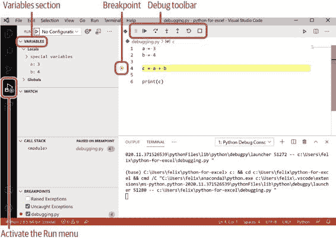

图 B-1\. VS Code 调试器在断点处停止

让我们看看每个按钮的功能：

继续

> > 这将继续运行程序，直到它达到下一个断点或程序结束。如果它到达程序的末尾，调试过程将停止。

跳过

> > 调试器将前进一行。"跳过" 意味着调试器不会在当前范围内的代码行上逐行步进。例如，它不会逐行步进调用的函数的代码—但函数仍将被调用！

步入

> > 如果您的代码调用了函数或类等，"步入" 将导致调试器进入该函数或类。如果函数或类位于不同文件中，则调试器将为您打开此文件。

步出

> > 如果使用“步进入”进入了函数，则“步进出”会导致调试器返回到下一个更高级别，直到最终返回到最初调用“步进入”的最高级别。

重新启动

> > 这将停止当前的调试过程并从头开始新的调试。

停止

> > 这将停止当前的调试过程。

现在您知道每个按钮的作用，请点击“步进”以推进一行并查看变量 `c` 如何出现在“变量”部分中，然后通过点击“继续”来完成此调试练习。

如果您保存了调试配置，命令面板将不会弹出并在每次按 F5 时询问您配置：点击活动栏中的运行图标，然后点击“创建一个 launch.json 文件”。这将导致命令面板再次显示，并且当您选择“Python 文件”时，它会在名为 .vscode 的目录下创建 launch.json 文件。现在再次按 F5，调试器将立即启动。如果您需要更改配置或想再次弹出命令面板，请编辑或删除 .vscode 目录中的 launch.json 文件。

VS Code 中的 Jupyter 笔记本

您也可以直接在 VS Code 中运行 Jupyter 笔记本，而不是在 Web 浏览器中运行它们。除此之外，VS Code 还提供了便捷的变量资源管理器，并提供将笔记本转换为标准 Python 文件的选项，而不会丢失单元格功能。这使得使用调试器或在不同笔记本之间复制/粘贴单元格变得更加容易。让我们通过在 VS Code 中运行笔记本来开始吧！

运行 Jupyter 笔记本

点击活动栏上的资源管理器图标，从伴随存储库中打开 ch05.ipynb。要继续，请点击弹出的通知中的“信任”。笔记本的布局看起来与浏览器中的略有不同，以匹配 VS Code 的其余部分，但除此之外，体验完全相同，包括所有键盘快捷键。让我们通过 Shift+Enter 运行前三个单元格。这将启动 Jupyter 笔记本服务器（如果尚未运行，您将在笔记本的右上方看到状态）。运行单元格后，点击笔记本顶部菜单中的计算器按钮：这将打开变量资源管理器，在其中您可以查看当前存在的所有变量的值，如 图 B-2。也就是说，您只会找到已运行单元格中的变量。

> 在 VS Code 中保存 Jupyter 笔记本
> 
> 要在 VS Code 中保存笔记本，您需要使用笔记本顶部的“保存”按钮，或在 Windows 上按 Ctrl+S，macOS 上按 Command-S。File > Save 不起作用。

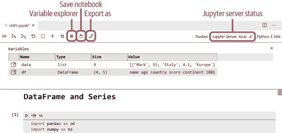

图 B-2\. Jupyter 笔记本变量资源管理器

如果您使用像嵌套列表、NumPy 数组或数据框等数据结构，您可以双击变量：这将打开数据查看器，并为您提供熟悉的类似电子表格的视图。双击 `df` 变量后，图 B-3 显示了数据查看器的内容。

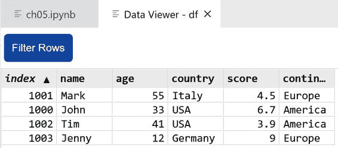

图 B-3\. Jupyter 笔记本数据查看器

虽然 VS Code 允许您运行标准的 Jupyter 笔记本文件，但它也允许您将笔记本转换为普通的 Python 文件——而不会丢失您的单元格。让我们看看它是如何工作的！

使用带有代码单元格的 Python 脚本

要在标准 Python 文件中使用 Jupyter 笔记本单元格，VS Code 使用特殊注释来标记单元格：`# %%`。要转换现有的 Jupyter 笔记本，请打开它并点击笔记本顶部菜单中的“导出”按钮；参见 图 B-2。这将允许您从命令面板中选择“Python 文件”。但是，与其转换现有文件，不如创建一个名为 `cells.py` 的新文件，并包含以下内容：

> `# %%``3``+``4``# %% [markdown]``# # 这是一个标题``#``# 一些 markdown 内容`

Markdown 单元格需要以 `# %% [markdown]` 开头，并要求整个单元格被标记为注释。如果您想将这样的文件作为笔记本运行，请在悬停在第一个单元格上时点击“下面运行”链接。这将打开右侧的 Python 交互窗口，如 图 B-4 所示。

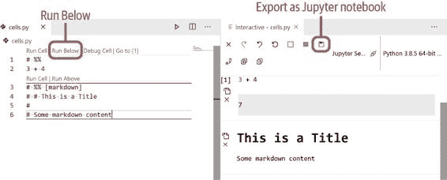

图 B-4\. Python 交互窗口

Python 交互窗口再次显示为笔记本。要以 ipynb 格式导出您的文件，请点击 Python 交互窗口顶部的保存图标（导出为 Jupyter 笔记本）。Python 交互窗口还为您提供了一个底部单元格，您可以在其中交互执行代码。与 Jupyter 笔记本相比，使用常规 Python 文件允许您使用 VS Code 调试器，并使得与版本控制的工作更加轻松，因为输出单元格（通常在版本之间添加大量噪音）将被忽略。

附录 C. 高级 Python 概念

在这个附录中，我们将更详细地探讨以下三个主题：类和对象、时区感知日期时间对象以及可变 vs. 不可变对象。这些主题是相互独立的，因此您可以按任意顺序阅读它们。

类和对象

在本节中，我们将编写自己的类以更好地理解类和对象之间的关系。类定义新的对象类型：类就像您用来烤蛋糕的烤盘。根据您使用的成分，您会得到不同的蛋糕，例如巧克力蛋糕或奶酪蛋糕。从烤模（类）中获取蛋糕（对象）的过程称为实例化，这也是为什么对象也称为类实例。无论是巧克力还是奶酪蛋糕，它们都是蛋糕的一种类型：类允许您定义保持相关数据（属性）和函数（方法）的新数据类型，并因此帮助您结构化和组织您的代码。现在让我回到来自第三章的汽车赛车游戏示例，以定义我们自己的类：

> `In``[``1``]:``class``Car``:``def` `__init__``(``self``,``color``,``speed``=``0``):``self``.``color``=``color``self``.``speed``=``speed``def``accelerate``(``self``,``mph``):``self``.``speed``+=``mph`

这是一个简单的汽车类，有两个方法。方法是类定义的一部分的函数。这个类有一个普通方法叫做 `accelerate`。这个方法会改变一个类实例的数据（`speed`）。它还有一个以双下划线开始和结束的特殊方法叫做 `__init__`。当对象初始化时，Python 会自动调用它来附加一些初始数据到对象上。每个方法的第一个参数代表类的实例，按照约定称为 `self`。当你看到如何使用 `Car` 类时，这将更清楚。首先，让我们实例化两辆汽车。你可以像调用函数一样调用类：通过添加括号并提供 `__init__` 方法的参数。你从不为 `self` 提供任何内容，因为 Python 会处理。在本示例中，`self` 将分别是 `car1` 或 `car2`：

> `In``[``2``]:``# 让我们实例化两个汽车对象``car1``=``Car``(``"red"``)``car2``=``Car``(``color``=``"blue"``)`

当你调用一个类时，实际上是在调用 `__init__` 函数，这就是为什么函数参数的一切都适用于此处：对于 `car1`，我们将参数作为位置参数提供，而对于 `car2`，我们使用关键字参数。在从 `Car` 类实例化两个汽车对象之后，我们将查看它们的属性并调用它们的方法。正如我们将看到的那样，在加速 `car1` 后，`car1` 的速度改变了，但对于 `car2` 则保持不变，因为这两个对象是彼此独立的：

> `In``[``3``]:``# 默认情况下，对象打印其内存位置``car1`
> 
> `Out[3]: <__main__.Car at 0x7fea812e3890>`
> 
> `In``[``4``]:``# 属性允许您访问对象的数据``car1``.``color`
> 
> `Out[4]: 'red'`
> 
> `In``[``5``]:``car1``.``speed`
> 
> `Out[5]: 0`
> 
> `In``[``6``]:``# 调用 car1 上的加速方法``car1``.``accelerate``(``20``)`
> 
> `In``[``7``]:``# car1 的速度属性发生了变化``car1``.``speed``
> 
> `Out[7]: 20`
> 
> `In``[``8``]:``# car2 的速度属性保持不变``car2``.``speed``
> 
> `Out[8]: 0`

Python 还允许您直接更改属性，而无需使用方法：

> `In``[``9``]:``car1``.``color``=``"green"``
> 
> `In``[``10``]:``car1``.``color``
> 
> `Out[10]: 'green'`
> 
> `In``[``11``]:``car2``.``color``# 未更改`
> 
> `Out[11]: 'blue'`

总结一下: 类定义了对象的属性和方法。类允许您将相关的函数（“方法”）和数据（“属性”）组合在一起，以便可以通过点表示法方便地访问它们: `myobject.attribute`或 `myobject.method()`。

使用时区感知的 datetime 对象

在第三章中，我们简要介绍了无时区感知的 datetime 对象。如果时区很重要，通常在 UTC 时区中工作，仅在显示目的时转换为本地时区。UTC 代表协调世界时，是格林威治平均时间（GMT）的后继者。在使用 Excel 和 Python 时，您可能希望将 Excel 提供的无时区时间戳转换为时区感知的 datetime 对象。在 Python 中支持时区时，可以使用 dateutil 包，它不是标准库的一部分，但已预装在 Anaconda 中。以下示例展示了在处理 datetime 对象和时区时的几种常见操作：

> `In``[``12``]:``import``datetime``as``dt``from``dateutil``import``tz``
> 
> `In``[``13``]:``# 无时区的 datetime 对象``timestamp``=``dt``.``datetime``(``2020``,``1``,``31``,``14``,``30``)``timestamp``.``isoformat``()``
> 
> `Out[13]: '2020-01-31T14:30:00'`
> 
> `In``[``14``]:``# 时区感知的 datetime 对象``timestamp_eastern``=``dt``.``datetime``(``2020``,``1``,``31``,``14``,``30``,``tzinfo``=``tz``.``gettz``(``"US/Eastern"``))``# 使用 isoformat 打印使其易于``# 看出与 UTC 的偏移``timestamp_eastern``.``isoformat``()``
> 
> `Out[14]: '2020-01-31T14:30:00-05:00'`
> 
> `In``[``15``]:``# 将时区分配给无时区的 datetime 对象``timestamp_eastern``=``timestamp``.``replace``(``tzinfo``=``tz``.``gettz``(``"US/Eastern"``))``timestamp_eastern``.``isoformat``()`
> 
> `Out[15]: '2020-01-31T14:30:00-05:00'`
> 
> `In``[``16``]:``# 从一个时区转换到另一个时区。``# 由于 UTC 时区非常常见，``# 这里有一个快捷方式: tz.UTC``timestamp_utc``=``timestamp_eastern``.``astimezone``(``tz``.``UTC``)``timestamp_utc``.``isoformat``()`
> 
> `Out[16]: '2020-01-31T19:30:00+00:00'`
> 
> `In``[``17``]:``# 从时区感知到无时区``timestamp_eastern``.``replace``(``tzinfo``=``None``)`
> 
> `Out[17]: datetime.datetime(2020, 1, 31, 14, 30)`
> 
> `In``[``18``]:``# 当前没有时区的时间``dt``.``datetime``.``now``()``
> 
> `Out[18]: datetime.datetime(2021, 1, 3, 11, 18, 37, 172170)``
> 
> `In``[``19``]:``# 当前 UTC 时区时间``dt``.``datetime``.``now``(``tz``.``UTC``)`
> 
> `Out[19]: datetime.datetime(2021, 1, 3, 10, 18, 37, 176299, tzinfo=tzutc())`
> 
> 使用 Python 3.9 处理时区
> 
> Python 3.9 在标准库中以`timezone`模块的形式添加了适当的时区支持。使用它替换来自`dateutil`的`tz.gettz`调用：
> 
> `from``zoneinfo``import``ZoneInfo``timestamp_eastern``=``dt``.``datetime``(``2020``,``1``,``31``,``14``,``30``,``tzinfo``=``ZoneInfo``(``"US/Eastern"``))`

Python 中的可变与不可变对象

在 Python 中，可以更改其值的对象称为可变对象，而不能更改的称为不可变对象。表 C-1 展示了不同数据类型的分类方式。

表 C-1\. 可变和不可变数据类型

|  可变性  |  数据类型  |
| --- | --- |
|  可变  |  列表、字典、集合  |
|  不可变  |  整数、浮点数、布尔值、字符串、日期时间、元组  |

了解这种差异很重要，因为可变对象的行为可能与您从其他语言（包括 VBA）中习惯的行为不同。看一下以下的 VBA 片段：

> `Dim``a``As``Variant``,``b``As``Variant``a``=``Array``(``1``,``2``,``3``)``b``=``a``a``(``1``)``=``22``Debug``.``Print``a``(``0``)``&``", "``&``a``(``1``)``&``", "``&``a``(``2``)``Debug``.``Print``b``(``0``)``&``", "``&``b``(``1``)``&``", "``&``b``(``2``)`

这将打印以下内容：

> `1, 22, 3 1, 2, 3`

现在让我们用一个列表在 Python 中做同样的例子：

> `In``[``20``]:``a``=``[``1``,``2``,``3``]``b``=``a``a``[``1``]``=``22``print``(``a``)``print``(``b``)``
> 
> `[1, 22, 3] [1, 22, 3]`

在这里发生了什么？在 Python 中，变量是“附加”到对象的名称。通过`b = a`，您将两个名称都附加到同一个对象上，即列表`[1, 2, 3]`。因此，附加到该对象的所有变量将显示列表的更改。但这仅适用于可变对象：如果用不可变对象（如元组）替换列表，修改`a`不会影响`b`。如果希望像`b`这样的可变对象独立于`a`的更改，则必须显式地复制列表：

> `In``[``21``]:``a``=``[``1``,``2``,``3``]``b``=``a``.``copy``()``
> 
> `In``[``22``]:``a``
> 
> `Out[22]: [1, 2, 3]`
> 
> `In``[``23``]:``b``
> 
> `Out[23]: [1, 2, 3]`
> 
> `In``[``24``]:``a``[``1``]``=``22``# 修改 "a"...
> 
> `In``[``25``]:``a``
> 
> `Out[25]: [1, 22, 3]`
> 
> `In``[``26``]:``b``# ...不会影响 "b"``
> 
> `Out[26]: [1, 2, 3]`

通过使用列表的`copy`方法，您创建的是浅拷贝：您会得到列表的一个副本，但如果列表包含可变元素，则这些元素仍然是共享的。如果您想递归地复制所有元素，则需要使用标准库中的`copy`模块进行深拷贝：

> `In``[``27``]:``import``copy``b``=``copy``.``deepcopy``(``a``)``

现在让我们看看当您将可变对象用作函数参数时会发生什么。

调用带有可变对象作为参数的函数

如果您来自 VBA，您可能习惯于将函数参数标记为传递引用(`ByRef`)或传递值(`ByVal`)：当您将变量作为参数传递给函数时，函数将具有更改它(`ByRef`)或将在值的副本上工作(`ByVal`)的能力，从而保留原始变量不变。`ByRef`是 VBA 中的默认值。考虑以下 VBA 中的函数：

> `Function``increment``(``ByRef``x``As``Integer``)``As``Integer``x``=``x``+``1``increment``=``x``End``Function`

然后，像这样调用函数：

> `Sub``call_increment``()``Dim``a``As``Integer``a``=``1``Debug``.``Print``increment``(``a``)``Debug``.``Print``a``End``Sub`

这将打印如下内容：

> `2 2`

但是，如果您将`increment`函数中的`ByRef`更改为`ByVal`，它将打印：

> `2 1`

这在 Python 中是如何工作的？当您传递变量时，您传递指向对象的名称。这意味着行为取决于对象是否可变。让我们首先使用不可变对象：

> `In``[``28``]:``def``increment``(``x``):``x``=``x``+``1``return``x`
> 
> `In``[``29``]:``a``=``1``print``(``increment``(``a``))``print``(``a``)`
> 
> `2 1`

现在让我们使用可变对象重复示例：

> `In``[``30``]:``def``increment``(``x``):``x``[``0``]``=``x``[``0``]``+``1``return``x`
> 
> `In``[``31``]:``a``=``[``1``]``print``(``increment``(``a``))``print``(``a``)`
> 
> `[2] [2]`

如果对象是可变的，并且您希望保留原始对象不变，则需要传入对象的副本：

> `In``[``32``]:``a``=``[``1``]``print``(``increment``(``a``.``copy``()))``print``(``a``)`
> 
> `[2] [1]`

另一个要注意的情况是在函数定义中使用可变对象作为默认参数的情况——让我们看看为什么！

函数中的可变对象作为默认参数

编写函数时，通常不应将可变对象用作默认参数。原因是默认参数的值仅在函数定义时评估一次，而不是在每次调用函数时。因此，将可变对象用作默认参数可能会导致意外行为：

> `In``[``33``]:``# 不要这样做：``def``add_one``(``x``=``[]):``x``.``append``(``1``)``return``x`
> 
> `In``[``34``]:``add_one``()`
> 
> `Out[34]: [1]`
> 
> `In``[``35``]:``add_one``()`
> 
> `Out[35]: [1, 1]`

如果您想使用空列表作为默认参数，请改用以下方法代替：

> `In``[``36``]:``def``add_one``(``x``=``None``):``if``x``is``None``:``x``=``[]``x``.``append``(``1``)``return``x`
> 
> `In``[``37``]:``add_one``()`
> 
> `Out[37]: [1]`
> 
> `In``[``38``]:``add_one``()`
> 
> `Out[38]: [1]`

索引

> 符号

+   %%time 单元格魔法，并行读取工作表

+   %%timeit 单元格魔法，并行读取工作表

> A

+   绝对路径，Anaconda Prompt，Backend

+   激活 Conda 环境，创建新的 Conda 环境

+   ActiveX 控件，跨平台兼容性，RunPython 函数

+   活动栏（VS Code），安装和配置

+   插件（Excel）

    +   自定义，独立工作簿：摆脱 xlwings Add-in，UDF 快速入门

    +   安装 xlwings，Excel Add-in-Excel Add-in

+   添加

    +   列到 DataFrame，通过添加新列设置数据

    +   元素到列表，列表

    +   Python 包追踪器中的包，我们将构建的内容-我们将构建的内容

+   add_package 函数（Python 包追踪器）示例，后端-后端

+   agg 方法（pandas），分组

+   aggfunc 函数（pandas），数据透视和溶解

+   模块的别名，模块和 import 语句

+   Altair，Plotly

+   Anaconda

    +   组成部分，开发环境

    +   Conda（参见 Conda）

    +   安装，安装-安装

    +   目的，开发环境

+   Anaconda Prompt

    +   命令列表，Anaconda Prompt

    +   交互式 Python 会话

        +   结束，Python REPL：交互式 Python 会话

        +   开始，Python REPL：交互式 Python 会话-Python REPL：交互式 Python 会话

    +   长文件路径，运行 Python 脚本

    +   注释，Python REPL：交互式 Python 会话

    +   操作概述，Anaconda Prompt-Anaconda Prompt

    +   目的，开发环境

    +   Python 脚本，运行，运行 Python 脚本

    +   运行

        +   在 macOS 中，Anaconda Prompt

        +   在 Windows 中，Anaconda Prompt

    +   VS Code，运行，运行 Python 脚本

    +   xlwings CLI

        +   addin install 命令，Excel Add-in

        +   目的，Excel Add-in

        +   快速启动命令，快速启动命令

+   杀毒软件，xlwings 安装与，Excel Add-in

+   应用程序编程接口（API），Web API

+   应用对象（xlwings），Excel 对象模型，Excel 对象模型，应用属性

+   追加方法（OpenPyXL），使用 OpenPyXL 进行写入

+   AppleScript，xlwings 基础

+   应用程序编程接口（API），Web API

+   应用结构（Python 包追踪器），应用结构

    +   后端，后端-后端

    +   调试，调试-调试

    +   前端，前端-前端

+   应用程序，层次结构，关注点分离-关注点分离

+   applymap 方法（pandas），应用函数-应用函数

+   arange 函数（NumPy），有用的数组构造函数

+   参数装饰器（xlwings），处理数据框和动态数组，子装饰器

+   参数，作为可变对象，将可变对象作为参数调用函数-将可变对象作为默认参数的函数

+   算术运算

    +   在数据框上，算术运算-算术运算

    +   在 NumPy 数组上，向量化和广播-向量化和广播

+   算术运算符（pandas），对应方法，算术运算

+   数组范围，有用的数组构造函数

+   基于数组的公式（xlwings），最小化跨应用程序调用

+   数组（NumPy）

    +   广播，向量化和广播-向量化和广播

    +   构造函数，有用的数组构造函数

    +   数据分析问题，结论

    +   数据类型，NumPy 数组-NumPy 数组

    +   获取和设置元素，获取和设置数组元素-获取和设置数组元素

    +   运行概览，NumPy 数组-NumPy 数组

    +   通用函数 (ufuncs)，通用函数 (ufunc)-通用函数 (ufunc)

    +   向量化，向量化和广播-向量化和广播

    +   视图与副本的区别，视图 vs. 副本-视图 vs. 副本

+   asfreq 方法 (pandas)，重采样

+   属性

    +   帮助文档，字符串

    +   目的，属性和方法, 类和对象-类和对象

+   增强赋值符号，for 和 while 循环

+   禁用 Conda 环境的自动激活，禁用自动激活

+   自动完成，Visual Studio Code

+   自适应调整方法 (xlwings)，案例研究 (再次审视)：Excel 报告

+   Excel 中的自动化 (参见 xlwings)

> B

+   后端

    +   目的，前端

    +   在 Python Package Tracker 中，后端-后端

+   编程最佳实践

    +   DRY 原则，DRY 原则

    +   关注点分离，关注点分离-关注点分离

    +   测试，测试

    +   版本控制，版本控制-版本控制

+   大数据，前言, pandas 的限制, 处理大型 Excel 文件-并行读取工作表

+   Binder, 关闭 Jupyter 笔记本

+   Bokeh，Plotly

+   Book 类 (xlwings)，Excel 对象模型

+   book object (xlwings), Excel 对象模型

+   books collection (xlwings), Excel 对象模型

+   布尔构造器，布尔值

+   布尔数据类型，布尔值-布尔值, read_excel 函数和 ExcelFile 类

+   布尔索引 (pandas)

    +   选择数据的方式，通过布尔索引选择-通过布尔索引选择

    +   通过布尔索引设置数据，通过布尔索引设置数据-通过布尔索引设置数据

+   布尔运算符，布尔值，通过布尔索引选择

+   break 语句，for 和 while 循环

+   断点（VS Code），设置，调试 UDFs

+   广播，向量化和广播-向量化和广播，算术运算

+   内置转换器（xlwings），转换器和选项

+   range 对象的内置选项（xlwings），转换器和选项

+   商业智能（参见 Power BI）

+   业务层，关注点分离

+   ByRef 函数参数（VBA），以可变对象作为参数调用函数-以可变对象作为参数调用函数

+   ByVal 函数参数（VBA），以可变对象作为参数调用函数-以可变对象作为参数调用函数

> C

+   缓存装饰器，缓存

+   缓存，缓存-缓存

+   计算，单独为其设置层级，关注点分离

+   调用函数，函数，调用函数，以可变对象作为参数调用函数-以可变对象作为默认参数的函数

+   capitalize 方法（pandas），处理文本列

+   层叠样式表（CSS），格式化数据框的数据部分

+   Case 语句（VBA），字典

+   案例研究

    +   Excel 报表，案例研究：Excel 报表-案例研究：Excel 报表，案例研究（重访）：Excel 报表，案例研究（再次重访）：Excel 报表-案例研究（再次重访）：Excel 报表

    +   Google Trends 案例研究

        +   数据框架和动态数组, 处理数据框架和动态数组-处理数据框架和动态数组

        +   调试 UDFs, 调试 UDFs-调试 UDFs

        +   Google Trends 解释, 介绍 Google Trends-介绍 Google Trends

        +   获取数据, 从 Google Trends 获取数据-从 Google Trends 获取数据

        +   绘图数据, 使用 UDFs 绘图-使用 UDFs 绘图

    +   Python 包追踪器

        +   添加包, 我们将要构建什么-我们将要构建什么

        +   应用程序结构, 应用程序结构

        +   后端, 后端-后端

        +   数据库, 数据库-SQL 注入

        +   调试, 调试-调试

        +   错误处理, 异常-异常

        +   前端, 前端-前端

        +   web APIs, Web APIs-Web APIs

+   cd 命令, Anaconda Prompt

+   单元格格式（xlwings），清除, 如何解决缺失功能-如何解决缺失功能

+   cell looping, excel.py 模块

+   cells（Jupyter 笔记本）

    +   编辑模式与命令模式, 编辑 vs. 命令模式-编辑 vs. 命令模式

    +   在 Python 脚本中, 带有代码单元的 Python 脚本

    +   运营概述, 笔记本单元-笔记本单元

    +   输出, 笔记本单元

    +   运行顺序, 运行顺序重要

+   链接索引和切片操作, 切片, 获取和设置数组元素

+   更改

    +   cell 类型（Jupyter 笔记本）, 笔记本单元

    +   目录, Anaconda Prompt

    +   列分隔符（Excel）, Excel 对象模型-Excel 对象模型

    +   到父目录，Anaconda Prompt

+   图表（Excel），透视和融合

    +   （另见图表）

    +   在 OpenPyXL 中创建，使用 OpenPyXL 写入-使用 OpenPyXL 写入

    +   在 XlsxWriter 中创建，XlsxWriter-XlsxWriter

    +   在 xlwings 中创建，Excel 图表-Excel 图表

+   类继承，现代语言特性

+   类，属性和方法

    +   实例化，datetime 类, 类和对象

    +   对象和，类和对象-类和对象

+   清除单元格格式（xlwings），如何解决缺失功能-如何解决缺失功能

+   Jupyter 笔记本的云提供商，关闭 Jupyter 笔记本

+   代码块，代码块和 pass 语句-代码块和 pass 语句

+   代码单元格（Jupyter 笔记本），笔记本单元格

+   代码命令（VS Code），运行 Python 脚本

+   集合（xlwings）

    +   图表（Excel），创建，Excel 图表-Excel 图表

    +   定义名称（Excel），创建，定义名称-定义名称

    +   图片（Excel），将 Matplotlib 绘图作为，图片：Matplotlib 绘图-图片：Matplotlib 绘图

    +   目的，Excel 对象模型

+   颜色，十六进制值，使用 OpenPyXL 写入-使用 OpenPyXL 写入

+   列（pandas）

    +   添加到 DataFrame，通过添加新列设置数据

    +   用于 DataFrames，列-列，格式化 DataFrame 的索引和标头-格式化 DataFrame 的索引和标头

    +   选择，按标签选择

+   COM（组件对象模型），xlwings 基础

+   合并 DataFrames

    +   连接，连接-连接

    +   连接，连接和合并-连接和合并

    +   合并，连接和合并-连接和合并

+   命令历史记录，通过滚动查看，Anaconda 提示符

+   命令模式（Jupyter 笔记本），编辑模式与命令模式-编辑模式与命令模式

+   命令面板（VS Code），安装和配置

+   命令提示符（Windows），Anaconda 提示符

    +   调试，调试

    +   禁用 Conda 环境的自动激活，禁用自动激活

+   Anaconda 提示符中的命令列表，Anaconda 提示符

+   Python 中的注释，数学运算符

+   复杂数据类型，数值类型

+   复合键（数据库），包裹追踪数据库

+   pandas 中的 concat 函数，串联-串联，重置基础和相关性

+   串联

    +   DataFrames，串联-串联

    +   列表，列表

    +   字符串，字符串

    +   元组，元组

+   Conda，包管理器：Conda 和 pip-包管理器：Conda 和 pip

    +   命令，包管理器：Conda 和 pip

    +   环境，Conda 环境

        +   创建，创建一个新的 Conda 环境-创建一个新的 Conda 环境

        +   禁用自动激活，禁用自动激活

        +   目的，Conda 环境

    +   pip 对比，包管理器：Conda 和 pip

+   条件表达式，if 语句和条件表达式

+   Python Package Tracker 中的条件格式化，前端

+   针对 xlwings 的配置层次结构，配置层次结构

+   配置 VS Code，安装和配置-安装和配置

+   数据库连接，数据库连接-数据库连接

+   常量内存（XlsxWriter），使用 XlsxWriter 写入

+   数组构造函数（NumPy），有用的数组构造函数

+   上下文管理器，read_excel 函数和 ExcelFile 类

+   Continue 按钮（VS Code 调试器），调试器

+   continue 语句，for 和 while 循环

+   控制流

    +   代码块，代码块和 pass 语句-代码块和 pass 语句

    +   条件表达式，if 语句和条件表达式

    +   字典推导式，列表、字典和集合推导式

    +   for 循环，for 和 while 循环-for 和 while 循环

    +   if 语句，if 语句和条件表达式-if 语句和条件表达式

    +   列表推导式，列表、字典和集合推导式

    +   pass 语句，代码块和 pass 语句-代码块和 pass 语句

    +   集合推导式，列表、字典和集合推导式

    +   while 循环，for 和 while 循环

+   转换器（xlwings），转换器和选项

+   转换

    +   excel.py 模块中的数据类型，excel.py 模块-excel.py 模块

    +   索引到列（pandas），索引

    +   对象到布尔数据类型，read_excel 函数和 ExcelFile 类

    +   字符串到日期时间数据类型，创建日期时间索引

+   协调世界时（UTC），处理时区，使用时区感知的 datetime 对象

+   副本（数据框）

    +   方法返回的，索引

    +   视图与，视图 vs. 副本

+   副本（NumPy），视图与，视图 vs. 副本-视图 vs. 副本

+   copy 方法，浅复制与深复制，可变 vs. 不可变的 Python 对象

+   相关方法（pandas），重新基准化和相关性

+   时间序列分析中的相关性，重新基准化和相关性-重新基准化和相关性

+   循环中的计数变量，for 和 while 循环

+   COVID-19 测试结果，延迟报告，Excel 新闻

+   CPU 时间，并行读取工作表

+   跨应用调用（xlwings），最小化，最小化跨应用调用, 最小化跨应用调用-最小化跨应用调用

+   跨平台兼容性，跨平台兼容性

+   CSE 数组（Excel），使用 DataFrames 和动态数组

+   CSS（层叠样式表），格式化 DataFrame 的数据部分

+   CSV 文件

    +   将 DataFrame 数据导出为，导出 CSV 文件-导出 CSV 文件

    +   导入到 DataFrames，导入 CSV 文件-导入 CSV 文件

+   cuDF，与 pandas 的限制

+   当前目录

    +   在 Windows 中，列出文件在，Anaconda Prompt

    +   在 macOS

        +   列出文件在，Anaconda Prompt

        +   查看完整路径，Anaconda Prompt

+   自定义插件（xlwings），独立工作簿：摆脱 xlwings 插件, UDF 快速入门

+   自定义函数（参见 UDFs）

> D

+   Dask，与 pandas 的限制

+   数据对齐（pandas），使用 pandas 进行数据分析, 索引, 算术操作

+   数据分析表达式（DAX），前言

+   使用 pandas 进行数据分析（参见 pandas）

+   数据层，关注点分离

+   数据部分（DataFrames），格式化，格式化 DataFrame 的数据部分-格式化 DataFrame 的数据部分

+   数据结构

    +   字典，字典-字典

    +   列表，集合

    +   列表，列表-列表

    +   目的，数据结构

    +   集合，集合-集合

    +   元组，元组

    +   在 VBA 中，数据结构

+   数据类型

    +   布尔值，布尔值-布尔值，read_excel 函数和 ExcelFile 类

    +   使用 excel.py 模块转换，excel.py 模块-excel.py 模块

    +   在数据帧中，数据帧和系列

    +   datetime，字符串转换为，创建 DatetimeIndex

    +   可变与不可变，Python 中可变与不可变对象

    +   数值，数值类型-数值类型

    +   NumPy 数组，NumPy 数组-NumPy 数组

    +   目的，数据类型

    +   字符串，字符串-字符串

+   Python 包跟踪器中的数据验证，前端

+   数据查看器（VS Code），运行 Jupyter 笔记本

+   数据查看器，Excel 作为，使用 Excel 作为数据查看器-使用 Excel 作为数据查看器

+   database.py 示例，后端

+   数据库

    +   连接，数据库连接-数据库连接

    +   SQL 注入，SQL 注入-SQL 注入

    +   SQL 查询，SQL 查询-SQL 查询

    +   Python 包跟踪器案例研究结构，包跟踪器数据库-包跟踪器数据库

    +   类型，数据库-数据库

+   数据帧

    +   应用函数，应用函数-应用函数

    +   算术运算，算术运算-算术运算

    +   列，列-列

    +   连接，连接-连接

    +   拷贝

        +   方法返回，索引

        +   视图与，视图与副本

    +   创建，数据帧和系列

    +   描述性统计，描述性统计-描述性统计

    +   重复数据，重复数据-重复数据

    +   Excel 电子表格与，数据框和系列-数据框和系列

    +   探索方法，导入 CSV 文件

    +   导出

        +   作为 CSV 文件，导出 CSV 文件-导出 CSV 文件

        +   目的，导入和导出数据框

    +   在 Excel 中格式化，在 Excel 中格式化数据框-格式化数据框的数据部分

    +   在 Google Trends 案例研究中，操作数据框和动态数组-操作数据框和动态数组

    +   分组数据，分组

    +   导入

        +   作为 CSV 文件，导入 CSV 文件-导入 CSV 文件

        +   目的，导入和导出数据框

    +   索引，索引-索引

    +   连接，连接和合并-连接和合并

    +   限制，pandas 的限制

    +   融合数据，数据透视和融合

    +   合并，连接和合并-连接和合并

    +   缺失数据，缺失数据-缺失数据

    +   透视数据，数据透视和融合-数据透视和融合

    +   绘图

        +   绘图库列表，Plotly

        +   使用 Matplotlib，Matplotlib-Matplotlib

        +   使用 Plotly，Plotly-Plotly

        +   目的，绘图

    +   在 Excel 中使用 xlwings 进行读写，操作数据框-操作数据框

    +   选择数据

        +   使用布尔索引，通过布尔索引进行选择-通过布尔索引进行选择

        +   按标签，按标签选择-按标签选择

        +   使用 MultiIndexes，使用 MultiIndex 进行选择-使用 MultiIndex 进行选择

        +   按位置，按位置选择-按位置选择

    +   Series 对比，DataFrame 和 Series-DataFrame 和 Series，按标签选择

    +   设置数据

        +   通过添加列，通过添加新列设置数据

        +   通过布尔索引，通过布尔索引设置数据-通过布尔索引设置数据

        +   按标签，按标签或位置设置数据

        +   按位置，按标签或位置设置数据

        +   通过替换值，通过替换值设置数据

    +   SQL 查询对比，SQL 查询

    +   文本列，处理文本列

    +   时间序列分析（参见时间序列分析）

    +   转置，列

+   日期序列号（Excel），datetime 类

+   datetime 数据类型，将字符串转换为，创建一个 DatetimeIndex

+   datetime 模块，datetime 类-datetime 类，处理时区感知的 datetime 对象-处理时区感知的 datetime 对象

+   DatetimeIndex（pandas）

    +   创建，创建一个 DatetimeIndex-创建一个 DatetimeIndex

    +   过滤，过滤 DatetimeIndex-过滤 DatetimeIndex

    +   时区在，处理时区-处理时区

+   dateutil 包，处理时区感知的 datetime 对象

+   date_range 函数（pandas），创建一个 DatetimeIndex

+   DAX（数据分析表达式），前言

+   停用 Conda 环境，创建一个新的 Conda 环境

+   调试

    +   Python 包追踪器，调试-调试

    +   在文本编辑器中，Visual Studio Code

    +   UDFs，调试 UDFs-调试 UDFs

    +   在 VS Code 中，调试器-调试器

+   十进制数据类型，数值类型

+   声明性语言，SQL 查询

+   装饰器（xlwings）

    +   的顺序，使用数据框和动态数组工作

    +   的目的，UDF 快速入门

    +   子装饰器，子装饰器-子装饰器

+   深度拷贝，可变 vs. 不可变 Python 对象

+   def 关键字，定义函数

+   默认参数，可变对象作为，具有可变对象作为默认参数的函数

+   定义名称（Excel），在 xlwings 中创建，定义名称-定义名称

+   定义函数，定义函数

+   del 语句（列表），列表

+   删除

    +   列（pandas），列

    +   Conda 环境，创建一个新的 Conda 环境

    +   从列表中提取元素，列表

+   依赖项

    +   xlwings 部署, Python 依赖-Python 依赖

    +   在 xlwings 中，xlwings 基础

+   部署

    +   已定义，部署

    +   关于 xlwings

        +   配置层次结构，配置层次结构

        +   Python 依赖项，Python 依赖-Python 依赖

        +   设置，设置-设置

        +   独立工作簿，独立工作簿：摆脱 xlwings 插件-独立工作簿：摆脱 xlwings 插件

+   describe.py 示例，使用数据框和动态数组工作

+   描述统计，描述统计-描述统计

+   确定性函数，缓存

+   开发环境（参见 Anaconda; Jupyter 笔记本; VS Code）

+   字典构造函数，集合

+   字典，字典-字典

+   字典推导式，列表、字典和集合推导式

+   dir 命令，Anaconda 命令提示符

+   目录

    +   更改，Anaconda 命令提示符

    +   当前目录

        +   在 Anaconda 命令提示符 中列出文件

        +   查看完整路径，Anaconda 命令提示符

    +   父目录，切换到，Anaconda 提示符

+   禁用 Conda 环境的自动激活，禁用自动激活

+   文档字符串，PEP 8：Python 代码风格指南

+   文档，字符串

+   点符号表示法，属性和方法

+   降采样，重采样

+   驱动程序（用于数据库），数据库连接-数据库连接

+   dropna 方法（pandas），缺失数据

+   drop_duplicates 方法（pandas），重复数据

+   DRY 原则，DRY 原则

+   数据框中的重复数据，重复数据-重复数据

+   duplicated 方法（pandas），重复数据

+   动态数组（Excel），使用数据框和动态数组工作-使用数据框和动态数组工作

+   动态类型，变量

> E

+   编辑模式（Jupyter 笔记本），编辑 vs. 命令模式-编辑 vs. 命令模式

+   编辑文件（Excel）

    +   使用 OpenPyXL，使用 OpenPyXL 进行编辑-使用 OpenPyXL 进行编辑

    +   使用 xlutils，使用 xlutils 进行编辑

+   数组元素（NumPy），获取和设置，获取和设置数组元素-获取和设置数组元素

+   Emacs，运行 Python 脚本

+   启用宏（Excel），RunPython 函数

+   结束交互式 Python 会话，Python REPL：交互式 Python 会话

+   端点，Web API

+   引擎参数（read_excel 或 to_excel 函数），何时使用哪个包

+   enumerate 函数，for 和 while 循环

+   环境变量，设置

+   错误处理

    +   在 Python 包追踪器中，异常-异常

    +   在 VBA 中，现代语言特性

+   字符串中的转义字符，字符串

+   EuSpRIG（欧洲电子表格风险兴趣组），Excel 新闻

+   示例

    +   add_package 函数（Python 包追踪器），后端-后端

    +   database.py，后端

    +   describe.py，与数据框和动态数组一起工作

    +   first_project.py，运行主程序-运行主程序

    +   first_udf.py，UDF 快速入门

    +   get_interest_over_time 函数（google_trends.py），从 Google 趋势获取数据-从 Google 趋势获取数据

    +   importsub.py，子装饰器

    +   pep8_sample.py，PEP 8：Python 代码风格指南-PEP 8：Python 代码风格指南

    +   plot 函数（google_trends.py），使用 UDFs 绘图-使用 UDFs 绘图

    +   revenues.py，最小化跨应用程序调用

    +   sales_report_pandas.py，案例研究：Excel 报告-案例研究：Excel 报告

    +   sales_report_xlwings.py，案例研究（再次审视）：Excel 报告

    +   temperature.py，模块和导入语句

+   Excel

    +   基于数组的计算，向量化和广播

    +   自动化（见 xlwings）

    +   图表，数据透视和融合

        +   （见图表）

        +   在 OpenPyXL 中创建，使用 OpenPyXL 写入-使用 OpenPyXL 写入

        +   在 XlsxWriter 中创建，XlsxWriter-XlsxWriter

        +   在 xlwings 中创建，Excel 图表-Excel 图表

    +   作为数据查看器，使用 Excel 作为数据查看器-使用 Excel 作为数据查看器

    +   使用 xlwings 读写数据框，使用数据框-使用数据框

    +   日期序列号，datetime 类

    +   在 xlwings 中创建定义名称，定义名称-定义名称

    +   文件（见文件）

    +   浮点数在，数值类型

    +   在 Excel 中格式化数据框，在 Excel 中格式化数据框-格式化数据框的数据部分

    +   作为前端

        +   安装 xlwings 插件，Excel 插件-Excel 插件

        +   用途，使用 Excel 作为前端与 xlwings

        +   快速启动命令，快速启动命令

        +   运行主按钮，运行主按钮-运行主按钮

        +   RunPython 函数，RunPython 函数-不使用快速启动命令的 RunPython

    +   历史，为什么选择 Python 用于 Excel？

    +   实例，Excel 对象模型, Excel 对象模型

    +   Jupyter 笔记本与之对比，Jupyter 笔记本

    +   语言和区域设置，Excel 对象模型-Excel 对象模型

    +   对数，偏移和百分比变化

    +   macOS 权限，使用 Excel 作为数据查看器

    +   现代 Excel，现代 Excel

    +   名称管理器，定义名称

    +   在新闻报道中，Excel 在新闻中-Excel 在新闻中

    +   对象模型，Excel 对象模型-Excel 对象模型

    +   图片，Matplotlib 绘图作为，图片：Matplotlib 绘图-图片：Matplotlib 绘图

    +   作为编程语言，Excel 是一种编程语言-Excel 是一种编程语言

    +   编程，读写文件对比，本书的组织方式

    +   Python 在 Excel 中的优势，Python 用于 Excel

        +   跨平台兼容性，跨平台兼容性

        +   现代语言特性，现代语言特性-现代语言特性

        +   可读性，可读性和可维护性-可读性和可维护性

        +   科学计算，科学计算

        +   标准库和包管理器，标准库和包管理器-标准库和包管理器

    +   汇报案例研究，案例研究：Excel 报告-案例研究：Excel 报告，案例研究（重访）：Excel 报告，案例研究（再次重访）：Excel 报告-案例研究（再次重访）：Excel 报告

    +   电子表格，数据框与之对比，数据框和系列-数据框和系列

    +   独立工作簿，独立工作簿：摆脱 xlwings 插件-独立工作簿：摆脱 xlwings 插件

    +   时间序列分析的局限性，使用 pandas 进行时间序列分析

    +   信任对 VBA 项目模型的访问设置，UDF 入门

    +   使用范围，使用 xlrd 读取

    +   版本控制，版本控制-版本控制

    +   版本，Python 和 Excel 版本-Python 和 Excel 版本

    +   僵尸进程，xlwings 基础

+   excel.py 模块，excel.py 模块-excel.py 模块

+   ExcelFile 类（pandas），read_excel 函数和 ExcelFile 类-read_excel 函数和 ExcelFile 类

+   ExcelWriter 类（pandas），to_excel 方法和 ExcelWriter 类-to_excel 方法和 ExcelWriter 类

+   异常（参见错误处理）

+   expand 方法（xlwings），处理数据框

+   导出 DataFrame 数据

    +   作为 CSV 文件，导出 CSV 文件-导出 CSV 文件

    +   目的是，导入和导出数据框

+   从 xlsm 文件中提取宏代码（Xlsxwriter），XlsxWriter-XlsxWriter

> F

+   f-strings（格式化字符串字面值），字符串

+   假布尔数据类型，布尔值-布尔值

+   ffill 方法（pandas），重采样

+   图形对象（Matplotlib），图片：Matplotlib 绘图-图片：Matplotlib 绘图

+   文件扩展名，查看，Anaconda 命令提示符-Anaconda 命令提示符

+   文件路径

    +   绝对路径与相对路径，后端

    +   文件匹配，案例研究：Excel 报告

    +   Path 类，案例研究：Excel 报告

    +   在 Windows 中作为原始字符串，导出 CSV 文件

+   文件

    +   在当前目录中，列出，Anaconda Prompt

    +   编辑

        +   使用 OpenPyXL，使用 OpenPyXL 进行编辑-使用 OpenPyXL 进行编辑

        +   使用 xlutils，使用 xlutils 进行编辑

    +   读取

        +   pandas 的局限性，在使用 Excel 文件时的限制

        +   使用 OpenPyXL，使用 OpenPyXL 进行读取-使用 OpenPyXL 进行写入，使用 OpenPyXL 进行读取

        +   使用 pandas，read_excel 函数和 ExcelFile 类-read_excel 函数和 ExcelFile 类

        +   并行处理，并行读取工作表-并行读取工作表

        +   编程 Excel 与，本书的组织方式

        +   使用 pyxlsb，pyxlsb-pyxlsb

        +   来自 URL，read_excel 函数和 ExcelFile 类

        +   使用 xlrd，使用 xlrd 进行读取-使用 xlrd 进行读取，使用 xlrd 进行读取

    +   写入

        +   pandas 的局限性，在使用 Excel 文件时的限制

        +   使用 OpenPyXL，使用 OpenPyXL 进行写入-使用 OpenPyXL 进行写入，使用 OpenPyXL 进行写入

        +   使用 pandas，to_excel 方法和 ExcelWriter 类-to_excel 方法和 ExcelWriter 类

        +   编程 Excel 与，本书的组织方式

        +   使用 XlsxWriter，XlsxWriter-XlsxWriter，使用 XlsxWriter 进行写入

        +   使用 xlwt，使用 xlwt 进行写入-使用 xlutils 进行编辑

+   fillna 方法（pandas），缺失数据

+   过滤

    +   数据框（DataFrames），通过布尔索引选择-通过布尔索引选择

    +   DatetimeIndex（pandas），过滤 DatetimeIndex-过滤 DatetimeIndex

+   first_project.py 示例，运行主按钮-运行主按钮

+   first_udf.py 示例，UDF 快速开始

+   flake8，PEP 8 和 VS Code

+   浮点数据类型，数值类型-数值类型

+   float64 数据类型（NumPy），NumPy 数组-NumPy 数组

+   浮点数不准确性，数值类型

+   浮点数，数值类型

+   For Each 语句（VBA），for 和 while 循环

+   for 循环，for 和 while 循环-for 和 while 循环

+   外键（数据库），包裹追踪器数据库，SQL 查询

+   表单控件（Excel），RunPython 函数

+   格式化

    +   Excel 中的数据框，在 Excel 中格式化数据框-格式化数据框的数据部分

    +   将日期时间对象转换为字符串，datetime 类

    +   数据框中的字符串，应用函数-应用函数

+   前向填充，重采样

+   分数数据类型，数值类型

+   前端

    +   定义，使用 Excel 作为 xlwings 前端

    +   Excel 作为

        +   安装 xlwings 插件，Excel 插件-Excel 插件

        +   目的，使用 Excel 作为 xlwings 前端

        +   快速开始命令，快速开始命令

        +   运行主按钮，运行主按钮-运行主按钮

        +   RunPython 函数，RunPython 函数-RunPython 无快速开始命令

    +   目的，前端

    +   在 Python 包追踪器中，前端-前端

+   冻结的可执行文件，Python 依赖

+   全外连接，连接和合并

+   函数

    +   应用于数据框，应用函数-应用函数

    +   调用, 函数, 调用函数, 使用可变对象作为参数调用函数-使用可变对象作为默认参数的函数

    +   装饰器 (xlwings)

        +   顺序, 处理数据框和动态数组

        +   功能的目的, UDF 快速入门

        +   子装饰器, 子装饰器-子装饰器

    +   定义, 定义函数

    +   确定性, 缓存

    +   Lambda 表达式, 应用函数

    +   功能的目的, 函数

    +   重新计算 (Excel), UDF 快速入门

    +   通用函数 (NumPy), 通用函数 (ufunc)-通用函数 (ufunc)

    +   用户定义的函数 (参见 UDFs)

    +   VBA, DRY 原则, 运行 VBA 代码

    +   易变的（Excel），UDF 快速入门

+   functools 模块, 缓存

> G

+   获取方法 (字典), 字典

+   GET 请求, Web API

+   获取数组元素 (NumPy), 获取和设置数组元素-获取和设置数组元素

+   get_interest_over_time 函数 (google_trends.py) 示例, 从 Google 趋势获取数据-从 Google 趋势获取数据

+   Git, 版本控制-版本控制

+   文件名匹配, 案例研究：Excel 报告

+   Google Colab, 关闭 Jupyter 笔记本

+   Python 的 Google 风格指南, PEP 8：Python 代码风格指南

+   Google 趋势案例研究

    +   数据框和动态数组, 处理数据框和动态数组-处理数据框和动态数组

    +   调试用户定义函数, 调试用户定义函数-调试用户定义函数

    +   Google 趋势的解释, 介绍 Google 趋势-介绍 Google 趋势

    +   提取数据, 从 Google 趋势获取数据-从 Google 趋势获取数据

    +   绘制数据，使用 UDF 进行绘图-使用 UDF 进行绘图

+   图形用户界面（参见前端）

+   网格线（Excel），隐藏，前端

+   分组 DataFrame 数据，分组

+   GUI（参见前端）

> H

+   head 方法（pandas），导入 CSV 文件

+   DataFrame 列的标题，格式化 DataFrame 的索引和标题-格式化 DataFrame 的索引和标题

+   热力图（Plotly），重新基准和相关性

+   帮助文档，字符串

+   颜色的十六进制值，使用 OpenPyXL 进行编写-使用 OpenPyXL 进行编写

+   隐藏网格线（Excel），前端

+   HoloViews，Plotly

+   同质数据，NumPy 数组

+   恐怖故事网页，Excel 新闻

+   HTTP 状态码，Web API

> I

+   Ibis，与 pandas 的限制

+   IDE（集成开发环境），Visual Studio Code，运行 Python 脚本-运行 Python 脚本

+   if 语句，if 语句和条件表达式-if 语句和条件表达式

+   iloc 属性（pandas），按位置选择-按位置选择，按标签或位置设置数据

+   不可变对象，元组，可变与不可变的 Python 对象-可变与不可变的 Python 对象

+   隐式换行，列表

+   import 语句，模块和 import 语句-模块和 import 语句

+   导入

    +   DataFrame 数据

        +   作为 CSV 文件，导入 CSV 文件-导入 CSV 文件

        +   用途，导入和导出数据框

    +   模块，模块和 import 语句-模块和 import 语句

        +   运行脚本与，后端

    +   UDF（用户定义函数），UDF 快速入门-UDF 快速入门

+   importsub.py 示例，装饰器 Sub

+   imshow 方法（Plotly），重基准化和相关性

+   in 操作符，列表，通过布尔索引选择

+   索引

    +   在 Python 中，索引

    +   范围对象（xlwings），Excel 对象模型

    +   在 VBA 中，索引

    +   零基和一基，Excel 对象模型

+   索引

    +   对于 DataFrames，索引-索引，格式化 DataFrame 的索引和标题-格式化 DataFrame 的索引和标题

    +   基于时间的，使用 pandas 进行时间序列分析

+   info 方法（pandas），DataFrame 和 Series，导入 CSV 文件，read_excel 函数和 ExcelFile 类

+   init 方法，类和对象-类和对象

+   初始化（对象的），类和对象

+   内连接，连接和合并

+   输入，独立的层，关注点分离

+   安装

    +   Anaconda，安装-安装

    +   包，包管理器：Conda 和 pip，创建新的 Conda 环境

    +   Plotly，Plotly

    +   pytrends，包管理器：Conda 和 pip

    +   pyxlsb，包管理器：Conda 和 pip

    +   VS Code，安装和配置

    +   xlutils，xlrd、xlwt 和 xlutils

    +   xlwings 插件，Excel 插件-Excel 插件

+   实例（Excel 的），Excel 对象模型，Excel 对象模型

+   实例化，属性和方法，datetime 类，类和对象

+   int 数据类型，数值类型-数值类型

+   整数，数值类型

+   集成开发环境（IDEs），Visual Studio Code，运行 Python 脚本-运行 Python 脚本

+   IntelliSense，Visual Studio Code

+   交互式 Python 会话

    +   结束，Python REPL：交互式 Python 会话

    +   开始，Python REPL：交互式 Python 会话-Python REPL：交互式 Python 会话

+   isin 操作符（pandas），通过布尔索引选择

+   isna 方法（pandas），缺失数据

+   items 方法，for 和 while 循环

> J

+   JavaScript 对象表示法（JSON），Web APIs-Web APIs

+   连接条件，连接和合并

+   join 方法（pandas），连接和合并-连接和合并

+   加入

    +   数据库表，数据库

    +   数据帧，连接和合并-连接和合并

+   JSON（JavaScript 对象表示法），Web APIs-Web APIs

+   json 模块，Web APIs

+   Jupyter 内核，关闭 Jupyter 笔记本

+   Jupyter 笔记本

    +   单元格

        +   编辑模式与命令模式，编辑模式 vs. 命令模式-编辑模式 vs. 命令模式

        +   运行概述，笔记本单元格-笔记本单元格

        +   输出，笔记本单元格

        +   在 Python 脚本中，带有代码单元格的 Python 脚本

        +   运行顺序，运行顺序很重要

    +   云提供商，关闭 Jupyter 笔记本

    +   注释，数学运算符

    +   Excel 与之比较，Jupyter 笔记本

    +   魔术命令，Matplotlib

    +   目的，开发环境，Jupyter 笔记本-Jupyter 笔记本

    +   重命名，运行 Jupyter 笔记本

    +   运行，运行 Jupyter 笔记本-运行 Jupyter 笔记本，运行 Jupyter 笔记本-运行 Jupyter 笔记本

    +   在 VS Code 中保存，运行 Jupyter 笔记本

    +   关闭，关闭 Jupyter 笔记本

    +   VS Code 对比，Visual Studio Code

+   JupyterLab，运行 Python 脚本

> K

+   Kaggle，关闭 Jupyter 笔记本

+   键/值组合（参见字典）

+   键盘快捷键

    +   用于注释，数学运算符

    +   Jupyter 笔记本，编辑 vs. 命令模式-编辑 vs. 命令模式

+   关键字参数（用于函数），调用函数

+   Koalas，与 pandas 的限制

+   Komodo IDE，运行 Python 脚本

> L

+   标签

    +   按标签选择数据（pandas），按标签选择-按标签选择

    +   按标签或位置设置数据（pandas），按标签或位置设置数据

    +   在 VBA 中，现代语言特性

+   lambda 表达式，应用函数

+   lambda 函数（Excel），Excel 是一种编程语言

+   语言设置（Excel），Excel 对象模型-Excel 对象模型

+   应用层次，关注点分离-关注点分离

+   左连接，连接和合并

+   len 函数（列表），列表

+   换行，列表

+   代码检查，PEP 8 和 VS Code

+   列表推导式，列表、字典和集合推导式

+   列表构造器，集合

+   列分隔符（Excel），更改，Excel 对象模型-Excel 对象模型

+   列出当前目录文件，Anaconda 提示符

+   列表，列表-列表

+   字面常量，集合，datetime 类

+   loc 属性（pandas），按标签选择-按标签选择，按标签或位置设置数据

+   对数收益率，移位和百分比变化-移位和百分比变化

+   记录 ufunc（NumPy），偏移和百分比变化

+   Excel 和 Python 中的对数，偏移和百分比变化

+   伦敦鲸鱼故事，Excel 新闻

+   循环

    +   for 循环，for 和 while 循环-for 和 while 循环

    +   while 循环，for 和 while 循环

+   Lotus 1-2-3，为什么选择 Python 处理 Excel？

+   低级包，excel.py 模块

+   小写，转换为/从大写，字符串

+   lru_cache 装饰器，缓存

+   ls 命令，Anaconda Prompt

+   lxml，使用 OpenPyXL 进行编写

> M

+   M 公式语言（Power Query），前言

+   macOS

    +   Anaconda Prompt，运行，Anaconda Prompt

    +   当前目录

        +   列出文件在，Anaconda Prompt

        +   查看完整路径，Anaconda Prompt

    +   提取宏代码（Xlsxwriter），XlsxWriter

    +   文件扩展名，查看，Anaconda Prompt

    +   列分隔符（Excel），更改，Excel 对象模型

    +   权限在，将 Excel 用作数据查看器，Excel 对象模型

    +   功能区添加，Excel 插件

    +   终端，Anaconda Prompt-Anaconda Prompt

        +   禁用 Conda 环境的自动激活，禁用自动激活

    +   VS Code

        +   配置，安装和配置

        +   安装，安装和配置

    +   xlwings 依赖，xlwings 基础

+   宏代码（Xlsxwriter），从 xlsm 文件中提取，XlsxWriter-XlsxWriter

+   宏对象（xlwings），运行 VBA 代码

+   宏

    +   启用（Excel），RunPython 函数

    +   在 Python 包追踪器中，前端

    +   运行（Excel），RunPython 函数

+   魔术命令（Jupyter 笔记本），Matplotlib，并行读取表

+   Markdown 单元格（Jupyter 笔记本），笔记本单元格-笔记本单元格

+   数学运算符，数学运算符

+   Matplotlib，Matplotlib-Matplotlib

    +   将图表绘制为 Excel 图片，图片：Matplotlib 图表-图片：Matplotlib 图表

+   矩阵，列表, 向量化和广播

+   均值方法（pandas），分组

+   melt 函数（pandas），数据透视和溶解

+   融化 DataFrame 数据，数据透视和溶解

+   记忆化，缓存

+   merge 方法（pandas），连接和合并-连接和合并

+   合并请求，版本控制

+   合并

    +   DataFrames，连接和合并-连接和合并

    +   字典，字典

+   方法链，索引

+   方法

    +   pandas 对应的算术运算符，算术运算

    +   探索 DataFrame，导入 CSV 文件

    +   DataFrames 的副本返回，索引

    +   帮助文档，字符串

    +   目的，属性和方法, 类和对象-类和对象

    +   DataFrames 中的字符串方法，处理文本列

+   Microsoft Access，数据库

+   迁移数据库，数据库

+   减少跨应用调用（xlwings），减少跨应用调用, 减少跨应用调用-减少跨应用调用

+   DataFrames 中的缺失数据，缺失数据-缺失数据

+   模型-视图-控制器（MVC），应用程序结构

+   现代 Excel，现代 Excel

+   Python 与 Excel 中的现代语言特性，现代语言特性-现代语言特性

+   Modin，与 pandas 的限制, 并行读取工作表

+   模块化，关注分离-关注分离

+   模块搜索路径（Python），RunPython 函数-RunPython 函数，设置

+   模块

    +   datetime 模块，datetime 类-datetime 类，使用时区感知的 datetime 对象-使用时区感知的 datetime 对象

    +   导入，模块和导入语句-模块和导入语句

        +   运行脚本与，后端

    +   时区模块，使用时区感知的 datetime 对象

+   MongoDB，数据库

+   时间序列分析中的移动平均线，滚动窗口

+   MultiIndexes（pandas），通过选择数据，通过 MultiIndex 选择数据-通过 MultiIndex 选择数据

+   Multiplan，为什么选择 Python 处理 Excel？

+   多进程，并行读取工作表-并行读取工作表

+   可变对象

    +   作为函数参数，将可变对象作为参数调用函数-带有可变对象的默认参数函数

    +   不可变对象与，可变 vs. 不可变 Python 对象-可变 vs. 不可变 Python 对象

+   MVC（模型-视图-控制器），应用结构

+   mypy，类型提示

+   MySQL，数据库

> N

+   名称管理器（Excel），定义名称

+   命名范围

    +   在 xlwings 中创建，定义名称-定义名称

    +   在 Python Package Tracker 中，前端

+   脚本的命名空间，模块和导入语句

+   命名

    +   列（pandas），列

    +   索引（pandas），索引

    +   脚本，模块和导入语句

    +   变量，变量

+   NaN 值

    +   读取 Excel 文件时处理，read_excel 函数和 ExcelFile 类

    +   目的是，缺失数据-缺失数据

    +   替换为零，算术运算

+   嵌套列表，列表, NumPy 数组

+   新闻故事，Excel 中的，新闻中的 Excel-新闻中的 Excel

+   None 内建常量，布尔值

+   标准化（数据库），数据库-包裹跟踪器数据库

+   NoSQL 数据库，数据库

+   笔记本单元格（见单元格）

+   Notepad++，运行 Python 脚本

+   数值数据类型，数值类型-数值类型

+   NumFOCUS，标准库和包管理器

+   NumPy，为什么选择 Python 来做 Excel？

    +   数组

        +   广播，向量化和广播-向量化和广播

        +   构造函数，有用的数组构造函数

        +   数据类型，NumPy 数组-NumPy 数组

        +   获取和设置元素，获取和设置数组元素-获取和设置数组元素

        +   操作概述，NumPy 数组-NumPy 数组

        +   通用函数（ufunc），通用函数（ufunc）-通用函数（ufunc）

        +   向量化，向量化和广播-向量化和广播

        +   视图与副本，视图 vs. 副本-视图 vs. 副本

    +   数据分析问题，结论

    +   目的，NumPy 基础

> O

+   对象模型（Excel），Excel 对象模型-Excel 对象模型

+   对象关系映射器（ORM），数据库连接

+   对象

    +   属性和方法，类和对象-类和对象

        +   帮助文档，字符串

        +   目的，属性和方法

    +   作为类实例，日期时间类, 类和对象

    +   类和，类和对象-类和对象

    +   在集合中，Excel 对象模型

    +   转换为布尔数据类型，read_excel 函数和 ExcelFile 类

    +   帮助文档，字符串

    +   初始化，类和对象

    +   作为函数参数的可变对象，使用可变对象作为参数调用函数-默认参数为可变对象的函数

    +   可变与不可变，可变 vs. 不可变 Python 对象-可变 vs. 不可变 Python 对象

    +   目的，对象

    +   变量，变量

+   ohlc 方法（pandas），重新取样

+   oletools，格式化 DataFrame 的数据部分

+   基于一的索引，Excel 对象模型

+   一维 NumPy 数组，NumPy 数组

+   一对多关系（数据库），包裹跟踪数据库

+   打开模式（VS Code），运行 Python 脚本

+   开源软件（OSS），标准库和包管理器

+   打开 Excel 实例，Excel 对象模型

+   OpenPyXL

    +   编辑文件，使用 OpenPyXL 进行编辑-使用 OpenPyXL 进行编辑

    +   格式化 DataFrame

        +   数据部分，格式化 DataFrame 的数据部分

        +   索引和标题，格式化 DataFrame 的索引和标题

    +   并行化，并行读取工作表

    +   读取文件，使用 OpenPyXL 进行读取-使用 OpenPyXL 进行写入，使用 OpenPyXL 进行读取

    +   使用时机，何时使用哪个包

    +   写入文件，使用 OpenPyXL 进行写入-使用 OpenPyXL 进行写入，使用 OpenPyXL 进行写入

    +   XlsxWriter 对比，何时使用哪个包

+   运算符优先级，通过布尔索引进行选择

+   优化

    +   读取/写入包，处理大型 Excel 文件-并行读取工作表

    +   UDF（用户自定义函数）

        +   缓存，缓存-缓存

        +   减少跨应用调用（xlwings），减少跨应用调用-减少跨应用调用

        +   原始值，使用原始值

    +   xlwings 性能，提升性能-应用属性

+   可选参数（用于函数），定义函数

+   范围对象选项（xlwings），转换器和选项-转换器和选项

+   Oracle，数据库

+   ORM（对象关系映射器），数据库连接

+   OSS（开源软件），标准库和包管理器

+   外连接，连接和合并

+   输出

    +   在 Jupyter 笔记本中，笔记本单元格

    +   单独的层，关注点分离

> P

+   包管理器，标准库和包管理器-标准库和包管理器，包管理器：Conda 和 pip-包管理器：Conda 和 pip

+   包

    +   添加到 Python 包跟踪器，我们将要构建的内容-我们将要构建的内容

    +   building，设置

    +   安装，包管理器：Conda 和 pip，创建新的 Conda 环境

    +   读者/写者包

        +   excel.py 模块，excel.py 模块-excel.py 模块

        +   列表，格式化 DataFrame 数据部分

        +   OpenPyXL，OpenPyXL-使用 OpenPyXL 进行编辑

        +   大文件优化，处理大型 Excel 文件-并行读取工作表

        +   pyxlsb，pyxlsb-pyxlsb

        +   何时使用，何时使用哪个包-何时使用哪个包

        +   xlrd，使用 xlrd 进行阅读-使用 xlrd 进行阅读

        +   XlsxWriter，XlsxWriter-XlsxWriter

        +   xlutils，使用 xlutils 进行编辑

        +   xlwt，使用 xlwt 进行写入-使用 xlutils 进行编辑

    +   切换，excel.py 模块

    +   版本，软件包管理器：Conda 和 pip-Conda 环境

+   pandas，为什么选择 Python 处理 Excel?

    +   数据框

        +   应用函数，应用函数-应用函数

        +   算术运算，算术运算-算术运算

        +   列，列-列

        +   连接，连接-连接

        +   复制，索引

        +   创建，数据框和序列

        +   描述性统计，描述性统计-描述性统计

        +   重复数据，重复数据-重复数据

        +   Excel 电子表格与，数据框和序列-数据框和序列

        +   探索方法，导入 CSV 文件

        +   导出，导入和导出数据框

        +   Excel 中的格式化，在 Excel 中格式化数据框-格式化数据框的数据部分

        +   在 Google 趋势案例研究中，处理数据框和动态数组-处理数据框和动态数组

        +   分组数据，分组

        +   导入，导入和导出数据框

        +   索引，索引-索引

        +   连接，连接和合并-连接和合并

        +   限制，pandas 的限制

        +   融合数据，数据透视和融合

        +   合并，连接和合并-连接和合并

        +   缺失数据，缺失数据-缺失数据

        +   数据透视，数据透视和融合-数据透视和融合

        +   绘图，绘图-Plotly

        +   使用 xlwings 在 Excel 中读取/写入，处理数据框-处理数据框

        +   数据选择，选择数据-使用 MultiIndex 进行选择

        +   Series 与，DataFrame 和 Series-DataFrame 和 Series，按标签选择

        +   设置数据，设置数据-通过添加新列设置数据

        +   SQL 查询与，SQL 查询

        +   文本列，处理文本列

        +   转置，列

        +   视图与副本，视图 vs. 复制

    +   DatetimeIndex

        +   创建，创建 DatetimeIndex-创建 DatetimeIndex

        +   过滤，过滤 DatetimeIndex-过滤 DatetimeIndex

        +   时区中的，处理时区-处理时区

    +   Excel 文件

        +   限制，使用 pandas 与 Excel 文件时的限制

        +   阅读，read_excel 函数和 ExcelFile 类-read_excel 函数和 ExcelFile 类

        +   写入，to_excel 方法和 ExcelWriter 类-to_excel 方法和 ExcelWriter 类

    +   NumPy（见 NumPy）

    +   绘图类型，Plotly

    +   读取/写入包

        +   excel.py 模块，excel.py 模块-excel.py 模块

        +   列表，格式化 DataFrame 数据部分

        +   OpenPyXL，OpenPyXL-使用 OpenPyXL 进行编辑

        +   大文件优化，处理大型 Excel 文件-并行读取工作表

        +   pyxlsb，pyxlsb-pyxlsb

        +   何时使用，何时使用哪个包-何时使用哪个包

        +   xlrd，使用 xlrd 进行读取-使用 xlrd 进行读取

        +   XlsxWriter，XlsxWriter-XlsxWriter

        +   xlutils，使用 xlutils 进行编辑

        +   xlwt，使用 xlwt 进行写入-使用 xlutils 进行编辑

    +   时间序列分析

        +   相关性，重新基准化和相关性-重新基准化和相关性

        +   百分比变化，移位和百分比变化-移位和百分比变化

        +   重新基准化，重新基准化和相关性-重新基准化和相关性

        +   重新采样，重新采样-重新采样

        +   滚动窗口，滚动窗口

        +   移位，移位和百分比变化-移位和百分比变化

+   并行化，并行读取工作表-并行读取工作表

+   父目录，切换到，Anaconda 命令提示符

+   字符串解析为日期时间对象，datetime 类

+   pass 语句，代码块和 pass 语句-代码块和 pass 语句

+   Path 类，案例研究：Excel 报表

+   pathlib 模块，案例研究：Excel 报表

+   pandas 的 pct_change 方法，移位和百分比变化

+   PEP 8 风格指南

    +   示例，PEP 8：Python 代码风格指南-PEP 8：Python 代码风格指南

    +   代码审查，PEP 8 和 VS Code

+   pep8_sample.py 示例，PEP 8：Python 代码风格指南-PEP 8：Python 代码风格指南

+   时间序列分析中的百分比变化，移位和百分比变化-移位和百分比变化

+   性能优化

    +   读写包的读者/写者，处理大型 Excel 文件-并行读取工作表

    +   UDFs

        +   缓存，缓存-缓存

        +   最小化跨应用程序调用（xlwings），最小化跨应用程序调用-最小化跨应用程序调用

        +   原始值，使用原始值

    +   在 xlwings 中，性能优化-应用程序属性

+   macOS 权限，将 Excel 用作数据查看器，Excel 对象模型

+   pictures (Excel), Matplotlib plots as, 图片：Matplotlib 绘图-图片：Matplotlib 绘图

+   Pillow, 图片：Matplotlib 绘图

+   pip, 标准库和包管理器-标准库和包管理器, 包管理器：Conda 和 pip-包管理器：Conda 和 pip

+   pivoting DataFrame data, 数据透视和 melting-数据透视和 melting

+   pivot_table function (pandas), 数据透视和 melting-数据透视和 melting

+   plot function (google_trends.py) example, 使用 UDFs 绘图-使用 UDFs 绘图

+   plot method (pandas), Matplotlib, 使用 UDFs 绘图-使用 UDFs 绘图

+   Plotly, Plotly-Plotly

    +   heatmaps, 重基和相关性

    +   installing, 包管理器：Conda 和 pip

+   plots

    +   as Excel pictures, 图片：Matplotlib 绘图-图片：Matplotlib 绘图

    +   list of plotting libraries, Plotly

    +   in Matplotlib, Matplotlib-Matplotlib

    +   in Plotly, Plotly-Plotly

    +   types of (pandas), Plotly

+   plotting

    +   DataFrame data

        +   list of plotting libraries, Plotly

        +   with Matplotlib, Matplotlib-Matplotlib

        +   with Plotly, Plotly-Plotly

        +   purpose of, 绘图

    +   with UDFs, 使用 UDFs 绘图-使用 UDFs 绘图

+   pop method (lists), 列表

+   position (pandas)

    +   selecting data by, 按位置选择-按位置选择

    +   setting data by, 按标签或位置设置数据

+   positional arguments (for functions), 调用函数

+   POST requests, Web APIs

+   PostgreSQL、数据库、后端

+   Power BI、Power BI

+   Power Pivot、前言、Power Query 和 Power Pivot

+   Power Query、前言、Power Query 和 Power Pivot

+   《实用程序员》（Hunt 和 Thomas）、DRY 原则

+   表示层、关注点的分离

+   主键（数据库）、包裹跟踪器数据库

+   打印函数、运行 Python 脚本、调试 UDF

+   编程 Excel、读取/写入文件相对于、本书的组织结构

+   编程语言

    +   最佳实践

        +   DRY 原则、DRY 原则

        +   关注点的分离、关注点的分离-关注点的分离

        +   测试、测试

        +   版本控制、版本控制-版本控制

    +   Excel 作为、Excel 是一种编程语言-Excel 是一种编程语言

+   app 对象的属性（xlwings）、App 属性

+   伪随机数、生成、有用的数组构造器

+   PTVS（Visual Studio 的 Python 工具）、Visual Studio Code

+   拉取请求、版本控制

+   pwd 命令、Anaconda Prompt

+   PyArrow、与 pandas 的限制

+   pycache 文件夹、模块和 import 语句

+   PyCharm、运行 Python 脚本

+   PyDev、运行 Python 脚本

+   pyexcel、格式化数据帧的数据部分

+   PyExcelerate、格式化数据帧的数据部分

+   PyInstaller、Python 依赖

+   pylightxl、格式化数据帧的数据部分

+   PyPI（Python 包索引）、标准库和包管理器、我们将构建什么、Web API

+   PyPy、标准库和包管理器

+   PySpark、与 pandas 的限制

+   Python

    +   Excel 的优势、用于 Excel 的 Python

        +   跨平台兼容性，跨平台兼容性

        +   现代语言特性，现代语言特性-现代语言特性

        +   可读性，可读性和可维护性-可读性和可维护性

        +   科学计算，科学计算

        +   标准库和包管理器，标准库和包管理器-标准库和包管理器

    +   Anaconda 发行版（参见 Anaconda）

    +   布尔运算符，布尔值

    +   类，属性和方法

    +   注释，数学运算符

    +   控制流

        +   代码块，代码块和 pass 语句-代码块和 pass 语句

        +   条件表达式，if 语句和条件表达式

        +   字典推导式，列表、字典和集合推导式

        +   for 循环，for 和 while 循环-for 和 while 循环

        +   if 语句，if 语句和条件表达式-if 语句和条件表达式

        +   列表推导式，列表、字典和集合推导式

        +   pass 语句，代码块和 pass 语句-代码块和 pass 语句

        +   集合推导式，列表、字典和集合推导式

        +   while 循环，for 和 while 循环

    +   数据结构

        +   字典，字典-字典

        +   列表，集合

        +   列表，列表-列表

        +   用途，数据结构

        +   集合，集合-集合

        +   元组，元组

    +   数据类型

        +   布尔值，布尔值-布尔值

        +   可变与不可变，可变 vs. 不可变 Python 对象

        +   数字，数值类型-数值类型

        +   用途，数据类型

        +   字符串, 字符串-字符串

    +   函数

        +   调用, 函数, 调用函数, 带可变对象作为参数调用函数-带可变对象作为默认参数的函数

        +   定义, 定义函数

        +   目的, 函数

    +   历史背景, 为什么选择 Python 处理 Excel？-为什么选择 Python 处理 Excel？

    +   索引, 索引

    +   交互式会话

        +   结束, Python REPL：交互式 Python 会话

        +   启动, Python REPL：交互式 Python 会话-Python REPL：交互式 Python 会话

    +   换行符, 列表

    +   对数计算, 变化和百分比变化

    +   macOS 权限, 使用 Excel 作为数据查看器

    +   数学运算符, 数学运算符

    +   模块搜索路径, RunPython 函数-RunPython 函数, 设置

    +   模块

        +   日期时间模块, datetime 类-datetime 类, 处理时区感知日期时间对象-处理时区感知日期时间对象

        +   导入, 模块和 import 语句-模块和 import 语句

        +   时区模块, 处理时区感知日期时间对象

    +   对象

        +   属性和方法, 属性和方法, 类和对象-类和对象

        +   作为类实例, datetime 类

        +   类与, 类和对象-类和对象

        +   帮助文档, 字符串

        +   初始化, 类和对象

        +   可变函数参数, 带可变对象作为参数调用函数-带可变对象作为默认参数的函数

        +   可变与不可变，可变与不可变的 Python 对象-可变与不可变的 Python 对象

        +   用途，对象

    +   包，构建，设置

    +   PEP 8 样式指南

        +   示例，PEP 8：Python 代码风格指南-PEP 8：Python 代码风格指南

        +   代码检查，PEP 8 和 VS Code

    +   用途，前言-前言

    +   保存文件，UDF 快速入门

    +   脚本（请参阅脚本）

    +   切片，切片

    +   变量，变量

    +   版本，Python 和 Excel 版本

    +   xlwings 依赖项，Python 依赖-Python 依赖

+   python 命令，Python REPL：交互式 Python 会话

+   Python 数据分析库（参见 pandas）

+   Python 交互窗口（VS Code），Python 脚本与代码单元

+   Python 解释器（xlwings），设置

+   Python 包追踪器案例研究

    +   应用程序结构，应用程序结构

        +   后端，后端-后端

        +   调试，调试-调试

        +   前端，前端-前端

    +   数据库

        +   连接，数据库连接-数据库连接

        +   SQL 注入，SQL 注入-SQL 注入

        +   SQL 查询，SQL 查询-SQL 查询

        +   结构，包裹追踪器数据库-包裹追踪器数据库

        +   类型，数据库-数据库

    +   错误处理，异常-异常

    +   包，添加，我们将构建什么-我们将构建什么

    +   web API，Web API-Web API

+   Python REPL，Python REPL：交互式 Python 会话-Python REPL：交互式 Python 会话

+   Python Tools for Visual Studio (PTVS)，Visual Studio Code

+   Python 风格，if 语句和条件表达式

+   PYTHONPATH 设置 (xlwings)，RunPython 函数-RunPython 函数，设置，UDF 快速入门

+   pytrends，包管理器：Conda 和 pip，从 Google 趋势获取数据-从 Google 趋势获取数据

+   pyxlsb

    +   安装，包管理器：Conda 和 pip

    +   读取文件，read_excel 函数和 ExcelFile 类，pyxlsb-pyxlsb

    +   使用时机，何时使用哪个包

> Q

+   查询（SQL），SQL 查询-SQL 查询

+   快速启动命令 (xlwings)，快速启动命令

    +   导入 UDF，UDF 快速入门-UDF 快速入门

    +   RunPython 函数和，RunPython 函数-RunPython 函数

+   退出命令，Python REPL：交互式 Python 会话

> R

+   随机数生成，有用的数组构造器

+   范围函数，for 和 while 循环-for 和 while 循环

+   范围对象 (xlwings)，Excel 对象模型-Excel 对象模型

    +   转换器，转换器和选项

    +   选项，转换器和选项-转换器和选项

+   原始字符串，导出 CSV 文件

+   原始值，原始值，使用原始值

+   read 函数 (excel.py)，excel.py 模块

+   Python 可读性，可读性和可维护性-可读性和可维护性

+   读取器/写入器包

    +   excel.py 模块，excel.py 模块-excel.py 模块

    +   列表，格式化 DataFrame 的数据部分

    +   OpenPyXL，OpenPyXL-使用 OpenPyXL 进行编辑

    +   大文件优化，处理大型 Excel 文件-并行读取工作表

    +   pyxlsb，pyxlsb-pyxlsb

    +   何时使用，何时使用哪个包-何时使用哪个包

    +   xlrd，使用 xlrd 进行读取-使用 xlrd 进行读取

    +   XlsxWriter，XlsxWriter-XlsxWriter

    +   xlutils，使用 xlutils 进行编辑

    +   xlwt，使用 xlwt 进行写入-使用 xlutils 进行编辑

+   读取

    +   在 Excel 中使用 xlwings 的数据框架，使用数据框架工作-使用数据框架工作

    +   文件（Excel）

        +   pandas 中的限制，使用 pandas 处理 Excel 文件的限制

        +   使用 OpenPyXL，使用 OpenPyXL 进行读取-使用 OpenPyXL 进行写入，使用 OpenPyXL 进行读取

        +   使用 pandas，read_excel 函数和 ExcelFile 类-read_excel 函数和 ExcelFile 类

        +   并行处理，并行读取工作表-并行读取工作表

        +   编程 Excel 与，本书的组织方式

        +   使用 pyxlsb，pyxlsb-pyxlsb

        +   从 URL 中，read_excel 函数和 ExcelFile 类

        +   使用 xlrd，使用 xlrd 进行读取-使用 xlrd 进行读取，使用 xlrd 进行读取

+   read_csv 函数（pandas），导入 CSV 文件-导入 CSV 文件，创建 DatetimeIndex

+   read_excel 函数（pandas），DataFrame 和 Series，案例研究：Excel 报告，read_excel 函数和 ExcelFile 类-read_excel 函数和 ExcelFile 类，何时使用哪个包

+   时间序列分析中的重基准，重基准与相关性-重基准与相关性

+   重新计算函数（Excel），UDF 快速入门

+   记录（数据库），包裹跟踪器数据库

+   递归式全局搜索，案例研究：Excel 报告

+   Redis，数据库

+   区域设置（Excel），Excel 对象模型-Excel 对象模型

+   重新索引方法（pandas），索引

+   关系数据库，数据库-数据库

+   相对路径，Anaconda 提示符，后端

+   删除

    +   重复数据（pandas），重复数据

    +   缺失数据行（pandas），缺失数据

+   重命名

    +   列（pandas），列

    +   Jupyter 笔记本，运行 Jupyter 笔记本

+   重新排序列（pandas），列

+   替换方法（pandas），通过替换值设置数据

+   替换值（pandas），通过设置数据，通过替换值设置数据

+   报告案例研究（Excel），案例研究：Excel 报告-案例研究：Excel 报告，案例研究（重访）：Excel 报告，案例研究（再重访）：Excel 报告-案例研究（再重访）：Excel 报告

+   表征状态传输（REST）API，Web API

+   Requests 包，Web API

+   函数必需的参数（参数），定义函数

+   重新采样方法（pandas），重新采样

+   时间序列分析中的重采样，重新采样-重新采样

+   重置

    +   索引（pandas），索引

    +   多索引（pandas），通过多索引选择

+   reset_index 方法（pandas），索引

+   reshape 函数（NumPy），有用的数组构造函数

+   解析方法（Path 类），案例研究：Excel 报告

+   REST（表征状态传输）API，Web API

+   重启按钮（VS Code 调试器），调试器

+   返回装饰器（xlwings），与数据框和动态数组一起工作，子装饰器

+   返回语句（用于函数），定义函数

+   `revenues.py` 示例，最小化跨应用调用

+   rglob 方法（Path 类），案例研究：Excel 报告

+   右连接，连接和合并

+   pandas 中的 rolling 方法，滚动窗口

+   时间序列分析中的滚动窗口，滚动窗口

+   运行文件按钮（VS Code），运行 Python 脚本

+   主运行按钮（xlwings），运行主程序-运行主程序

+   Jupyter 笔记本单元格的运行顺序，运行顺序重要

+   运行

    +   Anaconda Prompt

        +   在 macOS 中，Anaconda Prompt

        +   在 Windows 中，Anaconda Prompt

    +   文本编辑器中的代码，Visual Studio Code

    +   Jupyter 笔记本，运行 Jupyter 笔记本-运行 Jupyter 笔记本, 运行 Jupyter 笔记本-运行 Jupyter 笔记本

    +   宏（Excel），运行 Python 函数

    +   脚本

        +   导入模块与，后端

        +   在 VS Code 中，运行 Python 脚本-运行 Python 脚本

    +   xlwings 中的 VBA 代码，运行 VBA 代码-运行 VBA 代码

    +   Anaconda Prompt 中的 VS Code，运行 Python 脚本

+   xlwings 中的 RunPython 函数，运行 Python 函数-运行 Python 无快速启动命令, 设置

> S

+   `sales_report_openpyxl.py`，案例研究（再访）：Excel 报告

+   `sales_report_pandas.py` 示例，案例研究：Excel 报告-案例研究：Excel 报告

+   `sales_report_xlsxwriter.py`，案例研究（再访）：Excel 报告

+   `sales_report_xlwings.py` 示例，案例研究（再再访）：Excel 报告

+   受限环境，Excel 对象模型, Excel 对象模型

+   保存

    +   VS Code 中的 Jupyter 笔记本，运行 Jupyter 笔记本

    +   Python 文件，UDF 快速入门

+   标量，向量化和广播

+   Python 中的科学计算，科学计算

+   脚本

    +   Jupyter 笔记本单元格中，带代码单元格的 Python 脚本

    +   命名空间，模块和导入语句

    +   命名，模块和导入语句

    +   运行

        +   导入模块与，后端

        +   在 VS Code 中，运行 Python 脚本-运行 Python 脚本

+   浏览命令历史记录，Anaconda 提示符

+   Seaborn，Plotly

+   选择

    +   列（pandas），按标签选择

    +   DataFrame 数据

        +   通过布尔索引，按布尔索引选择-按布尔索引选择

        +   通过标签，按标签选择

        +   使用多索引，使用多索引进行选择-使用多索引进行选择

        +   按位置，按位置选择-按位置选择

+   self 参数（类），类和对象

+   职责分离，职责分离-职责分离，应用程序结构

+   Series

    +   算术操作，算术操作

    +   DataFrames 与，DataFrame 和 Series-DataFrame 和 Series，按标签选择

    +   描述性统计，描述性统计-描述性统计

+   集合理解，列表、字典和集合理解

+   集合构造函数，集合-集合

+   基于集合的语言，SQL 查询

+   集合，集合-集合

+   设置

    +   数组元素（NumPy），获取和设置数组元素-获取和设置数组元素

    +   DataFrame 数据

        +   通过添加列，通过添加新列设置数据

        +   通过布尔索引，通过布尔索引设置数据-通过布尔索引设置数据

        +   按标签，按标签或位置设置数据

        +   按位置，按标签或位置设置数据

        +   通过替换值，通过替换值设置数据

    +   索引 (pandas)，索引

+   xlwings 部署设置，设置-设置

+   set_index 方法 (pandas)，索引

+   浅复制，可变 vs 不可变的 Python 对象

+   sheet 对象 (xlwings)，Excel 对象模型, Excel 对象模型

+   表格（参见文件）

+   shift 方法 (pandas)，偏移和百分比变化

+   时间序列分析中的时间偏移，偏移和百分比变化-偏移和百分比变化

+   显示控制台复选框 (xlwings 插件)，调试

+   关闭 Jupyter 笔记本，关闭 Jupyter 笔记本

+   重要的空白，代码块和 pass 语句

+   简单回报，偏移和百分比变化

+   单击 VS Code，运行 Python 脚本

+   切片

    +   数组 (NumPy)，获取和设置数组元素-获取和设置数组元素

    +   带标签的 (pandas)，按标签选择

    +   在 Python 中，切片

    +   范围对象 (xlwings)，Excel 对象模型

+   排序

    +   索引 (pandas)，索引-索引

    +   列表，列表

+   sort_index 方法 (pandas)，索引-索引

+   源控制，版本控制-版本控制

+   意大利面代码，现代语言特性

+   电子表格 (Excel)，DataFrame 与，DataFrame 和 Series-DataFrame 和 Series

+   Spyder，运行 Python 脚本

+   SQL 注入，SQL 注入-SQL 注入

+   SQL 查询，SQL 查询-SQL 查询

+   SQL Server，数据库

+   SQLAlchemy，数据库连接-数据库连接

    +   强制外键，SQL 查询

    +   SQL 注入，SQL 注入

+   SQLite，数据库-数据库

    +   外键中，SQL 查询

    +   替换为 PostgreSQL，后端

    +   VS Code 扩展，包跟踪器数据库

+   独立工作簿（xlwings），独立工作簿：摆脱 xlwings 插件-独立工作簿：摆脱 xlwings 插件

+   标准库（Python），标准库和包管理器-标准库和包管理器

+   启动交互式 Python 会话，Python REPL：交互式 Python 会话-Python REPL：交互式 Python 会话

+   无状态资源，Web API

+   状态栏（VS Code），安装和配置

+   Step Into 按钮（VS Code 调试器），调试器

+   Step Out 按钮（VS Code 调试器），调试器

+   Step Over 按钮（VS Code 调试器），调试器

+   停止按钮（VS Code 调试器），调试器

+   存储 VBA 函数，运行 VBA 代码

+   strftime 方法，日期时间类

+   字符串，字符串-字符串

    +   转换为日期时间数据类型，创建日期时间索引

    +   DataFrames 中的格式化，应用函数-应用函数

    +   DataFrames 中的方法，处理文本列

    +   原始字符串，导出 CSV 文件

+   strip 方法（pandas），处理文本列

+   strptime 方法，日期时间类

+   Python 的风格指南（参见 PEP 8 风格指南）

+   DataFrames 的 style 属性，格式化 DataFrame 的数据部分

+   styleframe，格式化 DataFrame 的数据部分

+   sub 装饰器（xlwings），子装饰器-子装饰器

+   Sublime Text，运行 Python 脚本

+   sum 通用函数（NumPy），通用函数（ufunc）

+   切换读取器/写入器包，excel.py 模块

+   语法高亮，笔记本单元格，Visual Studio Code

> T

+   表连接，数据库

+   Python Package Tracker 中的表格，前端

+   尾部方法（pandas），导入 CSV 文件

+   temperature.py 示例，模块和 import 语句

+   终端（macOS），Anaconda 提示符-Anaconda 提示符

    +   禁用 Conda 环境的自动激活，禁用自动激活

+   三元运算符，if 语句和条件表达式

+   测试，测试

+   数据框中的文本列，处理文本列

+   文本编辑器

    +   列表，运行 Python 脚本

    +   VS Code（参见 VS Code）

+   文本函数（SQLAlchemy），SQL 注入

+   %%time 单元魔法，并行读取表格

+   时间序列分析

    +   相关性，重新基准化和相关性-重新基准化和相关性

    +   DatetimeIndex（pandas）

        +   创建，创建 DatetimeIndex-创建 DatetimeIndex

        +   过滤，过滤 DatetimeIndex-过滤 DatetimeIndex

        +   中的时区，处理时区-处理时区

    +   Excel 限制，使用 pandas 进行时间序列分析

    +   百分比变化，平移和百分比变化-平移和百分比变化

    +   重新基准化，重新基准化和相关性-重新基准化和相关性

    +   重采样，重采样-重采样

    +   滚动窗口，滚动窗口

    +   平移，平移和百分比变化-平移和百分比变化

+   时间序列，用途，使用 pandas 进行时间序列分析

+   时区

    +   在 DatetimeIndex（pandas）中，处理时区-处理时区

    +   在 Python 中，使用时区感知的 datetime 对象-使用时区感知的 datetime 对象

+   %%timeit 单元魔法，并行读取工作表

+   时区模块，处理时区感知的 datetime 对象

+   标题，添加到数据帧中，在 Excel 中格式化数据帧

+   to_datetime 函数（pandas），创建 DatetimeIndex

+   to_excel 方法（pandas），to_excel 方法和 ExcelWriter 类-to_excel 方法和 ExcelWriter 类，何时使用哪个包

+   转置数据帧，列

+   布尔数据类型，布尔值-布尔值

+   try/except 语句，异常-异常

+   元组构造函数，集合

+   元组，元组

+   二维 NumPy 数组，NumPy 数组

+   类型注解，类型提示

+   类型提示，类型提示

+   tz_convert 方法（pandas），处理时区

+   tz_localize 方法（pandas），处理时区

> U

+   UDFs（用户定义函数）

    +   调试，调试 UDFs-调试 UDFs

    +   Google 趋势案例研究

        +   数据帧和动态数组，处理数据帧和动态数组-处理数据帧和动态数组

        +   Google 趋势解释，介绍 Google 趋势-介绍 Google 趋势

        +   获取数据，从 Google 趋势获取数据-从 Google 趋势获取数据

        +   绘制数据，使用 UDFs 绘图-使用 UDFs 绘图

    +   导入，UDF 快速入门-UDF 快速入门

    +   性能优化

        +   缓存，缓存-缓存

        +   最小化跨应用程序调用（xlwings），最小化跨应用程序调用-最小化跨应用程序调用

        +   原始值，使用原始值

    +   要求，UDFs 入门

    +   子装饰器，子装饰器-子装饰器

+   NumPy 中的通用函数（ufuncs），通用函数（ufunc）-通用函数（ufunc）

+   用户界面（参见前端）

+   UNIQUE 函数（Excel），使用数据框和动态数组

+   单元测试，测试

+   NumPy 中的通用函数，通用函数（ufunc）-通用函数（ufunc）

+   解包字典，字典

+   xlwings 中的 update 方法，图片：Matplotlib 图表

+   更新 xlwings，Excel 加载项

+   大小写转换，字符串

+   上采样，重采样

+   URL，从中读取文件，read_excel 函数和 ExcelFile 类

+   使用范围，使用 xlrd 读取

+   用户界面（见前端）

+   用户定义的函数（见 UDFs）

+   协调世界时（Coordinated Universal Time，UTC），处理时区，处理时区感知的 datetime 对象

> V

+   Vaex，与 pandas 的限制

+   在 Python Package Tracker 中验证数据，前端

+   pandas 中的数值，通过替换设置数据，通过替换数值设置数据

+   变量资源管理器（Jupyter 笔记本），运行 Jupyter 笔记本

+   变量，变量

+   VBA（Visual Basic for Applications），前言

    +   插件，DRY 原则

    +   通过引用（ByRef）和传值（ByVal）函数参数，使用可变对象作为参数调用函数-使用可变对象作为参数调用函数

    +   Case 语句，字典

    +   代码块，代码块和 pass 语句

    +   循环中的计数变量，for 和 while 循环

    +   数据结构，数据结构

    +   For Each 语句，for 和 while 循环

    +   函数，DRY 原则，运行 VBA 代码

    +   索引，索引

    +   现代语言特性，现代语言特性-现代语言特性

    +   可读性，可读性和可维护性

    +   在 xlwings 中运行，运行 VBA 代码-运行 VBA 代码

    +   RunPython 函数，RunPython 函数-无快速启动命令的 RunPython，设置

    +   信任访问 VBA 项目模型设置，UDF 快速入门

    +   变量，变量

    +   With 语句，read_excel 函数和 ExcelFile 类

    +   包装函数，UDF 快速入门

    +   xlwings 范围对象与，Excel 对象模型-Excel 对象模型

+   VCS（版本控制系统），版本控制

+   向量化，向量化和广播-向量化和广播，使用 pandas 进行数据分析，算术运算

+   版本控制，版本控制-版本控制，Visual Studio Code

+   版本

    +   包的版本，包管理器：Conda 和 pip-Conda 环境

    +   Windows 上的确定，安装

+   视图函数（xlwings），使用 Excel 作为数据查看器-使用 Excel 作为数据查看器

+   查看

    +   macOS 中的当前目录，Anaconda 提示符

    +   文件扩展名，Anaconda 提示符-Anaconda 提示符

+   视图，副本与对比，视图 vs. 副本-视图 vs. 副本，视图 vs. 副本

+   Vim，运行 Python 脚本

+   虚拟环境，Conda 环境

+   VisiCalc，为什么选择 Python 处理 Excel？

+   Visual Basic for Applications（参见 VBA）

+   Visual Studio，Visual Studio Code

+   可变函数（Excel），UDF 快速入门

+   VS Code（Visual Studio Code）

    +   优点，Visual Studio Code-Visual Studio Code

    +   注释，数学运算符

    +   组件，开发环境

    +   配置，安装和配置-安装和配置

    +   调试，调试, 调试 UDFs, 调试器-调试器

    +   安装，安装和配置

    +   Jupyter 笔记本

        +   运行，运行 Jupyter 笔记本-运行 Jupyter 笔记本

        +   保存，运行 Jupyter 笔记本

    +   代码检查，PEP 8 和 VS Code

    +   目的，开发环境

    +   运行 Python 脚本，运行 Python 脚本-运行 Python 脚本

    +   运行文件按钮，运行 Python 脚本

    +   在 Anaconda Prompt 中运行，运行 Python 脚本

    +   单击，在此处运行 Python 脚本

    +   SQLite 扩展，包追踪器数据库

    +   Visual Studio 与，Visual Studio Code

> W

+   墙时间，并行读取工作表

+   web APIs，Web APIs-Web APIs

+   while 循环，for 和 while 循环

+   空格，代码块和 pass 语句

+   Windows

    +   ActiveX 控件，RunPython 函数

    +   Anaconda Prompt，运行，Anaconda Prompt

    +   命令提示符，Anaconda Prompt

        +   禁用自动激活 Conda 环境，禁用自动激活

    +   当前目录，列出文件，Anaconda Prompt

    +   提取宏代码（Xlsxwriter），XlsxWriter

    +   文件扩展名，查看，Anaconda Prompt

    +   文件路径作为原始字符串，导出 CSV 文件

    +   表单控件（Excel），RunPython 函数

    +   冻结可执行文件，Python 依赖

    +   列分隔符（Excel），更改，Excel 对象模型

    +   显示控制台复选框（xlwings 插件），调试

    +   使用 UDF 服务器，设置

    +   用户定义的函数（参见 UDFs）

    +   VS Code

        +   配置，安装和配置

        +   安装，安装和配置

    +   xlwings 依赖，xlwings 基础

    +   僵尸进程，xlwings 基础

+   Wing Python IDE，运行 Python 脚本

+   WinPython，Python 依赖

+   with 语句，read_excel 函数和 ExcelFile 类

+   VBA 函数包装器，UDF 快速入门

+   写函数（excel.py），excel.py 模块

+   写入包（参见读取器/写入器包）

+   写入

    +   使用 xlwings 将 DataFrames 导出到 Excel，处理 DataFrames-处理 DataFrames

    +   文件（Excel）

        +   pandas 的限制，使用 pandas 处理 Excel 文件时的限制

        +   使用 OpenPyXL，使用 OpenPyXL 进行写入-使用 OpenPyXL 进行写入，使用 OpenPyXL 进行写入

        +   使用 pandas，to_excel 方法和 ExcelWriter 类-to_excel 方法和 ExcelWriter 类

        +   编程 Excel 对比，本书的组织结构

        +   使用 XlsxWriter，XlsxWriter-XlsxWriter，使用 XlsxWriter 进行写入

        +   使用 xlwt，使用 xlwt 进行写入-使用 xlutils 进行编辑

> X

+   xlrd

    +   并行化，并行读取工作表

    +   读取文件，使用 xlrd 进行读取-使用 xlrd 进行读取，使用 xlrd 进行读取

    +   何时使用，何时使用哪个包

+   xls 文件，读取/写入/编辑，xlrd, xlwt 和 xlutils

+   xlsb 文件，读取，read_excel 函数和 ExcelFile 类，pyxlsb-pyxlsb

+   xlsm 文件

    +   启用宏，RunPython 函数

    +   提取宏代码（Xlsxwriter），XlsxWriter-XlsxWriter

+   XlsxWriter

    +   格式化 DataFrames

        +   数据部分，格式化 DataFrame 的数据部分

        +   索引和标题，格式化 DataFrame 的索引和标题

    +   OpenPyXL 对比，何时使用哪个包

    +   何时使用，何时使用哪个包

    +   写入文件，XlsxWriter-XlsxWriter, 使用 XlsxWriter 进行写入

+   xltrail，版本控制

+   xlutils

    +   编辑文件，使用 xlutils 进行编辑

    +   安装，包管理器：Conda 和 pip, xlrd, xlwt 和 xlutils

    +   何时使用，何时使用哪个包

+   xlwings

    +   图表（Excel），创建，Excel 图表-Excel 图表

    +   转换器，转换器和选项

    +   DataFrames，在 Excel 中读取/写入，使用 DataFrames-使用 DataFrames

    +   定义名称（Excel），创建，定义名称-定义名称

    +   依赖项，xlwings 基础

    +   部署

        +   配置层次结构，配置层次结构

        +   Python 依赖项，Python 依赖-Python 依赖

        +   设置，设置-设置

        +   独立工作簿，独立工作簿：摆脱 xlwings 附加组件-独立工作簿：摆脱 xlwings 附加组件

    +   作为数据查看器的 Excel，将 Excel 用作数据查看器-将 Excel 用作数据查看器

    +   Excel 作为前端

        +   安装 xlwings 附加组件，Excel 附加组件-Excel 附加组件

        +   目的，使用 xlwings 将 Excel 用作前端

        +   快速启动命令，快速启动命令

        +   运行主按钮，运行主按钮-运行主按钮

        +   RunPython 函数，RunPython 函数-不使用快速启动命令的 RunPython

    +   Excel 依赖项，何时使用哪个包

    +   Excel 对象模型和，Excel 对象模型-Excel 对象模型

    +   macOS 权限，将 Excel 用作数据查看器

    +   解决缺失功能的方法，如何解决缺失功能-如何解决缺失功能

    +   性能优化，性能优化-应用程序属性

    +   图片（Excel），Matplotlib 绘图，图片：Matplotlib 绘图-图片：Matplotlib 绘图

    +   目的，Excel 自动化-开始使用 xlwings

    +   Python 包跟踪器（参见 Python 包跟踪器）

    +   范围对象选项，转换器和选项-转换器和选项

    +   显示控制台复选框，调试

    +   更新中，Excel 插件

    +   用户定义函数（参见 UDFs）

    +   运行 VBA 代码，运行 VBA 代码-运行 VBA 代码

+   xlwings CLI

    +   添加插件安装命令，Excel 插件

    +   目的，Excel 插件

    +   快速启动命令，快速启动命令

+   xlwings PRO，设置

+   xlwt

    +   何时使用，选择哪个包

    +   写入文件，使用 xlwt 进行写入-使用 xlutils 进行编辑

> Z

+   Python 之禅，可读性和可维护性

+   从零开始的索引，Excel 对象模型

+   用零替换 NaN 值，算术运算

+   僵尸进程，xlwings 基础

关于作者

Felix Zumstein 是 xlwings 的创始人和维护者，这是一个流行的开源包，允许在 Windows 和 macOS 上使用 Python 自动化 Excel。他还组织了伦敦和纽约的 xlwings 社区聚会，促进了多种创新解决方案在 Excel 中的应用。

作为 Excel 文件版本控制系统 xltrail 的 CEO，他与数百名将 Excel 用于业务关键任务的用户进行过交流，因此深入了解了各个行业中 Excel 的典型用途和问题。

后记

《Python for Excel》封面上的动物是虚假珊瑚蛇（Anilius scytale）。这种色彩鲜艳的蛇，也被称为美洲管蛇，分布在南美的圭亚那地区、亚马逊雨林和特立尼达和多巴哥。

假珊瑚蛇长约 70 厘米，具有鲜红色和黑色条纹。它的带状外观类似于珊瑚蛇，因此得名；然而，假珊瑚蛇缺少“真正”珊瑚蛇特有的黄色条纹。其身体大部分长度的直径大致相同，尾部非常短，使其看起来像管状。它的小眼睛被大头鳞覆盖。

这种穴居蛇已被观察到是卵胎生的。它以甲虫、两栖动物、蜥蜴、鱼类和其他小蛇为食。假珊瑚蛇还保留了距肛门附近的小骨突，这些是臀部和偶尔上肢骨的遗传痕迹。这个特征以及它的厚骨骼和颅骨独特的形状使假珊瑚蛇与蛇的祖先，类似蜥蜴的状态密切相关。

假珊瑚蛇的保护状态为“数据不足”，意味着尚无足够信息来评估其灭绝的威胁。O’Reilly 封面上的许多动物都濒危；它们对世界至关重要。

封面插图由 Karen Montgomery 创作，基于英国百科全书自然历史的黑白雕刻。封面字体为 Gilroy Semibold 和 Guardian Sans。正文字体为 Adobe Minion Pro；标题字体为 Adobe Myriad Condensed；代码字体为 Dalton Maag 的 Ubuntu Mono。

1.  前言

    1.  为什么写这本书

    1.  这本书适合谁

    1.  本书组织结构

    1.  Python 和 Excel 版本

    1.  本书使用的约定

    1.  使用代码示例

    1.  O’Reilly 在线学习

    1.  如何联系我们

    1.  致谢

1.  I. Python 简介

1.  1\. 为什么选择 Python 处理 Excel？

    1.  Excel 是一种编程语言

        1.  Excel 在新闻中

        1.  编程最佳实践

        1.  现代 Excel

    1.  Python 处理 Excel

        1.  可读性和可维护性

        1.  标准库和包管理器

        1.  科学计算

        1.  现代语言特性

        1.  跨平台兼容性

    1.  结论

1.  2\. 开发环境

    1.  Anaconda Python 发行版

        1.  安装

        1.  Anaconda Prompt

        1.  Python REPL：交互式 Python 会话

        1.  包管理器：Conda 和 pip

        1.  Conda 环境

    1.  Jupyter 笔记本

        1.  运行 Jupyter 笔记本

        1.  笔记本单元格

        1.  编辑模式与命令模式

        1.  运行顺序很重要

        1.  关闭 Jupyter 笔记本

    1.  Visual Studio Code

        1.  安装和配置

        1.  运行 Python 脚本

    1.  结束语

1.  3\. Python 入门

    1.  数据类型

        1.  对象

        1.  数值类型

        1.  布尔值

        1.  字符串

    1.  索引和切片

        1.  索引

        1.  切片

    1.  数据结构

        1.  列表

        1.  字典

        1.  元组

        1.  集合

    1.  控制流

        1.  代码块和`pass`语句

        1.  `if`语句和条件表达式

        1.  `for`和`while`循环

        1.  列表、字典和集合推导

    1.  代码组织

        1.  函数

        1.  模块和`import`语句

        1.  `datetime`类

    1.  PEP 8：Python 代码风格指南

        1.  PEP 8 和 VS Code

        1.  类型提示

    1.  结束语

1.  II. pandas 简介

1.  4\. NumPy 基础

    1.  NumPy 入门

        1.  NumPy 数组

        1.  向量化和广播

        1.  通用函数（`ufunc`）

    1.  创建和操作数组

        1.  获取和设置数组元素

        1.  有用的数组构造器

        1.  视图 vs. 复制

    1.  结论

1.  5\. 使用 pandas 进行数据分析

    1.  DataFrame 和 Series

        1.  索引

        1.  列操作

    1.  数据操作

        1.  选择数据

        1.  设置数据

        1.  缺失数据

        1.  重复数据

        1.  算术操作

        1.  处理文本列

        1.  应用函数

        1.  视图 vs. 复制

    1.  合并数据框

        1.  连接操作

        1.  连接和合并

    1.  描述性统计和数据聚合

        1.  描述性统计

        1.  分组

        1.  透视表和融合

    1.  绘图

        1.  Matplotlib

        1.  Plotly

    1.  导入和导出数据框

        1.  导出 CSV 文件

        1.  导入 CSV 文件

    1.  结论

1.  6\. 使用 pandas 进行时间序列分析

    1.  日期时间索引

        1.  创建日期时间索引

        1.  过滤日期时间索引

        1.  处理时区

    1.  常见时间序列操作

        1.  移动和百分比变化

        1.  重新基准化和相关性

        1.  重采样

        1.  滚动窗口

    1.  pandas 的限制

    1.  结论

1.  III. 无 Excel 读写 Excel 文件

1.  7\. 使用 pandas 进行 Excel 文件操作

    1.  案例研究：Excel 报告

    1.  使用 pandas 读写 Excel 文件

        1.  read_excel 函数和 ExcelFile 类

        1.  to_excel 方法和 ExcelWriter 类

    1.  使用 pandas 与 Excel 文件时的限制

    1.  结论

1.  8\. 使用读写包操作 Excel 文件

    1.  读写包

        1.  何时使用哪个包

        1.  excel.py 模块

        1.  OpenPyXL

        1.  XlsxWriter

        1.  pyxlsb

        1.  xlrd, xlwt 和 xlutils

    1.  高级读写主题

        1.  处理大型 Excel 文件

        1.  在 Excel 中格式化数据框

        1.  案例研究（再次审视）：Excel 报告

    1.  结论

1.  IV. 使用 xlwings 编程 Excel 应用

1.  9\. Excel 自动化

    1.  开始使用 xlwings

        1.  将 Excel 用作数据查看器

        1.  Excel 对象模型

        1.  运行 VBA 代码

    1.  转换器、选项和集合

        1.  处理数据框

        1.  转换器和选项

        1.  图表、图片和定义名称

        1.  案例研究（再次审视）：Excel 报告

    1.  高级 xlwings 主题

        1.  xlwings 基础

        1.  提高性能

        1.  如何处理缺失功能

    1.  结论

1.  10\. 使用 Python 扩展 Excel 工具

    1.  使用 xlwings 将 Excel 用作前端

        1.  Excel 加载项

        1.  快速启动命令

        1.  运行主程序

        1.  RunPython 函数

    1.  部署

        1.  Python 依赖

        1.  独立工作簿：摆脱 xlwings 加载项

        1.  配置层次结构

        1.  设置

    1.  结论

1.  11\. Python 包跟踪器

    1.  我们将构建什么

    1.  核心功能

        1.  Web API

        1.  数据库

        1.  异常

    1.  应用程序结构

        1.  前端

        1.  后端

        1.  调试

    1.  结论

1.  12\. 用户定义函数 (UDFs)

    1.  UDF 入门

        1.  UDF 快速入门

    1.  案例研究：Google 趋势

        1.  介绍 Google 趋势

        1.  处理数据框和动态数组

        1.  从 Google 趋势获取数据

        1.  使用 UDF 绘图

        1.  调试 UDF

    1.  高级 UDF 主题

        1.  基本性能优化

        1.  缓存

        1.  子装饰器

    1.  结论

1.  A. Conda 环境

    1.  创建新的 Conda 环境

    1.  禁用自动激活

1.  B. 高级 VS Code 功能

    1.  调试器

    1.  VS Code 中的 Jupyter 笔记本

        1.  运行 Jupyter 笔记本

        1.  带有代码单元的 Python 脚本

1.  C. 高级 Python 概念

    1.  类和对象

    1.  使用时区感知的 datetime 对象

    1.  可变 vs. 不可变 Python 对象

        1.  调用具有可变对象作为参数的函数

        1.  具有可变对象作为默认参数的函数

1.  索引
