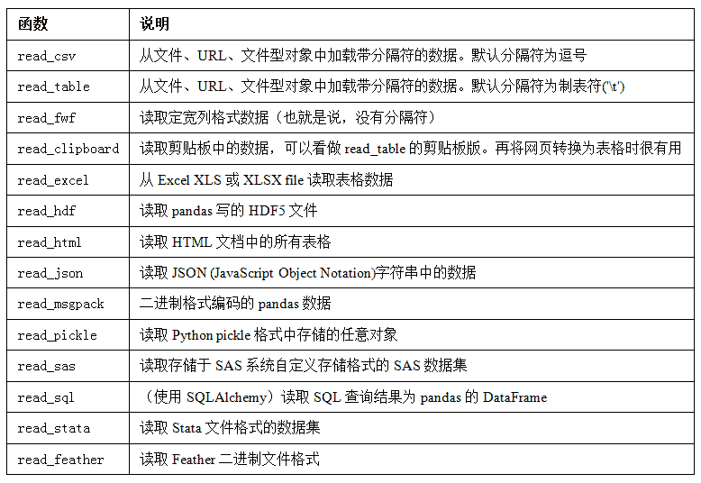
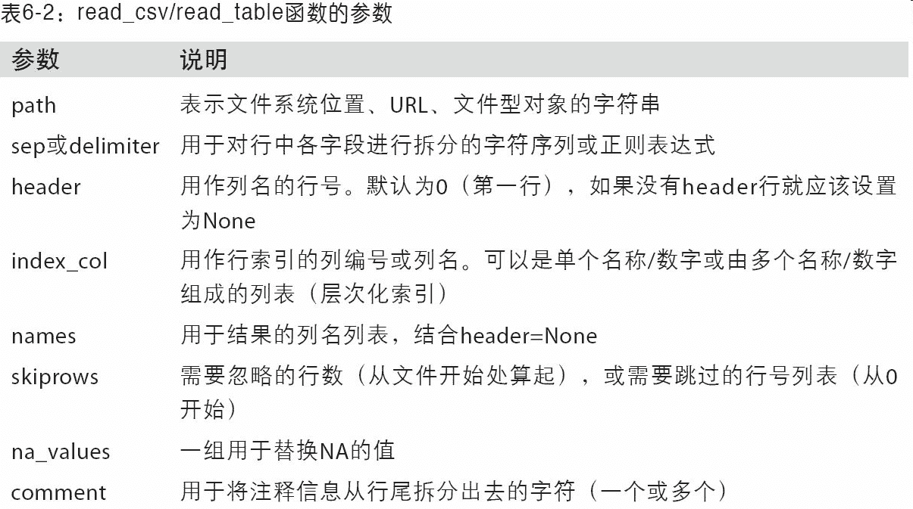
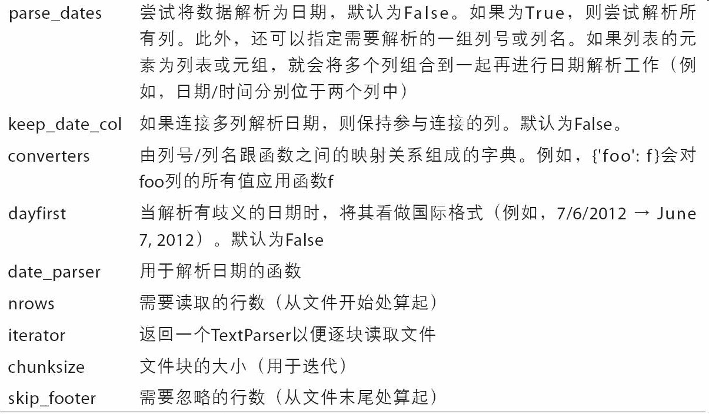
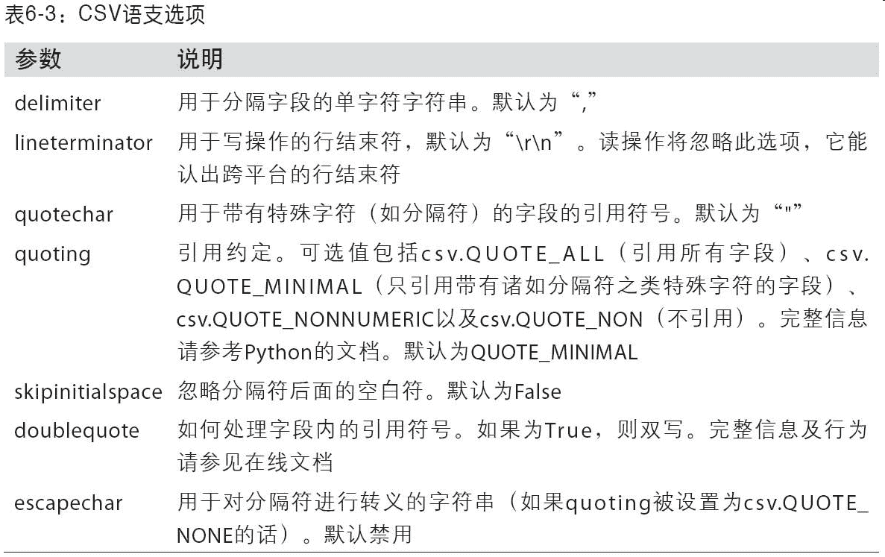

# 第 6 章 数据加载、存储与文件格式

访问数据是使用本书所介绍的这些工具的第一步。我会着重介绍 pandas 的数据输入与输出，虽然别的库中也有不少以此为目的的工具。

输入输出通常可以划分为几个大类：读取文本文件和其他更高效的磁盘存储格式，加载数据库中的数据，利用 Web API 操作网络资源。

# 6.1 读写文本格式的数据

pandas 提供了一些用于将表格型数据读取为`DataFrame`对象的函数。表 6-1 对它们进行了总结，其中`read_csv`和`read_table`可能会是你今后用得最多的。



我将大致介绍一下这些函数在将文本数据转换为`DataFrame`时所用到的一些技术。这些函数的选项可以划分为以下几个大类：

- 索引：将一个或多个列当做返回的`DataFrame`处理，以及是否从文件、用户获取列名。
- 类型推断和数据转换：包括用户定义值的转换、和自定义的缺失值标记列表等。
- 日期解析：包括组合功能，比如将分散在多个列中的日期时间信息组合成结果中的单个列。
- 迭代：支持对大文件进行逐块迭代。
- 不规整数据问题：跳过一些行、页脚、注释或其他一些不重要的东西（比如由成千上万个逗号隔开的数值数据）。

因为工作中实际碰到的数据可能十分混乱，一些数据加载函数（尤其是`read_csv`）的选项逐渐变得复杂起来。面对不同的参数，感到头痛很正常（`read_csv`有超过 50 个参数）。pandas 文档有这些参数的例子，如果你感到阅读某个文件很难，可以通过相似的足够多的例子找到正确的参数。

其中一些函数，比如`pandas.read_csv`，有类型推断功能，因为列数据的类型不属于数据类型。也就是说，你不需要指定列的类型到底是数值、整数、布尔值，还是字符串。其它的数据格式，如 HDF5、Feather 和 msgpack，会在格式中存储数据类型。

日期和其他自定义类型的处理需要多花点工夫才行。首先我们来看一个以逗号分隔的（CSV）文本文件：

```python
In [8]: !cat examples/ex1.csv
a,b,c,d,message
1,2,3,4,hello
5,6,7,8,world
9,10,11,12,foo
```

> 笔记：这里，我用的是 Unix 的`cat` shell 命令将文件的原始内容打印到屏幕上。如果你用的是 Windows，你可以使用`type`达到同样的效果。

由于该文件以逗号分隔，所以我们可以使用`read_csv`将其读入一个`DataFrame`：

```python
In [9]: df = pd.read_csv('examples/ex1.csv')

In [10]: df
Out[10]: 
   a   b   c   d message
0  1   2   3   4   hello
1  5   6   7   8   world
2  9  10  11  12     foo
```

我们还可以使用`read_table`，并指定分隔符：

```python
In [11]: pd.read_table('examples/ex1.csv', sep=',')
Out[11]: 
   a   b   c   d message
0  1   2   3   4   hello
1  5   6   7   8   world
2  9  10  11  12     foo
```

并不是所有文件都有标题行。看看下面这个文件：

```python
In [12]: !cat examples/ex2.csv
1,2,3,4,hello
5,6,7,8,world
9,10,11,12,foo
```

读入该文件的办法有两个。你可以让 pandas 为其分配默认的列名，也可以自己定义列名：

```python
In [13]: pd.read_csv('examples/ex2.csv', header=None)
Out[13]: 
   0   1   2   3      4
0  1   2   3   4  hello
1  5   6   7   8  world
2  9  10  11  12    foo

In [14]: pd.read_csv('examples/ex2.csv', names=['a', 'b', 'c', 'd', 'message'])
Out[14]: 
   a   b   c   d message
0  1   2   3   4   hello
1  5   6   7   8   world
2  9  10  11  12     foo
```

假设你希望将`message`列做成`DataFrame`的索引。你可以明确表示要将该列放到索引 4 的位置上，也可以通过`index_col`参数指定`"message"`：

```python
In [15]: names = ['a', 'b', 'c', 'd', 'message']

In [16]: pd.read_csv('examples/ex2.csv', names=names, index_col='message')
Out[16]: 
         a   b   c   d
message               
hello    1   2   3   4
world    5   6   7   8
foo      9  10  11  12
```

如果希望将多个列做成一个层次化索引，只需传入由列编号或列名组成的列表即可：

```python
In [17]: !cat examples/csv_mindex.csv
key1,key2,value1,value2
one,a,1,2
one,b,3,4
one,c,5,6
one,d,7,8
two,a,9,10
two,b,11,12
two,c,13,14
two,d,15,16

In [18]: parsed = pd.read_csv('examples/csv_mindex.csv',
   ....:                      index_col=['key1', 'key2'])

In [19]: parsed
Out[19]: 
           value1  value2
key1 key2                
one  a          1       2
     b          3       4
     c          5       6
     d          7       8
two  a          9      10
     b         11      12
     c         13      14
     d         15      16
```

有些情况下，有些表格可能不是用固定的分隔符去分隔字段的（比如空白符或其它模式）。看看下面这个文本文件：

```python
In [20]: list(open('examples/ex3.txt'))
Out[20]: 
['            A         B         C\n',
 'aaa -0.264438 -1.026059 -0.619500\n',
 'bbb  0.927272  0.302904 -0.032399\n',
 'ccc -0.264273 -0.386314 -0.217601\n',
 'ddd -0.871858 -0.348382  1.100491\n']
```

虽然可以手动对数据进行规整，这里的字段是被数量不同的空白字符间隔开的。这种情况下，你可以传递一个正则表达式作为`read_table`的分隔符。可以用正则表达式表达为`\s+`，于是有：

```python
In [21]: result = pd.read_table('examples/ex3.txt', sep='\s+')

In [22]: result
Out[22]: 
            A         B         C
aaa -0.264438 -1.026059 -0.619500
bbb  0.927272  0.302904 -0.032399
ccc -0.264273 -0.386314 -0.217601
ddd -0.871858 -0.348382  1.100491
```

这里，由于列名比数据行的数量少，所以`read_table`推断第一列应该是`DataFrame`的索引。

这些解析器函数还有许多参数可以帮助你处理各种各样的异形文件格式（表 6-2 列出了一些）。比如说，你可以用`skiprows`跳过文件的第一行、第三行和第四行：

```python
In [23]: !cat examples/ex4.csv
# hey!
a,b,c,d,message
# just wanted to make things more difficult for you
# who reads CSV files with computers, anyway?
1,2,3,4,hello
5,6,7,8,world
9,10,11,12,foo
In [24]: pd.read_csv('examples/ex4.csv', skiprows=[0, 2, 3])
Out[24]: 
   a   b   c   d message
0  1   2   3   4   hello
1  5   6   7   8   world
2  9  10  11  12     foo
```

缺失值处理是文件解析任务中的一个重要组成部分。缺失数据经常是要么没有（空字符串），要么用某个标记值表示。默认情况下，pandas 会用一组经常出现的标记值进行识别，比如 NA 及`NULL`：

```python
In [25]: !cat examples/ex5.csv
something,a,b,c,d,message
one,1,2,3,4,NA
two,5,6,,8,world
three,9,10,11,12,foo
In [26]: result = pd.read_csv('examples/ex5.csv')

In [27]: result
Out[27]: 
  something  a   b     c   d message
0       one  1   2   3.0   4     NaN
1       two  5   6   NaN   8   world
2     three  9  10  11.0  12     foo

In [28]: pd.isnull(result)
Out[28]: 
   something      a      b      c      d  message
0      False  False  False  False  False     True
1      False  False  False   True  False    False
2      False  False  False  False  False    False
```

`na_values`可以用一个列表或集合的字符串表示缺失值：

```python
In [29]: result = pd.read_csv('examples/ex5.csv', na_values=['NULL'])

In [30]: result
Out[30]: 
  something  a   b     c   d message
0       one  1   2   3.0   4     NaN
1       two  5   6   NaN   8   world
2     three  9  10  11.0  12     foo
```

字典的各列可以使用不同的 NA 标记值：

```python
In [31]: sentinels = {'message': ['foo', 'NA'], 'something': ['two']}

In [32]: pd.read_csv('examples/ex5.csv', na_values=sentinels)
Out[32]:
something  a   b     c   d message
0       one  1   2   3.0   4     NaN
1       NaN  5   6   NaN   8   world
2     three  9  10  11.0  12     NaN
```

表 6-2 列出了`pandas.read_csv`和`pandas.read_table`常用的选项。






## 逐块读取文本文件

在处理很大的文件时，或找出大文件中的参数集以便于后续处理时，你可能只想读取文件的一小部分或逐块对文件进行迭代。

在看大文件之前，我们先设置 pandas 显示地更紧些：

```python
In [33]: pd.options.display.max_rows = 10
```

然后有：

```python
In [34]: result = pd.read_csv('examples/ex6.csv')

In [35]: result
Out[35]: 
           one       two     three      four key
0     0.467976 -0.038649 -0.295344 -1.824726   L
1    -0.358893  1.404453  0.704965 -0.200638   B
2    -0.501840  0.659254 -0.421691 -0.057688   G
3     0.204886  1.074134  1.388361 -0.982404   R
4     0.354628 -0.133116  0.283763 -0.837063   Q
...        ...       ...       ...       ...  ..
9995  2.311896 -0.417070 -1.409599 -0.515821   L
9996 -0.479893 -0.650419  0.745152 -0.646038   E
9997  0.523331  0.787112  0.486066  1.093156   K
9998 -0.362559  0.598894 -1.843201  0.887292   G
9999 -0.096376 -1.012999 -0.657431 -0.573315   0
[10000 rows x 5 columns]
If you want to only read a small
```

如果只想读取几行（避免读取整个文件），通过`nrows`进行指定即可：

```python
In [36]: pd.read_csv('examples/ex6.csv', nrows=5)
Out[36]: 
        one       two     three      four key
0  0.467976 -0.038649 -0.295344 -1.824726   L
1 -0.358893  1.404453  0.704965 -0.200638   B
2 -0.501840  0.659254 -0.421691 -0.057688   G
3  0.204886  1.074134  1.388361 -0.982404   R
4  0.354628 -0.133116  0.283763 -0.837063   Q
```

要逐块读取文件，可以指定`chunksize`（行数）：

```python
In [874]: chunker = pd.read_csv('ch06/ex6.csv', chunksize=1000)

In [875]: chunker
Out[875]: <pandas.io.parsers.TextParser at 0x8398150>
```

`read_csv`所返回的这个`TextParser`对象使你可以根据`chunksize`对文件进行逐块迭代。比如说，我们可以迭代处理`ex6.csv`，将值计数聚合到`"key"`列中，如下所示：

```python
chunker = pd.read_csv('examples/ex6.csv', chunksize=1000)

tot = pd.Series([])
for piece in chunker:
    tot = tot.add(piece['key'].value_counts(), fill_value=0)

tot = tot.sort_values(ascending=False)
```

然后有：

```python
In [40]: tot[:10]
Out[40]: 
E    368.0
X    364.0
L    346.0
O    343.0
Q    340.0
M    338.0
J    337.0
F    335.0
K    334.0
H    330.0
dtype: float64
```

`TextParser`还有一个`get_chunk`方法，它使你可以读取任意大小的块。

## 将数据写出到文本格式

数据也可以被输出为分隔符格式的文本。我们再来看看之前读过的一个 CSV 文件：

```python
In [41]: data = pd.read_csv('examples/ex5.csv')

In [42]: data
Out[42]: 
  something  a   b     c   d message
0       one  1   2   3.0   4     NaN
1       two  5   6   NaN   8   world
2     three  9  10  11.0  12     foo
```

利用`DataFrame`的`to_csv`方法，我们可以将数据写到一个以逗号分隔的文件中：

```python
In [43]: data.to_csv('examples/out.csv')

In [44]: !cat examples/out.csv
,something,a,b,c,d,message
0,one,1,2,3.0,4,
1,two,5,6,,8,world
2,three,9,10,11.0,12,foo
```

当然，还可以使用其他分隔符（由于这里直接写出到`sys.stdout`，所以仅仅是打印出文本结果而已）：

```python
In [45]: import sys

In [46]: data.to_csv(sys.stdout, sep='|')
|something|a|b|c|d|message
0|one|1|2|3.0|4|
1|two|5|6||8|world
2|three|9|10|11.0|12|foo
```

缺失值在输出结果中会被表示为空字符串。你可能希望将其表示为别的标记值：

```python
In [47]: data.to_csv(sys.stdout, na_rep='NULL')
,something,a,b,c,d,message
0,one,1,2,3.0,4,NULL
1,two,5,6,NULL,8,world
2,three,9,10,11.0,12,foo
```

如果没有设置其他选项，则会写出行和列的标签。当然，它们也都可以被禁用：

```python
In [48]: data.to_csv(sys.stdout, index=False, header=False)
one,1,2,3.0,4,
two,5,6,,8,world
three,9,10,11.0,12,foo
```

此外，你还可以只写出一部分的列，并以你指定的顺序排列：

```python
In [49]: data.to_csv(sys.stdout, index=False, columns=['a', 'b', 'c'])
a,b,c
1,2,3.0
5,6,
9,10,11.0
```

`Series`也有一个`to_csv`方法：

```python
In [50]: dates = pd.date_range('1/1/2000', periods=7)

In [51]: ts = pd.Series(np.arange(7), index=dates)

In [52]: ts.to_csv('examples/tseries.csv')

In [53]: !cat examples/tseries.csv
2000-01-01,0
2000-01-02,1
2000-01-03,2
2000-01-04,3
2000-01-05,4
2000-01-06,5
2000-01-07,6
```

## 处理分隔符格式

大部分存储在磁盘上的表格型数据都能用`pandas.read_table`进行加载。然而，有时还是需要做一些手工处理。由于接收到含有畸形行的文件而使`read_table`出毛病的情况并不少见。为了说明这些基本工具，看看下面这个简单的 CSV 文件：

```python
In [54]: !cat examples/ex7.csv
"a","b","c"
"1","2","3"
"1","2","3"
```

对于任何单字符分隔符文件，可以直接使用 Python 内置的`csv`模块。将任意已打开的文件或文件型的对象传给`csv.reader`：

```python
import csv
f = open('examples/ex7.csv')

reader = csv.reader(f)
```

对这个`reader`进行迭代将会为每行产生一个元组（并移除了所有的引号）：对这个`reader`进行迭代将会为每行产生一个元组（并移除了所有的引号）：

```python
In [56]: for line in reader:
   ....:     print(line)
['a', 'b', 'c']
['1', '2', '3']
['1', '2', '3']
```

现在，为了使数据格式合乎要求，你需要对其做一些整理工作。我们一步一步来做。首先，读取文件到一个多行的列表中：

```python
In [57]: with open('examples/ex7.csv') as f:
   ....:     lines = list(csv.reader(f))
```

然后，我们将这些行分为标题行和数据行：

```python
In [58]: header, values = lines[0], lines[1:]
```

然后，我们可以用字典构造式和`zip(*values)`，后者将行转置为列，创建数据列的字典：

```python
In [59]: data_dict = {h: v for h, v in zip(header, zip(*values))}

In [60]: data_dict
Out[60]: {'a': ('1', '1'), 'b': ('2', '2'), 'c': ('3', '3')}
```

CSV 文件的形式有很多。只需定义`csv.Dialect`的一个子类即可定义出新格式（如专门的分隔符、字符串引用约定、行结束符等）：

```python
class my_dialect(csv.Dialect):
    lineterminator = '\n'
    delimiter = ';'
    quotechar = '"'
    quoting = csv.QUOTE_MINIMAL
reader = csv.reader(f, dialect=my_dialect)
```

各个 CSV 语支的参数也可以用关键字的形式提供给`csv.reader`，而无需定义子类：

```python
reader = csv.reader(f, delimiter='|')
```

可用的选项（`csv.Dialect`的属性）及其功能如表 6-3 所示。



> 笔记：对于那些使用复杂分隔符或多字符分隔符的文件，`csv`模块就无能为力了。这种情况下，你就只能使用字符串的`split`方法或正则表达式方法`re.split`进行行拆分和其他整理工作了。

要手工输出分隔符文件，你可以使用`csv.writer`。它接受一个已打开且可写的文件对象以及跟`csv.reader`相同的那些语支和格式化选项：

```python
with open('mydata.csv', 'w') as f:
    writer = csv.writer(f, dialect=my_dialect)
    writer.writerow(('one', 'two', 'three'))
    writer.writerow(('1', '2', '3'))
    writer.writerow(('4', '5', '6'))
    writer.writerow(('7', '8', '9'))
```

## JSON 数据

JSON（JavaScript Object Notation 的简称）已经成为通过 HTTP 请求在 Web 浏览器和其他应用程序之间发送数据的标准格式之一。它是一种比表格型文本格式（如 CSV）灵活得多的数据格式。下面是一个例子：

```python
obj = """
{"name": "Wes",
 "places_lived": ["United States", "Spain", "Germany"],
 "pet": null,
 "siblings": [{"name": "Scott", "age": 30, "pets": ["Zeus", "Zuko"]},
              {"name": "Katie", "age": 38,
               "pets": ["Sixes", "Stache", "Cisco"]}]
}
"""
```
除其空值`null`和一些其他的细微差别（如列表末尾不允许存在多余的逗号）之外，JSON 非常接近于有效的 Python 代码。基本类型有对象（字典）、数组（列表）、字符串、数值、布尔值以及`null`。对象中所有的键都必须是字符串。许多 Python 库都可以读写 JSON 数据。我将使用`json`，因为它是构建于 Python 标准库中的。通过`json.loads`即可将 JSON 字符串转换成 Python 形式：

```python
In [62]: import json

In [63]: result = json.loads(obj)

In [64]: result
Out[64]: 
{'name': 'Wes',
 'pet': None,
 'places_lived': ['United States', 'Spain', 'Germany'],
 'siblings': [{'age': 30, 'name': 'Scott', 'pets': ['Zeus', 'Zuko']},
  {'age': 38, 'name': 'Katie', 'pets': ['Sixes', 'Stache', 'Cisco']}]}
```

`json.dumps`则将 Python 对象转换成 JSON 格式：

```python
In [65]: asjson = json.dumps(result)
```

如何将（一个或一组）JSON 对象转换为`DataFrame`或其他便于分析的数据结构就由你决定了。最简单方便的方式是：向`DataFrame`构造器传入一个字典的列表（就是原先的 JSON 对象），并选取数据字段的子集：

```python
In [66]: siblings = pd.DataFrame(result['siblings'], columns=['name', 'age'])

In [67]: siblings
Out[67]: 
    name  age
0  Scott   30
1  Katie   38
```

`pandas.read_json`可以自动将特别格式的 JSON 数据集转换为`Series`或`DataFrame`。例如：

```python
In [68]: !cat examples/example.json
[{"a": 1, "b": 2, "c": 3},
 {"a": 4, "b": 5, "c": 6},
 {"a": 7, "b": 8, "c": 9}]
```

`pandas.read_json`的默认选项假设 JSON 数组中的每个对象是表格中的一行：

```python
In [69]: data = pd.read_json('examples/example.json')

In [70]: data
Out[70]: 
   a  b  c
0  1  2  3
1  4  5  6
2  7  8  9
```

第 7 章中关于 USDA 食品数据库的那个例子进一步讲解了 JSON 数据的读取和处理（包括嵌套记录）。

如果你需要将数据从 pandas 输出到 JSON，可以使用`to_json`方法：

```python
In [71]: print(data.to_json())
{"a":{"0":1,"1":4,"2":7},"b":{"0":2,"1":5,"2":8},"c":{"0":3,"1":6,"2":9}}

In [72]: print(data.to_json(orient='records'))
[{"a":1,"b":2,"c":3},{"a":4,"b":5,"c":6},{"a":7,"b":8,"c":9}]
```

## XML 和 HTML：Web 信息收集

Python 有许多可以读写常见的 HTML 和 XML 格式数据的库，包括`lxml`、Beautiful Soup 和 `html5lib`。`lxml`的速度比较快，但其它的库处理有误的 HTML 或 XML 文件更好。

pandas 有一个内置的功能，`read_html`，它可以使用`lxml`和 Beautiful Soup 自动将 HTML 文件中的表格解析为`DataFrame`对象。为了进行展示，我从美国联邦存款保险公司下载了一个 HTML 文件（pandas 文档中也使用过），它记录了银行倒闭的情况。首先，你需要安装`read_html`用到的库：
```
conda install lxml
pip install beautifulsoup4 html5lib
```

如果你用的不是`conda`，可以使用``pip install lxml``。

`pandas.read_html`有一些选项，默认条件下，它会搜索、尝试解析<table>标签内的的表格数据。结果是一个列表的`DataFrame`对象：

```python
In [73]: tables = pd.read_html('examples/fdic_failed_bank_list.html')

In [74]: len(tables)
Out[74]: 1

In [75]: failures = tables[0]

In [76]: failures.head()
Out[76]: 
                      Bank Name             City  ST   CERT  \
0                   Allied Bank         Mulberry  AR     91   
1  The Woodbury Banking Company         Woodbury  GA  11297   
2        First CornerStone Bank  King of Prussia  PA  35312   
3            Trust Company Bank          Memphis  TN   9956   
4    North Milwaukee State Bank        Milwaukee  WI  20364   
                 Acquiring Institution        Closing Date       Updated Date  
0                         Today's Bank  September 23, 2016  November 17, 2016  
1                          United Bank     August 19, 2016  November 17, 2016  
2  First-Citizens Bank & Trust Company         May 6, 2016  September 6, 2016  
3           The Bank of Fayette County      April 29, 2016  September 6, 2016  
4  First-Citizens Bank & Trust Company      March 11, 2016      June 16, 2016
```

因为`failures`有许多列，pandas 插入了一个换行符`\`。

这里，我们可以做一些数据清洗和分析（后面章节会进一步讲解），比如计算按年份计算倒闭的银行数：

```python
In [77]: close_timestamps = pd.to_datetime(failures['Closing Date'])

In [78]: close_timestamps.dt.year.value_counts()
Out[78]: 
2010    157
2009    140
2011     92
2012     51
2008     25
       ... 
2004      4
2001      4
2007      3
2003      3
2000      2
Name: Closing Date, Length: 15, dtype: int64
```

## 利用`lxml.objectify`解析 XML

XML（Extensible Markup Language）是另一种常见的支持分层、嵌套数据以及元数据的结构化数据格式。本书所使用的这些文件实际上来自于一个很大的 XML 文档。

前面，我介绍了`pandas.read_html`函数，它可以使用`lxml`或 Beautiful Soup 从 HTML 解析数据。XML 和 HTML 的结构很相似，但 XML 更为通用。这里，我会用一个例子演示如何利用`lxml`从 XML 格式解析数据。

纽约大都会运输署发布了[一些有关其公交和列车服务的数据资料](http://www.mta.info/developers/download.html)。这里，我们将看看包含在一组 XML 文件中的运行情况数据。每项列车或公交服务都有各自的文件（如 Metro-North Railroad 的文件是`Performance_MNR.xml`），其中每条 XML 记录就是一条月度数据，如下所示：
```xml
<INDICATOR>
  <INDICATOR_SEQ>373889</INDICATOR_SEQ>
  <PARENT_SEQ></PARENT_SEQ>
  <AGENCY_NAME>Metro-North Railroad</AGENCY_NAME>
  <INDICATOR_NAME>Escalator Availability</INDICATOR_NAME>
  <DESCRIPTION>Percent of the time that escalators are operational
  systemwide. The availability rate is based on physical observations performed
  the morning of regular business days only. This is a new indicator the agency
  began reporting in 2009.</DESCRIPTION>
  <PERIOD_YEAR>2011</PERIOD_YEAR>
  <PERIOD_MONTH>12</PERIOD_MONTH>
  <CATEGORY>Service Indicators</CATEGORY>
  <FREQUENCY>M</FREQUENCY>
  <DESIRED_CHANGE>U</DESIRED_CHANGE>
  <INDICATOR_UNIT>%</INDICATOR_UNIT>
  <DECIMAL_PLACES>1</DECIMAL_PLACES>
  <YTD_TARGET>97.00</YTD_TARGET>
  <YTD_ACTUAL></YTD_ACTUAL>
  <MONTHLY_TARGET>97.00</MONTHLY_TARGET>
  <MONTHLY_ACTUAL></MONTHLY_ACTUAL>
</INDICATOR>
```

我们先用`lxml.objectify`解析该文件，然后通过`getroot`得到该 XML 文件的根节点的引用：

```python
from lxml import objectify

path = 'datasets/mta_perf/Performance_MNR.xml'
parsed = objectify.parse(open(path))
root = parsed.getroot()
```

`root.INDICATOR`返回一个用于产生各个`<INDICATOR>`XML 元素的生成器。对于每条记录，我们可以用标记名（如`YTD_ACTUAL`）和数据值填充一个字典（排除几个标记）：

```python
data = []

skip_fields = ['PARENT_SEQ', 'INDICATOR_SEQ',
               'DESIRED_CHANGE', 'DECIMAL_PLACES']

for elt in root.INDICATOR:
    el_data = {}
    for child in elt.getchildren():
        if child.tag in skip_fields:
            continue
        el_data[child.tag] = child.pyval
    data.append(el_data)
```

最后，将这组字典转换为一个`DataFrame`：

```python
In [81]: perf = pd.DataFrame(data)

In [82]: perf.head()
Out[82]:
Empty DataFrame
Columns: []
Index: []
```

XML 数据可以比本例复杂得多。每个标记都可以有元数据。看看下面这个 HTML 的链接标签（它也算是一段有效的 XML）：

```python
from io import StringIO
tag = '<a href="http://www.google.com">Google</a>'
root = objectify.parse(StringIO(tag)).getroot()
```

现在就可以访问标签或链接文本中的任何字段了（如`href`）：

```python
In [84]: root
Out[84]: <Element a at 0x7f6b15817748>

In [85]: root.get('href')
Out[85]: 'http://www.google.com'

In [86]: root.text
Out[86]: 'Google'
```

# 6.2 二进制数据格式

实现数据的高效二进制格式存储最简单的办法之一是使用 Python 内置的 pickle 序列化。pandas 对象都有一个用于将数据以 pickle 格式保存到磁盘上的`to_pickle`方法：

```python
In [87]: frame = pd.read_csv('examples/ex1.csv')

In [88]: frame
Out[88]: 
   a   b   c   d message
0  1   2   3   4   hello
1  5   6   7   8   world
2  9  10  11  12     foo

In [89]: frame.to_pickle('examples/frame_pickle')
```

你可以通过 pickle 直接读取被 pickle 化的数据，或是使用更为方便的`pandas.read_pickle`：

```python
In [90]: pd.read_pickle('examples/frame_pickle')
Out[90]: 
   a   b   c   d message
0  1   2   3   4   hello
1  5   6   7   8   world
2  9  10  11  12     foo
```

> 注意：pickle 仅建议用于短期存储格式。其原因是很难保证该格式永远是稳定的；今天 pickle 的对象可能无法被后续版本的库 unpickle 出来。虽然我尽力保证这种事情不会发生在 pandas 中，但是今后的某个时候说不定还是得“打破”该 pickle 格式。

pandas 内置支持两个二进制数据格式：HDF5 和 MessagePack。下一节，我会给出几个 HDF5 的例子，但我建议你尝试下不同的文件格式，看看它们的速度以及是否适合你的分析工作。pandas 或 NumPy 数据的其它存储格式有：

- bcolz：一种可压缩的列存储二进制格式，基于 Blosc 压缩库。
- Feather：我与 R 语言社区的 Hadley Wickham 设计的一种跨语言的列存储文件格式。Feather 使用了 Apache Arrow 的列式内存格式。

## 使用 HDF5 格式

HDF5 是一种存储大规模科学数组数据的非常好的文件格式。它可以被作为 C 标准库，带有许多语言的接口，如 Java、Python 和 MATLAB 等。HDF5 中的 HDF 指的是层次型数据格式（hierarchical data format）。每个 HDF5 文件都含有一个文件系统式的节点结构，它使你能够存储多个数据集并支持元数据。与其他简单格式相比，HDF5 支持多种压缩器的即时压缩，还能更高效地存储重复模式数据。对于那些非常大的无法直接放入内存的数据集，HDF5 就是不错的选择，因为它可以高效地分块读写。

虽然可以用 PyTables 或 H5Py 库直接访问 HDF5 文件，pandas 提供了更为高级的接口，可以简化存储`Series`和`DataFrame`对象。HDFStore 类可以像字典一样，处理低级的细节：

```python
In [92]: frame = pd.DataFrame({'a': np.random.randn(100)})

In [93]: store = pd.HDFStore('mydata.h5')

In [94]: store['obj1'] = frame

In [95]: store['obj1_col'] = frame['a']

In [96]: store
Out[96]: 
<class 'pandas.io.pytables.HDFStore'>
File path: mydata.h5
/obj1                frame        (shape->[100,1])                               
        
/obj1_col            series       (shape->[100])                                 
        
/obj2                frame_table  (typ->appendable,nrows->100,ncols->1,indexers->
[index])
/obj3                frame_table  (typ->appendable,nrows->100,ncols->1,indexers->
[index])
```

HDF5 文件中的对象可以通过与字典一样的 API 进行获取：

```python
In [97]: store['obj1']
Out[97]: 
           a
0  -0.204708
1   0.478943
2  -0.519439
3  -0.555730
4   1.965781
..       ...
95  0.795253
96  0.118110
97 -0.748532
98  0.584970
99  0.152677
[100 rows x 1 columns]
```

HDFStore 支持两种存储模式，`'fixed'`和`'table'`。后者通常会更慢，但是支持使用特殊语法进行查询操作：

```python
In [98]: store.put('obj2', frame, format='table')

In [99]: store.select('obj2', where=['index >= 10 and index <= 15'])
Out[99]: 
           a
10  1.007189
11 -1.296221
12  0.274992
13  0.228913
14  1.352917
15  0.886429

In [100]: store.close()
```

`put`是`store['obj2'] = frame`方法的显示版本，允许我们设置其它的选项，比如格式。

`pandas.read_hdf`函数可以快捷使用这些工具：

```python
In [101]: frame.to_hdf('mydata.h5', 'obj3', format='table')

In [102]: pd.read_hdf('mydata.h5', 'obj3', where=['index < 5'])
Out[102]: 
          a
0 -0.204708
1  0.478943
2 -0.519439
3 -0.555730
4  1.965781
```

> 笔记：如果你要处理的数据位于远程服务器，比如 Amazon S3 或 HDFS，使用专门为分布式存储（比如 Apache Parquet）的二进制格式也许更加合适。Python 的 Parquet 和其它存储格式还在不断的发展之中，所以这本书中没有涉及。

如果需要本地处理海量数据，我建议你好好研究一下 PyTables 和 H5Py，看看它们能满足你的哪些需求。。由于许多数据分析问题都是 IO 密集型（而不是 CPU 密集型），利用 HDF5 这样的工具能显著提升应用程序的效率。

> 注意：HDF5 不是数据库。它最适合用作“一次写多次读”的数据集。虽然数据可以在任何时候被添加到文件中，但如果同时发生多个写操作，文件就可能会被破坏。

## 读取 Microsoft Excel 文件

pandas 的`ExcelFile`类或`pandas.read_excel`函数支持读取存储在 Excel 2003（或更高版本）中的表格型数据。这两个工具分别使用扩展包 xlrd 和 OpenPyXL 读取 XLS 和 XLSX 文件。你可以用`pip`或`conda`安装它们。

要使用`ExcelFile`，通过传递 xls 或 xlsx 路径创建一个实例：

```python
In [104]: xlsx = pd.ExcelFile('examples/ex1.xlsx')
```

存储在表单中的数据可以`read_excel`读取到`DataFrame`（原书这里写的是用`parse`解析，但代码中用的是`read_excel`，是个笔误：只换了代码，没有改文字）：

```python
In [105]: pd.read_excel(xlsx, 'Sheet1')
Out[105]: 
   a   b   c   d message
0  1   2   3   4   hello
1  5   6   7   8   world
2  9  10  11  12     foo
```

如果要读取一个文件中的多个表单，创建`ExcelFile`会更快，但你也可以将文件名传递到`pandas.read_excel`：

```python
In [106]: frame = pd.read_excel('examples/ex1.xlsx', 'Sheet1')

In [107]: frame
Out[107]: 
   a   b   c   d message
0  1   2   3   4   hello
1  5   6   7   8   world
2  9  10  11  12     foo
```

如果要将 pandas 数据写入为 Excel 格式，你必须首先创建一个`ExcelWriter`，然后使用 pandas 对象的`to_excel`方法将数据写入到其中：

```python
In [108]: writer = pd.ExcelWriter('examples/ex2.xlsx')

In [109]: frame.to_excel(writer, 'Sheet1')

In [110]: writer.save()
```

你还可以不使用`ExcelWriter`，而是传递文件的路径到`to_excel`：

```python
In [111]: frame.to_excel('examples/ex2.xlsx')
```

# 6.3 Web APIs 交互

许多网站都有一些通过 JSON 或其他格式提供数据的公共 API。通过 Python 访问这些 API 的办法有不少。一个简单易用的办法（推荐）是[`requests`包](http://docs.python-requests.org)。

为了搜索最新的 30 个 GitHub 上的 pandas 主题，我们可以发一个 HTTP GET 请求，使用`requests`扩展库：

```python
In [113]: import requests

In [114]: url = 'https://api.github.com/repos/pandas-dev/pandas/issues'

In [115]: resp = requests.get(url)

In [116]: resp
Out[116]: <Response [200]>
```

响应对象的`json`方法会返回一个包含被解析过的 JSON 字典，加载到一个 Python 对象中：

```python
In [117]: data = resp.json()

In [118]: data[0]['title']
Out[118]: 'Period does not round down for frequencies less that 1 hour'
```

`data`中的每个元素都是一个包含所有 GitHub 主题页数据（不包含评论）的字典。我们可以直接传递数据到`DataFrame`，并提取感兴趣的字段：

```python
In [119]: issues = pd.DataFrame(data, columns=['number', 'title',
   .....:                                      'labels', 'state'])

In [120]: issues
Out[120]:
    number                                              title  \
0    17666  Period does not round down for frequencies les...   
1    17665           DOC: improve docstring of function where   
2    17664               COMPAT: skip 32-bit test on int repr   
3    17662                          implement Delegator class
4    17654  BUG: Fix series rename called with str alterin...   
..     ...                                                ...   
25   17603  BUG: Correctly localize naive datetime strings...   
26   17599                     core.dtypes.generic --> cython   
27   17596   Merge cdate_range functionality into bdate_range   
28   17587  Time Grouper bug fix when applied for list gro...   
29   17583  BUG: fix tz-aware DatetimeIndex + TimedeltaInd...   
                                               labels state  
0                                                  []  open  
1   [{'id': 134699, 'url': 'https://api.github.com...  open  
2   [{'id': 563047854, 'url': 'https://api.github....  open  
3                                                  []  open  
4   [{'id': 76811, 'url': 'https://api.github.com/...  open  
..                                                ...   ...  
25  [{'id': 76811, 'url': 'https://api.github.com/...  open  
26  [{'id': 49094459, 'url': 'https://api.github.c...  open  
27  [{'id': 35818298, 'url': 'https://api.github.c...  open  
28  [{'id': 233160, 'url': 'https://api.github.com...  open  
29  [{'id': 76811, 'url': 'https://api.github.com/...  open  
[30 rows x 4 columns]
```

花费一些精力，你就可以创建一些更高级的常见的 Web API 的接口，返回`DataFrame`对象，方便进行分析。

# 6.4 数据库交互

在商业场景下，大多数数据可能不是存储在文本或 Excel 文件中。基于 SQL 的关系型数据库（如 SQL Server、PostgreSQL 和 MySQL 等）使用非常广泛，其它一些数据库也很流行。数据库的选择通常取决于性能、数据完整性以及应用程序的伸缩性需求。

将数据从 SQL 加载到`DataFrame`的过程很简单，此外 pandas 还有一些能够简化该过程的函数。例如，我将使用 SQLite 数据库（通过 Python 内置的`sqlite3`驱动器）：

```python
In [121]: import sqlite3

In [122]: query = """
   .....: CREATE TABLE test
   .....: (a VARCHAR(20), b VARCHAR(20),
   .....:  c REAL,        d INTEGER
   .....: );"""

In [123]: con = sqlite3.connect('mydata.sqlite')

In [124]: con.execute(query)
Out[124]: <sqlite3.Cursor at 0x7f6b12a50f10>

In [125]: con.commit()
```

然后插入几行数据：

```python
In [126]: data = [('Atlanta', 'Georgia', 1.25, 6),
   .....:         ('Tallahassee', 'Florida', 2.6, 3),
   .....:         ('Sacramento', 'California', 1.7, 5)]

In [127]: stmt = "INSERT INTO test VALUES(?, ?, ?, ?)"

In [128]: con.executemany(stmt, data)
Out[128]: <sqlite3.Cursor at 0x7f6b15c66ce0>
```

从表中选取数据时，大部分 Python SQL 驱动器（`PyODBC`、`psycopg2`、`MySQLdb`、`pymssql`等）都会返回一个元组列表：

```python
In [130]: cursor = con.execute('select * from test')

In [131]: rows = cursor.fetchall()

In [132]: rows
Out[132]: 
[('Atlanta', 'Georgia', 1.25, 6),
 ('Tallahassee', 'Florida', 2.6, 3),
 ('Sacramento', 'California', 1.7, 5)]
```

你可以将这个元组列表传给`DataFrame`构造器，但还需要列名（位于光标的`description`属性中）：

```python
In [133]: cursor.description
Out[133]: 
(('a', None, None, None, None, None, None),
 ('b', None, None, None, None, None, None),
 ('c', None, None, None, None, None, None),
 ('d', None, None, None, None, None, None))

In [134]: pd.DataFrame(rows, columns=[x[0] for x in cursor.description])
Out[134]: 
             a           b     c  d
0      Atlanta     Georgia  1.25  6
1  Tallahassee     Florida  2.60  3
2   Sacramento  California  1.70  5
```

这种数据规整操作相当多，你肯定不想每查一次数据库就重写一次。[SQLAlchemy 项目](http://www.sqlalchemy.org/)是一个流行的 Python SQL 工具，它抽象出了 SQL 数据库中的许多常见差异。pandas 有一个`read_sql`函数，可以让你轻松的从 SQLAlchemy 连接读取数据。这里，我们用 SQLAlchemy 连接 SQLite 数据库，并从之前创建的表读取数据：

```python
In [135]: import sqlalchemy as sqla

In [136]: db = sqla.create_engine('sqlite:///mydata.sqlite')

In [137]: pd.read_sql('select * from test', db)
Out[137]: 
             a           b     c  d
0      Atlanta     Georgia  1.25  6
1  Tallahassee     Florida  2.60  3
2   Sacramento  California  1.70  5
```

# 6.5 总结

访问数据通常是数据分析的第一步。在本章中，我们已经学了一些有用的工具。在接下来的章节中，我们将深入研究数据规整、数据可视化、时间序列分析和其它主题。 
