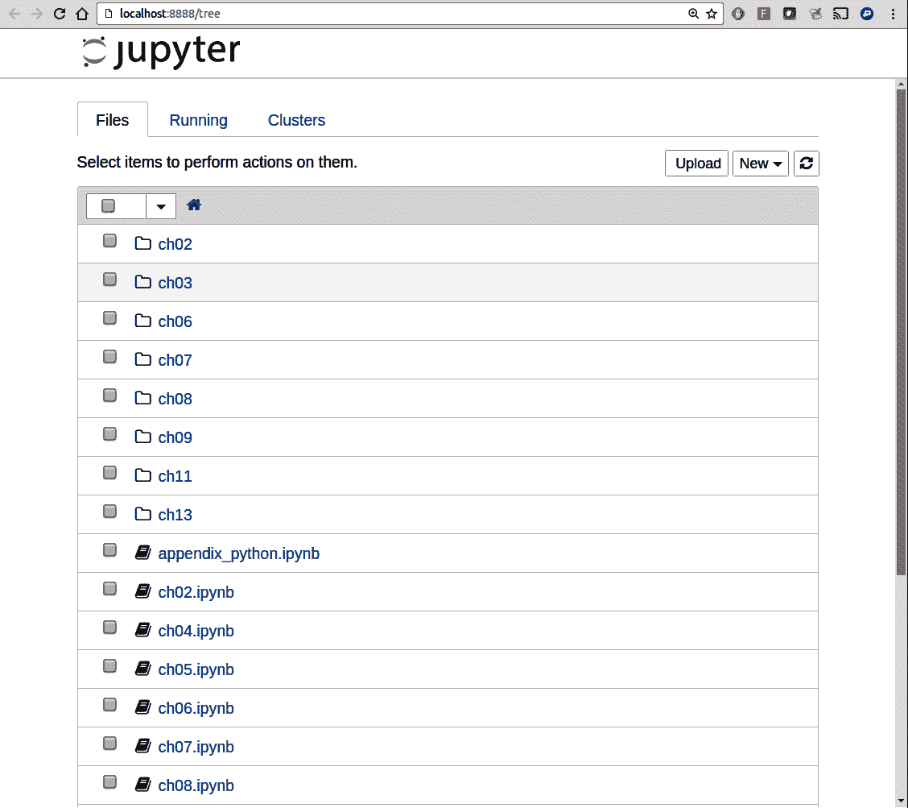
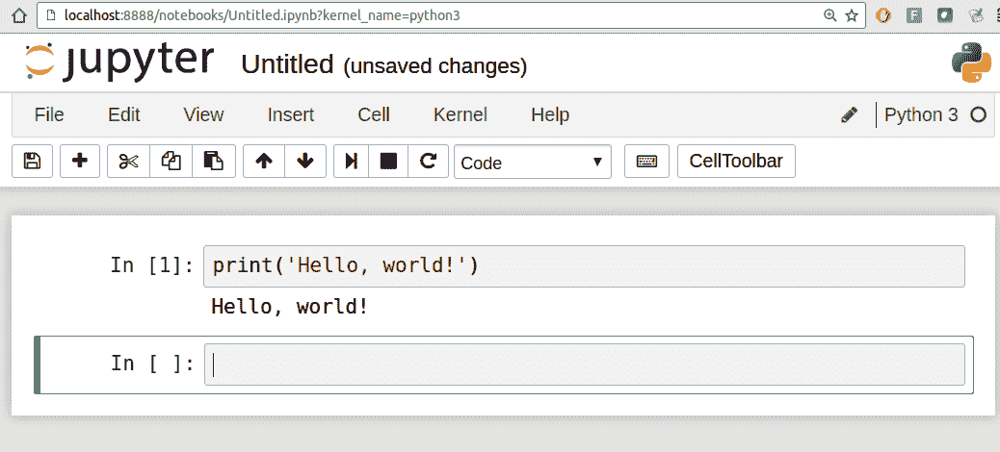
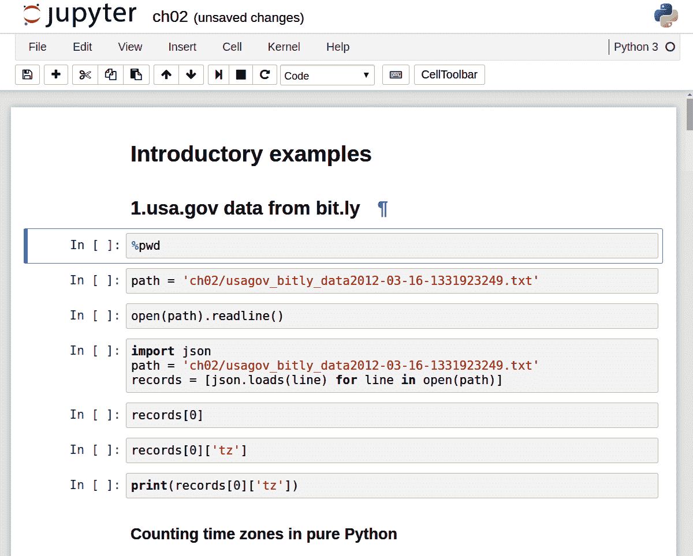
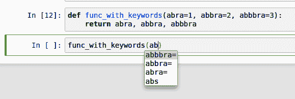
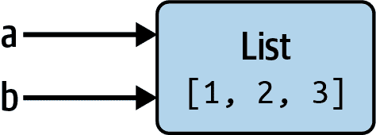

# 二、Python 语言基础，IPython 和 Jupyter 笔记本

> 原文：[`wesmckinney.com/book/python-basics`](https://wesmckinney.com/book/python-basics)
>
> 译者：[飞龙](https://github.com/wizardforcel)
>
> 协议：[CC BY-NC-SA 4.0](http://creativecommons.org/licenses/by-nc-sa/4.0/)


> 此开放访问网络版本的《Python 数据分析第三版》现已作为[印刷版和数字版](https://amzn.to/3DyLaJc)的伴侣提供。如果您发现任何勘误，请[在此处报告](https://oreilly.com/catalog/0636920519829/errata)。请注意，由 Quarto 生成的本站点的某些方面与 O'Reilly 的印刷版和电子书版本的格式不同。
> 
> 如果您发现本书的在线版本有用，请考虑[订购纸质版](https://amzn.to/3DyLaJc)或[无 DRM 的电子书](https://www.ebooks.com/en-us/book/210644288/python-for-data-analysis/wes-mckinney/?affId=WES398681F)以支持作者。本网站的内容不得复制或再生产。代码示例采用 MIT 许可，可在 GitHub 或 Gitee 上找到。

当我在 2011 年和 2012 年编写本书的第一版时，关于在 Python 中进行数据分析的学习资源较少。这在一定程度上是一个鸡生蛋的问题；许多我们现在认为理所当然的库，如 pandas、scikit-learn 和 statsmodels，在那时相对不成熟。现在是 2022 年，现在有越来越多关于数据科学、数据分析和机器学习的文献，补充了关于面向计算科学家、物理学家和其他研究领域专业人士的通用科学计算的先前作品。还有关于学习 Python 编程语言本身并成为有效软件工程师的优秀书籍。

由于本书旨在作为在 Python 中处理数据的入门文本，我认为从数据操作的角度对 Python 的内置数据结构和库的一些最重要特性进行自包含概述是有价值的。因此，我将在本章和第三章：内置数据结构、函数和文件中提供大致足够的信息，以便您能够跟随本书的其余部分。

本书的很大一部分关注于基于表格的分析和数据准备工具，用于处理足够小以适合个人计算机的数据集。要使用这些工具，有时您必须对混乱的数据进行一些整理，将其整理成更整洁的表格（或*结构化*）形式。幸运的是，Python 是做这些事情的理想语言。您对 Python 语言及其内置数据类型的熟练程度越高，准备新数据集进行分析就会变得更容易。

本书中的一些工具最好在实时的 IPython 或 Jupyter 会话中进行探索。一旦您学会如何启动 IPython 和 Jupyter，我建议您跟着示例进行实验和尝试不同的东西。与任何基于键盘的类似控制台的环境一样，熟悉常用命令也是学习曲线的一部分。

注意：本章未涵盖一些入门级 Python 概念，如类和面向对象编程，这些概念在您进入 Python 数据分析领域时可能会有用。

为了加深您对 Python 语言的了解，我建议您将本章与[官方 Python 教程](http://docs.python.org)以及可能是许多优秀的通用 Python 编程书籍结合起来阅读。一些建议让您开始包括：

+   《Python Cookbook》，第三版，作者 David Beazley 和 Brian K. Jones（O'Reilly）

+   《流畅的 Python》，作者 Luciano Ramalho（O'Reilly）

+   《Effective Python》，第二版，作者 Brett Slatkin（Addison-Wesley）## 2.1 Python 解释器

Python 是一种解释性语言。Python 解释器通过逐条执行程序来运行程序。标准的交互式 Python 解释器可以通过命令行使用`python`命令调用：

```py
$ python
Python 3.10.4 | packaged by conda-forge | (main, Mar 24 2022, 17:38:57)
[GCC 10.3.0] on linux
Type "help", "copyright", "credits" or "license" for more information.
>>> a = 5
>>> print(a)
5
```

您看到的`>>>`是您将输入代码表达式的*提示*。要退出 Python 解释器，您可以输入`exit()`或按 Ctrl-D（仅适用于 Linux 和 macOS）。

运行 Python 程序就像调用`python`并将*.py*文件作为第一个参数一样简单。假设我们已经创建了包含以下内容的*hello_world.py*文件：

```py
print("Hello world")
```

您可以通过执行以下命令来运行它（*hello_world.py*文件必须在您当前的工作终端目录中）：

```py
$ python hello_world.py
Hello world
```

虽然一些 Python 程序员以这种方式执行他们的所有 Python 代码，但进行数据分析或科学计算的人使用 IPython，这是一个增强的 Python 解释器，或者使用 Jupyter 笔记本，这是最初在 IPython 项目中创建的基于 Web 的代码笔记本。我在本章中介绍了如何使用 IPython 和 Jupyter，并在附录 A：高级 NumPy 中深入探讨了 IPython 功能。当您使用`%run`命令时，IPython 会在同一进程中执行指定文件中的代码，使您能够在完成时交互地探索结果：

```py
$ ipython
Python 3.10.4 | packaged by conda-forge | (main, Mar 24 2022, 17:38:57)
Type 'copyright', 'credits' or 'license' for more information
IPython 7.31.1 -- An enhanced Interactive Python. Type '?' for help.

In [1]: %run hello_world.py
Hello world

In [2]:
```

默认的 IPython 提示采用带编号的`In [2]:`样式，与标准的`>>>`提示相比。

## 2.2 IPython 基础知识

在本节中，我将带您快速了解 IPython shell 和 Jupyter 笔记本，并介绍一些基本概念。

### 运行 IPython Shell

您可以像启动常规 Python 解释器一样在命令行上启动 IPython shell，只是使用`ipython`命令：

```py
$ ipython
Python 3.10.4 | packaged by conda-forge | (main, Mar 24 2022, 17:38:57)
Type 'copyright', 'credits' or 'license' for more information
IPython 7.31.1 -- An enhanced Interactive Python. Type '?' for help.

In [1]: a = 5

In [2]: a
Out[2]: 5
```

您可以通过键入 Python 语句并按回车键（或 Enter 键）来执行任意 Python 语句。当您只输入一个变量时，IPython 会呈现对象的字符串表示：

```py
In [5]: import numpy as np

In [6]: data = [np.random.standard_normal() for i in range(7)]

In [7]: data
Out[7]: 
[-0.20470765948471295,
 0.47894333805754824,
 -0.5194387150567381,
 -0.55573030434749,
 1.9657805725027142,
 1.3934058329729904,
 0.09290787674371767]
```

前两行是 Python 代码语句；第二个语句创建了一个名为`data`的变量，指向一个新创建的列表。最后一行在控制台中打印了`data`的值。

许多种类的 Python 对象都被格式化为更易读或*漂亮打印*，这与使用`print`进行正常打印不同。如果您在标准 Python 解释器中打印上述`data`变量，它将不太易读：

```py
>>> import numpy as np
>>> data = [np.random.standard_normal() for i in range(7)]
>>> print(data)
>>> data
[-0.5767699931966723, -0.1010317773535111, -1.7841005313329152,
-1.524392126408841, 0.22191374220117385, -1.9835710588082562,
-1.6081963964963528]
```

IPython 还提供了执行任意代码块（通过一种略微夸张的复制粘贴方法）和整个 Python 脚本的功能。您还可以使用 Jupyter 笔记本来处理更大的代码块，我们很快就会看到。

### 在终端中运行 Jupyter Notebook

Jupyter 项目的一个主要组件是*笔记本*，一种用于代码、文本（包括 Markdown）、数据可视化和其他输出的交互式文档。Jupyter 笔记本与*内核*交互，这些内核是针对不同编程语言的 Jupyter 交互式计算协议的实现。Python Jupyter 内核使用 IPython 系统作为其基础行为。

要启动 Jupyter，请在终端中运行命令`jupyter` `notebook`：

```py
$ jupyter notebook
[I 15:20:52.739 NotebookApp] Serving notebooks from local directory:
/home/wesm/code/pydata-book
[I 15:20:52.739 NotebookApp] 0 active kernels
[I 15:20:52.739 NotebookApp] The Jupyter Notebook is running at:
http://localhost:8888/?token=0a77b52fefe52ab83e3c35dff8de121e4bb443a63f2d...
[I 15:20:52.740 NotebookApp] Use Control-C to stop this server and shut down
all kernels (twice to skip confirmation).
Created new window in existing browser session.
    To access the notebook, open this file in a browser:
        file:///home/wesm/.local/share/jupyter/runtime/nbserver-185259-open.html
    Or copy and paste one of these URLs:
        http://localhost:8888/?token=0a77b52fefe52ab83e3c35dff8de121e4...
     or http://127.0.0.1:8888/?token=0a77b52fefe52ab83e3c35dff8de121e4...
```

在许多平台上，Jupyter 会自动在默认的 Web 浏览器中打开（除非您使用`--no-browser`启动）。否则，您可以导航到启动笔记本时打印的 HTTP 地址，例如`http://localhost:8888/?token=0a77b52fefe52ab83e3c35dff8de121e4bb443a63f2d3055`。在 Google Chrome 中查看图 2.1。

注意

许多人将 Jupyter 用作本地计算环境，但它也可以部署在服务器上并远程访问。我不会在这里涵盖这些细节，但如果这与您的需求相关，我鼓励您在互联网上探索这个主题。



图 2.1：Jupyter 笔记本首页

要创建一个新笔记本，点击“New”按钮并选择“Python 3”选项。您应该看到类似于图 2.2 的内容。如果这是您第一次尝试，请尝试点击空的代码“单元格”并输入一行 Python 代码。然后按 Shift-Enter 执行它。



图 2.2：Jupyter 新笔记本视图

当您保存笔记本（请参见笔记本文件菜单下的“保存和检查点”）时，它将创建一个扩展名为*.ipynb*的文件。这是一种自包含的文件格式，包含当前笔记本中的所有内容（包括任何已评估的代码输出）。其他 Jupyter 用户可以加载和编辑这些文件。

要重命名打开的笔记本，请单击页面顶部的笔记本标题，然后键入新标题，完成后按 Enter。

要加载现有笔记本，请将文件放在启动笔记本进程的同一目录中（或其中的子文件夹），然后从登录页面点击名称。您可以尝试使用 GitHub 上我的*wesm/pydata-book*存储库中的笔记本。请参见图 2.3。

当您想要关闭笔记本时，请单击文件菜单，然后选择“关闭并停止”。如果您只是关闭浏览器选项卡，则与笔记本相关联的 Python 进程将继续在后台运行。

虽然 Jupyter 笔记本可能感觉与 IPython shell 有所不同，但本章中的几乎所有命令和工具都可以在任何环境中使用。



图 2.3：现有笔记本的 Jupyter 示例视图

### Tab Completion

从表面上看，IPython shell 看起来像标准终端 Python 解释器的外观不同版本（使用`python`调用）。与标准 Python shell 相比，IPython shell 的一个主要改进是*制表完成*，在许多 IDE 或其他交互式计算分析环境中都可以找到。在 shell 中输入表达式时，按 Tab 键将搜索命名空间以查找与您迄今为止键入的字符匹配的任何变量（对象、函数等），并在方便的下拉菜单中显示结果：

```py
In [1]: an_apple = 27

In [2]: an_example = 42

In [3]: an<Tab>
an_apple   an_example  any
```

在此示例中，请注意 IPython 显示了我定义的两个变量以及内置函数`any`。此外，在键入句点后，您还可以完成任何对象的方法和属性：

```py
In [3]: b = [1, 2, 3]

In [4]: b.<Tab>
append()  count()   insert()  reverse()
clear()   extend()  pop()     sort()
copy()    index()   remove()
```

模块也是如此：

```py
In [1]: import datetime

In [2]: datetime.<Tab>
date          MAXYEAR       timedelta
datetime      MINYEAR       timezone
datetime_CAPI time          tzinfo
```

注意

请注意，默认情况下，IPython 隐藏以下划线开头的方法和属性，例如魔术方法和内部“私有”方法和属性，以避免显示混乱（并使初学者感到困惑！）。这些也可以通过制表完成，但您必须首先键入下划线才能看到它们。如果您希望始终在制表完成中看到此类方法，请更改 IPython 配置中的此设置。请参阅[IPython 文档](https://ipython.readthedocs.io)以了解如何执行此操作。

制表完成在许多上下文中起作用，不仅限于搜索交互式命名空间并完成对象或模块属性。在键入任何看起来像文件路径的内容（即使在 Python 字符串中），按 Tab 键将完成与您键入的内容匹配的计算机文件系统上的任何内容。

结合`%run`命令（请参见附录 B.2.1：`%run`命令），此功能可以为您节省许多按键。

制表完成还可以节省函数关键字参数（包括`=`符号！）的完成时间。请参见图 2.4。



图 2.4：在 Jupyter 笔记本中自动完成函数关键字

我们稍后将更仔细地查看函数。

### 内省

在变量前或后使用问号（`?`）将显示有关对象的一些常规信息：

```py
In [1]: b = [1, 2, 3]

In [2]: b?
Type:        list
String form: [1, 2, 3]
Length:      3
Docstring:
Built-in mutable sequence.

If no argument is given, the constructor creates a new empty list.
The argument must be an iterable if specified.

In [3]: print?
Docstring:
print(value, ..., sep=' ', end='\n', file=sys.stdout, flush=False)

Prints the values to a stream, or to sys.stdout by default.
Optional keyword arguments:
file:  a file-like object (stream); defaults to the current sys.stdout.
sep:   string inserted between values, default a space.
end:   string appended after the last value, default a newline.
flush: whether to forcibly flush the stream.
Type:      builtin_function_or_method
```

这被称为*对象内省*。如果对象是函数或实例方法，则如果定义了文档字符串，它也将显示出来。假设我们编写了以下函数（您可以在 IPython 或 Jupyter 中重现）：

```py
def add_numbers(a, b):
 """
 Add two numbers together

 Returns
 -------
 the_sum : type of arguments
 """
 return a + b
```

然后使用`?`显示文档字符串：

```py
In [6]: add_numbers?
Signature: add_numbers(a, b)
Docstring:
Add two numbers together
Returns
-------
the_sum : type of arguments
File:      <ipython-input-9-6a548a216e27>
Type:      function
```

`?`还有一个最终的用途，就是在 IPython 命名空间中进行搜索，类似于标准的 Unix 或 Windows 命令行。与通配符(`*`)结合的一系列字符将显示所有与通配符表达式匹配的名称。例如，我们可以获取包含`load`的顶级 NumPy 命名空间中的所有函数列表：

```py
In [9]: import numpy as np

In [10]: np.*load*?
np.__loader__
np.load
np.loads
np.loadtxt
```

## 2.3 Python 语言基础

在本节中，我将为您概述基本的 Python 编程概念和语言机制。在下一章中，我将更详细地介绍 Python 数据结构、函数和其他内置工具。

### 语言语义

Python 语言设计的一个重要特点是其对可读性、简单性和明确性的强调。有些人甚至将其比作“可执行的伪代码”。

#### 缩进，而不是大括号

Python 使用空格（制表符或空格）来结构化代码，而不是像 R、C++、Java 和 Perl 等许多其他语言那样使用大括号。考虑一个排序算法中的`for`循环：

```py
for x in array:
 if x < pivot:
 less.append(x)
 else:
 greater.append(x)
```

冒号表示缩进代码块的开始，之后所有代码都必须缩进相同的量，直到块的结束。

无论你喜欢还是讨厌，对于 Python 程序员来说，有意义的空白是一个事实。虽然一开始可能会感到陌生，但希望你能逐渐习惯它。

注意

我强烈建议使用*四个空格*作为默认缩进，并用四个空格替换制表符。许多文本编辑器都有一个设置，可以自动将制表符替换为空格（请这样做！）。IPython 和 Jupyter 笔记本会在冒号后的新行自动插入四个空格，并用四个空格替换制表符。

正如你现在所看到的，Python 语句也不需要以分号结尾。但是，分号可以用来在单行上分隔多个语句：

```py
a = 5; b = 6; c = 7
```

在一行上放置多个语句通常在 Python 中是不鼓励的，因为这可能会使代码变得不太可读。

#### 一切都是对象

Python 语言的一个重要特点是其*对象模型*的一致性。每个数字、字符串、数据结构、函数、类、模块等都存在于 Python 解释器中的自己的“盒子”中，这被称为*Python 对象*。每个对象都有一个关联的*类型*（例如*整数*、*字符串*或*函数*）和内部数据。实际上，这使得语言非常灵活，因为即使函数也可以像任何其他对象一样对待。

#### 注释

由井号（井号）`#`引导的任何文本都会被 Python 解释器忽略。这通常用于向代码添加注释。有时您可能还想排除某些代码块而不删除它们。一种解决方案是*注释掉*代码：

```py
results = []
for line in file_handle:
 # keep the empty lines for now
 # if len(line) == 0:
 #   continue
 results.append(line.replace("foo", "bar"))
```

注释也可以出现在执行代码的行之后。虽然一些程序员更喜欢将注释放在特定代码行之前的行中，但有时这样做也是有用的：

```py
print("Reached this line")  # Simple status report
```

#### 函数和对象方法调用

使用括号调用函数并传递零个或多个参数，可选地将返回的值赋给一个变量：

```py
result = f(x, y, z)
g()
```

Python 中几乎每个对象都有附加的函数，称为*方法*，这些函数可以访问对象的内部内容。您可以使用以下语法调用它们：

```py
obj.some_method(x, y, z)
```

函数可以接受*位置*和*关键字*参数：

```py
result = f(a, b, c, d=5, e="foo")
```

我们稍后会更详细地看一下这个。

#### 变量和参数传递

在 Python 中赋值变量（或*名称*）时，您正在创建对等号右侧显示的对象的*引用*。在实际操作中，考虑一个整数列表：

```py
In [8]: a = [1, 2, 3]
```

假设我们将`a`赋给一个新变量`b`：

```py
In [9]: b = a

In [10]: b
Out[10]: [1, 2, 3]
```

在一些语言中，对`b`的赋值将导致数据`[1, 2, 3]`被复制。在 Python 中，`a`和`b`实际上现在指向同一个对象，即原始列表`[1, 2, 3]`（请参见图 2.5 的模拟）。您可以通过向`a`附加一个元素，然后检查`b`来证明这一点：

```py
In [11]: a.append(4)

In [12]: b
Out[12]: [1, 2, 3, 4]
```



图 2.5：同一对象的两个引用

了解 Python 中引用的语义以及何时、如何以及为什么数据被复制，在处理 Python 中的大型数据集时尤为重要。

注意

赋值也被称为*绑定*，因为我们正在将一个名称绑定到一个对象。已经分配的变量名称有时可能被称为绑定变量。

当您将对象作为参数传递给函数时，将创建新的本地变量引用原始对象，而不进行任何复制。如果在函数内部将一个新对象绑定到一个变量，那么它不会覆盖函数外部（“父范围”）具有相同名称的变量。因此，可以更改可变参数的内部。假设我们有以下函数：

```py
In [13]: def append_element(some_list, element):
 ....:     some_list.append(element)
```

然后我们有：

```py
In [14]: data = [1, 2, 3]

In [15]: append_element(data, 4)

In [16]: data
Out[16]: [1, 2, 3, 4]
```

#### 动态引用，强类型

Python 中的变量没有与之关联的固有类型；通过赋值，变量可以引用不同类型的对象。以下情况没有问题：

```py
In [17]: a = 5

In [18]: type(a)
Out[18]: int

In [19]: a = "foo"

In [20]: type(a)
Out[20]: str
```

变量是特定命名空间内对象的名称；类型信息存储在对象本身中。一些观察者可能匆忙得出结论，认为 Python 不是一种“类型化语言”。这是不正确的；考虑这个例子：

```py
In [21]: "5" + 5
---------------------------------------------------------------------------
TypeError                                 Traceback (most recent call last)
<ipython-input-21-7fe5aa79f268> in <module>
----> 1 "5" + 5
TypeError: can only concatenate str (not "int") to str
```

在某些语言中，字符串`'5'`可能会被隐式转换（或*转换*）为整数，从而得到 10。在其他语言中，整数`5`可能会被转换为字符串，从而得到连接的字符串`'55'`。在 Python 中，不允许这种隐式转换。在这方面，我们说 Python 是一种*强类型*语言，这意味着每个对象都有一个特定的类型（或*类*），隐式转换只会在某些允许的情况下发生，例如：

```py
In [22]: a = 4.5

In [23]: b = 2

# String formatting, to be visited later
In [24]: print(f"a is {type(a)}, b is {type(b)}")
a is <class 'float'>, b is <class 'int'>

In [25]: a / b
Out[25]: 2.25
```

在这里，即使`b`是一个整数，它也会被隐式转换为浮点数进行除法运算。

了解对象的类型很重要，能够编写能够处理许多不同类型输入的函数也很有用。您可以使用`isinstance`函数检查对象是否是特定类型的实例：

```py
In [26]: a = 5

In [27]: isinstance(a, int)
Out[27]: True
```

如果要检查对象的类型是否在元组中存在，`isinstance`可以接受一个类型元组：

```py
In [28]: a = 5; b = 4.5

In [29]: isinstance(a, (int, float))
Out[29]: True

In [30]: isinstance(b, (int, float))
Out[30]: True
```

#### 属性和方法

Python 中的对象通常具有属性（存储在对象“内部”的其他 Python 对象）和方法（与对象关联的函数，可以访问对象的内部数据）。它们都可以通过语法<obj.attribute_name>访问：

```py
In [1]: a = "foo"

In [2]: a.<Press Tab>
capitalize() index()        isspace()      removesuffix()  startswith()
casefold()   isprintable()  istitle()      replace()       strip()
center()     isalnum()      isupper()      rfind()         swapcase()
count()      isalpha()      join()         rindex()        title()
encode()     isascii()      ljust()        rjust()         translate()
endswith()   isdecimal()    lower()        rpartition()
expandtabs() isdigit()      lstrip()       rsplit()
find()       isidentifier() maketrans()    rstrip()
format()     islower()      partition()    split()
format_map() isnumeric()    removeprefix() splitlines()
```

属性和方法也可以通过`getattr`函数按名称访问：

```py
In [32]: getattr(a, "split")
Out[32]: <function str.split(sep=None, maxsplit=-1)>
```

虽然我们在本书中不会广泛使用`getattr`函数和相关函数`hasattr`和`setattr`，但它们可以非常有效地用于编写通用的可重用代码。

#### 鸭子类型

通常，您可能不关心对象的类型，而只关心它是否具有某些方法或行为。这有时被称为*鸭子类型*，源自谚语“如果它走起来像鸭子，叫起来像鸭子，那么它就是鸭子。”例如，如果对象实现了*迭代器协议*，则可以验证该对象是否可迭代。对于许多对象，这意味着它具有一个`__iter__`“魔术方法”，尽管检查的另一种更好的方法是尝试使用`iter`函数：

```py
In [33]: def isiterable(obj):
 ....:     try:
 ....:         iter(obj)
 ....:         return True
 ....:     except TypeError: # not iterable
 ....:         return False
```

对于字符串以及大多数 Python 集合类型，此函数将返回`True`：

```py
In [34]: isiterable("a string")
Out[34]: True

In [35]: isiterable([1, 2, 3])
Out[35]: True

In [36]: isiterable(5)
Out[36]: False
```

#### 导入

在 Python 中，*模块*只是一个包含 Python 代码的扩展名为*.py*的文件。假设我们有以下模块：

```py
# some_module.py
PI = 3.14159

def f(x):
 return x + 2

def g(a, b):
 return a + b
```

如果我们想要从同一目录中的另一个文件中访问*some_module.py*中定义的变量和函数，我们可以这样做：

```py
import some_module
result = some_module.f(5)
pi = some_module.PI
```

或者：

```py
from some_module import g, PI
result = g(5, PI)
```

通过使用`as`关键字，您可以为导入指定不同的变量名称：

```py
import some_module as sm
from some_module import PI as pi, g as gf

r1 = sm.f(pi)
r2 = gf(6, pi)
```

#### 二进制运算符和比较

大多数二进制数学运算和比较使用其他编程语言中常用的数学语法：

```py
In [37]: 5 - 7
Out[37]: -2

In [38]: 12 + 21.5
Out[38]: 33.5

In [39]: 5 <= 2
Out[39]: False
```

查看表 2.1 以获取所有可用的二进制运算符。

表 2.1：二进制运算符

| 操作 | 描述 |
| --- | --- |
| `a + b` | 将`a`和`b`相加 |
| `a - b` | 从`a`中减去`b` |
| `a * b` | 将`a`乘以`b` |
| `a / b` | 将`a`除以`b` |
| `a // b` | 通过`b`进行地板除法，去除任何小数余数 |
| `a ** b` | 将`a`提升到`b`次方 |
| `a & b` | 如果`a`和`b`都为`True`，则为`True`；对于整数，取位`AND` |
| `a | b` | 如果`a`或`b`中的任何一个为`True`，则为`True`；对于整数，取位`OR` |
| `a ^ b` | 对于布尔值，如果`a`或`b`为`True`，但不是两者都为`True`；对于整数，取位`异或` |
| `a == b` | 如果`a`等于`b`，则为`True` |
| `a != b` | 如果`a`不等于`b`，则为`True` |
| `a < b`，a <= b | 如果`a`小于（小于或等于）`b`，则为`True` |
| `a > b, a >= b` | 如果`a`大于（大于或等于）`b`，则为`True` |
| `a is b` | 如果`a`和`b`引用相同的 Python 对象，则为`True` |
| `a is not b` | 如果`a`和`b`引用不同的 Python 对象，则为`True` |

要检查两个变量是否引用同一对象，请使用`is`关键字。使用`is not`来检查两个对象是否不相同：

```py
In [40]: a = [1, 2, 3]

In [41]: b = a

In [42]: c = list(a)

In [43]: a is b
Out[43]: True

In [44]: a is not c
Out[44]: True
```

由于`list`函数始终创建一个新的 Python 列表（即一个副本），我们可以确保`c`与`a`不同。与`==`运算符不同，使用`is`不同，因为在这种情况下我们有：

```py
In [45]: a == c
Out[45]: True
```

`is`和`is not`的常见用法是检查变量是否为`None`，因为`None`只有一个实例：

```py
In [46]: a = None

In [47]: a is None
Out[47]: True
```

#### 可变和不可变对象

Python 中的许多对象，如列表、字典、NumPy 数组和大多数用户定义的类型（类），都是*可变*的。这意味着它们包含的对象或值可以被修改：

```py
In [48]: a_list = ["foo", 2, [4, 5]]

In [49]: a_list[2] = (3, 4)

In [50]: a_list
Out[50]: ['foo', 2, (3, 4)]
```

其他，如字符串和元组，是不可变的，这意味着它们的内部数据不能被更改：

```py
In [51]: a_tuple = (3, 5, (4, 5))

In [52]: a_tuple[1] = "four"
---------------------------------------------------------------------------
TypeError                                 Traceback (most recent call last)
<ipython-input-52-cd2a018a7529> in <module>
----> 1 a_tuple[1] = "four"
TypeError: 'tuple' object does not support item assignment
```

请记住，仅因为您*可以*改变对象并不意味着您总是*应该*这样做。这些操作被称为*副作用*。例如，在编写函数时，任何副作用都应明确地在函数的文档或注释中向用户传达。如果可能的话，我建议尽量避免副作用并*偏爱不可变性*，即使可能涉及可变对象。

### 标量类型

Python 具有一小组内置类型，用于处理数字数据、字符串、布尔（`True`或`False`）值以及日期和时间。这些“单值”类型有时被称为*标量类型*，我们在本书中将它们称为*标量*。请参阅表 2.2 以获取主要标量类型的列表。日期和时间处理将单独讨论，因为这些由标准库中的`datetime`模块提供。

表 2.2：标准 Python 标量类型

| 类型 | 描述 |
| --- | --- |
| `None` | Python 的“null”值（只存在一个`None`对象的实例） |
| `str` | 字符串类型；保存 Unicode 字符串 |
| `bytes` | 原始二进制数据 |
| `float` | 双精度浮点数（请注意没有单独的`double`类型） |
| `bool` | 布尔值`True`或`False` |
| `int` | 任意精度整数 |

#### 数字类型

数字的主要 Python 类型是`int`和`float`。`int`可以存储任意大的数字：

```py
In [53]: ival = 17239871

In [54]: ival ** 6
Out[54]: 26254519291092456596965462913230729701102721
```

浮点数用 Python 的`float`类型表示。在底层，每个都是双精度值。它们也可以用科学计数法表示：

```py
In [55]: fval = 7.243

In [56]: fval2 = 6.78e-5
```

整数除法如果结果不是整数，将始终产生一个浮点数：

```py
In [57]: 3 / 2
Out[57]: 1.5
```

要获得 C 风格的整数除法（如果结果不是整数，则丢弃小数部分），请使用地板除法运算符`//`：

```py
In [58]: 3 // 2
Out[58]: 1
```

#### 字符串

许多人使用 Python 是因为其内置的字符串处理功能。您可以使用单引号`'`或双引号`"`（通常更喜欢双引号）编写*字符串字面值*： 

```py
a = 'one way of writing a string'
b = "another way"
```

Python 字符串类型是`str`。

对于带有换行符的多行字符串，可以使用三引号，即`'''`或`"""`：

```py
c = """
This is a longer string that
spans multiple lines
"""
```

这个字符串`c`实际上包含四行文本可能会让您感到惊讶；在`"""`之后和`lines`之后的换行符包含在字符串中。我们可以使用`c`上的`count`方法来计算换行符的数量：

```py
In [60]: c.count("\n")
Out[60]: 3
```

Python 字符串是不可变的；您不能修改一个字符串：

```py
In [61]: a = "this is a string"

In [62]: a[10] = "f"
---------------------------------------------------------------------------
TypeError                                 Traceback (most recent call last)
<ipython-input-62-3b2d95f10db4> in <module>
----> 1 a[10] = "f"
TypeError: 'str' object does not support item assignment
```

要解释此错误消息，请从下往上阅读。我们尝试用字母`"f"`替换位置 10 处的字符（“项”），但对于字符串对象来说，这是不允许的。如果我们需要修改一个字符串，我们必须使用一个创建新字符串的函数或方法，比如字符串`replace`方法：

```py
In [63]: b = a.replace("string", "longer string")

In [64]: b
Out[64]: 'this is a longer string'
```

此操作后，变量`a`保持不变：

```py
In [65]: a
Out[65]: 'this is a string'
```

许多 Python 对象可以使用`str`函数转换为字符串：

```py
In [66]: a = 5.6

In [67]: s = str(a)

In [68]: print(s)
5.6
```

字符串是 Unicode 字符序列，因此可以像其他序列（如列表和元组）一样对待：

```py
In [69]: s = "python"

In [70]: list(s)
Out[70]: ['p', 'y', 't', 'h', 'o', 'n']

In [71]: s[:3]
Out[71]: 'pyt'
```

`s[:3]`语法称为*切片*，对于许多种类的 Python 序列都有实现。稍后将更详细地解释这一点，因为它在本书中被广泛使用。

反斜杠字符`\`是一个*转义字符*，意味着它用于指定特殊字符，如换行符`\n`或 Unicode 字符。要编写带有反斜杠的字符串字面值，您需要对其进行转义：

```py
In [72]: s = "12\\34"

In [73]: print(s)
12\34
```

如果您有一个带有许多反斜杠且没有特殊字符的字符串，您可能会觉得有点烦人。幸运的是，您可以在字符串的前导引号前加上`r`，这意味着应该按原样解释字符：

```py
In [74]: s = r"this\has\no\special\characters"

In [75]: s
Out[75]: 'this\\has\\no\\special\\characters'
```

`r`代表*原始*。

将两个字符串相加会将它们连接在一起并生成一个新字符串：

```py
In [76]: a = "this is the first half "

In [77]: b = "and this is the second half"

In [78]: a + b
Out[78]: 'this is the first half and this is the second half'
```

字符串模板或格式化是另一个重要主题。随着 Python 3 的出现，进行此操作的方式数量已经扩展，这里我将简要描述其中一个主要接口的机制。字符串对象具有一个`format`方法，可用于将格式化参数替换为字符串中，生成一个新字符串：

```py
In [79]: template = "{0:.2f}  {1:s} are worth US${2:d}"
```

在这个字符串中：

+   `{0:.2f}`表示将第一个参数格式化为带有两位小数的浮点数。

+   `{1:s}`表示将第二个参数格式化为字符串。

+   `{2:d}`表示将第三个参数格式化为精确整数。

要为这些格式参数替换参数，我们将一系列参数传递给`format`方法：

```py
In [80]: template.format(88.46, "Argentine Pesos", 1)
Out[80]: '88.46 Argentine Pesos are worth US$1'
```

Python 3.6 引入了一个名为*f-strings*（即*格式化字符串字面值*）的新功能，可以使创建格式化字符串更加方便。要创建 f-string，只需在字符串字面值之前立即写入字符`f`。在字符串中，用大括号括起 Python 表达式，以将表达式的值替换为格式化字符串中的值：

```py
In [81]: amount = 10

In [82]: rate = 88.46

In [83]: currency = "Pesos"

In [84]: result = f"{amount}  {currency} is worth US${amount / rate}"
```

格式说明符可以在每个表达式后添加，使用与上面字符串模板相同的语法：

```py
In [85]: f"{amount}  {currency} is worth US${amount / rate:.2f}"
Out[85]: '10 Pesos is worth US$0.11'
```

字符串格式化是一个深入的主题；有多种方法和大量选项和调整可用于控制结果字符串中的值的格式。要了解更多，请参阅[官方 Python 文档](https://docs.python.org/3/library/string.html)。

#### 字节和 Unicode

在现代 Python（即 Python 3.0 及更高版本）中，Unicode 已成为一流的字符串类型，以实现更一致地处理 ASCII 和非 ASCII 文本。在旧版本的 Python 中，字符串都是字节，没有任何明确的 Unicode 编码。您可以假设您知道字符编码来转换为 Unicode。这里是一个带有非 ASCII 字符的示例 Unicode 字符串：

```py
In [86]: val = "español"

In [87]: val
Out[87]: 'español'
```

我们可以使用`encode`方法将此 Unicode 字符串转换为其 UTF-8 字节表示：

```py
In [88]: val_utf8 = val.encode("utf-8")

In [89]: val_utf8
Out[89]: b'espa\xc3\xb1ol'

In [90]: type(val_utf8)
Out[90]: bytes
```

假设您知道`bytes`对象的 Unicode 编码，您可以使用`decode`方法返回：

```py
In [91]: val_utf8.decode("utf-8")
Out[91]: 'español'
```

现在最好使用 UTF-8 进行任何编码，但出于历史原因，您可能会遇到各种不同编码的数据：

```py
In [92]: val.encode("latin1")
Out[92]: b'espa\xf1ol'

In [93]: val.encode("utf-16")
Out[93]: b'\xff\xfee\x00s\x00p\x00a\x00\xf1\x00o\x00l\x00'

In [94]: val.encode("utf-16le")
Out[94]: b'e\x00s\x00p\x00a\x00\xf1\x00o\x00l\x00'
```

在处理文件时，最常见的是遇到`bytes`对象，其中不希望将所有数据隐式解码为 Unicode 字符串。

#### 布尔值

Python 中的两个布尔值分别写为`True`和`False`。比较和其他条件表达式的结果要么为`True`，要么为`False`。布尔值可以使用`and`和`or`关键字组合：

```py
In [95]: True and True
Out[95]: True

In [96]: False or True
Out[96]: True
```

当转换为数字时，`False`变为`0`，`True`变为`1`：

```py
In [97]: int(False)
Out[97]: 0

In [98]: int(True)
Out[98]: 1
```

关键字`not`可以将布尔值从`True`翻转为`False`，反之亦然：

```py
In [99]: a = True

In [100]: b = False

In [101]: not a
Out[101]: False

In [102]: not b
Out[102]: True
```

#### 类型转换

`str`、`bool`、`int`和`float`类型也是可以用来将值转换为这些类型的函数：

```py
In [103]: s = "3.14159"

In [104]: fval = float(s)

In [105]: type(fval)
Out[105]: float

In [106]: int(fval)
Out[106]: 3

In [107]: bool(fval)
Out[107]: True

In [108]: bool(0)
Out[108]: False
```

请注意，大多数非零值在转换为`bool`时会变为`True`。

#### None

`None`是 Python 的空值类型：

```py
In [109]: a = None

In [110]: a is None
Out[110]: True

In [111]: b = 5

In [112]: b is not None
Out[112]: True
```

`None`也是函数参数的常见默认值：

```py
def add_and_maybe_multiply(a, b, c=None):
 result = a + b

 if c is not None:
 result = result * c

 return result
```

#### 日期和时间

内置的 Python `datetime`模块提供了`datetime`、`date`和`time`类型。`datetime`类型结合了`date`和`time`中存储的信息，是最常用的类型：

```py
In [113]: from datetime import datetime, date, time

In [114]: dt = datetime(2011, 10, 29, 20, 30, 21)

In [115]: dt.day
Out[115]: 29

In [116]: dt.minute
Out[116]: 30
```

给定一个`datetime`实例，您可以通过在具有相同名称的`datetime`上调用方法来提取等效的`date`和`time`对象：

```py
In [117]: dt.date()
Out[117]: datetime.date(2011, 10, 29)

In [118]: dt.time()
Out[118]: datetime.time(20, 30, 21)
```

`strftime`方法将`datetime`格式化为字符串：

```py
In [119]: dt.strftime("%Y-%m-%d %H:%M")
Out[119]: '2011-10-29 20:30'
```

字符串可以使用`strptime`函数转换（解析）为`datetime`对象：

```py
In [120]: datetime.strptime("20091031", "%Y%m%d")
Out[120]: datetime.datetime(2009, 10, 31, 0, 0)
```

查看表 11.2 以获取完整的格式规范列表。

当您聚合或以其他方式对时间序列数据进行分组时，偶尔会有必要替换一系列`datetime`的时间字段，例如，将`minute`和`second`字段替换为零：

```py
In [121]: dt_hour = dt.replace(minute=0, second=0)

In [122]: dt_hour
Out[122]: datetime.datetime(2011, 10, 29, 20, 0)
```

由于`datetime.datetime`是不可变类型，这些方法总是会产生新对象。因此，在前面的例子中，`dt`不会被`replace`修改：

```py
In [123]: dt
Out[123]: datetime.datetime(2011, 10, 29, 20, 30, 21)
```

两个`datetime`对象的差产生一个`datetime.timedelta`类型：

```py
In [124]: dt2 = datetime(2011, 11, 15, 22, 30)

In [125]: delta = dt2 - dt

In [126]: delta
Out[126]: datetime.timedelta(days=17, seconds=7179)

In [127]: type(delta)
Out[127]: datetime.timedelta
```

输出`timedelta(17, 7179)`表示`timedelta`编码了 17 天和 7179 秒的偏移量。

将`timedelta`添加到`datetime`会产生一个新的偏移`datetime`：

```py
In [128]: dt
Out[128]: datetime.datetime(2011, 10, 29, 20, 30, 21)

In [129]: dt + delta
Out[129]: datetime.datetime(2011, 11, 15, 22, 30)
```

### 控制流

Python 有几个内置关键字用于条件逻辑、循环和其他标准*控制流*概念，这些概念在其他编程语言中也可以找到。

#### if、elif 和 else

`if`语句是最为人熟知的控制流语句类型之一。它检查一个条件，如果为`True`，则评估后面的代码块：

```py
x = -5
if x < 0:
 print("It's negative")
```

`if`语句后面可以选择跟随一个或多个`elif`代码块和一个全捕获的`else`代码块，如果所有条件都为`False`：

```py
if x < 0:
 print("It's negative")
elif x == 0:
 print("Equal to zero")
elif 0 < x < 5:
 print("Positive but smaller than 5")
else:
 print("Positive and larger than or equal to 5")
```

如果任何条件为`True`，则不会继续执行任何`elif`或`else`代码块。使用`and`或`or`的复合条件，条件从左到右进行评估并会短路：

```py
In [130]: a = 5; b = 7

In [131]: c = 8; d = 4

In [132]: if a < b or c > d:
 .....:     print("Made it")
Made it
```

在这个例子中，比较`c > d`永远不会被评估，因为第一个比较是`True`。

也可以链接比较：

```py
In [133]: 4 > 3 > 2 > 1
Out[133]: True
```

#### for 循环

`for`循环用于遍历集合（如列表或元组）或迭代器。`for`循环的标准语法是：

```py
for value in collection:
 # do something with value
```

您可以使用`continue`关键字将`for`循环推进到下一个迭代，跳过代码块的其余部分。考虑这段代码，它对列表中的整数求和并跳过`None`值：

```py
sequence = [1, 2, None, 4, None, 5]
total = 0
for value in sequence:
 if value is None:
 continue
 total += value
```

可以使用`break`关键字完全退出`for`循环。这段代码将列表元素求和，直到达到 5 为止：

```py
sequence = [1, 2, 0, 4, 6, 5, 2, 1]
total_until_5 = 0
for value in sequence:
 if value == 5:
 break
 total_until_5 += value
```

`break`关键字仅终止最内层的`for`循环；任何外部的`for`循环将继续运行：

```py
In [134]: for i in range(4):
 .....:     for j in range(4):
 .....:         if j > i:
 .....:             break
 .....:         print((i, j))
 .....:
(0, 0)
(1, 0)
(1, 1)
(2, 0)
(2, 1)
(2, 2)
(3, 0)
(3, 1)
(3, 2)
(3, 3)
```

正如我们将在更详细地看到的，如果集合或迭代器中的元素是序列（例如元组或列表），它们可以方便地在`for`循环语句中*解包*为变量：

```py
for a, b, c in iterator:
 # do something
```

#### while 循环

`while`循环指定一个条件和一个要执行的代码块，直到条件评估为`False`或循环被显式地使用`break`结束为止：

```py
x = 256
total = 0
while x > 0:
 if total > 500:
 break
 total += x
 x = x // 2
```

#### pass

`pass`是 Python 中的“空操作”（或“什么也不做”）语句。它可以在不需要执行任何操作的代码块中使用（或作为尚未实现的代码的占位符）；它仅仅是因为 Python 使用空格来分隔代码块：

```py
if x < 0:
 print("negative!")
elif x == 0:
 # TODO: put something smart here
 pass
else:
 print("positive!")
```

#### 范围

`range`函数生成一系列均匀间隔的整数：

```py
In [135]: range(10)
Out[135]: range(0, 10)

In [136]: list(range(10))
Out[136]: [0, 1, 2, 3, 4, 5, 6, 7, 8, 9]
```

可以给定起始点、终点和步长（可以是负数）：

```py
In [137]: list(range(0, 20, 2))
Out[137]: [0, 2, 4, 6, 8, 10, 12, 14, 16, 18]

In [138]: list(range(5, 0, -1))
Out[138]: [5, 4, 3, 2, 1]
```

正如您所看到的，`range` 生成的整数是直到但不包括终点的。`range` 的一个常见用途是通过索引迭代序列：

```py
In [139]: seq = [1, 2, 3, 4]

In [140]: for i in range(len(seq)):
 .....:     print(f"element {i}: {seq[i]}")
element 0: 1
element 1: 2
element 2: 3
element 3: 4
```

虽然您可以使用`list`等函数将`range`生成的所有整数存储在其他数据结构中，但通常默认的迭代器形式会是您想要的。这段代码将从 0 到 99,999 之间是 3 或 5 的倍数的所有数字相加：

```py
In [141]: total = 0

In [142]: for i in range(100_000):
 .....:     # % is the modulo operator
 .....:     if i % 3 == 0 or i % 5 == 0:
 .....:         total += i

In [143]: print(total)
2333316668
```

虽然生成的范围可以任意大，但在任何给定时间内的内存使用可能非常小。

## 2.4 结论

本章简要介绍了一些基本的 Python 语言概念以及 IPython 和 Jupyter 编程环境。在下一章中，我将讨论许多内置数据类型、函数和输入输出工具，这些内容将在本书的其余部分中持续使用。
