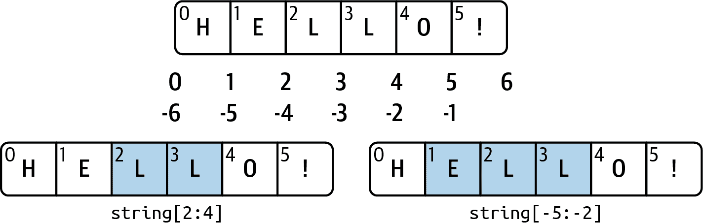

# 三、内置数据结构、函数和文件

> 原文：[`wesmckinney.com/book/python-builtin`](https://wesmckinney.com/book/python-builtin)
>
> 译者：[飞龙](https://github.com/wizardforcel)
>
> 协议：[CC BY-NC-SA 4.0](http://creativecommons.org/licenses/by-nc-sa/4.0/)


> 此开放访问网络版本的《Python 数据分析第三版》现已作为[印刷版和数字版](https://amzn.to/3DyLaJc)的伴侣提供。如果您发现任何勘误，请[在此处报告](https://oreilly.com/catalog/0636920519829/errata)。请注意，由 Quarto 生成的本站点的某些方面与 O'Reilly 的印刷版和电子书版本的格式不同。
> 
> 如果您发现本书的在线版本有用，请考虑[订购纸质版](https://amzn.to/3DyLaJc)或[无 DRM 的电子书](https://www.ebooks.com/en-us/book/210644288/python-for-data-analysis/wes-mckinney/?affId=WES398681F)以支持作者。本网站的内容不得复制或再生产。代码示例采用 MIT 许可，可在 GitHub 或 Gitee 上找到。

本章讨论了内置到 Python 语言中的功能，这些功能将在整本书中被广泛使用。虽然像 pandas 和 NumPy 这样的附加库为更大的数据集添加了高级计算功能，但它们旨在与 Python 的内置数据操作工具一起使用。

我们将从 Python 的主要数据结构开始：元组、列表、字典和集合。然后，我们将讨论如何创建自己可重用的 Python 函数。最后，我们将看看 Python 文件对象的机制以及如何与本地硬盘交互。

## 3.1 数据结构和序列

Python 的数据结构简单而强大。掌握它们的使用是成为熟练的 Python 程序员的关键部分。我们从元组、列表和字典开始，它们是一些最常用的*序列*类型。

### 元组

*元组*是 Python 对象的固定长度、不可变序列，一旦分配，就无法更改。创建元组的最简单方法是使用括号括起的逗号分隔的值序列：

```py
In [2]: tup = (4, 5, 6)

In [3]: tup
Out[3]: (4, 5, 6)
```

在许多情况下，括号可以省略，所以这里我们也可以这样写：

```py
In [4]: tup = 4, 5, 6

In [5]: tup
Out[5]: (4, 5, 6)
```

您可以通过调用`tuple`将任何序列或迭代器转换为元组：

```py
In [6]: tuple([4, 0, 2])
Out[6]: (4, 0, 2)

In [7]: tup = tuple('string')

In [8]: tup
Out[8]: ('s', 't', 'r', 'i', 'n', 'g')
```

元素可以使用方括号`[]`访问，就像大多数其他序列类型一样。与 C、C++、Java 和许多其他语言一样，在 Python 中，序列是从 0 开始索引的：

```py
In [9]: tup[0]
Out[9]: 's'
```

当您在更复杂的表达式中定义元组时，通常需要将值括在括号中，就像在创建元组的示例中一样：

```py
In [10]: nested_tup = (4, 5, 6), (7, 8)

In [11]: nested_tup
Out[11]: ((4, 5, 6), (7, 8))

In [12]: nested_tup[0]
Out[12]: (4, 5, 6)

In [13]: nested_tup[1]
Out[13]: (7, 8)
```

虽然存储在元组中的对象本身可能是可变的，但一旦创建了元组，就无法修改存储在每个槽中的对象：

```py
In [14]: tup = tuple(['foo', [1, 2], True])

In [15]: tup[2] = False
---------------------------------------------------------------------------
TypeError                                 Traceback (most recent call last)
<ipython-input-15-b89d0c4ae599> in <module>
----> 1 tup[2] = False
TypeError: 'tuple' object does not support item assignment
```

如果元组中的对象是可变的，比如列表，您可以就地修改它：

```py
In [16]: tup[1].append(3)

In [17]: tup
Out[17]: ('foo', [1, 2, 3], True)
```

您可以使用`+`运算符连接元组以生成更长的元组：

```py
In [18]: (4, None, 'foo') + (6, 0) + ('bar',)
Out[18]: (4, None, 'foo', 6, 0, 'bar')
```

将元组乘以一个整数，与列表一样，会产生该元组的多个副本的效果：

```py
In [19]: ('foo', 'bar') * 4
Out[19]: ('foo', 'bar', 'foo', 'bar', 'foo', 'bar', 'foo', 'bar')
```

请注意，对象本身并没有被复制，只有对它们的引用。

#### 解包元组

如果您尝试对类似元组的变量表达式进行*赋值*，Python 将尝试在等号右侧*解包*值：

```py
In [20]: tup = (4, 5, 6)

In [21]: a, b, c = tup

In [22]: b
Out[22]: 5
```

即使包含嵌套元组的序列也可以解包：

```py
In [23]: tup = 4, 5, (6, 7)

In [24]: a, b, (c, d) = tup

In [25]: d
Out[25]: 7
```

使用这个功能，您可以轻松交换变量名，这在许多语言中可能看起来像：

```py
tmp = a
a = b
b = tmp
```

但是，在 Python 中，交换可以这样做：

```py
In [26]: a, b = 1, 2

In [27]: a
Out[27]: 1

In [28]: b
Out[28]: 2

In [29]: b, a = a, b

In [30]: a
Out[30]: 2

In [31]: b
Out[31]: 1
```

变量解包的常见用途是迭代元组或列表的序列：

```py
In [32]: seq = [(1, 2, 3), (4, 5, 6), (7, 8, 9)]

In [33]: for a, b, c in seq:
 ....:     print(f'a={a}, b={b}, c={c}')
a=1, b=2, c=3
a=4, b=5, c=6
a=7, b=8, c=9
```

另一个常见用途是从函数返回多个值。我稍后会更详细地介绍这个问题。

有一些情况下，您可能希望从元组的开头“摘取”一些元素。有一种特殊的语法可以做到这一点，`*rest`，这也用于函数签名中捕获任意长的位置参数：

```py
In [34]: values = 1, 2, 3, 4, 5

In [35]: a, b, *rest = values

In [36]: a
Out[36]: 1

In [37]: b
Out[37]: 2

In [38]: rest
Out[38]: [3, 4, 5]
```

这个`rest`位有时是您想要丢弃的内容；`rest`名称没有特殊之处。作为一种惯例，许多 Python 程序员会使用下划线（`_`）表示不需要的变量：

```py
In [39]: a, b, *_ = values
```

#### 元组方法

由于元组的大小和内容不能被修改，因此实例方法非常少。一个特别有用的方法（也适用于列表）是`count`，它计算值的出现次数：

```py
In [40]: a = (1, 2, 2, 2, 3, 4, 2)

In [41]: a.count(2)
Out[41]: 4
```

### 列表

与元组相反，列表是可变长度的，其内容可以就地修改。列表是可变的。您可以使用方括号`[]`定义它们，也可以使用`list`类型函数：

```py
In [42]: a_list = [2, 3, 7, None]

In [43]: tup = ("foo", "bar", "baz")

In [44]: b_list = list(tup)

In [45]: b_list
Out[45]: ['foo', 'bar', 'baz']

In [46]: b_list[1] = "peekaboo"

In [47]: b_list
Out[47]: ['foo', 'peekaboo', 'baz']
```

列表和元组在语义上是相似的（尽管元组不能被修改），并且可以在许多函数中互换使用。

`list`内置函数在数据处理中经常用作实例化迭代器或生成器表达式的方法：

```py
In [48]: gen = range(10)

In [49]: gen
Out[49]: range(0, 10)

In [50]: list(gen)
Out[50]: [0, 1, 2, 3, 4, 5, 6, 7, 8, 9]
```

#### 添加和删除元素

元素可以使用`append`方法附加到列表的末尾：

```py
In [51]: b_list.append("dwarf")

In [52]: b_list
Out[52]: ['foo', 'peekaboo', 'baz', 'dwarf']
```

使用`insert`可以在列表中的特定位置插入元素：

```py
In [53]: b_list.insert(1, "red")

In [54]: b_list
Out[54]: ['foo', 'red', 'peekaboo', 'baz', 'dwarf']
```

插入索引必须在列表的长度之间，包括 0 和长度。

警告：

与`append`相比，`insert`的计算成本较高，因为必须在内部移动后续元素的引用以为新元素腾出空间。如果需要在序列的开头和结尾插入元素，您可能希望探索`collections.deque`，这是一个双端队列，专为此目的进行了优化，并且包含在 Python 标准库中。

`insert`的反向操作是`pop`，它会删除并返回特定索引处的元素：

```py
In [55]: b_list.pop(2)
Out[55]: 'peekaboo'

In [56]: b_list
Out[56]: ['foo', 'red', 'baz', 'dwarf']
```

可以使用`remove`按值删除元素，它会定位第一个这样的值并将其从列表中删除：

```py
In [57]: b_list.append("foo")

In [58]: b_list
Out[58]: ['foo', 'red', 'baz', 'dwarf', 'foo']

In [59]: b_list.remove("foo")

In [60]: b_list
Out[60]: ['red', 'baz', 'dwarf', 'foo']
```

如果不关心性能，通过使用`append`和`remove`，可以使用 Python 列表作为类似集合的数据结构（尽管 Python 有实际的集合对象，稍后讨论）。

使用`in`关键字检查列表是否包含一个值：

```py
In [61]: "dwarf" in b_list
Out[61]: True
```

关键字`not`可以用来否定`in`：

```py
In [62]: "dwarf" not in b_list
Out[62]: False
```

检查列表是否包含一个值比使用字典和集合慢得多（即将介绍），因为 Python 会在线性扫描列表的值，而可以在常量时间内检查其他值（基于哈希表）。

#### 连接和组合列表

与元组类似，使用`+`将两个列表相加会将它们连接起来：

```py
In [63]: [4, None, "foo"] + [7, 8, (2, 3)]
Out[63]: [4, None, 'foo', 7, 8, (2, 3)]
```

如果已经定义了一个列表，可以使用`extend`方法将多个元素附加到其中：

```py
In [64]: x = [4, None, "foo"]

In [65]: x.extend([7, 8, (2, 3)])

In [66]: x
Out[66]: [4, None, 'foo', 7, 8, (2, 3)]
```

请注意，通过加法进行列表连接是一种相对昂贵的操作，因为必须创建一个新列表并复制对象。通常最好使用`extend`将元素附加到现有列表中，特别是如果您正在构建一个大列表。因此：

```py
everything = []
for chunk in list_of_lists:
 everything.extend(chunk)
```

比连接替代方案更快：

```py
everything = []
for chunk in list_of_lists:
 everything = everything + chunk
```

#### 排序

您可以通过调用其`sort`函数就地对列表进行排序（而不创建新对象）：

```py
In [67]: a = [7, 2, 5, 1, 3]

In [68]: a.sort()

In [69]: a
Out[69]: [1, 2, 3, 5, 7]
```

`sort`有一些选项，偶尔会派上用场。其中之一是能够传递一个次要*排序键*——即生成用于对对象进行排序的值的函数。例如，我们可以按字符串的长度对字符串集合进行排序：

```py
In [70]: b = ["saw", "small", "He", "foxes", "six"]

In [71]: b.sort(key=len)

In [72]: b
Out[72]: ['He', 'saw', 'six', 'small', 'foxes']
```

很快，我们将看一下`sorted`函数，它可以生成一份排序后的一般序列的副本。

#### 切片

您可以使用切片表示法选择大多数序列类型的部分，其基本形式是将`start:stop`传递给索引运算符`[]`：

```py
In [73]: seq = [7, 2, 3, 7, 5, 6, 0, 1]

In [74]: seq[1:5]
Out[74]: [2, 3, 7, 5]
```

切片也可以用序列赋值：

```py
In [75]: seq[3:5] = [6, 3]

In [76]: seq
Out[76]: [7, 2, 3, 6, 3, 6, 0, 1]
```

虽然`start`索引处的元素被包括在内，但`stop`索引*不包括*在内，因此结果中的元素数量为`stop - start`。

`start`或`stop`可以省略，此时它们分别默认为序列的开头和序列的结尾：

```py
In [77]: seq[:5]
Out[77]: [7, 2, 3, 6, 3]

In [78]: seq[3:]
Out[78]: [6, 3, 6, 0, 1]
```

负索引相对于末尾切片序列：

```py
In [79]: seq[-4:]
Out[79]: [3, 6, 0, 1]

In [80]: seq[-6:-2]
Out[80]: [3, 6, 3, 6]
```

切片语义需要一点时间来适应，特别是如果你是从 R 或 MATLAB 过来的。参见图 3.1 以了解使用正整数和负整数进行切片的有用示例。在图中，索引显示在“箱边缘”，以帮助显示使用正整数或负整数索引开始和停止的切片选择。



图 3.1：Python 切片约定的示例

第二个冒号后也可以使用`step`，比如，每隔一个元素取一个：

```py
In [81]: seq[::2]
Out[81]: [7, 3, 3, 0]
```

这种方法的一个巧妙用法是传递`-1`，这样可以有效地反转列表或元组：

```py
In [82]: seq[::-1]
Out[82]: [1, 0, 6, 3, 6, 3, 2, 7]
```

### 字典

字典或`dict`可能是 Python 中最重要的内置数据结构。在其他编程语言中，字典有时被称为*哈希映射*或*关联数组*。字典存储一组*键-值*对，其中*键*和*值*是 Python 对象。每个键都与一个值关联，以便可以方便地检索、插入、修改或删除给定特定键的值。创建字典的一种方法是使用大括号`{}`和冒号来分隔键和值：

```py
In [83]: empty_dict = {}

In [84]: d1 = {"a": "some value", "b": [1, 2, 3, 4]}

In [85]: d1
Out[85]: {'a': 'some value', 'b': [1, 2, 3, 4]}
```

可以使用与访问列表或元组元素相同的语法来访问、插入或设置元素：

```py
In [86]: d1[7] = "an integer"

In [87]: d1
Out[87]: {'a': 'some value', 'b': [1, 2, 3, 4], 7: 'an integer'}

In [88]: d1["b"]
Out[88]: [1, 2, 3, 4]
```

你可以使用与检查列表或元组是否包含值相同的语法来检查字典是否包含键：

```py
In [89]: "b" in d1
Out[89]: True
```

可以使用`del`关键字或`pop`方法（同时返回值并删除键）来删除值：

```py
In [90]: d1[5] = "some value"

In [91]: d1
Out[91]: 
{'a': 'some value',
 'b': [1, 2, 3, 4],
 7: 'an integer',
 5: 'some value'}

In [92]: d1["dummy"] = "another value"

In [93]: d1
Out[93]: 
{'a': 'some value',
 'b': [1, 2, 3, 4],
 7: 'an integer',
 5: 'some value',
 'dummy': 'another value'}

In [94]: del d1[5]

In [95]: d1
Out[95]: 
{'a': 'some value',
 'b': [1, 2, 3, 4],
 7: 'an integer',
 'dummy': 'another value'}

In [96]: ret = d1.pop("dummy")

In [97]: ret
Out[97]: 'another value'

In [98]: d1
Out[98]: {'a': 'some value', 'b': [1, 2, 3, 4], 7: 'an integer'}
```

`keys`和`values`方法分别为你提供字典的键和值的迭代器。键的顺序取决于它们插入的顺序，这些函数以相同的顺序输出键和值：

```py
In [99]: list(d1.keys())
Out[99]: ['a', 'b', 7]

In [100]: list(d1.values())
Out[100]: ['some value', [1, 2, 3, 4], 'an integer']
```

如果需要同时迭代键和值，可以使用`items`方法以 2 元组的形式迭代键和值：

```py
In [101]: list(d1.items())
Out[101]: [('a', 'some value'), ('b', [1, 2, 3, 4]), (7, 'an integer')]
```

可以使用`update`方法将一个字典合并到另一个字典中：

```py
In [102]: d1.update({"b": "foo", "c": 12})

In [103]: d1
Out[103]: {'a': 'some value', 'b': 'foo', 7: 'an integer', 'c': 12}
```

`update`方法会直接更改字典，因此传递给`update`的数据中的任何现有键都将丢弃其旧值。

#### 从序列创建字典

通常会偶尔出现两个你想要逐个元素配对的序列。作为第一步，你可能会编写这样的代码：

```py
mapping = {}
for key, value in zip(key_list, value_list):
 mapping[key] = value
```

由于字典本质上是 2 元组的集合，`dict`函数接受一个 2 元组的列表：

```py
In [104]: tuples = zip(range(5), reversed(range(5)))

In [105]: tuples
Out[105]: <zip at 0x17d604d00>

In [106]: mapping = dict(tuples)

In [107]: mapping
Out[107]: {0: 4, 1: 3, 2: 2, 3: 1, 4: 0}
```

稍后我们将讨论*字典推导*，这是构建字典的另一种方法。

#### 默认值

通常会有类似以下逻辑：

```py
if key in some_dict:
 value = some_dict[key]
else:
 value = default_value
```

因此，字典方法`get`和`pop`可以接受要返回的默认值，因此上述`if-else`块可以简单地写为：

```py
value = some_dict.get(key, default_value)
```

`get`默认情况下会返回`None`，如果键不存在，而`pop`会引发异常。在*设置*值时，可能字典中的值是另一种集合，比如列表。例如，你可以想象将单词列表按照它们的首字母分类为列表的字典：

```py
In [108]: words = ["apple", "bat", "bar", "atom", "book"]

In [109]: by_letter = {}

In [110]: for word in words:
 .....:     letter = word[0]
 .....:     if letter not in by_letter:
 .....:         by_letter[letter] = [word]
 .....:     else:
 .....:         by_letter[letter].append(word)
 .....:

In [111]: by_letter
Out[111]: {'a': ['apple', 'atom'], 'b': ['bat', 'bar', 'book']}
```

`setdefault`字典方法可用于简化此工作流程。前面的`for`循环可以重写为：

```py
In [112]: by_letter = {}

In [113]: for word in words:
 .....:     letter = word[0]
 .....:     by_letter.setdefault(letter, []).append(word)
 .....:

In [114]: by_letter
Out[114]: {'a': ['apple', 'atom'], 'b': ['bat', 'bar', 'book']}
```

内置的`collections`模块有一个有用的类`defaultdict`，使这更加容易。要创建一个，你需要传递一个类型或函数，用于为字典中的每个槽生成默认值：

```py
In [115]: from collections import defaultdict

In [116]: by_letter = defaultdict(list)

In [117]: for word in words:
 .....:     by_letter[word[0]].append(word)
```

#### 有效的字典键类型

虽然字典的值可以是任何 Python 对象，但键通常必须是不可变对象，如标量类型（int、float、string）或元组（元组中的所有对象也必须是不可变的）。这里的技术术语是*可哈希性*。你可以使用`hash`函数检查对象是否可哈希（可以用作字典中的键）：

```py
In [118]: hash("string")
Out[118]: 4022908869268713487

In [119]: hash((1, 2, (2, 3)))
Out[119]: -9209053662355515447

In [120]: hash((1, 2, [2, 3])) # fails because lists are mutable
---------------------------------------------------------------------------
TypeError                                 Traceback (most recent call last)
<ipython-input-120-473c35a62c0b> in <module>
----> 1 hash((1, 2, [2, 3])) # fails because lists are mutable
TypeError: unhashable type: 'list'
```

通常情况下，使用`hash`函数时看到的哈希值将取决于你使用的 Python 版本。

要将列表用作键，一种选择是将其转换为元组，只要其元素也可以被散列：

```py
In [121]: d = {}

In [122]: d[tuple([1, 2, 3])] = 5

In [123]: d
Out[123]: {(1, 2, 3): 5}
```

### 集合

*集合*是一个无序的唯一元素集合。可以通过`set`函数或使用花括号的*集合字面值*来创建集合：

```py
In [124]: set([2, 2, 2, 1, 3, 3])
Out[124]: {1, 2, 3}

In [125]: {2, 2, 2, 1, 3, 3}
Out[125]: {1, 2, 3}
```

集合支持数学*集合操作*，如并集、交集、差集和对称差集。考虑这两个示例集合：

```py
In [126]: a = {1, 2, 3, 4, 5}

In [127]: b = {3, 4, 5, 6, 7, 8}
```

这两个集合的并集是两个集合中出现的不同元素的集合。可以使用`union`方法或`|`二进制运算符来计算：

```py
In [128]: a.union(b)
Out[128]: {1, 2, 3, 4, 5, 6, 7, 8}

In [129]: a | b
Out[129]: {1, 2, 3, 4, 5, 6, 7, 8}
```

交集包含两个集合中都出现的元素。可以使用`&`运算符或`intersection`方法：

```py
In [130]: a.intersection(b)
Out[130]: {3, 4, 5}

In [131]: a & b
Out[131]: {3, 4, 5}
```

请参见表 3.1 以获取常用集合方法的列表。

表 3.1：Python 集合操作

| 函数 | 替代语法 | 描述 |
| --- | --- | --- |
| `a.add(x)` | N/A | 将元素`x`添加到集合`a`中 |
| `a.clear()` | N/A | 将集合`a`重置为空状态，丢弃所有元素 |
| `a.remove(x)` | N/A | 从集合`a`中删除元素`x` |
| `a.pop()` | N/A | 从集合`a`中删除一个任意元素，如果集合为空则引发`KeyError` |
| `a.union(b)` | `a &#124; b` | `a`和`b`中所有唯一的元素 |
| `a.update(b)` | `a &#124;= b` | 将`a`的内容设置为`a`和`b`中元素的并集 |
| `a.intersection(b)` | `a & b` | `a`和`b`中*都*存在的所有元素 |
| `a.intersection_update(b)` | `a &= b` | 将`a`的内容设置为`a`和`b`中元素的交集 |
| `a.difference(b)` | `a - b` | `a`中不在`b`中的元素 |
| `a.difference_update(b)` | `a -= b` | 将`a`设置为`a`中不在`b`中的元素 |
| `a.symmetric_difference(b)` | `a ^ b` | `a`或`b`中的所有元素，但*不是*两者都有的 |
| `a.symmetric_difference_update(b)` | `a ^= b` | 将`a`设置为`a`或`b`中的元素，但*不是*两者都有的 |
| `a.issubset(b)` | `<=` | 如果`a`的元素都包含在`b`中，则为`True` |
| `a.issuperset(b)` | `>=` | 如果`b`的元素都包含在`a`中，则为`True` |
| `a.isdisjoint(b)` | N/A | 如果`a`和`b`没有共同元素，则为`True` |

注意

如果将不是集合的输入传递给`union`和`intersection`等方法，Python 将在执行操作之前将输入转换为集合。在使用二进制运算符时，两个对象必须已经是集合。

所有逻辑集合操作都有原地对应物，这使您可以用结果替换操作左侧集合的内容。对于非常大的集合，这可能更有效率：*

```py
In [132]: c = a.copy()

In [133]: c |= b

In [134]: c
Out[134]: {1, 2, 3, 4, 5, 6, 7, 8}

In [135]: d = a.copy()

In [136]: d &= b

In [137]: d
Out[137]: {3, 4, 5}
```

与字典键类似，集合元素通常必须是不可变的，并且它们必须是*可散列*的（这意味着对值调用`hash`不会引发异常）。为了将类似列表的元素（或其他可变序列）存储在集合中，可以将它们转换为元组：

```py
In [138]: my_data = [1, 2, 3, 4]

In [139]: my_set = {tuple(my_data)}

In [140]: my_set
Out[140]: {(1, 2, 3, 4)}
```

您还可以检查一个集合是否是另一个集合的子集（包含在内）或超集（包含所有元素）：

```py
In [141]: a_set = {1, 2, 3, 4, 5}

In [142]: {1, 2, 3}.issubset(a_set)
Out[142]: True

In [143]: a_set.issuperset({1, 2, 3})
Out[143]: True
```

只有当集合的内容相等时，集合才相等：

```py
In [144]: {1, 2, 3} == {3, 2, 1}
Out[144]: True
```

### 内置序列函数

Python 有一些有用的序列函数，您应该熟悉并在任何机会使用。

#### enumerate

在迭代序列时，通常希望跟踪当前项目的索引。自己动手的方法如下：

```py
index = 0
for value in collection:
 # do something with value
 index += 1
```

由于这种情况很常见，Python 有一个内置函数`enumerate`，它返回一个`(i, value)`元组序列：

```py
for index, value in enumerate(collection):
 # do something with value
```

#### sorted

`sorted`函数从任何序列的元素返回一个新的排序列表：

```py
In [145]: sorted([7, 1, 2, 6, 0, 3, 2])
Out[145]: [0, 1, 2, 2, 3, 6, 7]

In [146]: sorted("horse race")
Out[146]: [' ', 'a', 'c', 'e', 'e', 'h', 'o', 'r', 'r', 's']
```

`sorted`函数接受与列表的`sort`方法相同的参数。

#### zip

`zip`将多个列表、元组或其他序列的元素“配对”起来，以创建一个元组列表：

```py
In [147]: seq1 = ["foo", "bar", "baz"]

In [148]: seq2 = ["one", "two", "three"]

In [149]: zipped = zip(seq1, seq2)

In [150]: list(zipped)
Out[150]: [('foo', 'one'), ('bar', 'two'), ('baz', 'three')]
```

`zip`可以接受任意数量的序列，并且它生成的元素数量由*最短*的序列决定：

```py
In [151]: seq3 = [False, True]

In [152]: list(zip(seq1, seq2, seq3))
Out[152]: [('foo', 'one', False), ('bar', 'two', True)]
```

`zip`的一个常见用法是同时迭代多个序列，可能还与`enumerate`结合使用：

```py
In [153]: for index, (a, b) in enumerate(zip(seq1, seq2)):
 .....:     print(f"{index}: {a}, {b}")
 .....:
0: foo, one
1: bar, two
2: baz, three
```

#### 反转

`reversed`以相反的顺序迭代序列的元素：

```py
In [154]: list(reversed(range(10)))
Out[154]: [9, 8, 7, 6, 5, 4, 3, 2, 1, 0]
```

请记住，`reversed`是一个生成器（稍后将更详细讨论），因此它不会创建反转的序列，直到实现（例如，使用`list`或`for`循环）。

### 列表、集合和字典推导

*列表推导*是 Python 语言中一个方便且广泛使用的特性。它们允许您通过过滤集合的元素，将通过过滤的元素转换为一个简洁的表达式来简洁地形成一个新列表。它们的基本形式如下：

```py
[expr for value in collection if condition]
```

这等同于以下的`for`循环：

```py
result = []
for value in collection:
 if condition:
 result.append(expr)
```

过滤条件可以被省略，只留下表达式。例如，给定一个字符串列表，我们可以过滤出长度为`2`或更少的字符串，并将它们转换为大写：

```py
In [155]: strings = ["a", "as", "bat", "car", "dove", "python"]

In [156]: [x.upper() for x in strings if len(x) > 2]
Out[156]: ['BAT', 'CAR', 'DOVE', 'PYTHON']
```

集合和字典推导是一个自然的扩展，以一种类似的方式产生集合和字典，而不是列表。

字典推导看起来像这样：

```py
dict_comp = {key-expr: value-expr for value in collection
 if condition}
```

集合推导看起来与等效的列表推导相同，只是用花括号代替方括号：

```py
set_comp = {expr for value in collection if condition}
```

与列表推导类似，集合和字典推导大多是便利性的，但它们同样可以使代码更易于编写和阅读。考虑之前的字符串列表。假设我们想要一个集合，其中只包含集合中包含的字符串的长度；我们可以很容易地使用集合推导来计算：

```py
In [157]: unique_lengths = {len(x) for x in strings}

In [158]: unique_lengths
Out[158]: {1, 2, 3, 4, 6}
```

我们也可以更加功能化地使用`map`函数，稍后介绍：

```py
In [159]: set(map(len, strings))
Out[159]: {1, 2, 3, 4, 6}
```

作为一个简单的字典推导示例，我们可以创建一个查找这些字符串在列表中位置的查找映射：

```py
In [160]: loc_mapping = {value: index for index, value in enumerate(strings)}

In [161]: loc_mapping
Out[161]: {'a': 0, 'as': 1, 'bat': 2, 'car': 3, 'dove': 4, 'python': 5}
```

#### 嵌套列表推导

假设我们有一个包含一些英文和西班牙名字的列表列表：

```py
In [162]: all_data = [["John", "Emily", "Michael", "Mary", "Steven"],
 .....:             ["Maria", "Juan", "Javier", "Natalia", "Pilar"]]
```

假设我们想要获得一个包含所有包含两个或更多个`a`的名称的单个列表。我们可以通过一个简单的`for`循环来实现：

```py
In [163]: names_of_interest = []

In [164]: for names in all_data:
 .....:     enough_as = [name for name in names if name.count("a") >= 2]
 .....:     names_of_interest.extend(enough_as)
 .....:

In [165]: names_of_interest
Out[165]: ['Maria', 'Natalia']
```

实际上，您可以将整个操作封装在一个单独的*嵌套列表推导*中，看起来像：

```py
In [166]: result = [name for names in all_data for name in names
 .....:           if name.count("a") >= 2]

In [167]: result
Out[167]: ['Maria', 'Natalia']
```

起初，嵌套列表推导可能有点难以理解。列表推导的`for`部分按照嵌套的顺序排列，任何过滤条件都放在最后。这里是另一个示例，我们将整数元组的列表“展平”为一个简单的整数列表：

```py
In [168]: some_tuples = [(1, 2, 3), (4, 5, 6), (7, 8, 9)]

In [169]: flattened = [x for tup in some_tuples for x in tup]

In [170]: flattened
Out[170]: [1, 2, 3, 4, 5, 6, 7, 8, 9]
```

请记住，如果您写一个嵌套的`for`循环而不是列表推导，`for`表达式的顺序将是相同的：

```py
flattened = []

for tup in some_tuples:
 for x in tup:
 flattened.append(x)
```

您可以有任意多层的嵌套，尽管如果您有超过两三层的嵌套，您可能应该开始质疑这是否在代码可读性方面是有意义的。重要的是要区分刚刚显示的语法与列表推导内部的列表推导，后者也是完全有效的：

```py
In [172]: [[x for x in tup] for tup in some_tuples]
Out[172]: [[1, 2, 3], [4, 5, 6], [7, 8, 9]]
```

这将产生一个列表的列表，而不是所有内部元素的扁平化列表。

## 3.2 函数

*函数*是 Python 中代码组织和重用的主要和最重要的方法。作为一个经验法则，如果您预计需要重复相同或非常相似的代码超过一次，编写可重用的函数可能是值得的。函数还可以通过给一组 Python 语句命名来使您的代码更易读。

函数使用`def`关键字声明。函数包含一个代码块，可选使用`return`关键字：

```py
In [173]: def my_function(x, y):
 .....:     return x + y
```

当到达带有`return`的行时，`return`后的值或表达式将发送到调用函数的上下文，例如：

```py
In [174]: my_function(1, 2)
Out[174]: 3

In [175]: result = my_function(1, 2)

In [176]: result
Out[176]: 3
```

有多个`return`语句是没有问题的。如果 Python 在函数结尾处没有遇到`return`语句，将自动返回`None`。例如：

```py
In [177]: def function_without_return(x):
 .....:     print(x)

In [178]: result = function_without_return("hello!")
hello!

In [179]: print(result)
None
```

每个函数可以有 *位置* 参数和 *关键字* 参数。关键字参数最常用于指定默认值或可选参数。在这里，我们将定义一个带有默认值 `1.5` 的可选 `z` 参数的函数：

```py
def my_function2(x, y, z=1.5):
 if z > 1:
 return z * (x + y)
 else:
 return z / (x + y)
```

虽然关键字参数是可选的，但在调用函数时必须指定所有位置参数。

您可以向 `z` 参数传递值，可以使用关键字也可以不使用关键字，但建议使用关键字：

```py
In [181]: my_function2(5, 6, z=0.7)
Out[181]: 0.06363636363636363

In [182]: my_function2(3.14, 7, 3.5)
Out[182]: 35.49

In [183]: my_function2(10, 20)
Out[183]: 45.0
```

对函数参数的主要限制是关键字参数 *必须* 跟在位置参数（如果有的话）后面。您可以以任何顺序指定关键字参数。这使您不必记住函数参数的指定顺序。您只需要记住它们的名称。

### 命名空间、作用域和本地函数

函数可以访问函数内部创建的变量以及函数外部在更高（甚至 *全局*）作用域中的变量。在 Python 中描述变量作用域的另一种更具描述性的名称是 *命名空间*。在函数内部分配的任何变量默认分配给本地命名空间。本地命名空间在函数调用时创建，并立即由函数的参数填充。函数完成后，本地命名空间将被销毁（有一些例外情况超出了本章的范围）。考虑以下函数：

```py
def func():
 a = []
 for i in range(5):
 a.append(i)
```

当调用 `func()` 时，将创建空列表 `a`，附加五个元素，然后在函数退出时销毁 `a`。假设我们改为这样声明 `a`：

```py
In [184]: a = []

In [185]: def func():
 .....:     for i in range(5):
 .....:         a.append(i)
```

每次调用 `func` 都会修改列表 `a`：

```py
In [186]: func()

In [187]: a
Out[187]: [0, 1, 2, 3, 4]

In [188]: func()

In [189]: a
Out[189]: [0, 1, 2, 3, 4, 0, 1, 2, 3, 4]
```

在函数范围之外分配变量是可能的，但这些变量必须使用 `global` 或 `nonlocal` 关键字显式声明：

```py
In [190]: a = None

In [191]: def bind_a_variable():
 .....:     global a
 .....:     a = []
 .....: bind_a_variable()
 .....:

In [192]: print(a)
[]
```

`nonlocal` 允许函数修改在非全局高级作用域中定义的变量。由于它的使用有些神秘（我在这本书中从未使用过它），我建议您查阅 Python 文档以了解更多信息。

注意

我通常不鼓励使用 `global` 关键字。通常，全局变量用于在系统中存储某种状态。如果您发现自己使用了很多全局变量，这可能表明需要使用面向对象编程（使用类）

### 返回多个值

当我在 Java 和 C++ 中编程后第一次在 Python 中编程时，我最喜欢的功能之一是能够以简单的语法从函数中返回多个值。这里有一个例子：

```py
def f():
 a = 5
 b = 6
 c = 7
 return a, b, c

a, b, c = f()
```

在数据分析和其他科学应用中，您可能经常这样做。这里发生的是函数实际上只返回一个对象，一个元组，然后将其解包为结果变量。在前面的例子中，我们可以这样做：

```py
return_value = f()
```

在这种情况下，`return_value` 将是一个包含三个返回变量的 3 元组。与之前返回多个值的一个潜在有吸引力的替代方法可能是返回一个字典：

```py
def f():
 a = 5
 b = 6
 c = 7
 return {"a" : a, "b" : b, "c" : c}
```

这种替代技术可以根据您尝试做什么而有用。

### 函数是对象

由于 Python 函数是对象，许多构造可以很容易地表达，而在其他语言中很难做到。假设我们正在进行一些数据清理，并需要对以下字符串列表应用一系列转换：

```py
In [193]: states = ["   Alabama ", "Georgia!", "Georgia", "georgia", "FlOrIda",
 .....:           "south   carolina##", "West virginia?"]
```

任何曾经处理过用户提交的调查数据的人都会看到这样混乱的结果。需要做很多事情才能使这个字符串列表统一并准备好进行分析：去除空格、删除标点符号，并标准化适当的大写。其中一种方法是使用内置的字符串方法以及 `re` 标准库模块进行正则表达式：

```py
import re

def clean_strings(strings):
 result = []
 for value in strings:
 value = value.strip()
 value = re.sub("[!#?]", "", value)
 value = value.title()
 result.append(value)
 return result
```

结果如下：

```py
In [195]: clean_strings(states)
Out[195]: 
['Alabama',
 'Georgia',
 'Georgia',
 'Georgia',
 'Florida',
 'South   Carolina',
 'West Virginia']
```

您可能会发现有用的另一种方法是制作一个要应用于特定字符串集的操作列表：

```py
def remove_punctuation(value):
 return re.sub("[!#?]", "", value)

clean_ops = [str.strip, remove_punctuation, str.title]

def clean_strings(strings, ops):
 result = []
 for value in strings:
 for func in ops:
 value = func(value)
 result.append(value)
 return result
```

然后我们有以下内容：

```py
In [197]: clean_strings(states, clean_ops)
Out[197]: 
['Alabama',
 'Georgia',
 'Georgia',
 'Georgia',
 'Florida',
 'South   Carolina',
 'West Virginia']
```

像这样的更*函数式*模式使您能够轻松修改字符串在非常高级别上的转换方式。`clean_strings`函数现在也更具可重用性和通用性。

您可以将函数用作其他函数的参数，比如内置的`map`函数，它将一个函数应用于某种序列：

```py
In [198]: for x in map(remove_punctuation, states):
 .....:     print(x)
Alabama 
Georgia
Georgia
georgia
FlOrIda
south   carolina
West virginia
```

`map`可以作为替代方案用于列表推导而不需要任何过滤器。

### 匿名（Lambda）函数

Python 支持所谓的*匿名*或*lambda*函数，这是一种编写由单个语句组成的函数的方式，其结果是返回值。它们使用`lambda`关键字定义，该关键字除了“我们正在声明一个匿名函数”之外没有其他含义：

```py
In [199]: def short_function(x):
 .....:     return x * 2

In [200]: equiv_anon = lambda x: x * 2
```

我通常在本书的其余部分中将这些称为 lambda 函数。它们在数据分析中特别方便，因为正如您将看到的，有许多情况下，数据转换函数将接受函数作为参数。与编写完整函数声明或甚至将 lambda 函数分配给本地变量相比，传递 lambda 函数通常更少输入（更清晰）。考虑这个例子：

```py
In [201]: def apply_to_list(some_list, f):
 .....:     return [f(x) for x in some_list]

In [202]: ints = [4, 0, 1, 5, 6]

In [203]: apply_to_list(ints, lambda x: x * 2)
Out[203]: [8, 0, 2, 10, 12]
```

您也可以写成`[x * 2 for x in ints]`，但在这里我们能够简洁地将自定义运算符传递给`apply_to_list`函数。

举个例子，假设你想按每个字符串中不同字母的数量对字符串集合进行排序：

```py
In [204]: strings = ["foo", "card", "bar", "aaaa", "abab"]
```

在这里，我们可以将一个 lambda 函数传递给列表的`sort`方法：

```py
In [205]: strings.sort(key=lambda x: len(set(x)))

In [206]: strings
Out[206]: ['aaaa', 'foo', 'abab', 'bar', 'card']
```

### 生成器

Python 中的许多对象支持迭代，例如列表中的对象或文件中的行。这是通过*迭代器协议*实现的，这是一种使对象可迭代的通用方法。例如，对字典进行迭代会产生字典键：

```py
In [207]: some_dict = {"a": 1, "b": 2, "c": 3}

In [208]: for key in some_dict:
 .....:     print(key)
a
b
c
```

当您写`for key in some_dict`时，Python 解释器首先尝试从`some_dict`创建一个迭代器：

```py
In [209]: dict_iterator = iter(some_dict)

In [210]: dict_iterator
Out[210]: <dict_keyiterator at 0x17d60e020>
```

迭代器是任何对象，在上下文中像`for`循环中使用时，将向 Python 解释器产生对象。大多数期望列表或类似列表的对象的方法也将接受任何可迭代对象。这包括内置方法如`min`、`max`和`sum`，以及类构造函数如`list`和`tuple`：

```py
In [211]: list(dict_iterator)
Out[211]: ['a', 'b', 'c']
```

*生成器*是一种方便的方式，类似于编写普通函数，来构造一个新的可迭代对象。普通函数一次执行并返回一个结果，而生成器可以通过暂停和恢复执行每次使用生成器时返回多个值的序列。要创建一个生成器，请在函数中使用`yield`关键字而不是`return`：

```py
def squares(n=10):
 print(f"Generating squares from 1 to {n ** 2}")
 for i in range(1, n + 1):
 yield i ** 2
```

当您实际调用生成器时，不会立即执行任何代码：

```py
In [213]: gen = squares()

In [214]: gen
Out[214]: <generator object squares at 0x17d5fea40>
```

直到您请求生成器的元素时，它才开始执行其代码：

```py
In [215]: for x in gen:
 .....:     print(x, end=" ")
Generating squares from 1 to 100
1 4 9 16 25 36 49 64 81 100
```

注意

由于生成器一次产生一个元素的输出，而不是一次产生整个列表，这可以帮助您的程序使用更少的内存。

#### 生成器表达式

另一种生成器的方法是使用*生成器表达式*。这是列表、字典和集合推导的生成器类比。要创建一个，将否则是列表推导的内容括在括号中而不是方括号中：

```py
In [216]: gen = (x ** 2 for x in range(100))

In [217]: gen
Out[217]: <generator object <genexpr> at 0x17d5feff0>
```

这等同于以下更冗长的生成器：

```py
def _make_gen():
 for x in range(100):
 yield x ** 2
gen = _make_gen()
```

生成器表达式可以在某些情况下用作函数参数，而不是列表推导：

```py
In [218]: sum(x ** 2 for x in range(100))
Out[218]: 328350

In [219]: dict((i, i ** 2) for i in range(5))
Out[219]: {0: 0, 1: 1, 2: 4, 3: 9, 4: 16}
```

根据推导表达式产生的元素数量，生成器版本有时可以更有意义地更快。

#### itertools 模块

标准库`itertools`模块具有许多常见数据算法的生成器集合。例如，`groupby`接受任何序列和一个函数，通过函数的返回值对序列中的连续元素进行分组。这里是一个例子：

```py
In [220]: import itertools

In [221]: def first_letter(x):
 .....:     return x[0]

In [222]: names = ["Alan", "Adam", "Wes", "Will", "Albert", "Steven"]

In [223]: for letter, names in itertools.groupby(names, first_letter):
 .....:     print(letter, list(names)) # names is a generator
A ['Alan', 'Adam']
W ['Wes', 'Will']
A ['Albert']
S ['Steven']
```

查看表 3.2 以获取我经常发现有用的其他一些`itertools`函数列表。您可能想查看[官方 Python 文档](https://docs.python.org/3/library/itertools.html)以获取有关这个有用的内置实用程序模块的更多信息。

表 3.2：一些有用的`itertools`函数

| 函数 | 描述 |
| --- | --- |
| `chain(*iterables)` | 通过将迭代器链接在一起生成序列。一旦第一个迭代器的元素用尽，将返回下一个迭代器的元素，依此类推。 |
| `combinations(iterable, k)` | 生成可迭代对象中所有可能的`k`元素元组的序列，忽略顺序且不重复（另请参阅伴随函数`combinations_with_replacement`）。 |
| `permutations(iterable, k)` | 生成可迭代对象中所有可能的`k`元素元组的序列，保持顺序。 |
| `groupby(iterable[, keyfunc])` | 为每个唯一键生成`(key, sub-iterator)`。 |

| `product(*iterables, repeat=1)` | 生成输入可迭代对象的笛卡尔积作为元组，类似于嵌套的`for`循环。 |

### 错误和异常处理

处理 Python 错误或*异常*的优雅是构建健壮程序的重要部分。在数据分析应用中，许多函数只对特定类型的输入有效。例如，Python 的`float`函数能够将字符串转换为浮点数，但在不当输入时会引发`ValueError`异常：

```py
In [224]: float("1.2345")
Out[224]: 1.2345

In [225]: float("something")
---------------------------------------------------------------------------
ValueError                                Traceback (most recent call last)
<ipython-input-225-5ccfe07933f4> in <module>
----> 1 float("something")
ValueError: could not convert string to float: 'something'
```

假设我们想要一个版本的`float`，它能够优雅地失败，返回输入参数。我们可以通过编写一个函数，在其中将对`float`的调用封装在`try`/`except`块中来实现这一点（在 IPython 中执行此代码）：

```py
def attempt_float(x):
 try:
 return float(x)
 except:
 return x
```

块中的`except`部分的代码只有在`float(x)`引发异常时才会执行：

```py
In [227]: attempt_float("1.2345")
Out[227]: 1.2345

In [228]: attempt_float("something")
Out[228]: 'something'
```

您可能会注意到`float`可能引发除`ValueError`之外的异常：

```py
In [229]: float((1, 2))
---------------------------------------------------------------------------
TypeError                                 Traceback (most recent call last)
<ipython-input-229-82f777b0e564> in <module>
----> 1 float((1, 2))
TypeError: float() argument must be a string or a real number, not 'tuple'
```

您可能只想抑制`ValueError`，因为`TypeError`（输入不是字符串或数值）可能表明程序中存在合法错误。要做到这一点，请在`except`后面写上异常类型：

```py
def attempt_float(x):
 try:
 return float(x)
 except ValueError:
 return x
```

然后我们有：

```py
In [231]: attempt_float((1, 2))
---------------------------------------------------------------------------
TypeError                                 Traceback (most recent call last)
<ipython-input-231-8b0026e9e6b7> in <module>
----> 1 attempt_float((1, 2))
<ipython-input-230-6209ddecd2b5> in attempt_float(x)
 1 def attempt_float(x):
 2     try:
----> 3         return float(x)
 4     except ValueError:
 5         return x
TypeError: float() argument must be a string or a real number, not 'tuple'
```

您可以通过编写异常类型的元组来捕获多个异常类型（括号是必需的）：

```py
def attempt_float(x):
 try:
 return float(x)
 except (TypeError, ValueError):
 return x
```

在某些情况下，您可能不想抑制异常，但您希望无论`try`块中的代码是否成功，都执行一些代码。要做到这一点，请使用`finally`：

```py
f = open(path, mode="w")

try:
 write_to_file(f)
finally:
 f.close()
```

在这里，文件对象`f`将*始终*被关闭。同样，您可以使用`else`来执行仅在`try:`块成功时执行的代码：

```py
f = open(path, mode="w")

try:
 write_to_file(f)
except:
 print("Failed")
else:
 print("Succeeded")
finally:
 f.close()
```

#### 在 IPython 中的异常

如果在`%run`脚本或执行任何语句时引发异常，默认情况下 IPython 将打印完整的调用堆栈跟踪（traceback），并在堆栈中的每个位置周围显示几行上下文：

```py
In [10]: %run examples/ipython_bug.py
---------------------------------------------------------------------------
AssertionError                            Traceback (most recent call last)
/home/wesm/code/pydata-book/examples/ipython_bug.py in <module>()
 13     throws_an_exception()
 14
---> 15 calling_things()

/home/wesm/code/pydata-book/examples/ipython_bug.py in calling_things()
 11 def calling_things():
 12     works_fine()
---> 13     throws_an_exception()
 14
 15 calling_things()

/home/wesm/code/pydata-book/examples/ipython_bug.py in throws_an_exception()
 7     a = 5
 8     b = 6
----> 9     assert(a + b == 10)
 10
 11 def calling_things():

AssertionError:
```

仅仅通过附加上下文本身就是与标准 Python 解释器相比的一个巨大优势（标准 Python 解释器不提供任何额外上下文）。您可以使用`%xmode`魔术命令来控制显示的上下文量，从`Plain`（与标准 Python 解释器相同）到`Verbose`（内联函数参数值等）。正如您将在附录 B：更多关于 IPython 系统中看到的，您可以在错误发生后进行交互式事后调试，进入堆栈（使用`%debug`或`%pdb`魔术）。

本书的大部分内容使用高级工具如`pandas.read_csv`从磁盘读取数据文件到 Python 数据结构中。然而，了解如何在 Python 中处理文件的基础知识是很重要的。幸运的是，这相对简单，这也是 Python 在文本和文件处理方面如此受欢迎的原因。

要打开一个文件进行读取或写入，请使用内置的`open`函数，使用相对或绝对文件路径以及可选的文件编码：

```py
In [233]: path = "examples/segismundo.txt"

In [234]: f = open(path, encoding="utf-8")
```

在这里，我传递 `encoding="utf-8"` 作为最佳实践，因为默认的 Unicode 编码读取文件在不同平台上有所不同。

默认情况下，文件以只读模式 `"r"` 打开。然后我们可以像处理列表一样处理文件对象 `f` 并迭代文件行：

```py
for line in f:
 print(line)
```

行从文件中出来时保留了行尾（EOL）标记，因此您经常会看到代码以获取文件中无行尾的行列表，如下所示：

```py
In [235]: lines = [x.rstrip() for x in open(path, encoding="utf-8")]

In [236]: lines
Out[236]: 
['Sueña el rico en su riqueza,',
 'que más cuidados le ofrece;',
 '',
 'sueña el pobre que padece',
 'su miseria y su pobreza;',
 '',
 'sueña el que a medrar empieza,',
 'sueña el que afana y pretende,',
 'sueña el que agravia y ofende,',
 '',
 'y en el mundo, en conclusión,',
 'todos sueñan lo que son,',
 'aunque ninguno lo entiende.',
 '']
```

当使用 `open` 创建文件对象时，建议在完成后关闭文件。关闭文件会将其资源释放回操作系统：

```py
In [237]: f.close()
```

使得清理打开文件更容易的一种方法是使用 `with` 语句：

```py
In [238]: with open(path, encoding="utf-8") as f:
 .....:     lines = [x.rstrip() for x in f]
```

当退出 `with` 块时，这将自动关闭文件 `f`。确保关闭文件在许多小程序或脚本中不会导致问题，但在需要与大量文件交互的程序中可能会出现问题。

如果我们输入 `f = open(path, "w")`，*examples/segismundo.txt* 将会创建一个*新文件*（小心！），覆盖原来的任何文件。还有 `"x"` 文件模式，它创建一个可写文件，但如果文件路径已经存在则失败。查看 Table 3.3 获取所有有效的文件读写模式列表。

Table 3.3: Python 文件模式

| 模式 | 描述 |
| --- | --- |
| `r` | 只读模式 |
| `w` | 只写模式；创建一个新文件（擦除同名文件的数据） |
| `x` | 只写模式；创建一个新文件，但如果文件路径已经存在则失败 |
| `a` | 追加到现有文件（如果文件不存在则创建文件） |
| `r+` | 读取和写入 |
| `b` | 用于二进制文件的附加模式（即 `"rb"` 或 `"wb"`） |
| `t` | 文件的文本模式（自动将字节解码为 Unicode）；如果未指定，则为默认模式 |

对于可读文件，一些最常用的方法是 `read`、`seek` 和 `tell`。`read` 从文件返回一定数量的字符。什么构成一个“字符”取决于文件编码，或者如果文件以二进制模式打开，则是原始字节：

```py
In [239]: f1 = open(path)

In [240]: f1.read(10)
Out[240]: 'Sueña el r'

In [241]: f2 = open(path, mode="rb")  # Binary mode

In [242]: f2.read(10)
Out[242]: b'Sue\xc3\xb1a el '
```

`read` 方法通过读取的字节数推进文件对象位置。`tell` 给出当前位置：

```py
In [243]: f1.tell()
Out[243]: 11

In [244]: f2.tell()
Out[244]: 10
```

即使我们从以文本模式打开的文件 `f1` 中读取了 10 个字符，位置也是 11，因为使用默认编码解码 10 个字符需要这么多字节。您可以在 `sys` 模块中检查默认编码：

```py
In [245]: import sys

In [246]: sys.getdefaultencoding()
Out[246]: 'utf-8'
```

为了在各个平台上获得一致的行为，最好在打开文件时传递一个编码（例如 `encoding="utf-8"`，这是广泛使用的）。 

`seek` 将文件位置更改为文件中指定的字节：

```py
In [247]: f1.seek(3)
Out[247]: 3

In [248]: f1.read(1)
Out[248]: 'ñ'

In [249]: f1.tell()
Out[249]: 5
```

最后，我们记得关闭文件：

```py
In [250]: f1.close()

In [251]: f2.close()
```

要将文本写入文件，可以使用文件的 `write` 或 `writelines` 方法。例如，我们可以创建一个没有空行的 *examples/segismundo.txt* 版本如下：

```py
In [252]: path
Out[252]: 'examples/segismundo.txt'

In [253]: with open("tmp.txt", mode="w") as handle:
 .....:     handle.writelines(x for x in open(path) if len(x) > 1)

In [254]: with open("tmp.txt") as f:
 .....:     lines = f.readlines()

In [255]: lines
Out[255]: 
['Sueña el rico en su riqueza,\n',
 'que más cuidados le ofrece;\n',
 'sueña el pobre que padece\n',
 'su miseria y su pobreza;\n',
 'sueña el que a medrar empieza,\n',
 'sueña el que afana y pretende,\n',
 'sueña el que agravia y ofende,\n',
 'y en el mundo, en conclusión,\n',
 'todos sueñan lo que son,\n',
 'aunque ninguno lo entiende.\n']
```

查看 Table 3.4 获取许多最常用的文件方法。

Table 3.4: 重要的 Python 文件方法或属性

| 方法/属性 | 描述 |
| --- | --- |
| `read([size])` | 根据文件模式返回文件数据作为字节或字符串，可选的 `size` 参数指示要读取的字节数或字符串字符数 |
| `readable()` | 如果文件支持 `read` 操作则返回 `True` |
| `readlines([size])` | 返回文件中行的列表，带有可选的 `size` 参数 |
| `write(string)` | 将传递的字符串写入文件 |
| `writable()` | 如果文件支持 `write` 操作则返回 `True` |
| `writelines(strings)` | 将传递的字符串序列写入文件 |
| `close()` | 关闭文件对象 |
| `flush()` | 刷新内部 I/O 缓冲区到磁盘 |
| `seek(pos)` | 移动到指定的文件位置（整数） |
| `seekable()` | 如果文件对象支持寻找并且随机访问则返回 `True`（某些类似文件的对象不支持） |
| `tell()` | 返回当前文件位置作为整数 |
| `closed` | 如果文件已关闭则为`True` |
| `encoding` | 用于将文件中的字节解释为 Unicode 的编码（通常为 UTF-8） |

### 字节和 Unicode 与文件

Python 文件的默认行为（无论是可读还是可写）是*文本模式*，这意味着您打算使用 Python 字符串（即 Unicode）。这与*二进制模式*相反，您可以通过在文件模式后附加`b`来获得。重新访问上一节中包含 UTF-8 编码的非 ASCII 字符的文件，我们有：

```py
In [258]: with open(path) as f:
 .....:     chars = f.read(10)

In [259]: chars
Out[259]: 'Sueña el r'

In [260]: len(chars)
Out[260]: 10
```

UTF-8 是一种可变长度的 Unicode 编码，因此当我从文件请求一些字符时，Python 会读取足够的字节（可能少至 10 个或多至 40 个字节）来解码相应数量的字符。如果我以`"rb"`模式打开文件，`read`请求确切数量的字节：

```py
In [261]: with open(path, mode="rb") as f:
 .....:     data = f.read(10)

In [262]: data
Out[262]: b'Sue\xc3\xb1a el '
```

根据文本编码，您可能可以自己将字节解码为`str`对象，但前提是每个编码的 Unicode 字符都是完整形式的：

```py
In [263]: data.decode("utf-8")
Out[263]: 'Sueña el '

In [264]: data[:4].decode("utf-8")
---------------------------------------------------------------------------
UnicodeDecodeError                        Traceback (most recent call last)
<ipython-input-264-846a5c2fed34> in <module>
----> 1 data[:4].decode("utf-8")
UnicodeDecodeError: 'utf-8' codec can't decode byte 0xc3 in position 3: unexpecte
d end of data
```

文本模式，结合`open`的`encoding`选项，提供了一种方便的方法来将一个 Unicode 编码转换为另一个：

```py
In [265]: sink_path = "sink.txt"

In [266]: with open(path) as source:
 .....:     with open(sink_path, "x", encoding="iso-8859-1") as sink:
 .....:         sink.write(source.read())

In [267]: with open(sink_path, encoding="iso-8859-1") as f:
 .....:     print(f.read(10))
Sueña el r
```

在除了二进制模式之外的任何模式下打开文件时要小心使用`seek`。如果文件位置落在定义 Unicode 字符的字节中间，那么后续的读取将导致错误：

```py
In [269]: f = open(path, encoding='utf-8')

In [270]: f.read(5)
Out[270]: 'Sueña'

In [271]: f.seek(4)
Out[271]: 4

In [272]: f.read(1)
---------------------------------------------------------------------------
UnicodeDecodeError                        Traceback (most recent call last)
<ipython-input-272-5a354f952aa4> in <module>
----> 1 f.read(1)
~/miniforge-x86/envs/book-env/lib/python3.10/codecs.py in decode(self, input, fin
al)
 320         # decode input (taking the buffer into account)
 321         data = self.buffer + input
--> 322         (result, consumed) = self._buffer_decode(data, self.errors, final
)
 323         # keep undecoded input until the next call
 324         self.buffer = data[consumed:]
UnicodeDecodeError: 'utf-8' codec can't decode byte 0xb1 in position 0: invalid s
tart byte

In [273]: f.close()
```

如果您经常在非 ASCII 文本数据上进行数据分析，掌握 Python 的 Unicode 功能将会很有价值。查看[Python 的在线文档](https://docs.python.org)获取更多信息。

## 3.4 结论

随着 Python 环境和语言的一些基础知识现在掌握，是时候继续学习 Python 中的 NumPy 和面向数组的计算了。
