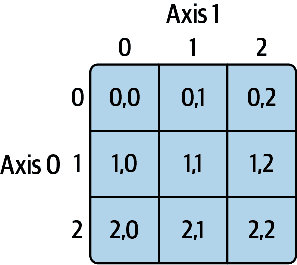
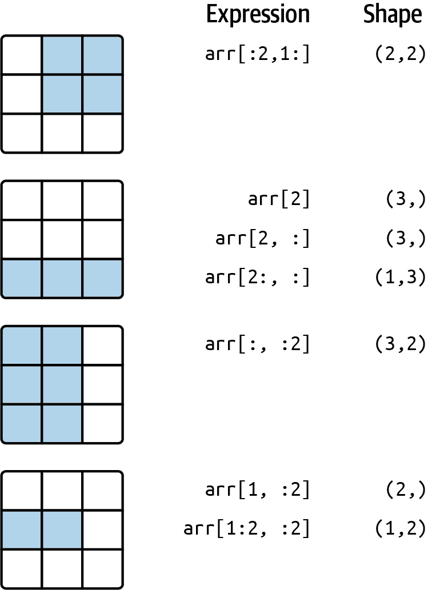
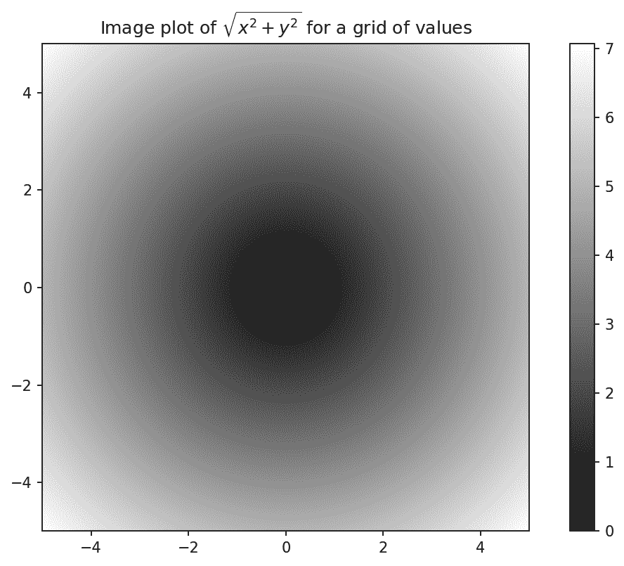
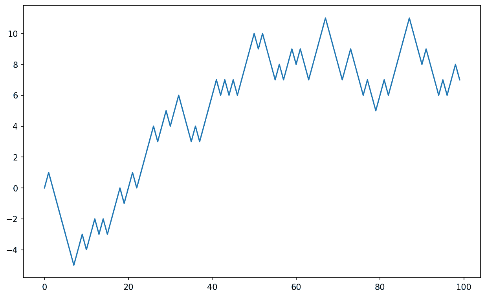

# 四、NumPy 基础知识：数组和向量化计算

> 原文：[`wesmckinney.com/book/numpy-basics`](https://wesmckinney.com/book/numpy-basics)
>
> 译者：[飞龙](https://github.com/wizardforcel)
>
> 协议：[CC BY-NC-SA 4.0](http://creativecommons.org/licenses/by-nc-sa/4.0/)


> 此开放访问网络版本的《Python 数据分析第三版》现已作为[印刷版和数字版](https://amzn.to/3DyLaJc)的伴侣提供。如果您发现任何勘误，请[在此处报告](https://oreilly.com/catalog/0636920519829/errata)。请注意，由 Quarto 生成的本站点的某些方面与 O'Reilly 的印刷版和电子书版本的格式不同。
> 
> 如果您发现本书的在线版本有用，请考虑[订购纸质版](https://amzn.to/3DyLaJc)或[无 DRM 的电子书](https://www.ebooks.com/en-us/book/210644288/python-for-data-analysis/wes-mckinney/?affId=WES398681F)以支持作者。本网站的内容不得复制或再生产。代码示例采用 MIT 许可，可在 GitHub 或 Gitee 上找到。

NumPy，即 Numerical Python，是 Python 中最重要的数值计算基础包之一。许多提供科学功能的计算包使用 NumPy 的数组对象作为数据交换的标准接口之一。我涵盖的关于 NumPy 的许多知识也适用于 pandas。

以下是您将在 NumPy 中找到的一些内容：

+   ndarray，一种高效的多维数组，提供快速的基于数组的算术运算和灵活的广播功能

+   用于在整个数据数组上快速操作的数学函数，而无需编写循环

+   用于读取/写入数组数据到磁盘和处理内存映射文件的工具

+   线性代数、随机数生成和傅里叶变换功能

+   用于将 NumPy 与用 C、C++或 FORTRAN 编写的库连接的 C API

由于 NumPy 提供了全面且有文档的 C API，因此将数据传递给用低级语言编写的外部库，以及让外部库将数据作为 NumPy 数组返回给 Python 是很简单的。这个特性使 Python 成为封装传统 C、C++或 FORTRAN 代码库并为其提供动态和可访问接口的首选语言。

虽然 NumPy 本身并不提供建模或科学功能，但了解 NumPy 数组和面向数组的计算将帮助您更有效地使用具有数组计算语义的工具，如 pandas。由于 NumPy 是一个庞大的主题，我将在以后更深入地涵盖许多高级 NumPy 功能，比如广播（参见附录 A：高级 NumPy）。这些高级功能中的许多并不需要遵循本书的其余部分，但在您深入研究 Python 科学计算时可能会有所帮助。

对于大多数数据分析应用程序，我将关注的主要功能领域是：

+   用于数据整理和清洗、子集和过滤、转换以及任何其他类型计算的快速基于数组的操作

+   常见的数组算法，如排序、唯一值和集合操作

+   高效的描述统计和聚合/汇总数据

+   数据对齐和关系数据操作，用于合并和连接异构数据集

+   将条件逻辑表达为数组表达式，而不是使用`if-elif-else`分支循环

+   分组数据操作（聚合、转换和函数应用）

虽然 NumPy 为一般数值数据处理提供了计算基础，但许多读者将希望使用 pandas 作为大多数统计或分析的基础，尤其是在表格数据上。此外，pandas 还提供了一些更具领域特定功能，如时间序列操作，这在 NumPy 中不存在。

注意

Python 中的面向数组计算可以追溯到 1995 年，当时 Jim Hugunin 创建了 Numeric 库。在接下来的 10 年里，许多科学编程社区开始在 Python 中进行数组编程，但在 2000 年代初，库生态系统变得分散。2005 年，Travis Oliphant 能够从当时的 Numeric 和 Numarray 项目中打造出 NumPy 项目，将社区团结在一个单一的数组计算框架周围。

NumPy 在 Python 中进行数值计算如此重要的原因之一是因为它专为大型数据数组的效率而设计。这有几个原因：*

+   NumPy 在内部以连续的内存块存储数据，独立于其他内置 Python 对象。NumPy 的用 C 语言编写的算法库可以在这个内存上操作，而无需进行任何类型检查或其他开销。NumPy 数组也比内置 Python 序列使用更少的内存。

+   NumPy 操作在整个数组上执行复杂计算，无需 Python `for`循环，对于大型序列来说，这可能会很慢。NumPy 比常规 Python 代码更快，因为它的基于 C 的算法避免了常规解释 Python 代码的开销。

为了让您了解性能差异，考虑一个包含一百万个整数的 NumPy 数组，以及等效的 Python 列表：

```py
In [7]: import numpy as np

In [8]: my_arr = np.arange(1_000_000)

In [9]: my_list = list(range(1_000_000))
```

现在让我们将每个序列乘以 2：

```py
In [10]: %timeit my_arr2 = my_arr * 2
309 us +- 7.48 us per loop (mean +- std. dev. of 7 runs, 1000 loops each)

In [11]: %timeit my_list2 = [x * 2 for x in my_list]
46.4 ms +- 526 us per loop (mean +- std. dev. of 7 runs, 10 loops each)
```

基于 NumPy 的算法通常比纯 Python 对应算法快 10 到 100 倍（或更多），并且使用的内存明显更少。

## 4.1 NumPy ndarray：多维数组对象

NumPy 的一个关键特性是其 N 维数组对象，或者 ndarray，它是 Python 中大型数据集的快速、灵活的容器。数组使您能够使用类似标量元素之间等效操作的语法在整个数据块上执行数学运算。

为了让您了解 NumPy 如何使用类似标量值的语法在内置 Python 对象上进行批量计算，我首先导入 NumPy 并创建一个小数组：

```py
In [12]: import numpy as np

In [13]: data = np.array([[1.5, -0.1, 3], [0, -3, 6.5]])

In [14]: data
Out[14]: 
array([[ 1.5, -0.1,  3. ],
 [ 0. , -3. ,  6.5]])
```

然后我用`data`编写数学运算：

```py
In [15]: data * 10
Out[15]: 
array([[ 15.,  -1.,  30.],
 [  0., -30.,  65.]])

In [16]: data + data
Out[16]: 
array([[ 3. , -0.2,  6. ],
 [ 0. , -6. , 13. ]])
```

在第一个示例中，所有元素都乘以了 10。在第二个示例中，数组中每个“单元格”中的相应值已经相加。

注意

在本章和整本书中，我使用标准的 NumPy 约定，始终使用`import numpy as np`。您可以在代码中使用`from numpy import *`来避免编写`np.`，但我建议不要养成这种习惯。`numpy`命名空间很大，包含许多函数，它们的名称与内置 Python 函数（如`min`和`max`）冲突。遵循这些标准约定几乎总是一个好主意。

ndarray 是一个用于同质数据的通用多维容器；也就是说，所有元素必须是相同类型。每个数组都有一个`shape`，一个指示每个维度大小的元组，以及一个`dtype`，描述数组的*数据类型*的对象：

```py
In [17]: data.shape
Out[17]: (2, 3)

In [18]: data.dtype
Out[18]: dtype('float64')
```

本章将介绍使用 NumPy 数组的基础知识，这应该足以跟随本书的其余部分。虽然对于许多数据分析应用程序来说，深入了解 NumPy 并不是必需的，但精通面向数组的编程和思维是成为科学 Python 大师的关键步骤。

注意

在书中文本中，每当您看到“array”，“NumPy array”或“ndarray”时，在大多数情况下它们都指的是 ndarray 对象。

### 创建 ndarrays

创建数组的最简单方法是使用`array`函数。它接受任何类似序列的对象（包括其他数组）并生成包含传递数据的新 NumPy 数组。例如，列表是一个很好的转换候选：

```py
In [19]: data1 = [6, 7.5, 8, 0, 1]

In [20]: arr1 = np.array(data1)

In [21]: arr1
Out[21]: array([6. , 7.5, 8. , 0. , 1. ])
```

嵌套序列，比如等长列表的列表，将被转换为多维数组：

```py
In [22]: data2 = [[1, 2, 3, 4], [5, 6, 7, 8]]

In [23]: arr2 = np.array(data2)

In [24]: arr2
Out[24]: 
array([[1, 2, 3, 4],
 [5, 6, 7, 8]])
```

由于`data2`是一个列表的列表，NumPy 数组`arr2`具有两个维度，形状从数据中推断出。我们可以通过检查`ndim`和`shape`属性来确认这一点：

```py
In [25]: arr2.ndim
Out[25]: 2

In [26]: arr2.shape
Out[26]: (2, 4)
```

除非明确指定（在 ndarrays 的数据类型中讨论），`numpy.array`会尝试推断创建的数组的良好数据类型。数据类型存储在特殊的`dtype`元数据对象中；例如，在前两个示例中我们有：

```py
In [27]: arr1.dtype
Out[27]: dtype('float64')

In [28]: arr2.dtype
Out[28]: dtype('int64')
```

除了`numpy.array`之外，还有许多其他用于创建新数组的函数。例如，`numpy.zeros`和`numpy.ones`分别创建长度或形状为 0 或 1 的数组。`numpy.empty`创建一个数组，而不将其值初始化为任何特定值。要使用这些方法创建更高维度的数组，请传递一个形状的元组：

```py
In [29]: np.zeros(10)
Out[29]: array([0., 0., 0., 0., 0., 0., 0., 0., 0., 0.])

In [30]: np.zeros((3, 6))
Out[30]: 
array([[0., 0., 0., 0., 0., 0.],
 [0., 0., 0., 0., 0., 0.],
 [0., 0., 0., 0., 0., 0.]])

In [31]: np.empty((2, 3, 2))
Out[31]: 
array([[[0., 0.],
 [0., 0.],
 [0., 0.]],
 [[0., 0.],
 [0., 0.],
 [0., 0.]]])
```

注意

不能假设`numpy.empty`会返回一个全为零的数组。该函数返回未初始化的内存，因此可能包含非零的“垃圾”值。只有在打算用数据填充新数组时才应使用此函数。

`numpy.arange`是内置 Python `range`函数的数组版本：

```py
In [32]: np.arange(15)
Out[32]: array([ 0,  1,  2,  3,  4,  5,  6,  7,  8,  9, 10, 11, 12, 13, 14])
```

请参见表 4.1 中的一些标准数组创建函数的简要列表。由于 NumPy 专注于数值计算，如果未指定数据类型，数据类型在许多情况下将是`float64`（浮点数）。

表 4.1：一些重要的 NumPy 数组创建函数

| 函数 | 描述 |
| --- | --- |
| `array` | 将输入数据（列表、元组、数组或其他序列类型）转换为 ndarray，可以通过推断数据类型或显式指定数据类型来完成；默认情况下会复制输入数据 |
| `asarray` | 将输入转换为 ndarray，如果输入已经是 ndarray，则不复制 |
| `arange` | 类似于内置的`range`，但返回一个 ndarray 而不是列表 |
| `ones, ones_like` | 生成所有值为 1 的数组，具有给定的形状和数据类型；`ones_like`接受另一个数组，并生成相同形状和数据类型的`ones`数组 |
| `zeros, zeros_like` | 类似于`ones`和`ones_like`，但生成的是全为 0 的数组 |
| `empty, empty_like` | 通过分配新内存创建新数组，但不像`ones`和`zeros`那样填充任何值 |
| `full, full_like` | 生成具有给定形状和数据类型的数组，所有值都设置为指定的“填充值”；`full_like`接受另一个数组，并生成相同形状和数据类型的填充数组 |

| `eye, identity` | 创建一个 N×N 的方阵单位矩阵（对角线上为 1，其他地方为 0） |

### ndarrays 的数据类型

*数据类型*或`dtype`是一个特殊对象，包含 ndarray 需要将内存块解释为特定类型数据的信息（或*元数据*，关于数据的数据）：

```py
In [33]: arr1 = np.array([1, 2, 3], dtype=np.float64)

In [34]: arr2 = np.array([1, 2, 3], dtype=np.int32)

In [35]: arr1.dtype
Out[35]: dtype('float64')

In [36]: arr2.dtype
Out[36]: dtype('int32')
```

数据类型是 NumPy 灵活性的来源，用于与来自其他系统的数据进行交互。在大多数情况下，它们直接映射到底层磁盘或内存表示，这使得可以将数据的二进制流读写到磁盘，并连接到用低级语言（如 C 或 FORTRAN）编写的代码。数值数据类型的命名方式相同：类型名称，如`float`或`int`，后跟表示每个元素的位数的数字。标准的双精度浮点值（Python 中`float`对象底层使用的）占用 8 字节或 64 位。因此，在 NumPy 中，此类型称为`float64`。请参见表 4.2 以获取 NumPy 支持的数据类型的完整列表。

注意

不要担心记住 NumPy 数据类型，特别是如果您是新用户。通常只需要关心您正在处理的数据的一般*类型*，无论是浮点数、复数、整数、布尔值、字符串还是一般的 Python 对象。当您需要更多控制数据在内存和磁盘上的存储方式，特别是对于大型数据集时，知道您可以控制存储类型是很好的。

表 4.2：NumPy 数据类型

| 类型 | 类型代码 | 描述 |
| --- | --- | --- |
| `int8, uint8` | `i1, u1` | 有符号和无符号 8 位（1 字节）整数类型 |
| `int16, uint16` | `i2, u2` | 有符号和无符号 16 位整数类型 |
| `int32, uint32` | `i4, u4` | 有符号和无符号 32 位整数类型 |
| `int64, uint64` | `i8, u8` | 有符号和无符号 64 位整数类型 |
| `float16` | `f2` | 半精度浮点数 |
| `float32` | `f4 或 f` | 标准单精度浮点数；与 C 浮点兼容 |
| `float64` | `f8 或 d` | 标准双精度浮点数；与 C 双精度和 Python `float`对象兼容 |
| `float128` | `f16 或 g` | 扩展精度浮点数 |
| `complex64`，`complex128`，`complex256` | `c8, c16, c32` | 分别由两个 32、64 或 128 个浮点数表示的复数 |
| `bool` | ? | 存储`True`和`False`值的布尔类型 |
| `object` | O | Python 对象类型；值可以是任何 Python 对象 |
| `string_` | S | 固定长度 ASCII 字符串类型（每个字符 1 字节）；例如，要创建长度为 10 的字符串数据类型，请使用`'S10'` |
| `unicode_` | U | 固定长度 Unicode 类型（字节数平台特定）；与`string_`（例如，`'U10'`）具有相同的规范语义 |

注意

有*有符号*和*无符号*整数类型，许多读者可能不熟悉这个术语。*有符号*整数可以表示正整数和负整数，而*无符号*整数只能表示非零整数。例如，`int8`（有符号 8 位整数）可以表示从-128 到 127（包括）的整数，而`uint8`（无符号 8 位整数）可以表示 0 到 255。

您可以使用 ndarray 的`astype`方法显式地将数组从一种数据类型转换为另一种数据类型：

```py
In [37]: arr = np.array([1, 2, 3, 4, 5])

In [38]: arr.dtype
Out[38]: dtype('int64')

In [39]: float_arr = arr.astype(np.float64)

In [40]: float_arr
Out[40]: array([1., 2., 3., 4., 5.])

In [41]: float_arr.dtype
Out[41]: dtype('float64')
```

在这个例子中，整数被转换为浮点数。如果我将一些浮点数转换为整数数据类型，小数部分将被截断：

```py
In [42]: arr = np.array([3.7, -1.2, -2.6, 0.5, 12.9, 10.1])

In [43]: arr
Out[43]: array([ 3.7, -1.2, -2.6,  0.5, 12.9, 10.1])

In [44]: arr.astype(np.int32)
Out[44]: array([ 3, -1, -2,  0, 12, 10], dtype=int32)
```

如果您有一个表示数字的字符串数组，可以使用`astype`将它们转换为数值形式：

```py
In [45]: numeric_strings = np.array(["1.25", "-9.6", "42"], dtype=np.string_)

In [46]: numeric_strings.astype(float)
Out[46]: array([ 1.25, -9.6 , 42.  ])
```

注意

在使用`numpy.string_`类型时要小心，因为 NumPy 中的字符串数据是固定大小的，可能会在没有警告的情况下截断输入。pandas 对非数值数据具有更直观的开箱即用行为。

如果由于某种原因（例如无法将字符串转换为`float64`）而转换失败，将引发`ValueError`。以前，我有点懒，写了`float`而不是`np.float64`；NumPy 将 Python 类型别名为其自己的等效数据类型。

您还可以使用另一个数组的`dtype`属性：

```py
In [47]: int_array = np.arange(10)

In [48]: calibers = np.array([.22, .270, .357, .380, .44, .50], dtype=np.float64)

In [49]: int_array.astype(calibers.dtype)
Out[49]: array([0., 1., 2., 3., 4., 5., 6., 7., 8., 9.])
```

有简写类型代码字符串，您也可以使用它们来引用`dtype`：

```py
In [50]: zeros_uint32 = np.zeros(8, dtype="u4")

In [51]: zeros_uint32
Out[51]: array([0, 0, 0, 0, 0, 0, 0, 0], dtype=uint32)
```

注意

调用`astype` *总是*会创建一个新数组（数据的副本），即使新数据类型与旧数据类型相同。

### NumPy 数组的算术运算

数组很重要，因为它们使您能够在不编写任何`for`循环的情况下对数据执行批量操作。NumPy 用户称之为*向量化*。任何等大小数组之间的算术运算都会逐元素应用该操作：

```py
In [52]: arr = np.array([[1., 2., 3.], [4., 5., 6.]])

In [53]: arr
Out[53]: 
array([[1., 2., 3.],
 [4., 5., 6.]])

In [54]: arr * arr
Out[54]: 
array([[ 1.,  4.,  9.],
 [16., 25., 36.]])

In [55]: arr - arr
Out[55]: 
array([[0., 0., 0.],
 [0., 0., 0.]])
```

标量的算术运算会将标量参数传播到数组中的每个元素：

```py
In [56]: 1 / arr
Out[56]: 
array([[1.    , 0.5   , 0.3333],
 [0.25  , 0.2   , 0.1667]])

In [57]: arr ** 2
Out[57]: 
array([[ 1.,  4.,  9.],
 [16., 25., 36.]])
```

相同大小的数组之间的比较会产生布尔数组：

```py
In [58]: arr2 = np.array([[0., 4., 1.], [7., 2., 12.]])

In [59]: arr2
Out[59]: 
array([[ 0.,  4.,  1.],
 [ 7.,  2., 12.]])

In [60]: arr2 > arr
Out[60]: 
array([[False,  True, False],
 [ True, False,  True]])
```

在不同大小的数组之间进行操作被称为*广播*，将在附录 A：高级 NumPy 中更详细地讨论。对广播的深入理解对本书的大部分内容并不是必要的。

### 基本索引和切片

NumPy 数组索引是一个深入的话题，因为有许多种方式可以选择数据的子集或单个元素。一维数组很简单；从表面上看，它们的行为类似于 Python 列表：

```py
In [61]: arr = np.arange(10)

In [62]: arr
Out[62]: array([0, 1, 2, 3, 4, 5, 6, 7, 8, 9])

In [63]: arr[5]
Out[63]: 5

In [64]: arr[5:8]
Out[64]: array([5, 6, 7])

In [65]: arr[5:8] = 12

In [66]: arr
Out[66]: array([ 0,  1,  2,  3,  4, 12, 12, 12,  8,  9])
```

正如您所看到的，如果您将标量值分配给一个切片，如`arr[5:8] = 12`，该值将传播（或者*广播*）到整个选择。

注意

与 Python 内置列表的一个重要区别是，数组切片是原始数组的视图。这意味着数据没有被复制，对视图的任何修改都将反映在源数组中。

为了举例说明，我首先创建`arr`的一个切片：

```py
In [67]: arr_slice = arr[5:8]

In [68]: arr_slice
Out[68]: array([12, 12, 12])
```

现在，当我在`arr_slice`中更改值时，这些变化会反映在原始数组`arr`中：

```py
In [69]: arr_slice[1] = 12345

In [70]: arr
Out[70]: 
array([    0,     1,     2,     3,     4,    12, 12345,    12,     8,
 9])
```

“裸”切片`[:]`将分配给数组中的所有值：

```py
In [71]: arr_slice[:] = 64

In [72]: arr
Out[72]: array([ 0,  1,  2,  3,  4, 64, 64, 64,  8,  9])
```

如果您是 NumPy 的新手，您可能会对此感到惊讶，特别是如果您已经使用过其他更积极复制数据的数组编程语言。由于 NumPy 被设计为能够处理非常大的数组，如果 NumPy 坚持始终复制数据，您可能会遇到性能和内存问题。

注意

如果您想要一个 ndarray 切片的副本而不是视图，您需要显式复制数组，例如`arr[5:8].copy()`。正如您将看到的，pandas 也是这样工作的。

对于更高维度的数组，您有更多的选择。在二维数组中，每个索引处的元素不再是标量，而是一维数组：

```py
In [73]: arr2d = np.array([[1, 2, 3], [4, 5, 6], [7, 8, 9]])

In [74]: arr2d[2]
Out[74]: array([7, 8, 9])
```

因此，可以递归访问单个元素。但这有点太麻烦了，所以您可以传递一个逗号分隔的索引列表来选择单个元素。因此，这些是等价的：

```py
In [75]: arr2d[0][2]
Out[75]: 3

In [76]: arr2d[0, 2]
Out[76]: 3
```

请参见图 4.1 以了解如何在二维数组上进行索引的说明。我发现将轴 0 视为数组的“行”而将轴 1 视为“列”是有帮助的。



图 4.1：索引 NumPy 数组中的元素

在多维数组中，如果省略后面的索引，返回的对象将是一个较低维度的 ndarray，由沿着更高维度的所有数据组成。因此，在 2×2×3 数组`arr3d`中：

```py
In [77]: arr3d = np.array([[[1, 2, 3], [4, 5, 6]], [[7, 8, 9], [10, 11, 12]]])

In [78]: arr3d
Out[78]: 
array([[[ 1,  2,  3],
 [ 4,  5,  6]],
 [[ 7,  8,  9],
 [10, 11, 12]]])
```

`arr3d[0]`是一个 2×3 数组：

```py
In [79]: arr3d[0]
Out[79]: 
array([[1, 2, 3],
 [4, 5, 6]])
```

标量值和数组都可以分配给`arr3d[0]`：

```py
In [80]: old_values = arr3d[0].copy()

In [81]: arr3d[0] = 42

In [82]: arr3d
Out[82]: 
array([[[42, 42, 42],
 [42, 42, 42]],
 [[ 7,  8,  9],
 [10, 11, 12]]])

In [83]: arr3d[0] = old_values

In [84]: arr3d
Out[84]: 
array([[[ 1,  2,  3],
 [ 4,  5,  6]],
 [[ 7,  8,  9],
 [10, 11, 12]]])
```

类似地，`arr3d[1, 0]`会给您所有索引以`(1, 0)`开头的值，形成一个一维数组：

```py
In [85]: arr3d[1, 0]
Out[85]: array([7, 8, 9])
```

这个表达式与我们分两步索引的方式相同：

```py
In [86]: x = arr3d[1]

In [87]: x
Out[87]: 
array([[ 7,  8,  9],
 [10, 11, 12]])

In [88]: x[0]
Out[88]: array([7, 8, 9])
```

请注意，在所有这些选择数组的子部分的情况下，返回的数组都是视图。

注意

这种用于 NumPy 数组的多维索引语法不适用于常规的 Python 对象，例如列表的列表。

#### 使用切片进行索引

像 Python 列表这样的一维对象一样，ndarrays 可以使用熟悉的语法进行切片：

```py
In [89]: arr
Out[89]: array([ 0,  1,  2,  3,  4, 64, 64, 64,  8,  9])

In [90]: arr[1:6]
Out[90]: array([ 1,  2,  3,  4, 64])
```

考虑之前的二维数组`arr2d`。对该数组进行切片有点不同：

```py
In [91]: arr2d
Out[91]: 
array([[1, 2, 3],
 [4, 5, 6],
 [7, 8, 9]])

In [92]: arr2d[:2]
Out[92]: 
array([[1, 2, 3],
 [4, 5, 6]])
```

正如您所看到的，它已经沿着轴 0 切片，即第一个轴。因此，切片选择沿着一个轴的一系列元素。阅读表达式`arr2d[:2]`为“选择`arr2d`的前两行”可能会有所帮助。

您可以像传递多个索引一样传递多个切片：

```py
In [93]: arr2d[:2, 1:]
Out[93]: 
array([[2, 3],
 [5, 6]])
```

像这样切片时，您总是获得相同维数的数组视图。通过混合整数索引和切片，您可以获得较低维度的切片。

例如，我可以选择第二行，但只选择前两列，如下所示：

```py
In [94]: lower_dim_slice = arr2d[1, :2]
```

在这里，虽然`arr2d`是二维的，`lower_dim_slice`是一维的，其形状是一个带有一个轴大小的元组：

```py
In [95]: lower_dim_slice.shape
Out[95]: (2,)
```

同样，我可以选择第三列，但只选择前两行，如下所示：

```py
In [96]: arr2d[:2, 2]
Out[96]: array([3, 6])
```

请参见图 4.2 进行说明。请注意，单独的冒号表示取整个轴，因此您可以通过以下方式仅切片更高维度的轴：

```py
In [97]: arr2d[:, :1]
Out[97]: 
array([[1],
 [4],
 [7]])
```

当然，对切片表达式的分配会分配给整个选择：

```py
In [98]: arr2d[:2, 1:] = 0

In [99]: arr2d
Out[99]: 
array([[1, 0, 0],
 [4, 0, 0],
 [7, 8, 9]])
```



图 4.2：二维数组切片

### 布尔索引

让我们考虑一个例子，其中我们有一些数据在一个数组中，并且有一个包含重复名称的数组：

```py
In [100]: names = np.array(["Bob", "Joe", "Will", "Bob", "Will", "Joe", "Joe"])

In [101]: data = np.array([[4, 7], [0, 2], [-5, 6], [0, 0], [1, 2],
 .....:                  [-12, -4], [3, 4]])

In [102]: names
Out[102]: array(['Bob', 'Joe', 'Will', 'Bob', 'Will', 'Joe', 'Joe'], dtype='<U4')

In [103]: data
Out[103]: 
array([[  4,   7],
 [  0,   2],
 [ -5,   6],
 [  0,   0],
 [  1,   2],
 [-12,  -4],
 [  3,   4]])
```

假设每个名称对应于`data`数组中的一行，并且我们想要选择所有与相应名称`"Bob"`相对应的行。与算术运算一样，与数组进行比较（如`==`）也是矢量化的。因此，将`names`与字符串`"Bob"`进行比较会产生一个布尔数组：

```py
In [104]: names == "Bob"
Out[104]: array([ True, False, False,  True, False, False, False])
```

此布尔数组可以在索引数组时传递：

```py
In [105]: data[names == "Bob"]
Out[105]: 
array([[4, 7],
 [0, 0]])
```

布尔数组的长度必须与其索引的数组轴的长度相同。甚至可以将布尔数组与切片或整数（或整数序列）混合使用（稍后将详细介绍）。

在这些示例中，我从`names == "Bob"`的行中选择，并且也索引列：

```py
In [106]: data[names == "Bob", 1:]
Out[106]: 
array([[7],
 [0]])

In [107]: data[names == "Bob", 1]
Out[107]: array([7, 0])
```

要选择除了`"Bob"`之外的所有内容，可以使用`!=`或使用`~`否定条件：

```py
In [108]: names != "Bob"
Out[108]: array([False,  True,  True, False,  True,  True,  True])

In [109]: ~(names == "Bob")
Out[109]: array([False,  True,  True, False,  True,  True,  True])

In [110]: data[~(names == "Bob")]
Out[110]: 
array([[  0,   2],
 [ -5,   6],
 [  1,   2],
 [-12,  -4],
 [  3,   4]])
```

当您想要反转由变量引用的布尔数组时，`~`运算符可能很有用：

```py
In [111]: cond = names == "Bob"

In [112]: data[~cond]
Out[112]: 
array([[  0,   2],
 [ -5,   6],
 [  1,   2],
 [-12,  -4],
 [  3,   4]])
```

使用布尔运算符如`&`（和）和`|`（或）选择三个名称中的两个来组合多个布尔条件：

```py
In [113]: mask = (names == "Bob") | (names == "Will")

In [114]: mask
Out[114]: array([ True, False,  True,  True,  True, False, False])

In [115]: data[mask]
Out[115]: 
array([[ 4,  7],
 [-5,  6],
 [ 0,  0],
 [ 1,  2]])
```

通过布尔索引从数组中选择数据并将结果分配给新变量*始终*会创建数据的副本，即使返回的数组未更改。

注意

Python 关键字`and`和`or`不能与布尔数组一起使用。请改用`&`（和）和`|`（或）。

使用布尔数组设置值的工作方式是将右侧的值或值替换到布尔数组的值为`True`的位置。要将`data`中的所有负值设置为 0，我们只需要执行：

```py
In [116]: data[data < 0] = 0

In [117]: data
Out[117]: 
array([[4, 7],
 [0, 2],
 [0, 6],
 [0, 0],
 [1, 2],
 [0, 0],
 [3, 4]])
```

您还可以使用一维布尔数组设置整行或整列：

```py
In [118]: data[names != "Joe"] = 7

In [119]: data
Out[119]: 
array([[7, 7],
 [0, 2],
 [7, 7],
 [7, 7],
 [7, 7],
 [0, 0],
 [3, 4]])
```

正如我们将在后面看到的，对二维数据进行这些类型的操作很方便使用 pandas。

### 花式索引

*花式索引*是 NumPy 采用的术语，用于描述使用整数数组进行索引。假设我们有一个 8×4 数组：

```py
In [120]: arr = np.zeros((8, 4))

In [121]: for i in range(8):
 .....:     arr[i] = i

In [122]: arr
Out[122]: 
array([[0., 0., 0., 0.],
 [1., 1., 1., 1.],
 [2., 2., 2., 2.],
 [3., 3., 3., 3.],
 [4., 4., 4., 4.],
 [5., 5., 5., 5.],
 [6., 6., 6., 6.],
 [7., 7., 7., 7.]])
```

要按特定顺序选择行的子集，只需传递一个指定所需顺序的整数列表或 ndarray：

```py
In [123]: arr[[4, 3, 0, 6]]
Out[123]: 
array([[4., 4., 4., 4.],
 [3., 3., 3., 3.],
 [0., 0., 0., 0.],
 [6., 6., 6., 6.]])
```

希望这段代码符合您的期望！使用负索引可从末尾选择行：

```py
In [124]: arr[[-3, -5, -7]]
Out[124]: 
array([[5., 5., 5., 5.],
 [3., 3., 3., 3.],
 [1., 1., 1., 1.]])
```

传递多个索引数组会产生略有不同的结果；它选择与每个索引元组对应的一维数组元素：

```py
In [125]: arr = np.arange(32).reshape((8, 4))

In [126]: arr
Out[126]: 
array([[ 0,  1,  2,  3],
 [ 4,  5,  6,  7],
 [ 8,  9, 10, 11],
 [12, 13, 14, 15],
 [16, 17, 18, 19],
 [20, 21, 22, 23],
 [24, 25, 26, 27],
 [28, 29, 30, 31]])

In [127]: arr[[1, 5, 7, 2], [0, 3, 1, 2]]
Out[127]: array([ 4, 23, 29, 10])
```

要了解有关`reshape`方法的更多信息，请查看附录 A：高级 NumPy。

这里选择了元素`(1, 0), (5, 3), (7, 1)`和`(2, 2)`。使用与轴数量相同的整数数组进行花式索引的结果始终是一维的。

在这种情况下，花式索引的行为与一些用户可能期望的有些不同（包括我自己），即通过选择矩阵的行和列的子集形成的矩形区域。以下是获得该区域的一种方法：

```py
In [128]: arr[[1, 5, 7, 2]][:, [0, 3, 1, 2]]
Out[128]: 
array([[ 4,  7,  5,  6],
 [20, 23, 21, 22],
 [28, 31, 29, 30],
 [ 8, 11,  9, 10]])
```

请记住，花式索引与切片不同，当将结果分配给新变量时，总是将数据复制到新数组中。如果使用花式索引分配值，则将修改索引的值：

```py
In [129]: arr[[1, 5, 7, 2], [0, 3, 1, 2]]
Out[129]: array([ 4, 23, 29, 10])

In [130]: arr[[1, 5, 7, 2], [0, 3, 1, 2]] = 0

In [131]: arr
Out[131]: 
array([[ 0,  1,  2,  3],
 [ 0,  5,  6,  7],
 [ 8,  9,  0, 11],
 [12, 13, 14, 15],
 [16, 17, 18, 19],
 [20, 21, 22,  0],
 [24, 25, 26, 27],
 [28,  0, 30, 31]])
```

### 转置数组和交换轴

转置是一种特殊的重塑形式，类似地返回基础数据的视图，而不复制任何内容。数组具有`transpose`方法和特殊的`T`属性：

```py
In [132]: arr = np.arange(15).reshape((3, 5))

In [133]: arr
Out[133]: 
array([[ 0,  1,  2,  3,  4],
 [ 5,  6,  7,  8,  9],
 [10, 11, 12, 13, 14]])

In [134]: arr.T
Out[134]: 
array([[ 0,  5, 10],
 [ 1,  6, 11],
 [ 2,  7, 12],
 [ 3,  8, 13],
 [ 4,  9, 14]])
```

在进行矩阵计算时，您可能经常这样做-例如，使用`numpy.dot`计算内部矩阵乘积时：

```py
In [135]: arr = np.array([[0, 1, 0], [1, 2, -2], [6, 3, 2], [-1, 0, -1], [1, 0, 1
]])

In [136]: arr
Out[136]: 
array([[ 0,  1,  0],
 [ 1,  2, -2],
 [ 6,  3,  2],
 [-1,  0, -1],
 [ 1,  0,  1]])

In [137]: np.dot(arr.T, arr)
Out[137]: 
array([[39, 20, 12],
 [20, 14,  2],
 [12,  2, 10]])
```

`@`中缀运算符是进行矩阵乘法的另一种方式：

```py
In [138]: arr.T @ arr
Out[138]: 
array([[39, 20, 12],
 [20, 14,  2],
 [12,  2, 10]])
```

使用`.T`进行简单的转置是交换轴的特例。ndarray 具有`swapaxes`方法，该方法接受一对轴编号，并切换指定的轴以重新排列数据：

```py
In [139]: arr
Out[139]: 
array([[ 0,  1,  0],
 [ 1,  2, -2],
 [ 6,  3,  2],
 [-1,  0, -1],
 [ 1,  0,  1]])

In [140]: arr.swapaxes(0, 1)
Out[140]: 
array([[ 0,  1,  6, -1,  1],
 [ 1,  2,  3,  0,  0],
 [ 0, -2,  2, -1,  1]])
```

类似地，`swapaxes`返回数据的视图而不进行复制。

## 4.2 伪随机数生成

`numpy.random` 模块通过函数有效地生成许多种概率分布的样本值的整个数组来补充内置的 Python `random` 模块。例如，您可以使用 `numpy.random.standard_normal` 从标准正态分布中获取一个 4 × 4 的样本数组：

```py
In [141]: samples = np.random.standard_normal(size=(4, 4))

In [142]: samples
Out[142]: 
array([[-0.2047,  0.4789, -0.5194, -0.5557],
 [ 1.9658,  1.3934,  0.0929,  0.2817],
 [ 0.769 ,  1.2464,  1.0072, -1.2962],
 [ 0.275 ,  0.2289,  1.3529,  0.8864]])
```

相比之下，Python 的内置 `random` 模块一次只抽取一个值。从这个基准测试中可以看出，对于生成非常大的样本，`numpy.random` 的速度要快一个数量级以上：

```py
In [143]: from random import normalvariate

In [144]: N = 1_000_000

In [145]: %timeit samples = [normalvariate(0, 1) for _ in range(N)]
490 ms +- 2.23 ms per loop (mean +- std. dev. of 7 runs, 1 loop each)

In [146]: %timeit np.random.standard_normal(N)
32.6 ms +- 271 us per loop (mean +- std. dev. of 7 runs, 10 loops each)
```

这些随机数并不是真正的随机（而是伪随机），而是由可配置的随机数生成器生成的，该生成器确定确定性地创建哪些值。像 `numpy.random.standard_normal` 这样的函数使用 `numpy.random` 模块的默认随机数生成器，但是您的代码可以配置为使用显式生成器：

```py
In [147]: rng = np.random.default_rng(seed=12345)

In [148]: data = rng.standard_normal((2, 3))
```

`seed` 参数决定生成器的初始状态，每次使用 `rng` 对象生成数据时状态都会改变。生成器对象 `rng` 也与可能使用 `numpy.random` 模块的其他代码隔离开来：

```py
In [149]: type(rng)
Out[149]: numpy.random._generator.Generator
```

查看 表 4.3 以获取类似 `rng` 这样的随机生成器对象上可用的部分方法列表。我将使用上面创建的 `rng` 对象在本章的其余部分生成随机数据。

表 4.3：NumPy 随机数生成器方法

| 方法 | 描述 |
| --- | --- |
| `permutation` | 返回一个序列的随机排列，或返回一个排列的范围 |
| `shuffle` | 在原地随机排列一个序列 |
| `uniform` | 从均匀分布中抽取样本 |
| `integers` | 从给定的低到高范围中抽取随机整数 |
| `standard_normal` | 从均值为 0，标准差为 1 的正态分布中抽取样本 |
| `binomial` | 从二项分布中抽取样本 |
| `normal` | 从正态（高斯）分布中抽取样本 |
| `beta` | 从 beta 分布中抽取样本 |
| `chisquare` | 从卡方分布中抽取样本 |
| `gamma` | 从 gamma 分布中抽取样本 |
| `uniform` | 从均匀 [0, 1) 分布中抽取样本 |

## 4.3 通用函数：快速逐元素数组函数

通用函数，或者 *ufunc*，是在 ndarrays 中对数据执行逐元素操作的函数。您可以将它们看作是快速矢量化的简单函数的包装器，这些函数接受一个或多个标量值并产生一个或多个标量结果。

许多 ufuncs 都是简单的逐元素转换，比如 `numpy.sqrt` 或 `numpy.exp`：

```py
In [150]: arr = np.arange(10)

In [151]: arr
Out[151]: array([0, 1, 2, 3, 4, 5, 6, 7, 8, 9])

In [152]: np.sqrt(arr)
Out[152]: 
array([0.    , 1.    , 1.4142, 1.7321, 2.    , 2.2361, 2.4495, 2.6458,
 2.8284, 3.    ])

In [153]: np.exp(arr)
Out[153]: 
array([   1.    ,    2.7183,    7.3891,   20.0855,   54.5982,  148.4132,
 403.4288, 1096.6332, 2980.958 , 8103.0839])
```

这些被称为一元 ufuncs。其他一些，比如 `numpy.add` 或 `numpy.maximum`，接受两个数组（因此是二元 ufuncs）并返回一个单一数组作为结果：

```py
In [154]: x = rng.standard_normal(8)

In [155]: y = rng.standard_normal(8)

In [156]: x
Out[156]: 
array([-1.3678,  0.6489,  0.3611, -1.9529,  2.3474,  0.9685, -0.7594,
 0.9022])

In [157]: y
Out[157]: 
array([-0.467 , -0.0607,  0.7888, -1.2567,  0.5759,  1.399 ,  1.3223,
 -0.2997])

In [158]: np.maximum(x, y)
Out[158]: 
array([-0.467 ,  0.6489,  0.7888, -1.2567,  2.3474,  1.399 ,  1.3223,
 0.9022])
```

在这个例子中，`numpy.maximum` 计算了 `x` 和 `y` 中元素的逐元素最大值。

虽然不常见，ufunc 可以返回多个数组。`numpy.modf` 就是一个例子：它是内置 Python `math.modf` 的矢量化版本，返回浮点数组的小数部分和整数部分：

```py
In [159]: arr = rng.standard_normal(7) * 5

In [160]: arr
Out[160]: array([ 4.5146, -8.1079, -0.7909,  2.2474, -6.718 , -0.4084,  8.6237])

In [161]: remainder, whole_part = np.modf(arr)

In [162]: remainder
Out[162]: array([ 0.5146, -0.1079, -0.7909,  0.2474, -0.718 , -0.4084,  0.6237])

In [163]: whole_part
Out[163]: array([ 4., -8., -0.,  2., -6., -0.,  8.])
```

Ufuncs 接受一个可选的 `out` 参数，允许它们将结果分配到现有数组中，而不是创建一个新数组：

```py
In [164]: arr
Out[164]: array([ 4.5146, -8.1079, -0.7909,  2.2474, -6.718 , -0.4084,  8.6237])

In [165]: out = np.zeros_like(arr)

In [166]: np.add(arr, 1)
Out[166]: array([ 5.5146, -7.1079,  0.2091,  3.2474, -5.718 ,  0.5916,  9.6237])

In [167]: np.add(arr, 1, out=out)
Out[167]: array([ 5.5146, -7.1079,  0.2091,  3.2474, -5.718 ,  0.5916,  9.6237])

In [168]: out
Out[168]: array([ 5.5146, -7.1079,  0.2091,  3.2474, -5.718 ,  0.5916,  9.6237])
```

查看 表 4.4 和 表 4.5 以获取 NumPy 的一些 ufuncs 列表。新的 ufuncs 仍在不断添加到 NumPy 中，因此查阅在线 NumPy 文档是获取全面列表并保持最新的最佳方式。

表 4.4：一些一元通用函数

| 函数 | 描述 |
| --- | --- |
| `abs, fabs` | 计算整数、浮点数或复数值的绝对值元素 |
| `sqrt` | 计算每个元素的平方根（等同于 `arr ** 0.5`） |
| `square` | 计算每个元素的平方（等同于 `arr ** 2`） |
| `exp` | 计算每个元素的 e^x 指数 |
| `log, log10, log2, log1p` | 自然对数（基数*e*），以 10 为底的对数，以 2 为底的对数，以及 log(1 + x) |
| `sign` | 计算每个元素的符号：1（正数），0（零），或-1（负数） |
| `ceil` | 计算每个元素的上限（即大于或等于该数字的最小整数） |
| `floor` | 计算每个元素的下限（即小于或等于每个元素的最大整数） |
| `rint` | 将元素四舍五入到最近的整数，保留`dtype` |
| `modf` | 将数组的分数部分和整数部分作为单独的数组返回 |
| `isnan` | 返回布尔数组，指示每个值是否为`NaN`（不是一个数字） |
| `isfinite, isinf` | 返回布尔数组，指示每个元素是否有限（非`inf`，非`NaN`）或无限 |
| `cos, cosh, sin, sinh, tan, tanh` | 常规和双曲三角函数 |
| `arccos, arccosh, arcsin, arcsinh, arctan, arctanh` | 反三角函数 |
| `logical_not` | 逐个元素计算`not` `x`的真值（等同于`~arr`） |

表 4.5：一些二元通用函数

| 函数 | 描述 |
| --- | --- |
| `add` | 将数组中对应的元素相加 |
| `subtract` | 从第一个数组中减去第二个数组中的元素 |
| `multiply` | 乘以数组元素 |
| `divide, floor_divide` | 除法或地板除法（截断余数） |
| `power` | 将第一个数组中的元素提升到第二个数组中指示的幂 |
| `maximum, fmax` | 逐个元素的最大值；`fmax`忽略`NaN` |
| `minimum, fmin` | 逐个元素的最小值；`fmin`忽略`NaN` |
| `mod` | 逐个元素的模数（除法的余数） |
| `copysign` | 将第二个参数中的值的符号复制到第一个参数中的值 |
| `greater, greater_equal, less, less_equal, equal, not_equal` | 执行逐个元素的比较，产生布尔数组（等同于中缀运算符`>, >=, <, <=, ==, !=`） |
| `logical_and` | 计算逻辑与（`&`）的逐个元素真值 |
| `logical_or` | 计算逻辑或（` | `）的逐个元素真值 |
| `logical_xor` | 计算逻辑异或（`^`）的逐个元素真值 |

## 4.4 数组导向编程与数组

使用 NumPy 数组使您能够将许多种类的数据处理任务表达为简洁的数组表达式，否则可能需要编写循环。用数组表达式替换显式循环的这种做法被一些人称为*向量化*。一般来说，向量化的数组操作通常比它们纯 Python 等效的要快得多，在任何类型的数值计算中影响最大。稍后，在附录 A：高级 NumPy 中，我将解释*广播*，这是一种用于向量化计算的强大方法。

举个简单的例子，假设我们希望在一组常规值的网格上评估函数`sqrt(x² + y²)`。`numpy.meshgrid`函数接受两个一维数组，并产生两个对应于两个数组中所有`(x, y)`对的二维矩阵：

```py
In [169]: points = np.arange(-5, 5, 0.01) # 100 equally spaced points

In [170]: xs, ys = np.meshgrid(points, points)

In [171]: ys
Out[171]: 
array([[-5.  , -5.  , -5.  , ..., -5.  , -5.  , -5.  ],
 [-4.99, -4.99, -4.99, ..., -4.99, -4.99, -4.99],
 [-4.98, -4.98, -4.98, ..., -4.98, -4.98, -4.98],
 ...,
 [ 4.97,  4.97,  4.97, ...,  4.97,  4.97,  4.97],
 [ 4.98,  4.98,  4.98, ...,  4.98,  4.98,  4.98],
 [ 4.99,  4.99,  4.99, ...,  4.99,  4.99,  4.99]])
```

现在，评估函数只是写出您将用两个点写出的相同表达式的问题：

```py
In [172]: z = np.sqrt(xs ** 2 + ys ** 2)

In [173]: z
Out[173]: 
array([[7.0711, 7.064 , 7.0569, ..., 7.0499, 7.0569, 7.064 ],
 [7.064 , 7.0569, 7.0499, ..., 7.0428, 7.0499, 7.0569],
 [7.0569, 7.0499, 7.0428, ..., 7.0357, 7.0428, 7.0499],
 ...,
 [7.0499, 7.0428, 7.0357, ..., 7.0286, 7.0357, 7.0428],
 [7.0569, 7.0499, 7.0428, ..., 7.0357, 7.0428, 7.0499],
 [7.064 , 7.0569, 7.0499, ..., 7.0428, 7.0499, 7.0569]])
```

作为第九章：绘图和可视化的预览，我使用 matplotlib 来创建这个二维数组的可视化：

```py
In [174]: import matplotlib.pyplot as plt

In [175]: plt.imshow(z, cmap=plt.cm.gray, extent=[-5, 5, -5, 5])
Out[175]: <matplotlib.image.AxesImage at 0x17f04b040>

In [176]: plt.colorbar()
Out[176]: <matplotlib.colorbar.Colorbar at 0x1810661a0>

In [177]: plt.title("Image plot of $\sqrt{x² + y²}$ for a grid of values")
Out[177]: Text(0.5, 1.0, 'Image plot of $\\sqrt{x² + y²}$ for a grid of values'
)
```

在在网格上评估函数的绘图中，我使用了 matplotlib 函数`imshow`来从函数值的二维数组创建图像图。



图 4.3：在网格上评估函数的绘图

如果您在 IPython 中工作，可以通过执行`plt.close("all")`关闭所有打开的绘图窗口：

```py
In [179]: plt.close("all")
```

注意

术语*矢量化*用于描述其他计算机科学概念，但在本书中，我使用它来描述对整个数据数组进行操作，而不是逐个值使用 Python 的`for`循环。

### 将条件逻辑表达为数组操作

`numpy.where`函数是三元表达式`x if condition else y`的矢量化版本。假设我们有一个布尔数组和两个值数组：

```py
In [180]: xarr = np.array([1.1, 1.2, 1.3, 1.4, 1.5])

In [181]: yarr = np.array([2.1, 2.2, 2.3, 2.4, 2.5])

In [182]: cond = np.array([True, False, True, True, False])
```

假设我们想要从`cond`中对应的值为`True`时从`xarr`中取一个值，否则从`yarr`中取一个值。一个做到这一点的列表推导可能如下所示：

```py
In [183]: result = [(x if c else y)
 .....:           for x, y, c in zip(xarr, yarr, cond)]

In [184]: result
Out[184]: [1.1, 2.2, 1.3, 1.4, 2.5]
```

这有多个问题。首先，对于大数组来说速度不会很快（因为所有工作都是在解释的 Python 代码中完成的）。其次，它不适用于多维数组。使用`numpy.where`可以通过单个函数调用来实现这一点：

```py
In [185]: result = np.where(cond, xarr, yarr)

In [186]: result
Out[186]: array([1.1, 2.2, 1.3, 1.4, 2.5])
```

`numpy.where`的第二个和第三个参数不需要是数组；它们中的一个或两个可以是标量。在数据分析中，`where`的典型用法是根据另一个数组生成一个新的值数组。假设你有一个随机生成数据的矩阵，并且你想用 2 替换所有正值和用-2 替换所有负值。这可以通过`numpy.where`来实现：

```py
In [187]: arr = rng.standard_normal((4, 4))

In [188]: arr
Out[188]: 
array([[ 2.6182,  0.7774,  0.8286, -0.959 ],
 [-1.2094, -1.4123,  0.5415,  0.7519],
 [-0.6588, -1.2287,  0.2576,  0.3129],
 [-0.1308,  1.27  , -0.093 , -0.0662]])

In [189]: arr > 0
Out[189]: 
array([[ True,  True,  True, False],
 [False, False,  True,  True],
 [False, False,  True,  True],
 [False,  True, False, False]])

In [190]: np.where(arr > 0, 2, -2)
Out[190]: 
array([[ 2,  2,  2, -2],
 [-2, -2,  2,  2],
 [-2, -2,  2,  2],
 [-2,  2, -2, -2]])
```

在使用`numpy.where`时，可以将标量和数组组合在一起。例如，我可以用常数 2 替换`arr`中的所有正值，如下所示：

```py
In [191]: np.where(arr > 0, 2, arr) # set only positive values to 2
Out[191]: 
array([[ 2.    ,  2.    ,  2.    , -0.959 ],
 [-1.2094, -1.4123,  2.    ,  2.    ],
 [-0.6588, -1.2287,  2.    ,  2.    ],
 [-0.1308,  2.    , -0.093 , -0.0662]])
```

### 数学和统计方法

一组数学函数，用于计算整个数组或沿轴的数据的统计信息，作为数组类的方法可访问。您可以通过调用数组实例方法或使用顶级 NumPy 函数来使用聚合（有时称为*缩减*）如`sum`、`mean`和`std`（标准差）。当您使用 NumPy 函数，如`numpy.sum`时，您必须将要聚合的数组作为第一个参数传递。

这里我生成一些正态分布的随机数据并计算一些聚合统计数据：

```py
In [192]: arr = rng.standard_normal((5, 4))

In [193]: arr
Out[193]: 
array([[-1.1082,  0.136 ,  1.3471,  0.0611],
 [ 0.0709,  0.4337,  0.2775,  0.5303],
 [ 0.5367,  0.6184, -0.795 ,  0.3   ],
 [-1.6027,  0.2668, -1.2616, -0.0713],
 [ 0.474 , -0.4149,  0.0977, -1.6404]])

In [194]: arr.mean()
Out[194]: -0.08719744457434529

In [195]: np.mean(arr)
Out[195]: -0.08719744457434529

In [196]: arr.sum()
Out[196]: -1.743948891486906
```

像`mean`和`sum`这样的函数接受一个可选的`axis`参数，该参数在给定轴上计算统计量，结果是一个维数少一的数组：

```py
In [197]: arr.mean(axis=1)
Out[197]: array([ 0.109 ,  0.3281,  0.165 , -0.6672, -0.3709])

In [198]: arr.sum(axis=0)
Out[198]: array([-1.6292,  1.0399, -0.3344, -0.8203])
```

这里，`arr.mean(axis=1)`表示“计算沿着列的平均值”，而`arr.sum(axis=0)`表示“计算沿着行的总和”。

像`cumsum`和`cumprod`这样的其他方法不进行聚合，而是产生中间结果的数组：

```py
In [199]: arr = np.array([0, 1, 2, 3, 4, 5, 6, 7])

In [200]: arr.cumsum()
Out[200]: array([ 0,  1,  3,  6, 10, 15, 21, 28])
```

在多维数组中，像`cumsum`这样的累积函数返回一个相同大小的数组，但是根据每个较低维度切片沿着指定轴计算部分累积：

```py
In [201]: arr = np.array([[0, 1, 2], [3, 4, 5], [6, 7, 8]])

In [202]: arr
Out[202]: 
array([[0, 1, 2],
 [3, 4, 5],
 [6, 7, 8]])
```

表达式`arr.cumsum(axis=0)`计算沿着行的累积和，而`arr.cumsum(axis=1)`计算沿着列的和：

```py
In [203]: arr.cumsum(axis=0)
Out[203]: 
array([[ 0,  1,  2],
 [ 3,  5,  7],
 [ 9, 12, 15]])

In [204]: arr.cumsum(axis=1)
Out[204]: 
array([[ 0,  1,  3],
 [ 3,  7, 12],
 [ 6, 13, 21]])
```

查看表 4.6 以获取完整列表。我们将在后面的章节中看到这些方法的许多示例。

表 4.6：基本数组统计方法

| 方法 | 描述 |
| --- | --- |
| `sum` | 数组或沿轴的所有元素的总和；长度为零的数组的总和为 0 |
| `mean` | 算术平均值；对于长度为零的数组无效（返回`NaN`） |
| `std, var` | 分别是标准差和方差 |
| `min, max` | 最小值和最大值 |
| `argmin, argmax` | 分别是最小和最大元素的索引 |
| `cumsum` | 从 0 开始的元素的累积和 |
| `cumprod` | 从 1 开始的元素的累积乘积 |

### 布尔数组的方法

在前面的方法中，布尔值被强制转换为 1（`True`）和 0（`False`）。因此，`sum`经常被用作计算布尔数组中`True`值的计数的手段：

```py
In [205]: arr = rng.standard_normal(100)

In [206]: (arr > 0).sum() # Number of positive values
Out[206]: 48

In [207]: (arr <= 0).sum() # Number of non-positive values
Out[207]: 52
```

这里表达式`(arr > 0).sum()`中的括号是必要的，以便能够在`arr > 0`的临时结果上调用`sum()`。

另外两个方法，`any`和`all`，特别适用于布尔数组。`any`测试数组中是否有一个或多个值为`True`，而`all`检查是否每个值都为`True`：

```py
In [208]: bools = np.array([False, False, True, False])

In [209]: bools.any()
Out[209]: True

In [210]: bools.all()
Out[210]: False
```

这些方法也适用于非布尔数组，其中非零元素被视为`True`。

### 排序

与 Python 内置的列表类型类似，NumPy 数组可以使用`sort`方法原地排序：

```py
In [211]: arr = rng.standard_normal(6)

In [212]: arr
Out[212]: array([ 0.0773, -0.6839, -0.7208,  1.1206, -0.0548, -0.0824])

In [213]: arr.sort()

In [214]: arr
Out[214]: array([-0.7208, -0.6839, -0.0824, -0.0548,  0.0773,  1.1206])
```

您可以通过将轴编号传递给`sort`方法，在多维数组中对每个一维部分的值沿着轴进行原地排序。在这个例子数据中：

```py
In [215]: arr = rng.standard_normal((5, 3))

In [216]: arr
Out[216]: 
array([[ 0.936 ,  1.2385,  1.2728],
 [ 0.4059, -0.0503,  0.2893],
 [ 0.1793,  1.3975,  0.292 ],
 [ 0.6384, -0.0279,  1.3711],
 [-2.0528,  0.3805,  0.7554]])
```

`arr.sort(axis=0)`对每列内的值进行排序，而`arr.sort(axis=1)`对每行进行排序：

```py
In [217]: arr.sort(axis=0)

In [218]: arr
Out[218]: 
array([[-2.0528, -0.0503,  0.2893],
 [ 0.1793, -0.0279,  0.292 ],
 [ 0.4059,  0.3805,  0.7554],
 [ 0.6384,  1.2385,  1.2728],
 [ 0.936 ,  1.3975,  1.3711]])

In [219]: arr.sort(axis=1)

In [220]: arr
Out[220]: 
array([[-2.0528, -0.0503,  0.2893],
 [-0.0279,  0.1793,  0.292 ],
 [ 0.3805,  0.4059,  0.7554],
 [ 0.6384,  1.2385,  1.2728],
 [ 0.936 ,  1.3711,  1.3975]])
```

顶层方法`numpy.sort`返回一个数组的排序副本（类似于 Python 内置函数`sorted`），而不是在原地修改数组。例如：

```py
In [221]: arr2 = np.array([5, -10, 7, 1, 0, -3])

In [222]: sorted_arr2 = np.sort(arr2)

In [223]: sorted_arr2
Out[223]: array([-10,  -3,   0,   1,   5,   7])
```

有关使用 NumPy 的排序方法的更多详细信息，以及更高级的技术，如间接排序，请参见附录 A：高级 NumPy。还可以在 pandas 中找到与排序相关的其他数据操作（例如，按一个或多个列对数据表进行排序）。

### 唯一值和其他集合逻辑

NumPy 具有一些用于一维 ndarrays 的基本集合操作。一个常用的操作是`numpy.unique`，它返回数组中排序的唯一值：

```py
In [224]: names = np.array(["Bob", "Will", "Joe", "Bob", "Will", "Joe", "Joe"])

In [225]: np.unique(names)
Out[225]: array(['Bob', 'Joe', 'Will'], dtype='<U4')

In [226]: ints = np.array([3, 3, 3, 2, 2, 1, 1, 4, 4])

In [227]: np.unique(ints)
Out[227]: array([1, 2, 3, 4])
```

将`numpy.unique`与纯 Python 替代方案进行对比：

```py
In [228]: sorted(set(names))
Out[228]: ['Bob', 'Joe', 'Will']
```

在许多情况下，NumPy 版本更快，并返回一个 NumPy 数组而不是 Python 列表。

另一个函数`numpy.in1d`测试一个数组中的值在另一个数组中的成员资格，返回一个布尔数组：

```py
In [229]: values = np.array([6, 0, 0, 3, 2, 5, 6])

In [230]: np.in1d(values, [2, 3, 6])
Out[230]: array([ True, False, False,  True,  True, False,  True])
```

请参见表 4.7 以获取 NumPy 中数组集合操作的列表。

表 4.7：数组集合操作

| 方法 | 描述 |
| --- | --- |
| `unique(x)` | 计算`x`中排序的唯一元素 |
| `intersect1d(x, y)` | 计算`x`和`y`中排序的公共元素 |
| `union1d(x, y)` | 计算元素的排序并集 |
| `in1d(x, y)` | 计算一个布尔数组，指示`x`的每个元素是否包含在`y`中 |
| `setdiff1d(x, y)` | 差集，`x`中不在`y`中的元素 |

`setxor1d(x, y)` | 对称差集；在任一数组中但不在两个数组中的元素 |

## 4.5 使用数组进行文件输入和输出

NumPy 能够以一些文本或二进制格式将数据保存到磁盘并从磁盘加载数据。在本节中，我只讨论 NumPy 内置的二进制格式，因为大多数用户更倾向于使用 pandas 和其他工具来加载文本或表格数据（详见第六章：数据加载、存储和文件格式）。

`numpy.save`和`numpy.load`是在磁盘上高效保存和加载数组数据的两个主要函数。默认情况下，数组以未压缩的原始二进制格式保存，文件扩展名为*.npy*：

```py
In [231]: arr = np.arange(10)

In [232]: np.save("some_array", arr)
```

如果文件路径尚未以*.npy*结尾，则会添加扩展名。然后可以使用`numpy.load`加载磁盘上的数组：

```py
In [233]: np.load("some_array.npy")
Out[233]: array([0, 1, 2, 3, 4, 5, 6, 7, 8, 9])
```

您可以使用`numpy.savez`并将数组作为关键字参数传递来保存多个数组到未压缩的存档中：

```py
In [234]: np.savez("array_archive.npz", a=arr, b=arr)
```

当加载一个*.npz*文件时，您会得到一个类似字典的对象，它会延迟加载各个数组：

```py
In [235]: arch = np.load("array_archive.npz")

In [236]: arch["b"]
Out[236]: array([0, 1, 2, 3, 4, 5, 6, 7, 8, 9])
```

如果您的数据压缩效果很好，您可能希望使用`numpy.savez_compressed`：

```py
In [237]: np.savez_compressed("arrays_compressed.npz", a=arr, b=arr)
```

## 4.6 线性代数

线性代数运算，如矩阵乘法、分解、行列式和其他方阵数学，是许多数组库的重要组成部分。两个二维数组使用`*`进行元素级乘积，而矩阵乘法需要使用`dot`函数或`@`中缀运算符。`dot`既是一个数组方法，也是`numpy`命名空间中用于执行矩阵乘法的函数：

```py
In [241]: x = np.array([[1., 2., 3.], [4., 5., 6.]])

In [242]: y = np.array([[6., 23.], [-1, 7], [8, 9]])

In [243]: x
Out[243]: 
array([[1., 2., 3.],
 [4., 5., 6.]])

In [244]: y
Out[244]: 
array([[ 6., 23.],
 [-1.,  7.],
 [ 8.,  9.]])

In [245]: x.dot(y)
Out[245]: 
array([[ 28.,  64.],
 [ 67., 181.]])
```

`x.dot(y)`等同于`np.dot(x, y)`：

```py
In [246]: np.dot(x, y)
Out[246]: 
array([[ 28.,  64.],
 [ 67., 181.]])
```

两个二维数组与适当大小的一维数组之间的矩阵乘积会得到一个一维数组：

```py
In [247]: x @ np.ones(3)
Out[247]: array([ 6., 15.])
```

`numpy.linalg`具有一套标准的矩阵分解和逆矩阵、行列式等功能：

```py
In [248]: from numpy.linalg import inv, qr

In [249]: X = rng.standard_normal((5, 5))

In [250]: mat = X.T @ X

In [251]: inv(mat)
Out[251]: 
array([[  3.4993,   2.8444,   3.5956, -16.5538,   4.4733],
 [  2.8444,   2.5667,   2.9002, -13.5774,   3.7678],
 [  3.5956,   2.9002,   4.4823, -18.3453,   4.7066],
 [-16.5538, -13.5774, -18.3453,  84.0102, -22.0484],
 [  4.4733,   3.7678,   4.7066, -22.0484,   6.0525]])

In [252]: mat @ inv(mat)
Out[252]: 
array([[ 1.,  0.,  0.,  0.,  0.],
 [ 0.,  1.,  0.,  0.,  0.],
 [ 0.,  0.,  1., -0.,  0.],
 [ 0.,  0.,  0.,  1.,  0.],
 [-0.,  0.,  0.,  0.,  1.]])
```

表达式`X.T.dot(X)`计算`X`与其转置`X.T`的点积。

请参见表 4.8 以获取一些最常用的线性代数函数的列表。

表 4.8：常用的`numpy.linalg`函数

| 函数 | 描述 |
| --- | --- |
| `diag` | 返回方阵的对角线（或非对角线）元素作为 1D 数组，或将 1D 数组转换为具有非对角线零的方阵 |
| `dot` | 矩阵乘法 |
| `trace` | 计算对角线元素的和 |
| `det` | 计算矩阵行列式 |
| `eig` | 计算方阵的特征值和特征向量 |
| `inv` | 计算方阵的逆 |
| `pinv` | 计算矩阵的 Moore-Penrose 伪逆 |
| `qr` | 计算 QR 分解 |
| `svd` | 计算奇异值分解（SVD） |
| `solve` | 解线性方程组 Ax = b，其中 A 是方阵 |
| `lstsq` | 计算`Ax = b`的最小二乘解 |

## 4.7 示例：随机漫步

[*随机漫步*](https://en.wikipedia.org/wiki/Random_walk)的模拟提供了利用数组操作的说明性应用。让我们首先考虑一个简单的从 0 开始的随机漫步，步长为 1 和-1，发生概率相等。

这是一个使用内置的`random`模块实现一次包含 1,000 步的随机漫步的纯 Python 方法：

```py
#! blockstart
import random
position = 0
walk = [position]
nsteps = 1000
for _ in range(nsteps):
 step = 1 if random.randint(0, 1) else -1
 position += step
 walk.append(position)
#! blockend
```

查看图 4.4 以查看这些随机漫步中前 100 个值的示例图：

```py
In [255]: plt.plot(walk[:100])
```



图 4.4：一个简单的随机漫步

你可能会观察到`walk`是随机步数的累积和，可以被评估为一个数组表达式。因此，我使用`numpy.random`模块一次绘制 1,000 次硬币翻转，将这些设置为 1 和-1，并计算累积和：

```py
In [256]: nsteps = 1000

In [257]: rng = np.random.default_rng(seed=12345)  # fresh random generator

In [258]: draws = rng.integers(0, 2, size=nsteps)

In [259]: steps = np.where(draws == 0, 1, -1)

In [260]: walk = steps.cumsum()
```

从中我们可以开始提取统计数据，比如沿着漫步轨迹的最小值和最大值：

```py
In [261]: walk.min()
Out[261]: -8

In [262]: walk.max()
Out[262]: 50
```

一个更复杂的统计量是*第一次穿越时间*，即随机漫步达到特定值的步数。在这里，我们可能想知道随机漫步离原点 0 至少 10 步的时间。`np.abs(walk) >= 10`给出一个布尔数组，指示漫步已经达到或超过 10，但我们想要第一个 10 或-10 的索引。事实证明，我们可以使用`argmax`来计算这个，它返回布尔数组中最大值的第一个索引（`True`是最大值）：

```py
In [263]: (np.abs(walk) >= 10).argmax()
Out[263]: 155
```

请注意，在这里使用`argmax`并不总是高效的，因为它总是对数组进行完整扫描。在这种特殊情况下，一旦观察到`True`，我们就知道它是最大值。 

### 一次模拟多个随机漫步

如果你的目标是模拟许多随机漫步，比如说五千次，你可以通过对前面的代码进行微小修改来生成所有的随机漫步。如果传递一个 2 元组，`numpy.random`函数将生成一个二维数组的抽样，我们可以为每一行计算累积和，以一次性计算所有五千次随机漫步：

```py
In [264]: nwalks = 5000

In [265]: nsteps = 1000

In [266]: draws = rng.integers(0, 2, size=(nwalks, nsteps)) # 0 or 1

In [267]: steps = np.where(draws > 0, 1, -1)

In [268]: walks = steps.cumsum(axis=1)

In [269]: walks
Out[269]: 
array([[  1,   2,   3, ...,  22,  23,  22],
 [  1,   0,  -1, ..., -50, -49, -48],
 [  1,   2,   3, ...,  50,  49,  48],
 ...,
 [ -1,  -2,  -1, ..., -10,  -9, -10],
 [ -1,  -2,  -3, ...,   8,   9,   8],
 [ -1,   0,   1, ...,  -4,  -3,  -2]])
```

现在，我们可以计算所有漫步中获得的最大值和最小值：

```py
In [270]: walks.max()
Out[270]: 114

In [271]: walks.min()
Out[271]: -120
```

在这些漫步中，让我们计算到达 30 或-30 的最小穿越时间。这有点棘手，因为并非所有的 5000 次都达到 30。我们可以使用`any`方法来检查：

```py
In [272]: hits30 = (np.abs(walks) >= 30).any(axis=1)

In [273]: hits30
Out[273]: array([False,  True,  True, ...,  True, False,  True])

In [274]: hits30.sum() # Number that hit 30 or -30
Out[274]: 3395
```

我们可以使用这个布尔数组来选择实际穿越绝对值 30 水平的`walks`的行，并在轴 1 上调用`argmax`来获取穿越时间：

```py
In [275]: crossing_times = (np.abs(walks[hits30]) >= 30).argmax(axis=1)

In [276]: crossing_times
Out[276]: array([201, 491, 283, ..., 219, 259, 541])
```

最后，我们计算平均最小穿越时间：

```py
In [277]: crossing_times.mean()
Out[277]: 500.5699558173785
```

随意尝试使用与等大小硬币翻转不同的步骤分布。你只需要使用不同的随机生成器方法，比如`standard_normal`来生成具有一定均值和标准差的正态分布步数：

```py
In [278]: draws = 0.25 * rng.standard_normal((nwalks, nsteps))
```

注意

请记住，这种矢量化方法需要创建一个具有`nwalks * nsteps`元素的数组，这可能会在大型模拟中使用大量内存。如果内存更受限制，则需要采用不同的方法。

## 4.8 结论

尽管本书的大部分内容将集中在使用 pandas 构建数据整理技能上，我们将继续以类似的基于数组的风格工作。在附录 A：高级 NumPy 中，我们将深入探讨 NumPy 的特性，帮助您进一步发展数组计算技能。
