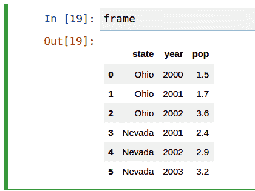

# 五、使用 pandas 入门

> 原文：[`wesmckinney.com/book/pandas-basics`](https://wesmckinney.com/book/pandas-basics)
>
> 译者：[飞龙](https://github.com/wizardforcel)
>
> 协议：[CC BY-NC-SA 4.0](http://creativecommons.org/licenses/by-nc-sa/4.0/)

> 此开放访问网络版本的《Python 数据分析第三版》现已作为[印刷版和数字版](https://amzn.to/3DyLaJc)的伴侣提供。如果您发现任何勘误，请[在此处报告](https://oreilly.com/catalog/0636920519829/errata)。请注意，由 Quarto 生成的本站点的某些方面与 O'Reilly 的印刷版和电子书版本的格式不同。
> 
> 如果您发现本书的在线版本有用，请考虑[订购纸质版](https://amzn.to/3DyLaJc)或[无 DRM 的电子书](https://www.ebooks.com/en-us/book/210644288/python-for-data-analysis/wes-mckinney/?affId=WES398681F)以支持作者。本网站的内容不得复制或再生产。代码示例采用 MIT 许可，可在 GitHub 或 Gitee 上找到。

pandas 将是本书剩余部分中的一个主要工具。它包含了专为在 Python 中快速方便地进行数据清洗和分析而设计的数据结构和数据操作工具。pandas 经常与数值计算工具（如 NumPy 和 SciPy）、分析库（如 statsmodels 和 scikit-learn）以及数据可视化库（如 matplotlib）一起使用。pandas 采用了 NumPy 的很多习惯用法，特别是基于数组的计算和对数据处理的偏好，而不使用`for`循环。

虽然 pandas 采用了许多来自 NumPy 的编码习惯，但最大的区别在于 pandas 是为处理表格或异构数据而设计的。相比之下，NumPy 更适合处理同质类型的数值数组数据。

自 2010 年成为开源项目以来，pandas 已经发展成一个相当庞大的库，适用于广泛的实际用例。开发者社区已经发展到超过 2500 名不同的贡献者，他们在解决日常数据问题时一直在帮助构建这个项目。充满活力的 pandas 开发者和用户社区是其成功的关键部分。

注意

很多人不知道我自 2013 年以来并没有积极参与日常 pandas 的开发；从那时起，它一直是一个完全由社区管理的项目。请务必向核心开发人员和所有贡献者传达感谢他们的辛勤工作！

在本书的剩余部分中，我使用以下的 NumPy 和 pandas 的导入约定：

```py
In [1]: import numpy as np

In [2]: import pandas as pd
```

因此，每当在代码中看到`pd.`时，它指的是 pandas。您可能也会发现将 Series 和 DataFrame 导入到本地命名空间中更容易，因为它们经常被使用：

```py
In [3]: from pandas import Series, DataFrame
```

## 5.1 pandas 数据结构简介

要开始使用 pandas，您需要熟悉其两个主要数据结构：*Series*和*DataFrame*。虽然它们并非适用于每个问题的通用解决方案，但它们为各种数据任务提供了坚实的基础。

### Series

Series 是一个一维数组样对象，包含一系列值（与 NumPy 类型相似的类型）和一个关联的数据标签数组，称为*索引*。最简单的 Series 是仅由数据数组形成的：

```py
In [14]: obj = pd.Series([4, 7, -5, 3])

In [15]: obj
Out[15]: 
0    4
1    7
2   -5
3    3
dtype: int64
```

Series 的交互式显示的字符串表示在左侧显示索引，右侧显示值。由于我们没有为数据指定索引，因此会创建一个默认索引，由整数`0`到`N-1`（其中`N`是数据的长度）组成。您可以通过其`array`和`index`属性分别获取 Series 的数组表示和索引对象：

```py
In [16]: obj.array
Out[16]: 
<PandasArray>
[4, 7, -5, 3]
Length: 4, dtype: int64

In [17]: obj.index
Out[17]: RangeIndex(start=0, stop=4, step=1)
```

`.array`属性的结果是一个`PandasArray`，通常包装了一个 NumPy 数组，但也可以包含特殊的扩展数组类型，这将在 Ch 7.3：扩展数据类型中更详细讨论。

通常，您会希望创建一个带有标识每个数据点的索引的 Series：

```py
In [18]: obj2 = pd.Series([4, 7, -5, 3], index=["d", "b", "a", "c"])

In [19]: obj2
Out[19]: 
d    4
b    7
a   -5
c    3
dtype: int64

In [20]: obj2.index
Out[20]: Index(['d', 'b', 'a', 'c'], dtype='object')
```

与 NumPy 数组相比，当选择单个值或一组值时，可以在索引中使用标签：

```py
In [21]: obj2["a"]
Out[21]: -5

In [22]: obj2["d"] = 6

In [23]: obj2[["c", "a", "d"]]
Out[23]: 
c    3
a   -5
d    6
dtype: int64
```

这里`["c", "a", "d"]`被解释为索引列表，即使它包含字符串而不是整数。

使用 NumPy 函数或类似 NumPy 的操作，例如使用布尔数组进行过滤、标量乘法或应用数学函数，将保留索引值链接：

```py
In [24]: obj2[obj2 > 0]
Out[24]: 
d    6
b    7
c    3
dtype: int64

In [25]: obj2 * 2
Out[25]: 
d    12
b    14
a   -10
c     6
dtype: int64

In [26]: import numpy as np

In [27]: np.exp(obj2)
Out[27]: 
d     403.428793
b    1096.633158
a       0.006738
c      20.085537
dtype: float64
```

将 Series 视为固定长度的有序字典的另一种方式，因为它是索引值到数据值的映射。它可以在许多上下文中使用，您可能会使用字典：

```py
In [28]: "b" in obj2
Out[28]: True

In [29]: "e" in obj2
Out[29]: False
```

如果您的数据包含在 Python 字典中，可以通过传递字典来创建一个 Series：

```py
In [30]: sdata = {"Ohio": 35000, "Texas": 71000, "Oregon": 16000, "Utah": 5000}

In [31]: obj3 = pd.Series(sdata)

In [32]: obj3
Out[32]: 
Ohio      35000
Texas     71000
Oregon    16000
Utah       5000
dtype: int64
```

Series 可以使用其`to_dict`方法转换回字典：

```py
In [33]: obj3.to_dict()
Out[33]: {'Ohio': 35000, 'Texas': 71000, 'Oregon': 16000, 'Utah': 5000}
```

当您只传递一个字典时，生成的 Series 中的索引将遵循字典的`keys`方法的键的顺序，这取决于键插入顺序。您可以通过传递一个索引，其中包含字典键的顺序，以便它们出现在生成的 Series 中的顺序来覆盖这一点：

```py
In [34]: states = ["California", "Ohio", "Oregon", "Texas"]

In [35]: obj4 = pd.Series(sdata, index=states)

In [36]: obj4
Out[36]: 
California        NaN
Ohio          35000.0
Oregon        16000.0
Texas         71000.0
dtype: float64
```

在这里，`sdata`中找到的三个值被放置在适当的位置，但由于没有找到`"California"`的值，它显示为`NaN`（不是一个数字），在 pandas 中被视为标记缺失或*NA*值。由于`states`中没有包含`"Utah"`，因此它被排除在结果对象之外。

我将使用术语“missing”、“NA”或“null”来交替引用缺失数据。应该使用 pandas 中的`isna`和`notna`函数来检测缺失数据：

```py
In [37]: pd.isna(obj4)
Out[37]: 
California     True
Ohio          False
Oregon        False
Texas         False
dtype: bool

In [38]: pd.notna(obj4)
Out[38]: 
California    False
Ohio           True
Oregon         True
Texas          True
dtype: bool
```

Series 还具有这些作为实例方法：

```py
In [39]: obj4.isna()
Out[39]: 
California     True
Ohio          False
Oregon        False
Texas         False
dtype: bool
```

我将在第七章：数据清洗和准备中更详细地讨论处理缺失数据的工作。

对于许多应用程序来说，Series 的一个有用特性是它在算术运算中自动按索引标签对齐：

```py
In [40]: obj3
Out[40]: 
Ohio      35000
Texas     71000
Oregon    16000
Utah       5000
dtype: int64

In [41]: obj4
Out[41]: 
California        NaN
Ohio          35000.0
Oregon        16000.0
Texas         71000.0
dtype: float64

In [42]: obj3 + obj4
Out[42]: 
California         NaN
Ohio           70000.0
Oregon         32000.0
Texas         142000.0
Utah               NaN
dtype: float64
```

数据对齐功能将在后面更详细地讨论。如果您有数据库经验，可以将其视为类似于连接操作。

Series 对象本身和其索引都有一个`name`属性，它与 pandas 功能的其他区域集成：

```py
In [43]: obj4.name = "population"

In [44]: obj4.index.name = "state"

In [45]: obj4
Out[45]: 
state
California        NaN
Ohio          35000.0
Oregon        16000.0
Texas         71000.0
Name: population, dtype: float64
```

Series 的索引可以通过赋值来直接更改：

```py
In [46]: obj
Out[46]: 
0    4
1    7
2   -5
3    3
dtype: int64

In [47]: obj.index = ["Bob", "Steve", "Jeff", "Ryan"]

In [48]: obj
Out[48]: 
Bob      4
Steve    7
Jeff    -5
Ryan     3
dtype: int64
```

### DataFrame

DataFrame 表示数据的矩形表，并包含一个有序的、命名的列集合，每个列可以是不同的值类型（数值、字符串、布尔值等）。DataFrame 既有行索引又有列索引；它可以被视为共享相同索引的一系列 Series 的字典。

注意

虽然 DataFrame 在物理上是二维的，但您可以使用它来以分层索引的方式表示更高维度的数据，这是我们将在第八章：数据整理：连接、合并和重塑中讨论的一个主题，并且是 pandas 中一些更高级数据处理功能的一个组成部分。

有许多构建 DataFrame 的方法，尽管其中最常见的一种是从等长列表或 NumPy 数组的字典中构建：

```py
data = {"state": ["Ohio", "Ohio", "Ohio", "Nevada", "Nevada", "Nevada"],
 "year": [2000, 2001, 2002, 2001, 2002, 2003],
 "pop": [1.5, 1.7, 3.6, 2.4, 2.9, 3.2]}
frame = pd.DataFrame(data)
```

生成的 DataFrame 将自动分配其索引，与 Series 一样，并且列根据`data`中键的顺序放置（取决于字典中的插入顺序）：

```py
In [50]: frame
Out[50]: 
 state  year  pop
0    Ohio  2000  1.5
1    Ohio  2001  1.7
2    Ohio  2002  3.6
3  Nevada  2001  2.4
4  Nevada  2002  2.9
5  Nevada  2003  3.2
```

注意

如果您正在使用 Jupyter 笔记本，pandas DataFrame 对象将显示为更适合浏览器的 HTML 表格。请参见图 5.1 作为示例。



图 5.1：Jupyter 中 pandas DataFrame 对象的外观

对于大型 DataFrame，`head`方法仅选择前五行：

```py
In [51]: frame.head()
Out[51]: 
 state  year  pop
0    Ohio  2000  1.5
1    Ohio  2001  1.7
2    Ohio  2002  3.6
3  Nevada  2001  2.4
4  Nevada  2002  2.9
```

类似地，`tail`返回最后五行：

```py
In [52]: frame.tail()
Out[52]: 
 state  year  pop
1    Ohio  2001  1.7
2    Ohio  2002  3.6
3  Nevada  2001  2.4
4  Nevada  2002  2.9
5  Nevada  2003  3.2
```

如果指定一系列列，DataFrame 的列将按照该顺序排列：

```py
In [53]: pd.DataFrame(data, columns=["year", "state", "pop"])
Out[53]: 
 year   state  pop
0  2000    Ohio  1.5
1  2001    Ohio  1.7
2  2002    Ohio  3.6
3  2001  Nevada  2.4
4  2002  Nevada  2.9
5  2003  Nevada  3.2
```

如果传递一个字典中不包含的列，它将以缺失值的形式出现在结果中：

```py
In [54]: frame2 = pd.DataFrame(data, columns=["year", "state", "pop", "debt"])

In [55]: frame2
Out[55]: 
 year   state  pop debt
0  2000    Ohio  1.5  NaN
1  2001    Ohio  1.7  NaN
2  2002    Ohio  3.6  NaN
3  2001  Nevada  2.4  NaN
4  2002  Nevada  2.9  NaN
5  2003  Nevada  3.2  NaN

In [56]: frame2.columns
Out[56]: Index(['year', 'state', 'pop', 'debt'], dtype='object')
```

DataFrame 中的列可以通过类似字典的表示法或使用点属性表示法检索为 Series：

```py
In [57]: frame2["state"]
Out[57]: 
0      Ohio
1      Ohio
2      Ohio
3    Nevada
4    Nevada
5    Nevada
Name: state, dtype: object

In [58]: frame2.year
Out[58]: 
0    2000
1    2001
2    2002
3    2001
4    2002
5    2003
Name: year, dtype: int64
```

注意

提供类似属性访问（例如，`frame2.year`）和 IPython 中列名称的制表符补全作为便利。

`frame2[column]`适用于任何列名，但只有当列名是有效的 Python 变量名且不与 DataFrame 中的任何方法名冲突时，`frame2.column`才适用。例如，如果列名包含空格或下划线以外的其他符号，则无法使用点属性方法访问。

请注意，返回的 Series 具有与 DataFrame 相同的索引，并且它们的`name`属性已经适当设置。

行也可以通过特殊的`iloc`和`loc`属性按位置或名称检索（稍后在使用 loc 和 iloc 在 DataFrame 上进行选择中详细介绍）：

```py
In [59]: frame2.loc[1]
Out[59]: 
year     2001
state    Ohio
pop       1.7
debt      NaN
Name: 1, dtype: object

In [60]: frame2.iloc[2]
Out[60]: 
year     2002
state    Ohio
pop       3.6
debt      NaN
Name: 2, dtype: object
```

列可以通过赋值进行修改。例如，可以为空的`debt`列分配一个标量值或一个值数组：

```py
In [61]: frame2["debt"] = 16.5

In [62]: frame2
Out[62]: 
 year   state  pop  debt
0  2000    Ohio  1.5  16.5
1  2001    Ohio  1.7  16.5
2  2002    Ohio  3.6  16.5
3  2001  Nevada  2.4  16.5
4  2002  Nevada  2.9  16.5
5  2003  Nevada  3.2  16.5

In [63]: frame2["debt"] = np.arange(6.)

In [64]: frame2
Out[64]: 
 year   state  pop  debt
0  2000    Ohio  1.5   0.0
1  2001    Ohio  1.7   1.0
2  2002    Ohio  3.6   2.0
3  2001  Nevada  2.4   3.0
4  2002  Nevada  2.9   4.0
5  2003  Nevada  3.2   5.0
```

当将列表或数组分配给列时，值的长度必须与 DataFrame 的长度相匹配。如果分配一个 Series，其标签将被重新对齐到 DataFrame 的索引，插入任何不存在的索引值的缺失值：

```py
In [65]: val = pd.Series([-1.2, -1.5, -1.7], index=[2, 4, 5])

In [66]: frame2["debt"] = val

In [67]: frame2
Out[67]: 
 year   state  pop  debt
0  2000    Ohio  1.5   NaN
1  2001    Ohio  1.7   NaN
2  2002    Ohio  3.6  -1.2
3  2001  Nevada  2.4   NaN
4  2002  Nevada  2.9  -1.5
5  2003  Nevada  3.2  -1.7
```

分配一个不存在的列将创建一个新列。

`del`关键字将像字典一样删除列。例如，首先添加一个新列，其中布尔值等于`"Ohio"`的`state`列：

```py
In [68]: frame2["eastern"] = frame2["state"] == "Ohio"

In [69]: frame2
Out[69]: 
 year   state  pop  debt  eastern
0  2000    Ohio  1.5   NaN     True
1  2001    Ohio  1.7   NaN     True
2  2002    Ohio  3.6  -1.2     True
3  2001  Nevada  2.4   NaN    False
4  2002  Nevada  2.9  -1.5    False
5  2003  Nevada  3.2  -1.7    False
```

警告：

不能使用`frame2.eastern`点属性表示法创建新列。

然后可以使用`del`方法删除此列：

```py
In [70]: del frame2["eastern"]

In [71]: frame2.columns
Out[71]: Index(['year', 'state', 'pop', 'debt'], dtype='object')
```

注意

从 DataFrame 索引返回的列是基础数据的*视图*，而不是副本。因此，对 Series 的任何原地修改都将反映在 DataFrame 中。可以使用 Series 的`copy`方法显式复制列。

另一种常见的数据形式是嵌套字典的字典：

```py
In [72]: populations = {"Ohio": {2000: 1.5, 2001: 1.7, 2002: 3.6},
 ....:                "Nevada": {2001: 2.4, 2002: 2.9}}
```

如果将嵌套字典传递给 DataFrame，pandas 将解释外部字典键为列，内部键为行索引：

```py
In [73]: frame3 = pd.DataFrame(populations)

In [74]: frame3
Out[74]: 
 Ohio  Nevada
2000   1.5     NaN
2001   1.7     2.4
2002   3.6     2.9
```

您可以使用类似于 NumPy 数组的语法转置 DataFrame（交换行和列）：

```py
In [75]: frame3.T
Out[75]: 
 2000  2001  2002
Ohio     1.5   1.7   3.6
Nevada   NaN   2.4   2.9
```

警告：

请注意，如果列的数据类型不全都相同，则转置会丢弃列数据类型，因此转置然后再次转置可能会丢失先前的类型信息。在这种情况下，列变成了纯 Python 对象的数组。

内部字典中的键被组合以形成结果中的索引。如果指定了显式索引，则这种情况不成立：

```py
In [76]: pd.DataFrame(populations, index=[2001, 2002, 2003])
Out[76]: 
 Ohio  Nevada
2001   1.7     2.4
2002   3.6     2.9
2003   NaN     NaN
```

Series 的字典以类似的方式处理：

```py
In [77]: pdata = {"Ohio": frame3["Ohio"][:-1],
 ....:          "Nevada": frame3["Nevada"][:2]}

In [78]: pd.DataFrame(pdata)
Out[78]: 
 Ohio  Nevada
2000   1.5     NaN
2001   1.7     2.4
```

有关可以传递给 DataFrame 构造函数的许多内容，请参见表 5.1。

表 5.1：DataFrame 构造函数的可能数据输入

| 类型 | 注释 |
| --- | --- |
| 2D ndarray | 一组数据的矩阵，传递可选的行和列标签 |
| 数组、列表或元组的字典 | 每个序列都变成了 DataFrame 中的一列；所有序列必须具有相同的长度 |
| NumPy 结构化/记录数组 | 被视为“数组的字典”情况 |
| Series 的字典 | 每个值都变成了一列；如果没有传递显式索引，则每个 Series 的索引被合并在一起以形成结果的行索引 |
| 字典的字典 | 每个内部字典都变成了一列；键被合并以形成行索引，就像“Series 的字典”情况一样 |
| 字典或 Series 的列表 | 每个项目都变成了 DataFrame 中的一行；字典键或 Series 索引的并集成为 DataFrame 的列标签 |
| 列表或元组的列表 | 被视为“2D ndarray”情况 |
| 另一个 DataFrame | 除非传递了不同的索引，否则将使用 DataFrame 的索引 |
| NumPy MaskedArray | 与“2D ndarray”情况类似，只是在 DataFrame 结果中缺少掩码值 |

如果 DataFrame 的`index`和`columns`有设置它们的`name`属性，这些也会被显示出来：

```py
In [79]: frame3.index.name = "year"

In [80]: frame3.columns.name = "state"

In [81]: frame3
Out[81]: 
state  Ohio  Nevada
year 
2000    1.5     NaN
2001    1.7     2.4
2002    3.6     2.9
```

与 Series 不同，DataFrame 没有`name`属性。DataFrame 的`to_numpy`方法将 DataFrame 中包含的数据作为二维 ndarray 返回：

```py
In [82]: frame3.to_numpy()
Out[82]: 
array([[1.5, nan],
 [1.7, 2.4],
 [3.6, 2.9]])
```

如果 DataFrame 的列是不同的数据类型，则返回的数组的数据类型将被选择以容纳所有列：

```py
In [83]: frame2.to_numpy()
Out[83]: 
array([[2000, 'Ohio', 1.5, nan],
 [2001, 'Ohio', 1.7, nan],
 [2002, 'Ohio', 3.6, -1.2],
 [2001, 'Nevada', 2.4, nan],
 [2002, 'Nevada', 2.9, -1.5],
 [2003, 'Nevada', 3.2, -1.7]], dtype=object)
```

### 索引对象

pandas 的 Index 对象负责保存轴标签（包括 DataFrame 的列名）和其他元数据（如轴名称）。在构建 Series 或 DataFrame 时使用的任何数组或其他标签序列都会在内部转换为 Index：

```py
In [84]: obj = pd.Series(np.arange(3), index=["a", "b", "c"])

In [85]: index = obj.index

In [86]: index
Out[86]: Index(['a', 'b', 'c'], dtype='object')

In [87]: index[1:]
Out[87]: Index(['b', 'c'], dtype='object')
```

Index 对象是不可变的，因此用户无法修改它们：

```py
index[1] = "d"  # TypeError
```

不可变性使得在数据结构之间共享 Index 对象更加安全：

```py
In [88]: labels = pd.Index(np.arange(3))

In [89]: labels
Out[89]: Index([0, 1, 2], dtype='int64')

In [90]: obj2 = pd.Series([1.5, -2.5, 0], index=labels)

In [91]: obj2
Out[91]: 
0    1.5
1   -2.5
2    0.0
dtype: float64

In [92]: obj2.index is labels
Out[92]: True
```

注意

一些用户可能不经常利用 Index 提供的功能，但由于一些操作会产生包含索引数据的结果，因此了解它们的工作原理是很重要的。

除了类似数组，Index 还表现得像一个固定大小的集合：

```py
In [93]: frame3
Out[93]: 
state  Ohio  Nevada
year 
2000    1.5     NaN
2001    1.7     2.4
2002    3.6     2.9

In [94]: frame3.columns
Out[94]: Index(['Ohio', 'Nevada'], dtype='object', name='state')

In [95]: "Ohio" in frame3.columns
Out[95]: True

In [96]: 2003 in frame3.index
Out[96]: False
```

与 Python 集合不同，pandas 的 Index 可以包含重复标签：

```py
In [97]: pd.Index(["foo", "foo", "bar", "bar"])
Out[97]: Index(['foo', 'foo', 'bar', 'bar'], dtype='object')
```

具有重复标签的选择将选择该标签的所有出现。

每个 Index 都有一些用于集合逻辑的方法和属性，可以回答关于其包含的数据的其他常见问题。一些有用的方法总结在 Table 5.2 中。

Table 5.2: 一些索引方法和属性

| 方法/属性 | 描述 |
| --- | --- |
| `append()` | 与其他 Index 对象连接，生成一个新的 Index |
| `difference()` | 计算索引的差集 |
| `intersection()` | 计算集合交集 |
| `union()` | 计算集合并 |
| `isin()` | 计算布尔数组，指示每个值是否包含在传递的集合中 |
| `delete()` | 通过删除索引`i`处的元素来计算新的索引 |
| `drop()` | 通过删除传递的值来计算新的索引 |
| `insert()` | 通过在索引`i`处插入元素来计算新的索引 |
| `is_monotonic` | 如果每个元素大于或等于前一个元素则返回`True` |
| `is_unique` | 如果索引没有重复值则返回`True` |

| `unique()` | 计算索引中唯一值的数组 |

## 5.2 基本功能

本节将带领您了解与 Series 或 DataFrame 中包含的数据进行交互的基本机制。在接下来的章节中，我们将更深入地探讨使用 pandas 进行数据分析和操作的主题。本书不旨在作为 pandas 库的详尽文档，而是专注于让您熟悉常用功能，将不太常见的（即更神秘的）内容留给您通过阅读在线 pandas 文档来学习。

### 重新索引

pandas 对象上的一个重要方法是`reindex`，它意味着创建一个新对象，其值重新排列以与新索引对齐。考虑一个例子：

```py
In [98]: obj = pd.Series([4.5, 7.2, -5.3, 3.6], index=["d", "b", "a", "c"])

In [99]: obj
Out[99]: 
d    4.5
b    7.2
a   -5.3
c    3.6
dtype: float64
```

在这个 Series 上调用`reindex`会根据新索引重新排列数据，如果某些索引值之前不存在，则会引入缺失值：

```py
In [100]: obj2 = obj.reindex(["a", "b", "c", "d", "e"])

In [101]: obj2
Out[101]: 
a   -5.3
b    7.2
c    3.6
d    4.5
e    NaN
dtype: float64
```

对于有序数据如时间序列，当重新索引时可能需要进行一些插值或值填充。`method`选项允许我们使用`ffill`这样的方法来实现，它可以向前填充值：

```py
In [102]: obj3 = pd.Series(["blue", "purple", "yellow"], index=[0, 2, 4])

In [103]: obj3
Out[103]: 
0      blue
2    purple
4    yellow
dtype: object

In [104]: obj3.reindex(np.arange(6), method="ffill")
Out[104]: 
0      blue
1      blue
2    purple
3    purple
4    yellow
5    yellow
dtype: object
```

对于 DataFrame，`reindex`可以改变（行）索引、列或两者。当只传递一个序列时，它会重新索引结果中的行：

```py
In [105]: frame = pd.DataFrame(np.arange(9).reshape((3, 3)),
 .....:                      index=["a", "c", "d"],
 .....:                      columns=["Ohio", "Texas", "California"])

In [106]: frame
Out[106]: 
 Ohio  Texas  California
a     0      1           2
c     3      4           5
d     6      7           8

In [107]: frame2 = frame.reindex(index=["a", "b", "c", "d"])

In [108]: frame2
Out[108]: 
 Ohio  Texas  California
a   0.0    1.0         2.0
b   NaN    NaN         NaN
c   3.0    4.0         5.0
d   6.0    7.0         8.0
```

可以使用`columns`关键字重新索引列：

```py
In [109]: states = ["Texas", "Utah", "California"]

In [110]: frame.reindex(columns=states)
Out[110]: 
 Texas  Utah  California
a      1   NaN           2
c      4   NaN           5
d      7   NaN           8
```

因为`"Ohio"`不在`states`中，所以该列的数据被从结果中删除。

重新索引特定轴的另一种方法是将新的轴标签作为位置参数传递，然后使用`axis`关键字指定要重新索引的轴：

```py
In [111]: frame.reindex(states, axis="columns")
Out[111]: 
 Texas  Utah  California
a      1   NaN           2
c      4   NaN           5
d      7   NaN           8
```

查看 Table 5.3 以了解有关`reindex`参数的更多信息。

表 5.3：`reindex`函数参数

| 参数 | 描述 |
| --- | --- |
| `labels` | 用作索引的新序列。可以是 Index 实例或任何其他类似序列的 Python 数据结构。Index 将被完全使用，不会进行任何复制。 |
| `index` | 使用传递的序列作为新的索引标签。 |
| `columns` | 使用传递的序列作为新的列标签。 |
| `axis` | 要重新索引的轴，无论是`"index"`（行）还是`"columns"`。默认为`"index"`。您也可以使用`reindex(index=new_labels)`或`reindex(columns=new_labels)`。 |
| `method` | 插值（填充）方法；`"ffill"`向前填充，而`"bfill"`向后填充。 |
| `fill_value` | 重新索引时引入缺失数据时要使用的替代值。当您希望缺失标签在结果中具有空值时，请使用`fill_value="missing"`（默认行为）。 |
| `limit` | 在向前填充或向后填充时，要填充的最大大小间隙（元素数量）。 |
| `tolerance` | 在向前填充或向后填充时，要填充的最大大小间隙（绝对数值距离）。 |
| `level` | 在 MultiIndex 级别上匹配简单索引；否则选择子集。 |
| `copy` | 如果为`True`，即使新索引等效于旧索引，也始终复制基础数据；如果为`False`，当索引等效时不复制数据。 |

正如我们稍后将在使用 loc 和 iloc 在 DataFrame 上进行选择中探讨的，您也可以通过使用`loc`运算符重新索引，许多用户更喜欢始终以这种方式进行操作。这仅在所有新索引标签已存在于 DataFrame 中时才有效（而`reindex`将为新标签插入缺失数据）：

```py
In [112]: frame.loc[["a", "d", "c"], ["California", "Texas"]]
Out[112]: 
 California  Texas
a           2      1
d           8      7
c           5      4
```

### 从轴中删除条目

如果您已经有一个不包含这些条目的索引数组或列表，那么从轴中删除一个或多个条目就很简单，因为您可以使用`reindex`方法或基于`.loc`的索引。由于这可能需要一些数据处理和集合逻辑，`drop`方法将返回一个新对象，其中包含从轴中删除的指定值或值：

```py
In [113]: obj = pd.Series(np.arange(5.), index=["a", "b", "c", "d", "e"])

In [114]: obj
Out[114]: 
a    0.0
b    1.0
c    2.0
d    3.0
e    4.0
dtype: float64

In [115]: new_obj = obj.drop("c")

In [116]: new_obj
Out[116]: 
a    0.0
b    1.0
d    3.0
e    4.0
dtype: float64

In [117]: obj.drop(["d", "c"])
Out[117]: 
a    0.0
b    1.0
e    4.0
dtype: float64
```

使用 DataFrame，可以从任一轴删除索引值。为了说明这一点，我们首先创建一个示例 DataFrame：

```py
In [118]: data = pd.DataFrame(np.arange(16).reshape((4, 4)),
 .....:                     index=["Ohio", "Colorado", "Utah", "New York"],
 .....:                     columns=["one", "two", "three", "four"])

In [119]: data
Out[119]: 
 one  two  three  four
Ohio        0    1      2     3
Colorado    4    5      6     7
Utah        8    9     10    11
New York   12   13     14    15
```

使用一系列标签调用`drop`将从行标签（轴 0）中删除值：

```py
In [120]: data.drop(index=["Colorado", "Ohio"])
Out[120]: 
 one  two  three  four
Utah        8    9     10    11
New York   12   13     14    15
```

要从列中删除标签，而不是使用`columns`关键字：

```py
In [121]: data.drop(columns=["two"])
Out[121]: 
 one  three  four
Ohio        0      2     3
Colorado    4      6     7
Utah        8     10    11
New York   12     14    15
```

您还可以通过传递`axis=1`（类似于 NumPy）或`axis="columns"`来从列中删除值：

```py
In [122]: data.drop("two", axis=1)
Out[122]: 
 one  three  four
Ohio        0      2     3
Colorado    4      6     7
Utah        8     10    11
New York   12     14    15

In [123]: data.drop(["two", "four"], axis="columns")
Out[123]: 
 one  three
Ohio        0      2
Colorado    4      6
Utah        8     10
New York   12     14
```

### 索引、选择和过滤

Series 索引（`obj[...]`）的工作方式类似于 NumPy 数组索引，只是您可以使用 Series 的索引值而不仅仅是整数。以下是一些示例：

```py
In [124]: obj = pd.Series(np.arange(4.), index=["a", "b", "c", "d"])

In [125]: obj
Out[125]: 
a    0.0
b    1.0
c    2.0
d    3.0
dtype: float64

In [126]: obj["b"]
Out[126]: 1.0

In [127]: obj[1]
Out[127]: 1.0

In [128]: obj[2:4]
Out[128]: 
c    2.0
d    3.0
dtype: float64

In [129]: obj[["b", "a", "d"]]
Out[129]: 
b    1.0
a    0.0
d    3.0
dtype: float64

In [130]: obj[[1, 3]]
Out[130]: 
b    1.0
d    3.0
dtype: float64

In [131]: obj[obj < 2]
Out[131]: 
a    0.0
b    1.0
dtype: float64
```

虽然您可以通过标签这种方式选择数据，但选择索引值的首选方式是使用特殊的`loc`运算符：

```py
In [132]: obj.loc[["b", "a", "d"]]
Out[132]: 
b    1.0
a    0.0
d    3.0
dtype: float64
```

更喜欢`loc`的原因是因为在使用`[]`进行索引时，对整数的处理方式不同。如果索引包含整数，常规的`[]`索引将将整数视为标签，因此行为取决于索引的数据类型。例如：

```py
In [133]: obj1 = pd.Series([1, 2, 3], index=[2, 0, 1])

In [134]: obj2 = pd.Series([1, 2, 3], index=["a", "b", "c"])

In [135]: obj1
Out[135]: 
2    1
0    2
1    3
dtype: int64

In [136]: obj2
Out[136]: 
a    1
b    2
c    3
dtype: int64

In [137]: obj1[[0, 1, 2]]
Out[137]: 
0    2
1    3
2    1
dtype: int64

In [138]: obj2[[0, 1, 2]]
Out[138]: 
a    1
b    2
c    3
dtype: int64
```

在使用`loc`时，当索引不包含整数时，表达式`obj.loc[[0, 1, 2]]`将失败：

```py
In [134]: obj2.loc[[0, 1]]
---------------------------------------------------------------------------
KeyError                                  Traceback (most recent call last)
/tmp/ipykernel_804589/4185657903.py in <module>
----> 1 obj2.loc[[0, 1]]

^ LONG EXCEPTION ABBREVIATED ^

KeyError: "None of [Int64Index([0, 1], dtype="int64")] are in the [index]"
```

由于`loc`运算符仅使用标签进行索引，因此还有一个`iloc`运算符，它仅使用整数进行索引，以便在索引包含整数或不包含整数时始终保持一致：

```py
In [139]: obj1.iloc[[0, 1, 2]]
Out[139]: 
2    1
0    2
1    3
dtype: int64

In [140]: obj2.iloc[[0, 1, 2]]
Out[140]: 
a    1
b    2
c    3
dtype: int64
```

注意

您也可以使用标签进行切片，但与正常的 Python 切片不同，终点是包含的：

```py
In [141]: obj2.loc["b":"c"]
Out[141]: 
b    2
c    3
dtype: int64
```

使用这些方法分配值会修改 Series 的相应部分：

```py
In [142]: obj2.loc["b":"c"] = 5

In [143]: obj2
Out[143]: 
a    1
b    5
c    5
dtype: int64
```

注意

尝试调用`loc`或`iloc`等函数而不是使用方括号“索引”可能是新手的常见错误。方括号表示用于启用切片操作并允许在 DataFrame 对象上的多个轴上进行索引。

在 DataFrame 中进行索引会检索一个或多个列，可以使用单个值或序列：

```py
In [144]: data = pd.DataFrame(np.arange(16).reshape((4, 4)),
 .....:                     index=["Ohio", "Colorado", "Utah", "New York"],
 .....:                     columns=["one", "two", "three", "four"])

In [145]: data
Out[145]: 
 one  two  three  four
Ohio        0    1      2     3
Colorado    4    5      6     7
Utah        8    9     10    11
New York   12   13     14    15

In [146]: data["two"]
Out[146]: 
Ohio         1
Colorado     5
Utah         9
New York    13
Name: two, dtype: int64

In [147]: data[["three", "one"]]
Out[147]: 
 three  one
Ohio          2    0
Colorado      6    4
Utah         10    8
New York     14   12
```

这种索引有一些特殊情况。第一个是使用布尔数组进行切片或选择数据：

```py
In [148]: data[:2]
Out[148]: 
 one  two  three  four
Ohio        0    1      2     3
Colorado    4    5      6     7

In [149]: data[data["three"] > 5]
Out[149]: 
 one  two  three  four
Colorado    4    5      6     7
Utah        8    9     10    11
New York   12   13     14    15
```

行选择语法`data[:2]`是作为一种便利提供的。将单个元素或列表传递给`[]`运算符将选择列。

另一个用例是使用布尔 DataFrame 进行索引，比如通过标量比较生成的 DataFrame。考虑一个通过与标量值比较生成的全布尔值的 DataFrame：

```py
In [150]: data < 5
Out[150]: 
 one    two  three   four
Ohio       True   True   True   True
Colorado   True  False  False  False
Utah      False  False  False  False
New York  False  False  False  False
```

我们可以使用这个 DataFrame 将值为`True`的位置赋值为 0，就像这样：

```py
In [151]: data[data < 5] = 0

In [152]: data
Out[152]: 
 one  two  three  four
Ohio        0    0      0     0
Colorado    0    5      6     7
Utah        8    9     10    11
New York   12   13     14    15
```

#### 使用 loc 和 iloc 在 DataFrame 上进行选择

与 Series 一样，DataFrame 具有专门的属性`loc`和`iloc`，用于基于标签和基于整数的索引。由于 DataFrame 是二维的，您可以使用类似 NumPy 的符号使用轴标签（`loc`）或整数（`iloc`）选择行和列的子集。

作为第一个示例，让我们通过标签选择单行：

```py
In [153]: data
Out[153]: 
 one  two  three  four
Ohio        0    0      0     0
Colorado    0    5      6     7
Utah        8    9     10    11
New York   12   13     14    15

In [154]: data.loc["Colorado"]
Out[154]: 
one      0
two      5
three    6
four     7
Name: Colorado, dtype: int64
```

选择单行的结果是一个带有包含 DataFrame 列标签的索引的 Series。要选择多个行，创建一个新的 DataFrame，传递一个标签序列：

```py
In [155]: data.loc[["Colorado", "New York"]]
Out[155]: 
 one  two  three  four
Colorado    0    5      6     7
New York   12   13     14    15
```

您可以通过用逗号分隔选择在`loc`中同时选择行和列：

```py
In [156]: data.loc["Colorado", ["two", "three"]]
Out[156]: 
two      5
three    6
Name: Colorado, dtype: int64
```

然后我们将使用`iloc`执行一些类似的整数选择：

```py
In [157]: data.iloc[2]
Out[157]: 
one       8
two       9
three    10
four     11
Name: Utah, dtype: int64

In [158]: data.iloc[[2, 1]]
Out[158]: 
 one  two  three  four
Utah        8    9     10    11
Colorado    0    5      6     7

In [159]: data.iloc[2, [3, 0, 1]]
Out[159]: 
four    11
one      8
two      9
Name: Utah, dtype: int64

In [160]: data.iloc[[1, 2], [3, 0, 1]]
Out[160]: 
 four  one  two
Colorado     7    0    5
Utah        11    8    9
```

这两个索引函数都可以处理切片，除了单个标签或标签列表：

```py
In [161]: data.loc[:"Utah", "two"]
Out[161]: 
Ohio        0
Colorado    5
Utah        9
Name: two, dtype: int64

In [162]: data.iloc[:, :3][data.three > 5]
Out[162]: 
 one  two  three
Colorado    0    5      6
Utah        8    9     10
New York   12   13     14
```

布尔数组可以与`loc`一起使用，但不能与`iloc`一起使用：

```py
In [163]: data.loc[data.three >= 2]
Out[163]: 
 one  two  three  four
Colorado    0    5      6     7
Utah        8    9     10    11
New York   12   13     14    15
```

有许多方法可以选择和重新排列 pandas 对象中包含的数据。对于 DataFrame，表 5.4 提供了许多这些方法的简要总结。正如您将在后面看到的，还有许多其他选项可用于处理分层索引。

表 5.4：DataFrame 的索引选项

| 类型 | 注释 |
| --- | --- |
| `df[column]` | 从 DataFrame 中选择单个列或列序列；特殊情况便利：布尔数组（过滤行）、切片（切片行）或布尔 DataFrame（根据某些条件设置值） |
| `df.loc[rows]` | 通过标签从 DataFrame 中选择单行或行子集 |
| `df.loc[:, cols]` | 通过标签选择单个列或列子集 |
| `df.loc[rows, cols]` | 通过标签选择行和列 |
| `df.iloc[rows]` | 通过整数位置从 DataFrame 中选择单行或行子集 |
| `df.iloc[:, cols]` | 通过整数位置选择单个列或列子集 |
| `df.iloc[rows, cols]` | 通过整数位置选择行和列 |
| `df.at[row, col]` | 通过行和列标签选择单个标量值 |
| `df.iat[row, col]` | 通过行和列位置（整数）选择单个标量值 |
| `reindex`方法 | 通过标签选择行或列 |

#### 整数索引的陷阱

使用整数索引的 pandas 对象可能会成为新用户的绊脚石，因为它们与内置的 Python 数据结构（如列表和元组）的工作方式不同。例如，您可能不会期望以下代码生成错误：

```py
In [164]: ser = pd.Series(np.arange(3.))

In [165]: ser
Out[165]: 
0    0.0
1    1.0
2    2.0
dtype: float64

In [166]: ser[-1]
---------------------------------------------------------------------------
ValueError                                Traceback (most recent call last)
~/miniforge-x86/envs/book-env/lib/python3.10/site-packages/pandas/core/indexes/ra
nge.py in get_loc(self, key)
 344             try:
--> 345                 return self._range.index(new_key)
 346             except ValueError as err:
ValueError: -1 is not in range
The above exception was the direct cause of the following exception:
KeyError                                  Traceback (most recent call last)
<ipython-input-166-44969a759c20> in <module>
----> 1 ser[-1]
~/miniforge-x86/envs/book-env/lib/python3.10/site-packages/pandas/core/series.py 
in __getitem__(self, key)
 1010 
 1011         elif key_is_scalar:
-> 1012             return self._get_value(key)
 1013 
 1014         if is_hashable(key):
~/miniforge-x86/envs/book-env/lib/python3.10/site-packages/pandas/core/series.py 
in _get_value(self, label, takeable)
 1119 
 1120         # Similar to Index.get_value, but we do not fall back to position
al
-> 1121         loc = self.index.get_loc(label)
 1122 
 1123         if is_integer(loc):
~/miniforge-x86/envs/book-env/lib/python3.10/site-packages/pandas/core/indexes/ra
nge.py in get_loc(self, key)
 345                 return self._range.index(new_key)
 346             except ValueError as err:
--> 347                 raise KeyError(key) from err
 348         self._check_indexing_error(key)
 349         raise KeyError(key)
KeyError: -1
```

在这种情况下，pandas 可能会“回退”到整数索引，但是在不引入对用户代码中微妙错误的情况下，通常很难做到这一点。在这里，我们有一个包含`0`、`1`和`2`的索引，但 pandas 不想猜测用户想要什么（基于标签的索引还是基于位置的）：

```py
In [167]: ser
Out[167]: 
0    0.0
1    1.0
2    2.0
dtype: float64
```

另一方面，对于非整数索引，没有这种歧义：

```py
In [168]: ser2 = pd.Series(np.arange(3.), index=["a", "b", "c"])

In [169]: ser2[-1]
Out[169]: 2.0
```

如果您有包含整数的轴索引，数据选择将始终是基于标签的。正如我上面所说的，如果您使用`loc`（用于标签）或`iloc`（用于整数），您将得到确切想要的结果：

```py
In [170]: ser.iloc[-1]
Out[170]: 2.0
```

另一方面，使用整数进行切片始终是基于整数的：

```py
In [171]: ser[:2]
Out[171]: 
0    0.0
1    1.0
dtype: float64
```

由于这些陷阱，最好始终优先使用`loc`和`iloc`进行索引，以避免歧义。

#### 链式索引的陷阱

在前一节中，我们看了如何使用`loc`和`iloc`在 DataFrame 上进行灵活的选择。这些索引属性也可以用于就地修改 DataFrame 对象，但这样做需要一些小心。

例如，在上面的 DataFrame 示例中，我们可以按标签或整数位置分配到列或行：

```py
In [172]: data.loc[:, "one"] = 1

In [173]: data
Out[173]: 
 one  two  three  four
Ohio        1    0      0     0
Colorado    1    5      6     7
Utah        1    9     10    11
New York    1   13     14    15

In [174]: data.iloc[2] = 5

In [175]: data
Out[175]: 
 one  two  three  four
Ohio        1    0      0     0
Colorado    1    5      6     7
Utah        5    5      5     5
New York    1   13     14    15

In [176]: data.loc[data["four"] > 5] = 3

In [177]: data
Out[177]: 
 one  two  three  four
Ohio        1    0      0     0
Colorado    3    3      3     3
Utah        5    5      5     5
New York    3    3      3     3
```

对于新的 pandas 用户来说，一个常见的坑是在赋值时链接选择，就像这样：

```py
In [177]: data.loc[data.three == 5]["three"] = 6
<ipython-input-11-0ed1cf2155d5>:1: SettingWithCopyWarning:
A value is trying to be set on a copy of a slice from a DataFrame.
Try using .loc[row_indexer,col_indexer] = value instead
```

根据数据内容的不同，这可能会打印一个特殊的`SettingWithCopyWarning`，它警告您正在尝试修改一个临时值（`data.loc[data.three == 5]`的非空结果），而不是原始 DataFrame`data`，这可能是您的本意。在这里，`data`没有被修改：

```py
In [179]: data
Out[179]: 
 one  two  three  four
Ohio        1    0      0     0
Colorado    3    3      3     3
Utah        5    5      5     5
New York    3    3      3     3
```

在这些情况下，修复的方法是重写链接赋值，使用单个`loc`操作：

```py
In [180]: data.loc[data.three == 5, "three"] = 6

In [181]: data
Out[181]: 
 one  two  three  four
Ohio        1    0      0     0
Colorado    3    3      3     3
Utah        5    5      6     5
New York    3    3      3     3
```

一个很好的经验法则是在进行赋值时避免链接索引。还有其他情况下，pandas 会生成`SettingWithCopyWarning`，这与链接索引有关。我建议您查阅在线 pandas 文档中的这个主题。

### 算术和数据对齐

pandas 可以使处理具有不同索引的对象变得更简单。例如，当您添加对象时，如果任何索引对不相同，结果中的相应索引将是索引对的并集。让我们看一个例子：

```py
In [182]: s1 = pd.Series([7.3, -2.5, 3.4, 1.5], index=["a", "c", "d", "e"])

In [183]: s2 = pd.Series([-2.1, 3.6, -1.5, 4, 3.1],
 .....:                index=["a", "c", "e", "f", "g"])

In [184]: s1
Out[184]: 
a    7.3
c   -2.5
d    3.4
e    1.5
dtype: float64

In [185]: s2
Out[185]: 
a   -2.1
c    3.6
e   -1.5
f    4.0
g    3.1
dtype: float64
```

将它们相加得到：

```py
In [186]: s1 + s2
Out[186]: 
a    5.2
c    1.1
d    NaN
e    0.0
f    NaN
g    NaN
dtype: float64
```

内部数据对齐会在不重叠的标签位置引入缺失值。缺失值将在进一步的算术计算中传播。

对于 DataFrame，对齐是在行和列上执行的：

```py
In [187]: df1 = pd.DataFrame(np.arange(9.).reshape((3, 3)), columns=list("bcd"),
 .....:                    index=["Ohio", "Texas", "Colorado"])

In [188]: df2 = pd.DataFrame(np.arange(12.).reshape((4, 3)), columns=list("bde"),
 .....:                    index=["Utah", "Ohio", "Texas", "Oregon"])

In [189]: df1
Out[189]: 
 b    c    d
Ohio      0.0  1.0  2.0
Texas     3.0  4.0  5.0
Colorado  6.0  7.0  8.0

In [190]: df2
Out[190]: 
 b     d     e
Utah    0.0   1.0   2.0
Ohio    3.0   4.0   5.0
Texas   6.0   7.0   8.0
Oregon  9.0  10.0  11.0
```

将它们相加返回一个 DataFrame，其索引和列是每个 DataFrame 中的索引的并集：

```py
In [191]: df1 + df2
Out[191]: 
 b   c     d   e
Colorado  NaN NaN   NaN NaN
Ohio      3.0 NaN   6.0 NaN
Oregon    NaN NaN   NaN NaN
Texas     9.0 NaN  12.0 NaN
Utah      NaN NaN   NaN NaN
```

由于 DataFrame 对象中都没有找到`"c"`和`"e"`列，它们在结果中显示为缺失。对于标签不共同的行也是如此。

如果添加没有共同列或行标签的 DataFrame 对象，结果将包含所有空值：

```py
In [192]: df1 = pd.DataFrame({"A": [1, 2]})

In [193]: df2 = pd.DataFrame({"B": [3, 4]})

In [194]: df1
Out[194]: 
 A
0  1
1  2

In [195]: df2
Out[195]: 
 B
0  3
1  4

In [196]: df1 + df2
Out[196]: 
 A   B
0 NaN NaN
1 NaN NaN
```

#### 带有填充值的算术方法

在不同索引对象之间的算术操作中，当一个对象中找到一个轴标签而另一个对象中没有时，您可能希望填充一个特殊值，比如 0。以下是一个示例，我们通过将`np.nan`赋值给它来将特定值设置为 NA（null）：

```py
In [197]: df1 = pd.DataFrame(np.arange(12.).reshape((3, 4)),
 .....:                    columns=list("abcd"))

In [198]: df2 = pd.DataFrame(np.arange(20.).reshape((4, 5)),
 .....:                    columns=list("abcde"))

In [199]: df2.loc[1, "b"] = np.nan

In [200]: df1
Out[200]: 
 a    b     c     d
0  0.0  1.0   2.0   3.0
1  4.0  5.0   6.0   7.0
2  8.0  9.0  10.0  11.0

In [201]: df2
Out[201]: 
 a     b     c     d     e
0   0.0   1.0   2.0   3.0   4.0
1   5.0   NaN   7.0   8.0   9.0
2  10.0  11.0  12.0  13.0  14.0
3  15.0  16.0  17.0  18.0  19.0
```

将它们相加会导致不重叠位置的缺失值：

```py
In [202]: df1 + df2
Out[202]: 
 a     b     c     d   e
0   0.0   2.0   4.0   6.0 NaN
1   9.0   NaN  13.0  15.0 NaN
2  18.0  20.0  22.0  24.0 NaN
3   NaN   NaN   NaN   NaN NaN
```

在`df1`上使用`add`方法，我传递`df2`和一个参数给`fill_value`，它会用传递的值替换操作中的任何缺失值：

```py
In [203]: df1.add(df2, fill_value=0)
Out[203]: 
 a     b     c     d     e
0   0.0   2.0   4.0   6.0   4.0
1   9.0   5.0  13.0  15.0   9.0
2  18.0  20.0  22.0  24.0  14.0
3  15.0  16.0  17.0  18.0  19.0
```

请参阅表 5.5 以获取有关算术的 Series 和 DataFrame 方法的列表。每个方法都有一个对应的方法，以字母`r`开头，参数顺序相反。因此，以下两个语句是等价的：

```py
In [204]: 1 / df1
Out[204]: 
 a         b         c         d
0    inf  1.000000  0.500000  0.333333
1  0.250  0.200000  0.166667  0.142857
2  0.125  0.111111  0.100000  0.090909

In [205]: df1.rdiv(1)
Out[205]: 
 a         b         c         d
0    inf  1.000000  0.500000  0.333333
1  0.250  0.200000  0.166667  0.142857
2  0.125  0.111111  0.100000  0.090909
```

相关地，在重新索引 Series 或 DataFrame 时，您还可以指定不同的填充值：

```py
In [206]: df1.reindex(columns=df2.columns, fill_value=0)
Out[206]: 
 a    b     c     d  e
0  0.0  1.0   2.0   3.0  0
1  4.0  5.0   6.0   7.0  0
2  8.0  9.0  10.0  11.0  0
```

表 5.5：灵活的算术方法

| 方法 | 描述 |
| --- | --- |
| `add, radd` | 加法方法（+） |
| `sub, rsub` | 减法方法（-） |
| `div, rdiv` | 除法方法（/） |
| `floordiv, rfloordiv` | 地板除法方法（//） |
| `mul, rmul` | 乘法方法（*） |
| `pow, rpow` | 指数方法（**） |

#### DataFrame 和 Series 之间的操作

与不同维度的 NumPy 数组一样，DataFrame 和 Series 之间的算术也是定义的。首先，作为一个激励性的例子，考虑一个二维数组和其一行之间的差异：

```py
In [207]: arr = np.arange(12.).reshape((3, 4))

In [208]: arr
Out[208]: 
array([[ 0.,  1.,  2.,  3.],
 [ 4.,  5.,  6.,  7.],
 [ 8.,  9., 10., 11.]])

In [209]: arr[0]
Out[209]: array([0., 1., 2., 3.])

In [210]: arr - arr[0]
Out[210]: 
array([[0., 0., 0., 0.],
 [4., 4., 4., 4.],
 [8., 8., 8., 8.]])
```

当我们从`arr`中减去`arr[0]`时，减法将针对每一行执行一次。这被称为*广播*，并且在附录 A：高级 NumPy 中更详细地解释了它与一般 NumPy 数组的关系。DataFrame 和 Series 之间的操作类似：

```py
In [211]: frame = pd.DataFrame(np.arange(12.).reshape((4, 3)),
 .....:                      columns=list("bde"),
 .....:                      index=["Utah", "Ohio", "Texas", "Oregon"])

In [212]: series = frame.iloc[0]

In [213]: frame
Out[213]: 
 b     d     e
Utah    0.0   1.0   2.0
Ohio    3.0   4.0   5.0
Texas   6.0   7.0   8.0
Oregon  9.0  10.0  11.0

In [214]: series
Out[214]: 
b    0.0
d    1.0
e    2.0
Name: Utah, dtype: float64
```

默认情况下，DataFrame 和 Series 之间的算术会将 Series 的索引与 DataFrame 的列匹配，向下广播行：

```py
In [215]: frame - series
Out[215]: 
 b    d    e
Utah    0.0  0.0  0.0
Ohio    3.0  3.0  3.0
Texas   6.0  6.0  6.0
Oregon  9.0  9.0  9.0
```

如果索引值既不在 DataFrame 的列中，也不在 Series 的索引中找到，那么对象将被重新索引以形成并集：

```py
In [216]: series2 = pd.Series(np.arange(3), index=["b", "e", "f"])

In [217]: series2
Out[217]: 
b    0
e    1
f    2
dtype: int64

In [218]: frame + series2
Out[218]: 
 b   d     e   f
Utah    0.0 NaN   3.0 NaN
Ohio    3.0 NaN   6.0 NaN
Texas   6.0 NaN   9.0 NaN
Oregon  9.0 NaN  12.0 NaN
```

如果您希望在列上进行广播，匹配行，您必须使用其中一个算术方法并指定匹配索引。例如：

```py
In [219]: series3 = frame["d"]

In [220]: frame
Out[220]: 
 b     d     e
Utah    0.0   1.0   2.0
Ohio    3.0   4.0   5.0
Texas   6.0   7.0   8.0
Oregon  9.0  10.0  11.0

In [221]: series3
Out[221]: 
Utah       1.0
Ohio       4.0
Texas      7.0
Oregon    10.0
Name: d, dtype: float64

In [222]: frame.sub(series3, axis="index")
Out[222]: 
 b    d    e
Utah   -1.0  0.0  1.0
Ohio   -1.0  0.0  1.0
Texas  -1.0  0.0  1.0
Oregon -1.0  0.0  1.0
```

您传递的轴是*要匹配的轴*。在这种情况下，我们的意思是匹配 DataFrame 的行索引（`axis="index"`）并在列之间广播。

### 函数应用和映射

NumPy ufuncs（逐元素数组方法）也适用于 pandas 对象：

```py
In [223]: frame = pd.DataFrame(np.random.standard_normal((4, 3)),
 .....:                      columns=list("bde"),
 .....:                      index=["Utah", "Ohio", "Texas", "Oregon"])

In [224]: frame
Out[224]: 
 b         d         e
Utah   -0.204708  0.478943 -0.519439
Ohio   -0.555730  1.965781  1.393406
Texas   0.092908  0.281746  0.769023
Oregon  1.246435  1.007189 -1.296221

In [225]: np.abs(frame)
Out[225]: 
 b         d         e
Utah    0.204708  0.478943  0.519439
Ohio    0.555730  1.965781  1.393406
Texas   0.092908  0.281746  0.769023
Oregon  1.246435  1.007189  1.296221
```

另一个频繁的操作是将一个一维数组上的函数应用于每列或每行。DataFrame 的`apply`方法正是这样做的：

```py
In [226]: def f1(x):
 .....:     return x.max() - x.min()

In [227]: frame.apply(f1)
Out[227]: 
b    1.802165
d    1.684034
e    2.689627
dtype: float64
```

这里的函数`f`计算 Series 的最大值和最小值之间的差异，对`frame`中的每列调用一次。结果是一个具有`frame`列作为其索引的 Series。

如果将`axis="columns"`传递给`apply`，则该函数将每行调用一次。将其视为"跨列应用"是一种有用的方式：

```py
In [228]: frame.apply(f1, axis="columns")
Out[228]: 
Utah      0.998382
Ohio      2.521511
Texas     0.676115
Oregon    2.542656
dtype: float64
```

许多最常见的数组统计（如`sum`和`mean`）都是 DataFrame 方法，因此不需要使用`apply`。

传递给`apply`的函数不必返回标量值；它也可以返回具有多个值的 Series：

```py
In [229]: def f2(x):
 .....:     return pd.Series([x.min(), x.max()], index=["min", "max"])

In [230]: frame.apply(f2)
Out[230]: 
 b         d         e
min -0.555730  0.281746 -1.296221
max  1.246435  1.965781  1.393406
```

也可以使用逐元素 Python 函数。假设您想要从`frame`中的每个浮点值计算格式化字符串。您可以使用`applymap`来实现：

```py
In [231]: def my_format(x):
 .....:     return f"{x:.2f}"

In [232]: frame.applymap(my_format)
Out[232]: 
 b     d      e
Utah    -0.20  0.48  -0.52
Ohio    -0.56  1.97   1.39
Texas    0.09  0.28   0.77
Oregon   1.25  1.01  -1.30
```

`applymap`的命名原因是 Series 有一个`map`方法，用于应用逐元素函数：

```py
In [233]: frame["e"].map(my_format)
Out[233]: 
Utah      -0.52
Ohio       1.39
Texas      0.77
Oregon    -1.30
Name: e, dtype: object
```

### 排序和排名

按某个标准对数据集进行排序是另一个重要的内置操作。要按行或列标签的字典顺序排序，请使用`sort_index`方法，该方法返回一个新的排序对象：

```py
In [234]: obj = pd.Series(np.arange(4), index=["d", "a", "b", "c"])

In [235]: obj
Out[235]: 
d    0
a    1
b    2
c    3
dtype: int64

In [236]: obj.sort_index()
Out[236]: 
a    1
b    2
c    3
d    0
dtype: int64
```

对于 DataFrame，您可以在任一轴上按索引排序：

```py
In [237]: frame = pd.DataFrame(np.arange(8).reshape((2, 4)),
 .....:                      index=["three", "one"],
 .....:                      columns=["d", "a", "b", "c"])

In [238]: frame
Out[238]: 
 d  a  b  c
three  0  1  2  3
one    4  5  6  7

In [239]: frame.sort_index()
Out[239]: 
 d  a  b  c
one    4  5  6  7
three  0  1  2  3

In [240]: frame.sort_index(axis="columns")
Out[240]: 
 a  b  c  d
three  1  2  3  0
one    5  6  7  4
```

默认情况下，数据按升序排序，但也可以按降序排序：

```py
In [241]: frame.sort_index(axis="columns", ascending=False)
Out[241]: 
 d  c  b  a
three  0  3  2  1
one    4  7  6  5
```

要按值对 Series 进行排序，请使用其`sort_values`方法：

```py
In [242]: obj = pd.Series([4, 7, -3, 2])

In [243]: obj.sort_values()
Out[243]: 
2   -3
3    2
0    4
1    7
dtype: int64
```

默认情况下，任何缺失值都按顺序排在 Series 的末尾：

```py
In [244]: obj = pd.Series([4, np.nan, 7, np.nan, -3, 2])

In [245]: obj.sort_values()
Out[245]: 
4   -3.0
5    2.0
0    4.0
2    7.0
1    NaN
3    NaN
dtype: float64
```

缺失值也可以通过使用`na_position`选项将其排序到开头：

```py
In [246]: obj.sort_values(na_position="first")
Out[246]: 
1    NaN
3    NaN
4   -3.0
5    2.0
0    4.0
2    7.0
dtype: float64
```

在对 DataFrame 进行排序时，可以使用一个或多个列中的数据作为排序键。为此，请将一个或多个列名传递给`sort_values`：

```py
In [247]: frame = pd.DataFrame({"b": [4, 7, -3, 2], "a": [0, 1, 0, 1]})

In [248]: frame
Out[248]: 
 b  a
0  4  0
1  7  1
2 -3  0
3  2  1

In [249]: frame.sort_values("b")
Out[249]: 
 b  a
2 -3  0
3  2  1
0  4  0
1  7  1
```

要按多个列排序，请传递一个名称列表：

```py
In [250]: frame.sort_values(["a", "b"])
Out[250]: 
 b  a
2 -3  0
0  4  0
3  2  1
1  7  1
```

*排名*从数组中的最低值开始，为数组中的每个有效数据点分配从 1 到数据点数量的等级。Series 和 DataFrame 的`rank`方法是要查看的地方；默认情况下，`rank`通过为每个组分配平均等级来打破平局：

```py
In [251]: obj = pd.Series([7, -5, 7, 4, 2, 0, 4])

In [252]: obj.rank()
Out[252]: 
0    6.5
1    1.0
2    6.5
3    4.5
4    3.0
5    2.0
6    4.5
dtype: float64
```

排名也可以根据它们在数据中观察到的顺序进行分配：

```py
In [253]: obj.rank(method="first")
Out[253]: 
0    6.0
1    1.0
2    7.0
3    4.0
4    3.0
5    2.0
6    5.0
dtype: float64
```

在这里，与使用条目 0 和 2 的平均等级 6.5 不同，它们分别设置为 6 和 7，因为标签 0 在数据中位于标签 2 之前。

您也可以按降序排名：

```py
In [254]: obj.rank(ascending=False)
Out[254]: 
0    1.5
1    7.0
2    1.5
3    3.5
4    5.0
5    6.0
6    3.5
dtype: float64
```

请参阅表 5.6 以获取可用的平局破解方法列表。

DataFrame 可以在行或列上计算排名：

```py
In [255]: frame = pd.DataFrame({"b": [4.3, 7, -3, 2], "a": [0, 1, 0, 1],
 .....:                       "c": [-2, 5, 8, -2.5]})

In [256]: frame
Out[256]: 
 b  a    c
0  4.3  0 -2.0
1  7.0  1  5.0
2 -3.0  0  8.0
3  2.0  1 -2.5

In [257]: frame.rank(axis="columns")
Out[257]: 
 b    a    c
0  3.0  2.0  1.0
1  3.0  1.0  2.0
2  1.0  2.0  3.0
3  3.0  2.0  1.0
```

表 5.6：排名的平局破解方法

| 方法 | 描述 |
| --- | --- |
| `"average"` | 默认：为相等组中的每个条目分配平均等级 |
| `"min"` | 使用整个组的最小等级 |
| `"max"` | 使用整个组的最大等级 |
| `"first"` | 按数据中值出现的顺序分配等级 |
| `"dense"` | 类似于`method="min"`，但等级总是在组之间增加 1，而不是在组中相等元素的数量之间增加 |

### 具有重复标签的轴索引

到目前为止，我们看过的几乎所有示例都具有唯一的轴标签（索引值）。虽然许多 pandas 函数（如`reindex`）要求标签是唯一的，但这并非强制要求。让我们考虑一个具有重复索引的小 Series：

```py
In [258]: obj = pd.Series(np.arange(5), index=["a", "a", "b", "b", "c"])

In [259]: obj
Out[259]: 
a    0
a    1
b    2
b    3
c    4
dtype: int64
```

索引的`is_unique`属性可以告诉您其标签是否唯一：

```py
In [260]: obj.index.is_unique
Out[260]: False
```

数据选择是与重复不同的主要行为之一。索引具有多个条目的标签返回一个 Series，而单个条目返回一个标量值：

```py
In [261]: obj["a"]
Out[261]: 
a    0
a    1
dtype: int64

In [262]: obj["c"]
Out[262]: 4
```

这可能会使您的代码变得更加复杂，因为根据标签是否重复，索引的输出类型可能会有所不同。

相同的逻辑也适用于 DataFrame 中的行（或列）索引：

```py
In [263]: df = pd.DataFrame(np.random.standard_normal((5, 3)),
 .....:                   index=["a", "a", "b", "b", "c"])

In [264]: df
Out[264]: 
 0         1         2
a  0.274992  0.228913  1.352917
a  0.886429 -2.001637 -0.371843
b  1.669025 -0.438570 -0.539741
b  0.476985  3.248944 -1.021228
c -0.577087  0.124121  0.302614

In [265]: df.loc["b"]
Out[265]: 
 0         1         2
b  1.669025 -0.438570 -0.539741
b  0.476985  3.248944 -1.021228

In [266]: df.loc["c"]
Out[266]: 
0   -0.577087
1    0.124121
2    0.302614
Name: c, dtype: float64
```

## 5.3 总结和计算描述性统计

pandas 对象配备了一组常见的数学和统计方法。其中大多数属于*减少*或*摘要统计*的类别，这些方法从 Series 中提取单个值（如总和或均值），或者从 DataFrame 的行或列中提取一系列值。与 NumPy 数组上找到的类似方法相比，它们内置了对缺失数据的处理。考虑一个小的 DataFrame：

```py
In [267]: df = pd.DataFrame([[1.4, np.nan], [7.1, -4.5],
 .....:                    [np.nan, np.nan], [0.75, -1.3]],
 .....:                   index=["a", "b", "c", "d"],
 .....:                   columns=["one", "two"])

In [268]: df
Out[268]: 
 one  two
a  1.40  NaN
b  7.10 -4.5
c   NaN  NaN
d  0.75 -1.3
```

调用 DataFrame 的`sum`方法会返回一个包含列和的 Series：

```py
In [269]: df.sum()
Out[269]: 
one    9.25
two   -5.80
dtype: float64
```

传递`axis="columns"`或`axis=1`会跨列求和：

```py
In [270]: df.sum(axis="columns")
Out[270]: 
a    1.40
b    2.60
c    0.00
d   -0.55
dtype: float64
```

当整行或整列包含所有 NA 值时，总和为 0，而如果任何值不是 NA，则结果为 NA。可以使用`skipna`选项禁用此功能，在这种情况下，行或列中的任何 NA 值都会使相应的结果为 NA：

```py
In [271]: df.sum(axis="index", skipna=False)
Out[271]: 
one   NaN
two   NaN
dtype: float64

In [272]: df.sum(axis="columns", skipna=False)
Out[272]: 
a     NaN
b    2.60
c     NaN
d   -0.55
dtype: float64
```

一些聚合，如`mean`，需要至少一个非 NA 值才能产生一个值结果，因此我们有：

```py
In [273]: df.mean(axis="columns")
Out[273]: 
a    1.400
b    1.300
c      NaN
d   -0.275
dtype: float64
```

请参见表 5.7 以获取每种减少方法的常见选项列表。

表 5.7：减少方法的选项

| 方法 | 描述 |
| --- | --- |
| `axis` | 要减少的轴；DataFrame 的行为“index”，列为“columns” |
| `skipna` | 排除缺失值；默认为`True` |
| `level` | 如果轴是分层索引（MultiIndex），则按级别减少 |

一些方法，如`idxmin`和`idxmax`，返回间接统计信息，如达到最小值或最大值的索引值：

```py
In [274]: df.idxmax()
Out[274]: 
one    b
two    d
dtype: object
```

其他方法是*累积*：

```py
In [275]: df.cumsum()
Out[275]: 
 one  two
a  1.40  NaN
b  8.50 -4.5
c   NaN  NaN
d  9.25 -5.8
```

一些方法既不是减少也不是累积。`describe`就是一个例子，一次生成多个摘要统计信息：

```py
In [276]: df.describe()
Out[276]: 
 one       two
count  3.000000  2.000000
mean   3.083333 -2.900000
std    3.493685  2.262742
min    0.750000 -4.500000
25%    1.075000 -3.700000
50%    1.400000 -2.900000
75%    4.250000 -2.100000
max    7.100000 -1.300000
```

对于非数字数据，`describe`会生成替代的摘要统计信息：

```py
In [277]: obj = pd.Series(["a", "a", "b", "c"] * 4)

In [278]: obj.describe()
Out[278]: 
count     16
unique     3
top        a
freq       8
dtype: object
```

请参见表 5.8 以获取摘要统计和相关方法的完整列表。

表 5.8：描述性和摘要统计

| 方法 | 描述 |
| --- | --- |
| `count` | 非 NA 值的数量 |
| `describe` | 计算一组摘要统计信息 |
| `min, max` | 计算最小值和最大值 |
| `argmin, argmax` | 计算获得最小值或最大值的索引位置（整数），分别；在 DataFrame 对象上不可用 |
| `idxmin, idxmax` | 计算获得最小值或最大值的索引标签 |
| `quantile` | 计算从 0 到 1 范围的样本分位数（默认值：0.5） |
| `sum` | 值的总和 |
| `mean` | 值的均值 |
| `median` | 值的算术中位数（50%分位数） |
| `mad` | 与均值的平均绝对偏差 |
| `prod` | 所有值的乘积 |
| `var` | 值的样本方差 |
| `std` | 值的样本标准差 |
| `skew` | 值的样本偏度（第三时刻） |
| `kurt` | 值的样本峰度（第四时刻） |
| `cumsum` | 值的累积和 |
| `cummin, cummax` | 值的累积最小值或最大值，分别 |
| `cumprod` | 值的累积乘积 |
| `diff` | 计算第一个算术差异（对时间序列有用） |
| `pct_change` | 计算百分比变化 |

### 相关性和协方差

一些摘要统计信息，如相关性和协方差，是从一对参数计算得出的。让我们考虑一些股票价格和成交量的 DataFrame，最初从 Yahoo! Finance 获取，并在本书的附带数据集中以二进制 Python pickle 文件的形式提供：

```py
In [279]: price = pd.read_pickle("examples/yahoo_price.pkl")

In [280]: volume = pd.read_pickle("examples/yahoo_volume.pkl")
```

现在我计算价格的百分比变化，这是一个时间序列操作，将在第十一章：时间序列中进一步探讨：

```py
In [281]: returns = price.pct_change()

In [282]: returns.tail()
Out[282]: 
 AAPL      GOOG       IBM      MSFT
Date 
2016-10-17 -0.000680  0.001837  0.002072 -0.003483
2016-10-18 -0.000681  0.019616 -0.026168  0.007690
2016-10-19 -0.002979  0.007846  0.003583 -0.002255
2016-10-20 -0.000512 -0.005652  0.001719 -0.004867
2016-10-21 -0.003930  0.003011 -0.012474  0.042096
```

Series 的`corr`方法计算两个 Series 中重叠的、非 NA、按索引对齐的值的相关性。相关地，`cov`计算协方差：

```py
In [283]: returns["MSFT"].corr(returns["IBM"])
Out[283]: 0.49976361144151166

In [284]: returns["MSFT"].cov(returns["IBM"])
Out[284]: 8.870655479703549e-05
```

另一方面，DataFrame 的`corr`和`cov`方法分别返回完整的相关性或协方差矩阵作为 DataFrame：

```py
In [285]: returns.corr()
Out[285]: 
 AAPL      GOOG       IBM      MSFT
AAPL  1.000000  0.407919  0.386817  0.389695
GOOG  0.407919  1.000000  0.405099  0.465919
IBM   0.386817  0.405099  1.000000  0.499764
MSFT  0.389695  0.465919  0.499764  1.000000

In [286]: returns.cov()
Out[286]: 
 AAPL      GOOG       IBM      MSFT
AAPL  0.000277  0.000107  0.000078  0.000095
GOOG  0.000107  0.000251  0.000078  0.000108
IBM   0.000078  0.000078  0.000146  0.000089
MSFT  0.000095  0.000108  0.000089  0.000215
```

使用 DataFrame 的`corrwith`方法，您可以计算 DataFrame 的列或行与另一个 Series 或 DataFrame 之间的成对相关性。传递一个 Series 会返回一个 Series，其中计算了每列的相关值：

```py
In [287]: returns.corrwith(returns["IBM"])
Out[287]: 
AAPL    0.386817
GOOG    0.405099
IBM     1.000000
MSFT    0.499764
dtype: float64
```

传递一个 DataFrame 会计算匹配列名的相关性。在这里，我计算了百分比变化与成交量的相关性：

```py
In [288]: returns.corrwith(volume)
Out[288]: 
AAPL   -0.075565
GOOG   -0.007067
IBM    -0.204849
MSFT   -0.092950
dtype: float64
```

传递`axis="columns"`会逐行执行操作。在所有情况下，在计算相关性之前，数据点都会按标签对齐。

### 唯一值、值计数和成员资格

另一类相关方法提取一维 Series 中包含的值的信息。为了说明这些方法，考虑以下示例：

```py
In [289]: obj = pd.Series(["c", "a", "d", "a", "a", "b", "b", "c", "c"])
```

第一个函数是`unique`，它为您提供 Series 中唯一值的数组：

```py
In [290]: uniques = obj.unique()

In [291]: uniques
Out[291]: array(['c', 'a', 'd', 'b'], dtype=object)
```

唯一的值不一定按它们首次出现的顺序返回，也不按排序顺序返回，但如果需要的话可以在之后排序（`uniques.sort()`）。相关地，`value_counts`计算包含值频率的 Series：

```py
In [292]: obj.value_counts()
Out[292]: 
c    3
a    3
b    2
d    1
Name: count, dtype: int64
```

Series 按值降序排序以方便起见。`value_counts`也作为顶级 pandas 方法可用，可与 NumPy 数组或其他 Python 序列一起使用：

```py
In [293]: pd.value_counts(obj.to_numpy(), sort=False)
Out[293]: 
c    3
a    3
d    1
b    2
Name: count, dtype: int64
```

`isin`执行矢量化的成员检查，并且在将数据集过滤到 Series 或 DataFrame 中的值子集时可能很有用：

```py
In [294]: obj
Out[294]: 
0    c
1    a
2    d
3    a
4    a
5    b
6    b
7    c
8    c
dtype: object

In [295]: mask = obj.isin(["b", "c"])

In [296]: mask
Out[296]: 
0     True
1    False
2    False
3    False
4    False
5     True
6     True
7     True
8     True
dtype: bool

In [297]: obj[mask]
Out[297]: 
0    c
5    b
6    b
7    c
8    c
dtype: object
```

与`isin`相关的是`Index.get_indexer`方法，它从可能不同的值的数组中为另一个不同值的数组提供索引数组：

```py
In [298]: to_match = pd.Series(["c", "a", "b", "b", "c", "a"])

In [299]: unique_vals = pd.Series(["c", "b", "a"])

In [300]: indices = pd.Index(unique_vals).get_indexer(to_match)

In [301]: indices
Out[301]: array([0, 2, 1, 1, 0, 2])
```

有关这些方法的参考，请参见表 5.9。

表 5.9：唯一值、值计数和成员资格方法

| 方法 | 描述 |
| --- | --- |
| `isin` | 计算一个布尔数组，指示每个 Series 或 DataFrame 值是否包含在传递的值序列中 |
| `get_indexer` | 为数组中的每个值计算整数索引，以便将其对齐到另一个不同值的数组；有助于数据对齐和连接类型操作 |
| `unique` | 计算 Series 中唯一值的数组，按观察顺序返回 |
| `value_counts` | 返回一个 Series，其唯一值作为索引，频率作为值，按降序计数排序 |

在某些情况下，您可能希望在 DataFrame 中的多个相关列上计算直方图。以下是一个示例：

```py
In [302]: data = pd.DataFrame({"Qu1": [1, 3, 4, 3, 4],
 .....:                      "Qu2": [2, 3, 1, 2, 3],
 .....:                      "Qu3": [1, 5, 2, 4, 4]})

In [303]: data
Out[303]: 
 Qu1  Qu2  Qu3
0    1    2    1
1    3    3    5
2    4    1    2
3    3    2    4
4    4    3    4
```

我们可以计算单列的值计数，如下所示：

```py
In [304]: data["Qu1"].value_counts().sort_index()
Out[304]: 
Qu1
1    1
3    2
4    2
Name: count, dtype: int64
```

要为所有列计算此值，请将`pandas.value_counts`传递给 DataFrame 的`apply`方法：

```py
In [305]: result = data.apply(pd.value_counts).fillna(0)

In [306]: result
Out[306]: 
 Qu1  Qu2  Qu3
1  1.0  1.0  1.0
2  0.0  2.0  1.0
3  2.0  2.0  0.0
4  2.0  0.0  2.0
5  0.0  0.0  1.0
```

在这里，结果中的行标签是所有列中出现的不同值。这些值是每列中这些值的相应计数。

还有一个`DataFrame.value_counts`方法，但它计算考虑 DataFrame 的每一行作为元组的计数，以确定每个不同行的出现次数：

```py
In [307]: data = pd.DataFrame({"a": [1, 1, 1, 2, 2], "b": [0, 0, 1, 0, 0]})

In [308]: data
Out[308]: 
 a  b
0  1  0
1  1  0
2  1  1
3  2  0
4  2  0

In [309]: data.value_counts()
Out[309]: 
a  b
1  0    2
2  0    2
1  1    1
Name: count, dtype: int64
```

在这种情况下，结果具有一个表示不同行的索引作为层次索引，这是我们将在第八章：数据整理：连接、合并和重塑中更详细地探讨的一个主题。

## 5.4 结论

在下一章中，我们将讨论使用 pandas 读取（或*加载*）和写入数据集的工具。之后，我们将深入探讨使用 pandas 进行数据清洗、整理、分析和可视化的工具。
