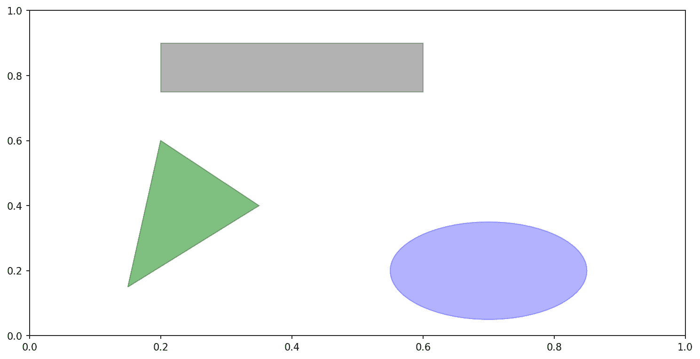

# 九、绘图和可视化

> 原文：[`wesmckinney.com/book/plotting-and-visualization`](https://wesmckinney.com/book/plotting-and-visualization)
>
> 译者：[飞龙](https://github.com/wizardforcel)
>
> 协议：[CC BY-NC-SA 4.0](http://creativecommons.org/licenses/by-nc-sa/4.0/)


> 此开放访问网络版本的《Python 数据分析第三版》现已作为[印刷版和数字版](https://amzn.to/3DyLaJc)的伴侣提供。如果您发现任何勘误，请[在此处报告](https://oreilly.com/catalog/0636920519829/errata)。请注意，由 Quarto 生成的本站点的某些方面与 O'Reilly 的印刷版和电子书版本的格式不同。
> 
> 如果您发现本书的在线版本有用，请考虑[订购纸质版](https://amzn.to/3DyLaJc)或[无 DRM 的电子书](https://www.ebooks.com/en-us/book/210644288/python-for-data-analysis/wes-mckinney/?affId=WES398681F)以支持作者。本网站的内容不得复制或再生产。代码示例采用 MIT 许可，可在 GitHub 或 Gitee 上找到。

制作信息丰富的可视化（有时称为*图）是数据分析中最重要的任务之一。它可能是探索过程的一部分，例如，帮助识别异常值或所需的数据转换，或者作为生成模型想法的一种方式。对于其他人，构建用于网络的交互式可视化可能是最终目标。Python 有许多附加库用于制作静态或动态可视化，但我主要关注[matplotlib](https://matplotlib.org)和构建在其之上的库。

matplotlib 是一个桌面绘图包，旨在创建适合出版的图形和图表。该项目由 John Hunter 于 2002 年发起，旨在在 Python 中实现类似 MATLAB 的绘图界面。matplotlib 和 IPython 社区合作简化了从 IPython shell（现在是 Jupyter 笔记本）进行交互式绘图。matplotlib 支持所有操作系统上的各种 GUI 后端，并且可以将可视化导出为所有常见的矢量和光栅图形格式（PDF、SVG、JPG、PNG、BMP、GIF 等）。除了一些图表外，本书中几乎所有的图形都是使用 matplotlib 生成的。

随着时间的推移，matplotlib 衍生出了许多用于数据可视化的附加工具包，这些工具包使用 matplotlib 进行底层绘图。其中之一是[seaborn](http://seaborn.pydata.org)，我们将在本章后面探讨。

在本章中跟随代码示例的最简单方法是在 Jupyter 笔记本中输出图形。要设置这个，可以在 Jupyter 笔记本中执行以下语句：

```py
%matplotlib inline
```

注意

自 2012 年第一版以来，已经创建了许多新的数据可视化库，其中一些（如 Bokeh 和 Altair）利用现代网络技术创建交互式可视化，与 Jupyter 笔记本很好地集成。与在本书中使用多个可视化工具不同，我决定坚持使用 matplotlib 来教授基础知识，特别是因为 pandas 与 matplotlib 有很好的集成。您可以根据本章的原则学习如何使用其他可视化库。

## 9.1 简要的 matplotlib API 入门

使用 matplotlib 时，我们使用以下导入约定：

```py
In [13]: import matplotlib.pyplot as plt
```

在 Jupyter 中运行`%matplotlib notebook`（或在 IPython 中运行`%matplotlib`），我们可以尝试创建一个简单的图。如果一切设置正确，应该会出现一个类似 Simple line plot 的线图：

```py
In [14]: data = np.arange(10)

In [15]: data
Out[15]: array([0, 1, 2, 3, 4, 5, 6, 7, 8, 9])

In [16]: plt.plot(data)
```


图 9.1：简单线图

虽然像 seaborn 和 pandas 内置绘图函数将处理许多制作图形的琐碎细节，但如果您希望自定义超出提供的函数选项之外的内容，您需要了解一些关于 matplotlib API 的知识。

注意

本书中没有足够的空间来全面介绍 matplotlib 的功能广度和深度。它应该足以教会您如何上手。matplotlib 图库和文档是学习高级功能的最佳资源。

### 图和子图

matplotlib 中的绘图位于 `Figure` 对象中。您可以使用 `plt.figure` 创建一个新的图：

```py
In [17]: fig = plt.figure()
```

在 IPython 中，如果您首先运行 `%matplotlib` 来设置 matplotlib 集成，将会出现一个空白绘图窗口，但在 Jupyter 中，直到我们使用更多命令之前，什么都不会显示。

`plt.figure` 有许多选项；特别是，如果保存到磁盘，`figsize` 将保证图的特定大小和纵横比。

您不能在空白图中制作绘图。您必须使用 `add_subplot` 创建一个或多个 `subplots`：

```py
In [18]: ax1 = fig.add_subplot(2, 2, 1)
```

这意味着图应该是 2 × 2（因此总共最多四个绘图），我们选择了四个子图中的第一个（从 1 编号）。如果您创建下两个子图，您将得到一个看起来像 一个空的 matplotlib 图，带有三个子图 的可视化：

```py
In [19]: ax2 = fig.add_subplot(2, 2, 2)

In [20]: ax3 = fig.add_subplot(2, 2, 3)
```


图 9.2：一个空的 matplotlib 图，带有三个子图

提示：

使用 Jupyter 笔记本的一个细微之处是，每次评估单元格后绘图都会重置，因此您必须将所有绘图命令放在一个单独的笔记本单元格中。

在这里，我们在同一个单元格中运行所有这些命令：

```py
fig = plt.figure()
ax1 = fig.add_subplot(2, 2, 1)
ax2 = fig.add_subplot(2, 2, 2)
ax3 = fig.add_subplot(2, 2, 3)
```

这些绘图轴对象有各种方法，可以创建不同类型的绘图，最好使用轴方法而不是像 `plt.plot` 这样的顶级绘图函数。例如，我们可以使用 `plot` 方法制作一条线图（参见单个绘图后的数据可视化）：

```py
In [21]: ax3.plot(np.random.standard_normal(50).cumsum(), color="black",
 ....:          linestyle="dashed")
```


图 9.3：单个绘图后的数据可视化

当您运行此命令时，您可能会注意到类似 `<matplotlib.lines.Line2D at ...>` 的输出。matplotlib 返回引用刚刚添加的绘图子组件的对象。大多数情况下，您可以安全地忽略此输出，或者您可以在行末加上分号以抑制输出。

附加选项指示 matplotlib 绘制一条黑色虚线。这里由 `fig.add_subplot` 返回的对象是 `AxesSubplot` 对象，您可以通过调用每个实例方法直接在其他空子图上绘制（参见添加额外绘图后的数据可视化）：

```py
In [22]: ax1.hist(np.random.standard_normal(100), bins=20, color="black", alpha=0
.3);
In [23]: ax2.scatter(np.arange(30), np.arange(30) + 3 * np.random.standard_normal
(30));
```


图 9.4：添加额外绘图后的数据可视化

`alpha=0.3` 样式选项设置了叠加绘图的透明度。

您可以在 [matplotlib 文档](https://matplotlib.org) 中找到绘图类型的全面目录。

为了更方便地创建子图网格，matplotlib 包括一个 `plt.subplots` 方法，它创建一个新图并返回一个包含创建的子图对象的 NumPy 数组：

```py
In [25]: fig, axes = plt.subplots(2, 3)

In [26]: axes
Out[26]: 
array([[<Axes: >, <Axes: >, <Axes: >],
 [<Axes: >, <Axes: >, <Axes: >]], dtype=object)
```

然后，`axes` 数组可以像二维数组一样索引；例如，`axes[0, 1]` 指的是顶部行中心的子图。您还可以使用 `sharex` 和 `sharey` 指示子图应具有相同的 x 或 y 轴。当您在相同比例上比较数据时，这可能很有用；否则，matplotlib 会独立自动缩放绘图限制。有关此方法的更多信息，请参见 表 9.1。

表 9.1：`matplotlib.pyplot.subplots` 选项

| 参数 | 描述 |
| --- | --- |
| `nrows` | 子图的行数 |
| `ncols` | 子图的列数 |
| `sharex` | 所有子图应使用相同的 x 轴刻度（调整 `xlim` 将影响所有子图） |
| `sharey` | 所有子图应使用相同的 y 轴刻度（调整 `ylim` 将影响所有子图） |
| `subplot_kw` | 传递给 `add_subplot` 调用的关键字字典，用于创建每个子图 |
| `**fig_kw` | 创建图时使用`subplots`的附加关键字，例如`plt.subplots(2, 2, figsize=(8, 6))` |

#### 调整子图周围的间距

默认情况下，matplotlib 在子图周围留有一定量的填充和子图之间的间距。这些间距都是相对于绘图的高度和宽度指定的，因此如果您通过编程或使用 GUI 窗口手动调整绘图大小，绘图将动态调整自身。您可以使用`Figure`对象上的`subplots_adjust`方法更改间距：

```py
subplots_adjust(left=None, bottom=None, right=None, top=None,
                wspace=None, hspace=None)
```

`wspace`和`hspace`控制子图之间使用的百分比图宽度和图高度的间距。这里是一个您可以在 Jupyter 中执行的小例子，我将间距缩小到零（参见没有子图间距的数据可视化）：

```py
fig, axes = plt.subplots(2, 2, sharex=True, sharey=True)
for i in range(2):
 for j in range(2):
 axes[i, j].hist(np.random.standard_normal(500), bins=50,
 color="black", alpha=0.5)
fig.subplots_adjust(wspace=0, hspace=0)
```


图 9.5：没有子图间距的数据可视化

您可能会注意到轴标签重叠。matplotlib 不会检查标签是否重叠，因此在这种情况下，您需要通过指定显式刻度位置和刻度标签自行修复标签（我们将在后面的部分刻度、标签和图例中看到如何做到这一点）。

### 颜色、标记和线型

matplotlib 的线`plot`函数接受 x 和 y 坐标数组以及可选的颜色样式选项。例如，要用绿色虚线绘制`x`与`y`，您可以执行：

```py
ax.plot(x, y, linestyle="--", color="green")
```

提供了许多常用颜色的颜色名称，但您可以通过指定其十六进制代码（例如，`"#CECECE"`）来使用光谱上的任何颜色。您可以查看`plt.plot`的文档字符串以查看一些支持的线型。在线文档中提供了更全面的参考资料。

线图还可以具有*标记*来突出实际数据点。由于 matplotlib 的`plot`函数创建连续线图，插值点之间的插值，有时可能不清楚点位于何处。标记可以作为附加样式选项提供（参见带有标记的线图）：

```py
In [31]: ax = fig.add_subplot()

In [32]: ax.plot(np.random.standard_normal(30).cumsum(), color="black",
 ....:         linestyle="dashed", marker="o");
```


图 9.6：带有标记的线图

对于线图，您会注意到默认情况下后续点是线性插值的。这可以通过`drawstyle`选项进行更改（参见带有不同 drawstyle 选项的线图）：

```py
In [34]: fig = plt.figure()

In [35]: ax = fig.add_subplot()

In [36]: data = np.random.standard_normal(30).cumsum()

In [37]: ax.plot(data, color="black", linestyle="dashed", label="Default");
In [38]: ax.plot(data, color="black", linestyle="dashed",
 ....:         drawstyle="steps-post", label="steps-post");
In [39]: ax.legend()
```


图 9.7：带有不同 drawstyle 选项的线图

在这里，由于我们将`label`参数传递给`plot`，我们能够使用`ax.legend`创建一个图例，以标识每条线。我在刻度、标签和图例中更多地讨论图例。

注意

无论您在绘制数据时是否传递了`label`选项，都必须调用`ax.legend`来创建图例。

### 刻度、标签和图例

大多数类型的绘图装饰都可以通过 matplotlib 轴对象上的方法访问。这包括`xlim`、`xticks`和`xticklabels`等方法。它们分别控制绘图范围、刻度位置和刻度标签。它们可以以两种方式使用：

+   不带参数调用返回当前参数值（例如，`ax.xlim()`返回当前 x 轴绘图范围）

+   带参数调用设置参数值（例如，`ax.xlim([0, 10])`将 x 轴范围设置为 0 到 10）

所有这些方法都作用于活动或最近创建的`AxesSubplot`。每个对应于 subplot 对象本身的两种方法；在`xlim`的情况下，这些方法是`ax.get_xlim`和`ax.set_xlim`。

#### 设置标题、轴标签、刻度和刻度标签

为了说明如何自定义坐标轴，我将创建一个简单的图和一个随机漫步的绘图（参见用于说明 xticks 的简单绘图（带有默认标签））：

```py
In [40]: fig, ax = plt.subplots()

In [41]: ax.plot(np.random.standard_normal(1000).cumsum());
```


图 9.8：用于说明 xticks 的简单图表（带有默认标签）

要更改 x 轴刻度，最简单的方法是使用`set_xticks`和`set_xticklabels`。前者指示 matplotlib 在数据范围内放置刻度的位置；默认情况下，这些位置也将是标签。但是我们可以使用`set_xticklabels`设置任何其他值作为标签：

```py
In [42]: ticks = ax.set_xticks([0, 250, 500, 750, 1000])

In [43]: labels = ax.set_xticklabels(["one", "two", "three", "four", "five"],
 ....:                             rotation=30, fontsize=8)
```

`rotation`选项将 x 轴刻度标签设置为 30 度旋转。最后，`set_xlabel`为 x 轴命名，`set_title`为子图标题（请参见用于说明自定义 xticks 的简单图表以查看生成的图）：

```py
In [44]: ax.set_xlabel("Stages")
Out[44]: Text(0.5, 6.666666666666652, 'Stages')

In [45]: ax.set_title("My first matplotlib plot")
```


图 9.9：用于说明自定义 xticks 的简单图表

修改 y 轴的过程与此示例中的`x`替换为`y`相同。axes 类有一个`set`方法，允许批量设置绘图属性。从前面的示例中，我们也可以这样写：

```py
ax.set(title="My first matplotlib plot", xlabel="Stages")
```

#### 添加图例

图例是识别图表元素的另一个关键元素。有几种方法可以添加图例。最简单的方法是在添加每个图表元素时传递`label`参数：

```py
In [46]: fig, ax = plt.subplots()

In [47]: ax.plot(np.random.randn(1000).cumsum(), color="black", label="one");
In [48]: ax.plot(np.random.randn(1000).cumsum(), color="black", linestyle="dashed
",
 ....:         label="two");
In [49]: ax.plot(np.random.randn(1000).cumsum(), color="black", linestyle="dotted
",
 ....:         label="three");
```

一旦您完成了这一步，您可以调用`ax.legend()`来自动创建图例。生成的图表在带有三条线和图例的简单图表中：

```py
In [50]: ax.legend()
```


图 9.10：带有三条线和图例的简单图表

`legend`方法有几个其他选项可用于位置`loc`参数。有关更多信息，请参阅文档字符串（使用`ax.legend?`）。

`loc`图例选项告诉 matplotlib 在哪里放置图例。默认值是`"best"`，它会尝试选择一个最不起眼的位置。要从图例中排除一个或多个元素，请不传递标签或传递`label="_nolegend_"`。

### 注释和在子图上绘制

除了标准的绘图类型，您可能希望绘制自己的绘图注释，这可能包括文本、箭头或其他形状。您可以使用`text`、`arrow`和`annotate`函数添加注释和文本。`text`在给定坐标`(x, y)`处绘制文本，可选的自定义样式：

```py
ax.text(x, y, "Hello world!",
 family="monospace", fontsize=10)
```

注释可以绘制文本和箭头，并适当排列。例如，让我们绘制自 2007 年以来的标准普尔 500 指数收盘价（从 Yahoo! Finance 获取），并用 2008-2009 年金融危机的一些重要日期进行注释。您可以在 Jupyter 笔记本中的单个单元格中运行此代码示例。查看 2008-2009 年金融危机中的重要日期以查看结果：

```py
from datetime import datetime

fig, ax = plt.subplots()

data = pd.read_csv("examples/spx.csv", index_col=0, parse_dates=True)
spx = data["SPX"]

spx.plot(ax=ax, color="black")

crisis_data = [
 (datetime(2007, 10, 11), "Peak of bull market"),
 (datetime(2008, 3, 12), "Bear Stearns Fails"),
 (datetime(2008, 9, 15), "Lehman Bankruptcy")
]

for date, label in crisis_data:
 ax.annotate(label, xy=(date, spx.asof(date) + 75),
 xytext=(date, spx.asof(date) + 225),
 arrowprops=dict(facecolor="black", headwidth=4, width=2,
 headlength=4),
 horizontalalignment="left", verticalalignment="top")

# Zoom in on 2007-2010
ax.set_xlim(["1/1/2007", "1/1/2011"])
ax.set_ylim([600, 1800])

ax.set_title("Important dates in the 2008–2009 financial crisis")
```


图 9.11：2008-2009 年金融危机中的重要日期

在这个图表中有几个重要的要点需要强调。`ax.annotate`方法可以在指定的 x 和 y 坐标处绘制标签。我们使用`set_xlim`和`set_ylim`方法手动设置绘图的起始和结束边界，而不是使用 matplotlib 的默认值。最后，`ax.set_title`为绘图添加了一个主标题。

请查看在线 matplotlib 画廊，了解更多注释示例以供学习。

绘制形状需要更多的注意。matplotlib 有代表许多常见形状的对象，称为*patches*。其中一些，如`Rectangle`和`Circle`，可以在`matplotlib.pyplot`中找到，但完整的集合位于`matplotlib.patches`中。

要向图表添加形状，您需要创建补丁对象，并通过将补丁传递给`ax.add_patch`将其添加到子图`ax`中（请参见由三个不同补丁组成的数据可视化）：

```py
fig, ax = plt.subplots()

rect = plt.Rectangle((0.2, 0.75), 0.4, 0.15, color="black", alpha=0.3)
circ = plt.Circle((0.7, 0.2), 0.15, color="blue", alpha=0.3)
pgon = plt.Polygon([[0.15, 0.15], [0.35, 0.4], [0.2, 0.6]],
 color="green", alpha=0.5)

ax.add_patch(rect)
ax.add_patch(circ)
ax.add_patch(pgon)
```



图 9.12：由三个不同补丁组成的数据可视化

如果您查看许多熟悉的绘图类型的实现，您会发现它们是由补丁组装而成的。

### 保存图表到文件

您可以使用图形对象的`savefig`实例方法将活动图形保存到文件。例如，要保存图形的 SVG 版本，您只需输入：

```py
fig.savefig("figpath.svg")
```

文件类型是从文件扩展名中推断的。因此，如果您使用`.pdf`，您将得到一个 PDF。我经常用于发布图形的一个重要选项是`dpi`，它控制每英寸的分辨率。要获得相同的图形作为 400 DPI 的 PNG，您可以执行：

```py
fig.savefig("figpath.png", dpi=400)
```

有关`savefig`的一些其他选项，请参见表 9.2。要获取全面的列表，请参考 IPython 或 Jupyter 中的文档字符串。

表 9.2：一些`fig.savefig`选项

| 参数 | 描述 |
| --- | --- |
| `fname` | 包含文件路径或 Python 文件对象的字符串。图形格式从文件扩展名中推断（例如，`.pdf`表示 PDF，`.png`表示 PNG）。 |
| `dpi` | 每英寸点数的图形分辨率；在 IPython 中默认为 100，在 Jupyter 中默认为 72，但可以进行配置。 |
| `facecolor, edgecolor` | 子图外部的图形背景颜色；默认为`"w"`（白色）。 |
| `format` | 要使用的显式文件格式（`"png"`、`"pdf"`、`"svg"`、`"ps"`、`"eps"`等）。 |

### matplotlib 配置

matplotlib 预先配置了色彩方案和默认设置，主要用于准备出版图。幸运的是，几乎所有默认行为都可以通过全局参数进行自定义，这些参数控制图形大小、子图间距、颜色、字体大小、网格样式等。从 Python 编程方式修改配置的一种方法是使用`rc`方法；例如，要将全局默认图形大小设置为 10×10，可以输入：

```py
plt.rc("figure", figsize=(10, 10))
```

所有当前的配置设置都可以在`plt.rcParams`字典中找到，并且可以通过调用`plt.rcdefaults()`函数将其恢复为默认值。

`rc`的第一个参数是您希望自定义的组件，例如`"figure"`、`"axes"`、`"xtick"`、`"ytick"`、`"grid"`、`"legend"`或其他许多选项。之后可以跟随一系列关键字参数，指示新的参数。在程序中写下选项的便捷方式是作为一个字典：

```py
plt.rc("font", family="monospace", weight="bold", size=8)
```

要进行更广泛的自定义并查看所有选项列表，matplotlib 附带了一个配置文件*matplotlibrc*，位于*matplotlib/mpl-data*目录中。如果您自定义此文件并将其放在名为*.matplotlibrc*的主目录中，每次使用 matplotlib 时都会加载它。

正如我们将在下一节中看到的，seaborn 包具有几个内置的绘图主题或*样式*，这些主题或样式在内部使用 matplotlib 的配置系统。

## 9.2 使用 pandas 和 seaborn 绘图

matplotlib 可以是一个相当低级的工具。您可以从其基本组件中组装图表：数据显示（即绘图类型：线条、柱状图、箱线图、散点图、等高线图等）、图例、标题、刻度标签和其他注释。

在 pandas 中，我们可能有多列数据，以及行和列标签。pandas 本身具有内置方法，简化了从 DataFrame 和 Series 对象创建可视化的过程。另一个库是[`seaborn`](https://seaborn.pydata.org)，这是一个建立在 matplotlib 之上的高级统计图形库。seaborn 简化了创建许多常见可视化类型的过程。

### 线图

Series 和 DataFrame 具有`plot`属性，用于创建一些基本的绘图类型。默认情况下，`plot()`生成线图（参见简单 Series 绘图）：

```py
In [61]: s = pd.Series(np.random.standard_normal(10).cumsum(), index=np.arange(0,
 100, 10))

In [62]: s.plot()
```


图 9.13：简单 Series 绘图

Series 对象的索引被传递给 matplotlib 以在 x 轴上绘制，尽管您可以通过传递 `use_index=False` 来禁用此功能。x 轴刻度和限制可以通过 `xticks` 和 `xlim` 选项进行调整，y 轴分别通过 `yticks` 和 `ylim` 进行调整。请参见 表 9.3 以获取 `plot` 选项的部分列表。我将在本节中评论其中一些，并留下其余的供您探索。

表 9.3：`Series.plot` 方法参数

| 参数 | 描述 |
| --- | --- |
| `label` | 图例标签 |
| `ax` | 要绘制的 matplotlib 子图对象；如果未传递任何内容，则使用活动的 matplotlib 子图 |
| `style` | 样式字符串，如 `"ko--"`，传递给 matplotlib |
| `alpha` | 图形填充不透明度（从 0 到 1） |
| `kind` | 可以是 `"area"`, `"bar"`, `"barh"`, `"density"`, `"hist"`, `"kde"`, `"line"`, 或 `"pie"`；默认为 `"line"` |
| `figsize` | 要创建的图形对象的大小 |
| `logx` | 在 x 轴上进行对数缩放，传递 `True`；传递 `"sym"` 以进行允许负值的对称对数缩放 |
| `logy` | 在 y 轴上进行对数缩放，传递 `True`；传递 `"sym"` 以进行允许负值的对称对数缩放 |
| `title` | 用于图的标题 |
| `use_index` | 使用对象索引作为刻度标签 |
| `rot` | 刻度标签的旋转（0 到 360） |
| `xticks` | 用于 x 轴刻度的值 |
| `yticks` | 用于 y 轴刻度的值 |
| `xlim` | x 轴限制（例如，`[0, 10]`） |
| `ylim` | y 轴限制 |
| `grid` | 显示坐标轴网格（默认关闭） |

大多数 pandas 的绘图方法都接受一个可选的 `ax` 参数，可以是一个 matplotlib 子图对象。这样可以在网格布局中更灵活地放置子图。 

DataFrame 的 `plot` 方法将其每列作为不同的线绘制在同一个子图上，自动创建图例（请参见 简单的 DataFrame 绘图）：

```py
In [63]: df = pd.DataFrame(np.random.standard_normal((10, 4)).cumsum(0),
 ....:                   columns=["A", "B", "C", "D"],
 ....:                   index=np.arange(0, 100, 10))

In [64]: plt.style.use('grayscale')

In [65]: df.plot()
```


图 9.14：简单的 DataFrame 绘图

注意

这里我使用了 `plt.style.use('grayscale')` 来切换到更适合黑白出版的颜色方案，因为一些读者可能无法看到完整的彩色图。

`plot` 属性包含不同绘图类型的方法“家族”。例如，`df.plot()` 等同于 `df.plot.line()`。我们将在接下来探索其中一些方法。

注意

`plot` 的其他关键字参数会传递给相应的 matplotlib 绘图函数，因此您可以通过学习更多关于 matplotlib API 的知识来进一步自定义这些图。

DataFrame 有许多选项，允许对列的处理方式进行一定的灵活性，例如，是否将它们全部绘制在同一个子图上，还是创建单独的子图。更多信息请参见 表 9.4。

表 9.4：DataFrame 特定的绘图参数

| 参数 | 描述 |
| --- | --- |
| `subplots` | 在单独的子图中绘制每个 DataFrame 列 |
| `layouts` | 2 元组（行数，列数），提供子图的布局 |
| `sharex` | 如果 `subplots=True`，共享相同的 x 轴，链接刻度和限制 |
| `sharey` | 如果 `subplots=True`，共享相同的 y 轴 |
| `legend` | 添加子图图例（默认为 `True`） |
| `sort_columns` | 按字母顺序绘制列；默认使用现有列顺序 |

注意

有关时间序列绘图，请参见 第十一章：时间序列。

### 条形图

`plot.bar()` 和 `plot.barh()` 分别绘制垂直和水平条形图。在这种情况下，Series 或 DataFrame 的索引将用作 x（`bar`）或 y（`barh`）刻度（请参见 水平和垂直条形图）：

```py
In [66]: fig, axes = plt.subplots(2, 1)

In [67]: data = pd.Series(np.random.uniform(size=16), index=list("abcdefghijklmno
p"))

In [68]: data.plot.bar(ax=axes[0], color="black", alpha=0.7)
Out[68]: <Axes: >

In [69]: data.plot.barh(ax=axes[1], color="black", alpha=0.7)
```


图 9.15：水平和垂直条形图

使用 DataFrame，条形图将每行中的值分组在条形图中，侧边显示，每个值一个条形图。请参见 DataFrame 条形图：

```py
In [71]: df = pd.DataFrame(np.random.uniform(size=(6, 4)),
 ....:                   index=["one", "two", "three", "four", "five", "six"],
 ....:                   columns=pd.Index(["A", "B", "C", "D"], name="Genus"))

In [72]: df
Out[72]: 
Genus         A         B         C         D
one    0.370670  0.602792  0.229159  0.486744
two    0.420082  0.571653  0.049024  0.880592
three  0.814568  0.277160  0.880316  0.431326
four   0.374020  0.899420  0.460304  0.100843
five   0.433270  0.125107  0.494675  0.961825
six    0.601648  0.478576  0.205690  0.560547

In [73]: df.plot.bar()
```


图 9.16：DataFrame 条形图

请注意，DataFrame 列上的“种属”名称用于标题图例。

我们通过传递`stacked=True`从 DataFrame 创建堆叠条形图，导致每行中的值水平堆叠在一起（参见 DataFrame 堆叠条形图）：

```py
In [75]: df.plot.barh(stacked=True, alpha=0.5)
```


图 9.17：DataFrame 堆叠条形图

注意

一个有用的条形图的制作方法是使用`value_counts`来可视化 Series 的值频率：`s.value_counts().plot.bar()`。

让我们看一个关于餐厅小费的示例数据集。假设我们想要制作一个堆叠条形图，显示每天每个派对规模的数据点的百分比。我使用`read_csv`加载数据，并通过日期和派对规模进行交叉制表。`pandas.crosstab`函数是从两个 DataFrame 列计算简单频率表的便捷方法：

```py
In [77]: tips = pd.read_csv("examples/tips.csv")

In [78]: tips.head()
Out[78]: 
 total_bill   tip smoker  day    time  size
0       16.99  1.01     No  Sun  Dinner     2
1       10.34  1.66     No  Sun  Dinner     3
2       21.01  3.50     No  Sun  Dinner     3
3       23.68  3.31     No  Sun  Dinner     2
4       24.59  3.61     No  Sun  Dinner     4

In [79]: party_counts = pd.crosstab(tips["day"], tips["size"])

In [80]: party_counts = party_counts.reindex(index=["Thur", "Fri", "Sat", "Sun"])

In [81]: party_counts
Out[81]: 
size  1   2   3   4  5  6
day 
Thur  1  48   4   5  1  3
Fri   1  16   1   1  0  0
Sat   2  53  18  13  1  0
Sun   0  39  15  18  3  1
```

由于没有很多一人和六人的派对，我在这里删除它们：

```py
In [82]: party_counts = party_counts.loc[:, 2:5]
```

然后，对每一行进行归一化，使总和为 1，并绘制图表（参见每天各尺寸派对的比例）：

```py
# Normalize to sum to 1
In [83]: party_pcts = party_counts.div(party_counts.sum(axis="columns"),
 ....:                               axis="index")

In [84]: party_pcts
Out[84]: 
size         2         3         4         5
day 
Thur  0.827586  0.068966  0.086207  0.017241
Fri   0.888889  0.055556  0.055556  0.000000
Sat   0.623529  0.211765  0.152941  0.011765
Sun   0.520000  0.200000  0.240000  0.040000

In [85]: party_pcts.plot.bar(stacked=True)
```


图 9.18：每天各尺寸派对的比例

因此，您可以看到在这个数据集中，派对规模似乎在周末增加。

对于需要在制作图表之前进行聚合或总结的数据，使用`seaborn`包可以使事情变得更简单（使用`conda install seaborn`进行安装）。现在让我们用 seaborn 查看小费百分比按天的情况（查看带误差条的每日小费百分比以查看结果图）：

```py
In [87]: import seaborn as sns

In [88]: tips["tip_pct"] = tips["tip"] / (tips["total_bill"] - tips["tip"])

In [89]: tips.head()
Out[89]: 
 total_bill   tip smoker  day    time  size   tip_pct
0       16.99  1.01     No  Sun  Dinner     2  0.063204
1       10.34  1.66     No  Sun  Dinner     3  0.191244
2       21.01  3.50     No  Sun  Dinner     3  0.199886
3       23.68  3.31     No  Sun  Dinner     2  0.162494
4       24.59  3.61     No  Sun  Dinner     4  0.172069

In [90]: sns.barplot(x="tip_pct", y="day", data=tips, orient="h")
```


图 9.19：每日小费百分比带误差条

seaborn 中的绘图函数接受一个`data`参数，它可以是一个 pandas DataFrame。其他参数是指列名。因为在`day`的每个值中有多个观察值，所以条形图是`tip_pct`的平均值。在条形图上画的黑线代表 95%的置信区间（可以通过可选参数进行配置）。

`seaborn.barplot`有一个`hue`选项，可以使我们按照额外的分类值进行拆分（参见每日和时间的小费百分比）：

```py
In [92]: sns.barplot(x="tip_pct", y="day", hue="time", data=tips, orient="h")
```


图 9.20：每日和时间的小费百分比

请注意，seaborn 自动更改了图表的美学特征：默认颜色调色板、图表背景和网格线颜色。您可以使用`seaborn.set_style`在不同的图表外观之间切换：

```py
In [94]: sns.set_style("whitegrid")
```

在为黑白打印媒介制作图表时，您可能会发现设置灰度调色板很有用，如下所示：

```py
sns.set_palette("Greys_r")
```

### 直方图和密度图

*直方图*是一种显示值频率的离散化条形图。数据点被分成离散的、均匀间隔的箱子，并绘制每个箱子中的数据点数。使用之前的小费数据，我们可以使用 Series 的`plot.hist`方法制作总账单的小费百分比的直方图（参见小费百分比的直方图）：

```py
In [96]: tips["tip_pct"].plot.hist(bins=50)
```


图 9.21：小费百分比的直方图

一个相关的图表类型是*密度图*，它是通过计算可能生成观察数据的连续概率分布的估计而形成的。通常的做法是将这个分布近似为“核”混合——即，像正态分布这样的简单分布。因此，密度图也被称为核密度估计（KDE）图。使用`plot.density`可以使用传统的正态混合估计制作密度图（参见小费百分比的密度图）：

```py
In [98]: tips["tip_pct"].plot.density()
```


图 9.22：小费百分比的密度图

这种情节需要 SciPy，所以如果您还没有安装它，可以暂停一下然后安装：

```py
conda install scipy
```

通过其`histplot`方法，seaborn 使直方图和密度图更加容易，可以同时绘制直方图和连续密度估计。例如，考虑一个由两个不同标准正态分布的抽样组成的双峰分布（请参见 Normalized histogram of normal mixture）：

```py
In [100]: comp1 = np.random.standard_normal(200)

In [101]: comp2 = 10 + 2 * np.random.standard_normal(200)

In [102]: values = pd.Series(np.concatenate([comp1, comp2]))

In [103]: sns.histplot(values, bins=100, color="black")
```


图 9.23：正态混合的归一化直方图

### 散点图或点图

点图或散点图可以是检查两个一维数据系列之间关系的有用方法。例如，这里我们从 statsmodels 项目加载`macrodata`数据集，选择几个变量，然后计算对数差异：

```py
In [104]: macro = pd.read_csv("examples/macrodata.csv")

In [105]: data = macro[["cpi", "m1", "tbilrate", "unemp"]]

In [106]: trans_data = np.log(data).diff().dropna()

In [107]: trans_data.tail()
Out[107]: 
 cpi        m1  tbilrate     unemp
198 -0.007904  0.045361 -0.396881  0.105361
199 -0.021979  0.066753 -2.277267  0.139762
200  0.002340  0.010286  0.606136  0.160343
201  0.008419  0.037461 -0.200671  0.127339
202  0.008894  0.012202 -0.405465  0.042560
```

然后我们可以使用 seaborn 的`regplot`方法，它可以制作散点图并拟合线性回归线（参见 A seaborn regression/scatter plot）：

```py
In [109]: ax = sns.regplot(x="m1", y="unemp", data=trans_data)

In [110]: ax.set_title("Changes in log(m1) versus log(unemp)")
```


图 9.24：一个 seaborn 回归/散点图

在探索性数据分析中，查看一组变量之间的所有散点图是有帮助的；这被称为*pairs*图或*scatter plot matrix*。从头开始制作这样的图需要一些工作，因此 seaborn 有一个方便的`pairplot`函数，支持将每个变量的直方图或密度估计放在对角线上（请参见 Pair plot matrix of statsmodels macro data 以查看生成的图）：

```py
In [111]: sns.pairplot(trans_data, diag_kind="kde", plot_kws={"alpha": 0.2})
```


图 9.25：statsmodels 宏数据的 pairs 图矩阵

您可能会注意到`plot_kws`参数。这使我们能够将配置选项传递给对角线元素上的各个绘图调用。查看`seaborn.pairplot`文档字符串以获取更详细的配置选项。

### Facet Grids 和分类数据

那么对于具有额外分组维度的数据集呢？一种可视化具有许多分类变量的数据的方法是使用*facet grid*，这是一个二维布局的图，其中数据根据某个变量的不同值在每个轴上分割到各个图中。seaborn 有一个有用的内置函数`catplot`，简化了根据分类变量拆分的许多种 facet 图的制作（请参见 Tipping percentage by day/time/smoker 以查看生成的图）：

```py
In [112]: sns.catplot(x="day", y="tip_pct", hue="time", col="smoker",
 .....:             kind="bar", data=tips[tips.tip_pct < 1])
```


图 9.26：按天/时间/吸烟者的小费百分比

与在 facet 内通过不同的条形颜色对“时间”进行分组不同，我们还可以通过为每个`time`值添加一行来扩展 facet grid（请参见 Tipping percentage by day split by time/smoker）：

```py
In [113]: sns.catplot(x="day", y="tip_pct", row="time",
 .....:             col="smoker",
 .....:             kind="bar", data=tips[tips.tip_pct < 1])
```


图 9.27：按天分割的小费百分比按时间/吸烟者

`catplot`支持其他可能有用的绘图类型，具体取决于您要显示的内容。例如，*箱线图*（显示中位数、四分位数和异常值）可以是一种有效的可视化类型（请参见 Box plot of tipping percentage by day）：

```py
In [114]: sns.catplot(x="tip_pct", y="day", kind="box",
 .....:             data=tips[tips.tip_pct < 0.5])
```


图 9.28：按天的小费百分比箱线图

您可以使用更通用的`seaborn.FacetGrid`类创建自己的 facet grid 图。有关更多信息，请参阅[seaborn 文档](https://seaborn.pydata.org/)。

## 9.3 其他 Python 可视化工具

与开源软件一样，Python 中有许多用于创建图形的选项（太多了无法列出）。自 2010 年以来，许多开发工作都集中在为在网页上发布的交互式图形创建工具上。使用诸如[Altair](https://altair-viz.github.io)、[Bokeh](http://bokeh.pydata.org)和[Plotly](https://plotly.com/python)等工具，现在可以在 Python 中指定动态、交互式图形，用于与 Web 浏览器一起使用。

对于为印刷品或网络创建静态图形，我建议使用 matplotlib 以及构建在 matplotlib 基础上的库，如 pandas 和 seaborn，以满足您的需求。对于其他数据可视化需求，学习如何使用其他可用工具可能会有所帮助。我鼓励您探索这个生态系统，因为它将继续发展和创新。

数据可视化方面的一本优秀书籍是 Claus O. Wilke 的《数据可视化基础》（O'Reilly），可以在印刷版或 Claus 的网站[`clauswilke.com/dataviz`](https://clauswilke.com/dataviz)上找到。

## 9.4 结论

本章的目标是通过使用 pandas、matplotlib 和 seaborn 进行一些基本数据可视化，让您初步了解。如果在您的工作中视觉传达数据分析结果很重要，我鼓励您寻找资源，了解更多关于有效数据可视化的知识。这是一个活跃的研究领域，您可以通过在线和印刷的许多优秀学习资源进行实践。

在下一章中，我们将关注使用 pandas 进行数据聚合和分组操作。
