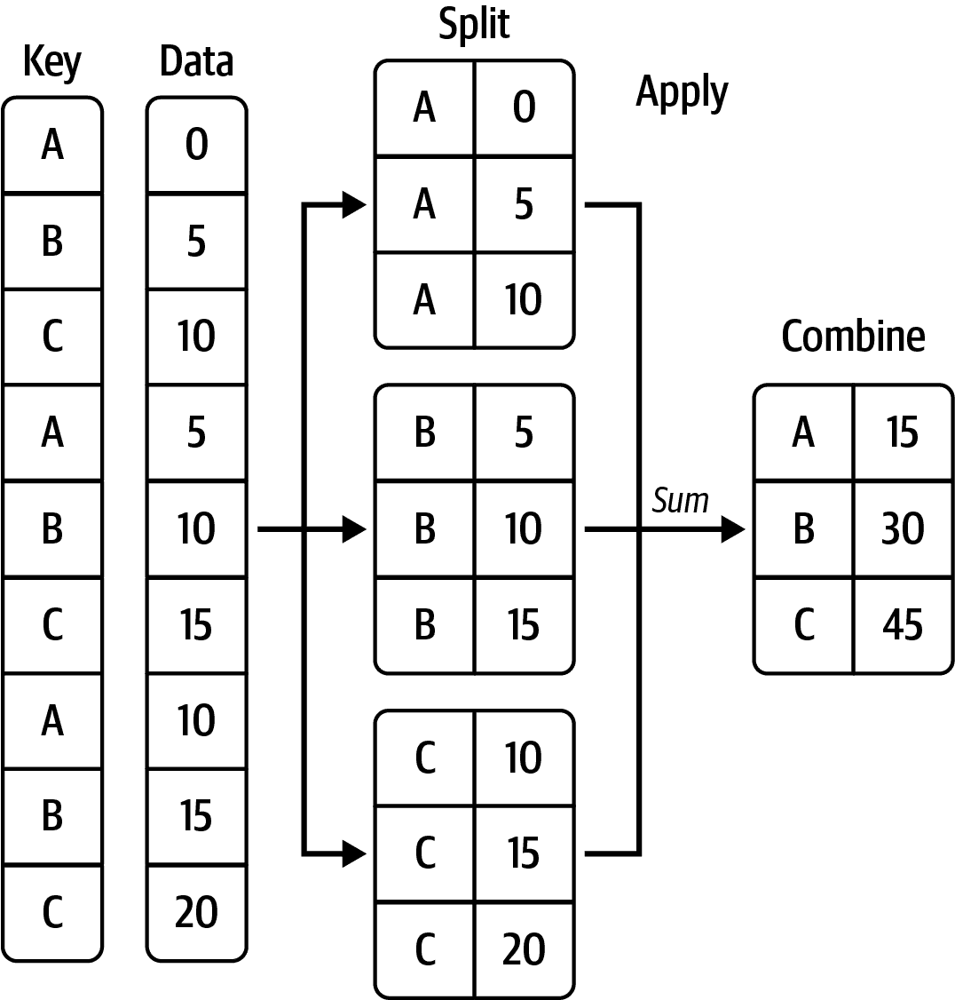

# 十、数据聚合和组操作

> 原文：[`wesmckinney.com/book/data-aggregation`](https://wesmckinney.com/book/data-aggregation)
>
> 译者：[飞龙](https://github.com/wizardforcel)
>
> 协议：[CC BY-NC-SA 4.0](http://creativecommons.org/licenses/by-nc-sa/4.0/)


> 此开放访问网络版本的《Python 数据分析第三版》现已作为[印刷版和数字版](https://amzn.to/3DyLaJc)的伴侣提供。如果您发现任何勘误，请[在此处报告](https://oreilly.com/catalog/0636920519829/errata)。请注意，由 Quarto 生成的本站点的某些方面与 O'Reilly 的印刷版和电子书版本的格式不同。
> 
> 如果您发现本书的在线版本有用，请考虑[订购纸质版](https://amzn.to/3DyLaJc)或[无 DRM 的电子书](https://www.ebooks.com/en-us/book/210644288/python-for-data-analysis/wes-mckinney/?affId=WES398681F)以支持作者。本网站的内容不得复制或再生产。代码示例采用 MIT 许可，可在 GitHub 或 Gitee 上找到。

对数据集进行分类并对每个组应用函数，无论是聚合还是转换，都可能是数据分析工作流程的关键组成部分。加载、合并和准备数据集后，您可能需要计算组统计信息或可能需要为报告或可视化目的计算*数据透视表*。pandas 提供了一个多功能的`groupby`接口，使您能够以自然的方式切片、切块和总结数据集。

关系数据库和 SQL（结构化查询语言）的流行原因之一是数据可以很容易地进行连接、过滤、转换和聚合。然而，像 SQL 这样的查询语言对可以执行的组操作类型施加了一定的限制。正如您将看到的，借助 Python 和 pandas 的表达力，我们可以通过将它们表达为自定义 Python 函数来执行相当复杂的组操作，这些函数操作与每个组相关联的数据。在本章中，您将学习如何：

+   使用一个或多个键（以函数、数组或 DataFrame 列名的形式）将 pandas 对象分成片段

+   计算组摘要统计信息，如计数、均值或标准差，或用户定义的函数

+   应用组内转换或其他操作，如归一化、线性回归、排名或子集选择

+   计算数据透视表和交叉制表

+   执行分位数分析和其他统计组分析

注意

对时间序列数据进行基于时间的聚合，是`groupby`的一个特殊用例，在本书中被称为*重新采样*，将在第十一章：时间序列中单独处理。*与其他章节一样，我们首先导入 NumPy 和 pandas：

```py
In [12]: import numpy as np

In [13]: import pandas as pd
```

## 10.1 如何思考组操作

Hadley Wickham，R 编程语言许多流行包的作者，为描述组操作创造了术语*split-apply-combine*。在过程的第一阶段中，包含在 pandas 对象中的数据，无论是 Series、DataFrame 还是其他形式，都根据您提供的一个或多个*键*被*分割*成组。分割是在对象的特定轴上执行的。例如，DataFrame 可以根据其行（`axis="index"`）或列（`axis="columns"`）进行分组。完成此操作后，将*应用*一个函数到每个组，生成一个新值。最后，所有这些函数应用的结果将*合并*成一个结果对象。结果对象的形式通常取决于对数据的操作。请参见图 10.1 以查看简单组聚合的模拟。

每个分组键可以采用多种形式，键不必是相同类型的：

+   一个与被分组的轴长度相同的值列表或数组

+   DataFrame 中表示列名的值

+   一个字典或 Series，给出了被分组的轴上的值与组名之间的对应关系

+   要在轴索引或索引中的个别标签上调用的函数



图 10.1：组聚合的示例

请注意，后三种方法是用于生成用于拆分对象的值数组的快捷方式。如果这一切看起来很抽象，不要担心。在本章中，我将给出所有这些方法的许多示例。为了开始，这里是一个作为 DataFrame 的小表格数据集：

```py
In [14]: df = pd.DataFrame({"key1" : ["a", "a", None, "b", "b", "a", None],
 ....:                    "key2" : pd.Series([1, 2, 1, 2, 1, None, 1],
 ....:                                       dtype="Int64"),
 ....:                    "data1" : np.random.standard_normal(7),
 ....:                    "data2" : np.random.standard_normal(7)})

In [15]: df
Out[15]: 
 key1  key2     data1     data2
0     a     1 -0.204708  0.281746
1     a     2  0.478943  0.769023
2  None     1 -0.519439  1.246435
3     b     2 -0.555730  1.007189
4     b     1  1.965781 -1.296221
5     a  <NA>  1.393406  0.274992
6  None     1  0.092908  0.228913
```

假设你想使用 `key1` 标签计算 `data1` 列的均值。有多种方法可以做到这一点。一种方法是访问 `data1` 并使用 `key1` 列（一个 Series）调用 `groupby`：

```py
In [16]: grouped = df["data1"].groupby(df["key1"])

In [17]: grouped
Out[17]: <pandas.core.groupby.generic.SeriesGroupBy object at 0x17b7913f0>
```

这个 `grouped` 变量现在是一个特殊的 *"GroupBy"* 对象。除了一些关于组键 `df["key1"]` 的中间数据之外，它实际上还没有计算任何东西。这个对象的想法是它包含了对每个组应用某些操作所需的所有信息。例如，要计算组均值，我们可以调用 GroupBy 的 `mean` 方法：

```py
In [18]: grouped.mean()
Out[18]: 
key1
a    0.555881
b    0.705025
Name: data1, dtype: float64
```

稍后在 数据聚合 中，我将更详细地解释当你调用 `.mean()` 时会发生什么。这里重要的是，数据（一个 Series）已经通过在组键上拆分数据进行聚合，产生了一个新的 Series，现在由 `key1` 列中的唯一值进行索引。结果索引的名称是 `"key1"`，因为 DataFrame 列 `df["key1"]` 是这样的。

如果我们传递了多个数组作为列表，将会得到不同的结果：

```py
In [19]: means = df["data1"].groupby([df["key1"], df["key2"]]).mean()

In [20]: means
Out[20]: 
key1  key2
a     1      -0.204708
 2       0.478943
b     1       1.965781
 2      -0.555730
Name: data1, dtype: float64
```

在这里，我们使用两个键对数据进行分组，结果 Series 现在具有由观察到的唯一键对组成的分层索引：

```py
In [21]: means.unstack()
Out[21]: 
key2         1         2
key1 
a    -0.204708  0.478943
b     1.965781 -0.555730
```

在这个例子中，组键都是 Series，尽管它们可以是任何正确长度的数组：

```py
In [22]: states = np.array(["OH", "CA", "CA", "OH", "OH", "CA", "OH"])

In [23]: years = [2005, 2005, 2006, 2005, 2006, 2005, 2006]

In [24]: df["data1"].groupby([states, years]).mean()
Out[24]: 
CA  2005    0.936175
 2006   -0.519439
OH  2005   -0.380219
 2006    1.029344
Name: data1, dtype: float64
```

通常，分组信息在与你要处理的数据相同的 DataFrame 中找到。在这种情况下，你可以将列名（无论是字符串、数字还是其他 Python 对象）作为组键传递：

```py
In [25]: df.groupby("key1").mean()
Out[25]: 
 key2     data1     data2
key1 
a      1.5  0.555881  0.441920
b      1.5  0.705025 -0.144516

In [26]: df.groupby("key2").mean(numeric_only=True)
Out[26]: 
 data1     data2
key2 
1     0.333636  0.115218
2    -0.038393  0.888106

In [27]: df.groupby(["key1", "key2"]).mean()
Out[27]: 
 data1     data2
key1 key2 
a    1    -0.204708  0.281746
 2     0.478943  0.769023
b    1     1.965781 -1.296221
 2    -0.555730  1.007189
```

你可能会注意到，在第二种情况下，有必要传递 `numeric_only=True`，因为 `key1` 列不是数值列，因此不能使用 `mean()` 进行聚合。

无论使用 `groupby` 的目的是什么，一个通常有用的 GroupBy 方法是 `size`，它返回一个包含组大小的 Series：

```py
In [28]: df.groupby(["key1", "key2"]).size()
Out[28]: 
key1  key2
a     1       1
 2       1
b     1       1
 2       1
dtype: int64
```

请注意，默认情况下，组键中的任何缺失值都会被排除在结果之外。通过将 `dropna=False` 传递给 `groupby` 可以禁用此行为：

```py
In [29]: df.groupby("key1", dropna=False).size()
Out[29]: 
key1
a      3
b      2
NaN    2
dtype: int64

In [30]: df.groupby(["key1", "key2"], dropna=False).size()
Out[30]: 
key1  key2
a     1       1
 2       1
 <NA>    1
b     1       1
 2       1
NaN   1       2
dtype: int64
```

一种类似于 `size` 的组函数是 count，它计算每个组中的非空值的数量：

```py
In [31]: df.groupby("key1").count()
Out[31]: 
 key2  data1  data2
key1 
a        2      3      3
b        2      2      2
```

### 遍历组

`groupby` 返回的对象支持迭代，生成一个包含组名和数据块的 2 元组序列。考虑以下内容：

```py
In [32]: for name, group in df.groupby("key1"):
 ....:     print(name)
 ....:     print(group)
 ....:
a
 key1  key2     data1     data2
0    a     1 -0.204708  0.281746
1    a     2  0.478943  0.769023
5    a  <NA>  1.393406  0.274992
b
 key1  key2     data1     data2
3    b     2 -0.555730  1.007189
4    b     1  1.965781 -1.296221
```

在多个键的情况下，元组中的第一个元素将是一个键值的元组：

```py
In [33]: for (k1, k2), group in df.groupby(["key1", "key2"]):
 ....:     print((k1, k2))
 ....:     print(group)
 ....:
('a', 1)
 key1  key2     data1     data2
0    a     1 -0.204708  0.281746
('a', 2)
 key1  key2     data1     data2
1    a     2  0.478943  0.769023
('b', 1)
 key1  key2     data1     data2
4    b     1  1.965781 -1.296221
('b', 2)
 key1  key2    data1     data2
3    b     2 -0.55573  1.007189
```

当然，你可以选择对数据块做任何你想做的事情。一个你可能会发现有用的方法是将数据块计算为一个字典：

```py
In [34]: pieces = {name: group for name, group in df.groupby("key1")}

In [35]: pieces["b"]
Out[35]: 
 key1  key2     data1     data2
3    b     2 -0.555730  1.007189
4    b     1  1.965781 -1.296221
```

默认情况下，`groupby` 在 `axis="index"` 上进行分组，但你可以在任何其他轴上进行分组。例如，我们可以按照我们的示例 `df` 的列是否以 `"key"` 或 `"data"` 开头进行分组：

```py
In [36]: grouped = df.groupby({"key1": "key", "key2": "key",
 ....:                       "data1": "data", "data2": "data"}, axis="columns")
```

我们可以这样打印出组： 

```py
In [37]: for group_key, group_values in grouped:
 ....:     print(group_key)
 ....:     print(group_values)
 ....:
data
 data1     data2
0 -0.204708  0.281746
1  0.478943  0.769023
2 -0.519439  1.246435
3 -0.555730  1.007189
4  1.965781 -1.296221
5  1.393406  0.274992
6  0.092908  0.228913
key
 key1  key2
0     a     1
1     a     2
2  None     1
3     b     2
4     b     1
5     a  <NA>
6  None     1
```

### 选择列或列的子集

从 DataFrame 创建的 GroupBy 对象进行索引，使用列名或列名数组会对聚合进行列子集操作。这意味着：

```py
df.groupby("key1")["data1"]
df.groupby("key1")[["data2"]]
```

是方便的：

```py
df["data1"].groupby(df["key1"])
df[["data2"]].groupby(df["key1"])
```

特别是对于大型数据集，可能只需要聚合几列。例如，在前面的数据集中，仅计算 `data2` 列的均值并将结果作为 DataFrame 获取，我们可以这样写：

```py
In [38]: df.groupby(["key1", "key2"])[["data2"]].mean()
Out[38]: 
 data2
key1 key2 
a    1     0.281746
 2     0.769023
b    1    -1.296221
 2     1.007189
```

通过这种索引操作返回的对象是一个分组的 DataFrame（如果传递了列表或数组），或者是一个分组的 Series（如果只传递了一个列名作为标量）：

```py
In [39]: s_grouped = df.groupby(["key1", "key2"])["data2"]

In [40]: s_grouped
Out[40]: <pandas.core.groupby.generic.SeriesGroupBy object at 0x17b8356c0>

In [41]: s_grouped.mean()
Out[41]: 
key1  key2
a     1       0.281746
 2       0.769023
b     1      -1.296221
 2       1.007189
Name: data2, dtype: float64
```

### 使用字典和 Series 进行分组

分组信息可能以其他形式存在，而不仅仅是数组。让我们考虑另一个示例 DataFrame：

```py
In [42]: people = pd.DataFrame(np.random.standard_normal((5, 5)),
 ....:                       columns=["a", "b", "c", "d", "e"],
 ....:                       index=["Joe", "Steve", "Wanda", "Jill", "Trey"])

In [43]: people.iloc[2:3, [1, 2]] = np.nan # Add a few NA values

In [44]: people
Out[44]: 
 a         b         c         d         e
Joe    1.352917  0.886429 -2.001637 -0.371843  1.669025
Steve -0.438570 -0.539741  0.476985  3.248944 -1.021228
Wanda -0.577087       NaN       NaN  0.523772  0.000940
Jill   1.343810 -0.713544 -0.831154 -2.370232 -1.860761
Trey  -0.860757  0.560145 -1.265934  0.119827 -1.063512
```

现在，假设我有列的分组对应关系，并且想要按组对列求和：

```py
In [45]: mapping = {"a": "red", "b": "red", "c": "blue",
 ....:            "d": "blue", "e": "red", "f" : "orange"}
```

现在，您可以从这个字典构造一个数组传递给`groupby`，但我们可以直接传递字典（我包含了键`"f"`来突出显示未使用的分组键是可以的）：

```py
In [46]: by_column = people.groupby(mapping, axis="columns")

In [47]: by_column.sum()
Out[47]: 
 blue       red
Joe   -2.373480  3.908371
Steve  3.725929 -1.999539
Wanda  0.523772 -0.576147
Jill  -3.201385 -1.230495
Trey  -1.146107 -1.364125
```

相同的功能也适用于 Series，它可以被视为一个固定大小的映射：

```py
In [48]: map_series = pd.Series(mapping)

In [49]: map_series
Out[49]: 
a       red
b       red
c      blue
d      blue
e       red
f    orange
dtype: object

In [50]: people.groupby(map_series, axis="columns").count()
Out[50]: 
 blue  red
Joe       2    3
Steve     2    3
Wanda     1    2
Jill      2    3
Trey      2    3
```

### 使用函数分组

使用 Python 函数比使用字典或 Series 定义分组映射更通用。作为分组键传递的任何函数将针对每个索引值（或者如果使用`axis="columns"`则是每个列值）调用一次，返回值将用作分组名称。更具体地，考虑前一节中的示例 DataFrame，其中人们的名字作为索引值。假设您想按名称长度分组。虽然您可以计算一个字符串长度的数组，但更简单的方法是只传递`len`函数：

```py
In [51]: people.groupby(len).sum()
Out[51]: 
 a         b         c         d         e
3  1.352917  0.886429 -2.001637 -0.371843  1.669025
4  0.483052 -0.153399 -2.097088 -2.250405 -2.924273
5 -1.015657 -0.539741  0.476985  3.772716 -1.020287
```

将函数与数组、字典或 Series 混合在一起不是问题，因为所有内容在内部都会转换为数组：

```py
In [52]: key_list = ["one", "one", "one", "two", "two"]

In [53]: people.groupby([len, key_list]).min()
Out[53]: 
 a         b         c         d         e
3 one  1.352917  0.886429 -2.001637 -0.371843  1.669025
4 two -0.860757 -0.713544 -1.265934 -2.370232 -1.860761
5 one -0.577087 -0.539741  0.476985  0.523772 -1.021228
```

### 按索引级别分组

对于具有层次索引的数据集，最后一个便利之处是能够使用轴索引的一个级别进行聚合。让我们看一个例子：

```py
In [54]: columns = pd.MultiIndex.from_arrays([["US", "US", "US", "JP", "JP"],
 ....:                                     [1, 3, 5, 1, 3]],
 ....:                                     names=["cty", "tenor"])

In [55]: hier_df = pd.DataFrame(np.random.standard_normal((4, 5)), columns=column
s)

In [56]: hier_df
Out[56]: 
cty          US                            JP 
tenor         1         3         5         1         3
0      0.332883 -2.359419 -0.199543 -1.541996 -0.970736
1     -1.307030  0.286350  0.377984 -0.753887  0.331286
2      1.349742  0.069877  0.246674 -0.011862  1.004812
3      1.327195 -0.919262 -1.549106  0.022185  0.758363
```

要按级别分组，请使用`level`关键字传递级别编号或名称：

```py
In [57]: hier_df.groupby(level="cty", axis="columns").count()
Out[57]: 
cty  JP  US
0     2   3
1     2   3
2     2   3
3     2   3
```

## 10.2 数据聚合

*聚合*指的是从数组中产生标量值的任何数据转换。前面的示例中使用了其中几个，包括`mean`、`count`、`min`和`sum`。当您在 GroupBy 对象上调用`mean()`时，您可能会想知道发生了什么。许多常见的聚合，如表 10.1 中找到的那些，都有优化的实现。但是，您不仅限于这组方法。

表 10.1：优化的`groupby`方法

| 函数名称 | 描述 |
| --- | --- |
| `any, all` | 如果任何（一个或多个值）或所有非 NA 值为“真值”则返回`True` |
| `count` | 非 NA 值的数量 |
| `cummin, cummax` | 非 NA 值的累积最小值和最大值 |
| `cumsum` | 非 NA 值的累积和 |
| `cumprod` | 非 NA 值的累积乘积 |
| `first, last` | 首个和最后一个非 NA 值 |
| `mean` | 非 NA 值的均值 |
| `median` | 非 NA 值的算术中位数 |
| `min, max` | 非 NA 值的最小值和最大值 |
| `nth` | 检索在排序顺序中出现在位置`n`的值 |
| `ohlc` | 为类似时间序列的数据计算四个“开盘-最高-最低-收盘”统计数据 |
| `prod` | 非 NA 值的乘积 |
| `quantile` | 计算样本分位数 |
| `rank` | 非 NA 值的序数排名，类似于调用`Series.rank` |
| `size` | 计算组大小，将结果返回为 Series |
| `sum` | 非 NA 值的总和 |
| `std, var` | 样本标准差和方差 |

您可以使用自己设计的聚合，并额外调用任何也在被分组对象上定义的方法。例如，`nsmallest` Series 方法从数据中选择请求的最小数量的值。虽然`nsmallest`没有明确为 GroupBy 实现，但我们仍然可以使用它与非优化的实现。在内部，GroupBy 将 Series 切片，为每个片段调用`piece.nsmallest(n)`，然后将这些结果组装成结果对象：

```py
In [58]: df
Out[58]: 
 key1  key2     data1     data2
0     a     1 -0.204708  0.281746
1     a     2  0.478943  0.769023
2  None     1 -0.519439  1.246435
3     b     2 -0.555730  1.007189
4     b     1  1.965781 -1.296221
5     a  <NA>  1.393406  0.274992
6  None     1  0.092908  0.228913

In [59]: grouped = df.groupby("key1")

In [60]: grouped["data1"].nsmallest(2)
Out[60]: 
key1 
a     0   -0.204708
 1    0.478943
b     3   -0.555730
 4    1.965781
Name: data1, dtype: float64
```

要使用自己的聚合函数，只需将任何聚合数组的函数传递给`aggregate`方法或其简短别名`agg`：

```py
In [61]: def peak_to_peak(arr):
 ....:     return arr.max() - arr.min()

In [62]: grouped.agg(peak_to_peak)
Out[62]: 
 key2     data1     data2
key1 
a        1  1.598113  0.494031
b        1  2.521511  2.303410
```

您可能会注意到一些方法，比如`describe`，即使严格来说它们不是聚合也可以工作：

```py
In [63]: grouped.describe()
Out[63]: 
 key2                                           data1            ... 
 count mean       std  min   25%  50%   75%  max count      mean  ... 
key1                                                                  ... 
a      2.0  1.5  0.707107  1.0  1.25  1.5  1.75  2.0   3.0  0.555881  ...  \
b      2.0  1.5  0.707107  1.0  1.25  1.5  1.75  2.0   2.0  0.705025  ... 
 data2 
 75%       max count      mean       std       min       25% 
key1 
a     0.936175  1.393406   3.0  0.441920  0.283299  0.274992  0.278369  \
b     1.335403  1.965781   2.0 -0.144516  1.628757 -1.296221 -0.720368 

 50%       75%       max 
key1 
a     0.281746  0.525384  0.769023 
b    -0.144516  0.431337  1.007189 
[2 rows x 24 columns]
```

我将在应用：通用的分割-应用-合并中更详细地解释这里发生了什么。

注意

自定义聚合函数通常比在 Table 10.1 中找到的优化函数慢得多。这是因为在构建中间组数据块时存在一些额外开销（函数调用，数据重新排列）*### 按列和多函数应用

让我们回到上一章中使用的小费数据集。在使用`pandas.read_csv`加载后，我们添加一个小费百分比列：

```py
In [64]: tips = pd.read_csv("examples/tips.csv")

In [65]: tips.head()
Out[65]: 
 total_bill   tip smoker  day    time  size
0       16.99  1.01     No  Sun  Dinner     2
1       10.34  1.66     No  Sun  Dinner     3
2       21.01  3.50     No  Sun  Dinner     3
3       23.68  3.31     No  Sun  Dinner     2
4       24.59  3.61     No  Sun  Dinner     4
```

现在我将添加一个`tip_pct`列，其中包含总账单的小费百分比：

```py
In [66]: tips["tip_pct"] = tips["tip"] / tips["total_bill"]

In [67]: tips.head()
Out[67]: 
 total_bill   tip smoker  day    time  size   tip_pct
0       16.99  1.01     No  Sun  Dinner     2  0.059447
1       10.34  1.66     No  Sun  Dinner     3  0.160542
2       21.01  3.50     No  Sun  Dinner     3  0.166587
3       23.68  3.31     No  Sun  Dinner     2  0.139780
4       24.59  3.61     No  Sun  Dinner     4  0.146808
```

正如您已经看到的，聚合 Series 或 DataFrame 的所有列是使用`aggregate`（或`agg`）与所需函数或调用`mean`或`std`方法的问题。但是，您可能希望根据列使用不同的函数进行聚合，或者一次使用多个函数。幸运的是，这是可能的，我将通过一些示例来说明。首先，我将按`day`和`smoker`对`tips`进行分组：

```py
In [68]: grouped = tips.groupby(["day", "smoker"])
```

请注意，对于像 Table 10.1 中的描述性统计数据，您可以将函数的名称作为字符串传递：

```py
In [69]: grouped_pct = grouped["tip_pct"]

In [70]: grouped_pct.agg("mean")
Out[70]: 
day   smoker
Fri   No        0.151650
 Yes       0.174783
Sat   No        0.158048
 Yes       0.147906
Sun   No        0.160113
 Yes       0.187250
Thur  No        0.160298
 Yes       0.163863
Name: tip_pct, dtype: float64
```

如果您传递的是函数或函数名称的列表，您将获得一个列名从函数中获取的 DataFrame：

```py
In [71]: grouped_pct.agg(["mean", "std", peak_to_peak])
Out[71]: 
 mean       std  peak_to_peak
day  smoker 
Fri  No      0.151650  0.028123      0.067349
 Yes     0.174783  0.051293      0.159925
Sat  No      0.158048  0.039767      0.235193
 Yes     0.147906  0.061375      0.290095
Sun  No      0.160113  0.042347      0.193226
 Yes     0.187250  0.154134      0.644685
Thur No      0.160298  0.038774      0.193350
 Yes     0.163863  0.039389      0.151240
```

在这里，我们将一系列聚合函数传递给`agg`，以独立评估数据组。

您不需要接受 GroupBy 为列提供的名称；特别是，`lambda`函数的名称为`"<lambda>"`，这使得它们难以识别（您可以通过查看函数的`__name__`属性来自行查看）。因此，如果您传递一个`(name, function)`元组的列表，每个元组的第一个元素将被用作 DataFrame 列名（您可以将 2 元组的列表视为有序映射）：

```py
In [72]: grouped_pct.agg([("average", "mean"), ("stdev", np.std)])
Out[72]: 
 average     stdev
day  smoker 
Fri  No      0.151650  0.028123
 Yes     0.174783  0.051293
Sat  No      0.158048  0.039767
 Yes     0.147906  0.061375
Sun  No      0.160113  0.042347
 Yes     0.187250  0.154134
Thur No      0.160298  0.038774
 Yes     0.163863  0.039389
```

使用 DataFrame，您有更多的选项，因为您可以指定要应用于所有列或不同列的不同函数的函数列表。首先，假设我们想要计算`tip_pct`和`total_bill`列的相同三个统计数据：

```py
In [73]: functions = ["count", "mean", "max"]

In [74]: result = grouped[["tip_pct", "total_bill"]].agg(functions)

In [75]: result
Out[75]: 
 tip_pct                     total_bill 
 count      mean       max      count       mean    max
day  smoker 
Fri  No           4  0.151650  0.187735          4  18.420000  22.75
 Yes         15  0.174783  0.263480         15  16.813333  40.17
Sat  No          45  0.158048  0.291990         45  19.661778  48.33
 Yes         42  0.147906  0.325733         42  21.276667  50.81
Sun  No          57  0.160113  0.252672         57  20.506667  48.17
 Yes         19  0.187250  0.710345         19  24.120000  45.35
Thur No          45  0.160298  0.266312         45  17.113111  41.19
 Yes         17  0.163863  0.241255         17  19.190588  43.11
```

如您所见，生成的 DataFrame 具有分层列，与分别聚合每列并使用列名作为`keys`参数使用`concat`粘合结果时获得的结果相同：

```py
In [76]: result["tip_pct"]
Out[76]: 
 count      mean       max
day  smoker 
Fri  No          4  0.151650  0.187735
 Yes        15  0.174783  0.263480
Sat  No         45  0.158048  0.291990
 Yes        42  0.147906  0.325733
Sun  No         57  0.160113  0.252672
 Yes        19  0.187250  0.710345
Thur No         45  0.160298  0.266312
 Yes        17  0.163863  0.241255
```

与以前一样，可以传递具有自定义名称的元组列表：

```py
In [77]: ftuples = [("Average", "mean"), ("Variance", np.var)]

In [78]: grouped[["tip_pct", "total_bill"]].agg(ftuples)
Out[78]: 
 tip_pct           total_bill 
 Average  Variance    Average    Variance
day  smoker 
Fri  No      0.151650  0.000791  18.420000   25.596333
 Yes     0.174783  0.002631  16.813333   82.562438
Sat  No      0.158048  0.001581  19.661778   79.908965
 Yes     0.147906  0.003767  21.276667  101.387535
Sun  No      0.160113  0.001793  20.506667   66.099980
 Yes     0.187250  0.023757  24.120000  109.046044
Thur No      0.160298  0.001503  17.113111   59.625081
 Yes     0.163863  0.001551  19.190588   69.808518
```

现在，假设您想要对一个或多个列应用可能不同的函数。为此，请将包含列名到迄今为止列出的任何函数规范的映射的字典传递给`agg`：

```py
In [79]: grouped.agg({"tip" : np.max, "size" : "sum"})
Out[79]: 
 tip  size
day  smoker 
Fri  No       3.50     9
 Yes      4.73    31
Sat  No       9.00   115
 Yes     10.00   104
Sun  No       6.00   167
 Yes      6.50    49
Thur No       6.70   112
 Yes      5.00    40

In [80]: grouped.agg({"tip_pct" : ["min", "max", "mean", "std"],
 ....:              "size" : "sum"})
Out[80]: 
 tip_pct                               size
 min       max      mean       std  sum
day  smoker 
Fri  No      0.120385  0.187735  0.151650  0.028123    9
 Yes     0.103555  0.263480  0.174783  0.051293   31
Sat  No      0.056797  0.291990  0.158048  0.039767  115
 Yes     0.035638  0.325733  0.147906  0.061375  104
Sun  No      0.059447  0.252672  0.160113  0.042347  167
 Yes     0.065660  0.710345  0.187250  0.154134   49
Thur No      0.072961  0.266312  0.160298  0.038774  112
 Yes     0.090014  0.241255  0.163863  0.039389   40
```

只有在至少对一列应用多个函数时，DataFrame 才会具有分层列。

### 返回不带行索引的聚合数据

到目前为止的所有示例中，聚合数据都带有一个索引，可能是分层的，由唯一的组键组合组成。由于这并不总是理想的，您可以通过在大多数情况下将`as_index=False`传递给`groupby`来禁用此行为：

```py
In [81]: grouped = tips.groupby(["day", "smoker"], as_index=False)

In [82]: grouped.mean(numeric_only=True)
Out[82]: 
 day smoker  total_bill       tip      size   tip_pct
0   Fri     No   18.420000  2.812500  2.250000  0.151650
1   Fri    Yes   16.813333  2.714000  2.066667  0.174783
2   Sat     No   19.661778  3.102889  2.555556  0.158048
3   Sat    Yes   21.276667  2.875476  2.476190  0.147906
4   Sun     No   20.506667  3.167895  2.929825  0.160113
5   Sun    Yes   24.120000  3.516842  2.578947  0.187250
6  Thur     No   17.113111  2.673778  2.488889  0.160298
7  Thur    Yes   19.190588  3.030000  2.352941  0.163863
```

当然，通过在结果上调用`reset_index`，总是可以以这种格式获得结果。使用`as_index=False`参数可以避免一些不必要的计算。*## 10.3 应用：通用的分割-应用-合并

最通用的 GroupBy 方法是`apply`，这是本节的主题。`apply`将被操作的对象分割成片段，对每个片段调用传递的函数，然后尝试连接这些片段。

回到以前的小费数据集，假设您想要按组选择前五个`tip_pct`值。首先，编写一个函数，该函数选择特定列中最大值的行：

```py
In [83]: def top(df, n=5, column="tip_pct"):
 ....:     return df.sort_values(column, ascending=False)[:n]

In [84]: top(tips, n=6)
Out[84]: 
 total_bill   tip smoker  day    time  size   tip_pct
172        7.25  5.15    Yes  Sun  Dinner     2  0.710345
178        9.60  4.00    Yes  Sun  Dinner     2  0.416667
67         3.07  1.00    Yes  Sat  Dinner     1  0.325733
232       11.61  3.39     No  Sat  Dinner     2  0.291990
183       23.17  6.50    Yes  Sun  Dinner     4  0.280535
109       14.31  4.00    Yes  Sat  Dinner     2  0.279525
```

现在，如果我们按`smoker`分组，并使用此函数调用`apply`，我们将得到以下结果：

```py
In [85]: tips.groupby("smoker").apply(top)
Out[85]: 
 total_bill   tip smoker   day    time  size   tip_pct
smoker 
No     232       11.61  3.39     No   Sat  Dinner     2  0.291990
 149        7.51  2.00     No  Thur   Lunch     2  0.266312
 51        10.29  2.60     No   Sun  Dinner     2  0.252672
 185       20.69  5.00     No   Sun  Dinner     5  0.241663
 88        24.71  5.85     No  Thur   Lunch     2  0.236746
Yes    172        7.25  5.15    Yes   Sun  Dinner     2  0.710345
 178        9.60  4.00    Yes   Sun  Dinner     2  0.416667
 67         3.07  1.00    Yes   Sat  Dinner     1  0.325733
 183       23.17  6.50    Yes   Sun  Dinner     4  0.280535
 109       14.31  4.00    Yes   Sat  Dinner     2  0.279525
```

这里发生了什么？首先，根据`smoker`的值将`tips` DataFrame 分成组。然后在每个组上调用`top`函数，并使用`pandas.concat`将每个函数调用的结果粘合在一起，用组名标记各个部分。因此，结果具有一个具有内部级别的分层索引，该级别包含原始 DataFrame 的索引值。

如果您将一个接受其他参数或关键字的函数传递给`apply`，则可以在函数之后传递这些参数：

```py
In [86]: tips.groupby(["smoker", "day"]).apply(top, n=1, column="total_bill")
Out[86]: 
 total_bill    tip smoker   day    time  size   tip_pct
smoker day 
No     Fri  94        22.75   3.25     No   Fri  Dinner     2  0.142857
 Sat  212       48.33   9.00     No   Sat  Dinner     4  0.186220
 Sun  156       48.17   5.00     No   Sun  Dinner     6  0.103799
 Thur 142       41.19   5.00     No  Thur   Lunch     5  0.121389
Yes    Fri  95        40.17   4.73    Yes   Fri  Dinner     4  0.117750
 Sat  170       50.81  10.00    Yes   Sat  Dinner     3  0.196812
 Sun  182       45.35   3.50    Yes   Sun  Dinner     3  0.077178
 Thur 197       43.11   5.00    Yes  Thur   Lunch     4  0.115982
```

除了这些基本的使用机制外，要充分利用`apply`可能需要一些创造力。传递的函数内部发生的事情取决于你；它必须返回一个 pandas 对象或一个标量值。本章的其余部分主要将包含示例，向您展示如何使用`groupby`解决各种问题。

例如，你可能还记得我之前在 GroupBy 对象上调用`describe`：

```py
In [87]: result = tips.groupby("smoker")["tip_pct"].describe()

In [88]: result
Out[88]: 
 count      mean       std       min       25%       50%       75% 
smoker 
No      151.0  0.159328  0.039910  0.056797  0.136906  0.155625  0.185014  \
Yes      93.0  0.163196  0.085119  0.035638  0.106771  0.153846  0.195059 
 max 
smoker 
No      0.291990 
Yes     0.710345 

In [89]: result.unstack("smoker")
Out[89]: 
 smoker
count  No        151.000000
 Yes        93.000000
mean   No          0.159328
 Yes         0.163196
std    No          0.039910
 Yes         0.085119
min    No          0.056797
 Yes         0.035638
25%    No          0.136906
 Yes         0.106771
50%    No          0.155625
 Yes         0.153846
75%    No          0.185014
 Yes         0.195059
max    No          0.291990
 Yes         0.710345
dtype: float64
```

在 GroupBy 中，当你调用像`describe`这样的方法时，实际上只是一个快捷方式：

```py
def f(group):
 return group.describe()

grouped.apply(f)
```

### 抑制组键

在前面的示例中，您可以看到生成的对象具有从组键形成的分层索引，以及原始对象的每个部分的索引。您可以通过将`group_keys=False`传递给`groupby`来禁用这一点：

```py
In [90]: tips.groupby("smoker", group_keys=False).apply(top)
Out[90]: 
 total_bill   tip smoker   day    time  size   tip_pct
232       11.61  3.39     No   Sat  Dinner     2  0.291990
149        7.51  2.00     No  Thur   Lunch     2  0.266312
51        10.29  2.60     No   Sun  Dinner     2  0.252672
185       20.69  5.00     No   Sun  Dinner     5  0.241663
88        24.71  5.85     No  Thur   Lunch     2  0.236746
172        7.25  5.15    Yes   Sun  Dinner     2  0.710345
178        9.60  4.00    Yes   Sun  Dinner     2  0.416667
67         3.07  1.00    Yes   Sat  Dinner     1  0.325733
183       23.17  6.50    Yes   Sun  Dinner     4  0.280535
109       14.31  4.00    Yes   Sat  Dinner     2  0.279525
```

### 分位数和桶分析

正如你可能从第八章：数据整理：连接、合并和重塑中记得的那样，pandas 有一些工具，特别是`pandas.cut`和`pandas.qcut`，可以将数据切分成您选择的桶或样本分位数。将这些函数与`groupby`结合起来，可以方便地对数据集进行桶或分位数分析。考虑一个简单的随机数据集和使用`pandas.cut`进行等长度桶分类：

```py
In [91]: frame = pd.DataFrame({"data1": np.random.standard_normal(1000),
 ....:                       "data2": np.random.standard_normal(1000)})

In [92]: frame.head()
Out[92]: 
 data1     data2
0 -0.660524 -0.612905
1  0.862580  0.316447
2 -0.010032  0.838295
3  0.050009 -1.034423
4  0.670216  0.434304

In [93]: quartiles = pd.cut(frame["data1"], 4)

In [94]: quartiles.head(10)
Out[94]: 
0     (-1.23, 0.489]
1     (0.489, 2.208]
2     (-1.23, 0.489]
3     (-1.23, 0.489]
4     (0.489, 2.208]
5     (0.489, 2.208]
6     (-1.23, 0.489]
7     (-1.23, 0.489]
8    (-2.956, -1.23]
9     (-1.23, 0.489]
Name: data1, dtype: category
Categories (4, interval[float64, right]): [(-2.956, -1.23] < (-1.23, 0.489] < (0.
489, 2.208] <
 (2.208, 3.928]]
```

`cut`返回的`Categorical`对象可以直接传递给`groupby`。因此，我们可以计算四分位数的一组组统计信息，如下所示：

```py
In [95]: def get_stats(group):
 ....:     return pd.DataFrame(
 ....:         {"min": group.min(), "max": group.max(),
 ....:         "count": group.count(), "mean": group.mean()}
 ....:     )

In [96]: grouped = frame.groupby(quartiles)

In [97]: grouped.apply(get_stats)
Out[97]: 
 min       max  count      mean
data1 
(-2.956, -1.23] data1 -2.949343 -1.230179     94 -1.658818
 data2 -3.399312  1.670835     94 -0.033333
(-1.23, 0.489]  data1 -1.228918  0.488675    598 -0.329524
 data2 -2.989741  3.260383    598 -0.002622
(0.489, 2.208]  data1  0.489965  2.200997    298  1.065727
 data2 -3.745356  2.954439    298  0.078249
(2.208, 3.928]  data1  2.212303  3.927528     10  2.644253
 data2 -1.929776  1.765640     10  0.024750
```

请记住，同样的结果可以更简单地计算为：

```py
In [98]: grouped.agg(["min", "max", "count", "mean"])
Out[98]: 
 data1                               data2 
 min       max count      mean       min       max count 
data1 
(-2.956, -1.23] -2.949343 -1.230179    94 -1.658818 -3.399312  1.670835    94  \
(-1.23, 0.489]  -1.228918  0.488675   598 -0.329524 -2.989741  3.260383   598 
(0.489, 2.208]   0.489965  2.200997   298  1.065727 -3.745356  2.954439   298 
(2.208, 3.928]   2.212303  3.927528    10  2.644253 -1.929776  1.765640    10 

 mean 
data1 
(-2.956, -1.23] -0.033333 
(-1.23, 0.489]  -0.002622 
(0.489, 2.208]   0.078249 
(2.208, 3.928]   0.024750 
```

这些是等长度的桶；要基于样本分位数计算等大小的桶，使用`pandas.qcut`。我们可以将`4`作为桶的数量计算样本四分位数，并传递`labels=False`以仅获取四分位数索引而不是间隔：

```py
In [99]: quartiles_samp = pd.qcut(frame["data1"], 4, labels=False)

In [100]: quartiles_samp.head()
Out[100]: 
0    1
1    3
2    2
3    2
4    3
Name: data1, dtype: int64

In [101]: grouped = frame.groupby(quartiles_samp)

In [102]: grouped.apply(get_stats)
Out[102]: 
 min       max  count      mean
data1 
0     data1 -2.949343 -0.685484    250 -1.212173
 data2 -3.399312  2.628441    250 -0.027045
1     data1 -0.683066 -0.030280    250 -0.368334
 data2 -2.630247  3.260383    250 -0.027845
2     data1 -0.027734  0.618965    250  0.295812
 data2 -3.056990  2.458842    250  0.014450
3     data1  0.623587  3.927528    250  1.248875
 data2 -3.745356  2.954439    250  0.115899
```

### 示例：使用组特定值填充缺失值

在清理缺失数据时，有些情况下您将使用`dropna`删除数据观察值，但在其他情况下，您可能希望使用固定值或从数据中派生的某个值填充空（NA）值。`fillna`是正确的工具；例如，这里我用均值填充了空值：

```py
In [103]: s = pd.Series(np.random.standard_normal(6))

In [104]: s[::2] = np.nan

In [105]: s
Out[105]: 
0         NaN
1    0.227290
2         NaN
3   -2.153545
4         NaN
5   -0.375842
dtype: float64

In [106]: s.fillna(s.mean())
Out[106]: 
0   -0.767366
1    0.227290
2   -0.767366
3   -2.153545
4   -0.767366
5   -0.375842
dtype: float64
```

假设您需要填充值根据组而变化。一种方法是对数据进行分组，并使用调用`fillna`的函数在每个数据块上使用`apply`。这里是一些关于美国各州的样本数据，分为东部和西部地区：

```py
In [107]: states = ["Ohio", "New York", "Vermont", "Florida",
 .....:           "Oregon", "Nevada", "California", "Idaho"]

In [108]: group_key = ["East", "East", "East", "East",
 .....:              "West", "West", "West", "West"]

In [109]: data = pd.Series(np.random.standard_normal(8), index=states)

In [110]: data
Out[110]: 
Ohio          0.329939
New York      0.981994
Vermont       1.105913
Florida      -1.613716
Oregon        1.561587
Nevada        0.406510
California    0.359244
Idaho        -0.614436
dtype: float64
```

让我们将数据中的一些值设置为缺失：

```py
In [111]: data[["Vermont", "Nevada", "Idaho"]] = np.nan

In [112]: data
Out[112]: 
Ohio          0.329939
New York      0.981994
Vermont            NaN
Florida      -1.613716
Oregon        1.561587
Nevada             NaN
California    0.359244
Idaho              NaN
dtype: float64

In [113]: data.groupby(group_key).size()
Out[113]: 
East    4
West    4
dtype: int64

In [114]: data.groupby(group_key).count()
Out[114]: 
East    3
West    2
dtype: int64

In [115]: data.groupby(group_key).mean()
Out[115]: 
East   -0.100594
West    0.960416
dtype: float64
```

我们可以使用组均值填充 NA 值，如下所示：

```py
In [116]: def fill_mean(group):
 .....:     return group.fillna(group.mean())

In [117]: data.groupby(group_key).apply(fill_mean)
Out[117]: 
East  Ohio          0.329939
 New York      0.981994
 Vermont      -0.100594
 Florida      -1.613716
West  Oregon        1.561587
 Nevada        0.960416
 California    0.359244
 Idaho         0.960416
dtype: float64
```

在另一种情况下，您可能在代码中预定义了根据组变化的填充值。由于组内部设置了`name`属性，我们可以使用它：

```py
In [118]: fill_values = {"East": 0.5, "West": -1}

In [119]: def fill_func(group):
 .....:     return group.fillna(fill_values[group.name])

In [120]: data.groupby(group_key).apply(fill_func)
Out[120]: 
East  Ohio          0.329939
 New York      0.981994
 Vermont       0.500000
 Florida      -1.613716
West  Oregon        1.561587
 Nevada       -1.000000
 California    0.359244
 Idaho        -1.000000
dtype: float64
```

### 示例：随机抽样和排列

假设您想要从大型数据集中随机抽取（有或没有替换）用于蒙特卡洛模拟或其他应用。有许多执行“抽取”的方法；在这里，我们使用 Series 的`sample`方法。

为了演示，这里有一种构建一副英式扑克牌的方法：

```py
suits = ["H", "S", "C", "D"]  # Hearts, Spades, Clubs, Diamonds
card_val = (list(range(1, 11)) + [10] * 3) * 4
base_names = ["A"] + list(range(2, 11)) + ["J", "K", "Q"]
cards = []
for suit in suits:
 cards.extend(str(num) + suit for num in base_names)

deck = pd.Series(card_val, index=cards)
```

现在我们有一个长度为 52 的 Series，其索引包含牌名，值是在二十一点和其他游戏中使用的值（为了简单起见，我让 ace `"A"`为 1）：

```py
In [122]: deck.head(13)
Out[122]: 
AH      1
2H      2
3H      3
4H      4
5H      5
6H      6
7H      7
8H      8
9H      9
10H    10
JH     10
KH     10
QH     10
dtype: int64
```

现在，根据我之前说的，从牌组中抽取五张牌可以写成：

```py
In [123]: def draw(deck, n=5):
 .....:     return deck.sample(n)

In [124]: draw(deck)
Out[124]: 
4D     4
QH    10
8S     8
7D     7
9C     9
dtype: int64
```

假设你想要从每种花色中抽取两张随机牌。因为花色是每张牌名称的最后一个字符，我们可以根据这个进行分组，并使用`apply`：

```py
In [125]: def get_suit(card):
 .....:     # last letter is suit
 .....:     return card[-1]

In [126]: deck.groupby(get_suit).apply(draw, n=2)
Out[126]: 
C  6C     6
 KC    10
D  7D     7
 3D     3
H  7H     7
 9H     9
S  2S     2
 QS    10
dtype: int64
```

或者，我们可以传递`group_keys=False`以删除外部套索索引，只留下所选的卡：

```py
In [127]: deck.groupby(get_suit, group_keys=False).apply(draw, n=2)
Out[127]: 
AC      1
3C      3
5D      5
4D      4
10H    10
7H      7
QS     10
7S      7
dtype: int64
```

### 示例：组加权平均和相关性

在`groupby`的分割-应用-组合范式下，DataFrame 或两个 Series 中的列之间的操作，例如组加权平均，是可能的。例如，考虑包含组键、值和一些权重的数据集：

```py
In [128]: df = pd.DataFrame({"category": ["a", "a", "a", "a",
 .....:                                 "b", "b", "b", "b"],
 .....:                    "data": np.random.standard_normal(8),
 .....:                    "weights": np.random.uniform(size=8)})

In [129]: df
Out[129]: 
 category      data   weights
0        a -1.691656  0.955905
1        a  0.511622  0.012745
2        a -0.401675  0.137009
3        a  0.968578  0.763037
4        b -1.818215  0.492472
5        b  0.279963  0.832908
6        b -0.200819  0.658331
7        b -0.217221  0.612009
```

按`category`加权平均值将是：

```py
In [130]: grouped = df.groupby("category")

In [131]: def get_wavg(group):
 .....:     return np.average(group["data"], weights=group["weights"])

In [132]: grouped.apply(get_wavg)
Out[132]: 
category
a   -0.495807
b   -0.357273
dtype: float64
```

另一个例子是，考虑一个最初从 Yahoo! Finance 获取的金融数据集，其中包含一些股票的日终价格和标准普尔 500 指数（`SPX`符号）：

```py
In [133]: close_px = pd.read_csv("examples/stock_px.csv", parse_dates=True,
 .....:                        index_col=0)

In [134]: close_px.info()
<class 'pandas.core.frame.DataFrame'>
DatetimeIndex: 2214 entries, 2003-01-02 to 2011-10-14
Data columns (total 4 columns):
 #   Column  Non-Null Count  Dtype 
---  ------  --------------  ----- 
 0   AAPL    2214 non-null   float64
 1   MSFT    2214 non-null   float64
 2   XOM     2214 non-null   float64
 3   SPX     2214 non-null   float64
dtypes: float64(4)
memory usage: 86.5 KB

In [135]: close_px.tail(4)
Out[135]: 
 AAPL   MSFT    XOM      SPX
2011-10-11  400.29  27.00  76.27  1195.54
2011-10-12  402.19  26.96  77.16  1207.25
2011-10-13  408.43  27.18  76.37  1203.66
2011-10-14  422.00  27.27  78.11  1224.58
```

这里的 DataFrame `info()`方法是获取 DataFrame 内容概述的便捷方式。

一个感兴趣的任务可能是计算一个由每日收益（从百分比变化计算）与`SPX`的年度相关性组成的 DataFrame。作为一种方法，我们首先创建一个函数，计算每列与`"SPX"`列的成对相关性：

```py
In [136]: def spx_corr(group):
 .....:     return group.corrwith(group["SPX"])
```

接下来，我们使用`pct_change`计算`close_px`的百分比变化：

```py
In [137]: rets = close_px.pct_change().dropna()
```

最后，我们按年将这些百分比变化分组，可以使用一个一行函数从每个行标签中提取`datetime`标签的`year`属性：

```py
In [138]: def get_year(x):
 .....:     return x.year

In [139]: by_year = rets.groupby(get_year)

In [140]: by_year.apply(spx_corr)
Out[140]: 
 AAPL      MSFT       XOM  SPX
2003  0.541124  0.745174  0.661265  1.0
2004  0.374283  0.588531  0.557742  1.0
2005  0.467540  0.562374  0.631010  1.0
2006  0.428267  0.406126  0.518514  1.0
2007  0.508118  0.658770  0.786264  1.0
2008  0.681434  0.804626  0.828303  1.0
2009  0.707103  0.654902  0.797921  1.0
2010  0.710105  0.730118  0.839057  1.0
2011  0.691931  0.800996  0.859975  1.0
```

您还可以计算列间的相关性。这里我们计算苹果和微软之间的年度相关性：

```py
In [141]: def corr_aapl_msft(group):
 .....:     return group["AAPL"].corr(group["MSFT"])

In [142]: by_year.apply(corr_aapl_msft)
Out[142]: 
2003    0.480868
2004    0.259024
2005    0.300093
2006    0.161735
2007    0.417738
2008    0.611901
2009    0.432738
2010    0.571946
2011    0.581987
dtype: float64
```

### 示例：组内线性回归

与前面的示例相同，您可以使用`groupby`执行更复杂的组内统计分析，只要函数返回一个 pandas 对象或标量值。例如，我可以定义以下`regress`函数（使用`statsmodels`计量经济学库），它在每个数据块上执行普通最小二乘（OLS）回归：

```py
import statsmodels.api as sm
def regress(data, yvar=None, xvars=None):
 Y = data[yvar]
 X = data[xvars]
 X["intercept"] = 1.
 result = sm.OLS(Y, X).fit()
 return result.params
```

如果您尚未安装`statsmodels`，可以使用 conda 安装它：

```py
conda install statsmodels
```

现在，要在`AAPL`对`SPX`回报的年度线性回归中执行：

```py
In [144]: by_year.apply(regress, yvar="AAPL", xvars=["SPX"])
Out[144]: 
 SPX  intercept
2003  1.195406   0.000710
2004  1.363463   0.004201
2005  1.766415   0.003246
2006  1.645496   0.000080
2007  1.198761   0.003438
2008  0.968016  -0.001110
2009  0.879103   0.002954
2010  1.052608   0.001261
2011  0.806605   0.001514
```

## 10.4 组转换和“展开”的 GroupBys

在 Apply: General split-apply-combine 中，我们看了一下在分组操作中执行转换的`apply`方法。还有另一个内置方法叫做`transform`，它类似于`apply`，但对您可以使用的函数种类施加了更多的约束：

+   它可以生成一个标量值广播到组的形状。

+   它可以生成与输入组相同形状的对象。

+   它不能改变其输入。

让我们考虑一个简单的例子以说明：

```py
In [145]: df = pd.DataFrame({'key': ['a', 'b', 'c'] * 4,
 .....:                    'value': np.arange(12.)})

In [146]: df
Out[146]: 
 key  value
0    a    0.0
1    b    1.0
2    c    2.0
3    a    3.0
4    b    4.0
5    c    5.0
6    a    6.0
7    b    7.0
8    c    8.0
9    a    9.0
10   b   10.0
11   c   11.0
```

这里是按键的组平均值：

```py
In [147]: g = df.groupby('key')['value']

In [148]: g.mean()
Out[148]: 
key
a    4.5
b    5.5
c    6.5
Name: value, dtype: float64
```

假设我们想要生成一个与`df['value']`相同形状的 Series，但值被按`'key'`分组后的平均值替换。我们可以传递一个计算单个组平均值的函数给`transform`：

```py
In [149]: def get_mean(group):
 .....:     return group.mean()

In [150]: g.transform(get_mean)
Out[150]: 
0     4.5
1     5.5
2     6.5
3     4.5
4     5.5
5     6.5
6     4.5
7     5.5
8     6.5
9     4.5
10    5.5
11    6.5
Name: value, dtype: float64
```

对于内置的聚合函数，我们可以像 GroupBy `agg`方法一样传递一个字符串别名：

```py
In [151]: g.transform('mean')
Out[151]: 
0     4.5
1     5.5
2     6.5
3     4.5
4     5.5
5     6.5
6     4.5
7     5.5
8     6.5
9     4.5
10    5.5
11    6.5
Name: value, dtype: float64
```

与`apply`一样，`transform`适用于返回 Series 的函数，但结果必须与输入的大小相同。例如，我们可以使用一个辅助函数将每个组乘以 2：

```py
In [152]: def times_two(group):
 .....:     return group * 2

In [153]: g.transform(times_two)
Out[153]: 
0      0.0
1      2.0
2      4.0
3      6.0
4      8.0
5     10.0
6     12.0
7     14.0
8     16.0
9     18.0
10    20.0
11    22.0
Name: value, dtype: float64
```

作为一个更复杂的例子，我们可以计算每个组按降序排名：

```py
In [154]: def get_ranks(group):
 .....:     return group.rank(ascending=False)

In [155]: g.transform(get_ranks)
Out[155]: 
0     4.0
1     4.0
2     4.0
3     3.0
4     3.0
5     3.0
6     2.0
7     2.0
8     2.0
9     1.0
10    1.0
11    1.0
Name: value, dtype: float64
```

考虑一个由简单聚合组成的组转换函数：

```py
In [156]: def normalize(x):
 .....:     return (x - x.mean()) / x.std()
```

在这种情况下，我们可以使用`transform`或`apply`获得等效的结果：

```py
In [157]: g.transform(normalize)
Out[157]: 
0    -1.161895
1    -1.161895
2    -1.161895
3    -0.387298
4    -0.387298
5    -0.387298
6     0.387298
7     0.387298
8     0.387298
9     1.161895
10    1.161895
11    1.161895
Name: value, dtype: float64

In [158]: g.apply(normalize)
Out[158]: 
key 
a    0    -1.161895
 3    -0.387298
 6     0.387298
 9     1.161895
b    1    -1.161895
 4    -0.387298
 7     0.387298
 10    1.161895
c    2    -1.161895
 5    -0.387298
 8     0.387298
 11    1.161895
Name: value, dtype: float64
```

内置的聚合函数如`'mean'`或`'sum'`通常比一般的`apply`函数快得多。当与`transform`一起使用时，这些函数也有一个“快速路径”。这使我们能够执行所谓的*展开*组操作：

```py
In [159]: g.transform('mean')
Out[159]: 
0     4.5
1     5.5
2     6.5
3     4.5
4     5.5
5     6.5
6     4.5
7     5.5
8     6.5
9     4.5
10    5.5
11    6.5
Name: value, dtype: float64

In [160]: normalized = (df['value'] - g.transform('mean')) / g.transform('std')

In [161]: normalized
Out[161]: 
0    -1.161895
1    -1.161895
2    -1.161895
3    -0.387298
4    -0.387298
5    -0.387298
6     0.387298
7     0.387298
8     0.387298
9     1.161895
10    1.161895
11    1.161895
Name: value, dtype: float64
```

在这里，我们在多个 GroupBy 操作的输出之间进行算术运算，而不是编写一个函数并将其传递给`groupby(...).apply`。这就是所谓的“展开”。

尽管展开的组操作可能涉及多个组聚合，但矢量化操作的整体效益通常超过了这一点。

## 10.5 透视表和交叉制表

*透视表*是一种经常在电子表格程序和其他数据分析软件中找到的数据汇总工具。它通过一个或多个键对数据表进行聚合，将数据排列在一个矩形中，其中一些组键沿行排列，另一些沿列排列。在 Python 中，通过本章描述的`groupby`功能以及利用分层索引进行重塑操作，可以实现使用 pandas 的透视表。DataFrame 还有一个`pivot_table`方法，还有一个顶级的`pandas.pivot_table`函数。除了提供一个方便的`groupby`接口外，`pivot_table`还可以添加部分总计，也称为*边际*。

返回到小费数据集，假设您想要计算按`day`和`smoker`排列的组平均值的表格（默认的`pivot_table`聚合类型）： 

```py
In [162]: tips.head()
Out[162]: 
 total_bill   tip smoker  day    time  size   tip_pct
0       16.99  1.01     No  Sun  Dinner     2  0.059447
1       10.34  1.66     No  Sun  Dinner     3  0.160542
2       21.01  3.50     No  Sun  Dinner     3  0.166587
3       23.68  3.31     No  Sun  Dinner     2  0.139780
4       24.59  3.61     No  Sun  Dinner     4  0.146808

In [163]: tips.pivot_table(index=["day", "smoker"],
 .....:                  values=["size", "tip", "tip_pct", "total_bill"])
Out[163]: 
 size       tip   tip_pct  total_bill
day  smoker 
Fri  No      2.250000  2.812500  0.151650   18.420000
 Yes     2.066667  2.714000  0.174783   16.813333
Sat  No      2.555556  3.102889  0.158048   19.661778
 Yes     2.476190  2.875476  0.147906   21.276667
Sun  No      2.929825  3.167895  0.160113   20.506667
 Yes     2.578947  3.516842  0.187250   24.120000
Thur No      2.488889  2.673778  0.160298   17.113111
 Yes     2.352941  3.030000  0.163863   19.190588
```

这可以直接使用`groupby`生成，使用`tips.groupby(["day", "smoker"]).mean()`。现在，假设我们只想计算`tip_pct`和`size`的平均值，并另外按`time`分组。我将`smoker`放在表格列中，`time`和`day`放在行中：

```py
In [164]: tips.pivot_table(index=["time", "day"], columns="smoker",
 .....:                  values=["tip_pct", "size"])
Out[164]: 
 size             tip_pct 
smoker             No       Yes        No       Yes
time   day 
Dinner Fri   2.000000  2.222222  0.139622  0.165347
 Sat   2.555556  2.476190  0.158048  0.147906
 Sun   2.929825  2.578947  0.160113  0.187250
 Thur  2.000000       NaN  0.159744       NaN
Lunch  Fri   3.000000  1.833333  0.187735  0.188937
 Thur  2.500000  2.352941  0.160311  0.163863
```

我们可以通过传递`margins=True`来增加此表，以包括部分总计。这将添加`All`行和列标签，相应的值是单个层次内所有数据的组统计信息：

```py
In [165]: tips.pivot_table(index=["time", "day"], columns="smoker",
 .....:                  values=["tip_pct", "size"], margins=True)
Out[165]: 
 size                       tip_pct 
smoker             No       Yes       All        No       Yes       All
time   day 
Dinner Fri   2.000000  2.222222  2.166667  0.139622  0.165347  0.158916
 Sat   2.555556  2.476190  2.517241  0.158048  0.147906  0.153152
 Sun   2.929825  2.578947  2.842105  0.160113  0.187250  0.166897
 Thur  2.000000       NaN  2.000000  0.159744       NaN  0.159744
Lunch  Fri   3.000000  1.833333  2.000000  0.187735  0.188937  0.188765
 Thur  2.500000  2.352941  2.459016  0.160311  0.163863  0.161301
All          2.668874  2.408602  2.569672  0.159328  0.163196  0.160803
```

这里，`All`值是没有考虑吸烟者与非吸烟者（`All`列）或行中的两个级别分组的平均值（`All`行）。

要使用除`mean`之外的聚合函数，请将其传递给`aggfunc`关键字参数。例如，`"count"`或`len`将为您提供组大小的交叉制表（计数或频率）（尽管`"count"`将在数据组内排除空值的计数，而`len`不会）：

```py
In [166]: tips.pivot_table(index=["time", "smoker"], columns="day",
 .....:                  values="tip_pct", aggfunc=len, margins=True)
Out[166]: 
day             Fri   Sat   Sun  Thur  All
time   smoker 
Dinner No       3.0  45.0  57.0   1.0  106
 Yes      9.0  42.0  19.0   NaN   70
Lunch  No       1.0   NaN   NaN  44.0   45
 Yes      6.0   NaN   NaN  17.0   23
All            19.0  87.0  76.0  62.0  244
```

如果某些组合为空（或其他 NA），您可能希望传递一个`fill_value`：

```py
In [167]: tips.pivot_table(index=["time", "size", "smoker"], columns="day",
 .....:                  values="tip_pct", fill_value=0)
Out[167]: 
day                      Fri       Sat       Sun      Thur
time   size smoker 
Dinner 1    No      0.000000  0.137931  0.000000  0.000000
 Yes     0.000000  0.325733  0.000000  0.000000
 2    No      0.139622  0.162705  0.168859  0.159744
 Yes     0.171297  0.148668  0.207893  0.000000
 3    No      0.000000  0.154661  0.152663  0.000000
...                      ...       ...       ...       ...
Lunch  3    Yes     0.000000  0.000000  0.000000  0.204952
 4    No      0.000000  0.000000  0.000000  0.138919
 Yes     0.000000  0.000000  0.000000  0.155410
 5    No      0.000000  0.000000  0.000000  0.121389
 6    No      0.000000  0.000000  0.000000  0.173706
[21 rows x 4 columns]
```

请参阅表 10.2 以获取`pivot_table`选项的摘要。

表 10.2：`pivot_table`选项

| 参数 | 描述 |
| --- | --- |
| `values` | 要聚合的列名；默认情况下，聚合所有数值列 |
| `index` | 要在生成的透视表的行上分组的列名或其他组键 |
| `columns` | 要在生成的透视表的列上分组的列名或其他组键 |
| `aggfunc` | 聚合函数或函数列表（默认为`"mean"`）；可以是在`groupby`上下文中有效的任何函数 |
| `fill_value` | 替换结果表中的缺失值 |
| `dropna` | 如果为`True`，则不包括所有条目都为`NA`的列 |
| `margins` | 添加行/列小计和总计（默认为`False`） |
| `margins_name` | 在传递`margins=True`时用于边缘行/列标签的名称；默认为`"All"` |
| `observed` | 使用分类组键，如果为`True`，则仅显示键中的观察类别值，而不是所有类别 |

### 交叉制表：交叉制表

*交叉制表*（或简称为*交叉制表*）是计算组频率的透视表的一种特殊情况。这里是一个例子：

```py
In [168]: from io import StringIO

In [169]: data = """Sample  Nationality  Handedness
 .....: 1   USA  Right-handed
 .....: 2   Japan    Left-handed
 .....: 3   USA  Right-handed
 .....: 4   Japan    Right-handed
 .....: 5   Japan    Left-handed
 .....: 6   Japan    Right-handed
 .....: 7   USA  Right-handed
 .....: 8   USA  Left-handed
 .....: 9   Japan    Right-handed
 .....: 10  USA  Right-handed"""
 .....:

In [170]: data = pd.read_table(StringIO(data), sep="\s+")
```

```py
In [171]: data
Out[171]: 
 Sample Nationality    Handedness
0       1         USA  Right-handed
1       2       Japan   Left-handed
2       3         USA  Right-handed
3       4       Japan  Right-handed
4       5       Japan   Left-handed
5       6       Japan  Right-handed
6       7         USA  Right-handed
7       8         USA   Left-handed
8       9       Japan  Right-handed
9      10         USA  Right-handed
```

作为一些调查分析的一部分，我们可能希望按国籍和惯用手总结这些数据。您可以使用`pivot_table`来做到这一点，但`pandas.crosstab`函数可能更方便：

```py
In [172]: pd.crosstab(data["Nationality"], data["Handedness"], margins=True)
Out[172]: 
Handedness   Left-handed  Right-handed  All
Nationality 
Japan                  2             3    5
USA                    1             4    5
All                    3             7   10
```

`crosstab`的前两个参数可以是数组、Series 或数组列表。就像在小费数据中一样：

```py
In [173]: pd.crosstab([tips["time"], tips["day"]], tips["smoker"], margins=True)
Out[173]: 
smoker        No  Yes  All
time   day 
Dinner Fri     3    9   12
 Sat    45   42   87
 Sun    57   19   76
 Thur    1    0    1
Lunch  Fri     1    6    7
 Thur   44   17   61
All          151   93  244
```

## 10.6 结论

掌握 pandas 的数据分组工具可以帮助数据清洗和建模或统计分析工作。在 Ch 13：数据分析示例中，我们将查看几个更多实际数据上使用`groupby`的示例用例。

在下一章中，我们将把注意力转向时间序列数据。
