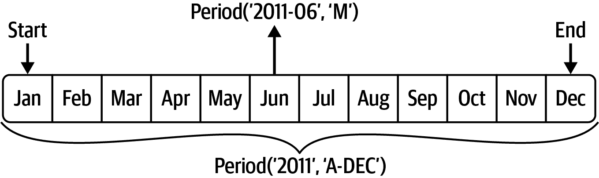
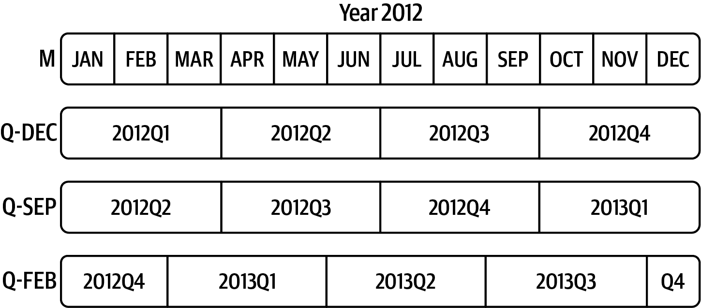
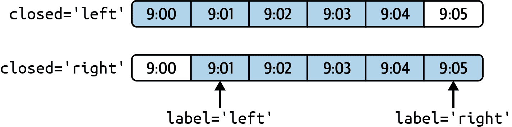
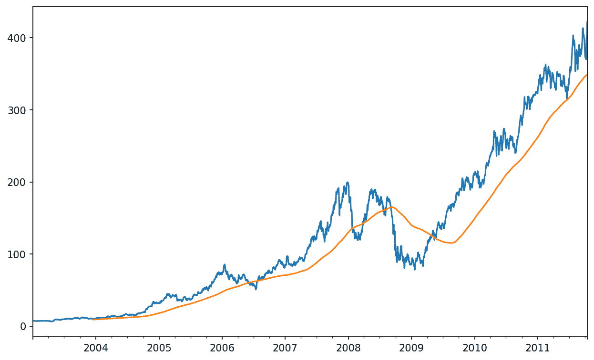
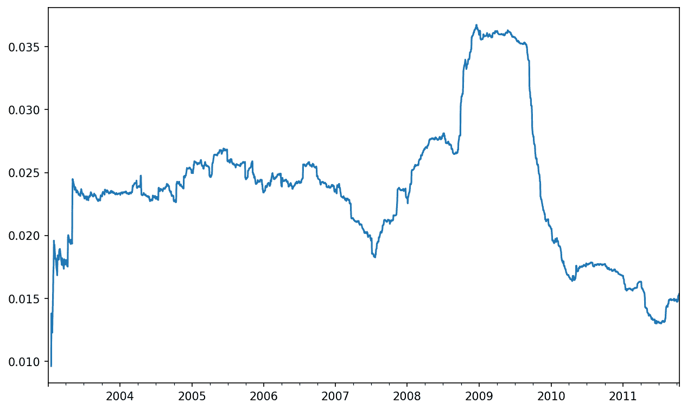
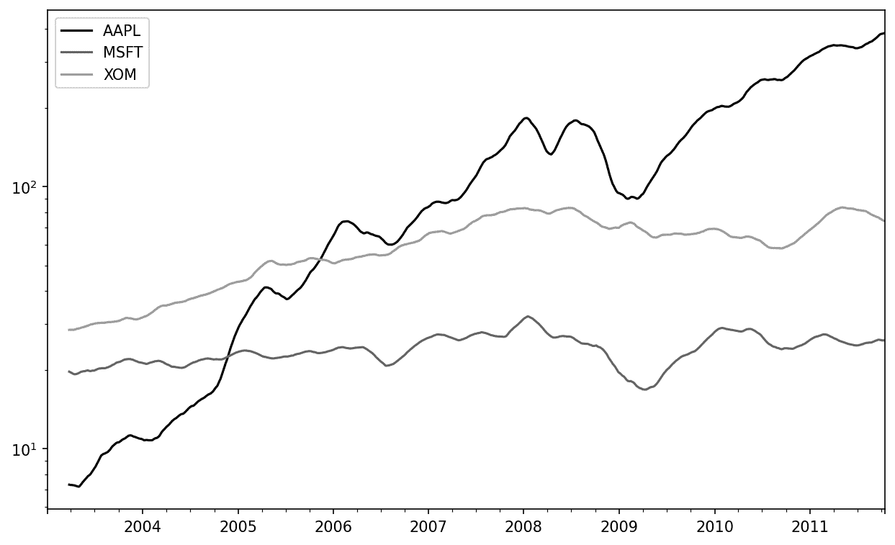
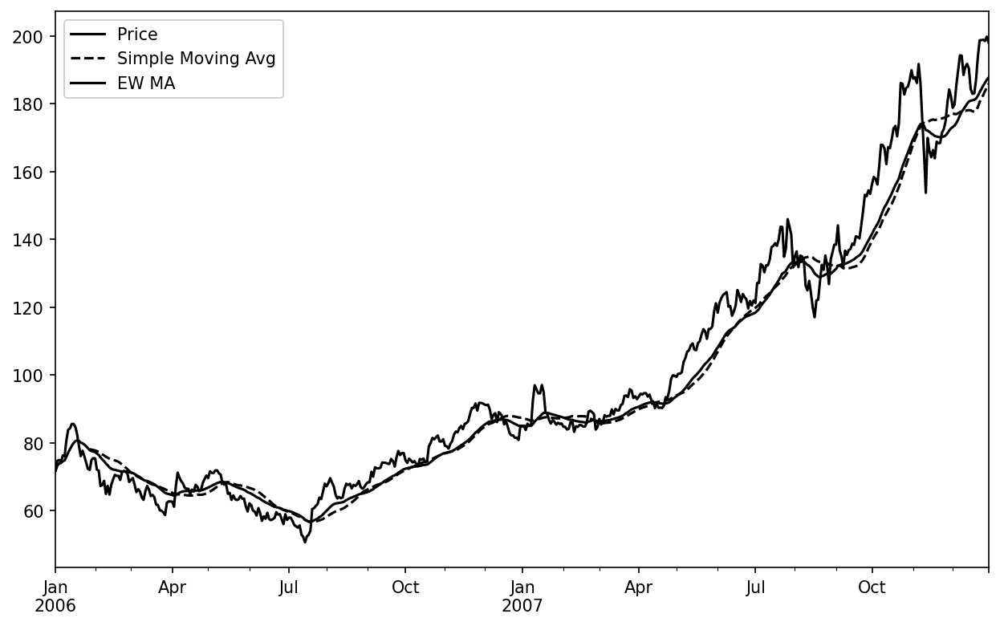
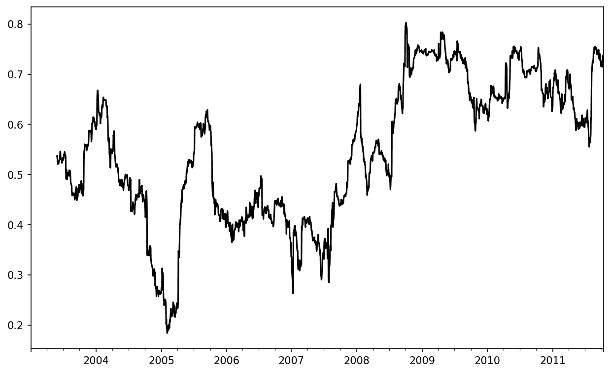
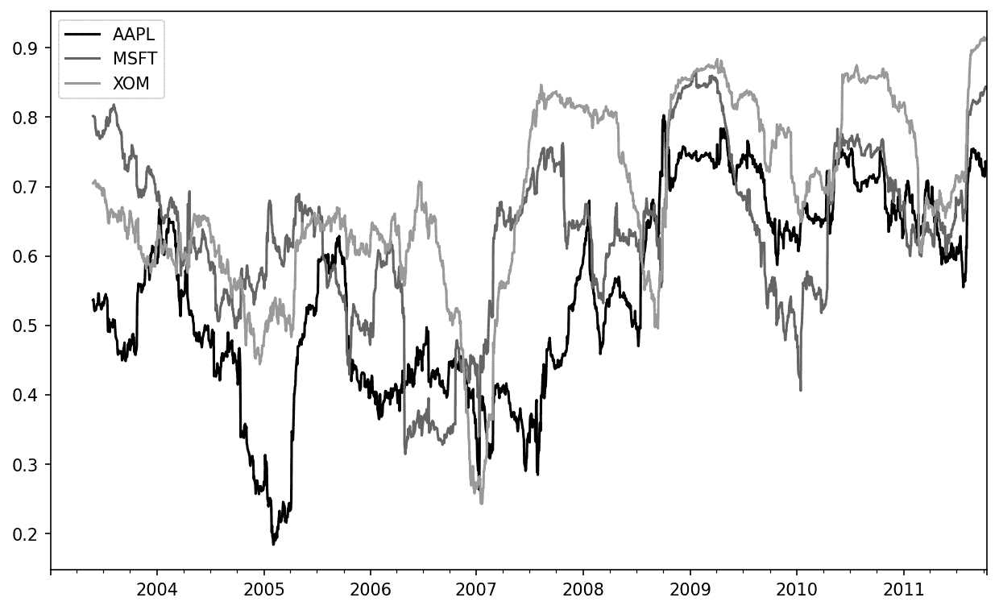
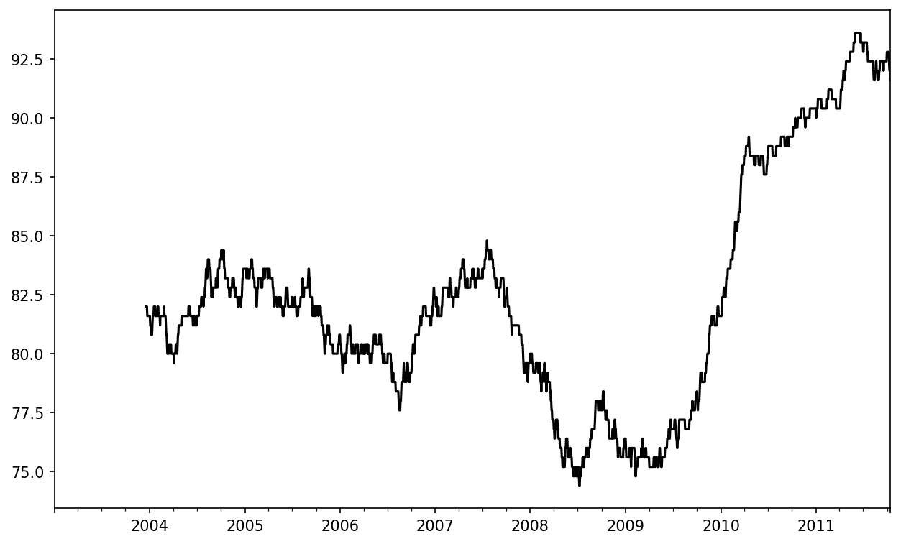

# 十一、时间序列

> 原文：[`wesmckinney.com/book/time-series`](https://wesmckinney.com/book/time-series)
>
> 译者：[飞龙](https://github.com/wizardforcel)
>
> 协议：[CC BY-NC-SA 4.0](http://creativecommons.org/licenses/by-nc-sa/4.0/)


> 此开放访问网络版本的《Python 数据分析第三版》现已作为[印刷版和数字版](https://amzn.to/3DyLaJc)的伴侣提供。如果您发现任何勘误，请[在此处报告](https://oreilly.com/catalog/0636920519829/errata)。请注意，由 Quarto 生成的本站点的某些方面与 O'Reilly 的印刷版和电子书版本的格式不同。
> 
> 如果您发现本书的在线版本有用，请考虑[订购纸质版](https://amzn.to/3DyLaJc)或[无 DRM 的电子书](https://www.ebooks.com/en-us/book/210644288/python-for-data-analysis/wes-mckinney/?affId=WES398681F)以支持作者。本网站的内容不得复制或再生产。代码示例采用 MIT 许可，可在 GitHub 或 Gitee 上找到。

时间序列数据是许多不同领域中的结构化数据的重要形式，如金融、经济、生态学、神经科学和物理学。任何在许多时间点重复记录的东西都构成一个时间序列。许多时间序列是*固定频率*的，也就是说，数据点按照某种规则定期发生，例如每 15 秒、每 5 分钟或每月一次。时间序列也可以是*不规则*的，没有固定的时间单位或单位之间的偏移。如何标记和引用时间序列数据取决于应用程序，您可能有以下之一：

时间戳

特定的时间点。

固定周期

例如 2017 年 1 月的整个月，或 2020 年的整年。

时间间隔

由开始和结束时间戳指示。周期可以被视为间隔的特殊情况。

实验或经过的时间

每个时间戳都是相对于特定开始时间的时间度量（例如，自放入烤箱以来每秒烘烤的饼干的直径），从 0 开始。

在本章中，我主要关注前三类时间序列，尽管许多技术也可以应用于实验时间序列，其中索引可能是整数或浮点数，表示从实验开始经过的时间。最简单的时间序列是由时间戳索引的。

提示：

pandas 还支持基于时间差的索引，这是一种表示实验或经过时间的有用方式。我们在本书中没有探讨时间差索引，但您可以在[pandas 文档](https://pandas.pydata.org)中了解更多。

pandas 提供了许多内置的时间序列工具和算法。您可以高效地处理大型时间序列，对不规则和固定频率的时间序列进行切片、聚合和重采样。其中一些工具对金融和经济应用很有用，但您当然也可以用它们来分析服务器日志数据。

与其他章节一样，我们首先导入 NumPy 和 pandas：

```py
In [12]: import numpy as np

In [13]: import pandas as pd
```

## 11.1 日期和时间数据类型和工具

Python 标准库包括用于日期和时间数据以及与日历相关的功能的数据类型。`datetime`、`time`和`calendar`模块是主要的起点。`datetime.datetime`类型，或简称`datetime`，被广泛使用：

```py
In [14]: from datetime import datetime

In [15]: now = datetime.now()

In [16]: now
Out[16]: datetime.datetime(2023, 4, 12, 13, 9, 16, 484533)

In [17]: now.year, now.month, now.day
Out[17]: (2023, 4, 12)
```

`datetime` 存储日期和时间，精确到微秒。`datetime.timedelta`，或简称`timedelta`，表示两个`datetime`对象之间的时间差：

```py
In [18]: delta = datetime(2011, 1, 7) - datetime(2008, 6, 24, 8, 15)

In [19]: delta
Out[19]: datetime.timedelta(days=926, seconds=56700)

In [20]: delta.days
Out[20]: 926

In [21]: delta.seconds
Out[21]: 56700
```

您可以将`timedelta`或其倍数添加（或减去）到`datetime`对象中，以产生一个新的偏移对象：

```py
In [22]: from datetime import timedelta

In [23]: start = datetime(2011, 1, 7)

In [24]: start + timedelta(12)
Out[24]: datetime.datetime(2011, 1, 19, 0, 0)

In [25]: start - 2 * timedelta(12)
Out[25]: datetime.datetime(2010, 12, 14, 0, 0)
```

表 11.1 总结了`datetime`模块中的数据类型。虽然本章主要关注 pandas 中的数据类型和高级时间序列操作，但您可能会在 Python 的许多其他地方遇到基于`datetime`的类型。

表 11.1：`datetime`模块中的类型

| 类型 | 描述 |
| --- | --- |
| `date` | 使用公历存储日期（年，月，日） |
| `time` | 以小时，分钟，秒和微秒存储一天中的时间 |
| `datetime` | 存储日期和时间 |
| `timedelta` | 两个`datetime`值之间的差异（以天，秒和微秒计） |
| `tzinfo` | 存储时区信息的基本类型 |

### 在字符串和日期时间之间转换

您可以使用`str`或`strftime`方法对`datetime`对象和 pandas 的`Timestamp`对象进行格式化为字符串，传递格式规范：

```py
In [26]: stamp = datetime(2011, 1, 3)

In [27]: str(stamp)
Out[27]: '2011-01-03 00:00:00'

In [28]: stamp.strftime("%Y-%m-%d")
Out[28]: '2011-01-03'
```

请参阅表 11.2 以获取完整的格式代码列表。

表 11.2：`datetime`格式规范（ISO C89 兼容）

| 类型 | 描述 |
| --- | --- |
| `%Y` | 四位数年份 |
| `%y` | 两位数年份 |
| `%m` | 两位数月份[01, 12] |
| `%d` | 两位数日期[01, 31] |
| `%H` | 小时（24 小时制）[00, 23] |
| `%I` | 小时（12 小时制）[01, 12] |
| `%M` | 两位数分钟[00, 59] |
| `%S` | 秒[00, 61]（秒 60, 61 表示闰秒） |
| `%f` | 微秒作为整数，零填充（从 000000 到 999999） |
| `%j` | 一年中的日期作为零填充的整数（从 001 到 336） |
| `%w` | 星期几作为整数[0（星期日），6] |
| `%u` | 从 1 开始的星期几整数，其中 1 是星期一。 |
| `%U` | 一年中的周数[00, 53]; 星期日被认为是一周的第一天，年初第一个星期日之前的日子被称为“第 0 周” |
| `%W` | 一年中的周数[00, 53]; 星期一被认为是一周的第一天，年初第一个星期一之前的日子被称为“第 0 周” |
| `%z` | UTC 时区偏移为`+HHMM`或`-HHMM`; 如果时区是 naive，则为空 |
| `%Z` | 时区名称作为字符串，如果没有时区则为空字符串 |
| `%F` | `%Y-%m-%d`的快捷方式（例如，`2012-4-18`） |
| `%D` | `%m/%d/%y`的快捷方式（例如，`04/18/12`） |

您可以使用许多相同的格式代码使用`datetime.strptime`将字符串转换为日期（但是一些代码，如`%F`，不能使用）：

```py
In [29]: value = "2011-01-03"

In [30]: datetime.strptime(value, "%Y-%m-%d")
Out[30]: datetime.datetime(2011, 1, 3, 0, 0)

In [31]: datestrs = ["7/6/2011", "8/6/2011"]

In [32]: [datetime.strptime(x, "%m/%d/%Y") for x in datestrs]
Out[32]: 
[datetime.datetime(2011, 7, 6, 0, 0),
 datetime.datetime(2011, 8, 6, 0, 0)]
```

`datetime.strptime` 是一种解析具有已知格式的日期的方法。

pandas 通常面向处理日期数组，无论是作为轴索引还是数据框中的列。`pandas.to_datetime`方法解析许多不同类型的日期表示。标准日期格式如 ISO 8601 可以快速解析：

```py
In [33]: datestrs = ["2011-07-06 12:00:00", "2011-08-06 00:00:00"]

In [34]: pd.to_datetime(datestrs)
Out[34]: DatetimeIndex(['2011-07-06 12:00:00', '2011-08-06 00:00:00'], dtype='dat
etime64[ns]', freq=None)
```

它还处理应被视为缺失的值（`None`，空字符串等）：

```py
In [35]: idx = pd.to_datetime(datestrs + [None])

In [36]: idx
Out[36]: DatetimeIndex(['2011-07-06 12:00:00', '2011-08-06 00:00:00', 'NaT'], dty
pe='datetime64[ns]', freq=None)

In [37]: idx[2]
Out[37]: NaT

In [38]: pd.isna(idx)
Out[38]: array([False, False,  True])
```

`NaT`（不是时间）是 pandas 中的时间戳数据的空值。

注意

`dateutil.parser`是一个有用但不完美的工具。值得注意的是，它会将一些字符串识别为日期，而您可能希望它不会；例如，`"42"`将被解析为年份`2042`与今天的日历日期相对应。

`datetime`对象还具有许多针对其他国家或语言系统的特定于区域的格式选项。例如，德国或法国系统上的缩写月份名称与英语系统上的不同。请参阅表 11.3 以获取列表。

表 11.3：特定于区域的日期格式化

| 类型 | 描述 |
| --- | --- |
| `%a` | 缩写的星期几名称 |
| `%A` | 完整的星期几名称 |
| `%b` | 缩写的月份名称 |
| `%B` | 完整的月份名称 |
| `%c` | 完整的日期和时间（例如，‘周二 2012 年 5 月 1 日 下午 04:20:57’） |
| `%p` | AM 或 PM 的本地等效 |
| `%x` | 本地适用的格式化日期（例如，在美国，2012 年 5 月 1 日为‘05/01/2012’） |

| `%X` | 本地适用的时间（例如，‘下午 04:24:12’） |

## 11.2 时间序列基础知识

pandas 中的一种基本类型的时间序列对象是由时间戳索引的 Series，通常在 pandas 之外表示为 Python 字符串或`datetime`对象：

```py
In [39]: dates = [datetime(2011, 1, 2), datetime(2011, 1, 5),
 ....:          datetime(2011, 1, 7), datetime(2011, 1, 8),
 ....:          datetime(2011, 1, 10), datetime(2011, 1, 12)]

In [40]: ts = pd.Series(np.random.standard_normal(6), index=dates)

In [41]: ts
Out[41]: 
2011-01-02   -0.204708
2011-01-05    0.478943
2011-01-07   -0.519439
2011-01-08   -0.555730
2011-01-10    1.965781
2011-01-12    1.393406
dtype: float64
```

在幕后，这些`datetime`对象已被放入`DatetimeIndex`中：

```py
In [42]: ts.index
Out[42]: 
DatetimeIndex(['2011-01-02', '2011-01-05', '2011-01-07', '2011-01-08',
 '2011-01-10', '2011-01-12'],
 dtype='datetime64[ns]', freq=None)
```

与其他 Series 一样，不同索引的时间序列之间的算术运算会自动对齐日期：

```py
In [43]: ts + ts[::2]
Out[43]: 
2011-01-02   -0.409415
2011-01-05         NaN
2011-01-07   -1.038877
2011-01-08         NaN
2011-01-10    3.931561
2011-01-12         NaN
dtype: float64
```

请记住，`ts[::2]`选择`ts`中的每个第二个元素。

pandas 使用 NumPy 的`datetime64`数据类型以纳秒分辨率存储时间戳：

```py
In [44]: ts.index.dtype
Out[44]: dtype('<M8[ns]')
```

来自`DatetimeIndex`的标量值是 pandas 的`Timestamp`对象：

```py
In [45]: stamp = ts.index[0]

In [46]: stamp
Out[46]: Timestamp('2011-01-02 00:00:00')
```

`pandas.Timestamp`可以替代大多数您将使用`datetime`对象的地方。然而，反之则不成立，因为`pandas.Timestamp`可以存储纳秒精度数据，而`datetime`仅存储微秒精度。此外，`pandas.Timestamp`可以存储频率信息（如果有的话），并且了解如何执行时区转换和其他类型的操作。稍后在时区处理中会更详细地介绍这两个方面。

### 索引、选择、子集

当您根据标签索引和选择数据时，时间序列的行为与任何其他 Series 相同：

```py
In [47]: stamp = ts.index[2]

In [48]: ts[stamp]
Out[48]: -0.5194387150567381
```

为了方便起见，您还可以传递一个可解释为日期的字符串：

```py
In [49]: ts["2011-01-10"]
Out[49]: 1.9657805725027142
```

对于更长的时间序列，可以传递一年或仅一年和一个月以轻松选择数据的片段（`pandas.date_range`在生成日期范围中有更详细的讨论）：

```py
In [50]: longer_ts = pd.Series(np.random.standard_normal(1000),
 ....:                       index=pd.date_range("2000-01-01", periods=1000))

In [51]: longer_ts
Out[51]: 
2000-01-01    0.092908
2000-01-02    0.281746
2000-01-03    0.769023
2000-01-04    1.246435
2000-01-05    1.007189
 ... 
2002-09-22    0.930944
2002-09-23   -0.811676
2002-09-24   -1.830156
2002-09-25   -0.138730
2002-09-26    0.334088
Freq: D, Length: 1000, dtype: float64

In [52]: longer_ts["2001"]
Out[52]: 
2001-01-01    1.599534
2001-01-02    0.474071
2001-01-03    0.151326
2001-01-04   -0.542173
2001-01-05   -0.475496
 ... 
2001-12-27    0.057874
2001-12-28   -0.433739
2001-12-29    0.092698
2001-12-30   -1.397820
2001-12-31    1.457823
Freq: D, Length: 365, dtype: float64
```

在这里，字符串`"2001"`被解释为一年，并选择了那个时间段。如果指定月份，也可以这样做：

```py
In [53]: longer_ts["2001-05"]
Out[53]: 
2001-05-01   -0.622547
2001-05-02    0.936289
2001-05-03    0.750018
2001-05-04   -0.056715
2001-05-05    2.300675
 ... 
2001-05-27    0.235477
2001-05-28    0.111835
2001-05-29   -1.251504
2001-05-30   -2.949343
2001-05-31    0.634634
Freq: D, Length: 31, dtype: float64
```

使用`datetime`对象进行切片也是有效的：

```py
In [54]: ts[datetime(2011, 1, 7):]
Out[54]: 
2011-01-07   -0.519439
2011-01-08   -0.555730
2011-01-10    1.965781
2011-01-12    1.393406
dtype: float64

In [55]: ts[datetime(2011, 1, 7):datetime(2011, 1, 10)]
Out[55]: 
2011-01-07   -0.519439
2011-01-08   -0.555730
2011-01-10    1.965781
dtype: float64
```

因为大多数时间序列数据是按时间顺序排列的，所以可以使用不包含在时间序列中的时间戳进行切片以执行范围查询：

```py
In [56]: ts
Out[56]: 
2011-01-02   -0.204708
2011-01-05    0.478943
2011-01-07   -0.519439
2011-01-08   -0.555730
2011-01-10    1.965781
2011-01-12    1.393406
dtype: float64

In [57]: ts["2011-01-06":"2011-01-11"]
Out[57]: 
2011-01-07   -0.519439
2011-01-08   -0.555730
2011-01-10    1.965781
dtype: float64
```

与以前一样，您可以传递字符串日期、`datetime`或时间戳。请记住，以这种方式切片会在源时间序列上产生视图，就像在 NumPy 数组上切片一样。这意味着不会复制任何数据，并且对切片的修改将反映在原始数据中。

有一个等效的实例方法，`truncate`，它在两个日期之间切片一个 Series：

```py
In [58]: ts.truncate(after="2011-01-09")
Out[58]: 
2011-01-02   -0.204708
2011-01-05    0.478943
2011-01-07   -0.519439
2011-01-08   -0.555730
dtype: float64
```

对于 DataFrame 来说，所有这些都是正确的，可以对其行进行索引：

```py
In [59]: dates = pd.date_range("2000-01-01", periods=100, freq="W-WED")

In [60]: long_df = pd.DataFrame(np.random.standard_normal((100, 4)),
 ....:                        index=dates,
 ....:                        columns=["Colorado", "Texas",
 ....:                                 "New York", "Ohio"])

In [61]: long_df.loc["2001-05"]
Out[61]: 
 Colorado     Texas  New York      Ohio
2001-05-02 -0.006045  0.490094 -0.277186 -0.707213
2001-05-09 -0.560107  2.735527  0.927335  1.513906
2001-05-16  0.538600  1.273768  0.667876 -0.969206
2001-05-23  1.676091 -0.817649  0.050188  1.951312
2001-05-30  3.260383  0.963301  1.201206 -1.852001
```

### 具有重复索引的时间序列

在某些应用程序中，可能会有多个数据观测值落在特定的时间戳上。这里是一个例子：

```py
In [62]: dates = pd.DatetimeIndex(["2000-01-01", "2000-01-02", "2000-01-02",
 ....:                           "2000-01-02", "2000-01-03"])

In [63]: dup_ts = pd.Series(np.arange(5), index=dates)

In [64]: dup_ts
Out[64]: 
2000-01-01    0
2000-01-02    1
2000-01-02    2
2000-01-02    3
2000-01-03    4
dtype: int64
```

我们可以通过检查其`is_unique`属性来确定索引不是唯一的：

```py
In [65]: dup_ts.index.is_unique
Out[65]: False
```

现在，对这个时间序列进行索引将产生标量值或切片，具体取决于时间戳是否重复：

```py
In [66]: dup_ts["2000-01-03"]  # not duplicated
Out[66]: 4

In [67]: dup_ts["2000-01-02"]  # duplicated
Out[67]: 
2000-01-02    1
2000-01-02    2
2000-01-02    3
dtype: int64
```

假设您想要聚合具有非唯一时间戳的数据。一种方法是使用`groupby`并传递`level=0`（唯一的级别）：

```py
In [68]: grouped = dup_ts.groupby(level=0)

In [69]: grouped.mean()
Out[69]: 
2000-01-01    0.0
2000-01-02    2.0
2000-01-03    4.0
dtype: float64

In [70]: grouped.count()
Out[70]: 
2000-01-01    1
2000-01-02    3
2000-01-03    1
dtype: int64
```

## 11.3 日期范围、频率和移位

在 pandas 中，通常假定通用时间序列是不规则的；也就是说，它们没有固定的频率。对于许多应用程序来说，这是足够的。然而，通常希望相对于固定频率（如每日、每月或每 15 分钟）进行工作，即使这意味着在时间序列中引入缺失值。幸运的是，pandas 具有一整套标准时间序列频率和重新采样工具（稍后在重新采样和频率转换中更详细地讨论），可以推断频率并生成固定频率的日期范围。例如，您可以通过调用`resample`将示例时间序列转换为固定的每日频率：

```py
In [71]: ts
Out[71]: 
2011-01-02   -0.204708
2011-01-05    0.478943
2011-01-07   -0.519439
2011-01-08   -0.555730
2011-01-10    1.965781
2011-01-12    1.393406
dtype: float64

In [72]: resampler = ts.resample("D")

In [73]: resampler
Out[73]: <pandas.core.resample.DatetimeIndexResampler object at 0x17b0e7bb0>
```

字符串`"D"`被解释为每日频率。

在频率之间的转换或*重新采样*是一个足够大的主题，后面会有自己的部分（重新采样和频率转换）。在这里，我将向您展示如何使用基本频率及其倍数。

### 生成日期范围

虽然我之前没有解释过，但`pandas.date_range`负责根据特定频率生成具有指定长度的`DatetimeIndex`：

```py
In [74]: index = pd.date_range("2012-04-01", "2012-06-01")

In [75]: index
Out[75]: 
DatetimeIndex(['2012-04-01', '2012-04-02', '2012-04-03', '2012-04-04',
 '2012-04-05', '2012-04-06', '2012-04-07', '2012-04-08',
 '2012-04-09', '2012-04-10', '2012-04-11', '2012-04-12',
 '2012-04-13', '2012-04-14', '2012-04-15', '2012-04-16',
 '2012-04-17', '2012-04-18', '2012-04-19', '2012-04-20',
 '2012-04-21', '2012-04-22', '2012-04-23', '2012-04-24',
 '2012-04-25', '2012-04-26', '2012-04-27', '2012-04-28',
 '2012-04-29', '2012-04-30', '2012-05-01', '2012-05-02',
 '2012-05-03', '2012-05-04', '2012-05-05', '2012-05-06',
 '2012-05-07', '2012-05-08', '2012-05-09', '2012-05-10',
 '2012-05-11', '2012-05-12', '2012-05-13', '2012-05-14',
 '2012-05-15', '2012-05-16', '2012-05-17', '2012-05-18',
 '2012-05-19', '2012-05-20', '2012-05-21', '2012-05-22',
 '2012-05-23', '2012-05-24', '2012-05-25', '2012-05-26',
 '2012-05-27', '2012-05-28', '2012-05-29', '2012-05-30',
 '2012-05-31', '2012-06-01'],
 dtype='datetime64[ns]', freq='D')
```

默认情况下，`pandas.date_range`生成每日时间戳。如果只传递开始或结束日期，必须传递一个周期数来生成：

```py
In [76]: pd.date_range(start="2012-04-01", periods=20)
Out[76]: 
DatetimeIndex(['2012-04-01', '2012-04-02', '2012-04-03', '2012-04-04',
 '2012-04-05', '2012-04-06', '2012-04-07', '2012-04-08',
 '2012-04-09', '2012-04-10', '2012-04-11', '2012-04-12',
 '2012-04-13', '2012-04-14', '2012-04-15', '2012-04-16',
 '2012-04-17', '2012-04-18', '2012-04-19', '2012-04-20'],
 dtype='datetime64[ns]', freq='D')

In [77]: pd.date_range(end="2012-06-01", periods=20)
Out[77]: 
DatetimeIndex(['2012-05-13', '2012-05-14', '2012-05-15', '2012-05-16',
 '2012-05-17', '2012-05-18', '2012-05-19', '2012-05-20',
 '2012-05-21', '2012-05-22', '2012-05-23', '2012-05-24',
 '2012-05-25', '2012-05-26', '2012-05-27', '2012-05-28',
 '2012-05-29', '2012-05-30', '2012-05-31', '2012-06-01'],
 dtype='datetime64[ns]', freq='D')
```

开始和结束日期为生成的日期索引定义了严格的边界。例如，如果您想要一个包含每个月最后一个工作日的日期索引，您将传递 `"BM"` 频率（月底的工作日；请参阅 Table 11.4 中更完整的频率列表），只有落在日期区间内或日期区间内的日期将被包括：

```py
In [78]: pd.date_range("2000-01-01", "2000-12-01", freq="BM")
Out[78]: 
DatetimeIndex(['2000-01-31', '2000-02-29', '2000-03-31', '2000-04-28',
 '2000-05-31', '2000-06-30', '2000-07-31', '2000-08-31',
 '2000-09-29', '2000-10-31', '2000-11-30'],
 dtype='datetime64[ns]', freq='BM')
```

Table 11.4: 基础时间序列频率（不全面）

| 别名 | 偏移类型 | 描述 |
| --- | --- | --- |
| `D` | `Day` | 日历日 |
| `B` | `BusinessDay` | 工作日 |
| `H` | `Hour` | 每小时 |
| `T` 或 `min` | `Minute` | 每分钟一次 |
| `S` | `Second` | 每秒一次 |
| `L` 或 `ms` | `Milli` | 毫秒（1 秒的 1/1,000） |
| `U` | `Micro` | 微秒（1 秒的 1/1,000,000） |
| `M` | `MonthEnd` | 月份的最后一个日历日 |
| `BM` | `BusinessMonthEnd` | 月份的最后一个工作日（工作日） |
| `MS` | `MonthBegin` | 月份的第一个日历日 |
| `BMS` | `BusinessMonthBegin` | 月份的第一个工作日 |
| `W-MON, W-TUE, ...` | `Week` | 每周在给定星期的某一天（MON、TUE、WED、THU、FRI、SAT 或 SUN） |
| `WOM-1MON, WOM-2MON, ...` | `WeekOfMonth` | 在月份的第一、第二、第三或第四周生成每周日期（例如，每月的第三个星期五为 `WOM-3FRI`） |
| `Q-JAN, Q-FEB, ...` | `QuarterEnd` | 季度日期锚定在每个月的最后一个日历日，年终在指定月份（JAN、FEB、MAR、APR、MAY、JUN、JUL、AUG、SEP、OCT、NOV 或 DEC） |
| `BQ-JAN, BQ-FEB, ...` | `BusinessQuarterEnd` | 季度日期锚定在每个月的最后一个工作日，年终在指定月份 |
| `QS-JAN, QS-FEB, ...` | `QuarterBegin` | 季度日期锚定在每个月的第一个日历日，年终在指定月份 |
| `BQS-JAN, BQS-FEB, ...` | `BusinessQuarterBegin` | 季度日期锚定在每个月的第一个工作日，年终在指定月份 |
| `A-JAN, A-FEB, ...` | `YearEnd` | 年度日期锚定在给定月份的最后一个日历日（JAN、FEB、MAR、APR、MAY、JUN、JUL、AUG、SEP、OCT、NOV 或 DEC） |
| `BA-JAN, BA-FEB, ...` | `BusinessYearEnd` | 年度日期锚定在给定月份的最后一个工作日 |
| `AS-JAN, AS-FEB, ...` | `YearBegin` | 年度日期锚定在给定月份的第一天 |
| `BAS-JAN, BAS-FEB, ...` | `BusinessYearBegin` | 年度日期锚定在给定月份的第一个工作日 |

`pandas.date_range` 默认保留开始或结束时间戳的时间（如果有）：

```py
In [79]: pd.date_range("2012-05-02 12:56:31", periods=5)
Out[79]: 
DatetimeIndex(['2012-05-02 12:56:31', '2012-05-03 12:56:31',
 '2012-05-04 12:56:31', '2012-05-05 12:56:31',
 '2012-05-06 12:56:31'],
 dtype='datetime64[ns]', freq='D')
```

有时您会有带有时间信息的开始或结束日期，但希望生成一组时间戳，*规范化* 为午夜作为约定。为此，有一个 `normalize` 选项：

```py
In [80]: pd.date_range("2012-05-02 12:56:31", periods=5, normalize=True)
Out[80]: 
DatetimeIndex(['2012-05-02', '2012-05-03', '2012-05-04', '2012-05-05',
 '2012-05-06'],
 dtype='datetime64[ns]', freq='D')
```

### 频率和日期偏移

在 pandas 中，频率由 *基础频率* 和一个乘数组成。基础频率通常用字符串别名表示，如 `"M"` 表示每月或 `"H"` 表示每小时。对于每个基础频率，都有一个称为 *日期偏移* 的对象。例如，小时频率可以用 `Hour` 类表示：

```py
In [81]: from pandas.tseries.offsets import Hour, Minute

In [82]: hour = Hour()

In [83]: hour
Out[83]: <Hour>
```

您可以通过传递一个整数来定义偏移的倍数：

```py
In [84]: four_hours = Hour(4)

In [85]: four_hours
Out[85]: <4 * Hours>
```

在大多数应用程序中，您通常不需要显式创建这些对象之一；而是使用类似 `"H"` 或 `"4H"` 的字符串别名。在基础频率前放置一个整数会创建一个倍数：

```py
In [86]: pd.date_range("2000-01-01", "2000-01-03 23:59", freq="4H")
Out[86]: 
DatetimeIndex(['2000-01-01 00:00:00', '2000-01-01 04:00:00',
 '2000-01-01 08:00:00', '2000-01-01 12:00:00',
 '2000-01-01 16:00:00', '2000-01-01 20:00:00',
 '2000-01-02 00:00:00', '2000-01-02 04:00:00',
 '2000-01-02 08:00:00', '2000-01-02 12:00:00',
 '2000-01-02 16:00:00', '2000-01-02 20:00:00',
 '2000-01-03 00:00:00', '2000-01-03 04:00:00',
 '2000-01-03 08:00:00', '2000-01-03 12:00:00',
 '2000-01-03 16:00:00', '2000-01-03 20:00:00'],
 dtype='datetime64[ns]', freq='4H')
```

许多偏移可以通过加法组合：

```py
In [87]: Hour(2) + Minute(30)
Out[87]: <150 * Minutes>
```

同样，您可以传递频率字符串，如 `"1h30min"`，这将有效地解析为相同的表达式：

```py
In [88]: pd.date_range("2000-01-01", periods=10, freq="1h30min")
Out[88]: 
DatetimeIndex(['2000-01-01 00:00:00', '2000-01-01 01:30:00',
 '2000-01-01 03:00:00', '2000-01-01 04:30:00',
 '2000-01-01 06:00:00', '2000-01-01 07:30:00',
 '2000-01-01 09:00:00', '2000-01-01 10:30:00',
 '2000-01-01 12:00:00', '2000-01-01 13:30:00'],
 dtype='datetime64[ns]', freq='90T')
```

一些频率描述的是时间点，这些时间点不是均匀间隔的。例如，`"M"`（日历月底）和 `"BM"`（月底的最后一个工作日/工作日）取决于一个月的天数，以及在后一种情况下，月份是否在周末结束。我们将这些称为 *锚定* 偏移。

请参考 Table 11.4 以获取 pandas 中可用的频率代码和日期偏移类的列表。

注意

用户可以定义自己的自定义频率类，以提供 pandas 中不可用的日期逻辑，但这些完整的细节超出了本书的范围。

#### 月份周日期

一个有用的频率类是“月份周”，从`WOM`开始。这使您可以获得每个月的第三个星期五这样的日期：

```py
In [89]: monthly_dates = pd.date_range("2012-01-01", "2012-09-01", freq="WOM-3FRI
")

In [90]: list(monthly_dates)
Out[90]: 
[Timestamp('2012-01-20 00:00:00'),
 Timestamp('2012-02-17 00:00:00'),
 Timestamp('2012-03-16 00:00:00'),
 Timestamp('2012-04-20 00:00:00'),
 Timestamp('2012-05-18 00:00:00'),
 Timestamp('2012-06-15 00:00:00'),
 Timestamp('2012-07-20 00:00:00'),
 Timestamp('2012-08-17 00:00:00')]
```

### 移动（领先和滞后）数据

*移动*指的是通过时间向后和向前移动数据。Series 和 DataFrame 都有一个`shift`方法，用于进行简单的向前或向后移位，保持索引不变：

```py
In [91]: ts = pd.Series(np.random.standard_normal(4),
 ....:                index=pd.date_range("2000-01-01", periods=4, freq="M"))

In [92]: ts
Out[92]: 
2000-01-31   -0.066748
2000-02-29    0.838639
2000-03-31   -0.117388
2000-04-30   -0.517795
Freq: M, dtype: float64

In [93]: ts.shift(2)
Out[93]: 
2000-01-31         NaN
2000-02-29         NaN
2000-03-31   -0.066748
2000-04-30    0.838639
Freq: M, dtype: float64

In [94]: ts.shift(-2)
Out[94]: 
2000-01-31   -0.117388
2000-02-29   -0.517795
2000-03-31         NaN
2000-04-30         NaN
Freq: M, dtype: float64
```

当我们这样移动时，缺失数据会在时间序列的开始或结束引入。

`shift`的一个常见用法是计算时间序列或多个时间序列的连续百分比变化作为 DataFrame 列。这表示为：

```py
ts / ts.shift(1) - 1
```

因为无时区移位会保持索引不变，所以会丢失一些数据。因此，如果知道频率，可以将其传递给`shift`以推进时间戳，而不仅仅是数据：

```py
In [95]: ts.shift(2, freq="M")
Out[95]: 
2000-03-31   -0.066748
2000-04-30    0.838639
2000-05-31   -0.117388
2000-06-30   -0.517795
Freq: M, dtype: float64
```

也可以传递其他频率，这样可以在如何领先和滞后数据方面提供一些灵活性：

```py
In [96]: ts.shift(3, freq="D")
Out[96]: 
2000-02-03   -0.066748
2000-03-03    0.838639
2000-04-03   -0.117388
2000-05-03   -0.517795
dtype: float64

In [97]: ts.shift(1, freq="90T")
Out[97]: 
2000-01-31 01:30:00   -0.066748
2000-02-29 01:30:00    0.838639
2000-03-31 01:30:00   -0.117388
2000-04-30 01:30:00   -0.517795
dtype: float64
```

这里的`T`代表分钟。请注意，这里的`freq`参数表示要应用于时间戳的偏移量，但它不会改变数据的基础频率（如果有的话）。

#### 使用偏移移动日期

pandas 日期偏移也可以与`datetime`或`Timestamp`对象一起使用：

```py
In [98]: from pandas.tseries.offsets import Day, MonthEnd

In [99]: now = datetime(2011, 11, 17)

In [100]: now + 3 * Day()
Out[100]: Timestamp('2011-11-20 00:00:00')
```

如果添加像`MonthEnd`这样的锚定偏移，第一个增量将根据频率规则“向前滚动”日期到下一个日期：

```py
In [101]: now + MonthEnd()
Out[101]: Timestamp('2011-11-30 00:00:00')

In [102]: now + MonthEnd(2)
Out[102]: Timestamp('2011-12-31 00:00:00')
```

锚定偏移可以通过简单使用它们的`rollforward`和`rollback`方法明确地“滚动”日期向前或向后：

```py
In [103]: offset = MonthEnd()

In [104]: offset.rollforward(now)
Out[104]: Timestamp('2011-11-30 00:00:00')

In [105]: offset.rollback(now)
Out[105]: Timestamp('2011-10-31 00:00:00')
```

日期偏移的一个创造性用法是将这些方法与`groupby`一起使用：

```py
In [106]: ts = pd.Series(np.random.standard_normal(20),
 .....:                index=pd.date_range("2000-01-15", periods=20, freq="4D")
)

In [107]: ts
Out[107]: 
2000-01-15   -0.116696
2000-01-19    2.389645
2000-01-23   -0.932454
2000-01-27   -0.229331
2000-01-31   -1.140330
2000-02-04    0.439920
2000-02-08   -0.823758
2000-02-12   -0.520930
2000-02-16    0.350282
2000-02-20    0.204395
2000-02-24    0.133445
2000-02-28    0.327905
2000-03-03    0.072153
2000-03-07    0.131678
2000-03-11   -1.297459
2000-03-15    0.997747
2000-03-19    0.870955
2000-03-23   -0.991253
2000-03-27    0.151699
2000-03-31    1.266151
Freq: 4D, dtype: float64

In [108]: ts.groupby(MonthEnd().rollforward).mean()
Out[108]: 
2000-01-31   -0.005833
2000-02-29    0.015894
2000-03-31    0.150209
dtype: float64
```

当然，更简单更快的方法是使用`resample`（我们将在重新采样和频率转换中更深入地讨论这个问题）：

```py
In [109]: ts.resample("M").mean()
Out[109]: 
2000-01-31   -0.005833
2000-02-29    0.015894
2000-03-31    0.150209
Freq: M, dtype: float64
```

## 11.4 时区处理

与时区一起工作可能是时间序列操作中最不愉快的部分之一。因此，许多时间序列用户选择在*协调世界时*或*UTC*中处理时间序列，这是地理独立的国际标准。时区表示为与 UTC 的偏移；例如，纽约在夏令时（DST）期间比 UTC 晚四个小时，在其他时间比 UTC 晚五个小时。

在 Python 中，时区信息来自第三方`pytz`库（可通过 pip 或 conda 安装），该库公开了*Olson 数据库*，这是世界时区信息的编译。这对于历史数据尤为重要，因为夏令时转换日期（甚至 UTC 偏移）已根据地区法律多次更改。在美国，自 1900 年以来，夏令时转换时间已经多次更改！

有关`pytz`库的详细信息，您需要查看该库的文档。就本书而言，pandas 封装了`pytz`的功能，因此您可以忽略其 API 以外的时区名称。由于 pandas 对`pytz`有硬性依赖，因此不需要单独安装它。时区名称可以在交互式和文档中找到：

```py
In [110]: import pytz

In [111]: pytz.common_timezones[-5:]
Out[111]: ['US/Eastern', 'US/Hawaii', 'US/Mountain', 'US/Pacific', 'UTC']
```

要从`pytz`中获取时区对象，请使用`pytz.timezone`：

```py
In [112]: tz = pytz.timezone("America/New_York")

In [113]: tz
Out[113]: <DstTzInfo 'America/New_York' LMT-1 day, 19:04:00 STD>
```

pandas 中的方法将接受时区名称或这些对象。

### 时区本地化和转换

默认情况下，pandas 中的时间序列是*时区无关*的。例如，考虑以下时间序列：

```py
In [114]: dates = pd.date_range("2012-03-09 09:30", periods=6)

In [115]: ts = pd.Series(np.random.standard_normal(len(dates)), index=dates)

In [116]: ts
Out[116]: 
2012-03-09 09:30:00   -0.202469
2012-03-10 09:30:00    0.050718
2012-03-11 09:30:00    0.639869
2012-03-12 09:30:00    0.597594
2012-03-13 09:30:00   -0.797246
2012-03-14 09:30:00    0.472879
Freq: D, dtype: float64
```

索引的`tz`字段为`None`：

```py
In [117]: print(ts.index.tz)
None
```

可以生成带有时区设置的日期范围：

```py
In [118]: pd.date_range("2012-03-09 09:30", periods=10, tz="UTC")
Out[118]: 
DatetimeIndex(['2012-03-09 09:30:00+00:00', '2012-03-10 09:30:00+00:00',
 '2012-03-11 09:30:00+00:00', '2012-03-12 09:30:00+00:00',
 '2012-03-13 09:30:00+00:00', '2012-03-14 09:30:00+00:00',
 '2012-03-15 09:30:00+00:00', '2012-03-16 09:30:00+00:00',
 '2012-03-17 09:30:00+00:00', '2012-03-18 09:30:00+00:00'],
 dtype='datetime64[ns, UTC]', freq='D')
```

从无时区转换为*本地化*（重新解释为在特定时区中观察到）由`tz_localize`方法处理：

```py
In [119]: ts
Out[119]: 
2012-03-09 09:30:00   -0.202469
2012-03-10 09:30:00    0.050718
2012-03-11 09:30:00    0.639869
2012-03-12 09:30:00    0.597594
2012-03-13 09:30:00   -0.797246
2012-03-14 09:30:00    0.472879
Freq: D, dtype: float64

In [120]: ts_utc = ts.tz_localize("UTC")

In [121]: ts_utc
Out[121]: 
2012-03-09 09:30:00+00:00   -0.202469
2012-03-10 09:30:00+00:00    0.050718
2012-03-11 09:30:00+00:00    0.639869
2012-03-12 09:30:00+00:00    0.597594
2012-03-13 09:30:00+00:00   -0.797246
2012-03-14 09:30:00+00:00    0.472879
Freq: D, dtype: float64

In [122]: ts_utc.index
Out[122]: 
DatetimeIndex(['2012-03-09 09:30:00+00:00', '2012-03-10 09:30:00+00:00',
 '2012-03-11 09:30:00+00:00', '2012-03-12 09:30:00+00:00',
 '2012-03-13 09:30:00+00:00', '2012-03-14 09:30:00+00:00'],
 dtype='datetime64[ns, UTC]', freq='D')
```

一旦时间序列被本地化到特定的时区，它可以使用`tz_convert`转换为另一个时区：

```py
In [123]: ts_utc.tz_convert("America/New_York")
Out[123]: 
2012-03-09 04:30:00-05:00   -0.202469
2012-03-10 04:30:00-05:00    0.050718
2012-03-11 05:30:00-04:00    0.639869
2012-03-12 05:30:00-04:00    0.597594
2012-03-13 05:30:00-04:00   -0.797246
2012-03-14 05:30:00-04:00    0.472879
Freq: D, dtype: float64
```

在前述时间序列的情况下，该时间序列跨越了`America/New_York`时区的夏令时转换，我们可以将其本地化为美国东部时间，然后转换为 UTC 或柏林时间：

```py
In [124]: ts_eastern = ts.tz_localize("America/New_York")

In [125]: ts_eastern.tz_convert("UTC")
Out[125]: 
2012-03-09 14:30:00+00:00   -0.202469
2012-03-10 14:30:00+00:00    0.050718
2012-03-11 13:30:00+00:00    0.639869
2012-03-12 13:30:00+00:00    0.597594
2012-03-13 13:30:00+00:00   -0.797246
2012-03-14 13:30:00+00:00    0.472879
dtype: float64

In [126]: ts_eastern.tz_convert("Europe/Berlin")
Out[126]: 
2012-03-09 15:30:00+01:00   -0.202469
2012-03-10 15:30:00+01:00    0.050718
2012-03-11 14:30:00+01:00    0.639869
2012-03-12 14:30:00+01:00    0.597594
2012-03-13 14:30:00+01:00   -0.797246
2012-03-14 14:30:00+01:00    0.472879
dtype: float64
```

`tz_localize`和`tz_convert`也是`DatetimeIndex`的实例方法：

```py
In [127]: ts.index.tz_localize("Asia/Shanghai")
Out[127]: 
DatetimeIndex(['2012-03-09 09:30:00+08:00', '2012-03-10 09:30:00+08:00',
 '2012-03-11 09:30:00+08:00', '2012-03-12 09:30:00+08:00',
 '2012-03-13 09:30:00+08:00', '2012-03-14 09:30:00+08:00'],
 dtype='datetime64[ns, Asia/Shanghai]', freq=None)
```

注意

本地化无时区时间戳还会检查夏令时转换周围的模糊或不存在的时间。

### 与时区感知时间戳对象的操作

类似于时间序列和日期范围，个别`Timestamp`对象也可以从无时区转换为时区感知，并从一个时区转换为另一个时区：

```py
In [128]: stamp = pd.Timestamp("2011-03-12 04:00")

In [129]: stamp_utc = stamp.tz_localize("utc")

In [130]: stamp_utc.tz_convert("America/New_York")
Out[130]: Timestamp('2011-03-11 23:00:00-0500', tz='America/New_York')
```

创建`Timestamp`时也可以传递时区：

```py
In [131]: stamp_moscow = pd.Timestamp("2011-03-12 04:00", tz="Europe/Moscow")

In [132]: stamp_moscow
Out[132]: Timestamp('2011-03-12 04:00:00+0300', tz='Europe/Moscow')
```

时区感知的`Timestamp`对象在内部以自 Unix 纪元（1970 年 1 月 1 日）以来的纳秒为单位存储 UTC 时间戳值，因此更改时区不会改变内部 UTC 值：

```py
In [133]: stamp_utc.value
Out[133]: 1299902400000000000

In [134]: stamp_utc.tz_convert("America/New_York").value
Out[134]: 1299902400000000000
```

在使用 pandas 的`DateOffset`对象执行时间算术时，pandas 会尽可能尊重夏令时转换。这里我们构造了发生在夏令时转换之前的时间戳（向前和向后）。首先，在转换为夏令时前 30 分钟：

```py
In [135]: stamp = pd.Timestamp("2012-03-11 01:30", tz="US/Eastern")

In [136]: stamp
Out[136]: Timestamp('2012-03-11 01:30:00-0500', tz='US/Eastern')

In [137]: stamp + Hour()
Out[137]: Timestamp('2012-03-11 03:30:00-0400', tz='US/Eastern')
```

然后，在夏令时转换前 90 分钟：

```py
In [138]: stamp = pd.Timestamp("2012-11-04 00:30", tz="US/Eastern")

In [139]: stamp
Out[139]: Timestamp('2012-11-04 00:30:00-0400', tz='US/Eastern')

In [140]: stamp + 2 * Hour()
Out[140]: Timestamp('2012-11-04 01:30:00-0500', tz='US/Eastern')
```

### 不同时区之间的操作

如果将具有不同时区的两个时间序列组合，结果将是 UTC。由于时间戳在 UTC 下存储，这是一个简单的操作，不需要转换：

```py
In [141]: dates = pd.date_range("2012-03-07 09:30", periods=10, freq="B")

In [142]: ts = pd.Series(np.random.standard_normal(len(dates)), index=dates)

In [143]: ts
Out[143]: 
2012-03-07 09:30:00    0.522356
2012-03-08 09:30:00   -0.546348
2012-03-09 09:30:00   -0.733537
2012-03-12 09:30:00    1.302736
2012-03-13 09:30:00    0.022199
2012-03-14 09:30:00    0.364287
2012-03-15 09:30:00   -0.922839
2012-03-16 09:30:00    0.312656
2012-03-19 09:30:00   -1.128497
2012-03-20 09:30:00   -0.333488
Freq: B, dtype: float64

In [144]: ts1 = ts[:7].tz_localize("Europe/London")

In [145]: ts2 = ts1[2:].tz_convert("Europe/Moscow")

In [146]: result = ts1 + ts2

In [147]: result.index
Out[147]: 
DatetimeIndex(['2012-03-07 09:30:00+00:00', '2012-03-08 09:30:00+00:00',
 '2012-03-09 09:30:00+00:00', '2012-03-12 09:30:00+00:00',
 '2012-03-13 09:30:00+00:00', '2012-03-14 09:30:00+00:00',
 '2012-03-15 09:30:00+00:00'],
 dtype='datetime64[ns, UTC]', freq=None)
```

不支持在时区无关和时区感知数据之间进行操作，会引发异常。*## 11.5 周期和周期算术

*Periods*代表时间跨度，如天、月、季度或年。`pandas.Period`类表示这种数据类型，需要一个字符串或整数和一个来自 Table 11.4 的支持频率：

```py
In [148]: p = pd.Period("2011", freq="A-DEC")

In [149]: p
Out[149]: Period('2011', 'A-DEC')
```

在这种情况下，`Period`对象表示从 2011 年 1 月 1 日到 2011 年 12 月 31 日的完整时间跨度。方便的是，从周期中添加和减去整数会改变它们的频率：

```py
In [150]: p + 5
Out[150]: Period('2016', 'A-DEC')

In [151]: p - 2
Out[151]: Period('2009', 'A-DEC')
```

如果两个周期具有相同的频率，则它们之间的差异是单位之间的数量作为日期偏移量：

```py
In [152]: pd.Period("2014", freq="A-DEC") - p
Out[152]: <3 * YearEnds: month=12>
```

可以使用`period_range`函数构建周期的常规范围：

```py
In [153]: periods = pd.period_range("2000-01-01", "2000-06-30", freq="M")

In [154]: periods
Out[154]: PeriodIndex(['2000-01', '2000-02', '2000-03', '2000-04', '2000-05', '20
00-06'], dtype='period[M]')
```

`PeriodIndex`类存储一系列周期，并可以作为任何 pandas 数据结构中的轴索引：

```py
In [155]: pd.Series(np.random.standard_normal(6), index=periods)
Out[155]: 
2000-01   -0.514551
2000-02   -0.559782
2000-03   -0.783408
2000-04   -1.797685
2000-05   -0.172670
2000-06    0.680215
Freq: M, dtype: float64
```

如果您有一个字符串数组，也可以使用`PeriodIndex`类，其中所有值都是周期：

```py
In [156]: values = ["2001Q3", "2002Q2", "2003Q1"]

In [157]: index = pd.PeriodIndex(values, freq="Q-DEC")

In [158]: index
Out[158]: PeriodIndex(['2001Q3', '2002Q2', '2003Q1'], dtype='period[Q-DEC]')
```

### 周期频率转换

周期和`PeriodIndex`对象可以使用它们的`asfreq`方法转换为另一个频率。例如，假设我们有一个年度周期，想要将其转换为每月周期，可以在年初或年末进行。可以这样做：

```py
In [159]: p = pd.Period("2011", freq="A-DEC")

In [160]: p
Out[160]: Period('2011', 'A-DEC')

In [161]: p.asfreq("M", how="start")
Out[161]: Period('2011-01', 'M')

In [162]: p.asfreq("M", how="end")
Out[162]: Period('2011-12', 'M')

In [163]: p.asfreq("M")
Out[163]: Period('2011-12', 'M')
```

您可以将`Period("2011", "A-DEC")`看作是指向一段时间的光标，由月度周期细分。参见 Figure 11.1 以了解这一点。对于以 12 月以外的月份结束的*财政年度*，相应的月度子周期是不同的：

```py
In [164]: p = pd.Period("2011", freq="A-JUN")

In [165]: p
Out[165]: Period('2011', 'A-JUN')

In [166]: p.asfreq("M", how="start")
Out[166]: Period('2010-07', 'M')

In [167]: p.asfreq("M", how="end")
Out[167]: Period('2011-06', 'M')
```



图 11.1：周期频率转换示例

当您从高频率转换为低频率时，pandas 会确定子周期，取决于超级周期“属于”哪里。例如，在`A-JUN`频率中，月份`Aug-2011`实际上是`2012`周期的一部分：

```py
In [168]: p = pd.Period("Aug-2011", "M")

In [169]: p.asfreq("A-JUN")
Out[169]: Period('2012', 'A-JUN')
```

整个`PeriodIndex`对象或时间序列也可以使用相同的语义进行类似转换：

```py
In [170]: periods = pd.period_range("2006", "2009", freq="A-DEC")

In [171]: ts = pd.Series(np.random.standard_normal(len(periods)), index=periods)

In [172]: ts
Out[172]: 
2006    1.607578
2007    0.200381
2008   -0.834068
2009   -0.302988
Freq: A-DEC, dtype: float64

In [173]: ts.asfreq("M", how="start")
Out[173]: 
2006-01    1.607578
2007-01    0.200381
2008-01   -0.834068
2009-01   -0.302988
Freq: M, dtype: float64
```

在这里，年度周期被替换为对应于每个年度周期中第一个月的月度周期。如果我们希望每年的最后一个工作日，可以使用`"B"`频率并指示我们想要周期的结束：

```py
In [174]: ts.asfreq("B", how="end")
Out[174]: 
2006-12-29    1.607578
2007-12-31    0.200381
2008-12-31   -0.834068
2009-12-31   -0.302988
Freq: B, dtype: float64
```

### 季度周期频率

季度数据在会计、金融和其他领域中很常见。许多季度数据是相对于*财年结束*报告的，通常是一年中的 12 个月的最后一个日历日或工作日。因此，期间 `2012Q4` 根据财年结束日期的不同具有不同的含义。pandas 支持所有 12 种可能的季度频率，从 `Q-JAN` 到 `Q-DEC`：

```py
In [175]: p = pd.Period("2012Q4", freq="Q-JAN")

In [176]: p
Out[176]: Period('2012Q4', 'Q-JAN')
```

在财年结束于一月的情况下，`2012Q4` 从 2011 年 11 月到 2012 年 1 月，您可以通过转换为每日频率来检查： 

```py
In [177]: p.asfreq("D", how="start")
Out[177]: Period('2011-11-01', 'D')

In [178]: p.asfreq("D", how="end")
Out[178]: Period('2012-01-31', 'D')
```

参见 Figure 11.2 进行说明。



Figure 11.2: 不同的季度频率约定

因此，可以进行方便的期间算术；例如，要获取季度倒数第二个工作日下午 4 点的时间戳，可以执行以下操作：

```py
In [179]: p4pm = (p.asfreq("B", how="end") - 1).asfreq("T", how="start") + 16 * 6
0

In [180]: p4pm
Out[180]: Period('2012-01-30 16:00', 'T')

In [181]: p4pm.to_timestamp()
Out[181]: Timestamp('2012-01-30 16:00:00')
```

`to_timestamp` 方法默认返回期间开始的 `Timestamp`。

您可以使用 `pandas.period_range` 生成季度范围。算术也是相同的：

```py
In [182]: periods = pd.period_range("2011Q3", "2012Q4", freq="Q-JAN")

In [183]: ts = pd.Series(np.arange(len(periods)), index=periods)

In [184]: ts
Out[184]: 
2011Q3    0
2011Q4    1
2012Q1    2
2012Q2    3
2012Q3    4
2012Q4    5
Freq: Q-JAN, dtype: int64

In [185]: new_periods = (periods.asfreq("B", "end") - 1).asfreq("H", "start") + 1
6

In [186]: ts.index = new_periods.to_timestamp()

In [187]: ts
Out[187]: 
2010-10-28 16:00:00    0
2011-01-28 16:00:00    1
2011-04-28 16:00:00    2
2011-07-28 16:00:00    3
2011-10-28 16:00:00    4
2012-01-30 16:00:00    5
dtype: int64
```

### 将时间戳转换为期间（以及相反）

通过 `to_period` 方法，以时间戳索引的 Series 和 DataFrame 对象可以转换为期间：

```py
In [188]: dates = pd.date_range("2000-01-01", periods=3, freq="M")

In [189]: ts = pd.Series(np.random.standard_normal(3), index=dates)

In [190]: ts
Out[190]: 
2000-01-31    1.663261
2000-02-29   -0.996206
2000-03-31    1.521760
Freq: M, dtype: float64

In [191]: pts = ts.to_period()

In [192]: pts
Out[192]: 
2000-01    1.663261
2000-02   -0.996206
2000-03    1.521760
Freq: M, dtype: float64
```

由于期间指的是不重叠的时间跨度，因此给定频率的时间戳只能属于一个期间。虽然新的 `PeriodIndex` 的频率默认情况下是根据时间戳推断的，但您可以指定任何支持的频率（大多数列在 Table 11.4 中列出的频率都受支持）。在结果中有重复期间也没有问题：

```py
In [193]: dates = pd.date_range("2000-01-29", periods=6)

In [194]: ts2 = pd.Series(np.random.standard_normal(6), index=dates)

In [195]: ts2
Out[195]: 
2000-01-29    0.244175
2000-01-30    0.423331
2000-01-31   -0.654040
2000-02-01    2.089154
2000-02-02   -0.060220
2000-02-03   -0.167933
Freq: D, dtype: float64

In [196]: ts2.to_period("M")
Out[196]: 
2000-01    0.244175
2000-01    0.423331
2000-01   -0.654040
2000-02    2.089154
2000-02   -0.060220
2000-02   -0.167933
Freq: M, dtype: float64
```

要转换回时间戳，请使用 `to_timestamp` 方法，该方法返回一个 `DatetimeIndex`：

```py
In [197]: pts = ts2.to_period()

In [198]: pts
Out[198]: 
2000-01-29    0.244175
2000-01-30    0.423331
2000-01-31   -0.654040
2000-02-01    2.089154
2000-02-02   -0.060220
2000-02-03   -0.167933
Freq: D, dtype: float64

In [199]: pts.to_timestamp(how="end")
Out[199]: 
2000-01-29 23:59:59.999999999    0.244175
2000-01-30 23:59:59.999999999    0.423331
2000-01-31 23:59:59.999999999   -0.654040
2000-02-01 23:59:59.999999999    2.089154
2000-02-02 23:59:59.999999999   -0.060220
2000-02-03 23:59:59.999999999   -0.167933
Freq: D, dtype: float64
```

### 从数组创建 PeriodIndex

固定频率数据集有时会存储在跨多列的时间跨度信息中。例如，在这个宏观经济数据集中，年份和季度在不同的列中：

```py
In [200]: data = pd.read_csv("examples/macrodata.csv")

In [201]: data.head(5)
Out[201]: 
 year  quarter   realgdp  realcons  realinv  realgovt  realdpi    cpi 
0  1959        1  2710.349    1707.4  286.898   470.045   1886.9  28.98  \
1  1959        2  2778.801    1733.7  310.859   481.301   1919.7  29.15 
2  1959        3  2775.488    1751.8  289.226   491.260   1916.4  29.35 
3  1959        4  2785.204    1753.7  299.356   484.052   1931.3  29.37 
4  1960        1  2847.699    1770.5  331.722   462.199   1955.5  29.54 
 m1  tbilrate  unemp      pop  infl  realint 
0  139.7      2.82    5.8  177.146  0.00     0.00 
1  141.7      3.08    5.1  177.830  2.34     0.74 
2  140.5      3.82    5.3  178.657  2.74     1.09 
3  140.0      4.33    5.6  179.386  0.27     4.06 
4  139.6      3.50    5.2  180.007  2.31     1.19 

In [202]: data["year"]
Out[202]: 
0      1959
1      1959
2      1959
3      1959
4      1960
 ... 
198    2008
199    2008
200    2009
201    2009
202    2009
Name: year, Length: 203, dtype: int64

In [203]: data["quarter"]
Out[203]: 
0      1
1      2
2      3
3      4
4      1
 ..
198    3
199    4
200    1
201    2
202    3
Name: quarter, Length: 203, dtype: int64
```

通过将这些数组传递给 `PeriodIndex` 并指定频率，可以将它们组合成 DataFrame 的索引：

```py
In [204]: index = pd.PeriodIndex(year=data["year"], quarter=data["quarter"],
 .....:                        freq="Q-DEC")

In [205]: index
Out[205]: 
PeriodIndex(['1959Q1', '1959Q2', '1959Q3', '1959Q4', '1960Q1', '1960Q2',
 '1960Q3', '1960Q4', '1961Q1', '1961Q2',
 ...
 '2007Q2', '2007Q3', '2007Q4', '2008Q1', '2008Q2', '2008Q3',
 '2008Q4', '2009Q1', '2009Q2', '2009Q3'],
 dtype='period[Q-DEC]', length=203)

In [206]: data.index = index

In [207]: data["infl"]
Out[207]: 
1959Q1    0.00
1959Q2    2.34
1959Q3    2.74
1959Q4    0.27
1960Q1    2.31
 ... 
2008Q3   -3.16
2008Q4   -8.79
2009Q1    0.94
2009Q2    3.37
2009Q3    3.56
Freq: Q-DEC, Name: infl, Length: 203, dtype: float64
```

## 11.6 重新采样和频率转换

*重新采样* 指的是将时间序列从一种频率转换为另一种频率的过程。将高频数据聚合到低频称为*下采样*，而将低频转换为高频称为*上采样*。并非所有重新采样都属于这两类；例如，将 `W-WED`（每周三）转换为 `W-FRI` 既不是上采样也不是下采样。

pandas 对象配备有一个 `resample` 方法，这是所有频率转换的工作函数。`resample` 具有类似于 `groupby` 的 API；您调用 `resample` 来对数据进行分组，然后调用聚合函数：

```py
In [208]: dates = pd.date_range("2000-01-01", periods=100)

In [209]: ts = pd.Series(np.random.standard_normal(len(dates)), index=dates)

In [210]: ts
Out[210]: 
2000-01-01    0.631634
2000-01-02   -1.594313
2000-01-03   -1.519937
2000-01-04    1.108752
2000-01-05    1.255853
 ... 
2000-04-05   -0.423776
2000-04-06    0.789740
2000-04-07    0.937568
2000-04-08   -2.253294
2000-04-09   -1.772919
Freq: D, Length: 100, dtype: float64

In [211]: ts.resample("M").mean()
Out[211]: 
2000-01-31   -0.165893
2000-02-29    0.078606
2000-03-31    0.223811
2000-04-30   -0.063643
Freq: M, dtype: float64

In [212]: ts.resample("M", kind="period").mean()
Out[212]: 
2000-01   -0.165893
2000-02    0.078606
2000-03    0.223811
2000-04   -0.063643
Freq: M, dtype: float64
```

`resample` 是一个灵活的方法，可用于处理大型时间序列。以下部分的示例说明了其语义和用法。Table 11.5 总结了一些选项。

Table 11.5: `resample` 方法参数

| 参数 | 描述 |
| --- | --- |
| `rule` | 字符串、DateOffset 或时间增量，指示所需的重新采样频率（例如，’M'、’5min' 或 `Second(15)`） |
| `axis` | 要重新采样的轴；默认 `axis=0` |
| `fill_method` | 在上采样时如何插值，例如 `"ffill"` 或 `"bfill"`；默认情况下不进行插值 |
| `closed` | 在下采样时，每个间隔的哪一端是闭合的（包含的），`"right"` 或 `"left"` |
| `label` | 在下采样时，如何标记聚合结果，使用 `"right"` 或 `"left"` 边界（例如，9:30 到 9:35 五分钟间隔可以标记为 `9:30` 或 `9:35`） |
| `limit` | 在向前或向后填充时，要填充的最大周期数 |
| `kind` | 聚合到期间（`"period"`）或时间戳（`"timestamp"`）；默认为时间序列具有的索引类型 |
| `convention` | 在重新采样周期时，用于将低频周期转换为高频的约定（`"start"`或`"end"`）；默认为`"start"` |
| `origin` | 用于确定重新采样箱边缘的“基准”时间戳；也可以是`"epoch"`、`"start"`、`"start_day"`、`"end"`或`"end_day"`之一；有关完整详细信息，请参阅`resample`文档字符串 |
| `offset` | 添加到原点的偏移时间间隔；默认为`None` |

### 下采样

*下采样*是将数据聚合到常规、较低的频率。您正在聚合的数据不需要经常固定；所需频率定义了用于将时间序列切片成块以进行聚合的*箱边缘*。例如，要转换为每月，`"M"`或`"BM"`，您需要将数据切割成一个月的间隔。每个间隔被称为*半开放*；数据点只能属于一个间隔，间隔的并集必须构成整个时间范围。在使用`resample`对数据进行下采样时，有几件事需要考虑：

+   每个间隔的哪一侧是*关闭的*

+   如何为每个聚合的箱子打标签，可以是间隔的开始或结束

为了说明，让我们看一些一分钟频率的数据：

```py
In [213]: dates = pd.date_range("2000-01-01", periods=12, freq="T")

In [214]: ts = pd.Series(np.arange(len(dates)), index=dates)

In [215]: ts
Out[215]: 
2000-01-01 00:00:00     0
2000-01-01 00:01:00     1
2000-01-01 00:02:00     2
2000-01-01 00:03:00     3
2000-01-01 00:04:00     4
2000-01-01 00:05:00     5
2000-01-01 00:06:00     6
2000-01-01 00:07:00     7
2000-01-01 00:08:00     8
2000-01-01 00:09:00     9
2000-01-01 00:10:00    10
2000-01-01 00:11:00    11
Freq: T, dtype: int64
```

假设您想要通过将每组的总和来将这些数据聚合成五分钟的块或*条*：

```py
In [216]: ts.resample("5min").sum()
Out[216]: 
2000-01-01 00:00:00    10
2000-01-01 00:05:00    35
2000-01-01 00:10:00    21
Freq: 5T, dtype: int64
```

您传递的频率定义了以五分钟为增量的箱边缘。对于这个频率，默认情况下*左*箱边缘是包含的，因此`00:00`值包含在`00:00`到`00:05`间隔中，而`00:05`值不包含在该间隔中。¹

```py
In [217]: ts.resample("5min", closed="right").sum()
Out[217]: 
1999-12-31 23:55:00     0
2000-01-01 00:00:00    15
2000-01-01 00:05:00    40
2000-01-01 00:10:00    11
Freq: 5T, dtype: int64
```

生成的时间序列由每个箱子左侧的时间戳标记。通过传递`label="right"`，您可以使用右侧箱子边缘对它们进行标记：

```py
In [218]: ts.resample("5min", closed="right", label="right").sum()
Out[218]: 
2000-01-01 00:00:00     0
2000-01-01 00:05:00    15
2000-01-01 00:10:00    40
2000-01-01 00:15:00    11
Freq: 5T, dtype: int64
```

请参见图 11.3，以了解将分钟频率数据重新采样为五分钟频率的示例。



图 11.3：五分钟重新采样示例，显示了闭合、标签约定

最后，您可能希望将结果索引向前移动一定量，例如从右边减去一秒，以便更清楚地了解时间戳所指的间隔。要执行此操作，请向结果索引添加一个偏移量：

```py
In [219]: from pandas.tseries.frequencies import to_offset

In [220]: result = ts.resample("5min", closed="right", label="right").sum()

In [221]: result.index = result.index + to_offset("-1s")

In [222]: result
Out[222]: 
1999-12-31 23:59:59     0
2000-01-01 00:04:59    15
2000-01-01 00:09:59    40
2000-01-01 00:14:59    11
Freq: 5T, dtype: int64
```

#### 开盘-最高-最低-收盘（OHLC）重新采样

在金融领域，聚合时间序列的一种流行方式是为每个桶计算四个值：第一个（开盘）、最后一个（收盘）、最大值（最高）和最小值（最低）。通过使用`ohlc`聚合函数，您将获得一个包含这四个聚合值的列的 DataFrame，这四个值可以在单个函数调用中高效计算：

```py
In [223]: ts = pd.Series(np.random.permutation(np.arange(len(dates))), index=date
s)

In [224]: ts.resample("5min").ohlc()
Out[224]: 
 open  high  low  close
2000-01-01 00:00:00     8     8    1      5
2000-01-01 00:05:00     6    11    2      2
2000-01-01 00:10:00     0     7    0      7
```

### 上采样和插值

上采样是将数据从较低频率转换为较高频率，不需要聚合。让我们考虑一个包含一些周数据的 DataFrame：

```py
In [225]: frame = pd.DataFrame(np.random.standard_normal((2, 4)),
 .....:                      index=pd.date_range("2000-01-01", periods=2,
 .....:                                          freq="W-WED"),
 .....:                      columns=["Colorado", "Texas", "New York", "Ohio"])

In [226]: frame
Out[226]: 
 Colorado     Texas  New York      Ohio
2000-01-05 -0.896431  0.927238  0.482284 -0.867130
2000-01-12  0.493841 -0.155434  1.397286  1.507055
```

当您使用聚合函数处理这些数据时，每组只有一个值，缺失值会导致间隙。我们使用`asfreq`方法将其转换为更高的频率，而不进行任何聚合：

```py
In [227]: df_daily = frame.resample("D").asfreq()

In [228]: df_daily
Out[228]: 
 Colorado     Texas  New York      Ohio
2000-01-05 -0.896431  0.927238  0.482284 -0.867130
2000-01-06       NaN       NaN       NaN       NaN
2000-01-07       NaN       NaN       NaN       NaN
2000-01-08       NaN       NaN       NaN       NaN
2000-01-09       NaN       NaN       NaN       NaN
2000-01-10       NaN       NaN       NaN       NaN
2000-01-11       NaN       NaN       NaN       NaN
2000-01-12  0.493841 -0.155434  1.397286  1.507055
```

假设您希望在非星期三填充每周值。与`fillna`和`reindex`方法中可用的填充或插值方法相同，对于重新采样也是可用的：

```py
In [229]: frame.resample("D").ffill()
Out[229]: 
 Colorado     Texas  New York      Ohio
2000-01-05 -0.896431  0.927238  0.482284 -0.867130
2000-01-06 -0.896431  0.927238  0.482284 -0.867130
2000-01-07 -0.896431  0.927238  0.482284 -0.867130
2000-01-08 -0.896431  0.927238  0.482284 -0.867130
2000-01-09 -0.896431  0.927238  0.482284 -0.867130
2000-01-10 -0.896431  0.927238  0.482284 -0.867130
2000-01-11 -0.896431  0.927238  0.482284 -0.867130
2000-01-12  0.493841 -0.155434  1.397286  1.507055
```

您也可以选择仅填充一定数量的周期，以限制使用观察值的范围：

```py
In [230]: frame.resample("D").ffill(limit=2)
Out[230]: 
 Colorado     Texas  New York      Ohio
2000-01-05 -0.896431  0.927238  0.482284 -0.867130
2000-01-06 -0.896431  0.927238  0.482284 -0.867130
2000-01-07 -0.896431  0.927238  0.482284 -0.867130
2000-01-08       NaN       NaN       NaN       NaN
2000-01-09       NaN       NaN       NaN       NaN
2000-01-10       NaN       NaN       NaN       NaN
2000-01-11       NaN       NaN       NaN       NaN
2000-01-12  0.493841 -0.155434  1.397286  1.507055
```

值得注意的是，新的日期索引不一定与旧的完全重合：

```py
In [231]: frame.resample("W-THU").ffill()
Out[231]: 
 Colorado     Texas  New York      Ohio
2000-01-06 -0.896431  0.927238  0.482284 -0.867130
2000-01-13  0.493841 -0.155434  1.397286  1.507055
```

### 使用周期重新采样

按周期索引的数据重新采样类似于时间戳：

```py
In [232]: frame = pd.DataFrame(np.random.standard_normal((24, 4)),
 .....:                      index=pd.period_range("1-2000", "12-2001",
 .....:                                            freq="M"),
 .....:                      columns=["Colorado", "Texas", "New York", "Ohio"])

In [233]: frame.head()
Out[233]: 
 Colorado     Texas  New York      Ohio
2000-01 -1.179442  0.443171  1.395676 -0.529658
2000-02  0.787358  0.248845  0.743239  1.267746
2000-03  1.302395 -0.272154 -0.051532 -0.467740
2000-04 -1.040816  0.426419  0.312945 -1.115689
2000-05  1.234297 -1.893094 -1.661605 -0.005477

In [234]: annual_frame = frame.resample("A-DEC").mean()

In [235]: annual_frame
Out[235]: 
 Colorado     Texas  New York      Ohio
2000  0.487329  0.104466  0.020495 -0.273945
2001  0.203125  0.162429  0.056146 -0.103794
```

上采样更加微妙，因为在重新采样之前，您必须决定将值放在新频率的时间跨度的哪一端。`convention`参数默认为`"start"`，但也可以是`"end"`：

```py
# Q-DEC: Quarterly, year ending in December
In [236]: annual_frame.resample("Q-DEC").ffill()
Out[236]: 
 Colorado     Texas  New York      Ohio
2000Q1  0.487329  0.104466  0.020495 -0.273945
2000Q2  0.487329  0.104466  0.020495 -0.273945
2000Q3  0.487329  0.104466  0.020495 -0.273945
2000Q4  0.487329  0.104466  0.020495 -0.273945
2001Q1  0.203125  0.162429  0.056146 -0.103794
2001Q2  0.203125  0.162429  0.056146 -0.103794
2001Q3  0.203125  0.162429  0.056146 -0.103794
2001Q4  0.203125  0.162429  0.056146 -0.103794

In [237]: annual_frame.resample("Q-DEC", convention="end").asfreq()
Out[237]: 
 Colorado     Texas  New York      Ohio
2000Q4  0.487329  0.104466  0.020495 -0.273945
2001Q1       NaN       NaN       NaN       NaN
2001Q2       NaN       NaN       NaN       NaN
2001Q3       NaN       NaN       NaN       NaN
2001Q4  0.203125  0.162429  0.056146 -0.103794
```

由于周期指的是时间跨度，因此有关上采样和下采样的规则更为严格：

+   在下采样中，目标频率必须是源频率的*子周期*。

+   在上采样中，目标频率必须是源频率的*超周期*。

如果这些规则不满足，将会引发异常。这主要影响季度、年度和每周频率；例如，由`Q-MAR`定义的时间跨度只与`A-MAR`、`A-JUN`、`A-SEP`和`A-DEC`对齐：

```py
In [238]: annual_frame.resample("Q-MAR").ffill()
Out[238]: 
 Colorado     Texas  New York      Ohio
2000Q4  0.487329  0.104466  0.020495 -0.273945
2001Q1  0.487329  0.104466  0.020495 -0.273945
2001Q2  0.487329  0.104466  0.020495 -0.273945
2001Q3  0.487329  0.104466  0.020495 -0.273945
2001Q4  0.203125  0.162429  0.056146 -0.103794
2002Q1  0.203125  0.162429  0.056146 -0.103794
2002Q2  0.203125  0.162429  0.056146 -0.103794
2002Q3  0.203125  0.162429  0.056146 -0.103794
```

### 分组时间重采样

对于时间序列数据，`resample`方法在时间间隔化的基础上是一个组操作。这里是一个小例子表：

```py
In [239]: N = 15

In [240]: times = pd.date_range("2017-05-20 00:00", freq="1min", periods=N)

In [241]: df = pd.DataFrame({"time": times,
 .....:                    "value": np.arange(N)})

In [242]: df
Out[242]: 
 time  value
0  2017-05-20 00:00:00      0
1  2017-05-20 00:01:00      1
2  2017-05-20 00:02:00      2
3  2017-05-20 00:03:00      3
4  2017-05-20 00:04:00      4
5  2017-05-20 00:05:00      5
6  2017-05-20 00:06:00      6
7  2017-05-20 00:07:00      7
8  2017-05-20 00:08:00      8
9  2017-05-20 00:09:00      9
10 2017-05-20 00:10:00     10
11 2017-05-20 00:11:00     11
12 2017-05-20 00:12:00     12
13 2017-05-20 00:13:00     13
14 2017-05-20 00:14:00     14
```

在这里，我们可以按`"time"`索引，然后重采样：

```py
In [243]: df.set_index("time").resample("5min").count()
Out[243]: 
 value
time 
2017-05-20 00:00:00      5
2017-05-20 00:05:00      5
2017-05-20 00:10:00      5
```

假设一个 DataFrame 包含多个时间序列，由额外的分组键列标记：

```py
In [244]: df2 = pd.DataFrame({"time": times.repeat(3),
 .....:                     "key": np.tile(["a", "b", "c"], N),
 .....:                     "value": np.arange(N * 3.)})

In [245]: df2.head(7)
Out[245]: 
 time key  value
0 2017-05-20 00:00:00   a    0.0
1 2017-05-20 00:00:00   b    1.0
2 2017-05-20 00:00:00   c    2.0
3 2017-05-20 00:01:00   a    3.0
4 2017-05-20 00:01:00   b    4.0
5 2017-05-20 00:01:00   c    5.0
6 2017-05-20 00:02:00   a    6.0
```

为了对每个`"key"`值执行相同的重采样，我们引入`pandas.Grouper`对象：

```py
In [246]: time_key = pd.Grouper(freq="5min")
```

然后我们可以设置时间索引，按`"key"`和`time_key`分组，并进行聚合：

```py
In [247]: resampled = (df2.set_index("time")
 .....:              .groupby(["key", time_key])
 .....:              .sum())

In [248]: resampled
Out[248]: 
 value
key time 
a   2017-05-20 00:00:00   30.0
 2017-05-20 00:05:00  105.0
 2017-05-20 00:10:00  180.0
b   2017-05-20 00:00:00   35.0
 2017-05-20 00:05:00  110.0
 2017-05-20 00:10:00  185.0
c   2017-05-20 00:00:00   40.0
 2017-05-20 00:05:00  115.0
 2017-05-20 00:10:00  190.0

In [249]: resampled.reset_index()
Out[249]: 
 key                time  value
0   a 2017-05-20 00:00:00   30.0
1   a 2017-05-20 00:05:00  105.0
2   a 2017-05-20 00:10:00  180.0
3   b 2017-05-20 00:00:00   35.0
4   b 2017-05-20 00:05:00  110.0
5   b 2017-05-20 00:10:00  185.0
6   c 2017-05-20 00:00:00   40.0
7   c 2017-05-20 00:05:00  115.0
8   c 2017-05-20 00:10:00  190.0
```

使用`pandas.Grouper`的一个限制是时间必须是 Series 或 DataFrame 的索引。

## 11.7 移动窗口函数

用于时间序列操作的一类重要的数组转换是在滑动窗口上评估统计数据和其他函数，或者使用指数衰减权重。这对于平滑嘈杂或有缺失数据的数据很有用。我将这些称为*移动窗口函数*，尽管它们包括没有固定长度窗口的函数，比如指数加权移动平均。与其他统计函数一样，这些函数也会自动排除缺失数据。

在深入研究之前，我们可以加载一些时间序列数据并将其重采样为工作日频率：

```py
In [250]: close_px_all = pd.read_csv("examples/stock_px.csv",
 .....:                            parse_dates=True, index_col=0)

In [251]: close_px = close_px_all[["AAPL", "MSFT", "XOM"]]

In [252]: close_px = close_px.resample("B").ffill()
```

我现在介绍`rolling`运算符，它的行为类似于`resample`和`groupby`。它可以与一个`window`（表示为一定数量的周期）一起在 Series 或 DataFrame 上调用（请参见 Apple 价格与 250 日移动平均创建的图）：

```py
In [253]: close_px["AAPL"].plot()
Out[253]: <Axes: >

In [254]: close_px["AAPL"].rolling(250).mean().plot()
```



图 11.4：苹果价格与 250 日移动平均值

表达式`rolling(250)`在行为上类似于`groupby`，但不是分组，而是创建一个对象，使得可以在 250 天滑动窗口上进行分组。因此，这里是苹果股价的 250 日移动窗口平均值。

默认情况下，滚动函数要求窗口中的所有值都不是 NA。这种行为可以更改以考虑缺失数据，特别是在时间序列开始时将少于`window`周期的数据（请参见苹果 250 日每日回报标准差）：

```py
In [255]: plt.figure()
Out[255]: <Figure size 1000x600 with 0 Axes>

In [256]: std250 = close_px["AAPL"].pct_change().rolling(250, min_periods=10).std
()

In [257]: std250[5:12]
Out[257]: 
2003-01-09         NaN
2003-01-10         NaN
2003-01-13         NaN
2003-01-14         NaN
2003-01-15         NaN
2003-01-16    0.009628
2003-01-17    0.013818
Freq: B, Name: AAPL, dtype: float64

In [258]: std250.plot()
```



图 11.5：苹果 250 日每日回报标准差

要计算*扩展窗口均值*，请使用`expanding`运算符，而不是`rolling`。扩展均值从与滚动窗口相同的时间窗口开始，并增加窗口的大小，直到包含整个系列。`std250`时间序列上的扩展窗口均值如下所示：

```py
In [259]: expanding_mean = std250.expanding().mean()
```

在 DataFrame 上调用移动窗口函数会将转换应用于每一列（请参见股价 60 日移动平均（对数 y 轴））：

```py
In [261]: plt.style.use('grayscale')

In [262]: close_px.rolling(60).mean().plot(logy=True)
```



图 11.6：股价 60 日移动平均（对数 y 轴）

`rolling`函数还接受一个字符串，指示固定大小的时间偏移`rolling()`在移动窗口函数中，而不是一组周期。使用这种表示法对于不规则的时间序列很有用。这些是您可以传递给`resample`的相同字符串。例如，我们可以这样计算 20 天的滚动均值：

```py
In [263]: close_px.rolling("20D").mean()
Out[263]: 
 AAPL       MSFT        XOM
2003-01-02    7.400000  21.110000  29.220000
2003-01-03    7.425000  21.125000  29.230000
2003-01-06    7.433333  21.256667  29.473333
2003-01-07    7.432500  21.425000  29.342500
2003-01-08    7.402000  21.402000  29.240000
...                ...        ...        ...
2011-10-10  389.351429  25.602143  72.527857
2011-10-11  388.505000  25.674286  72.835000
2011-10-12  388.531429  25.810000  73.400714
2011-10-13  388.826429  25.961429  73.905000
2011-10-14  391.038000  26.048667  74.185333
[2292 rows x 3 columns]
```

### 指数加权函数

使用固定窗口大小和等权观测值的替代方法是指定一个恒定的*衰减因子*，以赋予更多权重给最近的观测值。有几种指定衰减因子的方法。一种流行的方法是使用*跨度*，使结果与窗口大小等于跨度的简单移动窗口函数可比较。

由于指数加权统计对最近的观察结果赋予更大的权重，与等权重版本相比，它更快地“适应”变化。

pandas 有`ewm`运算符（代表指数加权移动），与`rolling`和`expanding`配合使用。以下是一个示例，比较了苹果公司股价的 30 天移动平均值与指数加权（EW）移动平均值（`span=60`）（请参阅简单移动平均与指数加权）：

```py
In [265]: aapl_px = close_px["AAPL"]["2006":"2007"]

In [266]: ma30 = aapl_px.rolling(30, min_periods=20).mean()

In [267]: ewma30 = aapl_px.ewm(span=30).mean()

In [268]: aapl_px.plot(style="k-", label="Price")
Out[268]: <Axes: >

In [269]: ma30.plot(style="k--", label="Simple Moving Avg")
Out[269]: <Axes: >

In [270]: ewma30.plot(style="k-", label="EW MA")
Out[270]: <Axes: >

In [271]: plt.legend()
```



图 11.7：简单移动平均与指数加权

### 二进制移动窗口函数

一些统计运算符，如相关性和协方差，需要在两个时间序列上操作。例如，金融分析师通常对股票与标普 500 等基准指数的相关性感兴趣。为了查看这一点，我们首先计算所有感兴趣时间序列的百分比变化：

```py
In [273]: spx_px = close_px_all["SPX"]

In [274]: spx_rets = spx_px.pct_change()

In [275]: returns = close_px.pct_change()
```

在我们调用`rolling`之后，`corr`聚合函数可以计算与`spx_rets`的滚动相关性（请参阅苹果公司六个月回报与标普 500 的相关性以查看结果图）：

```py
In [276]: corr = returns["AAPL"].rolling(125, min_periods=100).corr(spx_rets)

In [277]: corr.plot()
```



图 11.8：苹果公司六个月回报与标普 500 的相关性

假设您想要计算 S&P 500 指数与多只股票的滚动相关性。您可以像我们上面为苹果公司所做的那样编写一个循环来计算每只股票的相关性，但如果每只股票是单个 DataFrame 中的一列，我们可以通过在 DataFrame 上调用`rolling`并传递`spx_rets` Series 来一次性计算所有滚动相关性。

请参阅与标普 500 的六个月回报相关性以查看结果图：

```py
In [279]: corr = returns.rolling(125, min_periods=100).corr(spx_rets)

In [280]: corr.plot()
```



图 11.9：与标普 500 的六个月回报相关性

### 用户定义的移动窗口函数

`rolling`和相关方法上的`apply`方法提供了一种方法，可以在移动窗口上应用自己创建的数组函数。唯一的要求是函数从数组的每个部分产生一个单一值（一个减少）。例如，虽然我们可以使用`rolling(...).quantile(q)`计算样本分位数，但我们可能对特定值在样本中的百分位数感兴趣。`scipy.stats.percentileofscore`函数正是这样做的（请参阅 2%苹果公司回报在一年窗口内的百分位数以查看结果图）：

```py
In [282]: from scipy.stats import percentileofscore

In [283]: def score_at_2percent(x):
 .....:     return percentileofscore(x, 0.02)

In [284]: result = returns["AAPL"].rolling(250).apply(score_at_2percent)

In [285]: result.plot()
```



图 11.10：2%苹果公司回报在一年窗口内的百分位数

如果您尚未安装 SciPy，可以使用 conda 或 pip 进行安装：

```py
conda install scipy
```

## 11.8 结论

时间序列数据需要不同类型的分析和数据转换工具，与我们在之前章节中探讨过的其他类型数据不同。

在接下来的章节中，我们将展示如何开始使用建模库，如 statsmodels 和 scikit-learn。

* * *

1.  对于`closed`和`label`的默认值选择可能对一些用户来说有点奇怪。默认值为`closed="left"`，除了一组特定的值（`"M"`、`"A"`、`"Q"`、`"BM"`、`"BQ"`和`"W"`）默认为`closed="right"`。选择默认值是为了使结果更直观，但值得知道默认值并不总是一个或另一个。
