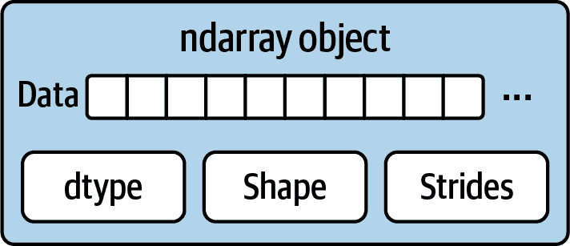
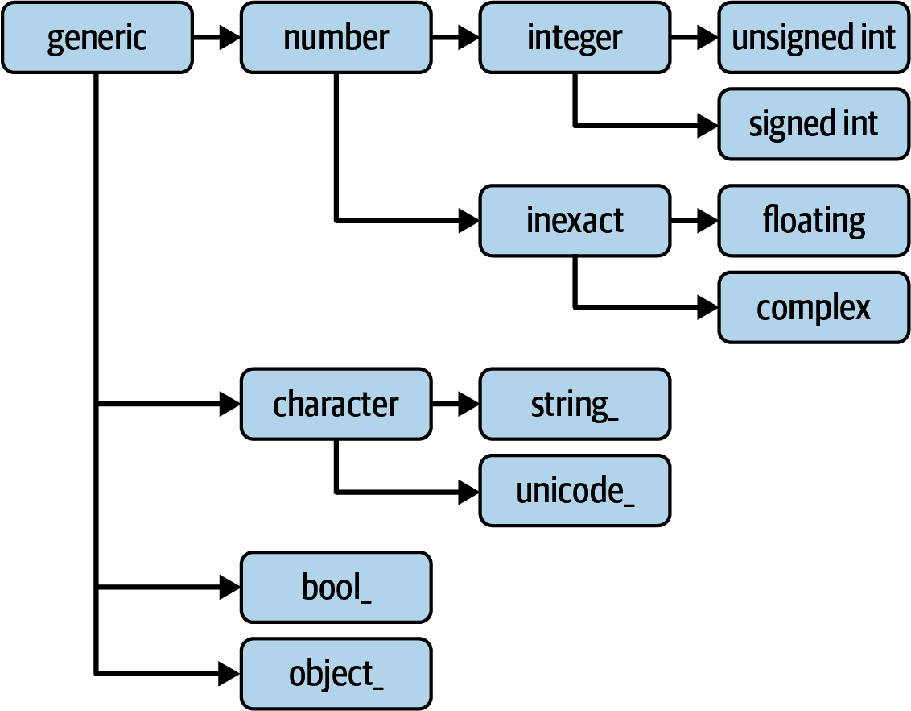
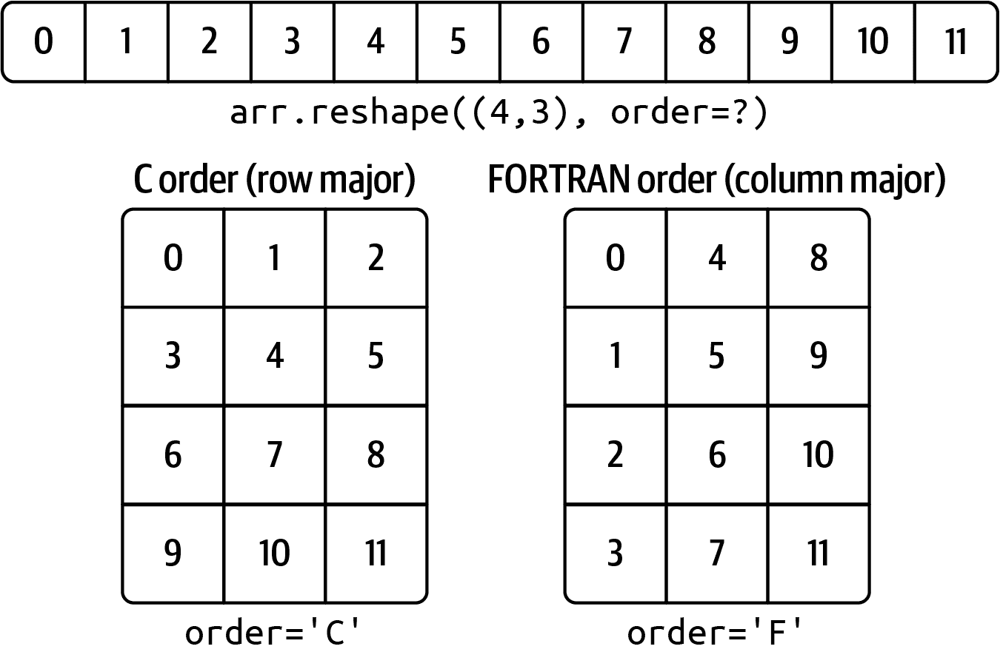
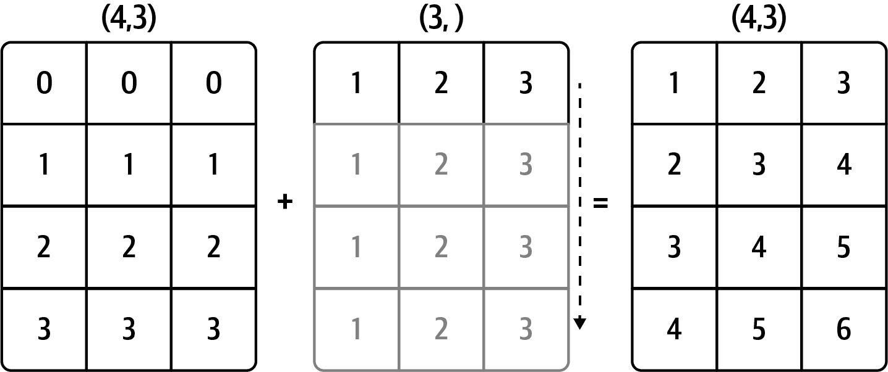
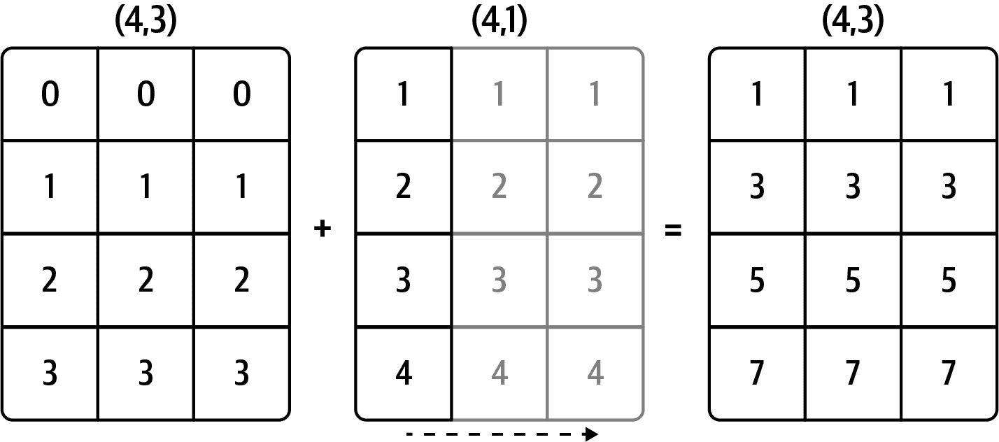
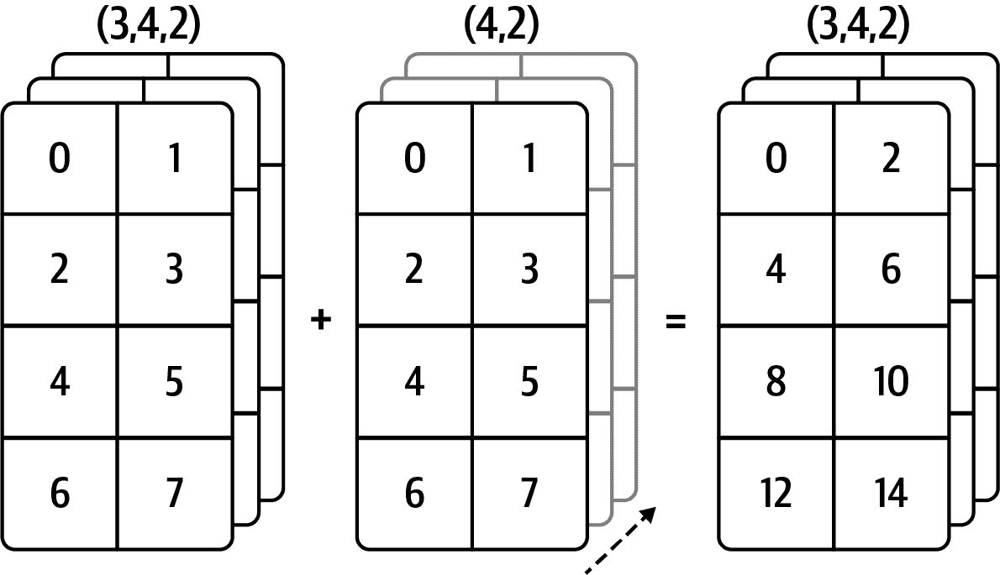
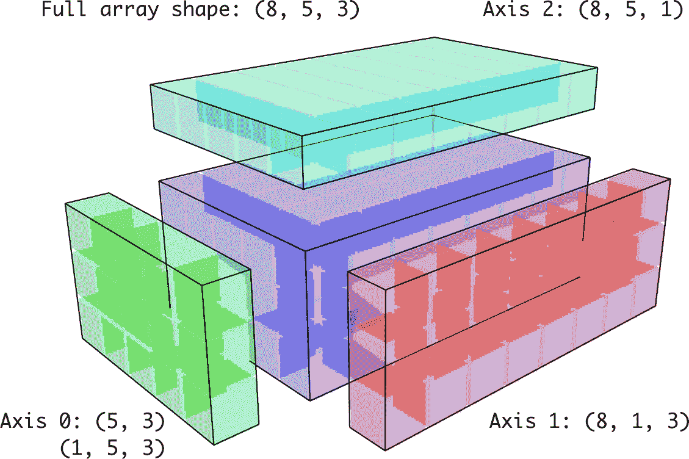

# 附录 A：高级 NumPy

> 原文：[`wesmckinney.com/book/advanced-numpy`](https://wesmckinney.com/book/advanced-numpy)
>
> 译者：[飞龙](https://github.com/wizardforcel)
>
> 协议：[CC BY-NC-SA 4.0](http://creativecommons.org/licenses/by-nc-sa/4.0/)

> 此开放访问网络版本的《Python 数据分析第三版》现已作为[印刷版和数字版](https://amzn.to/3DyLaJc)的伴侣提供。如果您发现任何勘误，请[在此处报告](https://oreilly.com/catalog/0636920519829/errata)。请注意，由 Quarto 生成的本站点的某些方面与 O'Reilly 的印刷版和电子书版本的格式不同。
> 
> 如果您发现本书的在线版本有用，请考虑[订购纸质版](https://amzn.to/3DyLaJc)或[无 DRM 的电子书](https://www.ebooks.com/en-us/book/210644288/python-for-data-analysis/wes-mckinney/?affId=WES398681F)以支持作者。本网站的内容不得复制或再生产。代码示例采用 MIT 许可，可在 GitHub 或 Gitee 上找到。
在这个附录中，我将深入探讨 NumPy 库的数组计算。这将包括有关 ndarray 类型的更多内部细节以及更高级的数组操作和算法。

这个附录包含各种主题，不一定需要按顺序阅读。在各章节中，我将为许多示例生成随机数据，这些示例将使用`numpy.random`模块中的默认随机数生成器：

```py
In [11]: rng = np.random.default_rng(seed=12345)
```

## A.1 ndarray 对象内部

NumPy ndarray 提供了一种将块状同类型数据（连续或分步）解释为多维数组对象的方法。数据类型，或*dtype*，决定了数据被解释为浮点数、整数、布尔值或我们一直在查看的其他类型之一。

ndarray 灵活的部分之一是每个数组对象都是对数据块的*步进*视图。例如，您可能想知道，例如，数组视图`arr[::2, ::-1]`如何不复制任何数据。原因是 ndarray 不仅仅是一块内存和一个数据类型；它还具有*步进*信息，使数组能够以不同的步长在内存中移动。更准确地说，ndarray 内部包含以下内容：

+   一个*数据指针*—即 RAM 中的数据块或内存映射文件

+   描述数组中固定大小值单元的*数据类型*或 dtype

+   一个指示数组*形状*的元组

+   一个*步长*元组—表示在一个维度上前进一个元素所需的字节数

请参见图 A.1 以查看 ndarray 内部的简单模拟。



图 A.1：NumPy ndarray 对象

例如，一个 10×5 的数组将具有形状`(10, 5)`：

```py
In [12]: np.ones((10, 5)).shape
Out[12]: (10, 5)
```

一个典型的（C 顺序）3×4×5 的`float64`（8 字节）值数组具有步长`(160, 40, 8)`（了解步长可以是有用的，因为一般来说，特定轴上的步长越大，沿着该轴执行计算的成本就越高）：

```py
In [13]: np.ones((3, 4, 5), dtype=np.float64).strides
Out[13]: (160, 40, 8)
```

虽然典型的 NumPy 用户很少会对数组的步长感兴趣，但它们需要用来构建“零拷贝”数组视图。步长甚至可以是负数，这使得数组可以在内存中“向后”移动（例如，在像`obj[::-1]`或`obj[:, ::-1]`这样的切片中）。

### NumPy 数据类型层次结构

您可能偶尔需要检查代码是否包含整数、浮点数、字符串或 Python 对象的数组。由于有多种浮点数类型（`float16`到`float128`），检查数据类型是否在类型列表中会非常冗长。幸运的是，数据类型有超类，如`np.integer`和`np.floating`，可以与`np.issubdtype`函数一起使用：

```py
In [14]: ints = np.ones(10, dtype=np.uint16)

In [15]: floats = np.ones(10, dtype=np.float32)

In [16]: np.issubdtype(ints.dtype, np.integer)
Out[16]: True

In [17]: np.issubdtype(floats.dtype, np.floating)
Out[17]: True
```

您可以通过调用类型的`mro`方法查看特定数据类型的所有父类：

```py
In [18]: np.float64.mro()
Out[18]: 
[numpy.float64,
 numpy.floating,
 numpy.inexact,
 numpy.number,
 numpy.generic,
 float,
 object]
```

因此，我们还有：

```py
In [19]: np.issubdtype(ints.dtype, np.number)
Out[19]: True
```

大多数 NumPy 用户永远不需要了解这一点，但有时会有用。请参见图 A.2 以查看数据类型层次结构和父-子类关系的图表。¹



图 A.2：NumPy 数据类型类层次结构

## A.2 高级数组操作

除了花式索引、切片和布尔子集之外，还有许多处理数组的方法。虽然大部分数据分析应用程序的繁重工作由 pandas 中的高级函数处理，但您可能在某个时候需要编写一个在现有库中找不到的数据算法。

### 重新塑形数组

在许多情况下，您可以将一个数组从一种形状转换为另一种形状而不复制任何数据。为此，将表示新形状的元组传递给 `reshape` 数组实例方法。例如，假设我们有一个希望重新排列成矩阵的值的一维数组（这在图 A.3 中有说明）：

```py
In [20]: arr = np.arange(8)

In [21]: arr
Out[21]: array([0, 1, 2, 3, 4, 5, 6, 7])

In [22]: arr.reshape((4, 2))
Out[22]: 
array([[0, 1],
 [2, 3],
 [4, 5],
 [6, 7]])
```



图 A.3：按 C（行主要）或 FORTRAN（列主要）顺序重新塑形

多维数组也可以被重新塑形：

```py
In [23]: arr.reshape((4, 2)).reshape((2, 4))
Out[23]: 
array([[0, 1, 2, 3],
 [4, 5, 6, 7]])
```

传递的形状维度中可以有一个为 -1，在这种情况下，该维度的值将从数据中推断出来：

```py
In [24]: arr = np.arange(15)

In [25]: arr.reshape((5, -1))
Out[25]: 
array([[ 0,  1,  2],
 [ 3,  4,  5],
 [ 6,  7,  8],
 [ 9, 10, 11],
 [12, 13, 14]])
```

由于数组的 `shape` 属性是一个元组，它也可以传递给 `reshape`：

```py
In [26]: other_arr = np.ones((3, 5))

In [27]: other_arr.shape
Out[27]: (3, 5)

In [28]: arr.reshape(other_arr.shape)
Out[28]: 
array([[ 0,  1,  2,  3,  4],
 [ 5,  6,  7,  8,  9],
 [10, 11, 12, 13, 14]])
```

从一维到更高维的 `reshape` 的相反操作通常称为 *展平* 或 *raveling*：

```py
In [29]: arr = np.arange(15).reshape((5, 3))

In [30]: arr
Out[30]: 
array([[ 0,  1,  2],
 [ 3,  4,  5],
 [ 6,  7,  8],
 [ 9, 10, 11],
 [12, 13, 14]])

In [31]: arr.ravel()
Out[31]: array([ 0,  1,  2,  3,  4,  5,  6,  7,  8,  9, 10, 11, 12, 13, 14])
```

如果结果中的值在原始数组中是连续的，`ravel` 不会生成基础值的副本。

`flatten` 方法的行为类似于 `ravel`，只是它总是返回数据的副本：

```py
In [32]: arr.flatten()
Out[32]: array([ 0,  1,  2,  3,  4,  5,  6,  7,  8,  9, 10, 11, 12, 13, 14])
```

数据可以以不同的顺序被重新塑形或展开。这对于新的 NumPy 用户来说是一个略微微妙的主题，因此是下一个子主题。

### C 与 FORTRAN 顺序

NumPy 能够适应内存中数据的许多不同布局。默认情况下，NumPy 数组是按 *行主要* 顺序创建的。从空间上讲，这意味着如果您有一个二维数据数组，数组中每行的项都存储在相邻的内存位置上。与行主要顺序相反的是 *列主要* 顺序，这意味着数据中每列的值都存储在相邻的内存位置上。

出于历史原因，行和列主要顺序也被称为 C 和 FORTRAN 顺序。在 FORTRAN 77 语言中，矩阵都是列主要的。

像 `reshape` 和 `ravel` 这样的函数接受一个 `order` 参数，指示数组中使用数据的顺序。在大多数情况下，这通常设置为 `'C'` 或 `'F'`（还有一些不常用的选项 `'A'` 和 `'K'`；请参阅 NumPy 文档，并参考图 A.3 以了解这些选项的说明）：

```py
In [33]: arr = np.arange(12).reshape((3, 4))

In [34]: arr
Out[34]: 
array([[ 0,  1,  2,  3],
 [ 4,  5,  6,  7],
 [ 8,  9, 10, 11]])

In [35]: arr.ravel()
Out[35]: array([ 0,  1,  2,  3,  4,  5,  6,  7,  8,  9, 10, 11])

In [36]: arr.ravel('F')
Out[36]: array([ 0,  4,  8,  1,  5,  9,  2,  6, 10,  3,  7, 11])
```

使用超过两个维度的数组进行重新塑形可能有点令人费解（参见图 A.3）。C 和 FORTRAN 顺序之间的关键区别在于维度的遍历方式：

C/行主要顺序

在遍历更高维度时，*首先* 遍历（例如，先在轴 1 上再在轴 0 上前进）。

FORTRAN/列主要顺序

在遍历更高维度时，*最后* 遍历（例如，先在轴 0 上再在轴 1 上前进）。

### 连接和分割数组

`numpy.concatenate` 接受一个数组序列（元组，列表等），并按顺序沿着输入轴连接它们：

```py
In [37]: arr1 = np.array([[1, 2, 3], [4, 5, 6]])

In [38]: arr2 = np.array([[7, 8, 9], [10, 11, 12]])

In [39]: np.concatenate([arr1, arr2], axis=0)
Out[39]: 
array([[ 1,  2,  3],
 [ 4,  5,  6],
 [ 7,  8,  9],
 [10, 11, 12]])

In [40]: np.concatenate([arr1, arr2], axis=1)
Out[40]: 
array([[ 1,  2,  3,  7,  8,  9],
 [ 4,  5,  6, 10, 11, 12]])
```

有一些便利函数，如 `vstack` 和 `hstack`，用于常见类型的连接。前面的操作可以表示为：

```py
In [41]: np.vstack((arr1, arr2))
Out[41]: 
array([[ 1,  2,  3],
 [ 4,  5,  6],
 [ 7,  8,  9],
 [10, 11, 12]])

In [42]: np.hstack((arr1, arr2))
Out[42]: 
array([[ 1,  2,  3,  7,  8,  9],
 [ 4,  5,  6, 10, 11, 12]])
```

另一方面，`split` 将数组沿着一个轴分割成多个数组：

```py
In [43]: arr = rng.standard_normal((5, 2))

In [44]: arr
Out[44]: 
array([[-1.4238,  1.2637],
 [-0.8707, -0.2592],
 [-0.0753, -0.7409],
 [-1.3678,  0.6489],
 [ 0.3611, -1.9529]])

In [45]: first, second, third = np.split(arr, [1, 3])

In [46]: first
Out[46]: array([[-1.4238,  1.2637]])

In [47]: second
Out[47]: 
array([[-0.8707, -0.2592],
 [-0.0753, -0.7409]])

In [48]: third
Out[48]: 
array([[-1.3678,  0.6489],
 [ 0.3611, -1.9529]])
```

传递给 `np.split` 的值 `[1, 3]` 指示在哪些索引处将数组分割成片段。

请参见表 A.1 以获取所有相关连接和分割函数的列表，其中一些仅作为非常通用的 `concatenate` 的便利。

表 A.1：数组连接函数

| 函数 | 描述 |
| --- | --- |
| `concatenate` | 最通用的函数，沿一个轴连接数组集合 |
| `vstack, row_stack` | 按行堆叠数组（沿轴 0） |
| `hstack` | 按列堆叠数组（沿轴 1） |
| `column_stack` | 类似于`hstack`，但首先将 1D 数组转换为 2D 列向量 |
| `dstack` | 按“深度”（沿轴 2）堆叠数组 |
| `split` | 沿特定轴在传递位置分割数组 |
| `hsplit`/`vsplit` | 在轴 0 和 1 上分割的便利函数 |

#### 堆叠助手：r_ 和 c_

NumPy 命名空间中有两个特殊对象，`r_`和`c_`，使堆叠数组更简洁：

```py
In [49]: arr = np.arange(6)

In [50]: arr1 = arr.reshape((3, 2))

In [51]: arr2 = rng.standard_normal((3, 2))

In [52]: np.r_[arr1, arr2]
Out[52]: 
array([[ 0.    ,  1.    ],
 [ 2.    ,  3.    ],
 [ 4.    ,  5.    ],
 [ 2.3474,  0.9685],
 [-0.7594,  0.9022],
 [-0.467 , -0.0607]])

In [53]: np.c_[np.r_[arr1, arr2], arr]
Out[53]: 
array([[ 0.    ,  1.    ,  0.    ],
 [ 2.    ,  3.    ,  1.    ],
 [ 4.    ,  5.    ,  2.    ],
 [ 2.3474,  0.9685,  3.    ],
 [-0.7594,  0.9022,  4.    ],
 [-0.467 , -0.0607,  5.    ]])
```

这些还可以将切片转换为数组：

```py
In [54]: np.c_[1:6, -10:-5]
Out[54]: 
array([[  1, -10],
 [  2,  -9],
 [  3,  -8],
 [  4,  -7],
 [  5,  -6]])
```

查看文档字符串以了解您可以使用`c_`和`r_`做什么。

### 重复元素：tile 和 repeat

用于重复或复制数组以生成更大数组的两个有用工具是`repeat`和`tile`函数。`repeat`将数组中的每个元素重复若干次，生成一个更大的数组：

```py
In [55]: arr = np.arange(3)

In [56]: arr
Out[56]: array([0, 1, 2])

In [57]: arr.repeat(3)
Out[57]: array([0, 0, 0, 1, 1, 1, 2, 2, 2])
```

注意

需要复制或重复数组的情况在 NumPy 中可能不像其他数组编程框架（如 MATLAB）中那样常见。其中一个原因是*广播*通常更好地满足这种需求，这是下一节的主题。

默认情况下，如果传递一个整数，每个元素将重复该次数。如果传递一个整数数组，每个元素可以重复不同次数：

```py
In [58]: arr.repeat([2, 3, 4])
Out[58]: array([0, 0, 1, 1, 1, 2, 2, 2, 2])
```

多维数组可以沿特定轴重复其元素：

```py
In [59]: arr = rng.standard_normal((2, 2))

In [60]: arr
Out[60]: 
array([[ 0.7888, -1.2567],
 [ 0.5759,  1.399 ]])

In [61]: arr.repeat(2, axis=0)
Out[61]: 
array([[ 0.7888, -1.2567],
 [ 0.7888, -1.2567],
 [ 0.5759,  1.399 ],
 [ 0.5759,  1.399 ]])
```

请注意，如果没有传递轴，数组将首先被展平，这可能不是您想要的。同样，当重复多维数组以不同次数重复给定切片时，可以传递整数数组：

```py
In [62]: arr.repeat([2, 3], axis=0)
Out[62]: 
array([[ 0.7888, -1.2567],
 [ 0.7888, -1.2567],
 [ 0.5759,  1.399 ],
 [ 0.5759,  1.399 ],
 [ 0.5759,  1.399 ]])

In [63]: arr.repeat([2, 3], axis=1)
Out[63]: 
array([[ 0.7888,  0.7888, -1.2567, -1.2567, -1.2567],
 [ 0.5759,  0.5759,  1.399 ,  1.399 ,  1.399 ]])
```

另一方面，`tile`是一个沿轴堆叠数组副本的快捷方式。在视觉上，您可以将其视为类似于“铺设瓷砖”：

```py
In [64]: arr
Out[64]: 
array([[ 0.7888, -1.2567],
 [ 0.5759,  1.399 ]])

In [65]: np.tile(arr, 2)
Out[65]: 
array([[ 0.7888, -1.2567,  0.7888, -1.2567],
 [ 0.5759,  1.399 ,  0.5759,  1.399 ]])
```

第二个参数是瓷砖的数量；对于标量，瓦片是按行而不是按列进行的。`tile`的第二个参数可以是一个元组，指示“瓦片”的布局：

```py
In [66]: arr
Out[66]: 
array([[ 0.7888, -1.2567],
 [ 0.5759,  1.399 ]])

In [67]: np.tile(arr, (2, 1))
Out[67]: 
array([[ 0.7888, -1.2567],
 [ 0.5759,  1.399 ],
 [ 0.7888, -1.2567],
 [ 0.5759,  1.399 ]])

In [68]: np.tile(arr, (3, 2))
Out[68]: 
array([[ 0.7888, -1.2567,  0.7888, -1.2567],
 [ 0.5759,  1.399 ,  0.5759,  1.399 ],
 [ 0.7888, -1.2567,  0.7888, -1.2567],
 [ 0.5759,  1.399 ,  0.5759,  1.399 ],
 [ 0.7888, -1.2567,  0.7888, -1.2567],
 [ 0.5759,  1.399 ,  0.5759,  1.399 ]])
```

### 花式索引等效：take 和 put

正如您可能从 Ch 4：NumPy 基础：数组和矢量化计算中记得的那样，通过使用整数数组进行*花式*索引来获取和设置数组的子集是一种方法：

```py
In [69]: arr = np.arange(10) * 100

In [70]: inds = [7, 1, 2, 6]

In [71]: arr[inds]
Out[71]: array([700, 100, 200, 600])
```

在仅在单个轴上进行选择的特殊情况下，有一些替代的 ndarray 方法是有用的：

```py
In [72]: arr.take(inds)
Out[72]: array([700, 100, 200, 600])

In [73]: arr.put(inds, 42)

In [74]: arr
Out[74]: array([  0,  42,  42, 300, 400, 500,  42,  42, 800, 900])

In [75]: arr.put(inds, [40, 41, 42, 43])

In [76]: arr
Out[76]: array([  0,  41,  42, 300, 400, 500,  43,  40, 800, 900])
```

要在其他轴上使用`take`，可以传递`axis`关键字：

```py
In [77]: inds = [2, 0, 2, 1]

In [78]: arr = rng.standard_normal((2, 4))

In [79]: arr
Out[79]: 
array([[ 1.3223, -0.2997,  0.9029, -1.6216],
 [-0.1582,  0.4495, -1.3436, -0.0817]])

In [80]: arr.take(inds, axis=1)
Out[80]: 
array([[ 0.9029,  1.3223,  0.9029, -0.2997],
 [-1.3436, -0.1582, -1.3436,  0.4495]])
```

`put`不接受`axis`参数，而是索引到数组的展平（一维，C 顺序）版本。因此，当您需要使用索引数组在其他轴上设置元素时，最好使用基于`[]`的索引。

## A.3 广播

*广播*规定了不同形状数组之间的操作方式。它可以是一个强大的功能，但即使对于有经验的用户也可能会引起混淆。广播的最简单示例是将标量值与数组组合时发生：

```py
In [81]: arr = np.arange(5)

In [82]: arr
Out[82]: array([0, 1, 2, 3, 4])

In [83]: arr * 4
Out[83]: array([ 0,  4,  8, 12, 16])
```

在这里，我们说标量值 4 已经*广播*到乘法操作中的所有其他元素。

例如，我们可以通过减去列均值来对数组的每一列进行去均值处理。在这种情况下，只需要减去包含每列均值的数组即可：

```py
In [84]: arr = rng.standard_normal((4, 3))

In [85]: arr.mean(0)
Out[85]: array([0.1206, 0.243 , 0.1444])

In [86]: demeaned = arr - arr.mean(0)

In [87]: demeaned
Out[87]: 
array([[ 1.6042,  2.3751,  0.633 ],
 [ 0.7081, -1.202 , -1.3538],
 [-1.5329,  0.2985,  0.6076],
 [-0.7793, -1.4717,  0.1132]])

In [88]: demeaned.mean(0)
Out[88]: array([ 0., -0.,  0.])
```

请参见图 A.4 以了解此操作的示例。将行作为广播操作去均值需要更多的注意。幸运的是，跨任何数组维度广播潜在较低维值（例如从二维数组的每列中减去行均值）是可能的，只要遵循规则。

这将我们带到了广播规则。

两个数组在广播时兼容，如果对于每个*尾部维度*（即，从末尾开始），轴的长度匹配，或者长度中的任何一个为 1。然后在缺失或长度为 1 的维度上执行广播。



图 A.4：在 1D 数组的轴 0 上进行广播

即使作为一个经验丰富的 NumPy 用户，我经常发现自己在思考广播规则时不得不停下来画图。考虑最后一个示例，假设我们希望减去每行的平均值。由于`arr.mean(0)`的长度为 3，它在轴 0 上是兼容的进行广播，因为`arr`中的尾部维度为 3，因此匹配。根据规则，要在轴 1 上进行减法（即，从每行减去行均值），较小的数组必须具有形状`(4, 1)`：

```py
In [89]: arr
Out[89]: 
array([[ 1.7247,  2.6182,  0.7774],
 [ 0.8286, -0.959 , -1.2094],
 [-1.4123,  0.5415,  0.7519],
 [-0.6588, -1.2287,  0.2576]])

In [90]: row_means = arr.mean(1)

In [91]: row_means.shape
Out[91]: (4,)

In [92]: row_means.reshape((4, 1))
Out[92]: 
array([[ 1.7068],
 [-0.4466],
 [-0.0396],
 [-0.5433]])

In [93]: demeaned = arr - row_means.reshape((4, 1))

In [94]: demeaned.mean(1)
Out[94]: array([-0.,  0.,  0.,  0.])
```

查看图 A.5 以了解此操作的示例。



图 A.5：在 2D 数组的轴 1 上进行广播

查看图 A.6 以获得另一个示例，这次是在轴 0 上将二维数组添加到三维数组中。



图 A.6：在 3D 数组的轴 0 上进行广播

### 在其他轴上进行广播

使用更高维度数组进行广播可能看起来更加令人费解，但实际上只是遵循规则的问题。如果不遵循规则，就会出现如下错误：

```py
In [95]: arr - arr.mean(1)
---------------------------------------------------------------------------
ValueError                                Traceback (most recent call last)
<ipython-input-95-8b8ada26fac0> in <module>
----> 1 arr - arr.mean(1)
ValueError: operands could not be broadcast together with shapes (4,3) (4,) 
```

通常希望使用低维数组在轴 0 以外的轴上执行算术运算是很常见的。根据广播规则，“广播维度”在较小数组中必须为 1。在这里显示的行减均值示例中，这意味着将行重塑为形状`(4, 1)`而不是`(4,)`：

```py
In [96]: arr - arr.mean(1).reshape((4, 1))
Out[96]: 
array([[ 0.018 ,  0.9114, -0.9294],
 [ 1.2752, -0.5124, -0.7628],
 [-1.3727,  0.5811,  0.7915],
 [-0.1155, -0.6854,  0.8009]])
```

在三维情况下，沿着任何三个维度进行广播只是将数据重塑为兼容形状的问题。图 A.7 很好地可视化了广播到三维数组的每个轴所需的形状。



图 A.7：广播到 3D 数组上的兼容 2D 数组形状

因此，一个常见的问题是需要添加一个新的长度为 1 的新轴，专门用于广播目的。使用`reshape`是一种选择，但插入轴需要构造一个指示新形状的元组。这通常是一项繁琐的工作。因此，NumPy 数组提供了一种特殊的语法，通过索引插入新轴。我们使用特殊的`np.newaxis`属性以及“full”切片来插入新轴：

```py
In [97]: arr = np.zeros((4, 4))

In [98]: arr_3d = arr[:, np.newaxis, :]

In [99]: arr_3d.shape
Out[99]: (4, 1, 4)

In [100]: arr_1d = rng.standard_normal(3)

In [101]: arr_1d[:, np.newaxis]
Out[101]: 
array([[ 0.3129],
 [-0.1308],
 [ 1.27  ]])

In [102]: arr_1d[np.newaxis, :]
Out[102]: array([[ 0.3129, -0.1308,  1.27  ]])
```

因此，如果我们有一个三维数组并且希望减去轴 2 的均值，我们需要编写：

```py
In [103]: arr = rng.standard_normal((3, 4, 5))

In [104]: depth_means = arr.mean(2)

In [105]: depth_means
Out[105]: 
array([[ 0.0431,  0.2747, -0.1885, -0.2014],
 [-0.5732, -0.5467,  0.1183, -0.6301],
 [ 0.0972,  0.5954,  0.0331, -0.6002]])

In [106]: depth_means.shape
Out[106]: (3, 4)

In [107]: demeaned = arr - depth_means[:, :, np.newaxis]

In [108]: demeaned.mean(2)
Out[108]: 
array([[ 0., -0.,  0., -0.],
 [ 0., -0., -0., -0.],
 [ 0.,  0.,  0.,  0.]])
```

您可能想知道是否有一种方法可以在不牺牲性能的情况下推广沿轴的减均值操作。有，但需要一些索引技巧：

```py
def demean_axis(arr, axis=0):
 means = arr.mean(axis)

 # This generalizes things like [:, :, np.newaxis] to N dimensions
 indexer = [slice(None)] * arr.ndim
 indexer[axis] = np.newaxis
 return arr - means[indexer]
```

### 通过广播设置数组值

控制算术运算的相同广播规则也适用于通过数组索引设置值。在简单情况下，我们可以做如下操作：

```py
In [109]: arr = np.zeros((4, 3))

In [110]: arr[:] = 5

In [111]: arr
Out[111]: 
array([[5., 5., 5.],
 [5., 5., 5.],
 [5., 5., 5.],
 [5., 5., 5.]])
```

但是，如果我们有一个要设置到数组列中的值的一维数组，只要形状兼容，我们就可以这样做：

```py
In [112]: col = np.array([1.28, -0.42, 0.44, 1.6])

In [113]: arr[:] = col[:, np.newaxis]

In [114]: arr
Out[114]: 
array([[ 1.28,  1.28,  1.28],
 [-0.42, -0.42, -0.42],
 [ 0.44,  0.44,  0.44],
 [ 1.6 ,  1.6 ,  1.6 ]])

In [115]: arr[:2] = [[-1.37], [0.509]]

In [116]: arr
Out[116]: 
array([[-1.37 , -1.37 , -1.37 ],
 [ 0.509,  0.509,  0.509],
 [ 0.44 ,  0.44 ,  0.44 ],
 [ 1.6  ,  1.6  ,  1.6  ]])
```

## A.4 高级 ufunc 用法

虽然许多 NumPy 用户只会使用通用函数提供的快速逐元素操作，但偶尔一些附加功能可以帮助您编写更简洁的代码，而无需显式循环。

### ufunc 实例方法

NumPy 的每个二进制 ufunc 都有特殊的方法来执行某些特定类型的特殊向量化操作。这些方法在表 A.2 中进行了总结，但我将给出一些具体示例来说明它们的工作原理。

`reduce`接受一个数组并通过执行一系列二进制操作（可选地沿轴）来聚合其值。例如，在数组中求和元素的另一种方法是使用`np.add.reduce`：

```py
In [117]: arr = np.arange(10)

In [118]: np.add.reduce(arr)
Out[118]: 45

In [119]: arr.sum()
Out[119]: 45
```

起始值（例如，`add`的 0）取决于 ufunc。如果传递了轴，将沿着该轴执行减少。这使您能够以简洁的方式回答某些类型的问题。作为一个不那么平凡的例子，我们可以使用`np.logical_and`来检查数组的每一行中的值是否已排序：

```py
In [120]: my_rng = np.random.default_rng(12346)  # for reproducibility

In [121]: arr = my_rng.standard_normal((5, 5))

In [122]: arr
Out[122]: 
array([[-0.9039,  0.1571,  0.8976, -0.7622, -0.1763],
 [ 0.053 , -1.6284, -0.1775,  1.9636,  1.7813],
 [-0.8797, -1.6985, -1.8189,  0.119 , -0.4441],
 [ 0.7691, -0.0343,  0.3925,  0.7589, -0.0705],
 [ 1.0498,  1.0297, -0.4201,  0.7863,  0.9612]])

In [123]: arr[::2].sort(1) # sort a few rows

In [124]: arr[:, :-1] < arr[:, 1:]
Out[124]: 
array([[ True,  True,  True,  True],
 [False,  True,  True, False],
 [ True,  True,  True,  True],
 [False,  True,  True, False],
 [ True,  True,  True,  True]])

In [125]: np.logical_and.reduce(arr[:, :-1] < arr[:, 1:], axis=1)
Out[125]: array([ True, False,  True, False,  True])
```

请注意，`logical_and.reduce`等同于`all`方法。

`accumulate` ufunc 方法与`reduce`相关，就像`cumsum`与`sum`相关一样。它生成一个与中间“累积”值大小相同的数组：

```py
In [126]: arr = np.arange(15).reshape((3, 5))

In [127]: np.add.accumulate(arr, axis=1)
Out[127]: 
array([[ 0,  1,  3,  6, 10],
 [ 5, 11, 18, 26, 35],
 [10, 21, 33, 46, 60]])
```

`outer`在两个数组之间执行成对的叉积：

```py
In [128]: arr = np.arange(3).repeat([1, 2, 2])

In [129]: arr
Out[129]: array([0, 1, 1, 2, 2])

In [130]: np.multiply.outer(arr, np.arange(5))
Out[130]: 
array([[0, 0, 0, 0, 0],
 [0, 1, 2, 3, 4],
 [0, 1, 2, 3, 4],
 [0, 2, 4, 6, 8],
 [0, 2, 4, 6, 8]])
```

`outer`的输出将具有输入维度的连接：

```py
In [131]: x, y = rng.standard_normal((3, 4)), rng.standard_normal(5)

In [132]: result = np.subtract.outer(x, y)

In [133]: result.shape
Out[133]: (3, 4, 5)
```

最后一个方法，`reduceat`，执行“本地减少”，本质上是一个数组“分组”操作，其中数组的切片被聚合在一起。它接受指示如何拆分和聚合值的“bin 边缘”序列：

```py
In [134]: arr = np.arange(10)

In [135]: np.add.reduceat(arr, [0, 5, 8])
Out[135]: array([10, 18, 17])
```

结果是在`arr[0:5]`，`arr[5:8]`和`arr[8:]`上执行的减少（这里是求和）。与其他方法一样，您可以传递一个`axis`参数：

```py
In [136]: arr = np.multiply.outer(np.arange(4), np.arange(5))

In [137]: arr
Out[137]: 
array([[ 0,  0,  0,  0,  0],
 [ 0,  1,  2,  3,  4],
 [ 0,  2,  4,  6,  8],
 [ 0,  3,  6,  9, 12]])

In [138]: np.add.reduceat(arr, [0, 2, 4], axis=1)
Out[138]: 
array([[ 0,  0,  0],
 [ 1,  5,  4],
 [ 2, 10,  8],
 [ 3, 15, 12]])
```

请参见表 A.2 以获取 ufunc 方法的部分列表。

表 A.2：ufunc 方法

| 方法 | 描述 |
| --- | --- |
| `accumulate(x)` | 聚合值，保留所有部分聚合。 |
| `at(x, indices, b=None)` | 在指定的索引处对`x`执行操作。参数`b`是需要两个数组输入的 ufunc 的第二个输入。 |
| `reduce(x)` | 通过连续应用操作来聚合值。 |
| `reduceat(x, bins)` | “本地”减少或“分组”；减少数据的连续切片以生成聚合数组。 |
| `outer(x, y)` | 将操作应用于`x`和`y`中所有元素对；生成的数组形状为`x.shape + y.shape`。 |

### 用 Python 编写新的 ufuncs

有许多创建自己的 NumPy ufuncs 的方法。最通用的方法是使用 NumPy C API，但这超出了本书的范围。在本节中，我们将看一下纯 Python ufuncs。

`numpy.frompyfunc`接受一个 Python 函数以及输入和输出数量的规范。例如，一个简单的逐元素相加的函数将被指定为：

```py
In [139]: def add_elements(x, y):
 .....:     return x + y

In [140]: add_them = np.frompyfunc(add_elements, 2, 1)

In [141]: add_them(np.arange(8), np.arange(8))
Out[141]: array([0, 2, 4, 6, 8, 10, 12, 14], dtype=object)
```

使用`frompyfunc`创建的函数始终返回 Python 对象的数组，这可能不方便。幸运的是，还有一种替代（但功能稍逊一筹）的函数`numpy.vectorize`，允许您指定输出类型：

```py
In [142]: add_them = np.vectorize(add_elements, otypes=[np.float64])

In [143]: add_them(np.arange(8), np.arange(8))
Out[143]: array([ 0.,  2.,  4.,  6.,  8., 10., 12., 14.])
```

这些函数提供了一种创建类似 ufunc 函数的方法，但它们非常慢，因为它们需要调用 Python 函数来计算每个元素，这比 NumPy 的基于 C 的 ufunc 循环慢得多：

```py
In [144]: arr = rng.standard_normal(10000)

In [145]: %timeit add_them(arr, arr)
1.18 ms +- 14.8 us per loop (mean +- std. dev. of 7 runs, 1000 loops each)

In [146]: %timeit np.add(arr, arr)
2.8 us +- 64.1 ns per loop (mean +- std. dev. of 7 runs, 100000 loops each)
```

在本附录的后面，我们将展示如何使用[Numba 库](http://numba.pydata.org)在 Python 中创建快速的 ufuncs。

## A.5 结构化和记录数组

到目前为止，您可能已经注意到 ndarray 是一个*同质*数据容器；也就是说，它表示一个内存块，其中每个元素占据相同数量的字节，由数据类型确定。表面上，这似乎不允许您表示异构或表格数据。*结构化*数组是一个 ndarray，其中每个元素可以被视为表示 C 中的*struct*（因此称为“结构化”名称）或 SQL 表中具有多个命名字段的行：

```py
In [147]: dtype = [('x', np.float64), ('y', np.int32)]

In [148]: sarr = np.array([(1.5, 6), (np.pi, -2)], dtype=dtype)

In [149]: sarr
Out[149]: array([(1.5   ,  6), (3.1416, -2)], dtype=[('x', '<f8'), ('y', '<i4')])
```

有几种指定结构化数据类型的方法（请参阅在线 NumPy 文档）。一种典型的方法是作为具有`(field_name, field_data_type)`的元组列表。现在，数组的元素是类似元组的对象，其元素可以像字典一样访问：

```py
In [150]: sarr[0]
Out[150]: (1.5, 6)

In [151]: sarr[0]['y']
Out[151]: 6
```

字段名称存储在`dtype.names`属性中。当您访问结构化数组上的字段时，会返回数据的跨度视图，因此不会复制任何内容：

```py
In [152]: sarr['x']
Out[152]: array([1.5   , 3.1416])
```

### 嵌套数据类型和多维字段

在指定结构化数据类型时，您还可以传递一个形状（作为 int 或元组）：

```py
In [153]: dtype = [('x', np.int64, 3), ('y', np.int32)]

In [154]: arr = np.zeros(4, dtype=dtype)

In [155]: arr
Out[155]: 
array([([0, 0, 0], 0), ([0, 0, 0], 0), ([0, 0, 0], 0), ([0, 0, 0], 0)],
 dtype=[('x', '<i8', (3,)), ('y', '<i4')])
```

在这种情况下，`x`字段现在指的是每个记录的长度为 3 的数组：

```py
In [156]: arr[0]['x']
Out[156]: array([0, 0, 0])
```

方便的是，访问`arr['x']`然后返回一个二维数组，而不是像之前的例子中那样返回一个一维数组：

```py
In [157]: arr['x']
Out[157]: 
array([[0, 0, 0],
 [0, 0, 0],
 [0, 0, 0],
 [0, 0, 0]])
```

这使您能够将更复杂的嵌套结构表达为数组中的单个内存块。您还可以嵌套数据类型以创建更复杂的结构。这里是一个例子：

```py
In [158]: dtype = [('x', [('a', 'f8'), ('b', 'f4')]), ('y', np.int32)]

In [159]: data = np.array([((1, 2), 5), ((3, 4), 6)], dtype=dtype)

In [160]: data['x']
Out[160]: array([(1., 2.), (3., 4.)], dtype=[('a', '<f8'), ('b', '<f4')])

In [161]: data['y']
Out[161]: array([5, 6], dtype=int32)

In [162]: data['x']['a']
Out[162]: array([1., 3.])
```

pandas DataFrame 并不以相同的方式支持这个特性，尽管它类似于分层索引。

### 为什么使用结构化数组？

与 pandas DataFrame 相比，NumPy 结构化数组是一个更低级别的工具。它们提供了一种将内存块解释为具有嵌套列的表格结构的方法。由于数组中的每个元素在内存中表示为固定数量的字节，结构化数组提供了一种有效的方式来将数据写入磁盘（包括内存映射）、通过网络传输数据以及其他类似用途。结构化数组中每个值的内存布局基于 C 编程语言中 struct 数据类型的二进制表示。

作为结构化数组的另一个常见用途，将数据文件写为固定长度记录字节流是在工业中的遗留系统中有时会发现的一种序列化数据的常见方式。只要文件的格式已知（每个记录的大小以及每个元素的顺序、字节大小和数据类型），数据就可以通过`np.fromfile`读入内存。像这样的专用用途超出了本书的范围，但值得知道这样的事情是可能的。

## A.6 更多关于排序的内容

与 Python 内置列表类似，ndarray 的`sort`实例方法是一种*原地*排序，这意味着数组内容会被重新排列而不会产生新数组：

```py
In [163]: arr = rng.standard_normal(6)

In [164]: arr.sort()

In [165]: arr
Out[165]: array([-1.1553, -0.9319, -0.5218, -0.4745, -0.1649,  0.03  ])
```

在原地对数组进行排序时，请记住，如果数组是对不同 ndarray 的视图，则原始数组将被修改：

```py
In [166]: arr = rng.standard_normal((3, 5))

In [167]: arr
Out[167]: 
array([[-1.1956,  0.4691, -0.3598,  1.0359,  0.2267],
 [-0.7448, -0.5931, -1.055 , -0.0683,  0.458 ],
 [-0.07  ,  0.1462, -0.9944,  1.1436,  0.5026]])

In [168]: arr[:, 0].sort()  # Sort first column values in place

In [169]: arr
Out[169]: 
array([[-1.1956,  0.4691, -0.3598,  1.0359,  0.2267],
 [-0.7448, -0.5931, -1.055 , -0.0683,  0.458 ],
 [-0.07  ,  0.1462, -0.9944,  1.1436,  0.5026]])
```

另一方面，`numpy.sort`会创建一个新的、排序后的数组副本。否则，它接受与 ndarray 的`sort`方法相同的参数（如`kind`）：

```py
In [170]: arr = rng.standard_normal(5)

In [171]: arr
Out[171]: array([ 0.8981, -1.1704, -0.2686, -0.796 ,  1.4522])

In [172]: np.sort(arr)
Out[172]: array([-1.1704, -0.796 , -0.2686,  0.8981,  1.4522])

In [173]: arr
Out[173]: array([ 0.8981, -1.1704, -0.2686, -0.796 ,  1.4522])
```

所有这些排序方法都接受一个轴参数，用于独立地对沿传递的轴的数据部分进行排序：

```py
In [174]: arr = rng.standard_normal((3, 5))

In [175]: arr
Out[175]: 
array([[-0.2535,  2.1183,  0.3634, -0.6245,  1.1279],
 [ 1.6164, -0.2287, -0.6201, -0.1143, -1.2067],
 [-1.0872, -2.1518, -0.6287, -1.3199,  0.083 ]])

In [176]: arr.sort(axis=1)

In [177]: arr
Out[177]: 
array([[-0.6245, -0.2535,  0.3634,  1.1279,  2.1183],
 [-1.2067, -0.6201, -0.2287, -0.1143,  1.6164],
 [-2.1518, -1.3199, -1.0872, -0.6287,  0.083 ]])
```

您可能会注意到，所有排序方法都没有选项以降序排序。这在实践中是一个问题，因为数组切片会产生视图，因此不会产生副本或需要任何计算工作。许多 Python 用户熟悉“技巧”，即对于`values`列表，`values[::-1]`返回一个反向排序的列表。对于 ndarrays 也是如此：

```py
In [178]: arr[:, ::-1]
Out[178]: 
array([[ 2.1183,  1.1279,  0.3634, -0.2535, -0.6245],
 [ 1.6164, -0.1143, -0.2287, -0.6201, -1.2067],
 [ 0.083 , -0.6287, -1.0872, -1.3199, -2.1518]])
```

### 间接排序：argsort 和 lexsort

在数据分析中，您可能需要按一个或多个键重新排序数据集。例如，关于一些学生的数据表可能需要按姓氏排序，然后按名字排序。这是一个*间接*排序的例子，如果您已经阅读了与 pandas 相关的章节，您已经看到了许多更高级的例子。给定一个键或键（一个值数组或多个值数组），您希望获得一个整数*索引*数组（我口头上称之为*索引器*），告诉您如何重新排序数据以使其按排序顺序排列。这种情况下的两种方法是`argsort`和`numpy.lexsort`。例如：

```py
In [179]: values = np.array([5, 0, 1, 3, 2])

In [180]: indexer = values.argsort()

In [181]: indexer
Out[181]: array([1, 2, 4, 3, 0])

In [182]: values[indexer]
Out[182]: array([0, 1, 2, 3, 5])
```

作为一个更复杂的例子，这段代码通过其第一行重新排序一个二维数组：

```py
In [183]: arr = rng.standard_normal((3, 5))

In [184]: arr[0] = values

In [185]: arr
Out[185]: 
array([[ 5.    ,  0.    ,  1.    ,  3.    ,  2.    ],
 [-0.7503, -2.1268, -1.391 , -0.4922,  0.4505],
 [ 0.8926, -1.0479,  0.9553,  0.2936,  0.5379]])

In [186]: arr[:, arr[0].argsort()]
Out[186]: 
array([[ 0.    ,  1.    ,  2.    ,  3.    ,  5.    ],
 [-2.1268, -1.391 ,  0.4505, -0.4922, -0.7503],
 [-1.0479,  0.9553,  0.5379,  0.2936,  0.8926]])
```

`lexsort`类似于`argsort`，但它对多个关键数组执行间接的*词典排序。假设我们想要按名字和姓氏对一些数据进行排序：

```py
In [187]: first_name = np.array(['Bob', 'Jane', 'Steve', 'Bill', 'Barbara'])

In [188]: last_name = np.array(['Jones', 'Arnold', 'Arnold', 'Jones', 'Walters'])

In [189]: sorter = np.lexsort((first_name, last_name))

In [190]: sorter
Out[190]: array([1, 2, 3, 0, 4])

In [191]: list(zip(last_name[sorter], first_name[sorter]))
Out[191]: 
[('Arnold', 'Jane'),
 ('Arnold', 'Steve'),
 ('Jones', 'Bill'),
 ('Jones', 'Bob'),
 ('Walters', 'Barbara')]
```

第一次使用`lexsort`可能会有点困惑，因为用于对数据排序的键的顺序是从传递的*最后*数组开始的。在这里，`last_name`在`first_name`之前使用。

### 替代排序算法

*稳定*排序算法保留相等元素的相对位置。这在相对排序有意义的间接排序中尤为重要：

```py
In [192]: values = np.array(['2:first', '2:second', '1:first', '1:second',
 .....:                    '1:third'])

In [193]: key = np.array([2, 2, 1, 1, 1])

In [194]: indexer = key.argsort(kind='mergesort')

In [195]: indexer
Out[195]: array([2, 3, 4, 0, 1])

In [196]: values.take(indexer)
Out[196]: 
array(['1:first', '1:second', '1:third', '2:first', '2:second'],
 dtype='<U8')
```

唯一可用的稳定排序是*mergesort*，它保证了`O(n log n)`的性能，但其性能平均而言比默认的 quicksort 方法差。请参见表 A.3 以获取可用方法及其相对性能（和性能保证）的摘要。这不是大多数用户需要考虑的事情，但知道它存在是有用的。

表 A.3：数组排序方法

| 类型 | 速度 | 稳定性 | 工作空间 | 最坏情况 |
| --- | --- | --- | --- | --- |
| `'quicksort'` | 1 | 否 | 0 | `O(n²)` |
| `'mergesort'` | 2 | 是 | `n / 2` | `O(n log n)` |
| `'heapsort'` | 3 | 否 | 0 | `O(n log n)` |

### 部分排序数组

排序的目标之一可以是确定数组中最大或最小的元素。NumPy 有快速方法`numpy.partition`和`np.argpartition`，用于围绕第`k`个最小元素对数组进行分区：

```py
In [197]: rng = np.random.default_rng(12345)

In [198]: arr = rng.standard_normal(20)

In [199]: arr
Out[199]: 
array([-1.4238,  1.2637, -0.8707, -0.2592, -0.0753, -0.7409, -1.3678,
 0.6489,  0.3611, -1.9529,  2.3474,  0.9685, -0.7594,  0.9022,
 -0.467 , -0.0607,  0.7888, -1.2567,  0.5759,  1.399 ])

In [200]: np.partition(arr, 3)
Out[200]: 
array([-1.9529, -1.4238, -1.3678, -1.2567, -0.8707, -0.7594, -0.7409,
 -0.0607,  0.3611, -0.0753, -0.2592, -0.467 ,  0.5759,  0.9022,
 0.9685,  0.6489,  0.7888,  1.2637,  1.399 ,  2.3474])
```

调用`partition(arr, 3)`后，结果中的前三个元素是任意顺序中最小的三个值。`numpy.argpartition`类似于`numpy.argsort`，返回重新排列数据为等效顺序的索引：

```py
In [201]: indices = np.argpartition(arr, 3)

In [202]: indices
Out[202]: 
array([ 9,  0,  6, 17,  2, 12,  5, 15,  8,  4,  3, 14, 18, 13, 11,  7, 16,
 1, 19, 10])

In [203]: arr.take(indices)
Out[203]: 
array([-1.9529, -1.4238, -1.3678, -1.2567, -0.8707, -0.7594, -0.7409,
 -0.0607,  0.3611, -0.0753, -0.2592, -0.467 ,  0.5759,  0.9022,
 0.9685,  0.6489,  0.7888,  1.2637,  1.399 ,  2.3474])
```

### numpy.searchsorted: 在排序数组中查找元素

`searchsorted`是一个数组方法，对排序数组执行二分查找，返回值需要插入以保持排序的数组中的位置：

```py
In [204]: arr = np.array([0, 1, 7, 12, 15])

In [205]: arr.searchsorted(9)
Out[205]: 3
```

您还可以传递一个值数组，以获取一个索引数组：

```py
In [206]: arr.searchsorted([0, 8, 11, 16])
Out[206]: array([0, 3, 3, 5])
```

您可能已经注意到`searchsorted`对于`0`元素返回了`0`。这是因为默认行为是返回相等值组的左侧的索引：

```py
In [207]: arr = np.array([0, 0, 0, 1, 1, 1, 1])

In [208]: arr.searchsorted([0, 1])
Out[208]: array([0, 3])

In [209]: arr.searchsorted([0, 1], side='right')
Out[209]: array([3, 7])
```

作为`searchsorted`的另一个应用，假设我们有一个值在 0 到 10,000 之间的数组，以及一个我们想要用来对数据进行分箱的单独的“桶边缘”数组：

```py
In [210]: data = np.floor(rng.uniform(0, 10000, size=50))

In [211]: bins = np.array([0, 100, 1000, 5000, 10000])

In [212]: data
Out[212]: 
array([ 815., 1598., 3401., 4651., 2664., 8157., 1932., 1294.,  916.,
 5985., 8547., 6016., 9319., 7247., 8605., 9293., 5461., 9376.,
 4949., 2737., 4517., 6650., 3308., 9034., 2570., 3398., 2588.,
 3554.,   50., 6286., 2823.,  680., 6168., 1763., 3043., 4408.,
 1502., 2179., 4743., 4763., 2552., 2975., 2790., 2605., 4827.,
 2119., 4956., 2462., 8384., 1801.])
```

然后，为了确定每个数据点属于哪个区间（其中 1 表示桶`[0, 100)`），我们可以简单地使用`searchsorted`：

```py
In [213]: labels = bins.searchsorted(data)

In [214]: labels
Out[214]: 
array([2, 3, 3, 3, 3, 4, 3, 3, 2, 4, 4, 4, 4, 4, 4, 4, 4, 4, 3, 3, 3, 4,
 3, 4, 3, 3, 3, 3, 1, 4, 3, 2, 4, 3, 3, 3, 3, 3, 3, 3, 3, 3, 3, 3,
 3, 3, 3, 3, 4, 3])
```

这与 pandas 的`groupby`结合使用，可以用于对数据进行分箱：

```py
In [215]: pd.Series(data).groupby(labels).mean()
Out[215]: 
1      50.000000
2     803.666667
3    3079.741935
4    7635.200000
dtype: float64
```

## 使用 Numba 编写快速 NumPy 函数

[Numba](http://numba.pydata.org) 是一个开源项目，使用 CPU、GPU 或其他硬件为类似 NumPy 的数据创建快速函数。它使用[LLVM Project](http://llvm.org/)将 Python 代码转换为编译后的机器代码。

为了介绍 Numba，让我们考虑一个纯 Python 函数，使用`for`循环计算表达式`(x - y).mean()`：

```py
import numpy as np

def mean_distance(x, y):
 nx = len(x)
 result = 0.0
 count = 0
 for i in range(nx):
 result += x[i] - y[i]
 count += 1
 return result / count
```

这个函数很慢：

```py
In [209]: x = rng.standard_normal(10_000_000)

In [210]: y = rng.standard_normal(10_000_000)

In [211]: %timeit mean_distance(x, y)
1 loop, best of 3: 2 s per loop

In [212]: %timeit (x - y).mean()
100 loops, best of 3: 14.7 ms per loop
```

NumPy 版本快了 100 多倍。我们可以使用`numba.jit`函数将此函数转换为编译后的 Numba 函数：

```py
In [213]: import numba as nb

In [214]: numba_mean_distance = nb.jit(mean_distance)
```

我们也可以将其编写为装饰器：

```py
@nb.jit
def numba_mean_distance(x, y):
 nx = len(x)
 result = 0.0
 count = 0
 for i in range(nx):
 result += x[i] - y[i]
 count += 1
 return result / count
```

结果函数实际上比矢量化的 NumPy 版本更快：

```py
In [215]: %timeit numba_mean_distance(x, y)
100 loops, best of 3: 10.3 ms per loop
```

Numba 无法编译所有纯 Python 代码，但它支持 Python 的一个重要子集，对于编写数值算法非常有用。

Numba 是一个深度库，支持不同类型的硬件、编译模式和用户扩展。它还能够编译 NumPy Python API 的一个重要子集，而无需显式的`for`循环。Numba 能够识别可以编译为机器代码的结构，同时替换对 CPython API 的调用，以便编译它不知道如何编译的函数。Numba 的`jit`函数选项`nopython=True`将允许的代码限制为可以在没有任何 Python C API 调用的情况下编译为 LLVM 的 Python 代码。`jit(nopython=True)`有一个更短的别名，`numba.njit`。

在前面的示例中，我们可以这样写：

```py
from numba import float64, njit

@njit(float64(float64[:], float64[:]))
def mean_distance(x, y):
 return (x - y).mean()
```

我鼓励您通过阅读[Numba 的在线文档](http://numba.pydata.org/)来了解更多。下一节将展示创建自定义 NumPy ufunc 对象的示例。

### 使用 Numba 创建自定义 numpy.ufunc 对象

`numba.vectorize`函数创建了编译后的 NumPy ufuncs，行为类似于内置的 ufuncs。让我们考虑一个`numpy.add`的 Python 实现：

```py
from numba import vectorize

@vectorize
def nb_add(x, y):
 return x + y
```

现在我们有：

```py
In [13]: x = np.arange(10)

In [14]: nb_add(x, x)
Out[14]: array([  0.,   2.,   4.,   6.,   8.,  10.,  12.,  14.,  16.,  18.])

In [15]: nb_add.accumulate(x, 0)
Out[15]: array([  0.,   1.,   3.,   6.,  10.,  15.,  21.,  28.,  36.,  45.])
```

## 高级数组输入和输出

在 Ch 4: NumPy 基础：数组和矢量化计算中，我们熟悉了`np.save`和`np.load`用于将数组以二进制格式存储在磁盘上。还有一些其他更复杂用途的选项需要考虑。特别是，内存映射还具有额外的好处，使您能够对不适合 RAM 的数据集执行某些操作。

### 内存映射文件

*内存映射*文件是一种与磁盘上的二进制数据交互的方法，就好像它存储在内存中的数组中一样。NumPy 实现了一个类似 ndarray 的`memmap`对象，使得可以在不将整个数组读入内存的情况下读取和写入大文件的小段。此外，`memmap`具有与内存中数组相同的方法，因此可以替换许多算法中预期的 ndarray 的地方。

要创建新的内存映射，请使用函数`np.memmap`并传递文件路径、数据类型、形状和文件模式：

```py
In [217]: mmap = np.memmap('mymmap', dtype='float64', mode='w+',
 .....:                  shape=(10000, 10000))

In [218]: mmap
Out[218]: 
memmap([[0., 0., 0., ..., 0., 0., 0.],
 [0., 0., 0., ..., 0., 0., 0.],
 [0., 0., 0., ..., 0., 0., 0.],
 ...,
 [0., 0., 0., ..., 0., 0., 0.],
 [0., 0., 0., ..., 0., 0., 0.],
 [0., 0., 0., ..., 0., 0., 0.]])
```

对`memmap`进行切片会返回磁盘上数据的视图：

```py
In [219]: section = mmap[:5]
```

如果将数据分配给这些对象，它将被缓冲在内存中，这意味着如果您在不同的应用程序中读取文件，更改将不会立即反映在磁盘文件中。可以通过调用`flush`将任何修改同步到磁盘：

```py
In [220]: section[:] = rng.standard_normal((5, 10000))

In [221]: mmap.flush()

In [222]: mmap
Out[222]: 
memmap([[-0.9074, -1.0954,  0.0071, ...,  0.2753, -1.1641,  0.8521],
 [-0.0103, -0.0646, -1.0615, ..., -1.1003,  0.2505,  0.5832],
 [ 0.4583,  1.2992,  1.7137, ...,  0.8691, -0.7889, -0.2431],
 ...,
 [ 0.    ,  0.    ,  0.    , ...,  0.    ,  0.    ,  0.    ],
 [ 0.    ,  0.    ,  0.    , ...,  0.    ,  0.    ,  0.    ],
 [ 0.    ,  0.    ,  0.    , ...,  0.    ,  0.    ,  0.    ]])

In [223]: del mmap
```

当内存映射超出范围并被垃圾回收时，任何更改也将刷新到磁盘。*打开现有内存映射*时，仍然必须指定数据类型和形状，因为文件只是一个没有任何数据类型信息、形状或步幅的二进制数据块：

```py
In [224]: mmap = np.memmap('mymmap', dtype='float64', shape=(10000, 10000))

In [225]: mmap
Out[225]: 
memmap([[-0.9074, -1.0954,  0.0071, ...,  0.2753, -1.1641,  0.8521],
 [-0.0103, -0.0646, -1.0615, ..., -1.1003,  0.2505,  0.5832],
 [ 0.4583,  1.2992,  1.7137, ...,  0.8691, -0.7889, -0.2431],
 ...,
 [ 0.    ,  0.    ,  0.    , ...,  0.    ,  0.    ,  0.    ],
 [ 0.    ,  0.    ,  0.    , ...,  0.    ,  0.    ,  0.    ],
 [ 0.    ,  0.    ,  0.    , ...,  0.    ,  0.    ,  0.    ]])
```

内存映射也适用于结构化或嵌套数据类型，如结构化和记录数组中所述。

如果您在计算机上运行此示例，可能希望删除我们上面创建的大文件：

```py
In [226]: %xdel mmap

In [227]: !rm mymmap
```

### HDF5 和其他数组存储选项

PyTables 和 h5py 是两个 Python 项目，提供了与 NumPy 兼容的接口，用于以高效和可压缩的 HDF5 格式（HDF 代表*分层数据格式*）存储数组数据。您可以安全地将数百吉字节甚至数千吉字节的数据存储在 HDF5 格式中。要了解如何在 Python 中使用 HDF5，我建议阅读[pandas 在线文档](http://pandas.pydata.org)。

## 性能提示

将数据处理代码调整为使用 NumPy 通常会使事情变得更快，因为数组操作通常会取代否则相对极慢的纯 Python 循环。以下是一些提示，可帮助您从库中获得最佳性能：

+   将 Python 循环和条件逻辑转换为数组操作和布尔数组操作。

+   尽可能使用广播。

+   使用数组视图（切片）来避免复制数据。

+   利用 ufuncs 和 ufunc 方法。

如果仅使用 NumPy 无法获得所需的性能，请考虑在 C、FORTRAN 或 Cython 中编写代码。我经常在自己的工作中使用[Cython](http://cython.org)作为一种获得类似 C 性能的方法，通常开发时间更短。

### 连续内存的重要性

虽然这个主题的全部范围有点超出了本书的范围，在一些应用中，数组的内存布局可以显著影响计算速度。这部分基于 CPU 的缓存层次结构的性能差异；访问连续内存块的操作（例如，对 C 顺序数组的行求和）通常是最快的，因为内存子系统将适当的内存块缓冲到低延迟的 L1 或 L2 CPU 缓存中。此外，NumPy 的 C 代码库中的某些代码路径已经针对连续情况进行了优化，可以避免通用的跨步内存访问。

说一个数组的内存布局是*连续的*意味着元素按照它们在数组中出现的顺序存储在内存中，关于 FORTRAN（列主序）或 C（行主序）排序。默认情况下，NumPy 数组被创建为 C 连续或者简单连续。一个列主序数组，比如一个 C 连续数组的转置，因此被称为 FORTRAN 连续。这些属性可以通过`flags`属性在 ndarray 上显式检查：

```py
In [228]: arr_c = np.ones((100, 10000), order='C')

In [229]: arr_f = np.ones((100, 10000), order='F')

In [230]: arr_c.flags
Out[230]: 
 C_CONTIGUOUS : True
 F_CONTIGUOUS : False
 OWNDATA : True
 WRITEABLE : True
 ALIGNED : True
 WRITEBACKIFCOPY : False

In [231]: arr_f.flags
Out[231]: 
 C_CONTIGUOUS : False
 F_CONTIGUOUS : True
 OWNDATA : True
 WRITEABLE : True
 ALIGNED : True
 WRITEBACKIFCOPY : False

In [232]: arr_f.flags.f_contiguous
Out[232]: True
```

在这个例子中，理论上，对这些数组的行求和对于`arr_c`应该比`arr_f`更快，因为行在内存中是连续的。在这里，我使用 IPython 中的`%timeit`进行检查（这些结果可能在你的机器上有所不同）：

```py
In [233]: %timeit arr_c.sum(1)
199 us +- 1.18 us per loop (mean +- std. dev. of 7 runs, 1000 loops each)

In [234]: %timeit arr_f.sum(1)
371 us +- 6.77 us per loop (mean +- std. dev. of 7 runs, 1000 loops each)
```

当你想要从 NumPy 中挤出更多性能时，这通常是一个值得投入一些努力的地方。如果你有一个数组，它没有所需的内存顺序，你可以使用`copy`并传递`'C'`或`'F'`：

```py
In [235]: arr_f.copy('C').flags
Out[235]: 
 C_CONTIGUOUS : True
 F_CONTIGUOUS : False
 OWNDATA : True
 WRITEABLE : True
 ALIGNED : True
 WRITEBACKIFCOPY : False
```

在构建一个数组的视图时，要记住结果不一定是连续的：

```py
In [236]: arr_c[:50].flags.contiguous
Out[236]: True

In [237]: arr_c[:, :50].flags
Out[237]: 
 C_CONTIGUOUS : False
 F_CONTIGUOUS : False
 OWNDATA : False
 WRITEABLE : True
 ALIGNED : True
 WRITEBACKIFCOPY : False
```

* * *

1.  一些数据类型的名称中有下划线。这是为了避免 NumPy 特定类型和 Python 内置类型之间的变量名冲突。
