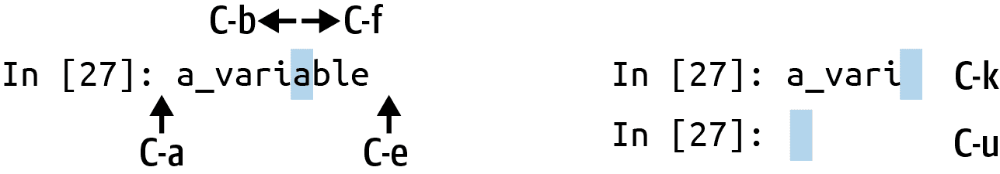

# 附录 B：关于 IPython 系统的更多内容

> 原文：[`wesmckinney.com/book/ipython`](https://wesmckinney.com/book/ipython)
>
> 译者：[飞龙](https://github.com/wizardforcel)
>
> 协议：[CC BY-NC-SA 4.0](http://creativecommons.org/licenses/by-nc-sa/4.0/)


> 此开放访问网络版本的《Python 数据分析第三版》现已作为[印刷版和数字版](https://amzn.to/3DyLaJc)的伴侣提供。如果您发现任何勘误，请[在此处报告](https://oreilly.com/catalog/0636920519829/errata)。请注意，由 Quarto 生成的本站点的某些方面与 O'Reilly 的印刷版和电子书版本的格式不同。
> 
> 如果您发现本书的在线版本有用，请考虑[订购纸质版](https://amzn.to/3DyLaJc)或[无 DRM 的电子书](https://www.ebooks.com/en-us/book/210644288/python-for-data-analysis/wes-mckinney/?affId=WES398681F)以支持作者。本网站的内容不得复制或再生产。代码示例采用 MIT 许可，可在 GitHub 或 Gitee 上找到。

在第二章：Python 语言基础，IPython 和 Jupyter 笔记本中，我们讨论了使用 IPython shell 和 Jupyter 笔记本的基础知识。在本附录中，我们探索了 IPython 系统中的一些更深层次功能，可以从控制台或 Jupyter 中使用。

## B.1 终端键盘快捷键

IPython 有许多用于导航提示的键盘快捷键（这些快捷键对于 Emacs 文本编辑器或 Unix bash shell 的用户来说是熟悉的），并与 shell 的命令历史交互。表 B.1 总结了一些最常用的快捷键。请参阅图 B.1 以查看其中一些示例，如光标移动。

表 B.1：标准 IPython 键盘快捷键

| 键盘快捷键 | 描述 |
| --- | --- |
| Ctrl-P 或向上箭头 | 在命令历史中向后搜索以当前输入文本开头的命令 |
| Ctrl-N 或向下箭头 | 在命令历史中向前搜索以当前输入文本开头的命令 |
| Ctrl-R | Readline 风格的反向历史搜索（部分匹配） |
| Ctrl-Shift-V | 从剪贴板粘贴文本 |
| Ctrl-C | 中断当前正在执行的代码 |
| Ctrl-A | 将光标移动到行首 |
| Ctrl-E | 将光标移动到行尾 |
| Ctrl-K | 从光标处删除文本直到行尾 |
| Ctrl-U | 放弃当前行上的所有文本 |
| Ctrl-F | 将光标向前移动一个字符 |
| Ctrl-B | 将光标向后移动一个字符 |
| Ctrl-L | 清屏 |



图 B.1：IPython shell 中一些键盘快捷键的示例

请注意，Jupyter 笔记本有一个完全独立的键盘快捷键集用于导航和编辑。由于这些快捷键的发展速度比 IPython 中的快捷键更快，我鼓励您探索 Jupyter 笔记本菜单中的集成帮助系统。

## B.2 关于魔术命令

IPython 中的特殊命令（这些命令不是 Python 本身的一部分）被称为*魔术*命令。这些命令旨在简化常见任务，并使您能够轻松控制 IPython 系统的行为。魔术命令是以百分号 `%` 为前缀的任何命令。例如，您可以使用 `%timeit` 魔术函数检查任何 Python 语句（如矩阵乘法）的执行时间：

```py
In [20]: a = np.random.standard_normal((100, 100))

 In [20]: %timeit np.dot(a, a)
 92.5 µs ± 3.43 µs per loop (mean ± std. dev. of 7 runs, 10000 loops each)
```

魔术命令可以被视为在 IPython 系统中运行的命令行程序。其中许多具有额外的“命令行”选项，所有这些选项都可以使用 `?` 查看（正如您可能期望的那样）： 

```py
In [21]: %debug?
    Docstring:
    ::

    %debug [--breakpoint FILE:LINE] [statement [statement ...]]

    Activate the interactive debugger.

    This magic command support two ways of activating debugger.
    One is to activate debugger before executing code.  This way, you
    can set a break point, to step through the code from the point.
    You can use this mode by giving statements to execute and optionally
    a breakpoint.

    The other one is to activate debugger in post-mortem mode.  You can
    activate this mode simply running %debug without any argument.
    If an exception has just occurred, this lets you inspect its stack
    frames interactively.  Note that this will always work only on the last
    traceback that occurred, so you must call this quickly after an
    exception that you wish to inspect has fired, because if another one
    occurs, it clobbers the previous one.

    If you want IPython to automatically do this on every exception, see
    the %pdb magic for more details.

    .. versionchanged:: 7.3
    When running code, user variables are no longer expanded,
    the magic line is always left unmodified.

    positional arguments:
    statement             Code to run in debugger. You can omit this in cell 
    magic mode.

    optional arguments:
    --breakpoint <FILE:LINE>, -b <FILE:LINE>
    Set break point at LINE in FILE.
```

魔术函数可以默认使用，无需百分号，只要没有定义与所讨论的魔术函数同名的变量。这个功能称为*自动魔术*，可以通过 `%automagic` 启用或禁用。

一些魔术函数的行为类似于 Python 函数，它们的输出可以分配给一个变量：

```py
In [22]: %pwd
 Out[22]: '/home/wesm/code/pydata-book'

 In [23]: foo = %pwd

 In [24]: foo
 Out[24]: '/home/wesm/code/pydata-book'
```

由于 IPython 的文档可以从系统内部访问，我鼓励您使用`%quickref`或`%magic`来探索所有可用的特殊命令。此信息显示在控制台分页器中，因此您需要按`q`键退出分页器。表 B.2 突出显示了在 IPython 中进行交互式计算和 Python 开发时最关键的一些命令。

表 B.2：一些经常使用的 IPython 魔术命令

| 命令 | 描述 |
| --- | --- |
| `%quickref` | 显示 IPython 快速参考卡 |
| `%magic` | 显示所有可用魔术命令的详细文档 |
| `%debug` | 进入最后一个异常回溯底部的交互式调试器 |
| `%hist` | 打印命令输入（和可选输出）历史记录 |
| `%pdb` | 在任何异常后自动进入调试器 |
| `%paste` | 从剪贴板执行预格式化的 Python 代码 |
| `%cpaste` | 打开一个特殊提示，用于手动粘贴要执行的 Python 代码 |
| `%reset` | 删除交互式命名空间中定义的所有变量/名称 |
| `%page` <OBJECT> | 对对象进行漂亮打印并通过分页器显示 |
| `%run` <script.py> | 在 IPython 内部运行 Python 脚本 |
| `%prun` <statement> | 使用`cProfile`执行<statement>并报告分析器输出 |
| `%time` <statement> | 报告单个语句的执行时间 |
| `%timeit` <statement> | 多次运行语句以计算集合平均执行时间；用于计时执行时间非常短的代码 |
| `%who, %who_ls, %whos` | 显示交互式命名空间中定义的变量，具有不同级别的信息/详细程度 |
| `%xdel` <variable> | 删除变量并尝试清除 IPython 内部对该对象的任何引用 |

### %run 命令

您可以使用`%run`命令在 IPython 会话的环境中运行任何文件作为 Python 程序。假设您在*script.py*中存储了以下简单脚本：

```py
def f(x, y, z):
 return (x + y) / z

a = 5
b = 6
c = 7.5

result = f(a, b, c)
```

您可以通过将文件名传递给`%run`来执行此操作：

```py
In [14]: %run script.py
```

脚本在*空命名空间*中运行（没有导入或其他变量定义），因此行为应与在命令行上使用`python script.py`运行程序相同。然后，文件中定义的所有变量（导入、函数和全局变量）（直到引发异常（如果有））将在 IPython shell 中可访问：

```py
In [15]: c
Out [15]: 7.5

In [16]: result
Out[16]: 1.4666666666666666
```

如果 Python 脚本需要命令行参数（可以在`sys.argv`中找到），这些参数可以在文件路径之后传递，就像在命令行上运行一样。

注意

如果要让脚本访问已在交互式 IPython 命名空间中定义的变量，请使用`%run -i`而不是普通的`%run`。

在 Jupyter 笔记本中，您还可以使用相关的`%load`魔术函数，它将脚本导入到代码单元格中：

```py
In [16]: %load script.py

 def f(x, y, z):
 return (x + y) / z

 a = 5
 b = 6
 c = 7.5

 result = f(a, b, c)
```

#### 中断运行的代码

在运行任何代码时按下 Ctrl-C，无论是通过`%run`运行脚本还是长时间运行的命令，都会引发`KeyboardInterrupt`。这将导致几乎所有 Python 程序立即停止，除非在某些不寻常的情况下。

警告：

当一段 Python 代码调用了一些编译的扩展模块时，按下 Ctrl-C 并不总是会立即停止程序执行。在这种情况下，您要么等待控制返回到 Python 解释器，要么在更严重的情况下，在您的操作系统中强制终止 Python 进程（例如在 Windows 上使用任务管理器或在 Linux 上使用`kill`命令）。

### 从剪贴板执行代码

如果您正在使用 Jupyter 笔记本，您可以将代码复制粘贴到任何代码单元格中并执行。还可以在 IPython shell 中从剪贴板运行代码。假设您在其他应用程序中有以下代码：

```py
x = 5
y = 7
if x > 5:
 x += 1
 y = 8
```

最可靠的方法是`％paste`和`％cpaste`魔术函数（请注意，这些在 Jupyter 中不起作用，因为您可以将文本复制并粘贴到 Jupyter 代码单元格中）。`％paste`获取剪贴板中的文本并将其作为单个块在 shell 中执行：

```py
In [17]: %paste
x = 5
y = 7
if x > 5:
 x += 1

 y = 8
## -- End pasted text --
```

`％cpaste`类似，只是它为您提供了一个特殊的提示符，用于粘贴代码：

```py
In [18]: %cpaste
Pasting code; enter '--' alone on the line to stop or use Ctrl-D.
:x = 5
:y = 7
:if x > 5:
:    x += 1
:
:    y = 8
:--
```

使用`％cpaste`块，您可以在执行代码之前粘贴尽可能多的代码。您可能决定使用`％cpaste`在执行代码之前查看粘贴的代码。如果您意外粘贴了错误的代码，可以通过按 Ctrl-C 键来退出`％cpaste`提示符。

## B.3 使用命令历史

IPython 维护一个小型的磁盘数据库，其中包含您执行的每个命令的文本。这有各种用途：

+   使用最少的键入搜索、完成和执行先前执行的命令

+   在会话之间保留命令历史

+   将输入/输出历史记录记录到文件中

这些功能在 shell 中比在笔记本中更有用，因为笔记本通过设计在每个代码单元格中保留输入和输出的日志。

### 搜索和重用命令历史记录

IPython shell 允许您搜索和执行以前的代码或其他命令。这很有用，因为您经常会发现自己重复执行相同的命令，例如`％run`命令或其他代码片段。假设您已运行：

```py
In[7]: %run first/second/third/data_script.py
```

然后探索脚本的结果（假设它成功运行），只发现您进行了错误的计算。找出问题并修改*data_script.py*后，您可以开始键入`％run`命令的几个字母，然后按下 Ctrl-P 键组合或向上箭头键。这将搜索命令历史记录，找到与您键入的字母匹配的第一个先前命令。多次按下 Ctrl-P 或向上箭头键将继续搜索历史记录。如果您错过了要执行的命令，不要担心。您可以通过按下 Ctrl-N 或向下箭头键来*向前*浏览命令历史记录。几次这样做后，您可能会开始在不经思考的情况下按下这些键！

使用 Ctrl-R 会为您提供与 Unix 风格 shell 中使用的`readline`相同的部分增量搜索功能，例如 bash shell。在 Windows 上，IPython 通过模拟`readline`功能来实现。要使用此功能，请按 Ctrl-R，然后键入要搜索的输入行中包含的几个字符：

```py
In [1]: a_command = foo(x, y, z)

(reverse-i-search)`com': a_command = foo(x, y, z)
```

按下 Ctrl-R 将循环遍历每行的历史记录，匹配您键入的字符。

### 输入和输出变量

忘记将函数调用的结果分配给变量可能非常恼人。IPython 会将*输入命令和输出 Python 对象*的引用存储在特殊变量中。前两个输出分别存储在`_`（一个下划线）和`__`（两个下划线）变量中：

```py
In [18]: 'input1'
Out[18]: 'input1'

In [19]: 'input2'
Out[19]: 'input2'

In [20]: __
Out[20]: 'input1'

In [21]: 'input3'
Out[21]: 'input3'

In [22]: _
Out[22]: 'input3'
```

输入变量存储在名为`_iX`的变量中，其中`X`是输入行号。

对于每个输入变量，都有一个相应的输出变量`_X`。因此，在输入行 27 之后，将有两个新变量，`_27`（用于输出）和`_i27`（用于输入）：

```py
In [26]: foo = 'bar'

In [27]: foo
Out[27]: 'bar'

In [28]: _i27
Out[28]: u'foo'

In [29]: _27
Out[29]: 'bar'
```

由于输入变量是字符串，因此可以使用 Python 的`eval`关键字再次执行它们：

```py
In [30]: eval(_i27)
Out[30]: 'bar'
```

在这里，`_i27`指的是`In [27]`中输入的代码。

几个魔术函数允许您使用输入和输出历史记录。`％hist`打印全部或部分输入历史记录，带或不带行号。`％reset`清除交互式命名空间，可选地清除输入和输出缓存。`％xdel`魔术函数从 IPython 机制中删除对*特定*对象的所有引用。有关这些魔术的更多详细信息，请参阅文档。

警告：

在处理非常大的数据集时，请记住 IPython 的输入和输出历史可能导致其中引用的对象不会被垃圾回收（释放内存），即使您使用`del`关键字从交互式命名空间中删除变量。在这种情况下，谨慎使用`%xdel`和`%reset`可以帮助您避免遇到内存问题。

## B.4 与操作系统交互

IPython 的另一个特性是它允许您访问文件系统和操作系统 shell。这意味着，您可以像在 Windows 或 Unix（Linux，macOS）shell 中一样执行大多数标准命令行操作，而无需退出 IPython。这包括 shell 命令、更改目录以及将命令的结果存储在 Python 对象（列表或字符串）中。还有命令别名和目录标记功能。

查看表 B.3 以获取调用 shell 命令的魔术函数和语法摘要。我将在接下来的几节中简要介绍这些功能。

表 B.3：IPython 与系统相关的命令

| 命令 | 描述 |
| --- | --- |
| `!cmd` | 在系统 shell 中执行`cmd` |
| `output = !cmd args` | 运行`cmd`并将 stdout 存储在`output`中 |
| `%alias alias_name cmd` | 为系统（shell）命令定义别名 |
| `%bookmark` | 使用 IPython 的目录标记系统 |
| `%cd` <directory> | 将系统工作目录更改为传递的目录 |
| `%pwd` | 返回当前系统工作目录 |
| `%pushd` <directory> | 将当前目录放入堆栈并切换到目标目录 |
| `%popd` | 切换到堆栈顶部弹出的目录 |
| `%dirs` | 返回包含当前目录堆栈的列表 |
| `%dhist` | 打印访问过的目录的历史记录 |
| `%env` | 将系统环境变量作为字典返回 |
| `%matplotlib` | 配置 matplotlib 集成选项 |

### Shell 命令和别名

在 IPython 中以感叹号`!`开头的行告诉 IPython 在感叹号后执行系统 shell 中的所有内容。这意味着您可以删除文件（使用`rm`或`del`，取决于您的操作系统）、更改目录或执行任何其他进程。

您可以通过将用`!`转义的表达式分配给变量来存储 shell 命令的控制台输出。例如，在我连接到以太网上网的基于 Linux 的机器上，我可以将我的 IP 地址作为 Python 变量获取：

```py
In [1]: ip_info = !ifconfig wlan0 | grep "inet "

In [2]: ip_info[0].strip()
Out[2]: 'inet addr:10.0.0.11  Bcast:10.0.0.255  Mask:255.255.255.0'
```

返回的 Python 对象`ip_info`实际上是一个包含各种控制台输出版本的自定义列表类型。

在使用`!`时，IPython 还可以在当前环境中定义的 Python 值进行替换。要做到这一点，请在变量名前加上美元符号`$`：

```py
In [3]: foo = 'test*'

In [4]: !ls $foo
test4.py  test.py  test.xml
```

`%alias`魔术函数可以为 shell 命令定义自定义快捷方式。例如：

```py
In [1]: %alias ll ls -l

In [2]: ll /usr
total 332
drwxr-xr-x   2 root root  69632 2012-01-29 20:36 bin/
drwxr-xr-x   2 root root   4096 2010-08-23 12:05 games/
drwxr-xr-x 123 root root  20480 2011-12-26 18:08 include/
drwxr-xr-x 265 root root 126976 2012-01-29 20:36 lib/
drwxr-xr-x  44 root root  69632 2011-12-26 18:08 lib32/
lrwxrwxrwx   1 root root      3 2010-08-23 16:02 lib64 -> lib/
drwxr-xr-x  15 root root   4096 2011-10-13 19:03 local/
drwxr-xr-x   2 root root  12288 2012-01-12 09:32 sbin/
drwxr-xr-x 387 root root  12288 2011-11-04 22:53 share/
drwxrwsr-x  24 root src    4096 2011-07-17 18:38 src/
```

您可以通过使用分号将它们分隔来像在命令行上一样执行多个命令：

```py
In [558]: %alias test_alias (cd examples; ls; cd ..)

In [559]: test_alias
macrodata.csv  spx.csv  tips.csv
```

您会注意到，IPython 在会话关闭后会“忘记”您交互定义的任何别名。要创建永久别名，您需要使用配置系统。

### 目录标记系统

IPython 具有目录标记系统，使您可以保存常见目录的别名，以便您可以轻松跳转。例如，假设您想要创建一个指向本书补充材料的书签：

```py
In [6]: %bookmark py4da /home/wesm/code/pydata-book
```

完成此操作后，当您使用`%cd`魔术时，您可以使用您定义的任何书签：

```py
In [7]: cd py4da
(bookmark:py4da) -> /home/wesm/code/pydata-book
/home/wesm/code/pydata-book
```

如果书签名称与当前工作目录中的目录名称冲突，您可以使用`-b`标志来覆盖并使用书签位置。使用`%bookmark`的`-l`选项列出所有书签：

```py
In [8]: %bookmark -l
Current bookmarks:
py4da -> /home/wesm/code/pydata-book-source
```

与别名不同，书签在 IPython 会话之间自动保留。

## B.5 软件开发工具

除了作为交互式计算和数据探索的舒适环境外，IPython 还可以成为一般 Python 软件开发的有用伴侣。在数据分析应用中，首先重要的是拥有*正确*的代码。幸运的是，IPython 已经紧密集成并增强了内置的 Python `pdb`调试器。其次，您希望您的代码*快速*。为此，IPython 具有方便的集成代码计时和性能分析工具。我将在这里详细介绍这些工具。

### 交互式调试器

IPython 的调试器通过制表符补全、语法高亮显示和异常跟踪中每行的上下文增强了`pdb`。调试代码的最佳时机之一是在发生错误后立即进行调试。在异常发生后立即输入`%debug`命令会调用“事后”调试器，并将您放入引发异常的堆栈帧中：

```py
In [2]: run examples/ipython_bug.py
---------------------------------------------------------------------------
AssertionError                            Traceback (most recent call last)
/home/wesm/code/pydata-book/examples/ipython_bug.py in <module>()
 13     throws_an_exception()
 14
---> 15 calling_things()

/home/wesm/code/pydata-book/examples/ipython_bug.py in calling_things()
 11 def calling_things():
 12     works_fine()
---> 13     throws_an_exception()
 14
 15 calling_things()

/home/wesm/code/pydata-book/examples/ipython_bug.py in throws_an_exception()
 7     a = 5
 8     b = 6
----> 9     assert(a + b == 10)
 10
 11 def calling_things():

AssertionError:

In [3]: %debug
> /home/wesm/code/pydata-book/examples/ipython_bug.py(9)throws_an_exception()
 8     b = 6
----> 9     assert(a + b == 10)
 10

ipdb>
```

进入调试器后，您可以执行任意 Python 代码并探索每个堆栈帧中的所有对象和数据（这些对象和数据由解释器“保持活动”）。默认情况下，您从发生错误的最低级别开始。通过输入`u`（向上）和`d`（向下），您可以在堆栈跟踪的级别之间切换：

```py
ipdb> u
> /home/wesm/code/pydata-book/examples/ipython_bug.py(13)calling_things()
 12     works_fine()
---> 13     throws_an_exception()
 14
```

执行`%pdb`命令会使 IPython 在任何异常发生后自动调用调试器，这是许多用户会发现有用的模式。

在开发代码时使用调试器也很有帮助，特别是当您需要设置断点或逐步执行函数或脚本以检查每个步骤的行为时。有几种方法可以实现这一点。第一种方法是使用带有`-d`标志的`%run`，在执行传递的脚本中的任何代码之前调用调试器。您必须立即输入`s`（步进）以进入脚本：

```py
In [5]: run -d examples/ipython_bug.py
Breakpoint 1 at /home/wesm/code/pydata-book/examples/ipython_bug.py:1
NOTE: Enter 'c' at the ipdb>  prompt to start your script.
> <string>(1)<module>()

ipdb> s
--Call--
> /home/wesm/code/pydata-book/examples/ipython_bug.py(1)<module>()
1---> 1 def works_fine():
 2     a = 5
 3     b = 6
```

在此之后，您可以自行决定如何处理文件。例如，在前面的异常中，我们可以在调用`works_fine`函数之前设置断点，并通过输入`c`（继续）运行脚本直到达到断点：

```py
ipdb> b 12
ipdb> c
> /home/wesm/code/pydata-book/examples/ipython_bug.py(12)calling_things()
 11 def calling_things():
2--> 12     works_fine()
 13     throws_an_exception()
```

此时，您可以通过输入`n`（下一步）进入`works_fine()`或执行`works_fine()`以前进到下一行：

```py
ipdb> n
> /home/wesm/code/pydata-book/examples/ipython_bug.py(13)calling_things()
2    12     works_fine()
---> 13     throws_an_exception()
 14
```

然后，我们可以步入`throws_an_exception`并前进到发生错误的行，并查看作用域中的变量。请注意，调试器命令优先于变量名称；在这种情况下，使用`!`作为前缀来检查它们的内容：

```py
ipdb> s
--Call--
> /home/wesm/code/pydata-book/examples/ipython_bug.py(6)throws_an_exception()
 5
----> 6 def throws_an_exception():
 7     a = 5

ipdb> n
> /home/wesm/code/pydata-book/examples/ipython_bug.py(7)throws_an_exception()
 6 def throws_an_exception():
----> 7     a = 5
 8     b = 6

ipdb> n
> /home/wesm/code/pydata-book/examples/ipython_bug.py(8)throws_an_exception()
 7     a = 5
----> 8     b = 6
 9     assert(a + b == 10)

ipdb> n
> /home/wesm/code/pydata-book/examples/ipython_bug.py(9)throws_an_exception()
 8     b = 6
----> 9     assert(a + b == 10)
 10

ipdb> !a
5
ipdb> !b
6
```

根据我的经验，熟练掌握交互式调试器需要时间和实践。请参阅表 B.4 以获取调试器命令的完整目录。如果您习惯使用 IDE，您可能会发现基于终端的调试器一开始有点严格，但随着时间的推移会有所改善。一些 Python IDE 具有出色的 GUI 调试器，因此大多数用户都可以找到适合自己的工具。

表 B.4：Python 调试器命令

| 命令 | 动作 |
| --- | --- |
| `h(elp)` | 显示命令列表 |
| `help` <command> | 显示<command>的文档 |
| `c(ontinue)` | 恢复程序执行 |
| `q(uit)` | 在不执行任何其他代码的情况下退出调试器 |
| `b(reak)` <number> | 在当前文件的<number>行设置断点 |
| `b` <path/to/file.py:number> | 在指定文件中的第<number>行设置断点 |
| `s(tep)` | 步入函数调用 |
| `n(ext)` | 执行当前行并前进到当前级别的下一行 |
| `u(p)`/`d(own)` | 在函数调用堆栈中向上/向下移动 |
| `a(rgs)` | 显示当前函数的参数 |
| `debug` <statement> | 在新的（递归）调试器中调用语句<statement> |
| `l(ist)` <statement> | 显示当前位置和堆栈当前级别的上下文 |
| `w(here)` | 打印当前位置的完整堆栈跟踪上下文 |

#### 调试器的其他用法

还有几种有用的调用调试器的方法。第一种是使用特殊的`set_trace`函数（以`pdb.set_trace`命名），基本上是一个“穷人的断点”。以下是两个您可能希望将其放在某处以供您一般使用的小技巧（可能将它们添加到您的 IPython 配置文件中，就像我做的那样）：

```py
from IPython.core.debugger import Pdb

def set_trace():
 Pdb(.set_trace(sys._getframe().f_back)

def debug(f, *args, **kwargs):
 pdb = Pdb()
 return pdb.runcall(f, *args, **kwargs)
```

第一个函数`set_trace`提供了一个方便的方法，在代码的某个地方设置断点。您可以在代码的任何部分使用`set_trace`，以便在需要临时停止以更仔细地检查它时使用（例如，在异常发生之前）：

```py
In [7]: run examples/ipython_bug.py
> /home/wesm/code/pydata-book/examples/ipython_bug.py(16)calling_things()
 15     set_trace()
---> 16     throws_an_exception()
 17
```

键入`c`（继续）将使代码正常恢复，不会造成任何伤害。

我们刚刚看过的`debug`函数使您可以轻松地在任意函数调用上调用交互式调试器。假设我们编写了一个类似以下内容的函数，并且希望逐步执行其逻辑：

```py
def f(x, y, z=1):
 tmp = x + y
 return tmp / z
```

通常使用`f`看起来像`f(1, 2, z=3)`。要代替进入`f`，请将`f`作为`debug`的第一个参数传递，然后是要传递给`f`的位置参数和关键字参数：

```py
In [6]: debug(f, 1, 2, z=3)
> <ipython-input>(2)f()
 1 def f(x, y, z):
----> 2     tmp = x + y
 3     return tmp / z

ipdb>
```

这两个技巧多年来为我节省了很多时间。

最后，调试器可以与`％run`一起使用。通过使用`％run -d`运行脚本，您将直接进入调试器，准备设置任何断点并启动脚本：

```py
In [1]: %run -d examples/ipython_bug.py
Breakpoint 1 at /home/wesm/code/pydata-book/examples/ipython_bug.py:1
NOTE: Enter 'c' at the ipdb>  prompt to start your script.
> <string>(1)<module>()

ipdb>
```

添加带有行号的`-b`会启动已经设置了断点的调试器：

```py
In [2]: %run -d -b2 examples/ipython_bug.py
Breakpoint 1 at /home/wesm/code/pydata-book/examples/ipython_bug.py:2
NOTE: Enter 'c' at the ipdb>  prompt to start your script.
> <string>(1)<module>()

ipdb> c
> /home/wesm/code/pydata-book/examples/ipython_bug.py(2)works_fine()
 1 def works_fine():
1---> 2     a = 5
 3     b = 6

ipdb>
```

### 计时代码：％time 和％timeit

对于规模较大或运行时间较长的数据分析应用程序，您可能希望测量各个组件或单个语句或函数调用的执行时间。您可能希望获得一个报告，其中列出了在复杂过程中占用最多时间的函数。幸运的是，IPython 使您能够在开发和测试代码时方便地获取这些信息。

手动使用内置的`time`模块及其函数`time.clock`和`time.time`来计时代码通常是乏味和重复的，因为您必须编写相同的无聊样板代码：

```py
import time
start = time.time()
for i in range(iterations):
 # some code to run here
elapsed_per = (time.time() - start) / iterations
```

由于这是一个常见操作，IPython 有两个魔术函数`％time`和`％timeit`，可以为您自动化这个过程。

`％time`运行一次语句，报告总执行时间。假设我们有一个大型字符串列表，并且我们想比较不同方法选择所有以特定前缀开头的字符串。这里是一个包含 600,000 个字符串和两种相同方法的列表，只选择以`'foo'`开头的字符串：

```py
# a very large list of strings
In [11]: strings = ['foo', 'foobar', 'baz', 'qux',
 ....:            'python', 'Guido Van Rossum'] * 100000

In [12]: method1 = [x for x in strings if x.startswith('foo')]

In [13]: method2 = [x for x in strings if x[:3] == 'foo']
```

看起来它们在性能上应该是一样的，对吧？我们可以使用`％time`来确保：

```py
In [14]: %time method1 = [x for x in strings if x.startswith('foo')]
CPU times: user 49.6 ms, sys: 676 us, total: 50.3 ms
Wall time: 50.1 ms

In [15]: %time method2 = [x for x in strings if x[:3] == 'foo']
CPU times: user 40.3 ms, sys: 603 us, total: 40.9 ms
Wall time: 40.6 ms
```

`Wall time`（“墙钟时间”的缩写）是主要关注的数字。从这些时间中，我们可以推断出存在一些性能差异，但这不是一个非常精确的测量。如果您尝试自己多次`％time`这些语句，您会发现结果有些变化。要获得更精确的测量结果，请使用`％timeit`魔术函数。给定一个任意语句，它有一个启发式方法多次运行语句以产生更准确的平均运行时间（这些结果在您的系统上可能有所不同）：

```py
In [563]: %timeit [x for x in strings if x.startswith('foo')]
10 loops, best of 3: 159 ms per loop

In [564]: %timeit [x for x in strings if x[:3] == 'foo']
10 loops, best of 3: 59.3 ms per loop
```

这个看似无害的例子说明了值得了解 Python 标准库、NumPy、pandas 和本书中使用的其他库的性能特征。在规模较大的数据分析应用程序中，这些毫秒将开始累积！

`％timeit`特别适用于分析具有非常短执行时间的语句和函数，甚至可以到微秒（百万分之一秒）或纳秒（十亿分之一秒）的级别。这些可能看起来是微不足道的时间，但当然，一个耗时 20 微秒的函数被调用 100 万次比一个耗时 5 微秒的函数多花费 15 秒。在前面的例子中，我们可以直接比较这两个字符串操作以了解它们的性能特征：

```py
In [565]: x = 'foobar'

In [566]: y = 'foo'

In [567]: %timeit x.startswith(y)
1000000 loops, best of 3: 267 ns per loop

In [568]: %timeit x[:3] == y
10000000 loops, best of 3: 147 ns per loop
```

### 基本分析：％prun 和％run -p

代码剖析与计时代码密切相关，只是它关注于确定时间花费在哪里。主要的 Python 剖析工具是`cProfile`模块，它与 IPython 没有特定关联。`cProfile`执行程序或任意代码块，同时跟踪每个函数中花费的时间。

在命令行上常用的一种使用`cProfile`的方式是运行整个程序并输出每个函数的聚合时间。假设我们有一个脚本，在循环中执行一些线性代数运算（计算一系列 100×100 矩阵的最大绝对特征值）：

```py
import numpy as np
from numpy.linalg import eigvals

def run_experiment(niter=100):
 K = 100
 results = []
 for _ in range(niter):
 mat = np.random.standard_normal((K, K))
 max_eigenvalue = np.abs(eigvals(mat)).max()
 results.append(max_eigenvalue)
 return results
some_results = run_experiment()
print('Largest one we saw: {0}'.format(np.max(some_results)))
```

您可以通过命令行运行以下脚本来使用`cProfile`：

```py
python -m cProfile cprof_example.py
```

如果尝试这样做，您会发现输出按函数名称排序。这使得很难了解大部分时间花费在哪里，因此使用`-s`标志指定*排序顺序*很有用：

```py
$ python -m cProfile -s cumulative cprof_example.py
Largest one we saw: 11.923204422
 15116 function calls (14927 primitive calls) in 0.720 seconds

Ordered by: cumulative time

ncalls  tottime  percall  cumtime  percall filename:lineno(function)
 1    0.001    0.001    0.721    0.721 cprof_example.py:1(<module>)
 100    0.003    0.000    0.586    0.006 linalg.py:702(eigvals)
 200    0.572    0.003    0.572    0.003 {numpy.linalg.lapack_lite.dgeev}
 1    0.002    0.002    0.075    0.075 __init__.py:106(<module>)
 100    0.059    0.001    0.059    0.001 {method 'randn')
 1    0.000    0.000    0.044    0.044 add_newdocs.py:9(<module>)
 2    0.001    0.001    0.037    0.019 __init__.py:1(<module>)
 2    0.003    0.002    0.030    0.015 __init__.py:2(<module>)
 1    0.000    0.000    0.030    0.030 type_check.py:3(<module>)
 1    0.001    0.001    0.021    0.021 __init__.py:15(<module>)
 1    0.013    0.013    0.013    0.013 numeric.py:1(<module>)
 1    0.000    0.000    0.009    0.009 __init__.py:6(<module>)
 1    0.001    0.001    0.008    0.008 __init__.py:45(<module>)
 262    0.005    0.000    0.007    0.000 function_base.py:3178(add_newdoc)
 100    0.003    0.000    0.005    0.000 linalg.py:162(_assertFinite)
 ...
```

仅显示输出的前 15 行。通过扫描`cumtime`列向下阅读，可以最轻松地看出每个函数内部花费了多少总时间。请注意，如果一个函数调用另一个函数，*时钟不会停止*。`cProfile`记录每个函数调用的开始和结束时间，并使用这些时间来生成时间。

除了命令行用法外，`cProfile`还可以以编程方式用于剖析任意代码块，而无需运行新进程。IPython 具有方便的接口，可以使用`%prun`命令和`-p`选项来`%run`。`%prun`接受与`cProfile`相同的“命令行选项”，但会剖析一个任意的 Python 语句，而不是整个*.py*文件：

```py
In [4]: %prun -l 7 -s cumulative run_experiment()
 4203 function calls in 0.643 seconds

Ordered by: cumulative time
List reduced from 32 to 7 due to restriction <7>

ncalls  tottime  percall  cumtime  percall filename:lineno(function)
 1    0.000    0.000    0.643    0.643 <string>:1(<module>)
 1    0.001    0.001    0.643    0.643 cprof_example.py:4(run_experiment)
 100    0.003    0.000    0.583    0.006 linalg.py:702(eigvals)
 200    0.569    0.003    0.569    0.003 {numpy.linalg.lapack_lite.dgeev}
 100    0.058    0.001    0.058    0.001 {method 'randn'}
 100    0.003    0.000    0.005    0.000 linalg.py:162(_assertFinite)
 200    0.002    0.000    0.002    0.000 {method 'all' of 'numpy.ndarray'}
```

类似地，调用`%run -p -s cumulative cprof_example.py`具有与命令行方法相同的效果，只是您无需离开 IPython。

在 Jupyter 笔记本中，您可以使用`%%prun`魔术（两个`%`符号）来剖析整个代码块。这会弹出一个单独的窗口，显示剖析输出。这在获取可能快速答案的情况下很有用，比如“为什么那个代码块运行时间如此之长？”

在使用 IPython 或 Jupyter 时，还有其他可用的工具可帮助使剖析更易于理解。其中之一是[SnakeViz](https://github.com/jiffyclub/snakeviz/)，它使用 D3.js 生成剖析结果的交互式可视化。

### 逐行剖析函数

在某些情况下，您从`%prun`（或其他基于`cProfile`的剖析方法）获得的信息可能无法完全说明函数的执行时间，或者可能非常复杂，以至于按函数名称汇总的结果难以解释。对于这种情况，有一个名为`line_profiler`的小型库（可通过 PyPI 或其中一个软件包管理工具获取）。它包含一个 IPython 扩展，可以启用一个新的魔术函数`%lprun`，用于计算一个或多个函数的逐行剖析。您可以通过修改 IPython 配置（请参阅 IPython 文档或附录后面的配置部分）来启用此扩展，包括以下行：

```py
# A list of dotted module names of IPython extensions to load.
c.InteractiveShellApp.extensions = ['line_profiler']
```

您还可以运行以下命令：

```py
%load_ext line_profiler
```

`line_profiler`可以以编程方式使用（请参阅完整文档），但在 IPython 中交互使用时可能效果最好。假设您有一个名为`prof_mod`的模块，其中包含执行一些 NumPy 数组操作的以下代码（如果要重现此示例，请将此代码放入一个新文件*prof_mod.py*中）：

```py
from numpy.random import randn

def add_and_sum(x, y):
 added = x + y
 summed = added.sum(axis=1)
 return summed

def call_function():
 x = randn(1000, 1000)
 y = randn(1000, 1000)
 return add_and_sum(x, y)
```

如果我们想了解`add_and_sum`函数的性能，`%prun`给出以下结果：

```py
In [569]: %run prof_mod

In [570]: x = randn(3000, 3000)

In [571]: y = randn(3000, 3000)

In [572]: %prun add_and_sum(x, y)
 4 function calls in 0.049 seconds
 Ordered by: internal time
 ncalls  tottime  percall  cumtime  percall filename:lineno(function)
 1    0.036    0.036    0.046    0.046 prof_mod.py:3(add_and_sum)
 1    0.009    0.009    0.009    0.009 {method 'sum' of 'numpy.ndarray'}
 1    0.003    0.003    0.049    0.049 <string>:1(<module>)
```

这并不特别启发人。启用`line_profiler` IPython 扩展后，将可用一个新命令`%lprun`。使用方式的唯一区别是我们必须指示`%lprun`要剖析哪个函数或函数。一般语法是：

```py
%lprun -f func1 -f func2 statement_to_profile
```

在这种情况下，我们想要剖析`add_and_sum`，所以我们运行：

```py
In [573]: %lprun -f add_and_sum add_and_sum(x, y)
Timer unit: 1e-06 s
File: prof_mod.py
Function: add_and_sum at line 3
Total time: 0.045936 s
Line #      Hits         Time  Per Hit   % Time  Line Contents
==============================================================
 3                                           def add_and_sum(x, y):
 4         1        36510  36510.0     79.5      added = x + y
 5         1         9425   9425.0     20.5      summed = added.sum(axis=1)
 6         1            1      1.0      0.0      return summed
```

这可能更容易解释。在这种情况下，我们对我们在语句中使用的相同函数进行了分析。查看前面的模块代码，我们可以调用`call_function`并对其进行分析，以及`add_and_sum`，从而获得代码性能的完整图片：

```py
In [574]: %lprun -f add_and_sum -f call_function call_function()
Timer unit: 1e-06 s
File: prof_mod.py
Function: add_and_sum at line 3
Total time: 0.005526 s
Line #      Hits         Time  Per Hit   % Time  Line Contents
==============================================================
 3                                           def add_and_sum(x, y):
 4         1         4375   4375.0     79.2      added = x + y
 5         1         1149   1149.0     20.8      summed = added.sum(axis=1)
 6         1            2      2.0      0.0      return summed
File: prof_mod.py
Function: call_function at line 8
Total time: 0.121016 s
Line #      Hits         Time  Per Hit   % Time  Line Contents
==============================================================
 8                                           def call_function():
 9         1        57169  57169.0     47.2      x = randn(1000, 1000)
 10         1        58304  58304.0     48.2      y = randn(1000, 1000)
 11         1         5543   5543.0      4.6      return add_and_sum(x, y)
```

作为一个一般准则，我倾向于使用`%prun`（`cProfile`）进行“宏”分析，以及`%lprun`（`line_profiler`）进行“微”分析。了解这两个工具是值得的。

注意

您必须明确指定要使用`%lprun`对其进行分析的函数名称的原因是“跟踪”每行的执行时间的开销很大。跟踪不感兴趣的函数可能会显著改变分析结果。

## B.6 使用 IPython 进行高效代码开发的提示

以一种方便开发、调试和最终*交互使用*的方式编写代码可能对许多用户来说是一种范式转变。有一些程序性细节，比如代码重新加载可能需要一些调整，以及编码风格方面的考虑。

因此，实现本节中描述的大多数策略更多地是一种艺术而不是科学，需要您进行一些实验来确定一种对您有效的编写 Python 代码的方式。最终，您希望以一种方便的方式构建代码，以便进行迭代使用，并能够尽可能轻松地探索运行程序或函数的结果。我发现，专为 IPython 设计的软件比仅用作独立命令行应用程序运行的代码更容易使用。当出现问题并且您必须诊断您或其他人可能在几个月或几年前编写的代码中的错误时，这变得尤为重要。

### 重新加载模块依赖项

在 Python 中，当您键入`import some_lib`时，将执行`some_lib`中的代码，并将在新创建的`some_lib`模块命名空间中存储定义的所有变量、函数和导入。下次使用`import some_lib`时，您将获得对现有模块命名空间的引用。在交互式 IPython 代码开发中可能出现困难的潜在问题是，当您运行依赖于其他模块的脚本时，您可能已经进行了更改。假设我在*test_script.py*中有以下代码：

```py
import some_lib

x = 5
y = [1, 2, 3, 4]
result = some_lib.get_answer(x, y)
```

如果您执行`%run test_script.py`然后修改*some_lib.py*，下次执行`%run test_script.py`时，您仍将获得*some_lib.py*的*旧版本*，因为 Python 的“一次加载”模块系统。这种行为与其他一些数据分析环境（如 MATLAB）不同，后者会自动传播代码更改。¹ 为了应对这种情况，您有几种选择。第一种方法是使用标准库中的`importlib`模块中的`reload`函数：

```py
import some_lib
import importlib

importlib.reload(some_lib)
```

这尝试在每次运行*test_script.py*时为您提供*some_lib.py*的新副本（但也有一些情况下不会）。显然，如果依赖关系更深入，可能会在各个地方插入`reload`的用法有点棘手。对于这个问题，IPython 有一个特殊的`dreload`函数（*不是*一个魔术函数）用于对模块进行“深”（递归）重新加载。如果我运行*some_lib.py*然后使用`dreload(some_lib)`，它将尝试重新加载`some_lib`以及其所有依赖项。不幸的是，这并不适用于所有情况，但当适用时，它比不得不重新启动 IPython 要好。

### 代码设计提示

这没有简单的配方，但以下是我在自己的工作中发现有效的一些高级原则。

#### 保持相关对象和数据活动

看到一个为命令行编写的程序的结构有点像下面这样并不罕见：

```py
from my_functions import g

def f(x, y):
 return g(x + y)

def main():
 x = 6
 y = 7.5
 result = x + y

if __name__ == '__main__':
 main()
```

如果我们在 IPython 中运行这个程序，你能看出可能出现什么问题吗？完成后，`main`函数中定义的结果或对象将无法在 IPython shell 中访问。更好的方法是让`main`中的任何代码直接在模块的全局命名空间中执行（或者在`if __name__ == '__main__':`块中执行，如果你希望该模块也可以被导入）。这样，当你`%run`代码时，你将能够查看`main`中定义的所有变量。这相当于在 Jupyter 笔记本中的单元格中定义顶级变量。

#### 扁平比嵌套更好

深度嵌套的代码让我想到洋葱的许多层。在测试或调试一个函数时，你必须剥开多少层洋葱才能到达感兴趣的代码？“扁平比嵌套更好”的想法是 Python 之禅的一部分，它也适用于为交互式使用开发代码。尽可能使函数和类解耦和模块化使它们更容易进行测试（如果你正在编写单元测试）、调试和交互使用。

#### 克服对更长文件的恐惧

如果你来自 Java（或其他类似语言）背景，可能会被告知保持文件短小。在许多语言中，这是一个明智的建议；长长度通常是一个不好的“代码异味”，表明可能需要重构或重新组织。然而，在使用 IPython 开发代码时，处理 10 个小但相互关联的文件（每个文件不超过 100 行）通常会给你带来更多的头痛，而不是 2 或 3 个较长的文件。较少的文件意味着较少的模块需要重新加载，编辑时也减少了文件之间的跳转。我发现维护较大的模块，每个模块具有高度的*内部*内聚性（代码都涉及解决相同类型的问题），更加有用和符合 Python 风格。当朝着一个解决方案迭代时，当然有时将较大的文件重构为较小的文件是有意义的。

显然，我不支持将这个论点推向极端，即将所有代码放在一个庞大的文件中。为大型代码库找到一个明智和直观的模块和包结构通常需要一些工作，但在团队中正确地完成这一点尤为重要。每个模块应该在内部具有内聚性，并且应该尽可能明显地找到负责每个功能区域的函数和类。

## B.7 高级 IPython 功能

充分利用 IPython 系统可能会导致你以稍微不同的方式编写代码，或者深入了解配置。

### 配置文件和配置

IPython 和 Jupyter 环境的外观（颜色、提示、行之间的间距等）和行为的大部分方面都可以通过一个广泛的配置系统进行配置。以下是一些可以通过配置完成的事项：

+   更改颜色方案

+   更改输入和输出提示的外观，或者在`Out`之后和下一个`In`提示之前删除空行

+   执行一系列 Python 语句（例如，你经常使用的导入或任何其他你希望每次启动 IPython 时发生的事情）

+   启用始终开启的 IPython 扩展，比如`line_profiler`中的`%lprun`魔术

+   启用 Jupyter 扩展

+   定义你自己的魔术或系统别名

IPython shell 的配置在特殊的*ipython_config.py*文件中指定，这些文件通常位于用户主目录中的*.ipython/*目录中。配置是基于特定的*profile*执行的。当您正常启动 IPython 时，默认情况下会加载*default profile*，存储在*profile_default*目录中。因此，在我的 Linux 操作系统上，我的默认 IPython 配置文件的完整路径是：

```py
/home/wesm/.ipython/profile_default/ipython_config.py
```

要在您的系统上初始化此文件，请在终端中运行：

```py
ipython profile create default
```

我将不会详细介绍此文件的内容。幸运的是，它有注释描述每个配置选项的用途，因此我将让读者自行调整和自定义。另一个有用的功能是可以拥有*多个配置文件*。假设您想要为特定应用程序或项目定制一个备用 IPython 配置。创建新配置涉及键入以下内容：

```py
ipython profile create secret_project
```

完成后，编辑新创建的*profile_secret_project*目录中的配置文件，然后启动 IPython，如下所示：

```py
$ ipython --profile=secret_project
Python 3.8.0 | packaged by conda-forge | (default, Nov 22 2019, 19:11:19)
Type 'copyright', 'credits' or 'license' for more information
IPython 7.22.0 -- An enhanced Interactive Python. Type '?' for help.

IPython profile: secret_project
```

与以往一样，在线 IPython 文档是了解更多有关配置文件和配置的绝佳资源。

Jupyter 的配置略有不同，因为您可以将其笔记本与 Python 以外的语言一起使用。要创建类似的 Jupyter 配置文件，请运行：

```py
jupyter notebook --generate-config
```

这将在您的主目录中的*.jupyter/jupyter_notebook_config.py*目录中写入一个默认配置文件。编辑后，您可以将其重命名为不同的文件，例如：

```py
$ mv ~/.jupyter/jupyter_notebook_config.py ~/.jupyter/my_custom_config.py
```

在启动 Jupyter 时，您可以添加`--config`参数：

```py
jupyter notebook --config=~/.jupyter/my_custom_config.py
```

## B.8 结论

当您在本书中逐步学习代码示例并提高自己作为 Python 程序员的技能时，我鼓励您继续了解 IPython 和 Jupyter 生态系统。由于这些项目旨在帮助用户提高生产力，您可能会发现一些工具，使您比仅使用 Python 语言及其计算库更轻松地完成工作。

您还可以在[nbviewer 网站](https://nbviewer.jupyter.org)上找到大量有趣的 Jupyter 笔记本。

* * *

1.  由于模块或包可能在特定程序的许多不同位置导入，Python 在第一次导入模块时缓存模块的代码，而不是每次执行模块中的代码。否则，模块化和良好的代码组织可能会导致应用程序效率低下。
