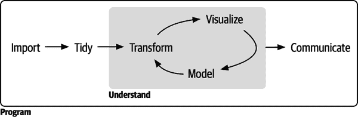
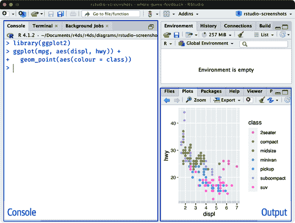

# 第一章：引言

数据科学是一门激动人心的学科，它让你能够将原始数据转化为理解、洞察和知识。《R 数据科学》的目标是帮助你学习 R 语言中最重要的工具，以便你能够高效和可重复地进行数据科学工作，并在学习过程中享受乐趣！阅读本书后，你将掌握处理各种数据科学挑战所需的工具，使用 R 语言的最佳部分。

# 第二版序言

欢迎阅读《*R 数据科学*（R4DS）》第二版！这是第一版的重大改编，我们删除了我们认为不再有用的内容，添加了我们希望在第一版中包括的内容，并总体上更新了文本和代码以反映最佳实践的变化。我们也非常高兴地欢迎新的合著者：Mine Çetinkaya-Rundel，一位著名的数据科学教育家，也是我们在 Posit（以前被称为 RStudio 的公司）的同事之一。

下面是最大变化的简要总结：

+   书籍的第一部分已更名为“整体游戏”。本节的目标是在深入细节之前为你提供数据科学的整体概述。

+   书籍的第二部分是“可视化”。与第一版相比，本部分对数据可视化工具和最佳实践进行了更全面的覆盖。获取所有细节的最佳地点仍然是[ggplot2 书籍](https://oreil.ly/HNIie)，但现在《R4DS》覆盖了更多最重要的技术。

+   书籍的第三部分现在被称为“变换”，并增加了关于数字、逻辑向量和缺失值的新章节。这些内容以前是数据转换章节的一部分，但需要更多的空间来涵盖所有细节。

+   书籍的第四部分称为“导入”。这是一套新的章节，不仅涵盖了从平面文本文件读取数据的方法，还包括了与电子表格的工作、从数据库中获取数据、处理大数据、整理层次化数据以及从网站抓取数据的方法。

+   “程序”部分保留了下来，但已从头到尾重写，重点放在函数编写和迭代的最重要部分上。函数编写现在包括如何包装 tidyverse 函数的详细信息（处理 tidy 评估的挑战），因为这在过去几年变得更加容易和重要。我们新增了一章介绍了基本 R 函数的重要内容，这些函数在你可能遇到的 R 代码中也常见。

+   “建模”部分已被移除。我们以前没有足够的空间来全面展示建模的全部，而现在有更好的资源可用。我们一般建议使用[tidymodels packages](https://oreil.ly/0giAa)并阅读《[*Tidy Modeling with R*](https://oreil.ly/9Op9s)》（Max Kuhn 和 Julia Silge 著，O’Reilly）。

+   “沟通”部分保留了下来，但已彻底更新，使用[Quarto](https://oreil.ly/_6LNH)代替 R Markdown。本书的这一版已经使用 Quarto 编写，显然这是未来的工具。

# 你将学到什么

数据科学是一个广阔的领域，通过阅读一本书是无法掌握所有内容的。本书旨在为您提供最重要工具的坚实基础，并在必要时提供足够的知识来寻找更多学习资源。我们的典型数据科学项目步骤模型类似于图 I-1。



###### 图 I-1\. 在我们的数据科学过程模型中，您从数据导入和整理开始。接下来，通过转换、可视化和建模的迭代循环理解您的数据。最后，通过向其他人交流您的结果来完成整个过程。

首先，您必须将数据导入到 R 中。这通常意味着您从文件、数据库或 Web 应用程序编程接口（API）中获取数据，并将其加载到 R 中的数据框中。如果您无法将数据导入 R，则无法对其进行数据科学分析！

一旦您导入了数据，将其*整理*是一个好主意。整理数据意味着将其存储在与数据集语义匹配的一致形式中。简而言之，当数据整洁时，每列都是一个变量，每行都是一个观察结果。整洁的数据很重要，因为一致的结构使您能够集中精力回答关于数据的问题，而不是为了不同功能而争取将数据放入正确的形式。

一旦您有了整洁的数据，常见的下一步是对其进行*转换*。转换包括关注感兴趣的观察结果（例如一个城市的所有人或去年的所有数据）、创建新变量作为现有变量的函数（例如从距离和时间计算速度）、以及计算一组汇总统计数据（例如计数或均值）。整理和转换一起被称为*整理*，因为将数据整理成自然工作的形式通常感觉像是一场斗争！

一旦您有了需要的变量的整洁数据，知识生成的两个主要引擎是可视化和建模。它们具有互补的优势和劣势，因此任何真实的数据分析将在它们之间进行多次迭代。

*可视化*是一种根本上的人类活动。一个好的可视化将展示出你意想不到的事情，或者对数据提出新的问题。一个好的可视化也可能暗示你正在问错误的问题，或者需要收集不同的数据。可视化可能会让你感到惊讶，但它们并不特别适合扩展，因为它们需要人类来解释。

*模型*是可视化的补充工具。一旦你的问题变得足够精确，你可以使用模型来回答它们。模型基本上是数学或计算工具，所以它们通常可以很好地扩展。即使它们不能，买更多的计算机通常比买更多的大脑便宜！但每个模型都有假设，根据其本质，模型无法质疑自己的假设。这意味着模型基本上不会让你感到惊讶。

数据科学的最后一步是*沟通*，这是任何数据分析项目中绝对关键的部分。除非你能将结果有效地传达给他人，否则你对数据的理解，无论多么深入，都是无用的。

包围所有这些工具的是*编程*。编程是你几乎在数据科学项目的每个部分都会用到的横切工具。你不需要成为一个专业程序员才能成为一名成功的数据科学家，但学习更多关于编程的知识会带来回报，因为成为更好的程序员可以让你更轻松地自动化常见任务并解决新问题。

你会在每一个数据科学项目中使用这些工具，但对于大多数项目来说，它们并不足够。这里有一个粗略的 80/20 法则：你可以使用本书中学到的工具解决大约 80%的每个项目，但你需要其他工具来解决剩余的 20%。在本书中，我们会指引你去了解更多资源。

# 如何组织本书

关于数据科学工具的前一描述大致按照在分析中使用它们的顺序进行组织（当然，你会多次迭代使用它们）。然而根据我们的经验，先学习数据导入和整理是次优的，因为 80%的时间是例行公事和无聊的，另外 20%的时间则是奇怪和令人沮丧的。这不是学习新科目的好起点！相反，我们将从已经导入和整理过的数据的可视化和转换开始。这样，当你处理自己的数据时，你的动力会保持高涨，因为你知道付出的努力是值得的。

每一章内部，我们都力求保持一致的模式：从一些激励性的例子开始，让你看到整体图景，然后深入细节。本书的每个部分都配有练习，帮助你实践所学。虽然跳过练习可能很诱人，但没有比在真实问题上实践更好的学习方法。

# 你不会学到的内容

本书没有涵盖几个重要的主题。我们认为保持无情地专注于基本内容非常重要，这样你就能尽快投入使用。这意味着本书无法涵盖每一个重要主题。

## 建模

建模对于数据科学非常重要，但它是一个庞大的主题，不幸的是，我们在这里无法为它提供应有的覆盖面。想要了解更多关于建模的内容，我们强烈推荐[*Tidy Modeling with R*](https://oreil.ly/9Op9s)，这本书由我们的同事 Max Kuhn 和 Julia Silge（O’Reilly）撰写。这本书将教你 tidymodels 系列的包，顾名思义，它们与我们在本书中使用的 tidyverse 包共享许多约定。

## 大数据

本书自豪地并主要关注小型内存数据集。这是开始的正确地方，因为除非你有小数据的经验，否则无法处理大数据。你在本书的大部分内容中学到的工具将轻松处理数百兆字节的数据，并且通过一些小心的处理，你通常可以使用它们处理几吉字节的数据。我们还会向你展示如何从数据库和 Parquet 文件中获取数据，这两者通常用于存储大数据。你不一定能够处理整个数据集，但这并不是问题，因为你只需处理感兴趣问题的子集或子样本。

如果你经常处理较大的数据（例如 10–100 GB），我们建议你了解更多关于[data.table](https://oreil.ly/GG4Et)的信息。我们在这里不教授它，因为它使用的界面与 tidyverse 不同，并需要你学习一些不同的约定。然而，它的运行速度非常快，性能回报值得你投入一些时间去学习，特别是在处理大数据时。

## Python、Julia 和朋友们

在本书中，你不会学习任何关于 Python、Julia 或其他对数据科学有用的编程语言的内容。这并不是因为我们认为这些工具不好。它们并不差！实际上，大多数数据科学团队都同时使用多种语言，通常至少包括 R 和 Python。但我们坚信，最好一次只精通一种工具，而 R 是一个很好的起点。

# 先决条件

我们做了一些关于你已经掌握的知识的假设，以便你能从本书中获取最大收益。你应该具备一般的数字素养，如果你已经有一些基本的编程经验会更有帮助。如果你以前从未编程过，你可能会发现[Hands-On Programming with R](https://oreil.ly/8uiH5)（O'Reilly）由 Garrett Grolemund 编写，对本书是一个有价值的补充。

为了在本书中运行代码，你需要四样东西：R，RStudio，一个名为*tidyverse*的 R 包集合，以及少数其他包。包是可重复使用的 R 代码的基本单元。它们包括可重复使用的函数、描述如何使用它们的文档以及示例数据。

## R

要下载 R，请访问 [CRAN](https://oreil.ly/p3_RG)，*c*omprehensive *R* *a*rchive *n*etwork。R 每年发布一个新的主要版本，每年还会发布两到三个次要版本。定期更新是个好主意。升级可能有点麻烦，特别是对于需要重新安装所有包的主要版本来说，但拖延只会让情况变得更糟。我们建议使用本书的 R 4.2.0 或更高版本。

## RStudio

RStudio 是一个用于 R 编程的集成开发环境（IDE），你可以从 [RStudio 下载页面](https://oreil.ly/pxF-k) 下载。RStudio 每年更新几次，并且会在新版本发布时自动通知你，所以无需经常检查。定期升级以利用最新和最好的功能是个好主意。确保至少安装了 RStudio 2022.02.0。

当你启动 RStudio，图 I-2，你会看到界面中的两个关键区域：控制台窗格和输出窗格。目前，你只需知道在控制台窗格中输入 R 代码并按 Enter 键运行即可。随着我们的学习，你会了解更多！¹



###### 图 I-2\. RStudio IDE 有两个关键区域：左侧的控制台窗格输入 R 代码，右侧的输出窗格查看图形。

## Tidyverse

你还需要安装一些 R 包。R 包是扩展基本 R 能力的函数、数据和文档的集合。使用包对成功使用 R 是至关重要的。你将在本书中学习的大多数包都属于所谓的 tidyverse。tidyverse 中的所有包都共享一种数据和 R 编程的共同理念，并且设计成可以共同工作。

你可以用一行代码安装完整的 tidyverse：

```
install.packages("tidyverse")
```

在你的电脑上，在控制台中键入该行代码，然后按 Enter 键运行。R 将从 CRAN 下载这些包并安装到你的电脑上。

在加载包之前，你将无法使用包中的函数、对象或帮助文件。安装完包后，可以使用 [`library()`](https://rdrr.io/r/base/library.xhtml) 函数加载它：

```
library(tidyverse)
#> ── Attaching core tidyverse packages ───────────────────── tidyverse 2.0.0 ──
#> ✔ dplyr     1.1.0.9000     ✔ readr     2.1.4 
#> ✔ forcats   1.0.0          ✔ stringr   1.5.0 
#> ✔ ggplot2   3.4.1          ✔ tibble    3.1.8 
#> ✔ lubridate 1.9.2          ✔ tidyr     1.3.0 
#> ✔ purrr     1.0.1 
#> ── Conflicts ─────────────────────────────────────── tidyverse_conflicts() ──
#> ✖ dplyr::filter() masks stats::filter()
#> ✖ dplyr::lag()    masks stats::lag()
#> ℹ Use the conflicted package (<http://conflicted.r-lib.org/>) to force all 
#>   conflicts to become errors
```

这告诉你 tidyverse 加载了九个包：dplyr, forcats, ggplot2, lubridate, purrr, readr, stringr, tibble 和 tidyr。这些被认为是 tidyverse 的*核心*，因为你几乎在每次分析中都会使用它们。

tidyverse 中的包经常变化。你可以通过运行 [`tidyverse_update()`](https://tidyverse.tidyverse.org/reference/tidyverse_update.xhtml) 查看是否有更新。

## 其他包

有许多其他优秀的包不属于 tidyverse，因为它们解决的问题领域不同，或者设计原则不同。这并不意味着它们更好或更差；这只是使它们不同。换句话说，与 tidyverse 相对应的不是 messyverse，而是许多其他互相关联的包的宇宙。随着您使用 R 处理更多数据科学项目，您将学习到新的包和处理数据的新方法。

在本书中，我们将使用许多 tidyverse 之外的包。例如，我们将使用以下包，因为它们为我们提供了在学习 R 过程中使用的有趣数据集：

```
install.packages(c("arrow", "babynames", "curl", "duckdb", "gapminder", "ggrepel", 
"ggridges", "ggthemes", "hexbin", "janitor", "Lahman", "leaflet", "maps", 
"nycflights13", "openxlsx", "palmerpenguins", "repurrrsive", "tidymodels", "writexl"))
```

我们还将使用一些其他包作为临时示例。您现在不需要安装它们，只需记住，无论何时看到像这样的错误：

```
library(ggrepel)
#> Error in library(ggrepel) : there is no package called ‘ggrepel’
```

这意味着您需要运行 `install.packages("ggrepel")` 来安装该包。

# 运行 R 代码

前一节向您展示了运行 R 代码的几个示例。书中的代码看起来像这样：

```
1 + 2
#> [1] 3
```

如果您在本地控制台中运行相同的代码，它将如下所示：

```
> 1 + 2
[1] 3
```

主要有两个区别。在控制台中，您在`>`后面输入，称为*提示*；我们在书中不显示提示。在书中，输出用`#>`注释掉；在控制台中，它直接出现在您的代码之后。这两个差异意味着，如果您使用电子版书籍，您可以轻松地从书中复制代码并粘贴到控制台中。

本书中，我们使用一致的约定来引用代码：

+   函数显示为代码字体，并带括号，例如[`sum()`](https://rdrr.io/r/base/sum.xhtml)或[`mean()`](https://rdrr.io/r/base/mean.xhtml)。

+   其他 R 对象（例如数据或函数参数）以代码字体显示，不带括号，如`flights`或`x`。

+   有时为了明确对象来自哪个包，我们会使用包名后跟两个冒号，例如[`dplyr::mutate()`](https://dplyr.tidyverse.org/reference/mutate.xhtml)或[`nycflights13::flights`](https://rdrr.io/pkg/nycflights13/man/flights.xhtml)。这也是有效的 R 代码。

# 本书中使用的其他约定。

本书使用以下排版约定：

*斜体*

指示网址和电子邮件地址。

`常宽`

用于程序列表，以及段落中用于引用变量或函数名称、数据库、数据类型、环境变量、语句、关键字和文件名等程序元素的文本。

**`常宽粗体`**

显示用户应按照字面意思输入的命令或其他文本。

*`常宽斜体`*

显示应替换为用户提供的值或由上下文确定的值的文本。

###### 注意

这个元素表示一般注释。

###### 警告

这个元素表示一个警告或注意。

# O’Reilly 在线学习

###### 注意

超过 40 年来，[*O’Reilly Media*](https://oreilly.com) 提供技术和商业培训、知识和洞察，帮助公司取得成功。

我们独特的专家和创新者网络通过书籍、文章和我们的在线学习平台分享他们的知识和专长。O’Reilly 的在线学习平台为您提供按需访问的现场培训课程、深入学习路径、互动编码环境，以及来自 O’Reilly 和其他 200 多家出版商的大量文本和视频。更多信息，请访问[*https://oreilly.com*](https://oreilly.com)。

# 如何联系我们

有关本书的评论和问题，请联系出版商：

+   O’Reilly Media, Inc.

+   1005 Gravenstein Highway North

+   Sebastopol, CA 95472

+   800-889-8969（美国或加拿大）

+   707-829-7019（国际或本地）

+   707-829-0104（传真）

+   *support@oreilly.com*

+   [*https://www.oreilly.com/about/contact.xhtml*](https://www.oreilly.com/about/contact.xhtml)

我们为本书设有网页，列出勘误、示例和任何额外信息。您可以访问此页面：[*https://oreil.ly/r-for-data-science-2e*](https://oreil.ly/r-for-data-science-2e)。

获取有关我们的书籍和课程的新闻和信息，请访问[*https://oreilly.com*](https://oreilly.com)。

在 LinkedIn 上找到我们：[*https://linkedin.com/company/oreilly-media*](https://linkedin.com/company/oreilly-media)

在 Twitter 上关注我们：[*https://twitter.com/oreillymedia*](https://twitter.com/oreillymedia)

在 YouTube 上关注我们：[*https://www.youtube.com/oreillymedia*](https://www.youtube.com/oreillymedia)

# 致谢

本书不仅仅是 Hadley、Mine 和 Garrett 的产品，而是与 R 社区许多人（面对面和在线）进行的许多对话的结果。我们非常感激与大家的每一次交流；非常感谢！

我们要感谢我们的技术审阅者们提供的宝贵反馈：Ben Baumer、Lorna Barclay、Richard Cotton、Emma Rand 和 Kelly Bodwin。

这本书是在公开平台上编写的，许多人通过拉取请求做出了贡献。特别感谢所有 259 位通过 GitHub 拉取请求进行改进的人（按用户名字母顺序排列）：@a-rosenberg，Tim Becker（@a2800276），Abinash Satapathy（@Abinashbunty），Adam Gruer（@adam-gruer），adi pradhan（@adidoit），A. s.（@Adrianzo），Aep Hidyatuloh（@aephidayatuloh），Andrea Gilardi（@agila5），Ajay Deonarine（@ajay-d），@AlanFeder，Daihe Sui（@alansuidaihe），@alberto-agudo，@AlbertRapp，@aleloi，pete（@alonzi），Alex（@ALShum），Andrew M.（@amacfarland），Andrew Landgraf（@andland），@andyhuynh92，Angela Li（@angela-li），Antti Rask（@AnttiRask），LOU Xun（@aquarhead），@ariespirgel，@august-18，Michael Henry（@aviast），Azza Ahmed（@azzaea），Steven Moran（@bambooforest），Brian G. Barkley（@BarkleyBG），Mara Averick（@batpigandme），Oluwafemi OYEDELE（@BB1464），Brent Brewington（@bbrewington），Bill Behrman（@behrman），Ben Herbertson（@benherbertson），Ben Marwick（@benmarwick），Ben Steinberg（@bensteinberg），Benjamin Yeh（@bentyeh），Betul Turkoglu（@betulturkoglu），Brandon Greenwell（@bgreenwell），Bianca Peterson（@BinxiePeterson），Birger Niklas（@BirgerNi），Brett Klamer（@bklamer），@boardtc，Christian（@c-hoh），Caddy（@caddycarine），Camille V Leonard（@camillevleonard），@canovasjm，Cedric Batailler（@cedricbatailler），Christina Wei（@christina-wei），Christian Mongeau（@chrMongeau），Cooper Morris（@coopermor），Colin Gillespie（@csgillespie），Rademeyer Vermaak（@csrvermaak），Chloe Thierstein（@cthierst），Chris Saunders（@ctsa），Abhinav Singh（@curious-abhinav），Curtis Alexander（@curtisalexander），Christian G. Warden（@cwarden），Charlotte Wickham（@cwickham），Kenny Darrell（@darrkj），David Kane（@davidkane9），David（@davidrsch），David Rubinger（@davidrubinger），David Clark（@DDClark），Derwin McGeary（@derwinmcgeary），Daniel Gromer（@dgromer），@Divider85，@djbirke，Danielle Navarro（@djnavarro），Russell Shean（@DOH-RPS1303），Zhuoer Dong（@dongzhuoer），Devin Pastoor（@dpastoor），@DSGeoff，Devarshi Thakkar（@dthakkar09），Julian During（@duju211），Dylan Cashman（@dylancashman），Dirk Eddelbuettel（@eddelbuettel），Edwin Thoen（@EdwinTh），Ahmed El-Gabbas（@elgabbas），Henry Webel（@enryH），Ercan Karadas（@ercan7），Eric Kitaif（@EricKit），Eric Watt（@ericwatt），Erik Erhardt（@erikerhardt），Etienne B. Racine（@etiennebr），Everett Robinson（@evjrob），@fellennert，Flemming Miguel（@flemmingmiguel），Floris Vanderhaeghe（@florisvdh），@funkybluehen，@gabrivera，Garrick Aden-Buie（@gadenbuie），Peter Ganong（@ganong123），Gerome Meyer（@GeroVanMi），Gleb Ebert（@gl-eb），Josh Goldberg（@GoldbergData），bahadir cankardes（@gridgrad），Gustav W Delius（@gustavdelius），Hao Chen（@hao-trivago），Harris McGehee（@harrismcgehee），@hendrikweisser，Hengni Cai（@hengnicai），Iain（@Iain-S），Ian Sealy（@iansealy），Ian Lyttle（@ijlyttle），Ivan Krukov（@ivan-krukov），Jacob Kaplan（@jacobkap），Jazz Weisman（@jazzlw），John Blischak（@jdblischak），John D. Storey（@jdstorey），Gregory Jefferis（@jefferis），Jeffrey Stevens（@JeffreyRStevens），蒋雨蒙（@JeldorPKU），Jennifer（Jenny）Bryan（@jennybc），Jen Ren（@jenren），Jeroen Janssens（@jeroenjanssens），@jeromecholewa，Janet Wesner（@jilmun），Jim Hester（@jimhester），JJ Chen（@jjchern），Jacek Kolacz（@jkolacz），Joanne Jang（@joannejang），@johannes4998，John Sears（@johnsears），@jonathanflint，Jon Calder（@jonmcalder），Jonathan Page（@jonpage），Jon Harmon（@jonthegeek），JooYoung Seo（@jooyoungseo），Justinas Petuchovas（@jpetuchovas），Jordan（@jrdnbradford），Jeffrey Arnold（@jrnold），Jose Roberto Ayala Solares（@jroberayalas），Joyce Robbins（@jtr13），@juandering，Julia Stewart Lowndes（@jules32），Sonja（@kaetschap），Kara Woo（@karawoo），Katrin Leinweber（@katrinleinweber），Karandeep Singh（@kdpsingh），Kevin Perese（@kevinxperese），Kevin Ferris（@kferris10），Kirill Sevastyanenko（@kirillseva），Jonathan Kitt（@KittJonathan），@koalabearski，Kirill Müller（@krlmlr），Rafał Kucharski（@kucharsky），Kevin Wright（@kwstat），Noah Landesberg（@landesbergn），Lawrence Wu（@lawwu），@lindbrook，Luke W Johnston（@lwjohnst86），Kara de la Marck（@MarckK），Kunal Marwaha（@marwahaha），Matan Hakim（@matanhakim），Matthias Liew（@MatthiasLiew），Matt Wittbrodt（@MattWittbrodt），Mauro Lepore（@maurolepore），Mark Beveridge（@mbeveridge），@mcewenkhundi，mcsnowface，PhD（@mcsnowface），Matt Herman（@mfherman），Michael Boerman（@michaelboerman），Mitsuo Shiota（@mitsuoxv），Matthew Hendrickson（@mjhendrickson），@MJMarshall，Misty Knight-Finley（@mkfin7），Mohammed Hamdy（@mmhamdy），Maxim Nazarov（@mnazarov），Maria Paula Caldas（@mpaulacaldas），Mustafa Ascha（@mustafaascha），Nelson Areal（@nareal），Nate Olson（@nate-d-olson），Nathanael（@nateaff），@nattalides，Ned Western（@NedJWestern），Nick Clark（@nickclark1000），@nickelas，Nirmal Patel（@nirmalpatel），Nischal Shrestha（@nischalshrestha），Nicholas Tierney（@njtierney），Jakub Nowosad（@Nowosad），Nick Pullen（@nstjhp），@olivier6088，Olivier Cailloux（@oliviercailloux），Robin Penfold（@p0bs），Pablo E. Garcia（@pabloedug），Paul Adamson（@padamson），Penelope Y（@penelopeysm），Peter Hurford（@peterhurford），Peter Baumgartner（@petzi53），Patrick Kennedy（@pkq），Pooya Taherkhani（@pooyataher），Y. Yu（@PursuitOfDataScience），Radu Grosu（@radugrosu），Ranae Dietzel（@Ranae），Ralph Straumann（@rastrau），Rayna M Harris（@raynamharris），@ReeceGoding，

# 在线版本

这本书的在线版本可以在书的[GitHub 仓库](https://oreil.ly/8GLe7)找到。在实体书重印之间，它将继续更新。书的源代码可以在[*https://oreil.ly/Q8z_O*](https://oreil.ly/Q8z_O)找到。这本书是由[Quarto](https://oreil.ly/_6LNH)驱动的，它使得编写结合文本和可执行代码的书籍变得简单。

¹ 如果您想全面了解 RStudio 的所有功能，请参阅[RStudio 用户指南](https://oreil.ly/pRhEK)。
