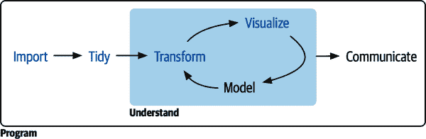

# 第一部分：整个游戏

本书的这一部分的目标是为您快速概述数据科学的主要工具：*导入*、*整理*、*转换*和*可视化数据*，如图 I-1 所示。我们希望向您展示数据科学的“整个游戏”，为您提供足够的所有主要部分，以便您能够处理真实，尽管简单的数据集。本书的后续部分将更深入地讨论每个主题，扩展您处理数据科学挑战的能力。

###### 图 I-1. 在本书的这一部分中，您将学习如何导入、整理、转换和可视化数据。

四章专注于数据科学工具：

+   以可视化开始 R 编程是一个很好的选择，因为其效果非常明显：您可以制作优雅且信息丰富的图表，帮助您理解数据。在第一章中，您将深入学习可视化，了解 ggplot2 图表的基本结构以及将数据转化为图表的强大技术。

+   单凭可视化通常不足够，因此在第三章中，您将学习关键动词，使您能够选择重要变量，筛选关键观察结果，创建新变量并计算摘要。

+   在第五章中，您将学习整洁数据，这是一种一致的存储数据的方式，使得转换、可视化和建模更加容易。您将学习其基本原则以及如何将数据整理为整洁形式。

+   在您能够转换和可视化数据之前，您需要首先将数据导入到 R 中。在第七章中，您将学习将 `.csv` 文件导入 R 的基础知识。

在这些章节中间，还有四章专注于您的 R 工作流。在第二章，第四章和第六章中，您将学习编写和组织 R 代码的良好工作流实践。这些将为您长远成功打下基础，因为它们将为您在处理实际项目时保持组织提供工具。最后，第八章将教您如何获取帮助和持续学习。
