# 第一章：数据可视化

# 引言

> “简单的图表给数据分析师带来的信息比任何其他设备都多。” —John Tukey

R 有几种制作图形的系统，但 ggplot2 是其中最优雅和最多才多艺的之一。ggplot2 实现了*图形语法*，这是一种描述和构建图形的一致系统。通过学习并在多个场景中应用 ggplot2，你能更快速地完成更多工作。

本章将教你如何使用 ggplot2 来可视化你的数据。我们将从创建一个简单的散点图开始，介绍美学映射和几何对象——ggplot2 的基本构建块。接着，我们将指导你如何可视化单变量的分布以及两个或多个变量之间的关系。最后，我们将讲解如何保存你的图形以及故障排除技巧。

## 先决条件

本章重点介绍 ggplot2，这是 tidyverse 中的核心包之一。要访问本章中使用的数据集、帮助页面和函数，请运行：

```
library(tidyverse)
#> ── Attaching core tidyverse packages ───────────────────── tidyverse 2.0.0 ──
#> ✔ dplyr     1.1.0.9000     ✔ readr     2.1.4 
#> ✔ forcats   1.0.0          ✔ stringr   1.5.0 
#> ✔ ggplot2   3.4.1          ✔ tibble    3.1.8 
#> ✔ lubridate 1.9.2          ✔ tidyr     1.3.0 
#> ✔ purrr     1.0.1 
#> ── Conflicts ─────────────────────────────────────── tidyverse_conflicts() ──
#> ✖ dplyr::filter() masks stats::filter()
#> ✖ dplyr::lag()    masks stats::lag()
#> ℹ Use the conflicted package (<http://conflicted.r-lib.org/>) to force all 
#>   conflicts to become errors
```

那一行代码加载了核心 tidyverse，这些包几乎在每次数据分析中都会用到。它还告诉你 tidyverse 中的哪些函数与基础 R（或其他可能已加载的包）中的函数冲突。¹

如果运行此代码出现错误消息 `there is no package called 'tidyverse'`，你需要首先安装它，然后再次运行 [`library()`](https://rdrr.io/r/base/library.xhtml)：

```
install.packages("tidyverse")
library(tidyverse)
```

你只需要安装一次软件包，但每次启动新会话时都需要加载它。

除了 tidyverse，我们还将使用 palmerpenguins 包，其中包括 `penguins` 数据集，其中包含了南极洲帕尔默群岛上三个岛屿上企鹅的体测量数据，以及 ggthemes 包，提供色盲安全的配色方案。

```
library(palmerpenguins)
library(ggthemes)
```

# 第一步

长翼鳐鸟的鳍比短翼鳐鸟的鳍更重还是更轻？你可能已经有了答案，但试着让你的答案更精确。鳍长和体重之间的关系是什么样子的？是正相关？负相关？线性？非线性？这种关系是否因鳐鸟的物种而异？以及它们所在的岛屿是否有影响？让我们创建可视化图表来回答这些问题。

## 企鹅数据帧

你可以使用 palmerpenguins 中的 `penguins` 数据帧来测试这些问题的答案（又名 [`palmerpenguins::penguins`](https://allisonhorst.github.io/palmerpenguins/reference/penguins.xhtml)）。数据帧是一个包含变量（列）和观测（行）的矩形集合。`penguins` 包含了由 Kristen Gorman 博士和帕尔默站南极洲 LTER 团队收集并提供的 344 个观测数据。²

为了讨论更容易，让我们先定义一些术语：

变量

可以测量的数量、质量或属性。

值

当你测量它时变量的状态。变量的值可能会从一次测量到一次测量发生变化。

观察

一组在相似条件下进行的测量（通常您在一个观察中同时进行所有测量并在同一个对象上进行）。一个观察将包含几个值，每个与不同的变量相关联。我们有时将观察称为*数据点*。

表格数据

一组值，每个与一个变量和一个观测相关联。如果每个值放在自己的“单元格”中，每个变量放在自己的列中，每个观测放在自己的行中，则表格数据是*tidy*。

在这种情况下，变量指的是所有企鹅的属性，而观察指的是单个企鹅的所有属性。

在控制台中输入数据框的名称，R 会打印其内容的预览。请注意，预览顶部写着`tibble`。在整洁的宇宙中，我们使用称为*tibbles*的特殊数据框，你很快就会了解到。

```
penguins
#> # A tibble: 344 × 8
#>   species island    bill_length_mm bill_depth_mm flipper_length_mm
#>   <fct>   <fct>              <dbl>         <dbl>             <int>
#> 1 Adelie  Torgersen           39.1          18.7               181
#> 2 Adelie  Torgersen           39.5          17.4               186
#> 3 Adelie  Torgersen           40.3          18                 195
#> 4 Adelie  Torgersen           NA            NA                  NA
#> 5 Adelie  Torgersen           36.7          19.3               193
#> 6 Adelie  Torgersen           39.3          20.6               190
#> # … with 338 more rows, and 3 more variables: body_mass_g <int>, sex <fct>,
#> #   year <int>
```

此数据框包含八列。要查看所有变量和每个变量的前几个观测的另一种视图，请使用[`glimpse()`](https://pillar.r-lib.org/reference/glimpse.xhtml)。或者，如果您在 RStudio 中，请运行`View(penguins)`以打开交互式数据查看器。

```
glimpse(penguins)
#> Rows: 344
#> Columns: 8
#> $ species           <fct> Adelie, Adelie, Adelie, Adelie, Adelie, Adelie, A…
#> $ island            <fct> Torgersen, Torgersen, Torgersen, Torgersen, Torge…
#> $ bill_length_mm    <dbl> 39.1, 39.5, 40.3, NA, 36.7, 39.3, 38.9, 39.2, 34.…
#> $ bill_depth_mm     <dbl> 18.7, 17.4, 18.0, NA, 19.3, 20.6, 17.8, 19.6, 18.…
#> $ flipper_length_mm <int> 181, 186, 195, NA, 193, 190, 181, 195, 193, 190, …
#> $ body_mass_g       <int> 3750, 3800, 3250, NA, 3450, 3650, 3625, 4675, 347…
#> $ sex               <fct> male, female, female, NA, female, male, female, m…
#> $ year              <int> 2007, 2007, 2007, 2007, 2007, 2007, 2007, 2007, 2…
```

`penguins`中的变量包括：

`species`

企鹅的物种（阿德利企鹅、燕鸥企鹅或巴拉鸭企鹅）

`flipper_length_mm`

企鹅鳍长度，以毫米为单位

`body_mass_g`

企鹅的体重，以克为单位

要了解更多关于`penguins`的信息，请通过运行[`?penguins`](https://allisonhorst.github.io/palmerpenguins/reference/penguins.xhtml)打开其帮助页面。

## 终极目标

本章的最终目标是重新创建以下可视化，显示企鹅的鳍长度与体重之间的关系，考虑到企鹅的物种。

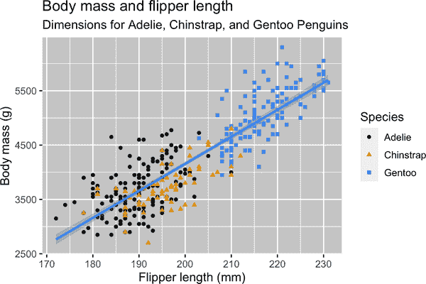

## 创建一个 ggplot

让我们一步一步重新创建这个图。

使用 ggplot2，您可以使用函数[`ggplot()`](https://ggplot2.tidyverse.org/reference/ggplot.xhtml)开始绘制图表，定义一个图表对象，然后添加*图层*。[`ggplot()`](https://ggplot2.tidyverse.org/reference/ggplot.xhtml)的第一个参数是图表中要使用的数据集，因此`ggplot(data = penguins)`创建了一个空图表，准备显示`penguins`数据，但由于我们还没有告诉它如何可视化数据，所以目前它是空的。这并不是一个非常令人兴奋的图表，但您可以把它想象成一个空画布，在这里您将绘制图表的其余部分的图层。

```
ggplot(data = penguins)
```


接下来，我们需要告诉[`ggplot()`](https://ggplot2.tidyverse.org/reference/ggplot.xhtml)如何将我们的数据信息在视觉上呈现出来。[`ggplot()`](https://ggplot2.tidyverse.org/reference/ggplot.xhtml)函数的`mapping`参数定义了如何将数据集中的变量映射到图表的视觉属性（*美学*）。`mapping`参数总是在[`aes()`](https://ggplot2.tidyverse.org/reference/aes.xhtml)函数中定义，[`aes()`](https://ggplot2.tidyverse.org/reference/aes.xhtml)函数的`x`和`y`参数指定了要映射到 x 轴和 y 轴的变量。现在，我们将仅将翻转器长度映射到`x`美学属性，将身体质量映射到`y`美学属性。ggplot2 在`data`参数中查找映射的变量，此处为`penguins`数据集。

以下图表显示了添加这些映射的结果。

```
ggplot(
  data = penguins,
  mapping = aes(x = flipper_length_mm, y = body_mass_g)
)
```

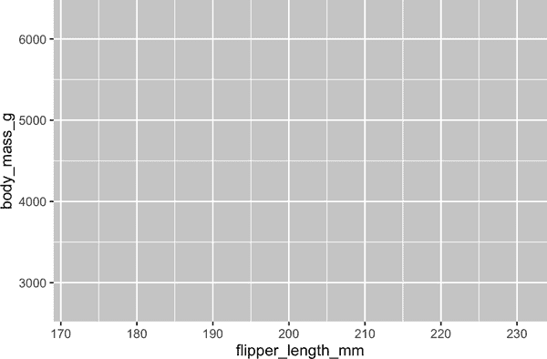

现在我们的空画布具有更多的结构——清楚地显示了翻转器长度将显示在 x 轴上，身体质量将显示在 y 轴上。但是企鹅自身还没有显示在图表上。这是因为我们还没有在我们的代码中表达如何在图表上表示数据帧中的观测值。

为此，我们需要定义一个*几何对象*（geom）：图表用于表示数据的几何对象。在 ggplot2 中，这些几何对象通过以`geom_`开头的函数提供。人们通常通过图表使用的几何对象类型来描述图表。例如，柱状图使用柱形几何对象([`geom_bar()`](https://ggplot2.tidyverse.org/reference/geom_bar.xhtml))，折线图使用线条几何对象([`geom_line()`](https://ggplot2.tidyverse.org/reference/geom_path.xhtml))，箱线图使用箱线图几何对象([`geom_boxplot()`](https://ggplot2.tidyverse.org/reference/geom_boxplot.xhtml))，散点图使用点几何对象([`geom_point()`](https://ggplot2.tidyverse.org/reference/geom_point.xhtml))，依此类推。

函数[`geom_point()`](https://ggplot2.tidyverse.org/reference/geom_point.xhtml)将一个点层添加到您的图表中，从而创建一个散点图。ggplot2 提供了许多 geom 函数，每个函数都向图表添加不同类型的层。您将在本书中学习到许多这样的 geoms，特别是在第九章中。

```
ggplot(
  data = penguins,
  mapping = aes(x = flipper_length_mm, y = body_mass_g)
) +
  geom_point()
#> Warning: Removed 2 rows containing missing values (`geom_point()`).
```

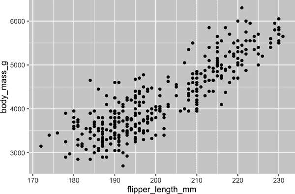

现在我们得到了看起来像我们可能认为的“散点图”的东西。它还不完全符合我们的“最终目标”图，但是使用这个图，我们可以开始回答促使我们探索的问题：“翼鳍长度和体重之间的关系是什么样的？”这种关系似乎是正向的（随着翼鳍长度的增加，体重也增加），相当线性（点围绕一条线而不是曲线聚集），并且适度强（围绕这样一条线没有太多的散布）。翼鳍更长的企鹅通常在体重上更大。

在我们向这张图添加更多图层之前，让我们暂停一下，回顾一下我们收到的警告消息：

> 删除了包含缺失值的 2 行数据（[`geom_point()`](https://ggplot2.tidyverse.org/reference/geom_point.xhtml)）。

我们看到这条消息是因为我们的数据集中有两只企鹅的体重和/或翼鳍长度数值缺失，ggplot2 无法在图表中表示它们。与 R 一样，ggplot2 秉持缺失值不应该悄悄消失的理念。当处理真实数据时，这种警告消息可能是您会遇到的最常见的警告之一——缺失值是一个常见问题，您将在本书中更多地了解到它们，特别是在第十八章中。在本章的其余绘图中，我们将抑制此警告，以便它不会在每个单独的绘图旁边打印出来。

## 添加美学和图层

散点图对于展示两个数值变量之间的关系非常有用，但对于任何两个变量之间的表面关系都保持怀疑是个好主意，并询问是否有其他变量可以解释或改变这种表面关系的性质。例如，翼鳍长度和体重之间的关系是否因物种而异？让我们将物种纳入我们的图表中，看看这是否揭示了这些变量之间表面关系的任何额外洞见。我们将通过用不同颜色的点表示物种来实现这一点。

要达到这一点，我们需要修改美观或者几何？如果你猜到了“在美学映射中，[`aes()`](https://ggplot2.tidyverse.org/reference/aes.xhtml)内部”，那么你已经开始学习如何使用 ggplot2 创建数据可视化了！如果没有，不用担心。在本书中，你将制作更多的 ggplots，并有更多机会在制作它们时检查你的直觉。

```
ggplot(
  data = penguins,
  mapping = aes(x = flipper_length_mm, y = body_mass_g, color = species)
) +
  geom_point()
```

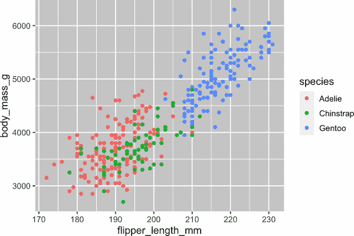

当将分类变量映射到美学时，ggplot2 会自动为变量的每个唯一级别（三个物种）分配美学的唯一值（这里是唯一颜色），这个过程称为*缩放*。ggplot2 还会添加一个解释哪些值对应哪些级别的图例。

现在让我们再添加一层：显示体重与鳍长之间关系的平滑曲线。在继续之前，请参考先前的代码，并考虑如何将其添加到我们现有的图形中。

由于这是表示我们数据的新几何对象，我们将在我们的点几何层之上添加一个新的几何层：[`geom_smooth()`](https://ggplot2.tidyverse.org/reference/geom_smooth.xhtml)。我们将指定基于`l`inear `m`odel 和`method = "lm"`绘制最佳拟合线。

```
ggplot(
  data = penguins,
  mapping = aes(x = flipper_length_mm, y = body_mass_g, color = species)
) +
  geom_point() +
  geom_smooth(method = "lm")
```

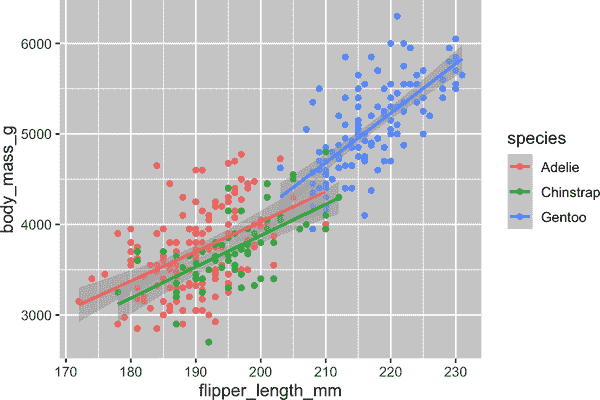

我们成功地添加了线条，但这个图形看起来不像“最终目标”中的图形，后者只有一条线代表整个数据集，而不是每个企鹅物种分别的线条。

当在[`ggplot()`](https://ggplot2.tidyverse.org/reference/ggplot.xhtml)中定义美学映射时，它们是在*全局*级别传递给绘图的每个后续几何层。然而，ggplot2 中的每个几何函数也可以接受一个`mapping`参数，允许在*局部*级别进行美学映射，这些映射会添加到从全局级别继承的映射中。由于我们希望根据物种对点进行着色，但不希望将线分隔开来，我们应该仅为[`geom_point()`](https://ggplot2.tidyverse.org/reference/geom_point.xhtml)指定`color = species`。

```
ggplot(
  data = penguins,
  mapping = aes(x = flipper_length_mm, y = body_mass_g)
) +
  geom_point(mapping = aes(color = species)) +
  geom_smooth(method = "lm")
```

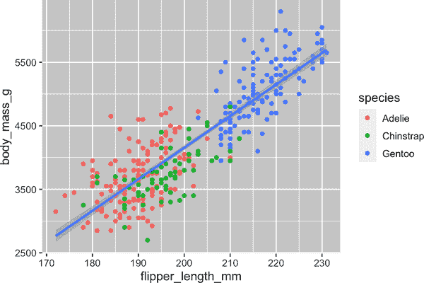

瞧！我们得到了一些非常接近我们终极目标的东西，尽管它还不完美。我们仍然需要为每个企鹅物种使用不同的形状，并改进标签。

通常不建议仅使用颜色在图表上表示信息，因为人们由于色盲或其他色觉差异可能会对颜色有不同的感知。因此，除了颜色外，我们还可以将 `species` 映射到 `shape` 美学上。

```
ggplot(
  data = penguins,
  mapping = aes(x = flipper_length_mm, y = body_mass_g)
) +
  geom_point(mapping = aes(color = species, shape = species)) +
  geom_smooth(method = "lm")
```

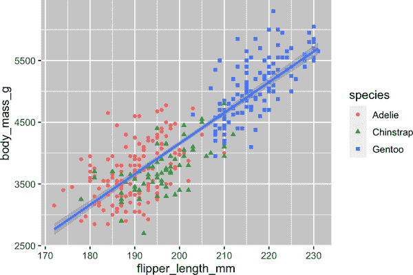

注意，图例会自动更新以反映点的不同形状。

最后，我们可以使用 [`labs()`](https://ggplot2.tidyverse.org/reference/labs.xhtml) 函数在新的层中改善图表的标签。[`labs()`](https://ggplot2.tidyverse.org/reference/labs.xhtml) 的一些参数可能是不言自明的：`title` 添加标题，`subtitle` 添加副标题到图表中。其他参数匹配美学映射：`x` 是 x 轴标签，`y` 是 y 轴标签，`color` 和 `shape` 定义图例的标签。此外，我们可以使用 ggthemes 包中的 [`scale_color_colorblind()`](https://rdrr.io/pkg/ggthemes/man/colorblind.xhtml) 函数改善配色方案，以适应色盲人群。

```
ggplot(
  data = penguins,
  mapping = aes(x = flipper_length_mm, y = body_mass_g)
) +
  geom_point(aes(color = species, shape = species)) +
  geom_smooth(method = "lm") +
  labs(
    title = "Body mass and flipper length",
    subtitle = "Dimensions for Adelie, Chinstrap, and Gentoo Penguins",
    x = "Flipper length (mm)", y = "Body mass (g)",
    color = "Species", shape = "Species"
  ) +
  scale_color_colorblind()
```


我们终于得到了一个完美匹配我们“终极目标”的图表！

## 练习

1.  `penguins` 中有多少行？多少列？

1.  `penguins` 数据框中的 `bill_depth_mm` 变量是描述什么的？阅读 [`?penguins`](https://allisonhorst.github.io/palmerpenguins/reference/penguins.xhtml) 的帮助文件来了解。

1.  制作一个 `bill_depth_mm` 对 `bill_length_mm` 的散点图。即，将 `bill_depth_mm` 放在 y 轴，`bill_length_mm` 放在 x 轴。描述这两个变量之间的关系。

1.  如果你绘制`species`与`bill_depth_mm`的散点图会发生什么？可能有更好的几何图形选择吗？

1.  为什么以下代码会报错，你会如何修复它？

    ```
    ggplot(data = penguins) + 
      geom_point()
    ```

1.  [`geom_point()`](https://ggplot2.tidyverse.org/reference/geom_point.xhtml)中的`na.rm`参数是做什么的？这个参数的默认值是什么？创建一个散点图，其中成功使用此参数设置为`TRUE`。

1.  在你之前绘制的图表上添加以下标题：“数据来自 palmerpenguins 包。”提示：查看[`labs()`](https://ggplot2.tidyverse.org/reference/labs.xhtml)的文档。

1.  重新创建以下可视化。`bill_depth_mm`应该映射到哪个美学特征？它应该在全局级别还是在几何级别映射？

    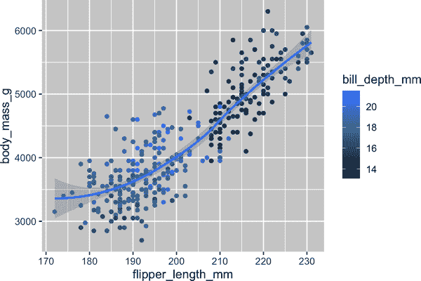

1.  在脑中运行此代码并预测输出的样子。然后，在 R 中运行代码并检查你的预测。

    ```
    ggplot(
      data = penguins,
      mapping = aes(x = flipper_length_mm, y = body_mass_g, color = island)
    ) +
      geom_point() +
      geom_smooth(se = FALSE)
    ```

1.  这两个图看起来会有不同吗？为什么/为什么不？

    ```
    ggplot(
      data = penguins,
      mapping = aes(x = flipper_length_mm, y = body_mass_g)
    ) +
      geom_point() +
      geom_smooth()

    ggplot() +
      geom_point(
        data = penguins,
        mapping = aes(x = flipper_length_mm, y = body_mass_g)
      ) +
      geom_smooth(
        data = penguins,
        mapping = aes(x = flipper_length_mm, y = body_mass_g)
      )
    ```

# `ggplot2`调用

随着我们从这些介绍性部分过渡，我们将转向更简洁的表达`ggplot2`代码。到目前为止，我们一直非常明确，这在学习过程中很有帮助：

```
ggplot(
  data = penguins,
  mapping = aes(x = flipper_length_mm, y = body_mass_g)
) +
  geom_point()
```

通常，函数的前一个或两个参数非常重要，你应该牢记它们。[`ggplot()`](https://ggplot2.tidyverse.org/reference/ggplot.xhtml)函数的前两个参数分别是`data`和`mapping`；在本书的其余部分，我们不会提供这些名称。这样做可以节省输入，减少额外文本的数量，更容易看出图之间的差异。这是一个非常重要的编程问题，我们将在第二十五章回顾。

将上一个图表以更简洁的方式重写如下：

```
ggplot(penguins, aes(x = flipper_length_mm, y = body_mass_g)) + 
  geom_point()
```

在未来，你还将学习管道符号`|>`，它将允许你使用以下代码创建该图表：

```
penguins |> 
  ggplot(aes(x = flipper_length_mm, y = body_mass_g)) + 
  geom_point()
```

# 可视化分布

如何可视化变量的分布取决于变量的类型：分类或数值型。

## 一个分类变量

如果一个变量只能取少量值中的一个，那么它是*categorical*变量。要检查分类变量的分布，可以使用条形图。条的高度显示了每个`x`值发生了多少次观察。

```
ggplot(penguins, aes(x = species)) +
  geom_bar()
```

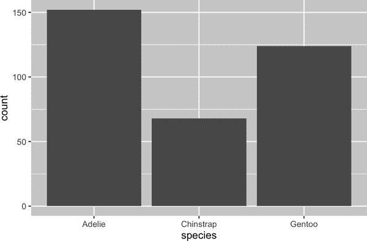

在具有非顺序级别的分类变量的条形图中，像之前的企鹅`species`一样，通常最好根据它们的频率重新排序条形。这需要将变量转换为因子（R 如何处理分类数据），然后重新排序该因子的级别。

```
ggplot(penguins, aes(x = fct_infreq(species))) +
  geom_bar()
```

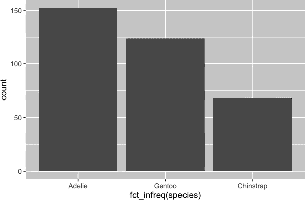

你将在第十六章中学习更多关于因子及其处理函数（如[`fct_infreq()`](https://forcats.tidyverse.org/reference/fct_inorder.xhtml)）的内容。

## 数值变量

如果一个变量能够取一系列数值，并且可以对这些数值进行加减和平均，那么这个变量就是*数值*（或定量）变量。数值变量可以是连续的或离散的。

处理连续变量分布常用的一种可视化方法是直方图。

```
ggplot(penguins, aes(x = body_mass_g)) +
  geom_histogram(binwidth = 200)
```

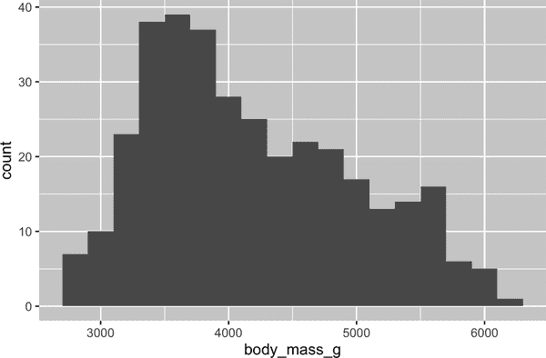

直方图将 x 轴等间隔地划分为多个区间，并使用柱的高度显示落入每个区间的观测次数。在上一个图中，最高的柱子表明有 39 个观测值的`body_mass_g`在 3500 至 3700 克之间，这是该柱子的左右边缘。

你可以使用`binwidth`参数设置直方图中的间隔宽度，单位为`x`变量的单位。在处理直方图时，应当尝试多种`binwidth`值，因为不同的`binwidth`值可以展现出不同的模式。在以下图表中，`binwidth`为 20 时太窄，导致了太多的柱子，使得难以确定分布的形状。同样，`binwidth`为 2,000 时太高，导致所有数据只分为三个柱子，同样使得难以确定分布的形状。`binwidth`为 200 则提供了一个合理的平衡。

```
ggplot(penguins, aes(x = body_mass_g)) +
  geom_histogram(binwidth = 20)
ggplot(penguins, aes(x = body_mass_g)) +
  geom_histogram(binwidth = 2000)
```


数值变量分布的另一种可视化方式是密度图。密度图是直方图的平滑版本，特别适用于来自平滑分布的连续数据。我们不会深入讨论[`geom_density()`](https://ggplot2.tidyverse.org/reference/geom_density.xhtml)如何估计密度（您可以在函数文档中阅读更多），但让我们用一个类比来解释密度曲线是如何绘制的。想象一个由木块组成的直方图。然后，想象你在上面放一根熟意面条。意面条掉在木块上的形状可以看作是密度曲线的形状。它显示的细节比直方图少，但可以更快速地了解分布的形状，特别是关于众数和偏度方面。

```
ggplot(penguins, aes(x = body_mass_g)) +
  geom_density()
#> Warning: Removed 2 rows containing non-finite values (`stat_density()`).
```

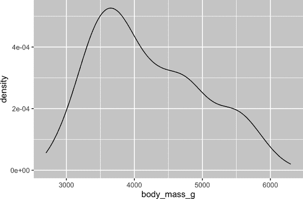

## 练习

1.  制作一个`penguins`的`species`条形图，将`species`分配给`y`美学。这个图与之前的有何不同？

1.  下面这两个图有何不同？哪个美学，`color`还是`fill`，更适合改变条形图的颜色？

    ```
    ggplot(penguins, aes(x = species)) +
      geom_bar(color = "red")

    ggplot(penguins, aes(x = species)) +
      geom_bar(fill = "red")
    ```

1.  [`geom_histogram()`](https://ggplot2.tidyverse.org/reference/geom_histogram.xhtml)中的`bins`参数是做什么用的？

1.  制作`diamonds`数据集中`carat`变量的直方图，该数据集在加载 tidyverse 包时可用。尝试不同的`binwidth`值。哪个值显示出最有趣的模式？

# 可视化关系

要可视化一个关系，我们需要将至少两个变量映射到绘图的美学上。在接下来的几节中，您将学习关于常用绘图来可视化两个或多个变量之间关系的绘图和用于创建它们的几何对象。

## 数值变量和分类变量

要可视化数值和分类变量之间的关系，我们可以使用并列箱线图。*箱线图*是描述分布的位置（百分位数）的一种视觉简写。它还有助于识别潜在的异常值。如图 1-1 所示，每个箱线图包括：

+   一个显示数据中间一半范围的方框，这个距离被称为*四分位距*（IQR），从分布的第 25 百分位到第 75 百分位延伸。在方框中间有一条显示分布中位数，即第 50 百分位的线。这三条线让你了解分布的扩展情况，以及分布是否关于中位数对称或偏向一侧。

+   显示落在箱子任一边缘 1.5 倍 IQR 之外的观察点的可视点。这些异常点很不寻常，因此单独绘制。

+   每个箱线图上都有一条线（或者叫做须），它从箱子的两端延伸出去，直到分布中最远的非异常点。

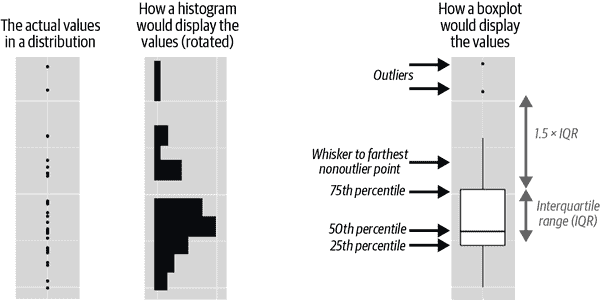

###### 图 1-1\. 展示了如何创建箱线图的示意图。

让我们来看看使用 [`geom_boxplot()`](https://ggplot2.tidyverse.org/reference/geom_boxplot.xhtml) 显示的各种企鹅体重分布：

```
ggplot(penguins, aes(x = species, y = body_mass_g)) +
  geom_boxplot()
```

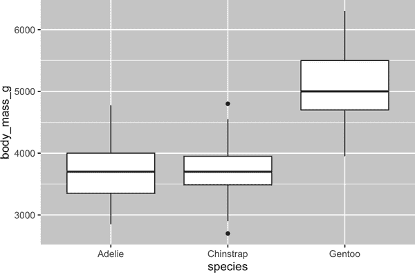

或者，我们可以使用 [`geom_density()`](https://ggplot2.tidyverse.org/reference/geom_density.xhtml) 制作密度图：

```
ggplot(penguins, aes(x = body_mass_g, color = species)) +
  geom_density(linewidth = 0.75)
```

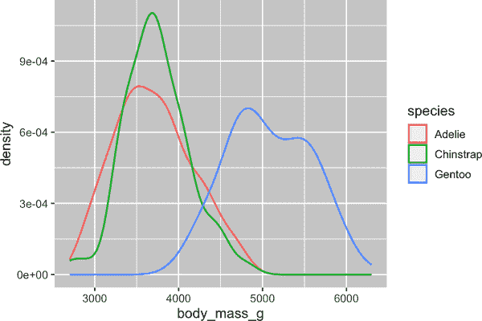

我们还使用 `linewidth` 参数自定义了线条的厚度，使其在背景中更加突出。

另外，我们还可以将 `species` 同时映射到 `color` 和 `fill` 美学，并使用 `alpha` 美学为填充的密度曲线增加透明度。该美学接受介于 0（完全透明）和 1（完全不透明）之间的值。在以下图中，它被设置为 0.5：

```
ggplot(penguins, aes(x = body_mass_g, color = species, fill = species)) +
  geom_density(alpha = 0.5)
```

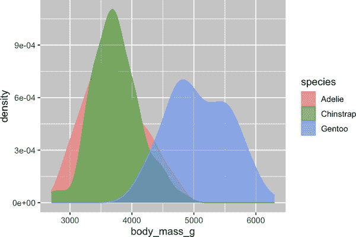

注意我们在这里使用的术语：

+   如果我们希望视觉属性根据变量的值而变化，我们可以将变量*映射*到美学。

+   否则，我们可以*设置*美学的值。

## 两个分类变量

我们可以使用堆叠条形图来可视化两个分类变量之间的关系。例如，以下两个堆叠条形图都显示了 `island` 和 `species` 之间的关系，或者具体来说，显示了每个岛上 `species` 的分布情况。

第一个图显示了每个岛上各种企鹅的频率。频率图显示每个岛上 Adelie 数量相等，但我们对每个岛内的百分比分布没有很好的感知。

```
ggplot(penguins, aes(x = island, fill = species)) +
  geom_bar()
```

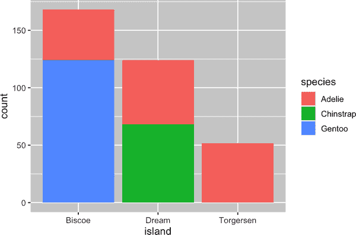

第二个图表是一个相对频率图，通过在几何体中设置`position = "fill"`创建，并且更适合比较物种在不同岛屿上的分布，因为它不受各岛屿企鹅数量不均匀分布的影响。使用此图表，我们可以看到 Gentoo 企鹅全部生活在 Biscoe 岛上，并占该岛企鹅总数的约 75%，Chinstrap 全部生活在 Dream 岛上，并占该岛企鹅总数的约 50%，而 Adelie 企鹅则生活在三个岛屿上，并占 Torgersen 岛上的所有企鹅。

```
ggplot(penguins, aes(x = island, fill = species)) +
  geom_bar(position = "fill")
```

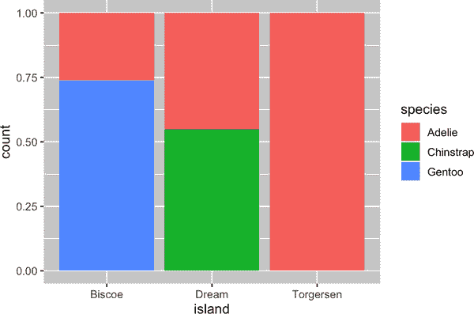

在创建这些条形图时，我们将将要分隔成条的变量映射到`x`美学属性上，将用于填充条形内颜色的变量映射到`fill`美学属性上。

## 两个数值变量

到目前为止，您已经学习了关于散点图（由[`geom_point()`](https://ggplot2.tidyverse.org/reference/geom_point.xhtml)创建）和平滑曲线（由[`geom_smooth()`](https://ggplot2.tidyverse.org/reference/geom_smooth.xhtml)创建）用于可视化两个数值变量之间关系的知识。散点图可能是最常用于展示两个数值变量之间关系的图表类型。

```
ggplot(penguins, aes(x = flipper_length_mm, y = body_mass_g)) +
  geom_point()
```


## 三个或更多变量

正如我们在“添加美学和图层”中看到的那样，我们可以通过将更多变量映射到额外的美学属性来将更多变量合并到一个图表中。例如，在以下散点图中，点的颜色表示物种，点的形状表示岛屿：

```
ggplot(penguins, aes(x = flipper_length_mm, y = body_mass_g)) +
  geom_point(aes(color = species, shape = island))
```

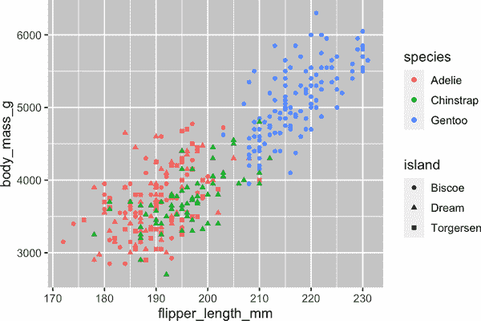

然而，向图表中添加过多的美学映射会使其变得混乱且难以理解。另一个选择，特别适用于分类变量的情况，是将图表拆分为*分面*，每个分面显示数据的一个子集。

要通过单一变量来划分你的图，使用[`facet_wrap()`](https://ggplot2.tidyverse.org/reference/facet_wrap.xhtml)。[`facet_wrap()`](https://ggplot2.tidyverse.org/reference/facet_wrap.xhtml)的第一个参数是一个公式，³，你用`~`后跟一个变量名来创建它。你传递给[`facet_wrap()`](https://ggplot2.tidyverse.org/reference/facet_wrap.xhtml)的变量应该是分类的。

```
ggplot(penguins, aes(x = flipper_length_mm, y = body_mass_g)) +
  geom_point(aes(color = species, shape = species)) +
  facet_wrap(~island)
```

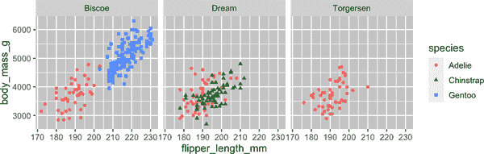

你将在第九章学习关于用于可视化变量分布和它们之间关系的许多其他几何图形。

## 练习

1.  与 ggplot2 软件包捆绑的`mpg`数据框包含了由美国环境保护局收集的 38 个车型的 234 个观测值。`mpg`中的哪些变量是分类变量？哪些是数值变量？（提示：输入[`?mpg`](https://ggplot2.tidyverse.org/reference/mpg.xhtml)来阅读数据集的文档。）当你运行`mpg`时，如何查看这些信息？

1.  利用`mpg`数据框绘制`hwy`与`displ`的散点图。接下来，将第三个数值变量映射到`color`、`size`、`color`和`size`以及`shape`。这些美学在分类变量和数值变量上表现有何不同？

1.  在`hwy`与`displ`的散点图中，如果将第三个变量映射到`linewidth`会发生什么？

1.  如果将同一变量映射到多个美学上会发生什么？

1.  制作`bill_depth_mm`与`bill_length_mm`的散点图，并按`species`着色。按物种着色的效果揭示了这两个变量之间的关系的什么？按物种分面又有什么不同？

1.  为什么以下操作会生成两个单独的图例？如何修复以合并这两个图例？

    ```
    ggplot(
      data = penguins,
      mapping = aes(
        x = bill_length_mm, y = bill_depth_mm, 
        color = species, shape = species
      )
    ) +
      geom_point() +
      labs(color = "Species")
    ```

1.  创建以下两个堆积条形图。第一个可以回答哪个问题？第二个可以回答哪个问题？

    ```
    ggplot(penguins, aes(x = island, fill = species)) +
      geom_bar(position = "fill")
    ggplot(penguins, aes(x = species, fill = island)) +
      geom_bar(position = "fill")
    ```

# 保存你的图

一旦你绘制了图，你可能想通过将其保存为可以在其他地方使用的图像来将其导出 R。这就是[`ggsave()`](https://ggplot2.tidyverse.org/reference/ggsave.xhtml)的工作方式，它将最近创建的图保存到磁盘上：

```
ggplot(penguins, aes(x = flipper_length_mm, y = body_mass_g)) +
  geom_point()
ggsave(filename = "penguin-plot.png")
```

这将把你的图保存到你的工作目录中，关于这个概念，你将在第六章中学到更多。

如果你没有指定`width`和`height`，它们将从当前绘图设备的尺寸中取值。为了可重现的代码，你需要指定它们。你可以在文档中了解更多关于[`ggsave()`](https://ggplot2.tidyverse.org/reference/ggsave.xhtml)的信息。

然而，我们推荐您使用 Quarto 来汇编最终报告，Quarto 是一个可复制的创作系统，允许您交替使用代码和散文，并自动将图表包含在您的写作中。您将在第二十八章更多地了解 Quarto。

## 练习

1.  运行以下代码行。哪一个图表保存为`mpg-plot.png`？为什么？

    ```
    ggplot(mpg, aes(x = class)) +
      geom_bar()
    ggplot(mpg, aes(x = cty, y = hwy)) +
      geom_point()
    ggsave("mpg-plot.png")
    ```

1.  在前面的代码中，您需要更改什么以将图表保存为 PDF 而不是 PNG？您如何找出[`ggsave()`](https://ggplot2.tidyverse.org/reference/ggsave.xhtml)支持哪些图像文件类型？

# 常见问题

当您开始运行 R 代码时，可能会遇到问题。别担心——这种情况发生在每个人身上。我们多年来一直在写 R 代码，但每天我们仍然会写出不起作用的代码！

首先，仔细比较您运行的代码与书中的代码。R 非常挑剔，一个错位的字符可能导致截然不同的结果。确保每个`（`都与一个`）`匹配，每个`"`都与另一个`"`配对。有时您运行代码却什么也不发生。检查您控制台的左侧：如果出现`+`，这意味着 R 认为您尚未输入完整的表达式，并且正在等待您完成它。在这种情况下，通过按下 Escape 键中止当前命令的处理，通常很容易重新开始。

创建 ggplot2 图形时的一个常见问题是将`+`放错位置：它必须放在行末，而不是行首。换句话说，请确保您没有意外地编写类似以下代码：

```
ggplot(data = mpg) 
+ geom_point(mapping = aes(x = displ, y = hwy))
```

如果您仍然被卡住，请尝试获取帮助。您可以通过在控制台中运行`?function_name`或在 RStudio 中高亮显示函数名称并按下 F1 来获取有关任何 R 函数的帮助。如果帮助似乎不太有用，请跳转到示例部分，并查找与您尝试完成的代码匹配的代码。

如果这些方法都无效，请仔细阅读错误消息。有时答案可能隐藏在其中！但是，当您刚开始使用 R 时，即使答案在错误消息中，您可能还不知道如何理解它。另一个好的工具是 Google：尝试搜索错误消息，因为很可能有人遇到过相同的问题并在线获得了帮助。

# 总结

在本章中，您已经学习了使用 ggplot2 进行数据可视化的基础知识。我们从支持 ggplot2 的基本思想开始：可视化是将数据中的变量映射到美学属性（如位置、颜色、大小和形状）的过程。然后，您学习了通过逐层添加图层来增加复杂性和改善图表的展示。您还了解了用于可视化单个变量分布以及可视化两个或多个变量之间关系的常用图表，通过额外的美学映射和/或将图表分割成小多个部分进行绘制。

我们将在整本书中反复使用可视化技术，根据需要引入新技术，并在第九章到第十一章深入探讨使用 ggplot2 创建可视化图表。

现在你已经了解了可视化的基础知识，接下来的章节我们将转变一下思路，给你一些实用的工作流建议。我们在本书的这一部分穿插工作流建议和数据科学工具，因为这将帮助你在编写越来越多的 R 代码时保持组织有序。

¹ 你可以通过使用 conflicted 包来消除该消息，并在需要时强制解决冲突。随着加载更多的包，使用 conflicted 包变得更为重要。你可以在[包网站](https://oreil.ly/01bKz)上了解更多有关 conflicted 的信息。

² Horst AM, Hill AP, Gorman KB (2020). palmerpenguins：帕尔默群岛（南极洲）企鹅数据。R 包版本 0.1.0。[*https://oreil.ly/ncwc5*](https://oreil.ly/ncwc5)。doi: 10.5281/zenodo.3960218。

³ 这里，“formula”是由`~`创建的对象名称，而不是“equation”的同义词。
